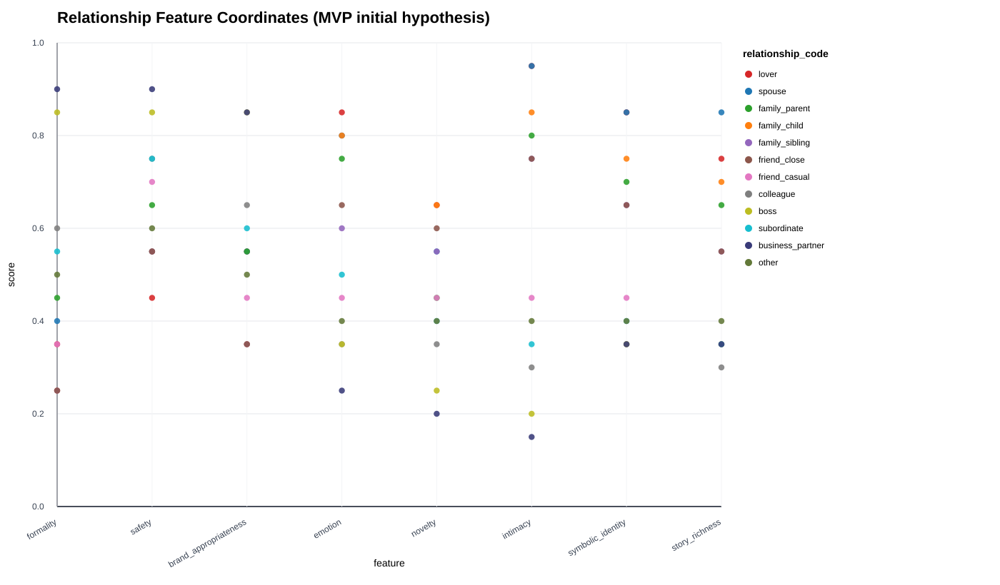
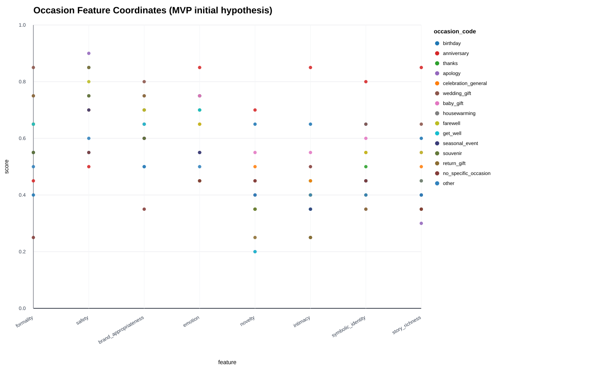
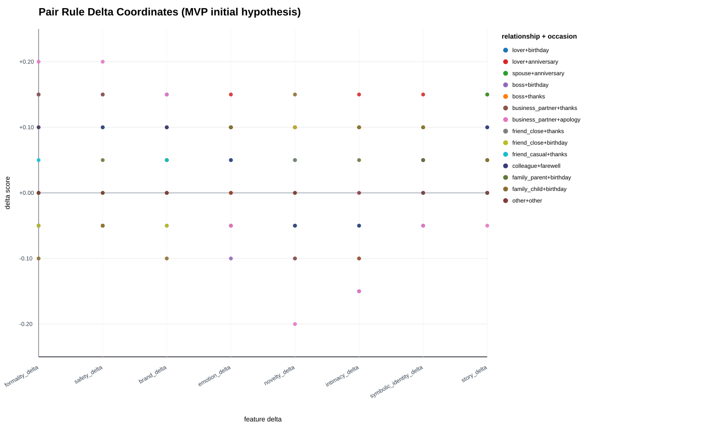
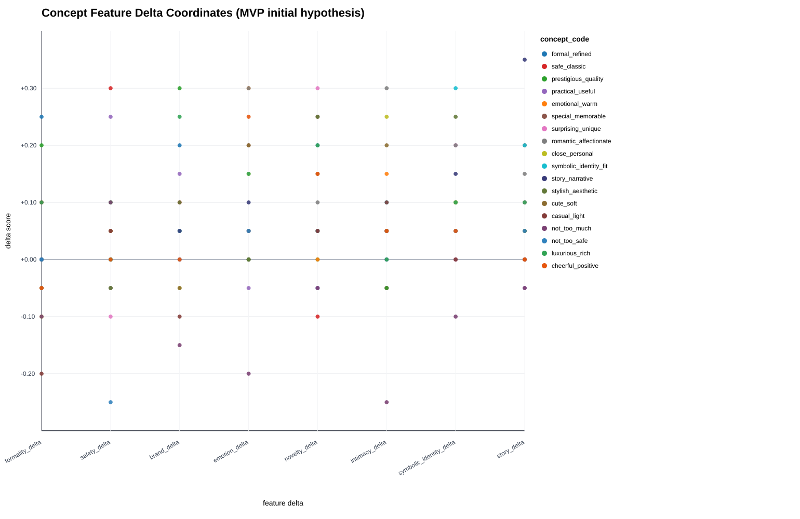
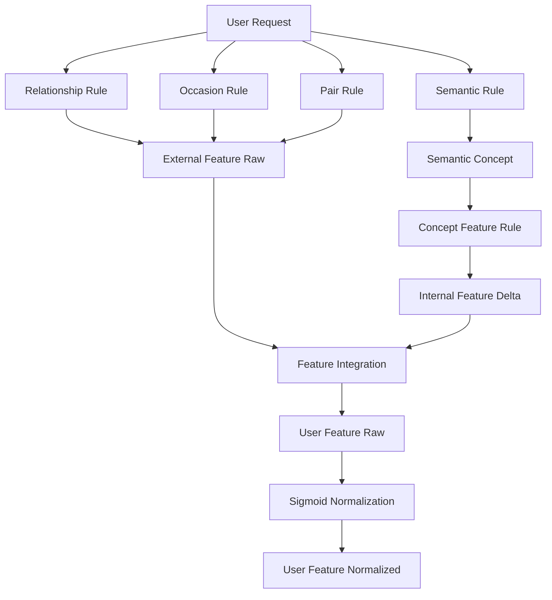
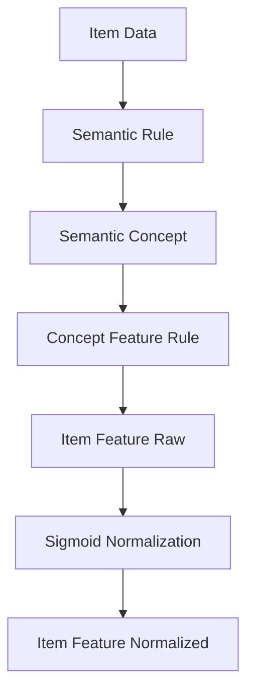

# Featureルール定義書

## 1. 概要

### 1.1 目的

本ドキュメントは、ギフトレコメンドサービスにおける `Featureルール` を定義する。

Featureルールとは、Relationship / Occasion / Semantic Concept などの入力情報を、8次元Feature値へ変換するためのルール群である。

```text
Relationship / Occasion / Semantic Concept
↓
Feature Rule
↓
Feature Raw Value
↓
Sigmoid Normalization
↓
Feature Normalized Value
↓
Gift Meaning Space
```

---

### 1.2 本ドキュメントの位置づけ

| 成果物                   | 本ドキュメントとの関係                            |
| ------------------------ | ------------------------------------------------- |
| Gift Meaning Space定義書 | FeatureをSocial / Symbolicへ射影する前提          |
| Feature定義書            | Feature値を生成する対象Featureを定義する          |
| Semantic Concept定義書   | Concept → Feature変換の入力Conceptを定義する      |
| Semanticルール定義書     | 入力文・商品情報 → Semantic Concept抽出を定義する |
| Matching定義書           | 生成されたFeature同士の比較方法を定義する         |
| Ranking定義書            | Matching結果を用いた最終順位決定を定義する        |

---

### 1.3 基本方針

- Featureルールは、意味情報をFeature値へ変換するためのルールである
- Featureルールは、`semantic_config_version` に紐づけて管理する
- MVPでは、ルールベースの初期仮説値として定義する
- 数値は絶対的な正解ではなく、評価・改善により更新する
- Ranking要素である `popularity_score` / `risk_score` / `final_score` は扱わない
- 予算条件・NG条件はFeature化せず、原則としてハードフィルタに分離する
- Feature値は `raw_value` と `normalized_value` を分離して扱う
- `raw_value` はルール適用後の意味の強弱を保持する
- `normalized_value` はsigmoid正規化により `0.0〜1.0` へ変換する
- `clip` は主正規化として使用せず、異常値対策の最終ガードに限定する

---

## 2. Featureルールの対象範囲

### 2.1 対象ルール

本ドキュメントでは、以下のルールを定義する。

| ルール種別           | 物理名                     | 内容                                                    |
| -------------------- | -------------------------- | ------------------------------------------------------- |
| Relationship Rule    | `relationship_rule`        | RelationshipからFeature基準値を生成する                 |
| Occasion Rule        | `occasion_rule`            | OccasionからFeature基準値を生成する                     |
| Pair Rule            | `pair_rule`                | Relationship × Occasion の組み合わせでFeatureを補正する |
| Concept Feature Rule | `concept_feature_rule`     | Semantic ConceptからFeature補正値を生成する             |
| Input Type Rule      | `input_type_rule`          | 好み・避けたい・NGなど入力種別ごとの適用方法            |
| Integration Rule     | `feature_integration_rule` | 複数Feature入力を統合する                               |
| Normalization Rule   | `normalization_rule`       | Feature raw値をnormalized値へ変換する                   |

---

### 2.2 対象外

| 対象外               | 理由                                       | 管理先               |
| -------------------- | ------------------------------------------ | -------------------- |
| Semantic Concept抽出 | 入力文からConceptを抽出する処理であるため  | Semanticルール定義書 |
| Feature定義そのもの  | Featureの意味定義であるため                | Feature定義書        |
| Feature距離計算      | User FeatureとItem Featureの比較であるため | Matching定義書       |
| final_score計算      | 最終順位決定ロジックであるため             | Ranking定義書        |
| 人気補正             | Featureではなく順位補正であるため          | Ranking定義書        |
| 予算条件             | 意味特徴ではなく絶対条件であるため         | Hard Filter          |
| NG条件               | 意味特徴ではなく絶対除外条件であるため     | Hard Filter          |

---

## 3. Feature Vector定義

### 3.1 Feature Vector順序

Featureルールの出力は、以下の8次元Feature Vectorとする。

```text
feature_vector = [
  formality,
  safety,
  brand_appropriateness,
  emotion,
  novelty,
  intimacy,
  symbolic_identity,
  story_richness
]
```

---

### 3.2 Feature分類

| 分類     | Feature               |
| -------- | --------------------- |
| Social   | formality             |
| Social   | safety                |
| Social   | brand_appropriateness |
| Symbolic | emotion               |
| Symbolic | novelty               |
| Symbolic | intimacy              |
| Symbolic | symbolic_identity     |
| Symbolic | story_richness        |

---

### 3.3 Feature値の種類

Feature値は、以下の2種類に分けて扱う。

| 種別               |                 値域 | 内容                     | 主な用途                                |
| ------------------ | -------------------: | ------------------------ | --------------------------------------- |
| `raw_value`        | 原則として制限しない | ルール適用後の未正規化値 | 推定結果保持、分析、正規化前の差分保持  |
| `normalized_value` |           `0.0〜1.0` | sigmoid正規化後の値      | Matching、Social/Symbolic射影、表示補助 |

---

### 3.4 raw_valueの扱い

`raw_value` は、Relationship Rule / Occasion Rule / Pair Rule / Concept Feature Rule を統合した計算結果である。

`raw_value` は、`0.0〜1.0` の範囲を超えることを許容する。

理由は、複数ルールの加算結果として生じる意味の強弱を保持するためである。

例：

| raw_value | 解釈                 |
| --------: | -------------------- |
|      0.80 | やや強い             |
|      1.10 | 強い                 |
|      1.50 | かなり強い           |
|     -0.10 | 弱い、または抑制方向 |

---

### 3.5 normalized_valueの扱い

`normalized_value` は、`raw_value` をsigmoid関数で `0.0〜1.0` に変換した値である。

Matching / Social・Symbolic射影では、原則として `normalized_value` を使用する。

```text
normalized_value = sigmoid(k_feature * (raw_value - center_feature))
```

```text
sigmoid(x) = 1 / (1 + exp(-x))
```

---

### 3.6 補正値の値域

Feature補正値は、原則として以下の範囲で扱う。

```text
-1.0 <= feature_delta <= 1.0
```

ただし、MVPでは過剰補正を避けるため、通常の補正値は `-0.30〜+0.30` 程度に収める。

---

### 3.7 clipの扱い

`clip` は主正規化として使用しない。

`clip` を主正規化に使うと、`1.05` / `1.30` / `1.80` のような値がすべて `1.00` に潰れ、意味の強弱が失われる。

そのため、本サービスでは以下の方針とする。

| 用途           | 方針                                   |
| -------------- | -------------------------------------- |
| 主正規化       | sigmoid正規化                          |
| 異常値対策     | 必要に応じて最終ガードとしてclipを許容 |
| Matching利用値 | normalized_value                       |
| raw値保持      | 必須                                   |

異常値対策としてclipを使う場合も、sigmoid後の値に対して最終安全処理としてのみ使用する。

```text
normalized_value = sigmoid_normalize(raw_value)

if normalized_value is NaN or infinite:
  handle_as_error_or_default

normalized_value = guard_clip(normalized_value, 0.0, 1.0)
```

---

## 4. Featureルールの全体構造

### 4.1 User Feature生成

User Featureは、以下から生成する。

```text
User Feature Raw
= Relationship Feature
+ Occasion Feature
+ Pair Feature Delta
+ Preferred Concept Feature Delta
+ Avoid Concept Feature Delta
+ Free Text Concept Feature Delta
```

正規化後は以下とする。

```text
User Feature Normalized
= sigmoid_normalize(User Feature Raw)
```

---

### 4.2 Item Feature生成

Item Featureは、以下から生成する。

```text
Item Feature Raw
= Neutral Base
+ Item Semantic Concept Feature Delta
+ Item Metadata Feature Delta
+ Item Review Feature Delta
```

正規化後は以下とする。

```text
Item Feature Normalized
= sigmoid_normalize(Item Feature Raw)
```

---

### 4.3 外部条件 / 内部条件

| 区分     | 入力                            | 内容                                |
| -------- | ------------------------------- | ----------------------------------- |
| 外部条件 | Relationship / Occasion         | 贈答文脈から生成されるFeature       |
| 内部条件 | 好み / 避けたい / 自由入力      | ユーザーの意図から生成されるFeature |
| 商品条件 | 商品名 / 説明 / タグ / レビュー | 商品が持つ意味から生成されるFeature |

---

## 5. Relationshipカテゴリ一覧

### 5.1 Relationship一覧

| relationship_code  | relationship_label | 説明             |
| ------------------ | ------------------ | ---------------- |
| `lover`            | 恋人               | 恋人・パートナー |
| `spouse`           | 配偶者             | 夫・妻           |
| `family_parent`    | 親                 | 父母             |
| `family_child`     | 子ども             | 子ども           |
| `family_sibling`   | 兄弟姉妹           | 兄弟・姉妹       |
| `friend_close`     | 親しい友人         | 仲の良い友人     |
| `friend_casual`    | 友人・知人         | 一般的な友人     |
| `colleague`        | 同僚               | 職場の同僚       |
| `boss`             | 上司               | 上司             |
| `subordinate`      | 部下・後輩         | 部下・後輩       |
| `business_partner` | 取引先             | 社外の取引先     |
| `other`            | その他             | 上記に該当しない |

---

## 6. Relationship Rule

### 6.1 役割

Relationship Ruleは、贈り手と受け手の関係性から、User Featureの基準値を生成する。

Relationshipは、主に以下のFeatureに影響する。

| 主な影響Feature       | 内容                             |
| --------------------- | -------------------------------- |
| formality             | 関係性がフォーマルか             |
| safety                | 外しにくさを重視すべきか         |
| brand_appropriateness | ブランド・格・品位を重視すべきか |
| intimacy              | 親密性をどの程度許容するか       |
| emotion               | 感情表現が自然か                 |

---

### 6.2 Relationship Feature基準値

以下はMVP初期仮説値である。

Relationship Feature基準値は `raw_value` の基準値として扱う。  
この時点では `0.0〜1.0` の範囲に収めるが、後続のPair DeltaやConcept Deltaの加算により、最終的なUser Feature Rawは範囲外になることを許容する。

| relationship_code  | formality | safety | brand_appropriateness | emotion | novelty | intimacy | symbolic_identity | story_richness |
| ------------------ | --------: | -----: | --------------------: | ------: | ------: | -------: | ----------------: | -------------: |
| `lover`            |      0.35 |   0.45 |                  0.55 |    0.85 |    0.65 |     0.95 |              0.85 |           0.75 |
| `spouse`           |      0.40 |   0.55 |                  0.55 |    0.80 |    0.55 |     0.95 |              0.85 |           0.85 |
| `family_parent`    |      0.45 |   0.65 |                  0.55 |    0.75 |    0.45 |     0.80 |              0.70 |           0.65 |
| `family_child`     |      0.25 |   0.55 |                  0.35 |    0.80 |    0.65 |     0.85 |              0.75 |           0.70 |
| `family_sibling`   |      0.25 |   0.55 |                  0.35 |    0.60 |    0.55 |     0.75 |              0.65 |           0.55 |
| `friend_close`     |      0.25 |   0.55 |                  0.35 |    0.65 |    0.60 |     0.75 |              0.65 |           0.55 |
| `friend_casual`    |      0.35 |   0.70 |                  0.45 |    0.45 |    0.45 |     0.45 |              0.45 |           0.35 |
| `colleague`        |      0.60 |   0.75 |                  0.65 |    0.35 |    0.35 |     0.30 |              0.35 |           0.30 |
| `boss`             |      0.85 |   0.85 |                  0.85 |    0.35 |    0.25 |     0.20 |              0.35 |           0.35 |
| `subordinate`      |      0.55 |   0.75 |                  0.60 |    0.50 |    0.40 |     0.35 |              0.40 |           0.35 |
| `business_partner` |      0.90 |   0.90 |                  0.85 |    0.25 |    0.20 |     0.15 |              0.35 |           0.35 |
| `other`            |      0.50 |   0.60 |                  0.50 |    0.40 |    0.40 |     0.40 |              0.40 |           0.40 |

Relationshipごとのfeature座標を散布図で示す。



---

### 6.3 Relationship Ruleの解釈

| パターン     | 解釈                                                 |
| ------------ | ---------------------------------------------------- |
| 恋人・配偶者 | intimacy / emotion / symbolic_identity が高い        |
| 親・家族     | emotion / intimacy が高いが、loverほど強くしない     |
| 親しい友人   | casual寄りで、novelty / intimacyを許容する           |
| 上司・取引先 | formality / safety / brand_appropriatenessを重視する |
| 同僚・部下   | businessとpersonalの中間として扱う                   |

---

## 7. Occasionカテゴリ一覧

### 7.1 Occasion一覧

| occasion_code          | occasion_label_jp | 説明             |
| ---------------------- | ----------------- | ---------------- |
| `birthday`             | 誕生日            | 誕生日祝い       |
| `anniversary`          | 記念日            | 交際・結婚記念日 |
| `thanks`               | お礼              | 感謝             |
| `apology`              | お詫び            | 謝罪             |
| `celebration_general`  | お祝い            | 汎用お祝い       |
| `wedding_gift`         | 結婚祝い          | 結婚関連         |
| `baby_gift`            | 出産祝い          | 出産             |
| `housewarming`         | 新居祝い          | 引越し           |
| `farewell`             | 送別              | 退職・異動       |
| `get_well`             | お見舞い          | 病気             |
| `seasonal_event`       | 季節イベント      | 母の日など       |
| `souvenir`             | 手土産            | 訪問             |
| `return_gift`          | お返し            | 内祝い           |
| `no_specific_occasion` | 特別な理由なし    | 日常ギフト       |
| `other`                | その他            | その他           |

---

## 8. Occasion Rule

### 8.1 役割

Occasion Ruleは、贈答目的・場面から、User Featureの基準値を生成する。

Occasionは、主に以下のFeatureに影響する。

| 主な影響Feature | 内容                       |
| --------------- | -------------------------- |
| formality       | 儀礼的な用途か             |
| safety          | 失敗回避を重視すべきか     |
| emotion         | 感情表現が必要か           |
| novelty         | 特別感・記念性が必要か     |
| story_richness  | 選定理由を語る必要があるか |

---

### 8.2 Occasion Feature基準値

以下はMVP初期仮説値である。

Occasion Feature基準値は `raw_value` の基準値として扱う。  
この時点では `0.0〜1.0` の範囲に収めるが、後続のPair DeltaやConcept Deltaの加算により、最終的なUser Feature Rawは範囲外になることを許容する。

| occasion_code          | formality | safety | brand_appropriateness | emotion | novelty | intimacy | symbolic_identity | story_richness |
| ---------------------- | --------: | -----: | --------------------: | ------: | ------: | -------: | ----------------: | -------------: |
| `birthday`             |      0.40 |   0.55 |                  0.50 |    0.75 |    0.65 |     0.65 |              0.65 |           0.60 |
| `anniversary`          |      0.45 |   0.50 |                  0.60 |    0.85 |    0.70 |     0.85 |              0.80 |           0.85 |
| `thanks`               |      0.55 |   0.75 |                  0.65 |    0.70 |    0.35 |     0.45 |              0.50 |           0.45 |
| `apology`              |      0.75 |   0.90 |                  0.75 |    0.55 |    0.20 |     0.25 |              0.35 |           0.30 |
| `celebration_general`  |      0.65 |   0.70 |                  0.70 |    0.65 |    0.50 |     0.45 |              0.55 |           0.50 |
| `wedding_gift`         |      0.85 |   0.85 |                  0.80 |    0.75 |    0.45 |     0.40 |              0.65 |           0.65 |
| `baby_gift`            |      0.65 |   0.75 |                  0.65 |    0.75 |    0.55 |     0.55 |              0.60 |           0.55 |
| `housewarming`         |      0.65 |   0.75 |                  0.70 |    0.55 |    0.35 |     0.35 |              0.45 |           0.45 |
| `farewell`             |      0.65 |   0.80 |                  0.70 |    0.65 |    0.35 |     0.40 |              0.55 |           0.55 |
| `get_well`             |      0.65 |   0.85 |                  0.65 |    0.70 |    0.20 |     0.35 |              0.45 |           0.40 |
| `seasonal_event`       |      0.55 |   0.70 |                  0.60 |    0.55 |    0.40 |     0.35 |              0.45 |           0.40 |
| `souvenir`             |      0.55 |   0.75 |                  0.60 |    0.45 |    0.35 |     0.25 |              0.40 |           0.35 |
| `return_gift`          |      0.75 |   0.85 |                  0.75 |    0.45 |    0.25 |     0.25 |              0.35 |           0.35 |
| `no_specific_occasion` |      0.25 |   0.55 |                  0.35 |    0.45 |    0.45 |     0.50 |              0.45 |           0.35 |
| `other`                |      0.50 |   0.60 |                  0.50 |    0.50 |    0.40 |     0.40 |              0.40 |           0.40 |

Occasionごとのfeature座標を散布図で示す。



---

### 8.3 Occasion Ruleの解釈

| パターン           | 解釈                                                  |
| ------------------ | ----------------------------------------------------- |
| 誕生日・記念日     | emotion / novelty / symbolic_identityを重視する       |
| お礼・お返し       | safety / formalityを重視する                          |
| お詫び             | safety / formalityを強く重視し、noveltyは抑える       |
| 結婚祝い・出産祝い | formality / emotion / brand_appropriatenessを重視する |
| 手土産             | safety / formalityを重視し、intimacyは抑える          |
| 特別な理由なし     | casual寄りで、過剰なformalityは不要                   |

---

## 9. Pair Rule

### 9.1 役割

Pair Ruleは、Relationship単体・Occasion単体では表現できない組み合わせ効果を補正する。

```text
Pair Rule = Relationship × Occasion → Feature Delta
```

例：

| Relationship     | Occasion | 補正の必要性                   |
| ---------------- | -------- | ------------------------------ |
| boss             | birthday | 誕生日でも親密に寄せすぎない   |
| lover            | birthday | 感情・親密性・特別感を強める   |
| business_partner | apology  | 安全性・儀礼性をさらに強める   |
| friend_close     | thanks   | カジュアルさと温かさを両立する |

---

### 9.2 Pair Rule適用方針

MVPでは、全組み合わせを網羅しない。  
意味が大きく変わる代表的な組み合わせのみ、明示的に補正する。

未定義の組み合わせは、補正なしとする。

```text
if pair_rule exists:
  apply pair_delta
else:
  pair_delta = 0
```

---

### 9.3 Pair Rule一覧

以下はMVP初期仮説値である。

| relationship_code  | occasion_code | formality_delta | safety_delta | brand_delta | emotion_delta | novelty_delta | intimacy_delta | symbolic_identity_delta | story_delta | 意図                                 |
| ------------------ | ------------- | --------------: | -----------: | ----------: | ------------: | ------------: | -------------: | ----------------------: | ----------: | ------------------------------------ |
| `lover`            | `birthday`    |           -0.05 |        -0.05 |        0.00 |         +0.10 |         +0.10 |          +0.10 |                   +0.10 |       +0.10 | 恋人の誕生日は意味性・特別感を強める |
| `lover`            | `anniversary` |            0.00 |        -0.05 |       +0.05 |         +0.15 |         +0.10 |          +0.15 |                   +0.15 |       +0.15 | 記念日は感情・ストーリー性を強める   |
| `spouse`           | `anniversary` |            0.00 |         0.00 |       +0.05 |         +0.10 |         +0.05 |          +0.10 |                   +0.10 |       +0.15 | 長期関係の文脈を強める               |
| `boss`             | `birthday`    |           +0.15 |        +0.15 |       +0.15 |         -0.10 |         -0.10 |          -0.15 |                   -0.05 |        0.00 | 上司の誕生日は親密に寄せすぎない     |
| `boss`             | `thanks`      |           +0.10 |        +0.10 |       +0.10 |          0.00 |         -0.05 |          -0.10 |                    0.00 |        0.00 | お礼は礼儀・安全性を重視する         |
| `business_partner` | `thanks`      |           +0.15 |        +0.15 |       +0.10 |         -0.05 |         -0.10 |          -0.10 |                    0.00 |        0.00 | 取引先へのお礼は儀礼性を強める       |
| `business_partner` | `apology`     |           +0.20 |        +0.20 |       +0.15 |         -0.05 |         -0.20 |          -0.15 |                   -0.05 |       -0.05 | 謝罪は攻めた意味性を抑える           |
| `friend_close`     | `thanks`      |           -0.05 |        -0.05 |       -0.05 |         +0.10 |         +0.05 |          +0.10 |                   +0.05 |       +0.05 | 親しい友人へのお礼は温かさを足す     |
| `friend_close`     | `birthday`    |           -0.05 |        -0.05 |       -0.05 |         +0.10 |         +0.10 |          +0.10 |                   +0.10 |       +0.05 | カジュアルな特別感を強める           |
| `friend_casual`    | `thanks`      |           +0.05 |        +0.10 |       +0.05 |         +0.05 |         -0.05 |          -0.05 |                    0.00 |        0.00 | 一般的な友人には安全性を少し高める   |
| `colleague`        | `farewell`    |           +0.10 |        +0.10 |       +0.10 |         +0.05 |         -0.05 |          -0.05 |                   +0.05 |       +0.10 | 送別は礼儀とストーリー性を足す       |
| `family_parent`    | `birthday`    |            0.00 |        +0.05 |        0.00 |         +0.10 |          0.00 |          +0.05 |                   +0.05 |       +0.05 | 親への誕生日は感謝・温かさを強める   |
| `family_child`     | `birthday`    |           -0.10 |        -0.05 |       -0.10 |         +0.10 |         +0.15 |          +0.10 |                   +0.10 |       +0.05 | 子ども向けは楽しさ・特別感を強める   |
| `other`            | `other`       |            0.00 |         0.00 |        0.00 |          0.00 |          0.00 |           0.00 |                    0.00 |        0.00 | 補正なし                             |

Pair Ruleごとのfeature補正量を散布図で示す。



---

## 10. Semantic Concept Feature Rule

### 10.1 役割

Concept Feature Ruleは、Semantic ConceptをFeature補正値へ変換する。

```text
Semantic Concept
↓
concept_feature_rule
↓
Feature Delta
```

---

### 10.2 Concept Feature Ruleの考え方

Semantic ConceptはFeatureそのものではない。  
そのため、Conceptごとに「どのFeatureに、どれくらい影響するか」を定義する。

例：

```text
formal_refined
→ formality +0.25
→ brand_appropriateness +0.20
```

---

### 10.3 Concept Feature Rule一覧

以下はMVP初期仮説値である。

| concept_code            | formality_delta | safety_delta | brand_delta | emotion_delta | novelty_delta | intimacy_delta | symbolic_identity_delta | story_delta |
| ----------------------- | --------------: | -----------: | ----------: | ------------: | ------------: | -------------: | ----------------------: | ----------: |
| `formal_refined`        |           +0.25 |        +0.05 |       +0.20 |          0.00 |         -0.05 |          -0.05 |                   +0.05 |        0.00 |
| `safe_classic`          |           +0.10 |        +0.30 |       +0.10 |          0.00 |         -0.10 |          -0.05 |                    0.00 |        0.00 |
| `prestigious_quality`   |           +0.20 |        +0.10 |       +0.30 |          0.00 |          0.00 |          -0.05 |                   +0.10 |       +0.10 |
| `practical_useful`      |            0.00 |        +0.25 |       +0.15 |         -0.05 |         -0.05 |           0.00 |                    0.00 |       -0.05 |
| `emotional_warm`        |            0.00 |        +0.05 |        0.00 |         +0.30 |          0.00 |          +0.15 |                   +0.05 |       +0.05 |
| `special_memorable`     |            0.00 |        -0.05 |       +0.05 |         +0.20 |         +0.25 |          +0.05 |                   +0.10 |       +0.20 |
| `surprising_unique`     |           -0.05 |        -0.10 |        0.00 |         +0.05 |         +0.30 |          +0.05 |                   +0.20 |       +0.10 |
| `romantic_affectionate` |           -0.05 |        -0.05 |       +0.05 |         +0.30 |         +0.10 |          +0.30 |                   +0.20 |       +0.15 |
| `close_personal`        |           -0.10 |         0.00 |       -0.05 |         +0.15 |         +0.05 |          +0.25 |                   +0.10 |       +0.05 |
| `symbolic_identity_fit` |            0.00 |         0.00 |       +0.05 |         +0.05 |         +0.05 |          +0.10 |                   +0.30 |       +0.20 |
| `story_narrative`       |            0.00 |         0.00 |       +0.05 |         +0.10 |         +0.05 |          +0.05 |                   +0.15 |       +0.35 |
| `stylish_aesthetic`     |           -0.05 |        -0.05 |       +0.10 |          0.00 |         +0.25 |          +0.05 |                   +0.25 |       +0.05 |
| `cute_soft`             |           -0.05 |        +0.05 |       -0.05 |         +0.20 |         +0.15 |          +0.20 |                   +0.05 |        0.00 |
| `casual_light`          |           -0.20 |        +0.05 |       -0.10 |         +0.05 |         +0.05 |          +0.10 |                    0.00 |        0.00 |
| `not_too_much`          |           -0.10 |        +0.10 |       -0.15 |         -0.20 |         -0.05 |          -0.25 |                   -0.10 |       -0.05 |
| `not_too_safe`          |            0.00 |        -0.25 |        0.00 |         +0.05 |         +0.20 |           0.00 |                   +0.05 |       +0.05 |
| `luxurious_rich`        |           +0.10 |         0.00 |       +0.25 |         +0.15 |         +0.20 |           0.00 |                   +0.10 |       +0.10 |
| `cheerful_positive`     |           -0.05 |         0.00 |        0.00 |         +0.25 |         +0.15 |          +0.05 |                   +0.05 |        0.00 |

Conceptごとのfeature補正量を散布図で示す。



---

### 10.4 Concept Feature Ruleの注意点

| 注意点                   | 内容                                                    |
| ------------------------ | ------------------------------------------------------- |
| 数値は初期仮説           | 実データ・人手評価で見直す                              |
| ConceptはFeatureではない | Featureへの影響量として定義する                         |
| 負の補正を許容する       | 「無難すぎない」「重すぎない」などを扱うため            |
| 過剰補正を避ける         | MVPでは補正値を小さめに保つ                             |
| 文脈依存を考慮する       | Relationship / Occasion / Pair Ruleと統合して判断する   |
| raw値を潰さない          | 複数Conceptの強弱はraw_valueに保持し、sigmoidで圧縮する |

---

## 11. Input Type Rule

### 11.1 入力種別

ユーザー入力は、Featureルール適用上、以下に分類する。

| 入力種別                | 内容         | Featureルール上の扱い                 |
| ----------------------- | ------------ | ------------------------------------- |
| relationship            | 関係性       | Relationship Ruleを適用               |
| occasion                | 贈答目的     | Occasion Ruleを適用                   |
| preferred_condition     | 好み条件     | Concept Feature Deltaを加算           |
| non_preferred_condition | 避けたい条件 | Concept Feature Deltaを反転または抑制 |
| ng_condition            | 絶対NG条件   | Feature化せずHard Filter              |
| budget_condition        | 予算条件     | Feature化せずHard Filter              |
| free_text               | 自由入力     | Semantic Concept抽出後に適用          |

---

### 11.2 好み条件

好み条件では、抽出されたSemantic ConceptのFeature Deltaを原則として加算する。

```text
preferred_condition
↓
Semantic Concept
↓
Concept Feature Delta
↓
User Feature Rawに加算
```

例：

```text
「特別感があるものがいい」
↓
special_memorable
↓
novelty / emotion / story_richness を高める
```

---

### 11.3 避けたい条件

避けたい条件では、抽出されたSemantic ConceptのFeature Deltaを原則として反転する。

```text
non_preferred_condition
↓
Semantic Concept
↓
Concept Feature Delta × -1
↓
User Feature Rawに加算
```

例：

```text
「高級すぎるものは避けたい」
↓
prestigious_quality
↓
brand_appropriateness / formality の過剰寄与を抑制
```

---

### 11.4 否定Conceptの扱い

`not_too_much` や `not_too_safe` のような否定Conceptは、Concept自体に補正方向を持つ。

そのため、好み条件で入力された場合は、定義済みDeltaをそのまま適用する。

例：

```text
「無難すぎないものがいい」
↓
not_too_safe
↓
safetyを抑え、noveltyを少し高める
```

---

### 11.5 NG条件

NG条件は、FeatureルールではなくHard Filterへ分離する。

| 入力例             | 扱い                               |
| ------------------ | ---------------------------------- |
| アルコールはNG     | category / keyword hard_filter     |
| 香りが強いものはNG | hard_filter または avoid condition |
| 生ものは避けたい   | hard_filter                        |
| 予算は5,000円以内  | budget_condition                   |
| 赤色はNG           | item_attribute hard_filter         |

---

## 12. Feature Integration Rule

### 12.1 統合対象

User Feature生成では、以下を統合する。

| 入力                    | 種別   |
| ----------------------- | ------ |
| Relationship Feature    | 基準値 |
| Occasion Feature        | 基準値 |
| Pair Feature Delta      | 補正値 |
| Preferred Concept Delta | 補正値 |
| Avoid Concept Delta     | 補正値 |
| Free Text Concept Delta | 補正値 |

---

### 12.2 統合式

MVPでは、以下の簡易式を採用する。

```text
external_feature_raw
= weighted_average(
    relationship_feature,
    occasion_feature
  )
+ pair_delta
```

```text
internal_feature_delta
= preferred_delta
+ avoid_delta
+ free_text_delta
```

```text
user_feature_raw
= external_feature_raw
+ internal_feature_delta
```

```text
user_feature_normalized
= sigmoid_normalize(user_feature_raw)
```

---

### 12.3 初期重み

MVP初期値は以下とする。

| 入力                 | weight | 理由                                   |
| -------------------- | -----: | -------------------------------------- |
| relationship_feature |   0.50 | 関係性はギフト適切性に強く影響する     |
| occasion_feature     |   0.50 | 用途もギフト適切性に強く影響する       |
| pair_delta           |   1.00 | 組み合わせ補正は明示的な補正として扱う |
| preferred_delta      |   1.00 | ユーザーの好み条件を反映する           |
| avoid_delta          |   1.00 | 避けたい条件を反映する                 |
| free_text_delta      |   0.70 | 自由入力は曖昧性があるためやや弱める   |

---

### 12.4 信頼度による補正

Semantic Concept抽出に信頼度 `confidence` がある場合、Deltaに掛ける。

```text
effective_delta = concept_delta * confidence
```

| confidence | 解釈       |
| ---------: | ---------- |
|        1.0 | 高信頼     |
|        0.7 | 通常       |
|        0.4 | 弱い推定   |
|        0.0 | 適用しない |

---

### 12.5 正規化前後の保持

User Feature生成では、以下を両方保持する。

| 値                        | 内容                     |
| ------------------------- | ------------------------ |
| `user_feature_raw`        | ルール統合後の未正規化値 |
| `user_feature_normalized` | sigmoid正規化後の0〜1値  |

`raw_value` を保持することで、後続の評価・分布監視・ルール改善で「なぜ値が高くなったか」を分析できる。

---

## 13. Item Feature Rule

### 13.1 Item Feature生成の考え方

Item Featureは、商品情報から抽出されたSemantic ConceptをFeatureへ変換して生成する。

```text
Item Data
↓
Semantic Concept
↓
Concept Feature Rule
↓
Item Feature Raw
↓
Sigmoid Normalization
↓
Item Feature Normalized
```

---

### 13.2 商品情報ソース

| source_type      | 内容           | weight初期値 |
| ---------------- | -------------- | -----------: |
| item_name        | 商品名         |         0.80 |
| item_caption     | キャッチコピー |         0.90 |
| item_description | 商品説明       |         1.00 |
| item_genre       | 商品ジャンル   |         0.60 |
| item_tag         | 商品タグ       |         0.70 |
| item_review      | レビュー文     |         0.50 |
| item_brand       | ブランド情報   |         0.80 |
| item_price       | 価格情報       |         0.30 |

---

### 13.3 Item Feature統合式

Item Featureは、Relationship / Occasionのような明示的な基準値を持たないため、MVPでは中立値を起点とする。

```text
neutral_base = 0.5
```

```text
item_feature_raw
= neutral_base
+ Σ(concept_feature_delta * source_weight * confidence)
```

```text
item_feature_normalized
= sigmoid_normalize(item_feature_raw)
```

---

### 13.4 中立値を置く理由

Item Featureで `neutral_base = 0.5` を置く理由は、Conceptが抽出されない商品を中立状態として扱うためである。

| ケース             | neutral_baseなし                         | neutral_baseあり                |
| ------------------ | ---------------------------------------- | ------------------------------- |
| Concept抽出なし    | raw=0.0となり、低Feature扱いになりやすい | raw=0.5となり、中立扱いにできる |
| 情報量が少ない商品 | 不当に低評価される                       | 過度な低評価を避けられる        |
| Conceptが強い商品  | Deltaで上下に動く                        | Deltaで上下に動く               |

---

### 13.5 商品情報ソース別の注意点

| source_type      | 注意点                                  |
| ---------------- | --------------------------------------- |
| item_name        | 短文のため過剰解釈しない                |
| item_caption     | 販促表現が強いため過信しない            |
| item_description | 最も意味情報を取りやすい                |
| item_genre       | 粗い分類のため補助扱い                  |
| item_tag         | ノイズを含む可能性がある                |
| item_review      | ユーザー評価由来で有用だが偏りがある    |
| item_brand       | brand_appropriatenessに効きやすい       |
| item_price       | Featureではなく条件・補助情報として扱う |

---

## 14. Feature正規化ルール

### 14.1 正規化の目的

Feature正規化の目的は、`raw_value` に保持された意味の強弱をできるだけ残しながら、Matchingや射影で扱いやすい `0.0〜1.0` の値へ変換することである。

---

### 14.2 採用方式

MVPでは、固定パラメータによるsigmoid正規化を採用する。

```text
normalized_value = sigmoid(k_feature * (raw_value - center_feature))
```

```text
sigmoid(x) = 1 / (1 + exp(-x))
```

---

### 14.3 初期パラメータ

MVP初期では、全Feature共通で以下を採用する。

| パラメータ       | 初期値 | 内容     |
| ---------------- | -----: | -------- |
| `center_feature` |    0.5 | 中立点   |
| `k_feature`      |    4.0 | 感度係数 |

---

### 14.4 パラメータの意味

| パラメータ       | 影響                                             |
| ---------------- | ------------------------------------------------ |
| `center_feature` | この値のときnormalized_valueが0.5になる          |
| `k_feature`      | 大きいほど差が強調され、小さいほどなだらかになる |

例：

```text
raw_value = 0.5
center = 0.5
k = 4.0

normalized_value = 0.5
```

---

### 14.5 sigmoid正規化の特徴

| 特徴       | 内容                         |
| ---------- | ---------------------------- |
| 値域制御   | 出力を0.0〜1.0に収められる   |
| 順序保持   | raw値の大小関係を保持できる  |
| 飽和抑制   | 極端な値は緩やかに圧縮される |
| 差分保持   | clipよりも値の違いを残せる   |
| 実装容易性 | MVPで実装しやすい            |

---

### 14.6 clipとの違い

| raw_value | clip結果 |        sigmoid結果の傾向 |
| --------: | -------: | -----------------------: |
|      1.05 |     1.00 |   高いが1.00には潰れない |
|      1.30 |     1.00 | 1.05より高い値として残る |
|      1.80 |     1.00 | 1.30より高い値として残る |

clipでは差が消えるが、sigmoidでは差が圧縮されつつ残る。

---

### 14.7 将来拡張

評価データ・Feature分布が蓄積された後は、Featureごとの平均・標準偏差を利用した `z-score + sigmoid` へ拡張する。

```text
z = (raw_value - μ_feature) / σ_feature
normalized_value = sigmoid(z)
```

| 項目        | 内容                  |
| ----------- | --------------------- |
| `μ_feature` | Featureごとの平均     |
| `σ_feature` | Featureごとの標準偏差 |
| `sigmoid`   | 0〜1への圧縮          |

---

### 14.8 正規化パラメータの管理

正規化パラメータは、`semantic_config_version` に含める。

理由は、正規化は「意味の作り方」に影響するためである。

| パラメータ           | 管理先                                           |
| -------------------- | ------------------------------------------------ |
| center_feature       | semantic_config_version                          |
| k_feature            | semantic_config_version                          |
| normalization_method | semantic_config_version                          |
| 将来のμ / σ          | semantic_config_version または統計量管理テーブル |

---

## 15. Hard Filter分離ルール

### 15.1 Feature化しない条件

以下はFeature化しない。

| 条件                  | 理由                         | 管理先       |
| --------------------- | ---------------------------- | ------------ |
| budgetMin / budgetMax | 価格範囲の絶対条件であるため | Hard Filter  |
| NGカテゴリ            | 絶対除外条件であるため       | Hard Filter  |
| 在庫なし              | 推薦不能であるため           | availability |
| 販売停止              | 推薦不能であるため           | availability |
| 配送不可              | EC条件であるため             | 将来拡張     |
| 禁止キーワード        | 絶対除外条件であるため       | Hard Filter  |

---

### 15.2 avoid条件との違い

| 種別   | 例                       | 扱い        |
| ------ | ------------------------ | ----------- |
| avoid  | 無難すぎるものは避けたい | Feature補正 |
| NG     | アルコールはNG           | Hard Filter |
| budget | 5,000円以内              | Hard Filter |

---

### 15.3 判断基準

| 判断        | 条件                             |
| ----------- | -------------------------------- |
| Hard Filter | その商品を絶対に出してはいけない |
| Feature補正 | できれば避けたい・弱めたい       |
| Ranking補正 | 出してよいが順位を調整したい     |

---

## 16. Semantic Config Versionとの関係

### 16.1 semantic_config_versionに含めるもの

Featureルールは、すべて `semantic_config_version` に紐づけて管理する。

| ルール                  | 管理対象                                |
| ----------------------- | --------------------------------------- |
| relationship_rule       | Relationship → Feature                  |
| occasion_rule           | Occasion → Feature                      |
| pair_rule               | Relationship × Occasion → Feature Delta |
| concept_feature_rule    | Semantic Concept → Feature Delta        |
| integration_rule        | Feature統合ルール                       |
| normalization_rule      | Feature値の正規化ルール                 |
| normalization_parameter | sigmoidのcenter / k等                   |
| raw_value_policy        | raw値保持方針                           |

---

### 16.2 model_versionに含めない理由

Featureルールは「意味の作り方」である。  
そのため、順位決定ロジックである `model_version` には含めない。

| 項目                  | 管理先                  |
| --------------------- | ----------------------- |
| Feature生成           | semantic_config_version |
| Feature正規化         | semantic_config_version |
| Social / Symbolic射影 | semantic_config_version |
| context_score計算     | model_version           |
| popularity_score      | model_version           |
| risk_score            | model_version           |
| final_score           | model_version           |

---

## 17. DB・実装上の扱い

### 17.1 relationship_rule

論理的には以下の項目を持つ。

| 項目                       | 内容                            |
| -------------------------- | ------------------------------- |
| relationship_rule_id       | ルールID                        |
| semantic_config_version_id | 意味定義バージョン              |
| relationship_code          | Relationshipコード              |
| feature_code               | Featureコード                   |
| feature_base_value         | Relationship由来のFeature基準値 |
| is_active                  | 有効フラグ                      |

---

### 17.2 occasion_rule

| 項目                       | 内容                        |
| -------------------------- | --------------------------- |
| occasion_rule_id           | ルールID                    |
| semantic_config_version_id | 意味定義バージョン          |
| occasion_code              | Occasionコード              |
| feature_code               | Featureコード               |
| feature_base_value         | Occasion由来のFeature基準値 |
| is_active                  | 有効フラグ                  |

---

### 17.3 pair_rule

| 項目                       | 内容               |
| -------------------------- | ------------------ |
| pair_rule_id               | ルールID           |
| semantic_config_version_id | 意味定義バージョン |
| relationship_code          | Relationshipコード |
| occasion_code              | Occasionコード     |
| feature_code               | Featureコード      |
| feature_delta              | Feature補正値      |
| is_active                  | 有効フラグ         |

---

### 17.4 concept_feature_rule

| 項目                       | 内容                        |
| -------------------------- | --------------------------- |
| concept_feature_rule_id    | ルールID                    |
| semantic_config_version_id | 意味定義バージョン          |
| concept_code               | Semantic Conceptコード      |
| feature_code               | Featureコード               |
| feature_delta              | Feature補正値               |
| polarity                   | positive / negative / mixed |
| is_active                  | 有効フラグ                  |

---

### 17.5 normalization_rule

| 項目                       | 内容                             |
| -------------------------- | -------------------------------- |
| normalization_rule_id      | 正規化ルールID                   |
| semantic_config_version_id | 意味定義バージョン               |
| feature_code               | Featureコード                    |
| normalization_method       | `sigmoid` / `z_score_sigmoid` 等 |
| center_value               | sigmoidの中心値                  |
| k_value                    | sigmoidの感度係数                |
| is_active                  | 有効フラグ                       |

---

### 17.6 Feature生成結果

User Feature / Item Featureの生成結果は、論理的には以下を保持する。

| 項目                       | 内容                        |
| -------------------------- | --------------------------- |
| target_type                | `user` / `item`             |
| target_id                  | user_request_id / item_id等 |
| feature_code               | Featureコード               |
| raw_value                  | 未正規化Feature値           |
| normalized_value           | sigmoid正規化後Feature値    |
| semantic_config_version_id | 使用した意味定義バージョン  |
| generated_at               | 生成日時                    |

---

### 17.7 実装形式

MVPでは、以下のいずれも許容する。

| 方式                    | 内容                   | MVP適性 |
| ----------------------- | ---------------------- | ------- |
| DBテーブル              | ルールをDBで管理       | 中      |
| YAML / JSON             | ルールをファイルで管理 | 高      |
| TypeScript / Python定数 | コード内定数として管理 | 中      |
| SQL seed                | 初期データとして投入   | 高      |

MVPでは、変更頻度と実装容易性を考慮し、`YAML / JSON + seed投入` を推奨する。

---

## 18. ルール適用フロー

### 18.1 User Feature生成フロー



---

### 18.2 Item Feature生成フロー



---

## 19. 品質・レビュー観点

### 19.1 ルールレビュー観点

| 観点            | 確認内容                                                  |
| --------------- | --------------------------------------------------------- |
| 意味妥当性      | 人間の感覚と大きくズレていないか                          |
| 過剰補正        | 特定Featureが常に高くなりすぎないか                       |
| 相関過多        | 複数Featureが常に同じ動きをしていないか                   |
| 文脈適合        | Relationship / Occasionの組み合わせが自然か               |
| 説明可能性      | なぜそのFeature値になるか説明できるか                     |
| MVP適性         | 初期検証として複雑すぎないか                              |
| 正規化妥当性    | sigmoidにより値が過度に中央寄り・飽和寄りになっていないか |
| raw値分析可能性 | raw_valueからルール影響を追跡できるか                     |

---

### 19.2 よくある問題

| 問題            | 内容                                   | 対応                                         |
| --------------- | -------------------------------------- | -------------------------------------------- |
| safety過大      | 何でも無難になる                       | `not_too_safe` と pair_ruleを調整            |
| novelty過大     | 攻めた商品ばかりになる                 | relationship_ruleで安全性を強める            |
| intimacy過大    | 上司・取引先に重い商品が出る           | pair_ruleでintimacyを抑制                    |
| formality過大   | 友人・恋人に堅すぎる商品が出る         | relationship_ruleを調整                      |
| story不足       | 推薦理由が弱い                         | item_description / story_narrative抽出を強化 |
| sigmoid飽和     | 多くの値が0.95以上または0.05以下に寄る | k値を下げる、deltaを弱める                   |
| sigmoid中央寄り | 多くの値が0.5付近に寄りすぎる          | k値を上げる、deltaを強める                   |
| raw値肥大       | raw_valueが大きくなりすぎる            | Concept数・source_weight・confidenceを見直す |

---

## 20. MVPでの扱い

### 20.1 MVP対象

| 項目                 | 方針                              |
| -------------------- | --------------------------------- |
| relationship_rule    | 12分類すべて定義                  |
| occasion_rule        | 15分類すべて定義                  |
| pair_rule            | 代表的な組み合わせのみ定義        |
| concept_feature_rule | 初期18Conceptを定義               |
| 統合ルール           | 加重平均 + Delta加算              |
| 正規化               | 固定パラメータによるsigmoid正規化 |
| raw値保持            | 必須                              |
| ルール更新           | 手動更新                          |

---

### 20.2 MVP対象外

| 項目                        | 理由                                  |
| --------------------------- | ------------------------------------- |
| 全Pair組み合わせ定義        | 12×15で過剰に複雑になる               |
| 自動重み最適化              | 学習データ不足                        |
| オンライン学習              | MVP範囲外                             |
| 個人別重み最適化            | 認証・履歴管理が前提                  |
| z-score + sigmoidの本格適用 | Feature分布の実測値が不足しているため |
| 高度な分布補正              | 評価データ蓄積後に検討                |

---

## 21. 後続成果物への引き継ぎ

### 21.1 Semanticルール定義書への引き継ぎ

Semanticルール定義書では、以下を定義する。

| 引き継ぎ項目     | 内容                       |
| ---------------- | -------------------------- |
| concept_code     | 抽出先Concept              |
| input_type       | 好み / 避けたい / 商品情報 |
| keyword / phrase | Concept抽出条件            |
| confidence       | 抽出信頼度                 |
| evidence_text    | 抽出根拠                   |

---

### 21.2 Matching定義書への引き継ぎ

Matching定義書では、以下を利用する。

| 引き継ぎ項目            | 内容               |
| ----------------------- | ------------------ |
| user_feature_normalized | User側Feature      |
| item_feature_normalized | Item側Feature      |
| feature_code            | 比較対象Feature    |
| Feature分類             | Social / Symbolic  |
| Feature値域             | 0.0〜1.0           |
| raw_value               | 分析・デバッグ用途 |

---

### 21.3 Ranking定義書への引き継ぎ

Ranking定義書では、Featureルールそのものではなく、Feature比較後のスコアを利用する。

| 入力             | 内容                    |
| ---------------- | ----------------------- |
| social_match     | Social系Feature一致度   |
| symbolic_match   | Symbolic系Feature一致度 |
| context_score    | 意味一致スコア          |
| lambda_ctx       | 文脈重み                |
| popularity_score | 人気補正                |
| risk_score       | リスク補正              |

---

### 21.4 分布監視設計書への引き継ぎ

分布監視設計書では、以下を監視対象とする。

| 監視対象             | 目的                                          |
| -------------------- | --------------------------------------------- |
| raw_value分布        | ルール出力が極端になっていないか確認          |
| normalized_value分布 | sigmoid後に飽和・中央寄りが起きていないか確認 |
| Feature別平均        | Featureごとの偏りを確認                       |
| Feature別標準偏差    | Featureごとのばらつきを確認                   |
| User / Item分布差    | User MeaningとItem Meaningの比較可能性を確認  |

---

## 22. まとめ

Featureルールは、Relationship / Occasion / Semantic Conceptを8次元Featureへ変換するための意味生成ルールである。

```text
Relationship / Occasion
↓
relationship_rule / occasion_rule / pair_rule
↓
External Feature Raw

User Input / Item Data
↓
Semantic Concept
↓
concept_feature_rule
↓
Internal Feature Delta / Item Feature Delta

External Feature Raw + Internal Feature Delta
↓
Feature Integration
↓
Feature Raw Value
↓
Sigmoid Normalization
↓
Feature Normalized Value
↓
User Meaning / Item Meaning
```

MVPでは、以下の方針で運用する。

```text
- Relationship Ruleは12分類すべて定義
- Occasion Ruleは15分類すべて定義
- Pair Ruleは代表的な組み合わせのみ定義
- Concept Feature Ruleは初期18Conceptを定義
- 予算条件・NG条件はFeature化せずHard Filterへ分離
- Feature raw_valueは保持する
- Feature normalized_valueはsigmoid正規化で0.0〜1.0化する
- clipは主正規化ではなく、異常値対策の最終ガードに限定する
- Featureルールはsemantic_config_version配下で管理する
```

Featureルールは「意味の作り方」であり、最終順位を決めるRankingロジックとは明確に分離する。
