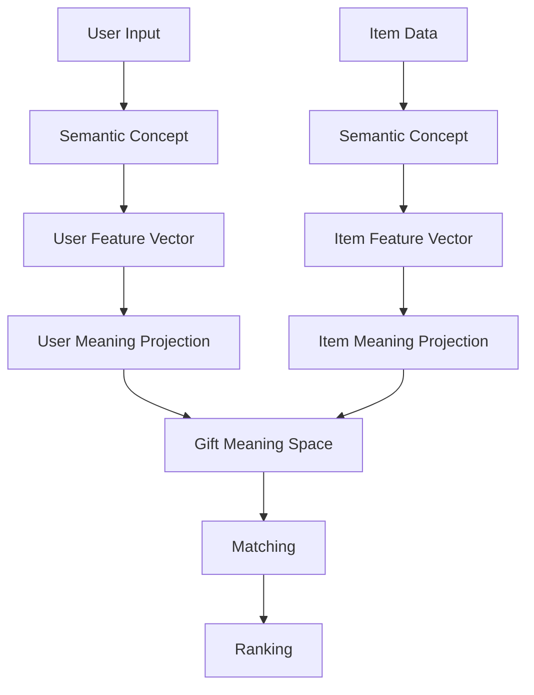

# Gift Meaning Space定義書

## 1. 概要

### 1.1 目的

本ドキュメントは、ギフトレコメンドサービスにおける `Gift Meaning Space` を定義する。

Gift Meaning Spaceは、ユーザーの贈答意図と商品が持つ意味を同一空間上で表現し、比較・一致度計算・可視化の土台とする意味空間である。

---

### 1.2 本ドキュメントの位置づけ

本ドキュメントは、以下の設計成果物の前提となる。

| 後続成果物             | 本ドキュメントとの関係                             |
| ---------------------- | -------------------------------------------------- |
| Feature定義書          | Gift Meaning Spaceを構成する8次元Featureを定義する |
| Featureルール定義書    | Context / Semantic ConceptをFeatureへ変換する      |
| Semantic Concept定義書 | 言語解釈の中間概念を定義する                       |
| Semanticルール定義書   | ユーザー入力・商品情報をSemantic Conceptへ変換する |
| Matching定義書         | User MeaningとItem Meaningの距離・一致度を定義する |
| Ranking定義書          | Context Score等を用いた最終順位決定を定義する      |

---

### 1.3 基本方針

- Gift Meaningは、`Social × Symbolic` の2軸で表現する
- Gift Meaningの内部表現は、8次元Featureベクトルで表現する
- User MeaningとItem Meaningは、同一Feature空間・同一Meaning Space上に射影する
- MVPではFeatureは8次元固定とし、Feature追加は行わない
- Gift Meaning Spaceは意味比較の土台であり、最終ランキングロジックそのものではない

---

## 2. Gift Meaning Spaceの定義

### 2.1 Gift Meaningとは

Gift Meaningとは、贈り物が持つ意味的価値である。

本サービスでは、ギフトを単なる商品属性ではなく、以下のような意味を持つ対象として扱う。

- 相手との関係性に合っているか
- 贈答目的に対して適切か
- 失礼・違和感・重すぎる印象がないか
- 感情や特別感を伝えられるか
- 相手らしさやストーリー性を表現できるか

---

### 2.2 Gift Meaning Spaceとは

Gift Meaning Spaceとは、Gift Meaningを数値空間として扱うための意味空間である。

本サービスでは、以下の2つの目的で利用する。

| 目的   | 内容                                               |
| ------ | -------------------------------------------------- |
| 比較   | User MeaningとItem Meaningの距離・一致度を計算する |
| 可視化 | ギフト候補がどのような意味を持つか説明可能にする   |

---

### 2.3 空間の基本構造

Gift Meaning Spaceは、以下の2軸で構成する。

```text
Gift Meaning Space = Social × Symbolic
```

| 軸       | 日本語名     | 役割                                       |
| -------- | ------------ | ------------------------------------------ |
| Social   | 社会的適合性 | ギフトとして安全・適切・失礼がないかを表す |
| Symbolic | 象徴的価値   | 感情・特別感・意味性を表す                 |

---

## 3. Social / Symbolic軸定義

## 3.1 Social軸

### 定義

Social軸は、ギフトが社会的に適切か、無難か、失敗しにくいかを表す軸である。

### 意味

Socialが高いほど、以下の傾向を持つ。

- フォーマルな場面に適している
- 失礼になりにくい
- 外しにくい
- 相手との関係性に対して安全である
- ブランド・価格・印象のバランスが取れている

---

### 対応Feature

| Feature               | 日本語名       | 役割                       |
| --------------------- | -------------- | -------------------------- |
| formality             | 儀礼性         | きちんと感・フォーマルさ   |
| safety                | 安全性         | 外しにくさ・無難さ         |
| brand_appropriateness | ブランド適切性 | 格・品位・場面との釣り合い |

---

## 3.2 Symbolic軸

### 定義

Symbolic軸は、ギフトが感情・特別感・意味性をどれだけ持つかを表す軸である。

### 意味

Symbolicが高いほど、以下の傾向を持つ。

- 感情が伝わりやすい
- 特別感がある
- 相手との関係性の近さを表現できる
- 相手らしさに合っている
- 贈る理由やストーリーを説明しやすい

---

### 対応Feature

| Feature           | 日本語名     | 役割                   |
| ----------------- | ------------ | ---------------------- |
| emotion           | 感情表現性   | 気持ちを伝える力       |
| novelty           | 特別感       | 新しさ・印象・非日常感 |
| intimacy          | 親密性       | 関係性の近さ           |
| symbolic_identity | 象徴性       | 相手らしさ・意味の象徴 |
| story_richness    | ストーリー性 | 語れる理由・背景       |

---

## 4. Feature空間とMeaning Spaceの関係

### 4.1 Feature空間

Feature空間は、Gift Meaningを8次元で表現する内部表現である。

```text
Feature Vector =
[
  formality,
  safety,
  brand_appropriateness,
  emotion,
  novelty,
  intimacy,
  symbolic_identity,
  story_richness
]
```

---

### 4.2 Gift Meaning Space

Gift Meaning Spaceは、8次元FeatureをSocial / Symbolicの2軸へ集約した意味空間である。

```text
Feature Space（8次元）
↓
Gift Meaning Space（2次元：Social × Symbolic）
```

---

### 4.3 関係性

| 区分               | 内容                               |
| ------------------ | ---------------------------------- |
| Feature空間        | 詳細な意味特徴量を保持する内部表現 |
| Gift Meaning Space | 比較・可視化しやすい2軸表現        |
| Social             | Social系Featureを集約した値        |
| Symbolic           | Symbolic系Featureを集約した値      |

---

### 4.4 重要ルール

Gift Meaning Spaceは2次元であるが、Matchingでは8次元Featureも保持する。

理由は、2次元へ集約すると詳細なFeature差分が失われるためである。

```text
可視化・説明：Social × Symbolic
詳細比較：8次元Feature
```

---

## 5. 座標定義

### 5.1 値域

MVPでは、各FeatureおよびSocial / Symbolicは以下の範囲で扱う。

```text
0.0 <= value <= 1.0
```

|  値 | 意味                   |
| --: | ---------------------- |
| 0.0 | その性質がほとんどない |
| 0.5 | 中立・標準             |
| 1.0 | その性質が非常に強い   |

---

### 5.2 Social座標

Social座標は、Social系Featureから算出する。

```text
Social = aggregate(
  formality,
  safety,
  brand_appropriateness
)
```

MVPでは、単純平均または設定値による加重平均を採用する。

```text
Social =
  w_formality * formality
+ w_safety * safety
+ w_brand * brand_appropriateness
```

---

### 5.3 Symbolic座標

Symbolic座標は、Symbolic系Featureから算出する。

```text
Symbolic = aggregate(
  emotion,
  novelty,
  intimacy,
  symbolic_identity,
  story_richness
)
```

MVPでは、単純平均または設定値による加重平均を採用する。

```text
Symbolic =
  w_emotion * emotion
+ w_novelty * novelty
+ w_intimacy * intimacy
+ w_symbolic_identity * symbolic_identity
+ w_story_richness * story_richness
```

---

### 5.4 重みの扱い

Feature集約重みは、`semantic_config_version` に含める。

理由は、Social / Symbolicへの射影は「意味の作り方」に該当するためである。

---

## 6. User Meaning / Item Meaningの射影

## 6.1 User Meaning

User Meaningは、ユーザーの贈答意図を表すMeaningである。

### 入力

- relationship
- occasion
- budget condition
- 好み条件
- 避けたい条件
- NG条件

### 生成物

| 生成物                  | 内容                      |
| ----------------------- | ------------------------- |
| user_feature_raw        | 未正規化のユーザーFeature |
| user_feature_normalized | 正規化後のユーザーFeature |
| user_meaning_projection | Social / Symbolicへの射影 |
| lambda_ctx              | 贈答リスク許容度          |
| preferred_embedding     | 好み検索用Embedding       |
| non_preferred_embedding | 避けたい検索用Embedding   |

---

### 射影イメージ

```text
user_request
↓
Semantic Concept
↓
Feature
↓
User Meaning
↓
Gift Meaning Space
```

---

## 6.2 Item Meaning

Item Meaningは、商品が持つ意味を表すMeaningである。

### 入力

- 商品名
- 商品説明
- 商品カテゴリ
- 商品タグ
- レビュー情報
- 価格情報
- その他商品メタデータ

### 生成物

| 生成物                  | 内容                      |
| ----------------------- | ------------------------- |
| item_feature_raw        | 未正規化の商品Feature     |
| item_feature_normalized | 正規化後の商品Feature     |
| item_meaning_projection | Social / Symbolicへの射影 |
| item_embedding          | 商品検索用Embedding       |

---

### 射影イメージ

```text
item_signal
↓
Semantic Concept
↓
Feature
↓
Item Meaning
↓
Gift Meaning Space
```

---

## 6.3 User MeaningとItem Meaningの関係

User MeaningとItem Meaningは、同一のFeature定義・同一の正規化方針・同一の射影ルールに基づいて表現する。

```text
User Meaning × Item Meaning = Matching
```

---

## 7. 正規化方針

### 7.1 正規化の目的

正規化の目的は、User MeaningとItem Meaningを比較可能にすることである。

Featureごとに値の分布やスケールが異なる場合、そのまま比較すると特定Featureが過度に影響する。  
そのため、比較前にFeature値を0〜1範囲へ正規化する。

---

### 7.2 正規化対象

| 対象                    | 正規化要否            |
| ----------------------- | --------------------- |
| user_feature_raw        | 必須                  |
| item_feature_raw        | 必須                  |
| user_meaning_projection | Feature正規化後に算出 |
| item_meaning_projection | Feature正規化後に算出 |

---

### 7.3 MVPでの正規化方針

MVPでは、以下のいずれかを採用する。

| 方式                   | 内容                       | MVP適性  |
| ---------------------- | -------------------------- | -------- |
| ルールベース0〜1正規化 | ルール出力値を0〜1に収める | 高       |
| Min-Max正規化          | 最小値・最大値で正規化     | 中       |
| z-score + sigmoid      | 分布を標準化して0〜1化     | 将来向け |

MVPでは、まず `ルールベース0〜1正規化` を基本とする。  
分布監視・オフライン評価が進んだ段階で、z-score + sigmoid等を検討する。

---

### 7.4 正規化ルールの管理

正規化方針は、`semantic_config_version` に含める。

```text
semantic_config_version
= concept定義
+ feature定義
+ feature変換ルール
+ 正規化ルール
+ Social/Symbolic射影ルール
```

---

## 8. 距離・一致度の基本方針

### 8.1 距離の目的

距離は、User MeaningとItem Meaningがどれだけ近いかを測るために用いる。

---

### 8.2 比較単位

MVPでは、以下2種類の比較を扱う。

| 比較単位         | 用途                   |
| ---------------- | ---------------------- |
| 8次元Feature距離 | 詳細な意味一致度計算   |
| 2次元Meaning距離 | 可視化・説明・概略把握 |

---

### 8.3 Feature距離

Feature距離は、各FeatureごとのUser値とItem値の差分である。

```text
feature_distance_i = abs(user_feature_i - item_feature_i)
```

---

### 8.4 Feature一致度

Feature一致度は、距離を一致度へ変換した値である。

```text
feature_match_i = 1 - feature_distance_i
```

値域は0〜1とする。

|  値 | 意味                   |
| --: | ---------------------- |
| 0.0 | まったく一致していない |
| 0.5 | 中程度に一致           |
| 1.0 | 完全に一致             |

---

### 8.5 Social一致度

Social一致度は、Social系Featureの一致度を集約した値である。

```text
social_match = aggregate(
  formality_match,
  safety_match,
  brand_appropriateness_match
)
```

---

### 8.6 Symbolic一致度

Symbolic一致度は、Symbolic系Featureの一致度を集約した値である。

```text
symbolic_match = aggregate(
  emotion_match,
  novelty_match,
  intimacy_match,
  symbolic_identity_match,
  story_richness_match
)
```

---

### 8.7 Context Score

Context Scoreは、Social一致度とSymbolic一致度を統合した意味一致スコアである。

```text
context_score = aggregate(
  social_match,
  symbolic_match,
  lambda_ctx
)
```

`lambda_ctx` は、贈答リスク許容度として、Social寄り・Symbolic寄りのバランスを調整する。

---

### 8.8 距離・一致度の詳細化範囲

本ドキュメントでは、距離・一致度の基本方針のみ定義する。

詳細な計算式・重み・補正係数は、別成果物である `Matching定義書` または `スコアリング設計書` で定義する。

---

## 9. Relationship / Occasionとの関係

### 9.1 Gift Context

Gift Contextは、贈答の状況情報であり、以下で構成する。

```text
Gift Context = Relationship + Occasion
```

| 要素         | 内容                 |
| ------------ | -------------------- |
| Relationship | 贈り手と受け手の関係 |
| Occasion     | 贈答目的・場面       |

---

### 9.2 Relationshipの役割

Relationshipは、主に以下に影響する。

| 影響先                | 例                                     |
| --------------------- | -------------------------------------- |
| intimacy              | 恋人・親友では高くなりやすい           |
| formality             | 上司・取引先では高くなりやすい         |
| safety                | 関係性が遠いほど高くなりやすい         |
| brand_appropriateness | 目上・ビジネス関係では重要になりやすい |

---

### 9.3 Occasionの役割

Occasionは、主に以下に影響する。

| 影響先    | 例                                   |
| --------- | ------------------------------------ |
| formality | 結婚祝い・昇進祝いでは高くなりやすい |
| emotion   | 誕生日・記念日では高くなりやすい     |
| novelty   | サプライズ・記念日では高くなりやすい |
| safety    | お礼・お詫びでは高くなりやすい       |

---

### 9.4 Pair Ruleの必要性

Relationship単体・Occasion単体では意味が決まらない場合がある。

例：

| Relationship | Occasion | 意味                     |
| ------------ | -------- | ------------------------ |
| boss         | birthday | フォーマル寄り・安全寄り |
| lover        | birthday | 感情・親密性・特別感寄り |
| friend_close | thanks   | 親密性と軽さのバランス   |

そのため、`Relationship × Occasion` の組み合わせによるFeature補正を `pair_rule` として扱う。

---

## 10. Semantic Conceptとの関係

### 10.1 Semantic Conceptの役割

Semantic Conceptは、ユーザー入力や商品情報をFeatureへ変換するための中間概念である。

```text
Natural Language
↓
Semantic Concept
↓
Feature
↓
Gift Meaning Space
```

---

### 10.2 なぜSemantic Conceptを挟むか

自然言語から直接Featureを算出すると、ルールが複雑化しやすい。

そのため、以下のように中間概念を挟む。

| 入力例             | Semantic Concept  | Featureへの影響                   |
| ------------------ | ----------------- | --------------------------------- |
| 上品なもの         | formal_refined    | formality / brand_appropriateness |
| 無難なもの         | safe_classic      | safety                            |
| 特別感がある       | special_memorable | novelty / emotion                 |
| 気持ちが伝わる     | emotional_warm    | emotion / intimacy                |
| ストーリー性がある | story_rich        | story_richness                    |

---

### 10.3 後続定義書との分担

| 成果物                 | 定義する内容                        |
| ---------------------- | ----------------------------------- |
| Semantic Concept定義書 | Semantic Concept自体の一覧・意味    |
| Semanticルール定義書   | 入力からSemantic Conceptへの変換    |
| Featureルール定義書    | Semantic ConceptからFeatureへの変換 |

---

## 11. Matching / Rankingとの境界

### 11.1 Gift Meaning Spaceの責務

Gift Meaning Spaceは、意味比較のための空間を定義する。

含むもの：

- Social / Symbolic軸
- Featureとの関係
- 正規化方針
- 射影方針
- 距離・一致度の基本方針

---

### 11.2 Matchingの責務

Matchingは、User MeaningとItem Meaningの一致度を計算する。

含むもの：

- feature_distance
- feature_match
- social_match
- symbolic_match
- context_score

---

### 11.3 Rankingの責務

Rankingは、候補商品の最終順位を決定する。

含むもの：

- popularity_score
- risk_score
- final_score
- display_rank

---

### 11.4 境界ルール

| ルールID | 内容                                                      |
| -------- | --------------------------------------------------------- |
| GMS-01   | Gift Meaning Spaceはfinal_scoreを定義しない               |
| GMS-02   | Gift Meaning Spaceは人気補正・リスク補正を定義しない      |
| GMS-03   | Gift Meaning SpaceはUser / Itemを比較可能な空間へ射影する |
| GMS-04   | RankingはGift Meaning Space上の一致度を入力として利用する |
| GMS-05   | Matching / Rankingの詳細式はmodel_versionで管理する       |

---

## 12. semantic_config_versionとの関係

### 12.1 semantic_config_versionに含めるもの

Gift Meaning Spaceに関する以下の定義は、`semantic_config_version` に含める。

| 項目                         | 理由                                  |
| ---------------------------- | ------------------------------------- |
| Feature定義                  | 意味の構成要素であるため              |
| Semantic Concept定義         | 入力解釈の前提であるため              |
| Concept → Feature変換        | 意味生成ルールであるため              |
| Relationship / Occasion Rule | ContextからFeatureを作るため          |
| Pair Rule                    | Context補正ルールであるため           |
| 正規化ルール                 | Feature比較の前提であるため           |
| Social / Symbolic射影ルール  | Meaning Spaceへの写像ルールであるため |

---

### 12.2 semantic_config_versionに含めないもの

以下は `semantic_config_version` には含めない。

| 項目                  | 管理先        |
| --------------------- | ------------- |
| final_score計算式     | model_version |
| popularity補正        | model_version |
| risk補正              | model_version |
| MMR等のランキング制御 | model_version |
| 表示順位決定          | model_version |

---

## 13. MVPでの扱い

### 13.1 MVP対象

MVPでは、以下を実装対象とする。

| 領域              | MVP方針                   |
| ----------------- | ------------------------- |
| Feature           | 8次元固定                 |
| Social / Symbolic | 2軸固定                   |
| 正規化            | 0〜1正規化                |
| User Meaning      | OLで生成                  |
| Item Meaning      | BTで事前生成              |
| Matching          | Feature距離ベース         |
| Ranking連携       | context_scoreを後段へ渡す |

---

### 13.2 MVPで対象外

MVPでは、以下を対象外とする。

| 領域             | 理由                   |
| ---------------- | ---------------------- |
| Feature追加      | 検証軸がブレるため     |
| 高度な分布正規化 | 初期検証では過剰なため |
| 自動重み最適化   | 学習データ不足のため   |
| オンライン学習   | MVP範囲外              |
| 複雑な可視化UI   | 本質検証後でよい       |

---

## 14. Gift Meaning Space図



---

## 15. Social × Symbolicの解釈イメージ

### 15.1 4象限

| 象限         | Social | Symbolic | 意味                           |
| ------------ | -----: | -------: | ------------------------------ |
| 安全・無難型 |     高 |       低 | 失敗しにくいが特別感は弱い     |
| 理想型       |     高 |       高 | 安全性と意味性のバランスが良い |
| 攻め型       |     低 |       高 | 特別感はあるが失敗リスクもある |
| 不適合型     |     低 |       低 | 安全性・意味性ともに弱い       |

---

### 15.2 使い方

この4象限は、以下に利用する。

- 推薦結果の説明
- 商品候補の意味ポジション確認
- ユーザー意図とのズレ確認
- オフライン評価時の分布確認

---

## 16. 代表例

### 16.1 上司へのお礼ギフト

| 項目                  | 期待傾向 |
| --------------------- | -------- |
| Social                | 高       |
| Symbolic              | 中       |
| formality             | 高       |
| safety                | 高       |
| brand_appropriateness | 高       |
| intimacy              | 低〜中   |
| novelty               | 低〜中   |

意味としては、失礼がなく、きちんと感があり、過度に親密すぎないギフトが望ましい。

---

### 16.2 恋人への誕生日ギフト

| 項目              | 期待傾向 |
| ----------------- | -------- |
| Social            | 中       |
| Symbolic          | 高       |
| emotion           | 高       |
| novelty           | 中〜高   |
| intimacy          | 高       |
| symbolic_identity | 高       |
| story_richness    | 高       |

意味としては、感情・親密性・特別感を持つギフトが望ましい。

---

### 16.3 親しい友人へのお礼ギフト

| 項目           | 期待傾向 |
| -------------- | -------- |
| Social         | 中       |
| Symbolic       | 中〜高   |
| safety         | 中       |
| emotion        | 中       |
| intimacy       | 中〜高   |
| novelty        | 中       |
| story_richness | 中       |

意味としては、重すぎず、相手との関係性に合った気軽な特別感が望ましい。

---

## 17. 設計上の重要ルール

### 17.1 FeatureとMeaningを混同しない

```text
Feature = 意味を構成する8次元の部品
Meaning = Featureを統合した意味表現
```

---

### 17.2 Gift Meaning SpaceとRankingを混同しない

```text
Gift Meaning Space = 比較するための空間
Ranking            = 最終的に並べるための判断
```

---

### 17.3 User MeaningとItem Meaningを同じ空間に置く

```text
User MeaningとItem Meaningは、同じFeature定義・同じ正規化・同じ射影ルールで比較する
```

---

### 17.4 2次元表示だけで判断しない

Social / Symbolicは説明しやすいが、詳細な違いは8次元Featureに残す。

```text
説明：Social / Symbolic
計算：Feature + Social / Symbolic
```

---

## 18. 今後の詳細化対象

| 成果物                 | 詳細化内容                              |
| ---------------------- | --------------------------------------- |
| Feature定義書          | 8次元Featureの詳細定義                  |
| Semantic Concept定義書 | Semantic Concept一覧と意味              |
| Featureルール定義書    | Context / Concept → Feature変換         |
| Semanticルール定義書   | 入力文・商品情報 → Semantic Concept変換 |
| Matching定義書         | 距離・一致度・context_score詳細         |
| Ranking定義書          | final_score・補正・MMR等                |
| 分布監視設計書         | Feature / Score分布の監視               |

---

## 19. まとめ

Gift Meaning Spaceは、ギフトレコメンドサービスにおける意味比較の土台である。

```text
Natural Language
↓
Semantic Concept
↓
Feature
↓
Gift Meaning Space
↓
Matching
↓
Ranking
```

本サービスでは、Gift Meaningを `Social × Symbolic` の2軸で表現する。  
ただし、内部的には8次元Featureを保持し、2軸表現は比較・説明・可視化のための射影として扱う。

MVPでは、Featureは8次元固定、値域は0〜1、User MeaningはOL生成、Item MeaningはBT事前生成とする。
