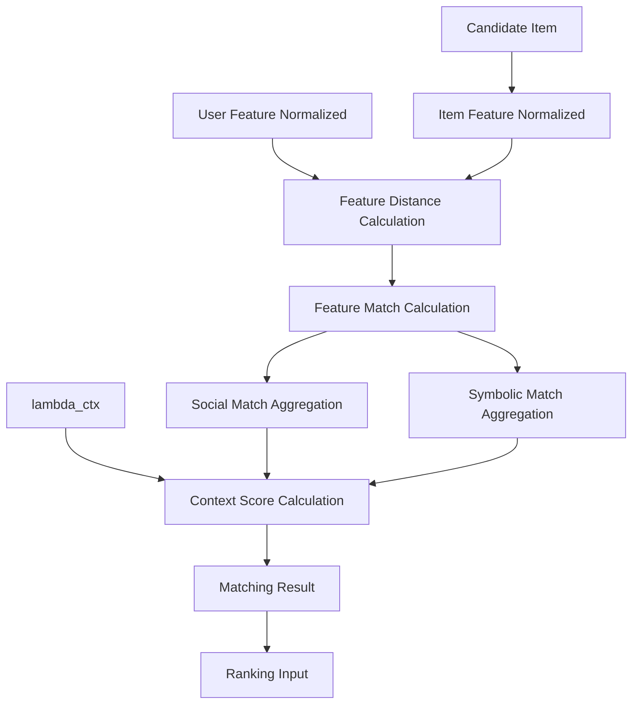

# Matching定義書

## 1. 概要

### 1.1 目的

本ドキュメントは、ギフトレコメンドサービスにおける `Matching` を定義する。

Matchingとは、User MeaningとItem Meaningを比較し、候補商品がユーザーの贈答意図にどれくらい合っているかを数値化する処理である。

```text
User Feature Normalized
+
Item Feature Normalized
↓
Feature Distance
↓
Feature Match
↓
Social Match / Symbolic Match
↓
Context Score
```

---

### 1.2 本ドキュメントの位置づけ

| 成果物                      | 本ドキュメントとの関係                        |
| --------------------------- | --------------------------------------------- |
| Gift Meaning Space定義書    | Social / Symbolicの意味空間を前提にする       |
| Feature定義書               | 比較対象となる8次元Featureを定義する          |
| Featureルール定義書         | User / Item Featureを生成する                 |
| Semanticルール定義書        | Feature生成前のSemantic Concept抽出を定義する |
| Ranking定義書               | Matching結果を使って最終順位を決定する        |
| Recommendation Result定義書 | Ranking後の推薦結果を定義する                 |

---

### 1.3 基本方針

- Matchingは、User FeatureとItem Featureの一致度を算出する
- Matchingでは、原則として `normalized_value` を使用する
- `raw_value` は分析・デバッグ・分布監視用途として参照する
- Matchingは、人気補正・リスク補正・最終順位決定を行わない
- Matchingは、意味的な一致度の算出に責務を限定する
- Matchingロジックは `model_version` に紐づけて管理する
- Feature生成・Feature正規化のルールは `semantic_config_version` 側で管理する
- MVPでは、Feature単位の絶対距離をベースにした単純で説明可能な方式を採用する

---

## 2. Matchingの責務

### 2.1 In Scope

| 対象               | 内容                                          |
| ------------------ | --------------------------------------------- |
| Feature距離計算    | User FeatureとItem Featureの差分を算出する    |
| Feature一致度計算  | Feature距離を0.0〜1.0の一致度へ変換する       |
| Social Match算出   | Social系Featureの一致度を集約する             |
| Symbolic Match算出 | Symbolic系Featureの一致度を集約する           |
| Context Score算出  | Social / Symbolicの一致度を文脈重みで統合する |
| Matching根拠保持   | どのFeatureが一致・不一致だったかを保持する   |
| Ranking入力生成    | Rankingで利用する意味一致スコアを出力する     |

---

### 2.2 Out of Scope

| 対象外               | 理由                                | 管理先                |
| -------------------- | ----------------------------------- | --------------------- |
| Feature生成          | Matching前の処理であるため          | Featureルール定義書   |
| Semantic Concept抽出 | Feature生成前の意味解釈であるため   | Semanticルール定義書  |
| sigmoid正規化        | Feature生成側の正規化処理であるため | Featureルール定義書   |
| 候補商品抽出         | Matching前の検索処理であるため      | Retrieval定義書       |
| 人気補正             | 意味一致ではなく順位補正であるため  | Ranking定義書         |
| リスク補正           | 最終順位の安全性補正であるため      | Ranking定義書         |
| MMR                  | 並び順の多様性制御であるため        | Ranking定義書         |
| final_score算出      | 最終順位決定であるため              | Ranking定義書         |
| top_k選定            | 最終表示件数の決定であるため        | Ranking定義書         |
| Hard Filter          | 絶対除外条件であるため              | Filtering / Retrieval |

---

## 3. Matching全体フロー

### 3.1 処理フロー



---

### 3.2 入出力概要

| 区分 | 内容                    |
| ---- | ----------------------- |
| 入力 | user_feature_normalized |
| 入力 | item_feature_normalized |
| 入力 | candidate_item          |
| 入力 | lambda_ctx              |
| 入力 | model_version           |
| 出力 | feature_distance        |
| 出力 | feature_match           |
| 出力 | social_match            |
| 出力 | symbolic_match          |
| 出力 | context_score           |

---

## 4. Matching入力

### 4.1 user_feature_normalized

`user_feature_normalized` は、ユーザーの贈答意図を8次元Featureで表現した正規化済み値である。

| 項目       | 内容                 |
| ---------- | -------------------- |
| 生成元     | User Meaning生成     |
| 値域       | 0.0〜1.0             |
| 正規化方式 | sigmoid正規化        |
| 用途       | Item Featureとの比較 |

---

### 4.2 item_feature_normalized

`item_feature_normalized` は、商品が持つ意味を8次元Featureで表現した正規化済み値である。

| 項目       | 内容                 |
| ---------- | -------------------- |
| 生成元     | Item Meaning生成     |
| 値域       | 0.0〜1.0             |
| 正規化方式 | sigmoid正規化        |
| 用途       | User Featureとの比較 |

---

### 4.3 Feature Vector

Matchingで比較するFeatureは以下の8次元とする。

```text
feature_vector = [
  formality,
  safety,
  brand_appropriateness,
  emotion,
  novelty,
  intimacy,
  symbolic_identity,
  story_richness
]
```

---

### 4.4 Feature分類

| 分類     | Feature               | 論理名         |
| -------- | --------------------- | -------------- |
| Social   | formality             | 儀礼性         |
| Social   | safety                | 安全性         |
| Social   | brand_appropriateness | ブランド適切性 |
| Symbolic | emotion               | 感情表現性     |
| Symbolic | novelty               | 特別感         |
| Symbolic | intimacy              | 親密性         |
| Symbolic | symbolic_identity     | 象徴性         |
| Symbolic | story_richness        | ストーリー性   |

---

### 4.5 lambda_ctx

`lambda_ctx` は、Context Score算出時にSocial MatchとSymbolic Matchのどちらを重視するかを表す重みである。

|  値 | 解釈                            |
| --: | ------------------------------- |
| 0.0 | Social Matchのみ重視            |
| 0.5 | Social / Symbolicを同程度に重視 |
| 1.0 | Symbolic Matchのみ重視          |

```text
0.0 <= lambda_ctx <= 1.0
```

MVPでは、`lambda_ctx` は原則として前段モジュールで算出済みの値を入力として受け取る。

未算出の場合は、暫定的に `0.5` を使用する。

---

## 5. Feature Distance

### 5.1 Feature Distanceとは

`feature_distance` は、User FeatureとItem FeatureのFeature単位の距離である。

距離が小さいほど、Userが求める意味とItemが持つ意味が近い。

---

### 5.2 MVP採用方式

MVPでは、Feature単位の絶対距離を採用する。

```text
feature_distance[f] = abs(user_feature_normalized[f] - item_feature_normalized[f])
```

| 項目 | 内容                       |
| ---- | -------------------------- |
| 入力 | user_feature_normalized[f] |
| 入力 | item_feature_normalized[f] |
| 出力 | feature_distance[f]        |
| 値域 | 0.0〜1.0                   |

---

### 5.3 絶対距離を採用する理由

| 理由                     | 内容                                                     |
| ------------------------ | -------------------------------------------------------- |
| 説明可能性が高い         | Featureごとにどれだけズレたか説明しやすい                |
| 実装が単純               | MVPで扱いやすい                                          |
| 0〜1正規化値と相性がよい | 差分がそのまま距離として解釈できる                       |
| デバッグしやすい         | formalityだけズレている、noveltyだけ合っている等が見える |

---

### 5.4 距離の解釈

| feature_distance | 解釈         |
| ---------------: | ------------ |
|       0.00〜0.10 | 非常に近い   |
|       0.10〜0.25 | 近い         |
|       0.25〜0.40 | ややズレあり |
|       0.40〜0.60 | ズレが大きい |
|       0.60〜1.00 | 大きく不一致 |

---

### 5.5 例

```text
user.formality = 0.80
item.formality = 0.65

feature_distance.formality
= abs(0.80 - 0.65)
= 0.15
```

この場合、formalityの距離は `0.15` であり、比較的近い。

---

## 6. Feature Match

### 6.1 Feature Matchとは

`feature_match` は、Feature Distanceを一致度に変換した値である。

距離が小さいほど一致度は高くなる。

---

### 6.2 MVP採用式

```text
feature_match[f] = 1.0 - feature_distance[f]
```

Feature Distanceが `0.0〜1.0` であるため、Feature Matchも `0.0〜1.0` の範囲になる。

| feature_distance | feature_match |
| ---------------: | ------------: |
|             0.00 |          1.00 |
|             0.10 |          0.90 |
|             0.25 |          0.75 |
|             0.50 |          0.50 |
|             1.00 |          0.00 |

---

### 6.3 Feature Matchの解釈

| feature_match | 解釈       |
| ------------: | ---------- |
|    0.90〜1.00 | 非常に一致 |
|    0.75〜0.89 | 一致       |
|    0.60〜0.74 | やや一致   |
|    0.40〜0.59 | 弱い一致   |
|    0.00〜0.39 | 不一致     |

---

### 6.4 例

```text
feature_distance.formality = 0.15

feature_match.formality
= 1.0 - 0.15
= 0.85
```

この場合、formalityの一致度は `0.85` である。

---

## 7. Social Match

### 7.1 Social Matchとは

`social_match` は、Social系Featureの一致度を集約したスコアである。

Social系Featureは以下の3つである。

| Feature               | 内容           |
| --------------------- | -------------- |
| formality             | 儀礼性         |
| safety                | 安全性         |
| brand_appropriateness | ブランド適切性 |

---

### 7.2 MVP採用式

MVPでは、Social系Feature Matchの加重平均で算出する。

```text
social_match
= weighted_average(
    feature_match.formality,
    feature_match.safety,
    feature_match.brand_appropriateness
  )
```

初期重みは均等とする。

| Feature               | weight |
| --------------------- | -----: |
| formality             |  0.333 |
| safety                |  0.333 |
| brand_appropriateness |  0.333 |

---

### 7.3 式

```text
social_match
= (
    w_formality * match_formality
  + w_safety * match_safety
  + w_brand * match_brand_appropriateness
) / (
    w_formality
  + w_safety
  + w_brand
)
```

---

### 7.4 Social Matchの解釈

| social_match | 解釈                     |
| -----------: | ------------------------ |
|   0.90〜1.00 | 社会的適合性が非常に高い |
|   0.75〜0.89 | 社会的適合性が高い       |
|   0.60〜0.74 | 概ね適合                 |
|   0.40〜0.59 | 社会的にややズレる       |
|   0.00〜0.39 | 社会的に不一致が大きい   |

---

## 8. Symbolic Match

### 8.1 Symbolic Matchとは

`symbolic_match` は、Symbolic系Featureの一致度を集約したスコアである。

Symbolic系Featureは以下の5つである。

| Feature           | 内容         |
| ----------------- | ------------ |
| emotion           | 感情表現性   |
| novelty           | 特別感       |
| intimacy          | 親密性       |
| symbolic_identity | 象徴性       |
| story_richness    | ストーリー性 |

---

### 8.2 MVP採用式

MVPでは、Symbolic系Feature Matchの加重平均で算出する。

```text
symbolic_match
= weighted_average(
    feature_match.emotion,
    feature_match.novelty,
    feature_match.intimacy,
    feature_match.symbolic_identity,
    feature_match.story_richness
  )
```

初期重みは均等とする。

| Feature           | weight |
| ----------------- | -----: |
| emotion           |  0.200 |
| novelty           |  0.200 |
| intimacy          |  0.200 |
| symbolic_identity |  0.200 |
| story_richness    |  0.200 |

---

### 8.3 式

```text
symbolic_match
= (
    w_emotion * match_emotion
  + w_novelty * match_novelty
  + w_intimacy * match_intimacy
  + w_symbolic_identity * match_symbolic_identity
  + w_story_richness * match_story_richness
) / (
    w_emotion
  + w_novelty
  + w_intimacy
  + w_symbolic_identity
  + w_story_richness
)
```

---

### 8.4 Symbolic Matchの解釈

| symbolic_match | 解釈                         |
| -------------: | ---------------------------- |
|     0.90〜1.00 | 象徴的価値が非常に合っている |
|     0.75〜0.89 | 象徴的価値が合っている       |
|     0.60〜0.74 | 概ね合っている               |
|     0.40〜0.59 | 意味性にややズレがある       |
|     0.00〜0.39 | 意味性の不一致が大きい       |

---

## 9. Context Score

### 9.1 Context Scoreとは

`context_score` は、Social MatchとSymbolic Matchを統合した意味一致スコアである。

Rankingでは、`context_score` を「意味的にどれくらい合っているか」の主要入力として使用する。

---

### 9.2 MVP採用式

```text
context_score
= (1.0 - lambda_ctx) * social_match
+ lambda_ctx * symbolic_match
```

---

### 9.3 lambda_ctxの意味

| lambda_ctx | social_matchの重み | symbolic_matchの重み | 解釈                 |
| ---------: | -----------------: | -------------------: | -------------------- |
|        0.0 |                1.0 |                  0.0 | 社会的適切性を最重視 |
|        0.3 |                0.7 |                  0.3 | Social寄り           |
|        0.5 |                0.5 |                  0.5 | バランス型           |
|        0.7 |                0.3 |                  0.7 | Symbolic寄り         |
|        1.0 |                0.0 |                  1.0 | 象徴的価値を最重視   |

---

### 9.4 例

```text
social_match = 0.82
symbolic_match = 0.70
lambda_ctx = 0.40

context_score
= (1.0 - 0.40) * 0.82 + 0.40 * 0.70
= 0.60 * 0.82 + 0.40 * 0.70
= 0.492 + 0.280
= 0.772
```

この場合、Context Scoreは `0.772` である。

---

### 9.5 Context Scoreの解釈

| context_score | 解釈                     |
| ------------: | ------------------------ |
|    0.90〜1.00 | 意味的に非常に合っている |
|    0.75〜0.89 | 意味的に合っている       |
|    0.60〜0.74 | 概ね合っている           |
|    0.40〜0.59 | 一部ズレがある           |
|    0.00〜0.39 | 意味的な不一致が大きい   |

---

## 10. Avoid条件の扱い

### 10.1 基本方針

避けたい条件は、原則としてFeature生成段階でUser Featureに反映済みとする。

```text
non_preferred_condition
↓
Semantic Concept
↓
Feature Delta反転または抑制
↓
User Feature Normalized
```

そのため、Matchingの主処理では、通常のUser FeatureとItem Featureの比較に含めて扱う。

---

### 10.2 補助的なavoid_similarity

MVPでは必須ではないが、分析・Ranking補助のために `avoid_similarity` を算出してもよい。

`avoid_similarity` は、避けたい意味にItemがどれくらい近いかを表す。

```text
avoid_similarity = match(non_preferred_feature_normalized, item_feature_normalized)
```

| avoid_similarity | 解釈                             |
| ---------------: | -------------------------------- |
|             高い | 避けたい方向に商品が近い         |
|             低い | 避けたい方向から商品が離れている |

---

### 10.3 avoid_similarityの責務境界

`avoid_similarity` はMatchingで算出してよいが、減点するかどうかはRanking側で判断する。

| 処理                           | 管理先      |
| ------------------------------ | ----------- |
| 避けたい意味との近さを計算する | Matching    |
| どれくらい順位を下げるか       | Ranking     |
| 絶対除外するか                 | Hard Filter |

---

### 10.4 Hard Filterとの違い

| 種別   | 例                       | Matchingでの扱い      |
| ------ | ------------------------ | --------------------- |
| avoid  | 無難すぎるものは避けたい | Feature差分として扱う |
| NG     | アルコールはNG           | Matching前に除外済み  |
| budget | 5,000円以内              | Matching前に除外済み  |

---

## 11. Matching方式の設計判断

### 11.1 絶対距離方式を主方式とする理由

MVPでは、以下の理由から絶対距離方式を採用する。

| 観点           | 判断                                |
| -------------- | ----------------------------------- |
| 説明可能性     | Feature単位で理由を説明しやすい     |
| デバッグ容易性 | どのFeatureがズレたか追いやすい     |
| 実装容易性     | 初期実装が軽い                      |
| 評価容易性     | 人手評価と照合しやすい              |
| 改善容易性     | Feature別のチューニングに繋げやすい |

---

### 11.2 コサイン類似度を主方式にしない理由

コサイン類似度はベクトル方向の類似度を見る方式である。

ただし、本サービスのFeatureはそれぞれ独立した意味次元を持つため、MVPではFeature単位の差分の方が説明しやすい。

| 方式             | 特徴                         | MVP判断  |
| ---------------- | ---------------------------- | -------- |
| 絶対距離         | Featureごとの差分が分かる    | 主方式   |
| ユークリッド距離 | 全体距離を一括で見られる     | 補助指標 |
| コサイン類似度   | ベクトル方向の近さを見られる | 将来候補 |
| learned matching | 学習により一致度を推定       | 将来候補 |

---

### 11.3 補助指標としてのmeaning_distance

分析用途として、8次元全体の距離を `meaning_distance` として算出してもよい。

```text
meaning_distance
= sqrt(
    Σ(user_feature_normalized[f] - item_feature_normalized[f])^2
)
```

ただし、MVPのRanking入力としては `context_score` を主に使用する。

---

## 12. Matching出力

### 12.1 出力一覧

| 出力               | 内容                        | Ranking利用 |
| ------------------ | --------------------------- | ----------- |
| feature_distance   | Feature単位の距離           | 補助        |
| feature_match      | Feature単位の一致度         | 補助        |
| social_match       | Social系Feature一致度       | 使用        |
| symbolic_match     | Symbolic系Feature一致度     | 使用        |
| context_score      | Social / Symbolic統合スコア | 主要入力    |
| avoid_similarity   | 避けたい意味との近さ        | 任意        |
| match_reason_basis | 推薦理由生成向け根拠        | 補助        |

---

### 12.2 match_reason_basis

`match_reason_basis` は、推薦理由生成やデバッグで使うMatching根拠である。

例：

```json
{
  "candidate_item_id": "item_001",
  "context_score": 0.82,
  "social_match": 0.88,
  "symbolic_match": 0.76,
  "strong_matches": [
    {
      "feature_code": "formality",
      "feature_match": 0.92,
      "reason": "きちんと感が求める条件に近い"
    },
    {
      "feature_code": "story_richness",
      "feature_match": 0.84,
      "reason": "選んだ理由を説明しやすい"
    }
  ],
  "weak_matches": [
    {
      "feature_code": "novelty",
      "feature_match": 0.48,
      "reason": "特別感はやや弱い"
    }
  ]
}
```

---

### 12.3 strong_match / weak_match判定

| 判定         | 条件                         |
| ------------ | ---------------------------- |
| strong_match | feature_match >= 0.80        |
| normal_match | 0.60 <= feature_match < 0.80 |
| weak_match   | feature_match < 0.60         |

MVPでは、推薦理由生成に使うFeatureは上位2〜3個に制限する。

---

## 13. model_versionとの関係

### 13.1 Matchingでmodel_version管理するもの

Matchingロジックは、`model_version` に紐づけて管理する。

| 管理対象                 | 内容                                     |
| ------------------------ | ---------------------------------------- |
| distance_method          | absolute_distance / euclidean / cosine等 |
| feature_match_method     | 1 - distance等                           |
| social_feature_weights   | Social内Feature重み                      |
| symbolic_feature_weights | Symbolic内Feature重み                    |
| context_score_formula    | context_score算出式                      |
| avoid_similarity_method  | avoid_similarity算出方式                 |
| threshold_rule           | strong / weak match判定閾値              |

---

### 13.2 semantic_config_versionとの違い

| 管理対象              | 管理先                  | 理由                 |
| --------------------- | ----------------------- | -------------------- |
| Semantic Concept定義  | semantic_config_version | 意味の作り方         |
| Feature生成ルール     | semantic_config_version | 意味の作り方         |
| Feature正規化ルール   | semantic_config_version | 意味の作り方         |
| Feature距離計算       | model_version           | 比較の仕方           |
| Social / Symbolic集約 | model_version           | 比較の仕方           |
| Context Score算出     | model_version           | 比較・スコア化の仕方 |
| Final Score算出       | model_version           | 順位の決め方         |

---

## 14. DB・実装上の扱い

### 14.1 feature_distance

論理的には以下の項目を持つ。

| 項目                          | 内容                               |
| ----------------------------- | ---------------------------------- |
| feature_distance_id           | Feature距離ID                      |
| recommendation_run_id         | 推薦実行ID                         |
| candidate_item_id             | 候補商品ID                         |
| feature_code                  | Featureコード                      |
| user_feature_normalized_value | User側Feature値                    |
| item_feature_normalized_value | Item側Feature値                    |
| distance_method               | 距離計算方式                       |
| distance_value                | Feature距離                        |
| semantic_config_version_id    | 使用した意味定義バージョン         |
| model_version_id              | 使用したMatchingロジックバージョン |
| calculated_at                 | 算出日時                           |

---

### 14.2 feature_match

| 項目                  | 内容                               |
| --------------------- | ---------------------------------- |
| feature_match_id      | Feature一致度ID                    |
| recommendation_run_id | 推薦実行ID                         |
| candidate_item_id     | 候補商品ID                         |
| feature_code          | Featureコード                      |
| feature_distance_id   | 対応するFeature距離ID              |
| match_method          | 一致度変換方式                     |
| match_score           | Feature一致度                      |
| model_version_id      | 使用したMatchingロジックバージョン |
| calculated_at         | 算出日時                           |

---

### 14.3 social_match

| 項目                        | 内容                               |
| --------------------------- | ---------------------------------- |
| social_match_id             | Social一致度ID                     |
| recommendation_run_id       | 推薦実行ID                         |
| candidate_item_id           | 候補商品ID                         |
| formality_match             | formality一致度                    |
| safety_match                | safety一致度                       |
| brand_appropriateness_match | brand_appropriateness一致度        |
| social_match_score          | Social一致度                       |
| aggregation_method          | 集約方式                           |
| model_version_id            | 使用したMatchingロジックバージョン |
| calculated_at               | 算出日時                           |

---

### 14.4 symbolic_match

| 項目                    | 内容                               |
| ----------------------- | ---------------------------------- |
| symbolic_match_id       | Symbolic一致度ID                   |
| recommendation_run_id   | 推薦実行ID                         |
| candidate_item_id       | 候補商品ID                         |
| emotion_match           | emotion一致度                      |
| novelty_match           | novelty一致度                      |
| intimacy_match          | intimacy一致度                     |
| symbolic_identity_match | symbolic_identity一致度            |
| story_richness_match    | story_richness一致度               |
| symbolic_match_score    | Symbolic一致度                     |
| aggregation_method      | 集約方式                           |
| model_version_id        | 使用したMatchingロジックバージョン |
| calculated_at           | 算出日時                           |

---

### 14.5 context_score

| 項目                  | 内容                               |
| --------------------- | ---------------------------------- |
| context_score_id      | Context Score ID                   |
| recommendation_run_id | 推薦実行ID                         |
| candidate_item_id     | 候補商品ID                         |
| social_match_score    | Social一致度                       |
| symbolic_match_score  | Symbolic一致度                     |
| lambda_ctx            | Social / Symbolic統合重み          |
| context_score         | 意味一致スコア                     |
| formula_version       | 算出式バージョン                   |
| model_version_id      | 使用したMatchingロジックバージョン |
| calculated_at         | 算出日時                           |

---

### 14.6 実装形式

MVPでは、以下の形式を許容する。

| 方式           | 内容                       | MVP適性 |
| -------------- | -------------------------- | ------- |
| Python関数     | recoサービス内で算出       | 高      |
| SQL計算        | DB上で距離・一致度を算出   | 中      |
| TypeScript関数 | API側で軽量算出            | 中      |
| DB保存         | 結果分析・再現性のため保存 | 高      |
| JSON保存       | 詳細なFeature別根拠を保持  | 高      |

MVPでは、`recoサービス内で算出 + DB保存` を推奨する。

---

## 15. 疑似コード

### 15.1 Feature Match算出

```python
FEATURES = [
    "formality",
    "safety",
    "brand_appropriateness",
    "emotion",
    "novelty",
    "intimacy",
    "symbolic_identity",
    "story_richness",
]

SOCIAL_FEATURES = [
    "formality",
    "safety",
    "brand_appropriateness",
]

SYMBOLIC_FEATURES = [
    "emotion",
    "novelty",
    "intimacy",
    "symbolic_identity",
    "story_richness",
]


def calculate_feature_match(user_feature, item_feature):
    result = {}

    for feature in FEATURES:
        distance = abs(user_feature[feature] - item_feature[feature])
        match = 1.0 - distance

        result[feature] = {
            "distance": distance,
            "match": match,
        }

    return result
```

---

### 15.2 Social / Symbolic Match算出

```python
def weighted_average(values, weights):
    total_weight = sum(weights.values())

    if total_weight == 0:
        return 0.0

    return sum(values[key] * weights[key] for key in values) / total_weight


def calculate_social_match(feature_matches, social_weights):
    values = {
        feature: feature_matches[feature]["match"]
        for feature in SOCIAL_FEATURES
    }

    return weighted_average(values, social_weights)


def calculate_symbolic_match(feature_matches, symbolic_weights):
    values = {
        feature: feature_matches[feature]["match"]
        for feature in SYMBOLIC_FEATURES
    }

    return weighted_average(values, symbolic_weights)
```

---

### 15.3 Context Score算出

```python
def calculate_context_score(social_match, symbolic_match, lambda_ctx):
    lambda_ctx = max(0.0, min(1.0, lambda_ctx))

    return (1.0 - lambda_ctx) * social_match + lambda_ctx * symbolic_match
```

---

## 16. エラーハンドリング

### 16.1 入力欠損

| ケース                              | 扱い                                             |
| ----------------------------------- | ------------------------------------------------ |
| user_feature_normalizedが存在しない | Matching不可としてエラー                         |
| item_feature_normalizedが存在しない | 対象candidateを除外または低信頼扱い              |
| 一部Featureが欠損                   | 中立値0.5で補完、または対象Featureを集約から除外 |
| lambda_ctxが欠損                    | 0.5を使用                                        |
| model_versionが欠損                 | 現行有効versionを使用                            |

---

### 16.2 Feature欠損時の方針

MVPでは、Feature欠損時は原則として中立値 `0.5` で補完する。

```text
missing_feature_value = 0.5
```

ただし、欠損率が高いItemは、Ranking側でrisk_scoreまたはquality_scoreにより補正することを検討する。

---

### 16.3 異常値

normalized_valueは原則として `0.0〜1.0` である。

範囲外の値が来た場合は、以下の順で扱う。

```text
1. エラーログ記録
2. 対象Featureをguard_clip
3. 異常値発生をmetric_logへ記録
```

Matching側では主正規化を行わない。  
範囲外値は、Feature正規化工程の異常として扱う。

---

## 17. 品質・レビュー観点

### 17.1 レビュー観点

| 観点                  | 確認内容                                                  |
| --------------------- | --------------------------------------------------------- |
| 距離妥当性            | Feature距離が人間の感覚と大きくズレていないか             |
| Social / Symbolic分離 | SocialとSymbolicの責務が混ざっていないか                  |
| λ_ctx妥当性           | 文脈重みにより期待通りのContext Scoreになるか             |
| 説明可能性            | Feature単位で一致・不一致を説明できるか                   |
| 過剰一致              | 何でも高Scoreになっていないか                             |
| 過剰不一致            | 少しのズレで低Scoreになりすぎていないか                   |
| Ranking境界           | popularity / risk / final_scoreをMatchingで扱っていないか |
| 再現性                | model_versionにより算出式を再現できるか                   |
| 監視可能性            | feature_distance / feature_match分布を監視できるか        |

---

### 17.2 よくある問題

| 問題                    | 内容                                     | 対応                                  |
| ----------------------- | ---------------------------------------- | ------------------------------------- |
| 全商品が高Scoreになる   | Feature差分が小さすぎる                  | Feature生成・正規化分布を確認         |
| 全商品が低Scoreになる   | User Featureが極端すぎる                 | sigmoid正規化・Concept Deltaを確認    |
| Socialばかり効く        | lambda_ctxが低すぎる                     | lambda_ctx算出ロジックを確認          |
| Symbolicばかり効く      | lambda_ctxが高すぎる                     | relationship / occasionとの整合を確認 |
| 特定Featureの影響が弱い | Feature重みが小さい                      | model_version側で重み調整             |
| 推薦理由が弱い          | feature_match根拠が不足                  | match_reason_basisを保持する          |
| avoidが効かない         | avoid条件がFeature生成に反映されていない | Semantic / Featureルールを確認        |

---

## 18. Observability / Evaluation

### 18.1 監視対象

Matchingでは、以下を監視対象とする。

| 監視対象             | 目的                            |
| -------------------- | ------------------------------- |
| feature_distance分布 | Featureごとのズレ傾向を確認     |
| feature_match分布    | Featureごとの一致度を確認       |
| social_match分布     | Social側に偏りがないか確認      |
| symbolic_match分布   | Symbolic側に偏りがないか確認    |
| context_score分布    | 最終的な意味一致度の分布確認    |
| lambda_ctx分布       | Social / Symbolic重みの偏り確認 |
| feature別欠損率      | Feature生成品質を確認           |

---

### 18.2 評価観点

| 評価          | 内容                                        |
| ------------- | ------------------------------------------- |
| 人手評価      | context_scoreが高い商品が人間にも妥当か     |
| Feature別分析 | どのFeatureが推薦品質に効いているか         |
| Social評価    | 儀礼性・安全性が文脈に合っているか          |
| Symbolic評価  | 感情・特別感・相手らしさが合っているか      |
| 失敗分析      | 上位商品が外れている理由をFeature単位で確認 |

---

### 18.3 改善ループ

```text
Matching Result
↓
Human / Offline Evaluation
↓
Feature別ズレ分析
↓
Semantic Rule / Feature Rule / Matching Weight見直し
↓
semantic_config_version or model_version更新
```

---

## 19. MVPでの扱い

### 19.1 MVP対象

| 項目               | 方針                               |
| ------------------ | ---------------------------------- |
| Feature Distance   | 絶対距離で算出                     |
| Feature Match      | 1.0 - distance                     |
| Social Match       | Social 3 Featureの加重平均         |
| Symbolic Match     | Symbolic 5 Featureの加重平均       |
| Feature重み        | 初期は均等                         |
| Context Score      | λ_ctxによるSocial / Symbolic加重和 |
| lambda_ctx未算出時 | 0.5を使用                          |
| Matching結果保存   | 必須                               |
| match_reason_basis | 簡易保持                           |

---

### 19.2 MVP対象外

| 項目                       | 理由                    |
| -------------------------- | ----------------------- |
| learned matching           | 学習データ不足          |
| 個人別Matching重み         | 認証・履歴管理が前提    |
| 高度なコサイン類似度最適化 | 初期検証では過剰        |
| ニューラルランキング       | 学習データ不足          |
| 多目的最適化               | Ranking側で段階的に検討 |
| 高度なavoid penalty        | Ranking設計後に検討     |

---

## 20. 後続成果物への引き継ぎ

### 20.1 Ranking定義書への引き継ぎ

Ranking定義書では、以下を利用する。

| 引き継ぎ項目       | 内容                 |
| ------------------ | -------------------- |
| context_score      | 意味一致スコア       |
| social_match       | Social系一致度       |
| symbolic_match     | Symbolic系一致度     |
| feature_match      | Feature単位の一致度  |
| avoid_similarity   | 避けたい意味との近さ |
| match_reason_basis | 推薦理由生成の根拠   |
| model_version_id   | 算出ロジック再現用   |

---

### 20.2 Reason生成定義書への引き継ぎ

Reason生成では、以下を利用する。

| 引き継ぎ項目         | 用途                                       |
| -------------------- | ------------------------------------------ |
| strong_match Feature | 推薦理由に使う                             |
| weak_match Feature   | 注意文・補足に使う                         |
| social_match         | 「失礼がない」「きちんとしている」等の説明 |
| symbolic_match       | 「特別感がある」「気持ちが伝わる」等の説明 |
| evidence_text        | Semantic抽出根拠との接続                   |

---

### 20.3 Evaluation定義書への引き継ぎ

Evaluationでは、以下を利用する。

| 引き継ぎ項目     | 用途                  |
| ---------------- | --------------------- |
| feature_distance | Feature別のズレ分析   |
| feature_match    | Feature別の妥当性評価 |
| social_match     | Social側の評価        |
| symbolic_match   | Symbolic側の評価      |
| context_score    | 上位推薦の品質評価    |

---

## 21. まとめ

Matchingは、User FeatureとItem Featureを比較し、意味的な一致度を算出する工程である。

```text
User Feature Normalized
+
Item Feature Normalized
↓
Feature Distance
↓
Feature Match
↓
Social Match / Symbolic Match
↓
Context Score
↓
Ranking
```

MVPでは、以下の方針で運用する。

```text
- normalized_valueを比較対象とする
- Feature単位の絶対距離を計算する
- feature_match = 1.0 - feature_distance とする
- Social MatchはSocial 3 Featureの加重平均とする
- Symbolic MatchはSymbolic 5 Featureの加重平均とする
- Context Scoreはlambda_ctxでSocial / Symbolicを統合する
- Matchingは人気補正・リスク補正・final_scoreを扱わない
- Matchingロジックはmodel_version配下で管理する
```

Matchingは「意味的にどれくらい合っているか」を算出する層であり、最終順位を決定するRankingとは明確に責務を分離する。
