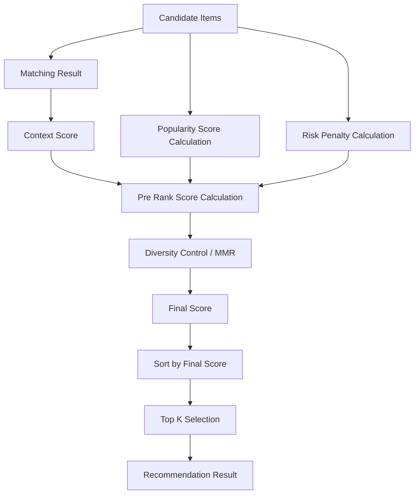

# Ranking定義書

## 1. 概要

### 1.1 目的

本ドキュメントは、ギフトレコメンドサービスにおける `Ranking` を定義する。

Rankingとは、Matchingで算出された意味一致スコアに、人気・安全性・多様性などの補正を加え、最終的な推薦順位を決定する処理である。

```text
Matching Result
+
Popularity Score
+
Risk Penalty
+
Diversity Control
↓
Final Ranking
↓
Recommendation Result
```

---

### 1.2 本ドキュメントの位置づけ

| 成果物 | 本ドキュメントとの関係 |
|---|---|
| Gift Meaning Space定義書 | Rankingの前段で使われる意味空間の前提 |
| Feature定義書 | Matchingで利用されるFeatureの定義元 |
| Featureルール定義書 | User / Item Feature生成の前提 |
| Semanticルール定義書 | Feature生成前のConcept抽出の前提 |
| Matching定義書 | Rankingの主要入力であるcontext_scoreを定義 |
| Recommendation Result定義書 | Ranking後の推薦結果を定義 |
| Reason生成定義書 | Ranking根拠をもとに推薦理由を生成 |

---

### 1.3 基本方針

- Rankingは、候補商品の最終順位を決定する処理である
- Rankingは、Matching結果である `context_score` を主要入力とする
- Rankingでは、意味一致だけでなく、人気・信頼性・リスク・多様性を考慮する
- Rankingは、Feature生成・Semantic Concept抽出を行わない
- Rankingは、User Feature / Item Featureを直接変更しない
- Rankingロジックは `model_version` に紐づけて管理する
- Feature生成ルール・Semanticルール・正規化ルールは `semantic_config_version` 側で管理する
- MVPでは、説明可能性を優先し、シンプルな線形スコアリング方式を採用する

---

## 2. Rankingの責務

### 2.1 In Scope

| 対象 | 内容 |
|---|---|
| context_score利用 | Matching結果を順位決定に利用する |
| popularity_score算出 | レビュー評価・レビュー件数等から人気・信頼性を補正する |
| risk_penalty算出 | 外しやすさ、不適切さ、避けたい条件との近さを減点する |
| pre_rank_score算出 | 多様性制御前の基本スコアを算出する |
| diversity制御 | 類似商品ばかり並ばないように調整する |
| final_score算出 | 最終順位用スコアを決定する |
| top_k選定 | 最終表示件数分の商品を選定する |
| score_breakdown保持 | スコア内訳を保持し、説明・評価に利用する |

---

### 2.2 Out of Scope

| 対象外 | 理由 | 管理先 |
|---|---|---|
| Semantic Concept抽出 | Ranking前の意味解釈であるため | Semanticルール定義書 |
| Feature生成 | Ranking前の意味特徴生成であるため | Featureルール定義書 |
| Feature正規化 | Feature生成側の処理であるため | Featureルール定義書 |
| Feature距離計算 | Matching側の責務であるため | Matching定義書 |
| context_score算出 | Matching側の責務であるため | Matching定義書 |
| Hard Filter | Ranking前に除外すべき条件であるため | Filtering / Retrieval |
| 商品取得 | 外部API・ETL側の責務であるため | Item Data / Batch |
| 推薦理由本文生成 | Ranking結果を使う後続処理であるため | Reason生成定義書 |

---

## 3. Ranking全体フロー

### 3.1 処理フロー



---

### 3.2 Rankingの段階

| 段階 | 処理 | 内容 |
|---:|---|---|
| 1 | Matching結果取得 | `context_score` / `social_match` / `symbolic_match` を受け取る |
| 2 | Popularity算出 | レビュー評価・レビュー件数等を正規化する |
| 3 | Risk算出 | 避けたい条件・社会的不一致・データ不足等を減点要素化する |
| 4 | Pre Rank算出 | context / popularity / riskを統合する |
| 5 | Diversity制御 | MMR等で類似商品の連続表示を抑える |
| 6 | Final Rank決定 | final_score順に並び替える |
| 7 | Top K選定 | 表示対象件数を決定する |

---

## 4. Ranking入力

### 4.1 入力一覧

| 入力 | 内容 | 生成元 |
|---|---|---|
| `candidate_item_id` | 候補商品ID | Retrieval |
| `context_score` | 意味一致スコア | Matching |
| `social_match` | Social系一致度 | Matching |
| `symbolic_match` | Symbolic系一致度 | Matching |
| `feature_match` | Feature単位一致度 | Matching |
| `avoid_similarity` | 避けたい意味との近さ | Matching / 任意 |
| `item_rating` | レビュー評価点 | Item Data |
| `item_review_count` | レビュー件数 | Item Data |
| `item_rank_signal` | ランキング・人気指標 | Item Data / 任意 |
| `item_feature_confidence` | Item Feature推定信頼度 | Feature生成 |
| `match_reason_basis` | Matching根拠 | Matching |
| `model_version_id` | Rankingロジックバージョン | Model Config |

---

### 4.2 context_score

`context_score` は、Matchingで算出された意味一致スコアである。

```text
context_score = Social / Symbolic統合後の意味一致度
```

| 値 | 解釈 |
|---:|---|
| 1.0に近い | ユーザー意図と商品意味が近い |
| 0.0に近い | ユーザー意図と商品意味が遠い |

Rankingでは、`context_score` を最重要の入力として扱う。

---

### 4.3 popularity入力

Popularity算出では、以下の情報を利用する。

| 入力 | 内容 |
|---|---|
| `item_rating` | レビュー評価点 |
| `item_review_count` | レビュー件数 |
| `item_rank_signal` | 外部ランキング・売れ筋情報 |
| `item_favorite_count` | お気に入り数。取得できる場合のみ |
| `item_purchase_signal` | 購買シグナル。取得できる場合のみ |

MVPでは、主に `item_rating` と `item_review_count` を利用する。

---

### 4.4 risk入力

Risk算出では、以下の情報を利用する。

| 入力 | 内容 |
|---|---|
| `social_match` | 社会的適切性の一致度 |
| `avoid_similarity` | 避けたい意味との近さ |
| `item_feature_confidence` | 商品意味推定の信頼度 |
| `item_data_quality_score` | 商品情報の充実度 |
| `ng_near_miss_flag` | NG条件に近い可能性 |
| `relationship_risk_level` | 関係性上の外しやすさ |

MVPでは、`avoid_similarity` / `social_match` / `item_feature_confidence` を中心に扱う。

---

## 5. Ranking出力

### 5.1 出力一覧

| 出力 | 内容 |
|---|---|
| `candidate_item_id` | 候補商品ID |
| `rank` | 最終順位 |
| `context_score` | 意味一致スコア |
| `popularity_score` | 人気・信頼性スコア |
| `risk_penalty` | リスク減点 |
| `pre_rank_score` | 多様性制御前スコア |
| `diversity_penalty` | 多様性制御による補正値 |
| `final_score` | 最終順位スコア |
| `score_breakdown` | スコア内訳 |
| `ranking_reason_basis` | 推薦理由生成向け根拠 |
| `model_version_id` | Rankingロジックバージョン |

---

### 5.2 出力イメージ

```json
{
  "candidate_item_id": "item_001",
  "rank": 1,
  "context_score": 0.84,
  "popularity_score": 0.72,
  "risk_penalty": 0.10,
  "pre_rank_score": 0.783,
  "diversity_penalty": 0.00,
  "final_score": 0.783,
  "score_breakdown": {
    "context_weight": 0.70,
    "popularity_weight": 0.20,
    "risk_weight": 0.10
  },
  "ranking_reason_basis": {
    "strong_points": ["formality", "story_richness"],
    "risk_notes": [],
    "popularity_notes": ["レビュー評価が安定している"]
  },
  "model_version_id": "model_v001"
}
```

---

## 6. Ranking Score設計

### 6.1 スコアの全体構造

MVPでは、以下の構造で最終順位を決定する。

```text
pre_rank_score
= w_context * context_score
+ w_popularity * popularity_score
- w_risk * risk_penalty
```

その後、多様性制御を適用し、最終的な `final_score` を決定する。

```text
final_score
= pre_rank_score - diversity_penalty
```

---

### 6.2 初期重み

MVP初期値は以下とする。

| 重み | 初期値 | 内容 |
|---|---:|---|
| `w_context` | 0.70 | 意味一致の重み |
| `w_popularity` | 0.20 | 人気・信頼性の重み |
| `w_risk` | 0.10 | リスク減点の重み |

```text
w_context + w_popularity + w_risk = 1.0
```

---

### 6.3 重み設計の考え方

| 項目 | 方針 |
|---|---|
| context_score | 本サービスの中核価値であるため最も重視する |
| popularity_score | 実用上の安心感として補助的に利用する |
| risk_penalty | 明らかに外しやすい商品を下げるために利用する |
| diversity_penalty | 同質商品の連続表示を避けるために後段で適用する |

---

### 6.4 pre_rank_scoreの解釈

| pre_rank_score | 解釈 |
|---:|---|
| 0.85〜1.00 | 非常に推薦しやすい |
| 0.70〜0.84 | 推薦しやすい |
| 0.55〜0.69 | 条件次第で推薦可能 |
| 0.40〜0.54 | 推薦優先度は低い |
| 0.00〜0.39 | 原則上位表示しない |

---

## 7. Popularity Score

### 7.1 Popularity Scoreとは

`popularity_score` は、商品が一般的にどれくらい支持されているか、または安心して推薦しやすいかを表す補助スコアである。

意味一致とは別の観点であり、Rankingでのみ利用する。

---

### 7.2 MVP採用式

MVPでは、レビュー評価点とレビュー件数を用いる。

```text
rating_score = item_rating / 5.0
```

```text
review_count_score
= log(1 + item_review_count) / log(1 + max_review_count_in_candidates)
```

```text
popularity_score
= w_rating * rating_score
+ w_review_count * review_count_score
```

---

### 7.3 初期重み

| 要素 | weight | 理由 |
|---|---:|---|
| `rating_score` | 0.60 | 評価点は品質・満足度の目安になる |
| `review_count_score` | 0.40 | 件数は信頼性・実績の目安になる |

---

### 7.4 review_countをlog変換する理由

レビュー件数は、一部の商品だけ極端に多くなる可能性がある。

そのため、件数をそのまま使うと、レビュー件数が多い定番商品ばかり上位に出る可能性がある。

```text
review_count
↓
log変換
↓
極端な件数差を圧縮
```

---

### 7.5 欠損時の扱い

| 欠損項目 | 扱い |
|---|---|
| rating欠損 | 中立値 `0.5` |
| review_count欠損 | `0` |
| max_review_countが0 | review_count_scoreを `0.5` |
| popularity全体欠損 | popularity_scoreを `0.5` |

---

## 8. Risk Penalty

### 8.1 Risk Penaltyとは

`risk_penalty` は、商品を上位推薦した場合に外す可能性・不適切になる可能性を表す減点値である。

```text
0.0 = リスクが低い
1.0 = リスクが高い
```

---

### 8.2 Risk Penaltyの対象

| リスク | 内容 |
|---|---|
| avoid_risk | 避けたい意味に商品が近い |
| social_low_risk | 社会的適切性が低い |
| data_quality_risk | 商品情報が不足している |
| ng_near_miss_risk | NG条件に近い可能性がある |
| over_symbolic_risk | 関係性に対して意味性・親密性が強すぎる |

---

### 8.3 MVP採用式

MVPでは、以下を基本とする。

```text
risk_penalty
= w_avoid * avoid_risk
+ w_social * social_low_risk
+ w_data_quality * data_quality_risk
```

---

### 8.4 初期重み

| 要素 | weight | 内容 |
|---|---:|---|
| `avoid_risk` | 0.50 | 避けたい条件との近さ |
| `social_low_risk` | 0.30 | Social Matchの低さ |
| `data_quality_risk` | 0.20 | 商品情報・Feature推定の弱さ |

---

### 8.5 avoid_risk

`avoid_risk` は、避けたい意味に商品がどれくらい近いかを表す。

```text
avoid_risk = avoid_similarity
```

| avoid_similarity | 解釈 |
|---:|---|
| 0.0 | 避けたい意味から遠い |
| 1.0 | 避けたい意味に非常に近い |

`avoid_similarity` が未算出の場合は、`0.0` とする。

---

### 8.6 social_low_risk

`social_low_risk` は、社会的適切性が一定以下の場合に発生するリスクである。

```text
social_low_risk
= max(0.0, social_threshold - social_match) / social_threshold
```

MVP初期値：

```text
social_threshold = 0.60
```

例：

| social_match | social_low_risk |
|---:|---:|
| 0.80 | 0.00 |
| 0.60 | 0.00 |
| 0.45 | 0.25 |
| 0.30 | 0.50 |

---

### 8.7 data_quality_risk

`data_quality_risk` は、商品Feature推定の信頼度が低い場合のリスクである。

```text
data_quality_risk = 1.0 - item_feature_confidence
```

`item_feature_confidence` が未算出の場合は、MVPでは `0.5` を使用する。

---

### 8.8 NG条件との関係

NG条件はRankingで減点するのではなく、原則としてRanking前に除外する。

| 条件 | 扱い |
|---|---|
| 絶対NG | Hard Filterで除外 |
| 予算範囲外 | Hard Filterで除外 |
| 在庫なし | Hard Filterで除外 |
| 避けたい傾向 | Risk Penaltyで減点 |
| 微妙に合わない | Rankingで順位を下げる |

---

## 9. Final Score

### 9.1 Final Scoreとは

`final_score` は、最終的な推薦順位を決めるスコアである。

MVPでは、以下の2段階で算出する。

```text
pre_rank_score
= w_context * context_score
+ w_popularity * popularity_score
- w_risk * risk_penalty
```

```text
final_score
= pre_rank_score - diversity_penalty
```

---

### 9.2 スコア範囲

`final_score` は、原則として `0.0〜1.0` の範囲に収める。

ただし、計算途中で範囲外になる場合があるため、最終出力時のみ安全ガードを行う。

```text
final_score = guard_clip(final_score, 0.0, 1.0)
```

ここでの `clip` は、Feature正規化の主処理ではなく、Ranking結果の安全ガードである。

---

### 9.3 final_scoreの解釈

| final_score | 解釈 |
|---:|---|
| 0.85〜1.00 | 最上位候補 |
| 0.70〜0.84 | 強い推薦候補 |
| 0.55〜0.69 | 推薦可能 |
| 0.40〜0.54 | 補欠候補 |
| 0.00〜0.39 | 原則表示しない |

---

## 10. Diversity Control

### 10.1 Diversity Controlとは

Diversity Controlは、意味的に近い商品ばかりが上位に並ぶことを防ぐ処理である。

例：

```text
上位10件が全部「高級チョコレート」になる
```

このような結果を避けるため、一定の多様性を持たせる。

---

### 10.2 MVP採用方式

MVPでは、MMRによる簡易的な多様性制御を採用する。

```text
MMR Score
= lambda_mmr * pre_rank_score(item)
- (1.0 - lambda_mmr) * max_similarity_to_selected_items(item)
```

---

### 10.3 lambda_mmr

`lambda_mmr` は、関連性と多様性のバランスを表す。

| lambda_mmr | 解釈 |
|---:|---|
| 1.0 | pre_rank_scoreのみ重視 |
| 0.7 | 関連性重視、少し多様性を入れる |
| 0.5 | 関連性と多様性を同程度に見る |
| 0.3 | 多様性を強く重視 |

MVP初期値は以下とする。

```text
lambda_mmr = 0.75
```

---

### 10.4 類似度の算出

MVPでは、商品間類似度は以下のいずれかで算出する。

| 類似度 | 内容 | MVP判断 |
|---|---|---|
| Feature類似度 | Item Feature同士の近さ | 推奨 |
| カテゴリ一致 | 同一カテゴリかどうか | 補助 |
| 商品名類似 | 商品名テキストの類似 | 任意 |
| embedding類似 | 商品embeddingの類似 | 将来候補 |

MVPでは、まずItem Featureベースの類似度を利用する。

```text
item_similarity
= 1.0 - average_absolute_distance(item_feature_a, item_feature_b)
```

---

### 10.5 MMR適用対象

MMRは、全候補商品に対してではなく、pre_rank_score上位候補に対して適用する。

MVP初期値：

| 項目 | 値 |
|---|---:|
| MMR対象件数 | pre_rank_score上位50件 |
| 最終表示件数 | top_k |
| lambda_mmr | 0.75 |

---

### 10.6 Diversity Penaltyとの関係

MMRを採用する場合、必ずしも `diversity_penalty` をDB上で明示的に持つ必要はない。

ただし、説明・分析のために以下を保持してよい。

| 項目 | 内容 |
|---|---|
| `max_similarity_to_selected_items` | 既選定商品との最大類似度 |
| `mmr_score` | MMR適用時のスコア |
| `diversity_penalty` | 多様性制御による相対的な減点 |

---

## 11. Top K Selection

### 11.1 top_kとは

`top_k` は、最終的に画面へ表示する推薦商品数である。

例：

```text
top_k = 10
```

---

### 11.2 MVP初期値

| 用途 | top_k |
|---|---:|
| 通常レコメンド表示 | 10 |
| デバッグ・評価用 | 20〜50 |
| API内部候補 | 50 |

---

### 11.3 top_k選定方針

```text
1. Hard Filter済み候補を取得
2. Matchingを実行
3. pre_rank_scoreを算出
4. 上位N件にMMRを適用
5. final_score順にtop_k件を返却
```

---

## 12. Ranking方式の設計判断

### 12.1 線形スコアリングを採用する理由

MVPでは、線形スコアリングを採用する。

理由は以下である。

| 観点 | 理由 |
|---|---|
| 説明可能性 | スコア内訳を人間が理解しやすい |
| 実装容易性 | 初期開発コストが低い |
| デバッグ容易性 | context / popularity / riskの影響を追いやすい |
| 改善容易性 | 重みを変更して検証しやすい |
| 学習データ不要 | MVP初期でも利用できる |

---

### 12.2 学習型Rankingを採用しない理由

MVPでは、学習型Rankingは採用しない。

| 方式 | 採用しない理由 |
|---|---|
| Learning to Rank | 学習データが不足している |
| Neural Ranking | 説明性・実装コストが重い |
| 個人別最適化 | 認証・履歴・行動ログが前提 |
| 自動重み最適化 | 評価データ蓄積後に検討すべき |

---

### 12.3 context_scoreを最重視する理由

本サービスの差別化価値は、単なる人気商品推薦ではなく、「贈答意味に合う商品」を推薦する点にある。

そのため、MVPでは以下の優先度とする。

```text
context_score > popularity_score > risk_penalty
```

ただし、risk_penaltyは安全性担保のために必須である。

---

## 13. model_versionとの関係

### 13.1 Rankingでmodel_version管理するもの

Rankingロジックは、`model_version` に紐づけて管理する。

| 管理対象 | 内容 |
|---|---|
| final_score_formula | final_score算出式 |
| ranking_weights | context / popularity / riskの重み |
| popularity_formula | popularity_score算出式 |
| popularity_weights | rating / review_count等の重み |
| risk_formula | risk_penalty算出式 |
| risk_weights | avoid / social / data_quality等の重み |
| diversity_method | MMR等の多様性制御方式 |
| lambda_mmr | MMRの関連性・多様性バランス |
| top_k_default | 表示件数初期値 |
| threshold_rule | 表示・非表示閾値 |

---

### 13.2 semantic_config_versionとの違い

| 管理対象 | 管理先 | 理由 |
|---|---|---|
| Semantic Concept定義 | semantic_config_version | 意味の作り方 |
| Feature生成ルール | semantic_config_version | 意味の作り方 |
| Feature正規化ルール | semantic_config_version | 意味の作り方 |
| Matching計算 | model_version | 比較・スコア化の仕方 |
| Ranking計算 | model_version | 順位の決め方 |
| MMR | model_version | 並び順の決め方 |
| final_score | model_version | 最終順位の決め方 |

---

## 14. DB・実装上の扱い

### 14.1 ranking_score

論理的には以下の項目を持つ。

| 項目 | 内容 |
|---|---|
| ranking_score_id | Ranking Score ID |
| recommendation_run_id | 推薦実行ID |
| candidate_item_id | 候補商品ID |
| context_score | 意味一致スコア |
| popularity_score | 人気・信頼性スコア |
| risk_penalty | リスク減点 |
| pre_rank_score | 多様性制御前スコア |
| diversity_penalty | 多様性制御による補正 |
| final_score | 最終順位スコア |
| model_version_id | 使用したRankingロジックバージョン |
| calculated_at | 算出日時 |

---

### 14.2 score_breakdown

`score_breakdown` は、スコア内訳を保持するJSONまたは別テーブルで管理する。

```json
{
  "context": {
    "score": 0.84,
    "weight": 0.70,
    "contribution": 0.588
  },
  "popularity": {
    "score": 0.72,
    "weight": 0.20,
    "contribution": 0.144
  },
  "risk": {
    "penalty": 0.10,
    "weight": 0.10,
    "contribution": -0.010
  },
  "diversity": {
    "penalty": 0.00
  }
}
```

---

### 14.3 recommendation_result_item

Ranking結果は、最終的に推薦結果明細へ反映する。

| 項目 | 内容 |
|---|---|
| recommendation_result_item_id | 推薦結果明細ID |
| recommendation_run_id | 推薦実行ID |
| item_id | 商品ID |
| rank | 表示順位 |
| final_score | 最終スコア |
| context_score | 意味一致スコア |
| popularity_score | 人気スコア |
| risk_penalty | リスク減点 |
| score_breakdown | スコア内訳 |
| reason_basis | 推薦理由生成用根拠 |

---

### 14.4 実装形式

MVPでは、以下の実装方式を推奨する。

| 方式 | 内容 | MVP適性 |
|---|---|---|
| Python関数 | recoサービス内でRanking算出 | 高 |
| DB保存 | 再現性・評価用にRanking結果を保存 | 高 |
| JSON保存 | score_breakdownを柔軟に保持 | 高 |
| SQL計算 | 単純なscore計算のみDBで実施 | 中 |
| TypeScript計算 | API側で軽量に扱う | 低〜中 |

MVPでは、`recoサービス内で算出 + DB保存` を推奨する。

---

## 15. 疑似コード

### 15.1 Popularity Score算出

```python
import math


def calculate_popularity_score(
    item_rating: float | None,
    item_review_count: int | None,
    max_review_count: int,
    w_rating: float = 0.6,
    w_review_count: float = 0.4,
) -> float:
    rating_score = 0.5 if item_rating is None else item_rating / 5.0

    if item_review_count is None:
        item_review_count = 0

    if max_review_count <= 0:
        review_count_score = 0.5
    else:
        review_count_score = math.log1p(item_review_count) / math.log1p(max_review_count)

    popularity_score = (
        w_rating * rating_score
        + w_review_count * review_count_score
    )

    return max(0.0, min(1.0, popularity_score))
```

---

### 15.2 Risk Penalty算出

```python
def calculate_social_low_risk(
    social_match: float,
    social_threshold: float = 0.6,
) -> float:
    if social_match >= social_threshold:
        return 0.0

    return (social_threshold - social_match) / social_threshold


def calculate_risk_penalty(
    avoid_similarity: float | None,
    social_match: float,
    item_feature_confidence: float | None,
    w_avoid: float = 0.5,
    w_social: float = 0.3,
    w_data_quality: float = 0.2,
) -> float:
    avoid_risk = 0.0 if avoid_similarity is None else avoid_similarity
    social_low_risk = calculate_social_low_risk(social_match)

    if item_feature_confidence is None:
        item_feature_confidence = 0.5

    data_quality_risk = 1.0 - item_feature_confidence

    risk_penalty = (
        w_avoid * avoid_risk
        + w_social * social_low_risk
        + w_data_quality * data_quality_risk
    )

    return max(0.0, min(1.0, risk_penalty))
```

---

### 15.3 Pre Rank Score算出

```python
def calculate_pre_rank_score(
    context_score: float,
    popularity_score: float,
    risk_penalty: float,
    w_context: float = 0.7,
    w_popularity: float = 0.2,
    w_risk: float = 0.1,
) -> float:
    score = (
        w_context * context_score
        + w_popularity * popularity_score
        - w_risk * risk_penalty
    )

    return max(0.0, min(1.0, score))
```

---

### 15.4 MMR Ranking

```python
def calculate_item_similarity(item_a_features, item_b_features, features):
    distances = [
        abs(item_a_features[f] - item_b_features[f])
        for f in features
    ]

    average_distance = sum(distances) / len(distances)

    return 1.0 - average_distance


def select_with_mmr(
    candidates,
    top_k: int,
    lambda_mmr: float = 0.75,
):
    selected = []
    remaining = candidates.copy()

    while remaining and len(selected) < top_k:
        best_item = None
        best_mmr_score = float("-inf")

        for item in remaining:
            if not selected:
                max_similarity = 0.0
            else:
                max_similarity = max(
                    calculate_item_similarity(
                        item["item_features"],
                        selected_item["item_features"],
                        item["features"],
                    )
                    for selected_item in selected
                )

            mmr_score = (
                lambda_mmr * item["pre_rank_score"]
                - (1.0 - lambda_mmr) * max_similarity
            )

            if mmr_score > best_mmr_score:
                best_mmr_score = mmr_score
                best_item = item

        best_item["mmr_score"] = best_mmr_score
        selected.append(best_item)
        remaining.remove(best_item)

    return selected
```

---

## 16. エラーハンドリング

### 16.1 入力欠損

| ケース | 扱い |
|---|---|
| context_score欠損 | Ranking不可として候補から除外 |
| popularity情報欠損 | popularity_scoreを0.5で補完 |
| risk情報欠損 | 算出可能な要素のみでrisk_penaltyを算出 |
| social_match欠損 | social_low_riskを0.0、または候補除外 |
| item_feature_confidence欠損 | 0.5で補完 |
| model_version欠損 | 現行有効versionを使用 |
| top_k欠損 | デフォルト値10を使用 |

---

### 16.2 異常値

Ranking入力は原則として `0.0〜1.0` の値を想定する。

範囲外の値が来た場合は、以下の順で扱う。

```text
1. エラーログ記録
2. 対象値をguard_clip
3. metric_logへ異常値発生を記録
4. 必要に応じて対象候補を除外
```

---

### 16.3 候補数不足

| ケース | 扱い |
|---|---|
| 候補数がtop_k未満 | 取得できた件数のみ返す |
| 候補数が0件 | 条件緩和メッセージを返す |
| Hard Filterで全除外 | 条件見直しを促す |
| Ranking後に表示閾値を満たさない | 閾値を緩めるか、補欠候補として表示する |

---

## 17. 品質・レビュー観点

### 17.1 レビュー観点

| 観点 | 確認内容 |
|---|---|
| context重視 | 意味一致が低い商品が人気だけで上位に来ていないか |
| popularity過多 | 定番・レビュー多数商品に偏りすぎていないか |
| risk妥当性 | 避けたい条件や不適切商品が適切に下がっているか |
| diversity妥当性 | 似た商品ばかりが並んでいないか |
| 説明可能性 | final_scoreの内訳を説明できるか |
| 再現性 | model_versionにより同じ結果を再現できるか |
| 欠損耐性 | レビュー欠損・Feature信頼度欠損でも破綻しないか |
| MVP適性 | 複雑すぎず、改善しやすい設計か |

---

### 17.2 よくある問題

| 問題 | 内容 | 対応 |
|---|---|---|
| 人気商品ばかりになる | popularity_weightが高い | w_popularityを下げる |
| 意味は合うが危ない商品が上位に来る | risk_penaltyが弱い | w_riskやrisk式を見直す |
| 似た商品が並ぶ | diversity制御が弱い | lambda_mmrを下げる |
| 意味一致が効かない | w_contextが低い | w_contextを上げる |
| 全候補のscore差が小さい | 正規化・重みが弱い | Matching分布を確認する |
| 上位理由が説明できない | score_breakdown不足 | ranking_reason_basisを保持する |
| avoidが効かない | avoid_similarity未算出または重み不足 | Matching / Risk設計を確認する |

---

## 18. Observability / Evaluation

### 18.1 監視対象

Rankingでは、以下を監視対象とする。

| 監視対象 | 目的 |
|---|---|
| context_score分布 | 意味一致スコアの偏り確認 |
| popularity_score分布 | 人気補正の偏り確認 |
| risk_penalty分布 | リスク減点の効き方確認 |
| pre_rank_score分布 | 多様性制御前の順位傾向確認 |
| final_score分布 | 最終順位スコアの偏り確認 |
| top_k内カテゴリ分布 | 類似商品偏り確認 |
| MMR適用前後の順位変化 | 多様性制御の影響確認 |
| 上位商品のscore_breakdown | 推薦理由の妥当性確認 |

---

### 18.2 評価観点

| 評価 | 内容 |
|---|---|
| 人手評価 | 上位商品が贈答文脈に合っているか |
| 意味一致評価 | context_scoreが高い商品が妥当か |
| 安全性評価 | 上司・取引先などで外しにくい商品になっているか |
| 特別感評価 | 恋人・記念日などでSymbolicが効いているか |
| 多様性評価 | 同じカテゴリ・同じ意味の商品に偏りすぎていないか |
| 説明性評価 | なぜ上位なのか説明可能か |

---

### 18.3 改善ループ

```text
Ranking Result
↓
Human / Offline Evaluation
↓
Score Breakdown分析
↓
context / popularity / risk / diversityの影響確認
↓
model_version更新
↓
再評価
```

---

## 19. MVPでの扱い

### 19.1 MVP対象

| 項目 | 方針 |
|---|---|
| context_score利用 | 必須 |
| popularity_score | rating + review_countで算出 |
| risk_penalty | avoid / social / data_qualityで算出 |
| final_score | 線形スコアリングで算出 |
| diversity制御 | MMRを簡易採用 |
| top_k | 通常10件 |
| score_breakdown | 必須 |
| model_version管理 | 必須 |
| Ranking結果保存 | 必須 |

---

### 19.2 MVP対象外

| 項目 | 理由 |
|---|---|
| Learning to Rank | 学習データ不足 |
| 個人別Ranking | 認証・履歴管理が前提 |
| リアルタイム重み最適化 | MVPでは過剰 |
| 高度な購買予測 | 購買データ不足 |
| 複雑な多目的最適化 | 初期検証では過剰 |
| 売上最大化Ranking | 本サービスの初期価値検証とズレる |

---

## 20. 後続成果物への引き継ぎ

### 20.1 Recommendation Result定義書への引き継ぎ

| 引き継ぎ項目 | 内容 |
|---|---|
| rank | 表示順位 |
| final_score | 最終スコア |
| context_score | 意味一致スコア |
| popularity_score | 人気スコア |
| risk_penalty | リスク減点 |
| score_breakdown | スコア内訳 |
| model_version_id | Ranking再現用 |

---

### 20.2 Reason生成定義書への引き継ぎ

| 引き継ぎ項目 | 用途 |
|---|---|
| score_breakdown | なぜ上位かを説明する |
| match_reason_basis | 意味的に合う理由を説明する |
| popularity_score | 安心感・評価の補足に使う |
| risk_penalty | 注意点や控えめ表現に使う |
| strong_match Feature | 推薦理由の主要根拠に使う |

---

### 20.3 Evaluation定義書への引き継ぎ

| 引き継ぎ項目 | 用途 |
|---|---|
| final_score | 推薦順位の妥当性評価 |
| pre_rank_score | MMR前の順位分析 |
| context_score | 意味一致の評価 |
| popularity_score | 人気補正の影響分析 |
| risk_penalty | 安全性補正の影響分析 |
| MMR適用結果 | 多様性制御の評価 |

---

## 21. まとめ

Rankingは、Matching結果をもとに、候補商品の最終順位を決定する工程である。

```text
context_score
+
popularity_score
-
risk_penalty
↓
pre_rank_score
↓
diversity_control
↓
final_score
↓
top_k recommendation
```

MVPでは、以下の方針で運用する。

```text
- context_scoreを最重要入力とする
- popularity_scoreは補助的に利用する
- risk_penaltyで外しやすい商品を下げる
- final_scoreは線形スコアリングで算出する
- MMRにより類似商品の連続表示を抑制する
- top_kは通常10件とする
- score_breakdownを保持し、説明・評価・改善に利用する
- Rankingロジックはmodel_version配下で管理する
```

Rankingは「どの商品をどの順番で出すか」を決める層であり、Semantic抽出・Feature生成・Matchingとは明確に責務を分離する。