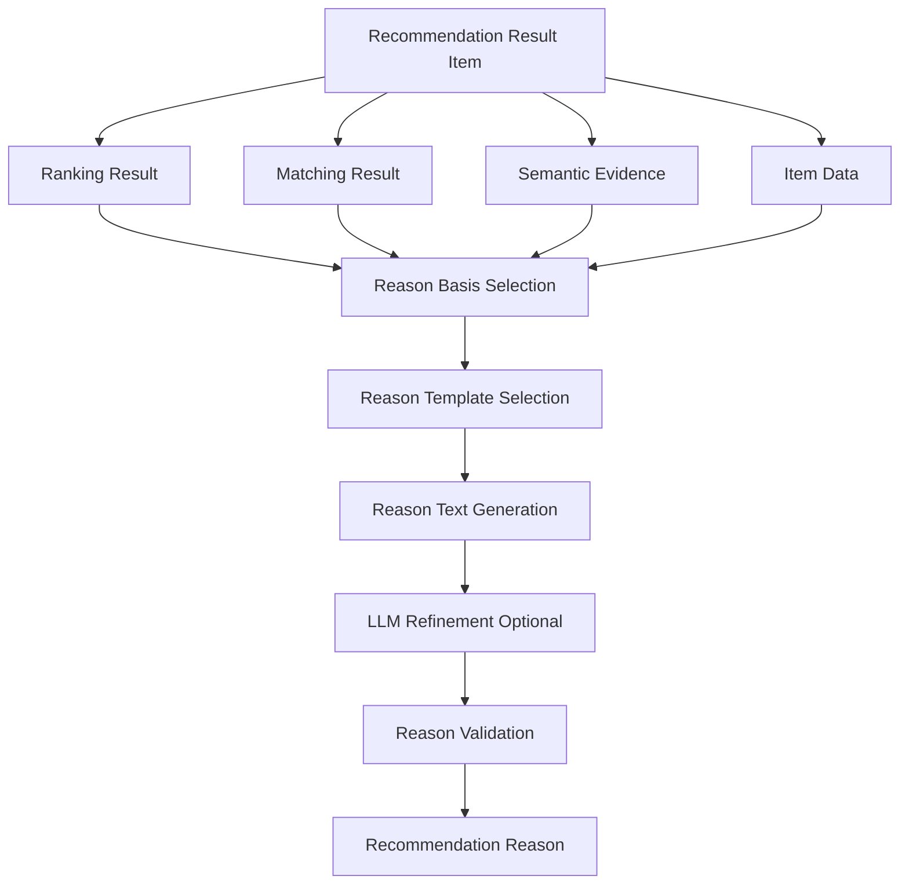

# Reason生成定義書

## 1. 概要

### 1.1 目的

本ドキュメントは、ギフトレコメンドサービスにおける `Reason生成` を定義する。

Reason生成とは、推薦された商品について、ユーザーに対して「なぜこの商品が合っているのか」を説明する処理である。

```text
Ranking Result
+
Matching Result
+
Semantic Evidence
+
Item Data
↓
Reason Generation
↓
Recommendation Reason
```

---

### 1.2 本ドキュメントの位置づけ

| 成果物 | 本ドキュメントとの関係 |
|---|---|
| Semanticルール定義書 | Concept抽出根拠である evidence_text を提供する |
| Featureルール定義書 | Feature生成の意味的背景を提供する |
| Matching定義書 | strong_match / weak_match / context_score を提供する |
| Ranking定義書 | final_score / score_breakdown / ranking_reason_basis を提供する |
| Recommendation Result定義書 | 生成したReasonを推薦結果に保持・表示する |
| Evaluation定義書 | Reasonの妥当性を人手評価する |

---

### 1.3 基本方針

- Reason生成は、推薦理由をユーザーに説明するための処理である
- Reason生成は、Ranking結果を変更しない
- Reason生成は、スコア算出を行わない
- Reason生成は、Semantic / Feature / Matching / Rankingの結果を根拠として利用する
- Reasonは、必ず根拠データに基づいて生成する
- 商品情報に存在しない事実を生成してはならない
- MVPでは、テンプレート生成を基本とし、LLMは自然文整形の補助に限定する
- Reason生成ロジックは `model_version` に紐づけて管理する
- Reasonの根拠には `evidence_text` / `feature_match` / `score_breakdown` を保持する

---

## 2. Reason生成の責務

### 2.1 In Scope

| 対象 | 内容 |
|---|---|
| 推薦理由生成 | 商品が文脈に合う理由を生成する |
| 意味一致理由生成 | strong_match Featureをもとに理由を作る |
| 人気・安心補足生成 | popularity_scoreをもとに補足する |
| 注意・弱点補足生成 | weak_matchやrisk_penaltyをもとに控えめな補足を作る |
| 根拠保持 | Reason生成に使ったFeature / Score / evidenceを保持する |
| 表示文生成 | UI表示用の短文・詳細文を生成する |
| LLM整形 | テンプレート文を自然な表現へ整える |

---

### 2.2 Out of Scope

| 対象外 | 理由 | 管理先 |
|---|---|---|
| Semantic Concept抽出 | Reason生成前の処理であるため | Semanticルール定義書 |
| Feature値生成 | Reason生成前の処理であるため | Featureルール定義書 |
| Matching計算 | Reason生成前の一致度計算であるため | Matching定義書 |
| Ranking計算 | Reason生成前の順位決定であるため | Ranking定義書 |
| final_score変更 | Reasonは説明であり、順位決定ではないため | Ranking定義書 |
| 商品データ取得 | 外部API・ETL側の責務であるため | Item Data / Batch |
| ユーザー説得文の過剰生成 | 信頼性を損なうため | 対象外 |

---

## 3. Reason生成の全体フロー

### 3.1 処理フロー



---

### 3.2 Reason生成の段階

| 段階 | 処理 | 内容 |
|---:|---|---|
| 1 | 根拠取得 | Ranking / Matching / Semantic / Item情報を取得する |
| 2 | 根拠選定 | Reasonに使う強い根拠を選ぶ |
| 3 | テンプレート選択 | 関係性・用途・Featureに応じた文型を選ぶ |
| 4 | 文面生成 | 表示用Reasonを生成する |
| 5 | LLM整形 | 必要に応じて自然文として整える |
| 6 | 妥当性検証 | 根拠なし表現・過剰表現を除外する |
| 7 | 保存・表示 | 推薦結果にReasonを紐づける |

---

## 4. Reason生成入力

### 4.1 入力一覧

| 入力 | 内容 | 生成元 |
|---|---|---|
| `recommendation_result_item` | 推薦結果明細 | Ranking |
| `rank` | 表示順位 | Ranking |
| `final_score` | 最終スコア | Ranking |
| `context_score` | 意味一致スコア | Matching |
| `social_match` | Social一致度 | Matching |
| `symbolic_match` | Symbolic一致度 | Matching |
| `feature_match` | Feature単位一致度 | Matching |
| `strong_match_features` | 強く一致したFeature | Matching |
| `weak_match_features` | 一致が弱いFeature | Matching |
| `score_breakdown` | スコア内訳 | Ranking |
| `popularity_score` | 人気・信頼性スコア | Ranking |
| `risk_penalty` | リスク減点 | Ranking |
| `semantic_evidence` | Concept抽出根拠 | Semantic Rule |
| `item_data` | 商品名・説明・レビュー等 | Item Data |
| `relationship` | 贈る相手との関係性 | User Request |
| `occasion` | 贈答目的 | User Request |
| `model_version_id` | Reason生成ロジックバージョン | Model Config |

---

### 4.2 Reason生成で特に重要な入力

| 入力 | 理由 |
|---|---|
| `strong_match_features` | 推薦理由の主軸になる |
| `context_score` | 意味的に合っている度合いを示す |
| `social_match` | 失礼がない・きちんとしている等の説明に使う |
| `symbolic_match` | 特別感・気持ち・相手らしさ等の説明に使う |
| `semantic_evidence` | 商品や入力から抽出した根拠を説明に接続する |
| `score_breakdown` | なぜ上位になったかを説明できる |
| `risk_penalty` | 注意点や控えめな表現の判断に使う |

---

## 5. Reason生成出力

### 5.1 出力一覧

| 出力 | 内容 |
|---|---|
| `reason_summary` | UIに表示する短い推薦理由 |
| `reason_detail` | 詳細表示用の説明文 |
| `reason_points` | 箇条書きの理由 |
| `reason_badges` | 「上品」「実用的」などの表示ラベル |
| `caution_note` | 必要に応じた補足・注意文 |
| `reason_basis` | Reason生成に使った根拠データ |
| `generation_method` | template / llm_refined / hybrid |
| `model_version_id` | Reason生成ロジックバージョン |

---

### 5.2 出力イメージ

```json
{
  "candidate_item_id": "item_001",
  "reason_summary": "上司へのお礼として、きちんと感と安心感のバランスが良い候補です。",
  "reason_detail": "この商品は、儀礼性と安全性の一致度が高く、上司へのお礼として失礼になりにくい点が評価されています。レビュー評価も安定しているため、初回の贈り物としても選びやすい候補です。",
  "reason_points": [
    "上司へのお礼に必要なきちんと感に合っています",
    "安全性の一致度が高く、外しにくい候補です",
    "レビュー評価が安定しており、安心材料があります"
  ],
  "reason_badges": [
    "きちんと感",
    "外しにくい",
    "安心感"
  ],
  "caution_note": null,
  "generation_method": "template",
  "model_version_id": "model_v001"
}
```

---

## 6. Reason種別

### 6.1 Reason種別一覧

| reason_type | 内容 | 表示優先度 |
|---|---|---:|
| `context_reason` | 贈答文脈に合う理由 | 高 |
| `social_reason` | 社会的に適切な理由 | 高 |
| `symbolic_reason` | 気持ち・特別感・相手らしさに合う理由 | 高 |
| `popularity_reason` | 評価・レビュー等による安心材料 | 中 |
| `risk_note` | 注意点・控えめな補足 | 中 |
| `diversity_reason` | 他候補と違う観点での補足 | 低 |

---

### 6.2 MVPで生成するReason

MVPでは、以下を生成対象とする。

| Reason | MVP対象 | 備考 |
|---|---|---|
| reason_summary | ○ | 一覧表示用 |
| reason_detail | ○ | 詳細表示用 |
| reason_points | ○ | 2〜3個 |
| reason_badges | ○ | UI補助 |
| caution_note | △ | riskが高い場合のみ |
| diversity_reason | × | 初期は内部分析用 |

---

## 7. Reason生成方針

### 7.1 基本生成方針

Reasonは、以下の優先順位で生成する。

```text
1. context_scoreが高い理由
2. strong_match Featureに基づく理由
3. relationship / occasionに合う理由
4. popularity_scoreによる安心補足
5. risk_penaltyがある場合の注意補足
```

---

### 7.2 Reasonに使う根拠の優先順位

| 優先度 | 根拠 | 用途 |
|---:|---|---|
| 1 | strong_match_features | 主理由 |
| 2 | relationship / occasion | 文脈接続 |
| 3 | semantic_evidence | 具体的根拠 |
| 4 | score_breakdown | スコア説明 |
| 5 | popularity_score | 安心材料 |
| 6 | weak_match / risk_penalty | 注意補足 |

---

### 7.3 Reasonに使わないもの

| 使わないもの | 理由 |
|---|---|
| 根拠のない商品特徴 | ハルシネーション防止 |
| 未取得の商品属性 | 事実誤認防止 |
| 過度な断定表現 | ユーザーの期待値を歪める |
| final_scoreの数値そのもの | 一般ユーザーには意味が伝わりにくい |
| 内部ロジック名 | UI上は不要 |
| LLMの推測だけの内容 | 根拠性が弱いため |

---

## 8. Feature別Reason表現

### 8.1 Social Feature

| feature_code | 表示表現例 | Reason観点 |
|---|---|---|
| `formality` | きちんと感がある | 礼儀・儀礼性 |
| `safety` | 外しにくい | 安心感・無難さ |
| `brand_appropriateness` | 贈り物としての見栄えがある | 品位・ブランド適切性 |

---

### 8.2 Symbolic Feature

| feature_code | 表示表現例 | Reason観点 |
|---|---|---|
| `emotion` | 気持ちが伝わりやすい | 感謝・愛情・温かさ |
| `novelty` | 少し特別感がある | 記念性・意外性 |
| `intimacy` | 親しい相手に合いやすい | 距離感・親密性 |
| `symbolic_identity` | 相手らしさに寄せやすい | 個性・価値観 |
| `story_richness` | 選んだ理由を伝えやすい | ストーリー・背景 |

---

### 8.3 Feature Match閾値と表現

| feature_match | 表現方針 |
|---:|---|
| 0.90〜1.00 | 「非常に合っています」 |
| 0.80〜0.89 | 「合っています」 |
| 0.70〜0.79 | 「比較的合っています」 |
| 0.60〜0.69 | 「一定程度合っています」 |
| 0.00〜0.59 | 主理由には使わない |

MVPでは、Reason本文に使うFeatureは原則として `feature_match >= 0.80` のものに限定する。

---

## 9. Relationship / Occasion別Reason方針

### 9.1 Relationship別の表現方針

| relationship_code | Reason方針 |
|---|---|
| `lover` | 感情・特別感・親密性を中心に説明する |
| `spouse` | 気持ち・日常への理解・ストーリー性を中心に説明する |
| `family_parent` | 感謝・実用性・温かさを中心に説明する |
| `family_child` | 楽しさ・特別感・相手らしさを中心に説明する |
| `friend_close` | 気軽さ・親しさ・少し特別感を中心に説明する |
| `friend_casual` | 気を遣わせない・外しにくい理由を中心に説明する |
| `colleague` | きちんと感・軽さ・安全性を中心に説明する |
| `boss` | 失礼がない・品がある・外しにくい理由を中心に説明する |
| `business_partner` | 礼儀・安心感・品位を中心に説明する |
| `other` | 汎用的な適切性と安心感を中心に説明する |

---

### 9.2 Occasion別の表現方針

| occasion_code | Reason方針 |
|---|---|
| `birthday` | 特別感・相手らしさ・気持ちを説明する |
| `anniversary` | 記念性・ストーリー性・感情を説明する |
| `thanks` | 感謝が伝わる・失礼がない理由を説明する |
| `apology` | きちんと感・安全性・控えめさを説明する |
| `celebration_general` | お祝い感・華やかさ・安心感を説明する |
| `wedding_gift` | 品位・お祝い感・外しにくさを説明する |
| `baby_gift` | 実用性・温かさ・安心感を説明する |
| `housewarming` | 実用性・生活になじむ理由を説明する |
| `farewell` | 感謝・記念性・選んだ理由を説明する |
| `get_well` | 気遣い・安心感・控えめさを説明する |
| `souvenir` | 気軽さ・外しにくさ・渡しやすさを説明する |
| `return_gift` | 礼儀・適切さ・気を遣わせない理由を説明する |
| `no_specific_occasion` | 気軽さ・相手らしさ・負担の少なさを説明する |
| `other` | 汎用的な適切性を説明する |

---

## 10. Reasonテンプレート

### 10.1 Summaryテンプレート

```text
{relationship_label}への{occasion_label}として、{primary_reason}がある候補です。
```

例：

```text
上司へのお礼として、きちんと感と安心感がある候補です。
```

---

### 10.2 Social Reasonテンプレート

```text
{relationship_label}への{occasion_label}では、{social_expression}が重要になりやすく、この商品はその点で条件に合っています。
```

例：

```text
上司へのお礼では、失礼になりにくいきちんと感が重要になりやすく、この商品はその点で条件に合っています。
```

---

### 10.3 Symbolic Reasonテンプレート

```text
{occasion_label}らしい{symbolic_expression}を出しやすく、気持ちを伝えるギフトとして選びやすい候補です。
```

例：

```text
記念日らしい特別感を出しやすく、気持ちを伝えるギフトとして選びやすい候補です。
```

---

### 10.4 Popularity Reasonテンプレート

```text
レビュー評価や件数も一定あり、安心して選びやすい点も補足材料です。
```

---

### 10.5 Risk Noteテンプレート

```text
一方で、{weak_point}はやや控えめなため、{user_expectation}を強く求める場合は他候補も比較するとよいです。
```

例：

```text
一方で、特別感はやや控えめなため、印象に残るギフトを強く求める場合は他候補も比較するとよいです。
```

---

### 10.6 Item Evidenceテンプレート

```text
商品情報上の「{evidence_text}」という表現からも、{concept_label}の方向性が読み取れます。
```

例：

```text
商品情報上の「老舗職人が丁寧に仕上げた」という表現からも、上質さやストーリー性の方向性が読み取れます。
```

---

## 11. Reason生成ルール

### 11.1 主理由の選定

主理由は、以下の条件を満たすFeatureから選ぶ。

```text
feature_match >= 0.80
```

かつ、以下の優先順位で選定する。

```text
1. relationship / occasionに重要なFeature
2. feature_matchが高いFeature
3. semantic_evidenceが存在するFeature
4. score_breakdown上、context寄与が高いFeature
```

---

### 11.2 Reason Points数

MVPでは、1商品あたりReason Pointsは2〜3個とする。

| 件数 | 方針 |
|---:|---|
| 1個 | 理由が弱く見えるため原則避ける |
| 2個 | 通常 |
| 3個 | 十分 |
| 4個以上 | 長くなるため原則避ける |

---

### 11.3 Reason Badges

Reason Badgesは、FeatureやConceptから短いラベルとして生成する。

| 根拠 | badge例 |
|---|---|
| formality | きちんと感 |
| safety | 外しにくい |
| brand_appropriateness | 上品 |
| emotion | 気持ちが伝わる |
| novelty | 特別感 |
| intimacy | 親しい相手向け |
| symbolic_identity | 相手らしさ |
| story_richness | ストーリー性 |
| practical_useful | 実用的 |
| not_too_much | 気を遣わせない |

---

### 11.4 caution_note生成条件

以下の場合、`caution_note` を生成する。

| 条件 | caution_note方針 |
|---|---|
| `risk_penalty >= 0.40` | 注意点を明示する |
| `avoid_similarity >= 0.60` | 避けたい傾向に近い可能性を補足する |
| `social_match < 0.60` | 関係性によっては注意が必要と補足する |
| `item_feature_confidence < 0.50` | 商品情報が少ないため判断材料が限定的と補足する |
| `weak_match_features` が重要Featureに含まれる | 期待条件に対する弱点を補足する |

---

### 11.5 caution_noteを出さない条件

以下の場合は、caution_noteを出さない。

| 条件 | 理由 |
|---|---|
| riskが低い | 不要な不安を与えるため |
| weak_matchが軽微 | 表示が冗長になるため |
| 根拠が曖昧 | 不確かな注意喚起になるため |
| UIが一覧表示のみ | 情報過多になるため |

---

## 12. LLM利用方針

### 12.1 LLMを使う目的

LLMは、Reasonを自然で読みやすい文章に整えるために利用する。

LLMは、Reasonの根拠を新たに作ってはならない。

```text
LLM = 文面整形
Not LLM = 根拠生成
```

---

### 12.2 LLM入力

LLMに渡す情報は、根拠データに限定する。

```json
{
  "relationship_label": "上司",
  "occasion_label": "お礼",
  "allowed_reason_facts": [
    "formality_matchが高い",
    "safety_matchが高い",
    "popularity_scoreが一定以上",
    "商品説明に『贈答用』という表現がある"
  ],
  "forbidden_claims": [
    "実際に必ず喜ばれる",
    "高級ブランドである",
    "配送が早い",
    "品質が保証されている"
  ],
  "tone": "丁寧で控えめ",
  "max_length": 120
}
```

---

### 12.3 LLM出力

LLM出力は、以下のJSON形式に限定する。

```json
{
  "reason_summary": "上司へのお礼として、きちんと感と安心感のバランスが良い候補です。",
  "reason_points": [
    "贈答用としてのきちんと感に合っています",
    "外しにくさを重視したい場面に向いています"
  ],
  "caution_note": null
}
```

---

### 12.4 LLM制約

| 制約 | 内容 |
|---|---|
| 根拠外の事実を追加しない | ハルシネーション防止 |
| 商品性能を断定しない | 誤認防止 |
| レビュー内容を誇張しない | 信頼性担保 |
| 配送・在庫を推測しない | EC条件の誤表示防止 |
| 「絶対喜ばれる」と書かない | 過剰保証防止 |
| スコア数値をそのまま出さない | UI理解性のため |
| forbidden_claimsを守る | 安全な生成のため |

---

## 13. Reason生成における禁止表現

### 13.1 禁止表現一覧

| 禁止表現 | 理由 | 代替表現 |
|---|---|---|
| 絶対に喜ばれます | 結果保証になる | 喜ばれやすい候補です |
| 必ず外しません | 断定過剰 | 外しにくい候補です |
| 最高の商品です | 根拠不明 | 上位候補です |
| 高級ブランドです | 商品データに根拠がない場合NG | 上質感があります |
| 配送が早いです | 配送情報がない場合NG | 早めに確認すると安心です |
| 品質が保証されています | 保証情報がない場合NG | レビュー評価が安定しています |
| 誰にでも合います | 過剰一般化 | 幅広く選びやすい候補です |

---

### 13.2 表現トーン

Reasonの表現は、断定しすぎず、推薦支援として自然な表現にする。

| NG | OK |
|---|---|
| これを選べば間違いありません | 外しにくい候補です |
| 必ず気に入ります | 気に入ってもらいやすい方向性です |
| 完璧に合っています | 条件に合いやすい候補です |
| 絶対おすすめです | 有力な候補です |

---

## 14. Reason Basis

### 14.1 reason_basisとは

`reason_basis` は、生成されたReasonがどの根拠に基づくかを保持するデータである。

Reasonの説明可能性・デバッグ・評価のために保持する。

---

### 14.2 reason_basis構造

```json
{
  "used_features": [
    {
      "feature_code": "formality",
      "feature_match": 0.91,
      "expression": "きちんと感"
    },
    {
      "feature_code": "safety",
      "feature_match": 0.88,
      "expression": "外しにくさ"
    }
  ],
  "used_semantic_evidence": [
    {
      "concept_code": "formal_refined",
      "evidence_text": "贈答用",
      "source_type": "item_description"
    }
  ],
  "used_scores": {
    "context_score": 0.84,
    "popularity_score": 0.72,
    "risk_penalty": 0.10
  },
  "template_id": "social_reason_boss_thanks_v1"
}
```

---

### 14.3 reason_basis保持方針

| 項目 | 方針 |
|---|---|
| used_features | 必須 |
| used_semantic_evidence | 可能な限り保持 |
| used_scores | 必須 |
| template_id | 必須 |
| llm_prompt_version | LLM利用時は必須 |
| generated_text | 必須 |

---

## 15. DB・実装上の扱い

### 15.1 recommendation_reason

論理的には以下の項目を持つ。

| 項目 | 内容 |
|---|---|
| recommendation_reason_id | Reason ID |
| recommendation_run_id | 推薦実行ID |
| recommendation_result_item_id | 推薦結果明細ID |
| item_id | 商品ID |
| reason_summary | 短い推薦理由 |
| reason_detail | 詳細推薦理由 |
| reason_points | 箇条書き理由JSON |
| reason_badges | 表示ラベルJSON |
| caution_note | 補足・注意文 |
| reason_basis | Reason根拠JSON |
| generation_method | template / llm_refined / hybrid |
| template_id | 使用テンプレートID |
| model_version_id | Reason生成ロジックバージョン |
| generated_at | 生成日時 |

---

### 15.2 reason_template

Reasonテンプレートは、論理的には以下を持つ。

| 項目 | 内容 |
|---|---|
| reason_template_id | テンプレートID |
| template_type | summary / detail / point / caution |
| relationship_code | 適用Relationship |
| occasion_code | 適用Occasion |
| feature_code | 適用Feature |
| template_text | テンプレート本文 |
| tone | 表現トーン |
| model_version_id | 適用モデルバージョン |
| is_active | 有効フラグ |

---

### 15.3 実装形式

MVPでは、以下の形式を推奨する。

| 方式 | 内容 | MVP適性 |
|---|---|---|
| テンプレート生成 | ルールに基づく文面生成 | 高 |
| Python関数 | recoサービス内でReason生成 | 高 |
| JSON保存 | reason_basisを柔軟に保持 | 高 |
| LLM整形 | 自然文補正に限定して利用 | 中 |
| DBテンプレート管理 | テンプレートをDB管理 | 中 |
| YAML / JSONテンプレート | 初期テンプレート管理 | 高 |

MVPでは、`YAML / JSONテンプレート + Python生成 + 必要に応じてLLM整形` を推奨する。

---

## 16. 疑似コード

### 16.1 Reason根拠選定

```python
def select_reason_features(feature_matches, min_match=0.80, max_features=3):
    candidates = []

    for feature_code, match_score in feature_matches.items():
        if match_score >= min_match:
            candidates.append({
                "feature_code": feature_code,
                "match_score": match_score,
            })

    candidates.sort(key=lambda x: x["match_score"], reverse=True)

    return candidates[:max_features]
```

---

### 16.2 Reason Badge生成

```python
FEATURE_BADGE_MAP = {
    "formality": "きちんと感",
    "safety": "外しにくい",
    "brand_appropriateness": "上品",
    "emotion": "気持ちが伝わる",
    "novelty": "特別感",
    "intimacy": "親しい相手向け",
    "symbolic_identity": "相手らしさ",
    "story_richness": "ストーリー性",
}


def generate_reason_badges(selected_features):
    badges = []

    for feature in selected_features:
        feature_code = feature["feature_code"]

        if feature_code in FEATURE_BADGE_MAP:
            badges.append(FEATURE_BADGE_MAP[feature_code])

    return badges
```

---

### 16.3 Summary生成

```python
def generate_reason_summary(relationship_label, occasion_label, badges):
    if not badges:
        return f"{relationship_label}への{occasion_label}として、条件に合いやすい候補です。"

    primary = "と".join(badges[:2])

    return f"{relationship_label}への{occasion_label}として、{primary}がある候補です。"
```

---

### 16.4 caution_note生成

```python
def generate_caution_note(
    risk_penalty,
    avoid_similarity,
    weak_match_features,
):
    if risk_penalty is not None and risk_penalty >= 0.40:
        return "一部条件とのズレがあるため、他候補と比較して選ぶと安心です。"

    if avoid_similarity is not None and avoid_similarity >= 0.60:
        return "避けたい条件にやや近い可能性があるため、内容を確認して選ぶと安心です。"

    if weak_match_features:
        feature = weak_match_features[0]
        return f"{feature}はやや控えめなため、その点を重視する場合は他候補も比較するとよいです。"

    return None
```

---

## 17. エラーハンドリング

### 17.1 入力欠損

| ケース | 扱い |
|---|---|
| strong_match_featuresなし | 汎用Reasonを生成する |
| semantic_evidenceなし | Feature MatchベースでReason生成する |
| item_data不足 | 商品固有表現を避ける |
| relationshipなし | 「贈り物として」という汎用表現にする |
| occasionなし | 「今回のギフトとして」という汎用表現にする |
| score_breakdownなし | スコア内訳には触れない |
| popularity_scoreなし | 人気・レビュー補足を生成しない |
| risk情報なし | caution_noteを生成しない |

---

### 17.2 Reason生成不可時

Reason生成に必要な根拠が不足する場合は、汎用Reasonを生成する。

```text
今回の条件に対して、候補商品の中でも比較的バランスの良い商品です。
```

ただし、汎用Reasonばかりになる場合は、Matching / Semantic抽出 / Item Dataの品質問題として扱う。

---

### 17.3 LLM失敗時

| ケース | 扱い |
|---|---|
| LLM API失敗 | テンプレート生成結果をそのまま使用 |
| JSON parse失敗 | テンプレート生成へフォールバック |
| 禁止表現検出 | 再生成またはテンプレートへフォールバック |
| 根拠外表現検出 | 該当文を削除 |
| 出力長超過 | 短縮テンプレートを使用 |

---

## 18. 品質・レビュー観点

### 18.1 レビュー観点

| 観点 | 確認内容 |
|---|---|
| 根拠性 | Reasonが実際のスコア・Feature・商品情報に基づいているか |
| 説明性 | ユーザーが「なぜおすすめか」を理解できるか |
| 非過剰性 | 断定・保証・誇張表現になっていないか |
| 文脈適合 | relationship / occasionに合った表現か |
| 商品事実性 | 商品データにない事実を書いていないか |
| 簡潔性 | 一覧画面で読みやすい長さか |
| 改善可能性 | reason_basisから改善分析できるか |
| Ranking整合 | 上位理由がscore_breakdownと矛盾していないか |

---

### 18.2 よくある問題

| 問題 | 内容 | 対応 |
|---|---|---|
| 理由が抽象的 | 「おすすめです」だけで根拠がない | strong_match Featureを使う |
| 商品事実を捏造する | 商品説明にない特徴を書く | evidence_text制約を強化 |
| 断定しすぎる | 「絶対喜ばれる」等 | 禁止表現チェック |
| 全商品で同じ理由になる | テンプレートが単調 | Feature別テンプレートを増やす |
| 人気理由ばかりになる | popularityに寄りすぎる | context_reasonを優先 |
| 注意文が多すぎる | 不安を与える | risk閾値を上げる |
| LLMが余計な表現を足す | 根拠外生成 | allowed_reason_facts制約を強化 |

---

## 19. Observability / Evaluation

### 19.1 監視対象

| 監視対象 | 目的 |
|---|---|
| reason生成成功率 | Reason生成が安定しているか |
| fallback率 | テンプレート・汎用Reasonへのフォールバック頻度 |
| LLM失敗率 | LLM利用時の安定性確認 |
| 禁止表現検出数 | 安全でない表現の監視 |
| reason_type分布 | 理由が偏っていないか |
| used_feature分布 | 特定Featureばかり理由に使われていないか |
| caution_note出現率 | 注意文が多すぎないか |
| evidence_text利用率 | 根拠あるReasonになっているか |

---

### 19.2 評価観点

| 評価 | 内容 |
|---|---|
| 妥当性 | Reasonが推薦商品に合っているか |
| 納得感 | ユーザーが選びやすくなるか |
| 根拠性 | 実データに基づいているか |
| 簡潔性 | 長すぎないか |
| 文脈適合性 | 贈る相手・用途に合っているか |
| 非誇張性 | 断定しすぎていないか |
| 差別化 | ChatGPT的な一般論ではなく、商品ごとの差が出ているか |

---

### 19.3 改善ループ

```text
Reason Output
↓
Human Evaluation
↓
低評価Reasonの分析
↓
used_feature / evidence_text / template_id確認
↓
Reason Template修正
↓
model_version更新
↓
再評価
```

---

## 20. MVPでの扱い

### 20.1 MVP対象

| 項目 | 方針 |
|---|---|
| reason_summary | 必須 |
| reason_detail | 必須 |
| reason_points | 必須 |
| reason_badges | 必須 |
| caution_note | 条件付きで生成 |
| reason_basis | 必須 |
| テンプレート生成 | 必須 |
| LLM整形 | 任意 |
| 禁止表現チェック | 必須 |
| model_version管理 | 必須 |

---

### 20.2 MVP対象外

| 項目 | 理由 |
|---|---|
| 完全自由生成Reason | ハルシネーションリスクが高い |
| 個人別文体最適化 | 認証・履歴管理が前提 |
| A/Bテストによる自動最適化 | 初期データ不足 |
| 多言語Reason | MVP範囲外 |
| 動的セールストーク生成 | 信頼性を損なう可能性 |
| 長文ストーリー生成 | 初期UIでは過剰 |

---

## 21. 後続成果物への引き継ぎ

### 21.1 Recommendation Result定義書への引き継ぎ

| 引き継ぎ項目 | 内容 |
|---|---|
| reason_summary | 一覧表示用推薦理由 |
| reason_detail | 詳細表示用推薦理由 |
| reason_points | 箇条書き理由 |
| reason_badges | UI表示ラベル |
| caution_note | 注意・補足文 |
| reason_basis | 生成根拠 |
| generation_method | 生成方式 |

---

### 21.2 UI設計への引き継ぎ

| UI要素 | 利用項目 |
|---|---|
| 商品カード | reason_summary / reason_badges |
| 商品詳細 | reason_detail / reason_points |
| 注意表示 | caution_note |
| デバッグ表示 | reason_basis / score_breakdown |
| 比較表示 | reason_points / strong_match Feature |

---

### 21.3 Evaluation定義書への引き継ぎ

| 引き継ぎ項目 | 用途 |
|---|---|
| reason_summary | 納得感評価 |
| reason_detail | 説明性評価 |
| reason_basis | 根拠性評価 |
| used_features | Feature別Reason評価 |
| template_id | テンプレート改善分析 |
| caution_note | 不安喚起の妥当性評価 |

---

## 22. まとめ

Reason生成は、推薦された商品について「なぜこの商品が合っているのか」を説明する工程である。

```text
Semantic Evidence
+
Feature Match
+
Context Score
+
Ranking Score Breakdown
+
Item Data
↓
Reason Basis
↓
Template / LLM Refinement
↓
Recommendation Reason
```

MVPでは、以下の方針で運用する。

```text
- テンプレート生成を基本とする
- LLMは自然文整形の補助に限定する
- 根拠のない事実は生成しない
- strong_match Featureを主理由に使う
- score_breakdownと矛盾しないReasonを生成する
- caution_noteはriskが高い場合のみ生成する
- reason_basisを保持し、評価・改善に利用する
- Reason生成ロジックはmodel_version配下で管理する
```

Reason生成は「推薦結果を説明する層」であり、Semantic抽出・Feature生成・Matching・Rankingとは明確に責務を分離する。