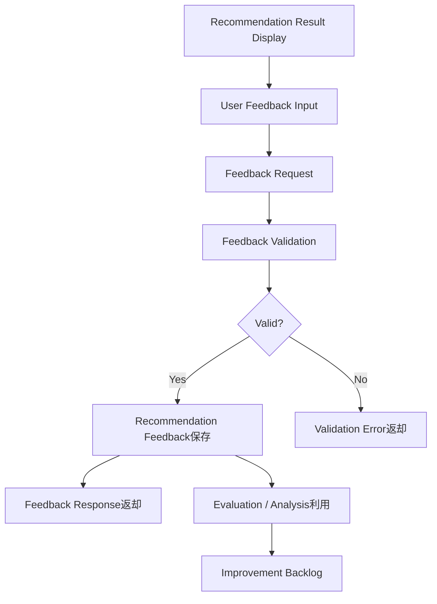
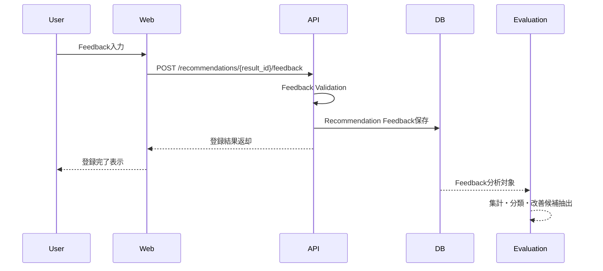

# Recommendation Feedback定義書

## 1. 概要

### 1.1 目的

本ドキュメントは、Gift Recommendation Serviceにおける `Recommendation Feedback` を定義する。

Recommendation Feedbackとは、ユーザーに提示した推薦結果に対して、ユーザーが行った反応・評価・指摘を構造化して保存する情報である。

本サービスでは、Feedbackを単なる「いいね」ではなく、推薦品質を改善するための重要な評価データとして扱う。

```text
Recommendation Result
↓
User Feedback
↓
Evaluation / Analysis
↓
Improvement Backlog
↓
Rule / Model / Config Update
```

---

### 1.2 本ドキュメントの位置づけ

| 成果物                      | 本ドキュメントとの関係                                  |
| --------------------------- | ------------------------------------------------------- |
| Recommendation Result定義書 | Feedbackの対象となる推薦結果を定義する                  |
| Reason生成定義書            | 推薦理由に対するFeedbackを扱う                          |
| Evaluation評価定義書        | Feedbackを評価・改善に利用する                          |
| Ranking定義書               | Feedback結果をRanking改善の参考にする                   |
| Matching定義書              | 文脈一致・不一致のFeedbackをMatching改善に利用する      |
| ドメインモデル              | Recommendation Feedbackのドメイン上の位置づけを定義する |
| 処理フロー概要図            | Feedback登録フローの前提となる                          |
| API仕様書                   | Feedback登録APIの前提となる                             |
| 論理ER / テーブル定義書     | recommendation_feedback系テーブルの前提となる           |

---

## 2. 基本方針

### 2.1 Recommendation Feedbackの役割

Recommendation Feedbackは、ユーザーが推薦結果をどう受け取ったかを示すデータである。

```text
推薦結果が良かったか
商品が文脈に合っていたか
理由に納得できたか
避けたい商品が出ていないか
条件とズレていないか
```

これらを保存することで、以下に利用する。

| 利用目的           | 内容                                                 |
| ------------------ | ---------------------------------------------------- |
| 推薦品質評価       | 推薦結果がユーザー意図に合っていたかを確認する       |
| Matching改善       | Feature / context_scoreの妥当性を確認する            |
| Ranking改善        | final_scoreとユーザー反応のズレを確認する            |
| Reason改善         | 推薦理由の納得感を確認する                           |
| NG / avoid制御改善 | 避けたい商品・NG商品の混入を検知する                 |
| 評価データ作成     | Offline Evaluation用の教師・参考データとして利用する |

---

### 2.2 基本方針

- FeedbackはRecommendation ResultまたはRecommendation Result Itemに紐づける
- MVPではResult Item単位の簡易Feedbackを優先する
- Feedbackはユーザーの主観データとして扱う
- Feedbackを即時にRankingへ自動反映しない
- Feedbackは評価・改善のために蓄積する
- 「良い / 微妙」だけでなく、理由・条件不一致・NG違反も扱えるようにする
- ReasonへのFeedbackも扱う
- Feedback登録はOnline処理として扱う
- Feedback分析・改善反映はBatch / Operation処理として扱う
- MVPでは認証なしまたは簡易識別で扱うため、ユーザー単位の長期パーソナライズには使わない

---

## 3. Recommendation Feedbackの責務

### 3.1 In Scope

| 対象                    | 内容                                             |
| ----------------------- | ------------------------------------------------ |
| Result全体へのFeedback  | 推薦結果全体が良かったかを記録する               |
| Result ItemへのFeedback | 商品1件ごとの反応を記録する                      |
| ReasonへのFeedback      | 推薦理由に納得できたかを記録する                 |
| Feedback種別管理        | good / bad / not_match等の種別を管理する         |
| Feedback値管理          | 評価値、選択肢、コメントを保持する               |
| 根拠コメント保持        | ユーザーの自由記述を保持する                     |
| 評価接続                | Evaluation / Analysisで利用できる形にする        |
| 改善接続                | ルール・Feature・Ranking改善へ接続する           |
| 監査・追跡              | どのResult / Item / ReasonへのFeedbackか追跡する |

---

### 3.2 Out of Scope

| 対象外             | 理由                                     | 管理先                          |
| ------------------ | ---------------------------------------- | ------------------------------- |
| 推薦結果生成       | Feedbackの前段処理であるため             | Recommendation Result定義書     |
| 推薦理由生成       | Feedback対象であり、生成処理ではないため | Reason生成定義書                |
| Ranking即時更新    | MVPでは自動最適化しないため              | Ranking定義書 / 将来拡張        |
| ユーザー履歴推薦   | 認証・履歴管理がMVP対象外のため          | 将来拡張                        |
| 購入・決済Feedback | EC機能がMVP対象外のため                  | 制約・対象外一覧                |
| 配送・到着後評価   | 配送管理がMVP対象外のため                | 制約・対象外一覧                |
| A/Bテスト判定      | 初期MVPでは対象外                        | Evaluation評価定義書 / 将来拡張 |

---

## 4. Feedback対象

### 4.1 Feedback対象一覧

| 対象                       | 粒度         | 内容                                   | MVP優先度 |
| -------------------------- | ------------ | -------------------------------------- | --------: |
| Recommendation Result      | 推薦結果全体 | この推薦結果全体が良かったか           |        中 |
| Recommendation Result Item | 商品1件      | この商品候補が良かったか               |        高 |
| Recommendation Reason      | 推薦理由     | 理由に納得できたか                     |        高 |
| Recommendation Request     | 入力条件全体 | 入力しやすかったか、意図を表現できたか |        低 |
| Ranking全体                | 順位全体     | 上位順位が妥当だったか                 |        中 |
| System Response            | 画面・応答   | 表示が分かりやすかったか               |        低 |

MVPでは、以下を優先する。

```text
1. Result Item単位のFeedback
2. Reason単位のFeedback
3. Result全体のFeedback
```

---

### 4.2 Result / Item / Reasonとの関係

```text
Recommendation Result
├── Recommendation Result Item
│   ├── Recommendation Reason
│   └── Recommendation Feedback
└── Recommendation Feedback
```

Feedbackは、Result全体にも、Result Item単位にも、Reason単位にも紐づけ可能とする。

---

## 5. Feedback種別

### 5.1 Feedback Type一覧

| feedback_type         | 内容                     | 対象                   | MVP対象 |
| --------------------- | ------------------------ | ---------------------- | ------: |
| `item_good`           | この商品は良い           | Result Item            |       ○ |
| `item_bad`            | この商品は微妙           | Result Item            |       ○ |
| `item_not_match`      | 条件・文脈に合っていない | Result Item            |       ○ |
| `item_too_safe`       | 無難すぎる               | Result Item            |       △ |
| `item_too_unique`     | 個性的すぎる             | Result Item            |       △ |
| `item_ng_violation`   | NG条件に反している       | Result Item            |       ○ |
| `item_avoid_match`    | 避けたい条件に近い       | Result Item            |       ○ |
| `reason_good`         | 理由に納得できた         | Reason                 |       ○ |
| `reason_bad`          | 理由に納得できない       | Reason                 |       ○ |
| `reason_insufficient` | 理由が弱い・薄い         | Reason                 |       △ |
| `result_good`         | 推薦結果全体が良い       | Result                 |       ○ |
| `result_bad`          | 推薦結果全体が微妙       | Result                 |       ○ |
| `comment`             | 自由コメント             | Result / Item / Reason |       ○ |
| `click`               | 商品リンククリック       | Result Item            |       △ |
| `save_candidate`      | 候補として保存           | Result Item            |       △ |

---

### 5.2 MVPで扱うFeedback Type

MVP初期では、以下に絞る。

| feedback_type       | 内容                   | 理由                               |
| ------------------- | ---------------------- | ---------------------------------- |
| `item_good`         | 商品候補として良い     | 最も基本的な正のFeedback           |
| `item_bad`          | 商品候補として微妙     | 最も基本的な負のFeedback           |
| `item_not_match`    | 贈答文脈に合っていない | Matching改善に直結する             |
| `item_ng_violation` | NG条件に反している     | Hard Filter改善に直結する          |
| `item_avoid_match`  | 避けたい条件に近い     | avoid / risk_penalty改善に直結する |
| `reason_good`       | 理由に納得できた       | Reason品質評価に使う               |
| `reason_bad`        | 理由に納得できない     | Reason改善に使う                   |
| `result_good`       | 推薦全体が良い         | 全体品質の簡易評価                 |
| `result_bad`        | 推薦全体が微妙         | 全体品質の簡易評価                 |
| `comment`           | 自由コメント           | 定性的な改善材料にする             |

---

## 6. Feedback Value

### 6.1 Feedback Valueの考え方

Feedback Typeは「何に対する評価か」を表す。  
Feedback Valueは「どの程度そう思ったか」または「具体的な選択値」を表す。

```text
feedback_type = item_good
feedback_value = true

feedback_type = reason_good
feedback_value = 5

feedback_type = comment
feedback_text = "上司向けにしては少しカジュアルに見える"
```

---

### 6.2 Value形式

| value_type | 内容          | 例                     |
| ---------- | ------------- | ---------------------- |
| `boolean`  | はい / いいえ | true                   |
| `rating`   | 1〜5評価      | 4                      |
| `choice`   | 選択肢        | `too_casual`           |
| `text`     | 自由記述      | `少しカジュアルすぎる` |
| `event`    | 行動イベント  | `clicked`              |

MVPでは、以下を優先する。

```text
boolean + choice + text
```

---

### 6.3 RatingをMVPで必須にしない理由

1〜5評価は便利だが、初期MVPでは以下の問題がある。

| 問題                     | 内容                               |
| ------------------------ | ---------------------------------- |
| 入力負荷が高い           | ユーザーが毎回点数をつけるのは重い |
| 解釈がぶれる             | 3点の意味が人によって違う          |
| データ量が少ないと不安定 | 初期検証では統計的に扱いづらい     |
| 改善に直結しづらい       | 低評価の理由が分からない           |

そのためMVPでは、まず以下を重視する。

```text
良い / 微妙
+
理由カテゴリ
+
自由コメント
```

---

## 7. データ項目定義

## 7.1 Recommendation Feedback

### 7.1.1 Identity / Reference

| 項目                            | 型            | 必須 | 内容                         |
| ------------------------------- | ------------- | ---: | ---------------------------- |
| `recommendation_feedback_id`    | string / uuid |    ○ | Feedback ID                  |
| `recommendation_result_id`      | string / uuid |    ○ | 対象Recommendation Result ID |
| `recommendation_result_item_id` | string / uuid | 任意 | 対象Result Item ID           |
| `recommendation_reason_id`      | string / uuid | 任意 | 対象Reason ID                |
| `recommendation_request_id`     | string / uuid | 推奨 | 元Request ID                 |
| `recommendation_run_id`         | string / uuid | 推奨 | 元Run ID                     |

---

### 7.1.2 Feedback内容

| 項目                       | 型                        | 必須 | 内容                                     |
| -------------------------- | ------------------------- | ---: | ---------------------------------------- |
| `feedback_target_type`     | string                    |    ○ | result / item / reason                   |
| `feedback_type`            | string                    |    ○ | item_good / item_bad / reason_good等     |
| `feedback_value_type`      | string                    |    ○ | boolean / rating / choice / text / event |
| `feedback_value`           | string / number / boolean | 任意 | Feedback値                               |
| `feedback_choice_code`     | string                    | 任意 | 選択式Feedbackのコード                   |
| `feedback_text`            | string                    | 任意 | 自由コメント                             |
| `feedback_reason_category` | string                    | 任意 | 不満・違和感の分類                       |
| `is_positive`              | boolean                   | 任意 | 正のFeedbackか                           |
| `is_negative`              | boolean                   | 任意 | 負のFeedbackか                           |

---

### 7.1.3 Context / Metadata

| 項目                | 型            | 必須 | 内容                       |
| ------------------- | ------------- | ---: | -------------------------- |
| `rank_at_feedback`  | number        | 任意 | Feedback対象商品の表示順位 |
| `item_id`           | string / uuid | 任意 | 対象商品ID                 |
| `session_id`        | string        | 任意 | セッション識別子           |
| `anonymous_user_id` | string        | 任意 | 匿名ユーザー識別子         |
| `source_page`       | string        | 任意 | Feedback入力元画面         |
| `user_agent`        | string        | 任意 | ブラウザ等の情報           |
| `created_at`        | datetime      |    ○ | Feedback作成日時           |

MVPでは、個人情報を過剰に保持せず、匿名・セッション単位で扱う。

---

## 7.2 Feedback Reason Category

### 7.2.1 Reason Category一覧

`feedback_reason_category` は、特に負のFeedbackを改善に接続するための分類である。

| category                | 内容                         | 主な改善対象                    |
| ----------------------- | ---------------------------- | ------------------------------- |
| `context_mismatch`      | 贈る相手・用途に合っていない | Matching / Feature Rule         |
| `too_casual`            | カジュアルすぎる             | Feature / Ranking               |
| `too_formal`            | フォーマルすぎる             | Feature / Ranking               |
| `too_safe`              | 無難すぎる                   | Ranking / diversity             |
| `too_unique`            | 個性的すぎる                 | Ranking / risk                  |
| `not_emotional`         | 気持ちが伝わりにくい         | Symbolic Feature                |
| `not_special`           | 特別感が弱い                 | novelty / story_richness        |
| `too_intimate`          | 親密すぎる                   | intimacy                        |
| `not_for_relationship`  | 関係性に合わない             | Relationship Rule               |
| `not_for_occasion`      | 用途に合わない               | Occasion Rule                   |
| `budget_mismatch`       | 予算感が合わない             | Budget Filter / Ranking         |
| `ng_violation`          | NG条件に反している           | Hard Filter                     |
| `avoid_violation`       | 避けたい条件に近い           | risk_penalty / avoid_similarity |
| `reason_not_convincing` | 推薦理由に納得できない       | Reason Generation               |
| `reason_too_generic`    | 理由が一般的すぎる           | Reason Template                 |
| `data_quality_issue`    | 商品情報が不足・不自然       | Item Data / Data Quality        |
| `other`                 | その他                       | 個別確認                        |

---

### 7.2.2 MVPでのReason Category

MVP初期では、以下に絞る。

| category                | 内容               |
| ----------------------- | ------------------ |
| `context_mismatch`      | 文脈に合わない     |
| `not_for_relationship`  | 関係性に合わない   |
| `not_for_occasion`      | 用途に合わない     |
| `budget_mismatch`       | 予算感が合わない   |
| `ng_violation`          | NG条件に反している |
| `avoid_violation`       | 避けたい条件に近い |
| `reason_not_convincing` | 理由に納得できない |
| `reason_too_generic`    | 理由が一般的すぎる |
| `other`                 | その他             |

---

## 8. Feedback登録フロー

### 8.1 全体フロー



---

### 8.2 Sequence



---

### 8.3 Feedback登録APIの入力イメージ

```json
{
  "feedback_target_type": "item",
  "recommendation_result_item_id": "result_item_001",
  "feedback_type": "item_not_match",
  "feedback_value_type": "choice",
  "feedback_choice_code": "too_casual",
  "feedback_text": "上司へのお礼としては少しカジュアルに見えます"
}
```

---

### 8.4 Feedback登録APIのレスポンスイメージ

```json
{
  "recommendation_feedback_id": "feedback_001",
  "status": "accepted",
  "message": "Feedback has been recorded."
}
```

---

## 9. バリデーション

### 9.1 Validation観点

| 観点                | 内容                                                       |
| ------------------- | ---------------------------------------------------------- |
| 対象存在チェック    | recommendation_result_id / item_id / reason_idが存在するか |
| target_type整合     | result / item / reasonの対象IDが適切か                     |
| feedback_type妥当性 | 定義済みtypeか                                             |
| value_type妥当性    | typeとvalue_typeが対応しているか                           |
| 必須値チェック      | 必須項目が入力されているか                                 |
| 文字数チェック      | feedback_textが長すぎないか                                |
| 重複チェック        | 同一対象に同じFeedbackを連続投稿していないか               |
| 不正入力チェック    | スクリプト・危険文字列を含まないか                         |

---

### 9.2 feedback_typeとtarget_typeの整合

| feedback_type         | 許可target_type        |
| --------------------- | ---------------------- |
| `item_good`           | item                   |
| `item_bad`            | item                   |
| `item_not_match`      | item                   |
| `item_ng_violation`   | item                   |
| `item_avoid_match`    | item                   |
| `reason_good`         | reason                 |
| `reason_bad`          | reason                 |
| `reason_insufficient` | reason                 |
| `result_good`         | result                 |
| `result_bad`          | result                 |
| `comment`             | result / item / reason |

---

### 9.3 MVPでの重複扱い

MVPでは、同一ユーザー識別が限定的なため、厳密な重複排除は行わない。  
ただし、同一セッション・同一Result Item・同一feedback_typeの連続投稿は抑制する。

---

## 10. FeedbackとEvaluationの関係

### 10.1 Evaluationでの利用

Feedbackは、Evaluationにおいて以下のように利用する。

| Feedback            | Evaluation上の意味                             |
| ------------------- | ---------------------------------------------- |
| `item_good`         | 推薦候補として妥当だった可能性が高い           |
| `item_bad`          | 商品自体または文脈との相性が低い可能性がある   |
| `item_not_match`    | Matching / Feature設計の見直し対象             |
| `item_ng_violation` | Hard Filterの不備                              |
| `item_avoid_match`  | avoid_similarity / risk_penaltyの不備          |
| `reason_good`       | Reason生成が有効だった可能性がある             |
| `reason_bad`        | Reason生成・根拠選定の改善対象                 |
| `result_good`       | 推薦結果全体が妥当だった可能性がある           |
| `result_bad`        | Retrieval / Matching / Ranking全体の見直し対象 |

---

### 10.2 改善対象への接続

| feedback_reason_category | 主な改善対象                    |
| ------------------------ | ------------------------------- |
| `context_mismatch`       | Matching定義 / Featureルール    |
| `not_for_relationship`   | Relationship Rule               |
| `not_for_occasion`       | Occasion Rule                   |
| `budget_mismatch`        | Budget Filter / Ranking         |
| `ng_violation`           | Retrieval Hard Filter           |
| `avoid_violation`        | Risk Penalty / avoid_similarity |
| `reason_not_convincing`  | Reason生成                      |
| `reason_too_generic`     | Reason Template                 |
| `data_quality_issue`     | 商品データ取得・商品品質管理    |

---

### 10.3 Feedbackを直接自動反映しない理由

MVPでは、FeedbackをRankingやFeatureルールへ即時自動反映しない。

理由は以下である。

| 理由             | 内容                                         |
| ---------------- | -------------------------------------------- |
| データ量不足     | 初期Feedbackは少なく、統計的に不安定         |
| 主観のばらつき   | ユーザーごとに良い/悪いの基準が違う          |
| ノイズ混入       | 誤クリックや気分による評価が混ざる           |
| ルール劣化リスク | 少数Feedbackで全体品質が悪化する可能性がある |
| 説明責任         | なぜルールが変わったか追跡しづらくなる       |

そのため、MVPでは以下の流れにする。

```text
Feedback蓄積
↓
Evaluation / Analysis
↓
人間が改善方針を判断
↓
Rule / Config / Model更新
↓
Offline Evaluation
↓
反映
```

---

## 11. 分析観点

### 11.1 集計指標

| 指標                   | 内容                               |
| ---------------------- | ---------------------------------- |
| feedback_count         | Feedback件数                       |
| feedback_rate          | Result表示数に対するFeedback発生率 |
| positive_feedback_rate | 正のFeedback割合                   |
| negative_feedback_rate | 負のFeedback割合                   |
| item_good_rate         | Result Itemに対する良い評価割合    |
| item_bad_rate          | Result Itemに対する悪い評価割合    |
| reason_good_rate       | Reasonに納得できた割合             |
| reason_bad_rate        | Reasonに納得できなかった割合       |
| ng_violation_count     | NG違反指摘数                       |
| avoid_violation_count  | avoid違反指摘数                    |
| context_mismatch_count | 文脈不一致指摘数                   |

---

### 11.2 スコアとの相関

Feedbackは、RankingやMatchingのスコアと比較して分析する。

| 比較                           | 見たいこと                                      |
| ------------------------------ | ----------------------------------------------- |
| final_score × item_good        | final_scoreが高い商品が良い評価を得ているか     |
| context_score × item_not_match | context_scoreが高いのに文脈不一致が出ていないか |
| risk_penalty × avoid_violation | risk_penaltyが低いのにavoid違反が出ていないか   |
| reason_basis × reason_bad      | 根拠選定がReason評価に影響していないか          |
| rank × item_good               | 上位商品ほど良い評価を得ているか                |

---

### 11.3 Failure分類

| failure_type           | 判定材料                   | 改善対象           |
| ---------------------- | -------------------------- | ------------------ |
| `retrieval_failure`    | 良い商品が候補にない       | Retrieval          |
| `matching_failure`     | 文脈不一致Feedbackが多い   | Matching / Feature |
| `ranking_failure`      | 下位商品の方が高評価       | Ranking            |
| `reason_failure`       | 商品は良いが理由が悪い     | Reason             |
| `filter_failure`       | NG違反Feedback             | Hard Filter        |
| `avoid_failure`        | 避けたい条件に近いFeedback | Risk / avoid       |
| `data_quality_failure` | 商品情報不足指摘           | Item Data          |

---

## 12. DB・実装上の扱い

### 12.1 recommendation_feedback

論理的には以下の項目を持つ。

| 項目                            | 内容                                     |
| ------------------------------- | ---------------------------------------- |
| `recommendation_feedback_id`    | Feedback ID                              |
| `recommendation_result_id`      | 対象Result ID                            |
| `recommendation_result_item_id` | 対象Result Item ID                       |
| `recommendation_reason_id`      | 対象Reason ID                            |
| `recommendation_request_id`     | 元Request ID                             |
| `recommendation_run_id`         | 元Run ID                                 |
| `feedback_target_type`          | result / item / reason                   |
| `feedback_type`                 | item_good / item_bad / reason_good等     |
| `feedback_value_type`           | boolean / rating / choice / text / event |
| `feedback_value`                | Feedback値                               |
| `feedback_choice_code`          | 選択肢コード                             |
| `feedback_text`                 | 自由コメント                             |
| `feedback_reason_category`      | 改善分類                                 |
| `is_positive`                   | 正のFeedbackか                           |
| `is_negative`                   | 負のFeedbackか                           |
| `rank_at_feedback`              | Feedback時点の表示順位                   |
| `item_id`                       | 対象商品ID                               |
| `session_id`                    | セッションID                             |
| `anonymous_user_id`             | 匿名ユーザーID                           |
| `source_page`                   | 入力元画面                               |
| `created_at`                    | 作成日時                                 |

---

### 12.2 recommendation_feedback_summary

MVPでは必須ではないが、分析用に将来以下のような集計テーブルを持ってよい。

| 項目                         | 内容                    |
| ---------------------------- | ----------------------- |
| `summary_id`                 | 集計ID                  |
| `aggregation_date`           | 集計日                  |
| `feedback_type`              | Feedback種別            |
| `feedback_reason_category`   | 理由分類                |
| `count`                      | 件数                    |
| `positive_count`             | 正のFeedback件数        |
| `negative_count`             | 負のFeedback件数        |
| `target_item_id`             | 商品ID                  |
| `semantic_config_version_id` | Semantic Config Version |
| `model_version_id`           | Model Version           |

初期MVPでは、summaryテーブルは作成せず、必要に応じてクエリ・ビューで集計してよい。

---

## 13. エラーハンドリング

### 13.1 エラー一覧

| error_code                  | 内容                                   | 対応                  |
| --------------------------- | -------------------------------------- | --------------------- |
| `FEEDBACK_TARGET_NOT_FOUND` | 対象Result / Item / Reasonが存在しない | 404相当               |
| `FEEDBACK_TYPE_INVALID`     | feedback_typeが不正                    | 400相当               |
| `FEEDBACK_VALUE_INVALID`    | value形式が不正                        | 400相当               |
| `FEEDBACK_TARGET_MISMATCH`  | target_typeと対象IDが不整合            | 400相当               |
| `FEEDBACK_TEXT_TOO_LONG`    | コメントが長すぎる                     | 400相当               |
| `FEEDBACK_DUPLICATED`       | 重複投稿                               | 409相当または成功扱い |
| `FEEDBACK_SAVE_ERROR`       | DB保存失敗                             | 500相当               |

---

### 13.2 重複時の扱い

MVPでは、重複投稿が疑われる場合でも、ユーザー体験を優先して以下のどちらかにする。

| 方針         | 内容                               |
| ------------ | ---------------------------------- |
| 冪等成功扱い | 既存Feedbackを返して成功扱いにする |
| 更新扱い     | 既存Feedbackを新しい内容で更新する |

推奨は、`同一セッション + 同一対象 + 同一feedback_type` の場合は更新扱いとする。

---

## 14. セキュリティ・プライバシー

### 14.1 基本方針

| 項目         | 方針                                       |
| ------------ | ------------------------------------------ |
| 個人情報     | MVPでは原則保持しない                      |
| ユーザー識別 | session_id / anonymous_user_id程度に留める |
| 自由コメント | 個人情報が含まれる可能性があるため注意する |
| 入力検証     | XSS等を避けるためサニタイズする            |
| 管理画面表示 | コメント表示時はエスケープする             |
| 保存期間     | MVPでは明示し、商用化時に再定義する        |

---

### 14.2 自由コメントの注意点

自由コメントには、ユーザーが意図せず個人情報を書く可能性がある。

例：

```text
母が糖尿病なので甘いものは避けたい
```

このような情報は改善には有用だが、センシティブ情報になり得る。  
MVPでは、以下の方針にする。

| 方針                   | 内容                                 |
| ---------------------- | ------------------------------------ |
| 入力欄に注意文を出す   | 個人情報を書かないよう案内する       |
| 最小限保存             | 必要以上の属性情報を保存しない       |
| 管理者以外に表示しない | コメントは内部分析用途に限定する     |
| 将来削除方針を定義     | 商用化前に保持期間・削除方針を定める |

---

## 15. MVPでの扱い

### 15.1 MVP対象

| 項目                     | 方針             |
| ------------------------ | ---------------- |
| Result Item単位Feedback  | 必須             |
| Reason単位Feedback       | 必須             |
| Result全体Feedback       | 推奨             |
| item_good / item_bad     | 必須             |
| item_not_match           | 必須             |
| item_ng_violation        | 必須             |
| item_avoid_match         | 必須             |
| reason_good / reason_bad | 必須             |
| comment                  | 推奨             |
| Feedback保存             | 必須             |
| Feedback分析             | 小規模・手動中心 |
| Rankingへの自動反映      | 対象外           |

---

### 15.2 MVP対象外

| 項目                 | 理由                     |
| -------------------- | ------------------------ |
| 長期ユーザー嗜好学習 | 認証・履歴管理が対象外   |
| 自動パーソナライズ   | Feedback量が不足するため |
| オンライン学習       | 初期MVPではリスクが高い  |
| A/BテストFeedback    | 初期トラフィック不足     |
| 購入後Feedback       | 購入・決済がMVP対象外    |
| 配送後満足度         | 配送管理がMVP対象外      |
| 高度な行動ログ解析   | MVPでは検証範囲外        |

---

## 16. 後続成果物への引き継ぎ

### 16.1 API仕様書への引き継ぎ

API仕様書では、以下を具体化する。

| API                                          | 内容                                 |
| -------------------------------------------- | ------------------------------------ |
| `POST /recommendations/{result_id}/feedback` | Feedback登録                         |
| `GET /recommendations/{result_id}/feedback`  | Feedback取得。MVPでは管理・debug用途 |
| Error Response                               | Feedback登録エラー形式               |
| OpenAPI Schema                               | Recommendation FeedbackのJSON Schema |

---

### 16.2 論理ER / テーブル定義書への引き継ぎ

DB設計では、以下を定義する。

| テーブル候補                 | 内容                      |
| ---------------------------- | ------------------------- |
| `recommendation_feedback`    | Feedback正本              |
| `recommendation_result`      | Feedback対象Result        |
| `recommendation_result_item` | Feedback対象Item          |
| `recommendation_reason`      | Feedback対象Reason        |
| `feedback_summary`           | 将来の集計用。MVPでは任意 |

---

### 16.3 Evaluation評価定義書への引き継ぎ

Evaluationでは、Feedbackを以下に利用する。

| 用途           | 内容                                       |
| -------------- | ------------------------------------------ |
| 推薦品質評価   | item_good / item_badを利用                 |
| 文脈一致評価   | item_not_matchを利用                       |
| NG / avoid評価 | item_ng_violation / item_avoid_matchを利用 |
| Reason品質評価 | reason_good / reason_badを利用             |
| 改善分類       | feedback_reason_categoryを利用             |
| 失敗分析       | score_breakdownとFeedbackを比較する        |

---

## 17. 品質・レビュー観点

### 17.1 レビュー観点

| 観点           | 確認内容                                       |
| -------------- | ---------------------------------------------- |
| 対象紐づけ     | Result / Item / Reasonに正しく紐づくか         |
| 粒度           | Result全体とItem単位が混ざっていないか         |
| MVP妥当性      | 初期検証に必要なFeedbackに絞れているか         |
| 改善接続       | Matching / Ranking / Reason改善に接続できるか  |
| 過剰学習防止   | Feedbackを即時自動反映しない方針になっているか |
| 分析可能性     | feedback_type / reason_categoryで集計できるか  |
| セキュリティ   | 自由コメントや個人情報に配慮しているか         |
| API化可能性    | Feedback登録APIに落とせる構造になっているか    |
| Evaluation接続 | Evaluation評価定義書で利用できるか             |

---

### 17.2 よくある問題

| 問題                         | 内容                           | 対応                           |
| ---------------------------- | ------------------------------ | ------------------------------ |
| good / badだけで理由がない   | 改善対象が分からない           | reason_categoryを持つ          |
| Result全体とItem評価が混ざる | どの商品が悪かったか分からない | target_typeを持つ              |
| Reason評価がない             | 説明品質を改善できない         | reason_good / reason_badを持つ |
| Feedbackを即時反映する       | 少数ノイズで品質が悪化する     | Evaluation経由で改善する       |
| コメントだけに頼る           | 集計できない                   | type / categoryを併用する      |
| 個人情報を集めすぎる         | プライバシーリスクが上がる     | 匿名・最小限にする             |

---

## 18. まとめ

Recommendation Feedbackは、ユーザーに提示した推薦結果に対する反応・評価・指摘を保存するデータである。

```text
Recommendation Result
↓
Recommendation Feedback
↓
Evaluation
↓
Improvement
```

MVPでは、以下の方針で運用する。

```text
- Result Item単位のFeedbackを優先する
- Reason単位のFeedbackも保存する
- item_good / item_bad / item_not_matchを基本とする
- NG違反・avoid違反は明示的にFeedback Typeとして持つ
- 自由コメントは補助情報として扱う
- Feedbackは即時にRankingへ自動反映しない
- Evaluation / Analysisを経由して改善判断に使う
- 個人情報は原則保持せず、匿名・最小限で扱う
```

Recommendation Feedbackは、推薦システムの改善ループを成立させるための重要データである。  
単なるユーザー反応ではなく、Matching / Ranking / Reason / Filter / Data Qualityの改善に接続する評価データとして管理する。
