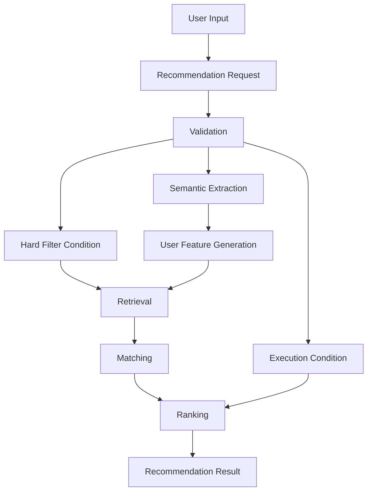
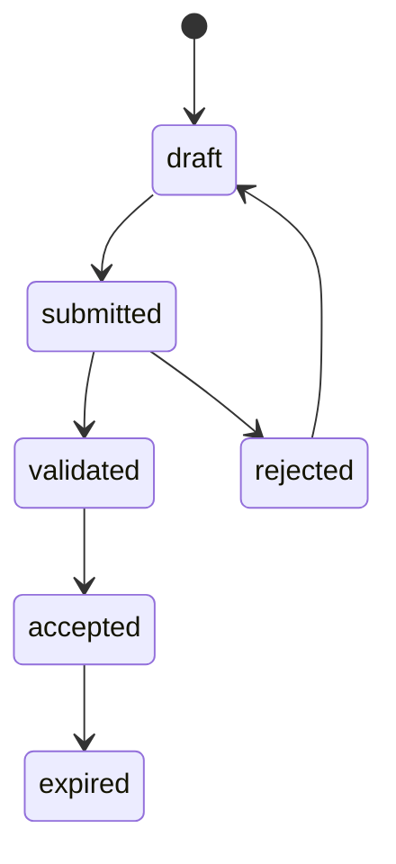

# Recommendation Request定義書

## 1. 概要

### 1.1 目的

本ドキュメントは、Gift Recommendation Serviceにおける `Recommendation Request` を定義する。

Recommendation Requestとは、ユーザーがギフト推薦を依頼する際の入力条件を構造化したものである。

本サービスでは、ユーザー入力を単なる検索クエリではなく、以下を含む推薦リクエストとして扱う。

```text
誰に
何の目的で
どのくらいの予算で
どんなものを好み
どんなものを避けたいか
何を絶対に除外したいか
何件表示したいか
どの実行モードで処理するか
```

---

### 1.2 本ドキュメントの位置づけ

| 成果物                   | 本ドキュメントとの関係                              |
| ------------------------ | --------------------------------------------------- |
| ドメインモデル           | Recommendation Request Aggregateの詳細定義          |
| コンテキスト境界定義書   | 推薦要求コンテキストの入力責務を定義する            |
| Gift Meaning Space定義書 | relationship / occasionから意味空間へ接続する       |
| Semanticルール定義書     | 入力条件からSemantic Conceptを抽出する              |
| Featureルール定義書      | 入力条件をUser Featureへ変換する                    |
| Retrieval定義書          | budget / NG条件 / preferred条件を候補抽出に利用する |
| Matching定義書           | User FeatureとItem Featureの比較に接続する          |
| Ranking定義書            | top_k / mode / リスク条件を順位決定に接続する       |
| Evaluation評価定義書     | 評価ケースの入力構造として利用する                  |
| API仕様書                | レコメンド実行APIのrequest bodyの前提となる         |
| 論理ER / テーブル定義書  | recommendation_request系テーブルの前提となる        |

---

## 2. 基本方針

### 2.1 Recommendation Requestの役割

Recommendation Requestは、推薦処理全体の起点となる入力モデルである。

```text
Recommendation Request
↓
Semantic解析
↓
User Feature生成
↓
Retrieval
↓
Matching
↓
Ranking
↓
Recommendation Result
```

---

### 2.2 基本方針

- Recommendation Requestは、推薦実行に必要な入力条件の正本とする
- ユーザーの自然文入力と構造化入力の両方を保持する
- 予算条件は `budgetMin` / `budgetMax` の範囲条件として扱う
- `relationship` と `occasion` は贈答文脈の主要入力とする
- `preferred_condition` は好み・期待する方向性を表す
- `non_preferred_condition` は避けたい傾向を表す
- `ng_condition` は絶対除外条件として扱う
- `mode` は `ui` / `evaluation` / `batch` の3種類とする
- `top_k` は最終的に画面または評価結果へ返す件数を表す
- Recommendation Request自体は、Feature生成・候補抽出・Rankingを行わない
- Recommendation Requestは、後続処理に渡すための入力構造を定義する責務に限定する

---

## 3. Recommendation Requestの責務

### 3.1 In Scope

| 対象                 | 内容                                       |
| -------------------- | ------------------------------------------ |
| 入力条件保持         | ユーザーが指定した推薦条件を保持する       |
| 贈答文脈保持         | relationship / occasionを保持する          |
| 予算条件保持         | budgetMin / budgetMaxを保持する            |
| 好み条件保持         | preferred_conditionを保持する              |
| 避けたい条件保持     | non_preferred_conditionを保持する          |
| NG条件保持           | ng_conditionを保持する                     |
| 自由入力保持         | free_text / raw_input_textを保持する       |
| 実行条件保持         | mode / top_k / candidate_limit等を保持する |
| 入力バリデーション   | 必須項目・値域・矛盾を検証する             |
| 後続処理への入力提供 | Semantic / Retrieval / Evaluation等へ渡す  |

---

### 3.2 Out of Scope

| 対象外               | 理由                                   | 管理先                        |
| -------------------- | -------------------------------------- | ----------------------------- |
| Semantic Concept抽出 | Request後続の意味解釈処理であるため    | Semanticルール定義書          |
| User Feature生成     | Request後続のFeature変換処理であるため | Featureルール定義書           |
| 候補商品抽出         | Requestを利用する後続処理であるため    | Retrieval定義書               |
| Matching計算         | Candidate生成後の比較処理であるため    | Matching定義書                |
| Ranking計算          | Matching後の順位決定処理であるため     | Ranking定義書                 |
| Reason生成           | 推薦結果説明の後続処理であるため       | Reason生成定義書              |
| Feedback取得         | 推薦結果提示後の反応取得であるため     | Recommendation Feedback定義書 |

---

## 4. 全体構造

### 4.1 Recommendation Request Aggregate

Recommendation Requestは、以下の構成要素を持つ集約として扱う。

```text
Recommendation Request Aggregate
├── Request Identity
├── Gift Context Condition
│   ├── Relationship Condition
│   └── Occasion Condition
├── Budget Condition
│   ├── budgetMin
│   └── budgetMax
├── Preference Condition
├── Non Preferred Condition
├── NG Condition
├── Free Text Condition
├── Execution Condition
│   ├── mode
│   ├── top_k
│   └── candidate_limit
└── Request Metadata
```

---

### 4.2 処理フロー上の位置づけ



---

## 5. 入力分類

### 5.1 入力条件の分類

Recommendation Requestの入力条件は、以下の4分類で整理する。

| 分類     | 項目                           | 役割                           | 主な利用先                    |
| -------- | ------------------------------ | ------------------------------ | ----------------------------- |
| 贈答文脈 | relationship / occasion        | 誰に・何のために贈るかを表す   | Feature生成 / λ_ctx算出       |
| 絶対条件 | budget / ng_condition          | 候補から除外する条件           | Retrieval / Hard Filter       |
| 相対条件 | preferred / non_preferred      | 好み・避けたい傾向を表す       | Semantic / Feature / Matching |
| 実行条件 | mode / top_k / candidate_limit | 処理モード・返却件数を制御する | Ranking / API / Evaluation    |

---

### 5.2 絶対条件と相対条件の違い

| 種別     | 例                             | 扱い                              |
| -------- | ------------------------------ | --------------------------------- |
| 絶対条件 | 5,000円以内                    | 条件外の商品を除外する            |
| 絶対条件 | アルコールNG                   | 該当商品を除外する                |
| 相対条件 | 上品なものがよい               | Featureに反映してスコアリングする |
| 相対条件 | カジュアルすぎるものは避けたい | avoid方向としてスコアリングする   |
| 相対条件 | 無難すぎないもの               | Symbolic寄りの意図として扱う      |

---

## 6. データ項目定義

### 6.1 Request Identity

| 項目                        | 型            | 必須 | 内容                             |
| --------------------------- | ------------- | ---: | -------------------------------- |
| `recommendation_request_id` | string / uuid |    ○ | 推薦リクエストID                 |
| `request_no`                | string        | 任意 | 表示・追跡用のリクエスト番号     |
| `idempotency_key`           | string        | 任意 | 同一リクエストの重複実行防止キー |

---

### 6.2 Gift Context Condition

#### Relationship Condition

| 項目                      | 型     | 必須 | 内容                 |
| ------------------------- | ------ | ---: | -------------------- |
| `relationship_code`       | string |    ○ | 贈る相手との関係性   |
| `relationship_label`      | string | 任意 | 表示用名称           |
| `relationship_confidence` | number | 任意 | 推定値の場合の信頼度 |

例：

```json
{
  "relationship_code": "boss",
  "relationship_label": "上司"
}
```

---

#### Occasion Condition

| 項目                  | 型     | 必須 | 内容                 |
| --------------------- | ------ | ---: | -------------------- |
| `occasion_code`       | string |    ○ | 贈答目的             |
| `occasion_label`      | string | 任意 | 表示用名称           |
| `occasion_confidence` | number | 任意 | 推定値の場合の信頼度 |

例：

```json
{
  "occasion_code": "thanks",
  "occasion_label": "お礼"
}
```

---

### 6.3 Budget Condition

`Budget Condition` は、推薦対象商品の価格範囲を表す値オブジェクトである。

| 項目           | 型      | 必須 | 内容                     |
| -------------- | ------- | ---: | ------------------------ |
| `budgetMin`    | number  | 任意 | 予算下限                 |
| `budgetMax`    | number  | 任意 | 予算上限                 |
| `currency`     | string  | 任意 | 通貨。MVPでは `JPY` 固定 |
| `tax_included` | boolean | 任意 | 税込価格として扱うか     |

例：

```json
{
  "budgetMin": 3000,
  "budgetMax": 5000,
  "currency": "JPY",
  "tax_included": true
}
```

---

#### Budget Conditionの方針

| 条件                                  | 扱い                           |
| ------------------------------------- | ------------------------------ |
| `budgetMin` と `budgetMax` の両方あり | 指定範囲内の商品を対象とする   |
| `budgetMin` のみあり                  | 指定金額以上の商品を対象とする |
| `budgetMax` のみあり                  | 指定金額以下の商品を対象とする |
| どちらも未指定                        | 予算による絞り込みを行わない   |
| `budgetMin > budgetMax`               | バリデーションエラー           |

---

### 6.4 Preference Condition

`Preference Condition` は、ユーザーが求める方向性・好み・期待する特徴を表す。

| 項目                 | 型       | 必須 | 内容                 |
| -------------------- | -------- | ---: | -------------------- |
| `preferred_text`     | string   | 任意 | 好み条件の自由入力   |
| `preferred_keywords` | string[] | 任意 | 好み条件のキーワード |

例：

```json
{
  "preferred_text": "上品で、感謝が伝わるもの",
  "preferred_keywords": ["上品", "感謝"]
}
```

---

### 6.5 Non Preferred Condition

`Non Preferred Condition` は、絶対NGではないが、なるべく避けたい方向性を表す。

| 項目                     | 型       | 必須 | 内容                     |
| ------------------------ | -------- | ---: | ------------------------ |
| `non_preferred_text`     | string   | 任意 | 避けたい条件の自由入力   |
| `non_preferred_keywords` | string[] | 任意 | 避けたい条件のキーワード |

例：

```json
{
  "non_preferred_text": "カジュアルすぎるものは避けたい",
  "non_preferred_keywords": ["カジュアルすぎる"]
}
```

---

### 6.6 NG Condition

`NG Condition` は、推薦候補から必ず除外すべき条件を表す。

| 項目                 | 型       | 必須 | 内容               |
| -------------------- | -------- | ---: | ------------------ |
| `ng_text`            | string   | 任意 | NG条件の自由入力   |
| `ng_keywords`        | string[] | 任意 | NGキーワード       |
| `ng_categories`      | string[] | 任意 | NGカテゴリ         |
| `ng_item_attributes` | object   | 任意 | 除外対象の商品属性 |

例：

```json
{
  "ng_text": "アルコールはNG",
  "ng_keywords": ["アルコール"],
  "ng_categories": ["alcohol"]
}
```

---

#### NG Conditionの方針

| 条件                | 扱い                                  |
| ------------------- | ------------------------------------- |
| 明確なNG条件        | Hard Filterで除外                     |
| 曖昧なNG条件        | Semantic解析後、除外またはavoidへ分類 |
| preferred条件と矛盾 | バリデーション警告または確認対象      |
| 外部API上で判定不能 | 判定不能としてログ・補足管理          |

---

### 6.7 Free Text Condition

`Free Text Condition` は、ユーザーの自然文入力を保持する。

| 項目                    | 型     | 必須 | 内容                     |
| ----------------------- | ------ | ---: | ------------------------ |
| `free_text`             | string | 任意 | ユーザーが入力した自由文 |
| `raw_input_text`        | string | 任意 | 加工前の原文             |
| `normalized_input_text` | string | 任意 | 表記ゆれ等を整えた入力文 |

例：

```json
{
  "free_text": "退職する上司に、お礼として失礼がなく、少し気の利いたものを贈りたい"
}
```

---

### 6.8 Execution Condition

`Execution Condition` は、推薦処理の実行方法を制御する条件である。

| 項目                         | 型      | 必須 | 内容                    |
| ---------------------------- | ------- | ---: | ----------------------- |
| `mode`                       | string  |    ○ | 実行モード              |
| `top_k`                      | number  | 任意 | 最終返却件数            |
| `candidate_limit`            | number  | 任意 | 内部候補取得件数        |
| `include_reason`             | boolean | 任意 | 推薦理由を生成するか    |
| `include_debug_info`         | boolean | 任意 | デバッグ情報を含めるか  |
| `semantic_config_version_id` | string  | 任意 | 使用する Semantic Config Version（**内部 UUID**。表面 ID `semantic_config_v001` 等は採用しない） |
| `model_version_id`           | string  | 任意 | 使用するModel Version   |

---

#### mode定義

| mode         | 内容                 | 主な用途                            |
| ------------ | -------------------- | ----------------------------------- |
| `ui`         | 通常ユーザー向け推薦 | Web画面からの利用                   |
| `evaluation` | 評価用推薦           | Offline Evaluation / Golden Dataset |
| `batch`      | バッチ処理用推薦     | 一括検証・再計算                    |

---

#### mode別の初期値

| 項目                 |    ui | evaluation |   batch |
| -------------------- | ----: | ---------: | ------: |
| `top_k`              |    10 |         10 |    任意 |
| `candidate_limit`    |    50 |    50〜100 | 100以上 |
| `include_reason`     |  true |       true | false可 |
| `include_debug_info` | false |       true |    true |
| 結果保存             |  true |       true |    true |

> **API 境界（evaluation / batch）:** Internal API（API-INT-002）では `execution.configName` + `execution.versionLabel` の composite で version 指定を受け付ける。api は解決後、永続化・Run 固定には本項の `semantic_config_version_id`（UUID）を用いる（`semantic_config_version_テーブル定義書` §17.1）。

---

## 7. JSON構造例

### 7.1 UI向けリクエスト例

```json
{
  "relationship": {
    "relationship_code": "boss",
    "relationship_label": "上司"
  },
  "occasion": {
    "occasion_code": "thanks",
    "occasion_label": "お礼"
  },
  "budget": {
    "budgetMin": 3000,
    "budgetMax": 5000,
    "currency": "JPY",
    "tax_included": true
  },
  "preferred_condition": {
    "preferred_text": "上品で、感謝が伝わるもの"
  },
  "non_preferred_condition": {
    "non_preferred_text": "カジュアルすぎるものは避けたい"
  },
  "ng_condition": {
    "ng_text": "アルコールはNG"
  },
  "free_text": "退職する上司に、お礼として失礼がなく、少し気の利いたものを贈りたい",
  "execution": {
    "mode": "ui",
    "top_k": 10,
    "candidate_limit": 50,
    "include_reason": true,
    "include_debug_info": false
  }
}
```

---

### 7.2 Evaluation向けリクエスト例

```json
{
  "eval_case_id": "case_001",
  "relationship": {
    "relationship_code": "boss"
  },
  "occasion": {
    "occasion_code": "thanks"
  },
  "budget": {
    "budgetMin": 3000,
    "budgetMax": 5000,
    "currency": "JPY"
  },
  "preferred_condition": {
    "preferred_text": "上品で失礼がないもの"
  },
  "non_preferred_condition": {
    "non_preferred_text": "カジュアルすぎるもの"
  },
  "ng_condition": {
    "ng_text": ""
  },
  "execution": {
    "mode": "evaluation",
    "top_k": 10,
    "candidate_limit": 100,
    "include_reason": true,
    "include_debug_info": true,
    "semantic_config_version_id": "7c9e6679-7425-40de-944b-e07fc1f90ae7",
    "model_version_id": "model_v001"
  }
}
```

---

## 8. バリデーションルール

### 8.1 必須チェック

| 項目                      | 必須 | 理由                         |
| ------------------------- | ---: | ---------------------------- |
| `relationship_code`       |    ○ | 贈答文脈の主要条件であるため |
| `occasion_code`           |    ○ | 贈答文脈の主要条件であるため |
| `mode`                    |    ○ | 実行方法を制御するため       |
| `top_k`                   | 任意 | 未指定時はデフォルト値を使用 |
| `budgetMin`               | 任意 | 予算下限未指定を許容         |
| `budgetMax`               | 任意 | 予算上限未指定を許容         |
| `preferred_condition`     | 任意 | なくても文脈ベース推薦は可能 |
| `non_preferred_condition` | 任意 | なくても推薦可能             |
| `ng_condition`            | 任意 | なくても推薦可能             |

---

### 8.2 値域チェック

| 項目                     | 条件                                     |
| ------------------------ | ---------------------------------------- |
| `budgetMin`              | 0以上                                    |
| `budgetMax`              | 0以上                                    |
| `budgetMin <= budgetMax` | 両方指定時に必須                         |
| `top_k`                  | 1〜50                                    |
| `candidate_limit`        | `top_k` 以上                             |
| `mode`                   | `ui` / `evaluation` / `batch` のいずれか |

---

### 8.3 矛盾チェック

| 矛盾                           | 例                                                 | 扱い                       |
| ------------------------------ | -------------------------------------------------- | -------------------------- |
| 予算矛盾                       | budgetMin > budgetMax                              | エラー                     |
| preferredとNGの矛盾            | 「ワインがよい」かつ「アルコールNG」               | 警告またはNG優先           |
| preferredとnon_preferredの矛盾 | 「高級感がほしい」かつ「高級すぎるものは避けたい」 | 強度調整または警告         |
| relationshipとoccasionの不整合 | business_partner + anniversary                     | 警告。完全エラーにはしない |
| top_k > candidate_limit        | top_kを優先しcandidate_limitを補正                 |

---

### 8.4 エラー分類

| error_code                 | 内容               | ユーザー表示方針                  |
| -------------------------- | ------------------ | --------------------------------- |
| `REQUEST_VALIDATION_ERROR` | 入力条件が不正     | 入力内容の修正を促す              |
| `INVALID_BUDGET_RANGE`     | 予算範囲が不正     | 予算の上限・下限確認を促す        |
| `INVALID_MODE`             | modeが不正         | システムエラー扱い                |
| `INVALID_TOP_K`            | top_kが範囲外      | デフォルト値へ補正またはエラー    |
| `CONDITION_CONFLICT`       | 条件に矛盾がある   | 条件確認を促す                    |
| `UNSUPPORTED_RELATIONSHIP` | 未対応relationship | otherへフォールバックまたはエラー |
| `UNSUPPORTED_OCCASION`     | 未対応occasion     | otherへフォールバックまたはエラー |

---

## 9. 後続処理への引き継ぎ

### 9.1 Semanticルール定義書への引き継ぎ

| Request項目          | 用途                               |
| -------------------- | ---------------------------------- |
| `preferred_text`     | 好み方向のSemantic Concept抽出     |
| `non_preferred_text` | 避けたい方向のSemantic Concept抽出 |
| `ng_text`            | NG条件抽出                         |
| `free_text`          | 文脈補足・意図抽出                 |
| `relationship_code`  | 文脈補助                           |
| `occasion_code`      | 文脈補助                           |

---

### 9.2 Featureルール定義書への引き継ぎ

| Request項目              | 用途                                     |
| ------------------------ | ---------------------------------------- |
| `relationship_code`      | Relationship Ruleにより基準Featureを生成 |
| `occasion_code`          | Occasion Ruleにより基準Featureを生成     |
| `preferred_concepts`     | Feature Delta加算                        |
| `non_preferred_concepts` | Feature Delta抑制・反転                  |
| `free_text`              | 補助的なFeature推定                      |

---

### 9.3 Retrieval定義書への引き継ぎ

| Request項目               | 用途                          |
| ------------------------- | ----------------------------- |
| `budgetMin`               | 価格下限Filter                |
| `budgetMax`               | 価格上限Filter                |
| `ng_condition`            | Hard Filter                   |
| `preferred_condition`     | 検索クエリ・Embedding検索補助 |
| `non_preferred_condition` | 除外・減点候補の補助          |
| `candidate_limit`         | 候補取得件数                  |
| `mode`                    | 取得範囲・ログ粒度制御        |

---

### 9.4 Matching定義書への引き継ぎ

| Request項目               | 用途                               |
| ------------------------- | ---------------------------------- |
| `relationship_code`       | User Featureの背景情報             |
| `occasion_code`           | User Featureの背景情報             |
| `preferred_condition`     | User Feature生成後にMatchingへ反映 |
| `non_preferred_condition` | avoid_similarity等に接続           |
| `mode`                    | デバッグ情報出力制御               |

---

### 9.5 Ranking定義書への引き継ぎ

| Request項目               | 用途                            |
| ------------------------- | ------------------------------- |
| `top_k`                   | 最終表示件数                    |
| `mode`                    | Ranking設定切替                 |
| `non_preferred_condition` | risk_penalty補助                |
| `ng_condition`            | Hard Filter済みであることの前提 |
| `candidate_limit`         | Ranking対象候補数               |

---

### 9.6 Evaluation評価定義書への引き継ぎ

| Request項目                  | 用途                           |
| ---------------------------- | ------------------------------ |
| 全Request項目                | 評価ケースの入力条件として保持 |
| `mode = evaluation`          | 評価実行であることを識別       |
| `semantic_config_version_id` | version比較                    |
| `model_version_id`           | version比較                    |
| `include_debug_info`         | 評価・失敗分析用情報の出力     |

---

## 10. Request状態

### 10.1 状態一覧

Recommendation Requestは、以下の状態を持つ。

| status      | 内容                          |
| ----------- | ----------------------------- |
| `draft`     | 入力途中                      |
| `submitted` | ユーザーから送信済み          |
| `validated` | バリデーション済み            |
| `rejected`  | 入力不備により受付不可        |
| `accepted`  | 推薦実行可能                  |
| `expired`   | 古いRequestとして再実行対象外 |

---

### 10.2 状態遷移



---

### 10.3 MVPでの扱い

MVPでは、画面入力後に即時実行するため、状態管理は簡略化してよい。

```text
submitted
↓
validated
↓
accepted
```

DB上では、最低限 `validated` / `accepted` / `rejected` を区別できればよい。

---

## 11. DB・実装上の扱い

### 11.1 recommendation_request

論理的には以下の項目を持つ。

| 項目                         | 内容                    |
| ---------------------------- | ----------------------- |
| `recommendation_request_id`  | 推薦リクエストID        |
| `mode`                       | ui / evaluation / batch |
| `relationship_code`          | Relationship            |
| `occasion_code`              | Occasion                |
| `budget_min`                 | 予算下限                |
| `budget_max`                 | 予算上限                |
| `currency`                   | 通貨                    |
| `preferred_text`             | 好み条件                |
| `non_preferred_text`         | 避けたい条件            |
| `ng_text`                    | NG条件                  |
| `free_text`                  | 自由入力                |
| `top_k`                      | 最終返却件数            |
| `candidate_limit`            | 内部候補取得件数        |
| `include_reason`             | Reason生成有無          |
| `include_debug_info`         | デバッグ情報出力有無    |
| `semantic_config_version_id` | 使用Semantic Config     |
| `model_version_id`           | 使用Model Version       |
| `status`                     | Request状態             |
| `request_payload`            | 元リクエストJSON        |
| `validated_payload`          | バリデーション後JSON    |
| `created_at`                 | 作成日時                |
| `validated_at`               | 検証日時                |

---

### 11.2 request_payloadと正規化項目

MVPでは、以下の両方を保持することを推奨する。

| 項目                     | 目的                               |
| ------------------------ | ---------------------------------- |
| 個別カラム               | 検索・集計・JOINしやすくする       |
| `request_payload` JSON   | 元入力を完全に保持する             |
| `validated_payload` JSON | 後続処理へ渡した確定入力を再現する |

---

### 11.3 実装形式

| 層    | 扱い                                             |
| ----- | ------------------------------------------------ |
| web   | ユーザー入力フォームとして構築                   |
| api   | request bodyのバリデーション・保存               |
| reco  | validated requestを受け取り推薦処理を実行        |
| batch | evaluation / batch modeのrequestを一括生成・実行 |
| db    | recommendation_requestとして保存                 |

---

## 12. API上の扱い

### 12.1 レコメンド実行API

想定API：

```http
POST /api/v1/recommendations
```

Request Body：

```json
{
  "relationship_code": "boss",
  "occasion_code": "thanks",
  "budget": {
    "budgetMin": 3000,
    "budgetMax": 5000
  },
  "preferred_text": "上品で感謝が伝わるもの",
  "non_preferred_text": "カジュアルすぎるものは避けたい",
  "ng_text": "アルコールはNG",
  "free_text": "退職する上司に贈りたい",
  "mode": "ui",
  "top_k": 10
}
```

---

### 12.2 APIレスポンスとの関係

Recommendation Requestは、APIレスポンス内で以下に接続する。

```text
request
↓
recommendation_run
↓
recommendation_result
↓
recommendation_result_item
↓
recommendation_reason
```

レスポンスでは、Request全体を返す必要はないが、トレース用に `recommendation_request_id` は返却する。

---

## 13. MVPでの扱い

### 13.1 MVP対象

| 項目                       | 方針                         |
| -------------------------- | ---------------------------- |
| relationship               | 必須                         |
| occasion                   | 必須                         |
| budgetMin / budgetMax      | 任意。ただし画面では入力推奨 |
| preferred_text             | 任意                         |
| non_preferred_text         | 任意                         |
| ng_text                    | 任意                         |
| free_text                  | 任意                         |
| mode                       | 必須。通常は `ui`            |
| top_k                      | 任意。デフォルト10           |
| candidate_limit            | 任意。デフォルト50           |
| request保存                | 必須                         |
| validated_payload保存      | 推奨                         |
| semantic_config_version_id | 推奨                         |
| model_version_id           | 推奨                         |

---

### 13.2 MVP対象外

| 項目                     | 理由                            |
| ------------------------ | ------------------------------- |
| ユーザープロファイル連携 | 認証・履歴管理がMVP対象外のため |
| 過去リクエスト参照       | 履歴管理がMVP対象外のため       |
| 個人別好み学習           | 行動ログ・認証が前提のため      |
| 複数受取人               | 初期UIが複雑になるため          |
| 複数occasion             | 入力解釈が複雑になるため        |
| 高度な対話的条件修正     | MVP初期では過剰なため           |

---

## 14. 品質・レビュー観点

### 14.1 レビュー観点

| 観点       | 確認内容                                               |
| ---------- | ------------------------------------------------------ |
| 入力網羅性 | 推薦に必要な条件が不足していないか                     |
| 責務分離   | RequestがSemantic / Matching / Rankingを行っていないか |
| 予算条件   | budgetMin / budgetMaxの範囲条件として扱えているか      |
| NG条件     | Hard Filterへ渡せる構造になっているか                  |
| 好み条件   | Semantic / Featureへ渡せる構造になっているか           |
| avoid条件  | NGではなく相対条件として扱えているか                   |
| mode       | ui / evaluation / batchの差分を扱えるか                |
| top_k      | 最終表示件数として一貫しているか                       |
| 再現性     | request_payload / version情報で再実行できるか          |
| API接続性  | request bodyとして自然に定義できるか                   |
| DB接続性   | recommendation_requestテーブルへ落とし込めるか         |

---

### 14.2 よくある問題

| 問題                           | 内容                                 | 対応                                                    |
| ------------------------------ | ------------------------------------ | ------------------------------------------------------- |
| NGとavoidが混ざる              | 絶対除外と避けたい傾向が曖昧になる   | ng_conditionとnon_preferred_conditionを分離する         |
| budgetが単一値になる           | 上限だけしか扱えない                 | budgetMin / budgetMaxで範囲化する                       |
| free_text頼みになる            | 後続処理の再現性が落ちる             | structured fieldsを併用する                             |
| modeがない                     | UI用・評価用・バッチ用の挙動が混ざる | modeで明示的に分岐する                                  |
| top_kとcandidate_limitが混ざる | 表示件数と内部候補数が混同される     | top_kとcandidate_limitを分離する                        |
| version情報がない              | 再評価・再現ができない               | semantic_config_version_id / model_version_idを保持する |

---

## 15. 後続成果物への引き継ぎ

### 15.1 Retrieval定義書への引き継ぎ

Retrieval定義書では、Recommendation Requestを入力として以下を定義する。

```text
budget condition
+
ng condition
+
preferred condition
+
candidate_limit
↓
candidate item retrieval
```

---

### 15.2 API仕様書への引き継ぎ

API仕様書では、Recommendation Requestを以下として具体化する。

| API要素          | 内容                                 |
| ---------------- | ------------------------------------ |
| request body     | 本定義書の項目をAPI入力として定義    |
| validation error | 本定義書のバリデーションルールを反映 |
| response         | recommendation_request_idを返却      |
| OpenAPI          | JSON Schemaとして定義                |

---

### 15.3 論理ER / テーブル定義書への引き継ぎ

DB設計では、以下を定義する。

| テーブル候補                     | 内容                         |
| -------------------------------- | ---------------------------- |
| recommendation_request           | 推薦リクエスト正本           |
| recommendation_request_condition | 条件詳細を分離する場合の明細 |
| recommendation_run               | 推薦実行                     |
| recommendation_result            | 推薦結果                     |

---

### 15.4 Evaluation評価定義書への引き継ぎ

Evaluationでは、Recommendation Requestの構造を評価ケースの入力構造として再利用する。

```text
offline_eval_case
↓
recommendation_request
↓
recommendation_run
↓
evaluation_result
```

---

## 16. まとめ

Recommendation Requestは、ギフト推薦処理の起点となる入力モデルである。

```text
Recommendation Request
=
Gift Context
+
Budget Condition
+
Preference Condition
+
Non Preferred Condition
+
NG Condition
+
Execution Condition
```

MVPでは、以下の方針で運用する。

```text
- relationship / occasionを必須とする
- budgetはbudgetMin / budgetMaxの範囲条件として扱う
- preferred_conditionとnon_preferred_conditionを分離する
- ng_conditionはHard Filter用の絶対除外条件とする
- modeは ui / evaluation / batch に統一する
- top_kは最終表示件数として扱う
- candidate_limitは内部候補取得件数として扱う
- request_payloadとvalidated_payloadを保持し、再現性を担保する
- semantic_config_version_id / model_version_idを保持し、評価・再実行に接続する
```

Recommendation Requestは、Semantic抽出・Feature生成・Retrieval・Matching・Ranking・Evaluationの全工程に影響するため、推薦パイプライン全体の入力正本として管理する。
