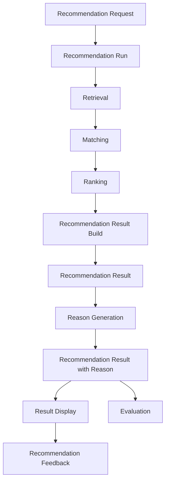
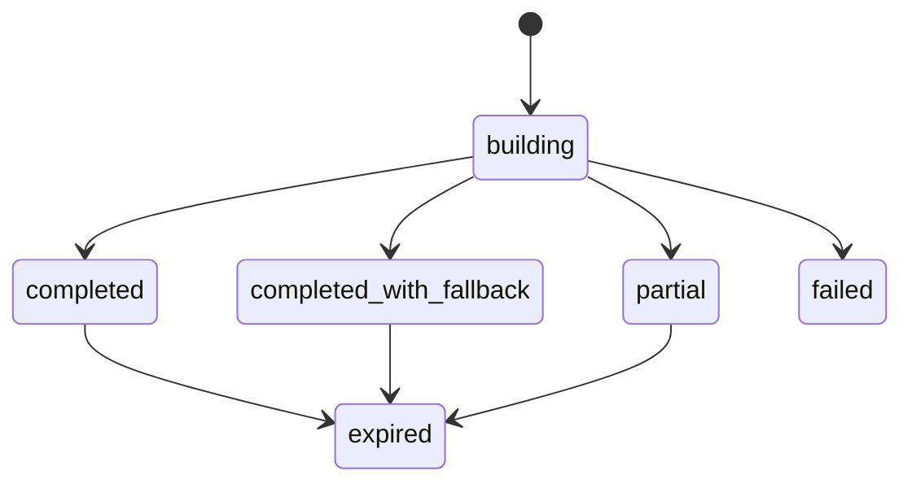
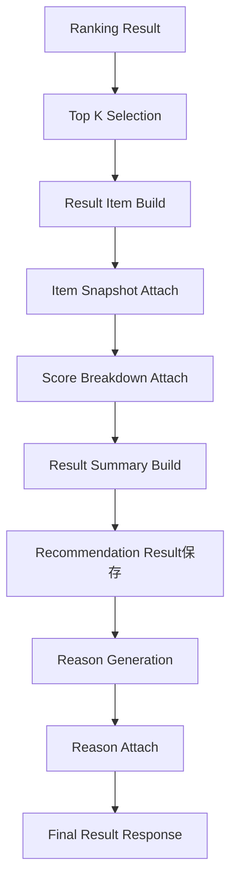

# Recommendation Result定義書

## 1. 概要

### 1.1 目的

本ドキュメントは、Gift Recommendation Serviceにおける `Recommendation Result` を定義する。

Recommendation Resultとは、Recommendation Requestに基づいて実行された推薦処理の結果を、ユーザー表示・再現・評価・改善に利用できる形で構造化したものである。

本サービスでは、Recommendation Resultを単なる商品一覧ではなく、以下を含む推薦結果の正本として扱う。

```text
どのリクエストに対して
どの実行条件・バージョンで
どの商品を
どの順位で
どのスコア根拠に基づき
どの理由とともに
ユーザーへ提示したか
```

---

### 1.2 本ドキュメントの位置づけ

| 成果物                        | 本ドキュメントとの関係                       |
| ----------------------------- | -------------------------------------------- |
| Recommendation Request定義書  | Resultの入力元となるRequestを定義する        |
| Retrieval定義書               | Result Item候補の取得元を定義する            |
| Matching定義書                | Result Itemのcontext_score等を定義する       |
| Ranking定義書                 | Result Itemのfinal_score / rankを定義する    |
| Reason生成定義書              | Result Itemに紐づく推薦理由を定義する        |
| Recommendation Feedback定義書 | Resultに対するユーザー反応を定義する         |
| Evaluation評価定義書          | Resultを評価対象として利用する               |
| ドメインモデル                | Recommendation Result Aggregateの前提となる  |
| 処理フロー概要図              | Result生成処理の位置づけを定義する           |
| API仕様書                     | レコメンド実行APIのresponse bodyの前提となる |
| 論理ER / テーブル定義書       | recommendation_result系テーブルの前提となる  |

---

## 2. 基本方針

### 2.1 Recommendation Resultの役割

Recommendation Resultは、推薦処理の出力正本である。

```text
Recommendation Request
↓
Recommendation Run
↓
Retrieval
↓
Matching
↓
Ranking
↓
Recommendation Result
↓
Recommendation Feedback / Evaluation
```

Recommendation Resultは、ユーザーに表示した推薦結果を後から再現・評価できるようにするための中心データである。

---

### 2.2 基本方針

- Recommendation Resultは、推薦結果の正本として扱う
- Recommendation RequestとRecommendation Runに必ず紐づける
- Resultは複数のResult Itemを持つ
- Result Itemは推薦された商品1件を表す
- Result Itemにはrank、score、score_breakdownを保持する
- ReasonはResult Itemに紐づくが、詳細定義はReason生成定義書に委ねる
- top_k件の最終表示対象を保持する
- Retrieval候補全体ではなく、最終的に提示する推薦結果を中心に保持する
- 評価・改善のため、使用したversion情報を保持する
- ユーザーに表示した内容を後から追跡できるようにする
- MVPでは、購入・決済・配送状態は扱わない

---

## 3. Recommendation Resultの責務

### 3.1 In Scope

| 対象                    | 内容                                                                    |
| ----------------------- | ----------------------------------------------------------------------- |
| 推薦結果保持            | 推薦実行によって生成された最終結果を保持する                            |
| Result Item保持         | 推薦された商品明細を保持する                                            |
| 順位保持                | 表示順位rankを保持する                                                  |
| スコア保持              | context_score / popularity_score / risk_penalty / final_scoreを保持する |
| スコア内訳保持          | なぜその順位になったかを分析可能にする                                  |
| Request / Runとの紐づけ | 入力条件・実行単位と接続する                                            |
| Version情報保持         | semantic_config_version / model_version等を保持する                     |
| 表示用情報保持          | 商品名、価格、画像URL、商品URL等のスナップショットを保持する            |
| Reasonとの紐づけ        | 推薦理由をResult Itemへ接続する                                         |
| Feedbackとの接続        | ユーザー反応をResult Item単位で受け取れるようにする                     |
| Evaluationへの接続      | 評価対象として再利用できるようにする                                    |

---

### 3.2 Out of Scope

| 対象外                | 理由                                      | 管理先                        |
| --------------------- | ----------------------------------------- | ----------------------------- |
| Request入力条件の定義 | Resultの入力元であり別責務                | Recommendation Request定義書  |
| 候補商品抽出          | Result生成前の候補生成処理であるため      | Retrieval定義書               |
| Matching計算          | Result生成前の意味一致計算であるため      | Matching定義書                |
| Ranking計算           | Result生成前の順位決定処理であるため      | Ranking定義書                 |
| Reason生成ロジック    | Result Itemに紐づく説明生成処理であるため | Reason生成定義書              |
| Feedback入力          | Result提示後のユーザー反応であるため      | Recommendation Feedback定義書 |
| 商品購入              | MVP対象外                                 | 制約・対象外一覧              |
| 決済・配送            | EC機能でありMVP対象外                     | 制約・対象外一覧              |

---

## 4. 全体構造

### 4.1 Recommendation Result Aggregate

Recommendation Resultは、以下の構成要素を持つ集約として扱う。

```text
Recommendation Result Aggregate
├── Result Identity
├── Request Reference
├── Run Reference
├── Result Summary
├── Result Item List
│   ├── Result Item
│   │   ├── Item Snapshot
│   │   ├── Rank
│   │   ├── Score Summary
│   │   ├── Score Breakdown
│   │   ├── Retrieval Reference
│   │   ├── Matching Reference
│   │   └── Reason Reference
├── Result Metadata
└── Version Metadata
```

---

### 4.2 処理フロー上の位置づけ



---

## 5. Result単位とItem単位

### 5.1 ResultとResult Itemの違い

| 概念                       | 粒度                  | 内容                                |
| -------------------------- | --------------------- | ----------------------------------- |
| Recommendation Result      | 推薦実行結果全体      | 1回の推薦実行で生成された結果セット |
| Recommendation Result Item | 商品1件               | 推薦結果に含まれる各商品明細        |
| Recommendation Reason      | 商品1件または結果全体 | なぜその商品を推薦したかの説明      |
| Recommendation Feedback    | 商品1件または結果全体 | ユーザーの反応・評価                |

---

### 5.2 データ粒度

```text
1 Recommendation Request
  └── 1 Recommendation Run
        └── 1 Recommendation Result
              ├── N Recommendation Result Items
              │     └── 0..1 Recommendation Reason
              └── N Recommendation Feedback
```

MVPでは、1回のRequestに対して1回のRun、1つのResultを生成する前提とする。

---

## 6. データ項目定義

## 6.1 Recommendation Result

### 6.1.1 Result Identity

| 項目                        | 型            | 必須 | 内容                              |
| --------------------------- | ------------- | ---: | --------------------------------- |
| `recommendation_result_id`  | string / uuid |    ○ | 推薦結果ID                        |
| `recommendation_request_id` | string / uuid |    ○ | 元となるRecommendation Request ID |
| `recommendation_run_id`     | string / uuid |    ○ | 推薦実行ID                        |
| `result_no`                 | string        | 任意 | 表示・追跡用の結果番号            |

---

### 6.1.2 Result Summary

| 項目                | 型      | 必須 | 内容                       |
| ------------------- | ------- | ---: | -------------------------- |
| `result_status`     | string  |    ○ | Result生成状態             |
| `result_item_count` | number  |    ○ | Result Item件数            |
| `top_k`             | number  |    ○ | 最終返却件数               |
| `candidate_count`   | number  | 任意 | Retrievalで取得した候補数  |
| `fallback_used`     | boolean | 任意 | Fallbackを使用したか       |
| `display_message`   | string  | 任意 | ユーザー向け補足メッセージ |
| `caution_message`   | string  | 任意 | 注意表示が必要な場合の文言 |

---

### 6.1.3 Version Metadata

| 項目                         | 型     | 必須 | 内容                            |
| ---------------------------- | ------ | ---: | ------------------------------- |
| `semantic_config_version_id` | string | 推奨 | 使用した Semantic Config Version（**内部 UUID**） |
| `model_version_id`           | string | 推奨 | 使用したModel Version           |
| `ranking_config_version_id`  | string | 任意 | 使用したRanking Config Version  |
| `reason_template_version_id` | string | 任意 | 使用したReason Template Version |

---

### 6.1.4 Result Metadata

| 項目             | 型       | 必須 | 内容                                   |
| ---------------- | -------- | ---: | -------------------------------------- |
| `mode`           | string   |    ○ | ui / evaluation / batch                |
| `created_at`     | datetime |    ○ | Result作成日時                         |
| `displayed_at`   | datetime | 任意 | ユーザー表示日時                       |
| `expired_at`     | datetime | 任意 | Result有効期限                         |
| `result_payload` | json     | 任意 | 表示用レスポンス全体のスナップショット |
| `debug_payload`  | json     | 任意 | 評価・デバッグ用詳細情報               |

---

## 6.2 Recommendation Result Item

### 6.2.1 Result Item Identity

| 項目                            | 型            | 必須 | 内容                 |
| ------------------------------- | ------------- | ---: | -------------------- |
| `recommendation_result_item_id` | string / uuid |    ○ | 推薦結果明細ID       |
| `recommendation_result_id`      | string / uuid |    ○ | 親Result ID          |
| `item_id`                       | string / uuid |    ○ | 商品ID               |
| `rank`                          | number        |    ○ | 表示順位             |
| `is_displayed`                  | boolean       |    ○ | ユーザーに表示したか |

---

### 6.2.2 Item Snapshot

Result Itemには、表示時点の商品情報スナップショットを保持する。

| 項目                      | 型     | 必須 | 内容                   |
| ------------------------- | ------ | ---: | ---------------------- |
| `item_name_snapshot`      | string |    ○ | 表示時点の商品名       |
| `item_price_snapshot`     | number |    ○ | 表示時点の価格         |
| `item_url_snapshot`       | string |    ○ | 表示時点の商品URL      |
| `item_image_url_snapshot` | string | 任意 | 表示時点の商品画像URL  |
| `shop_name_snapshot`      | string | 任意 | 表示時点のショップ名   |
| `review_average_snapshot` | number | 任意 | 表示時点のレビュー平均 |
| `review_count_snapshot`   | number | 任意 | 表示時点のレビュー件数 |
| `genre_name_snapshot`     | string | 任意 | 表示時点のジャンル名   |

---

### 6.2.3 Score Summary

| 項目                | 型     | 必須 | 内容                           |
| ------------------- | ------ | ---: | ------------------------------ |
| `context_score`     | number |    ○ | 贈答文脈との意味一致スコア     |
| `social_match`      | number | 任意 | Social軸の一致度               |
| `symbolic_match`    | number | 任意 | Symbolic軸の一致度             |
| `popularity_score`  | number | 任意 | 人気・信頼性補助スコア         |
| `risk_penalty`      | number | 任意 | リスク減点                     |
| `diversity_penalty` | number | 任意 | 類似商品重複を避けるための調整 |
| `final_score`       | number |    ○ | 最終順位スコア                 |

---

### 6.2.4 Score Breakdown

`score_breakdown` は、スコアの内訳をJSONとして保持する。

例：

```json
{
  "context_score": {
    "value": 0.82,
    "social_match": 0.86,
    "symbolic_match": 0.76
  },
  "popularity_score": {
    "value": 0.64,
    "review_average": 4.5,
    "review_count": 120
  },
  "risk_penalty": {
    "value": 0.08,
    "avoid_similarity": 0.12,
    "data_quality_risk": 0.03
  },
  "final_score": {
    "value": 0.78,
    "formula_version": "ranking_config_v001"
  }
}
```

---

### 6.2.5 Reference情報

| 項目                       | 型            | 必須 | 内容                          |
| -------------------------- | ------------- | ---: | ----------------------------- |
| `retrieval_candidate_id`   | string / uuid | 任意 | 元になったRetrieval Candidate |
| `matching_result_id`       | string / uuid | 任意 | 元になったMatching Result     |
| `ranking_result_id`        | string / uuid | 任意 | 元になったRanking Result      |
| `recommendation_reason_id` | string / uuid | 任意 | 紐づく推薦理由ID              |
| `is_fallback`              | boolean       | 任意 | Fallback候補か                |
| `retrieval_method`         | string        | 任意 | 候補取得方式                  |
| `reason_status`            | string        | 任意 | Reason生成状態                |

---

## 7. Result Status

### 7.1 Result状態一覧

| status                    | 内容                             |
| ------------------------- | -------------------------------- |
| `building`                | Result構築中                     |
| `completed`               | Result生成完了                   |
| `completed_with_fallback` | Fallbackを利用してResult生成完了 |
| `partial`                 | 一部処理失敗があるが表示可能     |
| `failed`                  | Result生成失敗                   |
| `expired`                 | 古いResultとして有効期限切れ     |

---

### 7.2 状態遷移



---

### 7.3 MVPでの扱い

MVPでは、以下を中心に扱う。

| status                    | MVP利用 |
| ------------------------- | ------: |
| `completed`               |       ○ |
| `completed_with_fallback` |       ○ |
| `partial`                 |       △ |
| `failed`                  |       ○ |
| `expired`                 |    任意 |

---

## 8. Result生成フロー

### 8.1 Result Buildの流れ



---

### 8.2 Result Build処理ステップ

| Step | 処理                   | 内容                                          |
| ---: | ---------------------- | --------------------------------------------- |
|    1 | Top K Selection        | Ranking結果からtop_k件を抽出する              |
|    2 | Result Item Build      | 商品ごとのResult Itemを生成する               |
|    3 | Item Snapshot Attach   | 表示時点の商品情報を保存する                  |
|    4 | Score Attach           | context_score / final_score等を保存する       |
|    5 | Score Breakdown Attach | スコア内訳を保存する                          |
|    6 | Result Summary Build   | Result全体の件数・状態・補足を生成する        |
|    7 | Result保存             | recommendation_result / result_itemを保存する |
|    8 | Reason生成             | Result Itemごとに推薦理由を生成する           |
|    9 | Reason紐づけ           | ReasonをResult Itemに紐づける                 |
|   10 | Response返却           | web向けレスポンスを返却する                   |

---

## 9. APIレスポンス上の扱い

### 9.1 レコメンド実行APIレスポンス例

```json
{
  "recommendation_result_id": "result_001",
  "recommendation_request_id": "request_001",
  "recommendation_run_id": "run_001",
  "result_status": "completed",
  "top_k": 10,
  "result_item_count": 10,
  "fallback_used": false,
  "items": [
    {
      "recommendation_result_item_id": "result_item_001",
      "item_id": "item_001",
      "rank": 1,
      "item_name": "上品な焼き菓子ギフトセット",
      "item_price": 4320,
      "item_url": "https://example.com/item/001",
      "item_image_url": "https://example.com/item/001.jpg",
      "shop_name": "Example Shop",
      "context_score": 0.82,
      "popularity_score": 0.64,
      "risk_penalty": 0.08,
      "final_score": 0.78,
      "reason": "上司へのお礼として失礼がなく、上品さと感謝の伝わりやすさのバランスが良いため候補にしています。"
    }
  ],
  "metadata": {
    "mode": "ui",
    "semantic_config_version_id": "7c9e6679-7425-40de-944b-e07fc1f90ae7",
    "model_version_id": "model_v001"
  }
}
```

---

### 9.2 APIレスポンスで返す情報

| 情報                        | 返却方針                            |
| --------------------------- | ----------------------------------- |
| `recommendation_result_id`  | 必須                                |
| `recommendation_request_id` | 必須                                |
| `recommendation_run_id`     | 必須                                |
| `result_status`             | 必須                                |
| `items`                     | 必須                                |
| `score_breakdown`           | MVPでは通常非表示。debug時のみ返却  |
| `reason`                    | 表示用に返却                        |
| `debug_payload`             | evaluation / debug modeのみ返却     |
| `version情報`               | evaluation / debug modeでは返却推奨 |

> **debug mode / debug返却条件（API-INT-002）:** 本表の「debug時」「evaluation / debug mode」は、API-INT-002 契約仕様書 §7.3.8 の **debug返却条件**（`execution.mode = evaluation` OR `execution.includeDebugInfo = true`）に対応する。`score_breakdown` は `data.resultItems[].scoreBreakdown`、`debug_payload` は `data.metadata.debugPayload` にマッピングする（Issue #375）。`debugPayload` 推奨キーの Semantic Config 参照は `configName` + `versionLabel` composite（Task #463）。

---

## 10. DB・実装上の扱い

### 10.1 recommendation_result

論理的には以下の項目を持つ。

| 項目                         | 内容                    |
| ---------------------------- | ----------------------- |
| `recommendation_result_id`   | 推薦結果ID              |
| `recommendation_request_id`  | 推薦リクエストID        |
| `recommendation_run_id`      | 推薦実行ID              |
| `mode`                       | ui / evaluation / batch |
| `result_status`              | Result状態              |
| `top_k`                      | 最終返却件数            |
| `result_item_count`          | Result Item件数         |
| `candidate_count`            | Retrieval候補件数       |
| `fallback_used`              | Fallback利用有無        |
| `display_message`            | 表示用補足              |
| `caution_message`            | 注意表示                |
| `semantic_config_version_id` | Semantic Config Version |
| `model_version_id`           | Model Version           |
| `ranking_config_version_id`  | Ranking Config Version  |
| `reason_template_version_id` | Reason Template Version |
| `result_payload`             | 結果payload             |
| `debug_payload`              | デバッグpayload         |
| `created_at`                 | 作成日時                |
| `displayed_at`               | 表示日時                |
| `expired_at`                 | 有効期限                |

---

### 10.2 recommendation_result_item

論理的には以下の項目を持つ。

| 項目                            | 内容                         |
| ------------------------------- | ---------------------------- |
| `recommendation_result_item_id` | 推薦結果明細ID               |
| `recommendation_result_id`      | 推薦結果ID                   |
| `item_id`                       | 商品ID                       |
| `rank`                          | 表示順位                     |
| `is_displayed`                  | 表示有無                     |
| `item_name_snapshot`            | 商品名スナップショット       |
| `item_price_snapshot`           | 価格スナップショット         |
| `item_url_snapshot`             | 商品URLスナップショット      |
| `item_image_url_snapshot`       | 商品画像URLスナップショット  |
| `shop_name_snapshot`            | 店舗名スナップショット       |
| `review_average_snapshot`       | レビュー平均スナップショット |
| `review_count_snapshot`         | レビュー件数スナップショット |
| `genre_name_snapshot`           | ジャンル名スナップショット   |
| `context_score`                 | 意味一致スコア               |
| `social_match`                  | Social一致度                 |
| `symbolic_match`                | Symbolic一致度               |
| `popularity_score`              | 人気補助スコア               |
| `risk_penalty`                  | リスク減点                   |
| `diversity_penalty`             | 多様性調整                   |
| `final_score`                   | 最終スコア                   |
| `score_breakdown`               | スコア内訳JSON               |
| `retrieval_candidate_id`        | Retrieval Candidate ID       |
| `matching_result_id`            | Matching Result ID           |
| `ranking_result_id`             | Ranking Result ID            |
| `recommendation_reason_id`      | Reason ID                    |
| `is_fallback`                   | Fallback候補か               |
| `retrieval_method`              | 取得方式                     |
| `created_at`                    | 作成日時                     |

---

### 10.3 Snapshotを持つ理由

Result Itemには、itemテーブルへの参照だけでなく、表示時点の商品情報スナップショットを保持する。

| 理由               | 内容                                                           |
| ------------------ | -------------------------------------------------------------- |
| 再現性             | 後で商品名・価格・画像が変わっても、当時の表示内容を確認できる |
| 評価               | ユーザーが見た内容と評価結果を正しく紐づけられる               |
| 監査性             | なぜその商品をその条件で出したかを追跡できる                   |
| 外部データ変動対策 | 外部ECの商品情報変更・削除に影響されにくい                     |

---

## 11. Ranking / Reason / Feedbackとの関係

### 11.1 Rankingとの関係

Rankingは、Recommendation Resultの直接の入力元である。

| Ranking出力            | Resultでの扱い              |
| ---------------------- | --------------------------- |
| `rank`                 | Result Itemの表示順位       |
| `final_score`          | Result Itemの最終スコア     |
| `context_score`        | Result Itemの意味一致スコア |
| `popularity_score`     | Result Itemの人気補助スコア |
| `risk_penalty`         | Result Itemのリスク減点     |
| `score_breakdown`      | Result Itemのスコア内訳     |
| `ranking_reason_basis` | Reason生成の根拠情報        |

---

### 11.2 Reasonとの関係

Reasonは、Result Itemに紐づく説明情報である。

```text
Recommendation Result Item
↓
Reason Generation
↓
Recommendation Reason
```

| 項目                | 方針                                   |
| ------------------- | -------------------------------------- |
| Reason生成ロジック  | Reason生成定義書で定義                 |
| Reason保存          | Recommendation Reasonとして保存        |
| Result Itemとの関係 | Result ItemからReasonを参照            |
| Reason失敗時        | Result Itemは残し、reason_statusで管理 |
| MVP表示             | 商品ごとに1つの短い推薦理由を表示      |

---

### 11.3 Feedbackとの関係

Feedbackは、ResultまたはResult Itemに対するユーザー反応である。

```text
Recommendation Result
↓
Recommendation Result Item
↓
Recommendation Feedback
```

| Feedback対象    | 内容                     |
| --------------- | ------------------------ |
| Result全体      | 推薦結果全体が良かったか |
| Result Item単位 | 個別商品が良かったか     |
| Reason単位      | 推薦理由が納得できたか   |

MVPでは、Result Item単位の簡易フィードバックを優先する。

---

## 12. Evaluationでの扱い

### 12.1 Evaluation対象としてのResult

Recommendation Resultは、評価処理の主要対象である。

| 評価観点      | 利用するResult情報                            |
| ------------- | --------------------------------------------- |
| 推薦品質      | rank / item / final_score                     |
| 意味一致      | context_score / social_match / symbolic_match |
| 安全性        | risk_penalty / NG違反有無                     |
| 説明品質      | recommendation_reason                         |
| 候補漏れ分析  | retrieval_candidateとの比較                   |
| Ranking妥当性 | score_breakdown                               |
| ユーザー反応  | feedback                                      |

---

### 12.2 評価用に保持すべき情報

| 情報            | 理由                                 |
| --------------- | ------------------------------------ |
| request_id      | 入力条件と紐づけるため               |
| run_id          | 実行単位と紐づけるため               |
| item_id         | 評価対象商品を識別するため           |
| rank            | 順位評価に必要なため                 |
| score_breakdown | なぜその順位になったか分析するため   |
| version情報     | ルール・モデル変更前後を比較するため |
| reason          | 説明品質を評価するため               |
| snapshot        | 当時の表示内容を再現するため         |

---

## 13. エラーハンドリング

### 13.1 Result生成エラー

| error_code                | 内容                           | 対応                           |
| ------------------------- | ------------------------------ | ------------------------------ |
| `RESULT_BUILD_ERROR`      | Result構築に失敗               | 推薦実行失敗として扱う         |
| `RESULT_ITEM_EMPTY`       | Result Itemが0件               | 条件見直しメッセージを返す     |
| `ITEM_SNAPSHOT_ERROR`     | 商品スナップショット取得に失敗 | 可能なら最低限のitem_idで継続  |
| `SCORE_BREAKDOWN_MISSING` | スコア内訳が不足               | debug logに記録し、表示は継続  |
| `REASON_ATTACH_ERROR`     | Reason紐づけに失敗             | reasonなしResultとして継続可能 |
| `RESULT_SAVE_ERROR`       | DB保存に失敗                   | 推薦実行失敗として扱う         |

---

### 13.2 部分失敗時の扱い

| 失敗箇所               | 扱い                                                      |
| ---------------------- | --------------------------------------------------------- |
| Reason生成失敗         | Result Itemは表示し、テンプレート理由または理由なしで返却 |
| 一部ItemのSnapshot失敗 | 該当Itemを除外または最小情報で返却                        |
| score_breakdown不足    | final_scoreがあれば表示は可能                             |
| fallback利用           | statusを`completed_with_fallback`にする                   |
| Result保存失敗         | 再現性が失われるため、原則エラー扱い                      |

---

## 14. Observability / Monitoring

### 14.1 監視対象

| 指標                           | 内容                                   |
| ------------------------------ | -------------------------------------- |
| result_build_success_rate      | Result生成成功率                       |
| result_item_count              | Result Item件数                        |
| zero_result_rate               | Result 0件率                           |
| fallback_result_rate           | Fallback利用Result率                   |
| average_final_score            | final_score平均                        |
| average_context_score          | context_score平均                      |
| score_distribution             | スコア分布                             |
| reason_generation_success_rate | Reason生成成功率                       |
| result_latency_ms              | Result生成処理時間                     |
| feedback_rate                  | Result表示後にFeedbackが付与された割合 |

---

### 14.2 分析観点

| 観点             | 内容                                             |
| ---------------- | ------------------------------------------------ |
| 上位商品の妥当性 | rank上位の商品が文脈に合っているか               |
| スコアの偏り     | final_scoreやcontext_scoreが極端に偏っていないか |
| Fallback依存     | fallback結果が多すぎないか                       |
| Reason品質       | Result Itemに対して納得感ある理由が出ているか    |
| Feedbackとの相関 | 高score商品が良いFeedbackを得ているか            |
| NG違反           | NG条件に反する商品がResultに含まれていないか     |

---

## 15. MVPでの扱い

### 15.1 MVP対象

| 項目                           | 方針                    |
| ------------------------------ | ----------------------- |
| Recommendation Result保存      | 必須                    |
| Recommendation Result Item保存 | 必須                    |
| rank保存                       | 必須                    |
| final_score保存                | 必須                    |
| context_score保存              | 必須                    |
| score_breakdown保存            | 推奨                    |
| item snapshot保存              | 必須                    |
| reason紐づけ                   | 必須                    |
| feedback接続                   | 必須                    |
| version情報保存                | 推奨                    |
| debug_payload保存              | evaluation modeでは推奨 |

---

### 15.2 MVP対象外

| 項目                      | 理由                      |
| ------------------------- | ------------------------- |
| 購入状態管理              | EC機能はMVP対象外         |
| 決済結果連携              | MVP対象外                 |
| 配送状態連携              | MVP対象外                 |
| ユーザー別履歴最適化      | 認証・履歴管理がMVP対象外 |
| 複数Result比較UI          | 初期UIでは過剰            |
| 高度なA/BテストResult管理 | 初期トラフィック不足      |
| 長期パーソナライズ        | 行動データ蓄積後に検討    |

---

## 16. 品質・レビュー観点

### 16.1 レビュー観点

| 観点            | 確認内容                                                 |
| --------------- | -------------------------------------------------------- |
| 正本性          | ユーザーに提示した推薦結果をResultとして保存できているか |
| Request接続     | 元Requestと紐づいているか                                |
| Run接続         | 推薦実行単位と紐づいているか                             |
| Result Item粒度 | 商品1件ごとのrank / score / snapshotを保持できるか       |
| Score再現性     | score_breakdownで順位根拠を追跡できるか                  |
| Version再現性   | config / model versionを保持できるか                     |
| Reason接続      | Result ItemとReasonを紐づけられるか                      |
| Feedback接続    | Result Item単位でFeedbackを受け取れるか                  |
| Evaluation接続  | 評価対象として利用できるか                               |
| MVP妥当性       | 購入・決済・配送など対象外機能を含めていないか           |

---

### 16.2 よくある問題

| 問題                           | 内容                                             | 対応                                                    |
| ------------------------------ | ------------------------------------------------ | ------------------------------------------------------- |
| item参照だけでsnapshotがない   | 後から商品情報が変わると当時の表示が再現できない | Result Itemにsnapshotを保持する                         |
| scoreがfinal_scoreだけ         | なぜ上位になったか分析できない                   | score_breakdownを保存する                               |
| ReasonがResultと切れている     | 推薦理由の評価ができない                         | result_item_idとreason_idを紐づける                     |
| Requestとの紐づけが弱い        | どの入力に対する結果か分からない                 | request_idを必須にする                                  |
| Version情報がない              | ルール変更後に再現・比較できない                 | semantic_config_version / model_versionを保存する       |
| fallbackが区別できない         | 通常推薦と補完推薦の品質を分けて見られない       | is_fallback / fallback_usedを保持する                   |
| top_kとcandidate_countが混ざる | 表示件数と候補件数が混同される                   | Resultにはtop_k、Retrievalにはcandidate_countを保持する |

---

## 17. 後続成果物への引き継ぎ

### 17.1 API仕様書への引き継ぎ

API仕様書では、本定義をもとに以下を具体化する。

| API要素        | 内容                                           |
| -------------- | ---------------------------------------------- |
| response body  | recommendation_result / result_itemを返却      |
| error response | Result生成失敗時のエラーを定義                 |
| debug response | evaluation / debug modeでscore_breakdownを返却 |
| OpenAPI Schema | Recommendation ResultのJSON Schemaを定義       |

---

### 17.2 論理ER / テーブル定義書への引き継ぎ

DB設計では、以下を定義する。

| テーブル候補                 | 内容             |
| ---------------------------- | ---------------- |
| `recommendation_result`      | 推薦結果ヘッダ   |
| `recommendation_result_item` | 推薦結果明細     |
| `recommendation_reason`      | 推薦理由         |
| `recommendation_feedback`    | 推薦結果への反応 |
| `recommendation_run`         | 推薦実行単位     |
| `retrieval_candidate`        | 候補取得結果     |
| `matching_result`            | Matching結果     |
| `ranking_result`             | Ranking結果      |

---

### 17.3 Evaluation評価定義書への引き継ぎ

Evaluationでは、Recommendation Resultを以下に利用する。

| 用途         | 内容                                                |
| ------------ | --------------------------------------------------- |
| Ranking評価  | rank / final_scoreを評価                            |
| 意味一致評価 | context_score / social_match / symbolic_matchを評価 |
| Reason評価   | recommendation_reasonを評価                         |
| Feedback分析 | feedbackとscoreの相関を見る                         |
| 失敗分析     | score_breakdown / fallback / versionを利用する      |

---

## 18. まとめ

Recommendation Resultは、推薦処理の出力正本である。

```text
Recommendation Result
=
Recommendation Requestに対して
Recommendation Runで生成された
表示対象商品の順位付き結果セット
```

MVPでは、以下の方針で運用する。

```text
- Recommendation Resultは必ずRequest / Runに紐づける
- Result Itemは商品1件単位で保持する
- rank / final_score / context_scoreを必ず保持する
- score_breakdownを保存し、評価・改善に利用する
- 表示時点の商品snapshotを保持する
- ReasonはResult Itemに紐づける
- FeedbackはResultまたはResult Itemに紐づける
- semantic_config_version / model_versionを保持し、再現性を確保する
- 購入・決済・配送はMVP対象外とする
```

Recommendation Resultは、ユーザー表示・評価・改善・デバッグの中心となるため、単なるAPIレスポンスではなく、推薦結果の正本として管理する。
