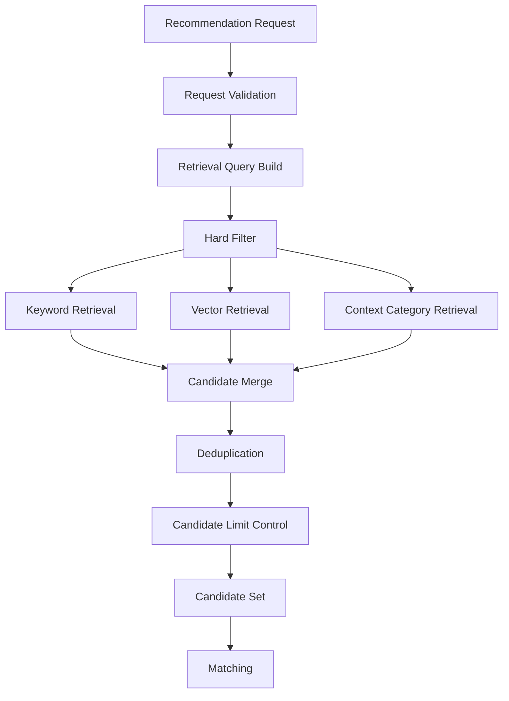

# Retrieval定義書

## 1. 概要

### 1.1 目的

本ドキュメントは、Gift Recommendation Serviceにおける `Retrieval` を定義する。

Retrievalとは、Recommendation Requestをもとに、後続のMatching / Rankingで評価対象とする候補商品集合を取得する処理である。

本サービスでは、Retrievalを以下の役割として位置づける。

```text
Recommendation Request
↓
Hard Filter
↓
Candidate Retrieval
↓
Candidate Set
↓
Matching
↓
Ranking
```

Retrievalは、最終順位を決定する工程ではなく、**推薦候補として評価すべき商品を適切に集める工程**である。

---

### 1.2 本ドキュメントの位置づけ

| 成果物                       | 本ドキュメントとの関係                                         |
| ---------------------------- | -------------------------------------------------------------- |
| Recommendation Request定義書 | Retrievalの入力条件を定義する                                  |
| Semanticルール定義書         | Retrievalに利用する検索意図・意味概念の抽出元                  |
| Featureルール定義書          | User Feature生成結果を候補抽出補助に利用する                   |
| Matching定義書               | Retrieval後の候補商品に対して意味一致度を計算する              |
| Ranking定義書                | Matching済み候補に対して最終順位を決定する                     |
| 外部商品データ連携設計書     | Retrieval対象となる商品データ・Embedding・カテゴリ情報の供給元 |
| 論理ER / テーブル定義書      | candidate / item / item_embedding等のデータ構造に接続する      |
| API仕様書                    | レコメンド実行API内部処理の前提となる                          |
| Evaluation評価定義書         | Retrieval品質の評価対象となる                                  |

---

## 2. 基本方針

### 2.1 Retrievalの役割

Retrievalは、推薦対象となる候補商品を広めに取得する工程である。

```text
良いRetrieval = 後続のMatching/Rankingが評価すべき商品を取りこぼさない
悪いRetrieval = そもそも良い商品が候補に入らない
```

したがって、Retrievalでは最終的な精密順位付けよりも、**候補漏れを防ぐこと**を重視する。

---

### 2.2 基本方針

- Retrievalは、Matching / Rankingの前段として候補商品を生成する
- Retrievalでは、明確な除外条件を先に適用する
- 予算条件とNG条件はHard Filterとして扱う
- 好み条件や自由入力は検索クエリ・Embedding検索に利用する
- 避けたい条件は原則として除外ではなく、後続のMatching / Rankingで減点対象とする
- Retrievalは最終順位を決めない
- Retrievalの出力は `Candidate Item Set` とする
- Retrieval結果には、取得根拠を保持する
- MVPでは、DBに取り込み済みの商品データを対象とする
- MVPでは、外部EC APIをリアルタイム検索エンジンとして直接利用しない
- candidate_limitは内部候補取得件数、top_kは最終返却件数として明確に分離する

---

## 3. Retrievalの責務

### 3.1 In Scope

| 対象               | 内容                                                   |
| ------------------ | ------------------------------------------------------ |
| 候補商品取得       | 後続評価対象の商品候補を取得する                       |
| Hard Filter        | 予算・NG条件・利用可否等で明確に除外する               |
| Semantic Retrieval | 入力文やSemantic情報をもとに意味的に近い商品を取得する |
| Keyword Retrieval  | 商品名・説明・カテゴリ等を用いたキーワード検索を行う   |
| Vector Retrieval   | Embedding類似度を用いた候補抽出を行う                  |
| Candidate統合      | 複数検索経路の候補を統合・重複排除する                 |
| Candidate制限      | candidate_limitに基づき候補数を制御する                |
| Retrieval根拠保持  | なぜ候補に入ったかを保持する                           |
| Fallback           | 検索結果不足時に代替取得を行う                         |

---

### 3.2 Out of Scope

| 対象外               | 理由                                         | 管理先                                         |
| -------------------- | -------------------------------------------- | ---------------------------------------------- |
| User Feature生成     | Retrieval前の意味・Feature変換処理であるため | Featureルール定義書                            |
| Item Feature生成     | 商品データ側の意味推定処理であるため         | Featureルール定義書 / 外部商品データ連携設計書 |
| Matching計算         | Candidate取得後の比較処理であるため          | Matching定義書                                 |
| final_score算出      | Rankingの責務であるため                      | Ranking定義書                                  |
| MMR適用              | 最終RankingまたはRe-rankingの責務であるため  | Ranking定義書                                  |
| Reason生成           | 結果説明の責務であるため                     | Reason生成定義書                               |
| 商品データ取得バッチ | 商品カタログを作る処理であるため             | 外部商品データ連携設計書 / バッチ仕様書        |
| 外部API仕様詳細      | API接続の技術詳細であるため                  | 外部商品データ連携設計書                       |

---

## 4. Retrieval全体構造

### 4.1 全体フロー



---

### 4.2 Pipeline上の位置づけ

```text
1. Recommendation Request
2. Semantic Extraction
3. User Feature Generation
4. Retrieval
5. Matching
6. Ranking
7. Recommendation Result
8. Reason Generation
```

Retrievalは、Semantic Extraction / User Feature Generationの結果を利用できるが、MVPでは以下のように段階的に扱う。

| フェーズ  | Retrieval入力                                    |
| --------- | ------------------------------------------------ |
| MVP初期   | Requestの構造化項目 + free_text + preferred_text |
| MVP改善後 | Semantic Concept抽出結果                         |
| 将来      | User Feature / User Embedding / Personal Context |

---

## 5. Retrieval入力

### 5.1 入力一覧

| 入力                         | 内容                     | 生成元                 |
| ---------------------------- | ------------------------ | ---------------------- |
| `recommendation_request_id`  | 推薦リクエストID         | Recommendation Request |
| `relationship_code`          | 贈る相手との関係性       | Recommendation Request |
| `occasion_code`              | 贈答目的                 | Recommendation Request |
| `budgetMin`                  | 予算下限                 | Recommendation Request |
| `budgetMax`                  | 予算上限                 | Recommendation Request |
| `preferred_text`             | 好み条件                 | Recommendation Request |
| `preferred_keywords`         | 好み補助キーワード       | Recommendation Request |
| `non_preferred_text`         | 避けたい条件             | Recommendation Request |
| `non_preferred_keywords`     | 避けたい補助キーワード   | Recommendation Request |
| `ng_text`                    | NG条件                   | Recommendation Request |
| `ng_keywords`                | NGキーワード             | Recommendation Request |
| `ng_categories`              | NGカテゴリ               | Recommendation Request |
| `free_text`                  | 自由入力                 | Recommendation Request |
| `candidate_limit`            | 内部候補取得件数         | Recommendation Request |
| `mode`                       | ui / evaluation / batch  | Recommendation Request |
| `semantic_extraction_result` | Semantic Concept抽出結果 | Semantic Extraction    |
| `user_embedding`             | ユーザー入力Embedding    | Embedding生成          |
| `semantic_config_version_id` | Semantic設定Version      | Config                 |
| `model_version_id`           | Model Version            | Config                 |

---

### 5.2 必須入力

MVPでは、Retrievalに必要な入力を以下とする。

| 入力                        | 必須 | 理由                         |
| --------------------------- | ---: | ---------------------------- |
| `recommendation_request_id` |    ○ | トレース・保存に必要         |
| `relationship_code`         |    ○ | 文脈検索・fallbackに利用     |
| `occasion_code`             |    ○ | 文脈検索・fallbackに利用     |
| `budgetMin`                 | 任意 | 未指定を許容                 |
| `budgetMax`                 | 任意 | 未指定を許容                 |
| `preferred_text`            | 任意 | 未指定でも文脈ベース検索可能 |
| `ng_condition`              | 任意 | 未指定でも検索可能           |
| `candidate_limit`           |    ○ | 候補数制御に必要             |
| `mode`                      |    ○ | 実行モード制御に必要         |

---

## 6. Retrieval出力

### 6.1 Candidate Set

Retrievalの出力は、`Candidate Set` である。

```text
Candidate Set
= Hard Filterを通過し、Matching対象となる商品候補の集合
```

---

### 6.2 出力項目

| 項目                        | 内容                 |
| --------------------------- | -------------------- |
| `retrieval_run_id`          | Retrieval実行ID      |
| `recommendation_request_id` | 推薦リクエストID     |
| `candidate_items`           | 候補商品リスト       |
| `candidate_count`           | 候補件数             |
| `candidate_limit`           | 最大候補件数         |
| `retrieval_methods`         | 使用した取得方式     |
| `fallback_used`             | fallbackを使用したか |
| `filter_summary`            | Hard Filter適用結果  |
| `retrieval_metadata`        | 実行時の補足情報     |

---

### 6.3 Candidate Item

Candidate Itemは、以下を持つ。

| 項目                  | 内容                    |
| --------------------- | ----------------------- |
| `candidate_item_id`   | 候補明細ID              |
| `item_id`             | 商品ID                  |
| `retrieval_rank`      | Retrieval内の暫定順位   |
| `retrieval_score`     | Retrieval内の暫定スコア |
| `retrieval_method`    | 取得方式                |
| `matched_query`       | 一致した検索条件        |
| `matched_text`        | 一致した商品テキスト    |
| `vector_similarity`   | Embedding類似度         |
| `keyword_match_score` | キーワード一致度        |
| `passed_filters`      | 通過したFilter          |
| `retrieval_reason`    | 候補入りした理由        |
| `created_at`          | 作成日時                |

---

### 6.4 出力例

```json
{
  "retrieval_run_id": "retrieval_run_001",
  "recommendation_request_id": "request_001",
  "candidate_count": 50,
  "candidate_limit": 50,
  "retrieval_methods": ["vector", "keyword", "context_category"],
  "fallback_used": false,
  "filter_summary": {
    "budget_filter": {
      "enabled": true,
      "budgetMin": 3000,
      "budgetMax": 5000
    },
    "ng_filter": {
      "enabled": true,
      "ng_keywords": ["アルコール"]
    }
  },
  "candidate_items": [
    {
      "item_id": "item_001",
      "retrieval_rank": 1,
      "retrieval_score": 0.82,
      "retrieval_method": "vector",
      "matched_query": "上品 感謝 お礼",
      "vector_similarity": 0.84,
      "keyword_match_score": 0.41,
      "retrieval_reason": "preferred_textと商品説明の意味類似度が高いため"
    }
  ]
}
```

---

## 7. Retrieval方式

### 7.1 Retrieval方式一覧

| retrieval_method   | 内容                                            | MVP対象 |
| ------------------ | ----------------------------------------------- | ------: |
| `hard_filter`      | 予算・NG・利用可否による除外                    |       ○ |
| `keyword`          | 商品名・説明・カテゴリのキーワード検索          |       ○ |
| `vector`           | Embedding類似度による検索                       |       ○ |
| `context_category` | relationship / occasionに合うカテゴリ・タグ検索 |       △ |
| `popular_fallback` | 候補不足時の人気商品補完                        |       ○ |
| `recent_fallback`  | 新着・更新商品補完                              |       × |
| `personalized`     | ユーザー履歴を使った検索                        |       × |

---

### 7.2 MVPでの推奨構成

MVPでは、以下の3系統を基本とする。

```text
Hard Filter
+
Keyword Retrieval
+
Vector Retrieval
+
Popular Fallback
```

| 方式              | 目的                                           |
| ----------------- | ---------------------------------------------- |
| Hard Filter       | 明確に対象外の商品を除外する                   |
| Keyword Retrieval | 商品名・説明・カテゴリに直接一致する候補を拾う |
| Vector Retrieval  | 表現違いでも意味的に近い候補を拾う             |
| Popular Fallback  | 候補不足時に最低限の候補件数を確保する         |

---

## 8. Hard Filter

### 8.1 Hard Filterの目的

Hard Filterは、推薦候補に含めるべきでない商品を明確に除外する処理である。

```text
Hard Filter = 絶対条件による除外
```

MatchingやRankingの減点ではなく、候補集合から除外する。

---

### 8.2 Hard Filter対象

| Filter                  | 内容                                | 入力元                 |
| ----------------------- | ----------------------------------- | ---------------------- |
| `budget_filter`         | budgetMin / budgetMaxによる価格範囲 | Recommendation Request |
| `ng_keyword_filter`     | NGキーワードに該当する商品の除外    | ng_condition           |
| `ng_category_filter`    | NGカテゴリに該当する商品の除外      | ng_condition           |
| `active_item_filter`    | 非アクティブ商品を除外              | item                   |
| `availability_filter`   | 取得時点で利用不可の商品を除外      | item                   |
| `data_quality_filter`   | 最低限のデータが不足する商品を除外  | item_quality           |
| `duplicate_item_filter` | 同一商品の重複排除                  | item                   |

---

### 8.3 Budget Filter

#### 条件

| 条件            | 処理                         |
| --------------- | ---------------------------- |
| `budgetMin`あり | 商品価格がbudgetMin以上      |
| `budgetMax`あり | 商品価格がbudgetMax以下      |
| 両方あり        | budgetMin〜budgetMaxの範囲内 |
| 両方なし        | 価格Filterなし               |

#### 判定イメージ

```text
budgetMin <= item_price <= budgetMax
```

#### 注意点

| 注意点     | 内容                                                    |
| ---------- | ------------------------------------------------------- |
| 税込/税抜  | MVPでは取得価格をそのまま利用し、表示上の注意は別途扱う |
| 送料       | MVPでは価格Filterに送料を含めない                       |
| セール価格 | 外部データに取得できる価格を正として扱う                |
| 価格不明   | 原則除外。ただしfallback時は別途判断                    |

---

### 8.4 NG Filter

NG Filterは、`ng_condition` に該当する商品を除外する。

| NG種別       | 例               | 処理                                   |
| ------------ | ---------------- | -------------------------------------- |
| NGキーワード | アルコール       | 商品名・説明・タグに含まれる場合は除外 |
| NGカテゴリ   | 酒類             | 該当カテゴリを除外                     |
| NG属性       | 冷蔵不可         | 属性判定できる場合のみ除外             |
| NGブランド   | 特定ブランド不可 | ブランド情報がある場合のみ除外         |

---

### 8.5 non_preferred_conditionとの違い

`non_preferred_condition` はHard Filterではない。

| 条件                      | 例                             | 扱い                           |
| ------------------------- | ------------------------------ | ------------------------------ |
| `ng_condition`            | アルコールはNG                 | 候補から除外                   |
| `non_preferred_condition` | カジュアルすぎるものは避けたい | Matching / Rankingで減点       |
| `preferred_condition`     | 上品なものがよい               | Retrieval / Matchingで加点方向 |

---

### 8.6 Hard Filterの適用順

```text
1. active_item_filter
2. availability_filter
3. budget_filter
4. ng_category_filter
5. ng_keyword_filter
6. data_quality_filter
7. duplicate_item_filter
```

MVPでは、まず `active_item_filter` / `budget_filter` / `ng_keyword_filter` を優先する。

---

## 9. Query Build

### 9.1 Query Buildの目的

Query Buildは、Recommendation RequestからRetrieval用の検索条件を生成する処理である。

```text
Request Text
+
Relationship
+
Occasion
+
Preferred Condition
↓
Retrieval Query
```

---

### 9.2 Query構成要素

| 構成要素               | 内容                                                  |
| ---------------------- | ----------------------------------------------------- |
| `context_query`        | relationship / occasionから作る文脈検索語             |
| `preferred_query`      | preferred_text / preferred_keywordsから作る好み検索語 |
| `free_text_query`      | free_textから抽出する補助検索語                       |
| `semantic_query`       | Semantic Conceptをもとに作る検索語                    |
| `embedding_query_text` | Embedding生成に使う結合テキスト                       |
| `exclude_query`        | NG条件に基づく除外条件                                |

---

### 9.3 Query生成例

#### 入力

```json
{
  "relationship_code": "boss",
  "occasion_code": "thanks",
  "preferred_text": "上品で感謝が伝わるもの",
  "non_preferred_text": "カジュアルすぎるものは避けたい",
  "ng_text": "アルコールはNG",
  "free_text": "退職する上司に、お礼として失礼がなく、少し気の利いたものを贈りたい"
}
```

#### Retrieval Query

```json
{
  "context_query": "上司 お礼 退職 贈答",
  "preferred_query": "上品 感謝 きちんと感",
  "free_text_query": "失礼がない 気の利いた",
  "embedding_query_text": "上司へのお礼。上品で感謝が伝わり、失礼がなく、少し気の利いたギフト。",
  "exclude_query": {
    "ng_keywords": ["アルコール"]
  }
}
```

---

### 9.4 Query Build方針

| 方針                                 | 内容                                             |
| ------------------------------------ | ------------------------------------------------ |
| preferred_text重視                   | ユーザーが求める方向性を検索語に反映する         |
| relationship / occasion補助          | 文脈として検索語に加える                         |
| non_preferred_textは主検索語にしない | 避けたい語を検索に入れると逆に該当商品を拾うため |
| ng_textは除外条件として扱う          | 検索語ではなくFilter条件にする                   |
| free_textは補助利用                  | 構造化項目を補完する                             |
| 長すぎるqueryは圧縮                  | Embedding用には自然文要約して利用する            |

---

## 10. Keyword Retrieval

### 10.1 目的

Keyword Retrievalは、商品名・説明・カテゴリ・タグに対して、検索語が直接一致する商品を候補として取得する方式である。

---

### 10.2 検索対象

| 対象              | 内容                       |
| ----------------- | -------------------------- |
| `item_name`       | 商品名                     |
| `item_caption`    | 商品説明                   |
| `item_catchcopy`  | キャッチコピー             |
| `genre_name`      | ジャンル名                 |
| `tag_names`       | 商品タグ                   |
| `shop_name`       | 店舗名                     |
| `semantic_labels` | 事前付与したSemanticラベル |

---

### 10.3 Keyword Retrievalの特徴

| 長所                   | 短所                     |
| ---------------------- | ------------------------ |
| 実装しやすい           | 表現ゆれに弱い           |
| 検索根拠が分かりやすい | 意味的な近さを拾いにくい |
| NG Filterと相性が良い  | 同義語・抽象語に弱い     |
| デバッグしやすい       | 検索語設計に依存する     |

---

### 10.4 スコア方針

Keyword Retrievalでは、暫定的に `keyword_match_score` を付与してよい。

ただし、このスコアは最終順位ではなく、Candidate統合時の優先度にのみ使う。

```text
keyword_match_score
= 商品名一致
+ 説明文一致
+ タグ一致
+ カテゴリ一致
```

MVPでは厳密な式は固定せず、以下の優先度で扱う。

| 一致対象 | 重みイメージ |
| -------- | -----------: |
| 商品名   |           高 |
| タグ     |           中 |
| カテゴリ |           中 |
| 説明文   |       低〜中 |

---

## 11. Vector Retrieval

### 11.1 目的

Vector Retrievalは、Embedding類似度を用いて、ユーザー入力と意味的に近い商品を候補として取得する方式である。

```text
embedding_query_text
↓
User Query Embedding
↓
Item Embedding検索
↓
Semantic Candidate Items
```

---

### 11.2 検索対象

| 対象                      | 内容                                          |
| ------------------------- | --------------------------------------------- |
| `item_embedding`          | 商品名・説明・タグ等から生成した商品Embedding |
| `item_semantic_embedding` | 意味推定結果から生成したEmbedding             |
| `item_concept_embedding`  | Semantic ConceptベースのEmbedding             |
| `combined_item_embedding` | 複数情報を統合したEmbedding                   |

MVPでは、`combined_item_embedding` または `item_embedding` を利用する。

---

### 11.3 類似度

MVPでは、cosine similarityを基本とする。

```text
vector_similarity = cosine_similarity(query_embedding, item_embedding)
```

`vector_similarity` はRetrieval候補選定に利用するが、最終スコアではない。  
最終的な意味一致度はMatchingで計算する。

---

### 11.4 Vector Retrievalの特徴

| 長所                       | 短所                    |
| -------------------------- | ----------------------- |
| 表現ゆれに強い             | 検索根拠が説明しにくい  |
| 抽象的な好みに対応しやすい | Embedding品質に依存する |
| 商品説明が豊富な場合に有効 | 商品説明が薄いと弱い    |
| Semantic検索に向く         | NG判定には向かない      |

---

### 11.5 Vector Retrieval方針

| 方針                              | 内容                           |
| --------------------------------- | ------------------------------ |
| preferred_textを中心にEmbedding化 | 好み方向の意味検索を行う       |
| free_textを補助的に利用           | ユーザー文脈を補完する         |
| relationship / occasionを含める   | ギフト文脈を反映する           |
| non_preferred_textは原則含めない  | 避けたい商品を拾うリスクがある |
| ng_textは含めない                 | 除外条件であり検索語ではない   |
| Hard Filter後に検索する           | NG・予算外商品を先に除外する   |

---

## 12. Context Category Retrieval

### 12.1 目的

Context Category Retrievalは、relationship / occasionに応じて、相性の良いカテゴリ・タグの商品を候補取得する方式である。

例：

```text
boss + thanks
↓
上品 / 贈答用 / 詰め合わせ / 高評価 / きちんと感
```

---

### 12.2 MVPでの扱い

MVPでは必須ではないが、候補不足時や検索精度改善のために利用してよい。

| 扱い      | 内容                               |
| --------- | ---------------------------------- |
| MVP初期   | 任意                               |
| MVP改善後 | fallback候補取得に利用             |
| 将来      | Relationship / Occasion Ruleと連動 |

---

### 12.3 使いどころ

| ケース                 | 利用理由                                      |
| ---------------------- | --------------------------------------------- |
| preferred_textが空     | 文脈だけで候補を取得する必要がある            |
| vector検索結果が少ない | 候補補完が必要                                |
| 商品説明が薄い         | カテゴリ・タグで補完する                      |
| 評価用ケース           | relationship / occasion別の標準候補を確保する |

---

## 13. Candidate Merge

### 13.1 目的

Candidate Mergeは、複数のRetrieval方式から取得した候補を統合する処理である。

```text
Keyword Candidates
+
Vector Candidates
+
Context Category Candidates
+
Fallback Candidates
↓
Merged Candidate Set
```

---

### 13.2 統合方針

| 方針                              | 内容                                           |
| --------------------------------- | ---------------------------------------------- |
| item_id単位で重複排除             | 同じ商品が複数経路で取得されても1件にまとめる  |
| retrieval_methodsを保持           | どの方式で取得されたかを保持する               |
| 複数経路一致を優先                | keyword + vector両方で取得された商品を優先する |
| retrieval_scoreは暫定             | Rankingのfinal_scoreとは分離する               |
| candidate_limitを超えた場合は制限 | ただし多様性を一定考慮する                     |

---

### 13.3 Candidate Merge例

```json
{
  "item_id": "item_001",
  "retrieval_methods": ["keyword", "vector"],
  "keyword_match_score": 0.65,
  "vector_similarity": 0.84,
  "retrieval_score": 0.78,
  "retrieval_reason": "キーワード検索と意味検索の両方で候補に入ったため"
}
```

---

### 13.4 暫定retrieval_score

`retrieval_score` は、Candidate Merge時の候補優先度として利用する。

```text
retrieval_score
= w_vector * vector_similarity
+ w_keyword * keyword_match_score
+ w_method * multi_method_bonus
```

MVPでは、詳細な最適化は行わず、以下の考え方で十分とする。

| 条件                    | 優先度 |
| ----------------------- | ------ |
| vector_similarityが高い | 高     |
| keyword一致もある       | 高     |
| context_categoryのみ    | 中     |
| fallbackのみ            | 低     |

---

## 14. Candidate Limit Control

### 14.1 candidate_limitの役割

`candidate_limit` は、Matching / Rankingへ渡す内部候補数を制御する。

`top_k` とは役割が異なる。

| 項目              | 意味                       |
| ----------------- | -------------------------- |
| `candidate_limit` | 内部で評価する候補数       |
| `top_k`           | 最終的にユーザーへ返す件数 |

---

### 14.2 推奨値

| mode         | candidate_limit | top_k |
| ------------ | --------------: | ----: |
| `ui`         |              50 |    10 |
| `evaluation` |         50〜100 |    10 |
| `batch`      |         100以上 |  任意 |

---

### 14.3 candidate_limit制御方針

| 条件                     | 処理                             |
| ------------------------ | -------------------------------- |
| 候補数 > candidate_limit | retrieval_score順に制限          |
| 候補数 < top_k           | fallbackを実行                   |
| 候補数 = 0               | エラーまたはfallback             |
| candidate_limit未指定    | mode別デフォルトを使用           |
| candidate_limit < top_k  | candidate_limitをtop_k以上に補正 |

---

## 15. Fallback

### 15.1 Fallbackの目的

Fallbackは、通常のRetrievalで十分な候補が取得できない場合に、最低限の候補数を確保する処理である。

---

### 15.2 Fallback方式

| fallback_type         | 内容                         | MVP対象 |
| --------------------- | ---------------------------- | ------: |
| `popular_in_budget`   | 予算内の人気商品を補完       |       ○ |
| `popular_by_occasion` | occasionに合う人気商品を補完 |       △ |
| `category_default`    | デフォルトカテゴリから補完   |       △ |
| `relaxed_budget`      | 予算条件を緩和               |       × |
| `relaxed_ng`          | NG条件を緩和                 |       × |

---

### 15.3 MVPでのFallback方針

MVPでは、以下を基本とする。

```text
Hard Filterは緩めない
予算とNG条件は維持する
その範囲内で人気商品・汎用ギフト候補を補完する
```

| 条件                 | 処理                             |
| -------------------- | -------------------------------- |
| 候補数がtop_k未満    | popular_in_budgetで補完          |
| 候補数が0            | ユーザーに条件見直しを促す       |
| NG条件で候補が消えた | NG条件は維持し、条件見直しを促す |
| 予算条件が厳しすぎる | 予算条件の見直し提案を返す       |

---

### 15.4 Fallbackでやってはいけないこと

| NG                                 | 理由                   |
| ---------------------------------- | ---------------------- |
| NG条件を無視する                   | ユーザー信頼を損なう   |
| 予算上限を勝手に超える             | 絶対条件違反になる     |
| 避けたい条件をHard Filter扱いする  | 候補を狭めすぎる       |
| fallback商品を通常候補と区別しない | 評価・分析できなくなる |

---

## 16. Mode別挙動

### 16.1 mode定義

| mode         | 内容                 |
| ------------ | -------------------- |
| `ui`         | 通常ユーザー向け推薦 |
| `evaluation` | 評価用推薦           |
| `batch`      | 一括処理・検証用     |

---

### 16.2 mode別Retrieval方針

| 項目             | ui   | evaluation | batch    |
| ---------------- | ---- | ---------- | -------- |
| candidate_limit  | 50   | 50〜100    | 100以上  |
| debug情報        | 最小 | 詳細       | 詳細     |
| retrieval_reason | 保存 | 保存       | 保存     |
| fallback         | 有効 | 有効       | 条件次第 |
| 結果保存         | 必須 | 必須       | 必須     |
| 処理速度         | 重視 | 中         | 低〜中   |
| 再現性           | 必須 | 必須       | 必須     |

---

## 17. RetrievalとMatchingの境界

### 17.1 責務境界

| 観点     | Retrieval                   | Matching                                |
| -------- | --------------------------- | --------------------------------------- |
| 目的     | 候補を集める                | 候補とユーザー意図の一致度を測る        |
| 主な入力 | Request / Query / Item Data | User Feature / Item Feature / Candidate |
| 主な出力 | Candidate Set               | context_score / feature_match           |
| スコア   | retrieval_score             | context_score                           |
| 粒度     | 候補集合                    | 商品ごとの意味一致                      |
| 役割     | Recall重視                  | Precision重視                           |

---

### 17.2 retrieval_scoreとcontext_scoreの違い

| スコア            | 意味                   | 用途                    |
| ----------------- | ---------------------- | ----------------------- |
| `retrieval_score` | 候補に入れる優先度     | Candidate Merge / Limit |
| `context_score`   | 贈答文脈との意味一致度 | Rankingの主要入力       |

`retrieval_score` が高い商品でも、Matchingで `context_score` が低ければ上位には出ない。  
逆に、Retrievalに入らなかった商品はMatching対象にならない。

---

## 18. データモデル

### 18.1 retrieval_run

論理的には以下の項目を持つ。

| 項目                        | 内容                    |
| --------------------------- | ----------------------- |
| `retrieval_run_id`          | Retrieval実行ID         |
| `recommendation_request_id` | 推薦リクエストID        |
| `recommendation_run_id`     | 推薦実行ID              |
| `mode`                      | ui / evaluation / batch |
| `candidate_limit`           | 候補取得上限            |
| `retrieval_methods`         | 使用したRetrieval方式   |
| `fallback_used`             | fallback利用有無        |
| `filter_summary`            | Filter適用サマリJSON    |
| `retrieval_query`           | 実行した検索条件JSON    |
| `status`                    | success / failed        |
| `started_at`                | 開始日時                |
| `finished_at`               | 終了日時                |

---

### 18.2 retrieval_candidate

論理的には以下の項目を持つ。

| 項目                     | 内容                   |
| ------------------------ | ---------------------- |
| `retrieval_candidate_id` | Retrieval Candidate ID |
| `retrieval_run_id`       | Retrieval実行ID        |
| `item_id`                | 商品ID                 |
| `retrieval_rank`         | Retrieval内順位        |
| `retrieval_score`        | Retrieval暫定スコア    |
| `retrieval_methods`      | 取得方式JSON           |
| `vector_similarity`      | Vector類似度           |
| `keyword_match_score`    | Keyword一致度          |
| `matched_query`          | 一致した検索語         |
| `matched_text`           | 一致した商品テキスト   |
| `passed_filters`         | 通過Filter JSON        |
| `retrieval_reason`       | 候補入り理由           |
| `is_fallback`            | fallback候補か         |
| `created_at`             | 作成日時               |

---

### 18.3 保存方針

| データ              | 保存方針        |
| ------------------- | --------------- |
| retrieval_run       | 保存する        |
| retrieval_candidate | MVPでは保存推奨 |
| retrieval_query     | 保存する        |
| filter_summary      | 保存する        |
| matched_text        | 可能なら保存    |
| vector_similarity   | 保存する        |
| keyword_match_score | 保存する        |
| fallback情報        | 保存する        |

Retrieval結果を保存することで、以下が可能になる。

| 目的     | 内容                                         |
| -------- | -------------------------------------------- |
| 再現性   | なぜその候補集合になったか確認できる         |
| 評価     | 良い商品がRetrievalで漏れたか分析できる      |
| デバッグ | Filterやqueryの問題を特定できる              |
| 改善     | Retrieval方式・candidate_limitの調整に使える |

---

## 19. エラーハンドリング

### 19.1 エラー一覧

| error_code                          | 内容                      | 対応                        |
| ----------------------------------- | ------------------------- | --------------------------- |
| `RETRIEVAL_QUERY_BUILD_ERROR`       | Retrieval Query生成に失敗 | 汎用queryへfallback         |
| `RETRIEVAL_NO_CANDIDATES`           | 候補商品が0件             | 条件見直しを促す            |
| `RETRIEVAL_INSUFFICIENT_CANDIDATES` | 候補数がtop_k未満         | fallback実行                |
| `RETRIEVAL_VECTOR_SEARCH_ERROR`     | Vector検索失敗            | Keyword Retrievalへfallback |
| `RETRIEVAL_KEYWORD_SEARCH_ERROR`    | Keyword検索失敗           | Vector Retrievalへfallback  |
| `RETRIEVAL_FILTER_ERROR`            | Filter処理失敗            | 処理停止または安全側で除外  |
| `RETRIEVAL_TIMEOUT`                 | Retrieval処理タイムアウト | 部分結果またはエラー        |
| `ITEM_INDEX_NOT_READY`              | 商品検索Index未準備       | エラーとして返却            |

---

### 19.2 候補0件時の扱い

候補0件の場合は、NG条件や予算条件を勝手に緩和しない。

```text
候補が見つかりませんでした。
予算条件やNG条件を少し広げると、候補が見つかる可能性があります。
```

---

### 19.3 部分失敗時の扱い

| 失敗            | 扱い                  |
| --------------- | --------------------- |
| Vector検索失敗  | Keyword検索結果で継続 |
| Keyword検索失敗 | Vector検索結果で継続  |
| Fallback失敗    | 通常候補のみで継続    |
| Filter失敗      | 安全側に倒してエラー  |
| DB接続失敗      | 推薦実行失敗          |

---

## 20. Observability / Evaluation

### 20.1 監視対象

| 指標                         | 内容                  |
| ---------------------------- | --------------------- |
| retrieval_success_rate       | Retrieval成功率       |
| candidate_count              | 取得候補数            |
| zero_candidate_rate          | 候補0件率             |
| insufficient_candidate_rate  | candidate_limit未満率 |
| fallback_rate                | fallback発生率        |
| vector_search_success_rate   | Vector検索成功率      |
| keyword_search_success_rate  | Keyword検索成功率     |
| avg_vector_similarity        | 平均Vector類似度      |
| filter_exclusion_count       | Filter除外件数        |
| budget_filter_exclusion_rate | 予算Filter除外率      |
| ng_filter_exclusion_rate     | NG Filter除外率       |
| retrieval_latency_ms         | Retrieval処理時間     |

---

### 20.2 Evaluation観点

| 観点           | 内容                                                |
| -------------- | --------------------------------------------------- |
| 候補漏れ       | 人間が良いと判断する商品がCandidateに含まれているか |
| 候補品質       | Candidate Set全体に明らかに不適切な商品が少ないか   |
| Filter妥当性   | 除外すべき商品が除外されているか                    |
| Filter過剰     | 除外しすぎて良い商品を失っていないか                |
| 検索多様性     | 同一カテゴリ・同一店舗に偏りすぎていないか          |
| fallback妥当性 | fallback候補が最低限ギフトとして許容できるか        |
| 再現性         | 同じRequestで同じ候補集合を再現できるか             |

---

### 20.3 Retrieval失敗分類

| failure_type           | 内容                               | 改善対象                       |
| ---------------------- | ---------------------------------- | ------------------------------ |
| `candidate_missed`     | 良い商品が候補に入っていない       | Query Build / Vector Search    |
| `candidate_irrelevant` | 関係ない商品が多い                 | Retrieval Query / Filter       |
| `filter_too_strict`    | Filterが厳しすぎる                 | Hard Filter条件                |
| `filter_too_loose`     | 除外すべき商品が残る               | NG Filter                      |
| `vector_query_bad`     | Embedding用queryが悪い             | Query Build                    |
| `keyword_query_bad`    | Keywordが悪い                      | Keyword抽出                    |
| `fallback_overused`    | fallbackが多すぎる                 | Retrieval方式 / 商品データ     |
| `index_quality_low`    | 商品Embeddingや検索Index品質が低い | 外部商品データ連携 / Embedding |

---

## 21. MVPでの扱い

### 21.1 MVP対象

| 項目                    | 方針 |
| ----------------------- | ---- |
| Hard Filter             | 必須 |
| budget_filter           | 必須 |
| ng_keyword_filter       | 必須 |
| active_item_filter      | 必須 |
| Keyword Retrieval       | 必須 |
| Vector Retrieval        | 必須 |
| Candidate Merge         | 必須 |
| Deduplication           | 必須 |
| candidate_limit         | 必須 |
| Popular Fallback        | 推奨 |
| retrieval_run保存       | 推奨 |
| retrieval_candidate保存 | 推奨 |
| retrieval_reason保存    | 推奨 |

---

### 21.2 MVP対象外

| 項目                       | 理由                                   |
| -------------------------- | -------------------------------------- |
| リアルタイム外部EC検索     | 応答速度・安定性・再現性が悪くなるため |
| 個人履歴ベース検索         | 認証・履歴管理がMVP対象外のため        |
| 高度なQuery Expansion      | 初期実装では過剰なため                 |
| 自動同義語辞書最適化       | 評価データ蓄積後でよいため             |
| NG条件の高度推論           | 誤除外リスクが高いため                 |
| 予算条件の自動緩和         | ユーザー指定条件を破るため             |
| 在庫・配送リアルタイム判定 | MVPでは外部依存が大きいため            |

---

### 21.3 MVP初期実装イメージ

```text
1. Requestを受け取る
2. budget / NG / active状態でHard Filter
3. preferred_text + free_text + relationship + occasionから検索queryを作る
4. Keyword検索で候補を取得
5. Vector検索で候補を取得
6. 候補を統合・重複排除
7. candidate_limitまで絞る
8. 候補不足時は予算内人気商品で補完
9. Candidate SetをMatchingへ渡す
```

---

## 22. API・実装上の扱い

### 22.1 レコメンド実行APIとの関係

Retrievalは、外部公開APIとして独立させる必要はない。  
MVPでは、レコメンド実行API内部の処理として扱う。

```http
POST /api/v1/recommendations
```

内部処理：

```text
Request Validation
↓
Semantic Extraction
↓
Feature Generation
↓
Retrieval
↓
Matching
↓
Ranking
↓
Result Build
```

---

### 22.2 内部インターフェース例

```json
{
  "recommendation_request_id": "request_001",
  "retrieval_input": {
    "relationship_code": "boss",
    "occasion_code": "thanks",
    "budget": {
      "budgetMin": 3000,
      "budgetMax": 5000
    },
    "preferred_text": "上品で感謝が伝わるもの",
    "ng_keywords": ["アルコール"],
    "free_text": "退職する上司に贈りたい",
    "candidate_limit": 50,
    "mode": "ui"
  }
}
```

---

### 22.3 内部出力例

```json
{
  "retrieval_run_id": "retrieval_run_001",
  "candidate_items": [
    {
      "item_id": "item_001",
      "retrieval_score": 0.82,
      "retrieval_methods": ["vector", "keyword"],
      "vector_similarity": 0.84,
      "keyword_match_score": 0.65,
      "is_fallback": false
    }
  ]
}
```

---

## 23. 品質・レビュー観点

### 23.1 レビュー観点

| 観点              | 確認内容                                      |
| ----------------- | --------------------------------------------- |
| 責務分離          | RetrievalがMatching / Rankingを行っていないか |
| 候補網羅性        | 後続評価に必要な候補を取りこぼしていないか    |
| Hard Filter妥当性 | 絶対条件だけをFilterしているか                |
| avoidとの分離     | non_preferredをHard Filterにしていないか      |
| 予算条件          | budgetMin / budgetMaxを正しく扱えているか     |
| NG条件            | NGキーワード・カテゴリを安全側に扱えているか  |
| candidate_limit   | top_kと混同していないか                       |
| fallback          | NG・予算条件を破っていないか                  |
| 根拠保持          | retrieval_reasonやqueryを保存しているか       |
| 再現性            | 同じRequest・Versionで同じ候補を再現できるか  |
| 評価可能性        | 候補漏れ・Filter過剰を分析できるか            |

---

### 23.2 よくある問題

| 問題                                 | 内容                                 | 対応                             |
| ------------------------------------ | ------------------------------------ | -------------------------------- |
| Retrievalで絞りすぎる                | 良い商品がMatching前に消える         | candidate_limitを広めに取る      |
| NGとavoidが混ざる                    | 避けたい程度の商品まで除外してしまう | NGのみHard Filter                |
| Vector検索だけに依存                 | 商品説明が薄い商品を拾えない         | Keyword検索と併用                |
| Keyword検索だけに依存                | 表現ゆれに弱い                       | Vector検索と併用                 |
| fallbackが多い                       | 通常検索が弱い                       | Query Build / 商品データ改善     |
| retrieval_scoreをfinal_score扱いする | 最終順位が粗くなる                   | Matching / Rankingで再評価       |
| queryにnon_preferredを入れる         | 避けたい商品を拾う                   | non_preferredは検索queryから除外 |
| 予算を勝手に緩和する                 | ユーザー条件違反になる               | 条件見直し提案に留める           |

---

## 24. 後続成果物への引き継ぎ

### 24.1 Matching定義書への引き継ぎ

Retrievalは、Matchingに以下を渡す。

| 引き継ぎ項目        | 内容               |
| ------------------- | ------------------ |
| `candidate_items`   | Matching対象商品   |
| `item_id`           | 商品ID             |
| `retrieval_score`   | 参考スコア         |
| `retrieval_method`  | 候補取得方式       |
| `vector_similarity` | 意味検索上の類似度 |
| `retrieval_reason`  | 候補入り理由       |
| `is_fallback`       | fallback候補か     |

Matchingでは、これらを参考にしつつ、User FeatureとItem Featureから `context_score` を計算する。

---

### 24.2 Ranking定義書への引き継ぎ

Rankingでは、Retrieval結果を以下のように利用する。

| 引き継ぎ項目       | 用途                                 |
| ------------------ | ------------------------------------ |
| `candidate_items`  | Ranking対象集合                      |
| `retrieval_score`  | 必要に応じて軽い補助特徴量として利用 |
| `is_fallback`      | fallback候補の扱いを調整             |
| `retrieval_method` | 分析・デバッグに利用                 |

MVPでは、`retrieval_score` はfinal_scoreの主成分にしない。  
Rankingの主成分は `context_score` / `popularity_score` / `risk_penalty` とする。

---

### 24.3 外部商品データ連携設計書への引き継ぎ

外部商品データ連携設計書では、Retrievalに必要な商品データを供給する。

| 必要データ     | 用途                       |
| -------------- | -------------------------- |
| 商品名         | Keyword Retrieval          |
| 商品説明       | Keyword / Vector Retrieval |
| キャッチコピー | Keyword / Vector Retrieval |
| ジャンル       | Filter / Context Retrieval |
| タグ           | Filter / Keyword Retrieval |
| 価格           | Budget Filter              |
| 商品URL        | Result表示                 |
| 商品画像URL    | Result表示                 |
| レビュー評価   | Ranking補助                |
| Item Embedding | Vector Retrieval           |
| Item Feature   | Matching                   |

---

### 24.4 Evaluation評価定義書への引き継ぎ

Evaluationでは、Retrievalを以下の観点で評価する。

| 評価観点               | 内容                                |
| ---------------------- | ----------------------------------- |
| Candidate Recall       | 良い商品が候補に入っているか        |
| Filter Accuracy        | 除外条件が正しく効いているか        |
| Candidate Quality      | 明らかに不適切な候補が多くないか    |
| Fallback Rate          | fallbackに頼りすぎていないか        |
| Retrieval Method別品質 | keyword / vector / fallbackの有効性 |

---

## 25. まとめ

Retrievalは、推薦パイプラインにおいて、Matching / Rankingの評価対象となる候補商品を取得する工程である。

```text
Recommendation Request
+
Hard Filter
+
Keyword Retrieval
+
Vector Retrieval
+
Fallback
↓
Candidate Set
↓
Matching
```

MVPでは、以下の方針で運用する。

```text
- 予算条件とNG条件はHard Filterとして扱う
- non_preferred_conditionはHard Filterにしない
- preferred_text / free_text / relationship / occasionを検索queryに利用する
- Keyword RetrievalとVector Retrievalを併用する
- candidate_limitは内部候補数、top_kは最終返却件数として分離する
- retrieval_scoreは最終スコアではなく、候補統合・制限用の暫定値とする
- 候補不足時はHard Filterを維持したままfallbackする
- Retrieval結果と根拠を保存し、評価・改善に利用する
```

Retrievalの品質が低いと、後続のMatching / Rankingがどれだけ優れていても良い推薦結果は得られない。  
そのため、Retrievalは「候補を広く・安全に・再現可能に集める」ことを最重要責務とする。
