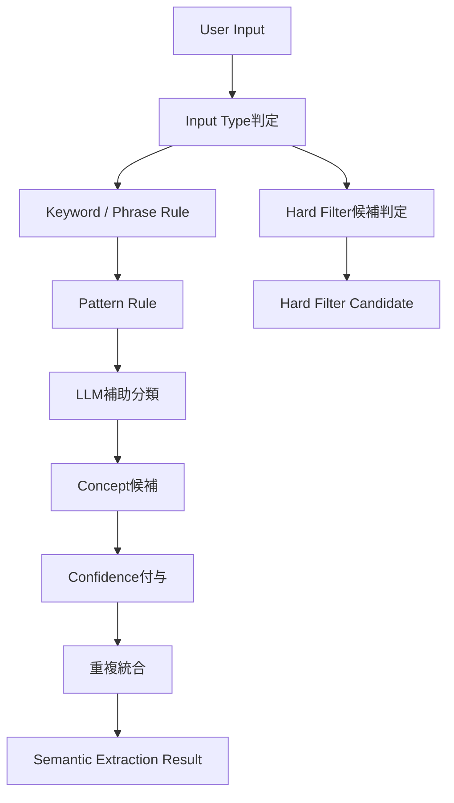
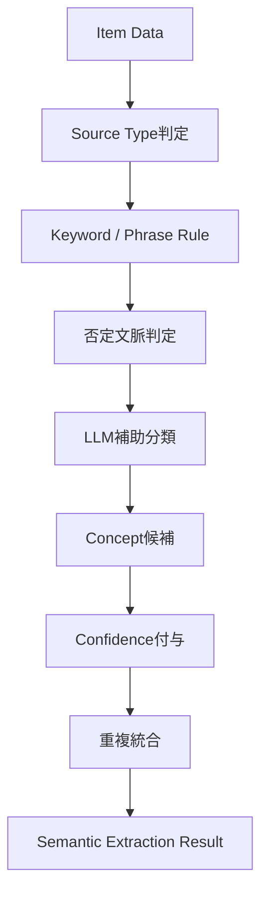

# Semanticルール定義書

## 1. 概要

### 1.1 目的

本ドキュメントは、ギフトレコメンドサービスにおける `Semanticルール` を定義する。

Semanticルールとは、ユーザー入力・商品情報・タグ・レビュー等の自然言語情報から `Semantic Concept` を抽出するためのルール群である。

```text
User Input / Item Data
↓
Semantic Rule
↓
Semantic Concept
↓
Feature Rule
↓
Feature
↓
Gift Meaning Space
```

---

### 1.2 本ドキュメントの位置づけ

| 成果物                   | 本ドキュメントとの関係                                |
| ------------------------ | ----------------------------------------------------- |
| Gift Meaning Space定義書 | Semantic ConceptをFeature化した後、意味空間へ射影する |
| Feature定義書            | Semantic Conceptが最終的に変換されるFeatureを定義する |
| Semantic Concept定義書   | 抽出対象となるSemantic Conceptを定義する              |
| Featureルール定義書      | Semantic ConceptからFeature値を生成する               |
| Matching定義書           | Feature化されたUser / Itemを比較する                  |
| Ranking定義書            | Matching結果を用いて最終順位を決定する                |

---

### 1.3 基本方針

- Semanticルールは、自然言語をSemantic Conceptへ変換するためのルールである
- Semanticルールは、Feature値を直接生成しない
- Semanticルールは、User Meaning生成とItem Meaning生成の両方で利用する
- 抽出結果には `concept_code` / `confidence` / `evidence_text` を保持する
- 好み条件・避けたい条件・NG条件は明確に区別する
- 予算条件・絶対NG条件はSemantic ConceptではなくHard Filterへ分離する
- Semanticルールは `semantic_config_version` に紐づけて管理する
- MVPでは、キーワードルール + フレーズルール + LLM補助の併用を許容する

---

## 2. Semanticルールの責務

### 2.1 In Scope

| 対象                   | 内容                                              |
| ---------------------- | ------------------------------------------------- |
| ユーザー自由入力の解釈 | 「上品なもの」「無難すぎない」などをConcept化する |
| 好み条件の解釈         | preferred_conditionからConceptを抽出する          |
| 避けたい条件の解釈     | non_preferred_conditionからConceptを抽出する      |
| 商品名の解釈           | 商品名からConceptを抽出する                       |
| 商品説明の解釈         | 商品説明文からConceptを抽出する                   |
| 商品タグの解釈         | タグ・カテゴリ語からConceptを抽出する             |
| レビュー文の解釈       | レビューからConceptを抽出する                     |
| evidence_text保持      | Concept抽出根拠を保持する                         |
| confidence算出         | 抽出信頼度を付与する                              |

---

### 2.2 Out of Scope

| 対象外            | 理由                                    | 管理先               |
| ----------------- | --------------------------------------- | -------------------- |
| Feature値生成     | Concept抽出後の変換処理であるため       | Featureルール定義書  |
| Feature正規化     | Feature raw値の正規化処理であるため     | Featureルール定義書  |
| Relationship Rule | 構造化された関係性からFeatureを作るため | Featureルール定義書  |
| Occasion Rule     | 構造化された用途からFeatureを作るため   | Featureルール定義書  |
| Matching計算      | User / Item Feature比較であるため       | Matching定義書       |
| final_score計算   | 順位決定であるため                      | Ranking定義書        |
| 価格条件          | 意味概念ではなく絶対条件であるため      | Hard Filter          |
| 在庫・配送条件    | 商品利用可能性・EC条件であるため        | Item Data / 将来拡張 |

---

## 3. Semanticルールの入力

### 3.1 User側入力

| input_type                | 内容         | Semantic抽出対象                 |
| ------------------------- | ------------ | -------------------------------- |
| `preferred_condition`     | 好み条件     | ○                                |
| `non_preferred_condition` | 避けたい条件 | ○                                |
| `free_text`               | 自由入力     | ○                                |
| `relationship`            | 関係性       | 原則対象外。構造化入力として扱う |
| `occasion`                | 贈答目的     | 原則対象外。構造化入力として扱う |
| `budget_condition`        | 予算条件     | 対象外。Hard Filter              |
| `ng_condition`            | 絶対NG条件   | 原則対象外。Hard Filter          |

---

### 3.2 Item側入力

| source_type        | 内容           | Semantic抽出対象             |
| ------------------ | -------------- | ---------------------------- |
| `item_name`        | 商品名         | ○                            |
| `item_caption`     | キャッチコピー | ○                            |
| `item_description` | 商品説明       | ○                            |
| `item_genre`       | 商品ジャンル   | ○                            |
| `item_tag`         | 商品タグ       | ○                            |
| `item_review`      | レビュー文     | ○                            |
| `item_brand`       | ブランド情報   | ○                            |
| `item_price`       | 価格情報       | 原則対象外。補助的にのみ利用 |

---

### 3.3 Relationship / Occasionの扱い

Relationship / Occasionは、原則としてSemantic Conceptではなく、構造化されたGift Contextとして扱う。

```text
Relationship / Occasion
↓
Featureルール定義書
↓
Feature
```

ただし、ユーザーが自由入力内に関係性や用途を自然文で書いた場合は、補助的に構造化候補として抽出してよい。

例：

| 入力                   | 扱い                                                    |
| ---------------------- | ------------------------------------------------------- |
| 彼女の誕生日に渡したい | relationship=`lover`, occasion=`birthday` の候補        |
| 上司へのお礼です       | relationship=`boss`, occasion=`thanks` の候補           |
| 親友の送別に           | relationship=`friend_close`, occasion=`farewell` の候補 |

この推定結果は、正式なRelationship / Occasion入力を上書きせず、補助候補として扱う。

---

## 4. Semanticルールの出力

### 4.1 出力項目

Semanticルールの出力は、以下の構造とする。

| 項目                         | 内容                                                        |
| ---------------------------- | ----------------------------------------------------------- |
| `target_type`                | `user` / `item`                                             |
| `target_id`                  | user_request_id / item_id等                                 |
| `input_type`                 | preferred_condition / non_preferred_condition / free_text等 |
| `source_type`                | item_name / item_description / item_tag等                   |
| `concept_code`               | 抽出されたSemantic Concept                                  |
| `input_intent`               | prefer / avoid / neutral / ng_candidate                     |
| `assertion_polarity`         | asserted / negated / uncertain                              |
| `confidence`                 | 抽出信頼度                                                  |
| `evidence_text`              | 抽出根拠テキスト                                            |
| `extraction_method`          | keyword / phrase / pattern / llm / hybrid                   |
| `semantic_config_version_id` | 使用した意味定義バージョン                                  |
| `generated_at`               | 生成日時                                                    |

---

### 4.2 出力イメージ

```json
{
  "target_type": "user",
  "target_id": "user_request_001",
  "input_type": "preferred_condition",
  "source_type": "user_input",
  "concept_code": "special_memorable",
  "input_intent": "prefer",
  "assertion_polarity": "asserted",
  "confidence": 0.86,
  "evidence_text": "特別感があるもの",
  "extraction_method": "phrase",
  "semantic_config_version_id": "scv_001"
}
```

---

## 5. Semantic Concept一覧

### 5.1 抽出対象Concept

MVPでは、以下の18Conceptを抽出対象とする。

| concept_code            | concept_label      | concept_group          |
| ----------------------- | ------------------ | ---------------------- |
| `formal_refined`        | 上品・端正         | social_appropriateness |
| `safe_classic`          | 無難・定番         | social_appropriateness |
| `prestigious_quality`   | 高級・上質         | social_appropriateness |
| `practical_useful`      | 実用・機能         | practical_value        |
| `emotional_warm`        | 温かい気持ち       | emotional_value        |
| `special_memorable`     | 特別・記憶に残る   | special_value          |
| `surprising_unique`     | 意外性・ユニーク   | special_value          |
| `romantic_affectionate` | 愛情・ロマン       | relationship_value     |
| `close_personal`        | 親しさ・近さ       | relationship_value     |
| `symbolic_identity_fit` | その人らしさ       | identity_value         |
| `story_narrative`       | ストーリー性       | identity_value         |
| `stylish_aesthetic`     | おしゃれ・美意識   | aesthetic_value        |
| `cute_soft`             | かわいい・柔らかい | aesthetic_value        |
| `casual_light`          | カジュアル・軽さ   | tone_control           |
| `not_too_much`          | 重すぎない         | tone_control           |
| `not_too_safe`          | 無難すぎない       | tone_control           |
| `luxurious_rich`        | 豪華・華やか       | special_value          |
| `cheerful_positive`     | 明るい・前向き     | emotional_value        |

---

## 6. 抽出方式

### 6.1 抽出方式一覧

| extraction_method      | 内容                             | MVPでの扱い  |
| ---------------------- | -------------------------------- | ------------ |
| `keyword`              | 単語一致による抽出               | 採用         |
| `phrase`               | フレーズ一致による抽出           | 採用         |
| `pattern`              | 否定・過剰・避けたい等の構文判定 | 採用         |
| `llm`                  | LLMによる意味分類                | 補助的に採用 |
| `hybrid`               | ルール + LLMの組み合わせ         | 推奨         |
| `embedding_similarity` | Concept説明文との類似度判定      | 将来候補     |

---

### 6.2 MVP推奨方式

MVPでは、以下の順序でSemantic Conceptを抽出する。

```text
1. Hard Filter候補判定
2. 明示キーワード / フレーズ抽出
3. 否定・避けたい構文判定
4. LLM補助分類
5. confidence付与
6. evidence_text保持
```

---

### 6.3 抽出優先順位

| 優先順位 | 判定                 | 理由                                    |
| -------: | -------------------- | --------------------------------------- |
|        1 | NG / Hard Filter候補 | 絶対除外条件を誤ってFeature化しないため |
|        2 | 明示フレーズ         | ユーザー意図が明確なため                |
|        3 | 明示キーワード       | 比較的信頼できるため                    |
|        4 | 否定・過剰表現       | 解釈を誤ると逆効果になるため            |
|        5 | LLM推定              | 曖昧入力の補助として利用                |
|        6 | 弱い連想             | confidenceを低く扱う                    |

---

## 7. 入力意図判定ルール

### 7.1 input_intent

Semantic抽出時には、Conceptそのものだけでなく、入力意図を判定する。

| input_intent   | 意味             | 例                       |
| -------------- | ---------------- | ------------------------ |
| `prefer`       | 好み・求める条件 | 上品なものがいい         |
| `avoid`        | 避けたい条件     | 高級すぎるものは避けたい |
| `neutral`      | 中立的な記述     | 商品説明文からの抽出     |
| `ng_candidate` | 絶対NG候補       | アルコールはNG           |

---

### 7.2 好み条件

好み条件では、抽出Conceptを `prefer` として扱う。

例：

| 入力               | concept_code        | input_intent |
| ------------------ | ------------------- | ------------ |
| 上品なものがいい   | `formal_refined`    | prefer       |
| 特別感がほしい     | `special_memorable` | prefer       |
| 気持ちが伝わるもの | `emotional_warm`    | prefer       |

---

### 7.3 避けたい条件

避けたい条件では、抽出Conceptを `avoid` として扱う。

例：

| 入力                     | concept_code                         | input_intent       |
| ------------------------ | ------------------------------------ | ------------------ |
| 高級すぎるものは避けたい | `prestigious_quality`                | avoid              |
| かわいすぎるものは嫌     | `cute_soft`                          | avoid              |
| 無難すぎるものは避けたい | `not_too_safe` または `safe_classic` | avoid / prefer補正 |

---

### 7.4 否定Conceptとの違い

`not_too_much` / `not_too_safe` は、単なるavoidではなく、調整Conceptである。

| 入力                   | 推奨解釈                                        |
| ---------------------- | ----------------------------------------------- |
| 重いものは避けたい     | `emotional_warm` / `close_personal` のavoid候補 |
| 重すぎないものがいい   | `not_too_much` のprefer                         |
| 無難なものは避けたい   | `safe_classic` のavoid                          |
| 無難すぎないものがいい | `not_too_safe` のprefer                         |

---

## 8. 否定・過剰表現ルール

### 8.1 assertion_polarity

| assertion_polarity | 意味                        | 例                 |
| ------------------ | --------------------------- | ------------------ |
| `asserted`         | そのConceptが肯定されている | 上品なもの         |
| `negated`          | そのConceptが否定されている | 上品すぎない       |
| `uncertain`        | 文脈上曖昧                  | 上品かどうかは微妙 |

---

### 8.2 否定表現

以下の表現がある場合、Conceptの扱いに注意する。

| 表現           | 例                       | 扱い                     |
| -------------- | ------------------------ | ------------------------ |
| `〜ではない`   | 高級ではない             | negated                  |
| `〜じゃない`   | かわいいじゃない         | negated                  |
| `〜すぎない`   | 重すぎない               | tone_control Concept候補 |
| `〜は嫌`       | 無難は嫌                 | avoid                    |
| `〜は避けたい` | 高級すぎるものは避けたい | avoid                    |
| `〜以外`       | 食べ物以外               | Hard Filter候補          |

---

### 8.3 過剰表現

`すぎる` は、単純な強調ではなく、過剰さの表現として扱う。

| 入力         | 解釈                          |
| ------------ | ----------------------------- |
| 高級すぎる   | `prestigious_quality` の過剰  |
| 重すぎる     | `emotion` / `intimacy` の過剰 |
| 無難すぎる   | `safe_classic` の過剰         |
| かわいすぎる | `cute_soft` の過剰            |

---

### 8.4 NG表現

以下はSemantic Conceptではなく、Hard Filter候補として扱う。

| 入力例             | 扱い                           |
| ------------------ | ------------------------------ |
| アルコールはNG     | Hard Filter                    |
| 生ものは避けたい   | Hard Filter候補                |
| 香りが強いものはNG | Hard Filter候補                |
| 予算は5,000円以内  | budget_condition               |
| 赤色はNG           | item_attribute Hard Filter候補 |

---

## 9. Confidenceルール

### 9.1 confidenceの意味

`confidence` は、Semantic Concept抽出の信頼度である。

Featureへの影響量そのものではない。

```text
confidence = そのConcept抽出がどれくらい確からしいか
```

Featureへの影響量は、Featureルール定義書で `concept_feature_delta * confidence` として扱う。

---

### 9.2 confidence初期値

| 判定方法                 | confidence初期値 |
| ------------------------ | ---------------: |
| 完全一致フレーズ         |             0.90 |
| 明示キーワード           |             0.80 |
| 複数キーワード一致       |             0.85 |
| 否定・避けたい構文が明確 |             0.85 |
| LLM分類で明確            |             0.75 |
| LLM分類でやや曖昧        |             0.60 |
| 弱い連想                 |             0.40 |
| 否定・文脈矛盾あり       |         0.30以下 |

---

### 9.3 source_typeによる補正

商品情報からConceptを抽出する場合、source_typeによりconfidenceを補正する。

| source_type        | confidence補正 | 理由                   |
| ------------------ | -------------: | ---------------------- |
| `item_description` |          +0.05 | 説明情報が豊富         |
| `item_caption`     |           0.00 | 有用だが販促表現を含む |
| `item_name`        |          -0.05 | 短文で曖昧             |
| `item_tag`         |          -0.05 | タグ粒度にばらつき     |
| `item_genre`       |          -0.10 | 粗い分類               |
| `item_review`      |          -0.10 | 個人差・偏りがある     |
| `item_brand`       |          -0.05 | ブランド文脈依存       |
| `user_input`       |          +0.05 | ユーザー意図に近い     |

---

### 9.4 confidence閾値

|   confidence | 扱い                      |
| -----------: | ------------------------- |
| `0.80〜1.00` | 強く採用                  |
| `0.60〜0.79` | 通常採用                  |
| `0.40〜0.59` | 弱く採用、またはLLM再判定 |
| `0.00〜0.39` | 原則不採用                |

MVPでは、`confidence >= 0.60` を通常採用ラインとする。  
ただし、ユーザーが明示的に入力した短文は、0.50以上で補助的に採用してもよい。

---

## 10. Concept別抽出ルール

## 10.1 `formal_refined`

| 項目          | 内容                                                               |
| ------------- | ------------------------------------------------------------------ |
| concept_label | 上品・端正                                                         |
| 主な入力表現  | 上品、品がある、きちんと、端正、礼儀正しい、失礼がない、フォーマル |
| 商品表現      | 上質な包装、贈答用、フォーマルギフト、百貨店品質、老舗             |
| 抽出例        | 「上品なものがいい」→ `formal_refined`                             |
| 注意点        | 高価格とは限らない。価格ではなく品位・礼儀を表す                   |

---

## 10.2 `safe_classic`

| 項目          | 内容                                                       |
| ------------- | ---------------------------------------------------------- |
| concept_label | 無難・定番                                                 |
| 主な入力表現  | 無難、定番、外さない、失敗しない、誰にでも喜ばれる、安心感 |
| 商品表現      | 定番ギフト、王道、ロングセラー、人気、ベーシック           |
| 抽出例        | 「外さないものがいい」→ `safe_classic`                     |
| 注意点        | 「無難すぎない」は `not_too_safe` の候補として扱う         |

---

## 10.3 `prestigious_quality`

| 項目          | 内容                                                              |
| ------------- | ----------------------------------------------------------------- |
| concept_label | 高級・上質                                                        |
| 主な入力表現  | 高級、上質、ちゃんとした、格がある、安っぽくない、プレミアム      |
| 商品表現      | 高級感、上質素材、老舗、プレミアム、贈答用                        |
| 抽出例        | 「高級感があるもの」→ `prestigious_quality`                       |
| 注意点        | 予算条件とは別。高級すぎる場合はavoidまたはnot_too_much文脈で扱う |

---

## 10.4 `practical_useful`

| 項目          | 内容                                               |
| ------------- | -------------------------------------------------- |
| concept_label | 実用・機能                                         |
| 主な入力表現  | 実用的、使える、便利、普段使い、消耗品、役立つ     |
| 商品表現      | 日用品、便利グッズ、使いやすい、毎日使える、機能的 |
| 抽出例        | 「普段使いできるもの」→ `practical_useful`         |
| 注意点        | 実用性はSymbolicを直接高めるものではない           |

---

## 10.5 `emotional_warm`

| 項目          | 内容                                                               |
| ------------- | ------------------------------------------------------------------ |
| concept_label | 温かい気持ち                                                       |
| 主な入力表現  | 気持ちが伝わる、感謝が伝わる、温かい、心がこもった、優しい         |
| 商品表現      | 心温まる、感謝、メッセージ付き、手作り感、やさしい                 |
| 抽出例        | 「感謝が伝わるもの」→ `emotional_warm`                             |
| 注意点        | 関係性によっては重くなるため、not_too_muchとの組み合わせを考慮する |

---

## 10.6 `special_memorable`

| 項目          | 内容                                                     |
| ------------- | -------------------------------------------------------- |
| concept_label | 特別・記憶に残る                                         |
| 主な入力表現  | 特別感、記憶に残る、印象に残る、記念になる、普通じゃない |
| 商品表現      | 限定、記念品、特別仕様、名入れ、アニバーサリー           |
| 抽出例        | 「記念に残るもの」→ `special_memorable`                  |
| 注意点        | フォーマル文脈では強すぎる特別感に注意する               |

---

## 10.7 `surprising_unique`

| 項目          | 内容                                                     |
| ------------- | -------------------------------------------------------- |
| concept_label | 意外性・ユニーク                                         |
| 主な入力表現  | 意外性、ユニーク、変わった、ひねりがある、人とかぶらない |
| 商品表現      | 珍しい、個性的、話題性、変わり種、ユニーク               |
| 抽出例        | 「人とかぶらないもの」→ `surprising_unique`              |
| 注意点        | safety低下につながる可能性がある                         |

---

## 10.8 `romantic_affectionate`

| 項目          | 内容                                                 |
| ------------- | ---------------------------------------------------- |
| concept_label | 愛情・ロマン                                         |
| 主な入力表現  | 恋人向け、愛情、ロマンチック、大切な人、記念日っぽい |
| 商品表現      | ペア、ロマンチック、愛情、ハート、記念日             |
| 抽出例        | 「彼女に愛情が伝わるもの」→ `romantic_affectionate`  |
| 注意点        | 恋人・配偶者以外では誤適用を避ける                   |

---

## 10.9 `close_personal`

| 項目          | 内容                                                           |
| ------------- | -------------------------------------------------------------- |
| concept_label | 親しさ・近さ                                                   |
| 主な入力表現  | 親しい、友達っぽい、個人的、距離が近い、気軽だけど気持ちがある |
| 商品表現      | パーソナル、身近、日常に寄り添う、カジュアルギフト             |
| 抽出例        | 「親しい友人に合うもの」→ `close_personal`                     |
| 注意点        | 上司・取引先文脈では慎重に扱う                                 |

---

## 10.10 `symbolic_identity_fit`

| 項目          | 内容                                                           |
| ------------- | -------------------------------------------------------------- |
| concept_label | その人らしさ                                                   |
| 主な入力表現  | その人らしい、相手に合う、趣味に合う、価値観に合う、相手っぽい |
| 商品表現      | 趣味向け、個性、ライフスタイル、こだわり、ブランド思想         |
| 抽出例        | 「相手らしいもの」→ `symbolic_identity_fit`                    |
| 注意点        | 相手情報が少ない場合はconfidenceを下げる                       |

---

## 10.11 `story_narrative`

| 項目          | 内容                                                             |
| ------------- | ---------------------------------------------------------------- |
| concept_label | ストーリー性                                                     |
| 主な入力表現  | ストーリー性、由来がある、語れる、意味がある、選んだ理由が伝わる |
| 商品表現      | 職人、産地、伝統、ブランドストーリー、作り手の想い               |
| 抽出例        | 「選んだ理由を話せるもの」→ `story_narrative`                    |
| 注意点        | 商品説明の情報量に依存しやすい                                   |

---

## 10.12 `stylish_aesthetic`

| 項目          | 内容                                                   |
| ------------- | ------------------------------------------------------ |
| concept_label | おしゃれ・美意識                                       |
| 主な入力表現  | おしゃれ、センスがいい、洗練、見た目がいい、デザイン性 |
| 商品表現      | おしゃれ、デザイン、スタイリッシュ、インテリア性、洗練 |
| 抽出例        | 「センスがいいもの」→ `stylish_aesthetic`              |
| 注意点        | MVPでは画像ではなくテキスト・タグ中心に判定する        |

---

## 10.13 `cute_soft`

| 項目          | 内容                                               |
| ------------- | -------------------------------------------------- |
| concept_label | かわいい・柔らかい                                 |
| 主な入力表現  | かわいい、やさしい、柔らかい、癒される、可愛らしい |
| 商品表現      | かわいい、ふんわり、ナチュラル、癒し、やさしい     |
| 抽出例        | 「かわいい雰囲気のもの」→ `cute_soft`              |
| 注意点        | ビジネス文脈では過剰評価しない                     |

---

## 10.14 `casual_light`

| 項目          | 内容                                           |
| ------------- | ---------------------------------------------- |
| concept_label | カジュアル・軽さ                               |
| 主な入力表現  | 気軽、カジュアル、重くない、ちょっとした、ラフ |
| 商品表現      | プチギフト、気軽、ライト、日常使い、カジュアル |
| 抽出例        | 「ちょっとしたお礼」→ `casual_light`           |
| 注意点        | 文脈によりpositiveにもnegativeにもなる         |

---

## 10.15 `not_too_much`

| 項目          | 内容                                                             |
| ------------- | ---------------------------------------------------------------- |
| concept_label | 重すぎない                                                       |
| 主な入力表現  | 重すぎない、気を遣わせない、大げさじゃない、さりげない、ほどよい |
| 商品表現      | 控えめ、さりげない、プチギフト、ちょっとした                     |
| 抽出例        | 「気を遣わせないもの」→ `not_too_much`                           |
| 注意点        | 価値が低いという意味ではなく、過剰さの抑制を表す                 |

---

## 10.16 `not_too_safe`

| 項目          | 内容                                                               |
| ------------- | ------------------------------------------------------------------ |
| concept_label | 無難すぎない                                                       |
| 主な入力表現  | 無難すぎない、ありきたりじゃない、定番すぎない、少し特別、ひと工夫 |
| 商品表現      | 限定、ひと工夫、個性的、特別仕様、ユニーク                         |
| 抽出例        | 「無難すぎないもの」→ `not_too_safe`                               |
| 注意点        | safetyをゼロにする意味ではない                                     |

---

## 10.17 `luxurious_rich`

| 項目          | 内容                                           |
| ------------- | ---------------------------------------------- |
| concept_label | 豪華・華やか                                   |
| 主な入力表現  | 豪華、華やか、見栄えがする、お祝い感、贅沢     |
| 商品表現      | 豪華、華やか、ギフトセット、プレミアム、お祝い |
| 抽出例        | 「華やかなもの」→ `luxurious_rich`             |
| 注意点        | 予算・関係性とのバランスが重要                 |

---

## 10.18 `cheerful_positive`

| 項目          | 内容                                             |
| ------------- | ------------------------------------------------ |
| concept_label | 明るい・前向き                                   |
| 主な入力表現  | 明るい、前向き、元気が出る、祝福感、晴れやか     |
| 商品表現      | カラフル、元気、ポジティブ、明るいデザイン、祝い |
| 抽出例        | 「元気が出るもの」→ `cheerful_positive`          |
| 注意点        | お詫び・弔事・落ち着いた場面では不適切になり得る |

---

## 11. User入力向けSemanticルール

### 11.1 preferred_condition

`preferred_condition` は、ユーザーが求めるギフトの方向性である。

```text
preferred_condition
↓
Semantic Concept
↓
input_intent = prefer
```

例：

| 入力             | concept_code        | input_intent |
| ---------------- | ------------------- | ------------ |
| 上品なものがいい | `formal_refined`    | prefer       |
| 特別感があるもの | `special_memorable` | prefer       |
| 実用的なもの     | `practical_useful`  | prefer       |

---

### 11.2 non_preferred_condition

`non_preferred_condition` は、ユーザーが避けたい方向性である。

```text
non_preferred_condition
↓
Semantic Concept
↓
input_intent = avoid
```

例：

| 入力                     | concept_code          | input_intent |
| ------------------------ | --------------------- | ------------ |
| 高級すぎるものは避けたい | `prestigious_quality` | avoid        |
| かわいすぎるものは嫌     | `cute_soft`           | avoid        |
| 定番すぎるものは避けたい | `safe_classic`        | avoid        |

---

### 11.3 free_text

`free_text` は、ユーザーが自然文で入力する補足情報である。

複数Conceptを抽出してよい。

例：

| 入力                                                 | concept_code                                                   |
| ---------------------------------------------------- | -------------------------------------------------------------- |
| 親しい友人に、気を遣わせないけど少し特別感があるもの | `close_personal`, `not_too_much`, `special_memorable`          |
| 上司へのお礼なので失礼がなく、ちゃんとしたもの       | `formal_refined`, `safe_classic`, `prestigious_quality`        |
| 彼女の記念日に、気持ちが伝わるもの                   | `romantic_affectionate`, `emotional_warm`, `special_memorable` |

---

### 11.4 複数Concept抽出

1つの入力から複数Conceptを抽出してよい。

ただし、MVPでは1入力あたり最大5Concept程度に制限する。

```text
max_concepts_per_input = 5
```

理由は、Conceptを増やしすぎるとFeature Deltaが過剰に積み上がるためである。

---

## 12. Item情報向けSemanticルール

### 12.1 item_name

商品名は短文であるため、明示的なキーワードがある場合のみ抽出する。

例：

| 商品名                 | concept_code          |
| ---------------------- | --------------------- |
| 高級チョコレートギフト | `prestigious_quality` |
| 名入れ記念ギフト       | `special_memorable`   |
| おしゃれな北欧雑貨     | `stylish_aesthetic`   |

---

### 12.2 item_caption

キャッチコピーは意味情報が多い一方で、販促表現も多い。

そのため、confidenceはやや控えめに扱う。

例：

| キャッチコピー           | concept_code        |
| ------------------------ | ------------------- |
| 心温まる贈り物           | `emotional_warm`    |
| いつもありがとうを伝える | `emotional_warm`    |
| 特別な日にふさわしい     | `special_memorable` |

---

### 12.3 item_description

商品説明は、Semantic Concept抽出の主要ソースとする。

例：

| 商品説明                         | concept_code                             |
| -------------------------------- | ---------------------------------------- |
| 老舗職人が丁寧に仕上げた         | `story_narrative`, `prestigious_quality` |
| 大切な人へ感謝の気持ちを伝える   | `emotional_warm`                         |
| 普段使いしやすい実用的なアイテム | `practical_useful`                       |

---

### 12.4 item_genre

商品ジャンルは粒度が粗いため、補助的に扱う。

例：

| ジャンル     | concept_code                                            |
| ------------ | ------------------------------------------------------- |
| 高級菓子     | `prestigious_quality`, `safe_classic`                   |
| 日用品       | `practical_useful`                                      |
| アクセサリー | `romantic_affectionate`, `symbolic_identity_fit` の候補 |

---

### 12.5 item_tag

タグは有用だがノイズを含む可能性がある。

例：

| タグ     | concept_code        |
| -------- | ------------------- |
| おしゃれ | `stylish_aesthetic` |
| 限定     | `special_memorable` |
| 実用     | `practical_useful`  |
| かわいい | `cute_soft`         |

---

### 12.6 item_review

レビューは、実際の受け取られ方を反映する重要情報である。  
ただし、個人差・ノイズ・ネガティブ文脈に注意する。

例：

| レビュー               | concept_code                       |
| ---------------------- | ---------------------------------- |
| とても喜ばれました     | `emotional_warm`                   |
| 使いやすくて便利       | `practical_useful`                 |
| 高級感があってよかった | `prestigious_quality`              |
| 思ったより安っぽい     | positive Conceptとしては抽出しない |

---

### 12.7 否定レビューの扱い

否定レビューでは、肯定Conceptをそのまま抽出しない。

| レビュー     | NG解釈                             | 推奨解釈                            |
| ------------ | ---------------------------------- | ----------------------------------- |
| 高級感はない | `prestigious_quality` positive抽出 | 抽出しない、またはnegatedとして保持 |
| かわいくない | `cute_soft` positive抽出           | 抽出しない、またはnegatedとして保持 |
| 特別感は薄い | `special_memorable` positive抽出   | 抽出しない、またはnegatedとして保持 |

MVPでは、否定レビューは原則としてpositive Concept抽出から除外する。

---

## 13. LLM補助ルール

### 13.1 LLMを使う目的

LLMは、キーワードだけでは判定しづらい自然文をSemantic Conceptへ分類するために補助的に利用する。

LLMはFeature値を直接出力してはならない。

```text
LLM output = Semantic Concept候補 + confidence + evidence_text
```

---

### 13.2 LLM入力

LLMへ渡す入力は、以下の構造を基本とする。

```json
{
  "target_type": "user",
  "input_type": "free_text",
  "text": "親しい友人に、気を遣わせないけど少し特別感があるもの",
  "allowed_concepts": [
    "formal_refined",
    "safe_classic",
    "prestigious_quality",
    "practical_useful",
    "emotional_warm",
    "special_memorable",
    "surprising_unique",
    "romantic_affectionate",
    "close_personal",
    "symbolic_identity_fit",
    "story_narrative",
    "stylish_aesthetic",
    "cute_soft",
    "casual_light",
    "not_too_much",
    "not_too_safe",
    "luxurious_rich",
    "cheerful_positive"
  ]
}
```

---

### 13.3 LLM出力

LLM出力は、以下のJSON形式に限定する。

```json
{
  "concepts": [
    {
      "concept_code": "close_personal",
      "input_intent": "prefer",
      "assertion_polarity": "asserted",
      "confidence": 0.82,
      "evidence_text": "親しい友人"
    },
    {
      "concept_code": "not_too_much",
      "input_intent": "prefer",
      "assertion_polarity": "asserted",
      "confidence": 0.86,
      "evidence_text": "気を遣わせない"
    },
    {
      "concept_code": "special_memorable",
      "input_intent": "prefer",
      "assertion_polarity": "asserted",
      "confidence": 0.78,
      "evidence_text": "少し特別感"
    }
  ],
  "hard_filter_candidates": []
}
```

---

### 13.4 LLM制約

| 制約                           | 内容                           |
| ------------------------------ | ------------------------------ |
| allowed_concepts外を出力しない | Concept体系の崩れを防ぐ        |
| Feature値を出力しない          | Featureルールとの責務分離      |
| final_scoreを出力しない        | Rankingとの責務分離            |
| evidence_textを必須にする      | 説明可能性を担保する           |
| confidenceを必須にする         | 後続で重み付けできるようにする |
| hard_filter候補を分離する      | NG条件をFeature化しないため    |

---

## 14. 重複・統合ルール

### 14.1 同一Conceptの重複

同じ入力内で同一Conceptが複数回抽出された場合、重複を統合する。

```text
same concept_code + same input_type
↓
merge
```

---

### 14.2 confidence統合

MVPでは、同一Conceptのconfidenceは最大値を採用する。

```text
merged_confidence = max(confidence)
```

将来的には、複数証拠を加味した統合式を検討する。

```text
merged_confidence = 1 - Π(1 - confidence_i)
```

---

### 14.3 evidence_text統合

evidence_textは、複数保持してよい。

例：

```json
{
  "concept_code": "prestigious_quality",
  "confidence": 0.88,
  "evidence_texts": ["高級感", "上質素材", "老舗ブランド"]
}
```

---

### 14.4 相反Conceptの扱い

相反するConceptが同時に抽出される場合は、input_intentとconfidenceで判断する。

例：

| 入力                             | Concept A             | Concept B           | 扱い                |
| -------------------------------- | --------------------- | ------------------- | ------------------- |
| 無難だけど特別感もほしい         | `safe_classic`        | `special_memorable` | 両方採用            |
| 無難すぎないもの                 | `safe_classic`        | `not_too_safe`      | `not_too_safe` 優先 |
| 高級すぎず、でもちゃんとしたもの | `prestigious_quality` | `not_too_much`      | 両方採用            |

---

## 15. Hard Filter候補分離

### 15.1 Hard Filter候補

以下の入力はSemantic Conceptではなく、Hard Filter候補として抽出する。

| 表現               | hard_filter_type |
| ------------------ | ---------------- |
| アルコールはNG     | category         |
| 生ものはNG         | category         |
| 香りが強いものはNG | attribute        |
| 赤色は避けたい     | attribute        |
| 5,000円以内        | budget           |
| 食べ物以外         | category         |
| 配送が早いもの     | delivery         |

---

### 15.2 avoidとの違い

| 種別     | 入力例                   | 扱い                                  |
| -------- | ------------------------ | ------------------------------------- |
| avoid    | 無難すぎるものは避けたい | Semantic Concept + input_intent=avoid |
| NG       | アルコールはNG           | Hard Filter                           |
| budget   | 5,000円以内              | budget_condition                      |
| delivery | 明日届くもの             | 将来拡張またはHard Filter候補         |

---

### 15.3 判定基準

| 判定             | 条件                                           |
| ---------------- | ---------------------------------------------- |
| Hard Filter      | その条件に合わない商品を絶対に出してはいけない |
| avoid            | できれば避けたいが、絶対除外ではない           |
| Semantic Concept | 意味的な方向性として扱える                     |
| Ranking補正      | 出してよいが順位調整したい                     |

---

## 16. semantic_config_versionとの関係

### 16.1 管理対象

Semanticルールは、`semantic_config_version` に紐づけて管理する。

| 管理項目           | 内容                              |
| ------------------ | --------------------------------- |
| concept_dictionary | Concept一覧                       |
| keyword_rule       | キーワード抽出ルール              |
| phrase_rule        | フレーズ抽出ルール                |
| pattern_rule       | 否定・avoid・NG判定ルール         |
| llm_prompt_version | LLM補助分類のプロンプトバージョン |
| confidence_rule    | confidence算出ルール              |
| threshold_rule     | 採用閾値                          |
| hard_filter_rule   | Hard Filter候補分離ルール         |

---

### 16.2 model_versionに含めない理由

Semanticルールは「意味の作り方」に該当するため、`semantic_config_version` で管理する。

| 項目                  | 管理先                  |
| --------------------- | ----------------------- |
| Semantic Concept抽出  | semantic_config_version |
| Concept定義           | semantic_config_version |
| Concept → Feature変換 | semantic_config_version |
| Feature正規化         | semantic_config_version |
| Matching計算          | model_version           |
| Ranking計算           | model_version           |
| final_score           | model_version           |

---

## 17. DB・実装上の扱い

### 17.1 semantic_rule

論理的には以下の項目を持つ。

| 項目                       | 内容                             |
| -------------------------- | -------------------------------- |
| semantic_rule_id           | ルールID                         |
| semantic_config_version_id | 意味定義バージョン               |
| concept_code               | 抽出先Concept                    |
| rule_type                  | keyword / phrase / pattern / llm |
| match_pattern              | キーワード・フレーズ・正規表現等 |
| input_type                 | 適用対象入力                     |
| source_type                | 適用対象ソース                   |
| default_confidence         | 初期confidence                   |
| is_active                  | 有効フラグ                       |

---

### 17.2 semantic_extraction_result

Semantic抽出結果は、論理的には以下を保持する。

| 項目                          | 内容                                                        |
| ----------------------------- | ----------------------------------------------------------- |
| semantic_extraction_result_id | 抽出結果ID                                                  |
| target_type                   | user / item                                                 |
| target_id                     | user_request_id / item_id等                                 |
| input_type                    | preferred_condition / non_preferred_condition / free_text等 |
| source_type                   | item_name / item_description等                              |
| concept_code                  | 抽出されたConcept                                           |
| input_intent                  | prefer / avoid / neutral / ng_candidate                     |
| assertion_polarity            | asserted / negated / uncertain                              |
| confidence                    | 抽出信頼度                                                  |
| evidence_text                 | 根拠テキスト                                                |
| extraction_method             | keyword / phrase / pattern / llm / hybrid                   |
| semantic_config_version_id    | 意味定義バージョン                                          |
| generated_at                  | 生成日時                                                    |

---

### 17.3 hard_filter_candidate

Hard Filter候補は、Semantic Concept抽出結果とは分離して保持する。

| 項目                     | 内容                                       |
| ------------------------ | ------------------------------------------ |
| hard_filter_candidate_id | 候補ID                                     |
| target_type              | user                                       |
| target_id                | user_request_id                            |
| filter_type              | category / attribute / budget / delivery等 |
| filter_value             | 除外対象値                                 |
| evidence_text            | 根拠テキスト                               |
| confidence               | 抽出信頼度                                 |
| status                   | candidate / confirmed / ignored            |
| generated_at             | 生成日時                                   |

---

### 17.4 実装形式

MVPでは、以下の実装方式を許容する。

| 方式                    | 内容                                    | MVP適性 |
| ----------------------- | --------------------------------------- | ------- |
| YAML / JSON辞書         | Conceptごとのキーワード・フレーズを管理 | 高      |
| Python / TypeScript定数 | アプリコード内で管理                    | 中      |
| DBテーブル              | semantic_ruleとして管理                 | 中      |
| LLM prompt              | 曖昧入力の補助分類                      | 高      |
| SQL seed                | 初期ルール投入                          | 高      |

MVPでは、`YAML / JSON + LLM補助 + seed投入` を推奨する。

---

## 18. Semantic抽出フロー

### 18.1 User入力抽出フロー



---

### 18.2 Item情報抽出フロー



---

## 19. 品質・レビュー観点

### 19.1 レビュー観点

| 観点             | 確認内容                                         |
| ---------------- | ------------------------------------------------ |
| Concept妥当性    | 入力表現に対して適切なConceptが抽出されているか  |
| 過剰抽出         | 1入力からConceptが多すぎないか                   |
| 抽出漏れ         | 重要な意味が抜けていないか                       |
| 誤抽出           | キーワードだけで誤ったConceptを抽出していないか  |
| 否定処理         | 「〜ではない」「〜すぎない」を正しく扱えているか |
| avoid分離        | 避けたい条件を好み条件として扱っていないか       |
| NG分離           | 絶対NG条件をSemantic Concept化していないか       |
| confidence妥当性 | 曖昧な抽出に高confidenceを付けていないか         |
| evidence_text    | 根拠が追跡できるか                               |
| Feature接続性    | Featureルール定義書へ自然に接続できるか          |

---

### 19.2 よくある問題

| 問題               | 内容                                                    | 対応                      |
| ------------------ | ------------------------------------------------------- | ------------------------- |
| キーワード過剰反応 | 「高級感はない」からprestigious_qualityを抽出してしまう | 否定文脈判定を強化        |
| avoid誤処理        | 「無難は嫌」をsafe_classic preferとして扱う             | input_intentをavoidにする |
| NG誤処理           | 「アルコールNG」をSemantic Concept化する                | Hard Filterへ分離         |
| Concept過多        | 1文からConceptが大量に出る                              | max_concepts制限          |
| confidence過大     | 曖昧なLLM推定に高confidenceを付ける                     | 閾値・補正を見直す        |
| evidence不足       | なぜ抽出されたか分からない                              | evidence_text必須化       |
| 商品説明過信       | 販促文をそのまま強く信じる                              | source_type補正を適用     |

---

## 20. MVPでの扱い

### 20.1 MVP対象

| 項目                        | 方針                                                             |
| --------------------------- | ---------------------------------------------------------------- |
| 抽出対象Concept             | 初期18Concept                                                    |
| User入力                    | preferred / non_preferred / free_text                            |
| Item情報                    | item_name / caption / description / genre / tag / review / brand |
| 抽出方式                    | keyword + phrase + pattern + LLM補助                             |
| confidence                  | 必須                                                             |
| evidence_text               | 必須                                                             |
| Hard Filter候補分離         | 必須                                                             |
| semantic_config_version管理 | 必須                                                             |

---

### 20.2 MVP対象外

| 項目                         | 理由                          |
| ---------------------------- | ----------------------------- |
| 自動Concept生成              | Concept体系が不安定になるため |
| 大規模同義語辞書             | 初期検証では過剰              |
| 多言語対応                   | MVP範囲外                     |
| 個人別Semanticルール         | 認証・履歴管理が前提          |
| embedding_similarity本格運用 | 評価データ蓄積後に検討        |
| 完全自動ルール改善           | 学習データ不足                |

---

## 21. 後続成果物への引き継ぎ

### 21.1 Featureルール定義書への引き継ぎ

Featureルール定義書では、以下を利用する。

| 引き継ぎ項目       | 内容                         |
| ------------------ | ---------------------------- |
| concept_code       | Feature Delta変換の入力      |
| input_intent       | prefer / avoidによる適用方向 |
| confidence         | Feature Deltaの有効度補正    |
| assertion_polarity | 否定・曖昧性の扱い           |
| evidence_text      | 説明・デバッグ用             |

---

### 21.2 Matching定義書への引き継ぎ

Matching定義書では、Semantic抽出結果そのものではなく、Feature化された結果を利用する。

| Semantic側            | Matching側                    |
| --------------------- | ----------------------------- |
| Semantic Concept      | 直接利用しない                |
| Concept Feature Delta | User / Item Featureへ反映済み |
| confidence            | Feature値に反映済み           |
| evidence_text         | 説明・分析用途                |

---

### 21.3 Observability / Evaluationへの引き継ぎ

Semantic抽出結果は、以下の分析に利用する。

| 用途         | 内容                              |
| ------------ | --------------------------------- |
| 抽出精度評価 | 人手評価でConcept抽出が妥当か確認 |
| 説明生成     | 推薦理由の根拠に利用              |
| エラー分析   | 誤抽出・抽出漏れの原因分析        |
| ルール改善   | keyword / phrase / LLM prompt改善 |
| 分布監視     | Concept出現頻度の偏り確認         |

---

## 22. まとめ

Semanticルールは、自然言語情報をSemantic Conceptへ変換するための意味解釈ルールである。

```text
User Input / Item Data
↓
Semantic Rule
↓
Semantic Concept
↓
Feature Rule
↓
Feature Raw Value
↓
Feature Normalized Value
↓
Gift Meaning Space
```

MVPでは、以下の方針で運用する。

```text
- 初期18Conceptを抽出対象とする
- キーワード / フレーズ / 否定パターン / LLM補助を併用する
- confidenceとevidence_textを必ず保持する
- 好み条件・避けたい条件・NG条件を分離する
- NG条件・予算条件はFeature化せずHard Filterへ分離する
- Semanticルールはsemantic_config_version配下で管理する
```

Semanticルールは「言葉を意味概念へ変換する層」であり、Feature生成・Matching・Rankingとは明確に責務を分離する。
