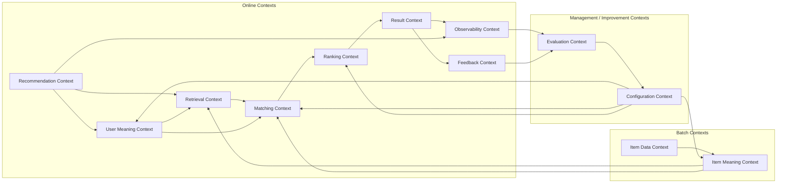

# コンテキスト境界定義書

## 1. 概要

### 1.1 目的

本ドキュメントは、ギフトレコメンドサービスにおける境界づけられたコンテキストを定義する。

ドメインモデル.mdでは、集約・エンティティ・値オブジェクト・ドメインサービスを中心に整理する。

本ドキュメントでは、各業務領域の責務、境界、連携関係、混同してはいけないルールを詳細に定義する。

---

### 1.2 本ドキュメントの位置づけ

| 成果物                                                                   | 役割                                         |
| ------------------------------------------------------------------------ | -------------------------------------------- |
| [ドメインモデル.md](http://xn--ecktde0hg9cvc.md/)                        | ドメイン内部の概念・集約・振る舞いを定義する |
| [コンテキスト境界定義書.md](http://xn--ncklt4cm8w654w2ffku2a7x6a32x.md/) | ドメイン領域間の境界・責務・連携を定義する   |

---

### 1.3 基本方針

- ドメインモデル.md内のコンテキスト章は概要に留める
- 本ドキュメントをコンテキスト境界の詳細正本とする
- 境界は、後続のモジュール設計・API設計・データモデル設計・バッチ設計の前提とする

---

## 2. 境界定義の基本原則

### 2.1 中核境界

本サービスでは、以下の境界を最重要ルールとする。

```
semantic_config_version = 意味の作り方
model_version           = 順位の決め方
```

---

### 2.2 境界設計の判断軸

| 判断軸         | 内容                                |
| -------------- | ----------------------------------- |
| 業務責務       | 何を判断・生成・管理する領域か      |
| 実行タイミング | OLかBTか                            |
| データ正本     | どのコンテキストが正本を持つか      |
| 変更理由       | 何が変わったときに変更されるか      |
| 後続成果物     | API、DB、モジュール、バッチへの影響 |

---

## 3. コンテキスト一覧

| コンテキスト           | 主責務                                       | 処理種別 | MVP対象 |
| ---------------------- | -------------------------------------------- | -------- | ------- |
| Recommendation Context | 推薦要求・推薦実行を管理する                 | OL       | ○       |
| User Meaning Context   | ユーザー入力からUser Meaningを生成する       | OL       | ○       |
| Item Data Context      | 外部商品データを取得・保持する               | BT       | ○       |
| Item Meaning Context   | 商品情報からItem Meaningを生成する           | BT       | ○       |
| Retrieval Context      | 推薦候補商品を抽出する                       | OL       | ○       |
| Matching Context       | User MeaningとItem Meaningの一致度を計算する | OL       | ○       |
| Ranking Context        | 最終スコアと表示順位を決定する               | OL       | ○       |
| Result Context         | 推薦結果を生成・保持する                     | OL       | ○       |
| Feedback Context       | ユーザーの明示評価を記録する                 | OL       | ○       |
| Observability Context  | 実行ログ・行動ログ・メトリクスを記録する     | OL/BT    | ○       |
| Evaluation Context     | オフライン評価・人手評価を管理する           | BT/分析  | △       |
| Configuration Context  | 意味定義・モデルバージョンを管理する         | 管理/BT  | △       |

---

## 4. 各コンテキスト詳細

## 4.1 Recommendation Context

### 役割

ユーザーの推薦依頼を受け付け、推薦実行単位を生成・管理する。

---

### In Scope

| 対象                   | 内容                            |
| ---------------------- | ------------------------------- |
| user_request           | ユーザーの推薦依頼              |
| user_request_condition | 入力条件の構造化結果            |
| budget_condition       | 予算条件。budgetMin / budgetMax |
| recommendation_run     | 推薦処理の実行単位              |
| run_status             | 推薦実行状態                    |

---

### Out of Scope

| 対象外           | 移譲先                     |
| ---------------- | -------------------------- |
| User Meaning生成 | User Meaning Context       |
| 商品候補抽出     | Retrieval Context          |
| スコア計算       | Matching / Ranking Context |
| 結果生成         | Result Context             |

---

### 境界ルール

| ルールID | 内容                                                                         |
| -------- | ---------------------------------------------------------------------------- |
| RC-01    | Recommendation Contextは推薦処理全体の起点である                             |
| RC-02    | 意味推定ロジックを持ってはならない                                           |
| RC-03    | ランキングロジックを持ってはならない                                         |
| RC-04    | recommendation_run開始時点でsemantic_config_versionとmodel_versionを固定する |
| RC-05    | budget_conditionはハードフィルタ条件として後続に渡す                         |

---

## 4.2 User Meaning Context

### 役割

ユーザー入力から、ユーザーの贈答意図であるUser Meaningを生成する。

---

### In Scope

| 対象                    | 内容                                  |
| ----------------------- | ------------------------------------- |
| external_feature        | relationship / occasion 由来のFeature |
| internal_feature        | 好み・避けたい条件由来のFeature       |
| user_feature_raw        | 統合後の未正規化Feature               |
| user_feature_normalized | 正規化後Feature                       |
| user_meaning_projection | Social / Symbolicへの射影             |
| lambda_ctx              | 贈答リスク許容度                      |
| preferred_context       | 好み検索用コンテキスト                |
| non_preferred_context   | 避けたい検索用コンテキスト            |
| preferred_embedding     | 好み検索用Embedding                   |
| non_preferred_embedding | 避けたい検索用Embedding               |

---

### Out of Scope

| 対象外          | 移譲先               |
| --------------- | -------------------- |
| 商品Feature生成 | Item Meaning Context |
| 候補商品検索    | Retrieval Context    |
| スコア計算      | Matching Context     |
| 最終順位決定    | Ranking Context      |

---

### 境界ルール

| ルールID | 内容                                                         |
| -------- | ------------------------------------------------------------ |
| UM-01    | User Meaning Contextはユーザー入力の意味化に責任を持つ       |
| UM-02    | User Meaning生成にはsemantic_config_versionを使用する        |
| UM-03    | model_versionを参照してはならない                            |
| UM-04    | preferred_contextとnon_preferred_contextを混同してはならない |
| UM-05    | lambda_ctxはUser Meaning Projectionから導出する              |

---

## 4.3 Item Data Context

### 役割

外部APIから商品データを取得し、商品情報の原材料を管理する。

---

### In Scope

| 対象                | 内容                                       |
| ------------------- | ------------------------------------------ |
| raw_item_data       | 外部APIから取得した生データ                |
| item_signal         | 商品名・説明・カテゴリ・レビュー等の原情報 |
| item_source         | 商品データの取得元                         |
| item_collection_job | 商品データ取得ジョブ                       |

---

### Out of Scope

| 対象外            | 移譲先               |
| ----------------- | -------------------- |
| 商品意味推定      | Item Meaning Context |
| 商品Embedding生成 | Item Meaning Context |
| 商品検索          | Retrieval Context    |
| ランキング        | Ranking Context      |

---

### 境界ルール

| ルールID | 内容                                                      |
| -------- | --------------------------------------------------------- |
| IDC-01   | Item Data Contextは外部データ取得と原材料管理に責任を持つ |
| IDC-02   | 外部API由来の不完全データを許容する                       |
| IDC-03   | 商品意味を判断してはならない                              |
| IDC-04   | 商品データ更新はBTで行う                                  |
| IDC-05   | 外部API仕様変更の影響をこのコンテキストで吸収する         |

---

## 4.4 Item Meaning Context

### 役割

商品情報からItem Meaningを生成し、推薦可能な商品意味表現を準備する。

---

### In Scope

| 対象                        | 内容                               |
| --------------------------- | ---------------------------------- |
| item_attribute_summary      | 商品情報の統合表現                 |
| item_context                | Embedding入力用テキスト            |
| item_concept                | 商品から抽出されたSemantic Concept |
| item_feature_raw            | 商品の未正規化Feature              |
| item_feature_normalized     | 商品の正規化Feature                |
| item_meaning_projection     | 商品のSocial / Symbolic表現        |
| item_embedding              | Retrieval用ベクトル                |
| recommendation_availability | 推薦対象として利用可能か           |

---

### Out of Scope

| 対象外           | 移譲先               |
| ---------------- | -------------------- |
| 外部API取得      | Item Data Context    |
| User Meaning生成 | User Meaning Context |
| 候補検索         | Retrieval Context    |
| スコア計算       | Matching Context     |
| 最終順位決定     | Ranking Context      |

---

### 境界ルール

| ルールID | 内容                                                  |
| -------- | ----------------------------------------------------- |
| IM-01    | Item Meaning Contextは商品を意味空間へ写像する        |
| IM-02    | Item Meaning生成にはsemantic_config_versionを使用する |
| IM-03    | model_versionを参照してはならない                     |
| IM-04    | 推薦対象商品はitem_embeddingを持つ                    |
| IM-05    | 推薦対象商品はitem_feature_normalizedを持つ           |
| IM-06    | 商品FeatureはMVPでは8次元固定である                   |

---

## 4.5 Retrieval Context

### 役割

User Meaningおよび検索条件をもとに、推薦候補商品を抽出する。

---

### In Scope

| 対象                | 内容                         |
| ------------------- | ---------------------------- |
| hard_filter         | 予算・NG条件等による絶対除外 |
| candidate_item      | Retrieval後の候補商品        |
| retrieval_condition | 検索条件                     |
| retrieval_score     | 検索段階の近さ               |

---

### Out of Scope

| 対象外           | 移譲先               |
| ---------------- | -------------------- |
| User Meaning生成 | User Meaning Context |
| Item Meaning生成 | Item Meaning Context |
| 意味一致度計算   | Matching Context     |
| 最終順位決定     | Ranking Context      |
| 結果生成         | Result Context       |

---

### 境界ルール

| ルールID | 内容                                                |
| -------- | --------------------------------------------------- |
| RT-01    | Retrieval Contextはrecall重視で候補を広めに取得する |
| RT-02    | budget_conditionとNG条件はハードフィルタとして扱う  |
| RT-03    | 候補抽出と最終ランキングを混同してはならない        |
| RT-04    | candidate_itemは推薦結果ではない                    |
| RT-05    | Retrieval段階でfinal_scoreを算出してはならない      |

---

## 4.6 Matching Context

### 役割

User MeaningとItem Meaningの意味的一致度を算出する。

---

### In Scope

| 対象             | 内容                    |
| ---------------- | ----------------------- |
| feature_distance | Featureごとの距離       |
| feature_match    | Featureごとの一致度     |
| social_match     | Social系Feature一致度   |
| symbolic_match   | Symbolic系Feature一致度 |
| context_score    | 意味一致スコア          |

---

### Out of Scope

| 対象外       | 移譲先            |
| ------------ | ----------------- |
| 候補抽出     | Retrieval Context |
| 人気補正     | Ranking Context   |
| リスク補正   | Ranking Context   |
| 最終順位決定 | Ranking Context   |
| 結果生成     | Result Context    |

---

### 境界ルール

| ルールID | 内容                                           |
| -------- | ---------------------------------------------- |
| MT-01    | Matching Contextは意味一致度の算出に責任を持つ |
| MT-02    | User MeaningとItem MeaningのFeatureを比較する  |
| MT-03    | 人気・リスク・表示順位を扱ってはならない       |
| MT-04    | context_scoreはfinal_scoreではない             |
| MT-05    | Matchingロジックはmodel_versionに基づく        |

---

## 4.7 Ranking Context

### 役割

候補商品に対して最終スコアを算出し、表示順位を決定する。

---

### In Scope

| 対象             | 内容       |
| ---------------- | ---------- |
| popularity_score | 人気補正   |
| risk_score       | リスク補正 |
| final_score      | 最終スコア |
| final_ranking    | 最終順位   |
| display_rank     | 表示順位   |

---

### Out of Scope

| 対象外             | 移譲先               |
| ------------------ | -------------------- |
| User Meaning生成   | User Meaning Context |
| Item Meaning生成   | Item Meaning Context |
| Feature距離計算    | Matching Context     |
| 結果保存           | Result Context       |
| フィードバック記録 | Feedback Context     |

---

### 境界ルール

| ルールID | 内容                                                           |
| -------- | -------------------------------------------------------------- |
| RK-01    | Ranking Contextは最終的な順位決定に責任を持つ                  |
| RK-02    | final_scoreはmodel_versionに基づき算出する                     |
| RK-03    | semantic_config_versionを直接参照してはならない                |
| RK-04    | candidate_itemをrecommendation_result_itemに変換してはならない |
| RK-05    | 順位決定後の結果生成はResult Contextに移譲する                 |

---

## 4.8 Result Context

### 役割

最終ランキングからユーザーに提示する推薦結果を生成・保持する。

---

### In Scope

| 対象                       | 内容         |
| -------------------------- | ------------ |
| recommendation_result      | 推薦結果集合 |
| recommendation_result_item | 個別推薦商品 |
| explanation                | おすすめ理由 |
| result_status              | 結果状態     |

---

### Out of Scope

| 対象外             | 移譲先                     |
| ------------------ | -------------------------- |
| スコア計算         | Matching / Ranking Context |
| 商品データ取得     | Item Data Context          |
| フィードバック記録 | Feedback Context           |
| 行動ログ記録       | Observability Context      |

---

### 境界ルール

| ルールID | 内容                                                   |
| -------- | ------------------------------------------------------ |
| RS-01    | Result Contextはユーザー提示可能な結果を生成する       |
| RS-02    | recommendation_result_itemはcandidate_itemから選ばれる |
| RS-03    | 表示順位はresult内で一意である                         |
| RS-04    | 空結果はempty resultとして扱う                         |
| RS-05    | resultは後続のview/click/feedbackの参照先になる        |

---

## 4.9 Feedback Context

### 役割

推薦結果に対するユーザーの明示的な評価を記録する。

---

### In Scope

| 対象                    | 内容                                 |
| ----------------------- | ------------------------------------ |
| recommendation_feedback | ユーザーの明示評価                   |
| feedback_type           | 良い / 微妙など                      |
| feedback_target         | 評価対象のrecommendation_result_item |
| feedback_timestamp      | 評価日時                             |

---

### Out of Scope

| 対象外         | 移譲先                             |
| -------------- | ---------------------------------- |
| 表示ログ       | Observability Context              |
| クリックログ   | Observability Context              |
| オフライン評価 | Evaluation Context                 |
| モデル改善     | Configuration / Evaluation Context |

---

### 境界ルール

| ルールID | 内容                                         |
| -------- | -------------------------------------------- |
| FB-01    | Feedbackはユーザーの明示評価である           |
| FB-02    | view/click logと混同してはならない           |
| FB-03    | feedbackはrecommendation_result_itemに紐づく |
| FB-04    | feedbackは即時にランキングを変更しない       |
| FB-05    | 改善判断はEvaluation Contextに移譲する       |

---

## 4.10 Observability Context

### 役割

推薦実行・ユーザー行動・メトリクスを記録する。

---

### In Scope

| 対象                         | 内容                       |
| ---------------------------- | -------------------------- |
| recommendation_run_event_log | run / phase のイベントログ |
| error_log                    | エラーログ                 |
| view_log                     | 表示ログ                   |
| click_log                    | クリックログ               |
| metric_log                   | メトリクスログ             |

---

### Out of Scope

| 対象外           | 移譲先                           |
| ---------------- | -------------------------------- |
| 業務判断         | Recommendation / Ranking Context |
| 評価判断         | Evaluation Context               |
| モデル更新       | Configuration Context            |
| ユーザー明示評価 | Feedback Context                 |

---

### 境界ルール

| ルールID | 内容                                           |
| -------- | ---------------------------------------------- |
| OB-01    | Observabilityは事実記録に責任を持つ            |
| OB-02    | ログは業務判断そのものではない                 |
| OB-03    | view/clickは明示評価ではない                   |
| OB-04    | metricは改善判断の材料であり、判断結果ではない |
| OB-05    | MVPではログ粒度を必要最低限にする              |

---

## 4.11 Evaluation Context

### 役割

推薦品質・行動・人手評価を分析し、改善判断の材料を提供する。

---

### In Scope

| 対象                     | 内容               |
| ------------------------ | ------------------ |
| offline_eval_result      | オフライン評価結果 |
| human_eval_task          | 人手評価タスク     |
| human_eval_result        | 人手評価結果       |
| behavior_analysis_result | 行動分析結果       |
| ab_test_result           | A/B比較評価        |

---

### Out of Scope

| 対象外               | 移譲先                 |
| -------------------- | ---------------------- |
| 推薦実行             | Recommendation Context |
| リアルタイム順位決定 | Ranking Context        |
| ログ記録             | Observability Context  |
| 設定変更の正本管理   | Configuration Context  |

---

### 境界ルール

| ルールID | 内容                                         |
| -------- | -------------------------------------------- |
| EV-01    | Evaluation Contextは改善判断の材料を生成する |
| EV-02    | MVP初期では補助・後回しの扱いとする          |
| EV-03    | 評価結果は直接run中のランキングに影響しない  |
| EV-04    | 設定変更はConfiguration Contextで管理する    |

---

## 4.12 Configuration Context

### 役割

意味推定とランキングに関する設定・バージョンを管理する。

---

### In Scope

| 対象                    | 内容                                 |
| ----------------------- | ------------------------------------ |
| semantic_config_version | 意味推定ロジック一式                 |
| model_version           | スコアリング・ランキングロジック一式 |
| relationship_rule       | 関係性ルール                         |
| occasion_rule           | 贈答目的ルール                       |
| pair_rule               | 関係性×用途ルール                    |
| concept_definition      | Semantic Concept定義                 |
| feature_definition      | Feature定義                          |
| hint_dictionary         | keyword → concept → feature補正      |
| ranking_parameter       | Ranking用パラメータ                  |

---

### Out of Scope

| 対象外         | 移譲先                 |
| -------------- | ---------------------- |
| 推薦実行       | Recommendation Context |
| 実行ログ       | Observability Context  |
| 評価結果生成   | Evaluation Context     |
| 商品データ取得 | Item Data Context      |

---

### 境界ルール

| ルールID | 内容                                                       |
| -------- | ---------------------------------------------------------- |
| CF-01    | semantic_config_versionは意味推定ロジックを管理する        |
| CF-02    | model_versionは順位決定ロジックを管理する                  |
| CF-03    | semantic_config_versionとmodel_versionを混同してはならない |
| CF-04    | recommendation_runでは両バージョンを固定する               |
| CF-05    | バージョン変更は既存runの再現性を壊してはならない          |

---

## 5. コンテキストマップ



---

## 6. 主要連携定義

| From                   | To                    | 連携データ / イベント                         | 内容                               |
| ---------------------- | --------------------- | --------------------------------------------- | ---------------------------------- |
| Recommendation Context | User Meaning Context  | user_request                                  | 入力条件からUser Meaningを生成する |
| User Meaning Context   | Retrieval Context     | preferred_embedding / non_preferred_embedding | 候補商品検索に使用する             |
| Recommendation Context | Retrieval Context     | budget_condition / NG条件                     | ハードフィルタ条件として使用する   |
| Item Data Context      | Item Meaning Context  | item_signal                                   | 商品意味生成の原材料               |
| Item Meaning Context   | Retrieval Context     | item_embedding                                | 候補商品抽出に使用する             |
| User Meaning Context   | Matching Context      | user_feature_normalized                       | 意味一致度計算に使用する           |
| Item Meaning Context   | Matching Context      | item_feature_normalized                       | 意味一致度計算に使用する           |
| Matching Context       | Ranking Context       | context_score                                 | final_score算出に使用する          |
| Ranking Context        | Result Context        | final_ranking                                 | 推薦結果生成に使用する             |
| Result Context         | Feedback Context      | recommendation_result_item                    | 明示評価対象                       |
| Result Context         | Observability Context | view / click event                            | 行動ログ記録                       |
| Observability Context  | Evaluation Context    | metric_log / interaction_log                  | 分析材料                           |
| Feedback Context       | Evaluation Context    | recommendation_feedback                       | 品質改善材料                       |
| Evaluation Context     | Configuration Context | evaluation result                             | 設定改善判断の材料                 |

---

## 7. OL / BT境界

### 7.1 OL対象

| コンテキスト           | 主な処理               |
| ---------------------- | ---------------------- |
| Recommendation Context | 推薦要求受付、run生成  |
| User Meaning Context   | User Meaning生成       |
| Retrieval Context      | 候補商品抽出           |
| Matching Context       | 意味一致度計算         |
| Ranking Context        | 最終順位生成           |
| Result Context         | 結果生成・取得         |
| Feedback Context       | フィードバック受付     |
| Observability Context  | 実行ログ・行動ログ記録 |

---

### 7.2 BT対象

| コンテキスト          | 主な処理                        |
| --------------------- | ------------------------------- |
| Item Data Context     | 外部商品データ取得              |
| Item Meaning Context  | 商品意味推定、商品Embedding生成 |
| Evaluation Context    | オフライン評価、人手評価集計    |
| Configuration Context | 設定・バージョン管理、手動反映  |

---

### 7.3 OL / BT境界ルール

| ルールID | 内容                                                              |
| -------- | ----------------------------------------------------------------- |
| OBT-01   | User MeaningはOLで生成する                                        |
| OBT-02   | Item MeaningはBTで事前生成する                                    |
| OBT-03   | OL中に重い商品意味推定を行ってはならない                          |
| OBT-04   | OLはItem Meaning / item_embeddingが準備済みであることを前提にする |
| OBT-05   | BTの失敗は推薦可能商品数に影響するため、Observabilityで記録する   |

---

## 8. web / api / reco / batch との対応

| 実装領域 | 主に担当するコンテキスト                                  |
| -------- | --------------------------------------------------------- |
| web      | Recommendation / Result / Feedback のUI                   |
| api      | Recommendation / Result / Feedback / Observability の受付 |
| reco     | User Meaning / Retrieval / Matching / Ranking             |
| batch    | Item Data / Item Meaning / Evaluation / Configuration     |

---

## 9. 境界上の重要ルール

### 9.1 User Meaning と Item Meaning を分離する

| 項目           | User Meaning                               | Item Meaning                  |
| -------------- | ------------------------------------------ | ----------------------------- |
| 起点           | ユーザー入力                               | 商品データ                    |
| 実行タイミング | OL                                         | BT                            |
| 主な出力       | user_feature / lambda_ctx / user_embedding | item_feature / item_embedding |
| 使用目的       | ユーザー意図表現                           | 商品意味表現                  |

---

### 9.2 Retrieval と Ranking を分離する

| 項目   | Retrieval       | Ranking          |
| ------ | --------------- | ---------------- |
| 目的   | 候補を広く取る  | 最終順位を決める |
| 重視   | recall          | relevance        |
| 出力   | candidate_item  | final_ranking    |
| スコア | retrieval_score | final_score      |

---

### 9.3 Matching と Ranking を分離する

| 項目       | Matching                    | Ranking                           |
| ---------- | --------------------------- | --------------------------------- |
| 目的       | 意味一致度を計算する        | 総合順位を決める                  |
| 主な入力   | user_feature / item_feature | context_score / popularity / risk |
| 主な出力   | context_score               | final_score                       |
| バージョン | model_version               | model_version                     |

---

### 9.4 Feedback と Observability を分離する

| 項目 | Feedback           | Observability |
| ---- | ------------------ | ------------- |
| 意味 | ユーザーの明示評価 | 事実ログ      |
| 例   | 良い / 微妙        | view / click  |
| 用途 | 品質改善           | 分析・監視    |
| 主体 | ユーザー           | システム      |

---

### 9.5 Evaluation と Configuration を分離する

| 項目     | Evaluation     | Configuration                           |
| -------- | -------------- | --------------------------------------- |
| 役割     | 評価・分析     | 設定・バージョン管理                    |
| 出力     | 評価結果       | semantic_config_version / model_version |
| 変更権限 | 直接変更しない | 正本として変更を保持                    |

---

## 10. 後続成果物への影響

| 後続成果物            | 影響                                              |
| --------------------- | ------------------------------------------------- |
| モジュール一覧        | 各コンテキストを実装責務単位へ分解する            |
| 機能×モジュール対応表 | 機能要件とコンテキスト/モジュールの対応を整理する |
| API設計方針書         | コンテキスト境界をまたぐAPI境界を定義する         |
| バッチ設計書          | Item Data / Item Meaning Contextを詳細化する      |
| データモデル設計書    | 各コンテキストの正本・派生・ログを整理する        |
| 論理ER                | コンテキストごとのデータ関係を整理する            |
| スコアリング設計書    | Matching / Ranking Contextを詳細化する            |
| Observability設計書   | Observability / Evaluation Contextを詳細化する    |

---

## 11. MVPにおける境界方針

### 11.1 MVPで厳密に守る境界

| 境界                                    | 理由                                     |
| --------------------------------------- | ---------------------------------------- |
| User Meaning / Item Meaning             | OLとBTの分離に直結する                   |
| Retrieval / Ranking                     | 候補抽出と順位決定を混ぜないため         |
| semantic_config_version / model_version | 意味推定と順位決定の変更理由が異なるため |
| Feedback / Observability                | 明示評価と事実ログを混同しないため       |

---

### 11.2 MVPでは簡略化する境界

| 境界                     | 簡略化方針                                            |
| ------------------------ | ----------------------------------------------------- |
| Evaluation Context       | 初期MVPでは補助・後回し                               |
| Configuration Context    | 管理UIは作らず、設定は手動・DB・ファイル等で管理      |
| Observability Context    | ログ粒度は必要最低限                                  |
| Item Data / Item Meaning | 実装上はbatch配下でまとめてもよいが、概念境界は分ける |

---

## 12. まとめ

本サービスのコンテキスト境界は、以下の考え方で定義する。

```
Recommendation = 推薦処理全体の進行管理
User Meaning   = ユーザー意図の意味化
Item Data      = 商品原材料の取得
Item Meaning   = 商品の意味化
Retrieval      = 候補抽出
Matching       = 意味一致度計算
Ranking        = 最終順位決定
Result         = 推薦結果生成
Feedback       = 明示評価
Observability  = 事実記録
Evaluation     = 改善判断材料
Configuration  = 意味・モデル設定の正本
```

特に、以下の境界は後続設計で必ず維持する。

```
semantic_config_version = 意味の作り方
model_version           = 順位の決め方

User Meaning × Item Meaning = Matching
candidate_item ≠ recommendation_result_item
feedback ≠ view/click log
```
