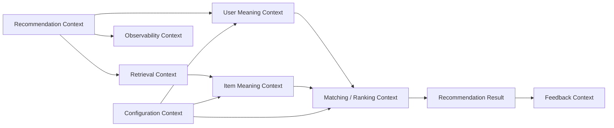
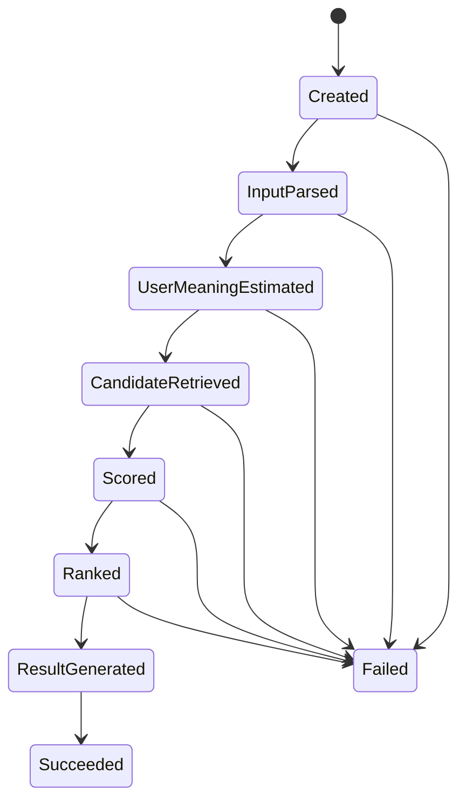
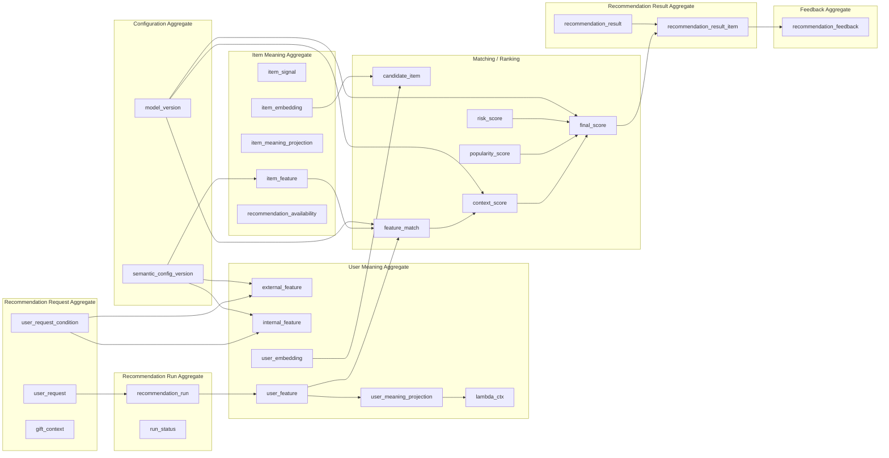

# ドメインモデル

## 1. 概要

### 1.1 目的

本ドキュメントは、ギフトレコメンドサービスにおけるドメインモデルを定義する。

本サービスは、ギフト選びを単なる商品検索ではなく、贈答意味に基づく意思決定支援として捉える。

そのため、本ドメインモデルでは、ユーザー入力・贈答文脈・商品意味・意味一致度・ランキング・結果・フィードバックを一貫した業務概念として整理する。

---

### 1.2 本ドキュメントの位置づけ

本ドキュメントは、以下の後続成果物の前提となる。

- モジュール設計
- API設計
- データモデル設計
- 論理ER / 物理ER
- バッチ設計
- レコメンドロジック設計
- テスト設計

---

### 1.3 モデル化方針

本ドキュメントでは、DDDの考え方に基づき、以下を整理する。

| 区分             | 内容                           |
| ---------------- | ------------------------------ |
| ドメイン概念     | 業務上意味を持つ概念           |
| 集約             | 整合性を保つ単位               |
| エンティティ     | 識別子を持ち、状態変化する概念 |
| 値オブジェクト   | 値として扱う概念               |
| ドメインサービス | 複数概念にまたがる業務ロジック |
| ドメインイベント | 業務上意味を持つ状態変化       |
| 制約・不変条件   | ドメインとして守るべきルール   |

---

## 2. ドメインの中核

### 2.1 中核ドメイン

本サービスの中核ドメインは、以下である。

```
贈答意味に基づくギフトレコメンド
```

ユーザーが入力した贈答文脈・好み・避けたい条件をもとに、商品が持つ意味と比較し、ギフトとして適切な商品を推薦する。

---

### 2.2 中核概念

| 概念                  | 説明                                      |
| --------------------- | ----------------------------------------- |
| Gift Meaning          | 贈り物が持つ意味的価値                    |
| User Meaning          | ユーザーの贈答意図                        |
| Item Meaning          | 商品が持つ意味                            |
| Gift Context          | 贈答の状況情報                            |
| Matching              | User Meaning と Item Meaning の一致度評価 |
| Ranking               | 推薦候補の順位付け                        |
| Recommendation Result | ユーザーに提示する推薦結果                |

---

---

### 2.3 意味モデル

本サービスでは、Gift Meaningを以下の2軸で表現する。

| 軸       | 日本語名     | 内容                                   |
| -------- | ------------ | -------------------------------------- |
| Social   | 社会的適合性 | 社会的に適切か、無難か、失敗しにくいか |
| Symbolic | 象徴的価値   | 感情・特別感・意味性を持つか           |

---

### 2.4 Feature構成

MVPでは、Gift Meaningを以下の8次元Featureで表現する。

| 区分     | Feature               | 日本語名       |
| -------- | --------------------- | -------------- |
| Social   | formality             | 儀礼性         |
| Social   | safety                | 安全性         |
| Social   | brand_appropriateness | ブランド適切性 |
| Symbolic | emotion               | 感情表現性     |
| Symbolic | novelty               | 特別感         |
| Symbolic | intimacy              | 親密性         |
| Symbolic | symbolic_identity     | 象徴性         |
| Symbolic | story_richness        | ストーリー性   |

---

## 3. 境界づけられたコンテキスト

本サービスのコンテキスト境界は、別紙「コンテキスト境界定義書.md」に定義する。
本ドキュメントでは、ドメインモデル理解に必要な概要のみ記載する。

### 3.1 コンテキスト一覧

| コンテキスト               | 役割                                   | MVP対象 |
| -------------------------- | -------------------------------------- | ------- |
| Recommendation Context     | 推薦要求・実行・結果を管理する         | ○       |
| User Meaning Context       | ユーザー入力からUser Meaningを生成する | ○       |
| Item Meaning Context       | 商品情報からItem Meaningを生成する     | ○       |
| Retrieval Context          | 候補商品を抽出する                     | ○       |
| Matching / Ranking Context | 意味一致度・スコア・順位を算出する     | ○       |
| Feedback Context           | ユーザー評価を記録する                 | ○       |
| Observability Context      | ログ・メトリクスを記録する             | ○       |
| Evaluation Context         | オフライン評価・人手評価を行う         | △       |
| Configuration Context      | 意味定義・モデルバージョンを管理する   | △       |

---

### 3.2 コンテキスト関係図



---

## 4. 集約定義

## 4.1 Recommendation Request Aggregate

### 概要

ユーザーからの推薦依頼を表す集約。

贈答文脈、好み、避けたい条件、NG条件などの入力条件を保持する。

### 集約ルート

| 集約ルート | 英語名       |
| ---------- | ------------ |
| 推薦要求   | user_request |

### 構成要素

| 概念         | 種別                  | 説明                    |
| ------------ | --------------------- | ----------------------- |
| 推薦要求     | Entity                | ユーザーの推薦依頼      |
| 推薦条件     | Entity / Value Object | 入力条件の分解結果      |
| 贈答文脈     | Value Object          | relationship + occasion |
| 予算条件     | Value Object          | ハードフィルタ条件      |
| 好み条件     | Value Object          | preferred条件           |
| 避けたい条件 | Value Object          | non-preferred条件       |
| NG条件       | Value Object          | ハードフィルタ条件      |

### 主な責務

- ユーザー入力を推薦要求として受け付ける
- 入力条件を構造化する
- 必須入力を検証する
- 推薦実行の起点となる

### 不変条件

| ルールID | 内容                                           |
| -------- | ---------------------------------------------- |
| RQ-01    | 推薦要求は最低限、贈答文脈または検索条件を持つ |
| RQ-02    | NG条件は後続のハードフィルタで必ず考慮される   |
| RQ-03    | 推薦条件は推薦実行前に構造化済みである         |

---

## 4.2 Recommendation Run Aggregate

### 概要

1回の推薦処理実行を表す集約。

推薦要求を起点に、User Meaning生成、候補抽出、スコアリング、ランキング、結果生成までの実行状態を管理する。

### 集約ルート

| 集約ルート | 英語名             |
| ---------- | ------------------ |
| 推薦実行   | recommendation_run |

### 構成要素

| 概念                 | 種別         | 説明                    |
| -------------------- | ------------ | ----------------------- |
| 推薦実行             | Entity       | 推薦処理の実行単位      |
| 実行状態             | Value Object | 実行ステータス          |
| 使用意味定義セット   | Reference    | semantic_config_version |
| 使用モデルバージョン | Reference    | model_version           |
| 候補商品             | Entity       | retrieval後の候補集合   |
| 実行イベント         | Domain Event | phase成功/失敗など      |

### 主な責務

- 推薦処理の開始・終了を管理する
- 使用するsemantic_config_versionを固定する
- 使用するmodel_versionを固定する
- 推薦処理の状態遷移を管理する
- 失敗時の状態を記録する

### 不変条件

| ルールID | 内容                                                                |
| -------- | ------------------------------------------------------------------- |
| RUN-01   | recommendation_runは1つのuser_requestに紐づく                       |
| RUN-02   | recommendation_runは1つのsemantic_config_versionを使用する          |
| RUN-03   | recommendation_runは1つのmodel_versionを使用する                    |
| RUN-04   | 実行中にsemantic_config_version / model_versionを変更してはならない |
| RUN-05   | 失敗したrunは失敗理由を記録する                                     |
| RUN-06   | 結果生成後のrunは結果集合を持つ                                     |

---

## 4.3 User Meaning Aggregate

### 概要

ユーザー入力から生成される贈答意図を表す集約。

贈答文脈、好み、避けたい条件をFeature化し、User Meaningとして表現する。

### 集約ルート

| 集約ルート   | 英語名       |
| ------------ | ------------ |
| ユーザー意味 | user_meaning |

物理的には、recommendation_runに従属する派生概念として扱う。

論理モデル上は、User Meaning生成の責務を明確にするため独立概念として定義する。

### 構成要素

| 概念                    | 種別         | 説明                                  |
| ----------------------- | ------------ | ------------------------------------- |
| 外部条件特徴量          | Value Object | relationship / occasion 由来のFeature |
| 内部条件特徴量          | Value Object | 好み・避けたい条件由来のFeature       |
| ユーザー特徴量          | Value Object | 統合後のFeature                       |
| ユーザー意味射影        | Value Object | Social / Symbolicへの射影             |
| λ_ctx                   | Value Object | 贈答リスク許容度                      |
| preferred_context       | Value Object | 好み検索用コンテキスト                |
| non_preferred_context   | Value Object | 避けたい検索用コンテキスト            |
| preferred_embedding     | Value Object | 好み検索用Embedding                   |
| non_preferred_embedding | Value Object | 避けたい検索用Embedding               |

### 主な責務

- 入力条件からSemantic Conceptを推定する
- Semantic ConceptからFeatureを生成する
- Featureを正規化する
- Social / Symbolicへ射影する
- λ_ctxを算出する
- Retrieval用の検索コンテキストとEmbeddingを生成する

### 不変条件

| ルールID | 内容                                                     |
| -------- | -------------------------------------------------------- |
| UM-01    | User Meaningはrecommendation_run単位で生成される         |
| UM-02    | FeatureはMVPでは8次元固定である                          |
| UM-03    | SocialはSocial系Featureから算出される                    |
| UM-04    | SymbolicはSymbolic系Featureから算出される                |
| UM-05    | λ_ctxはUser Meaning Projectionから導出される             |
| UM-06    | preferred_contextとnon_preferred_contextは役割を分離する |

---

## 4.4 Item Meaning Aggregate

### 概要

商品が持つ意味を表す集約。

外部商品データから商品シグナルを抽出し、Item MeaningとしてFeature化・Embedding化する。

### 集約ルート

| 集約ルート | 英語名       |
| ---------- | ------------ |
| 商品意味   | item_meaning |

物理的には、商品情報および商品派生データとして管理する。

論理モデル上は、推薦可能な商品を成立させるための前処理領域として定義する。

### 構成要素

| 概念             | 種別                  | 説明                                         |
| ---------------- | --------------------- | -------------------------------------------- |
| 商品シグナル     | Entity / Value Object | 商品名・説明・カテゴリ・レビューなどの原情報 |
| 商品属性サマリ   | Value Object          | 商品情報を統合した表現                       |
| 商品コンテキスト | Value Object          | Embedding入力用テキスト                      |
| 商品Embedding    | Value Object          | Retrieval用ベクトル                          |
| 商品Concept      | Value Object          | 商品から抽出された意味ラベル                 |
| 商品特徴量       | Value Object          | 商品のFeature                                |
| 商品意味射影     | Value Object          | 商品のSocial / Symbolic表現                  |
| 推薦可能状態     | Value Object          | 推薦対象として利用可能か                     |

### 主な責務

- 外部APIから取得した商品データを意味推定可能な形に変換する
- 商品テキスト・メタデータ・レビュー等から商品シグナルを抽出する
- 商品Featureを生成する
- 商品意味をSocial / Symbolicへ射影する
- 商品Embeddingを生成する
- 推薦可能な商品だけを検索対象にする

### 不変条件

| ルールID | 内容                                          |
| -------- | --------------------------------------------- |
| IM-01    | 推薦対象商品は商品Embeddingを持つ             |
| IM-02    | 推薦対象商品はItem Meaningを持つ              |
| IM-03    | 商品意味推定はsemantic_config_versionに基づく |
| IM-04    | 商品データは外部API由来の不完全性を許容する   |
| IM-05    | 商品画像解析はMVPでは必須対象外               |
| IM-06    | 商品FeatureはMVPでは8次元固定である           |

---

## 4.5 Recommendation Result Aggregate

### 概要

ユーザーに提示する推薦結果を表す集約。

recommendation_runの結果として、順位付け済みの商品一覧を保持する。

### 集約ルート

| 集約ルート | 英語名                |
| ---------- | --------------------- |
| 推薦結果   | recommendation_result |

### 構成要素

| 概念         | 種別         | 説明                     |
| ------------ | ------------ | ------------------------ |
| 推薦結果     | Entity       | 推薦結果集合             |
| 推薦結果商品 | Entity       | 個別の商品提示結果       |
| 表示順位     | Value Object | ユーザーに表示する順位   |
| 最終スコア   | Value Object | ランキング用スコア       |
| 説明情報     | Value Object | おすすめ理由・意味ラベル |

### 主な責務

- 推薦実行の最終出力を保持する
- 表示順位を管理する
- 商品ごとのスコア・説明情報を保持する
- ユーザー行動ログ・フィードバックの参照先となる

### 不変条件

| ルールID | 内容                                                         |
| -------- | ------------------------------------------------------------ |
| RR-01    | recommendation_resultは1つのrecommendation_runから生成される |
| RR-02    | recommendation_result_itemはcandidate_itemから選ばれる       |
| RR-03    | display_rankはresult内で一意である                           |
| RR-04    | final_scoreはmodel_versionに基づき算出される                 |
| RR-05    | 空結果の場合はempty resultとして扱う                         |

---

## 4.6 Feedback Aggregate

### 概要

推薦結果に対するユーザーの明示的な評価を表す集約。

MVPでは「良い / 微妙」などの簡易評価を収集する。

### 集約ルート

| 集約ルート     | 英語名                  |
| -------------- | ----------------------- |
| フィードバック | recommendation_feedback |

### 構成要素

| 概念           | 種別         | 説明                       |
| -------------- | ------------ | -------------------------- |
| フィードバック | Entity       | ユーザーの明示評価         |
| 評価対象       | Reference    | recommendation_result_item |
| 評価種別       | Value Object | 良い / 微妙など            |
| 評価日時       | Value Object | 評価された時刻             |

### 主な責務

- ユーザーの明示評価を保存する
- 推薦結果改善の材料を提供する
- 行動ログとは別に、ユーザーの意図的反応を記録する

### 不変条件

| ルールID | 内容                                                 |
| -------- | ---------------------------------------------------- |
| FB-01    | feedbackはrecommendation_result_itemに対して行われる |
| FB-02    | feedbackはユーザーの明示的な評価事実として扱う       |
| FB-03    | view / click logとは別概念として扱う                 |

---

## 4.7 Observability Aggregate

### 概要

推薦実行・ユーザー行動・メトリクスを記録する集約。

MVPでは最低限のログ・メトリクスを記録する。

### 集約ルート

| 集約ルート       | 英語名                       |
| ---------------- | ---------------------------- |
| 実行イベントログ | recommendation_run_event_log |
| ユーザー行動ログ | user_interaction_log         |
| メトリクスログ   | metric_log                   |

### 構成要素

| 概念           | 種別   | 説明                       |
| -------------- | ------ | -------------------------- |
| フェーズログ   | Entity | phase成功/失敗の記録       |
| エラーログ     | Entity | エラー記録                 |
| 表示ログ       | Entity | 商品表示ログ               |
| クリックログ   | Entity | 商品クリックログ           |
| メトリクスログ | Entity | 処理時間・件数・スコアなど |

### 主な責務

- recommendation_runの実行状態を記録する
- ユーザー行動を記録する
- KPI評価に必要な最低限のメトリクスを記録する
- 後続分析のためのイベントを保持する

### 不変条件

| ルールID | 内容                                                 |
| -------- | ---------------------------------------------------- |
| OB-01    | run/phaseの成否は記録対象である                      |
| OB-02    | view/clickはrecommendation_result_item単位で記録する |
| OB-03    | metricは処理完了時に記録する                         |
| OB-04    | MVPでは高度なリアルタイム分析は行わない              |

---

## 4.8 Configuration Aggregate

### 概要

意味推定とランキングに関する設定・バージョンを管理する集約。

本サービスでは、以下の境界を厳密に分離する。

```
semantic_config_version = 意味の作り方
model_version           = 順位の決め方
```

### 集約ルート

| 集約ルート       | 英語名                  | 説明                         |
| ---------------- | ----------------------- | ---------------------------- |
| 意味定義セット   | semantic_config_version | 意味推定ロジック一式         |
| モデルバージョン | model_version           | スコアリング・ランキング一式 |

### semantic_config_version の責務

| 含むもの             | 含まないもの      |
| -------------------- | ----------------- |
| relationship rule    | rankingロジック   |
| occasion rule        | final score計算式 |
| pair rule            | popularity補正    |
| hint dictionary      | risk補正          |
| concept definition   | 表示順位決定      |
| feature definition   |                   |
| concept feature rule |                   |
| 正規化・射影定義     |                   |

### model_version の責務

| 含むもの            | 含まないもの               |
| ------------------- | -------------------------- |
| feature match計算   | concept定義                |
| social/symbolic集約 | feature定義                |
| context score計算   | hint dictionary            |
| popularity補正      | relationship/occasion rule |
| risk補正            |                            |
| final score計算     |                            |
| ranking方式         |                            |

### 不変条件

| ルールID | 内容                                                    |
| -------- | ------------------------------------------------------- |
| CF-01    | semantic_config_versionは意味推定ロジックのみを管理する |
| CF-02    | model_versionは順位決定ロジックのみを管理する           |
| CF-03    | recommendation_runでは両バージョンを固定する            |
| CF-04    | バージョン変更は既存runの再現性を壊してはならない       |

---

## 5. 値オブジェクト一覧

| 値オブジェクト     | 英語名             | 内容                      |
| ------------------ | ------------------ | ------------------------- |
| 贈答文脈           | gift_context       | relationship + occasion   |
| 関係性             | relationship       | 贈り手と受け手の関係      |
| 贈答目的           | occasion           | 贈答の目的・場面          |
| Featureベクトル    | feature_vector     | 8次元Feature値            |
| Meaning Projection | meaning_projection | Social / Symbolic値       |
| λ_ctx              | lambda_ctx         | 贈答リスク許容度          |
| Embedding          | embedding          | ベクトル表現              |
| Feature距離        | feature_distance   | user-item間のFeature距離  |
| Feature一致度      | feature_match      | Featureごとの一致度       |
| Social一致度       | social_match       | Social系Featureの一致度   |
| Symbolic一致度     | symbolic_match     | Symbolic系Featureの一致度 |
| Context Score      | context_score      | 意味一致スコア            |
| Popularity Score   | popularity_score   | 人気補正                  |
| Risk Score         | risk_score         | リスク補正                |
| Final Score        | final_score        | 最終ランキングスコア      |
| 表示順位           | display_rank       | 結果表示上の順位          |
| 実行状態           | run_status         | runの状態                 |
| 評価種別           | feedback_type      | ユーザー評価種別          |

---

## 6. ドメインサービス一覧

## 6.1 User Meaning Estimation Service

### 責務

ユーザー入力からUser Meaningを生成する。

### 入力

- user_request
- semantic_config_version

### 出力

- user_feature
- user_meaning_projection
- lambda_ctx
- preferred_embedding
- non_preferred_embedding

### 主な処理

- 入力条件解析
- Semantic Concept推定
- Feature変換
- 正規化
- Social / Symbolic射影
- λ_ctx算出
- preferred / non-preferred embedding生成

---

## 6.2 Item Meaning Estimation Service

### 責務

商品情報からItem Meaningを生成する。

### 入力

- item_signal
- semantic_config_version

### 出力

- item_feature
- item_meaning_projection
- item_embedding

### 主な処理

- 商品テキスト解析
- 商品メタデータ解析
- 商品レビュー解析
- 商品Feature生成
- 商品意味射影
- 商品Embedding生成

---

## 6.3 Candidate Retrieval Service

### 責務

推薦候補商品を抽出する。

### 入力

- preferred_embedding
- non_preferred_embedding
- 予算条件
- NG条件
- 推薦可能商品集合

### 出力

- candidate_item

### 主な処理

- ハードフィルタ
- Embedding検索
- 予算条件、NG条件除外
- 候補順位付け

---

## 6.4 Meaning Matching Service

### 責務

User MeaningとItem Meaningの一致度を算出する。

### 入力

- user_feature
- item_feature
- model_version

### 出力

- feature_match
- social_match
- symbolic_match
- context_score

### 主な処理

- Feature距離算出
- 距離から一致度への変換
- Social一致度集約
- Symbolic一致度集約
- Context Score算出

---

## 6.5 Ranking Service

### 責務

候補商品の最終順位を決定する。

### 入力

- context_score
- popularity_score
- risk_score
- model_version

### 出力

- final_score
- final_ranking

### 主な処理

- 人気補正
- リスク補正
- 最終スコア算出
- 表示順位決定

---

## 6.6 Recommendation Result Builder

### 責務

最終ランキングから推薦結果を生成する。

### 入力

- recommendation_run
- final_ranking
- candidate_item

### 出力

- recommendation_result
- recommendation_result_item

### 主な処理

- 結果集合生成
- 結果商品生成
- display_rank付与
- final_score保持
- 説明情報生成

---

## 6.7 Feedback Recording Service

### 責務

推薦結果に対するユーザー評価を記録する。

### 入力

- recommendation_result_item
- feedback_type

### 出力

- recommendation_feedback

---

## 6.8 Observability Recording Service

### 責務

実行ログ・行動ログ・メトリクスを記録する。

### 入力

- recommendation_run
- recommendation_result_item
- event
- metric

### 出力

- run event log
- interaction log
- metric log

---

## 7. ドメインイベント

| イベント                        | 発生タイミング             | 後続処理               |
| ------------------------------- | -------------------------- | ---------------------- |
| RecommendationRequested         | 推薦要求が作成された       | recommendation_run生成 |
| RecommendationRunStarted        | 推薦実行が開始された       | phase log記録          |
| UserMeaningEstimated            | User Meaningが生成された   | candidate retrieval    |
| CandidateItemsRetrieved         | 候補商品が抽出された       | matching               |
| ItemScoresCalculated            | スコアが算出された         | ranking                |
| RecommendationRanked            | 最終順位が決定された       | result生成             |
| RecommendationResultGenerated   | 推薦結果が生成された       | 結果表示可能           |
| RecommendationRunFailed         | 推薦実行に失敗した         | error log記録          |
| RecommendationResultViewed      | 結果商品が表示された       | view log記録           |
| RecommendationResultClicked     | 商品がクリックされた       | click log記録          |
| RecommendationFeedbackSubmitted | フィードバックが送信された | feedback保存           |

---

## 8. 推薦実行ライフサイクル

### 8.1 状態遷移



---

### 8.2 状態定義

| 状態                 | 内容                 |
| -------------------- | -------------------- |
| Created              | run生成済み          |
| InputParsed          | 入力条件解析済み     |
| UserMeaningEstimated | User Meaning生成済み |
| CandidateRetrieved   | 候補商品抽出済み     |
| Scored               | スコア算出済み       |
| Ranked               | 最終順位決定済み     |
| ResultGenerated      | 推薦結果生成済み     |
| Succeeded            | 推薦成功             |
| Failed               | 推薦失敗             |

---

## 9. 全体ドメインモデル図



---

## 10. MVPでモデル化する範囲

### 10.1 MVP対象

| 領域               | 対象 |
| ------------------ | ---- |
| 推薦要求           | 対象 |
| 推薦実行           | 対象 |
| User Meaning生成   | 対象 |
| 商品データ取得     | 対象 |
| Item Meaning生成   | 対象 |
| 商品Embedding生成  | 対象 |
| Retrieval          | 対象 |
| Matching           | 対象 |
| Ranking            | 対象 |
| 結果表示           | 対象 |
| フィードバック取得 | 対象 |
| ログ・メトリクス   | 対象 |

---

### 10.2 MVPでは補助・後回し

| 領域           | 扱い             |
| -------------- | ---------------- |
| レコメンド履歴 | 補助機能         |
| 人手評価       | 精度検証フェーズ |
| オフライン評価 | 初期MVP後        |
| A/Bテスト      | 将来拡張         |
| 管理画面       | 将来拡張         |
| 認証・会員管理 | MVP対象外        |
| 決済・配送     | MVP対象外        |

---

## 11. 設計上の重要ルール

### 11.1 semantic_config_version と model_version の分離

```
semantic_config_version = 意味の作り方
model_version           = 順位の決め方
```

この境界を混同してはならない。

| 領域                    | 管理するもの                       |
| ----------------------- | ---------------------------------- |
| semantic_config_version | 入力 → concept → feature → meaning |
| model_version           | meaning → score → ranking          |

---

### 11.2 User Meaning と Item Meaning の対称性

推薦は、User Meaningだけでは成立しない。

Item Meaningが事前に生成されていることで、Matching / Rankingが可能になる。

```
User Meaning × Item Meaning = Matching
```

---

### 11.3 候補と結果の分離

| 概念                       | 内容                       |
| -------------------------- | -------------------------- |
| candidate_item             | Retrieval後の候補集合      |
| recommendation_result_item | ユーザーに提示する最終商品 |

candidate_itemは検索結果であり、recommendation_result_itemは最終推薦結果である。

この2つを混同してはならない。

---

### 11.4 Feedback と Interaction Log の分離

| 概念      | 内容               |
| --------- | ------------------ |
| feedback  | ユーザーの明示評価 |
| view_log  | 表示された事実     |
| click_log | クリックされた事実 |

feedbackはユーザーの意思を伴う評価であり、view/clickは行動ログである。

両者は改善に利用できるが、意味は異なる。

---

### 11.5 MVPではFeatureを8次元固定する

MVPではFeature追加を行わない。

Feature拡張は、MVP検証後の改善フェーズで検討する。
