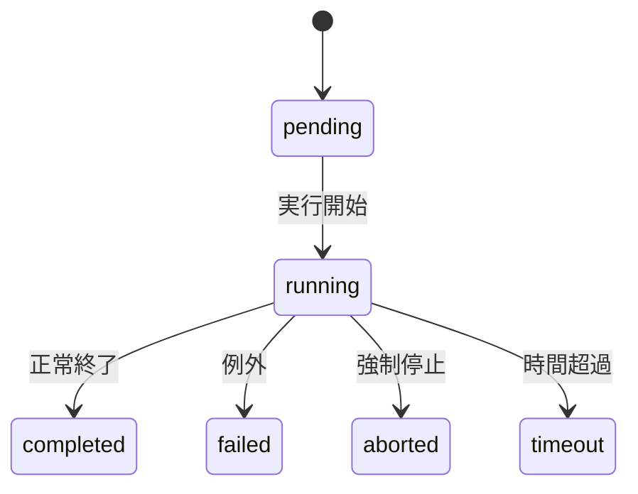
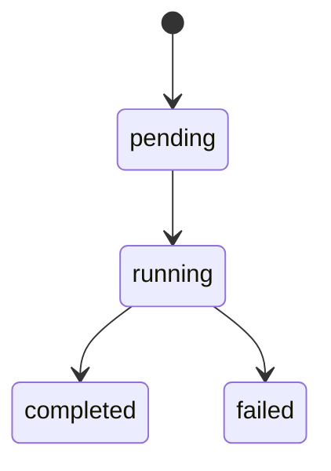
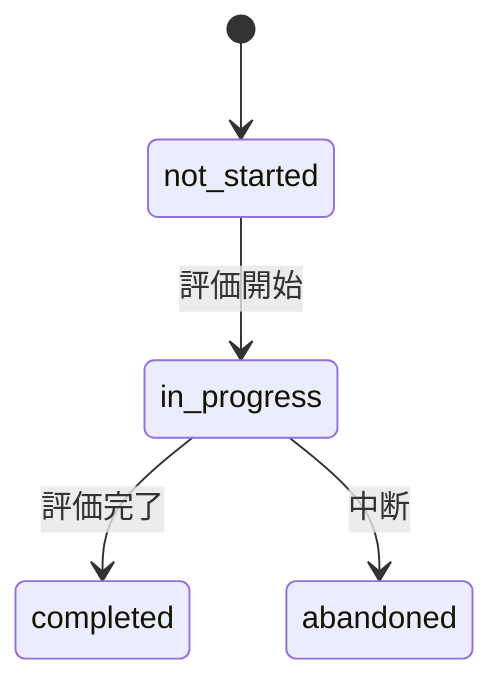

## 1. 目的

本書は、レコメンドシステムにおける「状態管理対象」を明確化し、以下を定義することを目的とする。

- 状態を持つべきオブジェクトの特定
- 各オブジェクトの状態定義
- 状態遷移条件
- ログ・イベントとの責務分離
- 後続のテーブル設計・ログ設計へのインプット

---

## 2. 適用範囲

### 対象

- 推薦実行（recommendation_run）
- オフライン評価実行（offline_eval）
- 人手評価作業（human_eval_task）

### 非対象

以下は状態管理対象としない：

- user_request（入力スナップショット）
- recommendation_result / item（結果データ）
- view / click / feedback（イベントログ）
- human_eval_result（評価結果記録）
- feature / score / embedding（計算データ）

---

## 3. 設計方針（重要）

### 3-1. 状態の定義原則

**事実**

- 状態はトランザクションの進行管理に使用する

**推論**

- 以下を満たすもののみ状態を持つ

| 観点           | 要件                     |
| -------------- | ------------------------ |
| 再実行         | 再試行対象になる         |
| トレース       | 失敗原因追跡が必要       |
| 進行管理       | 実行中かどうか把握したい |
| ライフサイクル | 明確な開始・終了がある   |

---

### 3-2. 状態を持たない対象

以下は状態ではなくログ／データとして扱う

| 対象         | 理由                   |
| ------------ | ---------------------- |
| 結果データ   | run完了で確定するため  |
| ユーザー反応 | 複数回発生するイベント |
| 評価結果     | 記録であり進行ではない |
| 中間計算     | 再計算可能             |

---

## 4. 状態管理対象一覧

| オブジェクト       | テーブル                           | 状態管理 | 理由                 |
| ------------------ | ---------------------------------- | -------- | -------------------- |
| 推薦実行           | `recommendation_run`               | 対象     | 中核トランザクション |
| オフライン評価実行 | `offline_eval_result`（またはrun） | 対象     | 評価トランザクション |
| 人手評価作業       | `human_eval_task`                  | 対象     | 作業進行管理         |
| 推薦依頼           | `user_request`                     | 非対象   | 入力記録             |
| 推薦結果           | `recommendation_result`            | 非対象   | 出力データ           |
| 推薦結果商品       | `recommendation_result_item`       | 非対象   | 明細                 |
| ユーザー反応       | `view_log` 等                      | 非対象   | イベント             |
| 人手評価結果       | `human_eval_result`                | 非対象   | 記録                 |

---

# 5. 推薦実行状態（recommendation_run）

## 5-1. 状態定義

| 状態        | 説明         |
| ----------- | ------------ |
| `pending`   | 実行待ち     |
| `running`   | 実行中       |
| `completed` | 正常終了     |
| `failed`    | 失敗         |
| `aborted`   | 中断         |
| `timeout`   | タイムアウト |

---

## 5-2. 状態遷移

---

## 5-3. 補足

- phase単位の進行は `phase_log` で管理
- エラー詳細は `error_log` に保持
- 状態は「最終結果」のみ持つ

---

# 6. オフライン評価状態

## 6-1. 設計方針

**推論**

- 評価も「実行処理」なので run と同じ構造が自然

---

## 6-2. 状態定義

| 状態        | 説明     |
| ----------- | -------- |
| `pending`   | 評価待ち |
| `running`   | 評価中   |
| `completed` | 評価完了 |
| `failed`    | 評価失敗 |

---

## 6-3. 状態遷移

---

## 6-4. 補足

- `offline_eval_result` を実行単位として扱う設計
- 将来 `offline_eval_run` 分離余地あり

---

# 7. 人手評価作業状態（human_eval_task）

## 7-1. 状態定義

| 状態          | 説明       |
| ------------- | ---------- |
| `not_started` | 未着手     |
| `in_progress` | 評価中     |
| `completed`   | 評価完了   |
| `abandoned`   | 中断・放棄 |

---

## 7-2. 状態遷移

---

## 7-3. 補足

**事実**

- 評価は途中で止まる可能性がある

**推論**

- 状態管理主体は `human_eval_result` ではなく `human_eval_task` が適切

---

# 8. 状態を持たない重要オブジェクト

## 8-1. recommendation_result / item

- 状態は持たない
- run完了で確定する

---

## 8-2. user_request

- 入力スナップショット
- 状態不要

---

## 8-3. ユーザー反応

対象：

- view_log
- click_log
- recommendation_feedback

### 扱い

- 状態ではなくイベントログ

---

## 8-4. human_eval_result

- 評価結果の記録
- 状態は持たない
- `human_eval_task` に従属

---

# 9. 状態とログの役割分担

| 種類 | 役割                     |
| ---- | ------------------------ |
| 状態 | トランザクション進行管理 |
| ログ | 実行履歴・イベント記録   |
| 結果 | 出力データ               |
| 派生 | 分析・集約               |

---

# 10. 物理設計への引継ぎ

## 状態カラムを持つテーブル

- `recommendation_run.status`
- `offline_eval_result.status`
- `human_eval_task.status`

---

## 状態を持たないテーブル

- `recommendation_result`
- `recommendation_result_item`
- `human_eval_result`
- `view_log / click_log`
- `recommendation_feedback`

---

# 11. 未決事項

- timeout / aborted をMVPで実装するか
- offline_eval_run を分離するか
- human_eval_task の粒度（item単位 or セット単位）
- 評価の再実行ルール

---

# 12. 一言まとめ

**事実**

- 状態管理対象は3つに限定した

**推論**

- 「結果」ではなく「実行・作業」を状態として扱うことで、
  シンプルかつ再現性の高い設計になる
