```mermaid
erDiagram

    %% =========================
    %% 入力・実行
    %% =========================
    USER_REQUEST ||--o{ USER_REQUEST_CONDITION : has
    USER_REQUEST ||--o{ RECOMMENDATION_RUN : triggers

    SEMANTIC_CONFIG_VERSION ||--o{ RECOMMENDATION_RUN : uses
    MODEL_VERSION ||--o{ RECOMMENDATION_RUN : uses

    %% =========================
    %% semantic_config_version 配下
    %% =========================
    SEMANTIC_CONFIG_VERSION }o--|| RELATIONSHIP_RULE : selects
    SEMANTIC_CONFIG_VERSION }o--|| OCCASION_RULE : selects
    SEMANTIC_CONFIG_VERSION }o--|| PAIR_RULE : selects
    SEMANTIC_CONFIG_VERSION }o--|| HINT_DICTIONARY : selects
    SEMANTIC_CONFIG_VERSION }o--|| CONCEPT_DEFINITION : selects
    SEMANTIC_CONFIG_VERSION }o--|| FEATURE_DEFINITION : selects
    SEMANTIC_CONFIG_VERSION }o--|| CONCEPT_FEATURE_RULE : selects

    %% =========================
    %% User Meaning
    %% =========================
    RECOMMENDATION_RUN ||--o| EXTERNAL_FEATURE : resolves
    RECOMMENDATION_RUN ||--o| INTERNAL_FEATURE : resolves
    EXTERNAL_FEATURE ||--o| USER_FEATURE_RAW : merges_into
    INTERNAL_FEATURE ||--o| USER_FEATURE_RAW : merges_into
    USER_FEATURE_RAW ||--o| USER_FEATURE_NORMALIZED : normalizes_to
    USER_FEATURE_NORMALIZED ||--o| USER_MEANING_PROJECTION : projects_to
    USER_MEANING_PROJECTION ||--o| LAMBDA_CTX : derives

    RECOMMENDATION_RUN ||--o| PREFERRED_CONTEXT : builds
    RECOMMENDATION_RUN ||--o| NON_PREFERRED_CONTEXT : builds
    PREFERRED_CONTEXT ||--o| PREFERRED_EMBEDDING : embeds_to
    NON_PREFERRED_CONTEXT ||--o| NON_PREFERRED_EMBEDDING : embeds_to

    %% =========================
    %% Item Meaning / Retrieval
    %% =========================
    ITEM_SIGNAL ||--o| ITEM_ATTRIBUTE_SUMMARY : integrates_to
    ITEM_ATTRIBUTE_SUMMARY ||--o| ITEM_CONTEXT : builds
    ITEM_CONTEXT ||--o| ITEM_EMBEDDING : embeds_to

    ITEM_ATTRIBUTE_SUMMARY ||--o{ ITEM_CONCEPT : derives
    ITEM_CONCEPT ||--o| ITEM_FEATURE_RAW : transforms_to
    ITEM_FEATURE_RAW ||--o| ITEM_FEATURE_NORMALIZED : normalizes_to
    ITEM_FEATURE_NORMALIZED ||--o| ITEM_MEANING_PROJECTION : projects_to

    RECOMMENDATION_RUN ||--o{ CANDIDATE_ITEM : retrieves
    PREFERRED_EMBEDDING ||--o{ CANDIDATE_ITEM : queries
    NON_PREFERRED_EMBEDDING ||--o{ CANDIDATE_ITEM : excludes
    ITEM_EMBEDDING ||--o{ CANDIDATE_ITEM : searched_by

    %% =========================
    %% Matching / Ranking
    %% =========================
    RECOMMENDATION_RUN ||--o{ FEATURE_DISTANCE : calculates
    USER_FEATURE_NORMALIZED ||--o{ FEATURE_DISTANCE : source
    ITEM_FEATURE_NORMALIZED ||--o{ FEATURE_DISTANCE : target
    CANDIDATE_ITEM ||--o{ FEATURE_DISTANCE : for_candidate

    FEATURE_DISTANCE ||--o{ FEATURE_MATCH : converts_to
    FEATURE_MATCH ||--o{ SOCIAL_MATCH : aggregates_to
    FEATURE_MATCH ||--o{ SYMBOLIC_MATCH : aggregates_to

    LAMBDA_CTX ||--o{ CONTEXT_SCORE : weights
    SOCIAL_MATCH ||--o{ CONTEXT_SCORE : component
    SYMBOLIC_MATCH ||--o{ CONTEXT_SCORE : component

    CANDIDATE_ITEM ||--o{ POPULARITY_SCORE : calculates
    CANDIDATE_ITEM ||--o{ RISK_SCORE : calculates

    CONTEXT_SCORE ||--o{ ITEM_MATCH_SCORE : component
    POPULARITY_SCORE ||--o{ ITEM_MATCH_SCORE : component
    RISK_SCORE ||--o{ ITEM_MATCH_SCORE : component

    ITEM_MATCH_SCORE ||--o{ FINAL_SCORE : finalizes
    MODEL_VERSION ||--o{ FEATURE_MATCH : controls
    MODEL_VERSION ||--o{ SOCIAL_MATCH : controls
    MODEL_VERSION ||--o{ SYMBOLIC_MATCH : controls
    MODEL_VERSION ||--o{ CONTEXT_SCORE : controls
    MODEL_VERSION ||--o{ POPULARITY_SCORE : controls
    MODEL_VERSION ||--o{ RISK_SCORE : controls
    MODEL_VERSION ||--o{ ITEM_MATCH_SCORE : controls
    MODEL_VERSION ||--o{ FINAL_SCORE : controls

    %% =========================
    %% 出力
    %% =========================
    RECOMMENDATION_RUN ||--o| RECOMMENDATION_RESULT : produces
    RECOMMENDATION_RESULT ||--|{ RECOMMENDATION_RESULT_ITEM : contains
    FINAL_SCORE ||--o{ RECOMMENDATION_RESULT_ITEM : selected_as

    %% =========================
    %% 記録 / 計測 / 統計
    %% =========================
    RECOMMENDATION_RUN ||--o{ PHASE_LOG : records
    RECOMMENDATION_RUN ||--o{ ERROR_LOG : records
    RECOMMENDATION_RUN ||--o{ METRIC_LOG : measures

    RECOMMENDATION_RESULT_ITEM ||--o{ VIEW_LOG : viewed_as
    RECOMMENDATION_RESULT_ITEM ||--o{ CLICK_LOG : clicked_as

    METRIC_LOG ||--o{ FEATURE_DISTRIBUTION_STAT : aggregates_to
    METRIC_LOG ||--o{ SCORE_DISTRIBUTION_STAT : aggregates_to

    %% =========================
    %% 評価 / 改善
    %% =========================
    OFFLINE_EVAL_DATASET ||--o{ OFFLINE_EVAL_RESULT : evaluates
    MODEL_VERSION ||--o{ OFFLINE_EVAL_RESULT : evaluated_under
    SEMANTIC_CONFIG_VERSION ||--o{ OFFLINE_EVAL_RESULT : evaluated_under

    RECOMMENDATION_RESULT_ITEM ||--o{ HUMAN_EVAL_TASK : assigned_for
    HUMAN_EVAL_TASK ||--o{ HUMAN_EVAL_RESULT : records

    RECOMMENDATION_RESULT_ITEM ||--o{ RECOMMENDATION_FEEDBACK : reacted_to

    VIEW_LOG ||--o{ BEHAVIOR_ANALYSIS_RESULT : analyzes
    CLICK_LOG ||--o{ BEHAVIOR_ANALYSIS_RESULT : analyzes

    OFFLINE_EVAL_RESULT ||--o{ AB_TEST_RESULT : compared_in
    BEHAVIOR_ANALYSIS_RESULT ||--o{ AB_TEST_RESULT : compared_in

    USER_REQUEST {
        string user_request_id
        string request_text
        datetime requested_at
    }

    USER_REQUEST_CONDITION {
        string user_request_condition_id
        string user_request_id
        string condition_type
        string condition_value
    }

    RECOMMENDATION_RUN {
        string recommendation_run_id
        string user_request_id
        string semantic_config_version_id
        string model_version_id
        string run_status
        datetime started_at
        datetime finished_at
    }

    RELATIONSHIP_RULE {
        string relationship_rule_id
        string rule_version
        string relationship_code
    }

    OCCASION_RULE {
        string occasion_rule_id
        string rule_version
        string occasion_code
    }

    PAIR_RULE {
        string pair_rule_id
        string rule_version
        string relationship_code
        string occasion_code
    }

    HINT_DICTIONARY {
        string hint_dictionary_id
        string dictionary_version
        string keyword
    }

    CONCEPT_DEFINITION {
        string concept_definition_id
        string definition_version
        string concept_code
    }

    FEATURE_DEFINITION {
        string feature_definition_id
        string definition_version
        string feature_code
    }

    CONCEPT_FEATURE_RULE {
        string concept_feature_rule_id
        string rule_version
        string concept_code
        string feature_code
    }

    SEMANTIC_CONFIG_VERSION {
        string semantic_config_version_id
        string config_name
        string status
    }

    MODEL_VERSION {
        string model_version_id
        string model_name
        string status
    }

    EXTERNAL_FEATURE {
        string external_feature_id
        string recommendation_run_id
    }

    INTERNAL_FEATURE {
        string internal_feature_id
        string recommendation_run_id
    }

    USER_FEATURE_RAW {
        string user_feature_raw_id
        string recommendation_run_id
    }

    USER_FEATURE_NORMALIZED {
        string user_feature_normalized_id
        string recommendation_run_id
    }

    USER_MEANING_PROJECTION {
        string user_meaning_projection_id
        string recommendation_run_id
        float social_mean
        float symbolic_mean
    }

    LAMBDA_CTX {
        string lambda_ctx_id
        string recommendation_run_id
        float lambda_ctx
    }

    PREFERRED_CONTEXT {
        string preferred_context_id
        string recommendation_run_id
    }

    PREFERRED_EMBEDDING {
        string preferred_embedding_id
        string recommendation_run_id
    }

    NON_PREFERRED_CONTEXT {
        string non_preferred_context_id
        string recommendation_run_id
    }

    NON_PREFERRED_EMBEDDING {
        string non_preferred_embedding_id
        string recommendation_run_id
    }

    ITEM_SIGNAL {
        string item_signal_id
        string item_id
        string signal_type
    }

    ITEM_ATTRIBUTE_SUMMARY {
        string item_attribute_summary_id
        string item_id
    }

    ITEM_CONTEXT {
        string item_context_id
        string item_id
    }

    ITEM_EMBEDDING {
        string item_embedding_id
        string item_id
    }

    ITEM_CONCEPT {
        string item_concept_id
        string item_id
        string concept_code
    }

    ITEM_FEATURE_RAW {
        string item_feature_raw_id
        string item_id
    }

    ITEM_FEATURE_NORMALIZED {
        string item_feature_normalized_id
        string item_id
    }

    ITEM_MEANING_PROJECTION {
        string item_meaning_projection_id
        string item_id
        float social_mean
        float symbolic_mean
    }

    CANDIDATE_ITEM {
        string candidate_item_id
        string recommendation_run_id
        string item_id
    }

    FEATURE_DISTANCE {
        string feature_distance_id
        string recommendation_run_id
        string item_id
        string feature_code
    }

    FEATURE_MATCH {
        string feature_match_id
        string recommendation_run_id
        string item_id
        string feature_code
    }

    SOCIAL_MATCH {
        string social_match_id
        string recommendation_run_id
        string item_id
    }

    SYMBOLIC_MATCH {
        string symbolic_match_id
        string recommendation_run_id
        string item_id
    }

    CONTEXT_SCORE {
        string context_score_id
        string recommendation_run_id
        string item_id
    }

    POPULARITY_SCORE {
        string popularity_score_id
        string recommendation_run_id
        string item_id
    }

    RISK_SCORE {
        string risk_score_id
        string recommendation_run_id
        string item_id
    }

    ITEM_MATCH_SCORE {
        string item_match_score_id
        string recommendation_run_id
        string item_id
    }

    FINAL_SCORE {
        string final_score_id
        string recommendation_run_id
        string item_id
        float final_score
    }

    RECOMMENDATION_RESULT {
        string recommendation_result_id
        string recommendation_run_id
    }

    RECOMMENDATION_RESULT_ITEM {
        string recommendation_result_item_id
        string recommendation_result_id
        string item_id
        int display_rank
        float final_score
    }

    PHASE_LOG {
        string phase_log_id
        string recommendation_run_id
        string phase_name
    }

    ERROR_LOG {
        string error_log_id
        string recommendation_run_id
        string phase_name
    }

    METRIC_LOG {
        string metric_log_id
        string recommendation_run_id
        string metric_name
    }

    VIEW_LOG {
        string view_log_id
        string recommendation_result_item_id
    }

    CLICK_LOG {
        string click_log_id
        string recommendation_result_item_id
    }

    FEATURE_DISTRIBUTION_STAT {
        string feature_distribution_stat_id
        string feature_code
    }

    SCORE_DISTRIBUTION_STAT {
        string score_distribution_stat_id
        string score_code
    }

    OFFLINE_EVAL_DATASET {
        string offline_eval_dataset_id
        string dataset_name
    }

    OFFLINE_EVAL_RESULT {
        string offline_eval_result_id
        string offline_eval_dataset_id
        string semantic_config_version_id
        string model_version_id
    }

    HUMAN_EVAL_TASK {
        string human_eval_task_id
        string recommendation_result_item_id
        string evaluator_id
        string task_status
    }

    HUMAN_EVAL_RESULT {
        string human_eval_result_id
        string human_eval_task_id
        string evaluator_id
        float eval_score
        string eval_comment
        datetime evaluated_at
    }

    RECOMMENDATION_FEEDBACK {
        string recommendation_feedback_id
        string recommendation_result_item_id
    }

    BEHAVIOR_ANALYSIS_RESULT {
        string behavior_analysis_result_id
    }

    AB_TEST_RESULT {
        string ab_test_result_id
    }
```

---

## 事実

このERは、前回の論理ERよりかなり粒度が細かくなっています。

特に反映したのは次です。

- `semantic_config_version` が各定義テーブルを**選択する側**であること
- user/item の `raw → normalized → projection`
- `preferred/non_preferred embedding` と `item_embedding`
- `candidate_item` と `recommendation_result_item` の段階差
- `feature_distance → feature_match → social/symbolic_match → context_score`
- `model_version` が比較・スコアリング側を支配すること

## 推論

このERは **論理的完全性の確認用** としてはかなり良いですが、

このまま物理ERに落とすとテーブル数が多くなります。

そのため次工程では、各概念について

- 本当に独立テーブルにするか
- JSONや派生再計算に逃がすか
- 正本として保持するか

を見ながら、**物理ERで統合・省略**していくのが自然です。

---

# 一言でまとめ

この論理ERは、

- **意味の作り方** (`semantic_config_version`)
- **順位の決め方** (`model_version`)
- **入力→意味推定→検索→比較→順位→出力→評価改善**

を一通り漏れなく表現した再作成版です。

---

# 1. テーブル群一覧（レビュー用）

## 1-1. 入力・実行・出力群

| テーブル                            | 役割         | 主なキー/関連                                                       | レビュー観点                              | 保存要否 | 独立要否                    | データ種別 |
| ----------------------------------- | ------------ | ------------------------------------------------------------------- | ----------------------------------------- | -------- | --------------------------- | ---------- |
| `user_request`                      | 推薦依頼の親 | `user_request_id`                                                   | requestを独立概念として持つ必要性は妥当か | 要       | 要                          | 正本       |
| `user_request_condition`            | 条件明細     | `user_request_id`                                                   | 条件を明細化する粒度は適切か              | 要       | 不要（request側にJSON保持） | 正本       |
| `recommendation_run`                | 実行単位     | `user_request_id`, `semantic_config_version_id`, `model_version_id` | runが軽量に保たれているか                 |
| →候補集合はcandidate_itemに切り出す | 要           | 要                                                                  | 正本                                      |
| `candidate_item`                    | 候補集合     | `recommendation_run_id`, `item_id`                                  | 候補集合を独立管理する必要があるか        |

→必要あり。
　候補集合は軽量保持とし、保持項目は run_id / item_id / retrieval_score / retrieval_rank / source を基本とする。 | 要 | 要 | 派生 |
| `recommendation_result` | 結果集合 | `recommendation_run_id` | resultをrunから分離する妥当性 | 要 | 要 | 正本 |
| `recommendation_result_item` | 最終提示商品 | `recommendation_result_id`, `item_id` | result_itemに持つ情報は最終出力に限定されているか | 要 | 要 | 正本 |

---

## 1-2. 意味定義・バージョン管理群

| テーブル                  | 役割                      | 主なキー/関連                | レビュー観点                               | 保存要否 | 独立要否                   | データ種別 |
| ------------------------- | ------------------------- | ---------------------------- | ------------------------------------------ | -------- | -------------------------- | ---------- |
| `semantic_config_version` | 意味推定構成のアプリIF    | `semantic_config_version_id` | semantic側の責務が明確か                   | 要       | 要                         | 正本       |
| `semantic_config`         | 意味推定の構成管理        | `semantic_config_version_id` | semantic側の責務が明確か                   | 要       | 要                         | 正本       |
| `model_version`           | 順位決定の構成版          | `model_version_id`           | model側の責務が明確か                      | 要       | 要                         | 正本       |
| `relationship_rule`       | relationship→feature      | version系参照                | 個別ruleテーブルに分ける粒度が妥当か       | 要       | 不要：ルールテーブルで統合 | 正本       |
| `occasion_rule`           | occasion→feature          | version系参照                | 同上                                       | 要       | 不要：ルールテーブルで統合 | 正本       |
| `pair_rule`               | relationship×occasion補正 | version系参照                | 同上                                       | 要       | 不要：ルールテーブルで統合 | 正本       |
| `hint_dictionary`         | 入力語→concept            | version系参照                | 辞書として独立が必要か                     | 要       | 要                         | 正本       |
| `concept_definition`      | concept定義               | version系参照                | conceptとfeatureの境界が明確か             | 要       | 要                         | 正本       |
| `feature_definition`      | feature定義               | version系参照                | 8次元feature定義の固定先として妥当か       | 要       | 要                         | 正本       |
| `concept_feature_rule`    | concept→feature変換       | version系参照                | semantic推定の中核ルールとして独立が必要か | 要       | 不要：ルールテーブルで統合 | 正本       |

---

## 1-3. User Meaning 群

| テーブル                  | 役割                | 主なキー/関連           | レビュー観点                                 | 保存要否 | 独立要否                                                          | データ種別 |
| ------------------------- | ------------------- | ----------------------- | -------------------------------------------- | -------- | ----------------------------------------------------------------- | ---------- |
| `external_feature`        | 外部条件由来feature | `recommendation_run_id` | external/internalを分ける価値があるか        | 不要     | ー                                                                | ー         |
| `internal_feature`        | 内部条件由来feature | `recommendation_run_id` | 同上                                         | 不要     | ー                                                                | ー         |
| `user_feature_raw`        | 統合後の生特徴量    | `recommendation_run_id` | rawを保存する必要性があるか                  | 不要     | ー                                                                | ー         |
| `user_feature_normalized` | 正規化特徴量        | `recommendation_run_id` | normalizedを独立保持する必要性があるか       | 不要     | ー                                                                | ー         |
| `user_meaning_projection` | social/symbolic射影 | `recommendation_run_id` | projectionを独立テーブルにする必要があるか   | 不要     | ー                                                                | ー         |
| `lambda_ctx`              | 文脈重み            | `recommendation_run_id` | projectionから派生計算として独立管理が必要か | 不要     | ー                                                                | ー         |
| `preferred_context`       | 好みcontext         | `recommendation_run_id` | contextを保存対象にする必要があるか          | 不要     | ー                                                                | ー         |
| `preferred_embedding`     | 好みembedding       | `recommendation_run_id` | embedding保存の必要性とコスト                | 要       | 要（キャッシュ用途のため、embedding_cacheテーブルとして一元管理） | キャッシュ |
| `non_preferred_context`   | 非好みcontext       | `recommendation_run_id` | preferredと対称に持つ必要があるか            | 不要     | ー                                                                | ー         |
| `non_preferred_embedding` | 非好みembedding     | `recommendation_run_id` | 同上                                         | 要       | 要（キャッシュ用途のため、embedding_cacheテーブルとして一元管理） | キャッシュ |

---

## 1-4. Item Meaning / Retrieval 群

| テーブル                              | 役割                                                                                      | 主なキー/関連             | レビュー観点                        | 保存要否 | 独立要否                                                          | データ種別 |
| ------------------------------------- | ----------------------------------------------------------------------------------------- | ------------------------- | ----------------------------------- | -------- | ----------------------------------------------------------------- | ---------- |
| `item_signal`                         | 商品シグナル                                                                              | `item_id`                 | signalをどこまで分解管理するか      | 要       |
| ※item_signal → item_embeddingの生成元 | 要（LLM、画像解析など各シグナルは同一テーブルで一元管理。JSON保持で管理柔軟性を持たせる） | キャッシュ                |
| `item_attribute_summary`              | signal統合表現                                                                            | `item_id`                 | summaryを独立保持する必要があるか   | 不要     | ー                                                                | ー         |
| `item_context`                        | embedding入力文脈                                                                         | `item_id`                 | retrieval用contextの保存必要性      | 不要     | ー                                                                | ー         |
| `item_embedding`                      | 商品検索ベクトル                                                                          | `item_id`                 | retrieval中核として独立保持は妥当か | 要       | 要（キャッシュ用途のため、embedding_cacheテーブルとして一元管理） | キャッシュ |
| `item_concept`                        | 商品concept                                                                               | `item_id`, `concept_code` | conceptを明示管理する必要性         | 不要     | ー                                                                | ー         |
| `item_feature_raw`                    | 商品生特徴量                                                                              | `item_id`                 | raw保持の必要性                     | 不要     | ー                                                                | ー         |
| `item_feature_normalized`             | 商品正規化特徴量                                                                          | `item_id`                 | normalized保持の必要性              | 不要     | ー                                                                | ー         |
| `item_meaning_projection`             | 商品意味射影                                                                              | `item_id`                 | projectionの独立管理必要性          | 不要     | ー                                                                | ー         |

---

## 1-5. Matching / Ranking 群

| テーブル                                                   | 役割                  | 主なキー/関連                                      | レビュー観点                                 | 保存要否 | 独立要否 | データ種別 |
| ---------------------------------------------------------- | --------------------- | -------------------------------------------------- | -------------------------------------------- | -------- | -------- | ---------- |
| `feature_distance`                                         | user-item feature距離 | `recommendation_run_id`, `item_id`, `feature_code` | feature単位で保持する必要があるか            | 不要     |
| （分析、評価用に必要だが、それはlogやstatsで保持する想定） | ー                    | ー                                                 |
| `feature_match`                                            | 一致度変換後          | 同上                                               | distanceと分ける必要があるか                 | 不要     |
| （分析、評価用に必要だが、それはlogやstatsで保持する想定） | ー                    | ー                                                 |
| `social_match`                                             | social集約            | `recommendation_run_id`, `item_id`                 | 集約値を独立保持する必要があるか             | 不要     |
| （分析、評価用に必要だが、それはlogやstatsで保持する想定） | ー                    | ー                                                 |
| `symbolic_match`                                           | symbolic集約          | `recommendation_run_id`, `item_id`                 | 同上                                         | 不要     |
| （分析、評価用に必要だが、それはlogやstatsで保持する想定） | ー                    | ー                                                 |
| `context_score`                                            | 文脈スコア            | `recommendation_run_id`, `item_id`                 | score内訳として保持する必要があるか          | 不要     |
| （分析、評価用に必要だが、それはlogやstatsで保持する想定） | ー                    | ー                                                 |
| `popularity_score`                                         | 人気補正              | `recommendation_run_id`, `item_id`                 | score内訳として独立が必要か                  | 不要     |
| （分析、評価用に必要だが、それはlogやstatsで保持する想定） | ー                    | ー                                                 |
| `risk_score`                                               | リスク補正            | `recommendation_run_id`, `item_id`                 | 同上                                         | 不要     |
| （分析、評価用に必要だが、それはlogやstatsで保持する想定） | ー                    | ー                                                 |
| `item_match_score`                                         | スコア内訳全体        | `recommendation_run_id`, `item_id`                 | 内訳集約テーブルとして持つべきか             | 不要     |
| （分析、評価用に必要だが、それはlogやstatsで保持する想定） | ー                    | ー                                                 |
| `final_score`                                              | 最終スコア            | `recommendation_run_id`, `item_id`                 | `recommendation_result_item` と重複しないか  | 不要     |
| （分析、評価用に必要だが、それはlogやstatsで保持する想定） | ー                    | ー                                                 |
| `final_ranking_result`                                     | 最終順位集合          | run単位                                            | `recommendation_result` と責務が重複しないか | 不要     |
| （分析、評価用に必要だが、それはlogやstatsで保持する想定） | ー                    | ー                                                 |

---

## 1-6. 記録・計測・統計群

| テーブル                    | 役割            | 主なキー/関連                   | レビュー観点                            | 保持要否 | 独立要否                                                       | データ種別 |
| --------------------------- | --------------- | ------------------------------- | --------------------------------------- | -------- | -------------------------------------------------------------- | ---------- |
| `phase_log`                 | phase実行記録   | `recommendation_run_id`         | runとの責務分離は適切か                 | 要       | 要（event_logとして、error_logと統合可能かを物理設計で再検討） | ログ       |
| `error_log`                 | エラー記録      | `recommendation_run_id`         | phase_logに統合しない理由があるか       | 要       | 要（event_logとして、pahse_logと統合可能かを物理設計で再検討） | ログ       |
| `metric_log`                | 生メトリクス    | `recommendation_run_id`         | metricを生イベントで持つ設計が妥当か    | 要       | 要                                                             | ログ       |
| `view_log`                  | impression      | `recommendation_result_item_id` | recommendation_feedbackとの違いが明確か | 要       | 要                                                             | ログ       |
| `click_log`                 | click           | `recommendation_result_item_id` | 同上                                    | 要       | 要                                                             | ログ       |
| `feature_distribution_stat` | feature分布統計 | 集約対象参照                    | 派生データとしてどこまで保存するか      | 要       | 要                                                             | 派生       |
| `score_distribution_stat`   | score分布統計   | 集約対象参照                    | 同上                                    | 要       | 要                                                             | 派生       |

---

## 1-7. 評価・改善群

| テーブル                                | 役割                         | 主なキー/関連                                                  | レビュー観点                                                                                        | 保存要否 | 独立要否                                                     | データ種別 |
| --------------------------------------- | ---------------------------- | -------------------------------------------------------------- | --------------------------------------------------------------------------------------------------- | -------- | ------------------------------------------------------------ | ---------- |
| `offline_eval_dataset`                  | 評価データセット             | `offline_eval_dataset_id`                                      | datasetとresultを分ける必要性                                                                       | 要       | 要                                                           | 正本       |
| `offline_eval_result`                   | オフライン評価結果           | dataset/version参照                                            | semantic/model両version参照は妥当か                                                                 | 要       | 要                                                           | 派生       |
| `human_eval_task`                       | 人手評価の作業単位・進行管理 | human_eval_task_id, recommendation_result_item_id, evalator_id | 評価結果（human_eval_result）と作業管理を分離する粒度は妥当か。状態管理主体をtaskに置く設計が適切か | 要       | 要                                                           | 正本       |
| `human_eval_result`                     | 人手評価                     | `recommendation_result_item_id`                                | 評価粒度はresult_item単位でよいか                                                                   | 要       | 要                                                           | 正本       |
| `recommendation_feedback`               | ユーザー反応                 | `recommendation_result_item_id`                                | feedbackとview/clickの棲み分け                                                                      | 要       | 要                                                           | 正本       |
| ※ユーザーの明示的評価事実として正本扱い |
| `behavior_analysis_result`              | 行動分析結果                 | view/click起点                                                 | 集約結果として独立が必要か                                                                          | 要検討   | 不要寄り（まずはビューorバッチ出力で様子見）                 | 派生       |
| `ab_test_result`                        | 比較検証結果                 | eval/behavior起点                                              | A/Bの単位が十分定義されているか                                                                     | 要検討   | 不要寄り（`ab_test_assignment`のような「割付」側が先に必要） | 派生       |

---

# 2. まず見るべきレビュー観点

## 2-1. テーブル粒度レビュー

最初に見るべきです。

| 観点                           | 確認すること                                                     |
| ------------------------------ | ---------------------------------------------------------------- |
| 独立テーブルにする理由があるか | 「保存したい」「履歴を持ちたい」「再現したい」のいずれかがあるか |
| 派生データを持ちすぎていないか | 再計算可能なものを無駄にテーブル化していないか                   |
| 逆に漏れがないか               | 業務意味を持つデータが概念化されているか                         |

---

## 2-2. 正本レビュー

次に見るべきです。

| 観点                                | 確認すること                                                    |
| ----------------------------------- | --------------------------------------------------------------- |
| 正本と派生が混ざっていないか        | `result_item.final_score` と `final_score` のような重複は適切か |
| runが肥大化していないか             | runは制御だけに寄せられているか                                 |
| resultとcandidateが分離できているか | 候補と最終結果が混ざっていないか                                |

---

## 2-3. semantic / model 境界レビュー

今回の最重要ポイントです。

| 観点                              | 確認すること                                                          |
| --------------------------------- | --------------------------------------------------------------------- |
| semantic_config_versionの支配範囲 | ルール・辞書・正規化・射影までに限定できているか                      |
| model_versionの支配範囲           | 比較・スコアリング・ランキングに限定できているか                      |
| 境界が曖昧な概念                  | `feature_match`, `lambda_ctx`, `context_score` の所属がぶれていないか |

---

## 2-4. 実装可能性レビュー

論理ERでもここは見ておくと後で楽です。

| 観点                                    | 確認すること                                               |
| --------------------------------------- | ---------------------------------------------------------- |
| テーブル数が過剰でないか                | 論理概念としては正しくても、物理ERで統合すべきものがないか |
| item系が事前計算なのか実行時計算なのか  | 保存と再計算の境界が明確か                                 |
| user系がrunごとに生成される設計で妥当か | リクエストごとに毎回作る設計で問題ないか                   |

---

# 3. 特にレビュー優先度が高い箇所

今回のERだと、まずはこのあたりを重点レビューすると効率がいいです。

## 優先度 高

- `candidate_item`
- `item_match_score`
- `final_score`
- `final_ranking_result`
- `user_feature_raw / normalized / projection`
- `item_attribute_summary / item_context / item_embedding`
- `semantic_config_version`
- `model_version`

## 優先度 中

- `feature_distance / feature_match / social_match / symbolic_match`
- `metric_log / feature_distribution_stat / score_distribution_stat`
- `offline_eval_result / human_eval_result / recommendation_feedback`

## 優先度 低

- `phase_log / error_log`
- `view_log / click_log`
- 各 rule / definition 系

---

# 4. レビューの進め方のおすすめ

順番としてはこの流れがやりやすいです。

1. **入力・実行・出力群**`request / run / candidate / result / result_item`
2. **semantic / model 境界群**`semantic_config_version / model_version / 各rule`
3. **user/item推定群**
   raw / normalized / projection / embedding
4. **matching/ranking群**
   distance / match / score / ranking
5. **ログ・評価群**

---

# 5. 一言でまとめ

この一覧表は、

**「どのテーブルが何の責務を持つか」** と

**「どこがレビューの論点になるか」**

を見えるようにしたものです。

次にやるなら、

この一覧をもとに **「統合候補テーブル」と「独立維持すべきテーブル」の仕分け」** をやると、物理ERへかなりスムーズに落とせます。
