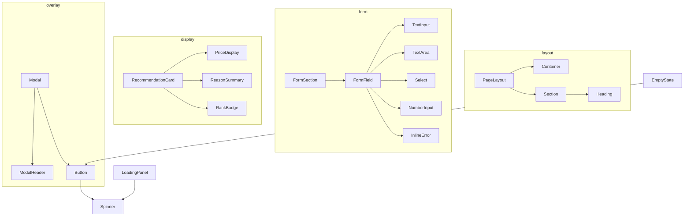

# UIコンポーネント一覧

## 1. 概要

### 1.1 目的

本ドキュメントは、Gift Recommendation Service MVP において再利用する Web UI 部品の一覧を定義する。

各コンポーネントの責務、表示条件、対応画面、実装配置方針を整理し、Phase4a `common-ui-components`（W2）以降の実装および Phase4b 画面実装の共通前提とする。

### 1.2 本ドキュメントの位置づけ

| 成果物         | 本ドキュメントとの関係                         |
| -------------- | ---------------------------------------------- |
| デザインルール | 部品の見た目・トークンの正本                   |
| 画面一覧       | 画面単位の表示要件。部品の利用コンテキスト     |
| モジュール一覧 | web 画面・UI 部品はモジュール ID 対象外        |
| インターフェース一覧 | 画面内 UI 状態受け渡しは本一覧で管理     |

---

## 2. 管理方針

### 2.1 命名・ID 規則

| 項目           | 規則                                                         |
| -------------- | ------------------------------------------------------------ |
| コンポーネント ID | `UI-NNN`（3 桁ゼロ埋め）。一覧上の論理 ID                  |
| コンポーネント名 | PascalCase（実装名）。例: `Button`, `RecommendationCard`   |
| ファイル配置   | `apps/web/src/components/<category>/<ComponentName>/`      |
| 画面 ID        | `SCR-*`（画面一覧に準拠）                                    |

### 2.2 分類

| 分類コード | 分類名       | 説明                                   |
| ---------- | ------------ | -------------------------------------- |
| `layout`   | レイアウト   | ページ骨格、セクション、コンテナ       |
| `nav`      | ナビゲーション | リンク、戻る導線                     |
| `form`     | フォーム     | 入力、ラベル、バリデーション表示       |
| `action`   | アクション   | ボタン等の操作トリガー                 |
| `feedback` | フィードバック | ローディング、エラー、空状態、アラート |
| `display`  | 表示         | カード、価格、テキスト表示             |
| `overlay`  | オーバーレイ | モーダル、ダイアログ                   |

### 2.3 MVP 対象区分

| 区分 | 意味                                      |
| ---- | ----------------------------------------- |
| ○    | Phase4a〜4b MVP 主導線で実装対象          |
| △    | 簡易実装または後続画面で実装              |
| ×    | MVP 対象外                                |

### 2.4 実装状態（W1 時点）

| 状態       | 意味                                           |
| ---------- | ---------------------------------------------- |
| `defined`  | 本一覧で定義済み。実装は W2 以降               |
| `planned`  | 後続フェーズで追加予定                         |

W1（本 Task）では **定義のみ** を行い、`apps/web/src/components/**` への実装は `common-ui-components`（W2）に委ねる。

---

## 3. コンポーネント一覧（サマリ）

### 3.1 全体一覧

| UI ID  | コンポーネント名   | 分類     | 責務概要                         | MVP | 実装状態 | 主な利用画面        |
| ------ | ------------------ | -------- | -------------------------------- | --: | -------- | ------------------- |
| UI-001 | PageLayout         | layout   | ページ共通骨格（ヘッダー・本文） |   ○ | defined  | SCR-001〜009        |
| UI-002 | Container          | layout   | 最大幅・水平パディングの制御     |   ○ | defined  | 全画面              |
| UI-003 | Section            | layout   | セクション見出しと内容ブロック   |   ○ | defined  | SCR-001, SCR-002    |
| UI-010 | TextLink           | nav      | テキストスタイルの内部リンク     |   ○ | defined  | SCR-001, SCR-006    |
| UI-011 | BackLink           | nav      | 戻る導線                         |   △ | defined  | SCR-006, SCR-014    |
| UI-020 | Button             | action   | 汎用ボタン（variant / size）     |   ○ | defined  | 全画面              |
| UI-021 | TextInput          | form     | 単一行テキスト入力               |   ○ | defined  | SCR-002, SCR-007    |
| UI-022 | TextArea           | form     | 複数行テキスト入力               |   ○ | defined  | SCR-002, SCR-007    |
| UI-023 | Select             | form     | 選択肢（relationship / occasion）|   ○ | defined  | SCR-002             |
| UI-024 | NumberInput        | form     | 数値入力（予算）                 |   ○ | defined  | SCR-002             |
| UI-025 | FormField          | form     | ラベル + 入力 + 補助文 + エラー  |   ○ | defined  | SCR-002, SCR-007    |
| UI-026 | FormSection        | form     | フォーム内の論理グループ         |   ○ | defined  | SCR-002             |
| UI-030 | Alert              | feedback | 情報・警告・エラーのインライン表示 | ○ | defined  | SCR-002, SCR-008    |
| UI-031 | Spinner            | feedback | ローディングインジケータ         |   ○ | defined  | SCR-003             |
| UI-032 | LoadingPanel       | feedback | 画面状態用ローディングブロック   |   ○ | defined  | SCR-003             |
| UI-033 | EmptyState         | feedback | 0 件・データなし表示             |   ○ | defined  | SCR-009             |
| UI-034 | InlineError        | feedback | フィールド直下のエラー文言       |   ○ | defined  | SCR-002             |
| UI-040 | Card               | display  | 汎用カードコンテナ               |   ○ | defined  | SCR-004, SCR-006    |
| UI-041 | RecommendationCard | display  | 推薦商品カード                   |   ○ | defined  | SCR-004             |
| UI-042 | PriceDisplay       | display  | 価格表示（通貨・範囲）             |   ○ | defined  | SCR-004, SCR-006    |
| UI-043 | ReasonSummary      | display  | 推薦理由要約テキスト             |   ○ | defined  | SCR-004             |
| UI-044 | RankBadge          | display  | 推薦順位表示（任意）             |   △ | defined  | SCR-004             |
| UI-050 | Modal              | overlay  | モーダルシェル（オーバーレイ含む）|  ○ | defined  | SCR-005, SCR-007    |
| UI-051 | ModalHeader        | overlay  | モーダルタイトル + 閉じる        |   ○ | defined  | SCR-005, SCR-007    |
| UI-060 | Heading            | display  | 見出し（レベル対応）             |   ○ | defined  | 全画面              |
| UI-061 | Text               | display  | 本文・補助文                     |   ○ | defined  | 全画面              |
| UI-062 | ExternalLink       | nav      | 外部 EC への遷移リンク           |   ○ | defined  | SCR-006             |

---

## 4. コンポーネント詳細

### 4.1 レイアウト

#### UI-001 PageLayout

| 項目         | 内容                                                         |
| ------------ | ------------------------------------------------------------ |
| 責務         | 全画面共通のページ骨格。任意で簡易ヘッダー・フッターを提供   |
| 表示条件     | 通常画面（SCR-001〜002, 004, 006）で使用                     |
| 主要 props   | `title?`, `children`, `showHeader?`                          |
| デザイン参照 | デザインルール §5                                            |
| 実装パス案   | `apps/web/src/components/layout/PageLayout/`                 |
| 依存         | UI-002 Container, UI-060 Heading                             |

#### UI-002 Container

| 項目         | 内容                                                         |
| ------------ | ------------------------------------------------------------ |
| 責務         | `max-width` と水平パディングを統一                           |
| 表示条件     | ページ内の主要コンテンツを包むとき                           |
| 主要 props   | `maxWidth?: 'md' \| 'lg'`, `children`                        |
| 実装パス案   | `apps/web/src/components/layout/Container/`                  |

#### UI-003 Section

| 項目         | 内容                                                         |
| ------------ | ------------------------------------------------------------ |
| 責務         | 見出し + 説明 + 子要素のセクション単位                       |
| 表示条件     | トップの説明ブロック、入力フォームのグループ分け               |
| 主要 props   | `title`, `description?`, `children`                          |
| 実装パス案   | `apps/web/src/components/layout/Section/`                    |

---

### 4.2 ナビゲーション

#### UI-010 TextLink

| 項目         | 内容                                                         |
| ------------ | ------------------------------------------------------------ |
| 責務         | アプリ内遷移用のテキストリンク                               |
| 表示条件     | 補助導線、商品詳細からの戻り以外のリンク                     |
| 主要 props   | `href`, `children`, `external?: false`                        |
| 実装パス案   | `apps/web/src/components/nav/TextLink/`                      |

#### UI-011 BackLink

| 項目         | 内容                                                         |
| ------------ | ------------------------------------------------------------ |
| 責務         | 前画面へ戻る明示的導線                                       |
| 表示条件     | 商品詳細、Not Found 等                                       |
| MVP          | △（SCR-014 は後続）                                          |
| 実装パス案   | `apps/web/src/components/nav/BackLink/`                      |

#### UI-062 ExternalLink

| 項目         | 内容                                                         |
| ------------ | ------------------------------------------------------------ |
| 責務         | 外部 EC サイトへの遷移。新規タブ + 注意表示と組み合わせ      |
| 表示条件     | 商品詳細の購入導線                                           |
| 主要 props   | `href`, `children`, `rel="noopener noreferrer"`              |
| デザイン参照 | デザインルール §6.3（外部 EC 注意）                          |
| 実装パス案   | `apps/web/src/components/nav/ExternalLink/`                  |

---

### 4.3 アクション

#### UI-020 Button

| 項目         | 内容                                                         |
| ------------ | ------------------------------------------------------------ |
| 責務         | クリック操作のトリガー                                       |
| variant      | `primary` / `secondary` / `ghost` / `danger`                 |
| size         | `sm` / `md` / `lg`                                           |
| 状態         | `disabled`, `loading`（loading 時は Spinner 併用）           |
| 表示条件     | レコメンド実行、モーダル送信、トップ CTA 等                  |
| 主要 props   | `variant`, `size`, `disabled`, `loading`, `onClick`, `type`  |
| デザイン参照 | デザインルール §6.1                                          |
| 実装パス案   | `apps/web/src/components/action/Button/`                     |
| 利用画面     | SCR-001, SCR-002, SCR-004, SCR-007, SCR-008, SCR-009         |

---

### 4.4 フォーム

#### UI-025 FormField

| 項目         | 内容                                                         |
| ------------ | ------------------------------------------------------------ |
| 責務         | ラベル、必須マーク、入力部品、補助文、エラーの一体表示       |
| 表示条件     | SCR-002 の全入力項目、SCR-007 の Feedback 項目               |
| 主要 props   | `label`, `required?`, `helperText?`, `error?`, `children`    |
| デザイン参照 | デザインルール §6.2                                          |
| 実装パス案   | `apps/web/src/components/form/FormField/`                    |

#### UI-021 TextInput / UI-022 TextArea / UI-023 Select / UI-024 NumberInput

| UI ID  | 責務                     | SCR-002 対応項目                          |
| ------ | ------------------------ | ----------------------------------------- |
| UI-021 | 単一行テキスト           | （Feedback 自由記述など）                 |
| UI-022 | 複数行テキスト           | preferred_text, non_preferred_text, ng    |
| UI-023 | マスタ選択               | relationship, occasion                    |
| UI-024 | 数値                     | budgetMin, budgetMax                      |

いずれも FormField の `children` として配置する。

#### UI-026 FormSection

| 項目         | 内容                                                         |
| ------------ | ------------------------------------------------------------ |
| 責務         | 「基本情報」「予算」「好み条件」等のフォーム論理ブロック     |
| 表示条件     | SCR-002 で入力項目が 3 グループ以上ある場合                  |
| 実装パス案   | `apps/web/src/components/form/FormSection/`                  |

---

### 4.5 フィードバック

#### UI-031 Spinner / UI-032 LoadingPanel

| UI ID  | 責務                                       | 利用画面 |
| ------ | ------------------------------------------ | -------- |
| UI-031 | インラインスピナー（ボタン内等）           | UI-020   |
| UI-032 | 画面状態 SCR-003 用の中央ローディング表示  | SCR-003  |

デザインルール ST-LOAD に対応。

#### UI-030 Alert

| 項目         | 内容                                                         |
| ------------ | ------------------------------------------------------------ |
| 責務         | ページ内の情報・警告・エラーメッセージ                       |
| variant      | `info` / `warning` / `error`                                 |
| 表示条件     | API エラー要約、推薦理由の caution、フォーム全体エラー       |
| 利用画面     | SCR-002（マスタ取得失敗）, SCR-008, SCR-005（caution）       |
| 実装パス案   | `apps/web/src/components/feedback/Alert/`                    |

#### UI-033 EmptyState

| 項目         | 内容                                                         |
| ------------ | ------------------------------------------------------------ |
| 責務         | 推薦 0 件時の説明と次アクション                              |
| 表示条件     | SCR-009                                                      |
| 主要 props   | `title`, `description`, `action?`（Button または TextLink）  |
| デザイン参照 | デザインルール ST-EMPTY                                      |
| 実装パス案   | `apps/web/src/components/feedback/EmptyState/`               |

#### UI-034 InlineError

| 項目         | 内容                                                         |
| ------------ | ------------------------------------------------------------ |
| 責務         | 単一フィールドのバリデーションエラー                         |
| 表示条件     | FormField 内、エラーがあるときのみ                           |
| 実装パス案   | `apps/web/src/components/feedback/InlineError/`              |

---

### 4.6 表示

#### UI-041 RecommendationCard

| 項目         | 内容                                                         |
| ------------ | ------------------------------------------------------------ |
| 責務         | 推薦商品 1 件分のサマリ表示（画像・名前・価格・理由要約）    |
| 表示条件     | SCR-004 の一覧要素                                           |
| 主要 props   | `rank?`, `item`, `reasonSummary`, `onSelect`, `onOpenReason?` |
| 子コンポーネント | UI-042 PriceDisplay, UI-043 ReasonSummary, UI-044 RankBadge |
| デザイン参照 | デザインルール §6.3                                          |
| 実装パス案   | `apps/web/src/components/display/RecommendationCard/`        |

#### UI-042 PriceDisplay

| 項目       | 内容                                   |
| ---------- | -------------------------------------- |
| 責務       | 単一価格または予算範囲のフォーマット   |
| 表示形式   | `¥1,234` / `¥1,000〜¥3,000`          |

#### UI-043 ReasonSummary

| 項目       | 内容                                           |
| ---------- | ---------------------------------------------- |
| 責務       | 推薦理由の 1〜2 行要約。詳細はモーダルへ       |
| 表示条件   | カード内。全文は SCR-005                       |

---

### 4.7 オーバーレイ

#### UI-050 Modal / UI-051 ModalHeader

| 項目         | 内容                                                         |
| ------------ | ------------------------------------------------------------ |
| 責務         | 推薦理由詳細（SCR-005）、Feedback 入力（SCR-007）のオーバーレイ |
| 表示条件     | ユーザー操作で開く。背面操作はブロック                       |
| 主要 props   | `open`, `onClose`, `title`, `children`                       |
| アクセシビリティ | フォーカストラップ、Esc 閉じる（実装時）                 |
| デザイン参照 | デザインルール §6.4                                          |
| 実装パス案   | `apps/web/src/components/overlay/Modal/`                     |

---

## 5. 画面 × コンポーネント対応

| 画面 ID | 画面名                 | 使用コンポーネント（主要）                                                                 |
| ------- | ---------------------- | ------------------------------------------------------------------------------------------ |
| SCR-001 | トップ画面             | PageLayout, Container, Section, Heading, Text, Button(primary/lg)                          |
| SCR-002 | レコメンド条件入力画面 | PageLayout, FormSection, FormField, Select, NumberInput, TextArea, Button(primary), Alert  |
| SCR-003 | レコメンド実行中表示   | LoadingPanel, Spinner, Text                                                                |
| SCR-004 | レコメンド結果一覧画面 | PageLayout, RecommendationCard, Button(secondary), Modal                                   |
| SCR-005 | 推薦理由詳細表示       | Modal, ModalHeader, Heading, Text, Alert(warning)                                          |
| SCR-006 | 商品詳細画面           | PageLayout, Card, PriceDisplay, ExternalLink, BackLink                                     |
| SCR-007 | Feedback入力表示       | Modal, FormField, TextArea, Button(primary/secondary)                                      |
| SCR-008 | エラー表示             | Alert(error), Button(secondary), TextLink                                                  |
| SCR-009 | 0件結果表示            | EmptyState, Button(primary)                                                                |
| SCR-014 | Not Found画面          | EmptyState, BackLink（△）                                                                  |

---

## 6. コンポーネント依存関係

---

## 7. 後続 Task への引き渡し

### 7.1 common-ui-components（W2）

W2 では本一覧の **MVP ○** かつ **実装状態 defined** のコンポーネントを、以下の優先度で骨格実装する。

| 優先度 | UI ID 群 | 理由                         |
| ------ | -------- | ---------------------------- |
| P0     | UI-020, UI-025, UI-002, UI-060, UI-061 | フォーム・レイアウトの最小セット |
| P1     | UI-021〜024, UI-030〜034, UI-031〜032 | SCR-002, SCR-003, SCR-008/009 |
| P2     | UI-040〜043, UI-050〜051, UI-062 | 結果一覧・モーダル・外部リンク   |
| P3     | UI-001, UI-003, UI-010, UI-011, UI-044 | 補完・後続画面向け           |

### 7.2 component-test-scaffold（W4）

Vitest + Testing Library により、P0〜P1 コンポーネントの render / 基本 interaction テストを追加する。

---

## 8. 未確定事項（Human Review）

| 項目                         | 現状                                   |
| ---------------------------- | -------------------------------------- |
| RankBadge（UI-044）の要否    | MVP △。順位の視覚強調が UX 上必要か    |
| フォームライブラリ           | React Hook Form 等は W2 実装時に選定   |
| `features/` と `components/` の境界 | 画面固有の複合部品は `features/` へ |

---

## 9. 変更履歴

| 日付       | 変更内容               | 備考       |
| ---------- | ---------------------- | ---------- |
| 2026-06-23 | 初版作成（Phase4a W1） | Issue #725 |
