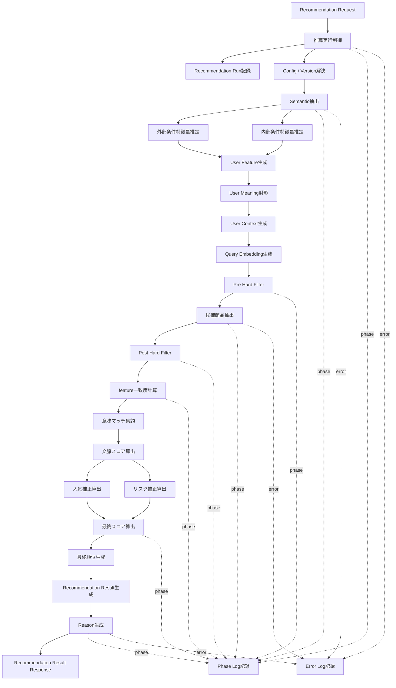

# Recoモジュール一覧

## 1. 概要

### 1.1 目的

本ドキュメントは、Gift Recommendation Service MVPにおける `reco` コンポーネントのモジュール一覧を定義する。

`モジュール一覧.md` では、web / api / reco / batch / database / object storage / devops を含む全体モジュールを整理している。  
本ドキュメントでは、そのうち `reco` が担当する推薦パイプライン関連モジュールを抜き出し、処理順序・責務・入出力・関連定義を詳細化する。

---

### 1.2 本ドキュメントの位置づけ

| 成果物 | 本ドキュメントとの関係 |
|---|---|
| モジュール一覧 | モジュール名・分類・責務の正本 |
| 機能×モジュール対応表 | 機能とRecoモジュールの対応関係の前提 |
| 処理構成定義書 | Online / Batch分離、処理順序の前提 |
| Retrieval定義書 | Pre Hard Filter / Retrieval / Post Hard Filterの前提 |
| Matching定義書 | Feature一致度、意味マッチ、context_score算出の前提 |
| Ranking定義書 | final_score、rank、補正計算の前提 |
| Reason生成定義書 | 推薦理由出力項目の前提 |
| Feature定義書 | User Feature / Item Featureの軸定義 |
| Featureルール定義書 | Feature値算出・正規化方針の前提 |
| Semantic Concept定義書 | Semantic抽出対象の前提 |
| Semanticルール定義書 | Semantic抽出・変換ルールの前提 |
| Gift Meaning Space定義書 | Social / Symbolic / λ_ctx算出の前提 |

---

### 1.3 正本関係

本ドキュメントは、`モジュール一覧.md` のReco部分を詳細化する派生成果物である。

したがって、モジュール名の正本は `モジュール一覧.md` とする。  
本ドキュメントで新しいRecoモジュールが必要になった場合は、先に `モジュール一覧.md` を更新する。

---

## 2. Recoコンポーネントの責務

### 2.1 Recoの基本責務

`reco` は、Recommendation Requestを受け取り、推薦結果を生成する推薦ドメイン処理コンポーネントである。

主な責務は以下である。

```text
ユーザー入力を意味情報へ変換する
User Featureを生成する
Gift Meaning Spaceへ射影する
候補商品を抽出する
User FeatureとItem Featureを照合する
最終スコアと順位を算出する
Recommendation Resultを生成する
推薦理由を生成する
推薦処理のRun / Phase / Errorを記録する
```

---

### 2.2 Recoが担当しない責務

| 対象 | Recoで担当しない理由 |
|---|---|
| 画面表示 | webの責務 |
| HTTP API受付 | apiの責務 |
| API入力Validation | apiの責務。ただしreco側でも防御的Validationは行う |
| 外部商品API取得 | batchの責務 |
| Raw JSON保存 | batch / object storageの責務 |
| Staging変換 | batchの責務 |
| Item反映 | batchの責務 |
| Batch起動制御 | devops / GitHub Actionsの責務 |
| CI実行 | devopsの責務 |

---

### 2.3 Recoが参照する主なデータ

| データ | 用途 |
|---|---|
| Recommendation Request | 推薦条件、贈答文脈、予算、好み、NG条件の入力 |
| Semantic Config | Semantic抽出・Feature生成ルールのVersion解決 |
| Model Version | LLM / Embedding / Reason生成モデルのVersion解決 |
| Item | 推薦対象商品の基本情報 |
| Item Feature | Matchingで利用する商品Feature |
| Item Embedding | Retrievalで利用する商品Embedding |
| Item Semantic | Semantic NG確認、Reason生成補助 |
| Ranking Config | final_score算出パラメータ |
| Reason Template | 推薦理由生成テンプレート |
| Recommendation Run | 推薦実行単位 |
| Phase Log | 処理段階別ログ |
| Error Log | エラー記録 |

---

## 3. Recoモジュール分類

| 分類 | 内容 |
|---|---|
| 実行制御 | Reco全体の処理順序と実行状態を制御する |
| 設定解決 | Semantic / Model / Ranking / Reason Templateの利用Versionを決定する |
| User Meaning | ユーザー入力をSemantic / Feature / Meaningへ変換する |
| Retrieval | 推薦候補商品を抽出し、除外条件を適用する |
| Matching | User FeatureとItem Featureの一致度を計算する |
| Ranking | 最終スコアと順位を決定する |
| 出力処理 | Recommendation ResultとReasonを生成する |
| ログ・観測 | Run / Phase / Error / Metricを記録する |
| 商品意味推定支援 | batchから呼び出される商品Semantic / Feature生成ロジックを提供する |

---

## 4. Recoモジュール一覧

| モジュール名 | 物理名 | 分類 | 主責務 | 処理種別 | MVP対象 |
|---|---|---|---|---|---:|
| 推薦実行制御 | Recommendation Orchestrator | 実行制御 | 推薦パイプライン全体の実行順序を制御する | OL | ○ |
| Config / Version解決 | Config Version Resolver | 設定解決 | 利用する設定・モデルVersionを決定する | 共通 | ○ |
| Semantic抽出 | Semantic Extractor | User Meaning | ユーザー入力からSemantic Conceptを抽出する | OL | ○ |
| 外部条件特徴量推定 | External Feature Estimator | User Meaning | relationship / occasionからFeatureを推定する | OL | ○ |
| 内部条件特徴量推定 | Internal Feature Estimator | User Meaning | preferred / non_preferred / free textからFeatureを推定する | OL | ○ |
| User Feature生成 | User Feature Generator | User Meaning | 外部条件・内部条件を統合してUser Featureを生成する | OL | ○ |
| User Meaning射影 | User Meaning Projector | User Meaning | User Featureからsocial / symbolic / λ_ctxを算出する | OL | ○ |
| User Context生成 | User Context Builder | User Meaning | Retrieval用のpreferred / non_preferred contextを生成する | OL | ○ |
| Query Embedding生成 | Query Embedding Builder | Retrieval | Retrieval用のquery embeddingを生成する | OL | ○ |
| Pre Hard Filter | Pre Hard Filter | Retrieval | Retrieval前に商品集合を絞り込む | OL | ○ |
| 候補商品抽出 | Candidate Retriever | Retrieval | Pre Hard Filter後の商品集合から候補商品を抽出する | OL | ○ |
| Post Hard Filter | Post Hard Filter | Retrieval | Retrieval後の候補からSemantic NG・重複・不整合を除外する | OL | ○ |
| feature一致度計算 | Feature-wise Matcher | Matching | User FeatureとItem FeatureをFeature単位で比較する | OL | ○ |
| 意味マッチ集約 | Meaning Match Aggregator | Matching | feature一致度からsocial_match / symbolic_matchを集約する | OL | ○ |
| 文脈スコア算出 | Context Score Calculator | Matching | context_scoreを算出する | OL | ○ |
| 人気補正算出 | Popularity Calculator | Ranking | popularity_scoreを算出する | OL | ○ |
| リスク補正算出 | Risk Penalty Calculator | Ranking | risk_penaltyを算出する | OL | ○ |
| 最終スコア算出 | Final Score Calculator | Ranking | final_scoreを算出する | OL | ○ |
| 最終順位生成 | Final Ranker | Ranking | 表示順位rankを決定する | OL | ○ |
| Recommendation Result生成 | Recommendation Result Builder | 出力処理 | recommendation_result / result_itemを生成する | OL | ○ |
| Reason生成 | Reason Generator | 出力処理 | 推薦理由を生成する | OL | ○ |
| Recommendation Run記録 | Recommendation Run Logger | ログ・観測 | 推薦実行単位を記録する | OL | ○ |
| Phase Log記録 | Phase Log Writer | ログ・観測 | 処理段階別の開始・終了・成功・失敗を記録する | 共通 | ○ |
| Error Log記録 | Error Log Writer | ログ・観測 | エラー内容、発生箇所、対象データを記録する | 共通 | ○ |
| Metric記録 | Metric Logger | ログ・観測 | 件数、処理時間、スコア分布等を記録する | 共通 | △ |
| Item Semantic抽出 | Item Semantic Extractor | 商品意味推定支援 | 商品情報からSemantic Conceptを抽出する | BT | ○ |
| Item Feature生成 | Item Feature Generator | 商品意味推定支援 | item_semantic等からItem Featureを生成する | BT | ○ |

---

## 5. Recoオンライン推薦フロー

### 5.1 全体フロー



---

### 5.2 処理順序

| 順序 | モジュール名 | 主な入力 | 主な出力 |
|---:|---|---|---|
| 1 | 推薦実行制御 | Recommendation Request | execution context |
| 2 | Recommendation Run記録 | execution context | recommendation_run |
| 3 | Config / Version解決 | request context | config_version / model_version |
| 4 | Semantic抽出 | request text / relationship / occasion | semantic_extraction_result |
| 5 | 外部条件特徴量推定 | relationship / occasion | external_feature_estimate |
| 6 | 内部条件特徴量推定 | preferred / non_preferred / free text | internal_feature_estimate |
| 7 | User Feature生成 | external_feature_estimate / internal_feature_estimate | user_feature |
| 8 | User Meaning射影 | user_feature | user_social / user_symbolic / λ_ctx |
| 9 | User Context生成 | semantic_extraction_result / user_feature | user_context |
| 10 | Query Embedding生成 | user_context | query_embedding |
| 11 | Pre Hard Filter | request / item / budget / ng条件 | pre_filtered_item_pool |
| 12 | 候補商品抽出 | query_embedding / item_embedding / pre_filtered_item_pool | retrieval_candidate |
| 13 | Post Hard Filter | retrieval_candidate / semantic NG / avoid条件 | validated_candidate |
| 14 | feature一致度計算 | user_feature / item_feature | feature_match |
| 15 | 意味マッチ集約 | feature_match | social_match / symbolic_match |
| 16 | 文脈スコア算出 | social_match / symbolic_match / λ_ctx | context_score |
| 17 | 人気補正算出 | item popularity signals | popularity_score |
| 18 | リスク補正算出 | item risk signals / request context | risk_penalty |
| 19 | 最終スコア算出 | context_score / popularity_score / risk_penalty | final_score |
| 20 | 最終順位生成 | final_score / diversity情報 | ranked_items |
| 21 | Recommendation Result生成 | ranked_items / score_breakdown | recommendation_result |
| 22 | Reason生成 | result_item / score_breakdown / context | recommendation_reason |

---

## 6. モジュール詳細

## 6.1 推薦実行制御

| 項目 | 内容 |
|---|---|
| モジュール名 | 推薦実行制御 |
| 物理名 | Recommendation Orchestrator |
| 分類 | 実行制御 |
| 処理種別 | OL |
| MVP対象 | ○ |
| 主な入力 | Recommendation Request |
| 主な出力 | Recommendation Result Response |
| 関連定義 | Recommendation Request定義書 / Recommendation Result定義書 |

### 主責務

- Reco処理全体の実行順序を制御する
- 実行モードを判定する
- 各モジュールに必要な入力を受け渡す
- Phase Log / Error Logの記録契機を管理する
- 正常終了時にRecommendation Resultを返却する
- 異常終了時にエラー情報を返却する

### 実行モード

| mode | 内容 |
|---|---|
| ui | 通常の画面操作からの推薦実行 |
| evaluation | Offline Evaluationからの推薦実行 |
| batch | Batch起点の内部検証・再実行用 |

---

## 6.2 Config / Version解決

| 項目 | 内容 |
|---|---|
| モジュール名 | Config / Version解決 |
| 物理名 | Config Version Resolver |
| 分類 | 設定解決 |
| 処理種別 | 共通 |
| MVP対象 | ○ |
| 主な入力 | request context / execution mode |
| 主な出力 | semantic_config_version / model_version / ranking_config / reason_template |
| 関連定義 | Semanticルール定義書 / Featureルール定義書 / Ranking定義書 / Reason生成定義書 |

### 主責務

- 推薦実行で利用する設定Versionを決定する
- Semantic抽出で利用するルールVersionを決定する
- Feature生成で利用するルールVersionを決定する
- Embedding / LLM / Reason生成モデルのVersionを決定する
- Rankingパラメータを決定する
- 推薦結果の再現性を担保するために利用Versionを後続へ引き渡す

---

## 6.3 Semantic抽出

| 項目 | 内容 |
|---|---|
| モジュール名 | Semantic抽出 |
| 物理名 | Semantic Extractor |
| 分類 | User Meaning |
| 処理種別 | OL |
| MVP対象 | ○ |
| 主な入力 | preferred_text / non_preferred_text / relationship / occasion |
| 主な出力 | semantic_extraction_result |
| 関連定義 | Semantic Concept定義書 / Semanticルール定義書 |

### 主責務

- ユーザー入力からSemantic Conceptを抽出する
- preferred条件とnon_preferred条件を区別する
- free textから意味的な手がかりを抽出する
- relationship / occasionから意味文脈を補助的に解釈する
- 後続のFeature推定・User Context生成へ結果を渡す

### 注意点

`non_preferred` は「避けたい傾向」であり、必ず除外する `NG条件` とは区別する。  
明確なNG条件はPre Hard FilterまたはPost Hard Filterで扱う。

---

## 6.4 外部条件特徴量推定

| 項目 | 内容 |
|---|---|
| モジュール名 | 外部条件特徴量推定 |
| 物理名 | External Feature Estimator |
| 分類 | User Meaning |
| 処理種別 | OL |
| MVP対象 | ○ |
| 主な入力 | relationship / occasion |
| 主な出力 | external_feature_estimate |
| 関連定義 | Feature定義書 / Featureルール定義書 |

### 主責務

- relationshipから贈答関係性に応じたFeature傾向を推定する
- occasionから贈答用途に応じたFeature傾向を推定する
- formality / safety / brand_appropriateness等の外部文脈Featureを推定する

---

## 6.5 内部条件特徴量推定

| 項目 | 内容 |
|---|---|
| モジュール名 | 内部条件特徴量推定 |
| 物理名 | Internal Feature Estimator |
| 分類 | User Meaning |
| 処理種別 | OL |
| MVP対象 | ○ |
| 主な入力 | preferred_text / non_preferred_text / semantic_extraction_result |
| 主な出力 | internal_feature_estimate |
| 関連定義 | Semantic Concept定義書 / Featureルール定義書 |

### 主責務

- preferred条件から重視したいFeature傾向を推定する
- non_preferred条件から避けたいFeature傾向を推定する
- Semantic ConceptとFeature補正値を対応付ける
- User Feature生成へ内部条件由来のFeature推定結果を渡す

---

## 6.6 User Feature生成

| 項目 | 内容 |
|---|---|
| モジュール名 | User Feature生成 |
| 物理名 | User Feature Generator |
| 分類 | User Meaning |
| 処理種別 | OL |
| MVP対象 | ○ |
| 主な入力 | external_feature_estimate / internal_feature_estimate |
| 主な出力 | user_feature |
| 関連定義 | Feature定義書 / Featureルール定義書 |

### 主責務

- 外部条件Featureと内部条件Featureを統合する
- 8次元のUser Featureを生成する
- Feature値を0.0〜1.0の範囲に正規化する
- 単純clipではなく、sigmoid系の正規化方針を前提とする

### 対象Feature

| 区分 | Feature |
|---|---|
| Social | formality |
| Social | safety |
| Social | brand_appropriateness |
| Symbolic | emotion |
| Symbolic | novelty |
| Symbolic | intimacy |
| Symbolic | symbolic_identity |
| Symbolic | story_richness |

---

## 6.7 User Meaning射影

| 項目 | 内容 |
|---|---|
| モジュール名 | User Meaning射影 |
| 物理名 | User Meaning Projector |
| 分類 | User Meaning |
| 処理種別 | OL |
| MVP対象 | ○ |
| 主な入力 | user_feature |
| 主な出力 | user_social / user_symbolic / λ_ctx |
| 関連定義 | Gift Meaning Space定義書 |

### 主責務

- User FeatureをGift Meaning Spaceへ射影する
- Social方向の強さを算出する
- Symbolic方向の強さを算出する
- 贈答リスク許容度である `λ_ctx` を算出する
- Rankingや多様性制御に利用する補正係数を後続へ渡す

---

## 6.8 User Context生成

| 項目 | 内容 |
|---|---|
| モジュール名 | User Context生成 |
| 物理名 | User Context Builder |
| 分類 | User Meaning / Retrieval |
| 処理種別 | OL |
| MVP対象 | ○ |
| 主な入力 | semantic_extraction_result / user_feature / preferred条件 / non_preferred条件 |
| 主な出力 | user_context |
| 関連定義 | Retrieval定義書 / Semanticルール定義書 |

### 主責務

- Retrievalで利用する検索文脈を生成する
- preferred contextを生成する
- non_preferred contextを生成する
- NG条件とは分離して扱う
- Query Embedding生成へ検索文脈を渡す

---

## 6.9 Query Embedding生成

| 項目 | 内容 |
|---|---|
| モジュール名 | Query Embedding生成 |
| 物理名 | Query Embedding Builder |
| 分類 | Retrieval |
| 処理種別 | OL |
| MVP対象 | ○ |
| 主な入力 | user_context |
| 主な出力 | query_embedding |
| 関連定義 | Retrieval定義書 |

### 主責務

- user_contextから検索用Embeddingを生成する
- preferred context用のEmbeddingを生成する
- 必要に応じてnon_preferred context用のEmbeddingを生成する
- Model Version管理で解決されたEmbeddingモデルを利用する

---

## 6.10 Pre Hard Filter

| 項目 | 内容 |
|---|---|
| モジュール名 | Pre Hard Filter |
| 物理名 | Pre Hard Filter |
| 分類 | Retrieval |
| 処理種別 | OL |
| MVP対象 | ○ |
| 主な入力 | Recommendation Request / item / budget条件 / ng条件 |
| 主な出力 | pre_filtered_item_pool |
| 関連定義 | Retrieval定義書 / Recommendation Request定義書 |

### 主責務

- Retrieval前に対象商品集合を絞り込む
- 予算条件で絞り込む
- 商品有効状態で絞り込む
- 販売状態で絞り込む
- 明確なNG条件で除外する
- データ品質最低条件を満たさない商品を除外する

### 注意点

Pre Hard Filterは、検索性能を確保するためにRetrieval前に実行する。  
全商品に対してEmbedding検索や類似度計算を行うことを避ける。

---

## 6.11 候補商品抽出

| 項目 | 内容 |
|---|---|
| モジュール名 | 候補商品抽出 |
| 物理名 | Candidate Retriever |
| 分類 | Retrieval |
| 処理種別 | OL |
| MVP対象 | ○ |
| 主な入力 | pre_filtered_item_pool / query_embedding / item_embedding |
| 主な出力 | retrieval_candidate |
| 関連定義 | Retrieval定義書 |

### 主責務

- Pre Hard Filter後の商品集合を対象に候補商品を抽出する
- Embedding類似度検索を行う
- 必要に応じてキーワード検索・Hybrid検索を行う
- 後続のPost Hard Filterへ候補商品を渡す

---

## 6.12 Post Hard Filter

| 項目 | 内容 |
|---|---|
| モジュール名 | Post Hard Filter |
| 物理名 | Post Hard Filter |
| 分類 | Retrieval |
| 処理種別 | OL |
| MVP対象 | ○ |
| 主な入力 | retrieval_candidate / semantic_extraction_result / item_semantic |
| 主な出力 | validated_candidate / excluded_candidate_log |
| 関連定義 | Retrieval定義書 / Semanticルール定義書 |

### 主責務

- Retrieval後の候補に対して最終除外を行う
- Semantic NGを確認する
- avoid条件との近さを確認する
- 重複候補を除外する
- データ不整合を確認する
- 表示候補として利用可能な候補商品へ整える

---

## 6.13 feature一致度計算

| 項目 | 内容 |
|---|---|
| モジュール名 | feature一致度計算 |
| 物理名 | Feature-wise Matcher |
| 分類 | Matching |
| 処理種別 | OL |
| MVP対象 | ○ |
| 主な入力 | user_feature / item_feature / validated_candidate |
| 主な出力 | feature_match |
| 関連定義 | Matching定義書 / Feature定義書 |

### 主責務

- User FeatureとItem FeatureをFeature単位で比較する
- 各Featureの距離または一致度を計算する
- 後続の意味マッチ集約に渡す

---

## 6.14 意味マッチ集約

| 項目 | 内容 |
|---|---|
| モジュール名 | 意味マッチ集約 |
| 物理名 | Meaning Match Aggregator |
| 分類 | Matching |
| 処理種別 | OL |
| MVP対象 | ○ |
| 主な入力 | feature_match |
| 主な出力 | social_match / symbolic_match |
| 関連定義 | Matching定義書 / Gift Meaning Space定義書 |

### 主責務

- Feature単位の一致度をSocial / Symbolic単位へ集約する
- social_matchを算出する
- symbolic_matchを算出する
- 文脈スコア算出へ渡す

---

## 6.15 文脈スコア算出

| 項目 | 内容 |
|---|---|
| モジュール名 | 文脈スコア算出 |
| 物理名 | Context Score Calculator |
| 分類 | Matching |
| 処理種別 | OL |
| MVP対象 | ○ |
| 主な入力 | social_match / symbolic_match / λ_ctx |
| 主な出力 | context_score |
| 関連定義 | Matching定義書 / Ranking定義書 |

### 主責務

- social_matchとsymbolic_matchを統合する
- ユーザー文脈に応じてSocial / Symbolicの重みを調整する
- Rankingの主要入力であるcontext_scoreを算出する

---

## 6.16 人気補正算出

| 項目 | 内容 |
|---|---|
| モジュール名 | 人気補正算出 |
| 物理名 | Popularity Calculator |
| 分類 | Ranking |
| 処理種別 | OL |
| MVP対象 | ○ |
| 主な入力 | item popularity signals |
| 主な出力 | popularity_score |
| 関連定義 | Ranking定義書 |

### 主責務

- レビュー評価、レビュー件数、ランキング情報等をもとに人気補正を算出する
- 安全寄りの贈答文脈では人気補正を相対的に重視できるようにする

---

## 6.17 リスク補正算出

| 項目 | 内容 |
|---|---|
| モジュール名 | リスク補正算出 |
| 物理名 | Risk Penalty Calculator |
| 分類 | Ranking |
| 処理種別 | OL |
| MVP対象 | ○ |
| 主な入力 | item risk signals / request context / safety feature |
| 主な出力 | risk_penalty |
| 関連定義 | Ranking定義書 |

### 主責務

- 贈答失敗リスクを補正値として算出する
- 文脈に対して尖りすぎた商品を減点する
- NG条件やavoid条件に近い商品を減点する
- safetyやformalityが重要な文脈ではリスク補正を強める

---

## 6.18 最終スコア算出

| 項目 | 内容 |
|---|---|
| モジュール名 | 最終スコア算出 |
| 物理名 | Final Score Calculator |
| 分類 | Ranking |
| 処理種別 | OL |
| MVP対象 | ○ |
| 主な入力 | context_score / popularity_score / risk_penalty / diversity情報 |
| 主な出力 | final_score |
| 関連定義 | Ranking定義書 |

### 主責務

- context_scoreを主軸に最終スコアを算出する
- popularity_scoreを加味する
- risk_penaltyを加味する
- 必要に応じて多様性調整を反映する
- score_breakdownを生成できる形で計算結果を保持する

---

## 6.19 最終順位生成

| 項目 | 内容 |
|---|---|
| モジュール名 | 最終順位生成 |
| 物理名 | Final Ranker |
| 分類 | Ranking |
| 処理種別 | OL |
| MVP対象 | ○ |
| 主な入力 | final_score / candidate items |
| 主な出力 | ranked_items |
| 関連定義 | Ranking定義書 |

### 主責務

- final_scoreに基づいて商品を並び替える
- 表示順位rankを決定する
- 必要に応じて同一カテゴリ・類似商品の偏りを調整する
- Recommendation Result生成へranked_itemsを渡す

---

## 6.20 Recommendation Result生成

| 項目 | 内容 |
|---|---|
| モジュール名 | Recommendation Result生成 |
| 物理名 | Recommendation Result Builder |
| 分類 | 出力処理 |
| 処理種別 | OL |
| MVP対象 | ○ |
| 主な入力 | ranked_items / score_breakdown / request context |
| 主な出力 | recommendation_result / recommendation_result_item |
| 関連定義 | Recommendation Result定義書 |

### 主責務

- 推薦結果ヘッダを生成する
- 推薦結果明細を生成する
- item snapshotを保持する
- final_score、rank、score_breakdownを保存可能な形に整える
- Reason生成へ結果情報を渡す

---

## 6.21 Reason生成

| 項目 | 内容 |
|---|---|
| モジュール名 | Reason生成 |
| 物理名 | Reason Generator |
| 分類 | 出力処理 |
| 処理種別 | OL |
| MVP対象 | ○ |
| 主な入力 | recommendation_result_item / score_breakdown / relationship / occasion / item data |
| 主な出力 | recommendation_reason |
| 関連定義 | Reason生成定義書 |

### 主責務

- 商品ごとの推薦理由を生成する
- UI表示用のreason_badgesを生成する
- 商品カード用のreason_summaryを生成する
- 詳細表示用のreason_detailを生成する
- 箇条書きのreason_pointsを生成する
- 必要に応じてcaution_noteを生成する

### UI表示対象

| 出力項目 | 内容 |
|---|---|
| reason_badges | 推薦理由を短く表すラベル |
| reason_summary | 商品カード上に表示する短い推薦理由 |
| reason_detail | 詳細表示用の推薦理由 |
| reason_points | 箇条書きの推薦理由 |
| caution_note | 必要に応じた補足・注意文 |

---

## 6.22 ログ・観測モジュール

### 6.22.1 Recommendation Run記録

| 項目 | 内容 |
|---|---|
| モジュール名 | Recommendation Run記録 |
| 物理名 | Recommendation Run Logger |
| 分類 | ログ・観測 |
| 処理種別 | OL |
| MVP対象 | ○ |
| 主な入力 | request_id / execution context |
| 主な出力 | recommendation_run |

#### 主責務

- 推薦実行単位を記録する
- Request、Result、Phase Log、Error Logを紐づける基点を作る

---

### 6.22.2 Phase Log記録

| 項目 | 内容 |
|---|---|
| モジュール名 | Phase Log記録 |
| 物理名 | Phase Log Writer |
| 分類 | ログ・観測 |
| 処理種別 | 共通 |
| MVP対象 | ○ |
| 主な入力 | phase_name / status / started_at / ended_at |
| 主な出力 | phase_log |

#### 記録対象Phase

```text
Config / Version解決
Semantic抽出
User Feature生成
User Meaning射影
User Context生成
Query Embedding生成
Pre Hard Filter
候補商品抽出
Post Hard Filter
Matching
Ranking
Recommendation Result生成
Reason生成
```

---

### 6.22.3 Error Log記録

| 項目 | 内容 |
|---|---|
| モジュール名 | Error Log記録 |
| 物理名 | Error Log Writer |
| 分類 | ログ・観測 |
| 処理種別 | 共通 |
| MVP対象 | ○ |
| 主な入力 | error_type / error_message / target_id / stack trace |
| 主な出力 | error_log |

#### 主責務

- エラー内容を記録する
- 発生Phaseを記録する
- request_id / run_id / item_id等の対象情報を記録する
- 再実行・調査に必要な情報を残す

---

### 6.22.4 Metric記録

| 項目 | 内容 |
|---|---|
| モジュール名 | Metric記録 |
| 物理名 | Metric Logger |
| 分類 | ログ・観測 |
| 処理種別 | 共通 |
| MVP対象 | △ |
| 主な入力 | latency / count / score distribution |
| 主な出力 | metric_log |

#### 主責務

- 処理時間を記録する
- 候補件数を記録する
- スコア分布を記録する
- Feature分布やRanking結果の確認材料を残す

---

## 6.23 商品意味推定支援モジュール

### 6.23.1 Item Semantic抽出

| 項目 | 内容 |
|---|---|
| モジュール名 | Item Semantic抽出 |
| 物理名 | Item Semantic Extractor |
| 分類 | 商品意味推定支援 |
| 処理種別 | BT |
| MVP対象 | ○ |
| 主な入力 | item text / metadata / review signals |
| 主な出力 | item_semantic |
| 関連定義 | Semantic Concept定義書 / Semanticルール定義書 |

#### 位置づけ

Item Semantic抽出は、実行タイミングとしてはbatch処理である。  
ただし、Semantic抽出ロジックはRecoドメインに近いため、reco側の共通ロジックとして実装し、batchから呼び出す構成を許容する。

---

### 6.23.2 Item Feature生成

| 項目 | 内容 |
|---|---|
| モジュール名 | Item Feature生成 |
| 物理名 | Item Feature Generator |
| 分類 | 商品意味推定支援 |
| 処理種別 | BT |
| MVP対象 | ○ |
| 主な入力 | item_semantic / item metadata |
| 主な出力 | item_feature |
| 関連定義 | Feature定義書 / Featureルール定義書 |

#### 位置づけ

Item Feature生成は、Online推薦の事前準備としてbatchで実行される。  
Online推薦時のMatchingでは、生成済みのItem Featureを参照する。

---

## 7. Reco外部インターフェース

### 7.1 api → reco

| 接続 | 内容 |
|---|---|
| 呼び出し元 | api |
| 呼び出し先 | reco |
| 主な入口 | 推薦実行制御 |
| 主な入力 | Recommendation Request |
| 主な出力 | Recommendation Result Response |
| 想定方式 | Internal HTTP / HTTPS |

---

### 7.2 reco → database

| 用途 | 関連モジュール | 主な対象 |
|---|---|---|
| 設定参照 | Config / Version解決 | semantic_config / model_version / ranking_config |
| 商品参照 | Pre Hard Filter / 候補商品抽出 | item / item_feature / item_embedding |
| 結果保存 | Recommendation Result生成 | recommendation_result / recommendation_result_item |
| 理由保存 | Reason生成 | recommendation_reason |
| ログ保存 | Recommendation Run記録 / Phase Log記録 / Error Log記録 | recommendation_run / phase_log / error_log |

---

### 7.3 reco → external AI API

| 用途 | 関連モジュール |
|---|---|
| Semantic抽出補助 | Semantic抽出 |
| Query Embedding生成 | Query Embedding生成 |
| Reason生成補助 | Reason生成 |

---

### 7.4 batch → reco

| 用途 | 関連モジュール | 内容 |
|---|---|---|
| 商品Semantic生成 | Item Semantic抽出 | batchからreco側ロジックを呼び出す |
| 商品Feature生成 | Item Feature生成 | batchからreco側ロジックを呼び出す |
| Offline Evaluation | 推薦実行制御 | evaluation modeで推薦処理を実行する |

---

## 8. Reco内部データフロー

### 8.1 Online推薦データフロー

```text
Recommendation Request
↓
semantic_extraction_result
↓
user_feature
↓
user_social / user_symbolic / λ_ctx
↓
user_context
↓
query_embedding
↓
pre_filtered_item_pool
↓
retrieval_candidate
↓
validated_candidate
↓
feature_match
↓
social_match / symbolic_match
↓
context_score
↓
final_score
↓
ranked_items
↓
recommendation_result / recommendation_result_item
↓
recommendation_reason
```

---

### 8.2 スコア系データフロー

```text
user_feature + item_feature
↓
feature_match
↓
social_match / symbolic_match
↓
context_score
↓
context_score + popularity_score - risk_penalty
↓
final_score
↓
rank
```

---

### 8.3 ログ系データフロー

```text
Recommendation Request
↓
Recommendation Run記録
↓
各Phase開始・終了
↓
Phase Log記録
↓
異常発生時
↓
Error Log記録
```

---

## 9. Recoモジュール境界

### 9.1 Online処理に含めるもの

| モジュール | 理由 |
|---|---|
| Semantic抽出 | ユーザー入力ごとに変わるため |
| User Feature生成 | ユーザー入力ごとに変わるため |
| User Meaning射影 | ユーザー文脈ごとに変わるため |
| User Context生成 | Retrieval条件がリクエストごとに変わるため |
| Query Embedding生成 | 検索文脈がリクエストごとに変わるため |
| Pre Hard Filter | 予算・NG条件がリクエストごとに変わるため |
| 候補商品抽出 | リクエストごとに候補が変わるため |
| Post Hard Filter | リクエストごとのsemantic NG確認が必要なため |
| Matching | User Featureとの比較が必要なため |
| Ranking | リクエスト文脈に応じた順位決定が必要なため |
| Reason生成 | 推薦結果ごとの説明が必要なため |

---

### 9.2 Online処理に含めないもの

| モジュール | 理由 |
|---|---|
| 商品データ取得 | 外部APIアクセスは重く、Online処理に含めない |
| Raw商品データ保存 | 事前Batch処理で行う |
| Staging変換 | 事前Batch処理で行う |
| Item反映 | 事前Batch処理で行う |
| Item Embedding生成 | 事前Batch処理で行う |
| Embedding保存 | 事前Batch処理で行う |
| Offline Evaluation実行 | ユーザー同期処理ではない |

---

## 10. MVP対象範囲

### 10.1 MVP必須Recoモジュール

| 分類 | モジュール |
|---|---|
| 実行制御 | 推薦実行制御 |
| 設定解決 | Config / Version解決 |
| User Meaning | Semantic抽出、外部条件特徴量推定、内部条件特徴量推定、User Feature生成、User Meaning射影、User Context生成 |
| Retrieval | Query Embedding生成、Pre Hard Filter、候補商品抽出、Post Hard Filter |
| Matching | feature一致度計算、意味マッチ集約、文脈スコア算出 |
| Ranking | 人気補正算出、リスク補正算出、最終スコア算出、最終順位生成 |
| 出力処理 | Recommendation Result生成、Reason生成 |
| ログ・観測 | Recommendation Run記録、Phase Log記録、Error Log記録 |
| 商品意味推定支援 | Item Semantic抽出、Item Feature生成 |

---

### 10.2 MVPでは簡易実装でよいRecoモジュール

| モジュール | 方針 |
|---|---|
| Metric記録 | 初期は処理時間・候補件数・0件発生のみでもよい |
| Ranking Config管理 | 初期は固定値または設定ファイルでもよい |
| Reason Template管理 | 初期は少数テンプレートまたは固定テンプレートでもよい |
| Item Semantic抽出 | 初期は商品名・キャッチコピー・説明・ジャンル中心でよい |
| Item Feature生成 | 初期はルールベース中心でよい |

---

## 11. 後続成果物への引き継ぎ

### 11.1 Recoモジュール別入出力定義への引き継ぎ

次工程では、以下の項目をモジュール単位で定義する。

| 項目 | 内容 |
|---|---|
| 入力データ | 受け取るデータ構造 |
| 出力データ | 後続へ渡すデータ構造 |
| 参照データ | DB・設定・外部APIから参照するデータ |
| 保存データ | DBへ保存するデータ |
| 例外 | 発生しうるエラー |
| ログ | 記録するPhase Log / Error Log |
| 冪等性 | 再実行時の扱い |
| テスト観点 | 単体・結合テスト観点 |

---

### 11.2 API一覧への引き継ぎ

| API | 関連Recoモジュール |
|---|---|
| レコメンド実行API | 推薦実行制御 |
| reco推薦実行依頼 | 推薦実行制御 / Config / Version解決 |
| レコメンド結果返却 | Recommendation Result生成 / Reason生成 |

---

### 11.3 バッチ一覧への引き継ぎ

| Batch | 関連Recoモジュール |
|---|---|
| Item Semantic生成Batch | Item Semantic抽出 |
| Item Feature生成Batch | Item Feature生成 |
| Offline Evaluation Batch | 推薦実行制御 / Matching / Ranking / Reason生成 |

---

### 11.4 インターフェース一覧への引き継ぎ

| 接続 | 関連Recoモジュール |
|---|---|
| api → reco | 推薦実行制御 |
| reco → database | Config / Version解決、Pre Hard Filter、候補商品抽出、Matching、Ranking、Result生成、Reason生成 |
| reco → external AI API | Semantic抽出、Query Embedding生成、Reason生成 |
| batch → reco | Item Semantic抽出、Item Feature生成、Offline Evaluation |

---

## 12. レビュー観点

| 観点 | 確認内容 |
|---|---|
| 処理順序 | Semantic → Feature → Context → Embedding → Pre Hard Filter → Retrieval → Post Hard Filter → Matching → Ranking → Result → Reasonになっているか |
| 責務境界 | api / batch / recoの責務が混在していないか |
| Retrieval性能 | Pre Hard FilterがRetrieval前に配置されているか |
| NG条件扱い | NG条件、non_preferred、avoid条件が混同されていないか |
| Feature整合 | User Feature / Item Featureが同じ8次元で比較されるか |
| Ranking整合 | context_score、popularity_score、risk_penalty、final_scoreの流れが明確か |
| Reason整合 | Reason生成定義書の出力項目が表示対象になっているか |
| ログ | Run / Phase / ErrorがReco内で記録できるか |
| Batch連携 | Item Semantic / Item Feature生成をbatchから利用できるか |
| 後続展開 | Recoモジュール別入出力定義へ展開できる粒度か |

---

## 13. まとめ

Recoコンポーネントは、Gift Recommendation Service MVPの中核であり、以下の推薦パイプラインを担当する。

```text
Recommendation Request
↓
Semantic抽出
↓
User Feature生成
↓
User Meaning射影
↓
User Context生成
↓
Query Embedding生成
↓
Pre Hard Filter
↓
候補商品抽出
↓
Post Hard Filter
↓
Matching
↓
Ranking
↓
Recommendation Result生成
↓
Reason生成
```

本ドキュメントでは、上記処理を実現するRecoモジュールを、以下の分類で整理した。

```text
実行制御
設定解決
User Meaning
Retrieval
Matching
Ranking
出力処理
ログ・観測
商品意味推定支援
```

本ドキュメントをもとに、次工程では `Recoモジュール別入出力定義` を作成し、各モジュールの入力・出力・参照データ・保存データ・例外・ログを詳細化する。