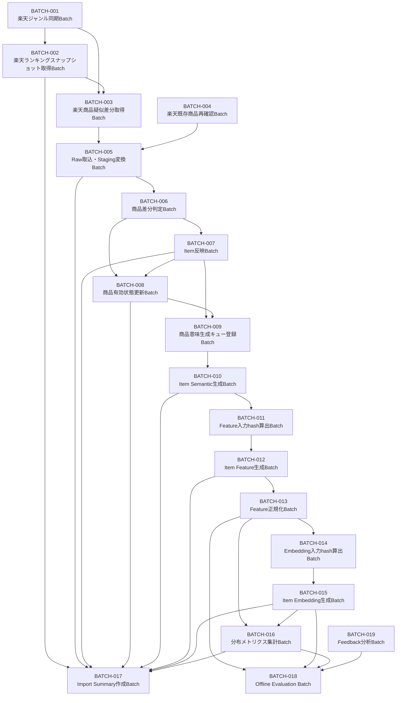
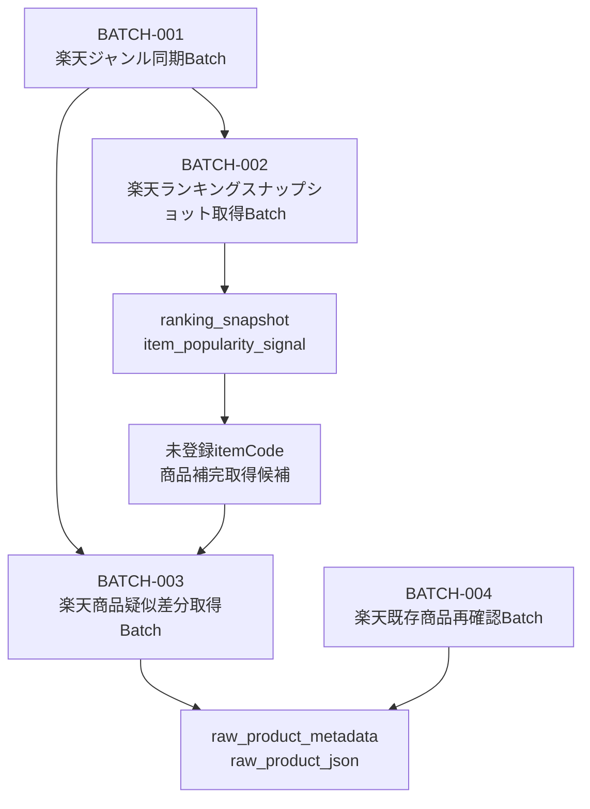
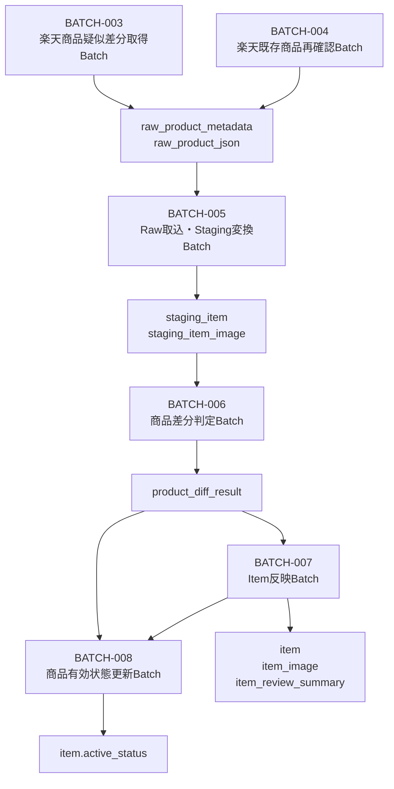
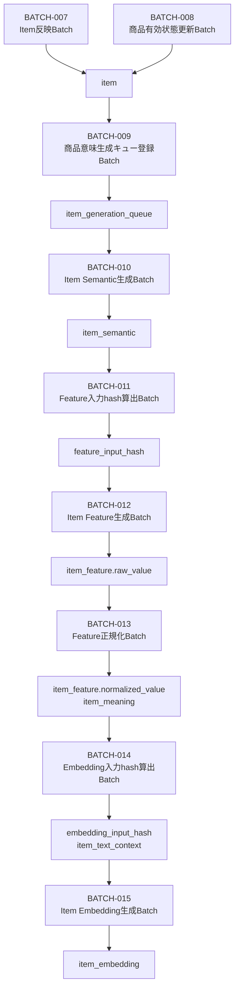
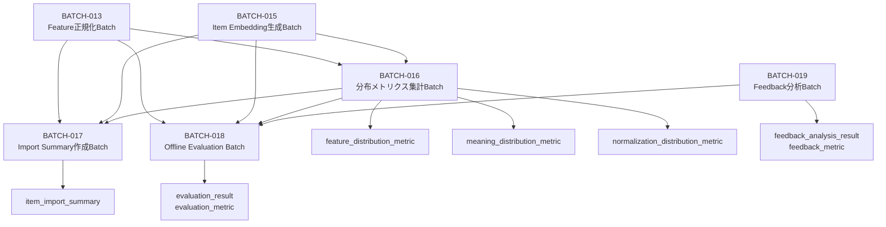
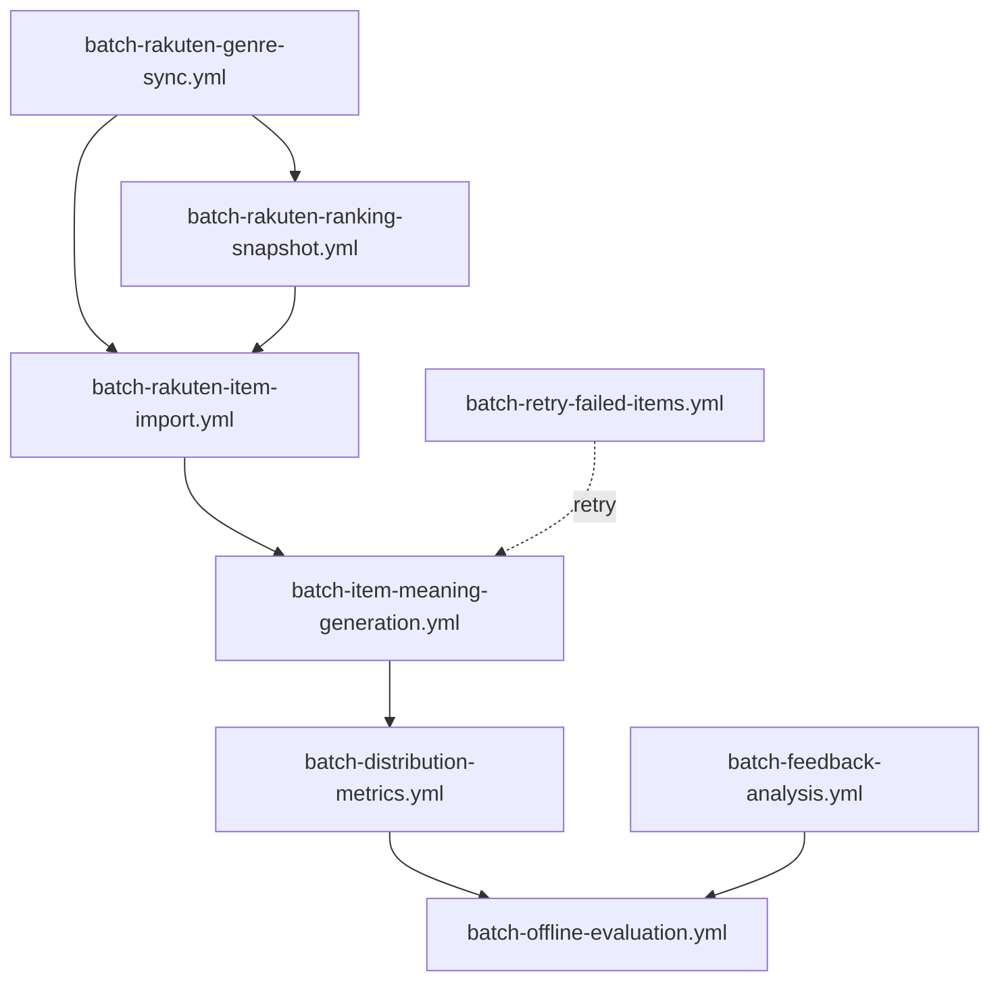

# バッチ依存関係図

## 1. 目的

本ドキュメントは、Gift Recommendation Service MVP におけるバッチ処理間の依存関係を定義する。

バッチ一覧では、各Batch Jobの役割・入出力・更新リソース・冪等キーを整理した。
本ドキュメントでは、それらのBatch Jobについて、以下を明確にする。

- どのBatchがどのBatchに先行するか
- どのBatchが後続Batchの入力を生成するか
- 必須依存と任意依存の違い
- 再実行時にどこから再開できるか
- GitHub Actions workflow分割時の実行順序

---

## 2. 依存関係の考え方

### 2.1 依存関係の分類

| 依存区分     | 意味                                                                            | 例                                        |
| ------------ | ------------------------------------------------------------------------------- | ----------------------------------------- |
| 必須依存     | 後続Batchの入力が先行Batchで生成されるため、先行Batchが成功しないと実行できない | Raw取込 → 商品差分判定                    |
| 条件付き依存 | 条件に該当するデータがある場合のみ後続Batchを実行する                           | 商品意味影響差分あり → Item Semantic生成  |
| 任意依存     | 品質向上・補完・運用上は望ましいが、必須ではない                                | ランキング内未登録itemCode → 商品補完取得 |
| 集計依存     | 複数Batchの結果を集約する依存                                                   | 各Batch → Import Summary作成              |
| 評価依存     | 評価・分析のために利用する依存。本番推薦の前提ではない                          | Feature生成後 → Offline Evaluation        |

---

## 3. 全体依存関係図



---

## 4. 工程別依存関係図

## 4.1 外部商品データ取得系



### 補足

| 関係                  | 依存区分 | 説明                                                     |
| --------------------- | -------- | -------------------------------------------------------- |
| BATCH-001 → BATCH-002 | 必須依存 | ランキング取得対象ジャンルを管理するため                 |
| BATCH-001 → BATCH-003 | 必須依存 | 商品取得対象ジャンルを管理するため                       |
| BATCH-002 → BATCH-003 | 任意依存 | ランキング内の未登録itemCodeを商品補完取得候補にするため |
| BATCH-004 → BATCH-005 | 必須依存 | 既存商品再確認結果もRawとしてStaging変換対象になるため   |

---

## 4.2 Raw / Staging / Item反映系



### 補足

| 関係                              | 依存区分     | 説明                                         |
| --------------------------------- | ------------ | -------------------------------------------- |
| BATCH-003 / BATCH-004 → BATCH-005 | 必須依存     | RawがないとStaging変換できない               |
| BATCH-005 → BATCH-006             | 必須依存     | staging_itemがないと差分判定できない         |
| BATCH-006 → BATCH-007             | 必須依存     | product_diff_resultに基づいてItem反映する    |
| BATCH-006 → BATCH-008             | 必須依存     | unavailable判定をactive_status更新に使う     |
| BATCH-007 → BATCH-008             | 条件付き依存 | Item反映後に有効状態を最終判定する場合がある |

---

## 4.3 Item Semantic / Feature / Embedding生成系



### 補足

| 関係                              | 依存区分     | 説明                                                                        |
| --------------------------------- | ------------ | --------------------------------------------------------------------------- |
| BATCH-007 / BATCH-008 → BATCH-009 | 条件付き依存 | 意味生成対象Itemのみキュー登録する                                          |
| BATCH-009 → BATCH-010             | 必須依存     | item_generation_queueがSemantic生成対象を管理する                           |
| BATCH-010 → BATCH-011             | 必須依存     | item_semanticをFeature入力hashに含めるため                                  |
| BATCH-011 → BATCH-012             | 必須依存     | feature_input_hashでFeature再生成要否を判定するため                         |
| BATCH-012 → BATCH-013             | 必須依存     | raw_valueがないと正規化できない                                             |
| BATCH-013 → BATCH-014             | 条件付き依存 | Embedding入力にsemantic conceptや正規化済み情報を含める設計の場合に依存する |
| BATCH-014 → BATCH-015             | 必須依存     | embedding_input_hashでEmbedding再生成要否を判定するため                     |

---

## 4.4 分布メトリクス・Summary・評価系



### 補足

| 関係                                          | 依存区分     | 説明                                               |
| --------------------------------------------- | ------------ | -------------------------------------------------- |
| BATCH-013 → BATCH-016                         | 必須依存     | Feature / Meaning分布を集計するため                |
| BATCH-015 → BATCH-016                         | 任意依存     | Embedding生成状況を分布・件数監視に含める場合      |
| 各Batch → BATCH-017                           | 集計依存     | Batch実行結果をSummary化する                       |
| BATCH-013 / BATCH-015 / BATCH-016 → BATCH-018 | 評価依存     | 推薦評価にFeature / Embedding / 分布情報を使うため |
| BATCH-019 → BATCH-018                         | 任意評価依存 | Feedback分析結果を評価観点に反映する場合           |

---

## 5. 依存関係一覧

| 先行Batch   | 後続Batch | 依存区分     | 依存理由                                              | 主な受け渡しデータ                       |
| ----------- | --------- | ------------ | ----------------------------------------------------- | ---------------------------------------- |
| BATCH-001   | BATCH-002 | 必須依存     | ランキング取得対象ジャンルを解決するため              | external_genre                           |
| BATCH-001   | BATCH-003 | 必須依存     | 商品取得対象ジャンルを解決するため                    | external_genre                           |
| BATCH-002   | BATCH-003 | 任意依存     | ランキング内未登録itemCodeを商品補完取得するため      | external_item_code                       |
| BATCH-003   | BATCH-005 | 必須依存     | 商品RawをStaging変換するため                          | raw_product_metadata / raw_product_json  |
| BATCH-004   | BATCH-005 | 必須依存     | 既存商品再確認RawをStaging変換するため                | raw_product_metadata / raw_product_json  |
| BATCH-005   | BATCH-006 | 必須依存     | staging_itemを差分判定するため                        | staging_item / normalized_hash           |
| BATCH-006   | BATCH-007 | 必須依存     | 差分判定結果に基づきItem反映するため                  | product_diff_result                      |
| BATCH-006   | BATCH-008 | 必須依存     | unavailable候補をactive_statusへ反映するため          | product_diff_result                      |
| BATCH-007   | BATCH-008 | 条件付き依存 | Item反映後に有効状態を最終更新するため                | item                                     |
| BATCH-007   | BATCH-009 | 条件付き依存 | 意味生成対象Itemをキュー登録するため                  | item / product_diff_result               |
| BATCH-008   | BATCH-009 | 条件付き依存 | activeなItemのみ意味生成対象にするため                | item.active_status                       |
| BATCH-009   | BATCH-010 | 必須依存     | キュー登録されたItemをSemantic生成するため            | item_generation_queue                    |
| BATCH-010   | BATCH-011 | 必須依存     | item_semanticをFeature入力hashに含めるため            | item_semantic                            |
| BATCH-011   | BATCH-012 | 必須依存     | Feature再生成判定にfeature_input_hashが必要なため     | feature_input_hash                       |
| BATCH-012   | BATCH-013 | 必須依存     | raw Featureを正規化するため                           | item_feature.raw_value                   |
| BATCH-013   | BATCH-014 | 条件付き依存 | Embedding入力構築にFeature / Semantic情報を使う場合   | item_meaning / semantic concept          |
| BATCH-014   | BATCH-015 | 必須依存     | Embedding再生成判定にembedding_input_hashが必要なため | embedding_input_hash / item_text_context |
| BATCH-013   | BATCH-016 | 必須依存     | Feature / Meaning分布を集計するため                   | item_feature / item_meaning              |
| BATCH-015   | BATCH-016 | 任意依存     | Embedding生成状況を監視するため                       | item_embedding                           |
| 各主要Batch | BATCH-017 | 集計依存     | 実行結果・件数・失敗をSummary化するため               | logs / result counts                     |
| BATCH-013   | BATCH-018 | 評価依存     | 推薦評価にFeatureを使うため                           | item_feature                             |
| BATCH-015   | BATCH-018 | 評価依存     | Retrieval評価にEmbeddingを使うため                    | item_embedding                           |
| BATCH-016   | BATCH-018 | 評価依存     | 分布異常や品質評価に使うため                          | distribution metrics                     |
| BATCH-019   | BATCH-018 | 任意評価依存 | Feedback分析結果を評価観点に反映する場合              | feedback_metric                          |

---

## 6. 再実行時の起点整理

### 6.1 外部API取得に失敗した場合

| 失敗箇所           | 再実行起点 | 補足                                       |
| ------------------ | ---------- | ------------------------------------------ |
| ジャンル取得失敗   | BATCH-001  | external_genreが更新されない               |
| ランキング取得失敗 | BATCH-002  | ranking_snapshot単位で再実行               |
| 商品取得失敗       | BATCH-003  | fetch_cursorまたはraw_metadata単位で再実行 |
| 既存商品再確認失敗 | BATCH-004  | external_item_code単位で再実行             |

---

### 6.2 Raw / Staging / Item反映で失敗した場合

| 失敗箇所              | 再実行起点 | 補足                                          |
| --------------------- | ---------- | --------------------------------------------- |
| Raw読取失敗           | BATCH-005  | raw_metadata_id単位で再実行                   |
| Staging変換失敗       | BATCH-005  | raw_metadata_id単位で再処理                   |
| 差分判定失敗          | BATCH-006  | batch_run_id + external_item_code単位で再実行 |
| Item反映失敗          | BATCH-007  | product_diff_result単位で再実行               |
| active_status更新失敗 | BATCH-008  | item_id単位で再実行                           |

---

### 6.3 Semantic / Feature / Embedding生成で失敗した場合

| 失敗箇所                     | 再実行起点 | 補足                                                                                               |
| ---------------------------- | ---------- | -------------------------------------------------------------------------------------------------- |
| Item Semantic生成失敗        | BATCH-010  | item_generation_queue_id単位で再実行                                                               |
| feature_input_hash算出失敗   | BATCH-011  | item_id + semantic_config_version_id単位で再実行                                                   |
| Item Feature生成失敗         | BATCH-012  | item_id + semantic_config_version_id + feature_input_hash単位で再実行                              |
| Feature正規化失敗            | BATCH-013  | item_id + semantic_config_version_id + feature_input_hash単位で再実行                              |
| embedding_input_hash算出失敗 | BATCH-014  | item_id + embedding_source_version単位で再実行                                                     |
| Item Embedding生成失敗       | BATCH-015  | item_id + embedding_model_version_id + embedding_source_version + embedding_input_hash単位で再実行 |

---

## 7. GitHub Actions workflow単位の依存関係



### Workflow対応

| Workflow                           | 主なBatch                        | 依存                              |
| ---------------------------------- | -------------------------------- | --------------------------------- |
| batch-rakuten-genre-sync.yml       | BATCH-001                        | なし                              |
| batch-rakuten-ranking-snapshot.yml | BATCH-002                        | BATCH-001                         |
| batch-rakuten-item-import.yml      | BATCH-003〜BATCH-008 / BATCH-017 | BATCH-001 / BATCH-002             |
| batch-item-meaning-generation.yml  | BATCH-009〜BATCH-015 / BATCH-017 | BATCH-007 / BATCH-008             |
| batch-distribution-metrics.yml     | BATCH-016 / BATCH-017            | BATCH-013 / BATCH-015             |
| batch-offline-evaluation.yml       | BATCH-018                        | BATCH-013 / BATCH-015 / BATCH-016 |
| batch-feedback-analysis.yml        | BATCH-019                        | Feedback蓄積後                    |
| batch-retry-failed-items.yml       | BATCH-010〜BATCH-015             | 失敗Item存在時                    |

---

## 8. MVP実行順序

MVP初期の推奨実行順序は以下とする。

```
1. BATCH-001 楽天ジャンル同期Batch
2. BATCH-002 楽天ランキングスナップショット取得Batch
3. BATCH-003 楽天商品疑似差分取得Batch
4. BATCH-004 楽天既存商品再確認Batch
5. BATCH-005 Raw取込・Staging変換Batch
6. BATCH-006 商品差分判定Batch
7. BATCH-007 Item反映Batch
8. BATCH-008 商品有効状態更新Batch
9. BATCH-009 商品意味生成キュー登録Batch
10. BATCH-010 Item Semantic生成Batch
11. BATCH-011 Feature入力hash算出Batch
12. BATCH-012 Item Feature生成Batch
13. BATCH-013 Feature正規化Batch
14. BATCH-014 Embedding入力hash算出Batch
15. BATCH-015 Item Embedding生成Batch
16. BATCH-016 分布メトリクス集計Batch
17. BATCH-017 Import Summary作成Batch
```

BATCH-018 Offline Evaluation Batch と BATCH-019 Feedback分析Batch は、MVPでは後続拡張または評価運用フェーズで実行する。

---

## 9. レビュー観点

| 観点            | 確認内容                                                                                         |
| --------------- | ------------------------------------------------------------------------------------------------ |
| 先行関係        | 後続Batchの入力が先行Batchで生成されているか                                                     |
| 不要な直列化    | 並列実行可能なBatchまで直列にしていないか                                                        |
| ランキング依存  | ランキング取得がItem正本更新に直接依存していないか                                               |
| Raw再処理       | Raw保存後にStaging以降を再実行できるか                                                           |
| Feature再生成   | semantic_config_version_id + feature_input_hashで再生成判定できるか                              |
| Embedding再生成 | embedding_model_version_id + embedding_source_version + embedding_input_hashで再生成判定できるか |
| Summary依存     | BATCH-017が各Batchの結果集計として扱われているか                                                 |
| 評価依存        | BATCH-018が本番推薦の必須前提になっていないか                                                    |
| Feedback依存    | BATCH-019がMVP本線ではなく分析系として分離されているか                                           |
| 再実行性        | 失敗箇所から適切なBatch単位で再実行できるか                                                      |

---

## 10. まとめ

本バッチ依存関係図では、MVPの中核処理を以下の流れで整理した。

```
外部データ取得
↓
Raw保存
↓
Staging変換
↓
商品差分判定
↓
Item反映
↓
商品意味生成キュー登録
↓
Item Semantic生成
↓
Feature入力hash算出
↓
Item Feature生成
↓
Feature正規化
↓
Embedding入力hash算出
↓
Item Embedding生成
↓
分布メトリクス集計
↓
Import Summary作成
```

重要な設計判断は以下である。

```
- ランキングはItem正本更新とは分離し、ranking_snapshot / item_popularity_signalへ反映する
- ranking_snapshotは商品取得の補完候補を生むが、Item Feature / Embedding生成の直接入力ではない
- Item Feature生成は semantic_config_version_id + feature_input_hash に依存する
- Item Embedding生成は embedding_model_version_id + embedding_source_version + embedding_input_hash に依存する
- Import Summaryは複数Batchの結果を集約する集計Batchであり、業務処理の必須先行Batchではない
- Offline Evaluation / Feedback分析はMVP本線とは分離した評価・分析系Batchである
```
