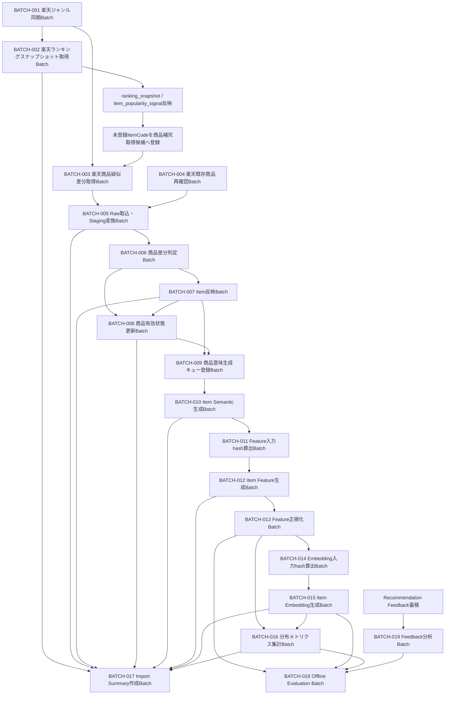

# バッチ一覧

## 1. 概要

### 1.1 目的

本ドキュメントは、Gift Recommendation Service MVP におけるバッチ処理一覧を定義する。

バッチ設計方針書では、バッチ処理の実行方式、責務分離、Raw保存、Staging変換、Item反映、Feature / Embedding生成、分布メトリクス集計、ログ・Observability、冪等性、再実行方針を定義した。

本ドキュメントでは、それらの方針を踏まえ、Batch Job単位で以下を一覧化する。

```text
- Batch ID
- Batch名
- 処理概要
- 実行トリガー
- 実行頻度
- 主な入力
- 主な出力
- 利用モジュール
- 更新リソース
- 正本区分
- 先行Batch
- 後続Batch
- 冪等キー
- 状態管理
- ログ対象
- エラーコード
- MVP対象
```

---

## 2. 基本方針

### 2.1 バッチ実行方式

MVPにおけるバッチ実行方式は以下とする。

| 項目            | 方針                                                                                 |
| --------------- | ------------------------------------------------------------------------------------ |
| 実装言語        | Python                                                                               |
| 実行基盤        | GitHub Actions                                                                       |
| 実行形態        | 常駐HTTPサービスではなく、Pythonスクリプト実行                                       |
| 起動方式        | GitHub Actions workflow                                                              |
| バッチ処理API化 | しない                                                                               |
| 外部API呼び出し | batchから楽天API / OpenAI Embedding API / 必要に応じてLLM APIを呼び出す              |
| Storage連携     | batchからObject StorageへRaw JSONを保存・読取する                                    |
| DB連携          | batchからDatabaseへMetadata / Staging / Item / Feature / Embedding / Log等を保存する |

---

### 2.2 バッチ一覧の粒度

本ドキュメントでは、バッチを以下の粒度で整理する。

| 粒度     | 方針                                                           |
| -------- | -------------------------------------------------------------- |
| Job      | GitHub Actions workflowまたはworkflow内jobとして実行できる単位 |
| Phase    | Job内の処理段階。phase_logで管理する                           |
| Module   | Jobから呼び出される実装モジュール                              |
| Resource | Jobが参照・更新するDB / Storage上のデータ                      |

重要な補足は以下である。

```text
Raw保存Batch / Raw Metadata保存Batchは、独立Jobとしても切り出せるが、
MVPでは楽天API取得系Batchの内部処理として扱う。

ただし、Raw取込・Staging変換Batchは、
Raw保存済みデータを再処理できるように独立Jobとして定義する。
```

---

## 3. バッチ一覧

| Batch ID  | Batch名                                 | 処理概要                                                                                                              | 実行トリガー                                                          | 実行頻度                                           | 主な入力                                                                                                                                     | 主な出力                                                                                                           | 利用モジュール                                                                                                                                                                                                                                                                                                                          | 更新リソース                                                                                                                                                    | 正本区分                               | 先行Batch                                                                                     | 後続Batch                         | 冪等キー                                                                                                                      | 状態管理                                                                                                   | ログ対象                                                                                                                              | エラーコード                                              | MVP対象 |
| --------- | --------------------------------------- | --------------------------------------------------------------------------------------------------------------------- | --------------------------------------------------------------------- | -------------------------------------------------- | -------------------------------------------------------------------------------------------------------------------------------------------- | ------------------------------------------------------------------------------------------------------------------ | --------------------------------------------------------------------------------------------------------------------------------------------------------------------------------------------------------------------------------------------------------------------------------------------------------------------------------------- | --------------------------------------------------------------------------------------------------------------------------------------------------------------- | -------------------------------------- | --------------------------------------------------------------------------------------------- | --------------------------------- | ----------------------------------------------------------------------------------------------------------------------------- | ---------------------------------------------------------------------------------------------------------- | ------------------------------------------------------------------------------------------------------------------------------------- | --------------------------------------------------------- | ------- |
| BATCH-001 | 楽天ジャンル同期Batch                   | 楽天ジャンル検索APIからジャンル階層・ジャンル参照情報を取得し、外部ジャンルマスタとして保存する                       | schedule / workflow_dispatch                                          | 週次または手動                                     | 取得対象ジャンルID / fetch_plan / 楽天ジャンル検索APIレスポンス                                                                              | raw_product_metadata / staging_genre / external_genre                                                              | Product Fetch Planner / Rakuten Genre API Client / External API Rate Limiter / Rakuten Response Adapter / Raw Product Object Writer / Raw Product Metadata Writer / Staging Transformer / Staging Validator / Staging Repository                                                                                                        | raw_product_metadata / staging_genre / external_genre / batch_run_log / phase_log / api_call_log / error_log                                                    | 外部参照マスタ / Raw参照情報           | なし                                                                                          | BATCH-002 / BATCH-003             | source + external_genre_id / object_key / content_hash                                                                        | batch_run_log / phase_log / api_call_log / raw_product_metadata.import_status                              | batch_run_log / phase_log / api_call_log / raw_product_metadata / error_log / item_import_summary                                     | GRS-EXT-_ / GRS-RAW-_ / GRS-BAT-_ / GRS-DB-_ / GRS-VAL-\* | ○       |
| BATCH-002 | 楽天ランキングスナップショット取得Batch | 楽天ランキングAPIからランキング結果を取得し、ranking_snapshot単位で順位明細を全件反映する                             | schedule / workflow_dispatch                                          | 日次または手動                                     | fetch_plan / target_genre / period / 楽天ランキングAPIレスポンス                                                                             | raw_product_metadata / staging_ranking_signal / ranking_snapshot / item_popularity_signal / 未登録itemCode補完候補 | Product Fetch Planner / Rakuten Ranking API Client / External API Rate Limiter / Rakuten Response Adapter / Raw Product Object Writer / Raw Product Metadata Writer / Staging Transformer / Staging Validator / Ranking Snapshot Builder / Ranking Snapshot Repository / Item Popularity Signal Updater / Ranking Unknown Item Collector | raw_product_metadata / staging_ranking_signal / ranking_snapshot / item_popularity_signal / fetch_cursor / batch_run_log / phase_log / api_call_log / error_log | 外部観測正本 / スナップショット        | BATCH-001                                                                                     | BATCH-003 / BATCH-017             | ranking_snapshot: source + external_genre_id + period + last_build_date<br>item_popularity_signal: ranking_snapshot_id + rank | batch_run_log / phase_log / api_call_log / raw_product_metadata.import_status / ranking_snapshot           | batch_run_log / phase_log / api_call_log / raw_product_metadata / ranking_snapshot / item_import_summary / error_log                  | GRS-EXT-_ / GRS-RAW-_ / GRS-BAT-_ / GRS-DB-_ / GRS-VAL-\* | ○       |
| BATCH-003 | 楽天商品疑似差分取得Batch               | 楽天商品検索APIから商品候補を取得し、Raw JSONを保存する。更新順・ジャンル別・キーワード・ランキング補完候補を利用する | schedule / workflow_dispatch / BATCH-002後続                          | 日次または手動                                     | fetch_cursor / genre / keyword / ranking補完候補 / 楽天商品検索APIレスポンス                                                                 | raw_product_json / raw_product_metadata                                                                            | Product Fetch Planner / Fetch Cursor Manager / Fetch Priority Resolver / Rakuten Item Search API Client / External API Rate Limiter / Rakuten Response Adapter / Product Candidate Extractor / Product Candidate Deduplicator / Raw Product Object Writer / Raw Product Metadata Writer                                                 | raw_product_metadata / fetch_cursor / batch_run_log / phase_log / api_call_log / error_log                                                                      | Raw本体 / Raw参照情報                  | BATCH-001 / BATCH-002                                                                         | BATCH-005                         | object_key / content_hash / api_call_log_id                                                                                   | batch_run_log / phase_log / api_call_log / raw_product_metadata.import_status                              | batch_run_log / phase_log / api_call_log / raw_product_metadata / error_log / item_import_summary                                     | GRS-EXT-_ / GRS-RAW-_ / GRS-BAT-_ / GRS-DB-_              | ○       |
| BATCH-004 | 楽天既存商品再確認Batch                 | 登録済み商品の価格、販売状態、画像URL、レビュー要約などの現在値を楽天商品検索API等で再確認する                        | schedule / workflow_dispatch                                          | 週次または手動                                     | item / external_item_code / fetch_cursor / 楽天商品検索APIレスポンス                                                                         | raw_product_json / raw_product_metadata / item_active_status_candidate                                                        | Fetch Cursor Manager / Rakuten Item Search API Client / External API Rate Limiter / Rakuten Response Adapter / Raw Product Object Writer / Raw Product Metadata Writer / Item Active Status Candidate Resolver                                                                                                                          | raw_product_metadata / item_active_status_candidate / fetch_cursor / batch_run_log / phase_log / api_call_log / error_log                                                                      | Raw本体 / Raw参照情報                  | なし                                                                                          | BATCH-005 / BATCH-008             | source + external_item_code + fetched_at / object_key / content_hash / batch_run_id + source + external_item_code（候補）                                                          | batch_run_log / phase_log / api_call_log / raw_product_metadata.import_status                              | batch_run_log / phase_log / api_call_log / raw_product_metadata / error_log / item_import_summary                                     | GRS-EXT-_ / GRS-RAW-_ / GRS-BAT-_ / GRS-DB-_              | ○       |
| BATCH-005 | Raw取込・Staging変換Batch               | Object Storage上のRaw JSONを読み取り、内部取込形式のStagingデータへ変換・検証する                                     | BATCH-001 / BATCH-002 / BATCH-003 / BATCH-004後続 / workflow_dispatch | Raw保存後に連続実行                                | raw_product_metadata / raw_product_json                                                                                                      | staging_item / staging_item_image / staging_ranking_signal / staging_genre                                         | Raw Product Reader / Staging Transformer / Staging Validator / Staging Repository / Normalized Payload Builder / Normalized Hash Calculator                                                                                                                                                                                             | staging_item / staging_item_image / staging_ranking_signal / staging_genre / raw_product_metadata / batch_run_log / phase_log / error_log                       | 中間データ / 変換結果                  | BATCH-001 / BATCH-002 / BATCH-003 / BATCH-004                                                 | BATCH-006 / BATCH-017             | raw_metadata_id / staging対象ごとのsource + external_id                                                                       | batch_run_log / phase_log / raw_product_metadata.import_status                                             | batch_run_log / phase_log / raw_product_metadata / error_log / item_import_summary                                                    | GRS-RAW-_ / GRS-BAT-_ / GRS-DB-_ / GRS-VAL-_              | ○       |
| BATCH-006 | 商品差分判定Batch                       | staging_itemと既存itemを比較し、normalized_hashによりnew / updated / unchanged / unavailableを判定する                | BATCH-005後続 / workflow_dispatch                                     | Staging変換後に連続実行                            | staging_item / item / normalized_hash                                                                                                        | product_diff_result                                                                                                | Normalized Payload Builder / Normalized Hash Calculator / Product Diff Detector / Product Diff Result Repository                                                                                                                                                                                                                        | product_diff_result / batch_run_log / phase_log / error_log                                                                                                     | 処理結果 / 差分判定結果                | BATCH-005                                                                                     | BATCH-007 / BATCH-008 / BATCH-009 | batch_run_id + external_item_code                                                                                             | batch_run_log / phase_log / product_diff_result                                                            | batch_run_log / phase_log / error_log / item_import_summary                                                                           | GRS-BAT-_ / GRS-DB-_ / GRS-VAL-\*                         | ○       |
| BATCH-007 | Item反映Batch                           | product_diff_resultに基づき、Item正本、Item Image、Item Review Summaryを登録・更新する                                | BATCH-006後続 / workflow_dispatch                                     | 差分判定後に連続実行                               | staging_item / staging_item_image / product_diff_result                                                                                      | item / item_image / item_review_summary                                                                            | Item Updater / Item Image Updater / Item Review Summary Updater / Product Diff Result Reader / Batch Logger / Error Handler                                                                                                                                                                                                             | item / item_image / item_review_summary / product_diff_result / batch_run_log / phase_log / error_log                                                           | 商品正本 / 商品画像参照 / レビュー要約 | BATCH-006                                                                                     | BATCH-008 / BATCH-009 / BATCH-017 | item: source + external_item_code<br>item_image: item_id + image_url + display_order<br>item_review_summary: item_id + source | batch_run_log / phase_log / product_diff_result / item更新結果                                             | batch_run_log / phase_log / error_log / item_import_summary                                                                           | GRS-BAT-_ / GRS-DB-_ / GRS-VAL-\*                         | ○       |
| BATCH-008 | 商品有効状態更新Batch                   | 販売不可、取得不能、必須項目不足、除外対象の商品を推薦対象外へ更新する                                                | BATCH-006 / BATCH-007 / BATCH-004後続 / workflow_dispatch             | Item反映後または既存商品再確認後                   | product_diff_result / item_active_status_candidate / item / availability / 必須項目チェック結果                                                                             | item.active_status / active_status変更ログ                                                                         | Item Active Status Updater / Item Active Status Candidate Reader / Staging Validator / Product Diff Result Reader / Error Handler                                                                                                                                                                                                                                             | item / product_diff_result / item_active_status_candidate / batch_run_log / phase_log / error_log                                                                                              | 商品正本の状態                         | BATCH-004 / BATCH-006 / BATCH-007                                                             | BATCH-009 / BATCH-017             | item_id                                                                                                                       | batch_run_log / phase_log / item.active_status                                                             | batch_run_log / phase_log / error_log / item_import_summary                                                                           | GRS-BAT-_ / GRS-DB-_ / GRS-VAL-\*                         | ○       |
| BATCH-009 | 商品意味生成キュー登録Batch             | 新規・更新Itemのうち、商品意味に影響する項目が変わったものをItem Semantic / Feature / Embedding生成対象として登録する | BATCH-007 / BATCH-008後続 / workflow_dispatch                         | Item反映後に連続実行                               | item / product_diff_result / meaning_input_diff                                                                                              | item_generation_queue                                                                                              | Item Generation Queue Registrar / Config Version Resolver / Feature Input Candidate Resolver / Error Handler                                                                                                                                                                                                                            | item_generation_queue / batch_run_log / phase_log / error_log                                                                                                   | 処理制御データ                         | BATCH-007 / BATCH-008                                                                         | BATCH-010                         | item_id + semantic_config_version_id + generation_target_type                                                                 | batch_run_log / phase_log / item_generation_queue.status                                                   | batch_run_log / phase_log / error_log / item_import_summary                                                                           | GRS-BAT-_ / GRS-DB-_ / GRS-CFG-\*                         | ○       |
| BATCH-010 | Item Semantic生成Batch                  | 商品名、説明、ジャンル、属性、タグ等からSemantic Conceptを抽出する                                                    | BATCH-009後続 / workflow_dispatch / retry-failed                      | Item Generation Queue登録後に連続実行              | item_generation_queue / item / genre / attribute / tag / semantic_config_version_id / Semanticルール                                         | item_semantic                                                                                                      | Item Semantic Generator / Semantic Rule Resolver / Config Version Resolver / Error Handler / Batch Logger                                                                                                                                                                                                                               | item_semantic / item_generation_queue / batch_run_log / phase_log / error_log                                                                                   | 推薦用派生データ / 意味抽出結果        | BATCH-009                                                                                     | BATCH-011 / BATCH-017             | item_id + semantic_config_version_id + source_type + concept_code                                                             | batch_run_log / phase_log / item_generation_queue.status / item_semantic.generation_status                 | batch_run_log / phase_log / error_log / item_import_summary                                                                           | GRS-BAT-_ / GRS-DB-_ / GRS-CFG-_ / GRS-LLM-_              | ○       |
| BATCH-011 | Feature入力hash算出Batch                | Item Feature生成に利用する入力データを正規化し、feature_input_hashを算出する                                          | BATCH-010後続 / workflow_dispatch / retry-failed                      | Item Semantic生成後に連続実行                      | item / item_semantic / genre / attribute / tag / semantic_config_version_id                                                                  | feature_input_hash / feature_input_payload                                                                         | Feature Input Payload Builder / Feature Input Hash Calculator / Config Version Resolver                                                                                                                                                                                                                                                 | item_generation_queue / item_feature生成対象メタデータ / batch_run_log / phase_log / error_log                                                                  | 生成入力管理データ                     | BATCH-010                                                                                     | BATCH-012                         | item_id + semantic_config_version_id + feature_input_hash                                                                     | batch_run_log / phase_log / item_generation_queue.status                                                   | batch_run_log / phase_log / error_log / item_import_summary                                                                           | GRS-BAT-_ / GRS-DB-_ / GRS-CFG-_ / GRS-VAL-_              | ○       |
| BATCH-012 | Item Feature生成Batch                   | 共通Feature Engineを用いて、Item Semantic / 商品メタデータから8次元Feature raw_valueを生成する                        | BATCH-011後続 / workflow_dispatch / retry-failed                      | Feature入力hash算出後に連続実行                    | item_semantic / item metadata / feature rules / semantic_config_version_id / feature_input_hash                                              | item_feature.raw_value / item_meaning候補                                                                          | Item Feature Generator / Feature Engine / Config Version Resolver / Feature Rule Resolver / Error Handler                                                                                                                                                                                                                               | item_feature / item_generation_queue / batch_run_log / phase_log / error_log                                                                                    | 推薦用派生正本 / Feature生成結果       | BATCH-011                                                                                     | BATCH-013 / BATCH-017             | item_id + semantic_config_version_id + feature_code + feature_input_hash                                                      | batch_run_log / phase_log / item_generation_queue.status / item_feature.generation_status                  | batch_run_log / phase_log / error_log / item_import_summary                                                                           | GRS-BAT-_ / GRS-DB-_ / GRS-CFG-_ / GRS-LLM-_              | ○       |
| BATCH-013 | Feature正規化Batch                      | raw Featureをz-score + sigmoid等で正規化し、Matching可能な0.0〜1.0の値へ変換する                                      | BATCH-012後続 / workflow_dispatch / semantic_config_version更新時     | Item Feature生成後に連続実行                       | item_feature.raw_value / normalization statistics / semantic_config_version_id                                                               | item_feature.normalized_value / item_meaning / normalization_distribution_metric候補                               | Feature Normalizer / Normalization Statistics Manager / Feature Engine / Meaning Projection / Config Version Resolver                                                                                                                                                                                                                   | item_feature / item_meaning / normalization_distribution_metric / batch_run_log / phase_log / error_log                                                         | 推薦用派生正本 / 正規化結果            | BATCH-012                                                                                     | BATCH-014 / BATCH-016 / BATCH-017 | item_id + semantic_config_version_id + feature_code + feature_input_hash + normalization_stats_version_id                     | batch_run_log / phase_log / item_feature.generation_status                                                 | batch_run_log / phase_log / error_log / normalization_distribution_metric / item_import_summary                                       | GRS-BAT-_ / GRS-DB-_ / GRS-CFG-_ / GRS-VAL-_              | ○       |
| BATCH-014 | Embedding入力hash算出Batch              | Embedding生成に利用するitem_text_contextを構築し、embedding_input_hashを算出する                                      | BATCH-013後続 / workflow_dispatch / retry-failed                      | Feature正規化後またはItem Semantic生成後に連続実行 | item / genre / attribute / tag / semantic concept / embedding_source_version                                                                 | item_text_context / embedding_input_hash                                                                           | Embedding Input Context Builder / Embedding Input Hash Calculator / Config Version Resolver                                                                                                                                                                                                                                             | item_embedding生成対象メタデータ / item_generation_queue / batch_run_log / phase_log / error_log                                                                | 生成入力管理データ                     | BATCH-013                                                                                     | BATCH-015                         | item_id + embedding_model_version_id + embedding_source_version + embedding_input_hash                                        | batch_run_log / phase_log / item_generation_queue.status                                                   | batch_run_log / phase_log / error_log / item_import_summary                                                                           | GRS-BAT-_ / GRS-DB-_ / GRS-CFG-_ / GRS-VAL-_              | ○       |
| BATCH-015 | Item Embedding生成Batch                 | 商品テキスト文脈からEmbeddingを生成し、Retrieval用ベクトルとして保存する                                              | BATCH-014後続 / workflow_dispatch / retry-failed                      | Embedding入力hash算出後に連続実行                  | item_text_context / embedding_model_version_id / embedding_source_version / embedding_input_hash                                             | item_embedding / embedding_vector                                                                                  | Item Embedding Generator / Item Embedding Repository / OpenAI Embedding Client / External API Rate Limiter / Config Version Resolver / Error Handler                                                                                                                                                                                    | item_embedding / item_generation_queue / batch_run_log / phase_log / api_call_log / error_log                                                                   | 推薦用派生正本 / Retrieval用ベクトル   | BATCH-014                                                                                     | BATCH-016 / BATCH-017             | item_id + embedding_model_version_id + embedding_source_version + embedding_input_hash                                        | batch_run_log / phase_log / api_call_log / item_generation_queue.status / item_embedding.generation_status | batch_run_log / phase_log / api_call_log / error_log / item_import_summary                                                            | GRS-LLM-_ / GRS-EXT-_ / GRS-BAT-_ / GRS-DB-_              | ○       |
| BATCH-016 | 分布メトリクス集計Batch                 | Item Feature、Item Meaning、正規化前後の分布を集計し、Reco品質監視用メトリクスとして保存する                          | BATCH-013 / BATCH-015後続 / schedule / workflow_dispatch              | Feature / Embedding生成後、または日次              | item_feature / item_meaning / item_embedding / semantic_config_version_id / normalization_stats_version_id                                   | feature_distribution_metric / meaning_distribution_metric / normalization_distribution_metric                      | Distribution Metric Collector / Feature Distribution Aggregator / Meaning Distribution Aggregator / Normalization Distribution Aggregator / Batch Logger                                                                                                                                                                                | feature_distribution_metric / meaning_distribution_metric / normalization_distribution_metric / batch_run_log / phase_log / error_log                           | 派生集計 / 品質監視メトリクス          | BATCH-013 / BATCH-015                                                                         | BATCH-017                         | aggregation_scope + aggregation_key + metric_type + feature_code + version                                                    | batch_run_log / phase_log / metric aggregation status                                                      | batch_run_log / phase_log / error_log / feature_distribution_metric / meaning_distribution_metric / normalization_distribution_metric | GRS-BAT-_ / GRS-DB-_ / GRS-VAL-\*                         | ○       |
| BATCH-017 | Import Summary作成Batch                 | Batch Run単位で取得件数、新規件数、更新件数、スキップ件数、失敗件数、Feature / Embedding 生成件数などを集計する（`source_api` 別）             | 各Batch後続 / workflow_dispatch                                       | 各Batch実行後に連続実行                            | batch_run_log / phase_log / api_call_log / raw_product_metadata / product_diff_result / ranking_snapshot / item_generation_queue / error_log | item_import_summary                                                                                                | Import Summary Builder / Batch Logger / Error Handler                                                                                                                                                                                                                                                                                   | item_import_summary / batch_run_log / phase_log / error_log                                                                                                     | 運用集計 / 実行結果サマリ              | BATCH-002 / BATCH-005 / BATCH-007 / BATCH-008 / BATCH-010 / BATCH-012 / BATCH-015 / BATCH-016 | なし                              | batch_run_id + source_api<br>（`summary_type` は `source_api` に対応）                                                                                                   | batch_run_log / phase_log / item_import_summary                                                            | batch_run_log / phase_log / item_import_summary / error_log                                                                           | GRS-BAT-_ / GRS-DB-_                                      | ○       |
| BATCH-018 | Offline Evaluation Batch                | 評価データセットを用いて推薦品質を評価し、Precision、Recall、NDCG、MMR等の評価メトリクスを保存する                    | workflow_dispatch / release前 / schedule                              | 手動またはリリース前                               | evaluation_dataset / semantic_config_version_id / feature settings / reco internal API                                                       | evaluation_result / evaluation_metric / evaluation_run_log                                                         | Offline Evaluation Runner / Evaluation Dataset Loader / Reco Internal API Client / Metric Calculator / Batch Logger                                                                                                                                                                                                                     | evaluation_result / evaluation_metric / batch_run_log / phase_log / error_log                                                                                   | 評価派生データ                         | BATCH-013 / BATCH-015 / BATCH-016                                                             | なし                              | evaluation_dataset_id + semantic_config_version_id + evaluation_config_version                                                | batch_run_log / phase_log / evaluation_run_status                                                          | batch_run_log / phase_log / error_log / evaluation_metric                                                                             | GRS-BAT-_ / GRS-DB-_ / GRS-REC-_ / GRS-LLM-_              | △       |
| BATCH-019 | Feedback分析Batch                       | Recommendation Feedbackを集計し、Negative Feedback傾向や改善候補を分析する                                            | schedule / workflow_dispatch                                          | Feedback蓄積後に週次                               | recommendation_feedback / recommendation_result / recommendation_result_item / reason / item_feature                                         | feedback_analysis_result / feedback_metric                                                                         | Feedback Analyzer / Feedback Metric Aggregator / Negative Feedback Classifier / Batch Logger                                                                                                                                                                                                                                            | feedback_analysis_result / feedback_metric / batch_run_log / phase_log / error_log                                                                              | 分析派生データ                         | Feedback蓄積後                                                                                | BATCH-018 / 後続改善Batch         | aggregation_scope + period + feedback_type + semantic_config_version_id                                                       | batch_run_log / phase_log / feedback_analysis_status                                                       | batch_run_log / phase_log / error_log / feedback_metric                                                                               | GRS-BAT-_ / GRS-DB-_ / GRS-VAL-\*                         | △       |

### 3.1 Config Version Resolver 連携（BATCH-009〜015）

`item_generation_queue` は **version 列を持たない**（`item_generation_queue_テーブル定義書` §5）。Config / Model Version の解決正本は **MOD-RECO-003 Config Version Resolverモジュール仕様書**（§6.2 `BatchResolveContext`、§8.3.8）とする。

| Batch | Resolver 利用 | 補足 |
| ----- | ------------- | ---- |
| BATCH-009 | 登録時に現行 `semantic_config_version_id` を解決 | 解決結果は Queue 行には保存せず、冪等キー（`item_id + semantic_config_version_id + generation_target_type`）および下位 Batch へのヒントとして利用 |
| BATCH-010〜015 | 各ステップ開始時に `BatchResolveContext` を組み立てて解決 | `generation_type`（`semantic` / `feature` / `embedding`）に応じた部分解決。永続化先は `item_semantic` / `item_feature` / `item_embedding` |
| BATCH-018 | Offline Evaluation 用に解決 | `evaluation_run.ranking_config_id` 等へ記録（Reco OL パイプラインとは別系統） |

バッチ設計方針書 §20.1 も参照。

---

## 4. バッチ先行関係



---

## 5. Workflow分割案

| Workflow                           | 対象Batch                                                                                     | 用途                                    | 起動トリガー                        |
| ---------------------------------- | --------------------------------------------------------------------------------------------- | --------------------------------------- | ----------------------------------- |
| batch-rakuten-genre-sync.yml       | BATCH-001                                                                                     | ジャンル同期                            | schedule / workflow_dispatch        |
| batch-rakuten-ranking-snapshot.yml | BATCH-002                                                                                     | ランキングスナップショット取得          | schedule / workflow_dispatch        |
| batch-rakuten-item-import.yml      | BATCH-003 / BATCH-004 / BATCH-005 / BATCH-006 / BATCH-007 / BATCH-008 / BATCH-017             | 商品取得〜Item反映〜Summary作成         | schedule / workflow_dispatch        |
| batch-item-meaning-generation.yml  | BATCH-009 / BATCH-010 / BATCH-011 / BATCH-012 / BATCH-013 / BATCH-014 / BATCH-015 / BATCH-017 | Item Semantic / Feature / Embedding生成 | workflow_dispatch / item import後続 |
| batch-distribution-metrics.yml     | BATCH-016 / BATCH-017                                                                         | 分布メトリクス集計                      | schedule / workflow_dispatch        |
| batch-offline-evaluation.yml       | BATCH-018                                                                                     | Offline Evaluation                      | workflow_dispatch / release前       |
| batch-feedback-analysis.yml        | BATCH-019                                                                                     | Feedback分析                            | schedule / workflow_dispatch        |
| batch-retry-failed-items.yml       | BATCH-010 / BATCH-011 / BATCH-012 / BATCH-013 / BATCH-014 / BATCH-015                         | 失敗Item再実行                          | workflow_dispatch                   |

---

## 6. Batch ID別の詳細補足

### 6.1 BATCH-002 楽天ランキングスナップショット取得Batch

ランキングは、マスタではなく時点ごとの観測データとして扱う。

そのため、差分反映ではなく、取得対象ランキングAPIレスポンス内の全順位明細をスナップショットとして全件反映する。

```text
ranking_snapshot
  = ランキング取得単位のヘッダ

item_popularity_signal
  = ランキングスナップショット内の商品順位明細
```

冪等キーは以下とする。

```text
ranking_snapshot:
source + external_genre_id + period + last_build_date

item_popularity_signal:
ranking_snapshot_id + rank
```

---

### 6.2 BATCH-011 / BATCH-012 Feature入力hash・Item Feature生成

Item Feature生成では、設定versionだけではなく、入力データhashを考慮する。

```text
Feature再生成条件:
- semantic_config_version_id が変わった
- または feature_input_hash が変わった
- または Feature生成結果が存在しない
- または Feature生成結果が failed
```

skip条件は以下である。

```text
同一 item_id
かつ 同一 semantic_config_version_id
かつ 同一 feature_input_hash
のFeatureが成功済みの場合のみskipする。
```

MVPでは、以下の変更のみではFeatureを再生成しない。

```text
- reviewAverage / reviewCount のみ変更
- itemPrice のみ変更
- ranking_snapshot / rank のみ変更
- imageUrl のみ変更
- availability のみ変更
- itemUrl のみ変更
```

---

### 6.3 BATCH-014 / BATCH-015 Embedding入力hash・Item Embedding生成

Item Embedding生成では、Embeddingモデルversion、Embedding入力構築ルールversion、入力データhashを考慮する。

```text
Embedding再生成条件:
- embedding_model_version_id が変わった
- または embedding_source_version が変わった
- または embedding_input_hash が変わった
- または Embedding生成結果が存在しない
- または Embedding生成結果が failed
```

skip条件は以下である。

```text
同一 item_id
かつ 同一 embedding_model_version_id
かつ 同一 embedding_source_version
かつ 同一 embedding_input_hash
のEmbeddingが成功済みの場合のみskipする。
```

MVPでは、以下の変更のみではEmbeddingを再生成しない。

```text
- reviewAverage / reviewCount のみ変更
- itemPrice のみ変更
- ranking_snapshot / rank のみ変更
- imageUrl のみ変更
- availability のみ変更
- itemUrl のみ変更
```

---

## 7. MVP対象Batch整理

| 区分           | Batch ID  | Batch名                                 | MVP対象 |
| -------------- | --------- | --------------------------------------- | ------- |
| 外部マスタ同期 | BATCH-001 | 楽天ジャンル同期Batch                   | ○       |
| ランキング取得 | BATCH-002 | 楽天ランキングスナップショット取得Batch | ○       |
| 商品取得       | BATCH-003 | 楽天商品疑似差分取得Batch               | ○       |
| 商品再確認     | BATCH-004 | 楽天既存商品再確認Batch                 | ○       |
| Raw / Staging  | BATCH-005 | Raw取込・Staging変換Batch               | ○       |
| 差分判定       | BATCH-006 | 商品差分判定Batch                       | ○       |
| Item反映       | BATCH-007 | Item反映Batch                           | ○       |
| 有効状態更新   | BATCH-008 | 商品有効状態更新Batch                   | ○       |
| 生成キュー     | BATCH-009 | 商品意味生成キュー登録Batch             | ○       |
| Semantic       | BATCH-010 | Item Semantic生成Batch                  | ○       |
| Feature入力    | BATCH-011 | Feature入力hash算出Batch                | ○       |
| Feature生成    | BATCH-012 | Item Feature生成Batch                   | ○       |
| Feature正規化  | BATCH-013 | Feature正規化Batch                      | ○       |
| Embedding入力  | BATCH-014 | Embedding入力hash算出Batch              | ○       |
| Embedding生成  | BATCH-015 | Item Embedding生成Batch                 | ○       |
| 分布監視       | BATCH-016 | 分布メトリクス集計Batch                 | ○       |
| Summary        | BATCH-017 | Import Summary作成Batch                 | ○       |
| 評価           | BATCH-018 | Offline Evaluation Batch                | △       |
| Feedback分析   | BATCH-019 | Feedback分析Batch                       | △       |

---

## 8. 共通ログ・状態管理方針

### 8.1 共通ログ

全Batchで、原則として以下を記録する。

| ログ                | 内容                              |
| ------------------- | --------------------------------- |
| batch_run_log       | Batch全体の開始・終了・状態・件数 |
| phase_log           | フェーズ単位の開始・終了・失敗    |
| error_log           | エラー詳細、error_code、trace_id  |
| item_import_summary | 件数サマリ。対象Batchでは必須     |

外部APIを呼び出すBatchでは、追加で以下を記録する。

| ログ                 | 対象Batch                                                 |
| -------------------- | --------------------------------------------------------- |
| api_call_log         | BATCH-001 / BATCH-002 / BATCH-003 / BATCH-004 / BATCH-015 |
| raw_product_metadata | BATCH-001 / BATCH-002 / BATCH-003 / BATCH-004 / BATCH-005 |
| item_active_status_candidate | BATCH-004 / BATCH-008 |

分布メトリクスを扱うBatchでは、追加で以下を記録する。

| ログ / メトリクス                 | 対象Batch             |
| --------------------------------- | --------------------- |
| feature_distribution_metric       | BATCH-016             |
| meaning_distribution_metric       | BATCH-016             |
| normalization_distribution_metric | BATCH-013 / BATCH-016 |

---

### 8.2 状態更新方針

状態のDB更新は、原則として処理完了時の終端状態のみを永続化する。

特に、商品・Raw・ランキング明細・Feature生成対象などの大量明細単位では、`processing` や `running` などの中間状態を1件ごとに逐次更新しない。

中間状態の詳細な進捗は、DBの状態カラムではなく、`batch_run_log`、`phase_log`、`api_call_log`、`item_import_summary` などの実行ログ・集計情報で把握する。

ただし、Batch Run単位、Phase単位、外部API Call単位など、実行管理上必要な粒度では、開始時状態と終了時状態を記録してよい。

---

## 9. 共通エラー分類

| エラー分類 | 主な対象Batch                                                                                 | 内容                                              |
| ---------- | --------------------------------------------------------------------------------------------- | ------------------------------------------------- |
| GRS-EXT-\* | BATCH-001 / BATCH-002 / BATCH-003 / BATCH-004 / BATCH-015                                     | 外部API、楽天API、Embedding APIのエラー           |
| GRS-RAW-\* | BATCH-001 / BATCH-002 / BATCH-003 / BATCH-004 / BATCH-005                                     | Raw保存・Raw読取・content_hash不一致              |
| GRS-BAT-\* | 全Batch                                                                                       | Batch実行、フェーズ制御、再実行、排他制御のエラー |
| GRS-DB-\*  | 全Batch                                                                                       | DB登録・更新・参照エラー                          |
| GRS-VAL-\* | BATCH-005 / BATCH-006 / BATCH-008 / BATCH-011 / BATCH-014 / BATCH-016 / BATCH-019             | Validationエラー                                  |
| GRS-CFG-\* | BATCH-009 / BATCH-010 / BATCH-011 / BATCH-012 / BATCH-013 / BATCH-014 / BATCH-015 / BATCH-018 | Config / Version解決エラー                        |
| GRS-LLM-\* | BATCH-010 / BATCH-012 / BATCH-015 / BATCH-018                                                 | LLM / Embedding関連エラー                         |
| GRS-REC-\* | BATCH-018                                                                                     | Reco内部API実行エラー                             |

---

## 10. レビュー観点

| 観点                        | 確認内容                                                                                                |
| --------------------------- | ------------------------------------------------------------------------------------------------------- |
| API化しない方針             | Batch処理そのものがInternal APIとして定義されていないか                                                 |
| Workflow分割                | GitHub Actions workflow単位が運用しやすい粒度になっているか                                             |
| 先行関係                    | Raw保存後にStaging、Item反映後にFeature / Embedding生成の順序になっているか                             |
| ランキング反映              | ランキングが差分反映ではなく、ranking_snapshot単位の全件反映になっているか                              |
| Ranking冪等性               | ranking_snapshot_id + rank で順位明細の二重登録を防げるか                                               |
| 商品差分判定                | normalized_hashでItem現在値の差分判定を行えているか                                                     |
| hash分離                    | normalized_hash / feature_input_hash / embedding_input_hash の用途が分離されているか                    |
| Feature再生成判定           | semantic_config_version_id + feature_input_hash を考慮できているか                                      |
| Embedding再生成判定         | embedding_model_version_id + embedding_source_version + embedding_input_hash を考慮できているか         |
| reviewAverage / reviewCount | MVPではFeature / Embedding生成入力に含めない方針になっているか                                          |
| 状態管理                    | 大量明細単位で中間状態を逐次DB更新しない方針になっているか                                              |
| ログ                        | batch_run_log / phase_log / api_call_log / error_log / item_import_summaryが対象Batchに設定されているか |
| エラー分類                  | Batchごとに代表エラーコード分類が設定されているか                                                       |
| 冪等性                      | 同じRawや同じ入力hashを再処理しても二重作成されないか                                                   |
| 再実行性                    | 失敗Batch、失敗Phase、失敗Item単位で再実行できるか                                                      |
| MVPスコープ                 | MVP対象○と後続対象△が分離されているか                                                                   |

---

## 11. 後続成果物への引き継ぎ

### 11.1 バッチ仕様書.mdへの引き継ぎ

バッチ仕様書では、本バッチ一覧のBatch IDごとに以下を詳細化する。

```text
- 処理フロー
- 入出力定義
- DB更新仕様
- Object Storage操作仕様
- 外部API呼び出し仕様
- Validation仕様
- 差分判定仕様
- Ranking Snapshot反映仕様
- Feature入力hash算出仕様
- Embedding入力hash算出仕様
- Feature / Embedding再生成判定仕様
- Retry仕様
- エラー処理仕様
- ログ出力仕様
- メトリクス仕様
- テスト観点
```

---

### 11.2 GitHub Actions設計への引き継ぎ

GitHub Actions設計では、以下を具体化する。

```text
- workflowファイル名
- schedule設定
- workflow_dispatch引数
- concurrency設定
- job分割
- timeout-minutes
- retry方針
- Secrets参照
- 成功 / 失敗通知
- 手動再実行手順
```

---

### 11.3 テーブル設計への引き継ぎ

テーブル設計では、以下を詳細化する。

```text
- batch_run_log
- phase_log
- api_call_log
- error_log
- fetch_cursor
- raw_product_metadata
- product_diff_result
- staging_item
- staging_item_image
- staging_ranking_signal
- staging_genre
- ranking_snapshot
- item_popularity_signal
- item
- item_image
- item_review_summary
- item_generation_queue
- item_semantic
- item_feature
- item_embedding
- item_import_summary
- feature_distribution_metric
- meaning_distribution_metric
- normalization_distribution_metric
- evaluation_result
- evaluation_metric
- feedback_analysis_result
- feedback_metric
```

---

## 12. まとめ

MVPにおけるバッチ一覧は以下を中核とする。

```text
- 楽天ジャンル同期
- 楽天ランキングスナップショット取得
- 楽天商品疑似差分取得
- 楽天既存商品再確認
- Raw取込・Staging変換
- 商品差分判定
- Item反映
- 商品有効状態更新
- 商品意味生成キュー登録
- Item Semantic生成
- Feature入力hash算出
- Item Feature生成
- Feature正規化
- Embedding入力hash算出
- Item Embedding生成
- 分布メトリクス集計
- Import Summary作成
```

後続拡張として、以下を扱う。

```text
- Offline Evaluation Batch
- Feedback分析Batch
```

特に重要な設計判断は以下である。

```text
- Batch処理そのものはHTTP API化しない
- GitHub ActionsからPythonバッチとして実行する
- 商品・ジャンル・属性はマスタ/現在値として疑似差分反映する
- ランキングはスナップショットとして全件反映する
- Ranking明細の冪等キーは ranking_snapshot_id + rank とする
- Item Feature再生成は semantic_config_version_id + feature_input_hash で判定する
- Item Embedding再生成は embedding_model_version_id + embedding_source_version + embedding_input_hash で判定する
- reviewAverage / reviewCountはMVPではFeature / Embedding入力に含めない
- 大量明細単位では中間状態を逐次DB更新せず、終端状態とログ・summaryで観測する
```
