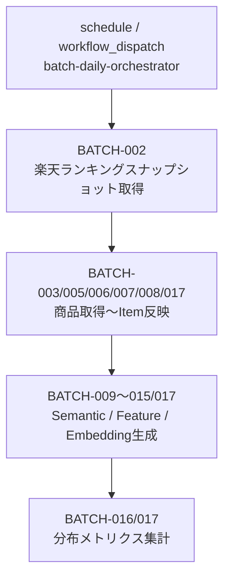
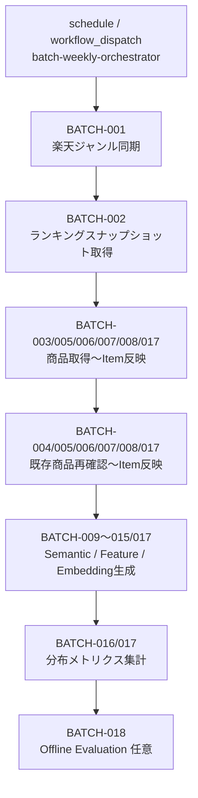

# バッチ実行スケジュール設計書

## 1. 概要

### 1.1 目的

本ドキュメントは、Gift Recommendation Service MVP におけるバッチ処理の実行スケジュールおよび実行制御方針を定義する。

バッチ設計方針書、バッチ一覧、バッチ依存関係図では、各Batch Jobの責務・入出力・依存関係を整理した。

本ドキュメントでは、それらを踏まえて、GitHub Actions上で以下をどのように制御するかを定義する。

```text
- 日次系バッチの実行スケジュール
- 週次系バッチの実行スケジュール
- 手動前提バッチの実行方針
- 親workflow / 子workflowの役割分担
- workflow間の先行関係制御
- cron設定方針
- workflow_dispatch方針
- workflow_call方針
- jobs.needsによる依存制御
- concurrencyによる多重起動防止
- 再実行・リトライ方針
```

---

## 2. 前提

### 2.1 実行基盤

| 項目               | 方針                                                                              |
| ------------------ | --------------------------------------------------------------------------------- |
| 実行基盤           | GitHub Actions                                                                    |
| 実装言語           | Python                                                                            |
| 実行方式           | GitHub Actions workflowからPythonバッチを起動                                     |
| 定期実行           | 親workflowの `on.schedule` で制御                                                 |
| 手動実行           | 親workflowまたは子workflowの `workflow_dispatch` で制御                           |
| 子workflow呼び出し | `workflow_call` によるReusable Workflowとして呼び出す                             |
| 先行関係制御       | 親workflow内の `jobs.needs` で制御                                                |
| 多重起動防止       | `concurrency` で制御                                                              |
| タイムゾーン管理   | 設計上はJSTで定義し、実装時はUTC cronへ変換する                                   |
| 実行ログ           | batch_run_log / phase_log / api_call_log / error_log / item_import_summary に記録 |

---

### 2.2 本設計書での重要な修正方針

旧設計では、各workflowに個別のcron起動時刻を設定し、開始時刻をずらすことで先行関係を疑似的に守る設計としていた。

しかし、本サービスで求める要件は以下である。

```text
深夜〜早朝の時間帯で、
各バッチ処理の先行関係を守って実行されること。
```

そのため、各workflowに個別cronを設定して時刻差で依存関係を制御するのではなく、親workflowでOrchestrationする方式へ修正する。

修正後の基本方針は以下である。

```text
- cronを持つのは原則として親workflowのみ
- 親workflowが深夜〜早朝に起動する
- 親workflow内のjobs.needsで先行関係を制御する
- 子workflowはworkflow_callで親workflowから呼び出される
- 子workflowは障害復旧・個別検証用にworkflow_dispatchも持つ
- 子workflowには原則としてscheduleを持たせない
```

---

## 3. 親workflow / 子workflow設計方針

### 3.1 親workflowの役割

親workflowは、バッチ群の実行シナリオを制御する。

| 親workflow                    | 起動方式                     | 役割                                                             |
| ----------------------------- | ---------------------------- | ---------------------------------------------------------------- |
| batch-daily-orchestrator.yml  | schedule / workflow_dispatch | 日次本線バッチを先行関係どおりに実行する                         |
| batch-weekly-orchestrator.yml | schedule / workflow_dispatch | 週次メンテナンス系を含む週次本線バッチを先行関係どおりに実行する |
| batch-manual-orchestrator.yml | workflow_dispatch            | 再実行・再生成・評価などの手動シナリオを実行する                 |

親workflowの責務は以下である。

```text
- いつ起動するかを定義する
- どの子workflowを呼び出すかを定義する
- 子workflow間の先行関係をjobs.needsで定義する
- 日次 / 週次 / 手動の実行シナリオを分離する
- 多重起動をconcurrencyで防止する
```

---

### 3.2 子workflowの役割

子workflowは、個別のバッチ処理または関連するBatch Job群を実行する。

| 子workflow                              | 主なBatch                               | 役割                                    |
| --------------------------------------- | --------------------------------------- | --------------------------------------- |
| batch-rakuten-genre-sync.yml            | BATCH-001                               | 楽天ジャンル同期                        |
| batch-rakuten-ranking-snapshot.yml      | BATCH-002                               | ランキングスナップショット取得          |
| batch-rakuten-item-import.yml           | BATCH-003 / 005 / 006 / 007 / 008 / 017 | 商品取得〜Item反映                      |
| batch-rakuten-existing-item-recheck.yml | BATCH-004 / 005 / 006 / 007 / 008 / 017 | 既存商品再確認〜Item反映                |
| batch-item-meaning-generation.yml       | BATCH-009〜015 / 017                    | Item Semantic / Feature / Embedding生成 |
| batch-distribution-metrics.yml          | BATCH-016 / 017                         | 分布メトリクス集計                      |
| batch-offline-evaluation.yml            | BATCH-018                               | Offline Evaluation                      |
| batch-feedback-analysis.yml             | BATCH-019                               | Feedback分析                            |
| batch-retry-failed-items.yml            | BATCH-010〜015                          | 失敗Item再実行                          |

子workflowのtrigger方針は以下である。

```yaml
on:
  workflow_call:
  workflow_dispatch:
```

子workflowには、原則として `schedule` を持たせない。

理由は以下である。

```text
- 子workflowが個別にcron起動すると、親workflowによる先行関係制御を迂回してしまうため
- 時刻差による疑似依存制御は、前段遅延・前段失敗に弱いため
- 深夜〜早朝枠内で順番に実行されればよく、各子workflowに個別開始時刻は不要なため
```

---

## 4. スケジュール設計の基本方針

### 4.1 基本方針

| 方針                     | 内容                                                                |
| ------------------------ | ------------------------------------------------------------------- |
| 親workflow起点           | 日次・週次・手動の親workflowを起点に実行する                        |
| 個別cronを避ける         | 子workflowには原則cronを設定しない                                  |
| 先行関係を明示する       | `jobs.needs` でworkflow呼び出し順序を定義する                       |
| 時刻差制御に依存しない   | 「前のworkflowが終わっているはず」という設計にしない                |
| 深夜〜早朝枠で実行       | Online利用が少ない時間帯に親workflowを起動する                      |
| 日次と週次を競合させない | 日次親workflowと週次親workflowの同時実行を避ける                    |
| 手動実行可能にする       | 親workflow・子workflowともに必要に応じて `workflow_dispatch` を持つ |
| 多重起動を防ぐ           | `concurrency` で日次・週次・手動の衝突を防ぐ                        |
| 失敗時は後続を止める     | 原則として先行job失敗時は後続jobを実行しない                        |
| Summaryを残す            | 各子workflowまたは親workflow末尾でImport Summaryを作成する          |

---

### 4.2 cronとneedsの役割分担

| 制御対象                 | 使用する仕組み      | 説明                                          |
| ------------------------ | ------------------- | --------------------------------------------- |
| いつバッチ群を開始するか | `schedule`          | 親workflowの開始時刻を定義する                |
| 手動で起動するか         | `workflow_dispatch` | 親workflowまたは子workflowを手動実行する      |
| どの順番で実行するか     | `jobs.needs`        | 親workflow内で子workflowの先行関係を定義する  |
| 子workflowを呼び出す     | `workflow_call`     | 親workflowからReusable Workflowとして呼び出す |
| 同時実行を防ぐ           | `concurrency`       | 同一バッチ群の多重起動を抑止する              |

重要な設計判断は以下である。

```text
cronは順序制御の仕組みではない。
cronは「いつ起動するか」を制御する。

バッチ間の先行関係は、cron時刻差ではなくjobs.needsで制御する。
```

---

## 5. タイムゾーン方針

### 5.1 JST / UTC変換

設計上の業務時刻はJSTで定義する。

GitHub ActionsのcronはUTC基準で設定するため、実装時にはJSTからUTCへ変換する。

```text
JST = UTC + 9時間
```

例：

```text
JST 01:10
= UTC 前日 16:10
= cron: '10 16 * * *'
```

曜日指定がある場合は、UTC上で曜日が前日にずれることに注意する。

例：

```text
JST 日曜 01:10
= UTC 土曜 16:10
= cron: '10 16 * * 6'
```

---

## 6. 親workflow別スケジュール

### 6.1 日次親workflow

| 項目              | 内容                                                                       |
| ----------------- | -------------------------------------------------------------------------- |
| workflow名        | batch-daily-orchestrator.yml                                               |
| 起動方式          | schedule / workflow_dispatch                                               |
| 実行頻度          | 日次                                                                       |
| 実行曜日          | 月曜〜土曜 JST                                                             |
| 推奨開始時刻      | 01:10 JST                                                                  |
| UTC cron          | `10 16 * * 0-5`                                                            |
| 目的              | 日次本線バッチを先行関係どおりに実行する                                   |
| concurrency group | `batch-mainline`                                                           |
| 子workflow        | ranking snapshot / item import / meaning generation / distribution metrics |

補足：

```text
月曜〜土曜 01:10 JST は、UTCでは前日の日曜〜金曜 16:10に該当する。
そのため、UTC cronの曜日指定は 0-5 とする。
```

日次親workflowでは、以下を実行する。

```text
BATCH-002 ランキングスナップショット取得
↓
BATCH-003 / 005 / 006 / 007 / 008 / 017 商品取得〜Item反映
↓
BATCH-009〜015 / 017 Item Semantic / Feature / Embedding生成
↓
BATCH-016 / 017 分布メトリクス集計
```

---

### 6.2 週次親workflow

| 項目              | 内容                                                                                                                                     |
| ----------------- | ---------------------------------------------------------------------------------------------------------------------------------------- |
| workflow名        | batch-weekly-orchestrator.yml                                                                                                            |
| 起動方式          | schedule / workflow_dispatch                                                                                                             |
| 実行頻度          | 週次                                                                                                                                     |
| 実行曜日          | 日曜 JST                                                                                                                                 |
| 推奨開始時刻      | 日曜 01:10 JST                                                                                                                           |
| UTC cron          | `10 16 * * 6`                                                                                                                            |
| 目的              | 週次メンテナンス系を含む週次本線バッチを実行する                                                                                         |
| concurrency group | `batch-mainline`                                                                                                                         |
| 子workflow        | genre sync / ranking snapshot / item import / existing item recheck / meaning generation / distribution metrics / offline evaluation任意 |

補足：

```text
日曜 01:10 JST は、UTCでは土曜 16:10に該当する。
そのため、UTC cronの曜日指定は 6 とする。
```

週次親workflowでは、日曜の日次本線を別途起動しない。

週次親workflowの中に、日次相当の処理も含める。

理由は以下である。

```text
- 日次親workflowと週次親workflowが同日に競合することを避けるため
- 週次メンテナンス処理後に、必要なItem反映・Feature生成・分布集計まで一気通貫で実行するため
- 日曜だけ週次メンテナンス込みの大きな本線として扱えるため
```

週次親workflowでは、以下を実行する。

```text
BATCH-001 楽天ジャンル同期
↓
BATCH-002 ランキングスナップショット取得
↓
BATCH-003 / 005 / 006 / 007 / 008 / 017 商品取得〜Item反映
↓
BATCH-004 / 005 / 006 / 007 / 008 / 017 既存商品再確認〜Item反映
↓
BATCH-009〜015 / 017 Item Semantic / Feature / Embedding生成
↓
BATCH-016 / 017 分布メトリクス集計
↓
BATCH-018 Offline Evaluation 任意
```

---

### 6.3 手動親workflow

| 項目              | 内容                                                                                         |
| ----------------- | -------------------------------------------------------------------------------------------- |
| workflow名        | batch-manual-orchestrator.yml                                                                |
| 起動方式          | workflow_dispatch                                                                            |
| 実行頻度          | 手動                                                                                         |
| 目的              | 再実行・再生成・評価などの運用シナリオを手動で実行する                                       |
| concurrency group | シナリオに応じて `batch-mainline` または専用group                                            |
| 子workflow        | retry / meaning generation / distribution metrics / offline evaluation / feedback analysis等 |

手動親workflowは、複数Batchを順番に実行する必要がある運用シナリオで利用する。

単体で完結する手動処理は、子workflowの `workflow_dispatch` を直接実行してもよい。

手動親workflowで扱う代表シナリオは以下である。

| シナリオ                     | 実行内容                                                                                    |
| ---------------------------- | ------------------------------------------------------------------------------------------- |
| failed_item_retry            | failed状態のItem Semantic / Feature / Embeddingを再実行し、必要に応じて分布再集計する       |
| semantic_config_regeneration | semantic_config_version変更に伴い、Item Semantic / Feature / Embeddingを再生成する          |
| embedding_regeneration       | embedding_model_version_id または embedding_source_version変更に伴い、Embeddingを再生成する |
| distribution_rebuild         | Feature / Meaning / Normalization分布メトリクスを再集計する                                 |
| offline_evaluation           | 評価データセットを用いてOffline Evaluationを実行する                                        |
| feedback_analysis            | Feedback分析を実行する                                                                      |

---

## 7. 日次親workflow設計

### 7.1 日次実行フロー



---

### 7.2 日次親workflow YAMLイメージ

```yaml
name: batch-daily-orchestrator

on:
  schedule:
    # Monday-Saturday 01:10 JST
    # UTC: Sunday-Friday 16:10
    - cron: "10 16 * * 0-5"
  workflow_dispatch:
    inputs:
      max_items:
        description: "Max items for meaning / embedding generation"
        required: false
        default: "500"
      run_retry_after:
        description: "Run retry workflow after daily mainline"
        required: false
        default: "false"
        type: choice
        options:
          - "false"
          - "true"

concurrency:
  group: batch-mainline
  cancel-in-progress: false

jobs:
  ranking_snapshot:
    uses: ./.github/workflows/batch-rakuten-ranking-snapshot.yml
    secrets: inherit

  item_import:
    needs: ranking_snapshot
    uses: ./.github/workflows/batch-rakuten-item-import.yml
    with:
      fetch_mode: daily
    secrets: inherit

  item_meaning_generation:
    needs: item_import
    uses: ./.github/workflows/batch-item-meaning-generation.yml
    with:
      target_status: queued
      max_items: ${{ inputs.max_items || '500' }}
    secrets: inherit

  distribution_metrics:
    needs: item_meaning_generation
    uses: ./.github/workflows/batch-distribution-metrics.yml
    secrets: inherit

  retry_failed_items:
    if: ${{ inputs.run_retry_after == 'true' }}
    needs: distribution_metrics
    uses: ./.github/workflows/batch-retry-failed-items.yml
    with:
      target_stage: all
      max_items: "100"
    secrets: inherit
```

---

## 8. 週次親workflow設計

### 8.1 週次実行フロー



---

### 8.2 週次親workflow YAMLイメージ

```yaml
name: batch-weekly-orchestrator

on:
  schedule:
    # Sunday 01:10 JST
    # UTC: Saturday 16:10
    - cron: "10 16 * * 6"
  workflow_dispatch:
    inputs:
      max_items:
        description: "Max items for meaning / embedding generation"
        required: false
        default: "1000"
      run_offline_evaluation:
        description: "Run offline evaluation after weekly mainline"
        required: false
        default: "false"
        type: choice
        options:
          - "false"
          - "true"

concurrency:
  group: batch-mainline
  cancel-in-progress: false

jobs:
  genre_sync:
    uses: ./.github/workflows/batch-rakuten-genre-sync.yml
    secrets: inherit

  ranking_snapshot:
    needs: genre_sync
    uses: ./.github/workflows/batch-rakuten-ranking-snapshot.yml
    secrets: inherit

  item_import:
    needs: ranking_snapshot
    uses: ./.github/workflows/batch-rakuten-item-import.yml
    with:
      fetch_mode: daily
    secrets: inherit

  existing_item_recheck:
    needs: item_import
    uses: ./.github/workflows/batch-rakuten-existing-item-recheck.yml
    with:
      target_scope: active
    secrets: inherit

  item_meaning_generation:
    needs: existing_item_recheck
    uses: ./.github/workflows/batch-item-meaning-generation.yml
    with:
      target_status: queued
      max_items: ${{ inputs.max_items || '1000' }}
    secrets: inherit

  distribution_metrics:
    needs: item_meaning_generation
    uses: ./.github/workflows/batch-distribution-metrics.yml
    secrets: inherit

  offline_evaluation:
    if: ${{ inputs.run_offline_evaluation == 'true' }}
    needs: distribution_metrics
    uses: ./.github/workflows/batch-offline-evaluation.yml
    secrets: inherit
```

---

## 9. 手動親workflow設計

### 9.1 手動シナリオ

手動親workflowは、運用シナリオを入力として受け取り、該当する子workflowを順番に実行する。

| scenario                     | 内容                                          | 主な実行順                                                              |
| ---------------------------- | --------------------------------------------- | ----------------------------------------------------------------------- |
| failed_item_retry            | failed対象を再実行                            | retry_failed_items → distribution_metrics                               |
| semantic_config_regeneration | semantic_config_version変更後の再生成         | item_meaning_generation → distribution_metrics → offline_evaluation任意 |
| embedding_regeneration       | Embeddingモデル・入力構築ルール変更後の再生成 | item_meaning_generationまたはembedding専用処理 → distribution_metrics   |
| distribution_rebuild         | 分布メトリクス再集計                          | distribution_metrics                                                    |
| offline_evaluation           | 評価のみ実行                                  | offline_evaluation                                                      |
| feedback_analysis            | Feedback分析                                  | feedback_analysis → offline_evaluation任意                              |

---

### 9.2 手動親workflow YAMLイメージ

```yaml
name: batch-manual-orchestrator

on:
  workflow_dispatch:
    inputs:
      scenario:
        description: "Manual batch scenario"
        required: true
        type: choice
        options:
          - failed_item_retry
          - semantic_config_regeneration
          - embedding_regeneration
          - distribution_rebuild
          - offline_evaluation
          - feedback_analysis
      max_items:
        description: "Max items to process"
        required: false
        default: "500"
      run_offline_evaluation:
        description: "Run offline evaluation after scenario"
        required: false
        default: "false"
        type: choice
        options:
          - "false"
          - "true"

concurrency:
  group: batch-manual-${{ inputs.scenario }}
  cancel-in-progress: false

jobs:
  retry_failed_items:
    if: ${{ inputs.scenario == 'failed_item_retry' }}
    uses: ./.github/workflows/batch-retry-failed-items.yml
    with:
      target_stage: all
      max_items: ${{ inputs.max_items }}
    secrets: inherit

  regenerate_meaning:
    if: ${{ inputs.scenario == 'semantic_config_regeneration' || inputs.scenario == 'embedding_regeneration' }}
    uses: ./.github/workflows/batch-item-meaning-generation.yml
    with:
      target_status: all
      max_items: ${{ inputs.max_items }}
    secrets: inherit

  distribution_metrics_after_retry:
    if: ${{ inputs.scenario == 'failed_item_retry' }}
    needs: retry_failed_items
    uses: ./.github/workflows/batch-distribution-metrics.yml
    secrets: inherit

  distribution_metrics_after_regeneration:
    if: ${{ inputs.scenario == 'semantic_config_regeneration' || inputs.scenario == 'embedding_regeneration' || inputs.scenario == 'distribution_rebuild' }}
    needs: regenerate_meaning
    uses: ./.github/workflows/batch-distribution-metrics.yml
    secrets: inherit

  feedback_analysis:
    if: ${{ inputs.scenario == 'feedback_analysis' }}
    uses: ./.github/workflows/batch-feedback-analysis.yml
    secrets: inherit

  offline_evaluation_direct:
    if: ${{ inputs.scenario == 'offline_evaluation' }}
    uses: ./.github/workflows/batch-offline-evaluation.yml
    secrets: inherit

  offline_evaluation_after_regeneration:
    if: ${{ inputs.run_offline_evaluation == 'true' && (inputs.scenario == 'semantic_config_regeneration' || inputs.scenario == 'embedding_regeneration') }}
    needs: distribution_metrics_after_regeneration
    uses: ./.github/workflows/batch-offline-evaluation.yml
    secrets: inherit
```

補足：

```text
上記はイメージであり、GitHub Actionsのif / needsの組み合わせは実装時に検証する。
特に、条件によりskipされたjobをneedsに含める場合の挙動は注意して設計する。
実装時には、シナリオ別に手動親workflowを分割する案も検討する。
```

---

## 10. 子workflow設計

### 10.1 子workflow共通方針

子workflowは、原則として以下のtriggerを持つ。

```yaml
on:
  workflow_call:
  workflow_dispatch:
```

| trigger           | 用途                                     |
| ----------------- | ---------------------------------------- |
| workflow_call     | 親workflowから呼び出される               |
| workflow_dispatch | 障害復旧・検証・個別再実行で単体実行する |

子workflowには、原則として `schedule` を設定しない。

---

### 10.2 子workflow共通構造

```yaml
name: batch-xxxx

on:
  workflow_call:
    inputs:
      target_scope:
        required: false
        type: string
        default: ""
  workflow_dispatch:
    inputs:
      target_scope:
        description: "Target scope"
        required: false
        default: ""

jobs:
  run:
    runs-on: ubuntu-latest
    timeout-minutes: 60

    steps:
      - uses: actions/checkout@v4

      - name: Set up Python
        uses: actions/setup-python@v5
        with:
          python-version: "3.12"

      - name: Install dependencies
        run: |
          pip install -r apps/batch/requirements.txt

      - name: Run batch
        env:
          DATABASE_URL: ${{ secrets.DATABASE_URL }}
          RAKUTEN_APP_ID: ${{ secrets.RAKUTEN_APP_ID }}
          OPENAI_API_KEY: ${{ secrets.OPENAI_API_KEY }}
        run: |
          python apps/batch/src/main.py --batch-name xxxx --target-scope "${{ inputs.target_scope }}"
```

---

### 10.3 子workflow一覧

| 子workflow                              | trigger                           | schedule有無 | 手動実行 | 親workflowからの呼び出し |
| --------------------------------------- | --------------------------------- | -----------: | -------: | -----------------------: |
| batch-rakuten-genre-sync.yml            | workflow_call / workflow_dispatch |         なし |        ○ |                        ○ |
| batch-rakuten-ranking-snapshot.yml      | workflow_call / workflow_dispatch |         なし |        ○ |                        ○ |
| batch-rakuten-item-import.yml           | workflow_call / workflow_dispatch |         なし |        ○ |                        ○ |
| batch-rakuten-existing-item-recheck.yml | workflow_call / workflow_dispatch |         なし |        ○ |                        ○ |
| batch-item-meaning-generation.yml       | workflow_call / workflow_dispatch |         なし |        ○ |                        ○ |
| batch-distribution-metrics.yml          | workflow_call / workflow_dispatch |         なし |        ○ |                        ○ |
| batch-retry-failed-items.yml            | workflow_call / workflow_dispatch |         なし |        ○ |                        ○ |
| batch-offline-evaluation.yml            | workflow_call / workflow_dispatch |         なし |        ○ |                        ○ |
| batch-feedback-analysis.yml             | workflow_call / workflow_dispatch |         なし |        ○ |                        ○ |

---

## 11. Batch ID別実行分類

| Batch ID  | Batch名                                 | 実行分類           | 実行親workflow                      | 備考                           |
| --------- | --------------------------------------- | ------------------ | ----------------------------------- | ------------------------------ |
| BATCH-001 | 楽天ジャンル同期Batch                   | 週次               | batch-weekly-orchestrator.yml       | 子workflow単体手動実行も可能   |
| BATCH-002 | 楽天ランキングスナップショット取得Batch | 日次 / 週次        | daily / weekly                      | 週次では日次相当処理として実行 |
| BATCH-003 | 楽天商品疑似差分取得Batch               | 日次 / 週次        | daily / weekly                      | 週次でも商品取得を実行         |
| BATCH-004 | 楽天既存商品再確認Batch                 | 週次               | weekly                              | 既存Itemヘルスチェック         |
| BATCH-005 | Raw取込・Staging変換Batch               | 後続実行           | item-import / existing-item-recheck | 独立cronなし                   |
| BATCH-006 | 商品差分判定Batch                       | 後続実行           | item-import / existing-item-recheck | 独立cronなし                   |
| BATCH-007 | Item反映Batch                           | 後続実行           | item-import / existing-item-recheck | 独立cronなし                   |
| BATCH-008 | 商品有効状態更新Batch                   | 後続実行           | item-import / existing-item-recheck | 独立cronなし                   |
| BATCH-009 | 商品意味生成キュー登録Batch             | 日次 / 週次 / 手動 | daily / weekly / manual             | 変更Itemのみ対象               |
| BATCH-010 | Item Semantic生成Batch                  | 日次 / 週次 / 手動 | daily / weekly / manual             | queue対象                      |
| BATCH-011 | Feature入力hash算出Batch                | 日次 / 週次 / 手動 | daily / weekly / manual             | feature_input_hash算出         |
| BATCH-012 | Item Feature生成Batch                   | 日次 / 週次 / 手動 | daily / weekly / manual             | 共通Feature Engine利用         |
| BATCH-013 | Feature正規化Batch                      | 日次 / 週次 / 手動 | daily / weekly / manual             | normalized_value生成           |
| BATCH-014 | Embedding入力hash算出Batch              | 日次 / 週次 / 手動 | daily / weekly / manual             | embedding_input_hash算出       |
| BATCH-015 | Item Embedding生成Batch                 | 日次 / 週次 / 手動 | daily / weekly / manual             | 高コスト処理のため件数制限     |
| BATCH-016 | 分布メトリクス集計Batch                 | 日次 / 週次 / 手動 | daily / weekly / manual             | Feature / Meaning分布監視      |
| BATCH-017 | Import Summary作成Batch                 | 各子workflow末尾   | 各子workflow                        | 独立cronなし                   |
| BATCH-018 | Offline Evaluation Batch                | 手動 / 週次任意    | weekly / manual                     | MVPでは手動中心                |
| BATCH-019 | Feedback分析Batch                       | 手動 / 週次任意    | manual                              | Feedback蓄積後に有効化         |

---

## 12. 実行スケジュール一覧

### 12.1 親workflowスケジュール

| 親workflow                    |          JST実行時刻 | UTC cron        | 実行内容                       |
| ----------------------------- | -------------------: | --------------- | ------------------------------ |
| batch-daily-orchestrator.yml  | 月曜〜土曜 01:10 JST | `10 16 * * 0-5` | 日次本線バッチ                 |
| batch-weekly-orchestrator.yml |       日曜 01:10 JST | `10 16 * * 6`   | 週次メンテナンス込み本線バッチ |
| batch-manual-orchestrator.yml |                 任意 | なし            | 手動シナリオ実行               |

---

### 12.2 日次実行内容

| 順序 | 子workflow                         | 主なBatch                               | 実行条件                     |
| ---: | ---------------------------------- | --------------------------------------- | ---------------------------- |
|    1 | batch-rakuten-ranking-snapshot.yml | BATCH-002                               | 親workflow起動時             |
|    2 | batch-rakuten-item-import.yml      | BATCH-003 / 005 / 006 / 007 / 008 / 017 | ranking_snapshot成功後       |
|    3 | batch-item-meaning-generation.yml  | BATCH-009〜015 / 017                    | item_import成功後            |
|    4 | batch-distribution-metrics.yml     | BATCH-016 / 017                         | meaning_generation成功後     |
|    5 | batch-retry-failed-items.yml       | BATCH-010〜015                          | 手動入力で有効化した場合のみ |

---

### 12.3 週次実行内容

| 順序 | 子workflow                              | 主なBatch                               | 実行条件                     |
| ---: | --------------------------------------- | --------------------------------------- | ---------------------------- |
|    1 | batch-rakuten-genre-sync.yml            | BATCH-001                               | 親workflow起動時             |
|    2 | batch-rakuten-ranking-snapshot.yml      | BATCH-002                               | genre_sync成功後             |
|    3 | batch-rakuten-item-import.yml           | BATCH-003 / 005 / 006 / 007 / 008 / 017 | ranking_snapshot成功後       |
|    4 | batch-rakuten-existing-item-recheck.yml | BATCH-004 / 005 / 006 / 007 / 008 / 017 | item_import成功後            |
|    5 | batch-item-meaning-generation.yml       | BATCH-009〜015 / 017                    | existing_item_recheck成功後  |
|    6 | batch-distribution-metrics.yml          | BATCH-016 / 017                         | meaning_generation成功後     |
|    7 | batch-offline-evaluation.yml            | BATCH-018                               | 手動入力で有効化した場合のみ |

---

## 13. 多重起動防止方針

### 13.1 親workflowのconcurrency

日次親workflowと週次親workflowは、同じmainline系バッチであるため、同一concurrency groupを利用する。

```yaml
concurrency:
  group: batch-mainline
  cancel-in-progress: false
```

目的は以下である。

```text
- 日次本線と週次本線が同時実行されることを防ぐ
- 手動で日次親workflowを実行した際に、定期実行と競合することを防ぐ
- Item正本更新、Feature生成、Embedding生成が同時に走ることを防ぐ
```

---

### 13.2 手動workflowのconcurrency

手動親workflowは、シナリオに応じてconcurrency groupを分ける。

| シナリオ                     | concurrency group          | 理由                                                         |
| ---------------------------- | -------------------------- | ------------------------------------------------------------ |
| failed_item_retry            | batch-item-generation      | 通常のmeaning generationと競合させない                       |
| semantic_config_regeneration | batch-mainline             | Item Feature / Embedding全体に影響するため本線と競合させない |
| embedding_regeneration       | batch-item-generation      | Embedding生成と競合させない                                  |
| distribution_rebuild         | batch-distribution-metrics | 分布集計の二重起動を避ける                                   |
| offline_evaluation           | batch-offline-evaluation   | 評価処理の二重起動を避ける                                   |
| feedback_analysis            | batch-feedback-analysis    | 分析処理の二重起動を避ける                                   |

補足：

```text
concurrencyは先行関係制御ではなく、同時実行抑止のために使う。
先行関係はjobs.needsで制御する。
```

---

## 14. タイムアウト設計

| workflow                                | timeout目安 | 理由                                  |
| --------------------------------------- | ----------: | ------------------------------------- |
| batch-daily-orchestrator.yml            |    4〜5時間 | 日次本線全体の上限                    |
| batch-weekly-orchestrator.yml           |    6〜8時間 | 週次メンテナンス込みのため長め        |
| batch-rakuten-genre-sync.yml            |        30分 | ジャンル同期                          |
| batch-rakuten-ranking-snapshot.yml      |    30〜60分 | 対象ジャンル数に依存                  |
| batch-rakuten-item-import.yml           |        90分 | 商品取得・Staging・Item反映を含む     |
| batch-rakuten-existing-item-recheck.yml |   90〜120分 | 既存商品数に依存                      |
| batch-item-meaning-generation.yml       |       120分 | LLM / Embedding等の高コスト処理を含む |
| batch-distribution-metrics.yml          |        30分 | 集計中心                              |
| batch-retry-failed-items.yml            |    30〜60分 | 件数制限付き再実行                    |
| batch-offline-evaluation.yml            |        60分 | 評価データセット規模に依存            |
| batch-feedback-analysis.yml             |    30〜60分 | Feedback件数に依存                    |

MVPでは、長時間化を避けるため、以下を設定する。

```text
- max_items
- max_pages
- batch_chunk_size
- timeout-minutes
```

---

## 15. 失敗時の挙動

### 15.1 原則

親workflow内の子workflow呼び出しは、原則として先行jobが成功した場合のみ後続jobを実行する。

例：

```text
ranking_snapshot が failed
↓
item_import は実行しない
↓
meaning_generation も実行しない
↓
distribution_metrics も実行しない
```

理由は以下である。

```text
- 先行Batchの出力を後続Batchの入力として利用するため
- 失敗した状態で後続処理を進めると、不完全データが広がる可能性があるため
- 再実行単位を明確にするため
```

---

### 15.2 Summaryの扱い

Import Summaryは、各子workflow末尾で作成する。

ただし、親workflow全体が途中失敗した場合でも、親workflowの失敗状況を把握できるように、将来的にはOrchestrator Run Summaryを追加することを検討する。

MVPでは、以下を基本とする。

```text
- 各子workflow内でBATCH-017 Import Summaryを作成する
- 親workflowの実行結果はGitHub Actionsのrun結果で確認する
- 必要に応じてbatch_run_logにorchestrator_run_id相当を追加する
```

---

### 15.3 再実行単位

| 失敗箇所               | 再実行方法                                | 再実行単位                                                                             |
| ---------------------- | ----------------------------------------- | -------------------------------------------------------------------------------------- |
| ジャンル同期失敗       | 子workflow手動実行 / 週次親workflow再実行 | 全体 / target genre                                                                    |
| ランキング取得失敗     | 子workflow手動実行 / 日次親workflow再実行 | genre_id + period                                                                      |
| 商品取得失敗           | 子workflow手動実行 / 日次親workflow再実行 | fetch_cursor / genre / keyword                                                         |
| 既存商品再確認失敗     | 子workflow手動実行 / 週次親workflow再実行 | item_id / target_scope                                                                 |
| Staging変換失敗        | item-import系子workflow再実行             | raw_metadata_id                                                                        |
| Item反映失敗           | item-import系子workflow再実行             | product_diff_result                                                                    |
| Semantic生成失敗       | retry-failed-items                        | item_generation_queue_id                                                               |
| Feature生成失敗        | retry-failed-items                        | item_id + semantic_config_version_id + feature_input_hash                              |
| Embedding生成失敗      | retry-failed-items                        | item_id + embedding_model_version_id + embedding_source_version + embedding_input_hash |
| 分布集計失敗           | distribution-metrics子workflow手動実行    | aggregation_scope + version                                                            |
| Offline Evaluation失敗 | offline-evaluation子workflow手動実行      | evaluation_dataset_id                                                                  |

---

## 16. MVP初期運用方針

### 16.1 Phase 1：手動中心

初期開発・検証段階では、親workflowのscheduleを有効化せず、手動実行中心にする。

対象：

```text
- batch-daily-orchestrator.yml
- batch-weekly-orchestrator.yml
- batch-manual-orchestrator.yml
- 各子workflow
```

目的：

```text
- データ量を制御しながら検証する
- 楽天APIレスポンスの揺れを確認する
- Raw / Staging / Item反映の妥当性を確認する
- Feature / Embedding生成コストを確認する
- 分布メトリクスの異常を確認する
```

---

### 16.2 Phase 2：日次親workflow有効化

基本処理が安定したら、以下を有効化する。

```text
batch-daily-orchestrator.yml
```

実行内容：

```text
ランキング
↓
商品取得
↓
Item反映
↓
Item Semantic / Feature / Embedding生成
↓
分布メトリクス集計
```

---

### 16.3 Phase 3：週次親workflow有効化

商品件数が増え、推薦対象商品の鮮度維持が必要になったら、以下を有効化する。

```text
batch-weekly-orchestrator.yml
```

実行内容：

```text
ジャンル同期
↓
ランキング
↓
商品取得
↓
既存商品再確認
↓
Item反映
↓
Item Semantic / Feature / Embedding生成
↓
分布メトリクス集計
```

---

### 16.4 Phase 4：評価・Feedback分析有効化

評価データ・Feedbackが蓄積したら、以下を有効化する。

```text
batch-offline-evaluation.yml
batch-feedback-analysis.yml
```

または、以下の手動シナリオで実行する。

```text
batch-manual-orchestrator.yml
```

---

## 17. レビュー観点

| 観点           | 確認内容                                                         |
| -------------- | ---------------------------------------------------------------- |
| 親workflow化   | 日次・週次・手動の親workflowで実行シナリオが分離されているか     |
| 個別cron排除   | 子workflowに不要なscheduleが設定されていないか                   |
| 先行関係制御   | workflow間の順序がcron時刻差ではなくjobs.needsで制御されているか |
| 深夜〜早朝要件 | 親workflowの開始時刻が深夜〜早朝に設定されているか               |
| JST / UTC変換  | JST時刻とUTC cronの対応が正しいか                                |
| 日次・週次競合 | 日次親workflowと週次親workflowが同日に競合しないか               |
| 週次本線       | 日曜は週次workflow内に日次相当処理も含まれているか               |
| 手動実行       | 親workflow・子workflowに必要なworkflow_dispatchがあるか          |
| workflow_call  | 子workflowが親workflowから呼び出せる構造になっているか           |
| concurrency    | mainline系バッチの同時実行が抑止されているか                     |
| 高コスト処理   | Feature / Embedding生成にmax_items等の制限があるか               |
| 失敗時停止     | 先行job失敗時に後続jobが不用意に実行されないか                   |
| 再実行性       | failed ItemやRaw単位で再実行できるか                             |
| Summary        | BATCH-017が各子workflow末尾で実行されるか                        |
| MVP段階適合    | 初期から全定期実行せず、段階的に有効化できるか                   |

---

## 18. まとめ

MVPにおけるバッチ実行スケジュールは、以下の方針とする。

```text
- 各workflowに個別cronを設定して時刻差で依存関係を制御しない
- 日次・週次・手動の親workflowを用意する
- 親workflowのみがscheduleを持つ
- 子workflowはworkflow_callで親workflowから呼び出される
- 子workflowは個別再実行用にworkflow_dispatchを持つ
- workflow間の先行関係はjobs.needsで制御する
- concurrencyは同時実行抑止に使い、先行関係制御には使わない
- 日次親workflowは月曜〜土曜の深夜に実行する
- 週次親workflowは日曜の深夜に実行し、日次相当処理も含める
- 手動親workflowは再実行・再生成・評価などの運用シナリオに利用する
```

推奨スケジュールは以下である。

```text
日次:
月曜〜土曜 01:10 JST
batch-daily-orchestrator.yml

週次:
日曜 01:10 JST
batch-weekly-orchestrator.yml

手動:
任意
batch-manual-orchestrator.yml
```

日次本線の実行順序は以下である。

```text
ランキングスナップショット取得
↓
商品取得〜Item反映
↓
Item Semantic / Feature / Embedding生成
↓
分布メトリクス集計
```

週次本線の実行順序は以下である。

```text
楽天ジャンル同期
↓
ランキングスナップショット取得
↓
商品取得〜Item反映
↓
既存商品再確認〜Item反映
↓
Item Semantic / Feature / Embedding生成
↓
分布メトリクス集計
↓
Offline Evaluation 任意
```

重要な設計判断は以下である。

```text
cron
= いつバッチ群を開始するか

jobs.needs
= どの順番で実行するか

workflow_call
= 子workflowを再利用可能にする

workflow_dispatch
= 手動で再実行する

concurrency
= 同時実行を防ぐ
```
