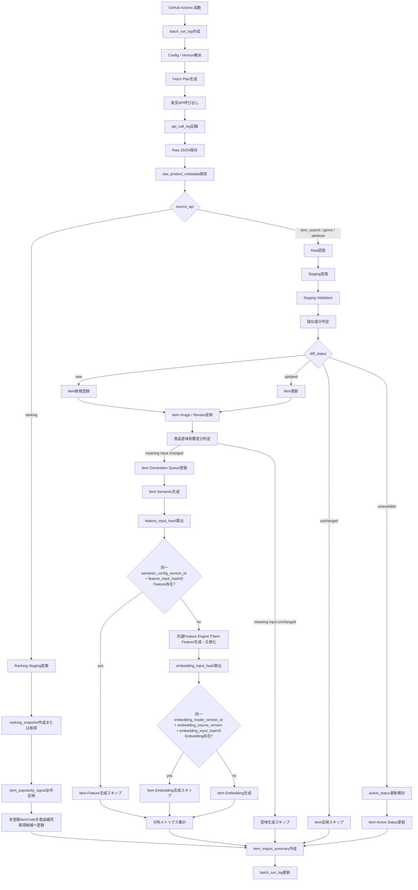
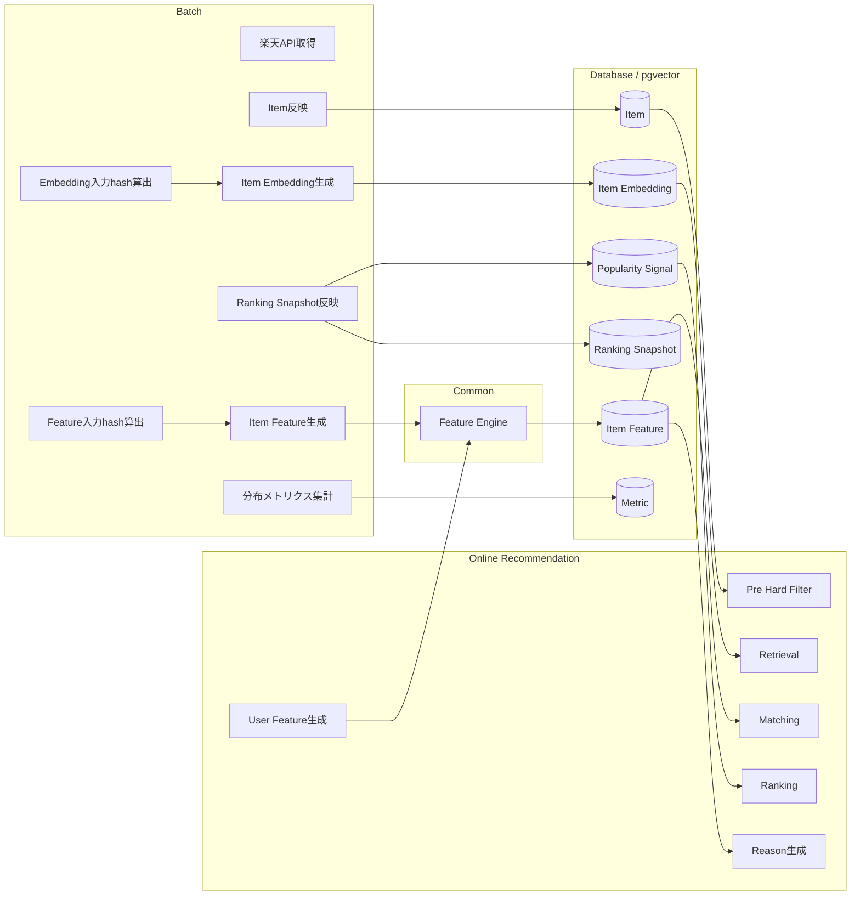
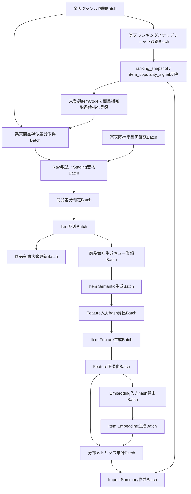
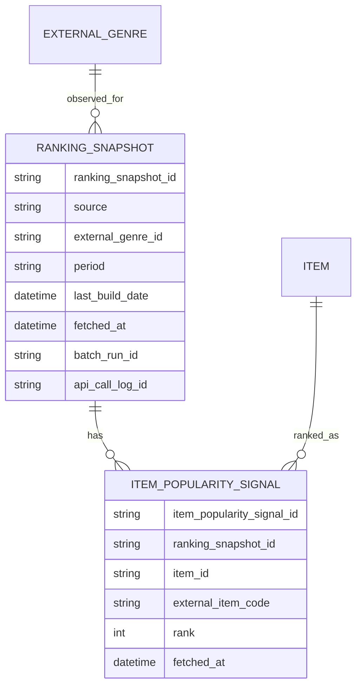
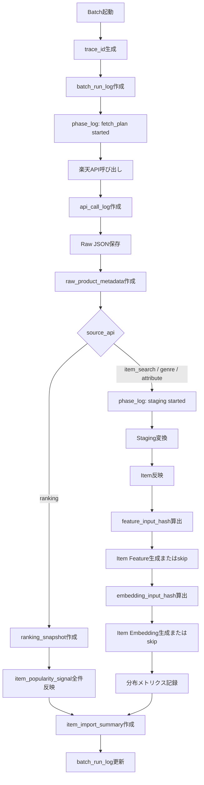

# バッチ設計方針書

## 1. 概要

### 1.1 目的

本ドキュメントは、Gift Recommendation Service MVP におけるバッチ処理の設計方針を定義する。

本サービスでは、Online推薦処理の前提として、以下のデータを事前に整備する必要がある。

- 楽天市場商品データ
- 商品画像URL
- 商品レビュー要約
- ランキングスナップショット
- 人気補助シグナル
- Item Semantic
- Item Feature
- Item Embedding
- Feature / Meaning / 正規化分布メトリクス

これらは、ユーザー操作に同期して都度生成するのではなく、Batch処理として事前生成・更新する。

本ドキュメントでは、以下を明確にする。

```text
- バッチ実行方式
- GitHub Actionsでの実行方針
- バッチ処理の対象範囲
- Online処理との責務分離
- 外部商品データ取得方針
- 外部データ種別ごとの反映方針
- Raw保存 / Staging変換 / Item反映方針
- 商品・ジャンル・属性の疑似差分反映方針
- ランキングのスナップショット全件反映方針
- Item Feature / Item Embedding生成方針
- Feature / Embedding入力hash管理方針
- 共通Feature Engine利用方針
- 分布メトリクス集計方針
- 状態管理方針
- ログ / Observability方針
- エラー / リトライ方針
- 冪等性 / 再実行方針
- 後続のバッチ一覧・バッチ仕様書への引き継ぎ事項
```

---

## 2. 利用したインプット成果物

利用したインプット成果物は以下です。

- 処理構成定義書.md
- 外部商品データ連携設計書.md
- API一覧.md
- インターフェース一覧.md
- ログ・Observability設計書.md
- エラーコード定義書.md
- 状態遷移設計書.md
- リソース一覧.md
- リソース責務定義表.md
- 正本定義表.md
- 論理ER.md
- 機能一覧.md
- モジュール一覧.md
- 機能×モジュール対応表.md
- Recoモジュール一覧.md
- Feature定義書.md
- Gift Meaning Space定義書.md
- Semantic Concept定義書.md
- Featureルール定義書.md
- Semanticルール定義書.md

---

## 3. 本ドキュメントの位置づけ

| 成果物                       | 本ドキュメントとの関係                                                                       |
| ---------------------------- | -------------------------------------------------------------------------------------------- |
| 処理構成定義書.md            | Batch処理の処理系統・先行関係・責務境界の前提                                                |
| 外部商品データ連携設計書.md  | 楽天API連携、Raw保存、疑似差分取得、ランキングスナップショット反映、Item反映の前提           |
| API一覧.md                   | バッチ処理そのものをAPI化しない方針、外部API連携・Storage連携の前提                          |
| 状態遷移設計書.md            | Batch Run、API Call、Raw Metadata、Item Generation Queue等の状態前提                         |
| ログ・Observability設計書.md | batch_run_log、phase_log、api_call_log、error_log、item_import_summary、分布メトリクスの前提 |
| エラーコード定義書.md        | GRS-BAT / GRS-EXT / GRS-RAW / GRS-DB / GRS-LLM等のエラー分類前提                             |
| 正本定義表.md                | Batchごとに更新する正本・Raw・Metadata・派生データの前提                                     |
| 論理ER.md                    | Batch関連テーブル、外部商品データ系、Staging系、Feature / Embedding系の論理構造前提          |
| 機能一覧.md                  | Batch対象機能の前提                                                                          |
| モジュール一覧.md            | Batchで利用する実装モジュールの前提                                                          |
| 機能×モジュール対応表.md     | Batch対象機能とモジュール対応の前提                                                          |
| Feature定義書.md             | User / Item Featureを共通Feature定義に基づいて生成する前提                                   |
| Semanticルール定義書.md      | Item Semantic抽出の入力・出力・ルール前提                                                    |
| Featureルール定義書.md       | Item Feature生成・正規化・分布監視の前提                                                     |

---

## 4. 基本方針

### 4.1 バッチ実行方式

MVPにおけるバッチ実行方式は以下とする。

| 項目            | 方針                                                                     |
| --------------- | ------------------------------------------------------------------------ |
| 実装言語        | Python                                                                   |
| 実行基盤        | GitHub Actions                                                           |
| 実行形態        | 常駐HTTPサービスではなく、Pythonスクリプト実行                           |
| 起動方式        | GitHub Actions workflow                                                  |
| バッチ処理API化 | しない                                                                   |
| 外部API呼び出し | batchから楽天API / OpenAI Embedding API / 必要に応じてLLM APIを呼び出す  |
| Storage連携     | batchからObject StorageへRaw JSONを保存・読取する                        |
| DB連携          | batchからDatabaseへMetadata / Staging / Item / Feature / Log等を保存する |

重要な判断は以下である。

```text
Batch処理そのものはInternal APIとして定義しない。
Batch起動はGitHub Actions workflowで管理する。
Batchが呼び出す楽天API・LLM API・Storage連携は、External API連携 / Storage連携として管理する。
```

---

### 4.2 Online処理との責務分離

Online処理とBatch処理は明確に分離する。

| 処理種別 | 主な責務                                         | 代表処理                                                                                               |
| -------- | ------------------------------------------------ | ------------------------------------------------------------------------------------------------------ |
| Online   | ユーザー操作に同期して推薦結果を返す             | レコメンド実行、User Feature生成、Matching、Ranking、Feedback登録、商品詳細取得                        |
| Batch    | 推薦に必要な商品データ・意味データを事前準備する | 商品取得、Raw保存、Item反映、ランキングスナップショット反映、Item Feature生成、Embedding生成、分布集計 |
| 共通     | OL / BT双方で利用する設定・ロジック・Repository  | Config / Version解決、Feature Engine、Error Log、Phase Log                                             |
| 運用     | CI、スケジュール、手動実行、失敗時再実行         | GitHub Actions、workflow_dispatch                                                                      |

Online処理中に、楽天APIへ商品情報を取りに行かない。

理由は以下である。

- レコメンド実行のレスポンス時間が不安定になるため
- 楽天API障害・Rate LimitがOnline推薦に直接影響するため
- Feature / Embeddingが未生成の商品を推薦候補に含めると品質が不安定になるため
- 商品数増加時に全商品処理が困難になるため

---

### 4.3 Batchの主な責務

Batchの主な責務は以下である。

```text
1. 外部商品データ取得計画を作成する
2. 楽天ジャンル情報を取得・更新する
3. 楽天ランキング情報を取得し、ranking_snapshot / item_popularity_signalへスナップショット全件反映する
4. 楽天商品検索APIから商品候補を取得する
5. 既存商品を再確認する
6. Raw JSONをObject Storageへ保存する
7. Raw MetadataをDBへ保存する
8. Raw JSONを読み取り、Stagingへ変換する
9. 商品・ジャンル・属性について疑似差分判定を行う
10. Item / Item Image / Review Summaryへ反映する
11. 商品有効状態を更新する
12. 商品意味生成キューを登録する
13. Item Semanticを抽出する
14. Feature入力hashを算出する
15. 共通Feature Engineを用いて、Item Featureを生成・正規化する
16. Embedding入力hashを算出する
17. Item Embeddingを生成・保存する
18. Feature / Meaning / 正規化分布メトリクスを集計する
19. Import Summaryを作成する
20. Batch Run / Phase / Error / API Call Logを記録する
```

---

### 4.4 共通Feature Engine利用方針

User Feature生成とItem Feature生成は、同じFeature定義・同じFeatureルール・同じ正規化方針・同じMeaning射影ルールに基づく。

ただし、実行環境と入力ソースは異なる。

| 区分               | User Feature                                                                        |
| ------------------ | ----------------------------------------------------------------------------------- |
| 実行タイミング     | Online                                                                              |
| 実行コンポーネント | apps/reco                                                                           |
| 主な入力           | relationship / occasion / preferred_condition / non_preferred_condition / free_text |
| 出力               | user_feature / user_meaning                                                         |
| 利用目的           | その場のRecommendation Requestに対するMatching                                      |

| 区分               | Item Feature                                           |
| ------------------ | ------------------------------------------------------ |
| 実行タイミング     | Batch                                                  |
| 実行コンポーネント | apps/batch                                             |
| 主な入力           | item_name / item_description / genre / attribute / tag |
| 出力               | item_feature / item_meaning                            |
| 利用目的           | Online推薦で利用する商品側の事前生成Feature            |

方針は以下である。

```text
Feature推定・正規化・Meaning射影の中核ロジックは、Online / Batchで二重実装しない。
共通Feature Engineをmonorepo内の共通Pythonパッケージとして実装する。
OnlineではUser Feature生成から共通Feature Engineを利用する。
BatchではItem Feature生成から共通Feature Engineを利用する。
User側とItem側では入力ソースが異なるため、入力アダプタと前処理はそれぞれのコンポーネントに配置する。
```

推奨配置は以下である。

```text
apps/reco
  - Online推薦固有処理
  - User入力解析
  - User Semantic生成
  - User Feature生成呼び出し
  - Matching / Ranking

apps/batch
  - Batch固有処理
  - 楽天商品取得
  - Raw保存
  - Item反映
  - Item Semantic生成
  - Feature入力hash算出
  - Item Feature生成呼び出し
  - Embedding入力hash算出
  - Item Embedding生成

packages/feature_engine
  - Feature定義
  - Feature Vector
  - Concept → Feature Delta
  - Feature統合
  - Feature正規化
  - Social / Symbolic射影
```

---

## 5. バッチ対象範囲

### 5.1 MVP対象

| Batch対象                               | MVP対象 | 概要                                                                                 |
| --------------------------------------- | ------- | ------------------------------------------------------------------------------------ |
| 楽天ジャンル同期Batch                   | ○       | 楽天ジャンル階層・ジャンル参照情報を取得・更新する                                   |
| 楽天ランキングスナップショット取得Batch | ○       | ランキングAPI結果をranking_snapshot / item_popularity_signalへ全件反映する           |
| 楽天商品疑似差分取得Batch               | ○       | 更新順・ジャンル別・キーワード等で商品候補を取得する                                 |
| 楽天既存商品再確認Batch                 | ○       | 登録済み商品の価格、販売状態、画像URL等を再確認する                                  |
| Raw保存Batch                            | ○       | 外部APIレスポンスRaw JSONをObject Storageへ保存する                                  |
| Raw Metadata保存Batch                   | ○       | object_key、hash、取得日時、取込状態等をDBへ保存する                                 |
| Raw取込・Staging変換Batch               | ○       | Raw JSONを内部取込形式へ変換する                                                     |
| Item反映Batch                           | ○       | StagingからItem正本・関連テーブルへ反映する                                          |
| 商品有効状態更新Batch                   | ○       | 販売不可、取得不能、除外対象を推薦対象外へ更新する                                   |
| 商品意味生成キュー登録Batch             | ○       | 新規・更新Itemを意味生成対象に登録する                                               |
| Item Semantic生成Batch                  | ○       | 商品情報からSemantic Conceptを抽出する                                               |
| Feature入力hash算出Batch                | ○       | Item Feature生成に使う入力データからfeature_input_hashを算出する                     |
| Item Feature生成Batch                   | ○       | 共通Feature Engineを用いて、Item Semantic / 商品メタデータから8次元Featureを生成する |
| Feature正規化Batch                      | ○       | 共通Feature Engineを用いて、raw Featureを正規化し、Matching可能な値にする            |
| Embedding入力hash算出Batch              | ○       | Embedding生成に使う入力テキストからembedding_input_hashを算出する                    |
| Item Embedding生成Batch                 | ○       | Retrieval用の商品Embeddingを生成・保存する                                           |
| 分布メトリクス集計Batch                 | ○       | Feature / Meaning / 正規化分布を集計する                                             |
| Import Summary作成Batch                 | ○       | 取得・新規・更新・失敗等の件数を集計する                                             |
| Offline Evaluation Batch                | △       | 評価データ整備後に本格化する                                                         |
| Feedback分析Batch                       | △       | Feedback蓄積後に本格化する                                                           |
| 楽天属性取得Batch                       | △       | MVPでは任意、後続拡張候補                                                            |

---

### 5.2 MVP対象外

| 対象外                                    | 理由                                                                |
| ----------------------------------------- | ------------------------------------------------------------------- |
| 常駐Batch Worker                          | MVPではGitHub Actionsで十分なため                                   |
| Queue基盤による非同期実行                 | 初期構成としては過剰なため                                          |
| Airflow / Dagster等の専用ワークフロー基盤 | MVPでは運用コストが高いため                                         |
| 商品画像バイナリ保存                      | MVPでは画像URL参照で扱うため                                        |
| 完全な楽天市場全件同期                    | 楽天市場全体を毎回取得するのはコスト・時間面で非現実的なため        |
| ランキング履歴の高度分析                  | MVPではスナップショット保存までを対象とし、高度分析は後続拡張とする |
| 自動Feature学習                           | 学習データ不足のため                                                |
| 個人別Feature最適化                       | MVPでは認証・履歴管理を対象外とするため                             |
| 大規模な自動ルール改善                    | 評価データ蓄積後に検討するため                                      |

---

## 6. 全体処理フロー

### 6.1 Batch全体フロー



---

### 6.2 BatchとOnline推薦の接続



---

## 7. ジョブ分割方針

### 7.1 ジョブ分割の基本方針

Batchは、以下の観点でジョブを分割する。

| 観点         | 方針                                                                                                      |
| ------------ | --------------------------------------------------------------------------------------------------------- |
| 外部API別    | 商品検索、ランキング、ジャンルを分ける                                                                    |
| データ性質別 | マスタ系データとスナップショット系データを分ける                                                          |
| 処理責務別   | 取得、保存、変換、反映、意味生成、入力hash算出、集計を分ける                                              |
| 再実行単位   | 失敗したフェーズだけ再実行できる粒度にする                                                                |
| コスト特性   | LLM / Embedding等の高コスト処理は独立させる                                                               |
| データ量     | 大量商品処理はchunk単位に分割する                                                                         |
| 依存関係     | Raw保存後にStaging、Item反映後にFeature / Embedding入力hash算出、Feature生成後にEmbedding生成の順序を守る |
| 観測性       | batch_run_log / phase_logで追跡可能な単位にする                                                           |

---

### 7.2 推奨Batch Job一覧

| Job ID    | Batch Job                               | 主な処理                                                  | 主な入力                                                           | 主な出力                                                                   | MVP |
| --------- | --------------------------------------- | --------------------------------------------------------- | ------------------------------------------------------------------ | -------------------------------------------------------------------------- | --- |
| BATCH-001 | 楽天ジャンル同期Batch                   | ジャンル階層取得・更新                                    | fetch_plan                                                         | external_genre / raw_product_metadata                                      | ○   |
| BATCH-002 | 楽天ランキングスナップショット取得Batch | ランキング取得・スナップショット全件反映                  | fetch_plan / target_genre                                          | ranking_snapshot / item_popularity_signal / raw_product_metadata           | ○   |
| BATCH-003 | 楽天商品疑似差分取得Batch               | 商品候補取得・Raw保存                                     | fetch_cursor / genre / keyword / ranking補完候補                   | raw_product_json / raw_product_metadata                                    | ○   |
| BATCH-004 | 楽天既存商品再確認Batch                 | 登録済み商品の現在状態確認                                | item / external_item_code                                          | raw_product_metadata / active_status候補                                   | ○   |
| BATCH-005 | Raw取込・Staging変換Batch               | Raw読取・内部形式変換                                     | raw_product_metadata / raw_product_json                            | staging_item / staging_item_image / staging_ranking_signal / staging_genre | ○   |
| BATCH-006 | 商品差分判定Batch                       | 商品マスタ系normalized_hash比較                           | staging_item / item                                                | product_diff_result                                                        | ○   |
| BATCH-007 | Item反映Batch                           | Item正本・関連テーブル更新                                | staging / product_diff_result                                      | item / item_image / review_summary                                         | ○   |
| BATCH-008 | 商品有効状態更新Batch                   | 取得不能・販売不可商品の状態更新                          | product_diff_result / recheck result                               | item.active_status                                                         | ○   |
| BATCH-009 | 商品意味生成キュー登録Batch             | 新規・更新商品を生成対象化                                | item / product_diff_result / meaning_input_diff                    | item_generation_queue                                                      | ○   |
| BATCH-010 | Item Semantic生成Batch                  | 商品情報からSemantic Concept抽出                          | item / genre / tag / description                                   | item_semantic                                                              | ○   |
| BATCH-011 | Feature入力hash算出Batch                | Feature生成入力を正規化し、feature_input_hashを算出       | item / item_semantic / genre / attribute / tag                     | feature_input_hash                                                         | ○   |
| BATCH-012 | Item Feature生成Batch                   | 共通Feature Engineで8次元Feature raw生成                  | item_semantic / item metadata / feature rules / feature_input_hash | item_feature.raw_value / feature_input_hash                                | ○   |
| BATCH-013 | Feature正規化Batch                      | 共通Feature Engineでz-score + sigmoid等により正規化       | item_feature.raw_value / normalization stats                       | item_feature.normalized_value                                              | ○   |
| BATCH-014 | Embedding入力hash算出Batch              | Embedding入力テキストを構築し、embedding_input_hashを算出 | item_text_context                                                  | embedding_input_hash                                                       | ○   |
| BATCH-015 | Item Embedding生成Batch                 | 商品テキスト文脈からEmbedding生成                         | item_text_context / embedding_input_hash                           | item_embedding / embedding_input_hash                                      | ○   |
| BATCH-016 | 分布メトリクス集計Batch                 | Feature / Meaning / 正規化分布集計                        | item_feature / item_meaning                                        | distribution metrics                                                       | ○   |
| BATCH-017 | Import Summary作成Batch                 | 取込件数・失敗件数集計                                    | batch_run / logs / diff / snapshot                                 | item_import_summary                                                        | ○   |
| BATCH-018 | Offline Evaluation Batch                | 評価データセットで推薦品質評価                            | evaluation_dataset                                                 | evaluation_result / evaluation_metric                                      | △   |
| BATCH-019 | Feedback分析Batch                       | Feedback傾向分析                                          | recommendation_feedback                                            | feedback_analysis_result                                                   | △   |

#### 補足：商品意味生成キュー登録Batchの条件について

itemName / catchcopy / itemCaption / genreId / attribute / tag など、商品意味に影響する項目が変わった場合のみ item_generation_queue に登録する。

reviewAverage / reviewCount / price / rank / availability / itemUrl のみの変更では、item_generation_queue には登録しない。

#### 補足：Feature / Embedding生成Batchのskip条件について

Item Feature生成は、同一 `item_id`、同一 `semantic_config_version_id`、同一 `feature_input_hash` の成功済み生成結果が存在する場合のみskipする。

Item Embedding生成は、同一 `item_id`、同一 `embedding_model_version_id`、同一 `embedding_source_version`、同一 `embedding_input_hash` の成功済み生成結果が存在する場合のみskipする。

---

### 7.3 先行関係



---

## 8. 外部商品データ取得方針

### 8.1 利用する外部API

MVPで利用する楽天APIは以下とする。

| 外部API               | 用途                                               | 主な反映先                                |
| --------------------- | -------------------------------------------------- | ----------------------------------------- |
| 楽天商品検索API       | 商品情報の正本取得元                               | item / item_image / item_review_summary   |
| 楽天商品ランキングAPI | ランキングスナップショット・人気補助シグナル取得元 | ranking_snapshot / item_popularity_signal |
| 楽天ジャンル検索API   | ジャンル階層・対象ジャンル管理                     | external_genre / staging_genre            |
| 楽天属性検索API       | 属性情報取得                                       | MVPでは任意・後続候補                     |

---

### 8.2 外部データ種別ごとの反映方針

外部商品データは、データ種別ごとに性質が異なるため、反映方針を分ける。

| 外部データ | データ性質                      | 反映方針                               | 主な保存先                                |
| ---------- | ------------------------------- | -------------------------------------- | ----------------------------------------- |
| 商品       | マスタ / 現在値                 | 疑似差分反映                           | item                                      |
| ジャンル   | マスタ / 参照データ             | upsert / 差分反映                      | external_genre                            |
| 属性       | マスタ / 参照データ             | upsert / 差分反映                      | external_attribute等                      |
| ランキング | 観測値 / 時系列スナップショット | 取得単位ごとにスナップショット全件反映 | ranking_snapshot / item_popularity_signal |

重要な方針は以下である。

```text
商品・ジャンル・属性は、外部参照マスタまたは内部商品正本として扱うため、疑似差分反映またはupsertを基本とする。

ランキングは固定的なマスタではなく、時点ごとに変化する観測データである。
そのため、楽天ランキングAPIの取得結果は、差分反映ではなく、取得対象ランキング単位のスナップショットとして全件反映する。
```

---

### 8.3 楽天商品検索APIの扱い

楽天商品検索APIは、商品情報の主要取得元として扱う。

主な取得項目は以下である。

| 項目                             | 用途                   |
| -------------------------------- | ---------------------- |
| itemCode                         | 外部商品識別子         |
| itemName                         | 商品名                 |
| catchcopy / itemCaption          | 商品説明・意味抽出素材 |
| itemPrice                        | 価格条件・表示         |
| itemUrl                          | 外部EC遷移             |
| mediumImageUrls / smallImageUrls | 商品画像URL            |
| reviewAverage / reviewCount      | レビュー要約           |
| genreId                          | ジャンル分類           |
| availability                     | 販売可否・有効状態判定 |
| shopCode / shopName              | 店舗情報               |

---

### 8.4 楽天ランキングAPIの扱い

楽天ランキングAPIは、Item正本の直接更新元ではなく、ランキングスナップショットおよび人気補助シグナル取得元として扱う。

| 項目                     | 方針                                                                          |
| ------------------------ | ----------------------------------------------------------------------------- |
| rank                     | item_popularity_signalへ保存                                                  |
| genreId                  | ranking_snapshotの観測対象ジャンルとして保存                                  |
| period / lastBuildDate   | ranking_snapshotの観測条件・**観測キー**として保存（§8.4.1）                  |
| —（Batch反映日時）       | ranking_snapshotの`fetched_at`として保存（観測キーには含めない）              |
| itemCode                 | item_popularity_signalへ保存し、内部itemと紐づけ可能な場合はitem_idを補完する |
| itemName / price / image | 原則としてItem正本には反映しない                                              |
| 未登録itemCode           | 商品検索APIで商品正本を補完取得する候補として登録する                         |

ランキング取得結果は、以下の2層で保存する。

```text
ranking_snapshot
  = ランキング取得単位のヘッダ

item_popularity_signal
  = ランキングスナップショット内の商品順位明細
```

論理関係は以下である。



#### 8.4.1 観測キーと `fetched_at` の役割分担

ランキング Snapshot ヘッダの冪等キー（観測キー）は、楽天 API が示す **ランキング観測時点** を正とする。

```text
観測キー（冪等）:
  source + external_genre_id + period + last_build_date

運用メタ（観測キー外）:
  fetched_at, batch_run_id, api_call_log_id, created_at
```

| カラム | 意味 | 観測キーへの含否 |
| ------ | ---- | ---------------- |
| `last_build_date` | 楽天ランキング API `lastBuildDate`（ランキングデータの API 側更新日時） | **含める** |
| `fetched_at` | 本サービスが当該 Snapshot を DB へ反映した日時 | **含めない** |

同一 `last_build_date` の API レスポンスを再処理する場合は既存 `ranking_snapshot_id` を再利用する。  
本サービス側の再取得日時だけが異なる場合に **別 Snapshot として扱う必要はない**（`fetched_at` は更新可）。

> Human Review #496 確定。`ranking_snapshot_テーブル定義書.md` §7・物理ER §17.2 No.1 と整合。

---

### 8.5 ランキングスナップショット全件反映方針

ランキングは、差分判定ではなく、取得対象ランキング単位で全件反映する。

ここでいう全件反映とは、楽天市場全体の全件取得ではない。

```text
取得対象にしたランキングAPIレスポンス内の全順位明細を、
そのランキング観測時点のスナップショットとして保存する。
```

例：

```text
source = rakuten
external_genre_id = 100371
period = daily
last_build_date = 2026-05-11T00:00:00
```

上記条件で取得したランキングAPIレスポンスを、1つの `ranking_snapshot` として保存し、その配下の順位明細を `item_popularity_signal` に全件保存する。

---

### 8.6 楽天ジャンル検索APIの扱い

楽天ジャンル検索APIは、外部ジャンル参照データの取得元とする。

| 項目          | 方針                        |
| ------------- | --------------------------- |
| genreId       | external_genre_idとして保存 |
| genreName     | 表示・取得計画に利用        |
| parentGenreId | ジャンル階層管理に利用      |
| genreLevel    | 取得対象範囲の制御に利用    |

---

## 9. Raw保存方針

### 9.1 Raw JSON本体の保存先

Raw JSON本体はDBに保存しない。

Raw JSON本体は、Object Storageへ保存する。

DBには、Raw本体ではなく、Raw Metadataを保存する。

理由は以下である。

- DB容量を抑えるため
- 外部APIレスポンスを再処理可能にするため
- Raw本体と構造化済みデータの責務を分離するため
- 監査・障害調査時に取得時点のレスポンスを確認できるようにするため

---

### 9.2 Raw Metadataの保存内容

Raw Metadataには、以下を保持する。

| 項目            | 内容                                             |
| --------------- | ------------------------------------------------ |
| raw_metadata_id | Raw Metadata ID                                  |
| batch_run_id    | 紐づくBatch Run                                  |
| api_call_log_id | 紐づく外部API呼び出し                            |
| source          | rakuten等                                        |
| source_api      | item_search / ranking / genre等                  |
| object_key      | Object Storage上のRaw JSON保存キー               |
| content_hash    | Raw JSONまたは正規化Payloadのhash                |
| item_count      | Raw内の商品件数またはランキング明細件数          |
| fetched_at      | 取得日時                                         |
| staged_at       | Staging変換日時                                  |
| imported_at     | Item反映またはSnapshot反映日時                   |
| import_status   | raw_saved / staged / imported / skipped / failed |
| error_message   | 失敗時の概要                                     |

---

### 9.3 Object Key設計方針

Object Keyは、再処理・追跡・重複回避を考慮して設計する。

推奨形式は以下である。

```text
raw/rakuten/{source_api}/dt={yyyy-mm-dd}/batch_run_id={batch_run_id}/{api_call_log_id}.json
```

例：

```text
raw/rakuten/item_search/dt=2026-05-11/batch_run_id=bat_20260511_001/api_call_log_id=api_001.json
raw/rakuten/ranking/dt=2026-05-11/batch_run_id=bat_20260511_001/api_call_log_id=api_002.json
raw/rakuten/genre/dt=2026-05-11/batch_run_id=bat_20260511_001/api_call_log_id=api_003.json
```

---

## 10. Staging変換方針

### 10.1 Stagingの目的

Stagingは、外部API固有形式を本サービス内部の取込形式へ変換するための中間層である。

Stagingを設ける目的は以下である。

- 楽天APIレスポンス形式と内部正本形式を分離する
- 変換エラーを正本反映前に検知する
- 商品マスタ系データでは疑似差分判定に必要なnormalized_hashを算出する
- ランキング系データではsnapshot単位の明細構造へ変換する
- Feature / Embedding生成対象判定に必要な入力hash算出の前提データを整備する
- Item反映前またはRanking Snapshot反映前の一時データとして検証可能にする
- 再処理時にRawから同じStagingを再構築できるようにする

---

### 10.2 Staging対象

| Stagingテーブル        | 内容                                 |
| ---------------------- | ------------------------------------ |
| staging_item           | 商品基本情報の中間データ             |
| staging_item_image     | 商品画像URLの中間データ              |
| staging_ranking_signal | ランキング・人気シグナルの中間データ |
| staging_genre          | ジャンル階層の中間データ             |

---

### 10.3 Staging変換時のValidation

Staging変換時には、以下を検証する。

| 検証観点       | 内容                                                                       |
| -------------- | -------------------------------------------------------------------------- |
| 必須項目       | itemCode、itemName、itemUrl、rank等が取得できているか                      |
| 型             | price、reviewAverage、rank等が期待する型か                                 |
| URL            | itemUrl、imageUrlがURL形式か                                               |
| 価格           | 0円、異常値、nullの扱い                                                    |
| 画像           | 画像URLが存在するか、複数URLの順序が取れるか                               |
| ジャンル       | genreIdが取得できるか                                                      |
| ランキング条件 | external_genre_id、period、last_build_dateが取得できるか                   |
| 重複           | 同一Raw内でitemCodeやrankが不自然に重複していないか                        |
| hash           | 商品マスタ系データでnormalized_hashを算出できるか                          |
| Feature入力    | itemName、catchcopy、itemCaption、genreId等のFeature入力候補が取得できるか |
| Embedding入力  | item_text_contextを構築するための入力候補が取得できるか                    |

Validationに失敗した場合、正本へ反映せず、phase_log / error_log / item_import_summaryへ記録する。

---

## 11. 疑似差分・スナップショット反映方針

### 11.1 商品・ジャンル・属性の疑似差分反映

楽天市場APIでは、本サービスが必要とする完全な更新日時ベースの差分取得に依存しない。

そのため、商品・ジャンル・属性については以下の組み合わせで疑似差分取得を行う。

```text
- 取得対象ジャンル
- キーワード
- 更新順・標準ソート
- 既存商品の再確認
- 棚卸し取得
- content_hash / normalized_hash比較
```

注意点：

```text
ランキングは疑似差分判定の対象外とする。
ランキングは時点ごとの観測データであるため、取得単位ごとにスナップショット全件反映する。
```

---

### 11.2 差分判定ステータス

| diff_status | 意味                           | 後続処理                                                |
| ----------- | ------------------------------ | ------------------------------------------------------- |
| new         | 未登録商品                     | Item新規登録、Feature / Embedding生成対象               |
| updated     | 登録済みだが内容変更あり       | Item更新、意味影響項目変更時はFeature / Embedding再生成 |
| unchanged   | 内容変更なし                   | Item反映・Feature / Embedding生成を原則スキップ         |
| unavailable | 取得不能・販売終了・対象外候補 | active_status更新検討                                   |

---

### 11.3 Hash方針

差分判定・再生成判定では、用途ごとにhashを分ける。

| hash                 | 用途                                         | 主な対象                 |
| -------------------- | -------------------------------------------- | ------------------------ |
| content_hash         | Raw JSONまたは外部レスポンス本体の同一性確認 | Raw Metadata             |
| normalized_hash      | Item現在値の疑似差分判定                     | Item反映                 |
| feature_input_hash   | Feature生成入力の同一性確認                  | Item Feature再生成判定   |
| embedding_input_hash | Embedding生成入力の同一性確認                | Item Embedding再生成判定 |

重要な方針は以下である。

```text
normalized_hashをFeature / Embedding再生成判定にそのまま使わない。

normalized_hashには価格、レビュー、在庫、URLなど、Feature / Embedding生成に使わない項目が含まれる可能性がある。
そのため、Item現在値の差分判定と、Feature / Embedding再生成判定は分離する。

Feature再生成判定ではfeature_input_hashを利用する。
Embedding再生成判定ではembedding_input_hashを利用する。
```

---

### 11.4 normalized_hash方針

Item現在値の差分判定では、Raw JSON全体ではなく、正規化Payloadに基づくhashを利用する。

```text
normalized_payload
↓
normalized_hash
↓
既存Itemのhashと比較
```

normalized_payloadに含める候補は以下である。

| 項目                        | 理由                        |
| --------------------------- | --------------------------- |
| itemCode                    | 商品識別                    |
| itemName                    | 商品名変更検知              |
| catchcopy / itemCaption     | 意味生成・Embeddingへの影響 |
| itemPrice                   | 表示・予算条件への影響      |
| itemUrl                     | 外部遷移先                  |
| imageUrls                   | 表示への影響                |
| reviewAverage / reviewCount | レビュー要約・人気補助      |
| genreId                     | ジャンル変更                |
| availability                | 有効状態                    |
| shopCode                    | 店舗識別                    |

---

### 11.5 ランキングスナップショット反映

ランキングはhash差分判定を行わない。

ランキング反映では、以下の単位で `ranking_snapshot` を作成または取得する。

```text
source + external_genre_id + period + last_build_date
```

同一の `ranking_snapshot` が既に存在する場合は、既存の `ranking_snapshot_id` を利用する。

その配下の `item_popularity_signal` は、以下の冪等キーで全件反映する。

```text
ranking_snapshot_id + rank
```

これにより、同じランキングAPIレスポンスを再処理しても、同一順位の明細が二重登録されない。

`fetched_at` は観測キーに含めない（§8.4.1）。インターフェース一覧の冪等キー記載も `last_build_date` を正とする。

---

### 11.6 Feature / Embedding再生成判定

Feature / Embeddingは、設定versionだけでなく、生成入力のhashを必ず考慮する。

同一versionの生成結果が存在していても、商品名、商品説明、ジャンル、属性、タグなど、FeatureまたはEmbeddingの入力となる商品データが変更されている場合は、生成結果が変わる可能性がある。

そのため、Feature生成では `feature_input_hash`、Embedding生成では `embedding_input_hash` を保存し、同一versionかつ同一入力hashの成功済み結果が存在する場合のみskipする。

```text
Feature再生成条件:
- semantic_config_version_id が変わった
- または feature_input_hash が変わった
- または Feature生成結果が存在しない
- または Feature生成結果が failed

Embedding再生成条件:
- embedding_model_version_id が変わった
- または embedding_source_version が変わった
- または embedding_input_hash が変わった
- または Embedding生成結果が存在しない
- または Embedding生成結果が failed
```

変更項目ごとの再生成方針は以下である。

| 変更項目                    | Feature再生成 | Embedding再生成 | 理由                                                                               |
| --------------------------- | ------------- | --------------- | ---------------------------------------------------------------------------------- |
| itemName                    | ○             | ○               | 意味・検索文脈に影響                                                               |
| catchcopy / itemCaption     | ○             | ○               | Semantic / Feature / Embeddingに影響                                               |
| genreId / genreName         | ○             | ○               | 商品文脈に影響                                                                     |
| attribute / tag             | ○             | ○               | 商品意味に影響                                                                     |
| reviewAverage / reviewCount | ×             | ×               | MVPでは商品意味Featureの推定要素に含めず、人気・信頼性の補助シグナルとして扱うため |
| ranking_snapshot / rank     | ×             | ×               | 人気補助シグナルであり、商品意味Featureとは分離するため                            |
| itemPrice                   | ×             | ×               | 価格条件・表示には影響するが、MVPでは意味Feature / Embedding入力とは分離するため   |
| imageUrl                    | ×             | ×               | MVPでは画像由来Feature推定対象外のため                                             |
| availability                | ×             | ×               | active_status更新対象であり、商品意味とは分離するため                              |
| itemUrl                     | ×             | ×               | 外部遷移先のみのため                                                               |

reviewAverage / reviewCount の変更のみでは、Item Semantic / Item Feature / Item Embedding の再生成対象にしない。

---

## 12. Item / Ranking反映方針

### 12.1 Item正本への反映

Itemは、本サービス内の商品現在値の正本である。

StagingからItemへ反映する際は、以下を守る。

| 方針                                          | 内容                                         |
| --------------------------------------------- | -------------------------------------------- |
| itemCodeで同一商品を識別する                  | 楽天由来の商品識別子を外部商品キーとして扱う |
| newはinsert                                   | 未登録商品はItemを新規作成する               |
| updatedはupdate                               | hash差分がある場合のみ更新する               |
| unchangedはskip                               | 変更なし商品は不要なDB更新をしない           |
| unavailableはactive_status更新検討            | 取得不能・販売終了候補として扱う             |
| ランキングAPI由来の商品情報はItem正本にしない | ランキングは人気補助シグナルとして扱う       |

---

### 12.2 Item関連テーブルへの反映

| リソース              | 反映元                                          | 方針                              |
| --------------------- | ----------------------------------------------- | --------------------------------- |
| item                  | staging_item                                    | 商品現在値の正本としてupsert      |
| item_image            | staging_item_image                              | 楽天API由来の画像URLを保存        |
| item_review_summary   | staging_item                                    | reviewAverage / reviewCountを保存 |
| external_genre        | staging_genre                                   | 外部ジャンル参照として保存        |
| item_generation_queue | item / product_diff_result / meaning_input_diff | 意味生成対象を登録                |

---

### 12.3 Ranking Snapshot / Popularity Signalへの反映

ランキングはItem正本へ直接反映しない。

ランキングは以下のリソースへ反映する。

| リソース               | 反映元                                    | 方針                                                                      |
| ---------------------- | ----------------------------------------- | ------------------------------------------------------------------------- |
| ranking_snapshot       | staging_ranking_signalのヘッダ相当        | source + external_genre_id + period + last_build_date単位で作成または取得 |
| item_popularity_signal | staging_ranking_signalの順位明細          | ranking_snapshot_id + rankを冪等キーとして全件反映                        |
| item補完取得候補       | item_popularity_signal.external_item_code | 未登録itemCodeを商品検索APIで補完取得する候補として登録                   |

Online推薦では、`item_popularity_signal` の全履歴を直接参照するのではなく、最新の `ranking_snapshot` から導出した人気補助シグナルをRankingで利用する。

```text
ranking_snapshot履歴
↓
最新snapshotを選択
↓
item_popularity_current view または同等の集計
↓
Online Rankingでpopularity_scoreに利用
```

#### 12.3.1 Snapshot 保持方針（MVP）

| 観点 | 方針 |
| ---- | ---- |
| 履歴 | 観測キー（`last_build_date` 等）が異なる取得は **ヘッダ行として追記** し、時系列観測を保持する |
| 保持期間 | **MVP 初期は無期限**。ストレージ・クエリコストを見ながら TTL / アーカイブを運用進行中に後続検討 |
| 削除 | 物理 DELETE 原則禁止（`ranking_snapshot_テーブル定義書.md` §13） |

> Human Review #496 確定。物理ER §17.2 No.3 と整合。

---

## 13. Item Semantic / Feature / Embedding生成方針

### 13.1 商品意味生成の位置づけ

商品意味生成は、Online推薦の品質を支える事前処理である。

```text
Item Data
↓
Item Semantic
↓
feature_input_hash
↓
Common Feature Engine
↓
Item Feature Raw
↓
Feature Normalized
↓
Item Meaning
↓
embedding_input_hash
↓
Item Embedding
↓
Retrieval / Matching / Ranking
```

---

### 13.2 Item Semantic生成

Item Semantic生成では、商品情報からSemantic Conceptを抽出する。

主な入力は以下である。

| 入力                     | 用途                                                                     |
| ------------------------ | ------------------------------------------------------------------------ |
| item_name                | 商品名から明示的Conceptを抽出                                            |
| catchcopy / item_caption | 商品説明・販促文からConceptを抽出                                        |
| item_description         | 商品説明からConceptを抽出                                                |
| genre                    | ジャンル文脈からConcept候補を抽出                                        |
| attribute / tag          | 商品属性からConcept候補を抽出                                            |
| review summary           | MVPでは原則Feature推定には利用しない。必要に応じて補助情報として保持する |

出力は以下とする。

| 出力                       | 内容                                      |
| -------------------------- | ----------------------------------------- |
| concept_code               | 抽出されたSemantic Concept                |
| confidence                 | 抽出信頼度                                |
| evidence_text              | 抽出根拠                                  |
| source_type                | item_name / description / genre等         |
| extraction_method          | keyword / phrase / pattern / llm / hybrid |
| semantic_config_version_id | 利用した意味定義Version                   |

---

### 13.3 feature_input_hash方針

`feature_input_hash` は、Item Feature生成に利用する入力データの同一性を判定するためのhashである。

MVPでは、以下をFeature入力に含める。

| 項目                        | Feature入力に含めるか | 理由                                                     |
| --------------------------- | --------------------- | -------------------------------------------------------- |
| itemName                    | ○                     | 商品意味推定に影響するため                               |
| catchcopy / itemCaption     | ○                     | 商品説明・販促文として意味推定に影響するため             |
| genreId / genreName         | ○                     | 商品文脈に影響するため                                   |
| attribute / tag             | ○                     | 商品属性・意味補助に影響するため                         |
| item_semantic               | ○                     | Feature推定の直接入力になるため                          |
| semantic_config_version_id  | ○                     | Semantic抽出・Feature変換ルールに影響するため            |
| reviewAverage / reviewCount | ×                     | MVPではFeature推定要素に含めないため                     |
| itemPrice                   | ×                     | 価格条件・表示用であり、Feature推定とは分離するため      |
| ranking_snapshot / rank     | ×                     | 人気補助シグナルであり、Feature推定とは分離するため      |
| imageUrl                    | ×                     | MVPでは画像由来Feature推定対象外のため                   |
| availability                | ×                     | active_status更新対象であり、Feature推定とは分離するため |
| itemUrl                     | ×                     | 外部遷移先であり、Feature推定とは分離するため            |

`feature_input_hash` の算出では、入力項目を正規化したうえでhash化する。

```text
feature_input_payload
↓
canonicalize
↓
feature_input_hash
```

`feature_input_payload` の例は以下である。

```json
{
  "item_id": "item_001",
  "item_name": "高級ハンドクリーム",
  "catchcopy": "上品で落ち着いた香り",
  "item_caption": "ギフトに適した保湿クリーム",
  "genre_id": "100371",
  "genre_name": "美容・コスメ",
  "attributes": ["hand_care", "fragrance"],
  "semantic_concepts": ["formal_refined", "safe_classic"],
  "semantic_config_version_id": "scv_001"
}
```

---

### 13.4 Item Feature生成

Item Feature生成では、Item Semantic / 商品メタデータを8次元Featureへ変換する。

Item Feature生成の中核ロジックは、Online側のUser Feature生成と同じ共通Feature Engineを利用する。

Feature Vectorは以下とする。

```text
feature_vector = [
  formality,
  safety,
  brand_appropriateness,
  emotion,
  novelty,
  intimacy,
  symbolic_identity,
  story_richness
]
```

Feature値は、以下を分けて保存する。

| 値               | 内容                 | 用途                     |
| ---------------- | -------------------- | ------------------------ |
| raw_value        | 正規化前の推定値     | 分析・デバッグ・分布監視 |
| normalized_value | 0.0〜1.0の正規化後値 | Matching / Meaning射影   |

Item Featureには、少なくとも以下を紐づけて保存する。

| 項目                       | 目的                                           |
| -------------------------- | ---------------------------------------------- |
| item_id                    | 対象商品                                       |
| feature_code               | 対象Feature                                    |
| semantic_config_version_id | Feature定義・Semantic定義・変換ルールのversion |
| feature_input_hash         | Feature入力データの同一性確認                  |
| raw_value                  | 正規化前Feature値                              |
| normalized_value           | 正規化後Feature値                              |
| generation_status          | 生成結果状態                                   |
| generated_at               | 生成日時                                       |

---

### 13.5 Feature正規化

Feature正規化は、単純clipではなく、z-score + sigmoid系の正規化を基本方針とする。

理由は以下である。

- ルール加算結果の強弱をraw_valueに残したい
- 単純clipでは0.0 / 1.0に張り付きやすい
- Matchingでは0.0〜1.0の比較可能な値が必要
- 分布監視で正規化の異常を検知したい

監視対象は以下である。

```text
- raw feature分布
- z-score後feature分布
- sigmoid後feature分布
- near_zero_rate
- near_one_rate
- mid_concentration_rate
- NaN件数
- Infinity件数
- out_of_range件数
- stddev極小Feature
```

補足：

```text
Feature正規化に利用する統計量をversion管理する場合は、normalized_valueについて normalization_stats_version_id も保持する。
MVPでは semantic_config_version_id + feature_input_hash をFeature生成結果の主要な再生成判定キーとし、
正規化統計量のversion管理は後続の物理設計で詳細化する。
```

---

### 13.6 embedding_input_hash方針

`embedding_input_hash` は、Item Embedding生成に利用する入力テキストの同一性を判定するためのhashである。

Embeddingは、Embeddingモデルが同じでも、入力テキストが変わればベクトル値が変わる。

そのため、Embedding生成では `embedding_model_version_id`、`embedding_source_version` に加えて、`embedding_input_hash` を必ず保存する。

MVPでは、Embedding入力に以下を含める。

| 項目                        | Embedding入力に含めるか | 理由                                                       |
| --------------------------- | ----------------------- | ---------------------------------------------------------- |
| itemName                    | ○                       | 商品検索文脈に影響するため                                 |
| catchcopy / itemCaption     | ○                       | 商品説明文脈に影響するため                                 |
| genreId / genreName         | ○                       | 商品分類文脈に影響するため                                 |
| attribute / tag             | ○                       | 商品属性文脈に影響するため                                 |
| semantic concept            | △                       | embedding_source_versionで採用有無を管理する               |
| reviewAverage / reviewCount | ×                       | MVPではEmbedding入力に含めないため                         |
| itemPrice                   | ×                       | 価格条件・表示用であり、Embedding入力とは分離するため      |
| ranking_snapshot / rank     | ×                       | 人気補助シグナルであり、Embedding入力とは分離するため      |
| imageUrl                    | ×                       | MVPでは画像Embedding対象外のため                           |
| availability                | ×                       | active_status更新対象であり、Embedding入力とは分離するため |
| itemUrl                     | ×                       | 外部遷移先であり、Embedding入力とは分離するため            |

`embedding_input_hash` は、Embedding APIへ渡す最終テキスト、またはその元になる正規化済みpayloadから算出する。

```text
item_text_context
↓
canonicalize
↓
embedding_input_hash
```

`item_text_context` の例は以下である。

```text
商品名: 高級ハンドクリーム
説明: 上品で落ち着いた香り。ギフトに適した保湿クリーム。
ジャンル: 美容・コスメ
属性: hand_care, fragrance
```

---

### 13.7 Item Embedding生成

Item Embedding生成では、商品テキスト文脈を構築し、OpenAI Embedding API等でEmbeddingを生成する。

主な入力は以下である。

| 入力                     | 用途                                                               |
| ------------------------ | ------------------------------------------------------------------ |
| item_name                | 商品名                                                             |
| catchcopy / item_caption | 商品説明                                                           |
| genre                    | 商品分類文脈                                                       |
| attribute / tag          | 意味補助                                                           |
| semantic concept         | 必要に応じて文脈補助。採用有無はembedding_source_versionで管理する |

Item Embeddingは、Retrievalで利用する。

方針は以下である。

| 方針                                                                                                       | 内容                                                                        |
| ---------------------------------------------------------------------------------------------------------- | --------------------------------------------------------------------------- |
| embedding値はPublic APIへ返さない                                                                          | 内部検索用データのため                                                      |
| item_id + embedding_model_version_id + embedding_source_version + embedding_input_hash単位で重複生成を防ぐ | 同じモデル・同じ入力構築ルール・同じ入力テキストのEmbeddingを重複保存しない |
| 商品意味に影響する項目変更時のみ再生成する                                                                 | コスト抑制のため                                                            |
| Embedding入力に含める商品データが更新された場合は再生成する                                                | 同じモデルでも入力が変わればEmbedding値が変わるため                         |
| ランキング順位変更では再生成しない                                                                         | ランキングは人気補助シグナルであり、商品意味とは分離するため                |
| reviewAverage / reviewCountの変更では再生成しない                                                          | MVPではEmbedding入力に含めないため                                          |
| 失敗時はitem_generation_queueをfailedにする                                                                | 再実行対象化するため                                                        |

Item Embeddingには、少なくとも以下を紐づけて保存する。

| 項目                       | 目的                                   |
| -------------------------- | -------------------------------------- |
| item_id                    | 対象商品                               |
| embedding_model_version_id | Embeddingモデルversion                 |
| embedding_source_version   | Embedding入力テキスト構築ルールversion |
| embedding_input_hash       | Embedding入力データの同一性確認        |
| embedding_vector           | Embedding値                            |
| generation_status          | 生成結果状態                           |
| generated_at               | 生成日時                               |

---

## 14. 状態管理方針

### 14.1 状態管理の基本方針

Batchでは、商品1件ごとに詳細なprocessing状態を頻繁にDB更新しない。

理由は以下である。

- 商品数増加時にDB更新回数が過大になるため
- 実行時間・DB負荷が増えるため
- 状態更新自体が失敗要因になるため
- Batch全体の観測には集計情報の方が適しているため

状態のDB更新は、原則として処理完了時の終端状態のみを永続化する。

特に、商品・Raw・ランキング明細・Feature生成対象などの大量明細単位では、`processing` や `running` などの中間状態を1件ごとに逐次更新しない。  
中間状態の詳細な進捗は、DBの状態カラムではなく、`batch_run_log`、`phase_log`、`api_call_log`、`item_import_summary` などの実行ログ・集計情報で把握する。

ただし、Batch Run単位、Phase単位、外部API Call単位など、実行管理上必要な粒度では、開始時状態と終了時状態を記録してよい。

状態管理は、以下の粒度を基本とする。

| 粒度                  | 保存先                 | 目的                                                                                           |
| --------------------- | ---------------------- | ---------------------------------------------------------------------------------------------- |
| Batch Run単位         | batch_run_log          | バッチ全体の状態管理                                                                           |
| Phase単位             | phase_log              | 処理段階別の成功・失敗追跡                                                                     |
| API Call単位          | api_call_log           | 外部API呼び出し追跡                                                                            |
| Raw単位               | raw_product_metadata   | Raw保存・Staging・Import状態管理                                                               |
| ランキング取得単位    | ranking_snapshot       | ランキング観測時点・条件の管理                                                                 |
| ランキング明細単位    | item_popularity_signal | 観測順位の明細管理                                                                             |
| 差分判定単位          | product_diff_result    | new / updated / unchanged / unavailable判定                                                    |
| 意味生成対象単位      | item_generation_queue  | Feature / Embedding生成対象管理                                                                |
| Feature生成結果単位   | item_feature           | semantic_config_version_id + feature_input_hash単位の生成結果管理                              |
| Embedding生成結果単位 | item_embedding         | embedding_model_version_id + embedding_source_version + embedding_input_hash単位の生成結果管理 |
| 集計単位              | item_import_summary    | 件数サマリ管理                                                                                 |
| エラー単位            | error_log              | 失敗原因追跡                                                                                   |

---

### 14.2 Batch Run状態

| 状態                | 意味                              | 終端状態 |
| ------------------- | --------------------------------- | -------- |
| queued              | Batch実行待ち                     | ×        |
| running             | Batch実行中                       | ×        |
| succeeded           | 全体が正常終了                    | ○        |
| partially_succeeded | 一部失敗したが、処理可能分は完了  | ○        |
| failed              | 致命的エラーによりBatch全体が失敗 | ○        |
| canceled            | 手動中断・タイムアウト            | ○        |

---

### 14.3 API Call状態

| 状態         | 意味                             |
| ------------ | -------------------------------- |
| requested    | 外部APIリクエスト開始            |
| succeeded    | 外部APIレスポンス取得成功        |
| failed       | 外部API取得失敗                  |
| rate_limited | レート制限により取得失敗         |
| skipped      | 取得条件により呼び出しをスキップ |

---

### 14.4 Raw Product Metadata状態

| 状態      | 意味                                     |
| --------- | ---------------------------------------- |
| raw_saved | Raw JSON保存済み                         |
| staged    | Staging変換済み                          |
| imported  | Item反映またはRanking Snapshot反映済み   |
| skipped   | 処理対象外・変更なし                     |
| failed    | Raw保存、Staging、Importのいずれかで失敗 |

---

### 14.5 Item Generation Queue状態

| 状態       | 意味       |
| ---------- | ---------- |
| queued     | 生成待ち   |
| processing | 生成処理中 |
| succeeded  | 生成成功   |
| failed     | 生成失敗   |
| skipped    | 生成不要   |

---

## 15. ログ・Observability方針

### 15.1 Batchで必須とするログ・記録

| ログ / 記録                       | 目的                                                                                          |
| --------------------------------- | --------------------------------------------------------------------------------------------- |
| batch_run_log                     | Batch全体の開始・終了・状態・件数を記録                                                       |
| phase_log                         | フェーズ単位の開始・終了・失敗を記録                                                          |
| api_call_log                      | 楽天API / LLM API / Embedding API呼び出しを記録                                               |
| error_log                         | エラー詳細、error_code、trace_idを記録                                                        |
| raw_product_metadata              | Raw保存先、hash、取込状態を記録                                                               |
| ranking_snapshot                  | ランキング観測単位を記録                                                                      |
| item_popularity_signal            | ランキング順位明細を記録                                                                      |
| item_import_summary               | 取得・新規・更新・変更なし・unavailable・スキップ・失敗・Feature / Embedding 生成件数を `source_api` 別に集計 |
| item_feature                      | semantic_config_version_id / feature_input_hash / 生成状態を記録                              |
| item_embedding                    | embedding_model_version_id / embedding_source_version / embedding_input_hash / 生成状態を記録 |
| feature_distribution_metric       | Feature分布を記録                                                                             |
| meaning_distribution_metric       | Social / Symbolic分布を記録                                                                   |
| normalization_distribution_metric | 正規化前後の分布を記録                                                                        |

---

### 15.2 Batch ID伝播

Batchでは、以下のIDを伝播させる。

| ID                         | 粒度                         | 用途                                      |
| -------------------------- | ---------------------------- | ----------------------------------------- |
| trace_id                   | 横断追跡単位                 | Batch全体・外部API・DB・Errorを横断追跡   |
| batch_run_id               | Batch実行単位                | batch_run_log / phase_log / summary紐づけ |
| phase_log_id               | フェーズ単位                 | 処理段階の追跡                            |
| api_call_log_id            | 外部API呼び出し単位          | Raw Metadata / ranking_snapshotとの紐づけ |
| raw_metadata_id            | Rawレスポンス単位            | Staging / Import状態追跡                  |
| ranking_snapshot_id        | ランキング取得単位           | item_popularity_signalとの紐づけ          |
| item_generation_queue_id   | 意味生成対象単位             | Feature / Embedding再実行                 |
| semantic_config_version_id | Feature生成ルールversion単位 | Item Semantic / Item Featureとの紐づけ    |
| feature_input_hash         | Feature入力単位              | Item Feature再生成判定                    |
| embedding_model_version_id | Embeddingモデル単位          | Item Embedding再生成判定                  |
| embedding_source_version   | Embedding入力構築ルール単位  | Item Embedding再生成判定                  |
| embedding_input_hash       | Embedding入力単位            | Item Embedding再生成判定                  |
| error_log_id               | エラー単位                   | 障害調査                                  |

---

### 15.3 Batchログフロー



---

### 15.4 分布メトリクス

Batch後に集計する分布メトリクスは以下である。

| メトリクス             | 内容                        |
| ---------------------- | --------------------------- |
| item_feature分布       | Item FeatureのFeature別分布 |
| item_social分布        | ItemのSocial射影値分布      |
| item_symbolic分布      | ItemのSymbolic射影値分布    |
| raw_value分布          | 正規化前Feature値の分布     |
| z_score分布            | z-score後Feature値の分布    |
| sigmoid分布            | sigmoid後Feature値の分布    |
| near_zero_rate         | 0.0付近への張り付き率       |
| near_one_rate          | 1.0付近への張り付き率       |
| mid_concentration_rate | 0.5付近への集中率           |
| nan_count              | NaN件数                     |
| inf_count              | Infinity件数                |
| out_of_range_count     | 範囲外件数                  |
| stddev                 | Feature別標準偏差           |
| p10 / p50 / p90        | 分位点                      |
| skewness / kurtosis    | 歪度・尖度                  |

---

## 16. エラー・リトライ方針

### 16.1 エラー分類

Batchで主に扱うエラー分類は以下である。

| 分類                  | 代表エラー | 方針                                                  |
| --------------------- | ---------- | ----------------------------------------------------- |
| 外部APIエラー         | GRS-EXT-\* | api_call_log / error_logへ記録し、retryableなら再試行 |
| Raw / Storageエラー   | GRS-RAW-\* | Raw保存・読取失敗として記録                           |
| Batchエラー           | GRS-BAT-\* | batch_run_log / phase_logへ反映                       |
| DBエラー              | GRS-DB-\*  | DB操作失敗として記録                                  |
| LLM / Embeddingエラー | GRS-LLM-\* | Feature / Embedding生成失敗として記録                 |
| Validationエラー      | GRS-VAL-\* | StagingまたはImport失敗として記録                     |

---

### 16.2 代表エラーと対応

| エラー      | 発生条件                    | 対応                                                        |
| ----------- | --------------------------- | ----------------------------------------------------------- |
| GRS-EXT-100 | 外部APIエラー               | api_call_log failed、retryableなら再試行                    |
| GRS-EXT-101 | 外部API Timeout             | Backoff後に再試行                                           |
| GRS-EXT-102 | 外部API Rate Limited        | Fetch Cursor paused検討、待機後再実行                       |
| GRS-EXT-103 | 外部APIレスポンス形式不正   | Raw保存可否判断、error_log記録                              |
| GRS-RAW-001 | Raw JSON保存失敗            | Batch失敗または部分失敗                                     |
| GRS-RAW-004 | Raw読取失敗                 | Staging変換停止                                             |
| GRS-RAW-005 | content_hash不一致          | 不整合としてerror_log記録、原則自動再試行しない             |
| GRS-BAT-003 | 同一Batch多重起動           | 起動拒否                                                    |
| GRS-BAT-004 | Raw → Staging変換失敗       | raw_product_metadata failed                                 |
| GRS-BAT-005 | Staging → Item反映失敗      | item_import_summaryへ記録                                   |
| GRS-BAT-006 | Ranking Snapshot反映失敗    | ranking_snapshot / item_popularity_signal反映失敗として記録 |
| GRS-BAT-007 | Feature入力hash算出失敗     | item_generation_queue failed または対象Itemをfailed記録     |
| GRS-BAT-008 | Feature / Embedding生成失敗 | item_generation_queue failed                                |
| GRS-BAT-009 | Embedding入力hash算出失敗   | item_generation_queue failed または対象Itemをfailed記録     |
| GRS-BAT-999 | Batch想定外エラー           | error_log記録、batch_run_log failed                         |

---

### 16.3 リトライ方針

| 対象                      | リトライ方針                                                 |
| ------------------------- | ------------------------------------------------------------ |
| 楽天API Timeout           | 指数バックオフで再試行                                       |
| 楽天API Rate Limit        | 待機・fetch_cursor paused・次回再実行                        |
| Raw保存失敗               | retryableなら再保存                                          |
| Raw読取失敗               | retryableなら再読取                                          |
| DB一時接続エラー          | 短時間リトライ                                               |
| Ranking Snapshot反映失敗  | 冪等キーにより再実行可能                                     |
| Feature入力hash算出失敗   | 入力データ不備なら自動リトライしない。DB一時エラーなら再試行 |
| Embedding入力hash算出失敗 | 入力データ不備なら自動リトライしない。DB一時エラーなら再試行 |
| Validation失敗            | 自動リトライしない                                           |
| Hash不一致                | 自動リトライせず不整合として記録                             |
| LLM / Embedding Timeout   | retryableなら再試行                                          |
| 同一Batch多重起動         | 起動拒否し、再試行はworkflow側で制御                         |

---

## 17. 冪等性・再実行方針

### 17.1 冪等性の基本方針

Batchは、同じRawまたは同じ入力を再処理しても、ItemやFeatureやEmbeddingやRanking明細が二重作成されないようにする。

冪等性を担保する主なキーは以下である。

| 対象                   | 冪等キー                                                                               |
| ---------------------- | -------------------------------------------------------------------------------------- |
| Item                   | source + external_item_code                                                            |
| Raw Metadata           | object_key / content_hash                                                              |
| Ranking Snapshot       | source + external_genre_id + period + last_build_date（`fetched_at` は含めない。§8.4.1） |
| Item Popularity Signal | ranking_snapshot_id + rank                                                             |
| Product Diff Result    | batch_run_id + external_item_code                                                      |
| Item Image             | item_id + image_url + display_order                                                    |
| Item Semantic          | item_id + semantic_config_version_id + source_type + concept_code                      |
| Item Feature           | item_id + semantic_config_version_id + feature_code + feature_input_hash               |
| Item Embedding         | item_id + embedding_model_version_id + embedding_source_version + embedding_input_hash |
| Distribution Metric    | aggregation_scope + aggregation_key + metric_type + feature_code + version             |

補足：

```text
Item Popularity Signalの主冪等キーは ranking_snapshot_id + rank とする。
これは、ランキング明細が「そのsnapshotにおけるrank位置にどの商品がいたか」を表す観測データであるためである。

Item Featureの冪等キーには feature_input_hash を含める。
これは、semantic_config_version_id が同じでも、商品名・説明・ジャンル・属性・タグ等の入力が変わればFeature値が変わる可能性があるためである。

Item Embeddingの冪等キーには embedding_input_hash を含める。
これは、embedding_model_version_id と embedding_source_version が同じでも、Embedding APIへ渡す入力テキストが変わればEmbedding値が変わるためである。
```

---

### 17.2 再実行単位

再実行は、以下の単位で可能にする。

| 再実行単位                 | 用途                                           |
| -------------------------- | ---------------------------------------------- |
| batch_run_id               | Batch全体再実行                                |
| phase                      | 特定フェーズ再実行                             |
| raw_metadata_id            | Raw単位のStaging / Import再実行                |
| ranking_snapshot_id        | ランキングスナップショット単位の再反映         |
| external_item_code         | 特定商品の再確認                               |
| item_generation_queue_id   | Feature / Embedding生成再実行                  |
| semantic_config_version_id | 意味定義Version更新後のFeature再生成           |
| feature_input_hash         | 商品意味入力変更後のFeature再生成              |
| embedding_model_version_id | Embeddingモデル更新後のEmbedding再生成         |
| embedding_source_version   | Embedding入力構築ルール更新後のEmbedding再生成 |
| embedding_input_hash       | Embedding入力変更後のEmbedding再生成           |

---

### 17.3 Skip方針

以下の場合は処理をskipする。

| 条件                                                                                                                                  | skip対象                                         |
| ------------------------------------------------------------------------------------------------------------------------------------- | ------------------------------------------------ |
| normalized_hashが既存Itemと一致                                                                                                       | Item反映                                         |
| 商品意味に影響する項目に変更なし                                                                                                      | Item Semantic / Feature / Embedding生成          |
| ランキング順位のみ変更                                                                                                                | Item Semantic / Feature / Embedding生成          |
| reviewAverage / reviewCount のみ変更                                                                                                  | Item Semantic / Feature / Embedding生成          |
| itemPrice のみ変更                                                                                                                    | Item Semantic / Feature / Embedding生成          |
| active_statusがunavailableで再確認対象外                                                                                              | 意味生成                                         |
| 同一 `item_id`、同一 `semantic_config_version_id`、同一 `feature_input_hash` のFeatureが成功済み                                      | Item Feature生成                                 |
| 同一 `item_id`、同一 `embedding_model_version_id`、同一 `embedding_source_version`、同一 `embedding_input_hash` のEmbeddingが成功済み | Item Embedding生成                               |
| Raw Metadataがimported済み                                                                                                            | Staging / Import再処理。ただし明示再実行時は除く |
| 同一ranking_snapshotが存在し、同一rank明細が反映済み                                                                                  | item_popularity_signal再作成                     |

---

### 17.4 Feature / Embedding再生成条件

Feature再生成条件は以下である。

```text
以下のいずれかに該当する場合、Item Featureを生成または再生成する。

- 対象itemのFeature生成結果が存在しない
- 対象itemのFeature生成結果がfailed
- semantic_config_version_id が前回生成時から変わった
- feature_input_hash が前回生成時から変わった
```

Embedding再生成条件は以下である。

```text
以下のいずれかに該当する場合、Item Embeddingを生成または再生成する。

- 対象itemのEmbedding生成結果が存在しない
- 対象itemのEmbedding生成結果がfailed
- embedding_model_version_id が前回生成時から変わった
- embedding_source_version が前回生成時から変わった
- embedding_input_hash が前回生成時から変わった
```

---

## 18. 排他制御方針

### 18.1 多重起動防止

同一Batchの多重起動は原則禁止する。

| 対象                                                                                                   | 方針                     |
| ------------------------------------------------------------------------------------------------------ | ------------------------ |
| 同一batch_nameのrunning                                                                                | 新規起動を拒否           |
| 同一fetch_cursorのrunning                                                                              | 新規起動を拒否またはskip |
| 同一raw_metadata_idのprocessing                                                                        | 二重処理を禁止           |
| 同一ranking_snapshot条件のprocessing                                                                   | 二重処理を禁止           |
| 同一item_generation_queueのprocessing                                                                  | 二重処理を禁止           |
| 同一item_id + semantic_config_version_id + feature_input_hashのprocessing                              | Feature二重生成を禁止    |
| 同一item_id + embedding_model_version_id + embedding_source_version + embedding_input_hashのprocessing | Embedding二重生成を禁止  |

多重起動を検知した場合は、`GRS-BAT-003 Batch Already Running` として扱う。

---

### 18.2 GitHub Actions concurrency

GitHub Actionsでは、workflowごとにconcurrency groupを設定する。

例：

```yaml
concurrency:
  group: batch-${{ github.workflow }}
  cancel-in-progress: false
```

特定ジョブだけ排他したい場合は、Batch名単位でgroupを分ける。

```yaml
concurrency:
  group: batch-rakuten-item-import
  cancel-in-progress: false
```

ランキング取得Batchでは、同一ジャンル・同一periodの多重実行を避けるため、workflow引数に応じたconcurrency groupを検討する。

```yaml
concurrency:
  group: batch-rakuten-ranking-${{ inputs.genre_id }}-${{ inputs.period }}
  cancel-in-progress: false
```

---

## 19. GitHub Actions設計方針

### 19.1 起動トリガー

| トリガー            | 用途                          |
| ------------------- | ----------------------------- |
| schedule            | 定期実行                      |
| workflow_dispatch   | 手動実行                      |
| push                | 原則Batch本番実行には使わない |
| pull_request        | テスト用途のみ                |
| repository_dispatch | 後続拡張候補                  |

---

### 19.2 推奨workflow分割

| workflow                           | 用途                                    |
| ---------------------------------- | --------------------------------------- |
| batch-rakuten-genre-sync.yml       | ジャンル同期                            |
| batch-rakuten-ranking-snapshot.yml | ランキングスナップショット取得          |
| batch-rakuten-item-import.yml      | 商品疑似差分取得〜Item反映              |
| batch-item-meaning-generation.yml  | Item Semantic / Feature / Embedding生成 |
| batch-distribution-metrics.yml     | 分布メトリクス集計                      |
| batch-offline-evaluation.yml       | Offline Evaluation                      |
| batch-retry-failed-items.yml       | 失敗Item再実行                          |

---

### 19.3 環境変数・Secret方針

Batchでは、Secretをコードに直書きしない。

| 種別              | 例                                        |
| ----------------- | ----------------------------------------- |
| 楽天API認証情報   | RAKUTEN_APP_ID等                          |
| DB接続            | DATABASE_URL                              |
| Supabase / DB関連 | SUPABASE_URL、SUPABASE_SERVICE_ROLE_KEY等 |
| Object Storage    | STORAGE_ENDPOINT、STORAGE_ACCESS_KEY等    |
| OpenAI            | OPENAI_API_KEY                            |
| Batch設定         | BATCH_CHUNK_SIZE、BATCH_MAX_RETRY等       |

ログには、Secret値を出力しない。

---

## 20. ディレクトリ・実装構成方針

### 20.1 配置方針

Batchは、monorepo内の以下に配置する。

```text
apps/batch/
```

共通Feature Engineは、Online / Batch双方から利用するため、共通パッケージとして配置する。

```text
packages/feature_engine/
```

推奨構成は以下である。

```text
apps/batch/
  src/
    main.py
    jobs/
      rakuten_genre_sync.py
      rakuten_ranking_snapshot.py
      rakuten_item_import.py
      item_meaning_generation.py
      distribution_metrics.py
      offline_evaluation.py
    modules/
      fetch_plan/
      rakuten_client/
      raw_storage/
      staging/
      diff/
      ranking_snapshot/
      item_import/
      item_generation/
      input_hash/
      metrics/
      logging/
      config/
      database/
    repositories/
    schemas/
    settings.py
  tests/
  pyproject.toml

packages/feature_engine/
  feature_definitions/
  semantic_to_feature/
  normalization/
  meaning_projection/
  versioning/
  tests/
```

---

### 20.2 モジュール責務

| モジュール                       | 主な責務                                                |
| -------------------------------- | ------------------------------------------------------- |
| Product Fetch Planner            | 取得対象API、ジャンル、ページ、優先度を決定             |
| Fetch Cursor Manager             | 取得カーソルを管理                                      |
| Fetch Priority Resolver          | 取得優先度を決定                                        |
| Rakuten Item Search API Client   | 楽天商品検索APIを呼び出す                               |
| Rakuten Ranking API Client       | 楽天ランキングAPIを呼び出す                             |
| Rakuten Genre API Client         | 楽天ジャンル検索APIを呼び出す                           |
| External API Rate Limiter        | Rate Limit制御                                          |
| Rakuten Response Adapter         | 楽天レスポンスを内部形式へ変換                          |
| Product Candidate Extractor      | 商品候補を抽出                                          |
| Product Candidate Deduplicator   | 候補重複を排除                                          |
| Normalized Payload Builder       | hash算出対象Payloadを作成                               |
| Normalized Hash Calculator       | normalized_hashを算出                                   |
| Product Diff Detector            | new / updated / unchanged / unavailable判定             |
| Ranking Snapshot Builder         | ranking_snapshotのヘッダ情報を構築                      |
| Ranking Snapshot Repository      | ranking_snapshotを作成または取得                        |
| Item Popularity Signal Updater   | ranking_snapshot_id + rankをキーに順位明細を全件反映    |
| Ranking Unknown Item Collector   | ranking内の未登録itemCodeを商品補完取得候補へ登録       |
| Raw Product Object Writer        | Raw JSON本体をObject Storageへ保存                      |
| Raw Product Metadata Writer      | Raw MetadataをDBへ保存                                  |
| Raw Product Reader               | Raw JSONをObject Storageから読取                        |
| Staging Transformer              | RawをStagingへ変換                                      |
| Staging Validator                | Stagingデータを検証                                     |
| Staging Repository               | Stagingデータを保存                                     |
| Item Updater                     | Item正本を反映                                          |
| Item Image Updater               | Item画像URLを反映                                       |
| Item Review Summary Updater      | Review Summaryを反映                                    |
| Item Active Status Updater       | active_statusを更新                                     |
| Item Generation Queue Registrar  | 意味生成キューを登録                                    |
| Item Semantic Generator          | Item Semanticを生成                                     |
| Feature Input Payload Builder    | Feature生成に使う入力payloadを構築                      |
| Feature Input Hash Calculator    | feature_input_hashを算出                                |
| Item Feature Generator           | 共通Feature Engineを呼び出してItem Feature rawを生成    |
| Feature Normalizer               | 共通Feature Engineを呼び出してFeatureを正規化           |
| Embedding Input Context Builder  | Embedding入力文脈を構築                                 |
| Embedding Input Hash Calculator  | embedding_input_hashを算出                              |
| Item Embedding Generator         | Embeddingを生成                                         |
| Item Embedding Repository        | pgvector等へEmbeddingを保存                             |
| Normalization Statistics Manager | 正規化統計量を管理                                      |
| Batch Logger                     | batch_run_log / phase_log等を記録                       |
| Error Handler                    | error_logを記録                                         |
| Config Version Resolver          | semantic_config_version等を解決                         |
| Feature Engine                   | Feature定義、Feature変換、正規化、Meaning射影を共通提供 |

---

## 21. パフォーマンス・大量データ処理方針

### 21.1 大量データ処理方針

商品データは膨大になる可能性があるため、以下を必須方針とする。

| 方針                            | 内容                                              |
| ------------------------------- | ------------------------------------------------- |
| chunk処理                       | 一定件数ごとに処理を分割                          |
| bulk upsert                     | 1件ずつではなくまとめてDB反映                     |
| マスタ系差分処理                | 商品・ジャンル・属性ではunchangedは重い処理をskip |
| ランキング全件反映              | ランキングは取得snapshot内の順位明細を全件反映    |
| Feature / Embedding入力hash利用 | 入力に変化がない場合は高コスト処理をskip          |
| 高コスト処理分離                | LLM / Embeddingは別Batch化                        |
| Rate Limit制御                  | 外部API呼び出しを制限                             |
| DB状態更新削減                  | 商品単位の頻繁な状態更新を避ける                  |
| 集計ログ利用                    | 件数はitem_import_summaryへ集約                   |
| 再実行可能性                    | Rawから再処理可能にする                           |

---

### 21.2 Chunk単位

推奨chunk単位は、後続の性能検証で調整する。

初期値の考え方は以下である。

| 処理                  | 初期chunk単位              |
| --------------------- | -------------------------- |
| 楽天API取得           | APIページ単位              |
| Raw保存               | APIレスポンス単位          |
| Ranking Snapshot反映  | ranking_snapshot単位       |
| Ranking明細反映       | 1 snapshot内のrank明細単位 |
| Staging変換           | raw_metadata_id単位        |
| Item反映              | 100〜500件程度             |
| Feature入力hash算出   | 100〜500件程度             |
| Item Semantic生成     | 50〜200件程度              |
| Item Feature生成      | 100〜500件程度             |
| Embedding入力hash算出 | 100〜500件程度             |
| Item Embedding生成    | 10〜100件程度              |
| 分布集計              | batch_run / version単位    |

---

## 22. セキュリティ・マスキング方針

Batchでは、以下をログに出力しない。

```text
- API Key
- OpenAI API Key
- Database URL
- Service Role Key
- Storage Secret Key
- 外部APIの認証情報
- Secretを含む環境変数
```

Raw JSONは外部APIレスポンスであるため、MVPでは個人情報を含まない前提だが、保存・参照権限は制限する。

| 対象                   | 方針                                           |
| ---------------------- | ---------------------------------------------- |
| GitHub Actions Secrets | Secret管理に利用                               |
| ログ出力               | Secret値をマスク                               |
| Raw Object Storage     | 非公開Bucketを前提                             |
| DB接続                 | 最小権限の接続情報を利用                       |
| error_log              | 内部詳細は保存してよいが、Public APIへ返さない |

---

## 23. MVP運用方針

### 23.1 初期運用イメージ

MVP初期は、以下の順序で手動または定期実行する。

```text
1. 楽天ジャンル同期
2. 楽天ランキングスナップショット取得
3. ランキング内の未登録itemCodeを商品補完取得候補へ登録
4. 楽天商品疑似差分取得
5. Raw取込・Staging変換
6. Item反映
7. 商品意味生成キュー登録
8. Item Semantic生成
9. feature_input_hash算出
10. 共通Feature EngineによるItem Feature生成
11. 共通Feature EngineによるFeature正規化
12. embedding_input_hash算出
13. Item Embedding生成
14. 分布メトリクス集計
15. Import Summary確認
```

---

### 23.2 実行頻度の初期案

| Batch                              | 初期実行頻度                                |
| ---------------------------------- | ------------------------------------------- |
| 楽天ジャンル同期                   | 週次または手動                              |
| 楽天ランキングスナップショット取得 | 日次                                        |
| 楽天商品疑似差分取得               | 日次または手動                              |
| 楽天既存商品再確認                 | 週次                                        |
| Item反映                           | 商品取得後に連続実行                        |
| 商品意味生成                       | Item反映後に連続実行                        |
| Feature入力hash算出                | 商品意味生成後に連続実行                    |
| Item Feature生成                   | Feature入力hash算出後に連続実行             |
| Embedding入力hash算出              | Feature生成後または商品意味生成後に連続実行 |
| Item Embedding生成                 | Embedding入力hash算出後に連続実行           |
| 分布メトリクス集計                 | 商品意味生成・Feature生成後に連続実行       |
| Offline Evaluation                 | 手動またはリリース前                        |
| Feedback分析                       | Feedback蓄積後に週次                        |

---

## 24. 後続成果物への引き継ぎ

### 24.1 バッチ一覧.mdへの引き継ぎ

バッチ一覧では、以下をBatch Job単位で詳細化する。

```text
- Batch ID
- Batch名
- 処理概要
- 実行トリガー
- 実行頻度
- 主な入力
- 主な出力
- 利用モジュール
- 更新リソース
- 正本区分
- 先行Batch
- 後続Batch
- 冪等キー
- 状態管理
- ログ対象
- エラーコード
- MVP対象
```

---

### 24.2 バッチ仕様書.mdへの引き継ぎ

バッチ仕様書では、Batchごとに以下を詳細化する。

```text
- 処理フロー
- 入出力定義
- DB更新仕様
- Object Storage操作仕様
- 外部API呼び出し仕様
- Validation仕様
- 差分判定仕様
- Ranking Snapshot反映仕様
- Feature入力hash算出仕様
- Embedding入力hash算出仕様
- Feature / Embedding再生成判定仕様
- Retry仕様
- エラー処理仕様
- ログ出力仕様
- メトリクス仕様
- テスト観点
```

---

### 24.3 テーブル設計への引き継ぎ

テーブル設計では、以下のテーブルを詳細化する。

```text
- batch_run_log
- phase_log
- api_call_log
- error_log
- fetch_cursor
- raw_product_metadata
- product_diff_result
- staging_item
- staging_item_image
- staging_ranking_signal
- staging_genre
- ranking_snapshot
- item_popularity_signal
- item
- item_image
- item_review_summary
- item_generation_queue
- item_semantic
- item_feature
- item_embedding
- item_import_summary
- feature_distribution_metric
- meaning_distribution_metric
- normalization_distribution_metric
```

特に、`item_feature` と `item_embedding` では以下のカラムまたは同等の情報を保持する。

```text
item_feature:
- item_id
- semantic_config_version_id
- feature_code
- feature_input_hash
- raw_value
- normalized_value
- generation_status
- generated_at

item_embedding:
- item_id
- embedding_model_version_id
- embedding_source_version
- embedding_input_hash
- embedding_vector
- generation_status
- generated_at
```

---

### 24.4 GitHub Actions設計への引き継ぎ

GitHub Actions設計では、以下を具体化する。

```text
- workflowファイル名
- schedule設定
- workflow_dispatch引数
- concurrency設定
- job分割
- timeout-minutes
- retry方針
- Secrets参照
- 成功 / 失敗通知
- 手動再実行手順
```

---

### 24.5 共通Feature Engine設計への引き継ぎ

共通Feature Engine設計では、以下を具体化する。

```text
- Feature定義の配置
- Feature Vector順序
- Semantic Concept → Feature Delta変換
- Relationship / Occasion / Pair Rule適用
- Feature統合ルール
- raw_value算出
- normalization statistics参照
- z-score + sigmoid正規化
- Social / Symbolic射影
- User Feature生成からの呼び出し方式
- Item Feature生成からの呼び出し方式
- feature_input_hashの対象項目
- semantic_config_versionとの紐づけ
- テストデータと回帰テスト
```

---

### 24.6 Embedding生成設計への引き継ぎ

Embedding生成設計では、以下を具体化する。

```text
- Embeddingモデル
- embedding_model_version_id
- embedding_source_version
- item_text_context構築ルール
- embedding_input_hashの対象項目
- semantic conceptをEmbedding入力に含めるかどうか
- Embedding API呼び出し仕様
- pgvector等への保存仕様
- 再生成判定
- コスト削減方針
- retry方針
```

---

## 25. レビュー観点

| 観点                              | 確認内容                                                                                            |
| --------------------------------- | --------------------------------------------------------------------------------------------------- |
| API化しない方針                   | Batch処理そのものがInternal APIとして定義されていないか                                             |
| OL / BT分離                       | Online推薦中に楽天API取得・Item Feature生成・Item Embedding生成を行っていないか                     |
| Feature Engine共通化              | Online / BatchでFeature推定ロジックを二重実装していないか                                           |
| Raw保存                           | Raw JSON本体がObject Storage、MetadataがDBになっているか                                            |
| データ種別別反映方針              | 商品・ジャンル・属性とランキングの反映方針が分離されているか                                        |
| 疑似差分                          | 商品・ジャンル・属性についてhash比較でnew / updated / unchangedを判定できるか                       |
| ランキングスナップショット        | ランキングが差分反映ではなくsnapshot単位で全件反映されているか                                      |
| Ranking Snapshot冪等性            | `source + external_genre_id + period + last_build_date` で同一snapshotを識別できるか                |
| Popularity Signal冪等性           | `ranking_snapshot_id + rank` で順位明細の二重登録を防げるか                                         |
| hash分離                          | `normalized_hash`、`feature_input_hash`、`embedding_input_hash` の用途が分離されているか            |
| Feature再生成判定                 | `semantic_config_version_id + feature_input_hash` で再生成判定できるか                              |
| Embedding再生成判定               | `embedding_model_version_id + embedding_source_version + embedding_input_hash` で再生成判定できるか |
| Feature / Embedding入力変更       | 商品データが変わった場合に、入力hash経由で再生成対象にできるか                                      |
| reviewAverage / reviewCountの扱い | MVPではFeature / Embedding入力に含めず、変更時に再生成しない方針になっているか                      |
| Ranking変更の扱い                 | rank変更だけでItem Feature / Embeddingを再生成していないか                                          |
| 冪等性                            | 同じRawを再処理しても二重登録されないか                                                             |
| 再実行性                          | 失敗フェーズ・Raw単位・Snapshot単位・Item単位で再実行できるか                                       |
| 状態管理                          | 商品単位の過剰なDB状態更新になっていないか                                                          |
| 終端状態更新                      | 大量明細単位では中間状態を逐次更新せず、原則として終端状態のみDB更新する方針になっているか          |
| ログ                              | batch_run_log / phase_log / api_call_log / error_logが記録されるか                                  |
| 集計                              | item_import_summaryに件数が集約されるか                                                             |
| 分布監視                          | Feature / Meaning / 正規化分布を集計できるか                                                        |
| エラー分類                        | GRS-BAT / GRS-EXT / GRS-RAW等に分類できるか                                                         |
| Retry                             | retryable / non-retryableが区別されているか                                                         |
| Rate Limit                        | 楽天API / LLM API / Embedding APIのRate Limitを考慮しているか                                       |
| Secret保護                        | API Key等をログ出力していないか                                                                     |
| Version管理                       | semantic_config_version / embedding_model_version / embedding_source_version等と生成結果が紐づくか  |

---

## 26. まとめ

MVPにおけるバッチ設計方針は以下である。

```text
- BatchはPythonで実装し、GitHub Actionsで実行する
- Batch処理そのものはHTTP APIとして定義しない
- Online推薦とBatch処理を明確に分離する
- Online推薦中に楽天API取得・Item Feature生成・Item Embedding生成を行わない
- User Feature生成とItem Feature生成は、同じ共通Feature Engineを利用する
- Feature推定・正規化・Meaning射影の中核ロジックは二重実装しない
- 外部商品データは楽天市場商品データを対象とする
- 外部データは、商品・ジャンル・属性・ランキングで反映方針を分ける
- 商品・ジャンル・属性は、マスタ / 現在値 / 参照データとして疑似差分反映またはupsertする
- ランキングは、時点ごとの観測データとしてranking_snapshot単位で全件反映する
- ranking_snapshotは source + external_genre_id + period + last_build_date を冪等キーとする
- item_popularity_signalは ranking_snapshot_id + rank を冪等キーとする
- 楽天商品検索APIを商品情報の主要取得元とする
- 楽天ランキングAPIはランキングスナップショット・人気補助シグナル取得元とする
- 楽天ジャンル検索APIは外部ジャンル参照元とする
- Raw JSON本体はObject Storageに保存する
- Raw MetadataはDBに保存する
- Stagingを経由してItem正本またはRanking Snapshotへ反映する
- true差分取得に依存せず、商品マスタ系ではnormalized_hashによる疑似差分取得を行う
- normalized_hash、feature_input_hash、embedding_input_hashは用途を分離する
- normalized_hashはItem現在値の差分判定に利用する
- feature_input_hashはItem Feature再生成判定に利用する
- embedding_input_hashはItem Embedding再生成判定に利用する
- unchanged商品は重い再処理をskipする
- ranking順位変更のみではItem Feature / Item Embeddingを再生成しない
- reviewAverage / reviewCountはMVPではFeature / Embedding入力に含めない
- Item Featureは semantic_config_version_id + feature_input_hash を考慮して再生成判定する
- Item Embeddingは embedding_model_version_id + embedding_source_version + embedding_input_hash を考慮して再生成判定する
- 商品データ入力が変わった場合は、versionが同じでもFeature / Embeddingが変わる可能性があるため、入力hashで検知する
- 商品単位の過剰な状態更新は避ける
- 大量明細単位では、原則として処理完了時の終端状態のみDB更新する
- Batch Run / Phase / API Call / Raw / Snapshot / Summary単位で状態とログを管理する
- Feature / Meaning / 正規化分布メトリクスをBatch後に集計する
- 失敗時はerror_logとretryable判定により再実行可能にする
- 後続のバッチ一覧・バッチ仕様書でJob単位に詳細化する
```
