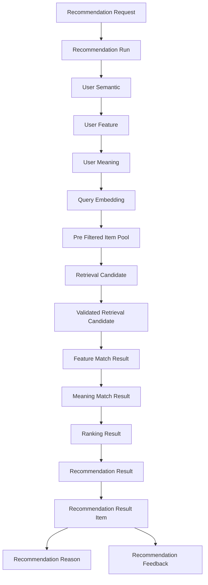
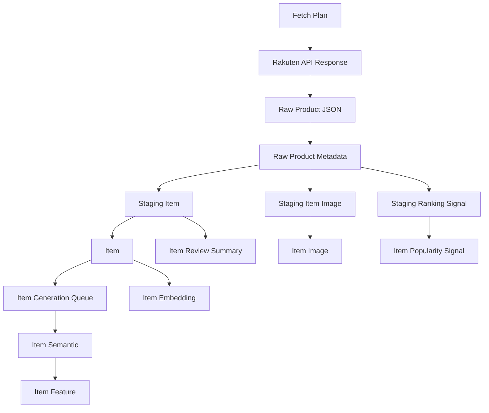
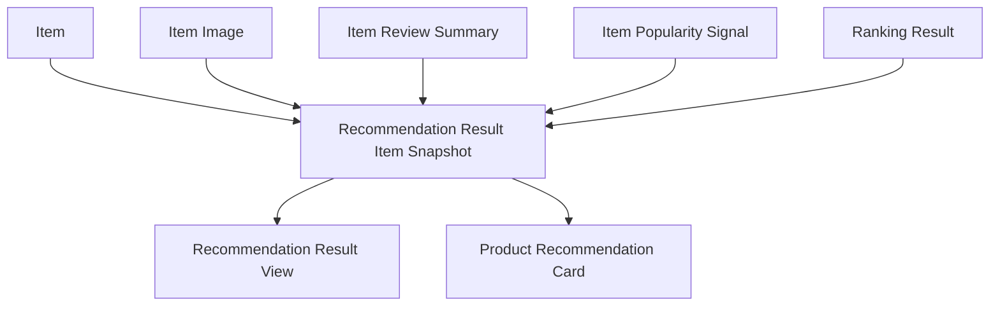

# リソース一覧

## 1. 概要

### 1.1 目的

本ドキュメントは、Gift Recommendation Service MVP において扱う主要リソースを一覧化する。

ここでいうリソースとは、画面、API、推薦処理、商品データ連携、評価、ログ、運用において、永続化・参照・受け渡し・表示の対象となる業務上の情報単位を指す。

本ドキュメントでは、以下を明確にする。

```text
- 本サービスで扱う主要リソース
- 各リソースの概要
- 各リソースの主な管理主体
- Online / Batch / 共通 / 運用の利用区分
- MVP対象かどうか
- 正本・派生・ログ・外部参照などの位置づけ
- 後続のリソース責務定義表、正本定義表、API一覧、バッチ一覧、テーブル設計への接続
```

---

### 1.2 本ドキュメントの位置づけ

| 成果物                          | 本ドキュメントとの関係                                                 |
| ------------------------------- | ---------------------------------------------------------------------- |
| ドメインモデル.md               | リソース抽出元となる主要ドメイン概念の前提                             |
| RecommendationRequest定義書.md  | Recommendation Request系リソースの前提                                 |
| RecommendationResult定義書.md   | Recommendation Result系リソースの前提                                  |
| RecommendationFeedback定義書.md | Feedback系リソースの前提                                               |
| Reason生成定義書.md             | 推薦理由リソースの前提                                                 |
| 処理構成定義書.md               | 各リソースがどの処理で生成・参照されるかの前提                         |
| 機能一覧.md                     | リソースを利用する機能の前提                                           |
| モジュール一覧.md               | リソースを生成・更新・参照するモジュールの前提                         |
| 機能×モジュール対応表.md        | 機能とモジュールを介したリソース利用関係の前提                         |
| 外部商品データ連携設計書.md     | 楽天商品データ、Raw、Staging、Item反映、疑似差分取得の前提             |
| リソース責務定義表.md           | 本リソース一覧をもとに、管理責務・参照責務を詳細化する後続成果物       |
| 正本定義表.md                   | 本リソース一覧をもとに、正本・派生・ログ・外部参照を定義する後続成果物 |
| API一覧.md                      | APIの入出力リソースを整理する後続成果物                                |
| バッチ一覧.md                   | Batchの入出力リソースを整理する後続成果物                              |
| テーブル一覧 / テーブル定義     | 永続化対象リソースを物理テーブルへ展開する後続成果物                   |

---

## 2. 利用したインプット成果物

利用したインプット成果物は以下です。

- ドメインモデル.md
- RecommendationRequest定義書.md
- RecommendationResult定義書.md
- RecommendationFeedback定義書.md
- Reason生成定義書.md
- 処理構成定義書.md
- 機能一覧.md
- モジュール一覧.md
- 機能×モジュール対応表.md
- 外部商品データ連携設計書.md
- リソース責務定義表.md
- 正本定義表.md
- 状態遷移設計書.md
- Retrieval定義書.md
- Matching定義書.md
- Ranking定義書.md
- Evaluation評価定義書.md

---

## 3. 基本方針

### 3.1 リソース定義方針

| 方針                                     | 内容                                                                         |
| ---------------------------------------- | ---------------------------------------------------------------------------- |
| 業務概念を起点にする                     | DBテーブルやAPI項目ではなく、業務上意味のある情報単位として定義する          |
| 正本・派生・ログを区別する               | 管理元となる正本データ、計算結果の派生データ、監査・追跡用ログを分ける       |
| Online / Batchの利用を区別する           | ユーザー操作中に利用するリソースと、事前準備・評価で利用するリソースを分ける |
| 外部由来データと内部正規化データを分ける | 楽天APIレスポンスRawと、内部Item正本を混在させない                           |
| Raw本体とRawメタデータを分ける           | Raw JSON本体はObject Storage、参照メタデータはDBで管理する                   |
| 商品画像を独立リソースとして扱う         | 楽天APIの `smallImageUrls` / `mediumImageUrls` は Item Image として扱う      |
| ランキング情報をItem正本に混ぜない       | 楽天ランキングAPI由来の順位等は Item Popularity Signal として扱う            |
| Result Snapshotを明示する                | 表示時点の商品名、価格、URL、画像URL等はRecommendation Result Itemに固定する |
| 初回MVP対象外を明確にする                | 認証、会員、購入、決済、配送、ユーザー別履歴は初回MVP対象外とする            |

---

### 3.2 リソース種別

| 種別     | 内容                                                             |
| -------- | ---------------------------------------------------------------- |
| 正本     | その情報の管理元となるリソース                                   |
| 派生     | 正本・外部データ・計算結果から生成されるリソース                 |
| Snapshot | ある時点の表示・再現のために固定するリソース                     |
| ログ     | 処理状態、エラー、監査、評価のために記録するリソース             |
| 外部参照 | 外部サービス由来で、本サービス内では参照・取込対象となるリソース |
| 一時     | 処理途中で生成されるが、必ずしも長期保持しないリソース           |
| 設定     | ルール、モデル、バージョン、パラメータを管理するリソース         |
| 画面状態 | UI表示や入力状態を表すリソース                                   |

---

### 3.3 処理区分

| 区分 | 内容                                            |
| ---- | ----------------------------------------------- |
| OL   | Online処理。ユーザー操作に同期して利用される    |
| BT   | Batch処理。定期・手動・非同期で生成・更新される |
| 共通 | OL / BTの双方から参照される                     |
| 運用 | 開発・保守・評価・監視・改善で利用される        |

---

## 4. リソース分類一覧

| リソース分類             | 内容                                               | 主な利用コンポーネント            |
| ------------------------ | -------------------------------------------------- | --------------------------------- |
| 画面・UIリソース         | 画面、モーダル、画面状態、フォーム入力             | web                               |
| Recommendation Request系 | ユーザーの推薦依頼条件                             | web / api / reco / database       |
| Recommendation Run系     | 推薦実行単位、実行状態                             | reco / database                   |
| Recommendation Result系  | 推薦結果、推薦結果明細、表示用Snapshot             | reco / api / web / database       |
| Reason系                 | 推薦理由、理由バッジ、理由詳細                     | reco / web / database             |
| Feedback系               | ユーザーFeedback、評価・改善材料                   | web / api / batch / database      |
| Item系                   | 内部商品正本、商品画像、レビュー要約、人気シグナル | batch / reco / web / database     |
| 外部商品データ系         | 楽天API由来の商品、ランキング、ジャンル、Rawデータ | batch / object storage / database |
| Staging系                | 外部商品データを内部形式へ変換した一時・中間データ | batch / database                  |
| Semantic / Feature系     | Semantic Concept、User Feature、Item Feature       | reco / batch / database           |
| Embedding / Retrieval系  | Query Embedding、Item Embedding、候補商品          | reco / batch / database           |
| Matching / Ranking系     | 一致度、スコア、順位、補正値                       | reco / database                   |
| Evaluation系             | 評価データセット、評価結果、評価指標               | batch / reco / database           |
| Config / Version系       | Semantic Config、Model Version、Ranking Config等   | reco / batch / database           |
| ログ・状態系             | Phase Log、Error Log、Batch Log、API Call Log      | api / reco / batch / database     |
| 運用系                   | CI、Batch実行、Secrets、Issue、PR                  | devops                            |

---

## 5. 全体リソース一覧

| リソース名                          | 物理名候補                          | 分類                     | 種別                        | 主な管理主体                  | 処理区分  | MVP対象 | 概要                                      |
| ----------------------------------- | ----------------------------------- | ------------------------ | --------------------------- | ----------------------------- | --------- | ------- | ----------------------------------------- |
| Top Page                            | top_page                            | 画面・UI                 | 画面状態                    | web                           | OL        | ○       | サービス入口画面                          |
| Recommendation Input Form           | recommendation_input_form           | 画面・UI                 | 画面状態                    | web                           | OL        | ○       | 推薦条件入力フォーム                      |
| Recommendation Loading State        | recommendation_loading_state        | 画面・UI                 | 画面状態                    | web                           | OL        | ○       | 推薦実行中の表示状態                      |
| Recommendation Result View          | recommendation_result_view          | 画面・UI                 | 画面状態                    | web                           | OL        | ○       | 推薦結果一覧表示                          |
| Reason Detail Modal State           | reason_detail_modal_state           | 画面・UI                 | 画面状態                    | web                           | OL        | ○       | 推薦理由詳細表示状態                      |
| Product Detail Page State           | product_detail_page_state           | 画面・UI                 | 画面状態                    | web                           | OL        | ○       | 商品詳細画面状態                          |
| Feedback Input Modal State          | feedback_input_modal_state          | 画面・UI                 | 画面状態                    | web                           | OL        | ○       | Feedback入力表示状態                      |
| Error View State                    | error_view_state                    | 画面・UI                 | 画面状態                    | web                           | OL        | ○       | エラー表示状態                            |
| Empty Result View State             | empty_result_view_state             | 画面・UI                 | 画面状態                    | web                           | OL        | ○       | 0件結果表示状態                           |
| Recommendation History View         | recommendation_history_view         | 画面・UI                 | 画面状態                    | web                           | OL        | ×       | 後続フェーズの履歴画面                    |
| Recommendation Request              | recommendation_request              | Recommendation Request系 | 正本                        | api / database                | OL        | ○       | ユーザーが入力した推薦依頼条件            |
| Recommendation Request Condition    | recommendation_request_condition    | Recommendation Request系 | 正本                        | api / database                | OL        | ○       | 入力条件の構造化情報                      |
| Budget Condition                    | budget_condition                    | Recommendation Request系 | 値オブジェクト              | api / reco                    | OL        | ○       | 予算下限・上限                            |
| Preferred Condition                 | preferred_condition                 | Recommendation Request系 | 値オブジェクト              | api / reco                    | OL        | ○       | 好み・重視したい条件                      |
| Non Preferred Condition             | non_preferred_condition             | Recommendation Request系 | 値オブジェクト              | api / reco                    | OL        | ○       | 避けたい傾向                              |
| NG Condition                        | ng_condition                        | Recommendation Request系 | 値オブジェクト              | api / reco                    | OL        | ○       | 必ず除外したい条件                        |
| Relationship Condition              | relationship_condition              | Recommendation Request系 | 値オブジェクト / マスタ参照 | api / reco                    | OL        | ○       | 贈る相手との関係性                        |
| Occasion Condition                  | occasion_condition                  | Recommendation Request系 | 値オブジェクト / マスタ参照 | api / reco                    | OL        | ○       | 贈答用途・シーン                          |
| Recommendation Run                  | recommendation_run                  | Recommendation Run系     | 正本 / ログ                 | reco / database               | OL        | ○       | 推薦実行単位                              |
| Recommendation Run Phase            | recommendation_run_phase            | Recommendation Run系     | ログ                        | reco / database               | OL        | ○       | 推薦実行内の処理フェーズ                  |
| Recommendation Result               | recommendation_result               | Recommendation Result系  | 正本                        | reco / database               | OL        | ○       | 推薦実行結果のヘッダ                      |
| Recommendation Result Item          | recommendation_result_item          | Recommendation Result系  | Snapshot                    | reco / database               | OL        | ○       | 推薦結果の商品明細                        |
| Recommendation Result Item Snapshot | recommendation_result_item_snapshot | Recommendation Result系  | Snapshot                    | reco / database               | OL        | ○       | 表示時点の商品名、価格、URL、画像URL等    |
| Recommendation Reason               | recommendation_reason               | Reason系                 | 派生 / Snapshot             | reco / database               | OL        | ○       | 推薦理由                                  |
| Reason Badge                        | reason_badge                        | Reason系                 | 派生                        | reco / web                    | OL        | ○       | 商品カード上の理由ラベル                  |
| Reason Summary                      | reason_summary                      | Reason系                 | 派生                        | reco / web                    | OL        | ○       | 短い推薦理由                              |
| Reason Detail                       | reason_detail                       | Reason系                 | 派生                        | reco / web                    | OL        | ○       | 詳細な推薦理由                            |
| Reason Point                        | reason_point                        | Reason系                 | 派生                        | reco / web                    | OL        | ○       | 箇条書きの理由要素                        |
| Caution Note                        | caution_note                        | Reason系                 | 派生                        | reco / web                    | OL        | ○       | 注意・補足メッセージ                      |
| Recommendation Feedback             | recommendation_feedback             | Feedback系               | 正本                        | api / database                | OL        | ○       | ユーザーFeedback                          |
| Feedback Target                     | feedback_target                     | Feedback系               | 値オブジェクト              | api / database                | OL        | ○       | Feedback対象                              |
| Feedback Comment                    | feedback_comment                    | Feedback系               | 値オブジェクト              | api / database                | OL        | ○       | 自由記述コメント                          |
| Item                                | item                                | Item系                   | 正本                        | batch / database              | BT / 共通 | ○       | 内部商品正本                              |
| Item Image                          | item_image                          | Item系                   | 正本 / 外部参照             | batch / database              | BT / 共通 | ○       | 商品画像URL参照情報                       |
| Item Review Summary                 | item_review_summary                 | Item系                   | 派生 / 外部参照             | batch / database              | BT / 共通 | ○       | レビュー平均・件数                        |
| Item Popularity Signal              | item_popularity_signal              | Item系                   | 派生 / 外部参照             | batch / database              | BT / 共通 | ○       | ランキング等の人気補助シグナル            |
| Item Active Status                  | item_active_status                  | Item系                   | 派生 / 状態                 | batch / database              | BT / 共通 | ○       | 推薦対象可否                              |
| Item Generation Queue               | item_generation_queue               | Item系                   | 一時 / 状態                 | batch / database              | BT        | ○       | 商品意味生成対象キュー                    |
| External Product                    | external_product                    | 外部商品データ系         | 外部参照                    | batch                         | BT        | ○       | 楽天API由来の商品データ                   |
| External Product Candidate          | external_product_candidate          | 外部商品データ系         | 一時                        | batch                         | BT        | ○       | 取込候補の商品                            |
| Rakuten Item Search Response        | rakuten_item_search_response        | 外部商品データ系         | 外部参照 / Raw              | batch / object storage        | BT        | ○       | 楽天商品検索APIレスポンス                 |
| Rakuten Ranking Response            | rakuten_ranking_response            | 外部商品データ系         | 外部参照 / Raw              | batch / object storage        | BT        | ○       | 楽天ランキングAPIレスポンス               |
| Rakuten Genre Response              | rakuten_genre_response              | 外部商品データ系         | 外部参照 / Raw              | batch / object storage        | BT        | ○       | 楽天ジャンル検索APIレスポンス             |
| Raw Product JSON                    | raw_product_json                    | 外部商品データ系         | Raw                         | object storage                | BT        | ○       | 外部APIレスポンスJSON本体                 |
| Raw Product Metadata                | raw_product_metadata                | 外部商品データ系         | ログ / メタデータ           | batch / database              | BT        | ○       | Raw保存先、hash、取得日時、状態           |
| Raw Product Import Status           | raw_product_import_status           | 外部商品データ系         | 状態                        | batch / database              | BT        | ○       | Raw取込状態                               |
| Fetch Plan                          | fetch_plan                          | 外部商品データ系         | 一時 / 計画                 | batch                         | BT        | ○       | 外部商品取得計画                          |
| Fetch Cursor                        | fetch_cursor                        | 外部商品データ系         | 状態                        | batch / database              | BT        | ○       | 取得カーソル                              |
| Product Diff Result                 | product_diff_result                 | 外部商品データ系         | 派生 / 一時                 | batch                         | BT        | ○       | 新規・更新・変更なしの判定結果            |
| Normalized Payload                  | normalized_payload                  | 外部商品データ系         | 一時                        | batch                         | BT        | ○       | hash算出用の正規化データ                  |
| Normalized Hash                     | normalized_hash                     | 外部商品データ系         | 派生                        | batch / database              | BT        | ○       | 差分判定用hash                            |
| External Genre                      | external_genre                      | 外部商品データ系         | 外部参照 / 正本             | batch / database              | BT / 共通 | ○       | 楽天ジャンル階層                          |
| External Attribute                  | external_attribute                  | 外部商品データ系         | 外部参照                    | batch / database              | BT / 共通 | △       | 楽天属性情報                              |
| Staging Item                        | staging_item                        | Staging系                | 一時 / 中間                 | batch / database              | BT        | ○       | Item反映前の商品データ                    |
| Staging Item Image                  | staging_item_image                  | Staging系                | 一時 / 中間                 | batch / database              | BT        | ○       | Item Image反映前の画像データ              |
| Staging Ranking Signal              | staging_ranking_signal              | Staging系                | 一時 / 中間                 | batch / database              | BT        | ○       | Popularity Signal反映前のランキングデータ |
| Staging Genre                       | staging_genre                       | Staging系                | 一時 / 中間                 | batch / database              | BT        | ○       | External Genre反映前のジャンルデータ      |
| Semantic Concept                    | semantic_concept                    | Semantic / Feature系     | 設定 / 正本                 | database / reco               | 共通      | ○       | 意味概念                                  |
| User Semantic                       | user_semantic                       | Semantic / Feature系     | 派生                        | reco                          | OL        | ○       | ユーザー入力から抽出した意味情報          |
| Item Semantic                       | item_semantic                       | Semantic / Feature系     | 派生                        | batch / reco / database       | BT / 共通 | ○       | 商品から抽出した意味情報                  |
| User Feature                        | user_feature                        | Semantic / Feature系     | 派生                        | reco                          | OL        | ○       | ユーザー意図のFeature                     |
| Item Feature                        | item_feature                        | Semantic / Feature系     | 派生                        | batch / reco / database       | BT / 共通 | ○       | 商品のFeature                             |
| Feature Definition                  | feature_definition                  | Semantic / Feature系     | 設定 / 正本                 | database / reco               | 共通      | ○       | Feature軸定義                             |
| Feature Rule                        | feature_rule                        | Semantic / Feature系     | 設定                        | database / reco               | 共通      | ○       | Feature推定ルール                         |
| Semantic Rule                       | semantic_rule                       | Semantic / Feature系     | 設定                        | database / reco               | 共通      | ○       | Semantic抽出ルール                        |
| User Meaning                        | user_meaning                        | Semantic / Feature系     | 派生                        | reco                          | OL        | ○       | user_social / user_symbolic               |
| Item Meaning                        | item_meaning                        | Semantic / Feature系     | 派生                        | batch / reco                  | BT / 共通 | ○       | item_social / item_symbolic               |
| Query Embedding                     | query_embedding                     | Embedding / Retrieval系  | 派生 / 一時                 | reco                          | OL        | ○       | Retrieval用検索Embedding                  |
| Item Embedding                      | item_embedding                      | Embedding / Retrieval系  | 派生                        | batch / database              | BT / 共通 | ○       | 商品Embedding                             |
| Retrieval Candidate                 | retrieval_candidate                 | Embedding / Retrieval系  | 一時 / 派生                 | reco                          | OL        | ○       | Retrievalで抽出した候補商品               |
| Pre Filtered Item Pool              | pre_filtered_item_pool              | Embedding / Retrieval系  | 一時 / 派生                 | reco                          | OL        | ○       | Pre Hard Filter通過後の商品集合           |
| Validated Retrieval Candidate       | validated_retrieval_candidate       | Embedding / Retrieval系  | 一時 / 派生                 | reco                          | OL        | ○       | Post Hard Filter通過後の候補              |
| Excluded Candidate Log              | excluded_candidate_log              | Embedding / Retrieval系  | ログ                        | reco / database               | OL        | △       | 除外候補の理由ログ                        |
| Feature Match Result                | feature_match_result                | Matching / Ranking系     | 派生 / 一時                 | reco                          | OL        | ○       | Feature単位の一致度                       |
| Meaning Match Result                | meaning_match_result                | Matching / Ranking系     | 派生 / 一時                 | reco                          | OL        | ○       | Social / Symbolic一致度                   |
| Context Score                       | context_score                       | Matching / Ranking系     | 派生 / 一時                 | reco                          | OL        | ○       | 文脈スコア                                |
| Popularity Score                    | popularity_score                    | Matching / Ranking系     | 派生 / 一時                 | reco                          | OL        | ○       | 人気補正スコア                            |
| Risk Score                          | risk_score                          | Matching / Ranking系     | 派生 / 一時                 | reco                          | OL        | ○       | リスク補正スコア                          |
| Final Score                         | final_score                         | Matching / Ranking系     | 派生 / Snapshot             | reco / database               | OL        | ○       | 最終スコア                                |
| Ranking Result                      | ranking_result                      | Matching / Ranking系     | 派生 / Snapshot             | reco / database               | OL        | ○       | 最終順位                                  |
| Score Breakdown                     | score_breakdown                     | Matching / Ranking系     | 派生 / Snapshot             | reco / database               | OL        | ○       | スコア内訳                                |
| Evaluation Dataset                  | evaluation_dataset                  | Evaluation系             | 正本                        | database / batch              | BT        | ○       | 評価用データセット                        |
| Evaluation Case                     | evaluation_case                     | Evaluation系             | 正本                        | database / batch              | BT        | ○       | 評価ケース                                |
| Evaluation Result                   | evaluation_result                   | Evaluation系             | 派生 / ログ                 | batch / database              | BT        | ○       | 評価結果                                  |
| Evaluation Metric                   | evaluation_metric                   | Evaluation系             | 派生                        | batch / database              | BT        | ○       | 評価指標                                  |
| Feedback Analysis Result            | feedback_analysis_result            | Evaluation系             | 派生                        | batch / database              | BT / 運用 | △       | Feedback分析結果                          |
| Failure Analysis Result             | failure_analysis_result             | Evaluation系             | 派生                        | batch / database              | BT / 運用 | △       | 失敗分析結果                              |
| Relationship Master                 | relationship_master                 | Config / Version系       | 設定 / 正本                 | database / api / reco         | 共通      | ○       | 関係性マスタ                              |
| Occasion Master                     | occasion_master                     | Config / Version系       | 設定 / 正本                 | database / api / reco         | 共通      | ○       | 用途マスタ                                |
| Semantic Config                     | semantic_config                     | Config / Version系       | 設定 / 正本                 | database / reco               | 共通      | ○       | Semantic / Feature設定のまとまり          |
| Semantic Config Version             | semantic_config_version             | Config / Version系       | 設定 / 正本                 | database / reco               | 共通      | ○       | 設定バージョン                            |
| Model Version                       | model_version                       | Config / Version系       | 設定 / 正本                 | database / reco / batch       | 共通      | ○       | AI / Embeddingモデルバージョン            |
| Ranking Config                      | ranking_config                      | Config / Version系       | 設定                        | database / reco               | 共通      | △       | Rankingパラメータ設定                     |
| Reason Template                     | reason_template                     | Config / Version系       | 設定                        | database / reco               | 共通      | △       | 推薦理由テンプレート                      |
| Feature Normalization Version       | feature_normalization_version       | Config / Version系       | 設定                        | database / batch / reco       | 共通      | △       | Feature正規化設定                         |
| Phase Log                           | phase_log                           | ログ・状態系             | ログ                        | api / reco / batch / database | 共通      | ○       | 処理フェーズログ                          |
| Error Log                           | error_log                           | ログ・状態系             | ログ                        | api / reco / batch / database | 共通      | ○       | エラーログ                                |
| Batch Run Log                       | batch_run_log                       | ログ・状態系             | ログ                        | batch / database              | BT        | ○       | Batch実行ログ                             |
| API Call Log                        | api_call_log                        | ログ・状態系             | ログ                        | batch / database              | BT        | ○       | 外部API呼び出しログ                       |
| Item Import Summary                 | item_import_summary                 | ログ・状態系             | ログ / 集計                 | batch / database              | BT        | ○       | 商品取込結果集計                          |
| CI Workflow                         | ci_workflow                         | 運用系                   | 運用                        | devops                        | 運用      | ○       | CI実行定義                                |
| Batch Execution Workflow            | batch_execution_workflow            | 運用系                   | 運用                        | devops                        | 運用      | ○       | Batch実行定義                             |
| Secret                              | secret                              | 運用系                   | 運用                        | devops                        | 運用      | ○       | API Key等の秘密情報                       |
| Issue                               | issue                               | 運用系                   | 運用                        | devops                        | 運用      | △       | 開発・改善タスク                          |
| Pull Request                        | pull_request                        | 運用系                   | 運用                        | devops                        | 運用      | △       | コード・設計変更レビュー単位              |

---

## 6. 画面・UIリソース

### 6.1 画面・UIリソース一覧

| リソース名                   | 概要                 | 主な利用画面            | MVP対象 |
| ---------------------------- | -------------------- | ----------------------- | ------- |
| Top Page                     | サービス入口         | トップ画面              | ○       |
| Recommendation Input Form    | 推薦条件入力フォーム | レコメンド条件入力画面  | ○       |
| Recommendation Loading State | 推薦処理中状態       | レコメンド実行中表示    | ○       |
| Recommendation Result View   | 推薦結果一覧表示     | レコメンド結果一覧画面  | ○       |
| Product Recommendation Card  | 商品カード表示       | レコメンド結果一覧画面  | ○       |
| Reason Detail Modal State    | 推薦理由詳細表示状態 | 推薦理由詳細表示        | ○       |
| Product Detail Page State    | 商品詳細画面状態     | 商品詳細画面            | ○       |
| Feedback Input Modal State   | Feedback入力表示状態 | Feedback入力表示        | ○       |
| Error View State             | エラー表示状態       | エラー表示              | ○       |
| Empty Result View State      | 0件表示状態          | 0件結果表示             | ○       |
| Recommendation History View  | 履歴表示状態         | レコメンド履歴画面      | ×       |

---

### 6.2 画面状態リソースの方針

画面状態リソースは、原則としてDBの永続化対象ではない。  
ただし、画面表示に利用するデータの一部は、以下の永続リソースから取得する。

| 画面状態     | 参照元リソース                                              |
| ------------ | ----------------------------------------------------------- |
| 入力フォーム | Relationship Master / Occasion Master                       |
| 結果一覧     | Recommendation Result / Recommendation Result Item          |
| 商品カード   | Recommendation Result Item Snapshot / Recommendation Reason |
| 推薦理由詳細 | Recommendation Reason                                       |
| 商品詳細     | Recommendation Result Item Snapshot                         |
| Feedback入力 | Recommendation Result / Recommendation Result Item          |
| エラー表示   | API Error Response / Error Log                              |
| 0件表示      | Recommendation Result                                       |

---

## 7. Recommendation Request系リソース

### 7.1 Recommendation Request系リソース一覧

| リソース名                       | 種別                        | 管理主体       | MVP対象 | 概要                   |
| -------------------------------- | --------------------------- | -------------- | ------- | ---------------------- |
| Recommendation Request           | 正本                        | api / database | ○       | 推薦依頼の入力条件全体 |
| Recommendation Request Condition | 正本                        | api / database | ○       | 推薦条件の構造化情報   |
| Budget Condition                 | 値オブジェクト              | api / reco     | ○       | 予算下限・上限         |
| Relationship Condition           | 値オブジェクト / マスタ参照 | api / reco     | ○       | 贈る相手との関係性     |
| Occasion Condition               | 値オブジェクト / マスタ参照 | api / reco     | ○       | 贈答用途               |
| Preferred Condition              | 値オブジェクト              | api / reco     | ○       | 好み・重視したい条件   |
| Non Preferred Condition          | 値オブジェクト              | api / reco     | ○       | 避けたい傾向           |
| NG Condition                     | 値オブジェクト              | api / reco     | ○       | 絶対除外条件           |

---

### 7.2 主な項目

| リソース                | 主な項目                                                                             |
| ----------------------- | ------------------------------------------------------------------------------------ |
| Recommendation Request  | request_id, requested_at, mode, input_text, relationship, occasion, budget_condition |
| Budget Condition        | budget_min, budget_max                                                               |
| Preferred Condition     | preferred_text, preferred_tags                                                       |
| Non Preferred Condition | non_preferred_text, non_preferred_tags                                               |
| NG Condition            | ng_keywords, ng_categories, ng_constraints                                           |
| Relationship Condition  | relationship_code, relationship_label                                                |
| Occasion Condition      | occasion_code, occasion_label                                                        |

---

## 8. Recommendation Run系リソース

| リソース名               | 種別        | 管理主体        | MVP対象 | 概要                           |
| ------------------------ | ----------- | --------------- | ------- | ------------------------------ |
| Recommendation Run       | 正本 / ログ | reco / database | ○       | 推薦実行単位                   |
| Recommendation Run Phase | ログ        | reco / database | ○       | 推薦処理フェーズ               |
| Run Status               | 状態        | reco / database | ○       | running / succeeded / failed等 |
| Run Error                | ログ        | reco / database | ○       | 推薦実行中のエラー             |

---

### 8.1 Run状態の方針

Recommendation Runは、推薦実行の開始・成功・失敗を追跡する単位である。  
商品単位・候補単位で細かく状態更新するのではなく、主要フェーズ単位のPhase Logで処理状況を確認する。

```text
request_received
↓
run_started
↓
semantic_extracted
↓
feature_generated
↓
retrieval_completed
↓
matching_completed
↓
ranking_completed
↓
result_generated
↓
reason_generated
↓
succeeded / failed
```

---

## 9. Recommendation Result系リソース

### 9.1 Recommendation Result系リソース一覧

| リソース名                          | 種別            | 管理主体        | MVP対象 | 概要               |
| ----------------------------------- | --------------- | --------------- | ------- | ------------------ |
| Recommendation Result               | 正本            | reco / database | ○       | 推薦結果ヘッダ     |
| Recommendation Result Item          | Snapshot        | reco / database | ○       | 推薦結果の商品明細 |
| Recommendation Result Item Snapshot | Snapshot        | reco / database | ○       | 表示時点の商品情報 |
| Score Breakdown                     | Snapshot / 派生 | reco / database | ○       | スコア内訳         |
| Ranking Result                      | Snapshot / 派生 | reco / database | ○       | 最終順位           |
| Empty Result                        | 派生            | reco / web      | ○       | 0件結果状態        |

---

### 9.2 Result Snapshot対象

Recommendation Result Itemでは、推薦結果の再現性を保つため、表示時点の商品情報をSnapshotとして保持する。

| Snapshot項目                 | 元リソース          | 用途                   |
| ---------------------------- | ------------------- | ---------------------- |
| item_id                      | Item                | 内部商品識別           |
| item_name_snapshot           | Item                | 商品名表示             |
| item_catchcopy_snapshot      | Item                | キャッチコピー表示     |
| item_price_snapshot          | Item                | 価格表示               |
| item_url_snapshot            | Item                | 外部EC遷移             |
| item_image_url_snapshot      | Item Image          | 商品画像表示           |
| item_review_average_snapshot | Item Review Summary | レビュー表示・補助情報 |
| item_review_count_snapshot   | Item Review Summary | レビュー表示・補助情報 |
| rank                         | Ranking Result      | 表示順位               |
| final_score                  | Final Score         | 内部評価・検証用       |
| score_breakdown              | Score Breakdown     | 評価・デバッグ用       |

---

## 10. Reason系リソース

| リソース名            | 種別            | 管理主体        | MVP対象 | UI表示対象 | 概要                   |
| --------------------- | --------------- | --------------- | ------- | ---------- | ---------------------- |
| Recommendation Reason | 派生 / Snapshot | reco / database | ○       | ○          | 推薦理由全体           |
| Reason Badge          | 派生            | reco / web      | ○       | ○          | 理由バッジ             |
| Reason Summary        | 派生            | reco / web      | ○       | ○          | 商品カード上の短い理由 |
| Reason Detail         | 派生            | reco / web      | ○       | ○          | 詳細説明               |
| Reason Point          | 派生            | reco / web      | ○       | ○          | 箇条書き理由           |
| Caution Note          | 派生            | reco / web      | ○       | ○          | 注意・補足             |
| Reason Basis          | 派生 / 内部     | reco / database | ○       | ×          | 理由生成根拠           |
| Reason Template       | 設定            | reco / database | △       | ×          | 理由文テンプレート     |

---

## 11. Feedback系リソース

| リソース名               | 種別           | 管理主体         | MVP対象 | 概要                 |
| ------------------------ | -------------- | ---------------- | ------- | -------------------- |
| Recommendation Feedback  | 正本           | api / database   | ○       | ユーザーFeedback     |
| Feedback Target          | 値オブジェクト | api / database   | ○       | Feedback対象         |
| Feedback Rating          | 値オブジェクト | api / database   | ○       | 良い / 悪い / 中立等 |
| Feedback Comment         | 値オブジェクト | api / database   | ○       | 自由記述             |
| Feedback Analysis Result | 派生           | batch / database | △       | Feedback分析結果     |

---

### 11.1 Feedback対象

| Feedback対象     | 内容                           |
| ---------------- | ------------------------------ |
| result           | 推薦結果全体に対するFeedback   |
| result_item      | 推薦商品単位のFeedback         |
| reason           | 推薦理由に対するFeedback       |
| search_condition | 入力条件・再検索観点のFeedback |

---

## 12. Item系リソース

### 12.1 Item系リソース一覧

| リソース名             | 種別            | 管理主体         | 処理区分  | MVP対象 | 概要                           |
| ---------------------- | --------------- | ---------------- | --------- | ------- | ------------------------------ |
| Item                   | 正本            | batch / database | BT / 共通 | ○       | 内部商品正本                   |
| Item Image             | 正本 / 外部参照 | batch / database | BT / 共通 | ○       | 商品画像URL                    |
| Item Review Summary    | 派生 / 外部参照 | batch / database | BT / 共通 | ○       | レビュー平均・件数             |
| Item Popularity Signal | 派生 / 外部参照 | batch / database | BT / 共通 | ○       | ランキング等の人気補助シグナル |
| Item Active Status     | 状態 / 派生     | batch / database | BT / 共通 | ○       | 推薦対象可否                   |
| Item Generation Queue  | 一時 / 状態     | batch / database | BT        | ○       | 意味生成対象キュー             |

---

### 12.2 Item

| 項目         | 内容                         |
| ------------ | ---------------------------- |
| 役割         | Online推薦で参照する商品正本 |
| 主な生成元   | 楽天商品検索API              |
| 主な更新主体 | Item Updater                 |
| Online参照   | あり                         |
| MVP対象      | ○                            |

#### 主な項目

| 項目               | 内容                             |
| ------------------ | -------------------------------- |
| item_id            | 内部商品ID                       |
| source             | 外部商品データ元。MVPではrakuten |
| external_item_code | 楽天itemCode                     |
| item_name          | 商品名                           |
| item_caption       | 商品説明                         |
| catchcopy          | キャッチコピー                   |
| price              | 商品価格                         |
| item_url           | 楽天商品ページURL                |
| genre_id           | 楽天ジャンルID                   |
| shop_code          | 楽天ショップコード               |
| is_active          | 推薦対象可否                     |
| last_checked_at    | 最終確認日時                     |
| normalized_hash    | 差分判定用hash                   |

---

### 12.3 Item Image

| 項目             | 内容                                                        |
| ---------------- | ----------------------------------------------------------- |
| 役割             | レコメンド結果一覧・商品詳細で表示する商品画像URLを管理する |
| 主な生成元       | 楽天商品検索APIの `smallImageUrls` / `mediumImageUrls`      |
| 主な更新主体     | Item Image Updater                                          |
| Online参照       | あり                                                        |
| MVP対象          | ○                                                           |
| 画像バイナリ保存 | MVPでは対象外                                               |

#### 主な項目

| 項目            | 内容           |
| --------------- | -------------- |
| item_image_id   | 商品画像ID     |
| item_id         | 内部商品ID     |
| image_url       | 画像URL        |
| image_size_type | small / medium |
| display_order   | 表示順         |
| is_primary      | 主画像フラグ   |
| source_api      | 取得元API      |
| fetched_at      | 取得日時       |

#### 主画像選定方針

```text
1. mediumImageUrls[0]
2. smallImageUrls[0]
3. 画像なしプレースホルダー
```

---

### 12.4 Item Review Summary

| 項目         | 内容                                 |
| ------------ | ------------------------------------ |
| 役割         | レビュー平均・レビュー件数を保持する |
| 主な生成元   | 楽天商品検索API                      |
| 主な更新主体 | Item Review Summary Updater          |
| Online参照   | Ranking補助、表示補助                |
| MVP対象      | ○                                    |

---

### 12.5 Item Popularity Signal

| 項目         | 内容                                 |
| ------------ | ------------------------------------ |
| 役割         | 人気補正に使う補助シグナルを保持する |
| 主な生成元   | 楽天ランキングAPI                    |
| 主な更新主体 | Item Popularity Signal Updater       |
| Online参照   | Rankingで参照                        |
| MVP対象      | ○                                    |

#### 方針

楽天ランキングAPIは、商品名・価格・画像URLなどの商品正本の取得元ではない。  
ランキングAPI由来データは、順位、ジャンル、期間、ランキング更新日時などの補助シグナルとして扱う。

| 項目               | 内容                   |
| ------------------ | ---------------------- |
| item_id            | 内部商品ID             |
| external_item_code | 楽天itemCode           |
| rank               | ランキング順位         |
| genre_id           | ランキング対象ジャンル |
| period             | ranking period         |
| last_build_date    | ランキング更新日時     |
| fetched_at         | 取得日時               |

---

## 13. 外部商品データ系リソース

### 13.1 外部商品データ系リソース一覧

| リソース名                   | 種別              | 管理主体               | MVP対象 | 概要                          |
| ---------------------------- | ----------------- | ---------------------- | ------- | ----------------------------- |
| External Product             | 外部参照          | batch                  | ○       | 外部API由来の商品データ       |
| External Product Candidate   | 一時              | batch                  | ○       | 取込候補の商品                |
| Rakuten Item Search Response | Raw / 外部参照    | batch / object storage | ○       | 楽天商品検索APIレスポンス     |
| Rakuten Ranking Response     | Raw / 外部参照    | batch / object storage | ○       | 楽天ランキングAPIレスポンス   |
| Rakuten Genre Response       | Raw / 外部参照    | batch / object storage | ○       | 楽天ジャンル検索APIレスポンス |
| Raw Product JSON             | Raw               | object storage         | ○       | 外部APIレスポンスJSON本体     |
| Raw Product Metadata         | メタデータ / ログ | batch / database       | ○       | Raw保存メタデータ             |
| Fetch Plan                   | 一時 / 計画       | batch                  | ○       | 外部API取得計画               |
| Fetch Cursor                 | 状態              | batch / database       | ○       | 差分取得用カーソル            |
| Product Diff Result          | 派生 / 一時       | batch                  | ○       | 新規・更新・変更なし判定      |
| External Genre               | 外部参照 / 正本   | batch / database       | ○       | 楽天ジャンル                  |
| External Attribute           | 外部参照          | batch / database       | △       | 楽天属性                      |

---

### 13.2 Raw Product JSON

| 項目       | 内容                   |
| ---------- | ---------------------- |
| 保存先     | Object Storage         |
| 用途       | 再処理、監査、障害調査 |
| Online参照 | なし                   |
| MVP対象    | ○                      |

Raw JSON本体はDBに保存しない。  
DBにはRaw Product Metadataとして、object key、hash、取得日時、状態等を保存する。

---

### 13.3 Raw Product Metadata

| 項目       | 内容                                   |
| ---------- | -------------------------------------- |
| 保存先     | Database                               |
| 用途       | Raw JSON参照、取込状態管理、再処理制御 |
| Online参照 | なし                                   |
| MVP対象    | ○                                      |

#### 主な項目

| 項目            | 内容                                     |
| --------------- | ---------------------------------------- |
| raw_metadata_id | RawメタデータID                          |
| source          | rakuten                                  |
| source_api      | item_search / ranking / genre            |
| object_key      | Object Storage上の保存先                 |
| content_hash    | Raw JSON hash                            |
| fetched_at      | 取得日時                                 |
| import_status   | raw_saved / staged / imported / failed等 |
| item_count      | 取得件数                                 |
| request_params  | APIリクエスト条件                        |
| error_message   | エラー内容                               |

---

## 14. Staging系リソース

| リソース名               | 種別        | 管理主体         | MVP対象 | 概要                                      |
| ------------------------ | ----------- | ---------------- | ------- | ----------------------------------------- |
| Staging Item             | 一時 / 中間 | batch / database | ○       | Item反映前の商品データ                    |
| Staging Item Image       | 一時 / 中間 | batch / database | ○       | Item Image反映前の画像データ              |
| Staging Ranking Signal   | 一時 / 中間 | batch / database | ○       | Popularity Signal反映前のランキングデータ |
| Staging Genre            | 一時 / 中間 | batch / database | ○       | External Genre反映前のジャンルデータ      |
| Staging Validation Error | ログ        | batch / database | △       | Staging検証エラー                         |

---

### 14.1 Stagingの方針

Stagingは、外部API固有形式を内部正規化形式へ変換する中間リソースである。  
Online推薦では参照しない。

```text
Raw Product JSON
↓
Staging Item / Staging Item Image / Staging Ranking Signal
↓
Item / Item Image / Item Review Summary / Item Popularity Signal
```

---

## 15. Semantic / Feature系リソース

### 15.1 Semantic / Feature系リソース一覧

| リソース名                    | 種別        | 管理主体                | 処理区分  | MVP対象 | 概要                             |
| ----------------------------- | ----------- | ----------------------- | --------- | ------- | -------------------------------- |
| Semantic Concept              | 設定 / 正本 | database / reco         | 共通      | ○       | 意味概念                         |
| Semantic Rule                 | 設定        | database / reco         | 共通      | ○       | Semantic抽出ルール               |
| Feature Definition            | 設定 / 正本 | database / reco         | 共通      | ○       | Feature軸定義                    |
| Feature Rule                  | 設定        | database / reco         | 共通      | ○       | Feature推定ルール                |
| User Semantic                 | 派生        | reco                    | OL        | ○       | ユーザー入力から抽出した意味情報 |
| Item Semantic                 | 派生        | batch / database        | BT / 共通 | ○       | 商品から抽出した意味情報         |
| User Feature                  | 派生        | reco                    | OL        | ○       | ユーザー意図Feature              |
| Item Feature                  | 派生        | batch / database        | BT / 共通 | ○       | 商品Feature                      |
| User Meaning                  | 派生        | reco                    | OL        | ○       | user_social / user_symbolic      |
| Item Meaning                  | 派生        | batch / reco            | BT / 共通 | ○       | item_social / item_symbolic      |
| Feature Normalization Version | 設定        | database / batch / reco | 共通      | △       | 正規化設定                       |

---

### 15.2 Feature軸

MVPで扱うFeature軸は以下。

| 区分     | Feature               |
| -------- | --------------------- |
| Social   | formality             |
| Social   | safety                |
| Social   | brand_appropriateness |
| Symbolic | emotion               |
| Symbolic | novelty               |
| Symbolic | intimacy              |
| Symbolic | symbolic_identity     |
| Symbolic | story_richness        |

---

### 15.3 Feature値の方針

Feature値は `0.0〜1.0` の範囲で扱う。  
ただし、単純clipではなく、sigmoid系の正規化を採用する。

---

## 16. Embedding / Retrieval系リソース

| リソース名                    | 種別        | 管理主体         | 処理区分  | MVP対象 | 概要                        |
| ----------------------------- | ----------- | ---------------- | --------- | ------- | --------------------------- |
| Query Embedding               | 派生 / 一時 | reco             | OL        | ○       | 検索クエリEmbedding         |
| Item Embedding                | 派生        | batch / database | BT / 共通 | ○       | 商品Embedding               |
| Pre Filtered Item Pool        | 一時 / 派生 | reco             | OL        | ○       | Pre Hard Filter後の商品集合 |
| Retrieval Candidate           | 一時 / 派生 | reco             | OL        | ○       | Retrieval候補               |
| Validated Retrieval Candidate | 一時 / 派生 | reco             | OL        | ○       | Post Hard Filter後の候補    |
| Excluded Candidate Log        | ログ        | reco / database  | OL        | △       | 除外候補ログ                |

---

### 16.1 Retrieval順序

```text
Pre Hard Filter
↓
Retrieval
↓
Post Hard Filter
```

| リソース                      | 生成タイミング            |
| ----------------------------- | ------------------------- |
| Pre Filtered Item Pool        | Pre Hard Filter後         |
| Retrieval Candidate           | Candidate Retriever実行後 |
| Validated Retrieval Candidate | Post Hard Filter後        |
| Excluded Candidate Log        | 除外発生時                |

---

## 17. Matching / Ranking系リソース

| リソース名           | 種別            | 管理主体        | MVP対象 | 概要                          |
| -------------------- | --------------- | --------------- | ------- | ----------------------------- |
| Feature Match Result | 派生 / 一時     | reco            | ○       | Feature単位の一致度           |
| Meaning Match Result | 派生 / 一時     | reco            | ○       | Social / Symbolic単位の一致度 |
| Context Score        | 派生 / 一時     | reco            | ○       | 文脈スコア                    |
| Popularity Score     | 派生 / 一時     | reco            | ○       | 人気補正スコア                |
| Risk Score           | 派生 / 一時     | reco            | ○       | リスク補正スコア              |
| Final Score          | 派生 / Snapshot | reco / database | ○       | 最終スコア                    |
| Ranking Result       | 派生 / Snapshot | reco / database | ○       | 最終順位                      |
| Score Breakdown      | 派生 / Snapshot | reco / database | ○       | スコア内訳                    |

---

### 17.1 UI表示方針

| リソース            | UI表示               |
| ------------------- | -------------------- |
| Ranking Result.rank | 表示する             |
| Final Score         | 通常UIでは表示しない |
| Score Breakdown     | 通常UIでは表示しない |
| Context Score       | 通常UIでは表示しない |
| Popularity Score    | 通常UIでは表示しない |
| Risk Score          | 通常UIでは表示しない |

---

## 18. Evaluation系リソース

| リソース名                    | 種別        | 管理主体         | MVP対象 | 概要               |
| ----------------------------- | ----------- | ---------------- | ------- | ------------------ |
| Evaluation Dataset            | 正本        | database / batch | ○       | 評価用データセット |
| Evaluation Case               | 正本        | database / batch | ○       | 評価ケース         |
| Evaluation Result             | 派生 / ログ | batch / database | ○       | 評価結果           |
| Evaluation Metric             | 派生        | batch / database | ○       | 評価指標           |
| Feedback Analysis Result      | 派生        | batch / database | △       | Feedback分析結果   |
| Failure Analysis Result       | 派生        | batch / database | △       | 失敗分析結果       |
| Improvement Backlog Candidate | 派生 / 運用 | batch / devops   | △       | 改善Issue候補      |

---

## 19. Config / Version系リソース

| リソース名                    | 種別        | 管理主体                | MVP対象 | 概要                           |
| ----------------------------- | ----------- | ----------------------- | ------- | ------------------------------ |
| Relationship Master           | 設定 / 正本 | database / api / reco   | ○       | 関係性マスタ                   |
| Occasion Master               | 設定 / 正本 | database / api / reco   | ○       | 用途マスタ                     |
| Semantic Config               | 設定 / 正本 | database / reco         | ○       | Semantic / Feature設定         |
| Semantic Config Version       | 設定 / 正本 | database / reco         | ○       | 設定バージョン                 |
| Model Version                 | 設定 / 正本 | database / reco / batch | ○       | AI / Embeddingモデルバージョン |
| Ranking Config                | 設定        | database / reco         | △       | Rankingパラメータ              |
| Reason Template               | 設定        | database / reco         | △       | 推薦理由テンプレート           |
| Feature Normalization Version | 設定        | database / batch / reco | △       | Feature正規化設定              |

---

## 20. ログ・状態系リソース

### 20.1 ログ・状態系リソース一覧

| リソース名             | 種別              | 管理主体                      | 処理区分 | MVP対象 | 概要                |
| ---------------------- | ----------------- | ----------------------------- | -------- | ------- | ------------------- |
| Phase Log              | ログ              | api / reco / batch / database | 共通     | ○       | 処理フェーズログ    |
| Error Log              | ログ              | api / reco / batch / database | 共通     | ○       | エラーログ          |
| Batch Run Log          | ログ              | batch / database              | BT       | ○       | Batch実行ログ       |
| API Call Log           | ログ              | batch / database              | BT       | ○       | 外部API呼び出しログ |
| Raw Product Metadata   | ログ / メタデータ | batch / database              | BT       | ○       | Raw保存・取込状態   |
| Item Import Summary    | ログ / 集計       | batch / database              | BT       | ○       | 商品取込件数集計    |
| Excluded Candidate Log | ログ              | reco / database               | OL       | △       | 推薦候補除外ログ    |

---

### 20.2 状態更新方針

商品データ連携では、商品単位ですべての中間状態を逐次DB更新しない。  
DBアクセス増加による性能劣化を避けるため、以下の粒度を基本とする。

| 状態・ログ           | 保存粒度              |
| -------------------- | --------------------- |
| Batch Run Log        | Batch実行単位         |
| API Call Log         | 外部APIリクエスト単位 |
| Raw Product Metadata | Rawレスポンス単位     |
| Item Import Summary  | Batch / chunk単位     |
| Error Log            | 失敗・異常対象のみ    |
| Phase Log            | 主要フェーズ単位      |
| 商品単位の中間状態   | 原則として保存しない  |

---

## 21. 運用系リソース

| リソース名               | 種別 | 管理主体 | MVP対象 | 概要                    |
| ------------------------ | ---- | -------- | ------- | ----------------------- |
| CI Workflow              | 運用 | devops   | ○       | lint / test / build実行 |
| Batch Execution Workflow | 運用 | devops   | ○       | Batch手動・定期実行     |
| Secret                   | 運用 | devops   | ○       | API Key、DB接続情報等   |
| Issue                    | 運用 | devops   | △       | 開発・改善タスク        |
| Pull Request             | 運用 | devops   | △       | レビュー・マージ単位    |
| Release                  | 運用 | devops   | △       | リリース単位            |
| Monitoring Alert         | 運用 | devops   | △       | 監視・通知              |

---

## 22. MVP対象リソース

### 22.1 MVP必須リソース

| 分類                  | MVP必須リソース                                                                                                                                                                                |
| --------------------- | ---------------------------------------------------------------------------------------------------------------------------------------------------------------------------------------------- |
| 画面・UI              | Top Page, Recommendation Input Form, Recommendation Result View, Product Recommendation Card, Reason Detail Modal State, Feedback Input Modal State, Error View State, Empty Result View State |
| Request               | Recommendation Request, Budget Condition, Relationship Condition, Occasion Condition, Preferred Condition, Non Preferred Condition, NG Condition                                               |
| Run                   | Recommendation Run, Recommendation Run Phase                                                                                                                                                   |
| Result                | Recommendation Result, Recommendation Result Item, Recommendation Result Item Snapshot                                                                                                         |
| Reason                | Recommendation Reason, Reason Badge, Reason Summary, Reason Detail, Reason Point, Caution Note                                                                                                 |
| Feedback              | Recommendation Feedback, Feedback Target, Feedback Rating, Feedback Comment                                                                                                                    |
| Item                  | Item, Item Image, Item Review Summary, Item Popularity Signal, Item Active Status                                                                                                              |
| 外部商品              | Rakuten Item Search Response, Rakuten Ranking Response, Rakuten Genre Response, Raw Product JSON, Raw Product Metadata, External Genre                                                         |
| Staging               | Staging Item, Staging Item Image, Staging Ranking Signal, Staging Genre                                                                                                                        |
| Semantic / Feature    | Semantic Concept, User Semantic, Item Semantic, User Feature, Item Feature, User Meaning, Item Meaning                                                                                         |
| Embedding / Retrieval | Query Embedding, Item Embedding, Pre Filtered Item Pool, Retrieval Candidate, Validated Retrieval Candidate                                                                                    |
| Matching / Ranking    | Feature Match Result, Meaning Match Result, Context Score, Popularity Score, Risk Score, Final Score, Ranking Result, Score Breakdown                                                          |
| Evaluation            | Evaluation Dataset, Evaluation Case, Evaluation Result, Evaluation Metric                                                                                                                      |
| Config / Version      | Relationship Master, Occasion Master, Semantic Config, Semantic Config Version, Model Version                                                                                                  |
| Log                   | Phase Log, Error Log, Batch Run Log, API Call Log, Item Import Summary                                                                                                                         |
| 運用                  | CI Workflow, Batch Execution Workflow, Secret                                                                                                                                                  |

---

### 22.2 MVPでは最小限または後続詳細化するリソース

| リソース                           | 方針                                   |
| ---------------------------------- | -------------------------------------- |
| External Attribute                 | MVPでは任意。属性Feature強化時に利用   |
| Ranking Config                     | 初期は固定設定でも可                   |
| Reason Template                    | 初期は少数テンプレートでも可           |
| Feature Normalization Version      | 初期は簡易管理でも可                   |
| Excluded Candidate Log             | 初期は必要最小限                       |
| Feedback Analysis Result           | 初期は手動分析中心でも可               |
| Failure Analysis Result            | 初期はログ・評価結果から手動確認でも可 |
| Improvement Backlog Candidate      | 初期は手動Issue化でも可                |
| Issue / Pull Request自動化リソース | DevOps成熟化フェーズで対応             |
| Monitoring Alert                   | MVPでは簡易ログ中心                    |

---

### 22.3 MVP対象外リソース

| リソース               | 対象外理由                                   |
| ---------------------- | -------------------------------------------- |
| User Account           | 初回MVPでは認証機能を対象外とするため        |
| Login Session          | 初回MVPではログイン機能を対象外とするため    |
| User Profile           | ユーザー別管理を行わないため                 |
| Recommendation History | 認証・ユーザー別履歴管理が前提になるため     |
| Purchase Order         | 購入は外部ECに遷移するため                   |
| Payment                | 決済は外部EC側の責務とするため               |
| Delivery               | 配送は外部EC側の責務とするため               |
| Cart                   | カート機能は外部EC側の責務とするため         |
| Inventory              | 在庫のリアルタイム管理はMVP対象外            |
| Item Image Binary      | MVPでは画像URL参照のみとするため             |
| Image Analysis Result  | 商品画像解析は後続の精度改善テーマとするため |
| Multi EC Source        | MVPでは楽天市場商品のみを対象とするため      |

---

## 23. リソース間の主要関係

### 23.1 Online推薦系



---

### 23.2 商品データ連携系



---

### 23.3 Result Snapshot系



---

## 24. 後続成果物への引き継ぎ

### 24.1 リソース責務定義表への引き継ぎ

リソース責務定義表では、各リソースについて以下を詳細化する。

| 項目           | 内容                                          |
| -------------- | --------------------------------------------- |
| 管理責務       | どのコンポーネントが生成・更新するか          |
| 参照責務       | どのコンポーネントが参照するか                |
| 更新タイミング | Online / Batch / 手動 / 定期                  |
| 保存先         | DB / Object Storage / 画面状態 / 外部サービス |
| 正本区分       | 正本 / 派生 / Snapshot / ログ / 外部参照      |
| 冪等性         | 再実行時の重複防止方針                        |
| 削除・保持     | 保持期間、削除方針                            |

---

### 24.2 正本定義表への引き継ぎ

正本定義表では、以下を明確にする。

| 観点         | 内容                                      |
| ------------ | ----------------------------------------- |
| 正本リソース | 本サービス内で管理元とするリソース        |
| 外部正本     | 楽天市場API等、外部側が正本となるリソース |
| 派生リソース | 正本・計算結果から生成されるリソース      |
| Snapshot     | 推薦結果再現のために固定するリソース      |
| ログ         | 監査・追跡・評価のためのリソース          |
| Raw          | 再処理・監査用の外部APIレスポンス原本     |

---

### 24.3 API一覧への引き継ぎ

| API                                          | 主な入出力リソース                             |
| -------------------------------------------- | ---------------------------------------------- |
| `POST /api/v1/recommendations`                             | Recommendation Request / Recommendation Result |
| `POST /api/v1/recommendation-results/{resultId}/feedback` | Recommendation Feedback                        |
| `GET /api/v1/masters/relationships`                        | Relationship Master                        |
| `GET /api/v1/masters/occasions`                            | Occasion Master                            |
| `GET /api/v1/masters/semantic-configs`                     | Semantic Config                            |
| `GET /api/v1/masters/feature-rules`                        | Feature Rule                               |
| api → reco内部API                            | Recommendation Request / Recommendation Result |
| batch → reco内部API                          | Evaluation Case / Evaluation Result            |

---

### 24.4 バッチ一覧への引き継ぎ

| Batch候補                 | 主な入出力リソース                                                              |
| ------------------------- | ------------------------------------------------------------------------------- |
| 楽天ジャンル同期Batch     | Rakuten Genre Response / External Genre                                         |
| 楽天ランキング取得Batch   | Rakuten Ranking Response / Item Popularity Signal                               |
| 楽天商品疑似差分取得Batch | Rakuten Item Search Response / External Product Candidate / Product Diff Result |
| 既存商品再確認Batch       | Item / Rakuten Item Search Response / Product Diff Result                       |
| Raw取込・Staging変換Batch | Raw Product JSON / Staging Item / Staging Item Image / Staging Ranking Signal   |
| Item反映Batch             | Staging Item / Item / Item Image / Item Review Summary / Item Popularity Signal |
| 商品有効状態更新Batch     | Item / Item Active Status                                                       |
| 商品意味生成Batch         | Item / Item Semantic / Item Feature / Item Embedding                            |
| Offline Evaluation Batch  | Evaluation Dataset / Evaluation Result / Evaluation Metric                      |
| Feedback分析Batch         | Recommendation Feedback / Feedback Analysis Result                              |

---

## 25. レビュー観点

| 観点               | 確認内容                                                                                |
| ------------------ | --------------------------------------------------------------------------------------- |
| リソース網羅性     | 機能一覧・モジュール一覧で扱う主要データが漏れていないか                                |
| MVP整合性          | MVP対象・対象外が適切に分離されているか                                                 |
| 認証対象外         | User Account / Login Session / User Profile等がMVPに混入していないか                    |
| 商品画像           | Item Imageが定義され、楽天APIの `smallImageUrls` / `mediumImageUrls` と接続されているか |
| ランキング情報     | ランキングAPI由来データがItem正本ではなくPopularity Signalになっているか                |
| Raw管理            | Raw JSON本体とRaw Metadataが分離されているか                                            |
| Staging            | 外部API形式と内部Item正本の間にStagingが定義されているか                                |
| Snapshot           | Recommendation Result Itemに表示時点の商品情報を固定する方針になっているか              |
| Online / Batch分離 | Online推薦中に外部商品APIを呼ばない構成になっているか                                   |
| Pre/Post Filter    | Retrieval前後の候補リソースが分離されているか                                           |
| 正本・派生区分     | 正本、派生、Snapshot、ログ、外部参照が区別されているか                                  |
| 状態管理           | 商品単位の中間状態を逐次DB更新する前提になっていないか                                  |
| 後続成果物接続     | リソース責務定義表、正本定義表、API一覧、バッチ一覧へ展開できるか                       |

---

## 26. まとめ

本サービスの主要リソースは、以下の構成で整理する。

```text
ユーザー入力
= Recommendation Request

推薦実行
= Recommendation Run / Phase Log

推薦結果
= Recommendation Result / Recommendation Result Item / Result Snapshot

推薦理由
= Recommendation Reason / Reason Badge / Reason Summary / Reason Detail

Feedback
= Recommendation Feedback

商品正本
= Item / Item Image / Item Review Summary / Item Popularity Signal

外部商品データ
= Rakuten API Response / Raw Product JSON / Raw Product Metadata

商品取込中間
= Staging Item / Staging Item Image / Staging Ranking Signal

意味・特徴量
= Semantic Concept / User Feature / Item Feature / User Meaning / Item Meaning

検索・推薦計算
= Query Embedding / Item Embedding / Retrieval Candidate / Matching Result / Ranking Result

評価
= Evaluation Dataset / Evaluation Result / Evaluation Metric

設定
= Relationship Master / Occasion Master / Semantic Config / Model Version

ログ
= Phase Log / Error Log / Batch Run Log / API Call Log / Item Import Summary
```

特に、以下を重要前提として維持する。

```text
- MVPでは認証・会員・ユーザー別履歴は対象外
- 商品画像は Item Image として独立管理する
- 楽天ランキングAPIは Item正本ではなく Popularity Signal の取得元とする
- Raw JSON本体は Object Storage、Raw MetadataはDBで管理する
- Online推薦では Item / Item Feature / Item Embedding / Popularity Signal を参照し、楽天APIは呼ばない
- Recommendation Result Itemには表示時点の商品名・価格・URL・画像URLをSnapshotとして保持する
- 商品単位の中間状態を逐次DB更新せず、Batch単位・API単位・Raw単位・chunk単位・終端状態を中心に管理する
```
