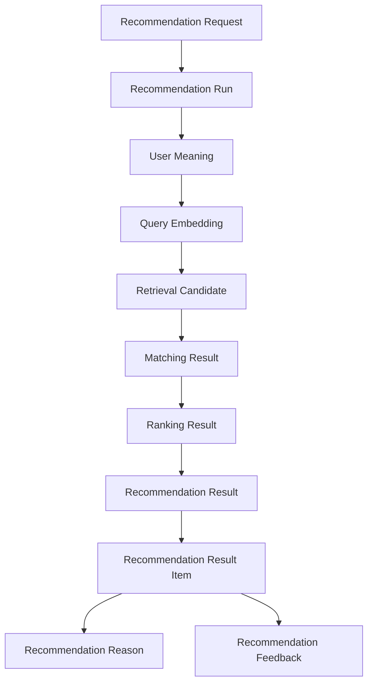
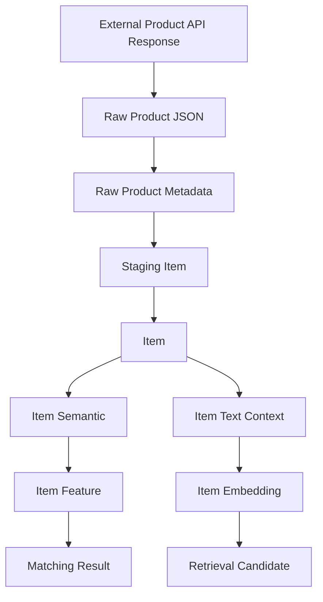
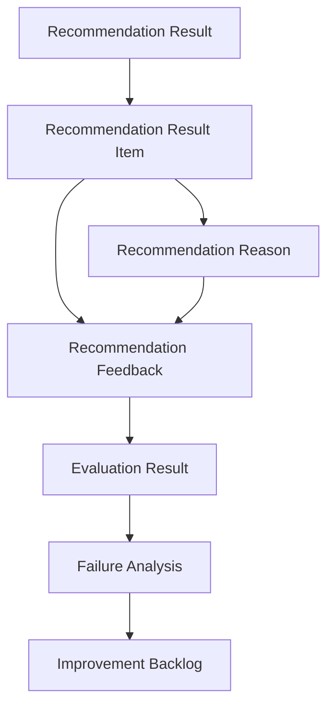

# リソース一覧

## 1. 概要

### 1.1 目的

本ドキュメントは、Gift Recommendation Service MVP における主要リソースを一覧化する。

ここでいうリソースとは、API・画面・DB・Batch・Reco処理・評価処理から参照または操作される、業務上意味を持つデータ単位である。

本リソース一覧は、後続の以下成果物の前提となる。

- API一覧
- API仕様書
- 画面項目定義
- 論理ER
- 物理ER
- テーブル定義書
- バッチ一覧
- モジュール別入出力定義
- 権限・認証設計
- ログ・監査設計

---

### 1.2 本ドキュメントで扱うリソースの考え方

リソースは、以下の観点で整理する。

| 観点                        | 内容                                                           |
| --------------------------- | -------------------------------------------------------------- |
| 業務概念として意味を持つか  | ユーザー、推薦、商品、評価、設定、ログなどの業務上の管理単位か |
| 識別子を持つか              | `xxx_id` などで一意に参照できるか                              |
| API・画面・DBで参照されるか | Web画面、API、DB、Batch、Reco処理のいずれかで利用されるか      |
| 正本または派生データか      | 入力・結果・商品などの正本か、計算結果・Embeddingなどの派生か  |
| MVPで扱うか                 | 初回MVP対象か、後続フェーズ対象か                              |

---

### 1.3 リソースとモジュールの違い

| 区分       | 内容                                       | 例                                                       |
| ---------- | ------------------------------------------ | -------------------------------------------------------- |
| リソース   | システムが扱うデータ・業務対象             | Recommendation Request / Item / Recommendation Result    |
| モジュール | リソースを生成・取得・更新する処理責務     | Recommendation Controller / Candidate Retriever / Ranker |
| API        | リソースに対する外部・内部インターフェース | `POST /recommendations`                                  |
| テーブル   | リソースを永続化する物理データ構造         | `recommendation_request`                                 |

つまり、本ドキュメントは「処理一覧」ではなく「処理が扱う対象データ一覧」である。

---

## 2. 利用したインプット成果物

本リソース一覧の作成に利用したインプット成果物は以下。

- ドメインモデル.md
- RecommendationRequest定義書.md
- RecommendationResult定義書.md
- RecommendationFeedback定義書.md
- 処理構成定義書.md

---

## 3. リソース分類

### 3.1 リソース分類一覧

| 分類                 | 内容                                   | 主な例                                                   |
| -------------------- | -------------------------------------- | -------------------------------------------------------- |
| 推薦要求系           | ユーザーが入力した推薦条件             | Recommendation Request / Gift Context / Budget Condition |
| 推薦実行系           | 推薦処理の実行単位・状態               | Recommendation Run / Run Event                           |
| ユーザー意味系       | ユーザー入力から生成される意味・特徴量 | User Feature / User Meaning Projection                   |
| 商品系               | 外部商品データおよび内部商品正本       | Item / Item Feature / Item Embedding                     |
| 候補抽出系           | Retrievalで抽出された候補商品          | Retrieval Candidate / Excluded Candidate                 |
| Matching / Ranking系 | 意味一致度・順位付け結果               | Matching Result / Ranking Result                         |
| 推薦結果系           | ユーザーへ提示する推薦結果             | Recommendation Result / Result Item / Reason             |
| Feedback系           | 推薦結果に対するユーザー評価           | Recommendation Feedback                                  |
| 設定・Version系      | 意味定義・モデル・Ranking設定          | Semantic Config Version / Model Version                  |
| 評価・改善系         | Offline Evaluationや改善分析           | Evaluation Case / Evaluation Result / Failure Analysis   |
| Raw / Staging系      | 外部商品APIレスポンスと取込中間データ  | Raw Product JSON / Raw Metadata / Staging Item           |
| ログ・監査系         | 実行ログ・エラーログ・行動ログ         | Phase Log / Error Log / Interaction Log                  |
| マスタ系             | 画面選択肢やルールで参照する定義値     | Relationship / Occasion / Feature Definition             |
| 外部リソース系       | 外部EC・外部AI・Object Storage上の資源 | External Product / External EC Page / Object Object      |

---

## 4. リソース一覧

### 4.1 推薦要求系リソース

| リソースID  | リソース名              | 物理名候補                     | 正本/派生      | MVP対象 | 概要                                                | 主な利用箇所                                   |
| ----------- | ----------------------- | ------------------------------ | -------------- | ------- | --------------------------------------------------- | ---------------------------------------------- |
| RES-REQ-001 | Recommendation Request  | `recommendation_request`       | 正本           | ○       | ユーザーがギフト推薦を依頼する際の入力条件全体      | Web入力 / API / Reco / Evaluation              |
| RES-REQ-002 | Gift Context            | `gift_context` / request内項目 | 値オブジェクト | ○       | 贈る相手と贈答目的をまとめた文脈条件                | Request / User Feature生成 / λ_ctx算出         |
| RES-REQ-003 | Relationship Condition  | `relationship_code`            | 値オブジェクト | ○       | 贈る相手との関係性                                  | 入力フォーム / Feature Rule / Master           |
| RES-REQ-004 | Occasion Condition      | `occasion_code`                | 値オブジェクト | ○       | 贈答目的・シーン                                    | 入力フォーム / Feature Rule / Master           |
| RES-REQ-005 | Budget Condition        | `budget_min` / `budget_max`    | 値オブジェクト | ○       | 予算下限・予算上限                                  | Request / Pre Hard Filter                      |
| RES-REQ-006 | Preference Condition    | `preferred_text`               | 値オブジェクト | ○       | ユーザーが好む方向性・期待する特徴                  | Semantic抽出 / Feature生成 / Retrieval         |
| RES-REQ-007 | Non Preferred Condition | `non_preferred_text`           | 値オブジェクト | ○       | 絶対NGではないが避けたい方向性                      | Semantic抽出 / risk_penalty / Post Hard Filter |
| RES-REQ-008 | NG Condition            | `ng_text`                      | 値オブジェクト | ○       | 必ず除外すべき条件                                  | Pre Hard Filter / Post Hard Filter             |
| RES-REQ-009 | Execution Condition     | request内項目                  | 値オブジェクト | ○       | `mode` / `top_k` / `candidate_limit` などの実行条件 | API / Reco / Evaluation                        |
| RES-REQ-010 | Request Payload         | `request_payload`              | 正本補助       | ○       | ユーザー入力の元JSON                                | 再現性確保 / Debug                             |
| RES-REQ-011 | Validated Payload       | `validated_payload`            | 正本補助       | ○       | バリデーション後に後続処理へ渡した確定入力          | Reco / 再実行 / Evaluation                     |

---

### 4.2 推薦実行系リソース

| リソースID  | リソース名            | 物理名候補                                        | 正本/派生      | MVP対象 | 概要                                           | 主な利用箇所                     |
| ----------- | --------------------- | ------------------------------------------------- | -------------- | ------- | ---------------------------------------------- | -------------------------------- |
| RES-RUN-001 | Recommendation Run    | `recommendation_run`                              | 正本           | ○       | 1回の推薦処理実行を表す単位                    | Reco / Result / Log / Evaluation |
| RES-RUN-002 | Run Status            | `run_status`                                      | 値オブジェクト | ○       | 推薦実行の状態                                 | Reco / API / Log                 |
| RES-RUN-003 | Run Phase             | `run_phase`                                       | 値オブジェクト | ○       | Semantic抽出、Retrieval、Rankingなどの処理段階 | Phase Log                        |
| RES-RUN-004 | Run Version Reference | `semantic_config_version_id` / `model_version_id` | 参照           | ○       | 推薦実行時に固定した設定・モデルバージョン     | Run / Result / Evaluation        |
| RES-RUN-005 | Idempotency Key       | `idempotency_key`                                 | 値オブジェクト | △       | 同一推薦リクエストの重複実行防止キー           | API / Request保存                |

---

### 4.3 ユーザー意味系リソース

| リソースID | リソース名                 | 物理名候補                   | 正本/派生 | MVP対象 | 概要                                               | 主な利用箇所                   |
| ---------- | -------------------------- | ---------------------------- | --------- | ------- | -------------------------------------------------- | ------------------------------ |
| RES-UM-001 | User Meaning               | `user_meaning`               | 派生      | ○       | ユーザー入力から生成される贈答意図                 | Reco / Matching                |
| RES-UM-002 | External Feature           | `user_external_feature`      | 派生      | ○       | relationship / occasion 由来の特徴量               | User Feature生成               |
| RES-UM-003 | Internal Feature           | `user_internal_feature`      | 派生      | ○       | preferred / non_preferred / free_text 由来の特徴量 | User Feature生成               |
| RES-UM-004 | User Feature               | `user_feature`               | 派生      | ○       | 統合後の8次元Feature                               | Matching                       |
| RES-UM-005 | User Meaning Projection    | `user_meaning_projection`    | 派生      | ○       | User FeatureをSocial / Symbolicへ射影した値        | λ_ctx算出 / Ranking            |
| RES-UM-006 | Lambda Context             | `lambda_ctx`                 | 派生      | ○       | 贈答リスク許容度                                   | Ranking / Diversity / Risk制御 |
| RES-UM-007 | Preferred Context          | `preferred_context`          | 派生      | ○       | 好み方向の検索コンテキスト                         | Query Embedding生成            |
| RES-UM-008 | Non Preferred Context      | `non_preferred_context`      | 派生      | ○       | 避けたい方向の検索コンテキスト                     | avoid判定 / risk_penalty       |
| RES-UM-009 | Query Embedding            | `query_embedding`            | 派生      | ○       | Retrieval用のユーザー側Embedding                   | Candidate Retrieval            |
| RES-UM-010 | Semantic Extraction Result | `semantic_extraction_result` | 派生      | ○       | 入力条件から抽出したSemantic Concept               | Feature生成 / Post Hard Filter |

---

### 4.4 商品系リソース

| リソースID   | リソース名                  | 物理名候補                    | 正本/派生                | MVP対象 | 概要                                                 | 主な利用箇所                        |
| ------------ | --------------------------- | ----------------------------- | ------------------------ | ------- | ---------------------------------------------------- | ----------------------------------- |
| RES-ITEM-001 | Item                        | `item`                        | 正本                     | ○       | Online推薦で参照する内部商品正本                     | Retrieval / Result                  |
| RES-ITEM-002 | Item Price                  | `item_price`                  | 正本/履歴                | ○       | 商品価格情報                                         | Pre Hard Filter / 表示              |
| RES-ITEM-003 | Item Category               | `item_category`               | 正本/参照                | ○       | 商品カテゴリ・ジャンル                               | Pre Hard Filter / Semantic生成      |
| RES-ITEM-004 | Item Tag                    | `item_tag`                    | 正本/参照                | △       | 商品タグ                                             | Semantic生成 / Filtering            |
| RES-ITEM-005 | Item Metadata               | `item_metadata`               | 正本補助                 | ○       | レビュー数、レビュー平均、販売状態などの商品補助情報 | Pre Hard Filter / Popularity        |
| RES-ITEM-006 | Item Semantic               | `item_semantic`               | 派生                     | ○       | 商品から抽出した意味ラベル・Semantic Concept         | Item Feature生成 / Post Hard Filter |
| RES-ITEM-007 | Item Feature                | `item_feature`                | 派生                     | ○       | 商品の8次元Feature                                   | Matching                            |
| RES-ITEM-008 | Item Meaning Projection     | `item_meaning_projection`     | 派生                     | ○       | 商品FeatureをSocial / Symbolicへ射影した値           | Matching / 分析                     |
| RES-ITEM-009 | Item Text Context           | `item_text_context`           | 派生                     | ○       | Embedding入力用に統合した商品テキスト                | Embedding生成                       |
| RES-ITEM-010 | Item Embedding              | `item_embedding`              | 派生                     | ○       | Retrievalで利用する商品Embedding                     | pgvector / Candidate Retrieval      |
| RES-ITEM-011 | Recommendation Availability | `recommendation_availability` | 派生/状態                | ○       | 推薦対象として利用可能かを示す状態                   | Pre Hard Filter                     |
| RES-ITEM-012 | Item Active Status          | `item.is_active`              | 状態                     | ○       | 販売状況・取込状況に基づく有効状態                   | Pre Hard Filter / Batch             |
| RES-ITEM-013 | Item Snapshot               | result_item内snapshot         | 表示時点スナップショット | ○       | Result表示時点の商品名・価格・URL・画像URLなど       | Recommendation Result Item          |

---

### 4.5 Raw / Staging系リソース

| リソースID  | リソース名               | 物理名候補                 | 正本/派生          | MVP対象 | 概要                                           | 主な利用箇所           |
| ----------- | ------------------------ | -------------------------- | ------------------ | ------- | ---------------------------------------------- | ---------------------- |
| RES-RAW-001 | Raw Product JSON         | Object Storage object      | 外部レスポンス原本 | ○       | 外部商品APIレスポンスのRaw JSON本体            | Batch / 再処理         |
| RES-RAW-002 | Raw Product Metadata     | `raw_product_metadata`     | 正本補助           | ○       | Raw JSONのobject key、hash、取得日時、取込状態 | Batch / Audit          |
| RES-RAW-003 | Raw Object Key           | `object_key`               | 参照値             | ○       | Object Storage上のRaw JSON参照先               | Raw Reader             |
| RES-RAW-004 | Content Hash             | `content_hash`             | 値オブジェクト     | ○       | Raw JSONの差分検知・重複排除用hash             | Raw保存 / Item反映     |
| RES-RAW-005 | Request Params Hash      | `request_params_hash`      | 値オブジェクト     | ○       | 外部API取得条件の識別hash                      | Raw保存                |
| RES-RAW-006 | Import Status            | `import_status`            | 状態               | ○       | Rawデータの取込状態                            | Batch / Error Handling |
| RES-STG-001 | Staging Item             | `staging_item`             | 中間データ         | ○       | Raw JSONを内部形式へ変換した取込中間データ     | Item Upsert            |
| RES-STG-002 | Staging Transform Result | `staging_transform_result` | 処理結果           | △       | Staging変換結果・失敗理由                      | Batch Log              |

---

### 4.6 候補抽出系リソース

| リソースID  | リソース名             | 物理名候補               | 正本/派生      | MVP対象 | 概要                                                 | 主な利用箇所            |
| ----------- | ---------------------- | ------------------------ | -------------- | ------- | ---------------------------------------------------- | ----------------------- |
| RES-RET-001 | Pre Filtered Item Pool | `pre_filtered_item_pool` | 派生           | ○       | Pre Hard Filter通過後の商品集合                      | Retrieval               |
| RES-RET-002 | Retrieval Candidate    | `retrieval_candidate`    | 派生/ログ      | ○       | Retrievalで抽出された候補商品                        | Matching / Result追跡   |
| RES-RET-003 | Retrieval Method       | `retrieval_method`       | 値オブジェクト | ○       | Embedding検索、Keyword検索、Hybrid検索などの取得方式 | Retrieval / Result Item |
| RES-RET-004 | Excluded Candidate     | `excluded_candidate_log` | ログ           | ○       | Filterで除外された候補商品                           | Debug / Evaluation      |
| RES-RET-005 | Exclusion Reason       | `exclusion_reason`       | 値オブジェクト | ○       | 予算外、NG該当、重複、不整合などの除外理由           | Filter / Evaluation     |
| RES-RET-006 | Candidate Limit        | `candidate_limit`        | 実行条件       | ○       | 内部候補取得件数                                     | Retrieval / Ranking     |

---

### 4.7 Matching / Ranking系リソース

| リソースID | リソース名        | 物理名候補          | 正本/派生   | MVP対象 | 概要                                       | 主な利用箇所                |
| ---------- | ----------------- | ------------------- | ----------- | ------- | ------------------------------------------ | --------------------------- |
| RES-MR-001 | Matching Result   | `matching_result`   | 派生        | ○       | User FeatureとItem Featureの一致度計算結果 | Ranking / Result            |
| RES-MR-002 | Feature Distance  | `feature_distance`  | 派生        | ○       | Featureごとの距離                          | Matching                    |
| RES-MR-003 | Feature Match     | `feature_match`     | 派生        | ○       | Featureごとの一致度                        | Matching / Score Breakdown  |
| RES-MR-004 | Social Match      | `social_match`      | 派生        | ○       | Social系Featureの一致度                    | context_score               |
| RES-MR-005 | Symbolic Match    | `symbolic_match`    | 派生        | ○       | Symbolic系Featureの一致度                  | context_score               |
| RES-MR-006 | Context Score     | `context_score`     | 派生        | ○       | 贈答文脈との意味一致スコア                 | Ranking / Result            |
| RES-MR-007 | Popularity Score  | `popularity_score`  | 派生        | ○       | 人気・信頼性補助スコア                     | Ranking / Result            |
| RES-MR-008 | Risk Penalty      | `risk_penalty`      | 派生        | ○       | 避けたい条件・NG近似・リスク要因による減点 | Ranking / Result            |
| RES-MR-009 | Diversity Penalty | `diversity_penalty` | 派生        | △       | 類似商品が並びすぎることを避ける調整値     | Ranking / MMR               |
| RES-MR-010 | Final Score       | `final_score`       | 派生        | ○       | 最終順位決定用スコア                       | Ranking / Result            |
| RES-MR-011 | Ranking Result    | `ranking_result`    | 派生        | ○       | 最終順位付け結果                           | Result Build                |
| RES-MR-012 | Score Breakdown   | `score_breakdown`   | 派生/分析用 | ○       | スコア内訳JSON                             | Result / Evaluation / Debug |

---

### 4.8 推薦結果系リソース

| リソースID  | リソース名                 | 物理名候補                        | 正本/派生  | MVP対象 | 概要                                             | 主な利用箇所                       |
| ----------- | -------------------------- | --------------------------------- | ---------- | ------- | ------------------------------------------------ | ---------------------------------- |
| RES-RES-001 | Recommendation Result      | `recommendation_result`           | 正本       | ○       | 1回の推薦実行で生成された推薦結果全体            | Result表示 / Feedback / Evaluation |
| RES-RES-002 | Recommendation Result Item | `recommendation_result_item`      | 正本       | ○       | 推薦結果に含まれる商品1件単位の明細              | 商品カード / Feedback              |
| RES-RES-003 | Result Status              | `result_status`                   | 状態       | ○       | Result生成状態                                   | API / 画面状態 / Error Handling    |
| RES-RES-004 | Result Summary             | result内項目                      | 正本補助   | ○       | 件数、top_k、fallback有無、補足メッセージ        | 結果表示 / Debug                   |
| RES-RES-005 | Result Metadata            | result内項目                      | 正本補助   | ○       | mode、created_at、displayed_atなど               | Evaluation / Debug                 |
| RES-RES-006 | Version Metadata           | result内項目                      | 参照       | ○       | semantic_config_version_id、model_version_idなど | 再現性 / Evaluation                |
| RES-RES-007 | Recommendation Reason      | `recommendation_reason`           | 正本/派生  | ○       | 商品ごとの推薦理由                               | 結果表示 / Reason Feedback         |
| RES-RES-008 | Reason Badge               | reason内項目                      | 表示用派生 | ○       | 商品カードに表示する推薦理由ラベル               | 結果一覧                           |
| RES-RES-009 | Reason Summary             | reason内項目                      | 表示用派生 | ○       | 商品カード上の短い推薦理由                       | 結果一覧                           |
| RES-RES-010 | Reason Detail              | reason内項目                      | 表示用派生 | ○       | 詳細表示用の推薦理由                             | 推薦理由詳細表示                   |
| RES-RES-011 | Reason Point               | reason内項目                      | 表示用派生 | ○       | 箇条書きの理由                                   | 推薦理由詳細表示                   |
| RES-RES-012 | Caution Note               | reason/result内項目               | 表示用派生 | △       | 注意が必要な場合の補足文                         | 結果表示                           |
| RES-RES-013 | Fallback Result            | result内状態                      | 派生/状態  | △       | Fallbackを使って生成した推薦結果                 | Result / Evaluation                |
| RES-RES-014 | Empty Result               | result_status / result_item_count | 状態       | ○       | 推薦候補0件の結果                                | 0件結果表示                        |

---

### 4.9 Feedback系リソース

| リソースID | リソース名               | 物理名候補                 | 正本/派生      | MVP対象 | 概要                                              | 主な利用箇所              |
| ---------- | ------------------------ | -------------------------- | -------------- | ------- | ------------------------------------------------- | ------------------------- |
| RES-FB-001 | Recommendation Feedback  | `recommendation_feedback`  | 正本           | ○       | 推薦結果・商品・理由に対するユーザー評価          | Feedback登録 / Evaluation |
| RES-FB-002 | Feedback Target          | feedback内参照             | 参照           | ○       | result / item / reason のどれに対するFeedbackか   | Feedback Validation       |
| RES-FB-003 | Feedback Type            | `feedback_type`            | 値オブジェクト | ○       | item_good、item_bad、reason_goodなどの評価種別    | Feedback分析              |
| RES-FB-004 | Feedback Value           | `feedback_value`           | 値オブジェクト | ○       | boolean / rating / choice / text / event の評価値 | Feedback保存              |
| RES-FB-005 | Feedback Choice Code     | `feedback_choice_code`     | 値オブジェクト | ○       | 選択式Feedbackのコード                            | Feedback分析              |
| RES-FB-006 | Feedback Text            | `feedback_text`            | ユーザー入力   | △       | 自由コメント                                      | 分析 / 改善               |
| RES-FB-007 | Feedback Reason Category | `feedback_reason_category` | 分類           | ○       | context_mismatch、ng_violationなどの改善分類      | Failure Analysis          |
| RES-FB-008 | Feedback Summary         | `feedback_summary`         | 集計派生       | △       | Feedbackの集計結果                                | Batch分析 / 後続          |
| RES-FB-009 | Anonymous User ID        | `anonymous_user_id`        | 識別補助       | △       | 匿名ユーザー識別子                                | 重複抑制 / 分析           |
| RES-FB-010 | Session ID               | `session_id`               | 識別補助       | △       | セッション識別子                                  | 重複抑制 / 分析           |

---

### 4.10 設定・Version系リソース

| リソースID  | リソース名                    | 物理名候補                      | 正本/派生 | MVP対象 | 概要                                              | 主な利用箇所               |
| ----------- | ----------------------------- | ------------------------------- | --------- | ------- | ------------------------------------------------- | -------------------------- |
| RES-CFG-001 | Semantic Config Version       | `semantic_config_version`       | 正本      | ○       | 意味推定ロジック一式のバージョン                  | User/Item Meaning生成      |
| RES-CFG-002 | Model Version                 | `model_version`                 | 正本      | ○       | スコアリング・Ranking・モデル利用条件のバージョン | Matching / Ranking         |
| RES-CFG-003 | Ranking Config Version        | `ranking_config_version`        | 正本      | △       | Ranking計算パラメータのバージョン                 | Ranking / Evaluation       |
| RES-CFG-004 | Reason Template Version       | `reason_template_version`       | 正本      | △       | Reason生成テンプレートのバージョン                | Reason生成                 |
| RES-CFG-005 | Feature Normalization Version | `feature_normalization_version` | 正本      | △       | Feature正規化統計量・方式のバージョン             | Feature正規化              |
| RES-CFG-006 | Relationship Rule             | `relationship_rule`             | 正本      | ○       | 関係性からFeatureを生成するルール                 | User Feature生成           |
| RES-CFG-007 | Occasion Rule                 | `occasion_rule`                 | 正本      | ○       | 贈答目的からFeatureを生成するルール               | User Feature生成           |
| RES-CFG-008 | Pair Rule                     | `pair_rule`                     | 正本      | △       | relationship × occasion の組合せ補正ルール        | User Feature生成           |
| RES-CFG-009 | Hint Dictionary               | `hint_dictionary`               | 正本      | ○       | キーワード・概念からFeature補正へ接続する辞書     | Semantic抽出 / Feature生成 |
| RES-CFG-010 | Concept Definition            | `concept_definition`            | 正本      | ○       | Semantic Conceptの定義                            | Semantic抽出               |
| RES-CFG-011 | Feature Definition            | `feature_definition`            | 正本      | ○       | 8次元Featureの定義                                | Feature生成 / Validation   |
| RES-CFG-012 | Concept Feature Rule          | `concept_feature_rule`          | 正本      | ○       | Semantic ConceptからFeature Deltaへ変換するルール | Feature生成                |

---

### 4.11 評価・改善系リソース

| リソースID   | リソース名             | 物理名候補               | 正本/派生     | MVP対象 | 概要                                            | 主な利用箇所        |
| ------------ | ---------------------- | ------------------------ | ------------- | ------- | ----------------------------------------------- | ------------------- |
| RES-EVAL-001 | Evaluation Dataset     | `evaluation_dataset`     | 正本          | △       | Offline Evaluation用の評価データセット          | Batch / Evaluation  |
| RES-EVAL-002 | Evaluation Case        | `evaluation_case`        | 正本          | △       | 評価用の推薦入力ケース                          | Evaluation Runner   |
| RES-EVAL-003 | Evaluation Result      | `evaluation_result`      | 派生/評価結果 | △       | 評価指標・評価結果                              | Evaluation / 改善   |
| RES-EVAL-004 | Failure Analysis       | `failure_analysis`       | 分析派生      | △       | Retrieval / Matching / Ranking / Reason失敗分類 | 改善Backlog         |
| RES-EVAL-005 | Improvement Backlog    | `improvement_backlog`    | 運用リソース  | △       | Feedbackや評価結果から作成する改善候補          | GitHub Issue / 運用 |
| RES-EVAL-006 | Human Evaluation Task  | `human_evaluation_task`  | 正本          | 後続    | 人手評価タスク                                  | 後続管理画面        |
| RES-EVAL-007 | Human Evaluation Input | `human_evaluation_input` | 正本          | 後続    | 人手評価の入力結果                              | 後続Evaluation      |

---

### 4.12 ログ・監査系リソース

| リソースID  | リソース名                   | 物理名候補                     | 正本/派生 | MVP対象 | 概要                                       | 主な利用箇所                  |
| ----------- | ---------------------------- | ------------------------------ | --------- | ------- | ------------------------------------------ | ----------------------------- |
| RES-LOG-001 | Recommendation Run Event Log | `recommendation_run_event_log` | 事実ログ  | ○       | 推薦実行単位のイベントログ                 | Reco / Debug                  |
| RES-LOG-002 | Phase Log                    | `phase_log`                    | 事実ログ  | ○       | 処理段階ごとの開始・終了・成功・失敗ログ   | API / Reco / Batch            |
| RES-LOG-003 | Error Log                    | `error_log`                    | 事実ログ  | ○       | エラー内容・原因・対象データ               | API / Reco / Batch            |
| RES-LOG-004 | User Interaction Log         | `user_interaction_log`         | 行動ログ  | △       | 表示・クリックなどのユーザー行動           | 分析 / 後続                   |
| RES-LOG-005 | Result View Log              | `result_view_log`              | 行動ログ  | △       | Recommendation Result Itemが表示された事実 | 分析                          |
| RES-LOG-006 | Result Click Log             | `result_click_log`             | 行動ログ  | △       | 外部EC遷移ボタンなどがクリックされた事実   | 分析                          |
| RES-LOG-007 | Metric Log                   | `metric_log`                   | 計測ログ  | ○       | 処理時間、件数、スコア分布などのメトリクス | Observability                 |
| RES-LOG-008 | Batch Execution Log          | `batch_execution_log`          | 事実ログ  | ○       | 商品取込・意味推定・評価Batchの実行ログ    | Batch / 運用                  |
| RES-LOG-009 | External API Call Log        | `external_api_call_log`        | 事実ログ  | △       | 外部商品API・AI API呼び出しログ            | Batch / Reco                  |
| RES-LOG-010 | Excluded Candidate Log       | `excluded_candidate_log`       | 監査ログ  | ○       | Filterで除外した候補と理由                 | Post Hard Filter / Evaluation |

---

### 4.13 マスタ系リソース

| リソースID  | リソース名                      | 物理名候補                        | 正本/派生 | MVP対象 | 概要                                           | 主な利用箇所                  |
| ----------- | ------------------------------- | --------------------------------- | --------- | ------- | ---------------------------------------------- | ----------------------------- |
| RES-MST-001 | Relationship Master             | `relationship_master`             | 正本      | ○       | 贈る相手との関係性マスタ                       | 入力画面 / Request Validation |
| RES-MST-002 | Occasion Master                 | `occasion_master`                 | 正本      | ○       | 贈答目的マスタ                                 | 入力画面 / Request Validation |
| RES-MST-003 | Feedback Type Master            | `feedback_type_master`            | 正本      | ○       | Feedback種別マスタ                             | Feedback Validation           |
| RES-MST-004 | Feedback Reason Category Master | `feedback_reason_category_master` | 正本      | ○       | Feedback改善分類マスタ                         | Feedback / Evaluation         |
| RES-MST-005 | Feature Master                  | `feature_definition`              | 正本      | ○       | 8次元Feature定義                               | User / Item Feature           |
| RES-MST-006 | Semantic Concept Master         | `concept_definition`              | 正本      | ○       | Semantic Concept定義                           | Semantic抽出                  |
| RES-MST-007 | Error Code Master               | `error_code_master`               | 正本      | △       | API・Reco・Batchのエラーコード定義             | Error Handling                |
| RES-MST-008 | Result Status Master            | `result_status_master`            | 正本      | △       | Recommendation Result状態定義                  | API / UI                      |
| RES-MST-009 | Run Status Master               | `run_status_master`               | 正本      | △       | Recommendation Run状態定義                     | Reco / Log                    |
| RES-MST-010 | Mode Master                     | `mode_master`                     | 正本      | △       | `ui` / `evaluation` / `batch` の実行モード定義 | Request Validation            |

---

### 4.14 外部リソース系

| リソースID  | リソース名                    | 物理名候補            | 正本/派生        | MVP対象 | 概要                                            | 主な利用箇所       |
| ----------- | ----------------------------- | --------------------- | ---------------- | ------- | ----------------------------------------------- | ------------------ |
| RES-EXT-001 | External Product              | external API response | 外部正本         | ○       | 楽天など外部商品API上の商品                     | Batch              |
| RES-EXT-002 | External Product API Response | raw response          | 外部レスポンス   | ○       | 外部商品APIから取得したレスポンス               | Raw保存            |
| RES-EXT-003 | External EC Item Page         | `item_url`            | 外部リソース     | ○       | ユーザーが遷移する外部ECの商品ページ            | 結果画面           |
| RES-EXT-004 | Object Storage Object         | object storage        | 外部保存リソース | ○       | Raw Product JSON本体の保存先                    | Batch / Raw Reader |
| RES-EXT-005 | External AI API Request       | ai api request        | 外部連携リソース | ○       | Embedding生成・Reason生成などのAI APIリクエスト | Reco / Batch       |
| RES-EXT-006 | External AI API Response      | ai api response       | 外部連携リソース | ○       | Embedding・生成結果などのAI APIレスポンス       | Reco / Batch       |

---

## 5. MVP対象リソース一覧

初回MVPで優先的に実装対象とするリソースは以下。

| 分類                 | MVP対象リソース                                                                                                                                |
| -------------------- | ---------------------------------------------------------------------------------------------------------------------------------------------- |
| 推薦要求系           | Recommendation Request / Gift Context / Budget Condition / Preference Condition / Non Preferred Condition / NG Condition / Execution Condition |
| 推薦実行系           | Recommendation Run / Run Status / Run Version Reference                                                                                        |
| ユーザー意味系       | User Meaning / User Feature / User Meaning Projection / Lambda Context / Query Embedding                                                       |
| 商品系               | Item / Item Metadata / Item Semantic / Item Feature / Item Embedding / Recommendation Availability                                             |
| Raw / Staging系      | Raw Product JSON / Raw Product Metadata / Staging Item                                                                                         |
| 候補抽出系           | Pre Filtered Item Pool / Retrieval Candidate / Excluded Candidate                                                                              |
| Matching / Ranking系 | Matching Result / Context Score / Popularity Score / Risk Penalty / Final Score / Ranking Result / Score Breakdown                             |
| 推薦結果系           | Recommendation Result / Recommendation Result Item / Recommendation Reason / Empty Result                                                      |
| Feedback系           | Recommendation Feedback / Feedback Type / Feedback Reason Category                                                                             |
| 設定・Version系      | Semantic Config Version / Model Version / Relationship Rule / Occasion Rule / Hint Dictionary / Concept Definition / Feature Definition        |
| ログ・監査系         | Recommendation Run Event Log / Phase Log / Error Log / Metric Log / Excluded Candidate Log                                                     |
| マスタ系             | Relationship Master / Occasion Master / Feedback Type Master / Feature Master                                                                  |
| 外部リソース系       | External Product / External Product API Response / External EC Item Page / Object Storage Object / External AI API Response                    |

---

## 6. 初回MVPでは対象外または後続扱いのリソース

| リソース                  | 方針   | 理由                                                 |
| ------------------------- | ------ | ---------------------------------------------------- |
| User Account              | 対象外 | 初回MVPでは認証機能を対象外とするため                |
| Login Session             | 対象外 | 認証・会員管理を扱わないため                         |
| User Profile              | 対象外 | 個人別長期パーソナライズを行わないため               |
| Recommendation History    | 後続   | 認証・履歴管理が前提となるため                       |
| Purchase Order            | 対象外 | 購入機能は外部EC遷移で代替するため                   |
| Payment                   | 対象外 | 決済機能はMVP対象外のため                            |
| Delivery                  | 対象外 | 配送管理はMVP対象外のため                            |
| Cart                      | 対象外 | 外部EC側の責務とするため                             |
| Admin User                | 後続   | 管理画面は初回MVP対象外のため                        |
| Admin Dashboard           | 後続   | 初期検証では過剰なため                               |
| Human Evaluation Task     | 後続   | 初回MVP後の評価改善フェーズで扱うため                |
| A/B Test Experiment       | 後続   | 初期トラフィック不足のため                           |
| Long Term User Preference | 後続   | 認証・行動履歴蓄積が前提となるため                   |
| Online Learning Model     | 対象外 | 少数Feedbackを即時反映すると品質劣化リスクがあるため |

---

## 7. リソース間の主要関係

### 7.1 推薦要求から推薦結果まで



---

### 7.2 商品データ準備のリソース関係



---

### 7.3 Feedbackと改善のリソース関係



---

## 8. API化候補リソース

本章はAPI一覧・API仕様書への橋渡しとして、外部または内部APIで操作される可能性が高いリソースを整理する。

| リソース                   | API化方針                                     | 想定API                                      |
| -------------------------- | --------------------------------------------- | -------------------------------------------- |
| Recommendation Request     | ユーザーからの推薦実行要求として受け付ける    | `POST /recommendations`                      |
| Recommendation Result      | 推薦実行APIのレスポンスとして返却する         | `POST /recommendations` response             |
| Recommendation Result Item | Result内の商品明細として返却する              | `POST /recommendations` response             |
| Recommendation Reason      | Result Itemの表示要素として返却する           | `POST /recommendations` response             |
| Recommendation Feedback    | 推薦結果へのFeedbackとして登録する            | `POST /recommendations/{result_id}/feedback` |
| Relationship Master        | 入力画面の選択肢として取得する                | `GET /masters/relationships`                 |
| Occasion Master            | 入力画面の選択肢として取得する                | `GET /masters/occasions`                     |
| Evaluation Case            | 評価Batchまたは管理用途で利用する             | 後続                                         |
| Item                       | 管理・Debug用途では参照API化の余地あり        | 初回MVPでは原則非公開                        |
| Config Version             | Debug / Evaluation用途では参照API化の余地あり | 初回MVPでは原則非公開                        |

---

## 9. DB設計への引き継ぎ候補

### 9.1 初回MVPでテーブル化優先度が高いリソース

| 優先度 | リソース                   | テーブル候補                 | 理由                             |
| ------ | -------------------------- | ---------------------------- | -------------------------------- |
| 高     | Recommendation Request     | `recommendation_request`     | 推薦入力の正本                   |
| 高     | Recommendation Run         | `recommendation_run`         | 推薦実行単位の正本               |
| 高     | Recommendation Result      | `recommendation_result`      | 推薦結果の正本                   |
| 高     | Recommendation Result Item | `recommendation_result_item` | 表示商品単位の正本               |
| 高     | Recommendation Reason      | `recommendation_reason`      | UI表示・Feedback対象             |
| 高     | Recommendation Feedback    | `recommendation_feedback`    | 改善ループの入力                 |
| 高     | Item                       | `item`                       | 推薦対象商品の正本               |
| 高     | Item Feature               | `item_feature`               | Matchingに必須                   |
| 高     | Item Embedding             | `item_embedding`             | Retrievalに必須                  |
| 高     | Raw Product Metadata       | `raw_product_metadata`       | Raw JSON参照・取込管理           |
| 高     | Staging Item               | `staging_item`               | 外部商品データ取込               |
| 中     | Item Semantic              | `item_semantic`              | Feature生成・Post Hard Filter    |
| 中     | Matching Result            | `matching_result`            | Debug / Evaluation               |
| 中     | Ranking Result             | `ranking_result`             | Debug / Evaluation               |
| 中     | Phase Log                  | `phase_log`                  | 障害調査                         |
| 中     | Error Log                  | `error_log`                  | 障害調査                         |
| 中     | Metric Log                 | `metric_log`                 | Observability                    |
| 中     | Semantic Config Version    | `semantic_config_version`    | 再現性                           |
| 中     | Model Version              | `model_version`              | 再現性                           |
| 低     | Feedback Summary           | `feedback_summary`           | 初期はViewまたはクエリで代替可能 |
| 低     | User Interaction Log       | `user_interaction_log`       | MVP初期では簡略化可能            |

---

## 10. レビュー観点

| 観点                 | 確認内容                                                                                                  |
| -------------------- | --------------------------------------------------------------------------------------------------------- |
| 業務概念の網羅性     | Request / Run / User Meaning / Item / Retrieval / Matching / Ranking / Result / Feedback が漏れていないか |
| 正本と派生の分離     | Request / Result / Feedback / Item と Feature / Score / Embedding が混ざっていないか                      |
| MVPスコープ適合      | 認証、履歴、購入、決済、配送など対象外リソースが混入していないか                                          |
| 推薦パイプライン整合 | Pre Hard Filter → Retrieval → Post Hard Filter → Matching → Ranking → Result の順序と矛盾していないか     |
| 商品データ連携整合   | Raw JSON本体はObject Storage、Raw MetadataはDBという方針に合っているか                                    |
| Feedback改善接続     | FeedbackがResult / Item / Reasonに紐づき、Evaluation / Failure Analysisへ接続できるか                     |
| Version再現性        | semantic_config_version / model_version をRun / Resultへ紐づけられるか                                    |
| UI接続性             | 結果一覧、理由詳細、商品詳細、Feedback入力で必要なリソースがあるか                                        |
| API接続性            | `POST /recommendations` と `POST /recommendations/{result_id}/feedback` の入出力に必要なリソースがあるか  |
| DB設計接続性         | 論理ER・テーブル定義へ展開できる粒度になっているか                                                        |

---

## 11. まとめ

Gift Recommendation Service MVP のリソースは、以下を中核とする。

```text
Recommendation Request
↓
Recommendation Run
↓
User Meaning
↓
Item / Item Meaning
↓
Retrieval Candidate
↓
Matching Result
↓
Ranking Result
↓
Recommendation Result
↓
Recommendation Result Item
↓
Recommendation Reason
↓
Recommendation Feedback
```

初回MVPでは、以下を優先する。

```text
- 認証・履歴・購入・決済・配送は対象外
- Recommendation Requestを推薦入力の正本とする
- Recommendation Resultを推薦出力の正本とする
- Recommendation Feedbackを改善用評価データとして保存する
- Item / Item Feature / Item EmbeddingをOnline推薦の前提データとする
- Raw Product JSON本体はObject Storageへ保存する
- Raw Product MetadataはDBへ保存する
- Pre Hard Filter / Retrieval / Post Hard Filterの順序を前提にする
- semantic_config_version / model_versionで再現性を確保する
```

本リソース一覧をもとに、後続で API一覧、API仕様書、論理ER、テーブル定義書、モジュール別入出力定義へ展開する。
