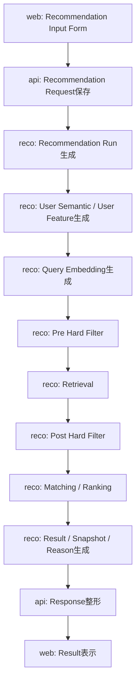
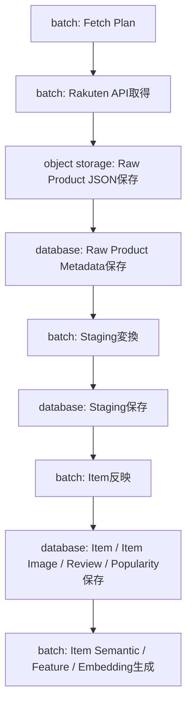
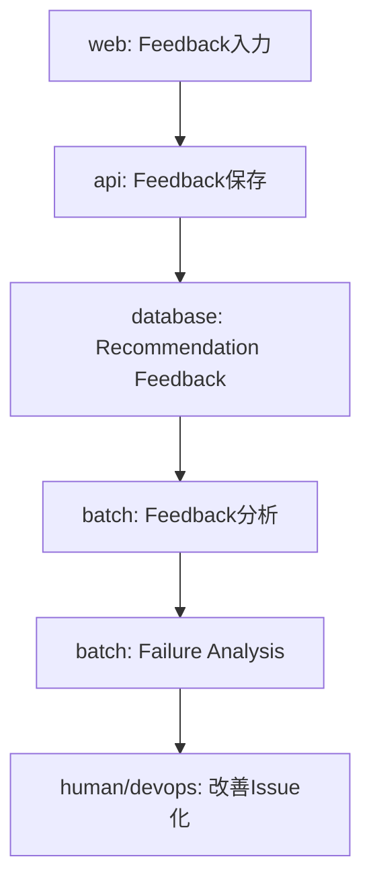

# リソース責務定義表

## 1. 概要

### 1.1 目的

本ドキュメントは、Gift Recommendation Service MVP における各リソースについて、どのコンポーネントが生成・更新・参照・保存する責務を持つかを整理する。

`リソース一覧.md` では、本サービスで扱う主要リソースを一覧化した。
本ドキュメントでは、それらのリソースに対して、責務境界を明確化する。

本ドキュメントで明確にする内容は以下である。

```text
- 各リソースの管理責務
- 各リソースの生成責務
- 各リソースの更新責務
- 各リソースの参照責務
- 各リソースの保存先
- 各リソースの更新タイミング
- Online / Batch / 共通 / 運用の責務境界
- 正本定義表、API一覧、バッチ一覧、テーブル設計への引き継ぎ
```

### 1.1 目的

### 1.2 本ドキュメントの位置づけ

| 成果物                          | 本ドキュメントとの関係                                   |
| ------------------------------- | -------------------------------------------------------- |
| リソース一覧.md                 | 本ドキュメントの対象リソース一覧                         |
| 機能一覧.md                     | 各リソースを利用する機能の前提                           |
| モジュール一覧.md               | 各リソースを生成・更新・参照するモジュールの前提         |
| 機能×モジュール対応表.md        | 機能・モジュール・リソースの接続前提                     |
| 処理構成定義書.md               | Online / Batch / 共通処理の責務境界の前提                |
| 外部商品データ連携設計書.md     | 外部商品データ、Raw、Staging、Item反映の責務前提         |
| RecommendationRequest定義書.md  | Recommendation Request系リソースの責務前提               |
| RecommendationResult定義書.md   | Recommendation Result系リソースの責務前提                |
| RecommendationFeedback定義書.md | Feedback系リソースの責務前提                             |
| Reason生成定義書.md             | Reason系リソースの責務前提                               |
| 正本定義表.md                   | 本表をもとに、正本・派生・Snapshot・ログ区分を詳細化する |
| API一覧.md                      | APIごとの入出力リソース責務を詳細化する                  |
| バッチ一覧.md                   | Batchごとの入出力リソース責務を詳細化する                |
| テーブル一覧 / テーブル定義     | 永続化リソースの物理設計へ展開する                       |

---

## 2. 利用したインプット成果物

利用したインプット成果物は以下です。

- リソース一覧.md
- 機能一覧.md
- モジュール一覧.md
- 機能×モジュール対応表.md
- 処理構成定義書.md
- 外部商品データ連携設計書.md
- ドメインモデル.md
- RecommendationRequest定義書.md
- RecommendationResult定義書.md
- RecommendationFeedback定義書.md
- Reason生成定義書.md
- Retrieval定義書.md
- Matching定義書.md
- Ranking定義書.md
- Evaluation評価定義書.md
- 状態遷移設計書.md

---

## 3. 基本方針

### 3.1 リソース責務定義方針

| 方針                                            | 内容                                                                                                 |
| ----------------------------------------------- | ---------------------------------------------------------------------------------------------------- |
| 生成責務と参照責務を分ける                      | あるコンポーネントが参照していても、管理責務を持つとは限らない                                       |
| Online / Batchを分離する                        | Online推薦中に外部商品API取得や商品正本更新を行わない                                                |
| 外部商品データはbatchが管理する                 | 楽天API取得、Raw保存、Staging変換、Item反映はbatch責務とする                                         |
| 商品正本はdatabase上のItem系リソースで管理する  | Online推薦ではItem / Item Image / Item Feature / Item Embedding等を参照する                          |
| Raw本体とRawメタデータの責務を分ける            | Raw JSON本体はObject Storage、Raw MetadataはDBで管理する                                             |
| 商品画像はItem Imageとして管理する              | 楽天商品検索API由来の `smallImageUrls` / `mediumImageUrls` をItem Imageへ反映する                    |
| ランキング情報はPopularity Signalとして管理する | 楽天ランキングAPI由来の商品名・価格・画像URLはItem正本へ直接反映しない                               |
| Result Snapshotを明示する                       | 表示時点の商品名・価格・URL・画像URLはRecommendation Result ItemへSnapshotとして固定する             |
| 状態更新を過剰にしない                          | 商品単位の中間状態を逐次DB更新せず、Batch単位・API単位・Raw単位・chunk単位・終端状態を中心に保存する |
| MVP対象外を混入させない                         | 認証、会員、ユーザー別履歴、購入、決済、配送は初回MVP対象外とする                                    |

---

### 3.2 責務区分

| 責務区分 | 内容                                                       |
| -------- | ---------------------------------------------------------- |
| 管理責務 | そのリソースのライフサイクル、構造、更新方針を管理する責務 |
| 生成責務 | リソースを新規作成する責務                                 |
| 更新責務 | 既存リソースを変更・上書き・状態更新する責務               |
| 参照責務 | リソースを読み取り、処理・表示・判定に利用する責務         |
| 保存責務 | リソースをDB / Object Storage等へ永続化する責務            |
| 削除責務 | リソースを削除・無効化・保持期限管理する責務               |
| 表示責務 | リソースをユーザー向けに表示する責務                       |
| 運用責務 | CI、Batch実行、Secrets、Issue等を運用する責務              |

---

### 3.3 コンポーネント責務の基本境界

| コンポーネント    | 基本責務                                                                                     |
| ----------------- | -------------------------------------------------------------------------------------------- |
| web               | 画面表示、入力状態管理、API呼び出し、推薦結果表示、Feedback入力                              |
| api               | HTTP受付、入力検証、Request保存、reco呼び出し、Feedback保存、レスポンス整形                  |
| reco              | 推薦パイプライン実行、User Feature生成、Retrieval、Matching、Ranking、Reason生成、Result生成 |
| batch             | 楽天API取得、疑似差分取得、Raw保存、Staging変換、Item反映、商品意味生成、Offline Evaluation  |
| database          | 構造化データ、正本、派生データ、Snapshot、ログの永続化                                       |
| object storage    | 外部APIレスポンスRaw JSON本体の保存                                                          |
| external services | 楽天市場API、外部AI API等の外部データ・外部計算機能の提供                                    |
| devops            | CI、Batch実行、Secrets管理、Issue / PR運用                                                   |

リソース責務とは、そのリソースがシステム上で担うデータ責務である。

## 4. 全体リソース責務定義表

| リソース分類           | リソース名                          | 管理責務                | 生成・更新責務     | 参照責務                | 保存先                     | 更新タイミング | MVP対象 | 備考                                      |
| ---------------------- | ----------------------------------- | ----------------------- | ------------------ | ----------------------- | -------------------------- | -------------- | ------- | ----------------------------------------- |
| 画面・UI               | Top Page                            | web                     | web                | user                    | 画面状態                   | OL             | ○       | DB永続化対象外                            |
| 画面・UI               | Recommendation Input Form           | web                     | web                | web / api               | 画面状態                   | OL             | ○       | 送信時にRecommendation Requestへ変換      |
| 画面・UI               | Recommendation Loading State        | web                     | web                | user                    | 画面状態                   | OL             | ○       | API呼び出し中の状態                       |
| 画面・UI               | Recommendation Result View          | web                     | web                | user                    | 画面状態                   | OL             | ○       | Recommendation Resultを表示               |
| 画面・UI               | Product Recommendation Card         | web                     | web                | user                    | 画面状態                   | OL             | ○       | Result Item Snapshot / Reasonを表示       |
| 画面・UI               | Reason Detail Modal State           | web                     | web                | user                    | 画面状態                   | OL             | ○       | Reason Detailを表示                       |
| 画面・UI               | Product Detail Modal State          | web                     | web                | user                    | 画面状態                   | OL             | ○       | Result Snapshotを表示                     |
| 画面・UI               | Feedback Input Modal State          | web                     | web                | user / api              | 画面状態                   | OL             | ○       | 送信時にRecommendation Feedbackへ変換     |
| 画面・UI               | Error View State                    | web                     | web                | user                    | 画面状態                   | OL             | ○       | API Error Response等を表示                |
| 画面・UI               | Empty Result View State             | web                     | web                | user                    | 画面状態                   | OL             | ○       | 0件結果表示                               |
| 画面・UI               | Recommendation History View         | web                     | web                | user                    | 画面状態                   | OL             | ×       | 認証・履歴管理が必要なため後続            |
| Recommendation Request | Recommendation Request              | api                     | api                | reco / database         | database                   | OL             | ○       | ユーザー入力条件の正本                    |
| Recommendation Request | Recommendation Request Condition    | api                     | api                | reco                    | database                   | OL             | ○       | 構造化された入力条件                      |
| Recommendation Request | Budget Condition                    | api                     | web / api          | reco                    | database / request payload | OL             | ○       | budget_min / budget_max                   |
| Recommendation Request | Relationship Condition              | api                     | web / api          | reco                    | database / request payload | OL             | ○       | Relationship Master参照値                 |
| Recommendation Request | Occasion Condition                  | api                     | web / api          | reco                    | database / request payload | OL             | ○       | Occasion Master参照値                     |
| Recommendation Request | Preferred Condition                 | api                     | web / api          | reco                    | database / request payload | OL             | ○       | 好み・重視条件                            |
| Recommendation Request | Non Preferred Condition             | api                     | web / api          | reco                    | database / request payload | OL             | ○       | 避けたい傾向                              |
| Recommendation Request | NG Condition                        | api                     | web / api          | reco                    | database / request payload | OL             | ○       | Hard Filter対象                           |
| Recommendation Run     | Recommendation Run                  | reco                    | reco               | api / reco / database   | database                   | OL             | ○       | 推薦実行単位                              |
| Recommendation Run     | Recommendation Run Phase            | reco                    | reco               | reco / database         | database                   | OL             | ○       | 主要フェーズ単位で記録                    |
| Recommendation Run     | Run Status                          | reco                    | reco               | api / reco / database   | database                   | OL             | ○       | running / succeeded / failed等            |
| Recommendation Result  | Recommendation Result               | reco                    | reco               | api / web / database    | database                   | OL             | ○       | 推薦結果ヘッダ                            |
| Recommendation Result  | Recommendation Result Item          | reco                    | reco               | api / web / database    | database                   | OL             | ○       | 推薦商品明細                              |
| Recommendation Result  | Recommendation Result Item Snapshot | reco                    | reco               | api / web / database    | database                   | OL             | ○       | 表示時点の商品情報固定                    |
| Recommendation Result  | Ranking Result                      | reco                    | reco               | reco / web / database   | database                   | OL             | ○       | 最終順位                                  |
| Recommendation Result  | Score Breakdown                     | reco                    | reco               | reco / batch / database | database                   | OL             | ○       | 通常UIには表示しない                      |
| Reason                 | Recommendation Reason               | reco                    | reco               | web / api / database    | database                   | OL             | ○       | 推薦理由全体                              |
| Reason                 | Reason Badge                        | reco                    | reco               | web                     | database / response        | OL             | ○       | UI表示対象                                |
| Reason                 | Reason Summary                      | reco                    | reco               | web                     | database / response        | OL             | ○       | 商品カード表示                            |
| Reason                 | Reason Detail                       | reco                    | reco               | web                     | database / response        | OL             | ○       | 詳細表示                                  |
| Reason                 | Reason Point                        | reco                    | reco               | web                     | database / response        | OL             | ○       | 箇条書き理由                              |
| Reason                 | Caution Note                        | reco                    | reco               | web                     | database / response        | OL             | ○       | 注意・補足                                |
| Reason                 | Reason Basis                        | reco                    | reco               | reco / batch / database | database                   | OL             | ○       | 内部評価・検証用                          |
| Feedback               | Recommendation Feedback             | api                     | api                | batch / database        | database                   | OL             | ○       | ユーザーFeedback正本                      |
| Feedback               | Feedback Target                     | api                     | web / api          | api / batch             | database                   | OL             | ○       | result / item / reason等                  |
| Feedback               | Feedback Rating                     | api                     | web / api          | batch                   | database                   | OL             | ○       | 良い / 悪い / 中立等                      |
| Feedback               | Feedback Comment                    | api                     | web / api          | batch                   | database                   | OL             | ○       | 自由記述                                  |
| Item                   | Item                                | batch                   | batch              | reco / web / database   | database                   | BT / 共通      | ○       | Online推薦の商品正本                      |
| Item                   | Item Image                          | batch                   | batch              | reco / web / database   | database                   | BT / 共通      | ○       | 商品画像URL参照                           |
| Item                   | Item Review Summary                 | batch                   | batch              | reco / web / database   | database                   | BT / 共通      | ○       | レビュー平均・件数                        |
| Item                   | Item Popularity Signal              | batch                   | batch              | reco / database         | database                   | BT / 共通      | ○       | ランキング等の人気補助シグナル            |
| Item                   | Item Active Status                  | batch                   | batch              | reco / database         | database                   | BT / 共通      | ○       | 推薦対象可否                              |
| Item                   | Item Generation Queue               | batch                   | batch              | batch / reco            | database                   | BT             | ○       | 意味生成対象キュー                        |
| 外部商品データ         | External Product                    | external services       | batch              | batch                   | 一時 / Raw                 | BT             | ○       | 楽天API由来商品                           |
| 外部商品データ         | External Product Candidate          | batch                   | batch              | batch                   | 一時                       | BT             | ○       | 取込候補                                  |
| 外部商品データ         | Rakuten Item Search Response        | external services       | batch              | batch                   | object storage             | BT             | ○       | 商品正本取得元                            |
| 外部商品データ         | Rakuten Ranking Response            | external services       | batch              | batch                   | object storage             | BT             | ○       | Popularity Signal取得元                   |
| 外部商品データ         | Rakuten Genre Response              | external services       | batch              | batch                   | object storage             | BT             | ○       | External Genre取得元                      |
| 外部商品データ         | Raw Product JSON                    | object storage          | batch              | batch                   | object storage             | BT             | ○       | Raw本体。DBには保存しない                 |
| 外部商品データ         | Raw Product Metadata                | batch                   | batch              | batch / database        | database                   | BT             | ○       | Raw参照情報                               |
| 外部商品データ         | Fetch Plan                          | batch                   | batch              | batch                   | 一時 / database            | BT             | ○       | 取得計画                                  |
| 外部商品データ         | Fetch Cursor                        | batch                   | batch              | batch                   | database                   | BT             | ○       | 疑似差分取得用                            |
| 外部商品データ         | Product Diff Result                 | batch                   | batch              | batch                   | 一時 / 集計                | BT             | ○       | 新規・更新・変更なし                      |
| 外部商品データ         | Normalized Payload                  | batch                   | batch              | batch                   | 一時                       | BT             | ○       | hash算出用                                |
| 外部商品データ         | Normalized Hash                     | batch                   | batch              | batch / database        | database                   | BT             | ○       | 差分判定用                                |
| 外部商品データ         | External Genre                      | batch                   | batch              | reco / batch            | database                   | BT / 共通      | ○       | 楽天ジャンル階層                          |
| 外部商品データ         | External Attribute                  | batch                   | batch              | reco / batch            | database                   | BT / 共通      | △       | MVPでは任意                               |
| Staging                | Staging Item                        | batch                   | batch              | batch                   | database                   | BT             | ○       | Item反映前の商品データ                    |
| Staging                | Staging Item Image                  | batch                   | batch              | batch                   | database                   | BT             | ○       | Item Image反映前の画像データ              |
| Staging                | Staging Ranking Signal              | batch                   | batch              | batch                   | database                   | BT             | ○       | Popularity Signal反映前のランキングデータ |
| Staging                | Staging Genre                       | batch                   | batch              | batch                   | database                   | BT             | ○       | External Genre反映前データ                |
| Semantic / Feature     | Semantic Concept                    | database / reco         | database / seed    | reco / batch            | database                   | 共通           | ○       | 意味概念マスタ                            |
| Semantic / Feature     | Semantic Rule                       | database / reco         | database / seed    | reco / batch            | database                   | 共通           | ○       | Semantic抽出ルール                        |
| Semantic / Feature     | Feature Definition                  | database / reco         | database / seed    | reco / batch            | database                   | 共通           | ○       | Feature軸定義                             |
| Semantic / Feature     | Feature Rule                        | database / reco         | database / seed    | reco / batch            | database                   | 共通           | ○       | Feature推定ルール                         |
| Semantic / Feature     | User Semantic                       | reco                    | reco               | reco                    | 一時 / database            | OL             | ○       | ユーザー入力由来                          |
| Semantic / Feature     | Item Semantic                       | batch / reco            | batch / reco       | reco / batch            | database                   | BT / 共通      | ○       | 商品由来                                  |
| Semantic / Feature     | User Feature                        | reco                    | reco               | reco                    | 一時 / database            | OL             | ○       | 推薦実行時に生成                          |
| Semantic / Feature     | Item Feature                        | batch / reco            | batch / reco       | reco                    | database                   | BT / 共通      | ○       | Online推薦で参照                          |
| Semantic / Feature     | User Meaning                        | reco                    | reco               | reco                    | 一時 / database            | OL             | ○       | user_social / user_symbolic               |
| Semantic / Feature     | Item Meaning                        | batch / reco            | batch / reco       | reco                    | database                   | BT / 共通      | ○       | item_social / item_symbolic               |
| Embedding / Retrieval  | Query Embedding                     | reco                    | reco               | reco                    | 一時                       | OL             | ○       | Retrieval用                               |
| Embedding / Retrieval  | Item Embedding                      | batch                   | batch              | reco                    | database / pgvector        | BT / 共通      | ○       | 商品検索用                                |
| Embedding / Retrieval  | Pre Filtered Item Pool              | reco                    | reco               | reco                    | 一時                       | OL             | ○       | Pre Hard Filter後                         |
| Embedding / Retrieval  | Retrieval Candidate                 | reco                    | reco               | reco                    | 一時                       | OL             | ○       | Retrieval候補                             |
| Embedding / Retrieval  | Validated Retrieval Candidate       | reco                    | reco               | reco                    | 一時                       | OL             | ○       | Post Hard Filter後                        |
| Embedding / Retrieval  | Excluded Candidate Log              | reco                    | reco               | reco / batch            | database                   | OL             | △       | 除外理由ログ                              |
| Matching / Ranking     | Feature Match Result                | reco                    | reco               | reco                    | 一時 / database            | OL             | ○       | Feature単位一致度                         |
| Matching / Ranking     | Meaning Match Result                | reco                    | reco               | reco                    | 一時 / database            | OL             | ○       | social / symbolic一致度                   |
| Matching / Ranking     | Context Score                       | reco                    | reco               | reco                    | 一時 / database            | OL             | ○       | 文脈スコア                                |
| Matching / Ranking     | Popularity Score                    | reco                    | reco               | reco                    | 一時 / database            | OL             | ○       | 人気補正                                  |
| Matching / Ranking     | Risk Score                          | reco                    | reco               | reco                    | 一時 / database            | OL             | ○       | リスク補正                                |
| Matching / Ranking     | Final Score                         | reco                    | reco               | reco / database         | database                   | OL             | ○       | 最終スコア                                |
| Evaluation             | Evaluation Dataset                  | batch / database        | human / batch      | batch / reco            | database                   | BT             | ○       | 評価用データセット                        |
| Evaluation             | Evaluation Case                     | batch / database        | human / batch      | batch / reco            | database                   | BT             | ○       | 評価ケース                                |
| Evaluation             | Evaluation Result                   | batch                   | batch              | human / database        | database                   | BT             | ○       | 評価結果                                  |
| Evaluation             | Evaluation Metric                   | batch                   | batch              | human / database        | database                   | BT             | ○       | 評価指標                                  |
| Evaluation             | Feedback Analysis Result            | batch                   | batch              | human / devops          | database                   | BT / 運用      | △       | Feedback分析結果                          |
| Evaluation             | Failure Analysis Result             | batch                   | batch              | human / devops          | database                   | BT / 運用      | △       | 失敗分析結果                              |
| Config / Version       | Relationship Master                 | database / api          | database / seed    | web / api / reco        | database                   | 共通           | ○       | 関係性マスタ                              |
| Config / Version       | Occasion Master                     | database / api          | database / seed    | web / api / reco        | database                   | 共通           | ○       | 用途マスタ                                |
| Config / Version       | Semantic Config                     | database / reco         | database / seed    | reco / batch            | database                   | 共通           | ○       | Semantic / Feature設定                    |
| Config / Version       | Semantic Config Version             | database / reco         | database / seed    | reco / batch            | database                   | 共通           | ○       | 設定バージョン                            |
| Config / Version       | Model Version                       | database / reco / batch | database / seed    | reco / batch            | database                   | 共通           | ○       | AI / Embeddingモデル管理                  |
| Config / Version       | Ranking Config                      | database / reco         | database / seed    | reco                    | database                   | 共通           | △       | 初期は固定設定でも可                      |
| Config / Version       | Reason Template                     | database / reco         | database / seed    | reco                    | database                   | 共通           | △       | 初期は少数テンプレートでも可              |
| Config / Version       | Feature Normalization Version       | database / batch / reco | batch              | batch / reco            | database                   | 共通           | △       | 正規化設定                                |
| ログ・状態             | Phase Log                           | api / reco / batch      | api / reco / batch | dev / database          | database                   | 共通           | ○       | 主要フェーズ単位                          |
| ログ・状態             | Error Log                           | api / reco / batch      | api / reco / batch | dev / database          | database                   | 共通           | ○       | エラー単位                                |
| ログ・状態             | Batch Run Log                       | batch                   | batch              | dev / database          | database                   | BT             | ○       | Batch実行単位                             |
| ログ・状態             | API Call Log                        | batch                   | batch              | dev / database          | database                   | BT             | ○       | 外部APIリクエスト単位                     |
| ログ・状態             | Item Import Summary                 | batch                   | batch              | dev / database          | database                   | BT             | ○       | Batch / chunk単位                         |
| 運用                   | CI Workflow                         | devops                  | devops             | dev / CI                | GitHub                     | 運用           | ○       | lint / test / build                       |
| 運用                   | Batch Execution Workflow            | devops                  | devops             | dev / batch             | GitHub                     | 運用           | ○       | workflow_dispatch / cron                  |
| 運用                   | Secret                              | devops                  | devops             | api / reco / batch      | GitHub Secrets等           | 運用           | ○       | API Key / DB接続情報                      |
| 運用                   | Issue                               | devops                  | human / devops     | dev / human             | GitHub                     | 運用           | △       | 開発・改善タスク                          |
| 運用                   | Pull Request                        | devops                  | human / devops     | dev / human             | GitHub                     | 運用           | △       | レビュー単位                              |

---

## 5. コンポーネント別責務

### 5.1 webの責務

| 責務             | 対象リソース                                                        | 内容                             |
| ---------------- | ------------------------------------------------------------------- | -------------------------------- |
| 表示責務         | Top Page / Recommendation Result View / Product Recommendation Card | ユーザー向けに画面を表示する     |
| 入力責務         | Recommendation Input Form / Feedback Input Modal State              | ユーザー入力を受け付ける         |
| 画面状態管理責務 | Loading / Error / Empty / Modal State                               | 画面上の一時状態を管理する       |
| API呼び出し責務  | Recommendation Request payload / Feedback payload                   | apiへ送信する                    |
| 外部EC遷移責務   | item_url_snapshot                                                   | 楽天商品ページへ遷移する         |
| 非責務           | Item正本 / Raw JSON / Ranking Signal                                | 商品データの生成・更新は行わない |

---

### 5.2 apiの責務

| 責務               | 対象リソース                                     | 内容                               |
| ------------------ | ------------------------------------------------ | ---------------------------------- |
| HTTP受付責務       | Recommendation Request / Feedback                | webからのAPIリクエストを受け付ける |
| 入力検証責務       | Recommendation Request Condition / Feedback      | 必須項目、型、値域、矛盾を検証する |
| 保存責務           | Recommendation Request / Recommendation Feedback | 入力条件・FeedbackをDBへ保存する   |
| reco連携責務       | Recommendation Request                           | recoへ推薦実行を依頼する           |
| レスポンス整形責務 | Recommendation Result / Reason                   | web向けレスポンスへ整形する        |
| エラー応答責務     | Error Response / Error Log                       | APIエラー形式を統一する            |
| 非責務             | 推薦ロジック / 商品データ取得 / Item Feature生成 | recoまたはbatchの責務とする        |

---

### 5.3 recoの責務

| 責務             | 対象リソース                                                          | 内容                                         |
| ---------------- | --------------------------------------------------------------------- | -------------------------------------------- |
| 推薦実行制御責務 | Recommendation Run                                                    | 推薦パイプライン全体を制御する               |
| User意味推定責務 | User Semantic / User Feature / User Meaning                           | ユーザー入力から意味特徴量を生成する         |
| Retrieval責務    | Query Embedding / Retrieval Candidate                                 | 候補商品を抽出する                           |
| Filter責務       | Pre Filtered Item Pool / Validated Retrieval Candidate                | Pre / Post Hard Filterを実行する             |
| Matching責務     | Feature Match Result / Meaning Match Result                           | User FeatureとItem Featureの一致度を計算する |
| Ranking責務      | Context Score / Popularity Score / Risk Score / Final Score           | 最終順位を決定する                           |
| Result生成責務   | Recommendation Result / Result Item / Snapshot                        | 推薦結果を生成する                           |
| Reason生成責務   | Recommendation Reason                                                 | 推薦理由を生成する                           |
| 参照責務         | Item / Item Image / Item Feature / Item Embedding / Popularity Signal | 事前生成済みの商品データを参照する           |
| 非責務           | 楽天API取得 / Raw保存 / Item正本更新                                  | Online処理中には実行しない                   |

---

### 5.4 batchの責務

| 責務             | 対象リソース                                               | 内容                               |
| ---------------- | ---------------------------------------------------------- | ---------------------------------- |
| 外部API取得責務  | Rakuten API Response                                       | 楽天APIを呼び出す                  |
| 疑似差分取得責務 | Fetch Plan / Fetch Cursor / Product Diff Result            | 新規・更新候補を効率的に取得する   |
| Raw保存責務      | Raw Product JSON / Raw Product Metadata                    | Raw本体と参照メタデータを保存する  |
| Staging変換責務  | Staging Item / Staging Item Image / Staging Ranking Signal | 外部形式を内部形式へ変換する       |
| Item反映責務     | Item / Item Image / Review Summary / Popularity Signal     | Online推薦用の商品データを整備する |
| 有効状態更新責務 | Item Active Status                                         | 推薦対象可否を更新する             |
| 商品意味生成責務 | Item Semantic / Item Feature / Item Embedding              | 商品の意味情報・検索情報を生成する |
| 評価実行責務     | Evaluation Result / Evaluation Metric                      | Offline Evaluationを実行する       |
| ログ記録責務     | Batch Run Log / API Call Log / Item Import Summary         | Batch実行結果を記録する            |
| 非責務           | Online画面表示 / ユーザー同期レスポンス                    | web / api / recoの責務とする       |

---

### 5.5 databaseの責務

| 責務           | 対象リソース                                       | 内容                                   |
| -------------- | -------------------------------------------------- | -------------------------------------- |
| 永続化責務     | Request / Result / Feedback / Item / Feature / Log | 構造化データを保存する                 |
| 参照提供責務   | master / config / item / embedding / result        | 各コンポーネントから参照される         |
| 整合性保持責務 | 主キー・一意制約・index                            | データ一貫性と検索性能を支える         |
| 非責務         | 業務ロジック判断                                   | 判定ロジックはapi / reco / batchに置く |
| 非責務         | Raw JSON本体保存                                   | Raw本体はObject Storageへ保存する      |

---

### 5.6 object storageの責務

| 責務             | 対象リソース     | 内容                               |
| ---------------- | ---------------- | ---------------------------------- |
| Raw本体保存責務  | Raw Product JSON | 外部APIレスポンス原本を保存する    |
| 再処理元提供責務 | Raw Product JSON | Staging変換・再処理時に読み出す    |
| 監査元提供責務   | Raw Product JSON | 障害調査・データ検証時に参照する   |
| 非責務           | Item正本管理     | Item正本はdatabaseで管理する       |
| 非責務           | Online推薦参照   | Online推薦ではRaw JSONを参照しない |

---

### 5.7 devopsの責務

| 責務            | 対象リソース                   | 内容                                         |
| --------------- | ------------------------------ | -------------------------------------------- |
| CI責務          | CI Workflow                    | lint / test / buildを実行する                |
| Batch実行責務   | Batch Execution Workflow       | 手動・定期Batchを起動する                    |
| Secrets管理責務 | Secret                         | API Key / DB接続情報を管理する               |
| タスク管理責務  | Issue                          | 設計・実装・改善タスクを管理する             |
| レビュー責務    | Pull Request                   | 変更内容のレビュー・マージを管理する         |
| 非責務          | アプリケーション業務データ更新 | 業務データ更新はapi / reco / batchに委譲する |

---

## 6. リソース分類別責務詳細

## 6.1 Recommendation Request系

| リソース                         | 管理責務 | 生成責務  | 更新責務       | 参照責務        | 保存先   | 備考                    |
| -------------------------------- | -------- | --------- | -------------- | --------------- | -------- | ----------------------- |
| Recommendation Request           | api      | api       | 原則更新しない | reco / database | database | 推薦依頼入力の正本      |
| Recommendation Request Condition | api      | api       | 原則更新しない | reco            | database | 構造化条件              |
| Budget Condition                 | api      | web / api | 原則更新しない | reco            | database | budget_min / budget_max |
| Relationship Condition           | api      | web / api | 原則更新しない | reco            | database | Relationship Master参照 |
| Occasion Condition               | api      | web / api | 原則更新しない | reco            | database | Occasion Master参照     |
| Preferred Condition              | api      | web / api | 原則更新しない | reco            | database | semantic抽出対象        |
| Non Preferred Condition          | api      | web / api | 原則更新しない | reco            | database | avoid / risk補正対象    |
| NG Condition                     | api      | web / api | 原則更新しない | reco            | database | Hard Filter対象         |

### 方針

Recommendation Requestは、ユーザー入力の事実を保存する正本である。

推薦実行後に内容を書き換えず、再検索時は新しいRecommendation Requestを作成する。

---

## 6.2 Recommendation Run系

| リソース                 | 管理責務 | 生成責務 | 更新責務 | 参照責務              | 保存先   | 備考                         |
| ------------------------ | -------- | -------- | -------- | --------------------- | -------- | ---------------------------- |
| Recommendation Run       | reco     | reco     | reco     | api / reco / database | database | 推薦実行単位                 |
| Recommendation Run Phase | reco     | reco     | reco     | reco / database       | database | 主要フェーズ単位             |
| Run Status               | reco     | reco     | reco     | api / reco / database | database | running / succeeded / failed |
| Run Error                | reco     | reco     | reco     | dev / database        | database | 失敗時のみ詳細記録           |

### 方針

Recommendation Runは、推薦処理の実行追跡単位である。

候補商品単位の細かい状態を逐次更新するのではなく、主要フェーズ単位でPhase Logを記録する。

---

## 6.3 Recommendation Result系

| リソース                            | 管理責務 | 生成責務 | 更新責務       | 参照責務             | 保存先   | 備考               |
| ----------------------------------- | -------- | -------- | -------------- | -------------------- | -------- | ------------------ |
| Recommendation Result               | reco     | reco     | 原則更新しない | api / web / database | database | 推薦結果ヘッダ     |
| Recommendation Result Item          | reco     | reco     | 原則更新しない | api / web / database | database | 推薦商品明細       |
| Recommendation Result Item Snapshot | reco     | reco     | 原則更新しない | api / web / database | database | 表示時点の商品情報 |
| Ranking Result                      | reco     | reco     | 原則更新しない | web / database       | database | rank表示に利用     |
| Score Breakdown                     | reco     | reco     | 原則更新しない | batch / database     | database | 評価・デバッグ用   |

### 方針

Recommendation Result系は、推薦実行時点の結果を再現するため、原則として後から更新しない。

商品価格や画像URLが後で変わっても、過去のRecommendation Result Item Snapshotは維持する。

---

## 6.4 Reason系

| リソース              | 管理責務        | 生成責務        | 更新責務       | 参照責務             | 保存先              | UI表示 |
| --------------------- | --------------- | --------------- | -------------- | -------------------- | ------------------- | ------ |
| Recommendation Reason | reco            | reco            | 原則更新しない | web / api / database | database            | ○      |
| Reason Badge          | reco            | reco            | 原則更新しない | web                  | database / response | ○      |
| Reason Summary        | reco            | reco            | 原則更新しない | web                  | database / response | ○      |
| Reason Detail         | reco            | reco            | 原則更新しない | web                  | database / response | ○      |
| Reason Point          | reco            | reco            | 原則更新しない | web                  | database / response | ○      |
| Caution Note          | reco            | reco            | 原則更新しない | web                  | database / response | ○      |
| Reason Basis          | reco            | reco            | 原則更新しない | batch / database     | database            | ×      |
| Reason Template       | database / reco | database / seed | 運用更新       | reco                 | database            | ×      |

### 方針

Reasonは、ユーザーに表示する推薦理由と、内部検証用の根拠情報を分けて扱う。

通常UIに表示するのは、以下である。

```
- reason_badges
- reason_summary
- reason_detail
- reason_points
- caution_note
```

---

## 6.5 Feedback系

| リソース                 | 管理責務 | 生成責務  | 更新責務       | 参照責務         | 保存先   | 備考                     |
| ------------------------ | -------- | --------- | -------------- | ---------------- | -------- | ------------------------ |
| Recommendation Feedback  | api      | api       | 原則更新しない | batch / database | database | ユーザーFeedback正本     |
| Feedback Target          | api      | web / api | 原則更新しない | api / batch      | database | result / item / reason等 |
| Feedback Rating          | api      | web / api | 原則更新しない | batch            | database | 評価値                   |
| Feedback Comment         | api      | web / api | 原則更新しない | batch            | database | 自由記述                 |
| Feedback Analysis Result | batch    | batch     | batch          | human / devops   | database | 後続改善材料             |

### 方針

Feedbackは、受信したユーザー評価を原則として書き換えない。

後続で分析結果を生成する場合は、Feedback本体を更新せず、Feedback Analysis Resultとして派生データを作成する。

---

## 6.6 Item系

| リソース               | 管理責務 | 生成責務 | 更新責務 | 参照責務              | 保存先   | 備考                 |
| ---------------------- | -------- | -------- | -------- | --------------------- | -------- | -------------------- |
| Item                   | batch    | batch    | batch    | reco / web / database | database | Online推薦の商品正本 |
| Item Image             | batch    | batch    | batch    | reco / web / database | database | 商品画像URL          |
| Item Review Summary    | batch    | batch    | batch    | reco / web / database | database | レビュー平均・件数   |
| Item Popularity Signal | batch    | batch    | batch    | reco / database       | database | Ranking補助          |
| Item Active Status     | batch    | batch    | batch    | reco / database       | database | 推薦対象可否         |
| Item Generation Queue  | batch    | batch    | batch    | batch / reco          | database | 意味生成対象         |

### 方針

Item系リソースは、Online推薦で参照する商品データの中心である。

ただし、Online推薦中にItemを更新しない。Item更新はBatch責務とする。

---

### 6.6.1 Item Image責務

| 項目             | 内容                                                   |
| ---------------- | ------------------------------------------------------ |
| 管理責務         | batch                                                  |
| 生成元           | 楽天商品検索APIの `smallImageUrls` / `mediumImageUrls` |
| 更新主体         | Item Image Updater                                     |
| 参照主体         | reco / web                                             |
| 保存先           | database                                               |
| Online更新       | しない                                                 |
| 画像バイナリ保存 | MVPではしない                                          |

### 主画像選定責務

主画像選定は、Item Image UpdaterまたはResult Snapshot Builderで扱う。

```
1. mediumImageUrls[0]
2. smallImageUrls[0]
3. 画像なしプレースホルダー
```

---

### 6.6.2 Item Popularity Signal責務

| 項目     | 内容                                                           |
| -------- | -------------------------------------------------------------- |
| 管理責務 | batch                                                          |
| 生成元   | 楽天ランキングAPI                                              |
| 更新主体 | Item Popularity Signal Updater                                 |
| 参照主体 | reco                                                           |
| 用途     | Popularity Scorer                                              |
| 保存先   | database                                                       |
| 注意     | ランキングAPI由来の商品名・価格・画像URLはItem正本へ反映しない |

楽天ランキングAPIは、商品正本取得元ではない。

ランキングAPI由来の `rank` / `genreId` / `period` / `lastBuildDate` 等のみをPopularity Signalとして扱う。

---

## 6.7 外部商品データ系

| リソース                     | 管理責務          | 生成責務    | 更新責務       | 参照責務         | 保存先          | 備考                    |
| ---------------------------- | ----------------- | ----------- | -------------- | ---------------- | --------------- | ----------------------- |
| External Product             | external services | 楽天市場API | 楽天市場API    | batch            | 外部            | 外部正本                |
| External Product Candidate   | batch             | batch       | batch          | batch            | 一時            | 取込候補                |
| Rakuten Item Search Response | external services | 楽天市場API | 楽天市場API    | batch            | object storage  | 商品正本取得元          |
| Rakuten Ranking Response     | external services | 楽天市場API | 楽天市場API    | batch            | object storage  | Popularity Signal取得元 |
| Rakuten Genre Response       | external services | 楽天市場API | 楽天市場API    | batch            | object storage  | External Genre取得元    |
| Raw Product JSON             | object storage    | batch       | 原則更新しない | batch            | object storage  | Raw本体                 |
| Raw Product Metadata         | batch             | batch       | batch          | batch / database | database        | Raw参照情報             |
| Fetch Plan                   | batch             | batch       | batch          | batch            | 一時 / database | 取得計画                |
| Fetch Cursor                 | batch             | batch       | batch          | batch            | database        | 疑似差分取得用          |
| Product Diff Result          | batch             | batch       | batch          | batch            | 一時 / 集計     | 差分判定結果            |
| Normalized Payload           | batch             | batch       | 原則更新しない | batch            | 一時            | hash算出用              |
| Normalized Hash              | batch             | batch       | batch          | batch / database | database        | itemに保持              |
| External Genre               | batch             | batch       | batch          | reco / batch     | database        | 楽天ジャンル階層        |
| External Attribute           | batch             | batch       | batch          | reco / batch     | database        | MVP任意                 |

---

### 6.7.1 Raw責務

| リソース             | 保存責務               | 保存先         | 方針                                                   |
| -------------------- | ---------------------- | -------------- | ------------------------------------------------------ |
| Raw Product JSON     | batch / object storage | Object Storage | Raw本体を保存                                          |
| Raw Product Metadata | batch / database       | Database       | object key / hash / fetched_at / import_status等を保存 |

Raw JSON本体はDBに保存しない。

DBには、Raw JSONを参照するためのメタデータのみを保存する。

---

### 6.7.2 疑似差分取得責務

| 処理              | 責務主体 | 関連リソース                            |
| ----------------- | -------- | --------------------------------------- |
| 取得計画作成      | batch    | Fetch Plan                              |
| カーソル管理      | batch    | Fetch Cursor                            |
| API取得           | batch    | Rakuten API Response                    |
| 商品候補抽出      | batch    | External Product Candidate              |
| 正規化Payload生成 | batch    | Normalized Payload                      |
| hash算出          | batch    | Normalized Hash                         |
| 差分判定          | batch    | Product Diff Result                     |
| Raw保存判断       | batch    | Raw Product JSON / Raw Product Metadata |
| Item反映判断      | batch    | Item / Item Image / Popularity Signal   |

---

## 6.8 Staging系

| リソース                 | 管理責務 | 生成責務 | 更新責務 | 参照責務    | 保存先   | 備考                    |
| ------------------------ | -------- | -------- | -------- | ----------- | -------- | ----------------------- |
| Staging Item             | batch    | batch    | batch    | batch       | database | Item反映前              |
| Staging Item Image       | batch    | batch    | batch    | batch       | database | Item Image反映前        |
| Staging Ranking Signal   | batch    | batch    | batch    | batch       | database | Popularity Signal反映前 |
| Staging Genre            | batch    | batch    | batch    | batch       | database | External Genre反映前    |
| Staging Validation Error | batch    | batch    | batch    | dev / batch | database | 必要に応じて保存        |

### 方針

Stagingは外部API形式と内部正本の間に置く中間リソースである。

Online推薦では参照しない。

---

## 6.9 Semantic / Feature系

| リソース                      | 管理責務                | 生成責務        | 更新責務       | 参照責務     | 保存先          | 備考                        |
| ----------------------------- | ----------------------- | --------------- | -------------- | ------------ | --------------- | --------------------------- |
| Semantic Concept              | database / reco         | database / seed | 運用更新       | reco / batch | database        | 意味概念定義                |
| Semantic Rule                 | database / reco         | database / seed | 運用更新       | reco / batch | database        | 抽出ルール                  |
| Feature Definition            | database / reco         | database / seed | 運用更新       | reco / batch | database        | 8軸Feature定義              |
| Feature Rule                  | database / reco         | database / seed | 運用更新       | reco / batch | database        | 推定ルール                  |
| User Semantic                 | reco                    | reco            | 原則更新しない | reco         | 一時 / database | 推薦実行単位                |
| Item Semantic                 | batch / reco            | batch / reco    | batch / reco   | reco / batch | database        | 商品単位                    |
| User Feature                  | reco                    | reco            | 原則更新しない | reco         | 一時 / database | 推薦実行単位                |
| Item Feature                  | batch / reco            | batch / reco    | batch / reco   | reco         | database        | Online推薦で参照            |
| User Meaning                  | reco                    | reco            | 原則更新しない | reco         | 一時 / database | user_social / user_symbolic |
| Item Meaning                  | batch / reco            | batch / reco    | batch / reco   | reco         | database        | item_social / item_symbolic |
| Feature Normalization Version | database / batch / reco | batch           | batch          | batch / reco | database        | 正規化設定                  |

### 方針

User FeatureはOnline推薦実行時に生成する。

Item FeatureはBatchで事前生成し、Online推薦では参照のみ行う。

---

## 6.10 Embedding / Retrieval系

| リソース                      | 管理責務 | 生成責務 | 更新責務       | 参照責務    | 保存先              | 備考               |
| ----------------------------- | -------- | -------- | -------------- | ----------- | ------------------- | ------------------ |
| Query Embedding               | reco     | reco     | 原則更新しない | reco        | 一時                | Online生成         |
| Item Embedding                | batch    | batch    | batch          | reco        | database / pgvector | 事前生成           |
| Pre Filtered Item Pool        | reco     | reco     | 原則更新しない | reco        | 一時                | Retrieval前        |
| Retrieval Candidate           | reco     | reco     | 原則更新しない | reco        | 一時                | Retrieval後        |
| Validated Retrieval Candidate | reco     | reco     | 原則更新しない | reco        | 一時                | Post Hard Filter後 |
| Excluded Candidate Log        | reco     | reco     | reco           | batch / dev | database            | 必要に応じて保存   |

### 方針

Retrievalは以下の順序を守る。

```
Pre Hard Filter
↓
Retrieval
↓
Post Hard Filter
```

Online推薦中にItem Embeddingを生成しない。

Item EmbeddingはBatchで事前生成する。

---

## 6.11 Matching / Ranking系

| リソース             | 管理責務 | 生成責務 | 更新責務       | 参照責務        | 保存先          | UI表示       |
| -------------------- | -------- | -------- | -------------- | --------------- | --------------- | ------------ |
| Feature Match Result | reco     | reco     | 原則更新しない | reco            | 一時 / database | ×            |
| Meaning Match Result | reco     | reco     | 原則更新しない | reco            | 一時 / database | ×            |
| Context Score        | reco     | reco     | 原則更新しない | reco            | 一時 / database | ×            |
| Popularity Score     | reco     | reco     | 原則更新しない | reco            | 一時 / database | ×            |
| Risk Score           | reco     | reco     | 原則更新しない | reco            | 一時 / database | ×            |
| Final Score          | reco     | reco     | 原則更新しない | reco / database | database        | ×            |
| Ranking Result       | reco     | reco     | 原則更新しない | web / database  | database        | rankのみ表示 |
| Score Breakdown      | reco     | reco     | 原則更新しない | batch / dev     | database        | ×            |

### 方針

スコア系リソースは、通常UIには表示しない。

ユーザーには、順位と推薦理由で説明する。

---

## 6.12 Evaluation系

| リソース                      | 管理責務         | 生成責務      | 更新責務       | 参照責務       | 保存先            | 備考       |
| ----------------------------- | ---------------- | ------------- | -------------- | -------------- | ----------------- | ---------- |
| Evaluation Dataset            | batch / database | human / batch | human / batch  | batch / reco   | database          | 評価用正本 |
| Evaluation Case               | batch / database | human / batch | human / batch  | batch / reco   | database          | 評価ケース |
| Evaluation Result             | batch            | batch         | 原則更新しない | human / dev    | database          | 評価結果   |
| Evaluation Metric             | batch            | batch         | 原則更新しない | human / dev    | database          | 評価指標   |
| Feedback Analysis Result      | batch            | batch         | batch          | human / devops | database          | 後続改善   |
| Failure Analysis Result       | batch            | batch         | batch          | human / devops | database          | 後続改善   |
| Improvement Backlog Candidate | batch / devops   | batch / human | human / devops | human / devops | GitHub / database | 後続       |

---

## 6.13 Config / Version系

| リソース                      | 管理責務                | 生成責務        | 更新責務 | 参照責務         | 保存先   | 備考              |
| ----------------------------- | ----------------------- | --------------- | -------- | ---------------- | -------- | ----------------- |
| Relationship Master           | database / api          | database / seed | 運用更新 | web / api / reco | database | MVP必須           |
| Occasion Master               | database / api          | database / seed | 運用更新 | web / api / reco | database | MVP必須           |
| Semantic Config               | database / reco         | database / seed | 運用更新 | reco / batch     | database | MVP必須           |
| Semantic Config Version       | database / reco         | database / seed | 運用更新 | reco / batch     | database | 再現性確保        |
| Model Version                 | database / reco / batch | database / seed | 運用更新 | reco / batch     | database | AIモデル管理      |
| Ranking Config                | database / reco         | database / seed | 運用更新 | reco             | database | MVPでは固定でも可 |
| Reason Template               | database / reco         | database / seed | 運用更新 | reco             | database | MVPでは少数でも可 |
| Feature Normalization Version | database / batch / reco | batch           | batch    | batch / reco     | database | 後続詳細化        |

### 方針

Config / Version系リソースは、推薦結果・商品意味生成結果・評価結果の再現性を確保するために参照する。

Recommendation RunやResultには、利用したConfig / Versionを紐づける。

---

## 6.14 ログ・状態系

| リソース               | 管理責務           | 生成責務           | 更新責務 | 参照責務       | 保存先   | 保存粒度              |
| ---------------------- | ------------------ | ------------------ | -------- | -------------- | -------- | --------------------- |
| Phase Log              | api / reco / batch | api / reco / batch | 原則追記 | dev / database | database | 主要フェーズ単位      |
| Error Log              | api / reco / batch | api / reco / batch | 原則追記 | dev / database | database | エラー単位            |
| Batch Run Log          | batch              | batch              | batch    | dev / database | database | Batch実行単位         |
| API Call Log           | batch              | batch              | 原則追記 | dev / database | database | 外部APIリクエスト単位 |
| Raw Product Metadata   | batch              | batch              | batch    | batch / dev    | database | Rawレスポンス単位     |
| Item Import Summary    | batch              | batch              | batch    | dev / database | database | Batch / chunk単位     |
| Excluded Candidate Log | reco               | reco               | 原則追記 | batch / dev    | database | 除外発生単位          |

### 方針

商品データ連携では、商品単位の中間状態を逐次DB更新しない。

以下の粒度でログ・状態を管理する。

```
Batch実行単位
APIリクエスト単位
Rawレスポンス単位
chunk単位
終端状態
失敗・異常対象
```

---

## 7. 主要フロー別責務

## 7.1 Online推薦フロー責務



| 処理               | 主責務 | 生成・更新リソース                                     | 参照リソース                          |
| ------------------ | ------ | ------------------------------------------------------ | ------------------------------------- |
| 入力               | web    | Recommendation Input Form                              | Relationship Master / Occasion Master |
| Request保存        | api    | Recommendation Request                                 | 入力payload                           |
| Run生成            | reco   | Recommendation Run                                     | Recommendation Request                |
| User意味推定       | reco   | User Semantic / User Feature / User Meaning            | Semantic Rule / Feature Rule          |
| Retrieval          | reco   | Query Embedding / Retrieval Candidate                  | Item / Item Embedding                 |
| Filter             | reco   | Pre Filtered Item Pool / Validated Retrieval Candidate | Item / Item Feature                   |
| Matching / Ranking | reco   | Match Result / Ranking Result / Final Score            | Item Feature / Popularity Signal      |
| Result生成         | reco   | Recommendation Result / Result Item Snapshot           | Item / Item Image / Review Summary    |
| Reason生成         | reco   | Recommendation Reason                                  | Score Breakdown / Reason Template     |
| 表示               | web    | 画面状態                                               | Recommendation Result / Reason        |

---

## 7.2 商品データ連携フロー責務



| 処理             | 主責務                 | 生成・更新リソース                                         | 参照リソース       |
| ---------------- | ---------------------- | ---------------------------------------------------------- | ------------------ |
| 取得計画         | batch                  | Fetch Plan / Fetch Cursor                                  | Batch Run Log      |
| 楽天API取得      | batch                  | Rakuten API Response                                       | Fetch Plan         |
| Raw保存          | batch / object storage | Raw Product JSON                                           | API Response       |
| Raw Metadata保存 | batch / database       | Raw Product Metadata                                       | Raw Product JSON   |
| Staging変換      | batch                  | Staging Item / Staging Item Image / Staging Ranking Signal | Raw Product JSON   |
| 差分判定         | batch                  | Product Diff Result / Normalized Hash                      | Staging / Item     |
| Item反映         | batch / database       | Item / Item Image / Review Summary / Popularity Signal     | Staging            |
| 有効状態更新     | batch / database       | Item Active Status                                         | Item / API取得結果 |
| 意味生成         | batch / reco           | Item Semantic / Item Feature / Item Embedding              | Item               |
| ログ記録         | batch / database       | Batch Run Log / API Call Log / Item Import Summary         | 各処理結果         |

---

## 7.3 Feedback・評価フロー責務



| 処理         | 主責務         | 生成・更新リソース         | 参照リソース            |
| ------------ | -------------- | -------------------------- | ----------------------- |
| Feedback入力 | web            | Feedback Input Modal State | Recommendation Result   |
| Feedback保存 | api            | Recommendation Feedback    | Feedback payload        |
| Feedback分析 | batch          | Feedback Analysis Result   | Recommendation Feedback |
| 失敗分析     | batch          | Failure Analysis Result    | Result / Feedback / Log |
| 改善Issue化  | human / devops | Issue                      | Failure Analysis Result |

---

## 8. 保存先別責務

### 8.1 Database保存リソース

| 分類         | Database保存リソース                                                                  |
| ------------ | ------------------------------------------------------------------------------------- |
| Request      | Recommendation Request / Recommendation Request Condition                             |
| Run          | Recommendation Run / Recommendation Run Phase                                         |
| Result       | Recommendation Result / Recommendation Result Item / Snapshot                         |
| Reason       | Recommendation Reason / Reason Basis                                                  |
| Feedback     | Recommendation Feedback                                                               |
| Item         | Item / Item Image / Item Review Summary / Item Popularity Signal / Item Active Status |
| Staging      | Staging Item / Staging Item Image / Staging Ranking Signal / Staging Genre            |
| Feature      | Item Semantic / Item Feature / Item Meaning                                           |
| Embedding    | Item Embedding                                                                        |
| Config       | Relationship Master / Occasion Master / Semantic Config / Model Version               |
| Evaluation   | Evaluation Dataset / Evaluation Result / Evaluation Metric                            |
| Log          | Phase Log / Error Log / Batch Run Log / API Call Log / Item Import Summary            |
| Raw Metadata | Raw Product Metadata                                                                  |

---

### 8.2 Object Storage保存リソース

| リソース                     | 責務                               |
| ---------------------------- | ---------------------------------- |
| Raw Product JSON             | 外部APIレスポンスRaw本体を保存する |
| Rakuten Item Search Response | 商品検索APIレスポンス原本          |
| Rakuten Ranking Response     | ランキングAPIレスポンス原本        |
| Rakuten Genre Response       | ジャンルAPIレスポンス原本          |

### 方針

Object StorageはRaw本体を保存する。

DBはRaw本体ではなく、Raw Product Metadataを保存する。

---

### 8.3 画面状態リソース

| リソース                     | 責務          |
| ---------------------------- | ------------- |
| Recommendation Input Form    | webが一時管理 |
| Recommendation Loading State | webが一時管理 |
| Modal State                  | webが一時管理 |
| Error View State             | webが一時管理 |
| Empty Result View State      | webが一時管理 |

### 方針

画面状態はDB永続化対象外とする。

永続化が必要な情報は、Recommendation Request / Result / Feedbackとして保存する。

---

## 9. MVP対象外リソースの責務方針

| リソース               | MVP責務 | 後続方針                          |
| ---------------------- | ------- | --------------------------------- |
| User Account           | なし    | 認証導入時に定義                  |
| Login Session          | なし    | 認証導入時に定義                  |
| User Profile           | なし    | パーソナライズ導入時に定義        |
| Recommendation History | なし    | 認証・履歴機能導入時に定義        |
| Purchase Order         | なし    | 購入機能を持つ場合に定義          |
| Payment                | なし    | 決済機能を持つ場合に定義          |
| Delivery               | なし    | 配送管理を持つ場合に定義          |
| Cart                   | なし    | 外部EC責務のためMVP対象外         |
| Inventory              | なし    | MVPではリアルタイム在庫管理しない |
| Item Image Binary      | なし    | MVPでは画像URL参照で対応          |
| Image Analysis Result  | なし    | 後続の精度改善テーマ              |
| Multi EC Source        | なし    | MVPでは楽天市場商品のみ           |

---

## 10. 責務上の重要ルール

### 10.1 Online推薦中に更新しないリソース

Online推薦中は、以下のリソースを更新しない。

```
- Item
- Item Image
- Item Review Summary
- Item Popularity Signal
- Item Feature
- Item Embedding
- External Genre
- Raw Product JSON
- Raw Product Metadata
```

Online推薦中は、これらを参照するだけにする。

---

### 10.2 batchで更新するリソース

以下はbatchが生成・更新する。

```
- Raw Product JSON
- Raw Product Metadata
- Staging Item
- Staging Item Image
- Staging Ranking Signal
- Item
- Item Image
- Item Review Summary
- Item Popularity Signal
- Item Active Status
- Item Semantic
- Item Feature
- Item Embedding
- Evaluation Result
- Item Import Summary
```

---

### 10.3 apiで更新するリソース

以下はapiが生成・更新する。

```
- Recommendation Request
- Recommendation Feedback
```

apiは推薦ロジック本体や商品データ更新を担当しない。

---

### 10.4 recoで生成するリソース

以下はrecoが生成する。

```
- Recommendation Run
- User Semantic
- User Feature
- User Meaning
- Query Embedding
- Retrieval Candidate
- Matching Result
- Ranking Result
- Recommendation Result
- Recommendation Result Item
- Recommendation Result Item Snapshot
- Recommendation Reason
```

---

### 10.5 webで管理するリソース

以下はwebが画面状態として管理する。

```
- Recommendation Input Form
- Recommendation Loading State
- Recommendation Result View
- Reason Detail Modal State
- Product Detail Modal State
- Feedback Input Modal State
- Error View State
- Empty Result View State
```

これらは原則としてDB保存しない。

---

## 11. 後続成果物への引き継ぎ

### 11.1 正本定義表への引き継ぎ

正本定義表では、本表をもとに以下を詳細化する。

| 観点         | 内容                                                            |
| ------------ | --------------------------------------------------------------- |
| 正本リソース | Item、Recommendation Request、Recommendation Result、Feedback等 |
| 外部正本     | 楽天商品データ、楽天ランキング、楽天ジャンル等                  |
| 派生リソース | Feature、Embedding、Score、Reason等                             |
| Snapshot     | Recommendation Result Item Snapshot                             |
| ログ         | Phase Log、Error Log、Batch Run Log等                           |
| Raw          | Raw Product JSON                                                |
| メタデータ   | Raw Product Metadata                                            |

---

### 11.2 API一覧への引き継ぎ

API一覧では、以下の責務を詳細化する。

| API                                          | 主な入出力リソース                             | 主責務     |
| -------------------------------------------- | ---------------------------------------------- | ---------- |
| `POST /recommendations`                      | Recommendation Request / Recommendation Result | api        |
| `POST /recommendations/{result_id}/feedback` | Recommendation Feedback                        | api        |
| `GET /masters/relationships`                 | Relationship Master                            | api        |
| `GET /masters/occasions`                     | Occasion Master                                | api        |
| api → reco内部API                            | Recommendation Request / Recommendation Result | api / reco |

---

### 11.3 バッチ一覧への引き継ぎ

バッチ一覧では、以下の責務をBatch Job単位へ展開する。

| Batch候補                 | 主なリソース                                              | 主責務 |
| ------------------------- | --------------------------------------------------------- | ------ |
| 楽天ジャンル同期Batch     | Rakuten Genre Response / External Genre                   | batch  |
| 楽天ランキング取得Batch   | Rakuten Ranking Response / Item Popularity Signal         | batch  |
| 楽天商品疑似差分取得Batch | Rakuten Item Search Response / Product Diff Result        | batch  |
| 既存商品再確認Batch       | Item / Rakuten Item Search Response / Product Diff Result | batch  |
| Raw取込・Staging変換Batch | Raw Product JSON / Staging系                              | batch  |
| Item反映Batch             | Item / Item Image / Review / Popularity Signal            | batch  |
| 商品意味生成Batch         | Item Semantic / Item Feature / Item Embedding             | batch  |
| Offline Evaluation Batch  | Evaluation Result / Evaluation Metric                     | batch  |

---

### 11.4 テーブル設計への引き継ぎ

テーブル設計では、以下を考慮する。

| 観点             | 内容                                              |
| ---------------- | ------------------------------------------------- |
| 正本テーブル     | 更新責務を持つコンポーネントを明確にする          |
| 派生テーブル     | 再生成可能性と更新タイミングを明確にする          |
| Snapshotテーブル | 後続更新で上書きしない                            |
| Logテーブル      | 追記中心にする                                    |
| Raw Metadata     | Object Storage上のRaw本体と接続する               |
| Item系           | Online参照性能を考慮してindexを設計する           |
| Embedding        | pgvector検索を前提にする                          |
| Batch系          | bulk insert / bulk upsert / chunk処理を前提にする |

---

## 12. レビュー観点

| 観点               | 確認内容                                                                              |
| ------------------ | ------------------------------------------------------------------------------------- |
| 責務境界           | web / api / reco / batch / database / object storage / devopsの責務が混在していないか |
| Online / Batch分離 | Online推薦中に外部商品API取得・Item更新が行われないか                                 |
| Request責務        | Recommendation Requestはapiが保存し、recoが参照する構成になっているか                 |
| Result責務         | Recommendation Resultはrecoが生成し、api / webが参照する構成になっているか            |
| Feedback責務       | Feedbackはapiが保存し、batchが分析する構成になっているか                              |
| Item責務           | Item系リソースはbatchが更新し、reco / webが参照する構成になっているか                 |
| 商品画像           | Item Imageの管理責務がbatchにあり、web / recoが参照できるか                           |
| ランキング         | Ranking API由来データがItem正本ではなくPopularity Signalとして管理されているか        |
| Raw責務            | Raw JSON本体がObject Storage、Raw MetadataがDBの責務になっているか                    |
| Staging責務        | 外部形式から内部形式への変換責務がbatchにあるか                                       |
| Snapshot責務       | Result Snapshotがreco生成で、後続の商品更新に影響されないか                           |
| 状態更新粒度       | 商品単位の中間状態を逐次DB更新する設計になっていないか                                |
| ログ責務           | Phase Log / Error Log / Batch Log / API Call Logの生成主体が明確か                    |
| MVP対象外          | 認証・購入・決済・配送・履歴管理がMVP責務に混入していないか                           |
| 後続接続           | 正本定義表、API一覧、バッチ一覧、テーブル設計へ展開できるか                           |

---

## 13. まとめ

本サービスのリソース責務は、以下のように整理する。

```
web
= 画面状態、入力、表示、Feedback入力、外部EC遷移

api
= Recommendation Request保存、Feedback保存、Validation、reco呼び出し

reco
= Recommendation Run、User Feature、Retrieval、Matching、Ranking、Result、Reason生成

batch
= 楽天API取得、疑似差分取得、Raw保存、Staging変換、Item反映、商品意味生成、評価実行

database
= 構造化データ、正本、派生、Snapshot、ログの永続化

object storage
= Raw Product JSON本体の保存

devops
= CI、Batch実行、Secrets、Issue / PR運用
```

特に、以下の責務分離を維持する。

```
- Online推薦中に楽天APIを呼ばない
- Online推薦中にItem / Item Image / Item Feature / Item Embeddingを更新しない
- 商品データ更新はbatch責務とする
- Raw JSON本体はObject Storage責務とする
- Raw Metadataはdatabase責務とする
- 商品画像URLはItem Imageとしてbatchが管理する
- 楽天ランキングAPI由来データはPopularity Signalとしてbatchが管理する
- Recommendation Result Itemには表示時点の商品情報をSnapshotとしてrecoが固定する
- Feedback本体はapiが保存し、分析はbatchが派生データとして行う
- 商品単位の中間状態を逐次DB更新せず、Batch単位・API単位・Raw単位・chunk単位・終端状態で管理する
```
