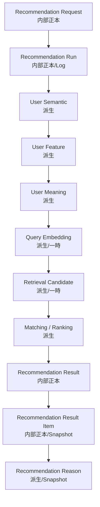
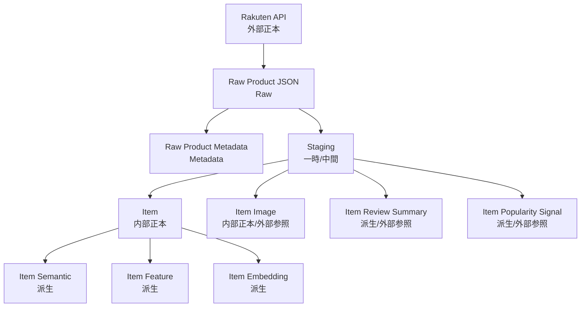
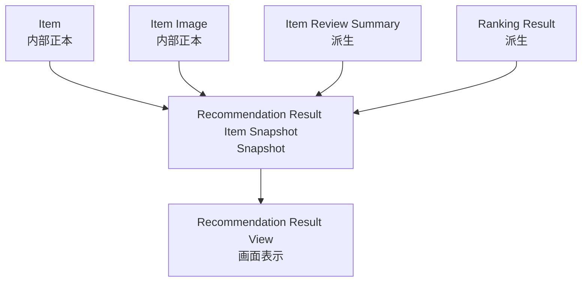

# 正本定義表

## 1. 概要

### 1.1 目的

本ドキュメントは、Gift Recommendation Service MVP における各リソースについて、**どのデータを正本として扱うか**を定義する。

`リソース一覧.md` では、本サービスで扱う主要リソースを一覧化した。
`リソース責務定義表.md` では、各リソースの生成・更新・参照責務を整理した。

本ドキュメントでは、さらに一歩進めて、以下を明確にする。

```text
- どのリソースが本サービス内の正本か
- どのリソースが外部サービス側の正本か
- どのリソースが正本から生成される派生データか
- どのリソースをSnapshotとして固定保持するか
- どのリソースをRaw / Metadata / Logとして扱うか
- どのリソースは再生成可能か
- どのリソースは後続更新で上書きしてはいけないか
```

---

### 1.2 本ドキュメントの位置づけ

| 成果物                          | 本ドキュメントとの関係                                  |
| ------------------------------- | ------------------------------------------------------- |
| リソース一覧.md                 | 正本定義対象となるリソース一覧                          |
| リソース責務定義表.md           | 各リソースの管理・生成・更新・参照責務の前提            |
| 機能一覧.md                     | 各リソースを利用する機能の前提                          |
| モジュール一覧.md               | 各リソースを生成・更新するモジュールの前提              |
| 機能×モジュール対応表.md        | 機能・モジュール・リソースの接続前提                    |
| 処理構成定義書.md               | Online / Batch / 共通処理の前提                         |
| 外部商品データ連携設計書.md     | 楽天API、Raw保存、Staging、Item反映、疑似差分取得の前提 |
| RecommendationRequest定義書.md  | Recommendation Requestの定義前提                        |
| RecommendationResult定義書.md   | Recommendation Resultの定義前提                         |
| RecommendationFeedback定義書.md | Feedbackの定義前提                                      |
| Reason生成定義書.md             | Reasonの定義前提                                        |
| 状態遷移設計書.md               | Run状態、Raw取込状態、Item有効状態の前提                |
| テーブル設計方針書              | 正本・派生・Snapshot・Logの物理設計へ接続する後続成果物 |
| テーブル一覧 / テーブル定義     | 本定義をもとに物理テーブルへ展開する後続成果物          |

---

## 2. 利用したインプット成果物

利用したインプット成果物は以下です。

- リソース一覧.md
- リソース責務定義表.md
- 機能一覧.md
- モジュール一覧.md
- 機能×モジュール対応表.md
- 処理構成定義書.md
- 外部商品データ連携設計書.md
- ドメインモデル.md
- RecommendationRequest定義書.md
- RecommendationResult定義書.md
- RecommendationFeedback定義書.md
- Reason生成定義書.md
- Retrieval定義書.md
- Matching定義書.md
- Ranking定義書.md
- Evaluation評価定義書.md
- 状態遷移設計書.md

---

## 3. 正本定義の基本方針

### 3.1 正本とは

本サービスにおける正本とは、ある情報について、**システム上の判断・表示・再処理・監査の基準となる管理元データ**を指す。

ただし、すべてのデータを本サービス内の正本として持つわけではない。

楽天市場の商品情報のように、外部サービス側が管理元である情報もある。

そのため、本ドキュメントでは、正本を以下に分類する。

| 区分     | 意味                                                                   |
| -------- | ---------------------------------------------------------------------- |
| 内部正本 | 本サービス内で管理元として保持するデータ                               |
| 外部正本 | 外部サービス側が管理元であり、本サービスでは取得・参照・複製するデータ |
| Raw      | 外部正本を取得した時点の原本データ                                     |
| Metadata | Rawや処理結果を参照・追跡するためのメタデータ                          |
| 派生     | 正本、Raw、設定、計算結果から生成されるデータ                          |
| Snapshot | ある時点の結果再現・表示再現のために固定するデータ                     |
| Log      | 処理状態、エラー、監査、評価、運用追跡のための記録                     |
| 設定正本 | ルール、マスタ、モデルバージョンなど、処理の基準となる設定データ       |
| 一時     | 処理途中で生成され、長期保持を前提としないデータ                       |
| 画面状態 | web上の表示・入力状態。原則として永続化しない                          |

---

### 3.2 正本定義の判断基準

| 判断観点                    | 方針                                                                |
| --------------------------- | ------------------------------------------------------------------- |
| ユーザー入力                | Recommendation Requestとして内部正本化する                          |
| ユーザーFeedback            | Recommendation Feedbackとして内部正本化する                         |
| 推薦実行結果                | Recommendation Result / Result Itemとして内部正本化する             |
| 表示時点の商品情報          | Recommendation Result Item Snapshotとして固定する                   |
| 商品情報                    | 楽天市場APIが外部正本。本サービスではItemとして内部正規化正本を持つ |
| 商品画像URL                 | 楽天商品検索API由来の画像URLをItem Imageとして内部管理する          |
| ランキング情報              | 楽天ランキングAPI由来の順位等をPopularity Signalとして内部管理する  |
| 楽天APIレスポンス本体       | Raw Product JSONとしてObject Storageに保存する                      |
| Raw参照情報                 | Raw Product MetadataとしてDBに保存する                              |
| Feature / Embedding / Score | 正本から生成される派生データとして扱う                              |
| Reason                      | 推薦結果に紐づく派生Snapshotとして扱う                              |
| ログ                        | 正本ではなく監査・追跡用の記録として扱う                            |
| 画面状態                    | 原則として正本にしない                                              |

---

### 3.3 上書き・再生成方針

| 区分     | 上書き可否               | 再生成可否                     | 方針                         |
| -------- | ------------------------ | ------------------------------ | ---------------------------- |
| 内部正本 | 原則制御された更新のみ可 | 原則不可                       | 入力事実・業務事実として扱う |
| 外部正本 | 本サービスでは更新不可   | 外部API再取得は可              | 外部サービス側が管理元       |
| Raw      | 原則上書きしない         | 外部API再取得は別Rawとして保存 | 取得時点の原本として保持     |
| Metadata | 状態更新は可             | 再作成可                       | Raw処理状態を追跡する        |
| 派生     | 再計算により更新可       | 可                             | 生成元とversionを保持する    |
| Snapshot | 原則上書きしない         | 原則不可                       | 結果再現性を優先する         |
| Log      | 原則追記                 | 不可                           | 監査・追跡目的               |
| 設定正本 | version追加で管理        | version切替は可                | 既存versionは原則変更しない  |
| 一時     | 上書き・削除可           | 可                             | 長期保持を前提としない       |
| 画面状態 | 上書き可                 | 可                             | web上の一時状態              |

---

## 4. 全体正本定義表

| リソース分類           | リソース名                          | 正本区分                  | 正本管理主体            | 保存先              | 更新主体           | 上書き方針              | 再生成可否            | MVP対象 | 備考                         |
| ---------------------- | ----------------------------------- | ------------------------- | ----------------------- | ------------------- | ------------------ | ----------------------- | --------------------- | ------- | ---------------------------- |
| 画面・UI               | Top Page                            | 画面状態                  | web                     | web                 | web                | 上書き可                | 可                    | ○       | DB正本ではない               |
| 画面・UI               | Recommendation Input Form           | 画面状態                  | web                     | web                 | web                | 上書き可                | 可                    | ○       | 送信時にRequestへ変換        |
| 画面・UI               | Recommendation Loading State        | 画面状態                  | web                     | web                 | web                | 上書き可                | 可                    | ○       | 一時状態                     |
| 画面・UI               | Recommendation Result View          | 画面状態                  | web                     | web                 | web                | 上書き可                | 可                    | ○       | Resultの表示状態             |
| 画面・UI               | Product Recommendation Card         | 画面状態                  | web                     | web                 | web                | 上書き可                | 可                    | ○       | Result Item Snapshotを表示   |
| 画面・UI               | Reason Detail Modal State           | 画面状態                  | web                     | web                 | web                | 上書き可                | 可                    | ○       | Reason表示状態               |
| 画面・UI               | Product Detail Modal State          | 画面状態                  | web                     | web                 | web                | 上書き可                | 可                    | ○       | 商品詳細表示状態             |
| 画面・UI               | Feedback Input Modal State          | 画面状態                  | web                     | web                 | web                | 上書き可                | 可                    | ○       | 送信時にFeedbackへ変換       |
| 画面・UI               | Error View State                    | 画面状態                  | web                     | web                 | web                | 上書き可                | 可                    | ○       | 永続化対象外                 |
| 画面・UI               | Empty Result View State             | 画面状態                  | web                     | web                 | web                | 上書き可                | 可                    | ○       | 0件結果表示                  |
| 画面・UI               | Recommendation History View         | 画面状態                  | web                     | web                 | web                | 上書き可                | 可                    | ×       | 初回MVP対象外                |
| Recommendation Request | Recommendation Request              | 内部正本                  | api                     | database            | api                | 原則更新しない          | 不可                  | ○       | ユーザー入力事実             |
| Recommendation Request | Recommendation Request Condition    | 内部正本                  | api                     | database            | api                | 原則更新しない          | 不可                  | ○       | 構造化入力条件               |
| Recommendation Request | Budget Condition                    | 内部正本 / 値オブジェクト | api                     | database / payload  | api                | 原則更新しない          | 不可                  | ○       | budget_min / budget_max      |
| Recommendation Request | Relationship Condition              | 内部正本 / マスタ参照     | api                     | database / payload  | api                | 原則更新しない          | 不可                  | ○       | Relationship Master参照      |
| Recommendation Request | Occasion Condition                  | 内部正本 / マスタ参照     | api                     | database / payload  | api                | 原則更新しない          | 不可                  | ○       | Occasion Master参照          |
| Recommendation Request | Preferred Condition                 | 内部正本 / 値オブジェクト | api                     | database / payload  | api                | 原則更新しない          | 不可                  | ○       | 好み・重視条件               |
| Recommendation Request | Non Preferred Condition             | 内部正本 / 値オブジェクト | api                     | database / payload  | api                | 原則更新しない          | 不可                  | ○       | 避けたい傾向                 |
| Recommendation Request | NG Condition                        | 内部正本 / 値オブジェクト | api                     | database / payload  | api                | 原則更新しない          | 不可                  | ○       | Hard Filter条件              |
| Recommendation Run     | Recommendation Run                  | 内部正本 / Log            | reco                    | database            | reco               | 状態のみ更新可          | 不可                  | ○       | 推薦実行単位                 |
| Recommendation Run     | Recommendation Run Phase            | Log                       | reco                    | database            | reco               | 原則追記                | 不可                  | ○       | 主要フェーズ記録             |
| Recommendation Run     | Run Status                          | Log / 状態                | reco                    | database            | reco               | 状態更新可              | 不可                  | ○       | running / succeeded / failed |
| Recommendation Run     | Run Error                           | Log                       | reco                    | database            | reco               | 原則追記                | 不可                  | ○       | 失敗時記録                   |
| Recommendation Result  | Recommendation Result               | 内部正本                  | reco                    | database            | reco               | 原則更新しない          | 不可                  | ○       | 推薦結果ヘッダ               |
| Recommendation Result  | Recommendation Result Item          | 内部正本 / Snapshot       | reco                    | database            | reco               | 原則更新しない          | 不可                  | ○       | 推薦結果明細                 |
| Recommendation Result  | Recommendation Result Item Snapshot | Snapshot                  | reco                    | database            | reco               | 上書きしない            | 不可                  | ○       | 表示時点の商品情報           |
| Recommendation Result  | Ranking Result                      | Snapshot / 派生           | reco                    | database            | reco               | 原則更新しない          | 条件付き可            | ○       | Result再現用                 |
| Recommendation Result  | Score Breakdown                     | Snapshot / 派生           | reco                    | database            | reco               | 原則更新しない          | 条件付き可            | ○       | 通常UI非表示                 |
| Reason                 | Recommendation Reason               | 派生 / Snapshot           | reco                    | database            | reco               | 原則更新しない          | 条件付き可            | ○       | 推薦結果に紐づく理由         |
| Reason                 | Reason Badge                        | 派生 / Snapshot           | reco                    | database / response | reco               | 原則更新しない          | 条件付き可            | ○       | UI表示対象                   |
| Reason                 | Reason Summary                      | 派生 / Snapshot           | reco                    | database / response | reco               | 原則更新しない          | 条件付き可            | ○       | UI表示対象                   |
| Reason                 | Reason Detail                       | 派生 / Snapshot           | reco                    | database / response | reco               | 原則更新しない          | 条件付き可            | ○       | UI表示対象                   |
| Reason                 | Reason Point                        | 派生 / Snapshot           | reco                    | database / response | reco               | 原則更新しない          | 条件付き可            | ○       | UI表示対象                   |
| Reason                 | Caution Note                        | 派生 / Snapshot           | reco                    | database / response | reco               | 原則更新しない          | 条件付き可            | ○       | UI表示対象                   |
| Reason                 | Reason Basis                        | 派生 / 内部               | reco                    | database            | reco               | 原則更新しない          | 条件付き可            | ○       | 内部検証用                   |
| Reason                 | Reason Template                     | 設定正本                  | database / reco         | database            | 運用               | version管理             | 可                    | △       | 初期は少数テンプレート可     |
| Feedback               | Recommendation Feedback             | 内部正本                  | api                     | database            | api                | 原則更新しない          | 不可                  | ○       | ユーザーFeedback事実         |
| Feedback               | Feedback Target                     | 内部正本 / 値オブジェクト | api                     | database            | api                | 原則更新しない          | 不可                  | ○       | Feedback対象                 |
| Feedback               | Feedback Rating                     | 内部正本 / 値オブジェクト | api                     | database            | api                | 原則更新しない          | 不可                  | ○       | 評価値                       |
| Feedback               | Feedback Comment                    | 内部正本 / 値オブジェクト | api                     | database            | api                | 原則更新しない          | 不可                  | ○       | 自由記述                     |
| Feedback               | Feedback Analysis Result            | 派生                      | batch                   | database            | batch              | 再計算更新可            | 可                    | △       | Feedbackから生成             |
| Item                   | Item                                | 内部正本                  | batch / database        | database            | batch              | Upsert可                | 外部API再取得で更新可 | ○       | Online推薦の商品正本         |
| Item                   | Item Image                          | 内部正本 / 外部参照       | batch / database        | database            | batch              | Upsert可                | 外部API再取得で更新可 | ○       | 画像URL参照                  |
| Item                   | Item Review Summary                 | 派生 / 外部参照           | batch / database        | database            | batch              | Upsert可                | 外部API再取得で更新可 | ○       | レビュー平均・件数           |
| Item                   | Item Popularity Signal              | 派生 / 外部参照           | batch / database        | database            | batch              | 追記またはUpsert        | 外部API再取得で更新可 | ○       | Ranking補助シグナル          |
| Item                   | Item Active Status                  | 派生 / 状態               | batch / database        | database            | batch              | 更新可                  | 可                    | ○       | 推薦対象可否                 |
| Item                   | Item Generation Queue               | 一時 / 状態               | batch                   | database            | batch              | 更新可                  | 可                    | ○       | 意味生成対象                 |
| 外部商品データ         | External Product                    | 外部正本                  | 楽天市場                | external services   | 楽天市場           | 本サービス更新不可      | API再取得可           | ○       | 外部商品情報                 |
| 外部商品データ         | External Product Candidate          | 一時                      | batch                   | memory / temp       | batch              | 上書き可                | 可                    | ○       | 取込候補                     |
| 外部商品データ         | Rakuten Item Search Response        | 外部正本由来Raw           | 楽天市場 / batch        | object storage      | batch              | 上書きしない            | API再取得可           | ○       | 商品正本取得元               |
| 外部商品データ         | Rakuten Ranking Response            | 外部正本由来Raw           | 楽天市場 / batch        | object storage      | batch              | 上書きしない            | API再取得可           | ○       | Popularity Signal取得元      |
| 外部商品データ         | Rakuten Genre Response              | 外部正本由来Raw           | 楽天市場 / batch        | object storage      | batch              | 上書きしない            | API再取得可           | ○       | Genre取得元                  |
| 外部商品データ         | Raw Product JSON                    | Raw                       | object storage          | object storage      | batch              | 上書きしない            | API再取得は別Raw      | ○       | Raw本体                      |
| 外部商品データ         | Raw Product Metadata                | Metadata / Log            | batch / database        | database            | batch              | 状態更新可              | 可                    | ○       | Raw参照情報                  |
| 外部商品データ         | Raw Product Import Status           | Metadata / 状態           | batch                   | database            | batch              | 更新可                  | 可                    | ○       | Raw取込状態                  |
| 外部商品データ         | Fetch Plan                          | 一時 / 計画               | batch                   | memory / database   | batch              | 上書き可                | 可                    | ○       | 取得計画                     |
| 外部商品データ         | Fetch Cursor                        | 状態                      | batch                   | database            | batch              | 更新可                  | 可                    | ○       | 疑似差分取得用               |
| 外部商品データ         | Product Diff Result                 | 派生 / 一時               | batch                   | memory / log        | batch              | 上書き可                | 可                    | ○       | 新規・更新・変更なし         |
| 外部商品データ         | Normalized Payload                  | 一時                      | batch                   | memory              | batch              | 上書き可                | 可                    | ○       | hash算出用                   |
| 外部商品データ         | Normalized Hash                     | 派生                      | batch                   | database            | batch              | 更新可                  | 可                    | ○       | 差分判定用                   |
| 外部商品データ         | External Genre                      | 外部参照 / 内部正本       | batch / database        | database            | batch              | Upsert可                | API再取得で更新可     | ○       | 楽天ジャンル階層             |
| 外部商品データ         | External Attribute                  | 外部参照                  | batch / database        | database            | batch              | Upsert可                | API再取得で更新可     | △       | MVP任意                      |
| Staging                | Staging Item                        | 一時 / 中間               | batch                   | database            | batch              | 再作成可                | 可                    | ○       | Item反映前                   |
| Staging                | Staging Item Image                  | 一時 / 中間               | batch                   | database            | batch              | 再作成可                | 可                    | ○       | Item Image反映前             |
| Staging                | Staging Ranking Signal              | 一時 / 中間               | batch                   | database            | batch              | 再作成可                | 可                    | ○       | Popularity反映前             |
| Staging                | Staging Genre                       | 一時 / 中間               | batch                   | database            | batch              | 再作成可                | 可                    | ○       | Genre反映前                  |
| Staging                | Staging Validation Error            | Log                       | batch                   | database            | batch              | 原則追記                | 不可                  | △       | 検証エラー                   |
| Semantic / Feature     | Semantic Concept                    | 設定正本                  | database / reco         | database            | 運用               | version管理             | 可                    | ○       | 意味概念定義                 |
| Semantic / Feature     | Semantic Rule                       | 設定正本                  | database / reco         | database            | 運用               | version管理             | 可                    | ○       | 抽出ルール                   |
| Semantic / Feature     | Feature Definition                  | 設定正本                  | database / reco         | database            | 運用               | version管理             | 可                    | ○       | 8軸Feature定義               |
| Semantic / Feature     | Feature Rule                        | 設定正本                  | database / reco         | database            | 運用               | version管理             | 可                    | ○       | Feature推定ルール            |
| Semantic / Feature     | User Semantic                       | 派生 / 実行時生成         | reco                    | memory / database   | reco               | 原則更新しない          | 条件付き可            | ○       | Requestから生成              |
| Semantic / Feature     | Item Semantic                       | 派生                      | batch / reco            | database            | batch / reco       | 再生成更新可            | 可                    | ○       | Itemから生成                 |
| Semantic / Feature     | User Feature                        | 派生 / 実行時生成         | reco                    | memory / database   | reco               | 原則更新しない          | 条件付き可            | ○       | User Semantic等から生成      |
| Semantic / Feature     | Item Feature                        | 派生                      | batch / reco            | database            | batch / reco       | 再生成更新可            | 可                    | ○       | Item Semantic等から生成      |
| Semantic / Feature     | User Meaning                        | 派生 / 実行時生成         | reco                    | memory / database   | reco               | 原則更新しない          | 条件付き可            | ○       | user_social / user_symbolic  |
| Semantic / Feature     | Item Meaning                        | 派生                      | batch / reco            | database            | batch / reco       | 再生成更新可            | 可                    | ○       | item_social / item_symbolic  |
| Semantic / Feature     | Feature Normalization Version       | 設定正本                  | database / batch / reco | database            | batch / 運用       | version管理             | 可                    | △       | 正規化設定                   |
| Embedding / Retrieval  | Query Embedding                     | 派生 / 一時               | reco                    | memory              | reco               | 上書き可                | 可                    | ○       | Online実行時生成             |
| Embedding / Retrieval  | Item Embedding                      | 派生                      | batch                   | database / pgvector | batch              | 再生成更新可            | 可                    | ○       | Itemから生成                 |
| Embedding / Retrieval  | Pre Filtered Item Pool              | 一時 / 派生               | reco                    | memory              | reco               | 上書き可                | 可                    | ○       | Pre Hard Filter後            |
| Embedding / Retrieval  | Retrieval Candidate                 | 一時 / 派生               | reco                    | memory              | reco               | 上書き可                | 可                    | ○       | Retrieval候補                |
| Embedding / Retrieval  | Validated Retrieval Candidate       | 一時 / 派生               | reco                    | memory              | reco               | 上書き可                | 可                    | ○       | Post Hard Filter後           |
| Embedding / Retrieval  | Excluded Candidate Log              | Log                       | reco                    | database            | reco               | 原則追記                | 不可                  | △       | 除外理由                     |
| Matching / Ranking     | Feature Match Result                | 派生 / 一時               | reco                    | memory / database   | reco               | 原則更新しない          | 条件付き可            | ○       | Feature一致度                |
| Matching / Ranking     | Meaning Match Result                | 派生 / 一時               | reco                    | memory / database   | reco               | 原則更新しない          | 条件付き可            | ○       | Social / Symbolic一致度      |
| Matching / Ranking     | Context Score                       | 派生 / 一時               | reco                    | memory / database   | reco               | 原則更新しない          | 条件付き可            | ○       | 文脈スコア                   |
| Matching / Ranking     | Popularity Score                    | 派生 / 一時               | reco                    | memory / database   | reco               | 原則更新しない          | 条件付き可            | ○       | 人気補正                     |
| Matching / Ranking     | Risk Score                          | 派生 / 一時               | reco                    | memory / database   | reco               | 原則更新しない          | 条件付き可            | ○       | リスク補正                   |
| Matching / Ranking     | Final Score                         | 派生 / Snapshot           | reco                    | database            | reco               | 原則更新しない          | 条件付き可            | ○       | 通常UI非表示                 |
| Matching / Ranking     | Ranking Result                      | 派生 / Snapshot           | reco                    | database            | reco               | 原則更新しない          | 条件付き可            | ○       | rank表示                     |
| Matching / Ranking     | Score Breakdown                     | 派生 / Snapshot           | reco                    | database            | reco               | 原則更新しない          | 条件付き可            | ○       | 評価・検証用                 |
| Evaluation             | Evaluation Dataset                  | 内部正本                  | batch / database        | database            | human / batch      | 制御更新可              | 不可                  | ○       | 評価用正本                   |
| Evaluation             | Evaluation Case                     | 内部正本                  | batch / database        | database            | human / batch      | 制御更新可              | 不可                  | ○       | 評価ケース                   |
| Evaluation             | Evaluation Result                   | 派生 / Log                | batch                   | database            | batch              | 原則追記                | 可                    | ○       | 評価実行結果                 |
| Evaluation             | Evaluation Metric                   | 派生                      | batch                   | database            | batch              | 原則追記                | 可                    | ○       | 評価指標                     |
| Evaluation             | Feedback Analysis Result            | 派生                      | batch                   | database            | batch              | 再計算更新可            | 可                    | △       | Feedback分析                 |
| Evaluation             | Failure Analysis Result             | 派生                      | batch                   | database            | batch              | 再計算更新可            | 可                    | △       | 失敗分析                     |
| Evaluation             | Improvement Backlog Candidate       | 派生 / 運用               | batch / devops          | GitHub / database   | human / devops     | 更新可                  | 可                    | △       | 改善Issue候補                |
| Config / Version       | Relationship Master                 | 設定正本                  | database / api          | database            | 運用               | 制御更新可              | 可                    | ○       | 関係性マスタ                 |
| Config / Version       | Occasion Master                     | 設定正本                  | database / api          | database            | 運用               | 制御更新可              | 可                    | ○       | 用途マスタ                   |
| Config / Version       | Semantic Config                     | 設定正本                  | database / reco         | database            | 運用               | version管理             | 可                    | ○       | 設定まとまり                 |
| Config / Version       | Semantic Config Version             | 設定正本                  | database / reco         | database            | 運用               | 既存version変更原則不可 | 可                    | ○       | 再現性確保                   |
| Config / Version       | Model Version                       | 設定正本                  | database / reco / batch | database            | 運用               | 既存version変更原則不可 | 可                    | ○       | AIモデル管理                 |
| Config / Version       | Ranking Config                      | 設定正本                  | database / reco         | database            | 運用               | version管理             | 可                    | △       | MVPでは固定でも可            |
| Config / Version       | Reason Template                     | 設定正本                  | database / reco         | database            | 運用               | version管理             | 可                    | △       | 理由文テンプレート           |
| Config / Version       | Feature Normalization Version       | 設定正本                  | database / batch / reco | database            | batch / 運用       | version管理             | 可                    | △       | 正規化設定                   |
| Log                    | Phase Log                           | Log                       | api / reco / batch      | database            | api / reco / batch | 原則追記                | 不可                  | ○       | 主要フェーズ単位             |
| Log                    | Error Log                           | Log                       | api / reco / batch      | database            | api / reco / batch | 原則追記                | 不可                  | ○       | エラー単位                   |
| Log                    | Batch Run Log                       | Log                       | batch                   | database            | batch              | 状態更新・追記          | 不可                  | ○       | Batch実行単位                |
| Log                    | API Call Log                        | Log                       | batch                   | database            | batch              | 原則追記                | 不可                  | ○       | 外部API呼び出し単位          |
| Log                    | Item Import Summary                 | Log / 集計                | batch                   | database            | batch              | 追記または集計更新      | 可                    | ○       | Batch / chunk単位            |
| 運用                   | CI Workflow                         | 運用正本                  | devops                  | GitHub              | devops             | 更新可                  | 可                    | ○       | CI定義                       |
| 運用                   | Batch Execution Workflow            | 運用正本                  | devops                  | GitHub              | devops             | 更新可                  | 可                    | ○       | Batch実行定義                |
| 運用                   | Secret                              | 運用正本                  | devops                  | GitHub Secrets等    | devops             | 更新可                  | 不可                  | ○       | 秘密情報                     |
| 運用                   | Issue                               | 運用正本                  | devops                  | GitHub              | human / devops     | 更新可                  | 不可                  | △       | 開発・改善タスク             |
| 運用                   | Pull Request                        | 運用正本                  | devops                  | GitHub              | human / devops     | 更新可                  | 不可                  | △       | レビュー単位                 |

---

## 5. 主要リソース別の正本定義

## 5.1 Recommendation Request系

### 5.1.1 正本方針

Recommendation Requestは、ユーザーが入力した推薦依頼条件の正本である。

```
webの入力フォーム状態
↓
apiでValidation
↓
Recommendation Requestとして保存
↓
recoが参照して推薦実行
```

Recommendation Requestは、推薦実行後に書き換えない。

再検索や条件変更が行われた場合は、既存Requestを更新するのではなく、新しいRecommendation Requestを作成する。

### 5.1.2 正本定義

| リソース                         | 正本区分                  | 正本管理主体 | 更新方針       | 備考                    |
| -------------------------------- | ------------------------- | ------------ | -------------- | ----------------------- |
| Recommendation Request           | 内部正本                  | api          | 原則更新しない | ユーザー入力の事実      |
| Recommendation Request Condition | 内部正本                  | api          | 原則更新しない | 構造化条件              |
| Budget Condition                 | 内部正本 / 値オブジェクト | api          | 原則更新しない | budget_min / budget_max |
| Relationship Condition           | 内部正本 / マスタ参照     | api          | 原則更新しない | Relationship Master参照 |
| Occasion Condition               | 内部正本 / マスタ参照     | api          | 原則更新しない | Occasion Master参照     |
| Preferred Condition              | 内部正本 / 値オブジェクト | api          | 原則更新しない | 好み・重視条件          |
| Non Preferred Condition          | 内部正本 / 値オブジェクト | api          | 原則更新しない | 避けたい傾向            |
| NG Condition                     | 内部正本 / 値オブジェクト | api          | 原則更新しない | Hard Filter対象         |

---

## 5.2 Recommendation Run系

### 5.2.1 正本方針

Recommendation Runは、推薦処理が1回実行されたという事実を表す実行単位である。

Recommendation Runは、純粋な業務正本というよりも、実行追跡・監査のための正本兼ログとして扱う。

### 5.2.2 正本定義

| リソース                 | 正本区分       | 正本管理主体 | 更新方針                                    | 備考             |
| ------------------------ | -------------- | ------------ | ------------------------------------------- | ---------------- |
| Recommendation Run       | 内部正本 / Log | reco         | 状態更新可                                  | 推薦実行単位     |
| Recommendation Run Phase | Log            | reco         | 原則追記                                    | 主要フェーズ単位 |
| Run Status               | Log / 状態     | reco         | running → succeeded / failed 等の状態更新可 | 実行状態         |
| Run Error                | Log            | reco         | 原則追記                                    | 失敗時のみ       |

---

## 5.3 Recommendation Result系

### 5.3.1 正本方針

Recommendation Resultは、推薦実行によって生成された結果の正本である。

Recommendation Resultは、Recommendation Request、使用したConfig / Version、Item、Item Feature、Ranking結果などから生成される。

ただし、生成後のRecommendation Resultは、過去の推薦結果を表す業務事実として扱うため、原則として後から書き換えない。

### 5.3.2 正本定義

| リソース                            | 正本区分            | 正本管理主体 | 更新方針       | 備考               |
| ----------------------------------- | ------------------- | ------------ | -------------- | ------------------ |
| Recommendation Result               | 内部正本            | reco         | 原則更新しない | 推薦結果ヘッダ     |
| Recommendation Result Item          | 内部正本 / Snapshot | reco         | 原則更新しない | 推薦商品明細       |
| Recommendation Result Item Snapshot | Snapshot            | reco         | 上書きしない   | 表示時点の商品情報 |
| Ranking Result                      | Snapshot / 派生     | reco         | 原則更新しない | rank再現用         |
| Score Breakdown                     | Snapshot / 派生     | reco         | 原則更新しない | 評価・検証用       |

### 5.3.3 Snapshot対象

Recommendation Result Item Snapshotには、推薦実行時点・表示時点の商品情報を固定する。

| Snapshot項目                 | 元リソース          | 方針                 |
| ---------------------------- | ------------------- | -------------------- |
| item_id                      | Item                | 内部商品ID           |
| item_name_snapshot           | Item                | 商品名を固定         |
| item_catchcopy_snapshot      | Item                | キャッチコピーを固定 |
| item_price_snapshot          | Item                | 価格を固定           |
| item_url_snapshot            | Item                | 外部EC遷移URLを固定  |
| item_image_url_snapshot      | Item Image          | 表示画像URLを固定    |
| item_review_average_snapshot | Item Review Summary | レビュー平均を固定   |
| item_review_count_snapshot   | Item Review Summary | レビュー件数を固定   |
| rank                         | Ranking Result      | 推薦順位を固定       |
| final_score                  | Final Score         | 内部評価値を固定     |
| score_breakdown              | Score Breakdown     | 評価・検証用に固定   |

### 5.3.4 重要方針

商品情報は後続Batchで更新される可能性がある。

ただし、過去のRecommendation Result Item Snapshotは更新しない。

```
Itemが更新されても
過去のRecommendation Result Item Snapshotは更新しない
```

理由は、過去の推薦結果の再現性を守るためである。

---

## 5.4 Reason系

### 5.4.1 正本方針

Reasonは、Recommendation Resultに紐づいて生成される派生データである。

ただし、ユーザーに表示された推薦理由を後から変えると、過去の推薦結果の説明責任が失われる。

そのため、Reasonは単なる一時データではなく、Recommendation Resultに紐づく派生Snapshotとして保持する。

### 5.4.2 正本定義

| リソース              | 正本区分        | 正本管理主体    | 更新方針       | UI表示 |
| --------------------- | --------------- | --------------- | -------------- | ------ |
| Recommendation Reason | 派生 / Snapshot | reco            | 原則更新しない | ○      |
| Reason Badge          | 派生 / Snapshot | reco            | 原則更新しない | ○      |
| Reason Summary        | 派生 / Snapshot | reco            | 原則更新しない | ○      |
| Reason Detail         | 派生 / Snapshot | reco            | 原則更新しない | ○      |
| Reason Point          | 派生 / Snapshot | reco            | 原則更新しない | ○      |
| Caution Note          | 派生 / Snapshot | reco            | 原則更新しない | ○      |
| Reason Basis          | 派生 / 内部     | reco            | 原則更新しない | ×      |
| Reason Template       | 設定正本        | database / reco | version管理    | ×      |

### 5.4.3 UI表示対象

通常UIに表示するReason系リソースは以下である。

```
- reason_badges
- reason_summary
- reason_detail
- reason_points
- caution_note
```

通常UIに表示しない内部用リソースは以下である。

```
- reason_basis
- score_breakdown
- model_version_id
```

---

## 5.5 Feedback系

### 5.5.1 正本方針

Recommendation Feedbackは、ユーザーが推薦結果・商品・理由に対して入力した評価事実である。

そのため、apiが保存する内部正本として扱う。

Feedbackを後から分析・集計する場合も、Feedback本体は更新せず、分析結果を派生データとして生成する。

### 5.5.2 正本定義

| リソース                 | 正本区分                  | 正本管理主体 | 更新方針       | 備考                 |
| ------------------------ | ------------------------- | ------------ | -------------- | -------------------- |
| Recommendation Feedback  | 内部正本                  | api          | 原則更新しない | ユーザーFeedback事実 |
| Feedback Target          | 内部正本 / 値オブジェクト | api          | 原則更新しない | 対象種別             |
| Feedback Rating          | 内部正本 / 値オブジェクト | api          | 原則更新しない | 評価値               |
| Feedback Comment         | 内部正本 / 値オブジェクト | api          | 原則更新しない | 自由記述             |
| Feedback Analysis Result | 派生                      | batch        | 再計算更新可   | 分析結果             |

---

## 5.6 Item系

### 5.6.1 正本方針

商品情報の外部正本は楽天市場側に存在する。

本サービスでは、楽天APIから取得した商品情報を内部形式へ正規化し、Online推薦で利用するItem系リソースとして管理する。

つまり、Itemは楽天市場の商品情報そのものの絶対的な正本ではない。

ただし、本サービス内の推薦処理においては、Itemが商品正本として機能する。

```
楽天市場API
= 外部正本

Item
= 本サービス内の商品正本
```

### 5.6.2 正本定義

| リソース               | 正本区分            | 正本管理主体     | 生成元            | 更新方針         | 備考                 |
| ---------------------- | ------------------- | ---------------- | ----------------- | ---------------- | -------------------- |
| Item                   | 内部正本            | batch / database | 楽天商品検索API   | Upsert可         | Online推薦の商品正本 |
| Item Image             | 内部正本 / 外部参照 | batch / database | 楽天商品検索API   | Upsert可         | 商品画像URL          |
| Item Review Summary    | 派生 / 外部参照     | batch / database | 楽天商品検索API   | Upsert可         | レビュー平均・件数   |
| Item Popularity Signal | 派生 / 外部参照     | batch / database | 楽天ランキングAPI | 追記またはUpsert | 人気補助シグナル     |
| Item Active Status     | 派生 / 状態         | batch / database | Item / 取得結果   | 更新可           | 推薦対象可否         |
| Item Generation Queue  | 一時 / 状態         | batch            | Item更新結果      | 更新可           | 意味生成対象         |

---

### 5.6.3 Item Imageの正本方針

Item Imageは、楽天商品検索APIの以下項目を元に生成する。

```
- mediumImageUrls
- smallImageUrls
```

MVPでは画像バイナリを保存しない。

画像URL参照情報をItem Imageとして管理する。

主画像選定方針は以下。

```
1. mediumImageUrls[0]
2. smallImageUrls[0]
3. 画像なしプレースホルダー
```

---

### 5.6.4 Item Popularity Signalの正本方針

楽天ランキングAPI由来の情報は、Item正本ではなく、Item Popularity Signalとして扱う。

| 項目          | 方針                        |
| ------------- | --------------------------- |
| rank          | Popularity Signalとして保存 |
| genreId       | Popularity Signalとして保存 |
| period        | Popularity Signalとして保存 |
| lastBuildDate | Popularity Signalとして保存 |
| itemCode      | Item紐づけキーとして利用    |
| 商品名        | Item正本へは反映しない      |
| 価格          | Item正本へは反映しない      |
| 画像URL       | Item Imageへは反映しない    |
| 商品URL       | Item正本へは反映しない      |

商品名・価格・画像URL・商品URLなどの商品情報は、楽天商品検索APIを正本取得元として扱う。

---

## 5.7 外部商品データ系

### 5.7.1 正本方針

楽天市場の商品情報、ランキング情報、ジャンル情報は、外部サービス側が正本である。

本サービスは、それらをAPI経由で取得し、Rawとして保存したうえで、内部リソースへ変換する。

```
楽天市場API
↓
Raw Product JSON
↓
Raw Product Metadata
↓
Staging
↓
Item / Item Image / Item Popularity Signal
```

### 5.7.2 正本定義

| リソース                     | 正本区分            | 正本管理主体     | 本サービスの扱い      |
| ---------------------------- | ------------------- | ---------------- | --------------------- |
| External Product             | 外部正本            | 楽天市場         | 取得・参照対象        |
| Rakuten Item Search Response | 外部正本由来Raw     | 楽天市場 / batch | Rawとして保存         |
| Rakuten Ranking Response     | 外部正本由来Raw     | 楽天市場 / batch | Rawとして保存         |
| Rakuten Genre Response       | 外部正本由来Raw     | 楽天市場 / batch | Rawとして保存         |
| Raw Product JSON             | Raw                 | object storage   | 外部APIレスポンス原本 |
| Raw Product Metadata         | Metadata / Log      | batch / database | Raw参照情報           |
| Fetch Cursor                 | 状態                | batch            | 疑似差分取得制御      |
| Product Diff Result          | 派生 / 一時         | batch            | 差分判定結果          |
| Normalized Hash              | 派生                | batch            | 差分判定キー          |
| External Genre               | 外部参照 / 内部正本 | batch / database | ジャンル参照データ    |

---

### 5.7.3 Raw Product JSONとRaw Product Metadata

Raw Product JSONとRaw Product Metadataは役割を分ける。

| リソース             | 保存先         | 役割                                               |
| -------------------- | -------------- | -------------------------------------------------- |
| Raw Product JSON     | Object Storage | 外部APIレスポンス本体                              |
| Raw Product Metadata | Database       | object key、hash、取得日時、取込状態、取得件数など |

Raw JSON本体はDBに保存しない。

DB容量の肥大化を避けるため、DBには参照メタデータのみを保存する。

---

### 5.7.4 疑似差分取得における正本方針

楽天市場APIでは、本サービスが期待する完全な更新差分判定項目が提供されない前提である。

そのため、以下の疑似差分取得方式を採用する。

```
取得計画
↓
楽天API取得
↓
itemCode単位で候補抽出
↓
差分判定対象項目を正規化
↓
normalized_hash算出
↓
既存hashと比較
↓
新規 / 更新 / 変更なしを判定
```

| リソース            | 正本区分    | 方針                                   |
| ------------------- | ----------- | -------------------------------------- |
| Normalized Payload  | 一時        | hash算出用。長期正本ではない           |
| Normalized Hash     | 派生        | 差分判定用にItemまたはメタデータへ保持 |
| Product Diff Result | 派生 / 一時 | Batch内の判定結果                      |
| Fetch Cursor        | 状態        | 疑似差分取得の制御情報                 |

---

## 5.8 Staging系

### 5.8.1 正本方針

Stagingは、外部API形式と内部Item正本の間に置く中間リソースである。

Stagingは業務上の正本ではない。

```
Raw Product JSON
↓
Staging
↓
Item系リソース
```

Stagingは、変換・検証・Item反映のための中間データであるため、再作成可能な一時 / 中間データとして扱う。

### 5.8.2 正本定義

| リソース                 | 正本区分    | 正本管理主体 | 更新方針 | 備考                 |
| ------------------------ | ----------- | ------------ | -------- | -------------------- |
| Staging Item             | 一時 / 中間 | batch        | 再作成可 | Item反映前           |
| Staging Item Image       | 一時 / 中間 | batch        | 再作成可 | Item Image反映前     |
| Staging Ranking Signal   | 一時 / 中間 | batch        | 再作成可 | Popularity反映前     |
| Staging Genre            | 一時 / 中間 | batch        | 再作成可 | External Genre反映前 |
| Staging Validation Error | Log         | batch        | 原則追記 | 必要に応じて保持     |

---

## 5.9 Semantic / Feature系

### 5.9.1 正本方針

Semantic Concept、Feature Definition、各種Ruleは、推薦処理の基準となる設定正本である。

一方、User Semantic、User Feature、Item Semantic、Item Featureは、それらの設定正本やItem / Requestから生成される派生データである。

```
設定正本
= Semantic Concept / Feature Definition / Feature Rule / Semantic Rule

派生データ
= User Semantic / User Feature / Item Semantic / Item Feature
```

### 5.9.2 正本定義

| リソース                      | 正本区分          | 正本管理主体            | 更新方針       | 備考                        |
| ----------------------------- | ----------------- | ----------------------- | -------------- | --------------------------- |
| Semantic Concept              | 設定正本          | database / reco         | version管理    | 意味概念                    |
| Semantic Rule                 | 設定正本          | database / reco         | version管理    | 抽出ルール                  |
| Feature Definition            | 設定正本          | database / reco         | version管理    | 8軸Feature定義              |
| Feature Rule                  | 設定正本          | database / reco         | version管理    | 推定ルール                  |
| User Semantic                 | 派生 / 実行時生成 | reco                    | 原則更新しない | Requestから生成             |
| User Feature                  | 派生 / 実行時生成 | reco                    | 原則更新しない | 推薦実行時生成              |
| User Meaning                  | 派生 / 実行時生成 | reco                    | 原則更新しない | user_social / user_symbolic |
| Item Semantic                 | 派生              | batch / reco            | 再生成更新可   | Itemから生成                |
| Item Feature                  | 派生              | batch / reco            | 再生成更新可   | Itemから生成                |
| Item Meaning                  | 派生              | batch / reco            | 再生成更新可   | item_social / item_symbolic |
| Feature Normalization Version | 設定正本          | database / batch / reco | version管理    | 正規化設定                  |

---

### 5.9.3 Feature軸の正本

MVPで扱うFeature Definitionの正本は以下である。

| 区分     | Feature               |
| -------- | --------------------- |
| Social   | formality             |
| Social   | safety                |
| Social   | brand_appropriateness |
| Symbolic | emotion               |
| Symbolic | novelty               |
| Symbolic | intimacy              |
| Symbolic | symbolic_identity     |
| Symbolic | story_richness        |

Feature値は `0.0〜1.0` の範囲で扱う。

正規化方式は、単純clipではなくsigmoid系正規化を前提とする。

---

## 5.10 Embedding / Retrieval系

### 5.10.1 正本方針

Embedding / Retrieval系リソースは、基本的に派生データまたは一時データである。

Item Embeddingは、Itemから生成される派生データであり、Online推薦で参照される。

Query Embeddingは、Recommendation RequestからOnline実行時に生成される一時データである。

### 5.10.2 正本定義

| リソース                      | 正本区分    | 正本管理主体 | 更新方針       | 備考               |
| ----------------------------- | ----------- | ------------ | -------------- | ------------------ |
| Query Embedding               | 派生 / 一時 | reco         | 実行ごとに生成 | Online生成         |
| Item Embedding                | 派生        | batch        | 再生成更新可   | Online参照         |
| Pre Filtered Item Pool        | 一時 / 派生 | reco         | 実行ごとに生成 | Pre Hard Filter後  |
| Retrieval Candidate           | 一時 / 派生 | reco         | 実行ごとに生成 | Retrieval候補      |
| Validated Retrieval Candidate | 一時 / 派生 | reco         | 実行ごとに生成 | Post Hard Filter後 |
| Excluded Candidate Log        | Log         | reco         | 原則追記       | 必要に応じて保存   |

### 5.10.3 Retrieval順序

Retrievalでは、以下の順序を正とする。

```
Pre Hard Filter
↓
Candidate Retrieval
↓
Post Hard Filter
```

Online推薦中にItem Embeddingを生成しない。

Item EmbeddingはBatchで事前生成し、Online推薦では参照のみ行う。

---

## 5.11 Matching / Ranking系

### 5.11.1 正本方針

Matching / Ranking系リソースは、推薦実行時に生成される派生データである。

ただし、Recommendation Result Itemに紐づくRanking Result、Final Score、Score Breakdownは、推薦結果の再現性・検証性を支えるため、Snapshotとして保持する。

### 5.11.2 正本定義

| リソース             | 正本区分        | 正本管理主体 | 更新方針       | UI表示       |
| -------------------- | --------------- | ------------ | -------------- | ------------ |
| Feature Match Result | 派生 / 一時     | reco         | 原則更新しない | ×            |
| Meaning Match Result | 派生 / 一時     | reco         | 原則更新しない | ×            |
| Context Score        | 派生 / 一時     | reco         | 原則更新しない | ×            |
| Popularity Score     | 派生 / 一時     | reco         | 原則更新しない | ×            |
| Risk Score           | 派生 / 一時     | reco         | 原則更新しない | ×            |
| Final Score          | 派生 / Snapshot | reco         | 原則更新しない | ×            |
| Ranking Result       | 派生 / Snapshot | reco         | 原則更新しない | rankのみ表示 |
| Score Breakdown      | 派生 / Snapshot | reco         | 原則更新しない | ×            |

通常UIでは、final_scoreやscore_breakdownは表示しない。

ユーザーには、推薦順位とReasonで説明する。

---

## 5.12 Evaluation系

### 5.12.1 正本方針

Evaluation Dataset / Evaluation Caseは、評価の基準となるため内部正本として扱う。

Evaluation Result / Evaluation Metricは、評価実行によって生成される派生データまたはログである。

### 5.12.2 正本定義

| リソース                      | 正本区分    | 正本管理主体     | 更新方針     | 備考          |
| ----------------------------- | ----------- | ---------------- | ------------ | ------------- |
| Evaluation Dataset            | 内部正本    | batch / database | 制御更新可   | 評価基準      |
| Evaluation Case               | 内部正本    | batch / database | 制御更新可   | 評価ケース    |
| Evaluation Result             | 派生 / Log  | batch            | 原則追記     | 評価実行結果  |
| Evaluation Metric             | 派生        | batch            | 原則追記     | 評価指標      |
| Feedback Analysis Result      | 派生        | batch            | 再計算更新可 | Feedback分析  |
| Failure Analysis Result       | 派生        | batch            | 再計算更新可 | 失敗分析      |
| Improvement Backlog Candidate | 派生 / 運用 | batch / devops   | 更新可       | 改善Issue候補 |

---

## 5.13 Config / Version系

### 5.13.1 正本方針

Config / Version系リソースは、推薦処理・商品意味生成・評価処理の再現性を担保する設定正本である。

既存versionを直接変更すると、過去のRecommendation ResultやEvaluation Resultの再現性が失われる。

そのため、原則として新しいversionを追加して切り替える。

### 5.13.2 正本定義

| リソース                      | 正本区分 | 正本管理主体            | 更新方針                | 備考                 |
| ----------------------------- | -------- | ----------------------- | ----------------------- | -------------------- |
| Relationship Master           | 設定正本 | database / api          | 制御更新可              | 関係性マスタ         |
| Occasion Master               | 設定正本 | database / api          | 制御更新可              | 用途マスタ           |
| Semantic Config               | 設定正本 | database / reco         | version管理             | 設定のまとまり       |
| Semantic Config Version       | 設定正本 | database / reco         | 既存version変更原則不可 | 再現性確保           |
| Model Version                 | 設定正本 | database / reco / batch | 既存version変更原則不可 | AI / Embeddingモデル |
| Ranking Config                | 設定正本 | database / reco         | version管理             | MVPでは固定設定可    |
| Reason Template               | 設定正本 | database / reco         | version管理             | Reason生成用         |
| Feature Normalization Version | 設定正本 | database / batch / reco | version管理             | 正規化設定           |

---

## 5.14 ログ・状態系

### 5.14.1 正本方針

ログは業務正本ではないが、処理追跡・障害調査・監査・評価の根拠となる重要な記録である。

そのため、原則として追記型で保持する。

商品データ連携では、商品単位の中間状態を逐次DB更新しない。

Batch単位、API単位、Raw単位、chunk単位、終端状態、失敗対象を中心に記録する。

### 5.14.2 正本定義

| リソース             | 正本区分       | 正本管理主体       | 保存粒度              | 更新方針           |
| -------------------- | -------------- | ------------------ | --------------------- | ------------------ |
| Phase Log            | Log            | api / reco / batch | 主要フェーズ単位      | 原則追記           |
| Error Log            | Log            | api / reco / batch | エラー単位            | 原則追記           |
| Batch Run Log        | Log            | batch              | Batch実行単位         | 状態更新・追記     |
| API Call Log         | Log            | batch              | 外部APIリクエスト単位 | 原則追記           |
| Item Import Summary  | Log / 集計     | batch              | Batch / chunk単位     | 追記または集計更新 |
| Raw Product Metadata | Metadata / Log | batch              | Rawレスポンス単位     | 状態更新可         |

---

## 6. 外部API別の正本取得元

## 6.1 楽天商品検索API

| 取得情報        | 本サービスでの反映先    | 正本方針                   |
| --------------- | ----------------------- | -------------------------- |
| itemCode        | Item.external_item_code | 商品識別子                 |
| itemName        | Item.item_name          | 商品名の正本取得元         |
| catchcopy       | Item.catchcopy          | キャッチコピーの正本取得元 |
| itemCaption     | Item.item_caption       | 商品説明の正本取得元       |
| itemPrice       | Item.price              | 価格の正本取得元           |
| itemUrl         | Item.item_url           | 商品URLの正本取得元        |
| genreId         | Item.genre_id           | ジャンル紐づけ             |
| shopCode        | Item.shop_code          | ショップ識別               |
| smallImageUrls  | Item Image              | 商品画像URLの取得元        |
| mediumImageUrls | Item Image              | 商品画像URLの取得元        |
| reviewAverage   | Item Review Summary     | レビュー平均               |
| reviewCount     | Item Review Summary     | レビュー件数               |

楽天商品検索APIは、MVPにおける商品情報の主たる外部正本取得元である。

---

## 6.2 楽天ランキングAPI

| 取得情報      | 本サービスでの反映先   | 正本方針                 |
| ------------- | ---------------------- | ------------------------ |
| itemCode      | Item紐づけキー         | 商品識別用               |
| rank          | Item Popularity Signal | 人気補助シグナル         |
| genreId       | Item Popularity Signal | ランキング対象ジャンル   |
| period        | Item Popularity Signal | ランキング期間           |
| lastBuildDate | Item Popularity Signal | ランキング更新日時       |
| itemName      | 反映しない             | 商品正本には使わない     |
| itemPrice     | 反映しない             | 商品正本には使わない     |
| imageUrl      | 反映しない             | 商品画像正本には使わない |
| itemUrl       | 反映しない             | 商品URL正本には使わない  |

楽天ランキングAPIは、Popularity Signalの取得元であり、Item正本の取得元ではない。

---

## 6.3 楽天ジャンル検索API

| 取得情報      | 本サービスでの反映先 | 正本方針   |
| ------------- | -------------------- | ---------- |
| genreId       | External Genre       | ジャンルID |
| genreName     | External Genre       | ジャンル名 |
| parentGenreId | External Genre       | 階層構造   |
| genreLevel    | External Genre       | 階層レベル |

楽天ジャンル検索APIは、External Genreの外部正本取得元である。

---

## 7. 正本・派生・Snapshotの関係図

### 7.1 Online推薦系



---

### 7.2 商品データ連携系



---

### 7.3 Result Snapshot系



---

## 8. 再生成可能性の整理

| リソース分類                        | 再生成可否                                 | 理由                                                  |
| ----------------------------------- | ------------------------------------------ | ----------------------------------------------------- |
| Recommendation Request              | 不可                                       | ユーザー入力事実のため                                |
| Recommendation Feedback             | 不可                                       | ユーザーFeedback事実のため                            |
| Recommendation Result               | 原則不可                                   | 過去の推薦結果の再現性を守るため                      |
| Recommendation Result Item Snapshot | 不可                                       | 表示時点の商品情報を固定するため                      |
| Recommendation Reason               | 原則不可                                   | 表示済み理由の説明責任を守るため                      |
| Item                                | 条件付き可                                 | 外部API再取得により更新可能                           |
| Item Image                          | 条件付き可                                 | 外部API再取得により更新可能                           |
| Item Popularity Signal              | 可                                         | ランキングAPI再取得により更新可能                     |
| Item Feature                        | 可                                         | Item / Rule / Versionから再生成可能                   |
| Item Embedding                      | 可                                         | Item Text Context / Model Versionから再生成可能       |
| User Feature                        | 条件付き可                                 | Request / Config / Versionが同一なら再生成可能        |
| Score系                             | 条件付き可                                 | Request / Item / Config / Versionが同一なら再生成可能 |
| Raw Product JSON                    | API再取得は可。ただし同一Rawの再生成は不可 | 取得時点の原本であるため                              |
| Raw Product Metadata                | 可                                         | Rawと処理状態から再作成可能な範囲あり                 |
| Staging                             | 可                                         | Rawから再生成可能                                     |
| Evaluation Result                   | 可                                         | Dataset / Config / Versionが同一なら再実行可能        |
| Log                                 | 不可                                       | 発生事実の記録であるため                              |
| Config Version                      | 既存versionは不可。新version追加は可       | 再現性確保のため                                      |

---

## 9. 上書き禁止・注意リソース

### 9.1 原則上書き禁止

以下は、原則として上書きしない。

```
- Recommendation Request
- Recommendation Feedback
- Recommendation Result
- Recommendation Result Item
- Recommendation Result Item Snapshot
- Recommendation Reason
- Raw Product JSON
- Phase Log
- Error Log
- API Call Log
- Evaluation Result
```

---

### 9.2 version追加で管理するリソース

以下は、既存データを直接変更するのではなく、原則としてversion追加・有効version切替で管理する。

```
- Semantic Config Version
- Model Version
- Ranking Config
- Reason Template
- Feature Normalization Version
- Semantic Rule
- Feature Rule
```

---

### 9.3 Upsert可能なリソース

以下は、BatchによるUpsertを許容する。

```
- Item
- Item Image
- Item Review Summary
- Item Popularity Signal
- Item Active Status
- External Genre
- External Attribute
- Staging Item
- Staging Item Image
- Staging Ranking Signal
```

ただし、Recommendation Result Item Snapshotは、Item更新によって上書きしない。

---

## 10. MVP対象外リソースの正本方針

| リソース               | MVPでの正本定義 | 理由                      |
| ---------------------- | --------------- | ------------------------- |
| User Account           | 定義しない      | 初回MVPでは認証機能対象外 |
| Login Session          | 定義しない      | 初回MVPではログイン対象外 |
| User Profile           | 定義しない      | ユーザー別管理対象外      |
| Recommendation History | 定義しない      | 認証・履歴管理が必要      |
| Purchase Order         | 定義しない      | 購入は外部EC側の責務      |
| Payment                | 定義しない      | 決済は外部EC側の責務      |
| Delivery               | 定義しない      | 配送は外部EC側の責務      |
| Cart                   | 定義しない      | カートは外部EC側の責務    |
| Inventory              | 定義しない      | MVPでは在庫正本を持たない |
| Item Image Binary      | 定義しない      | MVPでは画像URL参照で対応  |
| Image Analysis Result  | 定義しない      | 商品画像解析は後続テーマ  |
| Multi EC Source        | 定義しない      | MVPでは楽天市場商品のみ   |

---

## 11. 後続成果物への引き継ぎ

### 11.1 テーブル設計への引き継ぎ

テーブル設計では、正本区分ごとに以下の方針を反映する。

| 正本区分     | テーブル設計方針                                           |
| ------------ | ---------------------------------------------------------- |
| 内部正本     | 主キー、一意制約、作成日時を明確にする                     |
| 外部正本由来 | external_id、source、fetched_atを保持する                  |
| Raw          | 本体はObject Storage、DBにはMetadataのみ保持する           |
| Metadata     | object_key、hash、status、counts、request_paramsを保持する |
| 派生         | source_version、model_version、generated_atを保持する      |
| Snapshot     | 後続更新で上書きしない設計にする                           |
| Log          | 追記型、必要に応じてpartitionやretentionを検討する         |
| 設定正本     | version管理、有効期間、有効フラグを検討する                |
| 一時         | 保持期間、削除方針を明確にする                             |

---

### 11.2 API一覧への引き継ぎ

API一覧では、API入出力がどの正本区分に該当するかを明示する。

| API                                          | 入力リソース            | 出力リソース          | 正本方針                     |
| -------------------------------------------- | ----------------------- | --------------------- | ---------------------------- |
| `POST /recommendations`                      | Recommendation Request  | Recommendation Result | Request / Resultを内部正本化 |
| `POST /recommendations/{result_id}/feedback` | Recommendation Feedback | 保存結果              | Feedbackを内部正本化         |
| `GET /masters/relationships`                 | なし                    | Relationship Master   | 設定正本参照                 |
| `GET /masters/occasions`                     | なし                    | Occasion Master       | 設定正本参照                 |
| api → reco内部API                            | Recommendation Request  | Recommendation Result | recoがResult生成             |

---

### 11.3 バッチ一覧への引き継ぎ

バッチ一覧では、Batchごとに更新する正本・派生・Rawを明示する。

| Batch候補                 | 更新・生成リソース                                               | 正本区分                  |
| ------------------------- | ---------------------------------------------------------------- | ------------------------- |
| 楽天ジャンル同期Batch     | External Genre / Raw Product JSON / Raw Product Metadata         | 外部参照 / Raw / Metadata |
| 楽天ランキング取得Batch   | Item Popularity Signal / Raw Product JSON / Raw Product Metadata | 派生 / Raw / Metadata     |
| 楽天商品疑似差分取得Batch | Raw Product JSON / Raw Product Metadata / Product Diff Result    | Raw / Metadata / 派生     |
| Raw取込・Staging変換Batch | Staging Item / Staging Item Image / Staging Ranking Signal       | 一時 / 中間               |
| Item反映Batch             | Item / Item Image / Item Review Summary / Item Popularity Signal | 内部正本 / 派生           |
| 商品有効状態更新Batch     | Item Active Status                                               | 状態 / 派生               |
| 商品意味生成Batch         | Item Semantic / Item Feature / Item Embedding                    | 派生                      |
| Offline Evaluation Batch  | Evaluation Result / Evaluation Metric                            | 派生 / Log                |

---

## 12. レビュー観点

| 観点               | 確認内容                                                                 |
| ------------------ | ------------------------------------------------------------------------ |
| 正本区分           | 内部正本、外部正本、Raw、Metadata、派生、Snapshot、Logが区別されているか |
| Request            | Recommendation Requestがユーザー入力事実として正本化されているか         |
| Feedback           | Recommendation FeedbackがユーザーFeedback事実として正本化されているか    |
| Result             | Recommendation Resultが推薦結果の正本として固定されているか              |
| Snapshot           | Result Item SnapshotがItem更新で上書きされない方針になっているか         |
| 商品正本           | 楽天APIが外部正本、Itemが内部正規化正本として整理されているか            |
| 商品画像           | Item Imageが定義され、smallImageUrls / mediumImageUrlsと接続されているか |
| ランキング         | 楽天ランキングAPIがItem正本ではなくPopularity Signal取得元になっているか |
| Raw管理            | Raw JSON本体とRaw Metadataが分離されているか                             |
| 疑似差分           | Normalized Hash / Product Diff Result / Fetch Cursorの位置づけが明確か   |
| 派生データ         | Feature、Embedding、Score、Reasonが派生として整理されているか            |
| Version管理        | Config / Model / Rule系がversion管理前提になっているか                   |
| ログ               | Logが追記型で、業務正本と混同されていないか                              |
| Online / Batch分離 | Online中に外部商品API取得やItem更新をしない前提になっているか            |
| MVP対象外          | 認証、履歴、購入、決済、配送がMVP正本に混入していないか                  |
| 後続設計接続       | テーブル設計、API一覧、バッチ一覧へ展開できるか                          |

---

## 13. まとめ

本サービスの正本定義は、以下を基本とする。

```
ユーザー入力
= Recommendation Requestを内部正本とする

ユーザーFeedback
= Recommendation Feedbackを内部正本とする

推薦実行
= Recommendation Runを実行正本 / Logとして扱う

推薦結果
= Recommendation Result / Result Itemを内部正本とする

表示時点の商品情報
= Recommendation Result Item Snapshotとして固定する

商品情報
= 楽天市場APIを外部正本、Itemを本サービス内の商品正本とする

商品画像
= 楽天商品検索API由来のsmallImageUrls / mediumImageUrlsをItem Imageとして管理する

ランキング情報
= 楽天ランキングAPI由来のrank等をItem Popularity Signalとして管理する

Rawデータ
= Raw Product JSONをObject Storageに保存し、Raw Product MetadataをDBに保存する

Feature / Embedding / Score
= 正本から生成される派生データとして扱う

Reason
= Recommendation Resultに紐づく派生Snapshotとして扱う

Config / Version
= 推薦再現性を担保する設定正本として扱う

Log
= 監査・追跡・障害調査用の追記型記録として扱う
```

特に、以下の重要方針を維持する。

```
- Online推薦中に楽天APIを呼ばない
- Online推薦中にItem / Item Image / Item Feature / Item Embeddingを更新しない
- 楽天商品検索APIを商品情報の主たる外部正本取得元とする
- 楽天ランキングAPIはPopularity Signal取得元であり、Item正本取得元ではない
- Raw JSON本体はObject Storage、Raw MetadataはDBで管理する
- Recommendation Result Item Snapshotは後続の商品更新で上書きしない
- Feedback本体は更新せず、分析結果を派生データとして生成する
- 商品単位の中間状態を逐次DB更新せず、Batch単位・API単位・Raw単位・chunk単位・終端状態で管理する
```
