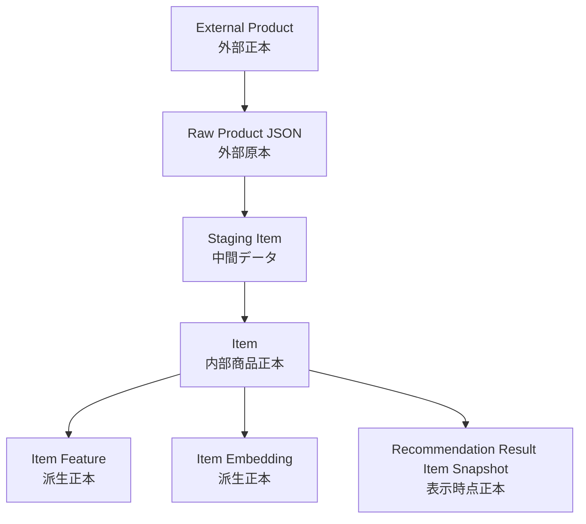
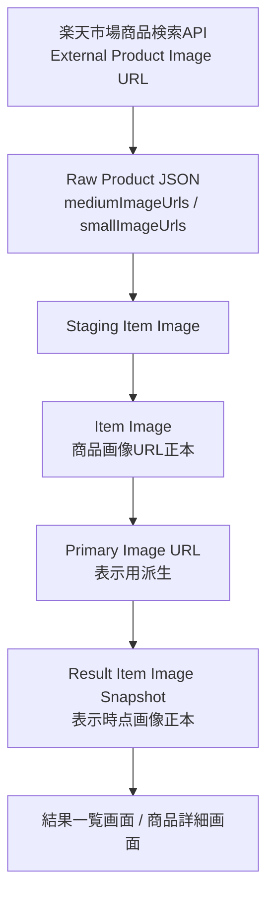
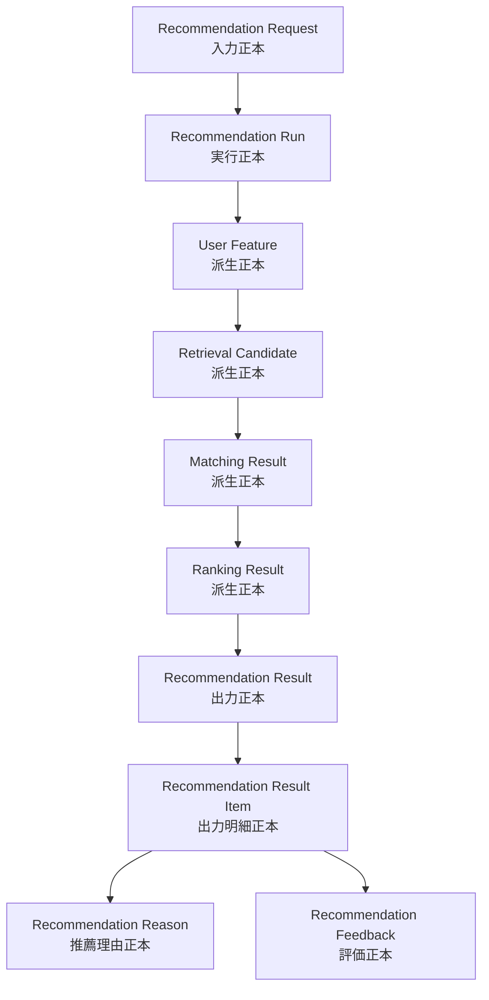

# 正本定義表

## 1. 概要

### 1.1 目的

本ドキュメントは、Gift Recommendation Service MVP におけるデータの正本を定義する。

ここでいう正本とは、同じ意味を持つデータが複数箇所に存在する場合に、**どのデータを信頼すべき基準データとするか**を示すものである。

本ドキュメントは、後続の以下成果物の前提となる。

- 論理ER
- 物理ER
- テーブル定義書
- API仕様書
- バッチ仕様書
- モジュール別入出力定義
- ログ・監査設計
- Evaluation設計

---

### 1.2 本書の位置づけ

```text
リソース一覧
↓
リソース責務定義表
↓
正本定義表
↓
論理ER
↓
物理ER
↓
テーブル定義書
↓
API仕様書 / バッチ仕様書 / モジュール詳細設計
```

リソース一覧・リソース責務定義表では、各リソースの役割や保存方針を整理した。  
本ドキュメントでは、それらを踏まえて、**正本・派生・スナップショット・外部原本・ログの判断を固定する**。

---

## 2. 利用したインプット成果物

利用したインプット成果物は以下です。

- リソース一覧.md
- リソース責務定義表.md
- ドメインモデル.md
- RecommendationRequest定義書.md
- RecommendationResult定義書.md
- RecommendationFeedback定義書.md
- 処理構成定義書.md
- 画面一覧.md
- 画面遷移図.md

---

## 3. 正本定義の考え方

### 3.1 正本とは

正本とは、特定のデータについて、システム内で最も信頼すべき基準データである。

```text
正本
= 同じ意味を持つデータが複数存在する場合に、最終的に参照すべき基準データ
```

たとえば、商品名は複数箇所に存在する。

```text
Raw Product JSON
Staging Item
Item
Recommendation Result Item Snapshot
```

この場合、目的によって正本が変わる。

| 利用目的                         | 正本                                |
| -------------------------------- | ----------------------------------- |
| 外部API取得時点の原本確認        | Raw Product JSON                    |
| 現在の商品情報として参照         | Item                                |
| 推薦結果として表示した時点の確認 | Recommendation Result Item Snapshot |

そのため、本ドキュメントでは、単に「商品名の正本はItem」と決めるのではなく、**現在値・取得時点原本・表示時点値を分けて定義する**。

---

### 3.2 正本分類

| 分類         | 意味                                                     | 例                                                    |
| ------------ | -------------------------------------------------------- | ----------------------------------------------------- |
| 外部正本     | 外部サービス側で管理される本来の正本                     | 楽天市場上の商品、外部EC商品ページ                    |
| 外部原本     | 外部APIから取得し、自サービスに保存したレスポンス原本    | Raw Product JSON                                      |
| 内部正本     | 本サービス内で業務上の基準として扱うデータ               | Item / Recommendation Request / Recommendation Result |
| 表示時点正本 | ユーザーに提示した時点の表示内容を再現するための正本     | Recommendation Result Item Snapshot                   |
| 設定正本     | 推薦ロジック、意味定義、モデル設定の基準データ           | Semantic Config Version / Model Version               |
| 評価正本     | ユーザー評価・人手評価・評価ケースの基準データ           | Recommendation Feedback / Evaluation Case             |
| 派生データ   | 正本から計算・生成されるデータ                           | Feature / Embedding / Score                           |
| 派生正本     | 派生データだが、保存時点の計算結果として基準になるデータ | Item Feature / Item Embedding / Score Breakdown       |
| ログ正本     | 発生した事実・イベント・エラーの記録としての正本         | Phase Log / Error Log / Metric Log                    |

---

### 3.3 正本判断ルール

| 判断観点           | ルール                                                                         |
| ------------------ | ------------------------------------------------------------------------------ |
| ユーザー入力       | Recommendation Requestを入力正本とする                                         |
| 推薦実行           | Recommendation Runを実行単位の正本とする                                       |
| 推薦結果           | Recommendation Result / Recommendation Result Itemを出力正本とする             |
| 推薦理由           | Recommendation Reasonを表示・Feedback対象の正本とする                          |
| 商品現在値         | Itemを内部商品正本とする                                                       |
| 商品画像現在値     | Item Imageを商品画像URL参照データの正本とする                                  |
| 外部API取得原本    | Raw Product JSONを外部レスポンス原本とする                                     |
| Raw参照情報        | Raw Product MetadataをRaw管理情報の正本とする                                  |
| 表示時点の商品情報 | Recommendation Result Item Snapshotを表示時点正本とする                        |
| 表示時点の商品画像 | Result Item Image Snapshotを表示時点画像正本とする                             |
| Feedback           | Recommendation Feedbackを明示評価の正本とする                                  |
| Feature / Score    | 基本は派生データ。ただし保存した値は当該Version・Runにおける計算結果正本とする |
| ログ               | 業務正本の代替ではなく、発生事実の正本とする                                   |

---

## 4. 正本定義表

### 4.1 推薦要求系

| 正本ID      | データ領域   | 対象データ                     | 正本種別     | 正本リソース            | 正本保存先                | 派生・複製先                                         | 更新主体 | 更新タイミング   | 再生成可否 | 備考                                                   |
| ----------- | ------------ | ------------------------------ | ------------ | ----------------------- | ------------------------- | ---------------------------------------------------- | -------- | ---------------- | ---------- | ------------------------------------------------------ |
| SOT-REQ-001 | 推薦要求     | 推薦入力条件全体               | 入力正本     | Recommendation Request  | DB                        | User Meaning / Query Embedding / Recommendation Run  | api      | 推薦API受付時    | 不可       | ユーザー入力の基準データ                               |
| SOT-REQ-002 | 推薦要求     | API受付時の元JSON              | 入力原本補助 | Request Payload         | DB JSON                   | Validated Payload                                    | api      | 推薦API受付時    | 不可       | Debug・再現性確認用                                    |
| SOT-REQ-003 | 推薦要求     | バリデーション済み入力         | 入力正本補助 | Validated Payload       | DB JSONまたは構造化カラム | Reco入力                                             | api      | Validation完了時 | 条件付き可 | Validationロジック変更後は同一結果にならない可能性あり |
| SOT-REQ-004 | 贈答文脈     | relationship / occasion        | 入力値正本   | Gift Context            | Recommendation Request内  | User Feature / Reason                                | api      | 推薦API受付時    | 不可       | Relationship Condition / Occasion Conditionを含む      |
| SOT-REQ-005 | 予算         | budget_min / budget_max        | 入力値正本   | Budget Condition        | Recommendation Request内  | Pre Hard Filter / Reason                             | api      | 推薦API受付時    | 不可       | 価格Filterの基準                                       |
| SOT-REQ-006 | 好み条件     | preferred_text                 | 入力値正本   | Preference Condition    | Recommendation Request内  | Semantic Extraction / User Feature / Query Embedding | api      | 推薦API受付時    | 不可       | ユーザーの希望方向                                     |
| SOT-REQ-007 | 避けたい条件 | non_preferred_text             | 入力値正本   | Non Preferred Condition | Recommendation Request内  | Risk Penalty / Post Hard Filter                      | api      | 推薦API受付時    | 不可       | 絶対NGとは区別                                         |
| SOT-REQ-008 | NG条件       | ng_text                        | 入力値正本   | NG Condition            | Recommendation Request内  | Pre Hard Filter / Post Hard Filter                   | api      | 推薦API受付時    | 不可       | 原則Hard Filter対象                                    |
| SOT-REQ-009 | 実行条件     | mode / top_k / candidate_limit | 入力値正本   | Execution Condition     | Recommendation Request内  | Reco / Ranking / Evaluation                          | api      | 推薦API受付時    | 不可       | `ui` / `evaluation` / `batch` を含む                   |

---

### 4.2 推薦実行系

| 正本ID      | データ領域 | 対象データ    | 正本種別        | 正本リソース                  | 正本保存先           | 派生・複製先                       | 更新主体           | 更新タイミング      | 再生成可否 | 備考                                          |
| ----------- | ---------- | ------------- | --------------- | ----------------------------- | -------------------- | ---------------------------------- | ------------------ | ------------------- | ---------- | --------------------------------------------- |
| SOT-RUN-001 | 推薦実行   | 推薦実行単位  | 実行正本        | Recommendation Run            | DB                   | Phase Log / Result / Evaluation    | reco               | 推薦実行開始時      | 不可       | 1回の推薦実行を識別                           |
| SOT-RUN-002 | 推薦実行   | Run状態       | 実行状態正本    | Recommendation Run.run_status | DB                   | Run Event Log / UI状態             | reco               | 実行状態変更時      | 不可       | 実行の現在状態                                |
| SOT-RUN-003 | 推薦実行   | 使用Version   | Version参照正本 | Run Version Reference         | Recommendation Run内 | Recommendation Result / Evaluation | reco               | 実行開始時          | 不可       | semantic_config_version / model_versionを固定 |
| SOT-RUN-004 | 推薦実行   | 処理Phase事実 | ログ正本        | Phase Log                     | DBまたはログ基盤     | Monitoring / Debug                 | api / reco / batch | 各Phase開始・終了時 | 不可       | Run状態の代替ではない                         |
| SOT-RUN-005 | 推薦実行   | 実行イベント  | ログ正本        | Recommendation Run Event Log  | DBまたはログ基盤     | Monitoring / Debug                 | reco               | イベント発生時      | 不可       | 実行中の事実記録                              |

---

### 4.3 ユーザー意味系

| 正本ID     | データ領域   | 対象データ              | 正本種別   | 正本リソース               | 正本保存先             | 派生・複製先                       | 更新主体               | 更新タイミング         | 再生成可否 | 備考                                         |
| ---------- | ------------ | ----------------------- | ---------- | -------------------------- | ---------------------- | ---------------------------------- | ---------------------- | ---------------------- | ---------- | -------------------------------------------- |
| SOT-UM-001 | ユーザー意味 | Semantic抽出結果        | 派生正本   | Semantic Extraction Result | DBまたはRun従属保存    | User Feature / Reason              | reco                   | Semantic抽出完了時     | 条件付き可 | Request + Config + Modelが同じなら再生成可能 |
| SOT-UM-002 | ユーザー意味 | 外部条件Feature         | 派生正本   | External Feature           | DBまたはRun従属保存    | User Feature                       | reco                   | Feature生成時          | 条件付き可 | relationship / occasion由来                  |
| SOT-UM-003 | ユーザー意味 | 内部条件Feature         | 派生正本   | Internal Feature           | DBまたはRun従属保存    | User Feature                       | reco                   | Feature生成時          | 条件付き可 | preferred / non_preferred由来                |
| SOT-UM-004 | ユーザー意味 | 統合User Feature        | 派生正本   | User Feature               | DBまたはRun従属保存    | User Meaning Projection / Matching | reco                   | User Feature生成完了時 | 条件付き可 | 当該Runの計算結果として保存推奨              |
| SOT-UM-005 | ユーザー意味 | Social / Symbolic射影値 | 派生正本   | User Meaning Projection    | DBまたはRun従属保存    | Lambda Context / Ranking           | reco                   | 射影完了時             | 条件付き可 | λ_ctx算出の基準                              |
| SOT-UM-006 | ユーザー意味 | λ_ctx                   | 派生正本   | Lambda Context             | DBまたはScore Metadata | Ranking / Evaluation               | reco                   | λ_ctx算出時            | 条件付き可 | Ranking制御に利用                            |
| SOT-UM-007 | ユーザー意味 | Query Embedding         | 派生データ | Query Embedding            | 原則一時保存           | Retrieval Candidate                | reco / external AI API | Retrieval前            | 条件付き可 | 評価用途では保存してもよい                   |
| SOT-UM-008 | ユーザー意味 | Preferred Context       | 派生データ | Preferred Context          | 原則一時保存           | Query Embedding                    | reco                   | Query生成時            | 可         | Debug用途では保存可                          |
| SOT-UM-009 | ユーザー意味 | Non Preferred Context   | 派生データ | Non Preferred Context      | 原則一時保存           | Risk Penalty                       | reco                   | Query生成時            | 可         | avoid判定用                                  |

---

### 4.4 商品系

| 正本ID       | データ領域 | 対象データ                   | 正本種別         | 正本リソース                                     | 正本保存先                   | 派生・複製先                                         | 更新主体          | 更新タイミング | 再生成可否      | 備考                               |
| ------------ | ---------- | ---------------------------- | ---------------- | ------------------------------------------------ | ---------------------------- | ---------------------------------------------------- | ----------------- | -------------- | --------------- | ---------------------------------- |
| SOT-ITEM-001 | 商品       | 外部EC上の商品そのもの       | 外部正本         | External Product                                 | 外部EC                       | Raw Product JSON / Item                              | external services | 外部EC側更新時 | 不可            | 楽天市場側が本来の正本             |
| SOT-ITEM-002 | 商品       | 外部APIレスポンス原本        | 外部原本         | Raw Product JSON                                 | Object Storage               | Staging Item / Raw Metadata                          | batch             | 外部API取得時  | 不可            | 取得時点のレスポンス原本           |
| SOT-ITEM-003 | 商品       | Raw参照・取込管理情報        | 外部原本メタ正本 | Raw Product Metadata                             | DB                           | Batch Log / Retry                                    | batch             | Raw保存時      | 不可            | object_key / hash / import_status  |
| SOT-ITEM-004 | 商品       | 取込中間商品データ           | 中間データ       | Staging Item                                     | DB                           | Item                                                 | batch             | Staging変換時  | 可              | Online推薦の正本ではない           |
| SOT-ITEM-005 | 商品       | 内部商品現在値               | 内部商品正本     | Item                                             | DB                           | Item Feature / Item Embedding / Result Item Snapshot | batch             | Item反映時     | Rawから再生成可 | Online推薦で参照する現在の商品正本 |
| SOT-ITEM-006 | 商品       | 商品名現在値                 | 内部商品正本     | Item.item_name                                   | DB                           | Result Item Snapshot                                 | batch             | Item反映時     | Rawから再生成可 | 最新の商品名として参照             |
| SOT-ITEM-007 | 商品       | 商品価格現在値               | 内部商品正本     | Item Price / Item.price                          | DB                           | Pre Hard Filter / Result Item Snapshot               | batch             | Item反映時     | Rawから再生成可 | 推薦時点価格はResult側にsnapshot   |
| SOT-ITEM-008 | 商品       | 商品URL現在値                | 内部商品正本     | Item.item_url                                    | DB                           | Result Item Snapshot                                 | batch             | Item反映時     | Rawから再生成可 | 外部EC遷移先                       |
| SOT-ITEM-009 | 商品       | 商品カテゴリ現在値           | 内部商品正本     | Item Category                                    | DB                           | Filtering / Item Semantic                            | batch             | Item反映時     | Rawから再生成可 | 楽天ジャンル等を含む               |
| SOT-ITEM-010 | 商品       | 商品メタデータ現在値         | 内部商品正本     | Item Metadata                                    | DB                           | Popularity Score / Availability                      | batch             | Item反映時     | Rawから再生成可 | review_count / review_average等    |
| SOT-ITEM-011 | 商品       | 推薦対象可否                 | 内部状態正本     | Recommendation Availability / Item Active Status | DB                           | Pre Hard Filter                                      | batch             | Batch判定時    | 条件付き可      | 外部在庫保証ではない               |
| SOT-ITEM-012 | 商品       | 商品表示時点スナップショット | 表示時点正本     | Item Snapshot                                    | Recommendation Result Item内 | Result表示 / Evaluation                              | reco              | Result生成時   | 不可            | 推薦結果として表示した商品情報     |

---

### 4.5 商品画像系

| 正本ID      | データ領域 | 対象データ                | 正本種別         | 正本リソース                     | 正本保存先                   | 派生・複製先                                   | 更新主体                  | 更新タイミング   | 再生成可否      | 備考                                           |
| ----------- | ---------- | ------------------------- | ---------------- | -------------------------------- | ---------------------------- | ---------------------------------------------- | ------------------------- | ---------------- | --------------- | ---------------------------------------------- |
| SOT-IMG-001 | 商品画像   | 外部商品画像URL           | 外部参照値       | External Product Image URL       | 外部EC / Raw Product JSON    | Item Image                                     | external services / batch | 外部API取得時    | 不可            | 楽天市場商品検索API由来                        |
| SOT-IMG-002 | 商品画像   | mediumImageUrls原本       | 外部原本         | Raw Product JSON.mediumImageUrls | Object Storage               | Staging Item Image / Item Image                | batch                     | Raw保存時        | 不可            | 取得時点のRaw原本                              |
| SOT-IMG-003 | 商品画像   | smallImageUrls原本        | 外部原本         | Raw Product JSON.smallImageUrls  | Object Storage               | Staging Item Image / Item Image                | batch                     | Raw保存時        | 不可            | 取得時点のRaw原本                              |
| SOT-IMG-004 | 商品画像   | 画像URL中間データ         | 中間データ       | Staging Item Image               | DBまたは一時領域             | Item Image                                     | batch                     | Staging変換時    | 可              | 省略可能                                       |
| SOT-IMG-005 | 商品画像   | 商品画像URL現在値         | 内部商品画像正本 | Item Image                       | DB                           | Primary Image URL / Result Item Image Snapshot | batch                     | Item Image反映時 | Rawから再生成可 | MVPでは画像バイナリは保存しない                |
| SOT-IMG-006 | 商品画像   | medium画像URL現在値       | 内部商品画像正本 | Item Image.image_url             | DB                           | Primary Image URL                              | batch                     | Item Image反映時 | Rawから再生成可 | image_size_type = medium                       |
| SOT-IMG-007 | 商品画像   | small画像URL現在値        | 内部商品画像正本 | Item Image.image_url             | DB                           | fallback表示                                   | batch                     | Item Image反映時 | Rawから再生成可 | image_size_type = small                        |
| SOT-IMG-008 | 商品画像   | 代表画像URL               | 表示用派生       | Primary Image URL                | ItemまたはResult Item内      | Result表示                                     | batch / reco              | 代表画像選択時   | 可              | 原則medium優先、なければsmall                  |
| SOT-IMG-009 | 商品画像   | 推薦結果表示時点の画像URL | 表示時点正本     | Result Item Image Snapshot       | Recommendation Result Item内 | Result表示 / Feedback / Evaluation             | reco                      | Result生成時     | 不可            | 過去ResultではItem ImageではなくSnapshotを参照 |
| SOT-IMG-010 | 商品画像   | 画像表示順                | 内部商品画像正本 | Item Image.display_order         | DB                           | Primary Image URL                              | batch                     | Item Image反映時 | Rawから再生成可 | 複数画像の優先順位                             |
| SOT-IMG-011 | 商品画像   | 画像取得元種別            | 内部商品画像正本 | Item Image.image_source_type     | DB                           | Debug / Evaluation                             | batch                     | Item Image反映時 | Rawから再生成可 | rakuten_medium / rakuten_small等               |

---

### 4.6 商品意味・特徴量・Embedding系

| 正本ID       | データ領域          | 対象データ              | 正本種別                      | 正本リソース            | 正本保存先                  | 派生・複製先                    | 更新主体        | 更新タイミング     | 再生成可否             | 備考                               |
| ------------ | ------------------- | ----------------------- | ----------------------------- | ----------------------- | --------------------------- | ------------------------------- | --------------- | ------------------ | ---------------------- | ---------------------------------- |
| SOT-FEAT-001 | 商品意味            | 商品Semantic抽出結果    | 派生正本                      | Item Semantic           | DB                          | Item Feature / Post Hard Filter | batch / reco    | 商品意味推定時     | 条件付き可             | Item + Config + Modelに依存        |
| SOT-FEAT-002 | 商品特徴量          | 商品8次元Feature        | 派生正本                      | Item Feature            | DB                          | Matching Result                 | batch / reco    | Item Feature生成時 | 条件付き可             | 当該Versionにおける商品Feature正本 |
| SOT-FEAT-003 | 商品意味射影        | 商品Social / Symbolic値 | 派生正本                      | Item Meaning Projection | DB                          | Matching / Analysis             | batch / reco    | 射影時             | 条件付き可             | Item Featureから生成               |
| SOT-FEAT-004 | 商品Embedding入力文 | 派生データ              | Item Text Context             | DBまたは一時領域        | Item Embedding              | batch                           | Embedding生成前 | 可                 | 再生成可能なら保存任意 |
| SOT-FEAT-005 | 商品Embedding       | 派生正本                | Item Embedding                | DB / pgvector           | Retrieval Candidate         | batch / external AI API         | Embedding生成時 | 条件付き可         | model_versionに依存    |
| SOT-FEAT-006 | Feature正規化統計量 | 設定正本                | Feature Normalization Version | DB                      | Feature正規化処理           | batch / operation               | 統計量更新時    | 不可               | Feature値再現に必要    |
| SOT-FEAT-007 | Feature定義         | 設定正本                | Feature Definition            | DB                      | User Feature / Item Feature | operation                       | 定義更新時      | 不可               | 8次元Featureの定義正本 |

---

### 4.7 Retrieval / Matching / Ranking系

| 正本ID       | データ領域 | 対象データ                  | 正本種別   | 正本リソース                           | 正本保存先                         | 派生・複製先                  | 更新主体 | 更新タイミング  | 再生成可否 | 備考                              |
| ------------ | ---------- | --------------------------- | ---------- | -------------------------------------- | ---------------------------------- | ----------------------------- | -------- | --------------- | ---------- | --------------------------------- |
| SOT-RANK-001 | 候補抽出   | Pre Hard Filter通過商品集合 | 派生データ | Pre Filtered Item Pool                 | 原則一時領域                       | Retrieval Candidate           | reco     | Retrieval前     | 可         | 保存必須ではない                  |
| SOT-RANK-002 | 候補抽出   | Retrieval候補               | 派生正本   | Retrieval Candidate                    | DBまたはRun従属保存                | Matching Result               | reco     | Retrieval完了時 | 条件付き可 | Evaluation・Debug用途では保存推奨 |
| SOT-RANK-003 | 候補抽出   | 除外候補                    | ログ正本   | Excluded Candidate Log                 | DBまたはログ基盤                   | Failure Analysis              | reco     | Filter除外時    | 不可       | 除外事実の記録                    |
| SOT-RANK-004 | Matching   | Feature距離                 | 派生データ | Feature Distance                       | Score Breakdown内                  | Feature Match                 | reco     | Matching時      | 条件付き可 | Result再現に必要なら保存          |
| SOT-RANK-005 | Matching   | Feature一致度               | 派生データ | Feature Match                          | Score Breakdown内                  | Social Match / Symbolic Match | reco     | Matching時      | 条件付き可 | UIには原則非表示                  |
| SOT-RANK-006 | Matching   | Social Match                | 派生正本   | Matching Result                        | DBまたはScore Breakdown            | Context Score                 | reco     | Matching完了時  | 条件付き可 | 当該Runの計算結果                 |
| SOT-RANK-007 | Matching   | Symbolic Match              | 派生正本   | Matching Result                        | DBまたはScore Breakdown            | Context Score                 | reco     | Matching完了時  | 条件付き可 | 当該Runの計算結果                 |
| SOT-RANK-008 | Ranking    | Context Score               | 派生正本   | Score Breakdown                        | Recommendation Result Item内       | Final Score / Reason          | reco     | Ranking時       | 条件付き可 | 当該Result Itemの計算根拠         |
| SOT-RANK-009 | Ranking    | Popularity Score            | 派生正本   | Score Breakdown                        | Recommendation Result Item内       | Final Score                   | reco     | Ranking時       | 条件付き可 | Item Metadata由来                 |
| SOT-RANK-010 | Ranking    | Risk Penalty                | 派生正本   | Score Breakdown                        | Recommendation Result Item内       | Final Score / Reason          | reco     | Ranking時       | 条件付き可 | avoid / NG近似等                  |
| SOT-RANK-011 | Ranking    | Diversity Penalty           | 派生正本   | Score Breakdown                        | Recommendation Result Item内       | Final Ranking                 | reco     | MMR実行時       | 条件付き可 | MMR採用時に保存推奨               |
| SOT-RANK-012 | Ranking    | Final Score                 | 派生正本   | Recommendation Result Item.final_score | DB                                 | Ranking Result / Evaluation   | reco     | Ranking完了時   | 条件付き可 | UIには原則表示しない              |
| SOT-RANK-013 | Ranking    | 最終順位                    | 出力正本   | Recommendation Result Item.rank        | DB                                 | Result表示 / Feedback         | reco     | Result生成時    | 不可       | ユーザーに提示した順位            |
| SOT-RANK-014 | Ranking    | Score Breakdown             | 派生正本   | Score Breakdown                        | Recommendation Result Item内JSON等 | Evaluation / Debug / Reason   | reco     | Result生成時    | 条件付き可 | 当該Resultの計算根拠として保存    |

---

### 4.8 推薦結果系

| 正本ID      | データ領域 | 対象データ             | 正本種別        | 正本リソース                        | 正本保存先 | 派生・複製先                   | 更新主体 | 更新タイミング | 再生成可否 | 備考                               |
| ----------- | ---------- | ---------------------- | --------------- | ----------------------------------- | ---------- | ------------------------------ | -------- | -------------- | ---------- | ---------------------------------- |
| SOT-RES-001 | 推薦結果   | 推薦結果全体           | 出力正本        | Recommendation Result               | DB         | UI表示 / Feedback / Evaluation | reco     | Result生成時   | 不可       | ユーザーに提示した推薦結果         |
| SOT-RES-002 | 推薦結果   | 推薦結果内の商品明細   | 出力正本        | Recommendation Result Item          | DB         | UI表示 / Feedback              | reco     | Result生成時   | 不可       | 商品1件単位                        |
| SOT-RES-003 | 推薦結果   | 結果状態               | 出力状態正本    | Recommendation Result.result_status | DB         | UI状態 / Error Handling        | reco     | Result生成時   | 不可       | Empty ResultとErrorを区別          |
| SOT-RES-004 | 推薦結果   | 件数・fallback有無等   | 出力補助正本    | Result Summary                      | DB         | UI表示 / Evaluation            | reco     | Result生成時   | 不可       | Result全体の要約                   |
| SOT-RES-005 | 推薦結果   | Result生成時メタデータ | 出力補助正本    | Result Metadata                     | DB         | Evaluation / Audit             | reco     | Result生成時   | 不可       | mode / created_at等                |
| SOT-RES-006 | 推薦結果   | 使用Versionメタデータ  | Version参照正本 | Version Metadata                    | DB         | Evaluation / Replay            | reco     | Result生成時   | 不可       | Run側Versionと整合させる           |
| SOT-RES-007 | 推薦結果   | 表示時点の商品名       | 表示時点正本    | Recommendation Result Item Snapshot | DB         | UI表示 / 履歴再表示            | reco     | Result生成時   | 不可       | 最新ItemではなくResult側を参照     |
| SOT-RES-008 | 推薦結果   | 表示時点の価格         | 表示時点正本    | Recommendation Result Item Snapshot | DB         | UI表示 / Evaluation            | reco     | Result生成時   | 不可       | 価格変動対策                       |
| SOT-RES-009 | 推薦結果   | 表示時点の商品URL      | 表示時点正本    | Recommendation Result Item Snapshot | DB         | 外部EC遷移                     | reco     | Result生成時   | 不可       | 過去Result再表示時の基準           |
| SOT-RES-010 | 推薦結果   | 表示時点の商品画像URL  | 表示時点正本    | Result Item Image Snapshot          | DB         | UI表示 / Feedback / Evaluation | reco     | Result生成時   | 不可       | Item Image更新後もResult表示を再現 |
| SOT-RES-011 | 推薦結果   | 0件結果                | 出力状態正本    | Empty Result                        | DB         | 0件結果表示                    | reco     | Result生成時   | 不可       | エラーではなく正常な空結果         |
| SOT-RES-012 | 推薦結果   | Fallback結果           | 出力状態正本    | Fallback Result                     | DB         | UI表示 / Evaluation            | reco     | Fallback発生時 | 不可       | Fallback有無をResult Summaryで保持 |

---

### 4.9 推薦理由系

| 正本ID         | データ領域 | 対象データ             | 正本種別            | 正本リソース            | 正本保存先                               | 派生・複製先          | 更新主体               | 更新タイミング | 再生成可否 | 備考                         |
| -------------- | ---------- | ---------------------- | ------------------- | ----------------------- | ---------------------------------------- | --------------------- | ---------------------- | -------------- | ---------- | ---------------------------- |
| SOT-REASON-001 | 推薦理由   | 推薦理由全体           | 出力正本 / 派生正本 | Recommendation Reason   | DB                                       | UI表示 / Feedback     | reco / external AI API | Reason生成時   | 条件付き可 | ユーザーに提示する理由の正本 |
| SOT-REASON-002 | 推薦理由   | 理由バッジ             | 表示用正本          | Reason Badge            | Recommendation Reason内                  | Result一覧            | reco                   | Reason生成時   | 条件付き可 | UI表示対象                   |
| SOT-REASON-003 | 推薦理由   | 理由要約               | 表示用正本          | Reason Summary          | Recommendation Reason内                  | Result一覧            | reco                   | Reason生成時   | 条件付き可 | UI表示対象                   |
| SOT-REASON-004 | 推薦理由   | 理由詳細               | 表示用正本          | Reason Detail           | Recommendation Reason内                  | Reason詳細表示        | reco                   | Reason生成時   | 条件付き可 | UI表示対象                   |
| SOT-REASON-005 | 推薦理由   | 理由ポイント           | 表示用正本          | Reason Point            | Recommendation Reason内                  | Reason詳細表示        | reco                   | Reason生成時   | 条件付き可 | UI表示対象                   |
| SOT-REASON-006 | 推薦理由   | 注意補足               | 表示用正本          | Caution Note            | Recommendation ReasonまたはResult Item内 | Result表示            | reco                   | Reason生成時   | 条件付き可 | NG違反商品の許容ではない     |
| SOT-REASON-007 | 推薦理由   | Reason生成テンプレート | 設定正本            | Reason Template Version | DB                                       | Recommendation Reason | operation / reco       | Template更新時 | 不可       | Reason再生成時の基準         |

---

### 4.10 Feedback系

| 正本ID     | データ領域 | 対象データ           | 正本種別                | 正本リソース             | 正本保存先                              | 派生・複製先                                     | 更新主体       | 更新タイミング     | 再生成可否 | 備考                         |
| ---------- | ---------- | -------------------- | ----------------------- | ------------------------ | --------------------------------------- | ------------------------------------------------ | -------------- | ------------------ | ---------- | ---------------------------- |
| SOT-FB-001 | Feedback   | ユーザーFeedback全体 | 評価正本                | Recommendation Feedback  | DB                                      | Feedback Summary / Evaluation / Failure Analysis | api            | Feedback登録時     | 不可       | 明示評価の正本               |
| SOT-FB-002 | Feedback   | Feedback対象         | 参照正本                | Feedback Target          | Recommendation Feedback内               | Analysis                                         | api            | Feedback登録時     | 不可       | Result / Item / Reasonを参照 |
| SOT-FB-003 | Feedback   | Feedback種別         | 入力値正本 / マスタ参照 | Feedback Type            | Recommendation Feedback内               | Feedback Analysis                                | api            | Feedback登録時     | 不可       | item_good / item_bad等       |
| SOT-FB-004 | Feedback   | Feedback値           | 入力値正本              | Feedback Value           | Recommendation Feedback内               | Evaluation / Analysis                            | api            | Feedback登録時     | 不可       | boolean / rating / choice等  |
| SOT-FB-005 | Feedback   | 選択式Feedbackコード | 入力値正本              | Feedback Choice Code     | Recommendation Feedback内               | Failure Analysis                                 | api            | Feedback登録時     | 不可       | 改善分類に利用               |
| SOT-FB-006 | Feedback   | 自由コメント         | 入力値正本              | Feedback Text            | Recommendation Feedback内               | Qualitative Analysis                             | api            | Feedback登録時     | 不可       | 任意入力                     |
| SOT-FB-007 | Feedback   | 改善分類             | 分類正本                | Feedback Reason Category | Recommendation Feedback内または分析結果 | Failure Analysis                                 | api / analysis | 登録時または分析時 | 条件付き可 | context_mismatch等           |
| SOT-FB-008 | Feedback   | Feedback集計結果     | 集計派生                | Feedback Summary         | DBまたは分析基盤                        | Dashboard / Evaluation                           | batch          | 集計Batch実行時    | 可         | 個別Feedbackの正本ではない   |
| SOT-FB-009 | Feedback   | 匿名ユーザー識別子   | 識別補助                | Anonymous User ID        | DB                                      | 重複抑制 / 分析                                  | api            | Feedback登録時     | 不可       | 個人アカウントではない       |
| SOT-FB-010 | Feedback   | セッション識別子     | 識別補助                | Session ID               | DB                                      | 行動分析 / 重複抑制                              | api            | セッション生成時   | 不可       | 長期履歴管理ではない         |

---

### 4.11 設定・Version系

| 正本ID      | データ領域 | 対象データ           | 正本種別          | 正本リソース                  | 正本保存先 | 派生・複製先                             | 更新主体          | 更新タイミング    | 再生成可否 | 備考                           |
| ----------- | ---------- | -------------------- | ----------------- | ----------------------------- | ---------- | ---------------------------------------- | ----------------- | ----------------- | ---------- | ------------------------------ |
| SOT-CFG-001 | 設定       | 意味推定設定Version  | 設定正本          | Semantic Config Version       | DB         | User Meaning / Item Meaning              | operation         | 設定更新時        | 不可       | 推薦再現性に必要               |
| SOT-CFG-002 | 設定       | モデルVersion        | 設定正本          | Model Version                 | DB         | Embedding / Matching / Ranking           | operation         | モデル更新時      | 不可       | 推薦再現性に必要               |
| SOT-CFG-003 | 設定       | Ranking設定Version   | 設定正本          | Ranking Config Version        | DB         | Final Score                              | operation         | Ranking設定更新時 | 不可       | MVPではModel Versionに内包も可 |
| SOT-CFG-004 | 設定       | Feature正規化Version | 設定正本          | Feature Normalization Version | DB         | User Feature / Item Feature              | batch / operation | 統計量更新時      | 不可       | Feature再現に必要              |
| SOT-CFG-005 | 設定       | Relationship Rule    | 設定正本          | Relationship Rule             | DB         | External Feature                         | operation         | Rule更新時        | 不可       | relationshipからFeature補正    |
| SOT-CFG-006 | 設定       | Occasion Rule        | 設定正本          | Occasion Rule                 | DB         | External Feature                         | operation         | Rule更新時        | 不可       | occasionからFeature補正        |
| SOT-CFG-007 | 設定       | Pair Rule            | 設定正本          | Pair Rule                     | DB         | External Feature                         | operation         | Rule更新時        | 不可       | relationship × occasion補正    |
| SOT-CFG-008 | 設定       | Hint Dictionary      | 設定正本          | Hint Dictionary               | DB         | Semantic Extraction / Feature Generation | operation         | 辞書更新時        | 不可       | キーワード・概念変換           |
| SOT-CFG-009 | 設定       | Semantic Concept定義 | 設定正本 / マスタ | Concept Definition            | DB         | Semantic Extraction                      | operation         | 定義更新時        | 不可       | Conceptの定義                  |
| SOT-CFG-010 | 設定       | Concept Feature Rule | 設定正本          | Concept Feature Rule          | DB         | Feature Generation                       | operation         | Rule更新時        | 不可       | ConceptからFeature Deltaへ変換 |

---

### 4.12 マスタ系

| 正本ID      | データ領域 | 対象データ       | 正本種別   | 正本リソース                    | 正本保存先         | 派生・複製先          | 更新主体        | 更新タイミング | 再生成可否 | 備考                          |
| ----------- | ---------- | ---------------- | ---------- | ------------------------------- | ------------------ | --------------------- | --------------- | -------------- | ---------- | ----------------------------- |
| SOT-MST-001 | マスタ     | 関係性選択肢     | マスタ正本 | Relationship Master             | DB                 | 入力画面 / Validation | operation       | マスタ更新時   | 不可       | relationship_codeと表示名     |
| SOT-MST-002 | マスタ     | 贈答目的選択肢   | マスタ正本 | Occasion Master                 | DB                 | 入力画面 / Validation | operation       | マスタ更新時   | 不可       | occasion_codeと表示名         |
| SOT-MST-003 | マスタ     | Feedback種別     | マスタ正本 | Feedback Type Master            | DB                 | Feedback Validation   | operation       | マスタ更新時   | 不可       | feedback_typeの選択肢         |
| SOT-MST-004 | マスタ     | Feedback改善分類 | マスタ正本 | Feedback Reason Category Master | DB                 | Feedback / Evaluation | operation       | マスタ更新時   | 不可       | context_mismatch等            |
| SOT-MST-005 | マスタ     | Error Code       | マスタ正本 | Error Code Master               | DBまたはコード管理 | Error Log / API応答   | operation / dev | 定義更新時     | 不可       | MVPではコード定義でも可       |
| SOT-MST-006 | マスタ     | Run Status       | マスタ正本 | Run Status Master               | DBまたはコード管理 | Recommendation Run    | operation / dev | 定義更新時     | 不可       | MVPではenumでも可             |
| SOT-MST-007 | マスタ     | Result Status    | マスタ正本 | Result Status Master            | DBまたはコード管理 | Recommendation Result | operation / dev | 定義更新時     | 不可       | MVPではenumでも可             |
| SOT-MST-008 | マスタ     | 実行Mode         | マスタ正本 | Mode Master                     | DBまたはコード管理 | Execution Condition   | operation / dev | 定義更新時     | 不可       | `ui` / `evaluation` / `batch` |

---

### 4.13 評価・改善系

| 正本ID       | データ領域 | 対象データ       | 正本種別     | 正本リソース           | 正本保存先       | 派生・複製先                           | 更新主体           | 更新タイミング     | 再生成可否 | 備考                         |
| ------------ | ---------- | ---------------- | ------------ | ---------------------- | ---------------- | -------------------------------------- | ------------------ | ------------------ | ---------- | ---------------------------- |
| SOT-EVAL-001 | 評価       | 評価データセット | 評価正本     | Evaluation Dataset     | DBまたはファイル | Evaluation Case                        | operation / batch  | データセット作成時 | 不可       | 後続対象                     |
| SOT-EVAL-002 | 評価       | 評価ケース       | 評価正本     | Evaluation Case        | DB               | Evaluation Result                      | operation / batch  | ケース作成時       | 不可       | Online Requestとは区別       |
| SOT-EVAL-003 | 評価       | 評価実行結果     | 評価結果正本 | Evaluation Result      | DB               | Failure Analysis / Improvement Backlog | batch              | 評価Batch実行時    | 条件付き可 | 評価Versionに依存            |
| SOT-EVAL-004 | 評価       | 失敗分析結果     | 分析派生     | Failure Analysis       | DBまたは分析基盤 | Improvement Backlog                    | batch / analysis   | 分析時             | 条件付き可 | 改善候補の入力               |
| SOT-EVAL-005 | 改善       | 改善候補         | 運用正本     | Improvement Backlog    | GitHub Issue等   | Roadmap / Development Task             | operation / devops | 改善起票時         | 不可       | GitHub Issueで管理してもよい |
| SOT-EVAL-006 | 評価       | 人手評価タスク   | 評価正本     | Human Evaluation Task  | DB               | Human Evaluation Input                 | operation          | タスク作成時       | 不可       | 後続対象                     |
| SOT-EVAL-007 | 評価       | 人手評価入力     | 評価正本     | Human Evaluation Input | DB               | Evaluation Result                      | evaluator          | 評価入力時         | 不可       | 後続対象                     |

---

### 4.14 ログ・監査系

| 正本ID      | データ領域 | 対象データ                 | 正本種別     | 正本リソース           | 正本保存先       | 派生・複製先              | 更新主体           | 更新タイミング    | 再生成可否 | 備考                           |
| ----------- | ---------- | -------------------------- | ------------ | ---------------------- | ---------------- | ------------------------- | ------------------ | ----------------- | ---------- | ------------------------------ |
| SOT-LOG-001 | ログ       | Phase実行事実              | ログ正本     | Phase Log              | DBまたはログ基盤 | Monitoring / Debug        | api / reco / batch | Phase開始・終了時 | 不可       | 業務正本ではなく実行事実の正本 |
| SOT-LOG-002 | ログ       | Error発生事実              | ログ正本     | Error Log              | DBまたはログ基盤 | Debug / Alert             | api / reco / batch | Error発生時       | 不可       | Error Codeと紐づけ             |
| SOT-LOG-003 | ログ       | Metric計測値               | 計測ログ正本 | Metric Log             | DBまたはログ基盤 | Dashboard / Observability | api / reco / batch | 計測時            | 不可       | latency / 件数 / score分布等   |
| SOT-LOG-004 | ログ       | Batch実行事実              | ログ正本     | Batch Execution Log    | DBまたはログ基盤 | Monitoring / Retry        | batch              | Batch実行時       | 不可       | Batch結果データの正本ではない  |
| SOT-LOG-005 | ログ       | 外部API呼び出し事実        | ログ正本     | External API Call Log  | DBまたはログ基盤 | Cost Analysis / Debug     | batch / reco       | 外部API呼び出し時 | 不可       | Raw本体の正本ではない          |
| SOT-LOG-006 | ログ       | ユーザー表示・クリック行動 | 行動ログ正本 | User Interaction Log   | DBまたはログ基盤 | Analysis                  | web / api          | 行動発生時        | 不可       | MVPでは簡略化可能              |
| SOT-LOG-007 | ログ       | Result表示事実             | 行動ログ正本 | Result View Log        | DBまたはログ基盤 | Analysis                  | web / api          | 表示時            | 不可       | 明示Feedbackとは区別           |
| SOT-LOG-008 | ログ       | 外部EC遷移クリック         | 行動ログ正本 | Result Click Log       | DBまたはログ基盤 | Analysis                  | web / api          | クリック時        | 不可       | 購入成立は保証しない           |
| SOT-LOG-009 | ログ       | 候補除外事実               | 監査ログ正本 | Excluded Candidate Log | DBまたはログ基盤 | Failure Analysis          | reco               | Filter除外時      | 不可       | Post Hard Filter改善に利用     |

---

### 4.15 外部リソース系

| 正本ID      | データ領域 | 対象データ                    | 正本種別         | 正本リソース                  | 正本保存先         | 派生・複製先                    | 更新主体                  | 更新タイミング | 再生成可否 | 備考                       |
| ----------- | ---------- | ----------------------------- | ---------------- | ----------------------------- | ------------------ | ------------------------------- | ------------------------- | -------------- | ---------- | -------------------------- |
| SOT-EXT-001 | 外部       | 楽天市場商品                  | 外部正本         | External Product              | 楽天市場           | Raw Product JSON / Item         | external services         | 外部側更新時   | 不可       | 本サービスでは参照のみ     |
| SOT-EXT-002 | 外部       | 楽天市場商品検索APIレスポンス | 外部レスポンス   | External Product API Response | 外部API            | Raw Product JSON                | external services         | API応答時      | 不可       | 取得後Rawとして保存        |
| SOT-EXT-003 | 外部       | 外部EC商品ページ              | 外部リソース     | External EC Item Page         | 外部EC             | Item.item_url / Result Snapshot | external services         | 外部側更新時   | 不可       | 購入・決済・配送は外部責務 |
| SOT-EXT-004 | 外部       | Raw JSON保存オブジェクト      | 外部保存リソース | Object Storage Object         | Object Storage     | Raw Product Metadata.object_key | batch / object storage    | Raw保存時      | 不可       | Raw本体の保存先            |
| SOT-EXT-005 | 外部AI     | AI APIリクエスト              | 外部連携ログ     | External AI API Request       | ログまたは一時領域 | AI Response                     | reco / batch              | API呼び出し時  | 不可       | 必要に応じてログ保存       |
| SOT-EXT-006 | 外部AI     | AI APIレスポンス              | 外部連携結果     | External AI API Response      | DBまたはログ       | Embedding / Reason              | external AI API           | API応答時      | 条件付き可 | 業務正本に変換後保存       |
| SOT-EXT-007 | 外部画像   | 外部商品画像URL               | 外部参照値       | External Product Image URL    | 外部EC / Raw       | Item Image                      | external services / batch | API取得時      | 不可       | MVPではURL参照のみ         |

---

## 5. 主要データ別の正本判断

### 5.1 商品名・価格・URLの正本

| データ             | 現在値の正本            | 表示時点の正本                       | 原本確認時の正本 |
| ------------------ | ----------------------- | ------------------------------------ | ---------------- |
| 商品名             | Item                    | Recommendation Result Item Snapshot  | Raw Product JSON |
| 商品価格           | Item Price / Item.price | Recommendation Result Item Snapshot  | Raw Product JSON |
| 商品URL            | Item.item_url           | Recommendation Result Item Snapshot  | Raw Product JSON |
| 商品キャッチコピー | Item / Item Metadata    | Recommendation Result Item Snapshot  | Raw Product JSON |
| レビュー情報       | Item Metadata           | Score BreakdownまたはResult Snapshot | Raw Product JSON |

---

### 5.2 商品画像URLの正本

| データ          | 現在値の正本                 | 表示時点の正本             | 原本確認時の正本                 |
| --------------- | ---------------------------- | -------------------------- | -------------------------------- |
| mediumImageUrls | Item Image                   | Result Item Image Snapshot | Raw Product JSON.mediumImageUrls |
| smallImageUrls  | Item Image                   | Result Item Image Snapshot | Raw Product JSON.smallImageUrls  |
| 代表画像URL     | Primary Image URL            | Result Item Image Snapshot | Item Image / Raw Product JSON    |
| 画像表示順      | Item Image.display_order     | Result Item Image Snapshot | Raw Product JSON                 |
| 画像取得元      | Item Image.image_source_type | Result Item Image Snapshot | Raw Product JSON                 |

---

### 5.3 Feature / Scoreの正本

| データ                  | 正本                                   | 補足                                            |
| ----------------------- | -------------------------------------- | ----------------------------------------------- |
| User Feature            | User Feature                           | Request + Configから生成された当該Runの計算結果 |
| Item Feature            | Item Feature                           | Item + Configから生成された現在の商品Feature    |
| User Meaning Projection | User Meaning Projection                | User Featureから生成                            |
| Item Meaning Projection | Item Meaning Projection                | Item Featureから生成                            |
| Context Score           | Score Breakdown                        | Result Item単位の計算結果                       |
| Popularity Score        | Score Breakdown                        | Result Item単位の計算結果                       |
| Risk Penalty            | Score Breakdown                        | Result Item単位の計算結果                       |
| Final Score             | Recommendation Result Item.final_score | 最終順位決定に使った値                          |
| Rank                    | Recommendation Result Item.rank        | ユーザーに提示した順位の正本                    |

---

### 5.4 Request / Result / Feedbackの正本

| データ       | 正本                       | 補足                       |
| ------------ | -------------------------- | -------------------------- |
| 推薦入力     | Recommendation Request     | 入力条件の正本             |
| 推薦実行     | Recommendation Run         | 実行単位の正本             |
| 推薦結果     | Recommendation Result      | 出力全体の正本             |
| 推薦商品明細 | Recommendation Result Item | 商品1件単位の出力正本      |
| 推薦理由     | Recommendation Reason      | UI表示・Feedback対象の正本 |
| Feedback     | Recommendation Feedback    | ユーザー明示評価の正本     |

---

## 6. データ更新時の正本優先順位

### 6.1 商品データ更新時

```text
External Product
↓
Raw Product JSON
↓
Staging Item
↓
Item
↓
Item Feature / Item Embedding / Item Image
```

商品現在値としては `Item` を参照する。  
ただし、外部API取得時点の原本確認では `Raw Product JSON` を参照する。

---

### 6.2 商品画像更新時

```text
Raw Product JSON.mediumImageUrls / smallImageUrls
↓
Staging Item Image
↓
Item Image
↓
Primary Image URL
↓
Result Item Image Snapshot
```

現在の商品画像URLとしては `Item Image` を参照する。  
過去の推薦結果表示では `Result Item Image Snapshot` を参照する。

---

### 6.3 推薦結果表示時

```text
Item / Item Image / Score Breakdown / Recommendation Reason
↓
Recommendation Result Item Snapshot
↓
Result表示
```

推薦結果としてユーザーに提示した内容は、Result生成後は `Recommendation Result Item` 側のSnapshotを正本とする。  
ItemやItem Imageが後で更新されても、過去Resultの表示時点正本は変更しない。

---

### 6.4 Feedback登録時

```text
Recommendation Result
↓
Recommendation Result Item
↓
Recommendation Reason
↓
Recommendation Feedback
```

Feedbackは、現在の商品情報ではなく、ユーザーに提示されたResult / Item / Reasonに対して登録する。  
したがって、Feedback対象の正本は `Recommendation Result` 系リソースである。

---

## 7. DB設計への反映方針

### 7.1 独立テーブル化すべき正本

| 正本リソース               | テーブル候補                 | 理由                     |
| -------------------------- | ---------------------------- | ------------------------ |
| Recommendation Request     | `recommendation_request`     | 入力正本                 |
| Recommendation Run         | `recommendation_run`         | 実行正本                 |
| Recommendation Result      | `recommendation_result`      | 出力正本                 |
| Recommendation Result Item | `recommendation_result_item` | 出力明細正本             |
| Recommendation Reason      | `recommendation_reason`      | 推薦理由正本             |
| Recommendation Feedback    | `recommendation_feedback`    | 評価正本                 |
| Item                       | `item`                       | 商品内部正本             |
| Item Image                 | `item_image`                 | 商品画像URL正本          |
| Item Feature               | `item_feature`               | 商品Feature正本          |
| Item Embedding             | `item_embedding`             | Retrieval用Embedding正本 |
| Raw Product Metadata       | `raw_product_metadata`       | Raw参照正本              |
| Semantic Config Version    | `semantic_config_version`    | 設定正本                 |
| Model Version              | `model_version`              | モデルVersion正本        |

---

### 7.2 親テーブル内に保持してよい正本

| データ                          | 親テーブル                   | 理由                      |
| ------------------------------- | ---------------------------- | ------------------------- |
| Budget Condition                | `recommendation_request`     | Requestの一部             |
| Gift Context                    | `recommendation_request`     | Requestの一部             |
| Preference Condition            | `recommendation_request`     | Requestの一部             |
| Execution Condition             | `recommendation_request`     | Requestの一部             |
| Result Item Image Snapshot      | `recommendation_result_item` | Result Itemの表示時点項目 |
| Score Breakdown                 | `recommendation_result_item` | Result Itemの計算根拠     |
| Reason Badge / Summary / Detail | `recommendation_reason`      | Reasonの表示要素          |
| Feedback Value                  | `recommendation_feedback`    | Feedbackの一部            |

---

### 7.3 Object Storageに保存する正本

| 正本リソース           | 保存先             | DBに保存するもの                               |
| ---------------------- | ------------------ | ---------------------------------------------- |
| Raw Product JSON       | Object Storage     | object_key / hash / fetched_at / import_status |
| 外部APIレスポンス原本  | Object Storage     | Raw Product Metadata                           |
| Raw Product Image URLs | Raw Product JSON内 | Item Imageへ変換後、DB保存                     |

---

## 8. 正本と派生の関係図

### 8.1 商品データ



---

### 8.2 商品画像データ



---

### 8.3 推薦結果データ



---

## 9. レビュー観点

| 観点                 | 確認内容                                                                           |
| -------------------- | ---------------------------------------------------------------------------------- |
| 正本の一意性         | 同じ利用目的に対して正本が複数存在していないか                                     |
| 現在値と時点値の分離 | Item現在値とResult Snapshotが分離されているか                                      |
| Rawと内部正本の分離  | Raw Product JSONとItemの責務が混ざっていないか                                     |
| 商品画像の正本       | Raw Product Image URLs / Item Image / Result Item Image Snapshotが分離されているか |
| Feature再現性        | Feature / Score / EmbeddingがVersionと紐づけられるか                               |
| Feedback接続性       | FeedbackがResult / Item / Reasonの表示時点正本に紐づくか                           |
| 外部責務の分離       | 購入・決済・配送・画像バイナリ保存が本サービス正本に混入していないか               |
| DB設計接続性         | 独立テーブル化すべき正本と親テーブル内項目が整理されているか                       |
| Evaluation接続性     | Request / Result / Score / Feedbackを評価に利用できるか                            |
| 変更耐性             | 外部商品情報が更新されても過去Resultを再現できるか                                 |

---

## 10. まとめ

本サービスにおける正本は、以下の方針で定義する。

```text
Recommendation Request
= 推薦入力条件の正本

Recommendation Run
= 推薦実行単位の正本

Item
= 現在の商品内部正本

Item Image
= 現在の商品画像URL参照データの正本

Raw Product JSON
= 外部APIレスポンス原本

Raw Product Metadata
= Raw JSONの参照・取込管理正本

Recommendation Result
= 推薦結果全体の出力正本

Recommendation Result Item
= 推薦結果内の商品明細正本

Recommendation Result Item Snapshot
= 表示時点の商品情報正本

Result Item Image Snapshot
= 表示時点の商品画像URL正本

Recommendation Reason
= ユーザーに提示した推薦理由の正本

Recommendation Feedback
= 推薦品質改善のための明示評価正本

Semantic Config Version / Model Version
= 推薦再現性を担保する設定・モデルVersion正本

Feature / Embedding / Score
= 派生データだが、保存した値は当該Version・Runにおける計算結果正本

Log / Metric
= 業務正本の代替ではなく、発生事実・計測事実の正本
```

初回MVPでは、特に以下を固定する。

```text
- 商品の現在値はItemを正本とする
- 商品画像の現在値はItem Imageを正本とする
- 外部API取得時点の原本はRaw Product JSONを正本とする
- Raw JSON本体はObject Storageに保存する
- Raw参照情報はRaw Product Metadataを正本とする
- 推薦結果として表示した商品情報はRecommendation Result Item Snapshotを正本とする
- 推薦結果として表示した商品画像URLはResult Item Image Snapshotを正本とする
- Feedbackは現在の商品ではなく、表示済みのRecommendation Result / Result Item / Reasonに紐づける
- 購入、決済、配送、画像バイナリ保存、CDN配信はMVPの正本対象外とする
```
