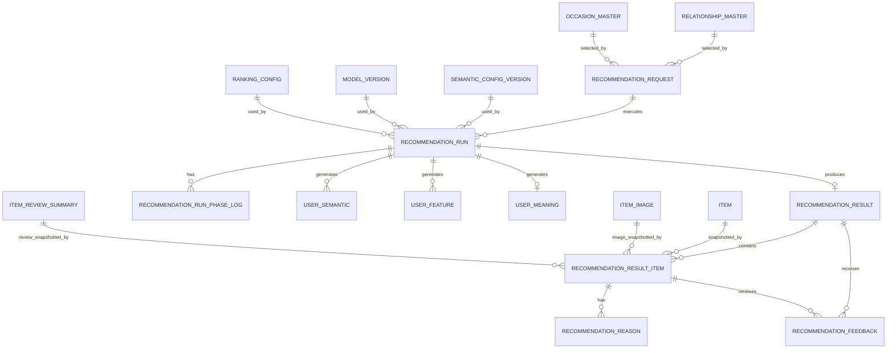
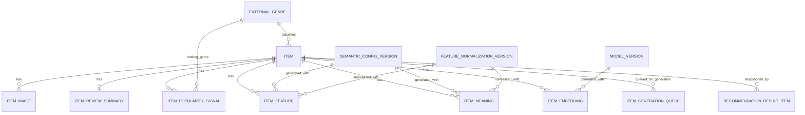
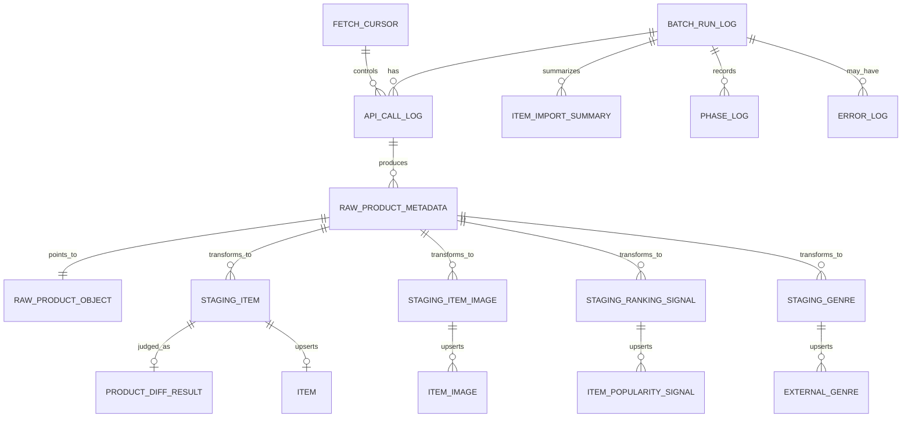
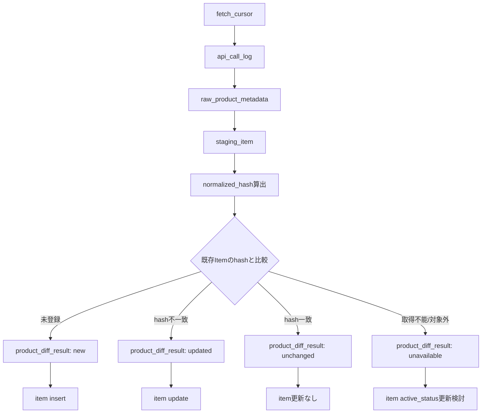
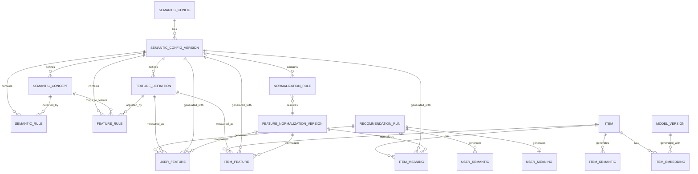
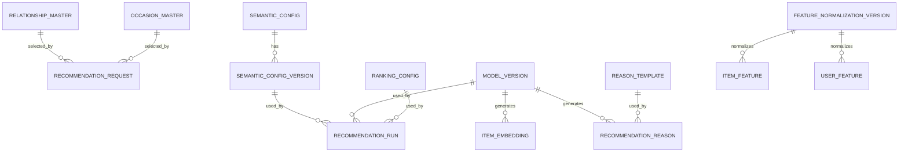
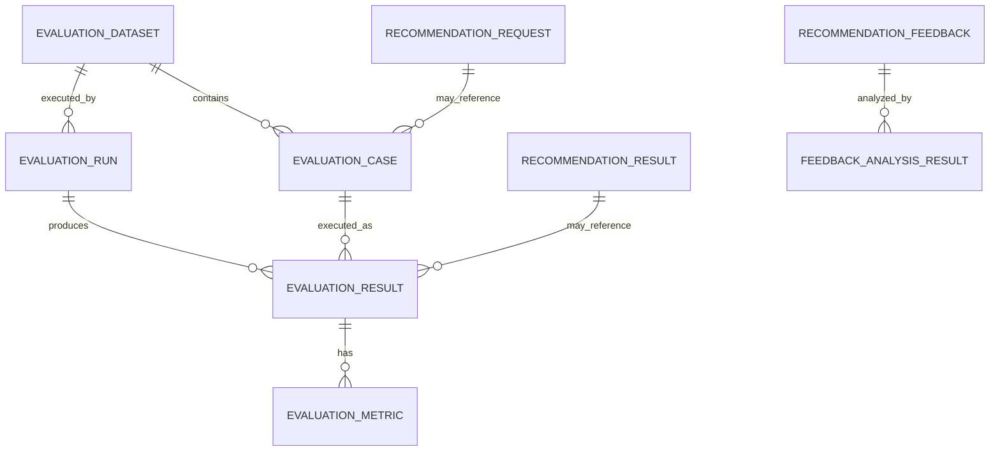
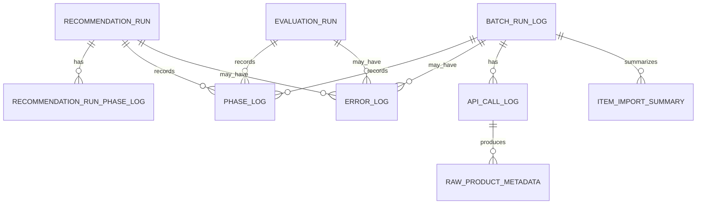

# 論理ER図

## 1. 概要

### 1.1 目的

本ドキュメントは、Gift Recommendation Service MVP における主要リソースをもとに、論理ER図を再作成する。

直近で作成した以下の成果物を反映し、論理ER図を最新化する。

```text
- リソース一覧
- リソース責務定義表
- 正本定義表
- 状態遷移設計書
- 外部商品データ連携設計書
```

本ドキュメントでは、物理テーブル設計やDDL作成の前段として、以下を明確にする。

```text
- MVPで扱う主要エンティティ
- エンティティ間の論理的な関係
- 正本 / 派生 / Snapshot / Raw / Metadata / Log / 状態の位置づけ
- Online推薦処理で生成・参照するデータ構造
- Batch処理で生成・更新する商品データ構造
- 楽天API由来データと内部商品正本の関係
- 状態遷移設計書で定義した状態管理対象の反映
- MVP対象外リソースをERに混入させないこと
```

---

## 2. 利用したインプット成果物

利用したインプット成果物は以下です。

- リソース一覧.md
- リソース責務定義表.md
- 正本定義表.md
- 状態遷移設計書.md
- 機能一覧.md
- モジュール一覧.md
- 機能×モジュール対応表.md
- 処理構成定義書.md
- 外部商品データ連携設計書.md
- ドメインモデル.md
- RecommendationRequest定義書.md
- RecommendationResult定義書.md
- RecommendationFeedback定義書.md
- Reason生成定義書.md
- Retrieval定義書.md
- Matching定義書.md
- Ranking定義書.md
- Evaluation評価定義書.md

---

## 3. 今回の再作成で反映した主な変更点

| No  | 反映内容                                                          | 理由                                                             |
| --- | ----------------------------------------------------------------- | ---------------------------------------------------------------- |
| 1   | `item_image` を商品系エンティティとして明示                       | レコメンド結果画面で商品画像を表示するため                       |
| 2   | `item_popularity_signal` を `item` から分離                       | 楽天ランキングAPI由来データを補助シグナルとして扱うため          |
| 3   | `raw_product_object` と `raw_product_metadata` を分離             | Raw JSON本体はObject Storage、メタデータはDBで管理するため       |
| 4   | `fetch_cursor` を追加                                             | 楽天APIの疑似差分取得を制御するため                              |
| 5   | `product_diff_result` を追加                                      | new / updated / unchanged / unavailable の判定結果を表現するため |
| 6   | `item_generation_queue` を追加                                    | Item Feature / Item Embedding生成の再実行制御に必要なため        |
| 7   | `recommendation_run_phase_log` / `phase_log` / `error_log` を明示 | 状態遷移設計書のRun / Phase / Error管理を反映するため            |
| 8   | `evaluation_run` を追加                                           | Evaluation Resultだけでなく評価実行単位を管理するため            |
| 9   | Result Snapshot項目を `recommendation_result_item` に明示         | 後続の商品更新で過去の推薦結果が変わらないようにするため         |
| 10  | MVP対象外エンティティを明示的に除外                               | 認証、履歴、購入、決済、配送を初回MVP対象外とするため            |

---

## 4. 論理ER設計方針

### 4.1 本ドキュメントの位置づけ

本ドキュメントは、**論理ER図**である。

そのため、以下は本ドキュメントでは確定しない。

```text
- 物理テーブル名
- カラム型
- index
- partition
- FK制約を物理的に張るかどうか
- JSONBで持つか、別テーブルに正規化するか
- DDL
```

一方で、以下は本ドキュメントで明確にする。

```text
- エンティティの存在
- エンティティ間の関係
- 1対1 / 1対多 / 多対多の関係
- 正本 / 派生 / Snapshot / Raw / Metadata / Log の区分
- Online / Batch の責務境界
- 状態管理対象
```

---

### 4.2 重要な設計方針

| 観点          | 方針                                                                          |
| ------------- | ----------------------------------------------------------------------------- |
| 認証          | 初回MVPでは認証・会員・ユーザー別履歴は持たない                               |
| 履歴          | Recommendation Resultは保存するが、User単位のRecommendation Historyは持たない |
| Online推薦    | Online推薦中に楽天APIを呼ばない                                               |
| 商品更新      | Online推薦中にItem / Item Image / Item Feature / Item Embeddingを更新しない   |
| 商品正本      | 楽天商品検索APIを商品情報の主たる外部正本取得元とする                         |
| ランキング    | 楽天ランキングAPIはItem正本ではなくPopularity Signal取得元とする              |
| 商品画像      | 楽天商品検索APIの `mediumImageUrls` / `smallImageUrls` をItem Imageへ反映する |
| Raw保存       | Raw JSON本体はObject Storage、Raw MetadataはDBで管理する                      |
| 疑似差分取得  | Fetch Cursor / Normalized Hash / Product Diff Resultを利用する                |
| Snapshot      | Recommendation Result Itemに表示時点の商品情報を固定する                      |
| 状態管理      | 状態は必要なリソースに限定し、商品単位の中間状態更新を乱発しない              |
| Feature正規化 | Feature値は0.0〜1.0、sigmoid系正規化を前提とする                              |

---

## 5. エンティティ分類

| 分類                     | エンティティ                                                                                                                                   | 正本区分                    |
| ------------------------ | ---------------------------------------------------------------------------------------------------------------------------------------------- | --------------------------- |
| Recommendation Request系 | recommendation_request                                                                                                                         | 内部正本                    |
| Recommendation Run系     | recommendation_run / recommendation_run_phase_log                                                                                              | 内部正本 / Log              |
| Recommendation Result系  | recommendation_result / recommendation_result_item                                                                                             | 内部正本 / Snapshot         |
| Reason系                 | recommendation_reason                                                                                                                          | 派生 / Snapshot             |
| Feedback系               | recommendation_feedback                                                                                                                        | 内部正本                    |
| Item系                   | item / item_image / item_review_summary / item_popularity_signal / item_generation_queue                                                       | 内部正本 / 派生 / 状態      |
| 外部商品データ系         | fetch_cursor / api_call_log / raw_product_metadata / raw_product_object / product_diff_result                                                  | Raw / Metadata / Log / 状態 |
| Staging系                | staging_item / staging_item_image / staging_ranking_signal / staging_genre                                                                     | 一時 / 中間                 |
| Semantic / Feature系     | semantic_config / semantic_config_version / semantic_concept / feature_definition / semantic_rule / feature_rule / normalization_rule / item_semantic / item_feature / item_meaning / user_feature | 設定正本 / 派生             |
| Embedding系              | item_embedding                                                                                                                                 | 派生                        |
| Evaluation系             | evaluation_dataset / evaluation_case / evaluation_run / evaluation_result / evaluation_metric                                                  | 内部正本 / 派生 / Log       |
| Log系                    | phase_log / error_log / batch_run_log / item_import_summary                                                                                    | Log                         |
| Master / Config系        | relationship_master / occasion_master / model_version / ranking_config / reason_template / feature_normalization_version                       | 設定正本                    |

---

## 6. 全体論理ER図

```mermaid
erDiagram
    RECOMMENDATION_REQUEST ||--o{ RECOMMENDATION_RUN : "executes"
    RECOMMENDATION_RUN ||--o| RECOMMENDATION_RESULT : "produces"
    RECOMMENDATION_REQUEST ||--o{ RECOMMENDATION_RESULT : "has"

    RECOMMENDATION_RUN ||--o{ RECOMMENDATION_RUN_PHASE_LOG : "has"
    RECOMMENDATION_RUN ||--o{ PHASE_LOG : "records"
    RECOMMENDATION_RUN ||--o{ ERROR_LOG : "may_have"

    RECOMMENDATION_RESULT ||--o{ RECOMMENDATION_RESULT_ITEM : "contains"
    RECOMMENDATION_RESULT_ITEM ||--o{ RECOMMENDATION_REASON : "has"
    RECOMMENDATION_RESULT ||--o{ RECOMMENDATION_FEEDBACK : "receives"
    RECOMMENDATION_RESULT_ITEM ||--o{ RECOMMENDATION_FEEDBACK : "receives"

    RELATIONSHIP_MASTER ||--o{ RECOMMENDATION_REQUEST : "selected_by"
    OCCASION_MASTER ||--o{ RECOMMENDATION_REQUEST : "selected_by"

    ITEM ||--o{ ITEM_IMAGE : "has"
    ITEM ||--o| ITEM_REVIEW_SUMMARY : "has"
    ITEM ||--o{ ITEM_POPULARITY_SIGNAL : "has"
    ITEM ||--o{ ITEM_FEATURE : "has"
    ITEM ||--o{ ITEM_EMBEDDING : "has"
    ITEM ||--o{ ITEM_GENERATION_QUEUE : "queued_for_generation"
    ITEM ||--o{ RECOMMENDATION_RESULT_ITEM : "snapshotted_by"

    EXTERNAL_GENRE ||--o{ ITEM : "classifies"
    EXTERNAL_GENRE ||--o{ ITEM_POPULARITY_SIGNAL : "ranking_genre"

    SEMANTIC_CONFIG ||--o{ SEMANTIC_CONFIG_VERSION : "has"
    SEMANTIC_CONFIG_VERSION ||--o{ SEMANTIC_CONCEPT : "defines"
    SEMANTIC_CONFIG_VERSION ||--o{ FEATURE_DEFINITION : "defines"
    SEMANTIC_CONFIG_VERSION ||--o{ SEMANTIC_RULE : "contains"
    SEMANTIC_CONFIG_VERSION ||--o{ FEATURE_RULE : "contains"
    SEMANTIC_CONFIG_VERSION ||--o{ USER_FEATURE : "generated_with"
    SEMANTIC_CONFIG_VERSION ||--o{ ITEM_FEATURE : "generated_with"
    SEMANTIC_CONFIG_VERSION ||--o{ RECOMMENDATION_RUN : "used_by"

    FEATURE_DEFINITION ||--o{ USER_FEATURE : "measured_as"
    FEATURE_DEFINITION ||--o{ ITEM_FEATURE : "measured_as"

    MODEL_VERSION ||--o{ ITEM_EMBEDDING : "generated_with"
    MODEL_VERSION ||--o{ RECOMMENDATION_RUN : "used_by"
    MODEL_VERSION ||--o{ RECOMMENDATION_REASON : "generated_with"

    FEATURE_NORMALIZATION_VERSION ||--o{ ITEM_FEATURE : "normalizes"
    FEATURE_NORMALIZATION_VERSION ||--o{ USER_FEATURE : "normalizes"

    BATCH_RUN_LOG ||--o{ API_CALL_LOG : "has"
    FETCH_CURSOR ||--o{ API_CALL_LOG : "controls"
    API_CALL_LOG ||--o{ RAW_PRODUCT_METADATA : "produces"
    RAW_PRODUCT_METADATA ||--|| RAW_PRODUCT_OBJECT : "points_to"

    RAW_PRODUCT_METADATA ||--o{ STAGING_ITEM : "transforms_to"
    RAW_PRODUCT_METADATA ||--o{ STAGING_ITEM_IMAGE : "transforms_to"
    RAW_PRODUCT_METADATA ||--o{ STAGING_RANKING_SIGNAL : "transforms_to"
    RAW_PRODUCT_METADATA ||--o{ STAGING_GENRE : "transforms_to"

    STAGING_ITEM ||--o{ PRODUCT_DIFF_RESULT : "judged_as"
    STAGING_ITEM ||--o| ITEM : "upserts"
    STAGING_ITEM_IMAGE ||--o{ ITEM_IMAGE : "upserts"
    STAGING_RANKING_SIGNAL ||--o{ ITEM_POPULARITY_SIGNAL : "upserts"
    STAGING_GENRE ||--o{ EXTERNAL_GENRE : "upserts"

    BATCH_RUN_LOG ||--o{ ITEM_IMPORT_SUMMARY : "summarizes"
    BATCH_RUN_LOG ||--o{ PHASE_LOG : "records"
    BATCH_RUN_LOG ||--o{ ERROR_LOG : "may_have"

    EVALUATION_DATASET ||--o{ EVALUATION_CASE : "contains"
    EVALUATION_DATASET ||--o{ EVALUATION_RUN : "executed_by"
    EVALUATION_RUN ||--o{ EVALUATION_RESULT : "produces"
    EVALUATION_RESULT ||--o{ EVALUATION_METRIC : "has"
```



---

## 7. Online推薦系 論理ER図

### 7.1 ER図



---

### 7.2 Online推薦系エンティティ定義

| エンティティ                 | 主キー                          | 主要属性                                                                                                                              | 状態カラム      | 正本区分            | 管理主体 |
| ---------------------------- | ------------------------------- | ------------------------------------------------------------------------------------------------------------------------------------- | --------------- | ------------------- | -------- |
| recommendation_request       | recommendation_request_id       | request_mode, relationship_code, occasion_code, budget_min, budget_max, preferred_text, non_preferred_text, ng_text, requested_at     | なし            | 内部正本            | api      |
| recommendation_run           | recommendation_run_id           | recommendation_request_id, semantic_config_version_id, model_version_id, ranking_config_id, started_at, completed_at                  | run_status      | 内部正本 / Log      | reco     |
| recommendation_run_phase_log | recommendation_run_phase_log_id | recommendation_run_id, phase_name, started_at, completed_at, detail_json                                                              | phase_status    | Log                 | reco     |
| recommendation_result        | recommendation_result_id        | recommendation_request_id, recommendation_run_id, result_count, generated_at                                                          | result_status   | 内部正本            | reco     |
| recommendation_result_item   | recommendation_result_item_id   | recommendation_result_id, item_id, rank, final_score, score_breakdown_json, Snapshot項目                                              | なし            | 内部正本 / Snapshot | reco     |
| recommendation_reason        | recommendation_reason_id        | recommendation_result_item_id, reason_badges_json, reason_summary, reason_detail, reason_points_json, caution_note, reason_basis_json | なし            | 派生 / Snapshot     | reco     |
| recommendation_feedback      | recommendation_feedback_id      | recommendation_result_id, recommendation_result_item_id, feedback_target_type, feedback_rating, feedback_comment, submitted_at        | feedback_status | 内部正本            | api      |
| user_semantic                | user_semantic_id                | recommendation_run_id, semantic_config_version_id, extracted_semantic_json, generated_at                                              | なし            | 派生                | reco     |
| user_feature                 | user_feature_id                 | recommendation_run_id, feature_definition_id, feature_value, source_type, generated_at                                                | なし            | 派生                | reco     |
| user_meaning                 | user_meaning_id                 | recommendation_run_id, user_social, user_symbolic, lambda_ctx, generated_at                                                           | なし            | 派生                | reco     |

---

### 7.3 Recommendation Result Item Snapshot項目

`recommendation_result_item` は、推薦結果表示時点の商品情報をSnapshotとして保持する。

| Snapshot項目            | 元リソース                    | 内容                     |
| ----------------------- | ----------------------------- | ------------------------ |
| item_name_snapshot      | item                          | 推薦時点の商品名         |
| item_catchcopy_snapshot | item                          | 推薦時点のキャッチコピー |
| item_price_snapshot     | item                          | 推薦時点の価格           |
| item_url_snapshot       | item                          | 推薦時点の商品URL        |
| item_image_url_snapshot | item_image                    | 推薦時点の主画像URL      |
| review_average_snapshot | item_review_summary           | 推薦時点のレビュー平均   |
| review_count_snapshot   | item_review_summary           | 推薦時点のレビュー件数   |
| rank                    | ranking_result / reco計算結果 | 推薦順位                 |
| final_score             | reco計算結果                  | 最終スコア               |
| score_breakdown_json    | reco計算結果                  | スコア内訳               |

商品情報が後続Batchで更新されても、既存のSnapshotは上書きしない。

---

## 8. 商品データ系 論理ER図

### 8.1 ER図



---

### 8.2 商品系エンティティ定義

| エンティティ           | 主キー                    | 主要属性                                                                                                                                                          | 状態カラム                | 正本区分            | 管理主体 |
| ---------------------- | ------------------------- | ----------------------------------------------------------------------------------------------------------------------------------------------------------------- | ------------------------- | ------------------- | -------- |
| item                   | item_id                   | source, external_item_code, item_name, item_caption, catchcopy, price, item_url, external_genre_id, shop_code, normalized_hash, first_fetched_at, last_checked_at | active_status / is_active | 内部正本            | batch    |
| item_image             | item_image_id             | item_id, image_url, image_size_type, display_order, is_primary, fetched_at                                                                                        | なし                      | 内部正本 / 外部参照 | batch    |
| item_review_summary    | item_review_summary_id    | item_id, review_average, review_count, fetched_at                                                                                                                 | なし                      | 派生 / 外部参照     | batch    |
| item_popularity_signal | item_popularity_signal_id | item_id, external_item_code, external_genre_id, rank, period, last_build_date, fetched_at                                                                         | なし                      | 派生 / 外部参照     | batch    |
| item_generation_queue  | item_generation_queue_id  | item_id, generation_type, retry_count, queued_at, started_at, completed_at, error_message                                                                         | queue_status              | 状態 / Queue        | batch    |
| external_genre         | external_genre_id         | source, genre_name, parent_external_genre_id, genre_level, is_leaf, fetched_at                                                                                    | なし                      | 外部参照 / 内部正本 | batch    |

---

### 8.3 Item Image方針

`item_image` は、楽天商品検索APIの以下項目から生成する。

```text
- mediumImageUrls
- smallImageUrls
```

MVPでは画像バイナリを保存しない。  
画像URL参照情報のみを保持する。

主画像選定方針は以下。

```text
1. mediumImageUrls[0]
2. smallImageUrls[0]
3. 画像なしプレースホルダー
```

出所・更新方針（Item 子テーブル共通）:

| 観点 | 方針 |
| ---- | ---- |
| 取得元 API | 楽天商品検索 API（`item_search`）。`item_review_summary` と同型で **行に `source` / `source_api` は持たない** |
| マーケット識別 | 親 `item.source`（`item_id` FK 経由。MVP: `rakuten`） |
| API トレース | 必要時は `staging_item_image.raw_metadata_id` → `raw_product_metadata.source_api` で参照 |
| 履歴 | **最新のみ Upsert**。item 単位の同期置換（API から消えた URL は DELETE） |
| `is_active` | **MVP 物理 DDL では持たない**（`external_genre` / `item_review_summary` と同型） |

> **旧記載との差分**: §8.2 旧版は `source_api` を列挙していたが、物理テーブル化（Issue #497）に伴い **`item_popularity_signal` / `item_review_summary` と同様、出所列は持たない** 方針に統一する。

---

### 8.4 Item Popularity Signal方針

`item_popularity_signal` は、楽天ランキングAPI由来の人気補助シグナルである。

| 楽天ランキングAPI項目 | 反映先                                    | 方針                       |
| --------------------- | ----------------------------------------- | -------------------------- |
| itemCode              | item_popularity_signal.external_item_code | Item紐づけに利用           |
| rank                  | item_popularity_signal.rank               | 人気補助シグナルとして利用 |
| genreId               | item_popularity_signal.external_genre_id  | ランキング対象ジャンル     |
| period                | item_popularity_signal.period             | ランキング期間             |
| lastBuildDate         | item_popularity_signal.last_build_date    | ランキング更新日時         |
| itemName              | 反映しない                                | Item正本には使わない       |
| itemPrice             | 反映しない                                | Item正本には使わない       |
| imageUrl              | 反映しない                                | Item Image正本には使わない |
| itemUrl               | 反映しない                                | Item正本には使わない       |

商品名、価格、商品URL、画像URLは楽天商品検索APIを正本取得元とする。

---

## 9. 外部商品データ連携系 論理ER図

### 9.1 ER図



---

### 9.2 外部商品データ連携系エンティティ定義

| エンティティ           | 主キー                    | 主要属性                                                                                                                                | 状態カラム    | 正本区分        | 管理主体       |
| ---------------------- | ------------------------- | --------------------------------------------------------------------------------------------------------------------------------------- | ------------- | --------------- | -------------- |
| batch_run_log          | batch_run_id              | batch_name, started_at, completed_at, success_count, failed_count, error_summary                                                        | run_status    | Log             | batch          |
| api_call_log           | api_call_log_id           | batch_run_id, fetch_cursor_id, source, source_api, request_params_json, response_status, item_count, requested_at, completed_at         | call_status   | Log             | batch          |
| fetch_cursor           | fetch_cursor_id           | source, source_api, target_external_genre_id, cursor_type, cursor_value, last_fetched_at                                                | cursor_status | 状態            | batch          |
| raw_product_metadata   | raw_metadata_id           | api_call_log_id, object_key, source, source_api, content_hash, item_count, fetched_at, staged_at, imported_at, error_message            | import_status | Metadata / Log  | batch          |
| raw_product_object     | object_key                | storage_bucket, content_type, content_length, content_hash, stored_at                                                                   | なし          | Raw             | object storage |
| staging_item           | staging_item_id           | raw_metadata_id, source, external_item_code, item_name, item_caption, catchcopy, price, item_url, external_genre_id, shop_code, availability, review_average, review_count, normalized_hash, staged_at | diff_status   | 一時 / 中間     | batch          |
| staging_item_image     | staging_item_image_id     | raw_metadata_id, external_item_code, image_url, image_size_type, display_order, is_primary_candidate, staged_at                         | なし          | 一時 / 中間     | batch          |
| staging_ranking_signal | staging_ranking_signal_id | raw_metadata_id, external_item_code, external_genre_id, rank, period, last_build_date, staged_at                                        | なし          | 一時 / 中間     | batch          |
| staging_genre          | staging_genre_id          | raw_metadata_id, external_genre_id, genre_name, parent_external_genre_id, genre_level, staged_at                                        | なし          | 一時 / 中間     | batch          |
| product_diff_result    | product_diff_result_id    | batch_run_id, external_item_code, old_hash, new_hash, judged_at                                                                         | diff_status   | 派生 / 判定結果 | batch          |
| item_import_summary    | item_import_summary_id    | batch_run_id, source, source_api, fetched_count, new_count, updated_count, unchanged_count, skipped_count, failed_count, summarized_at  | なし          | Log / 集計      | batch          |

---

### 9.3 疑似差分取得の論理構造

楽天市場APIでは、完全な更新日時ベースの差分取得ができない前提である。  
そのため、以下の構造で疑似差分取得を行う。



---

## 10. Semantic / Feature / Embedding系 論理ER図

### 10.1 ER図



---

### 10.2 Semantic / Feature / Embedding系エンティティ定義

| エンティティ                  | 主キー                           | 主要属性                                                                                                                                                | 状態カラム | 正本区分 | 管理主体        |
| ----------------------------- | -------------------------------- | ------------------------------------------------------------------------------------------------------------------------------------------------------- | ---------- | -------- | --------------- |
| semantic_config               | semantic_config_id               | config_name, config_description, is_active, created_at                                                                                                  | なし       | 設定正本 | database / reco |
| semantic_config_version       | semantic_config_version_id       | semantic_config_id, version_label, is_current, valid_from, valid_to, created_at                                                                         | なし       | 設定正本 | database / reco |
| semantic_concept              | semantic_concept_id              | semantic_config_version_id, concept_code, concept_label, concept_description, is_active                                                                 | なし       | 設定正本 | database / reco |
| feature_definition            | feature_definition_id            | semantic_config_version_id, feature_code, feature_label, feature_group, display_order, is_active                                                        | なし       | 設定正本 | database / reco |
| semantic_rule                 | semantic_rule_id                 | semantic_config_version_id, rule_type, source_text_pattern, semantic_concept_id, weight, is_active                                                      | なし       | 設定正本 | database / reco |
| feature_rule                  | feature_rule_id                  | semantic_config_version_id, semantic_concept_id, feature_definition_id, feature_delta, weight, is_active                                                | なし       | 設定正本 | database / reco |
| normalization_rule            | normalization_rule_id            | semantic_config_version_id, normalization_method, feature_normalization_version_id, is_active                                                         | なし       | 設定正本 | database / batch / reco |
| user_semantic                 | user_semantic_id                 | recommendation_run_id, semantic_config_version_id, extracted_semantic_json, generated_at                                                                | なし       | 派生     | reco            |
| user_feature                  | user_feature_id                  | recommendation_run_id, feature_definition_id, feature_normalization_version_id, feature_value, source_type, generated_at                                | なし       | 派生     | reco            |
| user_meaning                  | user_meaning_id                  | recommendation_run_id, user_social, user_symbolic, lambda_ctx, generated_at                                                                             | なし       | 派生     | reco            |
| item_semantic                 | item_semantic_id                 | item_id, semantic_config_version_id, semantic_json, generated_at                                                                                        | なし       | 派生     | batch / reco    |
| item_feature                  | item_feature_id                  | item_id, feature_definition_id, semantic_config_version_id, feature_normalization_version_id, raw_feature_value, normalized_feature_value, generated_at | なし       | 派生     | batch / reco    |
| item_meaning                  | item_meaning_id                  | item_id, semantic_config_version_id, feature_normalization_version_id, item_social, item_symbolic, generated_at                                         | なし       | 派生 / 推薦用正本 | batch / reco    |
| item_embedding                | item_embedding_id                | item_id, model_version_id, embedding_source_type, embedding_input_hash, embedding_vector, generated_at                                                | なし       | 派生     | batch           |
| feature_normalization_version | feature_normalization_version_id | normalization_method, parameter_json, is_current, generated_at                                                                                          | なし       | 設定正本 | batch / reco    |

---

### 10.3 Feature Definitionの対象軸

MVPで扱うFeature軸は以下である。

| Feature Group | Feature Code          | 内容           |
| ------------- | --------------------- | -------------- |
| Social        | formality             | 儀礼性         |
| Social        | safety                | 安全性         |
| Social        | brand_appropriateness | ブランド適切性 |
| Symbolic      | emotion               | 感情性         |
| Symbolic      | novelty               | 新規性         |
| Symbolic      | intimacy              | 親密性         |
| Symbolic      | symbolic_identity     | 象徴性         |
| Symbolic      | story_richness        | ストーリー性   |

Feature値は `0.0〜1.0` の範囲で扱う。  
正規化方式は、単純clipではなくsigmoid系正規化を前提とする。

### 10.2.1 補足（物理分解・責務分離）

| 論点 | 方針 |
| ---- | ---- |
| `feature_rule`（論理抽象） | 物理テーブルでは `relationship_rule` / `occasion_rule` / `pair_rule` / `concept_feature_rule` / `input_type_rule` / `feature_integration_rule` 等へ分解（物理ER §5） |
| `normalization_rule` | 意味定義 version ごとの正規化 **binding**（方式 + 正規化パラメータ version 参照）。sigmoid パラメータ正本は `feature_normalization_version`（`normalization_rule_テーブル定義書` §5.1） |
| `normalization_rule` → `feature_normalization_version` | アプリ設計で固定される binding のため **物理 FK ON**（`ON DELETE RESTRICT`）。派生 Feature からの参照は LOGICAL 維持 |
| MVP 行モデル | `semantic_config_version` あたり 1 行（全 8 Feature 軸共通） |
| `item_meaning` 行モデル | **1 商品 × 1 `semantic_config_version_id` あたり 1 行**（`item_feature` 8 行から Social / Symbolic 射影。詳細は `item_meaning_テーブル定義書`） |

---

## 11. Master / Config系 論理ER図



---

### 11.1 Master / Config系エンティティ定義

| エンティティ                  | 主キー                           | 主要属性                                                                | 正本区分 | 管理主体                |
| ----------------------------- | -------------------------------- | ----------------------------------------------------------------------- | -------- | ----------------------- |
| relationship_master           | relationship_code                | relationship_label, relationship_label_jp, is_active, display_order     | 設定正本 | database / api          |
| occasion_master               | occasion_code                    | occasion_label, occasion_label_jp, is_active, display_order             | 設定正本 | database / api          |
| model_version                 | model_version_id                 | provider, model_name, model_type, version_label, is_current, created_at | 設定正本 | database / reco / batch |
| ranking_config                | ranking_config_id                | config_name, config_version, parameter_json, is_current, created_at     | 設定正本 | database / reco         |
| reason_template               | reason_template_id               | template_name, template_version, template_type, template_body, relationship_code, occasion_code, feature_code, is_active, created_at | 設定正本 | database / reco         |
| feature_normalization_version | feature_normalization_version_id | normalization_method, parameter_json, is_current, generated_at          | 設定正本 | database / batch / reco |

> **`reason_template` 補足（MVP）**: `template_version` と条件列（`relationship_code` / `occasion_code` / `feature_code`）を主要属性に含める。`tone` / `model_version_id` は不採用。版管理・利用記録・解決優先順位は `reason_template_テーブル定義書` および Reason生成定義書 §14.2 / §15.2 を正とする。

---

## 12. Evaluation系 論理ER図

### 12.1 ER図



---

### 12.2 Evaluation系エンティティ定義

| エンティティ             | 主キー                      | 主要属性                                                                                                         | 状態カラム        | 正本区分       | 管理主体         |
| ------------------------ | --------------------------- | ---------------------------------------------------------------------------------------------------------------- | ----------------- | -------------- | ---------------- |
| evaluation_dataset       | evaluation_dataset_id       | dataset_name, dataset_description, dataset_version, is_active, created_at                                        | なし              | 内部正本       | batch / database |
| evaluation_case          | evaluation_case_id          | evaluation_dataset_id, input_condition_json, expected_result_json, case_label, is_active, created_at             | なし              | 内部正本       | batch / database |
| evaluation_run           | evaluation_run_id           | evaluation_dataset_id, semantic_config_version_id, model_version_id, ranking_config_id, started_at, completed_at | evaluation_status | Log / 実行単位 | batch            |
| evaluation_result        | evaluation_result_id        | evaluation_run_id, evaluation_dataset_id, evaluation_case_id, recommendation_result_id, executed_at              | なし              | 派生 / Log     | batch            |
| evaluation_metric        | evaluation_metric_id        | evaluation_result_id, metric_name, metric_value, metric_detail_json                                              | なし              | 派生           | batch            |
| feedback_analysis_result | feedback_analysis_result_id | recommendation_feedback_id, analysis_type, analysis_result_json, analyzed_at                                     | なし              | 派生           | batch            |

---

## 13. Log / 状態管理系 論理ER図

### 13.1 ER図



---

### 13.2 Log / 状態管理系エンティティ定義

| エンティティ                 | 主キー                          | 主要属性                                                                                                                        | 状態カラム    | 粒度                   |
| ---------------------------- | ------------------------------- | ------------------------------------------------------------------------------------------------------------------------------- | ------------- | ---------------------- |
| recommendation_run_phase_log | recommendation_run_phase_log_id | recommendation_run_id, phase_name, started_at, completed_at, detail_json                                                        | phase_status  | Online推薦フェーズ単位 |
| phase_log                    | phase_log_id                    | owner_type, owner_id, phase_name, started_at, completed_at, detail_json                                                         | phase_status  | 汎用フェーズ単位       |
| error_log                    | error_log_id                    | owner_type, owner_id, error_code, error_message, error_detail_json, occurred_at                                                 | なし          | エラー単位             |
| batch_run_log                | batch_run_id                    | batch_name, started_at, completed_at, success_count, failed_count, error_summary                                                | run_status    | Batch実行単位          |
| api_call_log                 | api_call_log_id                 | batch_run_id, fetch_cursor_id, source, source_api, request_params_json, response_status, item_count, requested_at, completed_at | call_status   | 外部APIリクエスト単位  |
| raw_product_metadata         | raw_metadata_id                 | api_call_log_id, object_key, content_hash, item_count, fetched_at, staged_at, imported_at, error_message                        | import_status | Rawレスポンス単位      |
| item_import_summary          | item_import_summary_id          | batch_run_id, fetched_count, new_count, updated_count, unchanged_count, skipped_count, failed_count                             | なし          | Batch / chunk単位      |

---

## 14. 主要リレーション整理

### 14.1 Recommendation Request → Run → Result

| From                   | To                           | 関係        | 内容                                       |
| ---------------------- | ---------------------------- | ----------- | ------------------------------------------ |
| recommendation_request | recommendation_run           | 1対多       | 同じRequestを再実行する可能性がある        |
| recommendation_run     | recommendation_result        | 1対0または1 | 1回のOnline推薦実行で最大1つのResultを生成 |
| recommendation_request | recommendation_result        | 1対多       | 再実行により複数Resultがあり得る           |
| recommendation_run     | recommendation_run_phase_log | 1対多       | Runの主要フェーズを記録                    |

---

### 14.2 Result → Item Snapshot

| From                       | To                         | 関係  | 内容                             |
| -------------------------- | -------------------------- | ----- | -------------------------------- |
| recommendation_result      | recommendation_result_item | 1対多 | 1つの推薦結果に複数商品          |
| item                       | recommendation_result_item | 1対多 | 同じ商品が複数推薦結果に出現可能 |
| item_image                 | recommendation_result_item | 1対多 | 推薦時点の画像URLをSnapshot      |
| item_review_summary        | recommendation_result_item | 1対多 | 推薦時点のレビュー情報をSnapshot |
| recommendation_result_item | recommendation_reason      | 1対多 | 商品ごとの推薦理由               |

---

### 14.3 Item系

| From           | To                     | 関係        | 内容                                           |
| -------------- | ---------------------- | ----------- | ---------------------------------------------- |
| item           | item_image             | 1対多       | 1商品に複数画像URL                             |
| item           | item_review_summary    | 1対0または1 | 1商品にレビュー要約                            |
| item           | item_popularity_signal | 1対多       | ジャンル・期間別の人気シグナル                 |
| item           | item_feature           | 1対多       | Feature軸ごとに値を持つ                        |
| item           | item_meaning           | 1対多       | semantic_config_version 別に Social / Symbolic 射影を持つ |
| item           | item_embedding         | 1対多       | model_version / source_type別にEmbeddingを持つ |
| item           | item_generation_queue  | 1対多       | 意味生成・Embedding生成の再実行対象            |
| external_genre | item                   | 1対多       | 1ジャンルに複数商品                            |

---

### 14.4 Raw / Staging / Item

| From                   | To                     | 関係        | 内容                                               |
| ---------------------- | ---------------------- | ----------- | -------------------------------------------------- |
| batch_run_log          | api_call_log           | 1対多       | 1Batch内で複数API呼び出し                          |
| fetch_cursor           | api_call_log           | 1対多       | 取得条件・カーソルに基づくAPI呼び出し              |
| api_call_log           | raw_product_metadata   | 1対多       | APIレスポンス単位でRaw Metadataを作成              |
| raw_product_metadata   | raw_product_object     | 1対1        | MetadataがObject Storage上のRaw本体を指す          |
| raw_product_metadata   | staging_item           | 1対多       | Rawから商品中間データを生成                        |
| staging_item           | product_diff_result    | 1対0または1 | 疑似差分判定結果                                   |
| staging_item           | item                   | 多対1       | itemCode単位でItemへUpsert                         |
| staging_item_image     | item_image             | 多対多相当  | itemCode + image_urlでItem Imageへ反映             |
| staging_ranking_signal | item_popularity_signal | 多対多相当  | itemCode + genre + periodでPopularity Signalへ反映 |

---

### 14.5 Config / Version

| From                          | To                      | 関係  | 内容                       |
| ----------------------------- | ----------------------- | ----- | -------------------------- |
| semantic_config               | semantic_config_version | 1対多 | 設定の複数バージョン       |
| semantic_config_version       | semantic_concept        | 1対多 | 意味概念定義               |
| semantic_config_version       | feature_definition      | 1対多 | Feature軸定義              |
| semantic_config_version       | semantic_rule           | 1対多 | Semantic抽出ルール         |
| semantic_config_version       | feature_rule            | 1対多 | Feature推定ルール          |
| semantic_config_version       | normalization_rule      | 1対0..1 | MVP は version あたり 1 行の正規化 binding |
| normalization_rule            | feature_normalization_version | 多対1 | 正規化パラメータ version 参照（物理 FK ON） |
| semantic_config_version       | recommendation_run      | 1対多 | Runで使用した設定version   |
| model_version                 | recommendation_run      | 1対多 | Runで使用したモデルversion |
| model_version                 | item_embedding          | 1対多 | Embedding生成モデル        |
| feature_normalization_version | item_feature            | 1対多 | Feature正規化version       |
| semantic_config_version       | item_meaning            | 1対多 | 意味体系 version 別の射影   |
| feature_normalization_version | item_meaning            | 1対多 | 射影入力 Feature の正規化 version |

---

## 15. 状態カラム整理

| エンティティ                 | 状態カラム        | 想定状態                                                               |
| ---------------------------- | ----------------- | ---------------------------------------------------------------------- |
| recommendation_run           | run_status        | accepted / running / succeeded / failed / canceled                     |
| recommendation_run_phase_log | phase_status      | started / succeeded / failed / skipped                                 |
| recommendation_result        | result_status     | generated / empty / failed                                             |
| recommendation_feedback      | feedback_status   | submitted / invalid / ignored                                          |
| batch_run_log                | run_status        | queued / running / succeeded / partially_succeeded / failed / canceled |
| api_call_log                 | call_status       | requested / succeeded / failed / rate_limited / skipped                |
| raw_product_metadata         | import_status     | raw_saved / staged / imported / skipped / failed                       |
| fetch_cursor                 | cursor_status     | active / paused / exhausted / failed                                   |
| product_diff_result          | diff_status       | new / updated / unchanged / unavailable                                |
| item                         | active_status     | active / inactive / unavailable / excluded                             |
| item_generation_queue        | queue_status      | queued / processing / succeeded / failed / skipped                     |
| evaluation_run               | evaluation_status | queued / running / succeeded / failed / canceled                       |

---

## 16. Online / Batch責務境界

### 16.1 Online推薦中に更新しないエンティティ

Online推薦中は、以下を更新しない。

```text
- item
- item_image
- item_review_summary
- item_popularity_signal
- item_feature
- item_meaning
- item_embedding
- item_generation_queue
- raw_product_metadata
- raw_product_object
- staging_item
- staging_item_image
- staging_ranking_signal
- staging_genre
- external_genre
- fetch_cursor
```

Online推薦では、これらを参照するだけにする。

---

### 16.2 Batchで更新するエンティティ

以下はBatchが生成・更新する。

```text
- fetch_cursor
- api_call_log
- raw_product_metadata
- raw_product_object
- staging_item
- staging_item_image
- staging_ranking_signal
- staging_genre
- product_diff_result
- item
- item_image
- item_review_summary
- item_popularity_signal
- item_generation_queue
- item_semantic
- item_feature
- item_meaning
- item_embedding
- item_import_summary
- batch_run_log
```

---

### 16.3 recoで生成するエンティティ

以下はrecoが生成する。

```text
- recommendation_run
- recommendation_run_phase_log
- user_semantic
- user_feature
- user_meaning
- recommendation_result
- recommendation_result_item
- recommendation_reason
```

---

### 16.4 apiで生成するエンティティ

以下はapiが生成する。

```text
- recommendation_request
- recommendation_feedback
```

---

## 17. MVP対象外エンティティ

初回MVPでは、以下のエンティティは論理ERの対象外とする。

| エンティティ           | 対象外理由                                   |
| ---------------------- | -------------------------------------------- |
| user_account           | 認証機能を初回MVP対象外とするため            |
| login_session          | ログイン機能を初回MVP対象外とするため        |
| user_profile           | ユーザー別管理を行わないため                 |
| recommendation_history | 認証・ユーザー別履歴管理が前提になるため     |
| purchase_order         | 購入は外部EC側の責務とするため               |
| payment                | 決済は外部EC側の責務とするため               |
| delivery               | 配送は外部EC側の責務とするため               |
| cart                   | カートは外部EC側の責務とするため             |
| inventory              | MVPでは在庫正本を持たないため                |
| item_image_binary      | MVPでは画像URL参照のみとするため             |
| image_analysis_result  | 商品画像解析は後続の精度改善テーマとするため |
| multi_ec_source        | MVPでは楽天市場商品のみを対象とするため      |

---

## 18. 後続の物理ER / テーブル設計への引き継ぎ事項

### 18.1 物理設計で判断が必要な事項

| 論点                     | 判断内容                                                                |
| ------------------------ | ----------------------------------------------------------------------- |
| Request条件の保持方式    | budget / preferred / non_preferred / ng をカラム分解するかJSONBで持つか |
| User Featureの永続化範囲 | Online実行時の派生データをどこまでDB保存するか                          |
| Score系の保存範囲        | final_score / score_breakdown以外の中間スコアを保存するか               |
| Staging保持期間          | Stagingデータを毎回削除するか、一定期間保持するか                       |
| Raw保持期間              | Object Storage上のRaw JSONをどれくらい保持するか                        |
| Item Popularity Signal   | rank履歴を追記で持つか、最新のみUpsertするか                            |
| Item Image               | ~~画像URL履歴を持つか、最新のみ持つか~~ **決定済み: 最新のみ Upsert + item 単位同期置換**（§8.3・Issue #497） |
| Item Feature世代管理     | item_id + semantic_config_version_id 単位で複数世代を保持するか         |
| Item Embedding世代管理   | item_id + model_version_id + source_type 単位で複数世代を保持するか     |
| FK制約                   | 外部IDやBatch系に物理FKを張るか、論理整合に留めるか                     |
| Log partition            | phase_log / error_log / api_call_log のpartition要否                    |
| pgvector                 | item_embeddingのvector型・index方式                                     |
| Polymorphic Log          | phase_log / error_log の owner_type / owner_id 方式を採用するか         |

---

### 18.2 物理テーブル化の優先度

| 優先度 | 対象                       |
| ------ | -------------------------- |
| 高     | recommendation_request     |
| 高     | recommendation_run         |
| 高     | recommendation_result      |
| 高     | recommendation_result_item |
| 高     | recommendation_reason      |
| 高     | recommendation_feedback    |
| 高     | item                       |
| 高     | item_image                 |
| 高     | item_review_summary        |
| 高     | item_popularity_signal     |
| 高     | item_generation_queue      |
| 高     | item_feature               |
| 高     | item_embedding             |
| 高     | relationship_master        |
| 高     | occasion_master            |
| 高     | semantic_config            |
| 高     | semantic_config_version    |
| 高     | feature_definition         |
| 高     | semantic_concept           |
| 高     | semantic_rule              |
| 高     | feature_rule               |
| 高     | model_version              |
| 高     | raw_product_metadata       |
| 高     | batch_run_log              |
| 高     | api_call_log               |
| 高     | fetch_cursor               |
| 中     | staging_item               |
| 中     | staging_item_image         |
| 中     | staging_ranking_signal     |
| 中     | staging_genre              |
| 中     | product_diff_result        |
| 中     | external_genre             |
| 中     | item_import_summary        |
| 中     | evaluation_dataset         |
| 中     | evaluation_case            |
| 中     | evaluation_run             |
| 中     | evaluation_result          |
| 低     | feedback_analysis_result   |
| 低     | excluded_candidate_log     |

---

## 19. レビュー観点

| 観点               | 確認内容                                                                                        |
| ------------------ | ----------------------------------------------------------------------------------------------- |
| MVP整合性          | 認証・会員・履歴・購入・決済・配送が混入していないか                                            |
| 商品画像           | item_imageが独立エンティティとして存在するか                                                    |
| ランキングAPI      | 楽天ランキングAPI由来データがitem_popularity_signalに分離されているか                           |
| Item正本           | itemがOnline推薦の商品正本として整理されているか                                                |
| Raw管理            | raw_product_objectとraw_product_metadataが分離されているか                                      |
| 疑似差分取得       | fetch_cursor / product_diff_result / normalized_hashを表現できるか                              |
| Staging            | RawからItemへの中間エンティティが定義されているか                                               |
| Snapshot           | recommendation_result_itemが商品情報Snapshotを保持できるか                                      |
| Reason             | recommendation_reasonがresult_itemに紐づく派生Snapshotとして定義されているか                    |
| Feedback           | recommendation_feedbackがResult / Result Itemへ紐づけ可能か                                     |
| 状態管理           | 状態遷移設計書の状態管理対象がERに反映されているか                                              |
| Config Version     | semantic_config_version / model_version / feature_normalization_versionがRunやFeatureに紐づくか |
| Online / Batch分離 | Online推薦中にBatch更新対象を更新しない構造になっているか                                       |
| 評価               | evaluation_dataset / case / run / result / metricが後続評価に使えるか                           |
| 物理設計接続       | テーブル一覧、物理ER、DDLへ展開しやすいか                                                       |

---

## 20. まとめ

本論理ER図では、Gift Recommendation Service MVP のデータ構造を以下の中心概念で整理した。

```text
Recommendation Request
= ユーザー入力の内部正本

Recommendation Run
= 推薦実行単位

Recommendation Result / Result Item
= 推薦結果の内部正本

Recommendation Result Item Snapshot
= 表示時点の商品情報固定

Recommendation Reason
= 推薦結果に紐づく派生Snapshot

Recommendation Feedback
= ユーザーFeedbackの内部正本

Item
= Online推薦で参照する内部商品正本

Item Image
= 楽天商品検索API由来の商品画像URL

Item Popularity Signal
= 楽天ランキングAPI由来の人気補助シグナル

Fetch Cursor
= 楽天API疑似差分取得の走査状態

Product Diff Result
= new / updated / unchanged / unavailable の差分判定結果

Raw Product Object
= Object Storage上の外部APIレスポンス原本

Raw Product Metadata
= DB上のRaw参照・取込状態メタデータ

Staging
= 外部API形式から内部Item正本への中間データ

Item Generation Queue
= 商品意味生成・Feature生成・Embedding生成の再実行制御

Item Feature / Item Embedding
= Batchで事前生成し、Online推薦で参照する派生データ

Semantic Config Version / Model Version
= 推薦結果再現性を担保する設定version

Evaluation
= 推薦品質を検証するための評価データ構造

Log
= Run / Batch / API / Phase / Error を追跡する記録
```

特に、以下の重要方針をERに反映している。

```text
- 初回MVPでは認証・会員・ユーザー別履歴を持たない
- Online推薦中に楽天APIを呼ばない
- Online推薦中にItem / Item Image / Item Feature / Item Embeddingを更新しない
- 楽天商品検索APIをItem / Item Image / Item Review Summaryの主たる外部正本取得元とする
- 楽天ランキングAPIはItem正本ではなくPopularity Signal取得元とする
- Raw JSON本体はObject Storage、Raw MetadataはDBで管理する
- Fetch CursorとProduct Diff Resultで疑似差分取得を表現する
- Recommendation Result Itemには商品情報をSnapshotとして保持する
- Feature / Embedding / Scoreは派生データとして扱う
- Config / Model / RuleはVersion管理して再現性を担保する
- 状態管理はRun / Batch / API Call / Raw Metadata / Queueなど必要な対象に限定する
```
