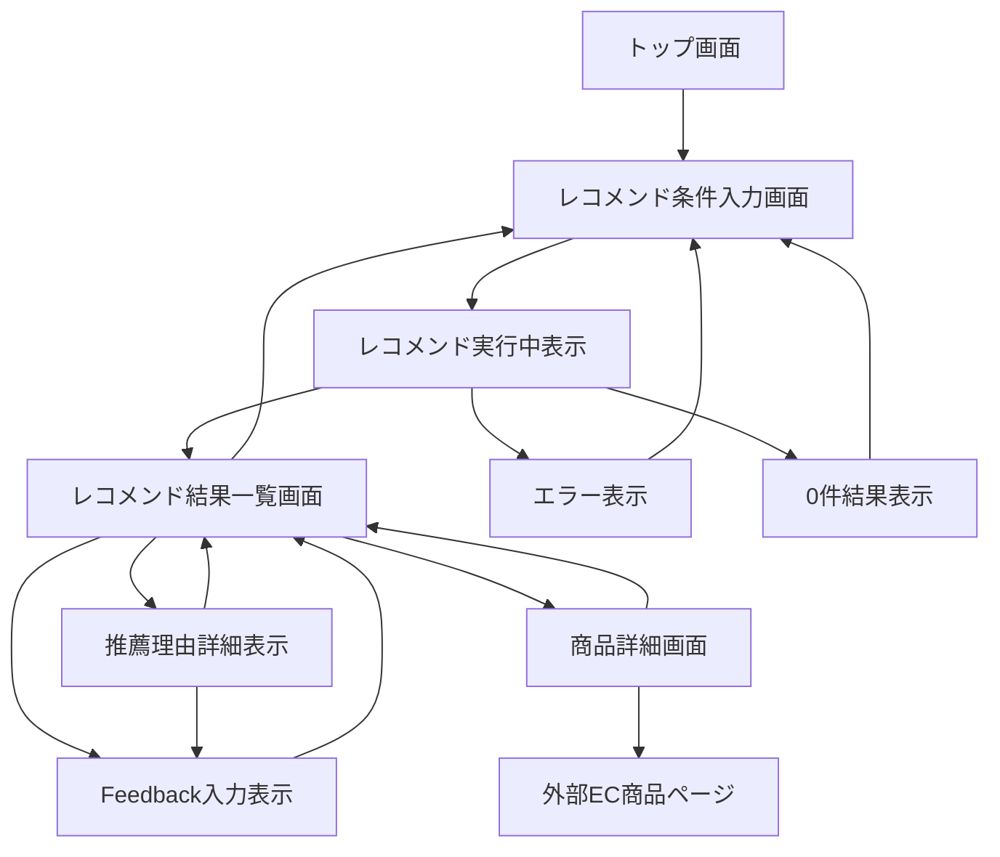
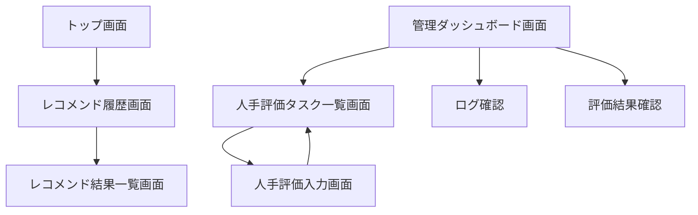

# 画面一覧

## 1. 概要

### 1.1 目的

本ドキュメントは、Gift Recommendation Service MVPにおける画面一覧を定義する。

本サービスは、ユーザーが贈答条件を入力し、意味に基づいたギフト推薦結果を確認し、推薦結果に対してFeedbackを行うWebアプリケーションである。

本ドキュメントでは、以下を明確にする。

```text
どの画面を作成するか
各画面の目的・役割は何か
各画面で表示・入力する項目は何か
画面間の遷移はどうなるか
API・機能・モジュールとどう対応するか
MVPで作成する画面と後続扱いの画面はどれか
```

---

### 1.2 本ドキュメントの位置づけ

| 成果物                        | 本ドキュメントとの関係                                 |
| ----------------------------- | ------------------------------------------------------ |
| MVPスコープ定義書             | MVPで検証する体験・機能範囲の前提                      |
| 制約・対象外一覧              | 画面化しない機能・後続扱いの範囲の前提                 |
| 機能一覧                      | 画面機能の正本                                         |
| モジュール一覧                | 画面制御モジュールの前提                               |
| 機能×モジュール対応表         | 画面機能と画面制御モジュールの対応関係                 |
| Recommendation Request定義書  | 入力画面の項目定義の前提                               |
| Recommendation Result定義書   | 結果画面の表示データの前提                             |
| Recommendation Feedback定義書 | Feedback入力項目の前提                                 |
| Reason生成定義書              | 推薦理由表示項目の前提                                 |
| API一覧                       | 画面から呼び出すAPIを整理する後続成果物                |
| 画面遷移図                    | 本ドキュメントをもとに画面遷移を図式化する後続成果物   |
| 画面項目定義書                | 本ドキュメントをもとに各画面項目を詳細化する後続成果物 |

---

## 2. 基本方針

### 2.1 画面設計方針

| 方針                             | 内容                                                     |
| -------------------------------- | -------------------------------------------------------- |
| MVP価値検証を優先する            | 「意味でギフトを選べる」体験に必要な画面を優先する       |
| 入力から結果表示までを最短化する | ユーザーが迷わずレコメンド実行できる画面構成にする       |
| 推薦理由を重視する               | 単なる商品一覧ではなく、なぜ推薦されたかを表示する       |
| 商品購入機能は持たない           | 購入・決済・配送は対象外とし、外部EC遷移に留める         |
| 認証前提にしない                 | MVP初期では会員登録・ログインを必須にしない              |
| 管理画面は後続扱いにする         | MVP初期ではDB・ログ・GitHub運用で代替する                |
| 画面と状態を分けて整理する       | ローディング、エラー、0件は画面状態として扱う            |
| API責務と画面責務を分離する      | 画面は表示・入力に集中し、推薦処理はapi / recoへ委譲する |

### 2.1.1 画面URL設計方針

| 方針                                  | 内容                                                                                                                      |
| ------------------------------------- | ------------------------------------------------------------------------------------------------------------------------- |
| 画面URLはユーザー導線用URLとして扱う  | API契約URLとは別に、ブラウザ表示・戻る操作・共有しやすさを優先する                                                        |
| API設計方針を参考にする               | リソース名は複数形、単語区切りはkebab-case、ID指定はpath parameterを基本とする                                            |
| API URLと一致させることを必須にしない | 例: 画面URL `/recommendations/{result_id}` と API URL `/api/v1/recommendation-results/{resultId}/feedback` は役割が異なる |
| path parameter表記                    | 画面URL案ではフロントルーティング表記として `{result_id}` / `{item_id}` を使用する                                        |

---

### 2.2 画面種別

| 画面種別        | 内容                                                        |
| --------------- | ----------------------------------------------------------- |
| 通常画面        | URLまたはルーティングを持つ主要画面                         |
| 画面状態        | 同一画面内で切り替わる状態。例：ローディング、エラー、0件   |
| モーダル / 部品 | 独立画面ではなく、画面内で表示されるUI部品                  |
| 後続画面        | MVP初期では必須ではないが、後続フェーズで作成候補となる画面 |

---

### 2.3 MVP対象区分

| 区分 | 意味                                              |
| ---- | ------------------------------------------------- |
| ○    | MVPで作成対象                                     |
| △    | MVPでは簡易実装、任意実装、または後続フェーズ優先 |
| ×    | MVP対象外                                         |

---

## 3. 画面一覧

### 3.1 全体画面一覧

| 画面ID  | 画面名                 | 画面種別        | 主担当 | MVP対象 | 概要                                                       |
| ------- | ---------------------- | --------------- | ------ | ------: | ---------------------------------------------------------- |
| SCR-001 | トップ画面             | 通常画面        | web    |       ○ | サービス概要とレコメンド開始導線を表示する                 |
| SCR-002 | レコメンド条件入力画面 | 通常画面        | web    |       ○ | 贈答相手、用途、予算、好み、避けたい条件、NG条件を入力する |
| SCR-003 | レコメンド実行中表示   | 画面状態        | web    |       ○ | 推薦実行中のローディング状態を表示する                     |
| SCR-004 | レコメンド結果一覧画面 | 通常画面        | web    |       ○ | 推薦順位、商品情報、推薦理由を一覧表示する                 |
| SCR-005 | 推薦理由詳細表示       | モーダル / 部品 | web    |       ○ | 推薦理由の詳細、理由ポイント、注意文を表示する             |
| SCR-006 | 商品詳細画面           | 通常画面        | web    |       ○ | 推薦商品の詳細情報と外部EC遷移導線を表示する               |
| SCR-007 | Feedback入力表示       | モーダル / 部品 | web    |       ○ | 推薦結果・商品・理由に対するFeedbackを入力する             |
| SCR-008 | エラー表示             | 画面状態        | web    |       ○ | 入力エラー、推薦失敗、APIエラーを表示する                  |
| SCR-009 | 0件結果表示            | 画面状態        | web    |       ○ | 条件に合う商品が見つからない場合の表示を行う               |
| SCR-010 | レコメンド履歴画面     | 通常画面        | web    |       △ | 過去の推薦結果を表示する                                   |
| SCR-011 | 人手評価タスク一覧画面 | 通常画面        | web    |       △ | 人手評価対象の推薦結果一覧を表示する                       |
| SCR-012 | 人手評価入力画面       | 通常画面        | web    |       △ | 推薦結果に対する人手評価を入力する                         |
| SCR-013 | 管理ダッシュボード画面 | 通常画面        | web    |       △ | ログ、評価結果、改善状況を管理者向けに表示する             |
| SCR-014 | Not Found画面          | 画面状態        | web    |       △ | 存在しないURLや削除済みデータへのアクセス時に表示する      |

---

### 3.2 MVP必須画面

| 画面ID  | 画面名                 | 理由                                   |
| ------- | ---------------------- | -------------------------------------- |
| SCR-001 | トップ画面             | サービス入口として必要                 |
| SCR-002 | レコメンド条件入力画面 | 推薦条件を入力する中核画面             |
| SCR-003 | レコメンド実行中表示   | 推薦処理中のUXとして必要               |
| SCR-004 | レコメンド結果一覧画面 | 推薦価値を提示する中核画面             |
| SCR-005 | 推薦理由詳細表示       | 「なぜこの商品か」を説明するために必要 |
| SCR-006 | 商品詳細画面           | 商品確認と外部EC遷移のために必要       |
| SCR-007 | Feedback入力表示       | MVP検証と改善のために必要              |
| SCR-008 | エラー表示             | 入力不備・推薦失敗時のUXとして必要     |
| SCR-009 | 0件結果表示            | 候補なし時の代替導線として必要         |

---

### 3.3 後続扱い画面

| 画面ID  | 画面名                 | 方針                                           |
| ------- | ---------------------- | ---------------------------------------------- |
| SCR-010 | レコメンド履歴画面     | 認証・ユーザー識別方針が固まった後に詳細化する |
| SCR-011 | 人手評価タスク一覧画面 | Evaluation運用が必要になった段階で作成する     |
| SCR-012 | 人手評価入力画面       | 人手評価データを蓄積する段階で作成する         |
| SCR-013 | 管理ダッシュボード画面 | MVP初期はDB・ログ確認で代替する                |
| SCR-014 | Not Found画面          | ルーティング実装時に簡易対応する               |

---

## 4. 画面詳細

## 4.1 SCR-001 トップ画面

| 項目           | 内容                          |
| -------------- | ----------------------------- |
| 画面ID         | SCR-001                       |
| 画面名         | トップ画面                    |
| URL案          | `/`                           |
| 画面種別       | 通常画面                      |
| 主担当         | web                           |
| MVP対象        | ○                             |
| 対応機能       | トップ画面表示                |
| 対応モジュール | トップ画面制御                |
| 主なAPI        | なし、またはマスタ事前取得API |
| 次画面         | レコメンド条件入力画面        |

### 目的

ユーザーにサービスの価値を伝え、レコメンド条件入力画面へ誘導する。

### 表示項目

| 項目                 | 内容                                         | MVP対象 |
| -------------------- | -------------------------------------------- | ------: |
| サービス名           | サービス名称または仮称                       |       ○ |
| キャッチコピー       | 意味でギフトを選べることを伝える文言         |       ○ |
| サービス説明         | 贈答相手・用途・好みからギフトを推薦する説明 |       ○ |
| レコメンド開始ボタン | 条件入力画面への導線                         |       ○ |
| 注意書き             | 購入・決済は外部ECで行う旨                   |       △ |

### 主な操作

| 操作           | 遷移 / 処理                      |
| -------------- | -------------------------------- |
| レコメンド開始 | レコメンド条件入力画面へ遷移する |

---

## 4.2 SCR-002 レコメンド条件入力画面

| 項目           | 内容                                              |
| -------------- | ------------------------------------------------- |
| 画面ID         | SCR-002                                           |
| 画面名         | レコメンド条件入力画面                            |
| URL案          | `/recommendations`                                |
| 画面種別       | 通常画面                                          |
| 主担当         | web                                               |
| MVP対象        | ○                                                 |
| 対応機能       | レコメンド条件入力 / マスタ選択肢表示             |
| 対応モジュール | レコメンド入力画面制御 / マスタ選択肢表示制御     |
| 主なAPI        | マスタ取得API / レコメンド実行API                 |
| 次画面         | レコメンド結果一覧画面 / エラー表示 / 0件結果表示 |

### 目的

ユーザーが贈答条件を入力し、Recommendation Requestを作成する。

### 入力項目

| 項目               | 内容                 | 必須 | MVP対象 | 備考                                   |
| ------------------ | -------------------- | ---: | ------: | -------------------------------------- |
| relationship       | 贈る相手との関係性   |    ○ |       ○ | 例：恋人、友人、家族、職場関係         |
| occasion           | 贈答用途・シーン     |    ○ |       ○ | 例：誕生日、記念日、お礼、季節イベント |
| budgetMin          | 最低予算             |    △ |       ○ | 未入力可。入力時はbudgetMax以下        |
| budgetMax          | 最高予算             |    ○ |       ○ | 推薦対象の価格上限                     |
| preferred_text     | 好み・重視したい条件 |    △ |       ○ | 例：上品、実用的、特別感がある         |
| non_preferred_text | 避けたい傾向         |    △ |       ○ | 例：派手すぎるものは避けたい           |
| ng_conditions      | 必ず除外したい条件   |    △ |       ○ | 明確なNG条件。Hard Filterで利用        |
| result_count       | 表示件数             |    △ |       △ | MVPでは固定値でも可                    |

### 表示項目

| 項目                 | 内容                                                                                       | MVP対象 |
| -------------------- | ------------------------------------------------------------------------------------------ | ------: |
| 入力フォーム         | 推薦条件を入力するフォーム                                                                 |       ○ |
| Relationship選択肢   | relationship masterから取得                                                                |       ○ |
| Occasion選択肢       | occasion masterから取得                                                                    |       ○ |
| 予算入力欄           | budgetMin / budgetMax                                                                      |       ○ |
| 好み入力欄           | preferred_text                                                                             |       ○ |
| 避けたい条件入力欄   | non_preferred_text                                                                         |       ○ |
| NG条件入力欄         | ng_conditions                                                                              |       ○ |
| レコメンド実行ボタン | `POST /api/v1/recommendations` を呼び出す（フロントのURL案 `/recommendations/...` とは別） |       ○ |
| 入力補助テキスト     | 入力例・説明文                                                                             |       △ |

### 主な操作

| 操作             | 処理                                    |
| ---------------- | --------------------------------------- |
| Relationship選択 | relationshipを更新する                  |
| Occasion選択     | occasionを更新する                      |
| 予算入力         | budgetMin / budgetMaxを更新する         |
| 好み入力         | preferred_textを更新する                |
| 避けたい条件入力 | non_preferred_textを更新する            |
| NG条件入力       | ng_conditionsを更新する                 |
| レコメンド実行   | 入力検証後、レコメンド実行APIを呼び出す |

### バリデーション観点

| 観点     | 内容                                                  |
| -------- | ----------------------------------------------------- |
| 必須入力 | relationship / occasion / budgetMax                   |
| 予算範囲 | budgetMin <= budgetMax                                |
| 数値形式 | 予算は数値として扱えること                            |
| 入力長   | 自由入力が長すぎないこと                              |
| 矛盾     | preferred_textとng_conditionsが明らかに矛盾しないこと |

---

## 4.3 SCR-003 レコメンド実行中表示

| 項目           | 内容                                              |
| -------------- | ------------------------------------------------- |
| 画面ID         | SCR-003                                           |
| 画面名         | レコメンド実行中表示                              |
| URL案          | `/recommendations/loading`                        |
| 画面種別       | 画面状態                                          |
| 主担当         | web                                               |
| MVP対象        | ○                                                 |
| 対応機能       | ローディング表示                                  |
| 対応モジュール | ローディング表示制御                              |
| 主なAPI        | レコメンド実行API                                 |
| 次画面         | レコメンド結果一覧画面 / エラー表示 / 0件結果表示 |

### 目的

レコメンド実行中であることをユーザーに伝え、待機中の不安を軽減する。

### 表示項目

| 項目             | 内容                                 | MVP対象 |
| ---------------- | ------------------------------------ | ------: |
| ローディング表示 | 推薦処理中であることを示す           |       ○ |
| 処理中メッセージ | 「条件に合うギフトを探しています」等 |       ○ |
| 補足メッセージ   | 少し時間がかかる可能性の説明         |       △ |
| キャンセル導線   | 入力画面へ戻る                       |       △ |

---

## 4.4 SCR-004 レコメンド結果一覧画面

| 項目           | 内容                                                     |
| -------------- | -------------------------------------------------------- |
| 画面ID         | SCR-004                                                  |
| 画面名         | レコメンド結果一覧画面                                   |
| URL案          | `/recommendations/{result_id}`                           |
| 画面種別       | 通常画面                                                 |
| 主担当         | web                                                      |
| MVP対象        | ○                                                        |
| 対応機能       | レコメンド結果表示 / 推薦理由表示                        |
| 対応モジュール | 結果画面制御 / 推薦理由表示制御                          |
| 主なAPI        | レコメンド結果返却 / 商品詳細取得API / Feedback登録API   |
| 次画面         | 商品詳細画面 / Feedback入力表示 / レコメンド条件入力画面 |

### 目的

推薦された商品を順位付きで表示し、各商品がなぜ推薦されたかをユーザーに説明する。

### 表示項目

| 項目               | 内容                               | MVP対象 | 備考                               |
| ------------------ | ---------------------------------- | ------: | ---------------------------------- |
| 推薦順位           | final_scoreに基づく表示順位        |       ○ | 数値スコアではなく順位として表示   |
| 商品画像           | 商品画像URL                        |       ○ | item image                         |
| 商品名             | 商品名称                           |       ○ | item name                          |
| 商品キャッチコピー | 商品の魅力・特徴を短く示す文言     |       ○ | ショップ名の代替ではなく商品訴求文 |
| 価格               | 商品価格                           |       ○ | 表示時点の価格                     |
| 推薦理由バッジ     | reason_badges                      |       ○ | 例：上品、実用的、外しにくい       |
| 推薦理由要約       | reason_summary                     |       ○ | 商品カード上の短い理由             |
| 詳細理由表示ボタン | reason_detail表示導線              |       ○ | モーダルまたは展開表示             |
| 商品詳細ボタン     | 商品詳細画面への導線               |       ○ | 外部EC遷移前の確認                 |
| 外部EC遷移ボタン   | 商品ページへ遷移する導線           |       ○ | 購入は外部EC                       |
| Feedback入力導線   | 良い / 違う / 理由が納得できない等 |       ○ | Feedback入力表示を開く             |
| 再検索ボタン       | 条件入力画面へ戻る                 |       ○ | 条件変更導線                       |

### 表示しない項目

| 項目              | 理由                               |
| ----------------- | ---------------------------------- |
| ショップ名        | MVP表示対象外                      |
| final_scoreの数値 | ユーザー向けには順位として表示する |
| score_breakdown   | 内部評価・デバッグ用               |
| model_version_id  | 内部再現性管理用                   |
| reason_basis      | 内部根拠管理用                     |

### 主な操作

| 操作           | 処理                         |
| -------------- | ---------------------------- |
| 商品詳細を見る | 商品詳細画面へ遷移する       |
| 推薦理由を見る | 推薦理由詳細表示を開く       |
| 外部ECで見る   | 外部ECの商品ページへ遷移する |
| Feedback入力   | Feedback入力表示を開く       |
| 条件を変更する | レコメンド条件入力画面へ戻る |

---

## 4.5 SCR-005 推薦理由詳細表示

| 項目           | 内容                                   |
| -------------- | -------------------------------------- |
| 画面ID         | SCR-005                                |
| 画面名         | 推薦理由詳細表示                       |
| URL案          | なし。結果画面内モーダルまたは展開表示 |
| 画面種別       | モーダル / 部品                        |
| 主担当         | web                                    |
| MVP対象        | ○                                      |
| 対応機能       | 推薦理由表示                           |
| 対応モジュール | 推薦理由表示制御 / Reason生成          |
| 主なAPI        | レコメンド結果返却                     |
| 次画面         | レコメンド結果一覧画面                 |

### 目的

商品カード上では表示しきれない推薦理由を詳しく表示する。

### 表示項目

| 項目           | 内容                     | MVP対象 |
| -------------- | ------------------------ | ------: |
| reason_badges  | 推薦理由を短く表すラベル |       ○ |
| reason_summary | 短い推薦理由             |       ○ |
| reason_detail  | 詳細な推薦理由           |       ○ |
| reason_points  | 箇条書きの推薦理由       |       ○ |
| caution_note   | 必要に応じた補足・注意文 |       ○ |

### 主な操作

| 操作         | 処理                   |
| ------------ | ---------------------- |
| 閉じる       | 結果一覧画面へ戻る     |
| Feedbackする | Feedback入力表示を開く |

---

## 4.6 SCR-006 商品詳細画面

| 項目           | 内容                            |
| -------------- | ------------------------------- |
| 画面ID         | SCR-006                         |
| 画面名         | 商品詳細画面                    |
| URL案          | `/items/{item_id}`              |
| 画面種別       | 通常画面                        |
| 主担当         | web                             |
| MVP対象        | ○                               |
| 対応機能       | 商品詳細表示                    |
| 対応モジュール | 商品詳細画面制御 / 商品詳細取得 |
| 主なAPI        | 商品詳細取得API                 |
| 次画面         | レコメンド結果一覧画面 / 外部EC |

### 目的

推薦商品の詳細情報を確認し、外部ECの商品ページへ遷移できるようにする。

### 表示項目

| 項目               | 内容                          | MVP対象 | 備考                     |
| ------------------ | ----------------------------- | ------: | ------------------------ |
| 商品画像           | 商品画像URL                   |       ○ | 複数画像は後続でも可     |
| 商品名             | 商品名称                      |       ○ |                          |
| 商品キャッチコピー | 商品の訴求文                  |       ○ |                          |
| 価格               | 商品価格                      |       ○ |                          |
| 商品説明           | 商品説明文                    |       ○ | 長文は折りたたみ可       |
| 推薦順位           | 結果一覧での順位              |       ○ | 表示元がある場合         |
| 推薦理由要約       | reason_summary                |       ○ |                          |
| 推薦理由詳細       | reason_detail / reason_points |       △ | 結果画面で十分なら省略可 |
| 外部ECリンク       | 商品ページURL                 |       ○ | 購入は外部EC             |
| 戻るボタン         | 結果一覧へ戻る                |       ○ |                          |

### 表示しない項目

| 項目                 | 理由                 |
| -------------------- | -------------------- |
| ショップ名           | MVP表示対象外        |
| 内部item_id          | ユーザー向け表示不要 |
| score_breakdown      | 内部評価用           |
| 仕入れ・在庫管理情報 | EC機能は対象外       |

---

## 4.7 SCR-007 Feedback入力表示

| 項目           | 内容                                                |
| -------------- | --------------------------------------------------- |
| 画面ID         | SCR-007                                             |
| 画面名         | Feedback入力表示                                    |
| URL案          | なし。結果画面または商品詳細画面内のモーダル / 部品 |
| 画面種別       | モーダル / 部品                                     |
| 主担当         | web                                                 |
| MVP対象        | ○                                                   |
| 対応機能       | フィードバック入力                                  |
| 対応モジュール | フィードバック画面制御 / フィードバック受付         |
| 主なAPI        | Feedback登録API                                     |
| 次画面         | レコメンド結果一覧画面 / 商品詳細画面               |

### 目的

ユーザーの反応を取得し、推薦品質改善の材料にする。

### 入力項目

| 項目            | 内容                                         | 必須 | MVP対象 |
| --------------- | -------------------------------------------- | ---: | ------: |
| feedback_target | result / item / reason等の対象               |    ○ |       ○ |
| feedback_type   | good / bad / not_relevant / reason_unclear等 |    ○ |       ○ |
| item_id         | 商品単位Feedbackの場合の商品ID               |    △ |       ○ |
| result_id       | 推薦結果ID                                   |    ○ |       ○ |
| comment         | 任意コメント                                 |    △ |       △ |

### 表示項目

| 項目               | 内容                               | MVP対象 |
| ------------------ | ---------------------------------- | ------: |
| 簡易評価ボタン     | 良い / 違う / 理由が納得できない等 |       ○ |
| コメント入力欄     | 任意の自由記述                     |       △ |
| 送信ボタン         | Feedback登録APIを呼び出す          |       ○ |
| 送信完了メッセージ | Feedback登録完了を表示する         |       ○ |

---

## 4.8 SCR-008 エラー表示

| 項目           | 内容                                   |
| -------------- | -------------------------------------- |
| 画面ID         | SCR-008                                |
| 画面名         | エラー表示                             |
| URL案          | なし。各画面内状態                     |
| 画面種別       | 画面状態                               |
| 主担当         | web                                    |
| MVP対象        | ○                                      |
| 対応機能       | エラー表示                             |
| 対応モジュール | エラー表示制御 / APIエラーハンドリング |
| 主なAPI        | 各API                                  |
| 次画面         | 入力画面 / 結果画面                    |

### 表示パターン

| パターン           | 内容                     | 表示メッセージ例               |
| ------------------ | ------------------------ | ------------------------------ |
| 入力エラー         | 必須項目不足、予算矛盾等 | 入力内容を確認してください     |
| APIエラー          | apiで処理失敗            | レコメンド実行に失敗しました   |
| recoエラー         | 推薦パイプライン失敗     | 条件を変えて再度お試しください |
| 商品取得エラー     | 商品詳細取得失敗         | 商品情報を取得できませんでした |
| Feedback送信エラー | Feedback登録失敗         | Feedbackを送信できませんでした |

### 主な操作

| 操作           | 処理                        |
| -------------- | --------------------------- |
| 入力画面に戻る | 条件入力画面へ戻る          |
| 再実行         | 直前条件で再度APIを呼び出す |
| 閉じる         | モーダル・アラートを閉じる  |

---

## 4.9 SCR-009 0件結果表示

| 項目           | 内容                                      |
| -------------- | ----------------------------------------- |
| 画面ID         | SCR-009                                   |
| 画面名         | 0件結果表示                               |
| URL案          | `/recommendations/{result_id}` の状態表示 |
| 画面種別       | 画面状態                                  |
| 主担当         | web                                       |
| MVP対象        | ○                                         |
| 対応機能       | レコメンド結果表示 / エラー表示           |
| 対応モジュール | 結果画面制御 / エラー表示制御             |
| 主なAPI        | レコメンド実行API                         |
| 次画面         | レコメンド条件入力画面                    |

### 目的

条件に合う商品が見つからなかった場合に、ユーザーが次の行動を取れるようにする。

### 表示項目

| 項目                 | 内容                               | MVP対象 |
| -------------------- | ---------------------------------- | ------: |
| 0件メッセージ        | 条件に合う商品が見つからない旨     |       ○ |
| 条件緩和の提案       | 予算・NG条件・好み条件の見直し提案 |       ○ |
| 条件入力へ戻るボタン | 入力画面へ戻る                     |       ○ |
| 再検索ボタン         | 条件変更後に再実行                 |       △ |

---

## 4.10 SCR-010 レコメンド履歴画面

| 項目           | 内容                       |
| -------------- | -------------------------- |
| 画面ID         | SCR-010                    |
| 画面名         | レコメンド履歴画面         |
| URL案          | `/recommendations/history` |
| 画面種別       | 通常画面                   |
| 主担当         | web                        |
| MVP対象        | △                          |
| 対応機能       | 履歴表示                   |
| 対応モジュール | 履歴画面制御 / 履歴取得    |
| 主なAPI        | 履歴取得API                |
| 主な遷移元     | トップ画面                 |
| 主な遷移先     | レコメンド結果一覧画面     |

### 方針

初回MVPでは認証機能を対象外とするため、レコメンド履歴画面は構築対象外とする。

後続フェーズで履歴機能を追加する場合は、トップ画面から「過去のレコメンドを見る」導線を設け、レコメンド履歴画面へ遷移できるようにする。

履歴画面では過去のRecommendation Resultを一覧表示し、選択した履歴からレコメンド結果一覧画面へ遷移する。

---

## 4.11 SCR-011 人手評価タスク一覧画面

| 項目           | 内容                          |
| -------------- | ----------------------------- |
| 画面ID         | SCR-011                       |
| 画面名         | 人手評価タスク一覧画面        |
| URL案          | `/evaluations/tasks`          |
| 画面種別       | 通常画面                      |
| 主担当         | web                           |
| MVP対象        | △                             |
| 対応機能       | 人手評価画面                  |
| 対応モジュール | 評価画面制御 / 評価タスク取得 |
| 主なAPI        | 評価タスク取得API             |

### 方針

Evaluation運用が必要になった段階で作成する。  
MVP初期では、スプレッドシートやDB確認による簡易評価で代替してもよい。

---

## 4.12 SCR-012 人手評価入力画面

| 項目           | 内容                           |
| -------------- | ------------------------------ |
| 画面ID         | SCR-012                        |
| 画面名         | 人手評価入力画面               |
| URL案          | `/evaluations/tasks/{task_id}` |
| 画面種別       | 通常画面                       |
| 主担当         | web                            |
| MVP対象        | △                              |
| 対応機能       | 人手評価画面                   |
| 対応モジュール | 評価画面制御 / 人手評価受付    |
| 主なAPI        | 人手評価受付API                |

### 方針

推薦結果の品質評価を人手で継続運用する段階で作成する。  
MVP初期では必須ではない。

---

## 4.13 SCR-013 管理ダッシュボード画面

| 項目           | 内容                                          |
| -------------- | --------------------------------------------- |
| 画面ID         | SCR-013                                       |
| 画面名         | 管理ダッシュボード画面                        |
| URL案          | `/admin`                                      |
| 画面種別       | 通常画面                                      |
| 主担当         | web                                           |
| MVP対象        | △                                             |
| 対応機能       | 管理画面                                      |
| 対応モジュール | 管理画面制御 / 管理照会受付 / 監視 / 観測確認 |
| 主なAPI        | 管理照会API                                   |

### 方針

MVP初期では管理画面を作らず、DB、Hostingログ、GitHub Actionsログで代替する。  
商用化・評価運用が進んだ段階で、ログ・評価・改善Backlog確認用に作成する。

---

## 5. 画面遷移

### 5.1 MVP基本遷移



---

### 5.2 後続画面遷移



---

## 6. 画面とAPIの対応

| 画面名                 | 利用API                                        | 用途                                                          |
| ---------------------- | ---------------------------------------------- | ------------------------------------------------------------- |
| トップ画面             | なし、または `GET /api/v1/masters/...`         | 初期表示、導線表示                                            |
| レコメンド条件入力画面 | `GET /api/v1/masters/relationships` 等（並列） | Relationship / Occasion / Semantic Config / Feature Rule 参照 |
| レコメンド条件入力画面 | レコメンド実行API                              | Recommendation Request送信                                    |
| レコメンド結果一覧画面 | レコメンド実行APIのレスポンス                  | 推薦結果表示                                                  |
| 商品詳細画面           | 商品詳細取得API                                | 商品詳細取得                                                  |
| Feedback入力表示       | Feedback登録API                                | Feedback登録                                                  |
| レコメンド履歴画面     | 履歴取得API                                    | 過去結果取得                                                  |
| 人手評価タスク一覧画面 | 評価タスク取得API                              | 評価対象取得                                                  |
| 人手評価入力画面       | 人手評価受付API                                | 人手評価登録                                                  |
| 管理ダッシュボード画面 | 管理照会API                                    | ログ・評価結果・改善状況取得                                  |

---

## 7. 画面と機能・モジュールの対応

| 画面名                 | 対応機能                        | 主モジュール                  |
| ---------------------- | ------------------------------- | ----------------------------- |
| トップ画面             | トップ画面表示                  | トップ画面制御                |
| レコメンド条件入力画面 | レコメンド条件入力              | レコメンド入力画面制御        |
| レコメンド条件入力画面 | マスタ選択肢表示                | マスタ選択肢表示制御          |
| レコメンド実行中表示   | ローディング表示                | ローディング表示制御          |
| レコメンド結果一覧画面 | レコメンド結果表示              | 結果画面制御                  |
| 推薦理由詳細表示       | 推薦理由表示                    | 推薦理由表示制御              |
| 商品詳細画面           | 商品詳細表示                    | 商品詳細画面制御              |
| Feedback入力表示       | フィードバック入力              | フィードバック画面制御        |
| エラー表示             | エラー表示                      | エラー表示制御                |
| 0件結果表示            | レコメンド結果表示 / エラー表示 | 結果画面制御 / エラー表示制御 |
| レコメンド履歴画面     | 履歴表示                        | 履歴画面制御                  |
| 人手評価タスク一覧画面 | 人手評価画面                    | 評価画面制御                  |
| 人手評価入力画面       | 人手評価画面                    | 評価画面制御                  |
| 管理ダッシュボード画面 | 管理画面                        | 管理画面制御                  |

---

## 8. MVP画面構成

### 8.1 MVP最小画面構成

MVP初期で最低限作成する画面構成は以下とする。

```text
トップ画面
↓
レコメンド条件入力画面
↓
レコメンド実行中表示
↓
レコメンド結果一覧画面
  ├ 推薦理由詳細表示
  ├ 商品詳細画面
  └ Feedback入力表示
```

### 8.2 MVPで画面状態として対応するもの

| 状態             | 対応画面                       |
| ---------------- | ------------------------------ |
| 入力エラー       | レコメンド条件入力画面内で表示 |
| APIエラー        | エラー表示                     |
| 推薦結果0件      | 0件結果表示                    |
| ローディング     | レコメンド実行中表示           |
| Feedback送信完了 | Feedback入力表示内で表示       |
| Feedback送信失敗 | Feedback入力表示内でエラー表示 |

---

## 9. 対象外・後続扱い

以下は `制約・対象外一覧.md` に委譲し、本ドキュメントでは画面観点のみ整理する。

| 画面 / 機能              | MVPでの扱い | 理由                               |
| ------------------------ | ----------- | ---------------------------------- |
| ログイン画面             | 対象外      | MVP初期では認証必須にしないため    |
| 会員登録画面             | 対象外      | MVP初期では会員管理を行わないため  |
| 決済画面                 | 対象外      | 商品購入機能は対象外               |
| 配送先入力画面           | 対象外      | 配送管理は対象外                   |
| 注文履歴画面             | 対象外      | 購入機能を持たないため             |
| 高度な管理画面           | 後続        | MVP初期はDB・ログ確認で代替可能    |
| 高度な分析ダッシュボード | 後続        | MVP初期では過剰                    |
| パーソナライズ設定画面   | 後続        | 認証・ユーザー管理方針確定後に検討 |

---

## 10. 後続成果物への引き継ぎ

### 10.1 画面遷移図への引き継ぎ

画面遷移図では、以下を詳細化する。

| 対象     | 内容                                   |
| -------- | -------------------------------------- |
| 通常遷移 | トップ → 入力 → 結果 → 詳細 / Feedback |
| 異常遷移 | 入力エラー、APIエラー、0件結果         |
| 外部遷移 | 外部EC商品ページへの遷移               |
| 後続遷移 | 履歴、評価、管理画面                   |

---

### 10.2 画面項目定義書への引き継ぎ

画面項目定義書では、各画面ごとに以下を詳細化する。

| 項目           | 内容                                |
| -------------- | ----------------------------------- |
| 表示項目       | ラベル、表示内容、形式、表示条件    |
| 入力項目       | 型、必須、桁数、選択肢、初期値      |
| ボタン         | 操作名、押下条件、実行処理          |
| バリデーション | 入力チェック、エラー文言            |
| API連携        | 呼び出しAPI、リクエスト、レスポンス |
| 状態           | loading / success / error / empty   |
| 権限           | MVP初期では原則なし                 |

---

### 10.3 API一覧への引き継ぎ

API一覧では、画面から呼び出される以下のAPIを整理する。

| API               | 主な利用画面           |
| ----------------- | ---------------------- |
| レコメンド実行API | レコメンド条件入力画面 |
| マスタ取得API     | レコメンド条件入力画面 |
| 商品詳細取得API   | 商品詳細画面           |
| Feedback登録API   | Feedback入力表示       |
| 履歴取得API       | レコメンド履歴画面     |
| 評価タスク取得API | 人手評価タスク一覧画面 |
| 人手評価受付API   | 人手評価入力画面       |
| 管理照会API       | 管理ダッシュボード画面 |

---

## 11. レビュー観点

| 観点         | 確認内容                                                           |
| ------------ | ------------------------------------------------------------------ |
| MVP整合      | MVP価値検証に必要な画面が揃っているか                              |
| 対象外整合   | 購入、決済、配送、会員管理画面が含まれていないか                   |
| 入力整合     | Recommendation Request定義書の主要項目が入力画面に反映されているか |
| 結果整合     | Recommendation Result定義書の主要項目が結果画面に反映されているか  |
| Reason整合   | Reason生成定義書の出力項目が表示対象になっているか                 |
| Feedback整合 | Recommendation Feedback定義書に接続できる入力があるか              |
| 表示項目整合 | ショップ名を表示対象にしていないか                                 |
| 順位表示     | final_scoreの数値ではなく推薦順位として表示しているか              |
| エラー対応   | 入力エラー、APIエラー、0件結果が扱えるか                           |
| 後続展開     | 画面遷移図、画面項目定義書、API一覧へ展開できるか                  |

---

## 12. まとめ

MVPの画面構成は、以下のユーザー体験を成立させることを目的とする。

```text
サービスを理解する
↓
贈答条件を入力する
↓
レコメンドを実行する
↓
推薦順位付きの商品一覧を見る
↓
推薦理由を確認する
↓
商品詳細を確認する
↓
外部ECへ遷移する
↓
Feedbackを入力する
```

本ドキュメントでは、MVP必須画面として以下を定義した。

```text
トップ画面
レコメンド条件入力画面
レコメンド実行中表示
レコメンド結果一覧画面
推薦理由詳細表示
商品詳細画面
Feedback入力表示
エラー表示
0件結果表示
```

後続フェーズでは、以下の画面を必要に応じて追加する。

```text
レコメンド履歴画面
人手評価タスク一覧画面
人手評価入力画面
管理ダッシュボード画面
Not Found画面
```

本ドキュメントをもとに、次工程では `画面遷移図`、`画面項目定義書`、`API一覧` を作成する。
