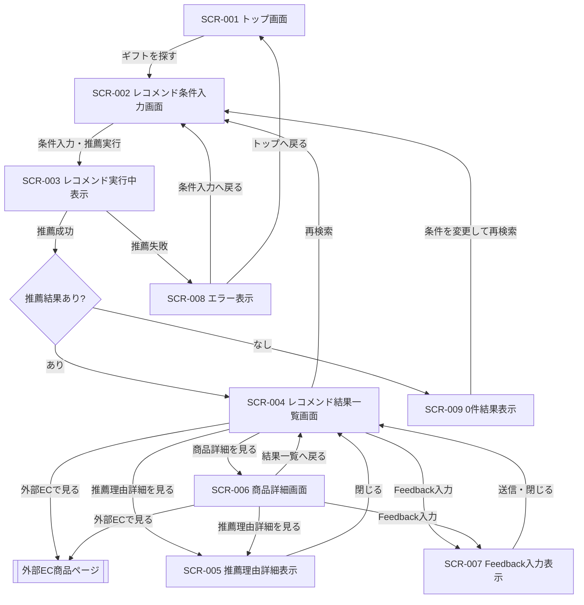
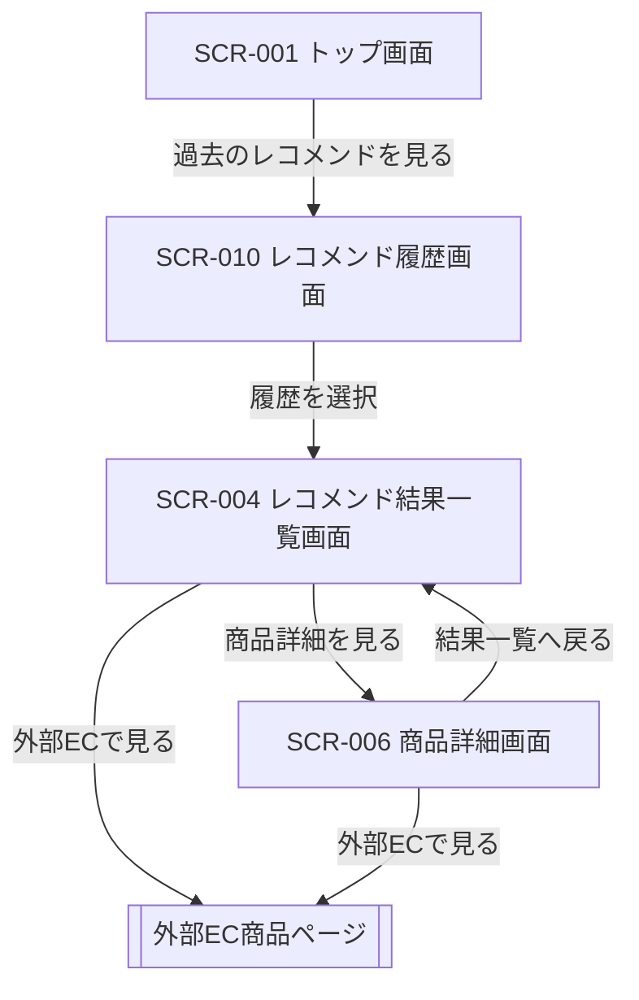
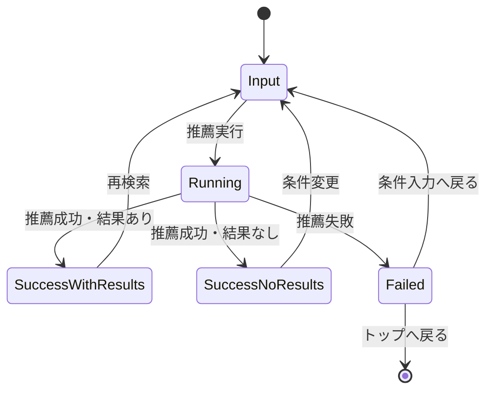

# 画面遷移図

## 1. 本書の目的

本書は、Gift Recommendation Service MVP における画面遷移を整理するための設計書である。

初回MVPでは、認証機能・履歴管理機能・管理機能は対象外とし、ユーザーがギフト条件を入力し、推薦結果を確認し、外部ECへ遷移するまでの主導線を中心に定義する。

---

## 2. 利用したインプット成果物

利用したインプット成果物は以下です。

- 画面一覧.md
- 機能一覧.md
- モジュール一覧.md
- 機能×モジュール対応表.md
- Recoモジュール一覧.md
- 処理構成定義書.md
- システム論理構成図.md
- MVPスコープ定義書.md
- 制約・対象外一覧.md
- Recommendation Request定義書.md
- Recommendation Result定義書.md
- Recommendation Feedback定義書.md
- Reason生成定義書.md

---

## 3. 前提方針

| 区分                 | 方針                                                                                         |
| -------------------- | -------------------------------------------------------------------------------------------- |
| 初回MVPの対象        | ギフト条件入力、推薦実行、推薦結果表示、推薦理由確認、商品詳細確認、外部EC遷移、Feedback入力 |
| 初回MVPの対象外      | 認証、会員登録、ログイン、ユーザー別履歴管理、購入、決済、配送、管理画面                     |
| レコメンド履歴画面   | 初回MVPでは対象外。後続フェーズで追加する                                                    |
| エラー表示           | 独立画面ではなく、推薦実行・結果表示に紐づく画面状態として扱う                               |
| 0件結果表示          | 独立画面ではなく、推薦結果一覧画面の状態として扱う                                           |
| レコメンド実行中表示 | 独立したURL画面ではなく、推薦実行中の画面状態として扱う                                      |
| 推薦理由詳細表示     | モーダルまたは画面内展開部品として扱う                                                       |
| Feedback入力表示     | モーダルまたは画面内入力部品として扱う                                                       |
| 外部EC商品ページ     | アプリ外の外部遷移として扱う                                                                 |

---

## 4. 画面・状態の分類

### 4.1 初回MVP対象画面

| 画面ID  | 画面名                 |            種別 | 初回MVP対象 | 概要                                                      |
| ------- | ---------------------- | --------------: | ----------: | --------------------------------------------------------- |
| SCR-001 | トップ画面             |            画面 |        対象 | サービス入口。レコメンド条件入力への導線を提供する        |
| SCR-002 | レコメンド条件入力画面 |            画面 |        対象 | 贈答相手、用途、予算、好み、避けたい条件などを入力する    |
| SCR-003 | レコメンド実行中表示   |            状態 |        対象 | レコメンド処理中であることを表示する                      |
| SCR-004 | レコメンド結果一覧画面 |            画面 |        対象 | 推薦結果を順位付きで一覧表示する                          |
| SCR-005 | 推薦理由詳細表示       | 部品 / モーダル |        対象 | reason_detail、reason_points、caution_note などを表示する |
| SCR-006 | 商品詳細画面           |            画面 |        対象 | 商品情報、推薦理由、外部EC導線を詳細表示する              |
| SCR-007 | Feedback入力表示       | 部品 / モーダル |        対象 | 推薦結果に対するユーザーフィードバックを入力する          |
| SCR-008 | エラー表示             |            状態 |        対象 | 推薦実行失敗、通信失敗、入力不備などを表示する            |
| SCR-009 | 0件結果表示            |            状態 |        対象 | 条件に合う推薦結果が存在しない場合に表示する              |

### 4.2 後続フェーズ対象画面

| 画面ID  | 画面名                 | 種別 | 初回MVP対象 | 概要                                      |
| ------- | ---------------------- | ---: | ----------: | ----------------------------------------- |
| SCR-010 | レコメンド履歴画面     | 画面 |      対象外 | 過去のRecommendation Resultを一覧表示する |
| SCR-011 | 人手評価タスク一覧画面 | 画面 |      対象外 | 評価対象の推薦結果を一覧表示する          |
| SCR-012 | 人手評価入力画面       | 画面 |      対象外 | 人手評価を入力する                        |
| SCR-013 | 管理ダッシュボード画面 | 画面 |      対象外 | 管理者向けの評価・監視情報を表示する      |
| SCR-014 | Not Found画面          | 画面 |      対象外 | 存在しないURLにアクセスした場合に表示する |

---

## 5. 初回MVPの主画面遷移

### 5.1 主導線

初回MVPの主導線は以下とする。



---

## 6. 初回MVPの画面遷移詳細

### 6.1 トップ画面

| 遷移元     | 操作                     | 遷移先                 | 備考         |
| ---------- | ------------------------ | ---------------------- | ------------ |
| なし       | アプリ起動 / URLアクセス | トップ画面             | サービス入口 |
| トップ画面 | ギフトを探す             | レコメンド条件入力画面 | MVPの主導線  |

初回MVPでは、トップ画面からレコメンド履歴画面への導線は表示しない。

---

### 6.2 レコメンド条件入力画面

| 遷移元                 | 操作                 | 遷移先                 | 備考                 |
| ---------------------- | -------------------- | ---------------------- | -------------------- |
| トップ画面             | ギフトを探す         | レコメンド条件入力画面 | 入力開始             |
| レコメンド結果一覧画面 | 再検索               | レコメンド条件入力画面 | 条件を変更して再実行 |
| 0件結果表示            | 条件を変更して再検索 | レコメンド条件入力画面 | 条件緩和を想定       |
| エラー表示             | 条件入力へ戻る       | レコメンド条件入力画面 | 入力修正または再実行 |

入力対象は、Recommendation Request定義書に準拠する。

主な入力項目は以下。

| 入力分類 | 入力内容                           |
| -------- | ---------------------------------- |
| 外部条件 | 贈答相手、用途、関係性、ペア条件   |
| 内部条件 | 好みの特徴、避けたい特徴、自由記述 |
| 制約条件 | 予算下限、予算上限、NG条件         |
| 実行条件 | 表示件数、推薦モードなど           |

---

### 6.3 レコメンド実行中表示

| 遷移元                 | 操作               | 遷移先                 | 備考                                  |
| ---------------------- | ------------------ | ---------------------- | ------------------------------------- |
| レコメンド条件入力画面 | 推薦実行           | レコメンド実行中表示   | 推薦処理中の状態                      |
| レコメンド実行中表示   | 推薦成功・結果あり | レコメンド結果一覧画面 | Recommendation Resultを表示           |
| レコメンド実行中表示   | 推薦成功・結果なし | 0件結果表示            | 候補商品なし                          |
| レコメンド実行中表示   | 推薦失敗           | エラー表示             | APIエラー、Recoエラー、通信エラーなど |

レコメンド実行中表示は、独立した業務画面ではなく、推薦実行中のUI状態として扱う。

---

### 6.4 レコメンド結果一覧画面

| 遷移元                 | 操作               | 遷移先                 | 備考                 |
| ---------------------- | ------------------ | ---------------------- | -------------------- |
| レコメンド実行中表示   | 推薦成功・結果あり | レコメンド結果一覧画面 | 推薦結果を表示       |
| 商品詳細画面           | 結果一覧へ戻る     | レコメンド結果一覧画面 | 詳細確認後に戻る     |
| 推薦理由詳細表示       | 閉じる             | レコメンド結果一覧画面 | モーダルを閉じる     |
| Feedback入力表示       | 送信・閉じる       | レコメンド結果一覧画面 | Feedback送信後に戻る |
| レコメンド結果一覧画面 | 商品詳細を見る     | 商品詳細画面           | 商品単位の詳細確認   |
| レコメンド結果一覧画面 | 推薦理由詳細を見る | 推薦理由詳細表示       | 推薦理由の詳細確認   |
| レコメンド結果一覧画面 | Feedback入力       | Feedback入力表示       | 推薦結果への評価入力 |
| レコメンド結果一覧画面 | 外部ECで見る       | 外部EC商品ページ       | 外部サイトへ遷移     |
| レコメンド結果一覧画面 | 再検索             | レコメンド条件入力画面 | 条件を変更して再実行 |

#### 表示項目

レコメンド結果一覧画面では以下を表示する。

| 表示項目               |   表示有無 | 備考                   |
| ---------------------- | ---------: | ---------------------- |
| 推薦順位               |   表示する | rank                   |
| 商品画像               |   表示する | item image             |
| 商品名                 |   表示する | item name              |
| 商品キャッチコピー     |   表示する | item caption           |
| 価格                   |   表示する | price                  |
| 推薦理由バッジ         |   表示する | reason_badges          |
| 推薦理由要約           |   表示する | reason_summary         |
| 推薦理由詳細表示ボタン |   表示する | reason_detail表示導線  |
| 商品詳細ボタン         |   表示する | 商品詳細画面への導線   |
| 外部EC遷移ボタン       |   表示する | 外部商品ページへの導線 |
| Feedback入力導線       |   表示する | 推薦結果評価           |
| 再検索ボタン           |   表示する | 条件入力画面へ戻る     |
| ショップ名             | 表示しない | 初回MVPでは非表示      |
| final_score            | 表示しない | 内部値                 |
| score_breakdown        | 表示しない | 内部値                 |
| model_version_id       | 表示しない | 内部値                 |
| reason_basis           | 表示しない | 内部値                 |

---

### 6.5 推薦理由詳細表示

| 遷移元                 | 操作               | 遷移先           | 備考                     |
| ---------------------- | ------------------ | ---------------- | ------------------------ |
| レコメンド結果一覧画面 | 推薦理由詳細を見る | 推薦理由詳細表示 | モーダルまたは展開部品   |
| 商品詳細画面           | 推薦理由詳細を見る | 推薦理由詳細表示 | 商品詳細内からも確認可能 |
| 推薦理由詳細表示       | 閉じる             | 遷移元画面       | モーダルを閉じる         |

推薦理由詳細表示は、独立画面ではなく、モーダルまたは画面内展開部品として扱う。

表示対象は、Reason生成定義書の以下項目とする。

| 項目           | 表示内容                       |
| -------------- | ------------------------------ |
| reason_badges  | 推薦理由を短いラベルで表示     |
| reason_summary | 推薦理由の要約                 |
| reason_detail  | 推薦理由の詳細説明             |
| reason_points  | 推薦根拠の箇条書き             |
| caution_note   | 注意事項、合わない可能性の補足 |

---

### 6.6 商品詳細画面

| 遷移元                 | 操作               | 遷移先                 | 備考                   |
| ---------------------- | ------------------ | ---------------------- | ---------------------- |
| レコメンド結果一覧画面 | 商品詳細を見る     | 商品詳細画面           | 商品情報を詳細確認     |
| 商品詳細画面           | 結果一覧へ戻る     | レコメンド結果一覧画面 | 一覧へ戻る             |
| 商品詳細画面           | 外部ECで見る       | 外部EC商品ページ       | 外部サイトへ遷移       |
| 商品詳細画面           | 推薦理由詳細を見る | 推薦理由詳細表示       | 推薦理由を確認         |
| 商品詳細画面           | Feedback入力       | Feedback入力表示       | 商品単位のFeedback入力 |

商品詳細画面では、レコメンド結果一覧画面よりも詳細な商品情報を表示する。

---

### 6.7 Feedback入力表示

| 遷移元                 | 操作         | 遷移先           | 備考                 |
| ---------------------- | ------------ | ---------------- | -------------------- |
| レコメンド結果一覧画面 | Feedback入力 | Feedback入力表示 | 推薦結果に対する評価 |
| 商品詳細画面           | Feedback入力 | Feedback入力表示 | 商品詳細からの評価   |
| Feedback入力表示       | 送信・閉じる | 遷移元画面       | Feedback送信後に戻る |
| Feedback入力表示       | キャンセル   | 遷移元画面       | 入力せず閉じる       |

Feedback入力表示は、独立画面ではなく、モーダルまたは画面内入力部品として扱う。

Feedback内容は、Recommendation Feedback定義書に準拠する。

---

### 6.8 0件結果表示

| 遷移元               | 条件                 | 遷移先                 | 備考                       |
| -------------------- | -------------------- | ---------------------- | -------------------------- |
| レコメンド実行中表示 | 推薦成功・結果なし   | 0件結果表示            | 条件に合う商品が存在しない |
| 0件結果表示          | 条件を変更して再検索 | レコメンド条件入力画面 | 条件緩和を促す             |
| 0件結果表示          | トップへ戻る         | トップ画面             | 任意導線                   |

0件結果表示は、独立画面ではなく、レコメンド結果一覧画面の状態として扱う。

---

### 6.9 エラー表示

| 遷移元                 | 条件           | 遷移先                           | 備考                    |
| ---------------------- | -------------- | -------------------------------- | ----------------------- |
| レコメンド実行中表示   | 推薦実行失敗   | エラー表示                       | API / Reco / 通信エラー |
| レコメンド条件入力画面 | 入力不備       | エラー表示または入力画面内エラー | 入力バリデーション      |
| エラー表示             | 条件入力へ戻る | レコメンド条件入力画面           | 再入力・再実行          |
| エラー表示             | トップへ戻る   | トップ画面                       | 初期状態へ戻る          |

エラー表示は、可能な限り画面内エラーまたは状態表示として扱う。  
重大なエラー時のみ、専用のエラー状態表示を行う。

---

## 7. 後続フェーズの画面遷移

### 7.1 レコメンド履歴画面の位置づけ

レコメンド履歴画面は、初回MVPでは対象外とする。

理由は以下。

- 初回MVPでは認証機能を対象外とするため
- ユーザー別の推薦履歴管理を行わないため
- MVPでは「意味でギフトを選べるか」の価値検証を優先するため

後続フェーズで履歴機能を追加する場合、レコメンド履歴画面は「現在のレコメンド結果から行く画面」ではなく、「過去の推薦結果を探す入口」として扱う。

そのため、遷移は以下とする。



### 7.2 後続フェーズの履歴導線

| 遷移元                 | 操作                   | 遷移先                 | 備考                                |
| ---------------------- | ---------------------- | ---------------------- | ----------------------------------- |
| トップ画面             | 過去のレコメンドを見る | レコメンド履歴画面     | 後続フェーズで追加                  |
| レコメンド履歴画面     | 履歴を選択             | レコメンド結果一覧画面 | 過去のRecommendation Resultを再表示 |
| レコメンド結果一覧画面 | 商品詳細を見る         | 商品詳細画面           | 通常の結果確認と同様                |
| レコメンド結果一覧画面 | 外部ECで見る           | 外部EC商品ページ       | 外部遷移                            |

レコメンド結果一覧画面からレコメンド履歴画面へ戻る導線は、主導線にはしない。

---

## 8. 外部遷移

### 8.1 外部EC商品ページ

外部EC商品ページは、Gift Recommendation Serviceの管理外にある外部ページである。

| 遷移元                 | 操作         | 遷移先           | 備考             |
| ---------------------- | ------------ | ---------------- | ---------------- |
| レコメンド結果一覧画面 | 外部ECで見る | 外部EC商品ページ | 外部サイトへ遷移 |
| 商品詳細画面           | 外部ECで見る | 外部EC商品ページ | 外部サイトへ遷移 |

初回MVPでは、購入・決済・配送は本サービスの対象外とする。  
ユーザーが外部ECサイト上で購入判断・購入操作を行う。

---

## 9. 状態遷移の考え方

画面遷移とは別に、推薦実行中の状態は以下のように整理する。



| 状態               | 対応画面 / 表示        | 概要                     |
| ------------------ | ---------------------- | ------------------------ |
| Input              | レコメンド条件入力画面 | ユーザーが条件を入力する |
| Running            | レコメンド実行中表示   | Reco処理中               |
| SuccessWithResults | レコメンド結果一覧画面 | 推薦結果あり             |
| SuccessNoResults   | 0件結果表示            | 推薦結果なし             |
| Failed             | エラー表示             | 推薦失敗                 |

---

## 10. URL設計イメージ

初回MVPにおけるURLは、以下のような構成を想定する。

| 画面                   | URL例                              | 備考                 |
| ---------------------- | ---------------------------------- | -------------------- |
| トップ画面             | `/`                                | サービス入口         |
| レコメンド条件入力画面 | `/recommend`                       | 条件入力             |
| レコメンド結果一覧画面 | `/recommend/results`               | 推薦結果表示         |
| 商品詳細画面           | `/recommend/results/items/:itemId` | 推薦結果内の商品詳細 |
| 推薦理由詳細表示       | URLなし                            | モーダル / 部品      |
| Feedback入力表示       | URLなし                            | モーダル / 部品      |
| レコメンド実行中表示   | URLなし                            | 状態表示             |
| 0件結果表示            | URLなし                            | 結果画面の状態       |
| エラー表示             | URLなし                            | 状態表示             |
| レコメンド履歴画面     | `/recommend/history`               | 後続フェーズ         |

---

## 11. 補足：初回MVPで履歴画面を作らない理由

初回MVPでは、レコメンド履歴画面は作成しない。

理由は以下。

| 観点        | 理由                                                                   |
| ----------- | ---------------------------------------------------------------------- |
| 認証        | 初回MVPではログイン・会員登録を対象外とするため                        |
| データ管理  | ユーザー別のRecommendation Result管理ができないため                    |
| MVP価値検証 | まずは「意味でギフトを選べるか」の体験検証を優先するため               |
| 実装コスト  | 履歴管理にはユーザー識別、保存、再表示、削除などの追加設計が必要なため |

ただし、後続フェーズで履歴機能を追加する場合は、トップ画面からレコメンド履歴画面へ遷移する導線を設ける。

---

## 12. まとめ

初回MVPの画面遷移は、以下の主導線を中心に構成する。

```text
トップ画面
↓
レコメンド条件入力画面
↓
レコメンド実行中表示
↓
レコメンド結果一覧画面
↓
商品詳細画面 / 推薦理由詳細表示 / Feedback入力表示 / 外部EC商品ページ
```

エラー表示、0件結果表示、レコメンド実行中表示は、独立した業務画面ではなく画面状態として扱う。

レコメンド履歴画面は初回MVPでは対象外とし、後続フェーズで以下の導線として追加する。

```text
トップ画面
↓
レコメンド履歴画面
↓
レコメンド結果一覧画面
```
