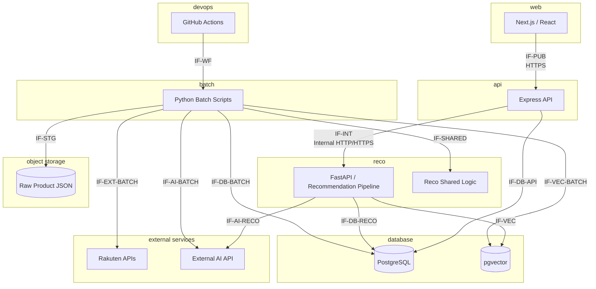

# インターフェース一覧

## 1. 概要

### 1.1 目的

本ドキュメントは、Gift Recommendation Service MVP における **システム間・コンポーネント間・外部サービス間・永続化境界のインターフェース** を一覧化する。

本ドキュメントでは、以下を明確にする。

```text
- どのコンポーネント間で連携が発生するか
- 連携方式が HTTP API / DB参照更新 / Object Storage / 外部API / Workflow / 共通モジュール呼び出し のどれか
- 呼び出し元・呼び出し先はどこか
- 受け渡す主要データは何か
- 関連するAPI / Batch / Module / Resourceは何か
- MVP対象か、後続対象か
- 後続のAPI仕様書・バッチ仕様書・モジュール別入出力定義表へどう接続するか
```

---

### 1.2 本ドキュメントの位置づけ

| 成果物                       | 本ドキュメントとの関係                                             |
| ---------------------------- | ------------------------------------------------------------------ |
| API一覧                      | HTTP API / External API / Storage連携の正本                        |
| バッチ処理一覧               | Batch Job単位の処理・入出力・先行後続の正本                        |
| バッチ依存関係図             | Batch間の実行順序・依存関係の前提                                  |
| バッチ実行スケジュール設計書 | GitHub Actions Workflow単位の実行制御前提                          |
| 処理構成定義書               | Online / Batch / 共通 / 運用の処理境界の前提                       |
| モジュール一覧               | 各コンポーネント・モジュール責務の正本                             |
| Recoモジュール一覧           | reco内部および batch → reco/shared logic の前提                    |
| 機能×モジュール対応表        | 機能と実装モジュールの対応関係の前提                               |
| 論理ER                       | インターフェースで受け渡す主要リソースの前提                       |
| ログ・Observability設計書    | trace_id / phase_log / error_log / metric の前提                   |
| エラーコード定義書           | IF失敗時のエラー分類の前提                                         |
| モジュール別入出力定義表     | Reco内部など、より細かいモジュール入出力を定義する後続成果物       |
| API仕様書                    | Public / Internal API のRequest / Response詳細を定義する後続成果物 |
| バッチ仕様書                 | Batch Job単位の詳細入出力・例外・再実行設計を定義する後続成果物    |

---

## 2. 利用したインプット成果物

本ドキュメント作成に利用した主なインプット成果物は以下。

- API一覧.md
- バッチ処理一覧.md
- バッチ依存関係図.md
- バッチ実行スケジュール設計書.md
- 処理構成定義書.md
- モジュール一覧.md
- Recoモジュール一覧.md
- 機能×モジュール対応表.md
- 論理ER.md
- リソース一覧.md
- リソース責務定義表.md
- 正本定義表.md
- 外部商品データ連携設計書.md
- 状態遷移設計書.md
- ログ・Observability設計書.md
- エラーコード定義書.md
- Feature定義書.md
- Featureルール定義書.md
- GiftMeaningSpace定義書.md
- SemanticConcept定義書.md
- Semanticルール定義書.md

---

## 3. インターフェース整理方針

### 3.1 インターフェースとして扱うもの

本ドキュメントでは、以下をインターフェースとして扱う。

| IF種別           | 対象                                                     |
| ---------------- | -------------------------------------------------------- |
| Public API IF    | web → api のHTTP API                                     |
| Internal API IF  | api → reco の内部HTTP API                                |
| External API IF  | batch / reco → 外部サービスAPI                           |
| Storage IF       | batch → Object Storage のRaw保存・読取                   |
| DB IF            | api / reco / batch → database / pgvector の参照・更新    |
| Workflow IF      | GitHub Actions → batch script の起動                     |
| 共通ロジックIF   | batch → reco/shared logic の商品意味推定ロジック呼び出し |
| Observability IF | api / reco / batch → log / metric / trace の記録         |

---

### 3.2 インターフェースとして扱わないもの

以下は本ドキュメントでは詳細化しない。

| 対象                                | 理由                                                       | 管理先                              |
| ----------------------------------- | ---------------------------------------------------------- | ----------------------------------- |
| Reco内部のFeature計算単位           | モジュール内部の入出力であり、サブシステム境界ではないため | モジュール別入出力定義表            |
| Feature Distance計算                | 同上                                                       | モジュール別入出力定義表            |
| Social / Symbolic集約               | 同上                                                       | モジュール別入出力定義表            |
| Popularity / Risk / Final Score計算 | 同上                                                       | モジュール別入出力定義表            |
| `web` 画面/UI内部の状態受け渡し | UI内部実装であり、API / Reco / Batch の実行機能モジュール境界ではないため | 画面設計書 / UIコンポーネント一覧 |
| Batch内の関数呼び出し詳細           | Job内部実装のため                                          | バッチ仕様書                        |
| DB物理カラム詳細                    | 物理設計のため                                             | テーブル定義書 / DDL                |

---

### 3.3 重要方針

| 方針                                                          | 内容                                                                                     |
| ------------------------------------------------------------- | ---------------------------------------------------------------------------------------- |
| Online処理とBatch処理を分離する                               | Online推薦中に楽天API等の外部商品APIは呼び出さない                                       |
| APIでない処理をAPI化しない                                    | GitHub Actionsで実行するPythonバッチ処理はInternal APIとして定義しない                   |
| Public APIはweb向けに閉じる                                   | score_breakdown / model_version_id / reason_basis などの内部情報は原則返却しない         |
| Internal APIはapi → recoの推薦実行に限定する                  | batch起動やItem Feature生成をHTTP APIとしては扱わない                                    |
| 外部商品データ取得はbatchが担当する                           | 楽天API、Raw保存、Staging変換、Item反映はbatch側IFとして整理する                         |
| Raw JSON本体はObject Storageへ保存する                        | DBにはRaw Metadataとobject_keyを保持する                                                 |
| RankingはSnapshotとして扱う                                   | ランキングはマスタではなく変動データであり、ranking_snapshot単位で全件反映する           |
| 商品情報はItem正本へ反映する                                  | 商品名、価格、URL、画像URL等は楽天商品検索API由来を正本取得元とする                      |
| reviewAverage / reviewCountはMVPではFeature推定要素に含めない | 表示・Snapshot用途の補助情報として扱う                                                   |
| Feature / Embeddingは入力データ更新で再生成対象になる         | 商品データ・Semantic Config Version・Model Version・入力hashを再生成判定に含める         |
| trace_idを伝播する                                            | web / api / reco / batch / external service / storage / DB更新の追跡性を確保する         |
| 状態DB更新は終端状態中心にする                                | 商品単位の中間状態を逐次DB更新せず、Batch / API / Raw / chunk / 終端状態を中心に保存する |

---

### 3.4 モジュールID併記方針

API / Reco / Batch の実行機能モジュールを参照する場合は、`MOD-API-NNN` / `MOD-RECO-NNN` / `MOD-BATCH-NNN` を併記する。`web` 画面・UI部品の内部状態受け渡しは、本ドキュメントではインターフェース対象外とし、画面設計書またはUIコンポーネント一覧で扱う。

---

## 4. インターフェース全体図



---

## 5. インターフェース分類一覧

| IF分類    | IF分類名              | 概要                                          | 呼び出し元         | 呼び出し先            | MVP対象 |
| --------- | --------------------- | --------------------------------------------- | ------------------ | --------------------- | ------- |
| IF-PUB    | Public API IF         | webからapiを呼び出す本サービス提供API         | web                | api                   | ○       |
| IF-INT    | Internal API IF       | apiからrecoを呼び出す内部API                  | api                | reco                  | ○       |
| IF-EXT    | External API IF       | 楽天API / 外部AI APIを呼び出す                | batch / reco       | external services     | ○       |
| IF-STG    | Storage IF            | Raw JSONをObject Storageへ保存・読取する      | batch              | object storage        | ○       |
| IF-DB     | Database IF           | 構造化データを参照・更新する                  | api / reco / batch | database              | ○       |
| IF-VEC    | Vector Store IF       | Item Embeddingを保存・検索する                | reco / batch       | pgvector              | ○       |
| IF-WF     | Workflow IF           | GitHub Actionsからbatchを起動する             | GitHub Actions     | batch                 | ○       |
| IF-SHARED | 共通ロジックIF        | batchから商品意味推定の共通ロジックを利用する | batch              | reco/shared logic     | ○       |
| IF-OBS    | Observability IF      | log / metric / traceを記録する                | api / reco / batch | database / monitoring | ○       |
| IF-ADMIN  | Admin / Evaluation IF | 管理画面・評価画面向け連携                    | admin / evaluator  | api / database        | 後続    |

---

## 6. インターフェース一覧

### 6.1 全体一覧

| IF ID            | IF名                              | IF分類           | 呼び出し元                | 呼び出し先                                 | 連携方式                                | 主なデータ                                                                 | MVP対象      | 管理詳細                     |
| ---------------- | --------------------------------- | ---------------- | ------------------------- | ------------------------------------------ | --------------------------------------- | -------------------------------------------------------------------------- | ------------ | ---------------------------- |
| IF-PUB-001       | APIヘルスチェック                 | Public API       | web / 運用確認            | api                                        | HTTP GET                                | health status                                                              | ○            | API仕様書                    |
| IF-PUB-002       | レコメンド実行                    | Public API       | web                       | api                                        | HTTP POST                               | recommendation request / result                                            | ○            | API仕様書                    |
| IF-PUB-003       | 商品詳細取得                      | Public API       | web                       | api                                        | HTTP GET                                | item detail                                                                | ○            | API仕様書                    |
| IF-PUB-004       | Feedback送信                      | Public API       | web                       | api                                        | HTTP POST                               | recommendation feedback                                                    | ○            | API仕様書                    |
| IF-PUB-005       | Relationshipマスタ取得            | Public API       | web                       | api                                        | HTTP GET                                | relationship master                                                        | ○            | API仕様書                    |
| IF-PUB-006       | Occasionマスタ取得                | Public API       | web                       | api                                        | HTTP GET                                | occasion master                                                            | ○            | API仕様書                    |
| IF-PUB-007       | Semantic設定取得                  | Public API       | web                       | api                                        | HTTP GET                                | semantic config                                                            | ○            | API仕様書                    |
| IF-PUB-008       | Featureルール取得                 | Public API       | web                       | api                                        | HTTP GET                                | feature rule                                                               | ○            | API仕様書                    |
| IF-INT-001       | Recoヘルスチェック                | Internal API     | api / 運用確認            | reco                                       | HTTP GET                                | reco health status                                                         | ○            | API仕様書                    |
| IF-INT-002       | Reco推薦実行                      | Internal API     | api                       | reco                                       | HTTP POST                               | normalized recommendation request / recommendation result                  | ○            | API仕様書                    |
| IF-EXT-001       | 楽天商品検索API呼び出し           | External API     | batch                     | 楽天API                                    | HTTP GET                                | item search response                                                       | ○            | バッチ仕様書                 |
| IF-EXT-002       | 楽天ランキングAPI呼び出し         | External API     | batch                     | 楽天API                                    | HTTP GET                                | ranking response                                                           | ○            | バッチ仕様書                 |
| IF-EXT-003       | 楽天ジャンルAPI呼び出し           | External API     | batch                     | 楽天API                                    | HTTP GET                                | genre response                                                             | ○            | バッチ仕様書                 |
| IF-EXT-004       | 楽天属性API呼び出し               | External API     | batch                     | 楽天API                                    | HTTP GET                                | attribute response                                                         | △            | バッチ仕様書                 |
| IF-EXT-005       | Embedding API呼び出し             | External API     | reco / batch              | 外部AI API                                 | HTTP POST                               | text / embedding vector                                                    | ○            | API仕様書 / バッチ仕様書     |
| IF-EXT-006       | LLM Semantic抽出API呼び出し       | External API     | reco / batch              | 外部AI API                                 | HTTP POST                               | text / semantic extraction result                                          | ○            | API仕様書 / バッチ仕様書     |
| IF-EXT-007       | LLM Reason生成API呼び出し         | External API     | reco                      | 外部AI API                                 | HTTP POST                               | reason prompt / generated reason                                           | △            | API仕様書                    |
| IF-STG-001       | Raw JSON保存                      | Storage IF       | batch                     | Object Storage                             | SDK / REST                              | raw product json                                                           | ○            | バッチ仕様書                 |
| IF-STG-002       | Raw JSON読取                      | Storage IF       | batch                     | Object Storage                             | SDK / REST                              | raw product json                                                           | ○            | バッチ仕様書                 |
| IF-DB-API-001    | Recommendation Request保存        | DB IF            | api                       | database                                   | SQL / Repository                        | recommendation_request                                                     | ○            | モジュール別入出力定義表     |
| IF-DB-API-002    | Feedback保存                      | DB IF            | api                       | database                                   | SQL / Repository                        | recommendation_feedback                                                    | ○            | モジュール別入出力定義表     |
| IF-DB-API-003    | Relationshipマスタ参照            | DB IF            | api                       | database                                   | SQL / Repository                        | relationship                                                               | ○            | モジュール別入出力定義表     |
| IF-DB-API-004    | Occasionマスタ参照                | DB IF            | api                       | database                                   | SQL / Repository                        | occasion                                                                   | ○            | モジュール別入出力定義表     |
| IF-DB-API-005    | Semantic設定参照                  | DB IF            | api                       | database                                   | SQL / Repository                        | semantic_config / semantic_config_version（アプリ層 JOIN）                   | ○            | モジュール別入出力定義表     |
| IF-DB-API-006    | Featureルール参照                 | DB IF            | api                       | database                                   | SQL / Repository                        | feature rule                                                               | ○            | モジュール別入出力定義表     |
| IF-DB-API-007    | 商品詳細参照                      | DB IF            | api                       | database                                   | SQL / Repository                        | item / item_image / review / popularity                                    | ○            | モジュール別入出力定義表     |
| IF-DB-RECO-001   | Config / Version参照              | DB IF            | reco                      | database                                   | SQL / Repository                        | semantic_config_version / model_version / ranking_config / reason_template | ○            | モジュール別入出力定義表     |
| IF-DB-RECO-002   | Recommendation Run保存            | DB IF            | reco                      | database                                   | SQL / Repository                        | recommendation_run                                                         | ○            | モジュール別入出力定義表     |
| IF-DB-RECO-003   | User Semantic / Feature保存       | DB IF            | reco                      | database                                   | SQL / Repository                        | user_semantic / user_feature / user_meaning                                | ○            | モジュール別入出力定義表     |
| IF-DB-RECO-004   | Pre Hard Filter用商品参照         | DB IF            | reco                      | database                                   | SQL / Repository                        | item / item_image / active_status / price                                  | ○            | モジュール別入出力定義表     |
| IF-VEC-RECO-001  | Item Embedding検索                | Vector Store IF  | reco                      | pgvector                                   | SQL / vector search                     | item_embedding                                                             | ○            | モジュール別入出力定義表     |
| IF-DB-RECO-005   | Item Feature / Semantic参照       | DB IF            | reco                      | database                                   | SQL / Repository                        | item_feature / item_semantic                                               | ○            | モジュール別入出力定義表     |
| IF-DB-RECO-006   | Popularity Signal参照             | DB IF            | reco                      | database                                   | SQL / Repository                        | item_popularity_signal / ranking_snapshot                                  | ○            | モジュール別入出力定義表     |
| IF-DB-RECO-007   | Recommendation Result保存         | DB IF            | reco                      | database                                   | SQL / Repository                        | recommendation_result / recommendation_result_item                         | ○            | モジュール別入出力定義表     |
| IF-DB-RECO-008   | Reason保存                        | DB IF            | reco                      | database                                   | SQL / Repository                        | recommendation_reason                                                      | ○            | モジュール別入出力定義表     |
| IF-DB-RECO-009   | Phase / Error Log保存             | DB IF            | reco                      | database                                   | SQL / Repository                        | phase_log / error_log                                                      | ○            | モジュール別入出力定義表     |
| IF-DB-BATCH-001  | Batch Run Log保存                 | DB IF            | batch                     | database                                   | SQL / Repository                        | batch_run_log                                                              | ○            | バッチ仕様書                 |
| IF-DB-BATCH-002  | API Call Log保存                  | DB IF            | batch                     | database                                   | SQL / Repository                        | api_call_log                                                               | ○            | バッチ仕様書                 |
| IF-DB-BATCH-003  | Fetch Cursor参照・更新            | DB IF            | batch                     | database                                   | SQL / Repository                        | fetch_cursor                                                               | ○            | バッチ仕様書                 |
| IF-DB-BATCH-004  | Raw Metadata保存                  | DB IF            | batch                     | database                                   | SQL / Repository                        | raw_product_metadata                                                       | ○            | バッチ仕様書                 |
| IF-DB-BATCH-005  | Staging保存                       | DB IF            | batch                     | database                                   | SQL / Repository                        | staging_item / staging_item_image / staging_ranking_signal / staging_genre | ○            | バッチ仕様書                 |
| IF-DB-BATCH-006  | Product Diff保存                  | DB IF            | batch                     | database                                   | SQL / Repository                        | product_diff_result                                                        | ○            | バッチ仕様書                 |
| IF-DB-BATCH-007  | Item正本反映                      | DB IF            | batch                     | database                                   | SQL / Repository                        | item / item_image / item_review_summary                                    | ○            | バッチ仕様書                 |
| IF-DB-BATCH-008  | Ranking Snapshot反映              | DB IF            | batch                     | database                                   | SQL / Repository                        | ranking_snapshot / item_popularity_signal                                  | ○            | バッチ仕様書                 |
| IF-DB-BATCH-009  | Item有効状態更新                  | DB IF            | batch                     | database                                   | SQL / Repository                        | item.active_status / is_active                                             | ○            | バッチ仕様書                 |
| IF-DB-BATCH-010  | 商品意味生成キュー登録            | DB IF            | batch                     | database                                   | SQL / Repository                        | item_generation_queue                                                      | ○            | バッチ仕様書                 |
| IF-DB-BATCH-011  | Item Semantic保存                 | DB IF            | batch                     | database                                   | SQL / Repository                        | item_semantic                                                              | ○            | バッチ仕様書                 |
| IF-DB-BATCH-012  | Feature入力hash保存               | DB IF            | batch                     | database                                   | SQL / Repository                        | feature_input_hash / item_generation_queue                                 | ○            | バッチ仕様書                 |
| IF-DB-BATCH-013  | Item Feature保存                  | DB IF            | batch                     | database                                   | SQL / Repository                        | item_feature                                                               | ○            | バッチ仕様書                 |
| IF-DB-BATCH-014  | Feature正規化結果保存             | DB IF            | batch                     | database                                   | SQL / Repository                        | item_feature.normalized_value / item_meaning                               | ○            | バッチ仕様書                 |
| IF-DB-BATCH-015  | Embedding入力hash保存             | DB IF            | batch                     | database                                   | SQL / Repository                        | embedding_input_hash / item_text_context                                   | ○            | バッチ仕様書                 |
| IF-VEC-BATCH-001 | Item Embedding保存                | Vector Store IF  | batch                     | pgvector                                   | SQL / Repository                        | item_embedding                                                             | ○            | バッチ仕様書                 |
| IF-DB-BATCH-016  | 分布メトリクス保存                | DB IF            | batch                     | database                                   | SQL / Repository                        | feature_distribution_metric / meaning_distribution_metric / normalization_distribution_metric | ○            | バッチ仕様書                 |
| IF-DB-BATCH-017  | Import Summary保存                | DB IF            | batch                     | database                                   | SQL / Repository                        | item_import_summary                                                        | ○            | バッチ仕様書                 |
| IF-DB-BATCH-018  | Evaluation保存                    | DB IF            | batch                     | database                                   | SQL / Repository                        | evaluation_run / evaluation_result / evaluation_metric                     | ○            | バッチ仕様書                 |
| IF-DB-BATCH-019  | Feedback分析結果保存              | DB IF            | batch                     | database                                   | SQL / Repository                        | feedback_analysis_result / feedback_metric                                 | △            | バッチ仕様書                 |
| IF-SHARED-001    | Item Semantic生成ロジック呼び出し | 共通ロジックIF   | batch                     | reco/shared logic                          | Python package / function call          | item data / semantic result                                                | ○            | モジュール別入出力定義表     |
| IF-SHARED-002    | Item Feature生成ロジック呼び出し  | 共通ロジックIF   | batch                     | reco/shared logic                          | Python package / function call          | item_semantic / item metadata / item_feature                               | ○            | モジュール別入出力定義表     |
| IF-SHARED-003    | Feature正規化ロジック呼び出し     | 共通ロジックIF   | batch                     | reco/shared logic                          | Python package / function call          | item_feature raw value / normalization statistics                          | ○            | モジュール別入出力定義表     |
| IF-SHARED-004    | Offline Evaluation推薦実行        | 共通ロジックIF   | batch                     | reco pipeline                              | Python package / internal execution / internal API | evaluation_case / recommendation_result / metrics                  | ○            | バッチ仕様書                 |
| IF-WF-001        | 日次Batch親Workflow起動           | Workflow IF      | GitHub Actions            | batch                                      | workflow_dispatch / schedule            | daily batch workflow inputs                                                | ○            | バッチ実行スケジュール設計書 |
| IF-WF-002        | 週次Batch親Workflow起動           | Workflow IF      | GitHub Actions            | batch                                      | workflow_dispatch / schedule            | weekly batch workflow inputs                                               | ○            | バッチ実行スケジュール設計書 |
| IF-WF-003        | 手動Batch Workflow起動            | Workflow IF      | GitHub Actions / operator | batch                                      | workflow_dispatch                       | target batch / parameters                                                  | ○            | バッチ実行スケジュール設計書 |
| IF-WF-004        | CI Workflow起動                   | Workflow IF      | GitHub                    | GitHub Actions                             | push / pull_request                     | lint / test / build                                                        | ○            | DevOps設計書                 |
| IF-OBS-001       | Phase Log記録                     | Observability IF | api / reco / batch        | database                                   | SQL / Repository                        | phase_log                                                                  | ○            | ログ・Observability設計書    |
| IF-OBS-002       | Error Log記録                     | Observability IF | api / reco / batch        | database                                   | SQL / Repository                        | error_log                                                                  | ○            | ログ・Observability設計書    |
| IF-OBS-003       | Batch Run Log記録                 | Observability IF | batch                     | database                                   | SQL / Repository                        | batch_run_log                                                              | ○            | ログ・Observability設計書    |
| IF-OBS-004       | API Call Log記録                  | Observability IF | batch                     | database                                   | SQL / Repository                        | api_call_log                                                               | ○            | ログ・Observability設計書    |
| IF-OBS-005       | Metric記録                        | Observability IF | api / reco / batch        | database / monitoring                      | SQL / Repository / metrics export       | metric log / distribution metric                                           | △            | ログ・Observability設計書    |
| IF-ADMIN-001     | 管理画面向け商品参照              | Admin IF         | admin画面                 | api / database                             | HTTP GET / SQL                          | item / feature / embedding status                                          | 後続         | 管理画面設計                 |
| IF-ADMIN-002     | 評価画面向け結果参照              | Admin IF         | admin / evaluator         | api / database                             | HTTP GET / SQL                          | evaluation_result / metrics                                                | 後続         | 評価画面設計                 |

---

## 7. Public API IF

### 7.1 Public API IF一覧

| IF ID      | API ID      | API名                  | Method | Path                                                 | 呼び出し元     | 呼び出し先 | 主なRequest                                                              | 主なResponse                                             | trace_id | MVP対象 |
| ---------- | ----------- | ---------------------- | ------ | ---------------------------------------------------- | -------------- | ---------- | ------------------------------------------------------------------------ | -------------------------------------------------------- | -------- | ------- |
| IF-PUB-001 | API-PUB-001 | APIヘルスチェック      | GET    | `/api/v1/health`                                     | web / 運用確認 | api        | なし                                                                     | API稼働状態                                              | 任意     | ○       |
| IF-PUB-002 | API-PUB-002 | レコメンド実行         | POST   | `/api/v1/recommendations`                            | web            | api        | relationship / occasion / budget / preferred / non_preferred / ng / topK | recommendation result / result items / reasons / traceId | 必須     | ○       |
| IF-PUB-003 | API-PUB-003 | 商品詳細取得           | GET    | `/api/v1/items/{itemId}`                             | web            | api        | itemId                                                                   | item detail / images / itemUrl / review summary          | 必須     | ○       |
| IF-PUB-004 | API-PUB-004 | Feedback送信           | POST   | `/api/v1/recommendation-results/{resultId}/feedback` | web            | api        | resultId / resultItemId / feedbackType / rating / comment                | feedback accepted / traceId                              | 必須     | ○       |
| IF-PUB-005 | API-PUB-005 | Relationshipマスタ取得 | GET    | `/api/v1/masters/relationships`                      | web            | api        | なし                                                                     | relationship options                                     | 任意     | ○       |
| IF-PUB-006 | API-PUB-006 | Occasionマスタ取得     | GET    | `/api/v1/masters/occasions`                          | web            | api        | なし                                                                     | occasion options                                         | 任意     | ○       |
| IF-PUB-007 | API-PUB-007 | Semantic設定取得       | GET    | `/api/v1/masters/semantic-configs`                   | web            | api        | なし                                                                     | semantic config snapshot                                 | 任意     | ○       |
| IF-PUB-008 | API-PUB-008 | Featureルール取得      | GET    | `/api/v1/masters/feature-rules`                      | web            | api        | なし                                                                     | feature rules                                            | 任意     | ○       |

---

### 7.2 Public API IF方針

| 観点         | 方針                                                                                  |
| ------------ | ------------------------------------------------------------------------------------- |
| 認証         | MVPでは認証なし                                                                       |
| 通信方式     | HTTPS                                                                                 |
| Request形式  | GETはpath/query、POSTはJSON body                                                      |
| Response形式 | JSON                                                                                  |
| エラー形式   | エラーコード定義書に従う統一形式                                                      |
| 0件結果      | レコメンド0件はエラーではなく `200 OK + empty result`                                 |
| 内部情報     | `score_breakdown`、`model_version_id`、`reason_basis` は通常Public Responseに含めない |
| trace_id     | レコメンド実行・商品詳細・Feedback送信では必須                                        |

---

## 8. Internal API IF

### 8.1 Internal API IF一覧

| IF ID      | API ID      | API名              | Method | Path                                    | 呼び出し元     | 呼び出し先 | 主なRequest                                                  | 主なResponse                                                                          | MVP対象 |
| ---------- | ----------- | ------------------ | ------ | --------------------------------------- | -------------- | ---------- | ------------------------------------------------------------ | ------------------------------------------------------------------------------------- | ------- |
| IF-INT-001 | API-INT-001 | Recoヘルスチェック | GET    | `/internal/reco/v1/health`              | api / 運用確認 | reco       | なし                                                         | reco稼働状態                                                                          | ○       |
| IF-INT-002 | API-INT-002 | Reco推薦実行       | POST   | `/internal/reco/v1/recommendations/run` | api            | reco       | recommendationRequestId / normalizedRequest / traceId / mode | recommendationRunId / recommendationResultId / resultItems / warnings / metricSummary | ○       |

---

### 8.2 Internal API IF方針

| 観点            | 方針                                                                 |
| --------------- | -------------------------------------------------------------------- |
| 用途            | apiからrecoへ推薦パイプライン実行を依頼する                          |
| 通信方式        | Internal HTTP / HTTPS                                                |
| API化対象       | api → reco の常駐サービス間通信のみ                                  |
| API化しないもの | batch起動、Item Feature生成、Item Embedding生成、Import Run作成      |
| trace_id        | apiで受け取ったtrace_idをrecoへ伝播する                              |
| mode            | `ui` / `evaluation` / `batch` を想定する                             |
| 冪等性          | `recommendation_request_id` / `recommendation_run_id` 単位で管理する |
| エラー          | reco内エラーはError Logに記録し、apiへ統一エラー形式で返却する       |

---

## 9. External API IF

### 9.1 楽天API IF一覧

| IF ID      | 連携名                    | 呼び出し元 | 呼び出し先        | Method | 主なRequest                     | 主なResponse                                         | 主な利用Batch                                       | MVP対象 |
| ---------- | ------------------------- | ---------- | ----------------- | ------ | ------------------------------- | ---------------------------------------------------- | --------------------------------------------------- | ------- |
| IF-EXT-001 | 楽天商品検索API呼び出し   | batch      | 楽天商品検索API   | GET    | keyword / genreId / page / sort | 商品名、説明、価格、商品URL、画像URL、レビュー情報等 | 楽天商品疑似差分取得Batch / 楽天既存商品再確認Batch | ○       |
| IF-EXT-002 | 楽天ランキングAPI呼び出し | batch      | 楽天ランキングAPI | GET    | genreId / period / page         | rank / itemCode / genreId / lastBuildDate            | 楽天ランキングスナップショット取得Batch             | ○       |
| IF-EXT-003 | 楽天ジャンルAPI呼び出し   | batch      | 楽天ジャンルAPI   | GET    | genreId                         | genreId / genreName / parentGenreId                  | 楽天ジャンル同期Batch                               | ○       |
| IF-EXT-004 | 楽天属性API呼び出し       | batch      | 楽天属性API       | GET    | genreId等                       | attribute information                                | 属性取得Batch                                       | △       |

---

### 9.2 外部AI API IF一覧

| IF ID      | 連携名                      | 呼び出し元   | 呼び出し先 | Method | 主なRequest                                 | 主なResponse               | 主な利用処理                             | MVP対象 |
| ---------- | --------------------------- | ------------ | ---------- | ------ | ------------------------------------------- | -------------------------- | ---------------------------------------- | ------- |
| IF-EXT-005 | Embedding API呼び出し       | reco / batch | 外部AI API | POST   | text / model / metadata                     | embedding vector           | Query Embedding生成 / Item Embedding生成 | ○       |
| IF-EXT-006 | LLM Semantic抽出API呼び出し | reco / batch | 外部AI API | POST   | text / extraction instruction / model       | semantic extraction result | User Semantic抽出 / Item Semantic抽出    | ○       |
| IF-EXT-007 | LLM Reason生成API呼び出し   | reco         | 外部AI API | POST   | result item / score context / reason prompt | reason text                | Reason生成                               | △       |

---

### 9.3 External API IF方針

| 観点                          | 方針                                                           |
| ----------------------------- | -------------------------------------------------------------- |
| 呼び出し主体                  | 楽天APIはbatch、外部AI APIはreco / batchが呼び出す             |
| Online推薦中の楽天API呼び出し | 行わない                                                       |
| レート制御                    | `MOD-BATCH-008` External API Rate Limiterで制御する                            |
| リトライ                      | timeout / rate limit / temporary error は制限付きリトライ対象  |
| ログ                          | api_call_logにrequest条件、status、件数、エラーを記録する      |
| trace_id                      | batch_run_id / api_call_log_id と合わせて追跡可能にする        |
| Raw保存                       | 楽天商品検索API等のRaw JSONはObject Storageへ保存する          |
| Rankingデータ                 | 商品正本ではなくranking_snapshot / popularity signalとして扱う |

---

## 10. Storage IF

### 10.1 Storage IF一覧

| IF ID      | IF名         | 呼び出し元 | 呼び出し先     | 方式           | 主な入力                         | 主な出力                 | 関連Batch                                                                   | MVP対象 |
| ---------- | ------------ | ---------- | -------------- | -------------- | -------------------------------- | ------------------------ | --------------------------------------------------------------------------- | ------- |
| IF-STG-001 | Raw JSON保存 | batch      | Object Storage | SDK / REST PUT | raw json / object key / metadata | object key / save result | 楽天商品疑似差分取得Batch / 楽天既存商品再確認Batch / 楽天ジャンル同期Batch | ○       |
| IF-STG-002 | Raw JSON読取 | batch      | Object Storage | SDK / REST GET | object key                       | raw json                 | Raw取込・Staging変換Batch                                                   | ○       |

---

### 10.2 Storage IF方針

| 観点         | 方針                                                                         |
| ------------ | ---------------------------------------------------------------------------- |
| Raw JSON本体 | DBではなくObject Storageへ保存する                                           |
| DB保存対象   | object_key / hash / source_api / fetched_at / import_status 等のRaw Metadata |
| 再処理       | Raw MetadataからObject StorageのRaw JSONを再読取できるようにする             |
| 冪等性       | raw_hash / object_key / source_api / external_item_code 等を利用する         |
| エラー       | 保存失敗・読取失敗はerror_logに記録する                                      |
| trace        | batch_run_id / api_call_log_id / raw_product_metadata_id で追跡する          |

---

## 11. Database IF

### 11.1 api → database IF

| IF ID         | IF名                       | 呼び出し元 | 呼び出し先 | 主な対象リソース                                                 | 操作   | 関連Public API         | MVP対象 |
| ------------- | -------------------------- | ---------- | ---------- | ---------------------------------------------------------------- | ------ | ---------------------- | ------- |
| IF-DB-API-001 | Recommendation Request保存 | api        | database   | recommendation_request                                           | INSERT | レコメンド実行         | ○       |
| IF-DB-API-002 | Feedback保存               | api        | database   | recommendation_feedback                                          | INSERT | Feedback送信           | ○       |
| IF-DB-API-003 | Relationshipマスタ参照     | api        | database   | relationship_master                                              | SELECT | Relationshipマスタ取得 | ○       |
| IF-DB-API-004 | Occasionマスタ参照         | api        | database   | occasion_master                                                  | SELECT | Occasionマスタ取得     | ○       |
| IF-DB-API-005 | Semantic設定参照           | api        | database   | semantic_config / semantic_config_version                        | SELECT | Semantic設定取得       | ○       |
| IF-DB-API-006 | Featureルール参照          | api        | database   | feature_rule / feature_rule_version                              | SELECT | Featureルール取得      | ○       |
| IF-DB-API-007 | 商品詳細参照               | api        | database   | item / item_image / item_review_summary / item_popularity_signal | SELECT | 商品詳細取得           | ○       |
| IF-DB-API-008 | APIエラーログ保存          | api        | database   | error_log                                                        | INSERT | 全Public API共通       | ○       |

**IF-DB-API-005 補足（Semantic Config 参照）:**

| 観点 | 方針 |
| ---- | ---- |
| JOIN | `semantic_config_version` と親 `semantic_config` を `semantic_config_id` でアプリ層 JOIN |
| `config_name` | 親 `semantic_config` が正本。version 表への denormalize・DB ビューは行わない |
| 現行解決 | 親 `is_active = true` → 子 `is_current = true`（API-PUB-007 マスタ GET） |
| Public 参照 | `configName` + `versionLabel` composite（`semantic_config_version_テーブル定義書` §17.1） |
| reco との分担 | reco（IF-DB-RECO-001）は version 表中心。親 JOIN は api マスタ参照に限定 |

---

### 11.2 reco → database / pgvector IF

| IF ID           | IF名                        | 呼び出し元 | 呼び出し先 | 主な対象リソース                                                           | 操作                    | MVP対象 |
| --------------- | --------------------------- | ---------- | ---------- | -------------------------------------------------------------------------- | ----------------------- | ------- |
| IF-DB-RECO-001  | Config / Version参照        | reco       | database   | semantic_config_version / model_version / ranking_config / reason_template | SELECT                  | ○       |
| IF-DB-RECO-002  | Recommendation Run保存      | reco       | database   | recommendation_run                                                         | INSERT / UPDATE終端状態 | ○       |
| IF-DB-RECO-003  | User Semantic / Feature保存 | reco       | database   | user_semantic / user_feature / user_meaning                                | INSERT                  | ○       |
| IF-DB-RECO-004  | Pre Hard Filter用商品参照   | reco       | database   | item / item_image / active_status / price                                  | SELECT                  | ○       |
| IF-VEC-RECO-001 | Item Embedding検索          | reco       | pgvector   | item_embedding                                                             | VECTOR SEARCH           | ○       |
| IF-DB-RECO-005  | Item Feature / Semantic参照 | reco       | database   | item_feature / item_semantic                                               | SELECT                  | ○       |
| IF-DB-RECO-006  | Popularity Signal参照       | reco       | database   | item_popularity_signal / ranking_snapshot                                  | SELECT                  | ○       |
| IF-DB-RECO-007  | Recommendation Result保存   | reco       | database   | recommendation_result / recommendation_result_item                         | INSERT                  | ○       |
| IF-DB-RECO-008  | Reason保存                  | reco       | database   | recommendation_reason                                                      | INSERT                  | ○       |
| IF-DB-RECO-009  | Phase / Error Log保存       | reco       | database   | phase_log / error_log                                                      | INSERT                  | ○       |

---

### 11.3 batch → database / pgvector IF

| IF ID            | IF名                   | 呼び出し元 | 呼び出し先 | 主な対象リソース                                                                              | 操作                      | MVP対象 |
| ---------------- | ---------------------- | ---------- | ---------- | --------------------------------------------------------------------------------------------- | ------------------------- | ------- |
| IF-DB-BATCH-001  | Batch Run Log保存      | batch      | database   | batch_run_log                                                                                 | INSERT / UPDATE終端状態   | ○       |
| IF-DB-BATCH-002  | API Call Log保存       | batch      | database   | api_call_log                                                                                  | INSERT / UPDATE終端状態   | ○       |
| IF-DB-BATCH-003  | Fetch Cursor参照・更新 | batch      | database   | fetch_cursor                                                                                  | SELECT / UPDATE           | ○       |
| IF-DB-BATCH-004  | Raw Metadata保存       | batch      | database   | raw_product_metadata                                                                          | INSERT                    | ○       |
| IF-DB-BATCH-005  | Staging保存            | batch      | database   | staging_item / staging_item_image / staging_ranking_signal / staging_genre                    | INSERT / UPSERT           | ○       |
| IF-DB-BATCH-006  | Product Diff保存       | batch      | database   | product_diff_result                                                                           | INSERT / UPSERT           | ○       |
| IF-DB-BATCH-007  | Item正本反映           | batch      | database   | item / item_image / item_review_summary                                                       | UPSERT                    | ○       |
| IF-DB-BATCH-008  | Ranking Snapshot反映   | batch      | database   | ranking_snapshot / item_popularity_signal                                                     | INSERT / REPLACE SNAPSHOT | ○       |
| IF-DB-BATCH-009  | Item有効状態更新       | batch      | database   | item.active_status / is_active                                                                | UPDATE終端状態            | ○       |
| IF-DB-BATCH-010  | 商品意味生成キュー登録 | batch      | database   | item_generation_queue                                                                         | INSERT / UPSERT           | ○       |
| IF-DB-BATCH-011  | Item Semantic保存      | batch      | database   | item_semantic                                                                                 | INSERT / UPSERT           | ○       |
| IF-DB-BATCH-012  | Feature入力hash保存    | batch      | database   | feature_input_hash / item_generation_queue                                                    | INSERT / UPSERT           | ○       |
| IF-DB-BATCH-013  | Item Feature保存       | batch      | database   | item_feature                                                                                  | INSERT / UPSERT           | ○       |
| IF-DB-BATCH-014  | Feature正規化結果保存  | batch      | database   | item_feature.normalized_value / item_meaning                                                  | UPDATE / UPSERT           | ○       |
| IF-DB-BATCH-015  | Embedding入力hash保存  | batch      | database   | embedding_input_hash / item_text_context                                                      | INSERT / UPSERT           | ○       |
| IF-VEC-BATCH-001 | Item Embedding保存     | batch      | pgvector   | item_embedding                                                                                | INSERT / UPSERT           | ○       |
| IF-DB-BATCH-016  | 分布メトリクス保存     | batch      | database   | feature_distribution_metric / meaning_distribution_metric / normalization_distribution_metric | INSERT                    | ○       |
| IF-DB-BATCH-017  | Import Summary保存     | batch      | database   | item_import_summary                                                                           | INSERT                    | ○       |
| IF-DB-BATCH-018  | Evaluation保存         | batch      | database   | evaluation_run / evaluation_result / evaluation_metric                                        | INSERT                    | ○       |
| IF-DB-BATCH-019  | Feedback分析結果保存   | batch      | database   | feedback_analysis_result / feedback_metric                                                    | INSERT                    | △       |

---

## 12. Workflow IF

### 12.1 Workflow IF一覧

| IF ID     | IF名                | 起動元                     | 起動先                 | 起動方式                     | 主な入力                                  | 実行対象            | MVP対象 |
| --------- | ------------------- | -------------------------- | ---------------------- | ---------------------------- | ----------------------------------------- | ------------------- | ------- |
| IF-WF-001 | 日次Batch親Workflow | GitHub Actions cron / 手動 | daily parent workflow  | schedule / workflow_dispatch | target_date / dry_run / force             | 日次系Batch         | ○       |
| IF-WF-002 | 週次Batch親Workflow | GitHub Actions cron / 手動 | weekly parent workflow | schedule / workflow_dispatch | target_week / dry_run / force             | 週次系Batch         | ○       |
| IF-WF-003 | 手動Batch Workflow  | operator                   | manual parent workflow | workflow_dispatch            | batch_name / target_ids / dry_run / force | 再実行・補正・評価  | ○       |
| IF-WF-004 | CI Workflow         | GitHub push / pull_request | CI workflow            | push / pull_request          | branch / commit sha                       | lint / test / build | ○       |

---

### 12.2 Workflow IF方針

| 観点           | 方針                                                                    |
| -------------- | ----------------------------------------------------------------------- |
| 親Workflow     | 日次系、週次系、手動系で親Workflowを分ける                              |
| 子Job順序      | 親Workflow内の `needs` により先行関係を制御する                         |
| Workflow間依存 | 原則、親Workflowを分けすぎず、同一親Workflow内で依存制御する            |
| cron時刻       | すべての子Workflowに個別cron時刻を持たせない                            |
| 深夜〜早朝実行 | 親Workflowの起動時刻を起点に、依存順序を守って実行する                  |
| 手動実行       | `workflow_dispatch` で対象Batch、dry_run、force等を指定できるようにする |
| 排他制御       | concurrency groupにより同一系統の多重起動を抑止する                     |
| 再実行         | Batch Run単位、対象日付、対象item等で再実行可能にする                   |

---

## 13. 共通ロジックIF

### 13.1 共通ロジックIF一覧

| IF ID         | IF名                              | 呼び出し元 | 呼び出し先        | 方式                                               | 主な入力                                                               | 主な出力                        | MVP対象 |
| ------------- | --------------------------------- | ---------- | ----------------- | -------------------------------------------------- | ---------------------------------------------------------------------- | ------------------------------- | ------- |
| IF-SHARED-001 | Item Semantic生成ロジック呼び出し | batch      | reco/shared logic | Python package / function call                     | item text / item metadata / semantic config version                    | item_semantic                   | ○       |
| IF-SHARED-002 | Item Feature生成ロジック呼び出し  | batch      | reco/shared logic | Python package / function call                     | item_semantic / item metadata / feature rule / semantic config version | item_feature raw value          | ○       |
| IF-SHARED-003 | Feature正規化ロジック呼び出し     | batch      | reco/shared logic | Python package / function call                     | item_feature raw value / normalization statistics                      | item_feature normalized value   | ○       |
| IF-SHARED-004 | Offline Evaluation推薦実行        | batch      | reco pipeline     | Python package / internal execution / internal API | evaluation_case / mode=evaluation                                      | recommendation_result / metrics | ○       |

---

### 13.2 共通ロジックIF方針

| 観点            | 方針                                                                                 |
| --------------- | ------------------------------------------------------------------------------------ |
| 目的            | User側とItem側で同一思想のFeature推定ロジックを維持する                              |
| 実装配置        | MVPでは共通Pythonパッケージ化を優先する                                              |
| batchからの利用 | batchは商品意味推定・Item Feature生成で共通ロジックを呼び出す                        |
| recoからの利用  | recoはUser Feature生成・Online推薦で共通ロジックを呼び出す                           |
| HTTP化          | MVPでは原則HTTP API化しない。必要になった場合のみ後続でInternal API化を検討する      |
| Version         | semantic_config_version / feature_rule_version / model_versionを明示的に入力へ含める |
| 再現性          | 生成結果には利用Versionと入力hashを紐づける                                          |

---

## 14. Observability IF

### 14.1 Observability IF一覧

| IF ID      | IF名               | 呼び出し元         | 呼び出し先            | 主な対象                         | 記録内容                                                       | MVP対象 |
| ---------- | ------------------ | ------------------ | --------------------- | -------------------------------- | -------------------------------------------------------------- | ------- |
| IF-OBS-001 | Phase Log記録      | api / reco / batch | database              | phase_log                        | phase_name / started_at / completed_at / phase_status / detail | ○       |
| IF-OBS-002 | Error Log記録      | api / reco / batch | database              | error_log                        | error_code / error_message / component / target_id / trace_id  | ○       |
| IF-OBS-003 | Batch Run Log記録  | batch              | database              | batch_run_log                    | batch_name / run_status / started_at / completed_at / counts   | ○       |
| IF-OBS-004 | API Call Log記録   | batch              | database              | api_call_log                     | source_api / request_params / status / count / error           | ○       |
| IF-OBS-005 | Metric記録         | api / reco / batch | database / monitoring | metric_log / distribution_metric | latency / count / distribution / score                         | △       |
| IF-OBS-006 | Import Summary記録 | batch              | database              | item_import_summary              | new / updated / unchanged / unavailable / failed counts        | ○       |

---

### 14.2 Observability IF方針

| 観点           | 方針                                                               |
| -------------- | ------------------------------------------------------------------ |
| trace_id       | web / api / reco / batch / external API / DB更新を横断して追跡する |
| phase_status   | 開始・終了・成功・失敗を記録する                                   |
| 状態更新       | 中間状態を逐次DB更新せず、終端状態を中心に更新する                 |
| error_log      | 例外、外部API失敗、DB失敗、AI API失敗、データ不整合を記録する      |
| metric         | MVPでは最小限。後続でメトリクス基盤へ拡張する                      |
| import summary | Batch結果を運用確認しやすい粒度で集計する                          |

---

## 15. インターフェース別エラー方針

| IF分類          | 主な失敗                                       | 主なエラーコード分類                                 | 方針                                              |
| --------------- | ---------------------------------------------- | ---------------------------------------------------- | ------------------------------------------------- |
| Public API IF   | 入力不正 / 商品なし / DB失敗 / reco失敗        | `GRS-REQ-*` / `GRS-ITM-*` / `GRS-DB-*` / `GRS-REC-*` | webへ統一エラー形式で返却                         |
| Internal API IF | reco timeout / pipeline失敗 / validation失敗   | `GRS-REC-*` / `GRS-LLM-*` / `GRS-DB-*`               | apiで受け取りPublic API形式へ変換                 |
| External API IF | timeout / rate limit / 5xx / response不正      | `GRS-EXT-*` / `GRS-BAT-*`                            | リトライ後、失敗をapi_call_log / error_logへ記録  |
| Storage IF      | 保存失敗 / 読取失敗 / hash不整合               | `GRS-RAW-*` / `GRS-BAT-*`                            | 対象Raw単位で失敗記録し、再実行可能にする         |
| DB IF           | connection error / constraint error / deadlock | `GRS-DB-*`                                           | Repository層で捕捉し、error_logへ記録             |
| Vector Store IF | embedding検索失敗 / vector保存失敗             | `GRS-DB-*` / `GRS-REC-*` / `GRS-BAT-*`               | recoまたはbatchの失敗として記録                   |
| Workflow IF     | job失敗 / timeout / secrets不足                | `GRS-BAT-*` / `GRS-COM-*`                            | GitHub Actions結果とbatch_run_logを突合可能にする |
| 共通ロジックIF  | Feature生成失敗 / Version不整合                | `GRS-CFG-*` / `GRS-BAT-*` / `GRS-REC-*`              | 対象itemまたはrun単位で失敗記録する               |

> **補足（API-INT-002 / #374）:** api→reco 経路で reco が返す Internal `GRS-AUTH-*`（401/403）は Public へ露出せず、API-PUB-002 向けには **500 + `GRS-REC-002`** に集約する。正本は `docs/06_実装設計/api/API-INT-002_Reco推薦実行API契約仕様書.md` §8.2.1。

---

## 16. インターフェース別データ契約概要

### 16.1 Recommendation Request系

| IF             | 主な入力                                                                                | 主な出力                                     | 備考                               |
| -------------- | --------------------------------------------------------------------------------------- | -------------------------------------------- | ---------------------------------- |
| IF-PUB-002     | relationship / occasion / budgetMin / budgetMax / preferred / non_preferred / ng / topK | recommendationResult                         | Public APIでは内部スコア詳細を隠蔽 |
| IF-INT-002     | normalized recommendation request / traceId / mode                                      | recommendationRunId / resultItems / warnings | api → reco の内部契約              |
| IF-DB-API-001  | validated request                                                                       | recommendation_request                       | apiが保存主体                      |
| IF-DB-RECO-002 | recommendation_request_id                                                               | recommendation_run                           | recoが保存主体                     |

---

### 16.2 Item系

| IF              | 主な入力                            | 主な出力                                         | 備考                                                                         |
| --------------- | ----------------------------------- | ------------------------------------------------ | ---------------------------------------------------------------------------- |
| IF-EXT-001      | genreId / keyword / page / sort     | item search response                             | 商品正本の主な外部取得元                                                     |
| IF-DB-BATCH-007 | staging item / diff result          | item / item_image / item_review_summary          | reviewAverage / reviewCountは表示・Snapshot用途。Feature推定要素には含めない |
| IF-DB-BATCH-008 | ranking response / ranking_snapshot | ranking_snapshot / item_popularity_signal        | ランキングはSnapshotとして全件反映                                           |
| IF-DB-RECO-004  | candidate item ids                  | item / item_image / active_status / price        | Pre Hard Filterで参照                                                         |
| IF-DB-RECO-005  | candidate item ids                  | item_feature / item_semantic                     | Matching / Reason生成で参照                                                   |
| IF-PUB-003      | itemId                              | item detail                                      | web向け商品詳細表示                                                          |

---

### 16.3 Feature / Embedding系

| IF               | 主な入力                                            | 主な出力               | 備考                                          |
| ---------------- | --------------------------------------------------- | ---------------------- | --------------------------------------------- |
| IF-SHARED-001    | item metadata / item text / semantic config version | item_semantic          | batchから共通ロジック呼び出し                 |
| IF-SHARED-002    | item_semantic / item metadata / feature rule        | item_feature raw value | Item Feature生成                              |
| IF-SHARED-003    | raw feature / normalization statistics              | normalized feature     | sigmoid系正規化                               |
| IF-DB-BATCH-012  | item data / semantic / config version               | feature_input_hash     | 商品データ更新・設定Version変更で再生成判定   |
| IF-DB-BATCH-013  | generated item_feature                              | item_feature           | generated_with versionを保持                  |
| IF-DB-BATCH-015  | item text context / model version                   | embedding_input_hash   | 商品データ更新・Model Version変更で再生成判定 |
| IF-VEC-BATCH-001 | embedding vector                                    | item_embedding         | pgvectorへ保存                                |
| IF-VEC-RECO-001  | query embedding                                     | retrieval candidates   | Online推薦時に検索                            |

---

### 16.4 Ranking Snapshot系

| IF              | 主な入力                  | 主な出力                                  | 備考                                           |
| --------------- | ------------------------- | ----------------------------------------- | ---------------------------------------------- |
| IF-EXT-002      | genreId / period / page   | ranking response                          | 楽天ランキングAPI由来                          |
| IF-DB-BATCH-008 | ranking response          | ranking_snapshot / item_popularity_signal | ranking_snapshotをヘッダ、明細をrank単位で保持 |
| IF-DB-RECO-006  | item_id / ranking context | popularity_score input                    | Online Rankingで補助シグナルとして参照         |

### 冪等性方針

| 対象                                             | 冪等キー                                                    |
| ------------------------------------------------ | ----------------------------------------------------------- |
| ranking_snapshot                                 | source + external_genre_id + period + last_build_date（`fetched_at` は運用メタのみ。§8.4.1） |
| ranking_snapshot_detail / item_popularity_signal | ranking_snapshot_id + rank                                  |
