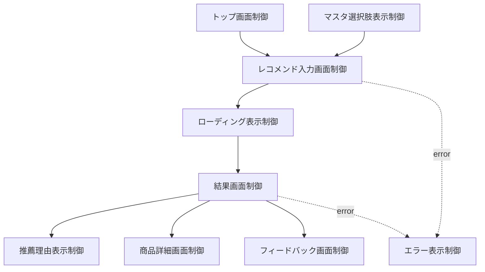
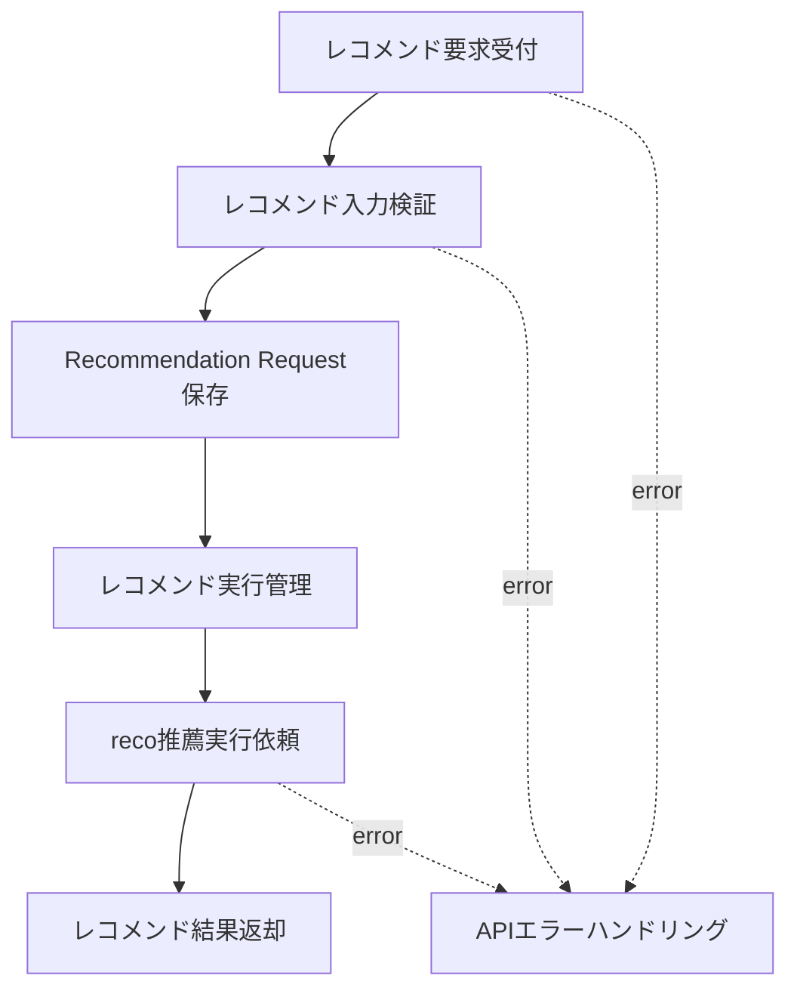
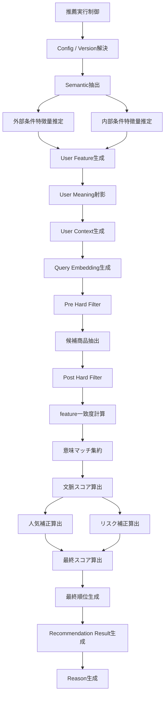
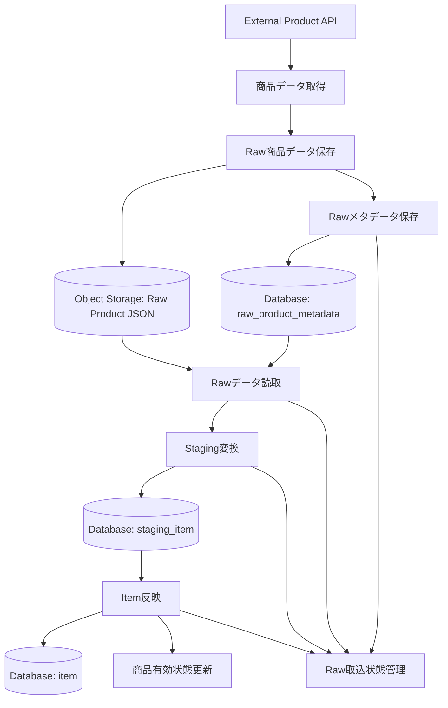
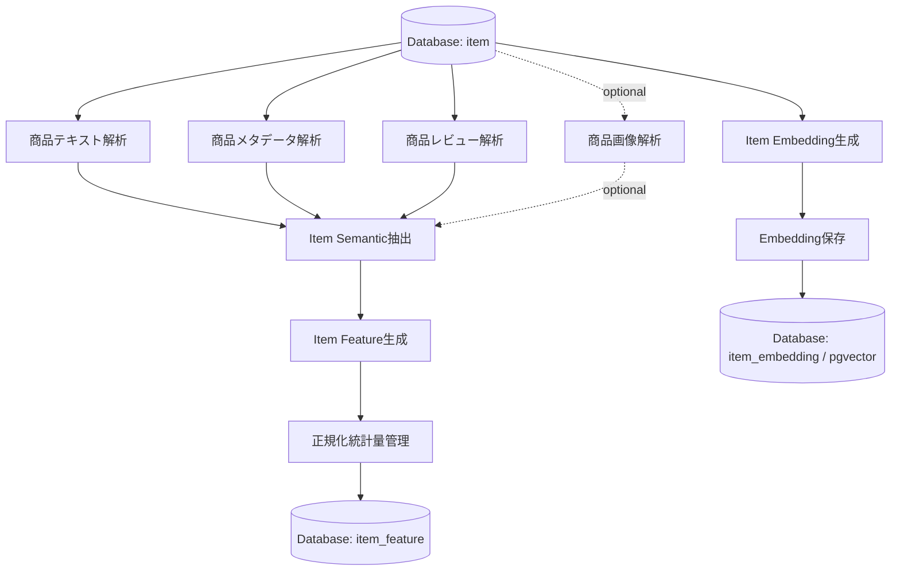
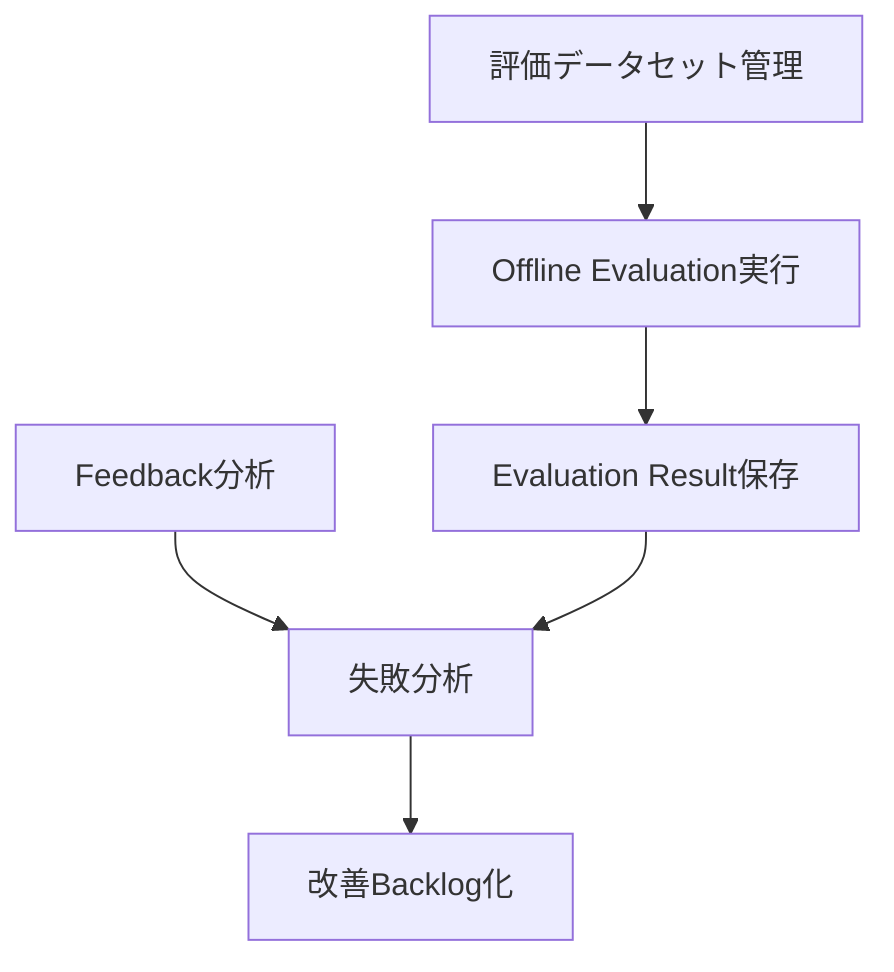
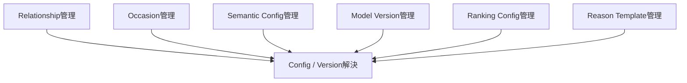

# モジュール一覧

## 1. 概要

### 1.1 目的

本ドキュメントは、Gift Recommendation Service MVPにおけるアプリケーション機能を、実装責務単位であるモジュールへ分解して定義する。

`機能一覧` では、ユーザー価値・業務処理・システム責務の観点から必要な機能を整理した。  
本ドキュメントでは、それらの機能を実装可能な単位へ分解し、各モジュールの責務・処理種別・MVP対象・後続設計への接続を明確にする。

---

### 1.2 本ドキュメントの位置づけ

| 成果物 | 本ドキュメントとの関係 |
|---|---|
| 機能一覧 | 本ドキュメントの上位インプット |
| 処理構成定義書 | Online / Batch分離、処理順序、保存タイミングの前提 |
| システム論理構成図 | web / api / reco / batch / database / object storage の責務境界の前提 |
| システム物理構成図 | 各モジュールの実行環境の前提 |
| 利用技術スタック整理表 | 各モジュールの実装技術の前提 |
| 機能×モジュール対応表 | 本ドキュメントのモジュール名を参照して機能と対応付ける |
| API一覧 | API単位へ展開する際のインプット |
| バッチ一覧 | Batch単位へ展開する際のインプット |
| インターフェース一覧 | モジュール間・外部サービス間の接続を整理するインプット |

---

## 2. 基本方針

### 2.1 モジュール分解方針

| 方針 | 内容 |
|---|---|
| 機能一覧と名称を整合させる | 機能×モジュール対応表で混乱しないよう、機能名とモジュール名の粒度を揃える |
| Online / Batchを分離する | ユーザー同期処理と事前準備処理を混在させない |
| 推薦ロジックはrecoに集約する | Semantic / Feature / Retrieval / Matching / Ranking / Reasonはreco側で扱う |
| 商品データ処理はbatchに集約する | 外部商品API取得、Raw保存、Staging変換、Item反映はbatch側で扱う |
| Raw処理を明示的に分割する | Raw JSON本体保存、Raw Metadata保存、Raw読取を個別責務として定義する |
| Hard Filterを2段階化する | Retrieval前のPre Hard Filterと、Retrieval後のPost Hard Filterを分ける |
| 設定・Versionを共通モジュール化する | Semantic / Model / Ranking / Reason Templateの変更管理を可能にする |
| MVPでは過剰分割しすぎない | 実装時は同一ファイル・同一クラス内でもよいが、責務境界は設計上明確にする |

---

### 2.2 処理種別

| 処理種別 | 内容 |
|---|---|
| OL | ユーザー操作に同期して実行されるOnline処理 |
| BT | 定期実行・手動実行されるBatch処理 |
| 共通 | OL / BTの双方から利用される処理 |
| 運用 | 開発・保守・評価・監視のための処理 |

---

### 2.3 MVP対象区分

| 区分 | 意味 |
|---|---|
| ○ | MVPで実装対象 |
| △ | MVPでは簡易実装、任意実装、または後続フェーズ優先 |
| × | MVP対象外 |

---

## 3. モジュール分類一覧

| モジュール分類 | 内容 | 主担当 |
|---|---|---|
| Web/UI | 画面表示、入力、結果表示、Feedback入力 | web |
| API / 業務制御 | API受付、Validation、DB保存、reco呼び出し | api |
| User Meaning | ユーザー入力をSemantic / Feature / Meaningへ変換 | reco |
| Retrieval | 検索対象絞り込み、候補商品抽出、候補除外 | reco |
| Matching | User FeatureとItem Featureの一致度計算 | reco |
| Ranking | 最終スコア・順位算出 | reco |
| 出力処理 | Recommendation Result / Reason生成 | reco |
| 商品データ連携 | 外部商品データ取得、Raw保存、Staging、Item反映 | batch |
| 商品モデリング | Item Semantic / Feature / Embedding生成 | batch / reco |
| 評価・改善 | Offline Evaluation、Feedback分析、失敗分析 | batch / reco |
| マスタ・設定 | Relationship / Occasion / Config / Version管理 | api / reco / database |
| ログ・観測 | Run / Phase / Error / Metric / Interaction記録 | api / reco / batch |
| DevOps / 運用 | CI、Batch実行、Issue / Branch / PR運用 | devops |

---

## 4. 全体モジュール一覧

| モジュール名 | 物理名 | モジュール分類 | 主責務 | 処理種別 | MVP対象 | 備考 |
|---|---|---|---|---|---:|---|
| トップ画面制御 | Top Page Controller | Web/UI | トップ画面、サービス導線を表示する | OL | ○ | サービス入口 |
| レコメンド入力画面制御 | Recommendation Input Controller | Web/UI | 入力画面表示、入力補助、送信制御 | OL | ○ | Recommendation Request入力 |
| マスタ選択肢表示制御 | Master Option Display Controller | Web/UI | Relationship / Occasion等の選択肢を表示する | OL | ○ | マスタ取得APIと連携 |
| 結果画面制御 | Recommendation Result Controller | Web/UI | 推薦結果一覧を表示する | OL | ○ | 商品カード表示 |
| 推薦理由表示制御 | Reason Display Controller | Web/UI | 推薦理由、バッジ、注意文を表示する | OL | ○ | Reason生成結果を表示 |
| 商品詳細画面制御 | Item Detail Controller | Web/UI | 商品詳細情報または外部EC遷移情報を表示する | OL | ○ | 商品詳細取得APIと連携 |
| フィードバック画面制御 | Feedback Form Controller | Web/UI | 商品・理由・結果へのFeedback入力を制御する | OL | ○ | Feedback登録APIと連携 |
| エラー表示制御 | Error Display Controller | Web/UI | 入力エラー、推薦失敗、0件時の表示を制御する | OL | ○ | APIエラーと連携 |
| ローディング表示制御 | Loading Display Controller | Web/UI | 推薦実行中の待機状態を表示する | OL | ○ | UX補助 |
| 履歴画面制御 | Recommendation History Controller | Web/UI | 過去の推薦結果一覧を表示する | OL | △ | 認証方針確定後 |
| 評価画面制御 | Human Evaluation Controller | Web/UI | 人手評価タスク表示・入力を制御する | OL | △ | 評価運用向け |
| 管理画面制御 | Admin Console Controller | Web/UI | 管理者向け確認画面を制御する | OL | △ | MVP初期は簡易 |
| レコメンド要求受付 | Recommendation Request Handler | API / 業務制御 | レコメンド実行APIの入口を担う | OL | ○ | `POST /recommendations` |
| レコメンド入力検証 | Recommendation Request Validator | API / 業務制御 | 入力形式、必須項目、値域、矛盾を検証する | OL | ○ | zod等で実装想定 |
| Recommendation Request保存 | Recommendation Request Writer | API / 業務制御 | 入力条件をRecommendation Requestとして保存する | OL | ○ | DB保存 |
| レコメンド実行管理 | Recommendation Run Manager | API / 業務制御 | recommendation_runを生成し、実行状態を管理する | OL | ○ | Run単位の起点 |
| reco推薦実行依頼 | Reco Execution Client | API / 業務制御 | apiからrecoへ推薦処理を依頼する | OL | ○ | 内部API呼び出し |
| レコメンド結果返却 | Recommendation Response Builder | API / 業務制御 | reco結果をweb向けレスポンスに整形する | OL | ○ | 表示用DTO生成 |
| 商品詳細取得 | Item Detail Query | API / 業務制御 | 商品詳細画面向けの商品情報を取得する | OL | ○ | item参照 |
| フィードバック受付 | Feedback Handler | API / 業務制御 | Recommendation Feedbackを登録する | OL | ○ | Feedback正本保存 |
| マスタ取得 | Master Query Handler | API / 業務制御 | Relationship / Occasion等の選択肢を返却する | OL | ○ | DBまたは設定参照 |
| APIエラーハンドリング | API Error Handler | API / 業務制御 | APIエラー形式を統一する | OL | ○ | Validation / Runtimeエラー |
| 履歴取得 | Recommendation History Query | API / 業務制御 | 過去のRecommendation Resultを取得する | OL | △ | 認証依存 |
| 評価タスク取得 | Evaluation Task Query | API / 業務制御 | 人手評価用タスクを取得する | OL | △ | 評価運用向け |
| 人手評価受付 | Human Evaluation Handler | API / 業務制御 | 人手評価結果を登録する | OL | △ | 評価運用向け |
| 管理照会受付 | Admin Query Handler | API / 業務制御 | 管理画面向けにログ・評価・改善状況を取得する | OL | △ | 管理画面向け |
| 推薦実行制御 | Recommendation Orchestrator | User Meaning | 推薦パイプライン全体を制御する | OL | ○ | recoの入口 |
| Config / Version解決 | Config Version Resolver | マスタ・設定 | 利用するSemantic / Model / Ranking設定を解決する | 共通 | ○ | 再現性確保 |
| Semantic抽出 | Semantic Extractor | User Meaning | ユーザー入力からSemantic Conceptを抽出する | OL | ○ | preferred / non_preferred対応 |
| 外部条件特徴量推定 | External Feature Estimator | User Meaning | relationship / occasionからFeatureを推定する | OL | ○ | ルールベース |
| 内部条件特徴量推定 | Internal Feature Estimator | User Meaning | preferred / non_preferred / free textからFeatureを推定する | OL | ○ | Hint辞書利用 |
| User Feature生成 | User Feature Generator | User Meaning | 外部条件・内部条件からUser Featureを生成する | OL | ○ | 8次元Feature |
| User Meaning射影 | User Meaning Projector | User Meaning | social / symbolic / λ_ctxを算出する | OL | ○ | Gift Meaning Spaceへ射影 |
| User Context生成 | User Context Builder | User Meaning | preferred / non_preferred検索コンテキストを生成する | OL | ○ | Retrieval前段 |
| Query Embedding生成 | Query Embedding Builder | User Meaning | Retrieval用の検索ベクトルを生成する | OL | ○ | 外部AI API利用 |
| Pre Hard Filter | Pre Hard Filter | Retrieval | 予算、商品有効状態、明確なNG条件でRetrieval対象を事前に絞る | OL | ○ | Retrieval前 |
| 候補商品抽出 | Candidate Retriever | Retrieval | Pre Hard Filter後の商品集合から候補商品を抽出する | OL | ○ | Embedding / Hybrid検索 |
| Post Hard Filter | Post Hard Filter | Retrieval | Retrieval後の候補からSemantic NG、重複、不整合を除外する | OL | ○ | Retrieval後 |
| feature一致度計算 | Feature-wise Matcher | Matching | User FeatureとItem FeatureをFeature単位で比較する | OL | ○ | 距離計算 |
| 意味マッチ集約 | Meaning Match Aggregator | Matching | social_match / symbolic_matchを集約する | OL | ○ | Matching集約 |
| 文脈スコア算出 | Context Score Calculator | Matching | context_scoreを算出する | OL | ○ | Ranking前段 |
| 人気補正算出 | Popularity Calculator | Ranking | popularity_scoreを算出する | OL | ○ | レビュー等利用 |
| リスク補正算出 | Risk Penalty Calculator | Ranking | risk_penaltyを算出する | OL | ○ | 安全性・NG観点 |
| 最終スコア算出 | Final Score Calculator | Ranking | final_scoreを算出する | OL | ○ | Ranking中核 |
| 最終順位生成 | Final Ranker | Ranking | 表示順位を決定する | OL | ○ | rank生成 |
| Recommendation Result生成 | Recommendation Result Builder | 出力処理 | recommendation_result / result_itemを生成する | OL | ○ | DB保存前提 |
| Reason生成 | Reason Generator | 出力処理 | reason_badges / summary / detail / points / cautionを生成する | OL | ○ | UI表示対象 |
| 商品データ取得 | Product Data Fetcher | 商品データ連携 | 外部商品APIから商品データを取得する | BT | ○ | 外部商品API連携 |
| Raw商品データ保存 | Raw Product Object Writer | 商品データ連携 | 外部APIレスポンスRaw JSON本体をObject Storageへ保存する | BT | ○ | DB容量節約 |
| Rawメタデータ保存 | Raw Product Metadata Writer | 商品データ連携 | object key、hash、取得日時、取込状態をDBへ保存する | BT | ○ | Raw参照管理 |
| Rawデータ読取 | Raw Product Reader | 商品データ連携 | Object StorageからRaw JSON本体を読み取る | BT | ○ | Staging変換前段 |
| Staging変換 | Staging Transformer | 商品データ連携 | Raw JSONを内部取込形式へ変換する | BT | ○ | 外部形式吸収 |
| Item反映 | Item Updater | 商品データ連携 | stagingデータをitem正本へ反映する | BT | ○ | item upsert |
| 商品有効状態更新 | Item Availability Updater | 商品データ連携 | 商品の有効・無効状態を更新する | BT | ○ | Online推薦対象制御 |
| Raw取込状態管理 | Raw Import Status Manager | 商品データ連携 | Raw保存、Staging変換、Item反映の状態を管理する | BT | ○ | 冪等性・再実行管理 |
| 商品テキスト解析 | Item Text Analyzer | 商品モデリング | 商品名、キャッチコピー、説明文からsignalを抽出する | BT | ○ | Item Semantic前段 |
| 商品メタデータ解析 | Item Metadata Analyzer | 商品モデリング | ジャンル、タグ、価格帯等からsignalを抽出する | BT | ○ | Item Semantic前段 |
| 商品レビュー解析 | Item Review Analyzer | 商品モデリング | レビュー評価・件数・コメントからsignalを抽出する | BT | ○ | MVPで利用可 |
| 商品画像解析 | Item Image Analyzer | 商品モデリング | 商品画像からsignalを抽出する | BT | △ | 後続拡張 |
| Item Semantic抽出 | Item Semantic Extractor | 商品モデリング | 商品情報からSemantic Conceptを抽出する | BT | ○ | 商品意味推定 |
| Item Feature生成 | Item Feature Generator | 商品モデリング | item_semantic等からItem Featureを生成する | BT | ○ | 8次元Feature |
| 正規化統計量管理 | Feature Normalization Stats Manager | 商品モデリング | sigmoid正規化に必要な統計量・Versionを管理する | BT | △ | 初期は簡易可 |
| Item Embedding生成 | Item Embedding Builder | 商品モデリング | item text contextからEmbeddingを生成する | BT | ○ | Retrieval前提 |
| Embedding保存 | Item Embedding Writer | 商品モデリング | item_embeddingをpgvectorへ保存する | BT | ○ | Vector検索用 |
| Offline Evaluation実行 | Offline Evaluation Runner | 評価・改善 | 評価データセットに対して推薦処理を実行する | BT | △ | 初期は簡易評価 |
| Evaluation Result保存 | Evaluation Result Writer | 評価・改善 | 評価結果・評価指標を保存する | BT | △ | evaluation_result |
| 評価データセット管理 | Evaluation Dataset Manager | 評価・改善 | 評価用データセットを管理する | BT | △ | 評価運用向け |
| Feedback分析 | Feedback Analyzer | 評価・改善 | ユーザーFeedbackを集計・分析する | BT / 運用 | △ | 手動分析から開始可 |
| 失敗分析 | Failure Analyzer | 評価・改善 | Retrieval / Matching / Ranking / Reasonの失敗原因を分類する | BT / 運用 | △ | 改善材料 |
| 改善Backlog化 | Improvement Backlog Creator | 評価・改善 | 分析結果をGitHub Issue等へ接続する | 運用 | △ | 人手確認前提 |
| Relationship管理 | Relationship Master Manager | マスタ・設定 | Relationshipカテゴリを管理する | 共通 | ○ | 入力・Feature生成で利用 |
| Occasion管理 | Occasion Master Manager | マスタ・設定 | Occasionカテゴリを管理する | 共通 | ○ | 入力・Feature生成で利用 |
| Semantic Config管理 | Semantic Config Manager | マスタ・設定 | Semantic / Feature / Rule設定を管理する | 共通 | ○ | semantic_config_version |
| Model Version管理 | Model Version Manager | マスタ・設定 | LLM / Embedding / Reason生成モデルVersionを管理する | 共通 | ○ | model_version |
| Ranking Config管理 | Ranking Config Manager | マスタ・設定 | Ranking計算パラメータを管理する | 共通 | △ | 初期は固定値可 |
| Reason Template管理 | Reason Template Manager | マスタ・設定 | Reason生成テンプレートを管理する | 共通 | △ | 初期は少数テンプレート |
| Recommendation Run記録 | Recommendation Run Logger | ログ・観測 | 推薦実行単位を記録する | OL | ○ | recommendation_run |
| Phase Log記録 | Phase Log Writer | ログ・観測 | 処理段階別の開始・終了・成功・失敗を記録する | 共通 | ○ | api / reco / batch共通 |
| Error Log記録 | Error Log Writer | ログ・観測 | エラー内容、対象処理、原因を記録する | 共通 | ○ | 例外調査用 |
| User Interaction記録 | User Interaction Logger | ログ・観測 | view / click / feedback等の行動を記録する | OL | △ | 初期はFeedback中心可 |
| Metric記録 | Metric Logger | ログ・観測 | 実行時間、件数、スコア分布等を記録する | 共通 | △ | MVP初期は最小限 |
| Batch実行ログ記録 | Batch Execution Logger | ログ・観測 | Batch開始・終了・失敗を記録する | BT | ○ | Batch運用前提 |
| CI実行 | CI Pipeline Runner | DevOps / 運用 | lint / test / buildを実行する | 運用 | ○ | GitHub Actions |
| Batch手動実行 | Manual Batch Runner | DevOps / 運用 | workflow_dispatchでBatchを手動実行する | 運用 | ○ | 初期運用で重要 |
| Batch定期実行 | Scheduled Batch Runner | DevOps / 運用 | cronでBatchを定期実行する | 運用 | ○ | 商品データ更新 |
| Issue / Branch / PR運用 | GitHub Workflow Automation | DevOps / 運用 | Issue、Label、Branch、PRを連携する | 運用 | ○ | 自動化対象 |
| 監視 / 観測確認 | Observability Viewer | DevOps / 運用 | DBログ、Hostingログ、Metricを確認する | 運用 | △ | MVPは簡易 |

---

## 5. Web/UIモジュール

### 5.1 Web/UIモジュール一覧

| モジュール名 | 主責務 | 処理種別 | MVP対象 |
|---|---|---|---:|
| トップ画面制御 | サービス入口と導線を表示する | OL | ○ |
| レコメンド入力画面制御 | 入力画面、入力補助、送信制御を行う | OL | ○ |
| マスタ選択肢表示制御 | Relationship / Occasion等の選択肢を表示する | OL | ○ |
| 結果画面制御 | 推薦結果一覧を表示する | OL | ○ |
| 推薦理由表示制御 | 推薦理由を表示する | OL | ○ |
| 商品詳細画面制御 | 商品詳細または外部EC遷移情報を表示する | OL | ○ |
| フィードバック画面制御 | Feedback入力を制御する | OL | ○ |
| エラー表示制御 | エラー、0件、条件不足を表示する | OL | ○ |
| ローディング表示制御 | 推薦実行中の待機状態を表示する | OL | ○ |
| 履歴画面制御 | 過去推薦結果を表示する | OL | △ |
| 評価画面制御 | 人手評価用画面を制御する | OL | △ |
| 管理画面制御 | 管理者向け画面を制御する | OL | △ |

---

### 5.2 Web/UIモジュール構成



---

## 6. API / 業務制御モジュール

### 6.1 API / 業務制御モジュール一覧

| モジュール名 | 主責務 | 処理種別 | MVP対象 |
|---|---|---|---:|
| レコメンド要求受付 | レコメンド実行APIの入口 | OL | ○ |
| レコメンド入力検証 | 入力値のValidation | OL | ○ |
| Recommendation Request保存 | Request正本の保存 | OL | ○ |
| レコメンド実行管理 | Run生成・実行状態管理 | OL | ○ |
| reco推薦実行依頼 | reco内部API呼び出し | OL | ○ |
| レコメンド結果返却 | web向けレスポンス整形 | OL | ○ |
| 商品詳細取得 | 商品詳細情報取得 | OL | ○ |
| フィードバック受付 | Feedback登録 | OL | ○ |
| マスタ取得 | Relationship / Occasion等の取得 | OL | ○ |
| APIエラーハンドリング | APIエラー形式統一 | OL | ○ |
| 履歴取得 | 過去結果取得 | OL | △ |
| 評価タスク取得 | 人手評価タスク取得 | OL | △ |
| 人手評価受付 | 人手評価登録 | OL | △ |
| 管理照会受付 | 管理画面向け照会 | OL | △ |

---

### 6.2 レコメンド実行API内のモジュール関係



---

## 7. 推薦パイプラインモジュール

### 7.1 推薦パイプラインモジュール一覧

| モジュール名 | 主責務 | 処理種別 | MVP対象 |
|---|---|---|---:|
| 推薦実行制御 | 推薦パイプライン全体の制御 | OL | ○ |
| Config / Version解決 | 利用設定・Versionの決定 | 共通 | ○ |
| Semantic抽出 | ユーザー入力から意味概念を抽出 | OL | ○ |
| 外部条件特徴量推定 | relationship / occasionからFeature推定 | OL | ○ |
| 内部条件特徴量推定 | preferred / non_preferred等からFeature推定 | OL | ○ |
| User Feature生成 | User Featureを生成 | OL | ○ |
| User Meaning射影 | social / symbolic / λ_ctxを算出 | OL | ○ |
| User Context生成 | 検索用contextを生成 | OL | ○ |
| Query Embedding生成 | query embeddingを生成 | OL | ○ |
| Pre Hard Filter | Retrieval前に商品集合を絞り込む | OL | ○ |
| 候補商品抽出 | 候補商品を抽出する | OL | ○ |
| Post Hard Filter | Retrieval後に最終除外を行う | OL | ○ |
| feature一致度計算 | Feature単位で一致度を計算 | OL | ○ |
| 意味マッチ集約 | social / symbolic一致度を集約 | OL | ○ |
| 文脈スコア算出 | context_scoreを算出 | OL | ○ |
| 人気補正算出 | popularity_scoreを算出 | OL | ○ |
| リスク補正算出 | risk_penaltyを算出 | OL | ○ |
| 最終スコア算出 | final_scoreを算出 | OL | ○ |
| 最終順位生成 | rankを決定 | OL | ○ |
| Recommendation Result生成 | Result / Result Itemを生成 | OL | ○ |
| Reason生成 | 推薦理由を生成 | OL | ○ |

---

### 7.2 推薦パイプラインモジュール構成



---

## 8. 商品データ連携モジュール

### 8.1 商品データ連携モジュール一覧

| モジュール名 | 主責務 | 処理種別 | MVP対象 |
|---|---|---|---:|
| 商品データ取得 | 外部商品APIから商品データを取得する | BT | ○ |
| Raw商品データ保存 | Raw JSON本体をObject Storageへ保存する | BT | ○ |
| Rawメタデータ保存 | Raw参照情報・hash・状態をDBへ保存する | BT | ○ |
| Rawデータ読取 | Object StorageからRaw JSONを読み取る | BT | ○ |
| Staging変換 | Raw JSONを内部取込形式へ変換する | BT | ○ |
| Item反映 | stagingからitem正本へ反映する | BT | ○ |
| 商品有効状態更新 | 商品の有効・無効状態を更新する | BT | ○ |
| Raw取込状態管理 | Raw取込ステータスと再実行状態を管理する | BT | ○ |

---

### 8.2 商品データ連携モジュール構成



---

### 8.3 旧モジュール名からの変更

| 旧モジュール名 | 新モジュール名 | 変更理由 |
|---|---|---|
| 商品データ収集 | 商品データ取得 | 機能一覧の名称に合わせる |
| 商品データ収集 | Raw商品データ保存 | Raw JSON本体保存責務を明確化 |
| 商品データ収集 | Rawメタデータ保存 | DBに保存するRaw Metadata責務を明確化 |
| 商品データ収集 | Rawデータ読取 | Object Storage読取責務を明確化 |
| 商品データ収集 | Staging変換 | 外部形式から内部形式への変換責務を明確化 |
| 商品データ収集 | Item反映 | item正本への反映責務を明確化 |

---

## 9. 商品モデリングモジュール

### 9.1 商品モデリングモジュール一覧

| モジュール名 | 主責務 | 処理種別 | MVP対象 |
|---|---|---|---:|
| 商品テキスト解析 | 商品名、キャッチコピー、説明文からsignal抽出 | BT | ○ |
| 商品メタデータ解析 | ジャンル、タグ、価格帯等からsignal抽出 | BT | ○ |
| 商品レビュー解析 | レビュー情報からsignal抽出 | BT | ○ |
| 商品画像解析 | 商品画像からsignal抽出 | BT | △ |
| Item Semantic抽出 | 商品情報からSemantic Conceptを抽出 | BT | ○ |
| Item Feature生成 | item_semantic等からItem Featureを生成 | BT | ○ |
| 正規化統計量管理 | sigmoid正規化用の統計量・Versionを管理 | BT | △ |
| Item Embedding生成 | 商品検索用Embeddingを生成 | BT | ○ |
| Embedding保存 | item_embeddingをpgvectorへ保存 | BT | ○ |

---

### 9.2 商品モデリングモジュール構成



---

## 10. 評価・改善モジュール

### 10.1 評価・改善モジュール一覧

| モジュール名 | 主責務 | 処理種別 | MVP対象 |
|---|---|---|---:|
| Offline Evaluation実行 | 評価データセットに対して推薦処理を実行する | BT | △ |
| Evaluation Result保存 | 評価結果・評価指標を保存する | BT | △ |
| 評価データセット管理 | 評価用データセットを管理する | BT | △ |
| Feedback分析 | Feedbackを集計・分析する | BT / 運用 | △ |
| 失敗分析 | 推薦失敗原因を分類する | BT / 運用 | △ |
| 改善Backlog化 | 改善候補をGitHub Issue等へ接続する | 運用 | △ |

---

### 10.2 評価・改善モジュール構成



---

## 11. マスタ・設定モジュール

### 11.1 マスタ・設定モジュール一覧

| モジュール名 | 主責務 | 処理種別 | MVP対象 |
|---|---|---|---:|
| Relationship管理 | 関係性カテゴリを管理する | 共通 | ○ |
| Occasion管理 | 贈答用途カテゴリを管理する | 共通 | ○ |
| Semantic Config管理 | Semantic / Feature / Rule設定を管理する | 共通 | ○ |
| Model Version管理 | LLM / Embedding / Reason生成モデルVersionを管理する | 共通 | ○ |
| Ranking Config管理 | Ranking計算パラメータを管理する | 共通 | △ |
| Reason Template管理 | Reason生成テンプレートを管理する | 共通 | △ |
| Config / Version解決 | 実行時に利用する設定・Versionを解決する | 共通 | ○ |

---

### 11.2 マスタ・設定モジュール構成



---

## 12. ログ・観測モジュール

### 12.1 ログ・観測モジュール一覧

| モジュール名 | 主責務 | 処理種別 | MVP対象 |
|---|---|---|---:|
| Recommendation Run記録 | 推薦実行単位を記録する | OL | ○ |
| Phase Log記録 | 処理段階別の開始・終了・成功・失敗を記録する | 共通 | ○ |
| Error Log記録 | エラー内容・発生箇所・対象データを記録する | 共通 | ○ |
| User Interaction記録 | view / click / feedback等の行動を記録する | OL | △ |
| Metric記録 | 実行時間、件数、スコア分布等を記録する | 共通 | △ |
| Batch実行ログ記録 | Batch開始・終了・失敗を記録する | BT | ○ |
| Raw取込状態管理 | Raw取込の状態を記録・管理する | BT | ○ |

---

### 12.2 ログ記録ポイント

| 処理系統 | 主なログモジュール |
|---|---|
| Online推薦 | Recommendation Run記録 / Phase Log記録 / Error Log記録 / Metric記録 |
| Feedback登録 | User Interaction記録 / Phase Log記録 / Error Log記録 |
| 商品データ連携 | Batch実行ログ記録 / Raw取込状態管理 / Phase Log記録 / Error Log記録 |
| 商品モデリング | Batch実行ログ記録 / Phase Log記録 / Error Log記録 / Metric記録 |
| Evaluation | Batch実行ログ記録 / Phase Log記録 / Error Log記録 / Metric記録 |

---

## 13. DevOps / 運用モジュール

### 13.1 DevOps / 運用モジュール一覧

| モジュール名 | 主責務 | 処理種別 | MVP対象 |
|---|---|---|---:|
| CI実行 | lint / test / buildを実行する | 運用 | ○ |
| Batch手動実行 | GitHub ActionsでBatchを手動実行する | 運用 | ○ |
| Batch定期実行 | GitHub Actions cronでBatchを定期実行する | 運用 | ○ |
| Issue / Branch / PR運用 | GitHub Projects / Issue / Branch / PRを連携する | 運用 | ○ |
| 監視 / 観測確認 | DBログ、Hostingログ、Metricを確認する | 運用 | △ |
| 改善Backlog化 | 分析結果を改善Issueへ接続する | 運用 | △ |

---

## 14. コンポーネント別モジュール整理

### 14.1 web

| モジュール名 | MVP対象 |
|---|---:|
| トップ画面制御 | ○ |
| レコメンド入力画面制御 | ○ |
| マスタ選択肢表示制御 | ○ |
| 結果画面制御 | ○ |
| 推薦理由表示制御 | ○ |
| 商品詳細画面制御 | ○ |
| フィードバック画面制御 | ○ |
| エラー表示制御 | ○ |
| ローディング表示制御 | ○ |
| 履歴画面制御 | △ |
| 評価画面制御 | △ |
| 管理画面制御 | △ |

---

### 14.2 api

| モジュール名 | MVP対象 |
|---|---:|
| レコメンド要求受付 | ○ |
| レコメンド入力検証 | ○ |
| Recommendation Request保存 | ○ |
| レコメンド実行管理 | ○ |
| reco推薦実行依頼 | ○ |
| レコメンド結果返却 | ○ |
| 商品詳細取得 | ○ |
| フィードバック受付 | ○ |
| マスタ取得 | ○ |
| APIエラーハンドリング | ○ |
| 履歴取得 | △ |
| 評価タスク取得 | △ |
| 人手評価受付 | △ |
| 管理照会受付 | △ |

---

### 14.3 reco

| モジュール名 | MVP対象 |
|---|---:|
| 推薦実行制御 | ○ |
| Config / Version解決 | ○ |
| Semantic抽出 | ○ |
| 外部条件特徴量推定 | ○ |
| 内部条件特徴量推定 | ○ |
| User Feature生成 | ○ |
| User Meaning射影 | ○ |
| User Context生成 | ○ |
| Query Embedding生成 | ○ |
| Pre Hard Filter | ○ |
| 候補商品抽出 | ○ |
| Post Hard Filter | ○ |
| feature一致度計算 | ○ |
| 意味マッチ集約 | ○ |
| 文脈スコア算出 | ○ |
| 人気補正算出 | ○ |
| リスク補正算出 | ○ |
| 最終スコア算出 | ○ |
| 最終順位生成 | ○ |
| Recommendation Result生成 | ○ |
| Reason生成 | ○ |

---

### 14.4 batch

| モジュール名 | MVP対象 |
|---|---:|
| 商品データ取得 | ○ |
| Raw商品データ保存 | ○ |
| Rawメタデータ保存 | ○ |
| Rawデータ読取 | ○ |
| Staging変換 | ○ |
| Item反映 | ○ |
| 商品有効状態更新 | ○ |
| Raw取込状態管理 | ○ |
| 商品テキスト解析 | ○ |
| 商品メタデータ解析 | ○ |
| 商品レビュー解析 | ○ |
| 商品画像解析 | △ |
| Item Semantic抽出 | ○ |
| Item Feature生成 | ○ |
| 正規化統計量管理 | △ |
| Item Embedding生成 | ○ |
| Embedding保存 | ○ |
| Offline Evaluation実行 | △ |
| Evaluation Result保存 | △ |
| 評価データセット管理 | △ |
| Feedback分析 | △ |
| 失敗分析 | △ |
| Batch実行ログ記録 | ○ |

---

### 14.5 database / object storage

| モジュール名 | 主な保存・参照対象 |
|---|---|
| Recommendation Request保存 | recommendation_request |
| レコメンド実行管理 | recommendation_run |
| Recommendation Result生成 | recommendation_result / recommendation_result_item |
| Reason生成 | recommendation_reason |
| フィードバック受付 | recommendation_feedback |
| Raw商品データ保存 | object storage: raw_product_json |
| Rawメタデータ保存 | raw_product_metadata |
| Rawデータ読取 | object storage: raw_product_json |
| Staging変換 | staging_item |
| Item反映 | item |
| Item Semantic抽出 | item_semantic |
| Item Feature生成 | item_feature |
| 正規化統計量管理 | feature_normalization_stats |
| Embedding保存 | item_embedding / pgvector |
| Evaluation Result保存 | evaluation_result |
| Phase Log記録 | phase_log |
| Error Log記録 | error_log |
| Batch実行ログ記録 | batch_execution_log |

---

### 14.6 devops

| モジュール名 | MVP対象 |
|---|---:|
| CI実行 | ○ |
| Batch手動実行 | ○ |
| Batch定期実行 | ○ |
| Issue / Branch / PR運用 | ○ |
| 監視 / 観測確認 | △ |
| 改善Backlog化 | △ |

---

## 15. MVP対象モジュール整理

### 15.1 MVP必須モジュール

| 分類 | モジュール |
|---|---|
| Web/UI | トップ画面制御、レコメンド入力画面制御、マスタ選択肢表示制御、結果画面制御、推薦理由表示制御、商品詳細画面制御、フィードバック画面制御、エラー表示制御、ローディング表示制御 |
| API / 業務制御 | レコメンド要求受付、レコメンド入力検証、Recommendation Request保存、レコメンド実行管理、reco推薦実行依頼、レコメンド結果返却、商品詳細取得、フィードバック受付、マスタ取得、APIエラーハンドリング |
| User Meaning | 推薦実行制御、Config / Version解決、Semantic抽出、外部条件特徴量推定、内部条件特徴量推定、User Feature生成、User Meaning射影、User Context生成、Query Embedding生成 |
| Retrieval | Pre Hard Filter、候補商品抽出、Post Hard Filter |
| Matching | feature一致度計算、意味マッチ集約、文脈スコア算出 |
| Ranking | 人気補正算出、リスク補正算出、最終スコア算出、最終順位生成 |
| 出力処理 | Recommendation Result生成、Reason生成 |
| 商品データ連携 | 商品データ取得、Raw商品データ保存、Rawメタデータ保存、Rawデータ読取、Staging変換、Item反映、商品有効状態更新、Raw取込状態管理 |
| 商品モデリング | 商品テキスト解析、商品メタデータ解析、商品レビュー解析、Item Semantic抽出、Item Feature生成、Item Embedding生成、Embedding保存 |
| マスタ・設定 | Relationship管理、Occasion管理、Semantic Config管理、Model Version管理 |
| ログ・観測 | Recommendation Run記録、Phase Log記録、Error Log記録、Batch実行ログ記録 |
| DevOps / 運用 | CI実行、Batch手動実行、Batch定期実行、Issue / Branch / PR運用 |

---

### 15.2 MVPでは簡易・後続扱いのモジュール

| 分類 | モジュール | 方針 |
|---|---|---|
| Web/UI | 履歴画面制御 | 認証方針確定後に検討 |
| Web/UI | 評価画面制御 | 評価運用が必要になった段階で実装 |
| Web/UI | 管理画面制御 | 初期はDB・ログ確認で代替 |
| API / 業務制御 | 履歴取得 | 履歴画面と合わせて後続検討 |
| API / 業務制御 | 評価タスク取得 | 人手評価運用と合わせて後続検討 |
| API / 業務制御 | 人手評価受付 | 人手評価運用と合わせて後続検討 |
| API / 業務制御 | 管理照会受付 | 管理画面と合わせて後続検討 |
| 商品モデリング | 商品画像解析 | MVP初期は商品テキスト・メタデータ・レビューを優先 |
| 商品モデリング | 正規化統計量管理 | 初期は簡易統計量・固定設定でも可 |
| 評価・改善 | Offline Evaluation実行 | 簡易評価から開始 |
| 評価・改善 | Evaluation Result保存 | 評価設計の粒度に合わせて実装 |
| 評価・改善 | 評価データセット管理 | 初期は手動管理でも可 |
| 評価・改善 | Feedback分析 | 初期は手動分析でも可 |
| 評価・改善 | 失敗分析 | 初期はログ・Feedbackから手動分析でも可 |
| 評価・改善 | 改善Backlog化 | GitHub Issue運用へ接続 |
| マスタ・設定 | Ranking Config管理 | 初期は固定値または設定ファイルでも可 |
| マスタ・設定 | Reason Template管理 | 初期はYAML / JSON管理でも可 |
| ログ・観測 | User Interaction記録 | 初期はFeedback中心でも可 |
| ログ・観測 | Metric記録 | 初期は必要最低限から開始 |
| DevOps / 運用 | 監視 / 観測確認 | Hostingログ・DBログ中心で開始 |

---

## 16. 対象外・後続候補モジュール

以下はMVP初期では対象外または後続フェーズで検討する。

| モジュール名 | 理由 |
|---|---|
| 認証受付 | MVP初期では会員管理を必須にしないため |
| セッション管理 | 認証方針確定後に検討するため |
| 認可制御 | 管理者・評価者ロールが必要になった段階で検討するため |
| 決済処理 | MVPは推薦価値検証に集中するため |
| 配送管理 | 外部EC遷移前提のため |
| 高度BIダッシュボード | MVP初期では過剰なため |
| AutoML / 自動重み最適化 | 初期は評価・手動改善中心とするため |

---

## 17. 後続成果物への引き継ぎ

### 17.1 機能×モジュール対応表への引き継ぎ

`機能×モジュール対応表` では、本ドキュメントに定義されたモジュール名のみを `主モジュール` または `関連モジュール` に記載する。

| ルール | 内容 |
|---|---|
| 機能名 | 機能一覧.mdの名称を使用する |
| 主モジュール | 本ドキュメントのモジュール名を使用する |
| 関連モジュール | 本ドキュメントのモジュール名を使用する |
| 未定義モジュール | 勝手に主モジュールへ記載せず、まず本ドキュメントへ追加する |

---

### 17.2 API一覧への引き継ぎ

| API対象 | 主な関連モジュール |
|---|---|
| レコメンド実行API | レコメンド要求受付、レコメンド入力検証、Recommendation Request保存、レコメンド実行管理、reco推薦実行依頼、レコメンド結果返却 |
| 商品詳細取得API | 商品詳細取得 |
| Feedback登録API | フィードバック受付 |
| マスタ取得API | マスタ取得、Relationship管理、Occasion管理 |
| 履歴取得API | 履歴取得 |
| 評価系API | 評価タスク取得、人手評価受付 |
| 管理系API | 管理照会受付 |

---

### 17.3 バッチ一覧への引き継ぎ

| Batch対象 | 主な関連モジュール |
|---|---|
| 商品データ取得Batch | 商品データ取得、Raw商品データ保存、Rawメタデータ保存 |
| Raw取込Batch | Rawデータ読取、Staging変換、Raw取込状態管理 |
| Item反映Batch | Item反映、商品有効状態更新 |
| Item Semantic生成Batch | 商品テキスト解析、商品メタデータ解析、商品レビュー解析、Item Semantic抽出 |
| Item Feature生成Batch | Item Feature生成、正規化統計量管理 |
| Item Embedding生成Batch | Item Embedding生成、Embedding保存 |
| Offline Evaluation Batch | Offline Evaluation実行、Evaluation Result保存 |
| Feedback分析Batch | Feedback分析、失敗分析 |

---

### 17.4 インターフェース一覧への引き継ぎ

| 接続 | 関連モジュール |
|---|---|
| web → api | レコメンド入力画面制御、結果画面制御、フィードバック画面制御、レコメンド要求受付、フィードバック受付 |
| api → reco | reco推薦実行依頼、推薦実行制御 |
| reco → database | Pre Hard Filter、候補商品抽出、Matching、Ranking、Recommendation Result生成、Reason生成 |
| batch → external product api | 商品データ取得 |
| batch → object storage | Raw商品データ保存、Rawデータ読取 |
| batch → database | Rawメタデータ保存、Staging変換、Item反映、Item Feature生成、Embedding保存 |
| reco / batch → external ai api | Semantic抽出、Query Embedding生成、Reason生成、Item Embedding生成 |
| GitHub Actions → batch | Batch手動実行、Batch定期実行 |

---

## 18. レビュー観点

| 観点 | 確認内容 |
|---|---|
| 機能一覧との整合 | 機能一覧に存在する主要機能がモジュール化されているか |
| 名称整合 | 機能×モジュール対応表で参照できるモジュール名になっているか |
| Online / Batch分離 | Online処理とBatch処理が混在していないか |
| Raw処理分割 | Raw商品データ保存、Rawメタデータ保存、Rawデータ読取が分離されているか |
| Hard Filter分割 | Pre Hard FilterとPost Hard Filterが分離されているか |
| 推薦パイプライン順序 | Semantic → Feature → Retrieval → Matching → Ranking → Result → Reasonの依存関係が自然か |
| 商品意味推定 | Item Semantic / Feature / Embedding生成が明確か |
| 評価改善 | Feedback分析、失敗分析、改善Backlog化への接続があるか |
| ログ | Run / Phase / Error / Batch実行ログが定義されているか |
| 後続設計接続 | API一覧、バッチ一覧、インターフェース一覧へ展開できるか |

---

## 19. まとめ

本モジュール一覧では、Gift Recommendation Service MVPの実装責務を以下の単位へ分解した。

```text
Web/UI
API / 業務制御
User Meaning
Retrieval
Matching
Ranking
出力処理
商品データ連携
商品モデリング
評価・改善
マスタ・設定
ログ・観測
DevOps / 運用
```

今回の再作成では、整合性確保のため、特に以下を修正した。

```text
商品データ収集
→ 商品データ取得 / Raw商品データ保存 / Rawメタデータ保存 / Rawデータ読取 / Staging変換 / Item反映 に分割

ハードフィルタ
→ Pre Hard Filter / Post Hard Filter に分割

Batch手動・定期実行
→ Batch手動実行 / Batch定期実行 に分割

Relationship / Occasion管理
→ Relationship管理 / Occasion管理 に分割
```
