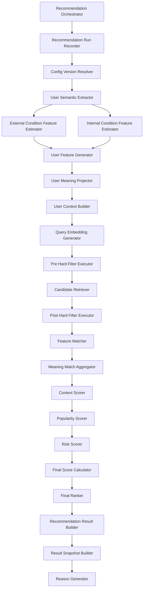
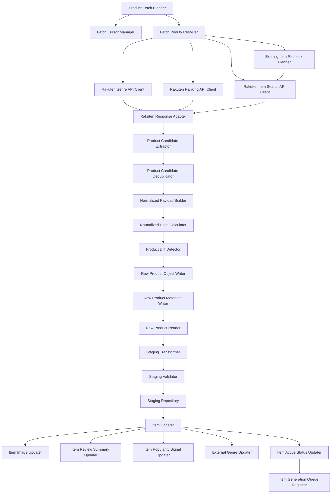
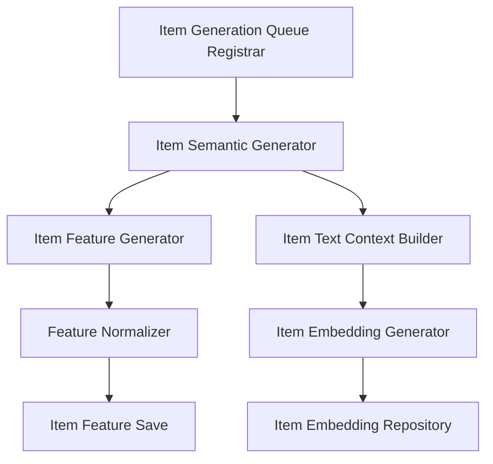

# モジュール一覧

## 1. 概要

### 1.1 目的

本ドキュメントは、Gift Recommendation Service MVP におけるアプリケーション機能を、実装責務単位であるモジュールへ分解して整理する。

`機能一覧` では、ユーザー価値・システム機能の観点で必要な機能を整理した。  
本ドキュメントでは、それらの機能を、実装時に担当コンポーネント・責務・入出力・処理種別を判断できる粒度へ分解する。

本ドキュメントでは、以下を明確にする。

```text
- どのモジュール識別子が存在するか
- 各モジュールの責務は何か
- 各モジュールがどのコンポーネントに属するか
- 各モジュールがOnline処理 / Batch処理 / 共通処理 / 運用処理のどれか
- 各モジュールの主な入力・出力は何か
- MVPで作成対象か、後続対象か
- 後続のAPI一覧、バッチ一覧、インターフェース一覧、詳細設計へどう接続するか
```

---

### 1.2 本ドキュメントの位置づけ

| 成果物                   | 本ドキュメントとの関係                                          |
| ------------------------ | --------------------------------------------------------------- |
| MVPスコープ定義書        | MVP対象・対象外の前提                                           |
| 制約・対象外一覧         | 初回MVPで実装しない機能の前提                                   |
| 処理フロー概要図         | 全体処理の流れの前提                                            |
| 処理構成定義書           | 処理系統、処理順序、保存タイミング、OL/BT区分の前提             |
| システム論理構成図       | web / api / reco / batch / DB / Object Storage の責務境界の前提 |
| システム物理構成図       | 各モジュールの実行環境の前提                                    |
| 利用技術スタック整理表   | 各モジュールの実装技術の前提                                    |
| 機能一覧                 | 本ドキュメントでモジュールへ分解する上位機能                    |
| Recoモジュール一覧       | reco内部の推薦パイプラインをさらに詳細化する派生成果物          |
| 外部商品データ連携設計書 | 楽天API連携、疑似差分取得、Raw保存、Item反映の詳細前提          |
| リソース一覧             | 各モジュールが扱うリソースの前提                                |
| リソース責務定義表       | 各リソースの管理責務・参照責務の前提                            |
| 正本定義表               | 各モジュールが更新する正本・派生データの前提                    |
| 状態遷移設計書           | Run状態、外部商品取込状態、Item有効状態の前提                   |
| API一覧                  | APIとして公開・呼び出しするモジュールを整理する後続成果物       |
| バッチ一覧               | Batchとして実行するモジュールを整理する後続成果物               |
| インターフェース一覧     | モジュール間・外部サービス間の接続を整理する後続成果物          |
| モジュール別入出力定義表 | 各モジュールの入出力を詳細化する後続成果物                      |
| モジュール詳細設計書     | 各モジュールの詳細処理・例外処理を定義する後続成果物            |

---

## 2. 利用したインプット成果物

利用したインプット成果物は以下です。

- 機能一覧.md
- 処理構成定義書.md
- 外部商品データ連携設計書.md
- ドメインモデル.md
- リソース一覧.md
- リソース責務定義表.md
- 正本定義表.md
- 状態遷移設計書.md
- RecommendationRequest定義書.md
- RecommendationResult定義書.md
- RecommendationFeedback定義書.md
- Reason生成定義書.md
- Retrieval定義書.md
- Matching定義書.md
- Ranking定義書.md
- Evaluation評価定義書.md

---

## 3. 基本方針

### 3.1 モジュール分解方針

| 方針                                        | 内容                                                                                                    |
| ------------------------------------------- | ------------------------------------------------------------------------------------------------------- |
| 責務単位で分解する                          | 1モジュールが複数の大きな責務を持たないようにする                                                       |
| Online / Batchを分離する                    | ユーザー操作に同期する処理と、商品データ準備・評価処理を分ける                                          |
| api / reco / batch の境界を明確にする       | API受付、推薦ドメイン、データ準備の責務を混在させない                                                   |
| webはモジュール一覧の対象外とする           | 画面・フォーム・UI部品は画面一覧、画面仕様書、`web/UIコンポーネント一覧.md` で管理する                  |
| recoは推薦ロジックに集中させる              | Semantic / Feature / Retrieval / Matching / Ranking / Reasonをreco側に配置する                          |
| batchは商品データ準備に集中させる           | 楽天API取得、Raw保存、Staging変換、Item反映、商品意味生成をbatch側に配置する                            |
| Online処理中に外部商品APIを呼ばない         | Online推薦では事前生成済みのItem / Item Feature / Item Embedding / Popularity Signalを参照する          |
| Pre Hard FilterとPost Hard Filterを分ける   | Retrieval前の性能目的フィルタと、Retrieval後の意味的・表示前フィルタを分離する                          |
| 商品データ取得は疑似差分取得を前提にする    | 毎回全件取得ではなく、更新順、ランキング、ジャンル別、既存商品再確認、棚卸しを組み合わせる              |
| Raw JSON本体とRaw Metadataを分ける          | Raw本体はObject Storage、参照情報はDBで管理する                                                         |
| 商品画像はItem Imageとして扱う              | 楽天商品検索API由来の `smallImageUrls` / `mediumImageUrls` をItem Imageへ反映する                       |
| ランキングはPopularity Signalとして扱う     | 楽天ランキングAPI由来の商品情報はItem正本に直接反映せず、rank等を補助シグナルとして保存する             |
| 状態更新は必要最小限にする                  | 商品単位の中間状態を逐次DB更新せず、Batch単位・API単位・Raw単位・チャンク単位・終端状態を中心に保存する |
| Reco詳細は派生成果物で管理する              | 本ドキュメントでは全体モジュールとして整理し、reco内部詳細はRecoモジュール一覧で詳細化する              |

---

### 3.2 モジュールID方針

モジュールIDは、API / Reco / Batch の実行機能を構成する部品要素に付与する。

| 対象 | 形式 | 正本 |
| ---- | ---- | ---- |
| APIモジュール | `MOD-API-NNN` | 本ドキュメント |
| Recoモジュール | `MOD-RECO-NNN` | 本ドキュメントおよび `Recoモジュール一覧.md` |
| Batchモジュール | `MOD-BATCH-NNN` | 本ドキュメント |

以下はモジュールIDの付与対象外とする。

- `web` の画面、フォーム、UI部品、API client
- `database`、`object storage`、外部サービスなどの実行基盤・外部資源そのもの
- `devops` の workflow、secret管理、Issue / Branch / PR automation

上記は、画面一覧、画面仕様書、UIコンポーネント一覧、インターフェース一覧、基盤・運用系docsで管理する。

---

### 3.3 処理種別

| 処理種別 | 内容                                       | 代表例                                             |
| -------- | ------------------------------------------ | -------------------------------------------------- |
| OL       | ユーザー操作に同期して実行されるOnline処理 | レコメンド実行、Feedback登録                       |
| BT       | 定期実行・手動実行されるBatch処理          | 楽天商品取得、Item Feature生成、Offline Evaluation |
| 共通     | OL / BT双方から利用される処理              | Config / Version解決、Repository、ログ記録         |
| 運用     | 開発・保守・改善のための処理               | CI、Batch実行、Issue化、改善Backlog化              |

---

### 3.4 コンポーネント分類

| コンポーネント    | 役割                                                                          |
| ----------------- | ----------------------------------------------------------------------------- |
| web               | 画面表示、入力、API呼び出し、Feedback入力                                     |
| api               | HTTP受付、Validation、Request保存、reco呼び出し、レスポンス整形、Feedback保存 |
| reco              | 推薦パイプライン実行、Reason生成、Result生成                                  |
| batch             | 商品データ取得、Raw保存、Staging変換、Item反映、商品意味推定、評価実行        |
| database          | 構造化データ、Feature、Embedding、Result、Feedback、Log、Item正本の保存       |
| object storage    | 外部商品APIレスポンスRaw JSON本体の保存                                       |
| external services | 楽天市場API、外部AI API                                                       |
| devops            | CI、Batch実行、GitHub運用、自動化                                             |

---

## 4. モジュール分類一覧

| モジュール分類             | 内容                                                   | 主担当                        |
| -------------------------- | ------------------------------------------------------ | ----------------------------- |
| APIモジュール              | HTTP受付・Validation・アプリケーションサービス         | api                           |
| 推薦パイプラインモジュール | 推薦結果生成の中核処理                                 | reco                          |
| 商品データ連携モジュール   | 外部商品データ取得・Raw保存・Staging・Item反映         | batch                         |
| 商品意味推定モジュール     | Item Semantic / Feature / Embedding生成                | batch / reco                  |
| 評価・改善モジュール       | Offline Evaluation、Feedback分析、失敗分析             | batch / reco                  |
| マスタ・設定モジュール     | Relationship / Occasion / Config / Version管理         | api / reco / database         |
| ログ・監査モジュール       | Run Log、Phase Log、Error Log、Batch Log、API Call Log | api / reco / batch / database |
| 共通基盤モジュール         | Repository、外部Client、DB接続、Object Storage接続     | api / reco / batch            |
| 運用モジュール             | CI、Batch実行、GitHub運用、Secrets管理                 | devops                        |

`web` の画面・フォーム・UI部品は、画面一覧、画面仕様書、`web/UIコンポーネント一覧.md` で管理する。本ドキュメントでは、API / Reco / Batch の実行機能を構成する部品要素をモジュールとして扱う。

---

## 5. 全体モジュール一覧

| モジュールID | モジュール名 | 物理名候補 | 分類 | 主担当 | 処理種別 | MVP対象 | 概要 |
| --- | --- | --- | --- | --- | --- | --- | --- |
| `MOD-API-001` | Recommendation Controller | Recommendation Controller | API | api | OL | ○ | レコメンド実行APIを受け付ける |
| `MOD-API-002` | Recommendation Request Validator | Recommendation Request Validator | API | api | OL | ○ | Recommendation Requestの入力検証を行う |
| `MOD-API-003` | Recommendation Application Service | Recommendation Application Service | API | api | OL | ○ | Request保存、reco呼び出し、レスポンス整形を制御する |
| `MOD-API-004` | Recommendation Request Repository | Recommendation Request Repository | API / Repository | api | OL | ○ | Recommendation Requestを保存・参照する |
| `MOD-API-005` | Reco Client | Reco Client | API / 外部IF | api | OL | ○ | apiからreco内部APIを呼び出す |
| `MOD-API-006` | Recommendation Response Mapper | Recommendation Response Mapper | API | api | OL | ○ | recoの結果をweb向けレスポンスへ変換する |
| `MOD-API-007` | Feedback Controller | Feedback Controller | API | api | OL | ○ | Feedback登録APIを受け付ける |
| `MOD-API-008` | Feedback Validator | Feedback Validator | API | api | OL | ○ | Feedback入力値を検証する |
| `MOD-API-009` | Feedback Service | Feedback Service | API | api | OL | ○ | Feedback登録処理を制御する |
| `MOD-API-010` | Feedback Repository | Feedback Repository | Repository | api | OL | ○ | Recommendation Feedbackを保存する |
| `MOD-API-011` | Master Controller | Master Controller | API | api | OL | ○ | Relationship / Occasion等のマスタ取得APIを提供する |
| `MOD-API-012` | Master Repository | Master Repository | Repository | api | OL | ○ | マスタデータを参照する |
| `MOD-API-013` | API Error Handler | API Error Handler | API / 共通 | api | OL | ○ | APIエラー形式を統一する |
| `MOD-RECO-001` | Recommendation Orchestrator | Recommendation Orchestrator | 推薦 | reco | OL | ○ | 推薦パイプライン全体を制御する |
| `MOD-RECO-002` | Recommendation Run Recorder | Recommendation Run Recorder | 推薦 / ログ | reco | OL | ○ | Recommendation Runの開始・終了・失敗を記録する |
| `MOD-RECO-003` | Config Version Resolver | Config Version Resolver | 推薦 / 共通 | reco | 共通 | ○ | Semantic Config / Model Version / Ranking Config等を解決する |
| `MOD-RECO-004` | User Semantic Extractor | User Semantic Extractor | 推薦 | reco | OL | ○ | ユーザー入力からSemantic Conceptを抽出する |
| `MOD-RECO-005` | External Condition Feature Estimator | External Condition Feature Estimator | 推薦 | reco | OL | ○ | relationship / occasion等の外部条件から特徴量を推定する |
| `MOD-RECO-006` | Internal Condition Feature Estimator | Internal Condition Feature Estimator | 推薦 | reco | OL | ○ | preferred / non_preferred / ng条件から特徴量を推定する |
| `MOD-RECO-007` | User Feature Generator | User Feature Generator | 推薦 | reco | OL | ○ | ユーザー意図を8次元Featureへ変換する |
| `MOD-RECO-008` | User Meaning Projector | User Meaning Projector | 推薦 | reco | OL | ○ | User FeatureをSocial / Symbolicへ射影する |
| `MOD-RECO-009` | User Context Builder | User Context Builder | 推薦 | reco | OL | ○ | Ranking等で利用するUser Contextを生成する |
| `MOD-RECO-010` | Query Embedding Generator | Query Embedding Generator | 推薦 | reco | OL | ○ | Retrieval用の検索クエリEmbeddingを生成する |
| `MOD-RECO-011` | Pre Hard Filter Executor | Pre Hard Filter Executor | 推薦 | reco | OL | ○ | Retrieval前に予算・有効状態・明確なNG条件で候補母集団を絞る |
| `MOD-RECO-012` | Candidate Retriever | Candidate Retriever | 推薦 | reco | OL | ○ | Pre Hard Filter後の商品集合から候補商品を抽出する |
| `MOD-RECO-013` | Post Hard Filter Executor | Post Hard Filter Executor | 推薦 | reco | OL | ○ | Retrieval後の候補に対してSemantic NG、重複、不整合を確認する |
| `MOD-RECO-014` | Feature Matcher | Feature Matcher | 推薦 | reco | OL | ○ | User FeatureとItem Featureの一致度を計算する |
| `MOD-RECO-015` | Meaning Match Aggregator | Meaning Match Aggregator | 推薦 | reco | OL | ○ | feature単位の一致度をsocial_match / symbolic_match等へ集約する |
| `MOD-RECO-016` | Context Scorer | Context Scorer | 推薦 | reco | OL | ○ | 文脈スコアを算出する |
| `MOD-RECO-017` | Popularity Scorer | Popularity Scorer | 推薦 | reco | OL | ○ | item_popularity_signal等から人気補正を算出する |
| `MOD-RECO-018` | Risk Scorer | Risk Scorer | 推薦 | reco | OL | ○ | 贈答文脈に応じたリスク補正を算出する |
| `MOD-RECO-019` | Final Score Calculator | Final Score Calculator | 推薦 | reco | OL | ○ | context_score、popularity_score、risk_penaltyからfinal_scoreを算出する |
| `MOD-RECO-020` | Final Ranker | Final Ranker | 推薦 | reco | OL | ○ | final_scoreに基づき最終順位を決定する |
| `MOD-RECO-021` | Recommendation Result Builder | Recommendation Result Builder | 推薦 | reco | OL | ○ | Recommendation Result / Result Itemを生成する |
| `MOD-RECO-022` | Result Snapshot Builder | Result Snapshot Builder | 推薦 | reco | OL | ○ | 表示時点の商品名、価格、URL、画像URL等をSnapshot化する |
| `MOD-RECO-023` | Reason Generator | Reason Generator | 推薦 | reco | OL | ○ | 推薦理由を生成する |
| `MOD-RECO-024` | Reco Error Handler | Reco Error Handler | 推薦 / 共通 | reco | OL | ○ | reco内のエラーを処理しログへ接続する |
| `MOD-RECO-025` | Metric Logger | Metric Logger | ログ・監査 | reco | 共通 | △ | reco内の件数、処理時間、スコア分布等を記録する |
| `MOD-BATCH-001` | Product Fetch Planner | Product Fetch Planner | 商品データ連携 | batch | BT | ○ | 楽天API取得計画、対象API、ジャンル、ページ、優先度を決定する |
| `MOD-BATCH-002` | Fetch Cursor Manager | Fetch Cursor Manager | 商品データ連携 | batch | BT | ○ | 前回取得位置・ページ・日時などのカーソルを管理する |
| `MOD-BATCH-003` | Fetch Priority Resolver | Fetch Priority Resolver | 商品データ連携 | batch | BT | ○ | ランキング、更新順、主要ジャンル、再確認対象の優先度を決定する |
| `MOD-BATCH-004` | Rakuten Item Search API Client | Rakuten Item Search API Client | 商品データ連携 / 外部IF | batch | BT | ○ | 楽天商品検索APIを呼び出す |
| `MOD-BATCH-005` | Rakuten Ranking API Client | Rakuten Ranking API Client | 商品データ連携 / 外部IF | batch | BT | ○ | 楽天商品ランキングAPIを呼び出す |
| `MOD-BATCH-006` | Rakuten Genre API Client | Rakuten Genre API Client | 商品データ連携 / 外部IF | batch | BT | ○ | 楽天ジャンル検索APIを呼び出す |
| `MOD-BATCH-007` | Rakuten Attribute API Client | Rakuten Attribute API Client | 商品データ連携 / 外部IF | batch | BT | △ | 楽天属性検索APIを呼び出す |
| `MOD-BATCH-008` | External API Rate Limiter | External API Rate Limiter | 商品データ連携 / 共通 | batch | BT | ○ | 楽天APIのレート制御・呼び出し間隔制御を行う |
| `MOD-BATCH-009` | Rakuten Response Adapter | Rakuten Response Adapter | 商品データ連携 | batch | BT | ○ | 楽天APIレスポンスを内部形式へ変換する |
| `MOD-BATCH-010` | Product Candidate Extractor | Product Candidate Extractor | 商品データ連携 | batch | BT | ○ | APIレスポンスから商品候補を抽出する |
| `MOD-BATCH-011` | Product Candidate Deduplicator | Product Candidate Deduplicator | 商品データ連携 | batch | BT | ○ | itemCode単位で重複排除する |
| `MOD-BATCH-012` | Normalized Payload Builder | Normalized Payload Builder | 商品データ連携 | batch | BT | ○ | hash算出用の正規化Payloadを生成する |
| `MOD-BATCH-013` | Normalized Hash Calculator | Normalized Hash Calculator | 商品データ連携 | batch | BT | ○ | 正規化Payloadからnormalized_hashを算出する |
| `MOD-BATCH-014` | Product Diff Detector | Product Diff Detector | 商品データ連携 | batch | BT | ○ | itemCode + normalized_hashで新規・更新・変更なしを判定する |
| `MOD-BATCH-015` | Existing Item Recheck Planner | Existing Item Recheck Planner | 商品データ連携 | batch | BT | ○ | 既存Itemの再確認対象を決定する |
| `MOD-BATCH-016` | Inactive Candidate Detector | Inactive Candidate Detector | 商品データ連携 | batch | BT | ○ | 取得不可・販売不可・品質不足の商品を非アクティブ候補にする |
| `MOD-BATCH-017` | Raw Product Object Writer | Raw Product Object Writer | 商品データ連携 / Storage | batch | BT | ○ | Raw JSON本体をObject Storageへ保存する |
| `MOD-BATCH-018` | Raw Product Metadata Writer | Raw Product Metadata Writer | 商品データ連携 / Repository | batch | BT | ○ | Raw MetadataをDBへ保存する |
| `MOD-BATCH-019` | Raw Product Reader | Raw Product Reader | 商品データ連携 / Storage | batch | BT | ○ | Object StorageからRaw JSONを読み取る |
| `MOD-BATCH-020` | Staging Transformer | Staging Transformer | 商品データ連携 | batch | BT | ○ | Raw JSONをStaging形式へ変換する |
| `MOD-BATCH-021` | Staging Validator | Staging Validator | 商品データ連携 | batch | BT | ○ | Stagingデータの必須項目・整合性を検証する |
| `MOD-BATCH-022` | Staging Repository | Staging Repository | Repository | batch | BT | ○ | staging_item / staging_item_image / staging_ranking_signal等を保存する |
| `MOD-BATCH-023` | Item Updater | Item Updater | 商品データ連携 / Repository | batch | BT | ○ | StagingからItem正本へUpsertする |
| `MOD-BATCH-024` | Item Image Updater | Item Image Updater | 商品データ連携 / Repository | batch | BT | ○ | smallImageUrls / mediumImageUrlsをItem Imageへ反映する |
| `MOD-BATCH-025` | Item Review Summary Updater | Item Review Summary Updater | 商品データ連携 / Repository | batch | BT | ○ | reviewAverage / reviewCountをItem Review Summaryへ反映する |
| `MOD-BATCH-026` | Item Popularity Signal Updater | Item Popularity Signal Updater | 商品データ連携 / Repository | batch | BT | ○ | rank / genre / period / lastBuildDateをPopularity Signalへ保存する |
| `MOD-BATCH-027` | Ranking Snapshot Builder | Ranking Snapshot Builder | 商品データ連携 | batch | BT | ○ | ranking_snapshotのヘッダ情報を構築する |
| `MOD-BATCH-028` | Ranking Snapshot Repository | Ranking Snapshot Repository | 商品データ連携 / Repository | batch | BT | ○ | ranking_snapshotを作成または取得する |
| `MOD-BATCH-029` | Ranking Unknown Item Collector | Ranking Unknown Item Collector | 商品データ連携 | batch | BT | ○ | ranking内の未登録itemCodeを商品補完取得候補へ登録する |
| `MOD-BATCH-030` | External Genre Updater | External Genre Updater | 商品データ連携 / Repository | batch | BT | ○ | 楽天ジャンル階層を外部ジャンル参照データへ反映する |
| `MOD-BATCH-031` | External Attribute Updater | External Attribute Updater | 商品データ連携 / Repository | batch | BT | △ | 楽天属性情報を外部属性参照データへ反映する |
| `MOD-BATCH-032` | Item Active Status Updater | Item Active Status Updater | 商品データ連携 / Repository | batch | BT | ○ | Itemの有効状態を一括更新する |
| `MOD-BATCH-033` | Item Generation Queue Registrar | Item Generation Queue Registrar | 商品データ連携 | batch | BT | ○ | 新規・更新Itemを意味生成対象キューへ登録する |
| `MOD-RECO-026` | Item Semantic Generator | Item Semantic Generator | 商品意味推定 | batch / reco | BT | ○ | 商品情報からItem Semanticを生成する |
| `MOD-RECO-027` | Item Feature Generator | Item Feature Generator | 商品意味推定 | batch / reco | BT | ○ | Item Semanticや商品情報からItem Featureを生成する |
| `MOD-BATCH-034` | Feature Normalizer | Feature Normalizer | 商品意味推定 | batch / reco | BT | ○ | sigmoid系正規化でFeature値を0.0〜1.0へ整える |
| `MOD-BATCH-035` | Item Text Context Builder | Item Text Context Builder | 商品意味推定 | batch | BT | ○ | 商品名、説明、ジャンル、属性等をEmbedding入力テキストへ統合する |
| `MOD-BATCH-036` | Item Embedding Generator | Item Embedding Generator | 商品意味推定 | batch | BT | ○ | Item Embeddingを生成する |
| `MOD-BATCH-037` | Item Embedding Repository | Item Embedding Repository | Repository | batch / database | BT | ○ | item_embeddingをpgvectorへ保存する |
| `MOD-BATCH-038` | Normalization Statistics Manager | Normalization Statistics Manager | 商品意味推定 | batch / database | BT | △ | Feature正規化用統計量を管理する |
| `MOD-BATCH-039` | Offline Evaluation Runner | Offline Evaluation Runner | 評価・改善 | batch / reco | BT | ○ | 評価データセットに対して推薦処理を実行する |
| `MOD-BATCH-040` | Evaluation Metric Calculator | Evaluation Metric Calculator | 評価・改善 | batch | BT | ○ | Precision / Recall / NDCG等の評価指標を算出する |
| `MOD-BATCH-041` | Evaluation Result Writer | Evaluation Result Writer | 評価・改善 / Repository | batch | BT | ○ | Evaluation Resultを保存する |
| `MOD-BATCH-042` | Feedback Analyzer | Feedback Analyzer | 評価・改善 | batch | BT / 運用 | △ | Feedbackを集計・分析する |
| `MOD-BATCH-043` | Failure Analyzer | Failure Analyzer | 評価・改善 | batch | BT / 運用 | △ | Retrieval / Matching / Ranking / Reason等の失敗原因を分類する |
| `MOD-BATCH-044` | Improvement Backlog Generator | Improvement Backlog Generator | 評価・改善 / 運用 | batch / devops | 運用 | △ | 分析結果を改善Issue候補へ変換する |
| `MOD-RECO-028` | Phase Log Writer | Phase Log Writer | ログ・監査 | api / reco / batch | 共通 | ○ | 主要処理フェーズの開始・終了・成功・失敗を記録する |
| `MOD-RECO-029` | Error Log Writer | Error Log Writer | ログ・監査 | api / reco / batch | 共通 | ○ | 例外・失敗内容を記録する |
| `MOD-BATCH-045` | Batch Run Log Writer | Batch Run Log Writer | ログ・監査 | batch | BT | ○ | Batch開始・終了・件数・失敗数を記録する |
| `MOD-BATCH-046` | API Call Log Writer | API Call Log Writer | ログ・監査 | batch | BT | ○ | 楽天API呼び出し条件・HTTPステータス・結果件数を記録する |
| `MOD-BATCH-047` | Item Import Summary Writer | Item Import Summary Writer | ログ・監査 | batch | BT | ○ | 新規・更新・変更なし・失敗件数を集計保存する |
| - | Database Connection Manager | Database Connection Manager | 共通基盤 | api / reco / batch | 共通 | ○ | DB接続を管理する |
| `MOD-BATCH-048` | Object Storage Client | Object Storage Client | 共通基盤 | batch | BT | ○ | Raw JSON保存・読取のObject Storage接続を管理する |
| - | External AI API Client | External AI API Client | 共通基盤 / 外部IF | reco / batch | 共通 | ○ | Embedding / LLM等の外部AI APIを呼び出す |
| - | Repository Base | Repository Base | 共通基盤 | api / reco / batch | 共通 | ○ | Repository共通処理を提供する |
| - | CI Workflow | CI Workflow | 運用 | devops | 運用 | ○ | lint / test / buildを実行する |
| - | Batch Execution Workflow | Batch Execution Workflow | 運用 | devops | 運用 | ○ | GitHub ActionsでBatchを手動・定期実行する |
| - | Secrets Manager | Secrets Manager | 運用 | devops | 運用 | ○ | API Keyや接続情報を管理する |
| - | Issue / Branch / PR Automation | Issue / Branch / PR Automation | 運用 | devops | 運用 | △ | Issue起点の開発運用を自動化する |

---

## 6. web画面・UI領域

`web` の画面、フォーム、UI部品、API clientは、モジュールIDを付与する実行機能モジュールとしては扱わない。画面単位は画面一覧の `SCR-*`、画面詳細は画面仕様書、再利用UI部品は `web/UIコンポーネント一覧.md` で管理する。

---

## 7. apiモジュール

### 7.1 apiモジュール一覧

| モジュールID | モジュール名 | 物理名候補 | 処理種別 | MVP対象 | 概要 |
| --- | --- | --- | --- | --- | --- |
| `MOD-API-001` | Recommendation Controller | Recommendation Controller | OL | ○ | レコメンド実行APIを受け付ける |
| `MOD-API-002` | Recommendation Request Validator | Recommendation Request Validator | OL | ○ | 入力値を検証する |
| `MOD-API-003` | Recommendation Application Service | Recommendation Application Service | OL | ○ | Request保存、reco呼び出し、レスポンス返却を制御する |
| `MOD-API-004` | Recommendation Request Repository | Recommendation Request Repository | OL | ○ | Recommendation Requestを保存する |
| `MOD-API-005` | Reco Client | Reco Client | OL | ○ | apiからrecoへ推薦実行依頼を送る |
| `MOD-API-006` | Recommendation Response Mapper | Recommendation Response Mapper | OL | ○ | recoレスポンスをweb向けに整形する |
| `MOD-API-007` | Feedback Controller | Feedback Controller | OL | ○ | Feedback登録APIを受け付ける |
| `MOD-API-008` | Feedback Validator | Feedback Validator | OL | ○ | Feedback入力を検証する |
| `MOD-API-009` | Feedback Service | Feedback Service | OL | ○ | Feedback保存処理を制御する |
| `MOD-API-010` | Feedback Repository | Feedback Repository | OL | ○ | Recommendation Feedbackを保存する |
| `MOD-API-011` | Master Controller | Master Controller | OL | ○ | マスタ取得APIを提供する |
| `MOD-API-012` | Master Repository | Master Repository | OL | ○ | Relationship / Occasion等を参照する |
| `MOD-API-013` | API Error Handler | API Error Handler | OL | ○ | APIエラー形式を統一する |

---

### 7.2 apiモジュール責務

| モジュールID | モジュール名 | 主な責務 | 主な入力 | 主な出力 |
| --- | --- | --- | --- | --- |
| `MOD-API-001` | Recommendation Controller | HTTPリクエスト受付、Service呼び出し | HTTP request | HTTP response |
| `MOD-API-002` | Recommendation Request Validator | 入力形式、必須項目、値域、矛盾検証 | request body | validated request |
| `MOD-API-003` | Recommendation Application Service | レコメンド実行のアプリケーション制御 | validated request | recommendation response |
| `MOD-API-004` | Recommendation Request Repository | Request保存・参照 | validated request | recommendation_request |
| `MOD-API-005` | Reco Client | reco内部API呼び出し | recommendation_request_id / request payload | reco result |
| `MOD-API-006` | Recommendation Response Mapper | web表示用レスポンス変換 | reco result | web response |
| `MOD-API-007` | Feedback Controller | Feedback登録受付 | HTTP request | HTTP response |
| `MOD-API-008` | Feedback Validator | Feedback入力検証 | feedback payload | validated feedback |
| `MOD-API-009` | Feedback Service | Feedback保存制御 | validated feedback | saved feedback |
| `MOD-API-010` | Feedback Repository | Feedback保存 | feedback entity | recommendation_feedback |
| `MOD-API-011` | Master Controller | マスタ取得受付 | master type | master response |
| `MOD-API-012` | Master Repository | マスタ参照 | master type | master records |
| `MOD-API-013` | API Error Handler | エラー変換 | exception | standardized error response |

---

## 8. recoモジュール

### 8.1 recoモジュール一覧

本ドキュメントでは、reco内部モジュールを全体モジュール一覧として整理する。  
詳細な入出力、計算式、責務分解は `Recoモジュール一覧.md` および後続の `Recoモジュール別入出力定義` で詳細化する。

| モジュールID | モジュール名 | 物理名候補 | 処理種別 | MVP対象 | 概要 |
| --- | --- | --- | --- | --- | --- |
| `MOD-RECO-001` | Recommendation Orchestrator | Recommendation Orchestrator | OL | ○ | 推薦パイプライン全体を制御する |
| `MOD-RECO-002` | Recommendation Run Recorder | Recommendation Run Recorder | OL | ○ | 推薦実行状態を記録する |
| `MOD-RECO-003` | Config Version Resolver | Config Version Resolver | 共通 | ○ | 使用する設定・モデルバージョンを解決する |
| `MOD-RECO-004` | User Semantic Extractor | User Semantic Extractor | OL | ○ | ユーザー入力からSemantic Conceptを抽出する |
| `MOD-RECO-005` | External Condition Feature Estimator | External Condition Feature Estimator | OL | ○ | relationship / occasion等から特徴量を推定する |
| `MOD-RECO-006` | Internal Condition Feature Estimator | Internal Condition Feature Estimator | OL | ○ | preferred / non_preferred / ng条件から特徴量を推定する |
| `MOD-RECO-007` | User Feature Generator | User Feature Generator | OL | ○ | User Featureを生成する |
| `MOD-RECO-008` | User Meaning Projector | User Meaning Projector | OL | ○ | User FeatureをSocial / Symbolicへ射影する |
| `MOD-RECO-009` | User Context Builder | User Context Builder | OL | ○ | User Contextを生成する |
| `MOD-RECO-010` | Query Embedding Generator | Query Embedding Generator | OL | ○ | 検索クエリEmbeddingを生成する |
| `MOD-RECO-011` | Pre Hard Filter Executor | Pre Hard Filter Executor | OL | ○ | Retrieval前に構造化条件で候補母集団を絞る |
| `MOD-RECO-012` | Candidate Retriever | Candidate Retriever | OL | ○ | 候補商品を抽出する |
| `MOD-RECO-013` | Post Hard Filter Executor | Post Hard Filter Executor | OL | ○ | Retrieval後の候補に最終除外条件を適用する |
| `MOD-RECO-014` | Feature Matcher | Feature Matcher | OL | ○ | User FeatureとItem Featureを比較する |
| `MOD-RECO-015` | Meaning Match Aggregator | Meaning Match Aggregator | OL | ○ | feature単位の一致度を集約する |
| `MOD-RECO-016` | Context Scorer | Context Scorer | OL | ○ | 文脈スコアを算出する |
| `MOD-RECO-017` | Popularity Scorer | Popularity Scorer | OL | ○ | 人気補正スコアを算出する |
| `MOD-RECO-018` | Risk Scorer | Risk Scorer | OL | ○ | リスク補正を算出する |
| `MOD-RECO-019` | Final Score Calculator | Final Score Calculator | OL | ○ | final_scoreを算出する |
| `MOD-RECO-020` | Final Ranker | Final Ranker | OL | ○ | final_scoreに基づきrankを決定する |
| `MOD-RECO-021` | Recommendation Result Builder | Recommendation Result Builder | OL | ○ | Recommendation Resultを生成する |
| `MOD-RECO-022` | Result Snapshot Builder | Result Snapshot Builder | OL | ○ | 表示時点の商品情報をSnapshot化する |
| `MOD-RECO-023` | Reason Generator | Reason Generator | OL | ○ | 推薦理由を生成する |
| `MOD-RECO-024` | Reco Error Handler | Reco Error Handler | OL | ○ | reco内のエラーを処理する |
| `MOD-RECO-025` | Metric Logger | Metric Logger | 共通 | △ | reco内の件数、処理時間、スコア分布等を記録する |

---

### 8.2 recoモジュール処理順序



---

### 8.3 Pre Hard Filter / Retrieval / Post Hard Filterの責務分離

| モジュール                | 目的                                          | 主な入力                                                  | 主な出力                      |
| ------------------------- | --------------------------------------------- | --------------------------------------------------------- | ----------------------------- |
| Pre Hard Filter Executor  | Retrieval前に検索対象を削減する               | Recommendation Request / budget / ng / item metadata      | pre_filtered_item_pool        |
| Candidate Retriever       | 候補商品を意味的に抽出する                    | pre_filtered_item_pool / query_embedding / item_embedding | retrieval_candidate           |
| Post Hard Filter Executor | Retrieval後に意味的NG・重複・不整合を除外する | retrieval_candidate / semantic result / item_semantic     | validated_retrieval_candidate |

Pre Hard Filterは性能目的を含むため、予算、商品有効状態、販売状態、明確なNGカテゴリ、明確なNGキーワード、URLなし、画像なし等の構造化条件を扱う。  
Post Hard Filterは、Semantic NG、avoid類似、重複、不整合、表示前Validationを扱う。

---

## 9. batchモジュール

### 9.1 商品データ連携モジュール一覧

| モジュールID | モジュール名 | 物理名候補 | 処理種別 | MVP対象 | 概要 |
| --- | --- | --- | --- | --- | --- |
| `MOD-BATCH-001` | Product Fetch Planner | Product Fetch Planner | BT | ○ | 取得対象API、ジャンル、ページ、優先度を決定する |
| `MOD-BATCH-002` | Fetch Cursor Manager | Fetch Cursor Manager | BT | ○ | 前回取得位置・ページ・日時等を管理する |
| `MOD-BATCH-003` | Fetch Priority Resolver | Fetch Priority Resolver | BT | ○ | 取得優先度を決定する |
| `MOD-BATCH-004` | Rakuten Item Search API Client | Rakuten Item Search API Client | BT | ○ | 楽天商品検索APIを呼び出す |
| `MOD-BATCH-005` | Rakuten Ranking API Client | Rakuten Ranking API Client | BT | ○ | 楽天商品ランキングAPIを呼び出す |
| `MOD-BATCH-006` | Rakuten Genre API Client | Rakuten Genre API Client | BT | ○ | 楽天ジャンル検索APIを呼び出す |
| `MOD-BATCH-007` | Rakuten Attribute API Client | Rakuten Attribute API Client | BT | △ | 楽天属性検索APIを呼び出す |
| `MOD-BATCH-008` | External API Rate Limiter | External API Rate Limiter | BT | ○ | 外部API呼び出し制御を行う |
| `MOD-BATCH-009` | Rakuten Response Adapter | Rakuten Response Adapter | BT | ○ | 楽天APIレスポンスを内部形式へ変換する |
| `MOD-BATCH-010` | Product Candidate Extractor | Product Candidate Extractor | BT | ○ | 商品候補を抽出する |
| `MOD-BATCH-011` | Product Candidate Deduplicator | Product Candidate Deduplicator | BT | ○ | itemCode単位で重複排除する |
| `MOD-BATCH-012` | Normalized Payload Builder | Normalized Payload Builder | BT | ○ | hash算出用Payloadを生成する |
| `MOD-BATCH-013` | Normalized Hash Calculator | Normalized Hash Calculator | BT | ○ | normalized_hashを算出する |
| `MOD-BATCH-014` | Product Diff Detector | Product Diff Detector | BT | ○ | 新規・更新・変更なしを判定する |
| `MOD-BATCH-015` | Existing Item Recheck Planner | Existing Item Recheck Planner | BT | ○ | 既存Item再確認対象を決定する |
| `MOD-BATCH-016` | Inactive Candidate Detector | Inactive Candidate Detector | BT | ○ | 非アクティブ候補を検出する |
| `MOD-BATCH-017` | Raw Product Object Writer | Raw Product Object Writer | BT | ○ | Raw JSON本体をObject Storageへ保存する |
| `MOD-BATCH-018` | Raw Product Metadata Writer | Raw Product Metadata Writer | BT | ○ | Raw MetadataをDBへ保存する |
| `MOD-BATCH-019` | Raw Product Reader | Raw Product Reader | BT | ○ | Raw JSONをObject Storageから読み取る |
| `MOD-BATCH-020` | Staging Transformer | Staging Transformer | BT | ○ | Raw JSONをStaging形式へ変換する |
| `MOD-BATCH-021` | Staging Validator | Staging Validator | BT | ○ | Stagingデータを検証する |
| `MOD-BATCH-022` | Staging Repository | Staging Repository | BT | ○ | Stagingデータを保存する |
| `MOD-BATCH-023` | Item Updater | Item Updater | BT | ○ | Item正本をUpsertする |
| `MOD-BATCH-024` | Item Image Updater | Item Image Updater | BT | ○ | 商品画像URLをItem Imageへ反映する |
| `MOD-BATCH-025` | Item Review Summary Updater | Item Review Summary Updater | BT | ○ | レビュー要約を反映する |
| `MOD-BATCH-026` | Item Popularity Signal Updater | Item Popularity Signal Updater | BT | ○ | ランキングシグナルを反映する |
| `MOD-BATCH-027` | Ranking Snapshot Builder | Ranking Snapshot Builder | BT | ○ | ranking_snapshotのヘッダ情報を構築する |
| `MOD-BATCH-028` | Ranking Snapshot Repository | Ranking Snapshot Repository | BT | ○ | ranking_snapshotを作成または取得する |
| `MOD-BATCH-029` | Ranking Unknown Item Collector | Ranking Unknown Item Collector | BT | ○ | ranking内の未登録itemCodeを商品補完候補へ登録する |
| `MOD-BATCH-030` | External Genre Updater | External Genre Updater | BT | ○ | 外部ジャンル情報を更新する |
| `MOD-BATCH-031` | External Attribute Updater | External Attribute Updater | BT | △ | 外部属性情報を更新する |
| `MOD-BATCH-032` | Item Active Status Updater | Item Active Status Updater | BT | ○ | Item有効状態を更新する |
| `MOD-BATCH-033` | Item Generation Queue Registrar | Item Generation Queue Registrar | BT | ○ | 意味生成対象キューへ登録する |

---

### 9.2 商品データ連携モジュール処理順序



---

### 9.3 疑似差分取得関連モジュール

| モジュールID | モジュール名 | 主な責務 | 主な入力 | 主な出力 |
| --- | --- | --- | --- | --- |
| `MOD-BATCH-001` | Product Fetch Planner | API取得計画の作成 | 対象ジャンル、API上限、前回取得状態 | fetch plan |
| `MOD-BATCH-002` | Fetch Cursor Manager | 取得カーソル管理 | 前回実行ログ、取得条件 | next cursor |
| `MOD-BATCH-003` | Fetch Priority Resolver | 取得優先度決定 | ランキング、更新順、再確認、棚卸し条件 | prioritized fetch plan |
| `MOD-BATCH-010` | Product Candidate Extractor | 商品候補抽出 | API response | external product candidate |
| `MOD-BATCH-011` | Product Candidate Deduplicator | itemCode重複排除 | external product candidate | unique product candidate |
| `MOD-BATCH-013` | Normalized Hash Calculator | 差分判定用hash算出 | normalized payload | normalized_hash |
| `MOD-BATCH-014` | Product Diff Detector | 新規・更新・変更なし判定 | itemCode / normalized_hash / external product index | diff result |
| `MOD-BATCH-015` | Existing Item Recheck Planner | 既存商品再確認対象抽出 | item / last_checked_at | recheck target |
| `MOD-BATCH-016` | Inactive Candidate Detector | 非アクティブ候補判定 | 取得不可、販売不可、品質不足 | inactive candidate |

---

### 9.4 Raw保存関連モジュール

| モジュールID | モジュール名 | 主な責務 | 主な入力 | 主な出力 |
| --- | --- | --- | --- | --- |
| `MOD-BATCH-017` | Raw Product Object Writer | Raw JSON本体をObject Storageへ保存 | raw response | object key |
| `MOD-BATCH-018` | Raw Product Metadata Writer | Raw参照情報をDBへ保存 | object key / hash / fetched_at / status / counts | raw_product_metadata |
| `MOD-BATCH-019` | Raw Product Reader | Raw JSONを読み取る | object key | raw JSON |
| `MOD-BATCH-020` | Staging Transformer | 内部形式へ変換 | raw JSON | staging payload |
| `MOD-BATCH-021` | Staging Validator | 必須項目・整合性検証 | staging payload | validated staging payload |

Raw JSONは、Online推薦では直接参照しない。  
Online推薦では、Item、Item Feature、Item Embedding、Item Popularity Signal等の正規化済みデータを参照する。

---

### 9.5 Item反映関連モジュール

| モジュールID | モジュール名 | 主な責務 | 主な入力 | 主な出力 |
| --- | --- | --- | --- | --- |
| `MOD-BATCH-023` | Item Updater | Item正本の作成・更新 | staging_item | item |
| `MOD-BATCH-024` | Item Image Updater | 商品画像URLの反映 | staging_item_image / smallImageUrls / mediumImageUrls | item_image |
| `MOD-BATCH-025` | Item Review Summary Updater | レビュー情報の反映 | reviewAverage / reviewCount | item_review_summary |
| `MOD-BATCH-026` | Item Popularity Signal Updater | ランキング情報の反映 | rank / genreId / period / lastBuildDate | item_popularity_signal |
| `MOD-BATCH-030` | External Genre Updater | 楽天ジャンル情報の反映 | genre response | external_genre |
| `MOD-BATCH-031` | External Attribute Updater | 楽天属性情報の反映 | attribute response | external_attribute |
| `MOD-BATCH-032` | Item Active Status Updater | 有効状態の更新 | item status inputs | item.is_active / item_status |
| `MOD-BATCH-033` | Item Generation Queue Registrar | 意味生成対象登録 | new / updated item | item_generation_queue |

---

### 9.6 楽天ランキングAPIの扱い

楽天ランキングAPI由来のモジュールは、Item正本更新ではなく、Popularity Signal更新を主目的とする。

| モジュール                     | 方針                                                               |
| ------------------------------ | ------------------------------------------------------------------ |
| Rakuten Ranking API Client     | ranking responseを取得する                                         |
| Product Candidate Extractor    | `itemCode`を商品候補として抽出する                                 |
| Item Popularity Signal Updater | `rank` / `lastBuildDate` / `genreId` / `period` を保存する         |
| Item Updater                   | ランキングAPI由来の商品名・価格・画像URL等ではItem正本を更新しない |
| Rakuten Item Search API Client | 未登録itemCodeが見つかった場合、商品検索APIで商品正本を取得する    |

---

## 10. 商品意味推定モジュール

### 10.1 商品意味推定モジュール一覧

| モジュールID | モジュール名 | 物理名候補 | 処理種別 | MVP対象 | 概要 |
| --- | --- | --- | --- | --- | --- |
| `MOD-RECO-026` | Item Semantic Generator | Item Semantic Generator | BT | ○ | 商品情報からSemantic Conceptを抽出する |
| `MOD-RECO-027` | Item Feature Generator | Item Feature Generator | BT | ○ | Item Featureを生成する |
| `MOD-BATCH-034` | Feature Normalizer | Feature Normalizer | BT | ○ | Feature値を0.0〜1.0へ正規化する |
| `MOD-BATCH-035` | Item Text Context Builder | Item Text Context Builder | BT | ○ | Embedding入力テキストを作る |
| `MOD-BATCH-036` | Item Embedding Generator | Item Embedding Generator | BT | ○ | Item Embeddingを生成する |
| `MOD-BATCH-037` | Item Embedding Repository | Item Embedding Repository | BT | ○ | Embeddingをpgvectorへ保存する |
| `MOD-BATCH-038` | Normalization Statistics Manager | Normalization Statistics Manager | BT | △ | 正規化統計量を管理する |

---

### 10.2 商品意味推定モジュール処理順序



---

### 10.3 商品意味推定モジュール責務

| モジュールID | モジュール名 | 主な責務 | 主な入力 | 主な出力 |
| --- | --- | --- | --- | --- |
| `MOD-RECO-026` | Item Semantic Generator | 商品情報から意味概念を抽出 | item_name / catchcopy / item_caption / genre / attribute | item_semantic |
| `MOD-RECO-027` | Item Feature Generator | 8次元Featureを生成 | item_semantic / item metadata | item_feature_raw |
| `MOD-BATCH-034` | Feature Normalizer | Feature値を正規化 | item_feature_raw / normalization stats | item_feature_normalized |
| `MOD-BATCH-035` | Item Text Context Builder | Embedding入力テキストを組み立てる | item / genre / attribute / tag | item_text_context |
| `MOD-BATCH-036` | Item Embedding Generator | Embedding生成 | item_text_context | item_embedding |
| `MOD-BATCH-037` | Item Embedding Repository | Embedding保存 | item_embedding | pgvector record |
| `MOD-BATCH-038` | Normalization Statistics Manager | μ/σ等の統計量管理 | item_feature distribution | normalization statistics |

---

## 11. 評価・改善モジュール

### 11.1 評価・改善モジュール一覧

| モジュールID | モジュール名 | 物理名候補 | 処理種別 | MVP対象 | 概要 |
| --- | --- | --- | --- | --- | --- |
| `MOD-BATCH-039` | Offline Evaluation Runner | Offline Evaluation Runner | BT | ○ | 評価データセットで推薦処理を実行する |
| `MOD-BATCH-040` | Evaluation Metric Calculator | Evaluation Metric Calculator | BT | ○ | 評価指標を計算する |
| `MOD-BATCH-041` | Evaluation Result Writer | Evaluation Result Writer | BT | ○ | 評価結果を保存する |
| `MOD-BATCH-042` | Feedback Analyzer | Feedback Analyzer | BT / 運用 | △ | Feedbackを分析する |
| `MOD-BATCH-043` | Failure Analyzer | Failure Analyzer | BT / 運用 | △ | 失敗原因を分類する |
| `MOD-BATCH-044` | Improvement Backlog Generator | Improvement Backlog Generator | 運用 | △ | 改善Issue候補を生成する |

---

### 11.2 評価・改善モジュール責務

| モジュールID | モジュール名 | 主な責務 | 主な入力 | 主な出力 |
| --- | --- | --- | --- | --- |
| `MOD-BATCH-039` | Offline Evaluation Runner | evaluation modeで推薦実行 | evaluation_dataset | evaluation recommendation result |
| `MOD-BATCH-040` | Evaluation Metric Calculator | 評価指標計算 | recommendation result / expected labels | evaluation metrics |
| `MOD-BATCH-041` | Evaluation Result Writer | 評価結果保存 | evaluation metrics | evaluation_result |
| `MOD-BATCH-042` | Feedback Analyzer | Feedback集計 | recommendation_feedback | feedback summary |
| `MOD-BATCH-043` | Failure Analyzer | 失敗分類 | result / feedback / logs | failure_analysis |
| `MOD-BATCH-044` | Improvement Backlog Generator | 改善候補化 | failure_analysis | improvement backlog / issue candidate |

---

## 12. マスタ・設定モジュール

### 12.1 マスタ・設定モジュール一覧

| モジュールID | モジュール名 | 物理名候補 | 主担当 | 処理種別 | MVP対象 | 概要 |
| --- | --- | --- | --- | --- | --- | --- |
| - | Relationship Master Repository | Relationship Master Repository | api / database | 共通 | ○ | relationship選択肢を管理・参照する |
| - | Occasion Master Repository | Occasion Master Repository | api / database | 共通 | ○ | occasion選択肢を管理・参照する |
| - | Semantic Config Repository | Semantic Config Repository | reco / database | 共通 | ○ | semantic_config_versionを参照する |
| - | Model Version Repository | Model Version Repository | reco / database | 共通 | ○ | model_versionを参照する |
| - | Ranking Config Repository | Ranking Config Repository | reco / database | 共通 | △ | ranking_configを参照する |
| - | Reason Template Repository | Reason Template Repository | reco / database | 共通 | △ | reason_template_versionを参照する |
| - | Feature Normalization Repository | Feature Normalization Repository | batch / reco / database | 共通 | △ | 正規化方式・統計量を参照する |

---

## 13. ログ・監査モジュール

### 13.1 ログ・監査モジュール一覧

| モジュールID | モジュール名 | 物理名候補 | 主担当 | 処理種別 | MVP対象 | 概要 |
| --- | --- | --- | --- | --- | --- | --- |
| `MOD-RECO-028` | Phase Log Writer | Phase Log Writer | api / reco / batch | 共通 | ○ | 処理フェーズの開始・終了・成功・失敗を記録する |
| `MOD-RECO-029` | Error Log Writer | Error Log Writer | api / reco / batch | 共通 | ○ | エラー情報を記録する |
| `MOD-RECO-002` | Recommendation Run Recorder | Recommendation Run Recorder | reco / database | OL | ○ | 推薦実行単位を記録する |
| `MOD-BATCH-045` | Batch Run Log Writer | Batch Run Log Writer | batch / database | BT | ○ | Batch開始・終了・処理件数・失敗件数を記録する |
| `MOD-BATCH-046` | API Call Log Writer | API Call Log Writer | batch / database | BT | ○ | 楽天API呼び出し条件・ステータス・件数を記録する |
| `MOD-BATCH-018` | Raw Product Metadata Writer | Raw Product Metadata Writer | batch / database | BT | ○ | Raw保存・取込状態を記録する |
| `MOD-BATCH-047` | Item Import Summary Writer | Item Import Summary Writer | batch / database | BT | ○ | 新規・更新・変更なし・失敗件数を保存する |

---

### 13.2 状態保存方針

商品データ連携では、すべての中間状態を商品単位で逐次DB更新しない。

| 状態・ログ         | 保存方針                                                      |
| ------------------ | ------------------------------------------------------------- |
| Batch全体状態      | Batch Run Logとして開始・終了・結果を保存する                 |
| APIリクエスト状態  | API Call Logとしてリクエスト単位で保存する                    |
| Raw保存状態        | Raw Product MetadataとしてRaw単位で保存する                   |
| Staging変換状態    | Staging保存結果とBatch集計で管理する                          |
| Item反映状態       | Item Import Summaryで新規・更新・変更なし・失敗件数を集計する |
| 商品単位の中間状態 | 原則として逐次DB更新しない                                    |
| 失敗対象           | 失敗・異常対象のみ詳細保存する                                |

---

## 14. 共通基盤モジュール

| モジュールID | モジュール名 | 物理名候補 | 主担当 | 処理種別 | MVP対象 | 概要 |
| --- | --- | --- | --- | --- | --- | --- |
| - | Database Connection Manager | Database Connection Manager | api / reco / batch | 共通 | ○ | DB接続を管理する |
| `MOD-BATCH-048` | Object Storage Client | Object Storage Client | batch | BT | ○ | Object Storageへの保存・読取を行う |
| - | External AI API Client | External AI API Client | reco / batch | 共通 | ○ | Embedding / LLM APIを呼び出す |
| - | Repository Base | Repository Base | api / reco / batch | 共通 | ○ | Repository共通処理を提供する |
| - | Config Loader | Config Loader | api / reco / batch | 共通 | ○ | 環境変数・設定ファイルを読み込む |
| - | Logger | Logger | api / reco / batch | 共通 | ○ | アプリケーションログを出力する |
| - | Id Generator | Id Generator | api / reco / batch | 共通 | ○ | ID生成を共通化する |
| - | Time Provider | Time Provider | api / reco / batch | 共通 | ○ | 現在時刻取得を共通化する |

---

## 15. DevOps / 運用モジュール

| モジュールID | モジュール名 | 物理名候補 | 処理種別 | MVP対象 | 概要 |
| --- | --- | --- | --- | --- | --- |
| - | CI Workflow | CI Workflow | 運用 | ○ | lint / test / buildを実行する |
| - | Batch Execution Workflow | Batch Execution Workflow | 運用 | ○ | Batchを手動・定期実行する |
| - | Secrets Manager | Secrets Manager | 運用 | ○ | API Keyや接続情報を管理する |
| - | Issue / Branch / PR Automation | Issue / Branch / PR Automation | 運用 | △ | Issue起点の作業運用を自動化する |
| - | Release Workflow | Release Workflow | 運用 | △ | develop / main反映時の確認を自動化する |
| - | Monitoring / Alert Hook | Monitoring / Alert Hook | 運用 | △ | エラー・Batch失敗通知を行う |

---

## 16. コンポーネント別モジュール一覧

### 16.1 web

`web` の画面・UI部品はモジュールID対象外とする。画面単位は画面一覧の `SCR-*`、再利用UI部品は `web/UIコンポーネント一覧.md` で管理する。

### 16.2 api

| モジュールID | モジュール名 | MVP対象 |
| --- | --- | --- |
| `MOD-API-001` | Recommendation Controller | ○ |
| `MOD-API-002` | Recommendation Request Validator | ○ |
| `MOD-API-003` | Recommendation Application Service | ○ |
| `MOD-API-004` | Recommendation Request Repository | ○ |
| `MOD-API-005` | Reco Client | ○ |
| `MOD-API-006` | Recommendation Response Mapper | ○ |
| `MOD-API-007` | Feedback Controller | ○ |
| `MOD-API-008` | Feedback Validator | ○ |
| `MOD-API-009` | Feedback Service | ○ |
| `MOD-API-010` | Feedback Repository | ○ |
| `MOD-API-011` | Master Controller | ○ |
| `MOD-API-012` | Master Repository | ○ |
| `MOD-API-013` | API Error Handler | ○ |

---

### 16.3 reco

| モジュールID | モジュール名 | MVP対象 |
| --- | --- | --- |
| `MOD-RECO-001` | Recommendation Orchestrator | ○ |
| `MOD-RECO-002` | Recommendation Run Recorder | ○ |
| `MOD-RECO-003` | Config Version Resolver | ○ |
| `MOD-RECO-004` | User Semantic Extractor | ○ |
| `MOD-RECO-005` | External Condition Feature Estimator | ○ |
| `MOD-RECO-006` | Internal Condition Feature Estimator | ○ |
| `MOD-RECO-007` | User Feature Generator | ○ |
| `MOD-RECO-008` | User Meaning Projector | ○ |
| `MOD-RECO-009` | User Context Builder | ○ |
| `MOD-RECO-010` | Query Embedding Generator | ○ |
| `MOD-RECO-011` | Pre Hard Filter Executor | ○ |
| `MOD-RECO-012` | Candidate Retriever | ○ |
| `MOD-RECO-013` | Post Hard Filter Executor | ○ |
| `MOD-RECO-014` | Feature Matcher | ○ |
| `MOD-RECO-015` | Meaning Match Aggregator | ○ |
| `MOD-RECO-016` | Context Scorer | ○ |
| `MOD-RECO-017` | Popularity Scorer | ○ |
| `MOD-RECO-018` | Risk Scorer | ○ |
| `MOD-RECO-020` | Final Ranker | ○ |
| `MOD-RECO-021` | Recommendation Result Builder | ○ |
| `MOD-RECO-022` | Result Snapshot Builder | ○ |
| `MOD-RECO-023` | Reason Generator | ○ |
| `MOD-RECO-024` | Reco Error Handler | ○ |

---

### 16.4 batch

| モジュールID | モジュール名 | MVP対象 |
| --- | --- | --- |
| `MOD-BATCH-001` | Product Fetch Planner | ○ |
| `MOD-BATCH-002` | Fetch Cursor Manager | ○ |
| `MOD-BATCH-003` | Fetch Priority Resolver | ○ |
| `MOD-BATCH-004` | Rakuten Item Search API Client | ○ |
| `MOD-BATCH-005` | Rakuten Ranking API Client | ○ |
| `MOD-BATCH-006` | Rakuten Genre API Client | ○ |
| `MOD-BATCH-007` | Rakuten Attribute API Client | △ |
| `MOD-BATCH-008` | External API Rate Limiter | ○ |
| `MOD-BATCH-009` | Rakuten Response Adapter | ○ |
| `MOD-BATCH-010` | Product Candidate Extractor | ○ |
| `MOD-BATCH-011` | Product Candidate Deduplicator | ○ |
| `MOD-BATCH-012` | Normalized Payload Builder | ○ |
| `MOD-BATCH-013` | Normalized Hash Calculator | ○ |
| `MOD-BATCH-014` | Product Diff Detector | ○ |
| `MOD-BATCH-015` | Existing Item Recheck Planner | ○ |
| `MOD-BATCH-016` | Inactive Candidate Detector | ○ |
| `MOD-BATCH-017` | Raw Product Object Writer | ○ |
| `MOD-BATCH-018` | Raw Product Metadata Writer | ○ |
| `MOD-BATCH-019` | Raw Product Reader | ○ |
| `MOD-BATCH-020` | Staging Transformer | ○ |
| `MOD-BATCH-021` | Staging Validator | ○ |
| `MOD-BATCH-022` | Staging Repository | ○ |
| `MOD-BATCH-023` | Item Updater | ○ |
| `MOD-BATCH-024` | Item Image Updater | ○ |
| `MOD-BATCH-025` | Item Review Summary Updater | ○ |
| `MOD-BATCH-026` | Item Popularity Signal Updater | ○ |
| `MOD-BATCH-030` | External Genre Updater | ○ |
| `MOD-BATCH-031` | External Attribute Updater | △ |
| `MOD-BATCH-032` | Item Active Status Updater | ○ |
| `MOD-BATCH-033` | Item Generation Queue Registrar | ○ |
| `MOD-RECO-026` | Item Semantic Generator | ○ |
| `MOD-RECO-027` | Item Feature Generator | ○ |
| `MOD-BATCH-034` | Feature Normalizer | ○ |
| `MOD-BATCH-035` | Item Text Context Builder | ○ |
| `MOD-BATCH-036` | Item Embedding Generator | ○ |
| `MOD-BATCH-037` | Item Embedding Repository | ○ |
| `MOD-BATCH-038` | Normalization Statistics Manager | △ |
| `MOD-BATCH-039` | Offline Evaluation Runner | ○ |
| `MOD-BATCH-040` | Evaluation Metric Calculator | ○ |
| `MOD-BATCH-041` | Evaluation Result Writer | ○ |
| `MOD-BATCH-042` | Feedback Analyzer | △ |
| `MOD-BATCH-043` | Failure Analyzer | △ |
| `MOD-BATCH-044` | Improvement Backlog Generator | △ |

以下はMVP初期では対象外または後続フェーズで検討する。

### 16.5 database / object storage

| モジュールID | モジュール名 | 主担当 | MVP対象 |
| --- | --- | --- | --- |
| `MOD-API-004` | Recommendation Request Repository | database | ○ |
| `MOD-API-010` | Feedback Repository | database | ○ |
| `MOD-API-012` | Master Repository | database | ○ |
| `MOD-BATCH-022` | Staging Repository | database | ○ |
| `MOD-BATCH-023` | Item Updater | database | ○ |
| `MOD-BATCH-024` | Item Image Updater | database | ○ |
| `MOD-BATCH-025` | Item Review Summary Updater | database | ○ |
| `MOD-BATCH-026` | Item Popularity Signal Updater | database | ○ |
| `MOD-BATCH-037` | Item Embedding Repository | database / pgvector | ○ |
| `MOD-BATCH-018` | Raw Product Metadata Writer | database | ○ |
| `MOD-BATCH-017` | Raw Product Object Writer | object storage | ○ |
| `MOD-BATCH-019` | Raw Product Reader | object storage | ○ |
| `MOD-RECO-028` | Phase Log Writer | database | ○ |
| `MOD-RECO-029` | Error Log Writer | database | ○ |
| `MOD-BATCH-045` | Batch Run Log Writer | database | ○ |

---

### 16.6 devops

| モジュールID | モジュール名 | MVP対象 |
| --- | --- | --- |
| - | CI Workflow | ○ |
| - | Batch Execution Workflow | ○ |
| - | Secrets Manager | ○ |
| - | Issue / Branch / PR Automation | △ |
| - | Release Workflow | △ |
| - | Monitoring / Alert Hook | △ |

---

## 17. 機能×モジュール対応の概要

| 機能分類             | 主な対応モジュール                                                                                                                 |
| -------------------- | ---------------------------------------------------------------------------------------------------------------------------------- |
| 画面機能             | Top Page / Recommendation Input Page / Product Recommendation Card / Reason Detail Modal / Feedback Input Modal                    |
| API機能              | Recommendation Controller / Validator / Application Service / Reco Client / Feedback Controller                                    |
| 推薦パイプライン機能 | Recommendation Orchestrator / User Feature Generator / Pre Hard Filter / Candidate Retriever / Matcher / Ranker / Reason Generator |
| 商品データ連携機能   | Product Fetch Planner / Rakuten API Client / Product Diff Detector / Raw Writer / Staging Transformer / Item Updater               |
| 商品意味推定機能     | Item Semantic Generator / Item Feature Generator / Feature Normalizer / Item Embedding Generator                                   |
| 評価・改善機能       | Offline Evaluation Runner / Evaluation Metric Calculator / Feedback Analyzer / Failure Analyzer                                    |
| マスタ・設定機能     | Master Repository / Config Version Resolver / Semantic Config Repository / Model Version Repository                                |
| ログ・運用機能       | Phase Log Writer / Error Log Writer / Batch Run Log Writer / API Call Log Writer / CI Workflow                                     |

---

## 18. 後続成果物への引き継ぎ

### 18.1 Recoモジュール一覧への引き継ぎ

`Recoモジュール一覧.md` では、以下のモジュールをさらに詳細化する。

| 対象モジュール                       | 詳細化観点                                            |
| ------------------------------------ | ----------------------------------------------------- |
| User Semantic Extractor              | 入力テキスト、Semantic Concept抽出、辞書・LLM利用方針 |
| External Condition Feature Estimator | relationship / occasion / pair_ruleからのFeature推定  |
| Internal Condition Feature Estimator | preferred / non_preferred / ng条件からのFeature推定   |
| Pre Hard Filter Executor             | 予算、販売状態、明確なNG、画像有無、URL有無           |
| Candidate Retriever                  | Embedding検索、キーワード検索、Hybrid検索             |
| Post Hard Filter Executor            | Semantic NG、avoid類似、重複、不整合                  |
| Feature Matcher                      | Feature単位の距離・一致度計算                         |
| Meaning Match Aggregator             | social_match / symbolic_match集約                     |
| Context Scorer                       | context_score算出                                     |
| Popularity Scorer                    | item_popularity_signalの利用                          |
| Risk Scorer                          | 贈答リスク補正                                        |
| Final Ranker                         | final_score、MMR、多様性調整                          |
| Reason Generator                     | reason_badges / reason_summary / reason_detail生成    |

---

### 18.2 API一覧への引き継ぎ

API一覧では、以下のモジュールをAPI単位へ展開する。

| モジュール                                | 想定API                                                |
| ----------------------------------------- | ------------------------------------------------------ |
| Recommendation Controller                 | `POST /api/v1/recommendations`                                |
| Feedback Controller                       | `POST /api/v1/recommendation-results/{resultId}/feedback`           |
| Master Controller                         | `GET /api/v1/masters/relationships` 等（`masters` 配下のGET群） |
| Reco Client / Recommendation Orchestrator | api → reco内部API                                      |
| Offline Evaluation Runner                 | batch → reco内部API                                    |

---

### 18.3 バッチ一覧への引き継ぎ

バッチ一覧では、以下のモジュールをBatch Job単位へ展開する。

| Batch対象                 | 主な利用モジュール                                                                               |
| ------------------------- | ------------------------------------------------------------------------------------------------ |
| 楽天ジャンル同期Batch     | Rakuten Genre API Client / External Genre Updater                                                |
| 楽天ランキング取得Batch   | Rakuten Ranking API Client / Item Popularity Signal Updater                                      |
| 楽天商品疑似差分取得Batch | Product Fetch Planner / Rakuten Item Search API Client / Product Diff Detector                   |
| 楽天既存商品再確認Batch   | Existing Item Recheck Planner / Rakuten Item Search API Client                                   |
| Raw取込・Staging変換Batch | Raw Product Reader / Staging Transformer / Staging Validator                                     |
| Item反映Batch             | Item Updater / Item Image Updater / Item Review Summary Updater / Item Popularity Signal Updater |
| 商品有効状態更新Batch     | Item Active Status Updater / Inactive Candidate Detector                                         |
| 商品意味生成Batch         | Item Semantic Generator / Item Feature Generator / Item Embedding Generator                      |
| Offline Evaluation Batch  | Offline Evaluation Runner / Evaluation Metric Calculator / Evaluation Result Writer              |
| Feedback分析Batch         | Feedback Analyzer / Failure Analyzer                                                             |

---

### 18.4 モジュール別入出力定義表への引き継ぎ

モジュール別入出力定義表では、各モジュールについて以下を詳細化する。

| 項目         | 内容                                        |
| ------------ | ------------------------------------------- |
| 入力データ   | モジュールが受け取るデータ構造              |
| 出力データ   | モジュールが返却・保存するデータ構造        |
| 参照テーブル | 読み取るDBテーブル                          |
| 更新テーブル | 書き込むDBテーブル                          |
| 外部IF       | 呼び出す外部API・内部API                    |
| エラー       | 想定エラーと処理方針                        |
| ログ         | 記録するPhase Log / Error Log / Batch Log   |
| 冪等性       | 再実行時の重複防止・Upsert方針              |
| 性能観点     | bulk insert / bulk upsert / chunk処理の要否 |

---

## 19. MVP対象外・後続対象モジュール

| モジュール                       | 方針                                                 |
| -------------------------------- | ---------------------------------------------------- |
| レコメンド履歴ページ             | 認証機能が必要なため初回MVPでは対象外                |
| Rakuten Attribute API Client     | MVPでは任意。属性Feature強化時に利用                 |
| External Attribute Updater       | MVPでは任意。属性辞書・Feature推定補助で利用         |
| Normalization Statistics Manager | 初期は簡易でも可。分布監視・正規化統計量管理で詳細化 |
| Feedback Analyzer                | 初期は手動分析中心でも可                             |
| Failure Analyzer                 | 初期は評価結果とログから手動確認でも可               |
| Improvement Backlog Generator    | 初期は手動Issue化でも可                              |
| Issue / Branch / PR Automation   | DevOps自動化の後続テーマ                             |
| Release Workflow                 | 後続の運用成熟化で対応                               |
| Monitoring / Alert Hook          | MVPでは簡易ログ中心。後続で監視基盤化                |
| 商品画像バイナリ保存モジュール   | MVPでは対象外。画像URL参照で対応                     |
| 商品画像解析モジュール           | MVPでは必須対象外。後続の精度改善テーマ              |
| 認証・会員管理モジュール         | 初回MVPでは対象外                                    |
| 決済・配送モジュール             | 外部EC責務のため対象外                               |

---

## 20. レビュー観点

| 観点                     | 確認内容                                                                          |
| ------------------------ | --------------------------------------------------------------------------------- |
| 機能一覧との整合         | 機能一覧の各機能がモジュールへ分解されているか                                    |
| 処理構成との整合         | Online / Batch / 共通 / 運用の区分が処理構成と一致しているか                      |
| コンポーネント責務       | web / api / reco / batch / database / object storageの責務が混在していないか      |
| Online外部依存           | Online推薦中に楽天API等の外部商品APIを呼ばない構成になっているか                  |
| Reco責務                 | 推薦ロジックがrecoに集約されているか                                              |
| Pre/Post Hard Filter分離 | Retrieval前後のFilter責務が分離されているか                                       |
| 商品データ取得           | 全件取得ではなく、疑似差分取得前提のモジュール構成になっているか                  |
| Ranking APIの扱い        | ランキングAPI由来の商品情報をItem正本に直接反映しない構成になっているか           |
| 商品画像                 | Item Image Updaterが存在し、画像URLをResult Snapshotへ接続できるか                |
| Raw保存                  | Raw JSON本体とRaw Metadataの責務が分離されているか                                |
| 状態更新                 | 商品単位の全中間状態を逐次DB更新するモジュール構成になっていないか                |
| bulk処理                 | 大量商品処理でbulk insert / bulk upsert / chunk処理を前提にできるか               |
| 再現性                   | Config / Version Resolverが存在し、推薦結果・商品意味生成結果へ紐づけられるか     |
| 評価改善                 | Offline Evaluation / Feedback分析 / 失敗分析への接続があるか                      |
| 後続設計接続             | API一覧、バッチ一覧、インターフェース一覧、モジュール別入出力定義表へ展開できるか |
| MVP妥当性                | 初回MVPに過剰な機能が含まれていないか                                             |

---

## 21. まとめ

本サービスのモジュール構成は、以下を基本とする。

```text
web
= 入力・表示・Feedback・画面状態管理

api
= HTTP受付・Validation・Request保存・reco呼び出し・Feedback保存

reco
= Semantic抽出
  → User Feature生成
  → Query Embedding生成
  → Pre Hard Filter
  → Retrieval
  → Post Hard Filter
  → Matching
  → Ranking
  → Result / Reason生成

batch
= 楽天API取得計画
  → 疑似差分取得
  → Raw JSON保存
  → Raw Metadata保存
  → Staging変換
  → Item / Item Image / Review / Popularity Signal反映
  → Item Semantic / Feature / Embedding生成

database / object storage
= 構造化データ正本・派生データ・Raw原本・ログの保存

devops
= CI・Batch実行・Secrets管理・運用自動化
```

特に、以下を設計上の重要前提として維持する。

```text
- Online推薦中に楽天APIを呼ばない
- Retrieval前にPre Hard Filterを実行する
- Retrieval後にPost Hard Filterを実行する
- 商品データ取得は疑似差分取得を前提にする
- Raw JSON本体はObject Storage、Raw MetadataはDBに保存する
- 商品画像はItem Imageとして管理する
- ランキングAPIはItem正本ではなくPopularity Signalの取得元とする
- 商品単位の中間状態を逐次DB更新しない
```

このモジュール一覧をもとに、次工程では `機能×モジュール対応表`、`モジュール別入出力定義表`、`API一覧`、`バッチ一覧`、`インターフェース一覧` を更新する。
