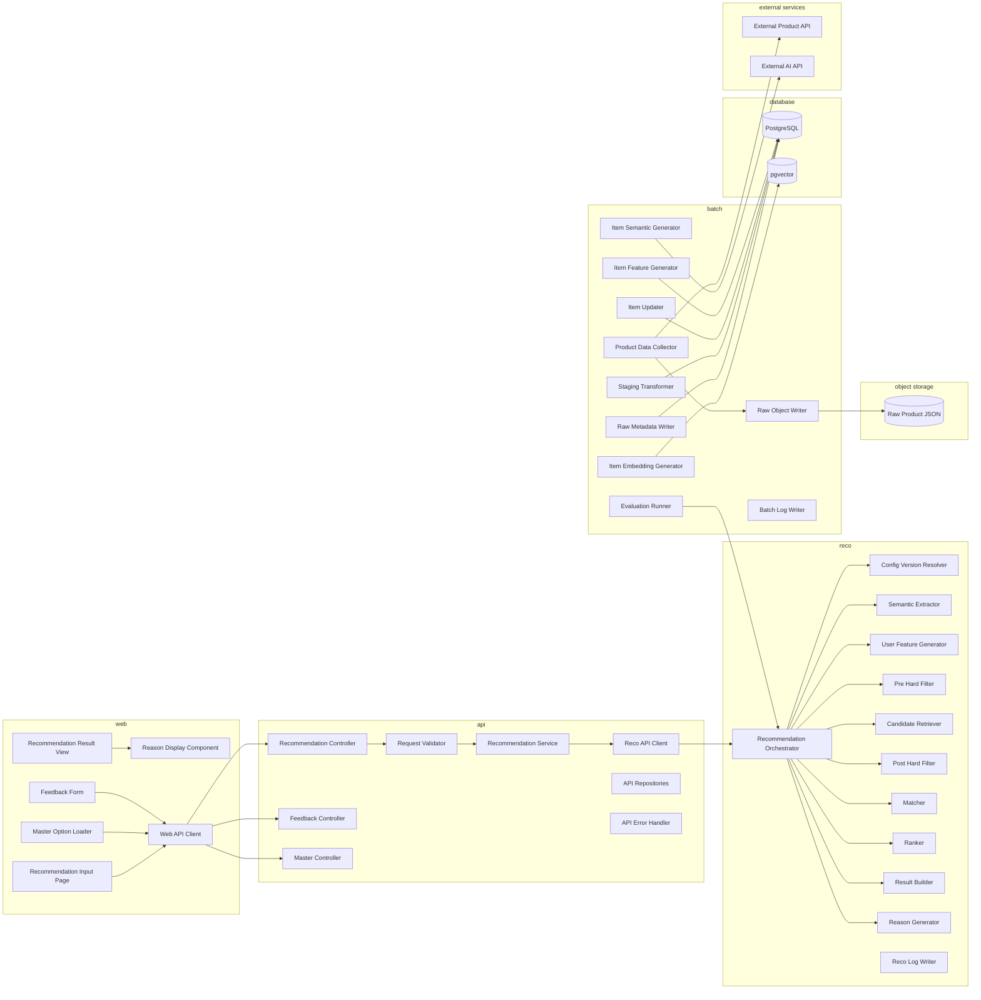
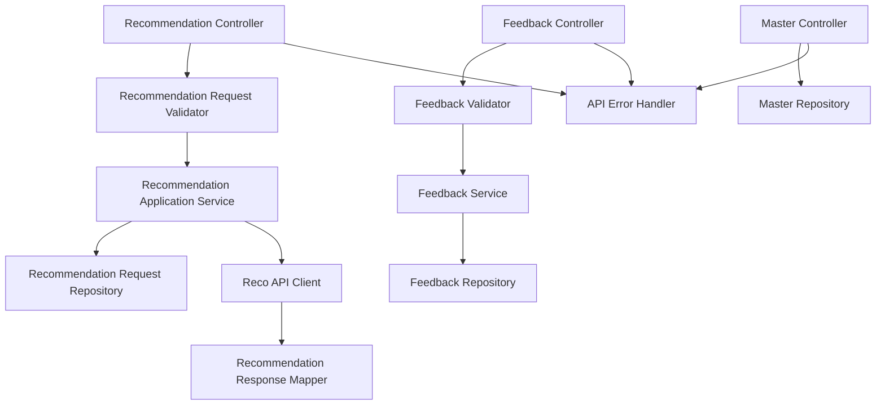
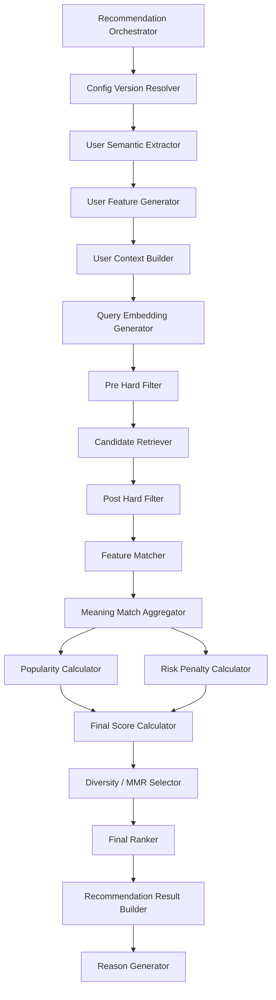
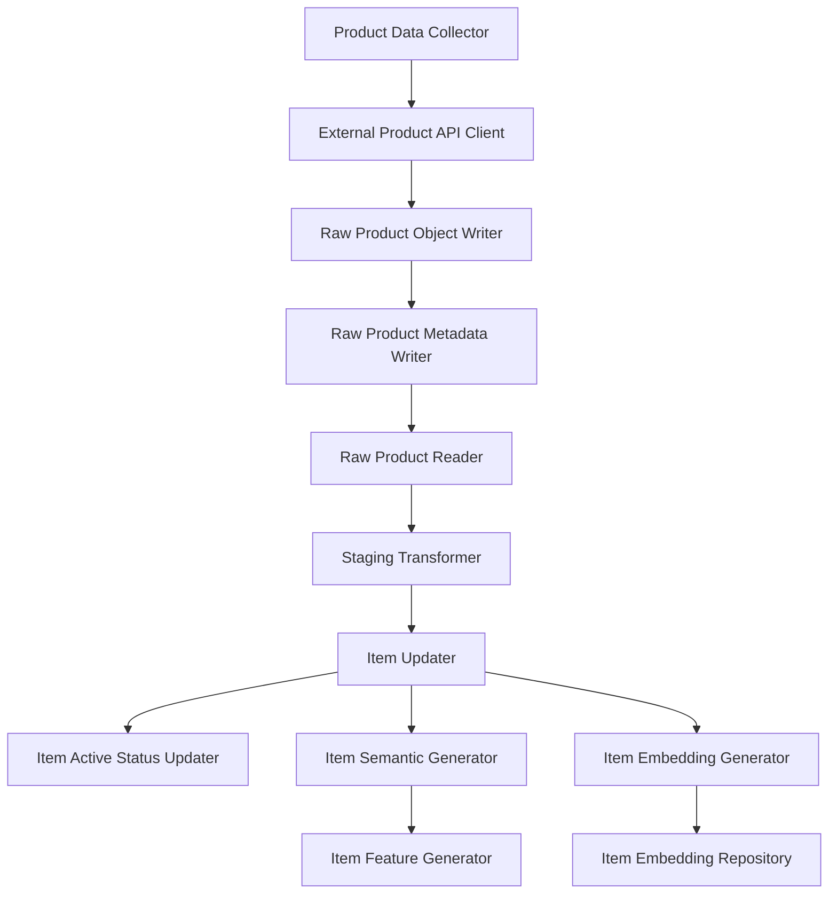

# モジュール一覧

## 1. 概要

### 1.1 目的

本ドキュメントは、Gift Recommendation Service MVPにおけるアプリケーション機能を、実装上の責務単位であるモジュールへ分解する。

`機能一覧.md` では、ユーザー価値・業務処理・システム処理の観点から機能を整理した。  
本ドキュメントでは、それらの機能を以下の観点で実装単位へ落とし込む。

```text
機能
↓
モジュール
↓
API / Batch / Repository / Component / Service
↓
実装ファイル・クラス・関数
```

---

### 1.2 本ドキュメントの位置づけ

| 成果物                        | 本ドキュメントとの関係                                                |
| ----------------------------- | --------------------------------------------------------------------- |
| 機能一覧                      | 本ドキュメントの直接インプット                                        |
| システム論理構成図            | web / api / reco / batch / database / object storage の責務境界の前提 |
| システム物理構成図            | 各モジュールの実行環境の前提                                          |
| 利用技術スタック整理表        | 各モジュールの実装技術の前提                                          |
| Recommendation Request定義書  | 入力系モジュールの前提                                                |
| Recommendation Result定義書   | 結果生成・表示系モジュールの前提                                      |
| Recommendation Feedback定義書 | Feedback系モジュールの前提                                            |
| Retrieval定義書               | Pre Hard Filter / Retrieval / Post Hard Filterの前提                  |
| Matching定義書                | Matching系モジュールの前提                                            |
| Ranking定義書                 | Ranking系モジュールの前提                                             |
| Reason生成定義書              | Reason生成・表示系モジュールの前提                                    |
| Evaluation評価定義書          | Offline Evaluation系モジュールの前提                                  |
| 機能×モジュール対応表         | 本ドキュメントの後続成果物                                            |
| API一覧                       | API化するモジュールを整理する後続成果物                               |
| バッチ一覧                    | Batch実行するモジュールを整理する後続成果物                           |
| インターフェース一覧          | モジュール間・外部サービス間の接続を整理する後続成果物                |

---

## 2. モジュール分割方針

### 2.1 モジュールの定義

本ドキュメントにおけるモジュールとは、以下の条件を満たす実装責務単位である。

| 観点     | 内容                                                   |
| -------- | ------------------------------------------------------ |
| 責務     | ひとつの明確な処理責務を持つ                           |
| 入出力   | 入力・出力が説明できる                                 |
| 配置     | web / api / reco / batch のいずれかに配置できる        |
| 後続設計 | API、Batch、Repository、Service、Componentへ展開できる |
| テスト   | 単体テストまたは結合テストの対象にできる               |

---

### 2.2 分割方針

| 方針                                      | 内容                                                                           |
| ----------------------------------------- | ------------------------------------------------------------------------------ |
| 機能単位から分解する                      | 機能一覧の各機能を実装責務へ分解する                                           |
| web / api / reco / batch の責務を混ぜない | 画面、API受付、推薦ロジック、バッチ処理を分離する                              |
| 推薦ロジックはrecoに集約する              | Semantic / Feature / Retrieval / Matching / Ranking / Reasonはreco側に配置する |
| 商品データ取得はbatchに集約する           | 外部商品API取得、Raw保存、Staging変換、Item反映はbatch側に配置する             |
| Hard Filterは2段階に分ける                | Pre Hard Filter / Post Hard Filterとして分離する                               |
| DB操作はRepository化する                  | 保存・取得処理をServiceやControllerに直書きしない                              |
| 外部サービス呼び出しはClient化する        | 外部商品API、OpenAI API、reco内部APIなどをClientとして分離する                 |
| MVPでは過剰分割しない                     | 将来拡張を意識しつつ、初期実装で扱える粒度にする                               |

---

### 2.3 処理種別

| 処理種別 | 内容                                          |
| -------- | --------------------------------------------- |
| OL       | ユーザー操作に同期して実行されるOnline処理    |
| BT       | 定期実行・手動実行されるBatch処理             |
| 共通     | OL / BTの双方から利用される処理               |
| 運用     | CI/CD、GitHub Actions、ログ確認などの運用処理 |

---

## 3. 全体モジュール構成図



---

## 4. 全体モジュール一覧

| モジュール名                        | 物理名                             | 配置               | 分類           | 処理種別  | MVP対象 | 責務                                                    |
| ----------------------------------- | ---------------------------------- | ------------------ | -------------- | --------- | ------: | ------------------------------------------------------- |
| レコメンド条件入力画面              | Recommendation Input Page          | web                | 画面           | OL        |       ○ | ユーザーから贈答条件を入力させる                        |
| マスタ選択肢取得                    | Master Option Loader               | web                | 画面           | OL        |       ○ | Relationship / Occasion等の選択肢を取得・表示する       |
| レコメンド結果表示                  | Recommendation Result View         | web                | 画面           | OL        |       ○ | 推薦順位、商品情報、推薦理由を表示する                  |
| Reason表示                          | Reason Display Component           | web                | 画面           | OL        |       ○ | reason_summary等をUI表示する                            |
| Feedback入力                        | Feedback Form                      | web                | 画面           | OL        |       ○ | 商品・理由・結果へのFeedbackを入力する                  |
| Web API Client                      | Web API Client                     | web                | 通信           | OL        |       ○ | webからapiを呼び出す                                    |
| レコメンドAPI受付                   | Recommendation Controller          | api                | API            | OL        |       ○ | レコメンド実行APIを受け付ける                           |
| レコメンド入力検証                  | Recommendation Request Validator   | api                | API            | OL        |       ○ | 入力値の形式・必須・値域を検証する                      |
| レコメンドアプリケーションサービス  | Recommendation Application Service | api                | API            | OL        |       ○ | Request保存、reco呼び出し、結果返却を制御する           |
| Reco API Client                     | Reco API Client                    | api                | 通信           | OL        |       ○ | apiからreco内部APIを呼び出す                            |
| Feedback API受付                    | Feedback Controller                | api                | API            | OL        |       ○ | Feedback登録APIを受け付ける                             |
| Feedback検証                        | Feedback Validator                 | api                | API            | OL        |       ○ | Feedback入力値を検証する                                |
| Feedback保存サービス                | Feedback Service                   | api                | API            | OL        |       ○ | Feedbackを保存する                                      |
| マスタAPI受付                       | Master Controller                  | api                | API            | OL        |       ○ | Relationship / Occasion等のマスタ取得APIを提供する      |
| APIエラーハンドラ                   | API Error Handler                  | api                | 共通           | OL        |       ○ | APIエラー形式を統一する                                 |
| Recommendation Repository           | Recommendation Repository          | api / reco         | Repository     | 共通      |       ○ | Request / Run / Result / Result Itemを保存・取得する    |
| Feedback Repository                 | Feedback Repository                | api                | Repository     | OL        |       ○ | Feedbackを保存・取得する                                |
| Master Repository                   | Master Repository                  | api / reco         | Repository     | 共通      |       ○ | Relationship / Occasion / Configを取得する              |
| 推薦実行制御                        | Recommendation Orchestrator        | reco               | 推薦           | OL        |       ○ | 推薦パイプライン全体を制御する                          |
| Config / Version解決                | Config Version Resolver            | reco               | 推薦           | OL        |       ○ | semantic_config_version / model_versionを解決する       |
| Semantic抽出                        | User Semantic Extractor            | reco               | 推薦           | OL        |       ○ | ユーザー入力からSemantic Conceptを抽出する              |
| User Feature生成                    | User Feature Generator             | reco               | 推薦           | OL        |       ○ | ユーザー意図をFeatureへ変換する                         |
| Pre Hard Filter                     | Pre Hard Filter                    | reco               | Retrieval      | OL        |       ○ | Retrieval前に予算・有効状態・明確なNG条件で絞り込む     |
| 候補商品抽出                        | Candidate Retriever                | reco               | Retrieval      | OL        |       ○ | Pre Hard Filter後の商品集合から候補商品を抽出する       |
| Post Hard Filter                    | Post Hard Filter                   | reco               | Retrieval      | OL        |       ○ | Retrieval後にSemantic NG・不整合・重複を確認する        |
| Feature一致度計算                   | Feature Matcher                    | reco               | Matching       | OL        |       ○ | User FeatureとItem FeatureのFeature単位一致度を計算する |
| 意味マッチ集約                      | Meaning Match Aggregator           | reco               | Matching       | OL        |       ○ | social_match / symbolic_match / context_scoreを算出する |
| 人気補正算出                        | Popularity Calculator              | reco               | Ranking        | OL        |       ○ | popularity_scoreを算出する                              |
| リスク補正算出                      | Risk Penalty Calculator            | reco               | Ranking        | OL        |       ○ | risk_penaltyを算出する                                  |
| 最終スコア算出                      | Final Score Calculator             | reco               | Ranking        | OL        |       ○ | final_scoreを算出する                                   |
| 多様性調整                          | Diversity / MMR Selector           | reco               | Ranking        | OL        |       ○ | 類似しすぎる候補を抑制し、選択肢の幅を確保する          |
| 最終順位生成                        | Final Ranker                       | reco               | Ranking        | OL        |       ○ | final_score等に基づきrankを決定する                     |
| レコメンド結果生成                  | Recommendation Result Builder      | reco               | 出力           | OL        |       ○ | recommendation_result / result_itemを生成・保存する     |
| Reason生成                          | Reason Generator                   | reco               | 出力           | OL        |       ○ | 商品ごとの推薦理由を生成する                            |
| Reco Log Writer                     | Reco Log Writer                    | reco               | ログ           | 共通      |       ○ | 推薦処理のphase log / error logを記録する               |
| 商品データ取得                      | Product Data Collector             | batch              | 商品データ連携 | BT        |       ○ | 外部商品APIから商品データを取得する                     |
| Raw商品データ保存                   | Raw Product Object Writer          | batch              | 商品データ連携 | BT        |       ○ | Raw JSON本体をObject Storageへ保存する                  |
| Rawメタデータ保存                   | Raw Product Metadata Writer        | batch              | 商品データ連携 | BT        |       ○ | object key / hash / fetched_at等をDBへ保存する          |
| Rawデータ読取                       | Raw Product Reader                 | batch              | 商品データ連携 | BT        |       ○ | Staging変換用にObject StorageからRawを読む              |
| Staging変換                         | Staging Transformer                | batch              | 商品データ連携 | BT        |       ○ | Rawデータを内部取込形式へ変換する                       |
| Item反映                            | Item Updater                       | batch              | 商品データ連携 | BT        |       ○ | stagingからitem正本へ反映する                           |
| 商品有効状態更新                    | Item Active Status Updater         | batch              | 商品データ連携 | BT        |       ○ | 商品の有効・無効状態を更新する                          |
| Item Semantic抽出                   | Item Semantic Generator            | batch / reco       | 商品意味推定   | BT        |       ○ | 商品情報からSemantic Conceptを抽出する                  |
| Item Feature生成                    | Item Feature Generator             | batch / reco       | 商品意味推定   | BT        |       ○ | item_semantic等からitem_featureを生成する               |
| Item Embedding生成                  | Item Embedding Generator           | batch              | 商品意味推定   | BT        |       ○ | 商品検索用Embeddingを生成する                           |
| Embedding保存                       | Item Embedding Repository          | batch              | Repository     | BT        |       ○ | item_embeddingをpgvectorへ保存する                      |
| Offline Evaluation実行              | Offline Evaluation Runner          | batch              | 評価           | BT        |       ○ | 評価データセットで推薦処理を実行する                    |
| Evaluation Result保存               | Evaluation Result Writer           | batch              | 評価           | BT        |       ○ | 評価結果をDBへ保存する                                  |
| Feedback分析                        | Feedback Analyzer                  | batch              | 評価           | BT / 運用 |       △ | Feedbackを集計し改善材料にする                          |
| 失敗分析                            | Failure Analyzer                   | batch              | 評価           | BT / 運用 |       △ | 失敗原因を分類する                                      |
| Batch Log Writer                    | Batch Log Writer                   | batch              | ログ           | BT        |       ○ | Batch実行ログ・エラーログを記録する                     |
| External Product API Client         | External Product API Client        | batch              | 通信           | BT        |       ○ | 楽天API等の外部商品APIを呼び出す                        |
| External AI API Client              | External AI API Client             | reco / batch       | 通信           | 共通      |       ○ | OpenAI API等を呼び出す                                  |
| Object Storage Client               | Object Storage Client              | batch              | 通信           | BT        |       ○ | S3 / S3互換Storageを操作する                            |
| DB Connection / Transaction Manager | DB Connection Manager              | api / reco / batch | 共通           | 共通      |       ○ | DB接続・トランザクションを管理する                      |
| CI Workflow                         | CI Workflow                        | devops             | 運用           | 運用      |       ○ | lint / test / buildを実行する                           |
| Batch Workflow                      | Batch Workflow                     | devops             | 運用           | 運用      |       ○ | GitHub ActionsでBatchを実行する                         |
| GitHub Automation Workflow          | GitHub Automation Workflow         | devops             | 運用           | 運用      |       ○ | Issue / Label / Branch / PR運用を補助する               |

---

## 5. webモジュール一覧

### 5.1 webモジュールの責務

webは、ユーザーが直接触れる画面・UI状態・API呼び出しを担当する。  
推薦ロジック、DB直接操作、外部AI API呼び出しは担当しない。

---

### 5.2 webモジュール一覧

| モジュール名           | 物理名                     | 処理種別 | MVP対象 | 主な入力                                                          | 主な出力                        | 責務                               |
| ---------------------- | -------------------------- | -------- | ------: | ----------------------------------------------------------------- | ------------------------------- | ---------------------------------- |
| レコメンド条件入力画面 | Recommendation Input Page  | OL       |       ○ | ユーザー入力                                                      | recommendation_request_payload  | 贈答条件入力フォームを提供する     |
| 条件入力フォーム       | Recommendation Input Form  | OL       |       ○ | relationship / occasion / budget / preferred / non_preferred / ng | form state                      | 入力項目をフォームとして管理する   |
| マスタ選択肢取得       | Master Option Loader       | OL       |       ○ | master API response                                               | relationship / occasion options | 選択肢を取得して画面に渡す         |
| 入力補助バリデーション | Client Validation Helper   | OL       |       ○ | form state                                                        | validation message              | 明らかな入力不備を画面側で検知する |
| レコメンド結果表示     | Recommendation Result View | OL       |       ○ | recommendation_result                                             | result page                     | 推薦結果一覧を表示する             |
| 商品カード表示         | Recommendation Item Card   | OL       |       ○ | result_item / item snapshot / reason                              | item card                       | 推薦商品単位の表示を行う           |
| Reason表示             | Reason Display Component   | OL       |       ○ | recommendation_reason                                             | reason UI                       | 推薦理由を表示する                 |
| Feedback入力           | Feedback Form              | OL       |       ○ | result / result_item / reason                                     | feedback_payload                | ユーザーFeedbackを入力する         |
| ローディング表示       | Loading State Component    | OL       |       ○ | request state                                                     | loading UI                      | 推薦実行中の待機状態を表示する     |
| エラー表示             | Error Message Component    | OL       |       ○ | error response                                                    | error UI                        | 入力エラー・APIエラーを表示する    |
| Web API Client         | Web API Client             | OL       |       ○ | API request payload                                               | API response                    | apiへの通信を集約する              |

---

### 5.3 レコメンド結果表示モジュール

| 項目         | 内容                       |
| ------------ | -------------------------- |
| モジュール名 | レコメンド結果表示         |
| 物理名       | Recommendation Result View |
| 配置         | web                        |
| 処理種別     | OL                         |
| MVP対象      | ○                          |
| 主な入力     | Recommendation Result      |
| 主な出力     | 推薦結果画面               |

#### 表示対象

| 表示項目           | 内容                                                    |
| ------------------ | ------------------------------------------------------- |
| 推薦順位           | final_scoreに基づく表示順位。例：おすすめ順1位、第1候補 |
| 商品名             | 推薦商品の名称                                          |
| 商品画像           | 商品画像URL                                             |
| 商品キャッチコピー | 商品の魅力・特徴を短く示すキャッチコピー                |
| 価格               | 表示時点の価格                                          |
| 商品URL            | 外部ECの商品ページ                                      |
| reason_badges      | 「上品」「実用的」「外しにくい」などの表示ラベル        |
| reason_summary     | 商品カード上に表示する短い推薦理由                      |
| reason_detail      | 詳細表示用の推薦理由                                    |
| reason_points      | 箇条書きの推薦理由                                      |
| caution_note       | 必要に応じた補足・注意文                                |
| 補足メッセージ     | 条件不足、Fallback利用時、空結果時などの補足            |

#### 通常UIに表示しない内部項目

| 項目              | 用途                                           |
| ----------------- | ---------------------------------------------- |
| final_score       | 順位算出用。通常UIでは数値をそのまま表示しない |
| score_breakdown   | デバッグ・評価・管理用途                       |
| reason_basis      | Reason生成根拠の保存・評価・デバッグ用途       |
| generation_method | Reason生成方式の管理                           |
| model_version_id  | モデル・Reason生成ロジックのバージョン管理     |

---

## 6. apiモジュール一覧

### 6.1 apiモジュールの責務

apiは、webからのリクエスト受付、入力検証、DB保存、reco呼び出し、レスポンス整形を担当する。  
Semantic抽出、Feature生成、Retrieval、Matching、Rankingなどの推薦ロジック本体は担当しない。

---

### 6.2 apiモジュール一覧

| モジュール名                       | 物理名                             | 処理種別 | MVP対象 | 主な入力               | 主な出力                | 責務                                                |
| ---------------------------------- | ---------------------------------- | -------- | ------: | ---------------------- | ----------------------- | --------------------------------------------------- |
| レコメンドAPI受付                  | Recommendation Controller          | OL       |       ○ | HTTP request           | application command     | `POST /recommendations` を受け付ける                |
| レコメンド入力検証                 | Recommendation Request Validator   | OL       |       ○ | request body           | validated request       | 入力形式・必須・値域・矛盾を検証する                |
| レコメンドアプリケーションサービス | Recommendation Application Service | OL       |       ○ | validated request      | recommendation response | Request保存、reco呼び出し、レスポンス返却を制御する |
| Recommendation Request保存         | Recommendation Request Repository  | OL       |       ○ | recommendation_request | saved request           | Recommendation Requestを保存する                    |
| reco推薦実行依頼                   | Reco API Client                    | OL       |       ○ | reco request           | reco response           | reco内部APIを呼び出す                               |
| レコメンド結果返却整形             | Recommendation Response Mapper     | OL       |       ○ | reco response          | web response            | web向けレスポンスへ整形する                         |
| Feedback API受付                   | Feedback Controller                | OL       |       ○ | HTTP request           | application command     | Feedback登録APIを受け付ける                         |
| Feedback検証                       | Feedback Validator                 | OL       |       ○ | feedback request       | validated feedback      | Feedback対象・種別・値を検証する                    |
| Feedback保存サービス               | Feedback Service                   | OL       |       ○ | validated feedback     | saved feedback          | Feedbackを保存する                                  |
| Feedback Repository                | Feedback Repository                | OL       |       ○ | feedback entity        | saved record            | recommendation_feedbackを保存する                   |
| マスタAPI受付                      | Master Controller                  | OL       |       ○ | HTTP request           | master response         | Relationship / Occasion等を返却する                 |
| Master Repository                  | Master Repository                  | 共通     |       ○ | master query           | master records          | マスタ・設定データを取得する                        |
| APIエラーハンドラ                  | API Error Handler                  | OL       |       ○ | exception / error      | error response          | エラーレスポンス形式を統一する                      |

---

### 6.3 api内の主要依存関係



---

## 7. recoモジュール一覧

### 7.1 recoモジュールの責務

recoは、推薦パイプライン本体を担当する。

```text
Recommendation Request
↓
Semantic抽出
↓
User Feature生成
↓
Pre Hard Filter
↓
Retrieval
↓
Post Hard Filter
↓
Matching
↓
Ranking
↓
Recommendation Result生成
↓
Reason生成
```

---

### 7.2 recoモジュール一覧

| モジュール名           | 物理名                        | 処理種別 | MVP対象 | 主な入力                                                        | 主な出力                                      | 責務                                              |
| ---------------------- | ----------------------------- | -------- | ------: | --------------------------------------------------------------- | --------------------------------------------- | ------------------------------------------------- |
| 推薦実行制御           | Recommendation Orchestrator   | OL       |       ○ | reco request                                                    | recommendation result                         | 推薦パイプライン全体を制御する                    |
| Config / Version解決   | Config Version Resolver       | OL       |       ○ | request mode / current config                                   | semantic_config_version / model_version       | 使用する設定・モデルバージョンを決定する          |
| Semantic抽出           | User Semantic Extractor       | OL       |       ○ | preferred / non_preferred / relationship / occasion             | semantic_extraction_result                    | ユーザー入力からSemantic Conceptを抽出する        |
| User Feature生成       | User Feature Generator        | OL       |       ○ | relationship / occasion / semantic result                       | user_feature                                  | ユーザー意図をFeatureへ変換する                   |
| User Context生成       | User Context Builder          | OL       |       ○ | request / semantic result                                       | user_context                                  | RetrievalやReason生成に使うユーザー文脈を生成する |
| Query Embedding生成    | Query Embedding Generator     | OL       |       ○ | user_context                                                    | query_embedding                               | Retrieval用の検索ベクトルを生成する               |
| Pre Hard Filter        | Pre Hard Filter               | OL       |       ○ | budget条件 / ng条件 / item metadata                             | pre_filtered_item_pool                        | Retrieval前に商品集合を絞り込む                   |
| 候補商品抽出           | Candidate Retriever           | OL       |       ○ | pre_filtered_item_pool / query_embedding / item_embedding       | retrieval_candidate                           | Embedding検索・Hybrid検索で候補商品を抽出する     |
| Post Hard Filter       | Post Hard Filter              | OL       |       ○ | retrieval_candidate / request / semantic result / item_semantic | validated_retrieval_candidate                 | Retrieval後に最終除外条件を確認する               |
| Feature一致度計算      | Feature Matcher               | OL       |       ○ | user_feature / item_feature / validated candidate               | feature_match                                 | Feature単位の一致度を計算する                     |
| 意味マッチ集約         | Meaning Match Aggregator      | OL       |       ○ | feature_match                                                   | social_match / symbolic_match / context_score | Feature一致度を集約する                           |
| 人気補正算出           | Popularity Calculator         | OL       |       ○ | item metadata / review / popularity signal                      | popularity_score                              | 人気・信頼性スコアを算出する                      |
| リスク補正算出         | Risk Penalty Calculator       | OL       |       ○ | request / item_feature / avoid similarity                       | risk_penalty                                  | 贈答リスク・avoid条件の補正値を算出する           |
| 最終スコア算出         | Final Score Calculator        | OL       |       ○ | context_score / popularity_score / risk_penalty                 | final_score                                   | 最終スコアを算出する                              |
| 多様性調整             | Diversity / MMR Selector      | OL       |       ○ | ranked candidates / item similarity                             | diversified_candidates                        | 類似しすぎる候補を抑制する                        |
| 最終順位生成           | Final Ranker                  | OL       |       ○ | final_score / diversified candidates                            | rank                                          | 表示順位を決定する                                |
| レコメンド結果生成     | Recommendation Result Builder | OL       |       ○ | ranked items / score breakdown                                  | recommendation_result / result_item           | 推薦結果を構造化して保存する                      |
| Reason生成             | Reason Generator              | OL       |       ○ | result_item / score_breakdown / relationship / occasion         | recommendation_reason                         | 推薦理由を生成する                                |
| Reco Repository        | Reco Repository               | 共通     |       ○ | query / entity                                                  | DB record                                     | recoが扱うDB保存・取得を担当する                  |
| Reco Log Writer        | Reco Log Writer               | 共通     |       ○ | phase / error / metrics                                         | phase_log / error_log                         | 推薦処理ログを記録する                            |
| External AI API Client | External AI API Client        | 共通     |       ○ | prompt / embedding input                                        | AI response                                   | OpenAI API等を呼び出す                            |

---

### 7.3 推薦パイプライン内の依存関係



---

### 7.4 Pre Hard Filter

| 項目         | 内容                                                                |
| ------------ | ------------------------------------------------------------------- |
| モジュール名 | Pre Hard Filter                                                     |
| 配置         | reco                                                                |
| 処理種別     | OL                                                                  |
| MVP対象      | ○                                                                   |
| 主な入力     | Recommendation Request / budget条件 / ng条件 / item / item metadata |
| 主な出力     | pre_filtered_item_pool                                              |
| 関連機能     | Pre Hard Filter                                                     |
| 関連定義     | Recommendation Request定義書 / Retrieval定義書                      |

#### 主な処理

```text
予算条件による絞り込み
商品有効状態による絞り込み
販売状態による絞り込み
明確なNGカテゴリの除外
明確なNGキーワードの除外
データ品質最低条件による除外
```

---

### 7.5 Candidate Retriever

| 項目         | 内容                                                                                              |
| ------------ | ------------------------------------------------------------------------------------------------- |
| モジュール名 | Candidate Retriever                                                                               |
| 配置         | reco                                                                                              |
| 処理種別     | OL                                                                                                |
| MVP対象      | ○                                                                                                 |
| 主な入力     | pre_filtered_item_pool / Recommendation Request / user_feature / query_embedding / item_embedding |
| 主な出力     | retrieval_candidate                                                                               |
| 関連機能     | 候補商品抽出                                                                                      |
| 関連定義     | Retrieval定義書                                                                                   |

#### 主な処理

```text
Embedding検索
キーワード検索
Hybrid検索
candidate取得
```

---

### 7.6 Post Hard Filter

| 項目         | 内容                                                                                      |
| ------------ | ----------------------------------------------------------------------------------------- |
| モジュール名 | Post Hard Filter                                                                          |
| 配置         | reco                                                                                      |
| 処理種別     | OL                                                                                        |
| MVP対象      | ○                                                                                         |
| 主な入力     | retrieval_candidate / Recommendation Request / semantic_extraction_result / item_semantic |
| 主な出力     | validated_retrieval_candidate / excluded_candidate_log                                    |
| 関連機能     | Post Hard Filter                                                                          |
| 関連定義     | Retrieval定義書 / Semanticルール定義書 / Recommendation Request定義書                     |

#### 主な処理

```text
Semantic NG確認
avoid類似確認
重複・不整合確認
最終表示前Validation
```

---

### 7.7 Matching系モジュール

| モジュール名      | 物理名                   | 主な入力                              | 主な出力                      | 責務                                  |
| ----------------- | ------------------------ | ------------------------------------- | ----------------------------- | ------------------------------------- |
| Feature一致度計算 | Feature Matcher          | user_feature / item_feature           | feature_match                 | Feature単位の距離・一致度を計算する   |
| 意味マッチ集約    | Meaning Match Aggregator | feature_match                         | social_match / symbolic_match | Social / Symbolic別の一致度を集約する |
| 文脈スコア算出    | Context Score Calculator | social_match / symbolic_match / λ_ctx | context_score                 | 贈答文脈に対する総合一致度を算出する  |

---

### 7.8 Ranking系モジュール

| モジュール名   | 物理名                   | 主な入力                                        | 主な出力               | 責務                                |
| -------------- | ------------------------ | ----------------------------------------------- | ---------------------- | ----------------------------------- |
| 人気補正算出   | Popularity Calculator    | item metadata / review / rating                 | popularity_score       | 人気・安心材料をスコア化する        |
| リスク補正算出 | Risk Penalty Calculator  | request / item_feature / avoid similarity       | risk_penalty           | 贈答リスクやavoid条件をスコア化する |
| 最終スコア算出 | Final Score Calculator   | context_score / popularity_score / risk_penalty | final_score            | 最終ランキング用スコアを算出する    |
| 多様性調整     | Diversity / MMR Selector | ranked candidates / item similarity             | diversified_candidates | 類似候補の偏りを抑える              |
| 最終順位生成   | Final Ranker             | final_score / diversified candidates            | rank                   | 表示順位を決定する                  |

---

### 7.9 Reason生成モジュール

| 項目         | 内容                                                                                                                    |
| ------------ | ----------------------------------------------------------------------------------------------------------------------- |
| モジュール名 | Reason生成                                                                                                              |
| 物理名       | Reason Generator                                                                                                        |
| 配置         | reco                                                                                                                    |
| 処理種別     | OL                                                                                                                      |
| MVP対象      | ○                                                                                                                       |
| 主な入力     | recommendation_result_item / rank / final_score / context_score / score_breakdown / relationship / occasion / item_data |
| 主な出力     | recommendation_reason                                                                                                   |
| 関連機能     | Reason生成                                                                                                              |
| 関連定義     | Reason生成定義書                                                                                                        |

#### 生成対象

| 出力              | 用途                       |
| ----------------- | -------------------------- |
| reason_summary    | 商品カード上の短い推薦理由 |
| reason_detail     | 詳細表示用の推薦理由       |
| reason_points     | 箇条書き理由               |
| reason_badges     | 表示ラベル                 |
| caution_note      | 必要に応じた注意文         |
| reason_basis      | 内部根拠・評価・デバッグ用 |
| generation_method | 生成方式管理               |
| model_version_id  | バージョン管理             |

---

## 8. batchモジュール一覧

### 8.1 batchモジュールの責務

batchは、Online推薦の前提となる商品データ・商品意味情報・Embedding・評価結果を準備する。

```text
External Product API
↓
Raw保存
↓
Raw Metadata保存
↓
Staging変換
↓
Item反映
↓
Item Semantic / Feature / Embedding生成
↓
Online推薦で利用
```

---

### 8.2 batchモジュール一覧

| モジュール名           | 物理名                      | 処理種別  | MVP対象 | 主な入力                             | 主な出力                  | 責務                                   |
| ---------------------- | --------------------------- | --------- | ------: | ------------------------------------ | ------------------------- | -------------------------------------- |
| 商品データ取得         | Product Data Collector      | BT        |       ○ | API query condition                  | external product response | 外部商品APIから商品情報を取得する      |
| 外部商品API Client     | External Product API Client | BT        |       ○ | request params / API key             | raw response              | 楽天API等を呼び出す                    |
| Raw商品データ保存      | Raw Product Object Writer   | BT        |       ○ | raw JSON                             | object key                | Raw JSON本体をObject Storageへ保存する |
| Rawメタデータ保存      | Raw Product Metadata Writer | BT        |       ○ | object key / hash / fetched_at       | raw_product_metadata      | Raw保存情報をDBへ保存する              |
| Rawデータ読取          | Raw Product Reader          | BT        |       ○ | object key                           | raw JSON                  | Staging変換用にRawを読み取る           |
| Staging変換            | Staging Transformer         | BT        |       ○ | raw JSON                             | staging_item              | 外部形式を内部取込形式へ変換する       |
| Item反映               | Item Updater                | BT        |       ○ | staging_item                         | item / item関連データ     | item正本へ反映する                     |
| 商品有効状態更新       | Item Active Status Updater  | BT        |       ○ | latest import status / item status   | item.is_active            | 商品の有効・無効状態を更新する         |
| Item Semantic抽出      | Item Semantic Generator     | BT        |       ○ | item data                            | item_semantic             | 商品情報からSemantic Conceptを抽出する |
| Item Feature生成       | Item Feature Generator      | BT        |       ○ | item_semantic / item metadata        | item_feature              | 商品Featureを生成する                  |
| Item Embedding生成     | Item Embedding Generator    | BT        |       ○ | item text context                    | item_embedding            | 商品検索用Embeddingを生成する          |
| Embedding保存          | Item Embedding Repository   | BT        |       ○ | item_embedding                       | pgvector record           | Embeddingを保存する                    |
| Offline Evaluation実行 | Offline Evaluation Runner   | BT        |       ○ | evaluation_dataset                   | evaluation_result         | 評価データセットで推薦処理を実行する   |
| Evaluation Result保存  | Evaluation Result Writer    | BT        |       ○ | evaluation result                    | evaluation_result record  | 評価結果をDBへ保存する                 |
| Feedback分析           | Feedback Analyzer           | BT / 運用 |       △ | recommendation_feedback              | feedback summary          | Feedbackを集計・分析する               |
| 失敗分析               | Failure Analyzer            | BT / 運用 |       △ | evaluation result / feedback / score | failure analysis          | 推薦失敗の原因を分類する               |
| Batch Log Writer       | Batch Log Writer            | BT        |       ○ | batch phase / error                  | batch log / error log     | Batch実行状態を記録する                |
| Object Storage Client  | Object Storage Client       | BT        |       ○ | object operation                     | object result             | S3 / S3互換Storageを操作する           |
| External AI API Client | External AI API Client      | BT        |       ○ | item text / prompt                   | semantic / embedding      | OpenAI API等を呼び出す                 |

---

### 8.3 商品データ連携モジュール依存関係



---

### 8.4 Raw保存モジュール

| 項目         | 内容                      |
| ------------ | ------------------------- |
| モジュール名 | Raw商品データ保存         |
| 物理名       | Raw Product Object Writer |
| 配置         | batch                     |
| 処理種別     | BT                        |
| MVP対象      | ○                         |
| 主な入力     | 外部商品APIレスポンスJSON |
| 主な出力     | object key                |
| 保存先       | Object Storage            |

Raw JSON本体はDBへ保存せず、Object Storageへ保存する。  
DBにはRaw Metadataのみを保存する。

---

### 8.5 Item Feature生成モジュール

| 項目         | 内容                                |
| ------------ | ----------------------------------- |
| モジュール名 | Item Feature生成                    |
| 物理名       | Item Feature Generator              |
| 配置         | batch / reco                        |
| 処理種別     | BT                                  |
| MVP対象      | ○                                   |
| 主な入力     | item_semantic / item metadata       |
| 主な出力     | item_feature                        |
| 関連定義     | Feature定義書 / Featureルール定義書 |

#### 主な商品情報ソース

| source_type      | 内容               |
| ---------------- | ------------------ |
| item_name        | 商品名             |
| item_caption     | 商品キャッチコピー |
| item_description | 商品説明           |
| item_genre       | 商品ジャンル       |
| item_tag         | 商品タグ           |
| item_review      | レビュー文         |
| item_brand       | ブランド情報       |
| item_price       | 価格情報           |

---

## 9. database / repositoryモジュール一覧

### 9.1 Repository分割方針

DB操作は、ControllerやPipeline処理に直接書かず、Repositoryモジュールへ分離する。

| 方針                 | 内容                                                     |
| -------------------- | -------------------------------------------------------- |
| 保存責務を分離する   | Service / PipelineからDB操作を切り離す                   |
| テストしやすくする   | DBアクセス部分をモック・差し替え可能にする               |
| 再利用可能にする     | api / reco / batchで共通利用できるものを整理する         |
| 正本管理を明確にする | Request / Result / Item / Feedback等の保存先を明確にする |

---

### 9.2 Repository一覧

| モジュール名                       | 配置               | 処理種別 | MVP対象 | 主な対象データ                          | 責務                     |
| ---------------------------------- | ------------------ | -------- | ------: | --------------------------------------- | ------------------------ |
| Recommendation Request Repository  | api                | OL       |       ○ | recommendation_request                  | Request保存・取得        |
| Recommendation Run Repository      | reco               | OL       |       ○ | recommendation_run                      | 推薦実行単位の保存・更新 |
| Recommendation Result Repository   | reco               | OL       |       ○ | recommendation_result / result_item     | 推薦結果保存             |
| Recommendation Reason Repository   | reco               | OL       |       ○ | recommendation_reason                   | Reason保存               |
| Recommendation Feedback Repository | api                | OL       |       ○ | recommendation_feedback                 | Feedback保存             |
| Master Repository                  | api / reco         | 共通     |       ○ | relationship / occasion                 | マスタ取得               |
| Config Repository                  | reco               | 共通     |       ○ | semantic_config_version / model_version | Config / Version取得     |
| Item Repository                    | reco / batch       | 共通     |       ○ | item                                    | 商品取得・保存           |
| Item Feature Repository            | reco / batch       | 共通     |       ○ | item_feature                            | 商品Feature取得・保存    |
| Item Embedding Repository          | reco / batch       | 共通     |       ○ | item_embedding                          | Embedding取得・保存      |
| Raw Metadata Repository            | batch              | BT       |       ○ | raw_product_metadata                    | Rawメタデータ保存        |
| Staging Repository                 | batch              | BT       |       ○ | staging_item                            | Staging保存・取得        |
| Evaluation Repository              | batch              | BT       |       ○ | evaluation_dataset / evaluation_result  | 評価データ保存・取得     |
| Log Repository                     | api / reco / batch | 共通     |       ○ | phase_log / error_log                   | ログ保存                 |

---

## 10. external clientモジュール一覧

### 10.1 外部接続方針

外部APIや外部サービスへの接続は、専用Clientモジュールとして分離する。

| 理由                           | 内容                                  |
| ------------------------------ | ------------------------------------- |
| API仕様変更に強くする          | 外部APIの変更影響をClientに閉じ込める |
| テストしやすくする             | 外部通信をmockできる                  |
| Secret管理を集約する           | API Keyや接続先をClient側に閉じる     |
| リトライ・エラー制御を統一する | 外部通信の失敗処理を共通化する        |

---

### 10.2 Client一覧

| モジュール名                | 配置               | 処理種別 | MVP対象 | 接続先             | 責務                                    |
| --------------------------- | ------------------ | -------- | ------: | ------------------ | --------------------------------------- |
| Web API Client              | web                | OL       |       ○ | api                | webからapiを呼び出す                    |
| Reco API Client             | api                | OL       |       ○ | reco               | apiからrecoを呼び出す                   |
| External Product API Client | batch              | BT       |       ○ | 楽天API等          | 商品データを取得する                    |
| External AI API Client      | reco / batch       | 共通     |       ○ | OpenAI API等       | Embedding / Semantic / Reason生成を行う |
| Object Storage Client       | batch              | BT       |       ○ | S3 / S3互換Storage | Raw JSONを保存・読取する                |
| DB Connection Manager       | api / reco / batch | 共通     |       ○ | PostgreSQL         | DB接続を管理する                        |

---

## 11. devopsモジュール一覧

### 11.1 devopsモジュールの位置づけ

devopsモジュールは、アプリケーションコードそのものではなく、GitHub ActionsやGitHub運用を支える自動化単位である。

---

### 11.2 devopsモジュール一覧

| モジュール名               | 物理名                 | 処理種別 | MVP対象 | 責務                                    |
| -------------------------- | ---------------------- | -------- | ------: | --------------------------------------- |
| CI Workflow                | ci.yml                 | 運用     |       ○ | lint / test / buildを実行する           |
| Batch Workflow             | batch.yml              | 運用     |       ○ | 商品データ取得・評価等のBatchを実行する |
| Label Automation Workflow  | label-automation.yml   | 運用     |       ○ | Issue本文からLabelを自動付与する        |
| Branch Automation Workflow | create-branch.yml      | 運用     |       ○ | Issue単位でBranchを自動作成する         |
| PR Check Workflow          | pr-check.yml           | 運用     |       ○ | PR作成・更新時に品質チェックを行う      |
| Deploy Workflow            | deploy.yml             | 運用     |       △ | web / api / recoのデプロイを補助する    |
| Secrets Management         | GitHub Actions Secrets | 運用     |       ○ | API Key / DB URL / S3 Keyを管理する     |

---

## 12. モジュール配置方針

### 12.1 monorepo配置イメージ

```text
apps/
  web/
    src/
      app/
      components/
      features/
        recommendation/
        feedback/
      lib/
        api-client/

  api/
    src/
      controllers/
      validators/
      services/
      repositories/
      clients/
      middlewares/

  reco/
    src/
      reco/
        orchestrator/
        config/
        semantic/
        feature/
        retrieval/
        matching/
        ranking/
        reason/
        repositories/
        logging/

  batch/
    src/
      collectors/
      raw/
      staging/
      item/
      semantic/
      feature/
      embedding/
      evaluation/
      repositories/
      clients/
      logging/

docs/
  application/
  domain/
  database/
  devops/

.github/
  workflows/
```

---

### 12.2 コンポーネント別配置方針

| 配置                | 主なモジュール                                                            |
| ------------------- | ------------------------------------------------------------------------- |
| `apps/web`          | 画面、フォーム、表示コンポーネント、Web API Client                        |
| `apps/api`          | Controller、Validator、Application Service、Repository、Reco API Client   |
| `apps/reco`         | 推薦パイプライン、Semantic、Feature、Retrieval、Matching、Ranking、Reason |
| `apps/batch`        | 商品データ取得、Raw保存、Staging、Item反映、Embedding、Evaluation         |
| `.github/workflows` | CI、Batch実行、Issue/Branch/PR自動化                                      |
| `docs`              | 成果物ドキュメント                                                        |

---

## 13. モジュール間データ連携

### 13.1 Online処理

| From                               | To                                | 主なデータ                     |
| ---------------------------------- | --------------------------------- | ------------------------------ |
| Recommendation Input Page          | Web API Client                    | recommendation_request_payload |
| Web API Client                     | Recommendation Controller         | HTTP request                   |
| Recommendation Controller          | Recommendation Request Validator  | request body                   |
| Recommendation Application Service | Recommendation Request Repository | recommendation_request         |
| Recommendation Application Service | Reco API Client                   | reco request                   |
| Reco API Client                    | Recommendation Orchestrator       | recommendation_request         |
| Recommendation Orchestrator        | User Semantic Extractor           | user input                     |
| User Semantic Extractor            | User Feature Generator            | semantic_extraction_result     |
| User Feature Generator             | Pre Hard Filter                   | user_feature / request         |
| Pre Hard Filter                    | Candidate Retriever               | pre_filtered_item_pool         |
| Candidate Retriever                | Post Hard Filter                  | retrieval_candidate            |
| Post Hard Filter                   | Feature Matcher                   | validated_retrieval_candidate  |
| Feature Matcher                    | Meaning Match Aggregator          | feature_match                  |
| Meaning Match Aggregator           | Final Score Calculator            | context_score                  |
| Final Score Calculator             | Final Ranker                      | final_score                    |
| Final Ranker                       | Recommendation Result Builder     | ranked items                   |
| Recommendation Result Builder      | Reason Generator                  | result_item / score_breakdown  |
| Reason Generator                   | Recommendation Response Mapper    | recommendation_reason          |
| Recommendation Response Mapper     | Recommendation Result View        | recommendation_result          |

---

### 13.2 Batch処理

| From                        | To                          | 主なデータ         |
| --------------------------- | --------------------------- | ------------------ |
| Product Data Collector      | External Product API Client | API request params |
| External Product API Client | Raw Product Object Writer   | raw product JSON   |
| Raw Product Object Writer   | Raw Product Metadata Writer | object key / hash  |
| Raw Product Reader          | Staging Transformer         | raw product JSON   |
| Staging Transformer         | Item Updater                | staging_item       |
| Item Updater                | Item Semantic Generator     | item data          |
| Item Semantic Generator     | Item Feature Generator      | item_semantic      |
| Item Updater                | Item Embedding Generator    | item text context  |
| Item Embedding Generator    | Item Embedding Repository   | item_embedding     |
| Offline Evaluation Runner   | Recommendation Orchestrator | evaluation request |
| Offline Evaluation Runner   | Evaluation Result Writer    | evaluation_result  |

---

## 14. MVP対象モジュール

### 14.1 MVP必須モジュール

| 分類            | 必須モジュール                                                                                                                                                               |
| --------------- | ---------------------------------------------------------------------------------------------------------------------------------------------------------------------------- |
| web             | レコメンド条件入力画面、レコメンド結果表示、Reason表示、Feedback入力、Web API Client                                                                                         |
| api             | Recommendation Controller、Request Validator、Application Service、Reco API Client、Feedback Controller、Master Controller                                                   |
| reco            | Orchestrator、Semantic Extractor、User Feature Generator、Pre Hard Filter、Candidate Retriever、Post Hard Filter、Matcher、Ranker、Result Builder、Reason Generator          |
| batch           | Product Data Collector、Raw Object Writer、Raw Metadata Writer、Staging Transformer、Item Updater、Item Semantic Generator、Item Feature Generator、Item Embedding Generator |
| repository      | Recommendation、Item、Feature、Embedding、Feedback、Raw Metadata、Evaluation、Log                                                                                            |
| external client | External Product API Client、External AI API Client、Object Storage Client                                                                                                   |
| devops          | CI Workflow、Batch Workflow、GitHub Automation Workflow                                                                                                                      |

---

### 14.2 MVPでは最小限にするモジュール

| モジュール          | 方針                                   |
| ------------------- | -------------------------------------- |
| Feedback Analyzer   | 初期は手動・簡易集計中心               |
| Failure Analyzer    | 初期はEvaluation結果とログから手動確認 |
| Deploy Workflow     | 初期は手動デプロイ併用でも可           |
| Ranking Config管理  | 初期は固定値または設定ファイルでも可   |
| Reason Template管理 | 初期はYAML / JSON管理でも可            |
| 高度Observability   | DBログ・Hostingログ中心で開始          |

---

## 15. 後続成果物への引き継ぎ

### 15.1 機能×モジュール対応表への引き継ぎ

`機能×モジュール対応表` では、以下を整理する。

| 対象       | 内容                              |
| ---------- | --------------------------------- |
| 機能       | 機能一覧の各機能                  |
| モジュール | 本ドキュメントの各モジュール      |
| 主担当     | web / api / reco / batch          |
| 処理種別   | OL / BT / 共通 / 運用             |
| 対応関係   | 1機能に対して利用するモジュール群 |

---

### 15.2 API一覧への引き継ぎ

API一覧では、以下のapiモジュールを中心にエンドポイント化する。

| API対象        | 関連モジュール                                                                           |
| -------------- | ---------------------------------------------------------------------------------------- |
| レコメンド実行 | Recommendation Controller / Request Validator / Recommendation Service / Reco API Client |
| Feedback登録   | Feedback Controller / Feedback Validator / Feedback Service                              |
| マスタ取得     | Master Controller / Master Repository                                                    |
| reco内部API    | Recommendation Orchestrator / Reco API Client                                            |
| Evaluation実行 | Offline Evaluation Runner / Recommendation Orchestrator                                  |

---

### 15.3 バッチ一覧への引き継ぎ

バッチ一覧では、以下のbatchモジュールをジョブ単位へ整理する。

| Batch対象                | 関連モジュール                                                                                 |
| ------------------------ | ---------------------------------------------------------------------------------------------- |
| 商品データ取得Batch      | Product Data Collector / External Product API Client / Raw Object Writer / Raw Metadata Writer |
| Staging変換Batch         | Raw Product Reader / Staging Transformer                                                       |
| Item反映Batch            | Item Updater / Item Active Status Updater                                                      |
| Item Semantic生成Batch   | Item Semantic Generator                                                                        |
| Item Feature生成Batch    | Item Feature Generator                                                                         |
| Item Embedding生成Batch  | Item Embedding Generator / Item Embedding Repository                                           |
| Offline Evaluation Batch | Offline Evaluation Runner / Evaluation Result Writer                                           |
| Feedback分析Batch        | Feedback Analyzer / Failure Analyzer                                                           |

---

### 15.4 インターフェース一覧への引き継ぎ

インターフェース一覧では、以下のモジュール間接続を整理する。

| 接続                           | 関連モジュール                                |
| ------------------------------ | --------------------------------------------- |
| web → api                      | Web API Client / API Controllers              |
| api → reco                     | Reco API Client / Recommendation Orchestrator |
| api / reco / batch → database  | Repository群                                  |
| batch → external product api   | External Product API Client                   |
| batch → object storage         | Object Storage Client                         |
| reco / batch → external ai api | External AI API Client                        |
| GitHub Actions → batch         | Batch Workflow / batch modules                |

---

## 16. レビュー観点

| 観点             | 確認内容                                                       |
| ---------------- | -------------------------------------------------------------- |
| 機能一覧との整合 | 機能一覧の各機能がモジュールに展開されているか                 |
| 責務分離         | web / api / reco / batch の責務が混ざっていないか              |
| OL / BT分離      | Online処理とBatch処理が分離されているか                        |
| Hard Filter分離  | Pre Hard Filter / Post Hard Filter が分離されているか          |
| Retrieval性能    | Pre Hard Filter後の商品集合からRetrievalする構成になっているか |
| 結果表示         | 推薦順位、商品キャッチコピー、Reason表示項目が反映されているか |
| Reason扱い       | UI表示項目と内部管理項目が分離されているか                     |
| Raw保存方針      | Raw JSON本体はObject Storage、Raw MetadataはDBになっているか   |
| Repository化     | DB操作がRepositoryに分離されているか                           |
| 外部Client化     | 外部API呼び出しがClientに分離されているか                      |
| MVP妥当性        | 初期実装で扱える粒度に収まっているか                           |
| 後続展開         | 機能×モジュール対応表、API一覧、バッチ一覧へ展開できるか       |

---

## 17. まとめ

本サービスのMVPでは、以下のモジュール構成を基本とする。

```text
web
= 入力・表示・Feedback UI

api
= API受付・Validation・DB保存・reco呼び出し

reco
= 推薦パイプライン本体
  Semantic
  Feature
  Pre Hard Filter
  Retrieval
  Post Hard Filter
  Matching
  Ranking
  Result
  Reason

batch
= 商品データ取得・Raw保存・Staging・Item反映・商品意味推定・Embedding・Evaluation

database
= Request / Result / Item / Feature / Embedding / Feedback / Log の保存

object storage
= 外部商品APIレスポンスRaw JSON本体の保存
```

特に推薦パイプラインでは、性能と品質の観点から以下の順序を採用する。

```text
Pre Hard Filter
↓
Retrieval
↓
Post Hard Filter
↓
Matching
↓
Ranking
↓
Recommendation Result生成
↓
Reason生成
```

本ドキュメントをもとに、次工程では `機能×モジュール対応表` を作成し、機能と実装モジュールの対応関係を明確化する。
