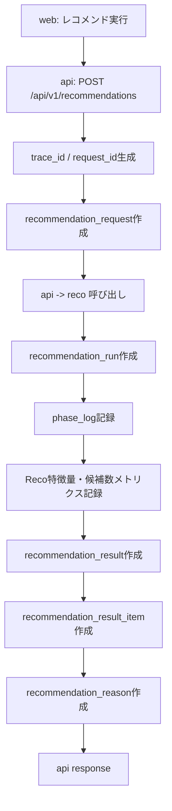
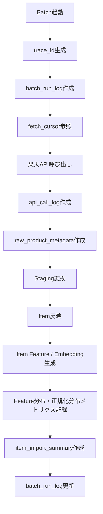
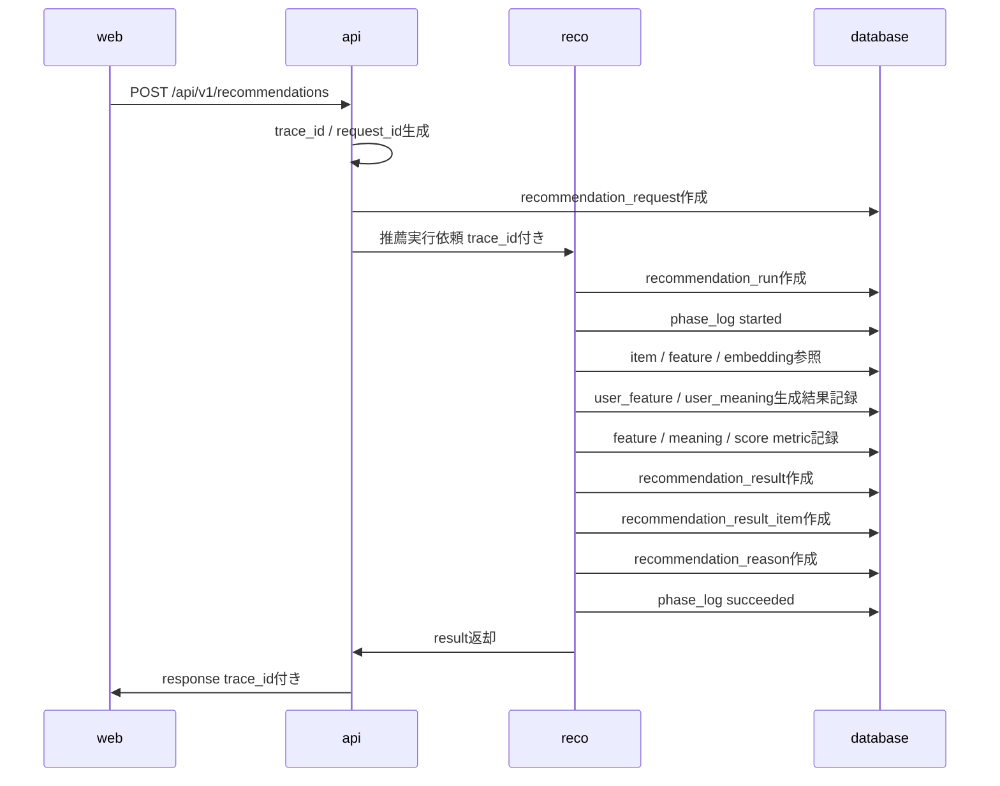
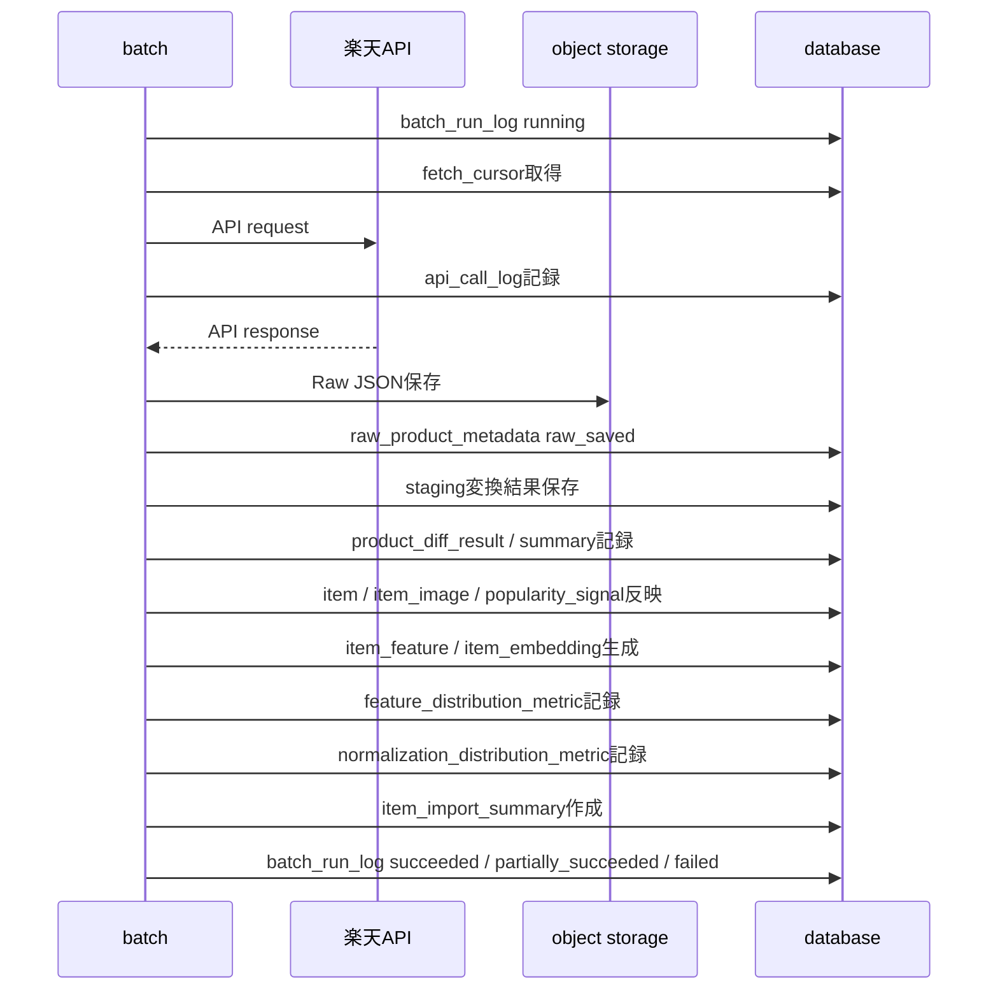

# ログ・Observability設計書

## 1. 概要

### 1.1 目的

本ドキュメントは、Gift Recommendation Service MVP におけるログ・Observabilityの設計方針を定義する。

本サービスでは、web / api / reco / batch / database / object storage / 外部API / LLM API が連携する。

そのため、障害発生時に「どこで」「なぜ」「どの入力で」「どの処理段階で」失敗したかを追跡できる必要がある。

また、本サービスの中核価値は「意味でギフトを選べること」である。

そのため、単なるAPI成功率・エラー率だけではなく、Recoコンポーネント内部の以下の妥当性を観測対象に含める。

```
- Feature推定値の分布が妥当か
- Social / Symbolic射影値の分布が妥当か
- sigmoid正規化後のFeature値が正常な分布になっているか
- 特徴量が0.0 / 1.0付近に張り付いていないか
- 特徴量が0.5付近に潰れていないか
- user_feature と item_feature の分布差が極端でないか
- λ_ctx が安全寄り / 意味寄りのどちらかに偏りすぎていないか
- Matching / Rankingのスコア分布が壊れていないか
```

本ドキュメントでは、以下を明確にする。

```
- ログ・Observabilityの目的
- 状態、ログ、メトリクス、トレースの使い分け
- trace_id / request_id / run_id / batch_run_id の追跡方針
- Online推薦処理のログ設計
- Reco特徴量分布・正規化分布の監視設計
- Batch処理のログ設計
- Error Log設計
- Phase Log設計
- API Call Log設計
- 主要メトリクス定義
- ログ出力レベル
- マスキング・Secret保護方針
- Retention方針
- 後続のAPI設計、Batch設計、テーブル一覧への引き継ぎ事項
```

---

## 2. 利用したインプット成果物

利用したインプット成果物は以下です。

- 認証・認可設計書.md
- エラーコード定義書.md
- リソース一覧.md
- リソース責務定義表.md
- 正本定義表.md
- 論理ER図.md
- 状態遷移設計書.md
- テーブル一覧.md
- 処理構成定義書.md
- 外部商品データ連携設計書.md
- 機能一覧.md
- モジュール一覧.md
- 機能×モジュール対応表.md
- Recoモジュール一覧.md
- RecommendationRequest定義書.md
- RecommendationResult定義書.md
- RecommendationFeedback定義書.md
- Reason生成定義書.md
- Retrieval定義書.md
- Matching定義書.md
- Ranking定義書.md
- Evaluation評価定義書.md
- Feature定義書.md
- Gift Meaning Space定義書.md
- Semantic Concept定義書.md
- Featureルール定義書.md
- Semanticルール定義書.md

---

## 3. Observability設計の基本方針

### 3.1 基本方針

| 方針 | 内容 |
| --- | --- |
| trace_idで横断追跡する | web / api / reco / batch の処理を同一trace_idで追跡できるようにする |
| 状態とログを分ける | 現在状態はstatus列、履歴はlog、集計はsummary / metricsで管理する |
| 構造化ログを基本にする | JSON形式で検索・集計しやすいログを出力する |
| エラーコードを必ず付与する | Error Logにはエラーコード定義書の `GRS-*` を記録する |
| ユーザー表示と内部ログを分離する | UIには安全なメッセージのみ返し、詳細は内部ログに記録する |
| Reco品質メトリクスを必須化する | Feature分布、Social / Symbolic分布、正規化後分布を観測する |
| 商品単位の過剰ログを避ける | 大量Batchでは商品1件ごとの詳細ログを無制限に出さない |
| 集計ログを重視する | BatchやRecoでは件数・処理時間・フェーズ結果を集計して記録する |
| Secretをログに出さない | API Key、Authorization Header、DB接続文字列などは出力禁止 |
| MVPでは実装可能性を優先する | 初期はDBログ + アプリ標準ログを中心にし、外部監視基盤は後続拡張とする |

---

### 3.2 Observabilityの対象

| 対象 | 主な観測内容 |
| --- | --- |
| web | 画面遷移、API呼び出し失敗、ユーザー操作エラー |
| api | Public API受付、Validation結果、reco呼び出し、Feedback保存 |
| reco | 推薦Run、各フェーズ、候補数、0件率、Feature分布、Social / Symbolic分布、スコア分布 |
| batch | 楽天API取得、Raw保存、Staging変換、Item反映、Feature / Embedding生成 |
| database | 読込失敗、書込失敗、Transaction失敗、状態更新競合 |
| object storage | Raw保存、Raw読込、Hash不整合 |
| 外部API | 楽天API呼び出し結果、Rate Limit、Timeout |
| LLM / Embedding API | 呼び出し失敗、Timeout、Rate Limit、応答Parse失敗 |
| Evaluation | 評価実行、評価指標、失敗ケース |

---

## 4. 状態・ログ・メトリクス・トレースの使い分け

### 4.1 用語整理

| 種別 | 目的 | 例 |
| --- | --- | --- |
| 状態 | 現在の処理状態・終端結果を保持する | recommendation_run.run_status |
| ログ | 処理の履歴・発生事象を記録する | error_log, phase_log |
| メトリクス | 数値として集計・監視する | API latency, empty result rate, feature_mean |
| トレース | 複数コンポーネントをまたぐ処理の流れを追跡する | trace_idによるapi→reco追跡 |
| Snapshot | 後続更新に影響されない結果を固定する | recommendation_result_item |
| 分布Snapshot | ある時点のFeatureやScore分布を集計値として固定する | feature_distribution_metric |

---

### 4.2 使い分け方針

| 記録したいもの | 保存先 | 理由 |
| --- | --- | --- |
| 推薦実行の現在状態 | recommendation_run.run_status | 状態として検索しやすくするため |
| 推薦実行の各フェーズ履歴 | `phase_log` | 処理段階ごとの成功・失敗を追跡するため（論理上の `recommendation_run_phase_log` は物理テーブル化せず `phase_log` に統合。`phase_log_テーブル定義書` §5.2） |
| 推薦実行のエラー詳細 | error_log | エラーコード、trace_id、詳細を検索するため |
| 推薦結果の商品明細 | recommendation_result_item | 結果表示と再現性のため |
| 推薦時点の商品情報 | recommendation_result_itemのSnapshot項目 | 後続の商品更新に影響されないようにするため |
| Batch全体の状態 | batch_run_log.run_status | Batch実行単位の追跡のため |
| 外部API呼び出し結果 | api_call_log | 楽天APIなどの呼び出し単位で調査するため |
| Batch処理件数 | item_import_summary | 大量処理を集計で把握するため |
| Feature分布 | feature_distribution_metric | Reco品質・特徴量変換の正常性を確認するため |
| Social / Symbolic分布 | meaning_distribution_metric | Gift Meaning空間への射影妥当性を確認するため |
| 正規化後分布 | normalization_distribution_metric | sigmoid正規化が正常に機能しているか確認するため |
| 大量商品の全処理過程 | 原則保存しない | DB肥大化・性能劣化を防ぐため |
| 画面Modal開閉 | DB保存しない | web一時状態で十分なため |

---

## 5. トレースID設計

### 5.1 ID一覧

| ID | 粒度 | 生成主体 | 用途 |
| --- | --- | --- | --- |
| trace_id | 1ユーザー操作または1Batch実行の横断追跡 | api / batch | web→api→reco、batch一連処理の追跡 |
| request_id | APIリクエスト単位 | api | Public API呼び出し単位の識別 |
| recommendation_request_id | 推薦条件単位 | api | ユーザー入力条件の正本ID |
| recommendation_run_id | 推薦実行単位 | reco | 推薦パイプライン実行の識別 |
| recommendation_result_id | 推薦結果単位 | reco | 結果表示・Feedback紐づけ |
| batch_run_id | Batch実行単位 | batch | Batch全体の追跡 |
| api_call_log_id | 外部API呼び出し単位 | batch | 楽天API呼び出し単位の追跡 |
| raw_metadata_id | Raw保存単位 | batch | Raw JSON参照・取込状態管理 |
| metric_snapshot_id | 分布集計単位 | reco / batch | Feature分布、正規化分布、品質メトリクスの識別 |

---

### 5.2 Online推薦のID伝播



---

### 5.3 BatchのID伝播



---

## 6. ログ分類

### 6.1 ログ分類一覧

| ログ分類 | 目的 | 主な保存先 |
| --- | --- | --- |
| Access Log | APIアクセス状況を記録する | アプリ標準ログ |
| Application Log | 処理イベントを記録する | アプリ標準ログ / phase_log |
| Error Log | エラー詳細を記録する | error_log |
| Phase Log | 処理フェーズの開始・終了を記録する | phase_log |
| Run Log | 推薦実行・Batch実行の状態を記録する | recommendation_run / batch_run_log |
| API Call Log | 外部API呼び出しを記録する | api_call_log |
| Import Summary | 商品取込件数を集計する | item_import_summary |
| Reco Quality Metrics | Reco品質・分布異常を記録する | feature_distribution_metric等 |
| Audit Log | 管理操作・設定変更を記録する | MVPでは簡略化 |
| Metric Log | 集計メトリクスを記録する | MVPではDB集計または標準ログ |

---

### 6.2 MVPで必須とするログ・メトリクス

| ログ / メトリクス | MVP必須 | 理由 |
| --- | --- | --- |
| error_log | ○ | 障害調査に必須 |
| phase_log | ○ | Reco / Batchのどの段階で失敗したか追跡するため |
| recommendation_run | ○ | Online推薦実行単位の状態管理に必須 |
| batch_run_log | ○ | Batch実行単位の状態管理に必須 |
| api_call_log | ○ | 楽天API呼び出しの成否追跡に必須 |
| raw_product_metadata | ○ | Raw保存・取込状態の追跡に必須 |
| item_import_summary | ○ | 大量取込の結果把握に必要 |
| feature_distribution_metric | ○ | Reco特徴量推定の妥当性検証に必要 |
| meaning_distribution_metric | ○ | Social / Symbolic射影の妥当性検証に必要 |
| normalization_distribution_metric | ○ | sigmoid正規化の正常性検証に必要 |
| access_log | △ | ホスティング標準ログで代替可 |
| audit_log | △ | MVP初期では管理画面がないため後続扱い |

---

## 7. ログレベル定義

### 7.1 ログレベル一覧

| レベル | 用途 | 例 |
| --- | --- | --- |
| debug | 開発時の詳細確認 | SQL前後の内部変数、候補商品詳細 |
| info | 正常な主要イベント | Run開始、Run成功、Batch開始、Batch成功 |
| warn | 処理継続可能な異常 | Validation失敗、0件結果、外部API一部失敗、軽微な分布偏り |
| error | 処理失敗 | Reco失敗、DB書込失敗、Batch失敗、重大な分布異常 |
| critical | サービス継続に影響する重大障害 | DB全断、Secret漏洩疑い、Reco品質崩壊 |

---

### 7.2 ログレベル方針

| 事象 | レベル |
| --- | --- |
| Recommendation Request受付 | info |
| Recommendation Run開始 | info |
| Recommendation Run成功 | info |
| Recommendation 0件 | warn または info |
| Validationエラー | warn |
| Feedback保存成功 | info |
| Feedback重複 | warn |
| Reco内部エラー | error |
| Reason生成失敗 | error |
| Feature分布の軽微な偏り | warn |
| Feature分布の重大な崩壊 | error |
| sigmoid正規化後の張り付き率異常 | warn または error |
| λ_ctxが極端に偏る | warn |
| Batch開始 | info |
| Batch成功 | info |
| Batch一部失敗 | warn |
| Batch失敗 | error |
| 楽天API Rate Limit | warn |
| 楽天API Timeout | warn または error |
| DB接続失敗 | error |
| Secret出力検知 | critical |

---

## 8. 構造化ログ形式

### 8.1 標準ログ項目

アプリケーションログは、原則として以下の項目を持つ構造化ログにする。

| 項目 | 内容 |
| --- | --- |
| timestamp | 発生日時 |
| level | debug / info / warn / error / critical |
| service | web / api / reco / batch |
| environment | local / dev / preview / production |
| trace_id | 横断追跡ID |
| request_id | APIリクエストID |
| owner_type | recommendation_run / batch_run / api_call等 |
| owner_id | 対象ID |
| event_name | イベント名 |
| message | ログ概要 |
| error_code | エラー発生時のGRSコード |
| duration_ms | 処理時間 |
| detail | マスキング済み詳細情報 |

---

### 8.2 ログJSON例

```
{
  "timestamp":"2026-05-11T12:00:00.000Z",
  "level":"error",
  "service":"reco",
  "environment":"production",
  "trace_id":"trace_abc123",
  "request_id":"req_abc123",
  "owner_type":"recommendation_run",
  "owner_id":"run_abc123",
  "event_name":"retrieval_failed",
  "message":"Retrieval failed during recommendation run.",
  "error_code":"GRS-REC-009",
  "duration_ms":1240,
  "detail": {
    "phase":"retrieval",
    "retryable":true
  }
}
```

---

## 9. Error Log設計

### 9.1 目的

`error_log` は、api / reco / batch / 外部API / DB / Storageで発生したエラーを横断的に記録する。

単なる文字列ログではなく、エラーコード、発生主体、trace_id、再試行可否を持たせることで、調査・集計・テストに利用できるようにする。

---

### 9.2 error_log主要項目

| 項目 | 内容 |
| --- | --- |
| error_log_id | Error Log ID |
| trace_id | 横断追跡ID |
| request_id | APIリクエストID |
| owner_type | recommendation_run / batch_run / api_call / feedback等 |
| owner_id | owner_typeに対応するID |
| service | api / reco / batch |
| error_code | GRS-* エラーコード |
| error_message | 内部向け概要 |
| severity | warn / error / critical |
| retryable | 再試行可否 |
| error_detail_json | マスキング済み詳細 |
| occurred_at | 発生日時 |

---

### 9.3 owner_type候補

| owner_type | owner_id |
| --- | --- |
| recommendation_request | recommendation_request_id |
| recommendation_run | recommendation_run_id |
| recommendation_result | recommendation_result_id |
| recommendation_feedback | recommendation_feedback_id |
| batch_run | batch_run_id |
| api_call | api_call_log_id |
| raw_product_metadata | raw_metadata_id |
| item_generation_queue | item_generation_queue_id |
| feature_distribution_metric | feature_distribution_metric_id |
| normalization_distribution_metric | normalization_distribution_metric_id |
| evaluation_run | evaluation_run_id |
| system | 任意またはNULL |

---

### 9.4 Error Log記録対象

| 事象 | 記録 |
| --- | --- |
| Validationエラー | 原則記録しない、またはwarn集計のみ |
| Rate Limit | warnとして必要に応じて記録 |
| Reco失敗 | 必ず記録 |
| Reason生成失敗 | 必ず記録 |
| DB書込失敗 | 必ず記録 |
| 外部API失敗 | api_call_logに加えて必要に応じて記録 |
| Raw保存失敗 | 必ず記録 |
| Batch一部失敗 | 集計 + 必要に応じて記録 |
| Feature分布異常 | warn / errorとして記録 |
| 正規化分布異常 | warn / errorとして記録 |
| 商品単位の軽微なスキップ | 原則Error Logには記録しない |
| Secret出力検知 | criticalとして記録 |

---

## 10. Phase Log設計

### 10.1 目的

`phase_log` は、Recommendation Run / Batch Run / Evaluation Run などの処理フェーズを記録する。

状態遷移設計書では、Run本体のstatusを細かく更新しすぎない方針としている。

その代わりに、処理の詳細な進行状況はPhase Logで追跡する。

---

### 10.2 phase_log主要項目

| 項目 | 内容 |
| --- | --- |
| phase_log_id | Phase Log ID |
| trace_id | 横断追跡ID |
| owner_type | recommendation_run / batch_run / evaluation_run等 |
| owner_id | 対象ID |
| phase_name | フェーズ名 |
| phase_status | started / succeeded / failed / skipped |
| started_at | 開始日時 |
| completed_at | 完了日時 |
| duration_ms | 処理時間 |
| error_code | 失敗時のエラーコード |
| detail_json | マスキング済み詳細 |

---

### 10.3 Recommendation RunのPhase一覧

| phase_name | 内容 |
| --- | --- |
| request_received | 推薦依頼受付 |
| config_resolved | Config / Version解決 |
| semantic_extracted | Semantic抽出 |
| user_feature_generated | User Feature生成 |
| user_meaning_projected | User Meaning射影 |
| query_embedding_generated | Query Embedding生成 |
| pre_hard_filter_completed | Pre Hard Filter完了 |
| retrieval_completed | 候補商品抽出完了 |
| post_hard_filter_completed | Post Hard Filter完了 |
| matching_completed | Matching完了 |
| ranking_completed | Ranking完了 |
| result_generated | Recommendation Result生成完了 |
| reason_generated | Reason生成完了 |
| response_built | Response生成完了 |
| reco_quality_metric_recorded | Reco品質メトリクス記録完了 |

> **MVP 物理設計（Issue #535 確定）**: 上表の `reco_quality_metric_recorded` は Observability 上のフェーズ候補であるが、`phase_log.phase_name` の DB CHECK（`recommendation_run_phase_name`）には **含めない**。Reco 品質メトリクスは `reco_score_distribution_metric` 等の Metric テーブルで記録する（`phase_log_テーブル定義書` §5.7）。

---

### 10.4 Batch RunのPhase一覧

| phase_name | 内容 |
| --- | --- |
| batch_started | Batch開始 |
| cursor_loaded | Fetch Cursor読込 |
| external_api_called | 外部API呼び出し |
| raw_saved | Raw JSON保存 |
| raw_metadata_saved | Raw Metadata保存 |
| staging_transformed | Staging変換 |
| diff_judged | 疑似差分判定 |
| item_imported | Item反映 |
| item_image_imported | Item Image反映 |
| popularity_signal_imported | Popularity Signal反映 |
| item_feature_generated | Item Feature生成 |
| item_embedding_generated | Item Embedding生成 |
| feature_distribution_metric_recorded | Feature分布メトリクス記録 |
| summary_created | Import Summary作成 |
| batch_completed | Batch完了 |

---

## 11. Recommendation Runログ設計

### 11.1 記録目的

Recommendation Runでは、以下を追跡する。

```
- 推薦依頼を受け付けたか
- Config / Versionを解決できたか
- 各推薦フェーズが成功したか
- 候補商品が何件残ったか
- 0件になった場合、どの段階で0件になったか
- User Feature / User Meaningの推定値が極端に偏っていないか
- Matching / Rankingのスコア分布が壊れていないか
- Result / Reasonを生成できたか
- 処理時間がどこで長くなったか
```

---

### 11.2 推薦Runで記録する主要メトリクス

| メトリクス | 内容 |
| --- | --- |
| recommendation_run_count | 推薦実行数 |
| recommendation_success_count | 推薦成功数 |
| recommendation_failed_count | 推薦失敗数 |
| recommendation_empty_count | 0件結果数 |
| recommendation_empty_rate | 0件率 |
| recommendation_latency_ms | 推薦全体の処理時間 |
| phase_duration_ms | フェーズ別処理時間 |
| pre_filter_candidate_count | Pre Hard Filter後候補数 |
| retrieval_candidate_count | Retrieval候補数 |
| post_filter_candidate_count | Post Hard Filter後候補数 |
| final_result_count | 最終推薦件数 |
| reason_generation_failed_count | Reason生成失敗数 |
| user_feature_distribution | Run単位または集計単位のUser Feature分布 |
| user_social_distribution | User Social値分布 |
| user_symbolic_distribution | User Symbolic値分布 |
| lambda_ctx_distribution | λ_ctx分布 |
| social_match_distribution | Social Match分布 |
| symbolic_match_distribution | Symbolic Match分布 |
| final_score_distribution | Final Score分布 |

---

### 11.3 候補数ログ

Recoでは、候補数の推移を追跡する。

```
全Item候補
↓
Pre Hard Filter後
↓
Retrieval後
↓
Post Hard Filter後
↓
Matching対象
↓
Ranking対象
↓
最終Result
```

候補数が急減するフェーズを把握することで、0件結果や推薦品質低下の原因を調査しやすくする。

---

## 12. Reco特徴量分布・正規化分布メトリクス設計

### 12.1 目的

Recoコンポーネントの品質は、APIが成功したかどうかだけでは判断できない。

本サービスでは、以下の変換がレコメンド品質に直結する。

```
ユーザー入力
↓
Semantic抽出
↓
Feature推定
↓
Social / Symbolic射影
↓
z-score標準化
↓
sigmoid正規化
↓
Matching
↓
Ranking
```

そのため、Feature推定値、Social / Symbolic射影値、正規化後Feature値の分布をメトリクスとして観測する。

---

### 12.2 観測対象レイヤー

| レイヤー | 観測対象 | 目的 |
| --- | --- | --- |
| Raw Feature | 正規化前Feature値 | 推定元の値が極端に偏っていないか確認する |
| z-score Feature | z-score変換後Feature値 | 標準化が妥当か確認する |
| Sigmoid Feature | sigmoid後Feature値 | 0.0〜1.0変換後に値が潰れていないか確認する |
| User Feature | ユーザー入力から生成されたFeature | 入力解釈の偏りを確認する |
| Item Feature | 商品側Feature | 商品空間の分布を確認する |
| User Meaning | user_social / user_symbolic | ユーザー意図のGift Meaning空間上の偏りを確認する |
| Item Meaning | item_social / item_symbolic | 商品側のGift Meaning空間上の偏りを確認する |
| User Context | λ_ctx | 安全寄り / 意味寄り補正の偏りを確認する |
| Matching Score | feature_match / social_match / symbolic_match | User × Itemの一致度分布を確認する |
| Ranking Score | final_score / score_breakdown | 最終順位付けの分布を確認する |

---

### 12.3 Feature軸

MVPで監視対象とするFeature軸は以下。

| Feature Group | Feature Code | 内容 |
| --- | --- | --- |
| Social | formality | 儀礼性 |
| Social | safety | 安全性 |
| Social | brand_appropriateness | ブランド適切性 |
| Symbolic | emotion | 感情性 |
| Symbolic | novelty | 新規性 |
| Symbolic | intimacy | 親密性 |
| Symbolic | symbolic_identity | 象徴性 |
| Symbolic | story_richness | ストーリー性 |

---

### 12.4 Feature分布メトリクス

| メトリクス | 対象 | 目的 |
| --- | --- | --- |
| item_feature_mean_by_axis | item_feature | 商品Feature軸ごとの平均確認 |
| item_feature_std_by_axis | item_feature | 軸ごとの分散確認 |
| item_feature_min_by_axis | item_feature | 最小値確認 |
| item_feature_max_by_axis | item_feature | 最大値確認 |
| item_feature_p10_by_axis | item_feature | 下位分位点確認 |
| item_feature_p50_by_axis | item_feature | 中央値確認 |
| item_feature_p90_by_axis | item_feature | 上位分位点確認 |
| item_feature_skewness_by_axis | item_feature | 分布の偏り確認 |
| item_feature_kurtosis_by_axis | item_feature | 外れ値・尖り確認 |
| user_feature_mean_by_axis | user_feature | ユーザーFeature推定の偏り確認 |
| user_feature_std_by_axis | user_feature | ユーザーFeatureのばらつき確認 |
| user_feature_p10_by_axis | user_feature | ユーザーFeature下位分位点確認 |
| user_feature_p50_by_axis | user_feature | ユーザーFeature中央値確認 |
| user_feature_p90_by_axis | user_feature | ユーザーFeature上位分位点確認 |
| feature_missing_rate_by_axis | user_feature / item_feature | Feature欠損率確認 |
| feature_out_of_range_count | user_feature / item_feature | 0.0〜1.0範囲外の検知 |

---

### 12.5 Social / Symbolic分布メトリクス

| メトリクス | 対象 | 目的 |
| --- | --- | --- |
| user_social_mean | user_meaning | ユーザー意図のSocial平均確認 |
| user_social_std | user_meaning | ユーザー意図のSocial分散確認 |
| user_symbolic_mean | user_meaning | ユーザー意図のSymbolic平均確認 |
| user_symbolic_std | user_meaning | ユーザー意図のSymbolic分散確認 |
| item_social_mean | item_meaning | 商品側Social平均確認 |
| item_social_std | item_meaning | 商品側Social分散確認 |
| item_symbolic_mean | item_meaning | 商品側Symbolic平均確認 |
| item_symbolic_std | item_meaning | 商品側Symbolic分散確認 |
| lambda_ctx_mean | user_context | λ_ctx平均確認 |
| lambda_ctx_std | user_context | λ_ctx分散確認 |
| lambda_ctx_p10 | user_context | λ_ctx下位分位点確認 |
| lambda_ctx_p50 | user_context | λ_ctx中央値確認 |
| lambda_ctx_p90 | user_context | λ_ctx上位分位点確認 |
| social_match_distribution | matching_result | Social一致度分布確認 |
| symbolic_match_distribution | matching_result | Symbolic一致度分布確認 |

---

### 12.6 正規化分布メトリクス

Feature値は `0.0〜1.0` の範囲で扱う。

ただし単純clipは値が潰れやすいため、sigmoid系の正規化を前提とする。

正規化処理では、以下の分布を監視する。

| メトリクス | 対象 | 目的 |
| --- | --- | --- |
| raw_feature_mean_by_axis | 正規化前Feature | 変換前の平均確認 |
| raw_feature_std_by_axis | 正規化前Feature | 変換前の分散確認 |
| z_score_mean_by_axis | z-score後Feature | 標準化後の平均確認 |
| z_score_std_by_axis | z-score後Feature | 標準化後の標準偏差確認 |
| sigmoid_feature_mean_by_axis | sigmoid後Feature | 0.0〜1.0変換後の平均確認 |
| sigmoid_feature_std_by_axis | sigmoid後Feature | 0.0〜1.0変換後の分散確認 |
| sigmoid_feature_p10_by_axis | sigmoid後Feature | 下位分位点確認 |
| sigmoid_feature_p50_by_axis | sigmoid後Feature | 中央値確認 |
| sigmoid_feature_p90_by_axis | sigmoid後Feature | 上位分位点確認 |
| sigmoid_near_zero_rate | sigmoid後Feature | 0.0付近への張り付き確認 |
| sigmoid_near_one_rate | sigmoid後Feature | 1.0付近への張り付き確認 |
| sigmoid_mid_concentration_rate | sigmoid後Feature | 0.5付近への潰れ確認 |
| normalization_nan_count | 正規化処理 | NaN発生検知 |
| normalization_inf_count | 正規化処理 | Infinity発生検知 |
| normalization_sigma_zero_count | 正規化統計量 | σ=0または極小の検知 |
| normalization_out_of_range_count | 正規化後Feature | 0.0〜1.0範囲外の検知 |

---

### 12.7 張り付き率・潰れ率の定義

MVP初期では、以下を暫定定義とする。

閾値は初期データの分布を見て調整する。

| 指標 | 暫定定義 | 意味 |
| --- | --- | --- |
| near_zero_rate | `0.00 <= value <= 0.05` の割合 | 0付近への張り付き |
| near_one_rate | `0.95 <= value <= 1.00` の割合 | 1付近への張り付き |
| mid_concentration_rate | `0.45 <= value <= 0.55` の割合 | 0.5付近への潰れ |
| out_of_range_count | `value < 0.0` または `value > 1.0` の件数 | 正規化異常 |
| sigma_zero_count | `stddev = 0` または極小の件数 | 標準化不能または軸の死活問題 |

---

### 12.8 分布異常の例

| 異常 | 想定原因 | 影響 |
| --- | --- | --- |
| item_featureのstdが極端に小さい | 商品Feature推定がほぼ同じ値を返している | 商品間で差がつかない |
| sigmoid_mid_concentration_rateが高い | sigmoid後に0.5へ潰れている | Featureがランキングに効かない |
| sigmoid_near_zero_rateが高い | 正規化前値またはμ/σが不適切 | 特定軸が過度に低評価される |
| sigmoid_near_one_rateが高い | 正規化前値またはμ/σが不適切 | 特定軸が過度に高評価される |
| user_symbolic_meanが常に低い | 入力解析がSymbolic要素を拾えていない | 意味性のある推薦が出にくい |
| lambda_ctxが常に高い | 安全寄り補正に偏っている | 無難な商品ばかり出る |
| lambda_ctxが常に低い | 意味寄り補正に偏っている | リスクの高い商品が出やすい |
| social_matchが常に高い | Social軸が粗すぎる | 差別化に効かない |
| symbolic_matchが常に低い | Symbolic軸の推定または商品Featureが弱い | 意味マッチが機能しない |
| final_scoreが狭い範囲に集中 | Ranking重みまたは特徴量分布が不適切 | 順位差が不安定になる |

---

### 12.9 集計粒度

| 集計単位 | 対象 | 用途 |
| --- | --- | --- |
| run単位 | user_feature, user_meaning, matching, ranking | 個別推薦の異常調査 |
| 日次 | user_feature, user_meaning, λ_ctx, score | 直近傾向の確認 |
| batch_run単位 | item_feature, item_embedding, normalization | 商品データ更新後の品質確認 |
| semantic_config_version単位 | feature / meaning / score | 設定変更前後の比較 |
| model_version単位 | embedding / LLM由来Feature | モデル変更前後の比較 |
| feature_normalization_version単位 | 正規化前後分布 | 正規化統計量変更の影響確認 |
| relationship / occasion単位 | user_feature, user_meaning | 入力条件ごとの偏り確認 |
| category / genre単位 | item_feature | 商品カテゴリごとの偏り確認 |

---

### 12.10 保存方針

MVPでは、全商品・全候補の詳細値をすべてログ保存しない。

代わりに、分布統計量を保存する。

| データ | 保存方針 |
| --- | --- |
| item_feature個別値 | item_featureテーブルに保持 |
| user_feature個別値 | 保存する場合はrun単位。MVPでは永続化範囲を物理設計で判断 |
| candidate全件score | 原則すべては保存しない。必要に応じて上位K件またはサンプリング |
| result item score | recommendation_result_itemに保持 |
| score_breakdown | recommendation_result_itemにJSONとして保持候補 |
| Feature分布統計量 | feature_distribution_metricに保存候補 |
| Meaning分布統計量 | meaning_distribution_metricに保存候補 |
| 正規化分布統計量 | normalization_distribution_metricに保存候補 |

---

### 12.11 Reco分布メトリクスの推奨テーブル候補

テーブル一覧再作成時には、以下を追加候補として検討する。

| テーブル候補 | 目的 | 優先度 |
| --- | --- | --- |
| feature_distribution_metric | Feature軸ごとの分布統計量を保存 | 高 |
| meaning_distribution_metric | user_social / user_symbolic / λ_ctx等の分布統計量を保存 | 高 |
| normalization_distribution_metric | z-score / sigmoid変換前後の分布統計量を保存 | 高 |
| reco_score_distribution_metric | matching / ranking score分布を保存 | 中 |
| reco_quality_metric_summary | Reco品質指標の集計サマリ | 中 |

MVP初期でテーブルを増やしすぎたくない場合は、`reco_metric_summary` のような汎用テーブルにまとめる案も許容する。

---

### 12.12 分布メトリクスの主要カラム候補

| カラム | 内容 |
| --- | --- |
| metric_id | メトリクスID |
| metric_type | feature_distribution / meaning_distribution / normalization_distribution等 |
| aggregation_scope | run / daily / batch_run / version等 |
| aggregation_key | scopeに応じたキー |
| feature_code | formality / safety等。該当しない場合NULL |
| entity_type | user / item / candidate / result |
| value_layer | raw / z_score / sigmoid / social / symbolic / score |
| semantic_config_version_id | Semantic Config Version |
| model_version_id | Model Version |
| feature_normalization_version_id | Feature Normalization Version |
| sample_count | 集計対象件数 |
| mean | 平均 |
| stddev | 標準偏差 |
| min | 最小 |
| max | 最大 |
| p10 | 10パーセンタイル |
| p50 | 中央値 |
| p90 | 90パーセンタイル |
| skewness | 歪度 |
| kurtosis | 尖度 |
| near_zero_rate | 0付近張り付き率 |
| near_one_rate | 1付近張り付き率 |
| mid_concentration_rate | 0.5付近集中率 |
| nan_count | NaN件数 |
| inf_count | Infinity件数 |
| out_of_range_count | 範囲外件数 |
| calculated_at | 集計日時 |

---

## 13. Batchログ設計

### 13.1 記録目的

Batchでは、以下を追跡する。

```
- Batchがいつ開始・終了したか
- どの楽天APIを何回呼んだか
- 取得件数は何件か
- Raw保存に成功したか
- Staging変換に成功したか
- new / updated / unchanged / unavailable が何件か
- Item反映が何件成功・失敗したか
- Item Feature / Embedding生成が何件成功・失敗したか
- Feature分布・正規化分布が正常か
- レート制限やTimeoutが発生したか
```

---

### 13.2 batch_run_log主要項目

| 項目 | 内容 |
| --- | --- |
| batch_run_id | Batch Run ID |
| trace_id | 横断追跡ID |
| batch_name | Batch名 |
| batch_type | external_fetch / staging / import / feature_generation等 |
| run_status | queued / running / succeeded / partially_succeeded / failed / canceled |
| started_at | 開始日時 |
| completed_at | 完了日時 |
| duration_ms | 処理時間 |
| success_count | 成功件数 |
| failed_count | 失敗件数 |
| skipped_count | スキップ件数 |
| error_summary | エラー概要 |

---

### 13.3 item_import_summary主要項目

| 項目 | 内容 |
| --- | --- |
| item_import_summary_id | Import Summary ID |
| batch_run_id | Batch Run ID |
| source | rakuten |
| source_api | item_search / item_ranking / genre_search / attribute_search |
| fetched_count | API取得件数 |
| new_count | 新規件数 |
| updated_count | 更新件数 |
| unchanged_count | 差分なし件数 |
| unavailable_count | 取得不能・対象外件数 |
| skipped_count | スキップ件数 |
| failed_count | 失敗件数 |
| feature_generated_count | Feature生成件数 |
| embedding_generated_count | Embedding生成件数 |
| summarized_at | 集計日時 |

---

### 13.4 商品単位ログの制限方針

大量商品データを扱うため、以下は避ける。

```
- 商品1件ごとに詳細なinfoログを出す
- 商品1件ごとにprocessing状態をDB更新する
- unchanged商品をすべてError Logへ記録する
- 軽微なValidationスキップをすべてError Logへ記録する
```

商品単位で詳細を残す対象は、以下に限定する。

```
- failed
- unavailable
- 不正データ
- active_status変更対象
- 再実行対象
- サンプリング対象
```

---

## 14. API Call Log設計

### 14.1 目的

`api_call_log` は、楽天APIなど外部API呼び出し単位の成否を記録する。

外部APIは本サービス外の依存先であり、Timeout、Rate Limit、レスポンス形式変更などが発生する可能性がある。

そのため、外部API呼び出しはRecommendation RunやBatch Runとは別に追跡する。

---

### 14.2 api_call_log主要項目

| 項目 | 内容 |
| --- | --- |
| api_call_log_id | API Call Log ID |
| trace_id | 横断追跡ID |
| batch_run_id | Batch Run ID |
| fetch_cursor_id | Fetch Cursor ID |
| source | rakuten |
| source_api | item_search / item_ranking / genre_search / attribute_search |
| request_params_hash | リクエスト条件のHash |
| request_params_json | マスキング済みリクエスト条件 |
| response_status | HTTPステータスまたは外部APIステータス |
| call_status | requested / succeeded / failed / rate_limited / skipped |
| item_count | 取得件数 |
| started_at | 呼び出し開始日時 |
| completed_at | 呼び出し完了日時 |
| duration_ms | 処理時間 |
| error_code | 失敗時のエラーコード |

---

### 14.3 外部APIログで保存しない情報

```
- 楽天APIキー
- Authorization Header
- 外部APIのSecret
- URL全文にSecretが含まれる場合の完全URL
- 過大なレスポンス本文
```

Rawレスポンス本文は、DBログではなくObject StorageのRaw JSONとして保存する。

---

## 15. Raw / Storageログ設計

### 15.1 Raw Product Metadataの役割

Raw JSON本体はObject Storageに保存し、DBには `raw_product_metadata` を保存する。

`raw_product_metadata` は、Raw保存状態、Staging変換状態、Item反映状態を追跡する。

---

### 15.2 raw_product_metadata主要項目

| 項目 | 内容 |
| --- | --- |
| raw_metadata_id | Raw Metadata ID |
| api_call_log_id | API Call Log ID |
| object_key | Object Storage上のRaw JSON参照キー |
| source | rakuten |
| source_api | item_search / item_ranking / genre_search / attribute_search |
| content_hash | Raw JSONのHash |
| item_count | Raw内の商品件数 |
| import_status | raw_saved / staged / imported / skipped / failed |
| fetched_at | 取得日時 |
| staged_at | Staging変換日時 |
| imported_at | Item反映日時 |
| error_code | 失敗時のエラーコード |
| error_message | エラー概要 |

---

## 16. メトリクス設計

### 16.1 メトリクス分類

| 分類 | 内容 |
| --- | --- |
| システムメトリクス | API latency、エラー率、DB失敗率 |
| Reco実行メトリクス | 推薦成功率、0件率、候補数、フェーズ時間 |
| Reco特徴量メトリクス | user_feature / item_feature の分布 |
| Reco意味空間メトリクス | user_social / user_symbolic / λ_ctx の分布 |
| Reco正規化メトリクス | raw / z-score / sigmoid変換後分布 |
| Recoスコアメトリクス | matching score / ranking score / final score分布 |
| Batchメトリクス | 取得件数、更新件数、失敗件数、処理時間 |
| 外部APIメトリクス | 楽天API成功率、Rate Limit、Timeout |
| LLMメトリクス | LLM呼び出し失敗数、Timeout、Embedding生成件数 |
| 商品データメトリクス | active商品数、Feature生成済み数、Embedding生成済み数 |
| 品質メトリクス | Feedback、評価指標、スコア分布 |
| UIメトリクス | 画面エラー、Feedback送信率、再検索率 |

---

### 16.2 APIメトリクス

| メトリクス | 内容 |
| --- | --- |
| api_request_count | APIリクエスト数 |
| api_error_count | APIエラー数 |
| api_error_rate | APIエラー率 |
| api_latency_ms | API処理時間 |
| validation_error_count | Validationエラー数 |
| rate_limit_count | Rate Limit発生数 |
| feedback_submit_count | Feedback送信数 |
| feedback_error_count | Feedback失敗数 |

---

### 16.3 Reco実行メトリクス

| メトリクス | 内容 |
| --- | --- |
| recommendation_run_count | 推薦実行数 |
| recommendation_success_count | 推薦成功数 |
| recommendation_failed_count | 推薦失敗数 |
| recommendation_empty_count | 0件結果数 |
| recommendation_empty_rate | 0件率 |
| recommendation_latency_ms | 推薦全体の処理時間 |
| semantic_extraction_latency_ms | Semantic抽出時間 |
| retrieval_latency_ms | Retrieval時間 |
| matching_latency_ms | Matching時間 |
| ranking_latency_ms | Ranking時間 |
| reason_generation_latency_ms | Reason生成時間 |
| pre_filter_candidate_count | Pre Hard Filter後候補数 |
| retrieval_candidate_count | Retrieval候補数 |
| post_filter_candidate_count | Post Hard Filter後候補数 |
| final_result_count | 最終表示件数 |

---

### 16.4 Reco特徴量分布メトリクス

| メトリクス | 内容 |
| --- | --- |
| item_feature_mean_by_axis | 商品Feature軸ごとの平均 |
| item_feature_std_by_axis | 商品Feature軸ごとの標準偏差 |
| item_feature_p10_by_axis | 商品Feature軸ごとの10パーセンタイル |
| item_feature_p50_by_axis | 商品Feature軸ごとの中央値 |
| item_feature_p90_by_axis | 商品Feature軸ごとの90パーセンタイル |
| item_feature_skewness_by_axis | 商品Feature軸ごとの歪度 |
| item_feature_kurtosis_by_axis | 商品Feature軸ごとの尖度 |
| user_feature_mean_by_axis | User Feature軸ごとの平均 |
| user_feature_std_by_axis | User Feature軸ごとの標準偏差 |
| feature_missing_rate_by_axis | Feature欠損率 |
| feature_out_of_range_count | Feature範囲外件数 |

---

### 16.5 Reco意味空間メトリクス

| メトリクス | 内容 |
| --- | --- |
| user_social_distribution | user_social分布 |
| user_symbolic_distribution | user_symbolic分布 |
| item_social_distribution | item_social分布 |
| item_symbolic_distribution | item_symbolic分布 |
| lambda_ctx_distribution | λ_ctx分布 |
| social_match_distribution | Social一致度分布 |
| symbolic_match_distribution | Symbolic一致度分布 |

---

### 16.6 Reco正規化メトリクス

| メトリクス | 内容 |
| --- | --- |
| raw_feature_distribution | 正規化前Feature分布 |
| z_score_distribution | z-score後Feature分布 |
| sigmoid_feature_distribution | sigmoid後Feature分布 |
| sigmoid_near_zero_rate | 0付近張り付き率 |
| sigmoid_near_one_rate | 1付近張り付き率 |
| sigmoid_mid_concentration_rate | 0.5付近集中率 |
| normalization_nan_count | NaN発生件数 |
| normalization_inf_count | Infinity発生件数 |
| normalization_sigma_zero_count | σ=0または極小の件数 |
| normalization_out_of_range_count | 0.0〜1.0範囲外件数 |

---

### 16.7 商品データ品質メトリクス

| メトリクス | 内容 |
| --- | --- |
| active_item_count | 推薦対象商品数 |
| inactive_item_count | 非推薦対象商品数 |
| item_without_image_count | 画像なし商品数 |
| item_without_feature_count | Feature未生成商品数 |
| item_without_embedding_count | Embedding未生成商品数 |
| item_price_missing_count | 価格なし商品数 |
| item_review_missing_count | レビュー情報なし商品数 |
| item_feature_distribution | Feature値分布 |
| item_embedding_generation_failure_rate | Embedding生成失敗率 |

---

### 16.8 レコメンド品質メトリクス

| メトリクス | 内容 |
| --- | --- |
| feedback_count | Feedback件数 |
| positive_feedback_count | Positive Feedback件数 |
| negative_feedback_count | Negative Feedback件数 |
| feedback_rate | 推薦結果に対するFeedback率 |
| retry_search_rate | 再検索率 |
| external_ec_click_count | 外部EC遷移クリック数 |
| external_ec_click_rate | 外部EC遷移率 |
| average_final_score | final_score平均 |
| final_score_distribution | final_score分布 |
| feature_match_distribution | feature一致度分布 |
| reason_feedback_negative_count | 理由に対するNegative Feedback数 |

---

## 17. アラート設計

### 17.1 MVPで検知したい異常

| 異常 | 検知条件例 | 優先度 |
| --- | --- | --- |
| API全体障害 | api_error_rateが急増 | 高 |
| Reco失敗増加 | recommendation_failed_countが一定以上 | 高 |
| 0件率急増 | recommendation_empty_rateが急増 | 高 |
| DB接続失敗 | GRS-DB-001が発生 | 高 |
| LLM API失敗 | GRS-LLM-*が増加 | 高 |
| 楽天API Rate Limit | GRS-EXT-102が連続発生 | 中 |
| Batch失敗 | batch_run_log.failedが発生 | 高 |
| Raw保存失敗 | GRS-RAW-001が発生 | 高 |
| Item Feature未生成増加 | item_without_feature_count増加 | 中 |
| Embedding未生成増加 | item_without_embedding_count増加 | 中 |
| Feature分布崩壊 | feature_stdが極小、または張り付き率が高い | 高 |
| sigmoid正規化異常 | near_zero / near_one / mid_concentrationが急増 | 高 |
| user_symbolic偏り | user_symbolicが常に低い、または高い | 中 |
| λ_ctx偏り | λ_ctxが片側に偏り続ける | 中 |
| Feedback保存失敗 | GRS-FDB-005が増加 | 中 |

---

### 17.2 Reco品質アラート候補

MVP初期では閾値は暫定値とし、実データを見て調整する。

| アラート | 条件例 | 意味 |
| --- | --- | --- |
| feature_std_too_low | 特定Feature軸のstddevが極小 | Feature軸がランキングに効いていない可能性 |
| sigmoid_near_zero_too_high | near_zero_rateが一定以上 | 正規化後に0付近へ張り付き |
| sigmoid_near_one_too_high | near_one_rateが一定以上 | 正規化後に1付近へ張り付き |
| sigmoid_mid_concentration_too_high | mid_concentration_rateが一定以上 | 0.5付近へ潰れている |
| user_symbolic_always_low | user_symbolicのp90が低すぎる | 意味性を拾えていない可能性 |
| lambda_ctx_skewed | λ_ctxのp10 / p90が片側に偏る | 補正ロジックの偏り |
| final_score_too_flat | final_scoreのstddevが極小 | Ranking差が出ていない可能性 |
| empty_rate_increased | 0件率が急増 | Filter / Retrieval / Feature異常の可能性 |

---

### 17.3 アラート方針

MVP初期では、以下を優先する。

```
- Recoが動かない
- APIが返らない
- DBに接続できない
- Batchが失敗して商品データが更新されない
- 楽天API / LLM APIの外部依存が失敗している
- Feature分布または正規化分布が崩れている
```

スコア分布や推薦品質の異常検知は、初期ではダッシュボード確認中心とし、後続で自動アラート化する。

---

## 18. ダッシュボード設計

### 18.1 MVP向けダッシュボード候補

| ダッシュボード | 表示内容 |
| --- | --- |
| API Health | APIリクエスト数、エラー率、Latency |
| Reco Health | 推薦実行数、成功率、失敗率、0件率、処理時間 |
| Reco Funnel | Pre Filter → Retrieval → Post Filter → Ranking → Resultの候補数 |
| Reco Feature Distribution | Feature軸ごとのmean / stddev / p10 / p50 / p90 |
| Reco Meaning Distribution | user_social / user_symbolic / λ_ctx分布 |
| Normalization Health | raw / z-score / sigmoid分布、張り付き率、NaN件数 |
| Score Distribution | feature_match / social_match / symbolic_match / final_score分布 |
| Batch Health | Batch成功/失敗、取得件数、更新件数、失敗件数 |
| External API Health | 楽天API呼び出し数、失敗数、Rate Limit |
| Item Data Quality | active商品数、画像なし、Featureなし、Embeddingなし |
| Feedback | Feedback件数、Positive/Negative、コメント件数 |
| Error Overview | error_code別件数、service別件数、trace_id検索 |

---

### 18.2 MVP初期の現実案

初期は専用ダッシュボードを作り込みすぎず、以下で代替する。

```
- DB上のlog / summary / metricテーブルをSQLで確認
- ホスティング環境の標準ログを確認
- GitHub ActionsのBatch実行ログを確認
- Feature分布確認用の簡易SQL Viewを作成
- 正規化分布確認用の簡易SQL Viewを作成
```

後続フェーズで、専用ダッシュボードや外部Observability基盤を導入する。

---

## 19. セキュリティ・マスキング方針

### 19.1 ログ出力禁止情報

以下はログへ出力しない。

```
- DATABASE_URL
- SUPABASE_SERVICE_ROLE_KEY
- SUPABASE_ANON_KEY
- OPENAI_API_KEY
- RAKUTEN_APPLICATION_ID
- RECO_INTERNAL_API_KEY
- BATCH_INTERNAL_TOKEN
- OBJECT_STORAGE_ACCESS_KEY
- OBJECT_STORAGE_SECRET_KEY
- Authorization Header
- Cookie全文
- APIレスポンスに含まれるSecret相当情報
- SQL文全文
- Stack Trace全文
```

---

### 19.2 自由入力の扱い

Recommendation RequestやFeedbackには自由入力が含まれる。

自由入力は、個人情報やセンシティブな内容を含む可能性があるため、ログ出力を制限する。

| 項目 | ログ方針 |
| --- | --- |
| preferred_text | 原則全文ログ出力しない |
| non_preferred_text | 原則全文ログ出力しない |
| ng_text | 原則全文ログ出力しない |
| feedback_comment | 原則全文ログ出力しない |
| 入力文字数 | 記録可 |
| 入力有無 | 記録可 |
| hash | 必要に応じて記録可 |
| 要約 | Debug用途に限り検討 |

---

### 19.3 error_detail_jsonのマスキング

`error_detail_json` に保存する情報は、以下の方針でマスキングする。

```
- Secret系キー名を検知したら値を "***" に置換
- Header全文は保存しない
- Request Body全文は保存しない
- 自由入力は文字数・有無・hash程度に制限
- 外部APIレスポンスは必要項目のみ抜粋
```

---

## 20. Retention方針

### 20.1 保持期間の考え方

ログは便利だが、無制限に保持するとDB容量を圧迫する。

特にBatch、API Call、Phase Log、Metric Snapshotは増えやすいため、保持期間を設計する。

---

### 20.2 Retention候補

| データ | 推奨保持期間 | 備考 |
| --- | --- | --- |
| error_log | **90日**（物理設計確定） | 障害調査用。`error_log_テーブル定義書` §13（Issue #536） |
| phase_log | **90日**（物理設計確定） | 処理追跡用。Batch 系 Log 統一（Issue #536 No.10）。`phase_log_テーブル定義書` §13 |
| batch_run_log | **90日**（物理設計確定） | Batch実行履歴。BATCH-RET-001 アンカー。`batch_run_log_テーブル定義書` §13 |
| api_call_log | **90日**（物理設計確定） | 外部API調査用。`api_call_log_テーブル定義書` §13 |
| item_import_summary | **90日**（物理設計確定） | Batch 系 Log 統一（旧 365 日から短縮）。`item_import_summary_テーブル定義書` §13 |
| raw_product_metadata | 180日〜365日 | Raw再処理要件次第 |
| Raw Product Object | 30日〜180日 | Object Storageコスト次第 |
| recommendation_run | 180日〜365日 | 評価・改善用途 |
| recommendation_result | 180日〜365日 | Feedback分析用途 |
| recommendation_feedback | 長期保持候補 | 品質改善の重要データ |
| feature_distribution_metric | 365日以上 | Reco品質推移の重要データ |
| meaning_distribution_metric | 365日以上 | Gift Meaning空間の品質推移 |
| normalization_distribution_metric | 365日以上 | 正規化方式の妥当性検証 |
| evaluation_result | 長期保持候補 | モデル比較・改善履歴 |
| evaluation_dataset | **365日**（物理設計確定） | 評価基準正本。MVP は自動 DELETE なし。`evaluation_dataset_テーブル定義書` §13（#565） |

---

### 20.3 MVP初期方針

MVP初期では、厳密な自動削除よりも、以下を優先する。

```
- テーブルごとに保持方針を明記する
- ログ系テーブルが肥大化しやすいことを認識する
- Feature分布・正規化分布は品質検証上重要なため、短期削除しない
- 後続で削除BatchやArchive設計を追加できるようにする
```

---

## 21. テーブル設計への反映

### 21.1 必須テーブル

| テーブル | 用途 |
| --- | --- |
| error_log | エラー記録 |
| phase_log | 汎用フェーズログ |
| recommendation_run | 推薦実行状態 |
| batch_run_log | Batch実行状態 |
| api_call_log | 外部API呼び出し履歴 |
| raw_product_metadata | Raw保存・取込状態 |
| item_import_summary | 商品取込集計 |
| feature_distribution_metric | Feature分布統計 |
| meaning_distribution_metric | Social / Symbolic / λ_ctx分布統計 |
| normalization_distribution_metric | 正規化前後分布統計 |

---

### 21.2 物理設計で判断する事項

| 論点 | 判断内容 |
| --- | --- |
| recommendation_run_phase_logを残すか | **確定**: 汎用 `phase_log` へ統合し物理テーブルは作成しない（`phase_log_テーブル定義書` §5.2） |
| phase_logのowner設計 | **確定**: `owner_type` / `owner_id` 方式。MVP の `phase_log.owner_type` は `recommendation_run` / `batch_run` / `evaluation_run` の 3 値（`phase_log_テーブル定義書` §11.3） |
| error_logのowner設計 | owner_type / owner_id方式にするか |
| Reco品質メトリクスのテーブル分割 | feature / meaning / normalizationを分けるか、汎用metricに統合するか |
| ログテーブルのschema | logスキーマに分離するか |
| metricテーブルのschema | logまたはevalまたはaplに配置するか |
| partition | error_log / phase_log / api_call_log / metric系にpartitionを使うか |
| retention | 自動削除Batchをいつ導入するか |
| index | trace_id / error_code / owner_id / occurred_at / feature_code / metric_type のindex要否 |
| JSONB | detail_json / error_detail_json / metric_detail_json の保持方式 |
| access_log | DB保存するか、ホスティング標準ログに任せるか |

---

## 22. コンポーネント別ログ責務

### 22.1 web

| 項目 | 方針 |
| --- | --- |
| API呼び出し失敗 | UIエラー表示、必要に応じてクライアントログ |
| trace_id | apiレスポンスのtrace_idを画面エラーと紐づけ |
| 画面状態 | DB保存しない |
| Secret | webにSecretを持たせない |

---

### 22.2 api

| 項目 | 方針 |
| --- | --- |
| trace_id生成 | Public API受付時に生成 |
| request_id生成 | APIリクエスト単位で生成 |
| Validation失敗 | warnログ、Public APIには安全なエラーを返す |
| reco呼び出し失敗 | error_log記録 |
| Feedback保存失敗 | error_log記録 |
| Internal API Key | ログ出力禁止 |

---

### 22.3 reco

| 項目 | 方針 |
| --- | --- |
| recommendation_run | run_statusを更新 |
| phase_log | 各推薦フェーズを記録 |
| error_log | 失敗時にGRS-REC-*を記録 |
| 候補数 | フェーズごとの件数をdetail_jsonまたはmetricとして記録 |
| user_feature分布 | run単位または日次集計で記録 |
| user_social / user_symbolic分布 | meaning_distribution_metricへ記録 |
| λ_ctx分布 | meaning_distribution_metricへ記録 |
| matching score分布 | metricまたはsummaryへ記録 |
| final_score分布 | metricまたはsummaryへ記録 |
| score詳細 | Result Itemのscore_breakdownに保存、ログ出力は抑制 |
| LLM / Embedding失敗 | GRS-LLM-*として記録 |

---

### 22.4 batch

| 項目 | 方針 |
| --- | --- |
| batch_run_log | Batch開始・終了・状態を記録 |
| api_call_log | 外部API呼び出し単位で記録 |
| raw_product_metadata | Raw保存・Staging・Import状態を記録 |
| item_import_summary | 件数集計を記録 |
| item_feature分布 | Feature生成後にfeature_distribution_metricへ記録 |
| 正規化分布 | normalization_distribution_metricへ記録 |
| error_log | 失敗時にGRS-BAT-* / GRS-EXT-* / GRS-RAW-*を記録 |
| 商品単位ログ | failed / unavailable中心に制限 |

---

## 23. Online推薦の観測フロー



---

## 24. Batchの観測フロー



---

## 25. 後続成果物への引き継ぎ

### 25.1 API設計方針書への引き継ぎ

API設計方針書では、以下を反映する。

```
- Public APIはtrace_id / request_idを生成または伝播する
- エラーレスポンスにはtraceIdを含める
- エラーコードはエラーコード定義書に従う
- Public APIでは内部詳細を返さない
- Validation失敗、Rate Limit、Reco失敗のログ方針を統一する
```

---

### 25.2 API一覧への引き継ぎ

API一覧では、以下の列を追加することを推奨する。

| 列 | 内容 |
| --- | --- |
| trace_id対象 | trace_idを生成・伝播するか |
| ログ記録 | access / phase / error の対象か |
| 主なエラーコード | 発生し得る代表エラー |
| メトリクス対象 | latency / count / error_rate等 |
| マスキング注意 | 自由入力やSecretの有無 |

---

### 25.3 バッチ設計方針書への引き継ぎ

バッチ設計方針書では、以下を反映する。

```
- Batch起動時にbatch_run_logを作成する
- 外部API呼び出し単位でapi_call_logを作成する
- Raw保存後にraw_product_metadataを作成する
- 商品単位の過剰ログを避ける
- 件数はitem_import_summaryへ集約する
- Item Feature生成後にFeature分布を集計する
- sigmoid正規化後の分布を集計する
- failed / partially_succeeded / succeededを明確にする
```

---

### 25.4 テーブル一覧再作成への引き継ぎ

テーブル一覧再作成時には、以下を反映する。

```
- error_log
- phase_log
- batch_run_log
- api_call_log
- raw_product_metadata
- item_import_summary
- recommendation_run
- feature_distribution_metric
- meaning_distribution_metric
- normalization_distribution_metric
- reco_score_distribution_metric
```

また、以下の判断事項を明記する。

```
- recommendation_run_phase_logをphase_logへ統合するか → **確定**（Issue #535。`phase_log_テーブル定義書` §5.2）
- logスキーマを分けるか
- metric系テーブルを独立させるか、汎用metric_summaryへ統合するか
- trace_id / error_code / owner_id / occurred_atにindexを張るか → **phase_log**: `trace_id` 列・`idx_phase_log_trace` 採用（Issue #535 §5.4・§9）
- feature_code / metric_type / aggregation_scopeにindexを張るか
- ログ系テーブルのretentionをどうするか → **Batch 系 Log 一式 90日統一**（Issue #536 No.10。`error_log` / `phase_log` / `api_call_log` / `item_import_summary` / `batch_run_log` + BATCH-RET-001）
```

---

### 25.5 テスト設計への引き継ぎ

テスト設計では、以下を確認する。

```
- APIエラー時にtraceIdが返ること
- error_logにerror_codeが記録されること
- reco失敗時にrecommendation_runがfailedになること
- 0件結果がerrorではなくempty resultとして記録されること
- Batch失敗時にbatch_run_logがfailedになること
- 外部API Rate Limit時にapi_call_logがrate_limitedになること
- Feature分布メトリクスが集計されること
- sigmoid正規化後の値が0.0〜1.0に収まること
- NaN / Infinityが発生した場合に検知できること
- 特定Feature軸のstddevが極小の場合に検知できること
- Secretがログに出力されないこと
- 自由入力が過剰にログ出力されないこと
```

---

### 25.6 正規化統計量管理設計書への引き継ぎ

正規化統計量管理設計書では、以下を詳細化する。

```
- Feature軸ごとのμ / σ管理
- feature_normalization_versionの管理
- z-score変換式
- sigmoid変換式
- σが0または極小の場合の扱い
- 正規化統計量の再計算タイミング
- 正規化前後分布の比較
- 旧versionとの互換性
```

---

### 25.7 特徴量分布監視設計書への引き継ぎ

特徴量分布監視設計書を独立作成する場合は、以下を詳細化する。

```
- Feature軸ごとの期待分布
- item_feature / user_featureの分布差
- Social / Symbolic空間上の分布
- λ_ctx分布
- 異常判定閾値
- ダッシュボード項目
- アラート条件
- 分布異常時の調査手順
```

---

## 26. レビュー観点

| 観点 | 確認内容 |
| --- | --- |
| 横断追跡 | trace_idでweb / api / reco / batchを追跡できるか |
| エラー連携 | エラーコード定義書のGRSコードと連携しているか |
| 状態分離 | statusとlogを混同していないか |
| Online推薦 | Run / Phase / Error / Resultの追跡ができるか |
| Batch | Batch Run / API Call / Raw / Import Summaryの追跡ができるか |
| 0件結果 | エラーではなく品質・条件問題として観測できるか |
| 候補数 | Pre Filter / Retrieval / Post Filter / Rankingの件数を追跡できるか |
| Feature分布 | user_feature / item_featureの軸別分布を確認できるか |
| Social / Symbolic | user_social / user_symbolic / item_social / item_symbolicを確認できるか |
| λ_ctx | 安全寄り / 意味寄り補正の偏りを確認できるか |
| 正規化 | raw / z-score / sigmoid後の分布を確認できるか |
| 張り付き検知 | 0付近、1付近、0.5付近への集中を検知できるか |
| 外部API | 楽天APIのTimeout / Rate Limit / Response異常を追跡できるか |
| LLM | LLM / Embedding APIの失敗を追跡できるか |
| Security | Secretや自由入力をログに出さない方針か |
| Retention | ログ・メトリクス肥大化への方針があるか |
| 後続接続 | API設計、Batch設計、テーブル設計、正規化統計量管理設計へ展開できるか |

---

## 27. まとめ

本サービスのObservabilityは、以下の考え方で設計する。

```
状態
= 現在の処理状態・終端結果を管理する

ログ
= 処理履歴・失敗原因・フェーズ進行を記録する

メトリクス
= 数値として集計し、傾向や異常を把握する

トレース
= web / api / reco / batch を横断して処理を追跡する

Snapshot
= 推薦結果や表示時点の商品情報を固定する

分布Snapshot
= Feature / Meaning / Score / Normalizationの統計量を固定する
```

MVPで特に重視する観測対象は以下である。

```
- Recommendation Runの成功 / 失敗 / 0件
- Reco各フェーズの処理時間と候補数
- Error LogによるGRSエラーコード追跡
- Batch Runの成功 / 一部失敗 / 失敗
- 楽天API呼び出しの成否、Rate Limit、Timeout
- Raw保存、Staging変換、Item反映の状態
- Item Feature / Item Embedding生成状況
- user_feature / item_featureの分布
- user_social / user_symbolic / item_social / item_symbolicの分布
- λ_ctxの分布
- raw / z-score / sigmoid正規化後Feature分布
- sigmoid後Featureの0付近 / 1付近 / 0.5付近への集中
- Matching / Ranking / Final Scoreの分布
- Feedback件数とNegative Feedback傾向
```

重要方針は以下である。

```
- trace_idを横断的に伝播する
- error_codeをError Logの主要キーにする
- status列とlogを分離する
- 商品単位の過剰ログを避け、集計ログを重視する
- Reco品質はAPI成功率だけで判断しない
- Feature分布、Social / Symbolic分布、正規化分布をMVP初期から観測対象に含める
- Public APIでは内部詳細を返さない
- Secretや自由入力をログへ過剰出力しない
- MVP初期ではDBログと標準ログを中心にし、外部監視基盤は後続拡張とする
```