# 処理フロー概要図

## 1. 概要

### 1.1 目的

本ドキュメントは、Gift Recommendation Service MVPにおける主要処理フローを定義する。

ドメインモデル設計工程で定義した以下の成果物を、アプリケーション処理の流れとして接続することを目的とする。

```text
Recommendation Request
↓
Semantic Extraction
↓
Feature Generation
↓
Retrieval
↓
Matching
↓
Ranking
↓
Recommendation Result
↓
Reason Generation
↓
Feedback / Evaluation
```

本ドキュメントは、後続の以下成果物の前提となる。

| 後続成果物                | 本ドキュメントとの関係                                  |
| ------------------------- | ------------------------------------------------------- |
| システム論理構成図        | 各処理を web / api / reco / batch に割り当てる          |
| 機能一覧                  | 処理フローを機能単位に整理する                          |
| モジュール一覧            | 処理単位を実装モジュールへ分解する                      |
| Recoモジュール一覧        | レコメンド内部処理を詳細化する                          |
| API一覧                   | 画面・機能・処理に対応するAPIを整理する                 |
| バッチ一覧                | 商品データ取得・意味推定・Embedding生成等をバッチ化する |
| ログ・Observability設計書 | 処理段階ごとのログ・メトリクスを定義する                |
| テスト定義書              | 処理単位ごとのテスト観点を定義する                      |

---

## 2. 基本方針

### 2.1 処理フロー設計方針

| 方針                     | 内容                                                                     |
| ------------------------ | ------------------------------------------------------------------------ |
| ドメイン設計を起点にする | P4で定義したRequest / Retrieval / Matching / Ranking等を処理単位に落とす |
| OnlineとBatchを分離する  | ユーザー操作に同期する処理と、事前準備・定期実行処理を分ける             |
| 推薦処理を段階分割する   | Request解析、候補抽出、意味一致、順位決定、理由生成を分離する            |
| 正本と派生を意識する     | 入力・商品・結果・ログの責務を分ける                                     |
| 再現性を確保する         | request / run / result / version / scoreを追跡可能にする                 |
| MVPでは過剰最適化しない  | 高度な自動最適化・A/Bテスト・リアルタイム外部検索は対象外とする          |

---

## 3. 処理フロー全体像

### 3.1 全体処理フロー

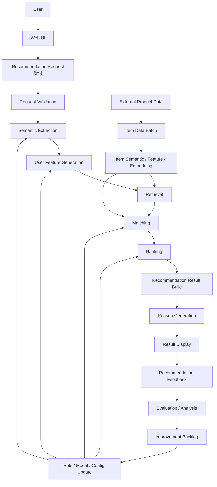

---

### 3.2 処理フローの大分類

| 分類      | 処理フロー                      | 処理種別 | 概要                                                 |
| --------- | ------------------------------- | -------- | ---------------------------------------------------- |
| Online    | レコメンド実行フロー            | OL       | ユーザー入力を受け取り、推薦結果を返す               |
| Online    | フィードバック登録フロー        | OL       | 推薦結果に対するユーザー反応を保存する               |
| Batch     | 商品データ取得・更新フロー      | BT       | 外部商品データを取得し、内部データへ変換する         |
| Batch     | 商品意味推定・Feature生成フロー | BT       | 商品情報からSemantic / Feature / Embeddingを生成する |
| Batch     | オフライン評価フロー            | BT       | Golden Dataset等で推薦品質を評価する                 |
| Operation | 改善反映フロー                  | 運用     | Evaluation結果をルール・モデル改善へ接続する         |

---

## 4. Online処理：レコメンド実行フロー

### 4.1 概要

レコメンド実行フローは、ユーザーがギフト条件を入力してから、推薦結果が画面に表示されるまでの同期処理である。

```text
User Input
↓
Recommendation Request
↓
Recommendation Result
```

---

### 4.2 レコメンド実行フロー

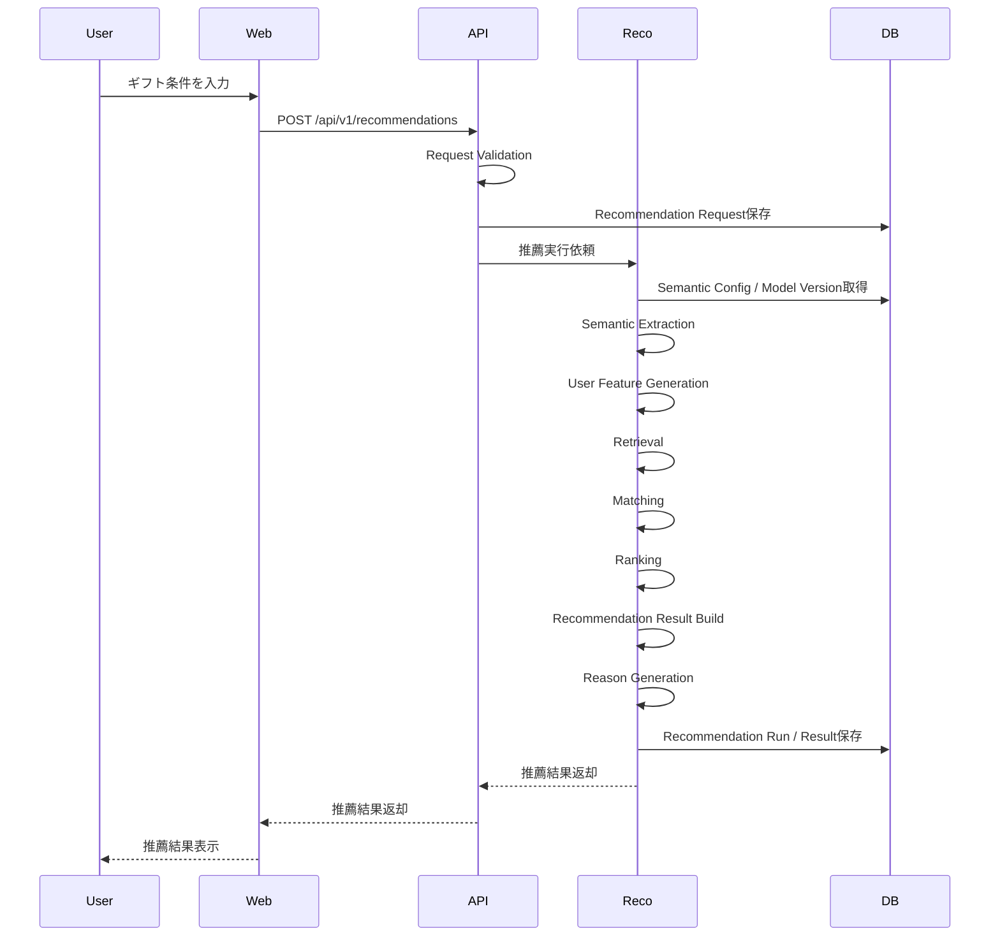

---

### 4.3 処理ステップ一覧

| Step | 処理名                     | 主な入力                                | 主な出力                   | 概要                                                     |
| ---: | -------------------------- | --------------------------------------- | -------------------------- | -------------------------------------------------------- |
|    1 | User Input                 | ユーザー入力                            | 入力フォーム値             | 関係性、用途、予算、好み、避けたい条件、NG条件を入力する |
|    2 | Request Validation         | 入力フォーム値                          | validated request          | 必須項目、値域、矛盾、mode等を検証する                   |
|    3 | Recommendation Request保存 | validated request                       | recommendation_request     | 推薦入力条件を正本として保存する                         |
|    4 | Semantic Extraction        | request text                            | semantic_extraction_result | 入力文からSemantic Conceptを抽出する                     |
|    5 | User Feature Generation    | relationship / occasion / concept       | user_feature               | ユーザー意図を8次元Featureへ変換する                     |
|    6 | Retrieval                  | request / query / item data             | candidate set              | 候補商品を取得する                                       |
|    7 | Matching                   | user_feature / item_feature / candidate | context_score              | ユーザー意図と商品Featureの意味一致度を計算する          |
|    8 | Ranking                    | context_score / popularity / risk       | ranked items               | 最終順位を決定する                                       |
|    9 | Result Build               | ranked items                            | recommendation_result      | 推薦結果・明細・スコア内訳を構築する                     |
|   10 | Reason Generation          | result item / score / evidence          | recommendation_reason      | 推薦理由を生成する                                       |
|   11 | Result保存                 | result / reason                         | DB保存結果                 | 推薦結果を保存する                                       |
|   12 | Result Display             | recommendation_result                   | 画面表示                   | 推薦商品・理由・補足を表示する                           |

---

## 5. Recommendation Request受付フロー

### 5.1 目的

Recommendation Request受付フローは、ユーザー入力を推薦処理で扱える構造化データへ変換する処理である。

---

### 5.2 フロー

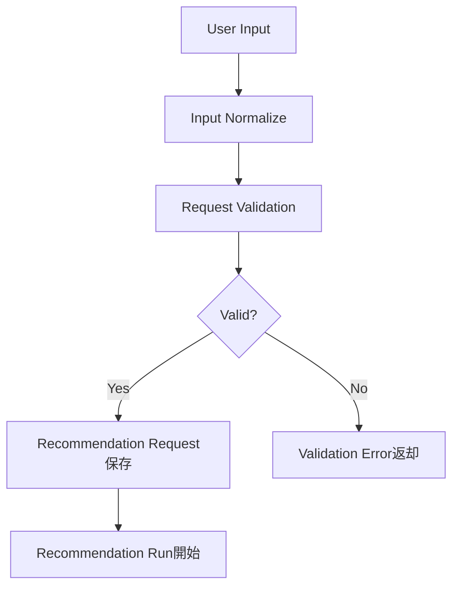

---

### 5.3 入力項目

| 入力項目           | 内容               | 扱い |
| ------------------ | ------------------ | ---- |
| relationship       | 贈る相手との関係性 | 必須 |
| occasion           | 贈答目的           | 必須 |
| budgetMin          | 予算下限           | 任意 |
| budgetMax          | 予算上限           | 任意 |
| preferred_text     | 好み条件           | 任意 |
| non_preferred_text | 避けたい条件       | 任意 |
| ng_text            | 絶対NG条件         | 任意 |
| free_text          | 自由入力           | 任意 |
| mode               | 実行モード         | 必須 |
| top_k              | 最終返却件数       | 任意 |
| candidate_limit    | 内部候補取得件数   | 任意 |

---

### 5.4 バリデーション方針

| 観点             | 内容                                                    |
| ---------------- | ------------------------------------------------------- |
| 必須チェック     | relationship / occasion / mode を確認する               |
| 予算チェック     | budgetMin / budgetMax の値域と大小関係を確認する        |
| 件数チェック     | top_k / candidate_limit の値域を確認する                |
| 矛盾チェック     | preferred / non_preferred / ng の明らかな矛盾を確認する |
| 未対応値チェック | 未対応relationship / occasionを確認する                 |

---

## 6. Semantic Extractionフロー

### 6.1 目的

Semantic Extractionは、Recommendation Requestの入力文から、後続のFeature生成に利用するSemantic Conceptを抽出する処理である。

---

### 6.2 フロー

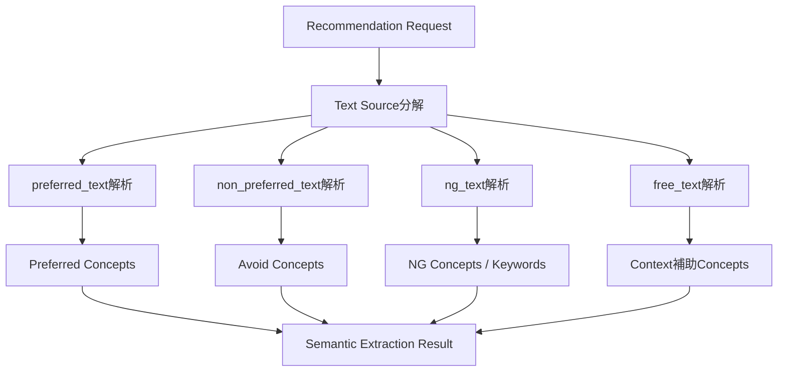

---

### 6.3 入出力

| 区分       | 内容                                                                                |
| ---------- | ----------------------------------------------------------------------------------- |
| 入力       | preferred_text / non_preferred_text / ng_text / free_text / relationship / occasion |
| 出力       | semantic_extraction_result                                                          |
| 主な利用先 | Feature Generation / Retrieval / Evaluation                                         |
| 保存方針   | 推奨。少なくとも評価・デバッグ用に保存する                                          |

---

### 6.4 注意点

| 注意点                    | 内容                                                   |
| ------------------------- | ------------------------------------------------------ |
| Requestとは分離する       | Requestは入力正本、Semantic Resultは推定結果として扱う |
| preferとavoidを分ける     | 好み条件と避けたい条件を混同しない                     |
| NGをHard Filterに接続する | 明確なNGはRetrievalの除外条件へ渡す                    |
| evidenceを保持する        | どの入力文から抽出したか追跡できるようにする           |

---

## 7. User Feature Generationフロー

### 7.1 目的

User Feature Generationは、Relationship / Occasion / Semantic Conceptをもとに、ユーザーの贈答意図を8次元Featureへ変換する処理である。

---

### 7.2 フロー

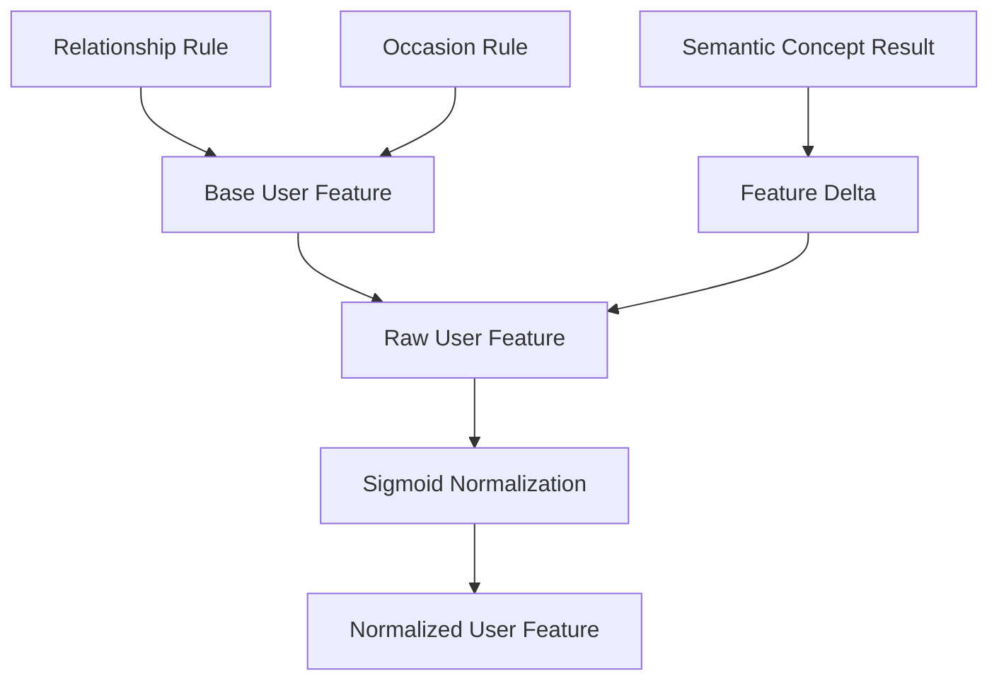

---

### 7.3 8次元Feature

| 区分     | Feature               | 内容                       |
| -------- | --------------------- | -------------------------- |
| Social   | formality             | きちんと感・フォーマルさ   |
| Social   | safety                | 外しにくさ・失礼のなさ     |
| Social   | brand_appropriateness | ブランド・格の適切性       |
| Symbolic | emotion               | 感情・気持ちの伝わりやすさ |
| Symbolic | novelty               | 新規性・意外性             |
| Symbolic | intimacy              | 親密さ                     |
| Symbolic | symbolic_identity     | 相手らしさ・象徴性         |
| Symbolic | story_richness        | ストーリー性               |

---

### 7.4 入出力

| 区分       | 内容                                                 |
| ---------- | ---------------------------------------------------- |
| 入力       | relationship / occasion / semantic_extraction_result |
| 出力       | user_feature_raw / user_feature_normalized           |
| 主な利用先 | Retrieval / Matching / Ranking / Evaluation          |
| 保存方針   | 推奨。評価・再現性確保のため保存する                 |

---

## 8. Retrievalフロー

### 8.1 目的

Retrievalは、Matching / Rankingの対象となる候補商品集合を取得する処理である。

---

### 8.2 フロー

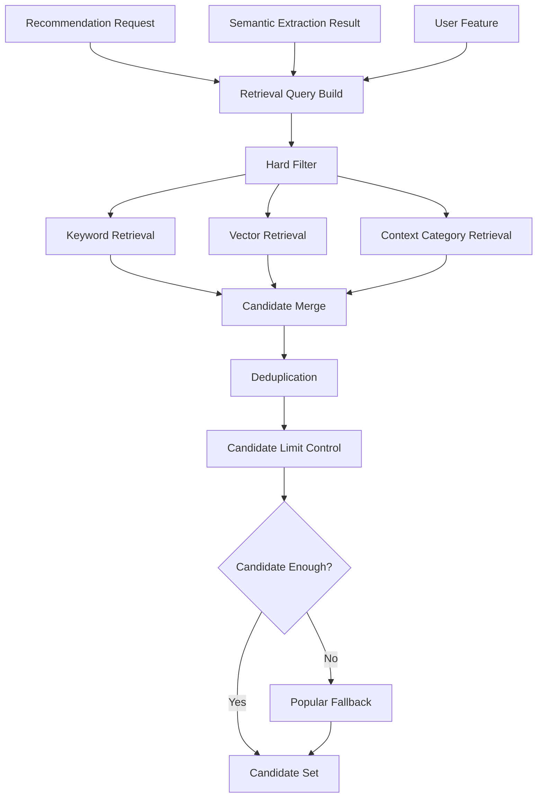

---

### 8.3 Retrievalの原則

| 原則                               | 内容                                    |
| ---------------------------------- | --------------------------------------- |
| 予算条件はHard Filter              | budgetMin / budgetMaxの範囲外は除外する |
| NG条件はHard Filter                | 明確なNG商品は除外する                  |
| non_preferredはHard Filterにしない | 避けたい傾向は後続で減点する            |
| candidate_limitを使う              | 内部候補数を制御する                    |
| top_kとは分ける                    | top_kは最終表示件数として扱う           |
| fallbackでも絶対条件は破らない     | NG条件・予算上限を勝手に緩和しない      |

---

## 9. Matchingフロー

### 9.1 目的

Matchingは、候補商品とユーザー意図の意味的な一致度を計算する処理である。

---

### 9.2 フロー

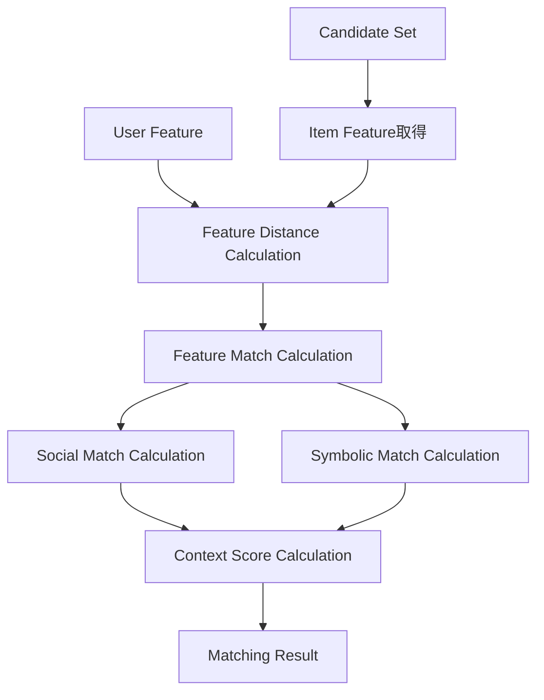

---

### 9.3 Matchingの主な出力

| 出力             | 内容                               |
| ---------------- | ---------------------------------- |
| feature_distance | Feature単位の距離                  |
| feature_match    | Feature単位の一致度                |
| social_match     | Social系Featureの一致度            |
| symbolic_match   | Symbolic系Featureの一致度          |
| context_score    | 贈答文脈との総合的な意味一致スコア |
| avoid_similarity | 避けたい条件との近さ               |
| matching_detail  | スコア内訳・根拠情報               |

---

### 9.4 Retrievalとの境界

| 観点     | Retrieval       | Matching       |
| -------- | --------------- | -------------- |
| 目的     | 候補を集める    | 候補を評価する |
| 重視     | Recall          | Precision      |
| 主な出力 | Candidate Set   | context_score  |
| スコア   | retrieval_score | context_score  |
| 最終順位 | 決めない        | まだ決めない   |

---

## 10. Rankingフロー

### 10.1 目的

Rankingは、Matching済み候補に対して最終順位を決定する処理である。

---

### 10.2 フロー

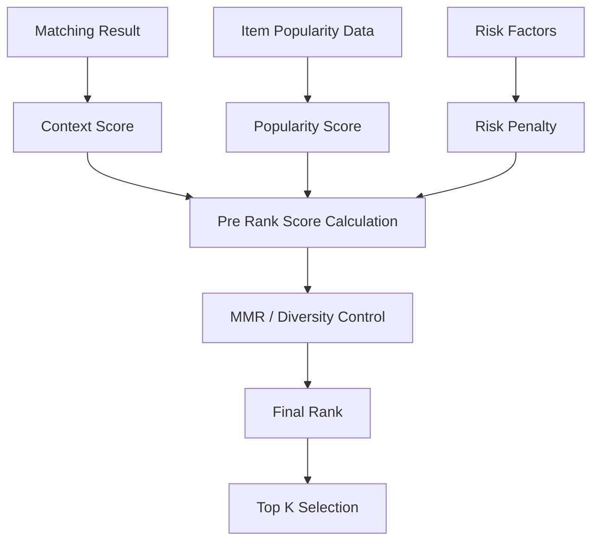

---

### 10.3 Ranking入力

| 入力             | 内容                                         |
| ---------------- | -------------------------------------------- |
| context_score    | 意味一致スコア                               |
| popularity_score | レビュー評価・レビュー件数等による信頼性補助 |
| risk_penalty     | 避けたい条件・不適切リスクによる減点         |
| diversity_signal | 類似商品が並びすぎないための補助             |
| top_k            | 最終返却件数                                 |
| mode             | ui / evaluation / batch                      |

---

### 10.4 Ranking出力

| 出力                 | 内容                     |
| -------------------- | ------------------------ |
| final_score          | 最終順位スコア           |
| rank                 | 表示順位                 |
| score_breakdown      | スコア内訳               |
| ranking_reason_basis | Reason生成に渡す根拠情報 |
| top_k_items          | 最終表示対象商品         |

---

## 11. Recommendation Result / Reason生成フロー

### 11.1 目的

Recommendation Result / Reason生成フローは、Ranking結果をユーザーに返却可能な推薦結果へ整形し、推薦理由を生成する処理である。

---

### 11.2 フロー

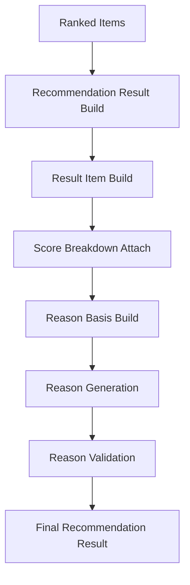

---

### 11.3 Resultに含める情報

| 区分        | 内容                                                          |
| ----------- | ------------------------------------------------------------- |
| Request情報 | recommendation_request_id                                     |
| Run情報     | recommendation_run_id                                         |
| Result情報  | recommendation_result_id                                      |
| Item情報    | item_id / item_name / price / image_url / item_url            |
| Score情報   | context_score / popularity_score / risk_penalty / final_score |
| Rank情報    | rank                                                          |
| Reason情報  | recommendation_reason                                         |
| 補足情報    | caution / fallback_used / score_breakdown                     |

---

### 11.4 Reason生成の原則

| 原則                   | 内容                                                      |
| ---------------------- | --------------------------------------------------------- |
| 根拠に基づく           | score / feature / item data / semantic resultを根拠にする |
| 誇張しない             | 「必ず喜ばれる」などの断定を避ける                        |
| ユーザー文脈に合わせる | relationship / occasionを反映する                         |
| 短く分かりやすくする   | MVPでは1〜3文程度を基本とする                             |
| 不確実性を隠さない     | データ不足や注意点がある場合は補足する                    |

---

## 12. Feedback登録フロー

### 12.1 目的

Feedback登録フローは、推薦結果に対するユーザーの反応を保存し、後続の評価・改善に接続する処理である。

---

### 12.2 フロー

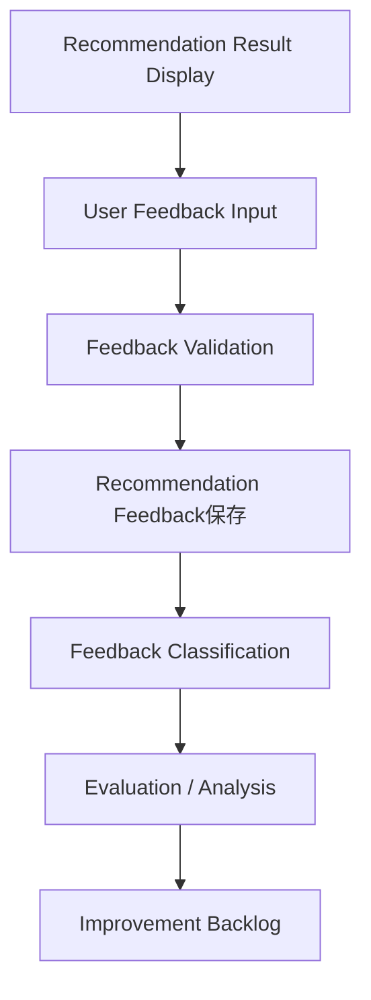

---

### 12.3 Feedback例

| Feedback種別       | 内容                         |
| ------------------ | ---------------------------- |
| 表示商品クリック   | 商品詳細リンクをクリックした |
| 候補として保存     | 商品を候補として保存した     |
| 良い / 微妙        | 推薦結果に対する簡易評価     |
| 理由が納得できた   | Reasonの有用性評価           |
| 条件に合わない     | 文脈不一致の指摘             |
| 避けたい商品だった | avoid / NG制御の失敗指摘     |
| コメント           | 自由記述フィードバック       |

---

### 12.4 MVPでの扱い

MVPでは、複雑な行動ログよりも、最低限以下を取得する。

| 項目                          | 優先度 |
| ----------------------------- | -----: |
| recommendation_result_item_id |     高 |
| feedback_type                 |     高 |
| feedback_value                |     高 |
| comment                       |     中 |
| created_at                    |     高 |

---

## 13. Batch処理：商品データ取得・更新フロー

### 13.1 目的

商品データ取得・更新フローは、外部商品データソースから商品情報を取得し、推薦処理で利用可能な内部データへ変換する処理である。

---

### 13.2 フロー

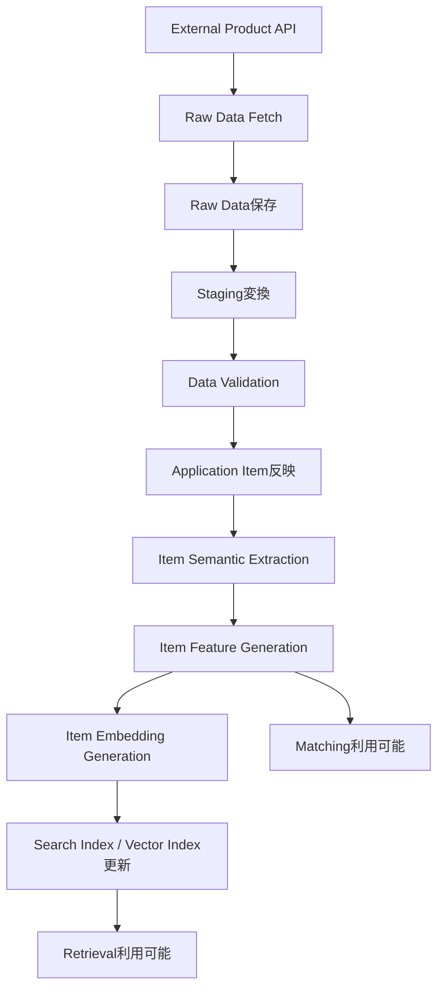

---

### 13.3 商品データ処理の段階

| Step | 処理                      | 内容                                  |
| ---: | ------------------------- | ------------------------------------- |
|    1 | Raw Data Fetch            | 外部APIから商品データを取得する       |
|    2 | Raw Data保存              | 取得結果をそのまま保存する            |
|    3 | Staging変換               | 内部で扱いやすい形式に変換する        |
|    4 | Validation                | 必須項目・価格・URL・画像等を検証する |
|    5 | Application Item反映      | 推薦で使う商品テーブルへ反映する      |
|    6 | Item Semantic Extraction  | 商品情報から意味概念を抽出する        |
|    7 | Item Feature Generation   | 商品Featureを生成する                 |
|    8 | Item Embedding Generation | Vector Retrieval用Embeddingを生成する |
|    9 | Index更新                 | 検索・候補抽出で使える状態にする      |

---

### 13.4 Online処理との関係

| Batch生成物         | Online利用先                        |
| ------------------- | ----------------------------------- |
| item                | Result表示 / Filter                 |
| item_price          | Budget Filter                       |
| item_category / tag | Keyword Retrieval / NG Filter       |
| item_feature        | Matching                            |
| item_embedding      | Vector Retrieval                    |
| item_popularity     | Ranking                             |
| item_quality        | Retrieval / Ranking / Observability |

---

## 14. Batch処理：オフライン評価フロー

### 14.1 目的

オフライン評価フローは、固定された評価データセットを用いて推薦品質を評価し、改善判断に接続する処理である。

---

### 14.2 フロー

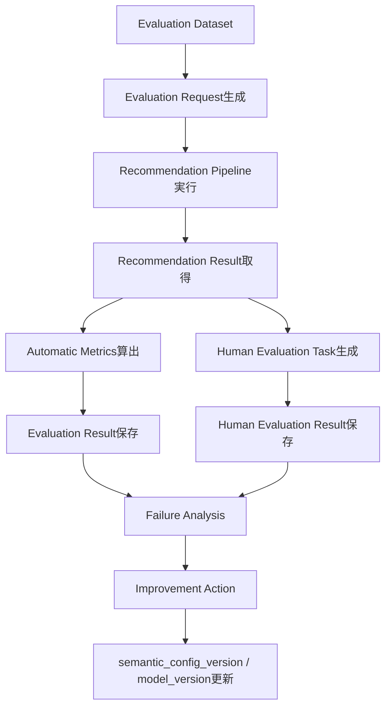

---

### 14.3 評価対象

| 評価レイヤー | 評価対象            |
| ------------ | ------------------- |
| Semantic     | Concept抽出結果     |
| Feature      | User / Item Feature |
| Retrieval    | Candidate Set       |
| Matching     | context_score       |
| Ranking      | final_score / rank  |
| Reason       | 推薦理由            |
| Overall      | 推薦結果全体        |

---

## 15. エラー・Fallbackフロー

### 15.1 基本方針

推薦処理では、処理段階ごとにエラーとFallbackを分けて扱う。

```text
入力不備 = ユーザーに修正依頼
候補不足 = 条件内でFallback
内部エラー = エラーとして返却・ログ保存
外部依存エラー = 部分継続または失敗
```

---

### 15.2 エラーフロー

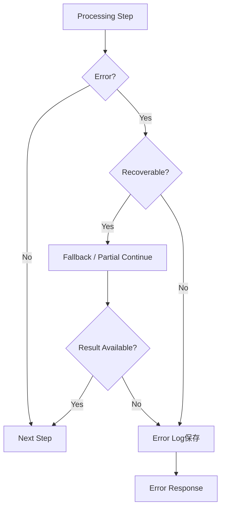

---

### 15.3 代表的なFallback

| 発生箇所            | 状況                | Fallback                          |
| ------------------- | ------------------- | --------------------------------- |
| Semantic Extraction | Concept抽出失敗     | relationship / occasion中心で継続 |
| Feature Generation  | 一部Feature生成失敗 | デフォルト値・基準値で補完        |
| Retrieval           | 候補不足            | 予算内人気商品で補完              |
| Vector Retrieval    | Vector検索失敗      | Keyword Retrievalで継続           |
| Keyword Retrieval   | Keyword検索失敗     | Vector Retrievalで継続            |
| Reason Generation   | Reason生成失敗      | テンプレート理由で補完            |

---

### 15.4 Fallbackで守るルール

| ルール                         | 内容                             |
| ------------------------------ | -------------------------------- |
| NG条件は緩和しない             | ユーザーが明示した除外条件を守る |
| 予算上限は勝手に超えない       | 絶対条件として扱う               |
| Fallback利用を記録する         | 評価・改善に使う                 |
| ユーザー表示に必要なら補足する | 候補不足時は条件見直しを促す     |
| エラーを隠さない               | 内部ログには必ず残す             |

---

## 16. ログ・トレースポイント

### 16.1 主要ログポイント

| 処理段階            | 保存・記録する主な情報                         |
| ------------------- | ---------------------------------------------- |
| Request受付         | request_payload / validation_result            |
| Semantic Extraction | extracted_concepts / evidence_text             |
| Feature Generation  | raw_feature / normalized_feature               |
| Retrieval           | query / candidate_count / fallback_used        |
| Matching            | context_score / feature_match_detail           |
| Ranking             | final_score / rank / score_breakdown           |
| Reason Generation   | reason_text / reason_basis / validation_result |
| Result保存          | result_id / result_item_count                  |
| Feedback            | feedback_type / feedback_value                 |
| Error               | error_code / error_detail / phase              |

---

### 16.2 推薦実行単位

推薦処理全体は `recommendation_run` として管理する。

```text
recommendation_request
↓
recommendation_run
↓
phase log
↓
recommendation_result
↓
recommendation_result_item
```

---

### 16.3 Phase Log対象

| phase                   | 内容             |
| ----------------------- | ---------------- |
| request_validation      | Request検証      |
| semantic_extraction     | Semantic抽出     |
| user_feature_generation | User Feature生成 |
| retrieval               | 候補抽出         |
| matching                | 意味一致計算     |
| ranking                 | 順位決定         |
| result_build            | 結果構築         |
| reason_generation       | 理由生成         |
| feedback_registration   | Feedback登録     |

---

## 17. MVP対象範囲

### 17.1 MVPで実施する処理

| 処理                        | MVP対象 | 方針         |
| --------------------------- | ------: | ------------ |
| Recommendation Request受付  |       ○ | 必須         |
| Request Validation          |       ○ | 必須         |
| Semantic Extraction         |       ○ | 必須         |
| User Feature Generation     |       ○ | 必須         |
| Retrieval                   |       ○ | 必須         |
| Matching                    |       ○ | 必須         |
| Ranking                     |       ○ | 必須         |
| Recommendation Result Build |       ○ | 必須         |
| Reason Generation           |       ○ | 必須         |
| Feedback登録                |       ○ | 簡易で実施   |
| 商品データ取得Batch         |       ○ | 必須         |
| 商品意味推定Batch           |       ○ | 必須         |
| 商品Embedding生成Batch      |       ○ | 必須         |
| Offline Evaluation          |       ○ | 小規模で実施 |

---

### 17.2 MVP対象外

| 処理                   | 理由                                       |
| ---------------------- | ------------------------------------------ |
| リアルタイム外部EC検索 | 応答速度・安定性・再現性の観点で初期対象外 |
| 個人別履歴推薦         | 認証・履歴管理がMVP対象外                  |
| オンライン学習         | 評価データ蓄積後に検討                     |
| A/Bテスト              | 初期トラフィック不足                       |
| 高度な対話型推薦       | MVP初期ではスコープ過大                    |
| 自動パラメータ最適化   | 評価・運用データ蓄積後に検討               |

---

## 18. 後続成果物への引き継ぎ

### 18.1 システム論理構成図への引き継ぎ

本処理フローを、以下の論理コンポーネントへ割り当てる。

| 処理                                                         | 想定コンポーネント       |
| ------------------------------------------------------------ | ------------------------ |
| UI入力・結果表示                                             | web                      |
| Request受付・API制御                                         | api                      |
| Semantic / Feature / Retrieval / Matching / Ranking / Reason | reco                     |
| 商品データ取得・意味推定・Embedding生成                      | batch / reco             |
| データ保存                                                   | database                 |
| 外部商品データ取得                                           | external api integration |

---

### 18.2 機能一覧への引き継ぎ

本処理フローから、以下の機能群を整理する。

| 機能群             | 対応処理                         |
| ------------------ | -------------------------------- |
| レコメンド入力     | Request受付                      |
| 入力条件解析       | Validation / Semantic Extraction |
| 意味特徴量生成     | Feature Generation               |
| 候補商品抽出       | Retrieval                        |
| 意味一致計算       | Matching                         |
| 最終順位決定       | Ranking                          |
| 推薦結果生成       | Result Build                     |
| 推薦理由生成       | Reason Generation                |
| フィードバック取得 | Feedback                         |
| 商品データ管理     | Item Data Batch                  |
| 評価・改善         | Evaluation                       |

---

### 18.3 モジュール一覧への引き継ぎ

本処理フローをもとに、以下のモジュール責務を定義する。

| モジュール候補           | 対応処理                    |
| ------------------------ | --------------------------- |
| Request Validator        | Request Validation          |
| User Semantic Extractor  | Semantic Extraction         |
| User Feature Generator   | User Feature Generation     |
| Candidate Retriever      | Retrieval                   |
| Hard Filter              | Retrieval                   |
| Matcher                  | Matching                    |
| Ranker                   | Ranking                     |
| Result Builder           | Recommendation Result Build |
| Reason Generator         | Reason Generation           |
| Feedback Recorder        | Feedback                    |
| Item Data Collector      | 商品データ取得              |
| Item Feature Generator   | 商品Feature生成             |
| Item Embedding Generator | 商品Embedding生成           |
| Evaluation Runner        | Offline Evaluation          |

---

### 18.4 API一覧への引き継ぎ

本処理フローから、最低限以下のAPI候補を導出する。

| API候補                               | 用途                   |
| ------------------------------------- | ---------------------- |
| `POST /api/v1/recommendations`                             | レコメンド実行         |
| `GET /api/v1/recommendation-results/{resultId}`            | 推薦結果取得           |
| `POST /api/v1/recommendation-results/{resultId}/feedback` | フィードバック登録     |
| `GET /master/relationships`           | Relationship選択肢取得 |
| `GET /master/occasions`               | Occasion選択肢取得     |

---

### 18.5 バッチ一覧への引き継ぎ

本処理フローから、最低限以下のバッチ候補を導出する。

| バッチ候補               | 用途                                   |
| ------------------------ | -------------------------------------- |
| 商品データ取得バッチ     | 外部APIから商品データを取得する        |
| 商品データ正規化バッチ   | Rawデータを内部形式へ変換する          |
| 商品意味推定バッチ       | 商品情報からSemantic Conceptを抽出する |
| 商品Feature生成バッチ    | Item Featureを生成する                 |
| 商品Embedding生成バッチ  | Vector Retrieval用Embeddingを生成する  |
| 商品有効化・無効化バッチ | 商品のactive状態を更新する             |
| オフライン評価実行バッチ | 評価データセットで推薦品質を評価する   |

---

## 19. レビュー観点

| 観点                 | 確認内容                                                                                 |
| -------------------- | ---------------------------------------------------------------------------------------- |
| ドメイン設計との整合 | P4で定義したRequest / Retrieval / Matching / Ranking等が処理として接続されているか       |
| OL / BT分離          | ユーザー同期処理とバッチ処理が分離されているか                                           |
| 責務分離             | Request / Semantic / Feature / Retrieval / Matching / Ranking / Reasonが混ざっていないか |
| データ再現性         | request / run / result / version / scoreを追跡できるか                                   |
| MVP妥当性            | MVPで実装すべき処理に絞れているか                                                        |
| 後続成果物接続       | システム構成・機能一覧・API一覧・バッチ一覧へ引き継げるか                                |
| エラー設計           | どこで失敗し、どうFallbackするか整理されているか                                         |
| 評価接続             | Feedback / Evaluation / Improvementに接続できているか                                    |

---

## 20. まとめ

本サービスのアプリケーション処理フローは、以下の3系統で構成する。

```text
1. Online Recommendation Flow
   User Input
   → Request
   → Semantic
   → Feature
   → Retrieval
   → Matching
   → Ranking
   → Result
   → Reason
   → Display

2. Batch Item Data Flow
   External Product Data
   → Raw
   → Staging
   → Item
   → Semantic
   → Feature
   → Embedding
   → Search / Matching Ready

3. Evaluation / Improvement Flow
   Evaluation Dataset / Feedback
   → Evaluation
   → Failure Analysis
   → Improvement Backlog
   → Rule / Model / Config Update
```

MVPでは、リアルタイム外部検索や個人履歴最適化は行わず、事前に整備した商品データをもとに、意味ベースの推薦処理を同期実行する。

本ドキュメントを起点として、次工程では `システム論理構成図` に進み、各処理を `web / api / reco / batch / database / external service` に割り当てる。
