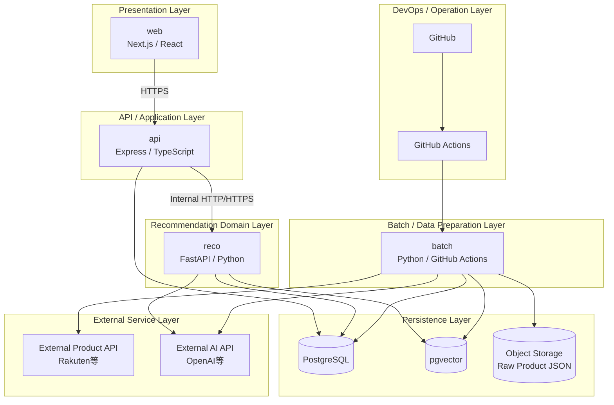
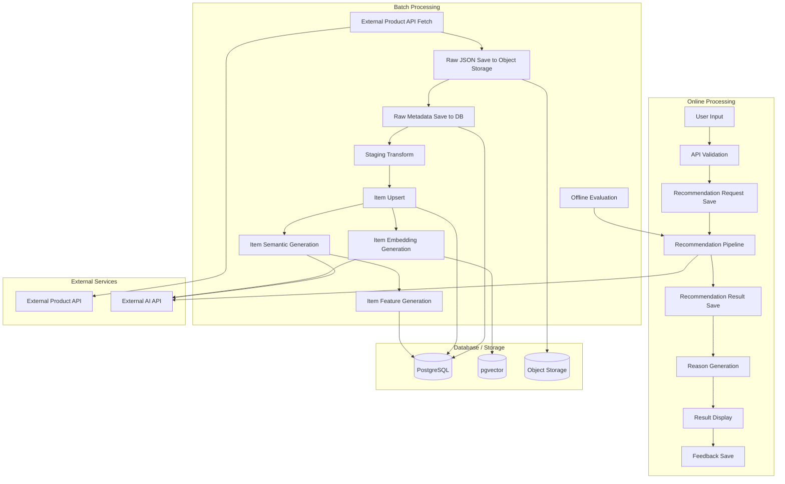
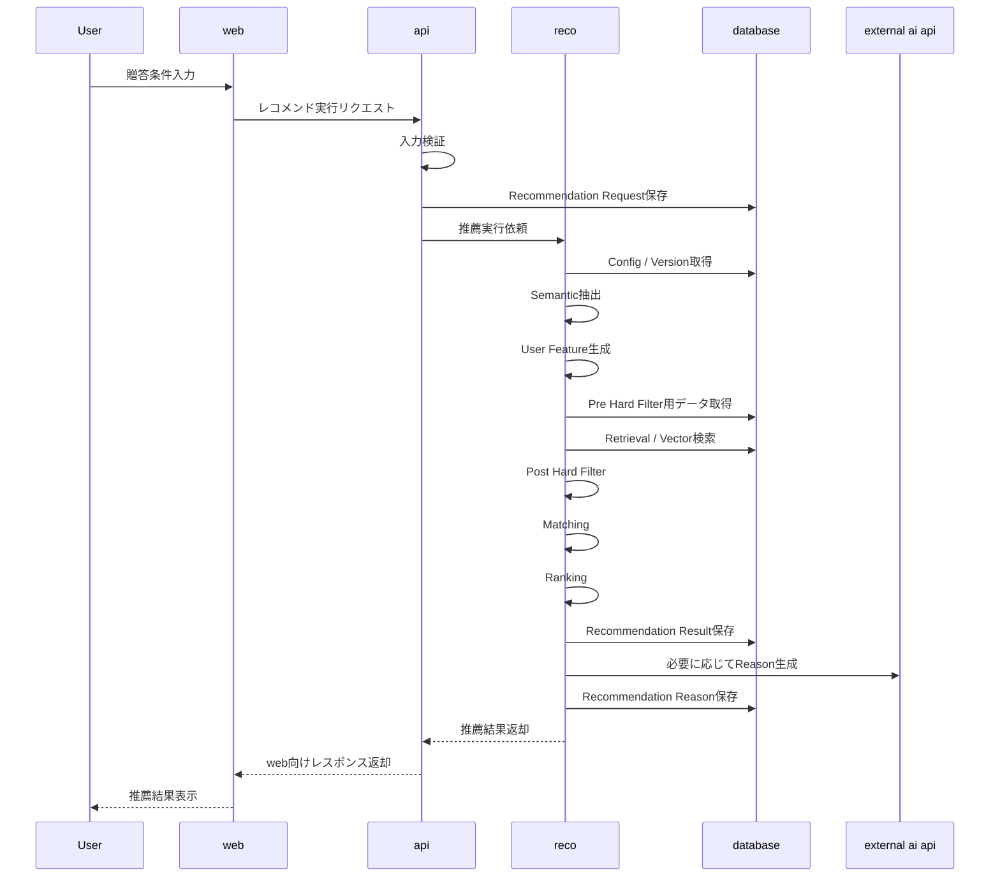
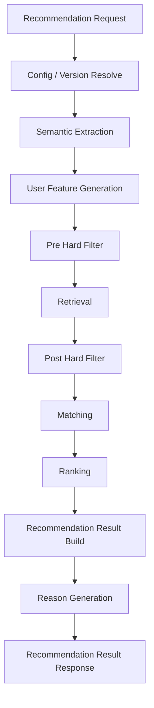
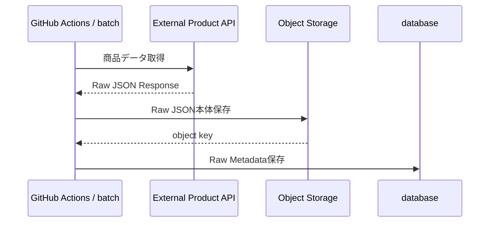
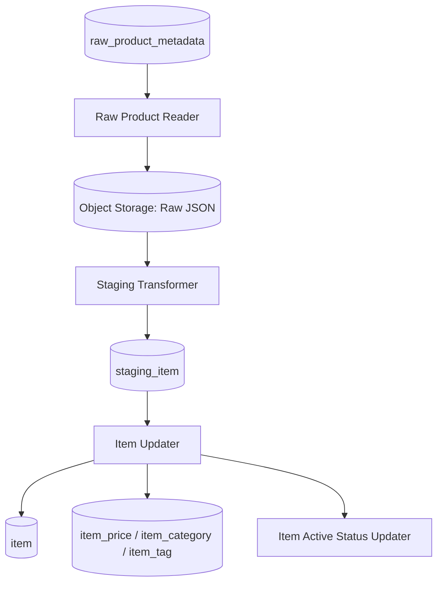
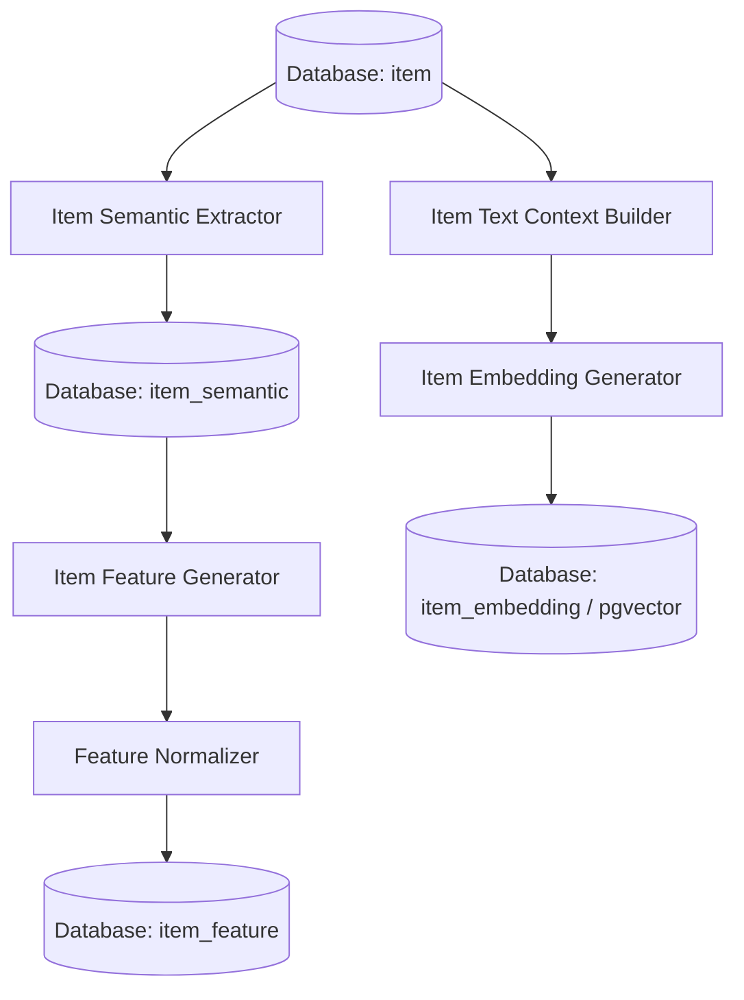
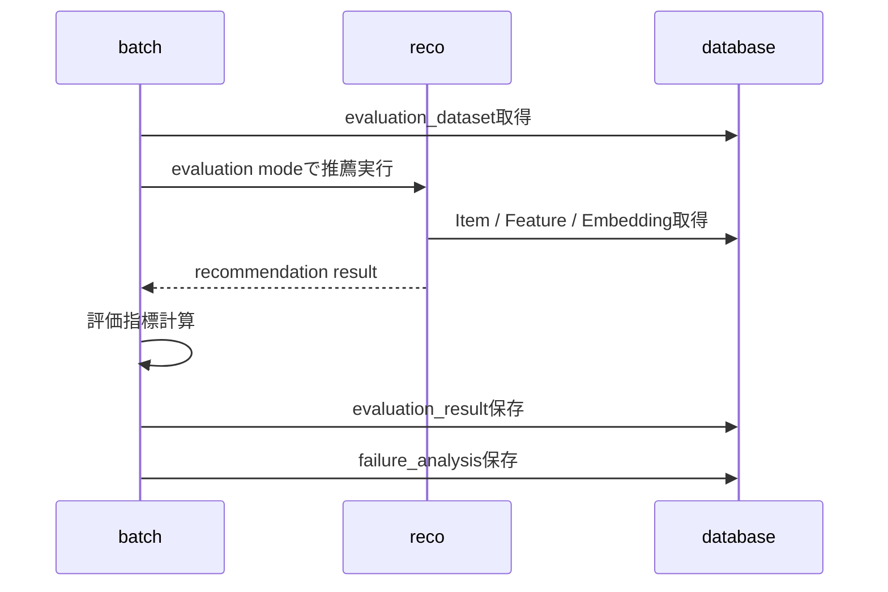

# 処理構成定義書

## 1. 概要

### 1.1 目的

本ドキュメントは、Gift Recommendation Service MVPにおけるシステム処理構成を定義する。

`処理フロー概要図` では全体の処理の流れを整理し、`機能一覧` では必要な機能を一覧化し、`モジュール一覧` では実装責務単位へ分解した。

本ドキュメントでは、その中間に位置する成果物として、以下を整理する。

```text
どの処理系統が存在するか
どの順序で処理されるか
どの処理が同期処理 / Batch処理 / 運用処理か
どのタイミングでデータを保存するか
どこで外部サービスと連携するか
どこでログ・エラーを記録するか
後続の機能一覧・モジュール一覧・API一覧・バッチ一覧へどう接続するか
```

---

### 1.2 本ドキュメントの位置づけ

| 成果物                 | 本ドキュメントとの関係                                          |
| ---------------------- | --------------------------------------------------------------- |
| 処理フロー概要図       | 全体処理の流れの前提                                            |
| システム論理構成図     | web / api / reco / batch / DB / Object Storage の責務境界の前提 |
| システム物理構成図     | 各処理の実行環境・通信経路の前提                                |
| 利用技術スタック整理表 | 各処理で利用する技術要素の前提                                  |
| 機能一覧               | 本ドキュメントで定義した処理構成を機能単位へ展開する            |
| モジュール一覧         | 本ドキュメントで定義した処理構成を実装責務単位へ展開する        |
| API一覧                | Online処理・内部API処理をAPI単位へ展開する                      |
| バッチ一覧             | Batch処理をJob単位へ展開する                                    |
| インターフェース一覧   | 処理間・外部サービス間の接続を整理する                          |

---

## 2. 基本方針

### 2.1 処理構成方針

| 方針                                   | 内容                                                                         |
| -------------------------------------- | ---------------------------------------------------------------------------- |
| Online処理とBatch処理を分離する        | ユーザー操作に同期する処理と、事前準備・評価処理を分ける                     |
| 推薦処理はrecoに集約する               | Semantic / Feature / Retrieval / Matching / Ranking / Reasonはrecoで実行する |
| 商品データ取得はbatchに集約する        | 外部商品API取得、Raw保存、Staging変換、Item反映はbatchで実行する             |
| Raw JSON本体はObject Storageに保存する | DB容量を抑え、再処理可能性を確保する                                         |
| DBは構造化データの正本を保持する       | Request / Result / Item / Feature / Embedding / Feedback / Logを管理する     |
| Retrieval前にPre Hard Filterを行う     | 商品数が増えた場合の検索性能と候補品質を確保する                             |
| Retrieval後にPost Hard Filterを行う    | Semantic NG、重複、不整合などの最終確認を行う                                |
| Feedbackは即時反映しない               | 初期MVPではFeedbackを蓄積し、Evaluation / 改善分析へ接続する                 |
| 設定・Versionを処理開始時に解決する    | 推薦結果の再現性を確保する                                                   |
| 処理段階ごとにログを記録する           | 失敗箇所を特定できるようにする                                               |

---

### 2.2 処理種別

| 処理種別 | 内容                                       | 代表例                                               |
| -------- | ------------------------------------------ | ---------------------------------------------------- |
| OL       | ユーザー操作に同期して実行されるOnline処理 | レコメンド実行、Feedback登録                         |
| BT       | 定期実行・手動実行されるBatch処理          | 商品データ取得、Item Feature生成、Offline Evaluation |
| 共通     | OL / BT双方から参照または利用される処理    | Config / Version解決、DB Repository、ログ記録        |
| 運用     | 開発・保守・改善のための処理               | CI、Batch実行、Issue化、改善Backlog化                |

---

### 2.3 処理責務の基本分担

| コンポーネント    | 主な処理責務                                                                      |
| ----------------- | --------------------------------------------------------------------------------- |
| web               | 入力、表示、Feedback入力、API呼び出し                                             |
| api               | HTTP受付、Validation、Request保存、reco呼び出し、レスポンス整形、Feedback保存     |
| reco              | 推薦パイプライン実行、Reason生成、Result生成                                      |
| batch             | 商品データ取得、Raw保存、Staging変換、Item反映、意味推定、Embedding生成、評価実行 |
| database          | 構造化データ、Feature、Embedding、Result、Feedback、Logの保存                     |
| object storage    | 外部商品APIレスポンスRaw JSON本体の保存                                           |
| external services | 外部商品API、外部AI API                                                           |
| devops            | CI、Batch実行、GitHub運用、自動化                                                 |

---

## 3. 全体処理構成

### 3.0 システムアーキテクチャ図

`Online / Batch分離型の拡張レイヤードアーキテクチャ`と定義する。



---

### 3.1 処理系統一覧

| 処理系統ID | 処理系統                    | 処理種別 | 主担当                        | 概要                                             |
| ---------- | --------------------------- | -------- | ----------------------------- | ------------------------------------------------ |
| OL-01      | Online推薦処理              | OL       | web / api / reco              | ユーザー入力から推薦結果生成・表示まで           |
| OL-02      | Feedback登録処理            | OL       | web / api                     | ユーザーFeedbackを保存する                       |
| BT-01      | 商品データ取得・Raw保存処理 | BT       | batch                         | 外部商品APIから商品データを取得しRaw保存する     |
| BT-02      | Raw取込・Item反映処理       | BT       | batch                         | RawデータをStaging変換し、Item正本へ反映する     |
| BT-03      | 商品意味推定処理            | BT       | batch / reco                  | Item Semantic / Feature / Embeddingを生成する    |
| BT-04      | Offline Evaluation処理      | BT       | batch / reco                  | 評価データセットに対して推薦処理を実行する       |
| CM-01      | Config / Version解決処理    | 共通     | reco / database               | 使用する設定・モデルバージョンを解決する         |
| LOG-01     | ログ・監査処理              | 共通     | api / reco / batch / database | Phase Log / Error Log / Raw Metadata等を記録する |
| OPS-01     | CI / Batch運用処理          | 運用     | devops                        | GitHub ActionsでCI・Batch・自動化を実行する      |

---

### 3.2 全体処理構成図



---

## 4. Online推薦処理構成

### 4.1 目的

Online推薦処理は、ユーザーが入力した贈答条件をもとに、推薦結果と推薦理由を生成し、画面表示できる形で返却する処理である。

---

### 4.2 処理構成

```text
レコメンド条件入力
↓
API受付
↓
入力検証
↓
Recommendation Request保存
↓
Config / Version解決
↓
Semantic抽出
↓
User Feature生成
↓
Pre Hard Filter
↓
Retrieval
↓
Post Hard Filter
↓
Matching
↓
Ranking
↓
Recommendation Result生成
↓
Reason生成
↓
APIレスポンス返却
↓
レコメンド結果表示
```

---

### 4.3 Online推薦処理フロー



---

### 4.4 処理ステップ詳細

| 順序 | 処理                       | 主担当 | 入力                                                      | 出力                                    | 保存先                 |
| ---: | -------------------------- | ------ | --------------------------------------------------------- | --------------------------------------- | ---------------------- |
|    1 | レコメンド条件入力         | web    | ユーザー入力                                              | request payload                         | なし                   |
|    2 | API受付                    | api    | HTTP request                                              | application command                     | なし                   |
|    3 | 入力検証                   | api    | request body                                              | validated request                       | なし                   |
|    4 | Recommendation Request保存 | api    | validated request                                         | recommendation_request                  | database               |
|    5 | Config / Version解決       | reco   | mode / current config                                     | semantic_config_version / model_version | なし                   |
|    6 | Semantic抽出               | reco   | preferred / non_preferred / relationship / occasion       | semantic_extraction_result              | 必要に応じてDB         |
|    7 | User Feature生成           | reco   | semantic_extraction_result / relationship / occasion      | user_feature                            | 必要に応じてDB         |
|    8 | Pre Hard Filter            | reco   | request / budget / ng / item metadata                     | pre_filtered_item_pool                  | なし                   |
|    9 | Retrieval                  | reco   | pre_filtered_item_pool / query_embedding / item_embedding | retrieval_candidate                     | 必要に応じてlog        |
|   10 | Post Hard Filter           | reco   | retrieval_candidate / semantic result / item_semantic     | validated_retrieval_candidate           | excluded_candidate_log |
|   11 | Matching                   | reco   | user_feature / item_feature                               | matching_result / context_score         | result関連             |
|   12 | Ranking                    | reco   | matching_result / popularity / risk / diversity           | ranking_result / final_score / rank     | result関連             |
|   13 | Recommendation Result生成  | reco   | ranking_result / item snapshot                            | recommendation_result / result_item     | database               |
|   14 | Reason生成                 | reco   | result_item / score_breakdown / context                   | recommendation_reason                   | database               |
|   15 | レスポンス返却             | api    | recommendation_result                                     | web response                            | なし                   |
|   16 | 結果表示                   | web    | API response                                              | UI表示                                  | なし                   |

---

### 4.5 Online推薦処理の重要方針

| 論点                  | 方針                                                      |
| --------------------- | --------------------------------------------------------- |
| Request保存タイミング | 入力検証後、reco呼び出し前に保存する                      |
| Result保存タイミング  | Ranking後、Reason生成前後に保存する                       |
| 外部商品API依存       | Online処理中には外部商品APIを呼ばない                     |
| 商品データ利用        | Batchで事前生成されたItem / Feature / Embeddingを利用する |
| Reason生成            | MVPではreco側で生成し、表示対象と内部管理対象を分ける     |
| 0件時                 | 空結果として扱い、条件見直しを促す                        |
| エラー時              | Error Logを記録し、webには統一エラーレスポンスを返す      |

---

## 5. 推薦パイプライン処理構成

### 5.1 推薦パイプライン全体



---

### 5.2 Pre Hard Filter

| 項目         | 内容                                                                               |
| ------------ | ---------------------------------------------------------------------------------- |
| 目的         | Retrieval対象の商品集合を事前に減らす                                              |
| 主担当       | reco                                                                               |
| 処理種別     | OL                                                                                 |
| 主な入力     | Recommendation Request / budget条件 / ng条件 / item / item metadata                |
| 主な出力     | pre_filtered_item_pool                                                             |
| 主な除外条件 | 予算外、無効商品、販売停止、明確なNGカテゴリ、明確なNGキーワード、最低品質条件違反 |

Pre Hard Filterは、性能上重要な処理である。  
商品数が増える前提では、全商品に対してEmbedding検索や類似度計算を行うのではなく、構造化条件で事前に検索対象を絞る。

---

### 5.3 Retrieval

| 項目     | 内容                                                                                              |
| -------- | ------------------------------------------------------------------------------------------------- |
| 目的     | Pre Hard Filter後の商品集合から、ユーザー意図に近い候補商品を抽出する                             |
| 主担当   | reco                                                                                              |
| 処理種別 | OL                                                                                                |
| 主な入力 | pre_filtered_item_pool / Recommendation Request / user_feature / query_embedding / item_embedding |
| 主な出力 | retrieval_candidate                                                                               |
| 主な方式 | Embedding検索、キーワード検索、Hybrid検索                                                         |

Retrievalは、全商品検索ではなく、Pre Hard Filter通過済みの商品集合に対して実行する。

---

### 5.4 Post Hard Filter

| 項目         | 内容                                                                                      |
| ------------ | ----------------------------------------------------------------------------------------- |
| 目的         | Retrieval後の候補商品に対して、最終除外条件・安全確認を行う                               |
| 主担当       | reco                                                                                      |
| 処理種別     | OL                                                                                        |
| 主な入力     | retrieval_candidate / Recommendation Request / semantic_extraction_result / item_semantic |
| 主な出力     | validated_retrieval_candidate / excluded_candidate_log                                    |
| 主な確認項目 | Semantic NG、avoid類似、重複、不整合、表示前Validation                                    |

Post Hard Filterは、Pre Hard Filterでは判定しきれない意味的な除外条件や、候補集合が確定した後に確認すべき重複・不整合を扱う。

---

### 5.5 Matching

| 項目     | 内容                                                            |
| -------- | --------------------------------------------------------------- |
| 目的     | User FeatureとItem Featureの一致度を計算する                    |
| 主担当   | reco                                                            |
| 処理種別 | OL                                                              |
| 主な入力 | user_feature / item_feature / validated_retrieval_candidate     |
| 主な出力 | matching_result / social_match / symbolic_match / context_score |

Matchingは、商品がユーザーの贈答意図にどの程度合っているかを計算する処理である。

---

### 5.6 Ranking

| 項目     | 内容                                                            |
| -------- | --------------------------------------------------------------- |
| 目的     | 最終表示順位を決定する                                          |
| 主担当   | reco                                                            |
| 処理種別 | OL                                                              |
| 主な入力 | context_score / popularity_score / risk_penalty / diversity情報 |
| 主な出力 | final_score / rank / ranking_result                             |

Rankingは、意味一致度だけでなく、人気・リスク・多様性を加味して、最終順位を決定する。

---

### 5.7 Reason生成

| 項目     | 内容                                                                |
| -------- | ------------------------------------------------------------------- |
| 目的     | 推薦結果に対して、ユーザーが理解できる理由を付与する                |
| 主担当   | reco                                                                |
| 処理種別 | OL                                                                  |
| 主な入力 | result_item / score_breakdown / relationship / occasion / item data |
| 主な出力 | recommendation_reason                                               |

Reasonのうち、通常UIに表示する対象は以下とする。

| 表示対象       | 内容                       |
| -------------- | -------------------------- |
| reason_badges  | 表示ラベル                 |
| reason_summary | 商品カード上の短い推薦理由 |
| reason_detail  | 詳細表示用の推薦理由       |
| reason_points  | 箇条書き理由               |
| caution_note   | 必要に応じた注意文         |

以下は内部管理・評価・デバッグ用であり、通常UIには表示しない。

| 内部項目          | 用途                                     |
| ----------------- | ---------------------------------------- |
| reason_basis      | 生成根拠                                 |
| generation_method | 生成方式管理                             |
| model_version_id  | バージョン管理                           |
| score_breakdown   | 評価・デバッグ                           |
| final_score       | 順位算出用。通常UIでは順位として表示する |

---

## 6. Feedback登録処理構成

### 6.1 目的

Feedback登録処理は、ユーザーが推薦結果や推薦理由に対して行った評価を保存し、後続の評価・改善処理へ接続する処理である。

---

### 6.2 処理構成

```text
ユーザーがFeedback入力
↓
Feedback登録API受付
↓
Feedback入力検証
↓
Recommendation Result / Result Item存在確認
↓
Recommendation Feedback保存
↓
登録結果返却
↓
後続のFeedback分析 / Evaluationへ接続
```

---

### 6.3 処理ステップ詳細

| 順序 | 処理             | 主担当    | 入力                       | 出力                     | 保存先               |
| ---: | ---------------- | --------- | -------------------------- | ------------------------ | -------------------- |
|    1 | Feedback入力     | web       | user feedback              | feedback payload         | なし                 |
|    2 | Feedback API受付 | api       | HTTP request               | application command      | なし                 |
|    3 | Feedback検証     | api       | feedback payload           | validated feedback       | なし                 |
|    4 | 対象存在確認     | api       | result_id / result_item_id | target validation result | なし                 |
|    5 | Feedback保存     | api       | validated feedback         | recommendation_feedback  | database             |
|    6 | 登録結果返却     | api / web | saved feedback             | success response         | なし                 |
|    7 | Feedback分析     | batch     | recommendation_feedback    | feedback summary         | database / 改善Issue |

---

### 6.4 Feedback処理方針

| 論点                | 方針                                                      |
| ------------------- | --------------------------------------------------------- |
| Rankingへの即時反映 | MVPでは行わない                                           |
| Feedbackの用途      | Evaluation、失敗分析、改善Backlog化に利用する             |
| 保存粒度            | result単位、result_item単位、reason単位で扱えるようにする |
| 自由記述            | MVPでは任意。分析用に保持できるようにする                 |
| 不正値              | API側でValidationする                                     |

---

## 7. 商品データ取得・Raw保存処理構成

### 7.1 目的

商品データ取得・Raw保存処理は、外部商品APIから商品データを取得し、外部レスポンス原本をObject Storageへ保存する処理である。

---

### 7.2 処理構成

```text
Batch起動
↓
外部商品APIリクエスト条件決定
↓
外部商品API呼び出し
↓
Raw JSON取得
↓
Raw JSON本体をObject Storageへ保存
↓
Raw MetadataをDBへ保存
↓
後続のStaging変換へ接続
```

---

### 7.3 処理フロー



---

### 7.4 保存データ

| データ              | 保存先         | 内容                      |
| ------------------- | -------------- | ------------------------- |
| Raw JSON本体        | Object Storage | 外部商品APIレスポンス原本 |
| object key          | database       | Raw JSONの参照先          |
| content hash        | database       | 差分検知・重複排除        |
| fetched_at          | database       | 取得日時                  |
| source_api          | database       | 取得元API                 |
| request params hash | database       | 取得条件識別              |
| import_status       | database       | 取込状態                  |
| error_message       | database       | 失敗理由                  |

---

### 7.5 処理方針

| 論点          | 方針                                                           |
| ------------- | -------------------------------------------------------------- |
| Raw本体保存先 | DBではなくObject Storage                                       |
| DB保存対象    | Raw Metadataのみ                                               |
| 再処理性      | Raw MetadataからObject StorageのRaw JSONを参照できるようにする |
| 冪等性        | content hash / request params hashを利用して重複取込を防ぐ     |
| 失敗時        | Error LogとRaw Metadataのimport_statusで管理する               |

---

## 8. Raw取込・Item反映処理構成

### 8.1 目的

Raw取込・Item反映処理は、Object Storageに保存されたRaw JSONを内部取込形式へ変換し、Online推薦で利用可能なItem正本へ反映する処理である。

---

### 8.2 処理構成

```text
Raw Metadataから未処理Rawを取得
↓
Object StorageからRaw JSON読取
↓
Staging変換
↓
staging_item保存
↓
Item正本へUpsert
↓
商品関連データ反映
↓
商品有効状態更新
```

---

### 8.3 処理フロー



---

### 8.4 処理ステップ詳細

| 順序 | 処理          | 主担当 | 入力                 | 出力                  | 保存先   |
| ---: | ------------- | ------ | -------------------- | --------------------- | -------- |
|    1 | 未処理Raw取得 | batch  | raw_product_metadata | target raw list       | なし     |
|    2 | Raw JSON読取  | batch  | object key           | raw JSON              | なし     |
|    3 | Staging変換   | batch  | raw JSON             | staging_item          | database |
|    4 | Item反映      | batch  | staging_item         | item / item関連データ | database |
|    5 | 有効状態更新  | batch  | latest import result | item.is_active        | database |
|    6 | 取込状態更新  | batch  | import result        | import_status         | database |

---

### 8.5 処理方針

| 論点         | 方針                                           |
| ------------ | ---------------------------------------------- |
| 外部形式依存 | Staging変換で吸収する                          |
| Item正本     | database上のitemをOnline推薦の参照元とする     |
| Raw再処理    | Object Storage上のRaw JSONから再実行可能にする |
| 商品有効状態 | 外部API取得状況・販売状態をもとに更新する      |
| エラー時     | 対象Raw単位で失敗状態を管理する                |

---

## 9. 商品意味推定処理構成

### 9.1 目的

商品意味推定処理は、Item正本をもとに、推薦処理で利用するItem Semantic、Item Feature、Item Embeddingを生成する処理である。

---

### 9.2 処理構成

```text
Item取得
↓
Item Semantic抽出
↓
Item Feature生成
↓
Feature正規化
↓
Item Feature保存
↓
Itemテキスト統合
↓
Item Embedding生成
↓
Item Embedding保存
```

---

### 9.3 処理フロー



---

### 9.4 処理ステップ詳細

| 順序 | 処理               | 主担当       | 入力                                         | 出力                    | 保存先              |
| ---: | ------------------ | ------------ | -------------------------------------------- | ----------------------- | ------------------- |
|    1 | Item取得           | batch        | item                                         | target item list        | なし                |
|    2 | Item Semantic抽出  | batch / reco | 商品名、キャッチコピー、説明、ジャンル、タグ | item_semantic           | database            |
|    3 | Item Feature生成   | batch / reco | item_semantic / item metadata                | item_feature_raw        | database            |
|    4 | Feature正規化      | batch / reco | item_feature_raw / 統計量                    | item_feature_normalized | database            |
|    5 | Itemテキスト統合   | batch        | item data                                    | item_text_context       | なし                |
|    6 | Item Embedding生成 | batch        | item_text_context                            | item_embedding          | database / pgvector |
|    7 | 処理ログ記録       | batch        | phase result                                 | phase_log / error_log   | database            |

---

### 9.5 処理方針

| 論点           | 方針                                                                         |
| -------------- | ---------------------------------------------------------------------------- |
| 実行タイミング | Online推薦前にBatchで実行する                                                |
| Semantic抽出   | 商品名、キャッチコピー、商品説明、ジャンル、タグを利用する                   |
| Feature        | 8次元Featureを生成する                                                       |
| 正規化         | 値を単純clipで潰さず、sigmoid系の正規化方針を採用する                        |
| Embedding      | Retrievalで利用できるようpgvectorへ保存する                                  |
| 再生成         | item更新、semantic_config_version変更、model_version変更時に再生成対象とする |

---

## 10. Offline Evaluation処理構成

### 10.1 目的

Offline Evaluation処理は、評価用データセットに対して推薦処理を実行し、推薦品質・失敗傾向・改善候補を確認する処理である。

---

### 10.2 処理構成

```text
Evaluation Dataset取得
↓
Evaluation modeで推薦実行
↓
推薦結果取得
↓
評価指標計算
↓
Evaluation Result保存
↓
失敗分析
↓
改善Backlog化
```

---

### 10.3 処理フロー



---

### 10.4 評価対象

| 評価対象         | 内容                                       |
| ---------------- | ------------------------------------------ |
| Retrieval        | 候補抽出が妥当か                           |
| Post Hard Filter | NG・不整合除外が適切か                     |
| Matching         | User FeatureとItem Featureの一致度が妥当か |
| Ranking          | final_score / rankが妥当か                 |
| Reason           | 推薦理由が納得感を持つか                   |
| Feedback         | ユーザー評価とスコアのズレがあるか         |

---

### 10.5 処理方針

| 論点     | 方針                                                           |
| -------- | -------------------------------------------------------------- |
| 実行環境 | GitHub Actions / batch                                         |
| 推薦実行 | recoをevaluation modeで呼び出す                                |
| 改善反映 | 自動反映せず、人間が確認して設計・ルール・パラメータへ反映する |
| 結果保存 | evaluation_resultとしてDBへ保存する                            |
| 失敗分析 | Retrieval / Matching / Ranking / Reasonなどの失敗分類を持つ    |

---

## 11. Config / Version解決処理構成

### 11.1 目的

Config / Version解決処理は、推薦処理・商品意味推定処理・評価処理で利用する設定やモデルバージョンを決定し、結果の再現性を確保する処理である。

---

### 11.2 解決対象

| 対象                          | 内容                                           |
| ----------------------------- | ---------------------------------------------- |
| semantic_config_version       | Semantic / Feature / Ruleの設定バージョン      |
| model_version                 | Embedding / LLM / Reason生成モデルのバージョン |
| ranking_config                | Ranking計算パラメータ                          |
| reason_template_version       | Reason生成テンプレート                         |
| feature_normalization_version | Feature正規化統計量・方式のバージョン          |

---

### 11.3 処理タイミング

| 処理               | 解決タイミング                    |
| ------------------ | --------------------------------- |
| Online推薦         | Recommendation Orchestrator開始時 |
| Item Semantic生成  | 商品意味推定Batch開始時           |
| Item Feature生成   | 商品意味推定Batch開始時           |
| Item Embedding生成 | Embedding生成Batch開始時          |
| Offline Evaluation | Evaluation Runner開始時           |

---

### 11.4 処理方針

| 論点       | 方針                                            |
| ---------- | ----------------------------------------------- |
| 再現性     | Request / Run / Resultに利用Versionを紐づける   |
| 変更管理   | Version変更時に旧結果との比較ができるようにする |
| MVP        | 初期はcurrent versionを参照する方式でよい       |
| Evaluation | 評価結果に利用Versionを必ず残す                 |

---

## 12. ログ・監査処理構成

### 12.1 目的

ログ・監査処理は、推薦実行、Batch実行、外部API連携、評価処理の状態を追跡できるようにする処理である。

---

### 12.2 ログ種別

| ログ種別             | 主担当             | 内容                               |
| -------------------- | ------------------ | ---------------------------------- |
| recommendation_run   | reco               | 推薦実行単位                       |
| phase_log            | api / reco / batch | 処理段階別の開始・終了・成功・失敗 |
| error_log            | api / reco / batch | エラー内容、原因、対象データ       |
| raw_product_metadata | batch              | Raw保存・取込状態                  |
| evaluation_result    | batch              | 評価結果                           |
| failure_analysis     | batch              | 失敗分類・改善候補                 |
| GitHub Actions log   | devops             | CI / Batch実行ログ                 |
| hosting log          | web / api / reco   | Runtimeエラー・接続エラー          |

---

### 12.3 Phase Log記録ポイント

| 処理系統       | 記録ポイント                                                                                                                    |
| -------------- | ------------------------------------------------------------------------------------------------------------------------------- |
| Online推薦     | Request保存、Semantic抽出、Feature生成、Pre Hard Filter、Retrieval、Post Hard Filter、Matching、Ranking、Result生成、Reason生成 |
| Feedback登録   | API受付、Validation、Feedback保存                                                                                               |
| 商品データ取得 | API呼び出し、Raw保存、Raw Metadata保存                                                                                          |
| Raw取込        | Raw読取、Staging変換、Item反映、有効状態更新                                                                                    |
| 商品意味推定   | Semantic抽出、Feature生成、Embedding生成                                                                                        |
| Evaluation     | Dataset取得、推薦実行、評価指標計算、結果保存                                                                                   |

---

### 12.4 エラー処理方針

| エラー種別             | 方針                                                 |
| ---------------------- | ---------------------------------------------------- |
| Validationエラー       | APIでエラー応答し、DB保存しない                      |
| reco処理エラー         | recommendation_run / phase_log / error_logへ記録する |
| Retrieval 0件          | エラーではなく空結果として扱う                       |
| 外部商品APIエラー      | Batch失敗として記録し、後で再実行する                |
| Object Storage保存失敗 | Raw取込を進めず、Batch失敗扱いにする                 |
| AI APIエラー           | 対象処理を失敗またはFallback扱いにする               |
| DBエラー               | 処理失敗として扱い、再実行対象にする                 |

---

## 13. 同期 / 非同期 / Batchの整理

### 13.1 同期処理

| 処理                       | 理由                                 |
| -------------------------- | ------------------------------------ |
| レコメンド条件入力         | ユーザー操作に同期                   |
| レコメンド実行API          | ユーザーが結果を待つ                 |
| Recommendation Request保存 | 推薦実行の起点として必要             |
| reco推薦実行               | MVPでは即時結果表示が必要            |
| Recommendation Result返却  | 画面表示に必要                       |
| Feedback登録               | ユーザー操作に同期して保存結果を返す |

---

### 13.2 Batch処理

| 処理               | 理由                                  |
| ------------------ | ------------------------------------- |
| 商品データ取得     | 外部API依存であり、Onlineで実行しない |
| Raw保存            | 大量データ処理のためBatchで実行       |
| Staging変換        | Online推薦前の事前準備                |
| Item反映           | 商品正本更新処理                      |
| Item Semantic生成  | AI API利用・再生成が必要              |
| Item Feature生成   | 推薦前の事前計算                      |
| Item Embedding生成 | Retrieval用の事前計算                 |
| Offline Evaluation | 開発・改善用の非同期処理              |
| Feedback分析       | 即時反映せず、改善サイクルで利用      |

---

### 13.3 共通処理

| 処理                   | 利用元                                 |
| ---------------------- | -------------------------------------- |
| Config / Version解決   | Online推薦 / 商品意味推定 / Evaluation |
| Repository             | api / reco / batch                     |
| Error Log記録          | api / reco / batch                     |
| Phase Log記録          | api / reco / batch                     |
| External AI API Client | reco / batch                           |
| DB Connection Manager  | api / reco / batch                     |

---

## 14. データ保存タイミング

### 14.1 Online推薦

| データ                     | 保存タイミング                | 保存先         |
| -------------------------- | ----------------------------- | -------------- |
| recommendation_request     | API入力検証後、reco呼び出し前 | database       |
| recommendation_run         | reco推薦処理開始時            | database       |
| semantic_extraction_result | 必要に応じてSemantic抽出後    | database       |
| user_feature               | 必要に応じてFeature生成後     | database       |
| retrieval_candidate        | 必要に応じてRetrieval後       | log / debug用  |
| excluded_candidate_log     | Post Hard Filter後            | database / log |
| recommendation_result      | Ranking後                     | database       |
| recommendation_result_item | Ranking後                     | database       |
| recommendation_reason      | Reason生成後                  | database       |
| phase_log                  | 各処理段階の開始・終了時      | database       |
| error_log                  | 例外発生時                    | database       |

---

### 14.2 Feedback

| データ                  | 保存タイミング      | 保存先   |
| ----------------------- | ------------------- | -------- |
| recommendation_feedback | Feedback検証後      | database |
| feedback_summary        | Batch分析後         | database |
| failure_analysis        | Evaluation / 分析後 | database |

---

### 14.3 商品データ

| データ               | 保存タイミング      | 保存先              |
| -------------------- | ------------------- | ------------------- |
| raw_product_json     | 外部商品API取得直後 | object storage      |
| raw_product_metadata | Raw保存直後         | database            |
| staging_item         | Raw変換後           | database            |
| item                 | Staging反映時       | database            |
| item_semantic        | Item Semantic抽出後 | database            |
| item_feature         | Item Feature生成後  | database            |
| item_embedding       | Embedding生成後     | database / pgvector |
| item_active_status   | 商品有効状態更新時  | database            |

---

## 15. 処理構成と後続成果物の対応

### 15.1 機能一覧への接続

| 処理系統                    | 対応する機能分類                          |
| --------------------------- | ----------------------------------------- |
| Online推薦処理              | 画面機能 / API機能 / 推薦パイプライン機能 |
| Feedback登録処理            | 画面機能 / API機能 / 評価・改善機能       |
| 商品データ取得・Raw保存処理 | 商品データ連携機能                        |
| Raw取込・Item反映処理       | 商品データ連携機能                        |
| 商品意味推定処理            | 商品意味推定機能                          |
| Offline Evaluation処理      | 評価・改善機能                            |
| Config / Version解決処理    | マスタ・設定機能                          |
| ログ・監査処理              | ログ・運用機能                            |

---

### 15.2 モジュール一覧への接続

| 処理系統                    | 主なモジュール                                                                                                                                                                                         |
| --------------------------- | ------------------------------------------------------------------------------------------------------------------------------------------------------------------------------------------------------ |
| Online推薦処理              | Recommendation Controller / Recommendation Orchestrator / Semantic Extractor / User Feature Generator / Pre Hard Filter / Candidate Retriever / Post Hard Filter / Matcher / Ranker / Reason Generator |
| Feedback登録処理            | Feedback Controller / Feedback Validator / Feedback Service / Feedback Repository                                                                                                                      |
| 商品データ取得・Raw保存処理 | Product Data Collector / External Product API Client / Raw Product Object Writer / Raw Product Metadata Writer                                                                                         |
| Raw取込・Item反映処理       | Raw Product Reader / Staging Transformer / Item Updater / Item Active Status Updater                                                                                                                   |
| 商品意味推定処理            | Item Semantic Generator / Item Feature Generator / Item Embedding Generator                                                                                                                            |
| Offline Evaluation処理      | Offline Evaluation Runner / Evaluation Result Writer / Failure Analyzer                                                                                                                                |
| Config / Version解決処理    | Config Version Resolver / Config Repository                                                                                                                                                            |
| ログ・監査処理              | Reco Log Writer / Batch Log Writer / Log Repository                                                                                                                                                    |

---

### 15.3 API一覧への接続

| 処理               | API化対象                                              |
| ------------------ | ------------------------------------------------------ |
| レコメンド実行     | `POST /recommendations`                                |
| Feedback登録       | `POST /recommendations/{result_id}/feedback`           |
| マスタ取得         | `GET /masters/relationships`, `GET /masters/occasions` |
| reco推薦実行       | api → reco内部API                                      |
| Evaluation推薦実行 | batch → reco内部API                                    |

---

### 15.4 バッチ一覧への接続

| 処理                    | Batch化対象              |
| ----------------------- | ------------------------ |
| 商品データ取得・Raw保存 | 商品データ取得Batch      |
| Raw取込・Item反映       | 商品取込Batch            |
| Item Semantic生成       | 商品Semantic生成Batch    |
| Item Feature生成        | 商品Feature生成Batch     |
| Item Embedding生成      | 商品Embedding生成Batch   |
| Offline Evaluation      | Offline Evaluation Batch |
| Feedback分析            | Feedback分析Batch        |

---

## 16. MVP対象外・後回しにする処理

MVPでは、以下の処理は対象外または最小限にする。

| 処理                     | 方針                            |
| ------------------------ | ------------------------------- |
| 決済処理                 | 対象外                          |
| 配送処理                 | 対象外                          |
| 会員管理・認証           | MVP初期では対象外または最小限   |
| リアルタイム商品在庫同期 | 対象外                          |
| Feedbackの即時学習反映   | 対象外                          |
| 高度な自動最適化         | 対象外                          |
| リアルタイム分析基盤     | 対象外                          |
| 管理画面                 | 後続フェーズ                    |
| 高度なAPM / 監視基盤     | MVPではHosting log + DB log中心 |

---

## 17. レビュー観点

| 観点                 | 確認内容                                                                                        |
| -------------------- | ----------------------------------------------------------------------------------------------- |
| Online / Batch分離   | ユーザー同期処理と事前準備処理が分かれているか                                                  |
| 推薦パイプライン順序 | Pre Hard Filter → Retrieval → Post Hard Filter → Matching → Rankingになっているか               |
| 性能観点             | Retrieval前に検索対象を絞る構成になっているか                                                   |
| 商品データ方針       | Raw JSON本体がObject Storage、Raw MetadataがDBになっているか                                    |
| Online外部依存       | Online処理中に外部商品APIを呼ばない構成になっているか                                           |
| 保存タイミング       | Request / Result / Reason / Feedback / Raw / Item / Feature / Embeddingの保存タイミングが明確か |
| 再現性               | Config / Versionを処理開始時に解決し、結果へ紐づける方針か                                      |
| ログ                 | 各処理段階でPhase Log / Error Logを記録できるか                                                 |
| 後続接続             | 機能一覧、モジュール一覧、API一覧、バッチ一覧へ展開できるか                                     |
| MVP妥当性            | 過剰な同期化・過剰な自動化・過剰な運用基盤が混入していないか                                    |

---

## 18. まとめ

Gift Recommendation Service MVPの処理構成は、以下を基本とする。

```text
Online推薦処理
= ユーザー入力
  → Request保存
  → Semantic / Feature
  → Pre Hard Filter
  → Retrieval
  → Post Hard Filter
  → Matching
  → Ranking
  → Result / Reason生成
  → 表示
```

```text
商品データ準備処理
= 外部商品API取得
  → Raw JSONをObject Storage保存
  → Raw MetadataをDB保存
  → Staging変換
  → Item反映
  → Item Semantic / Feature / Embedding生成
  → Online推薦で利用
```

```text
評価・改善処理
= Feedback蓄積
  → Offline Evaluation
  → 失敗分析
  → 改善Backlog化
```

本ドキュメントにより、`機能一覧` と `モジュール一覧` の前提となる処理順序・責務境界・保存タイミング・同期/非同期区分を明確化する。
