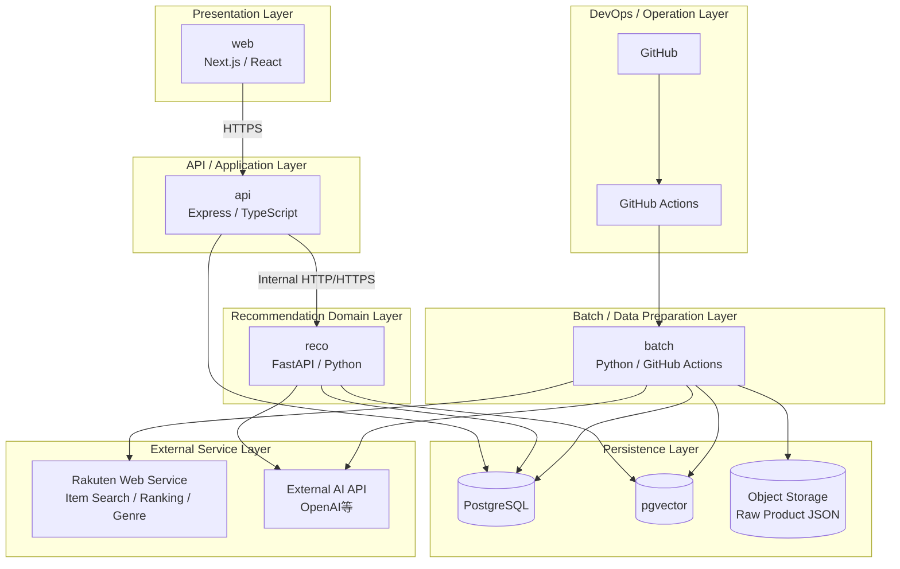
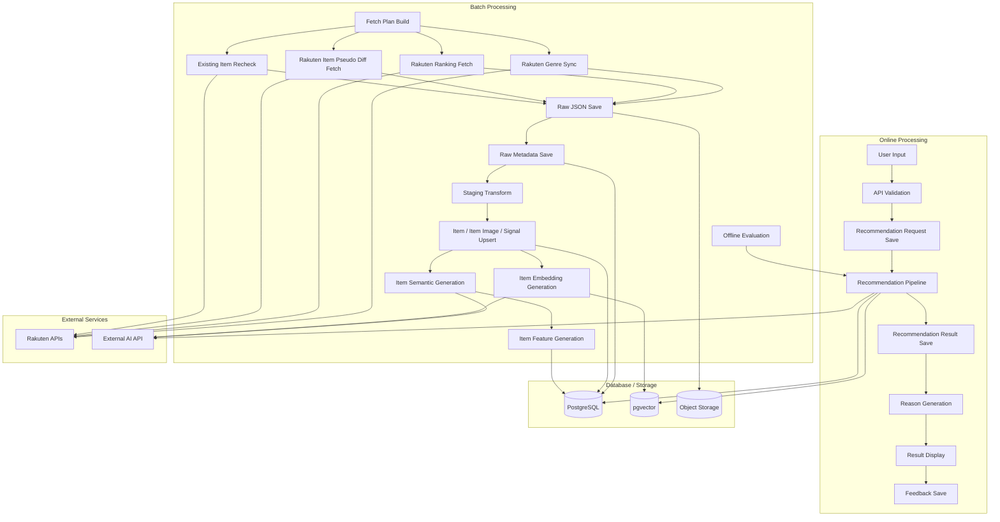
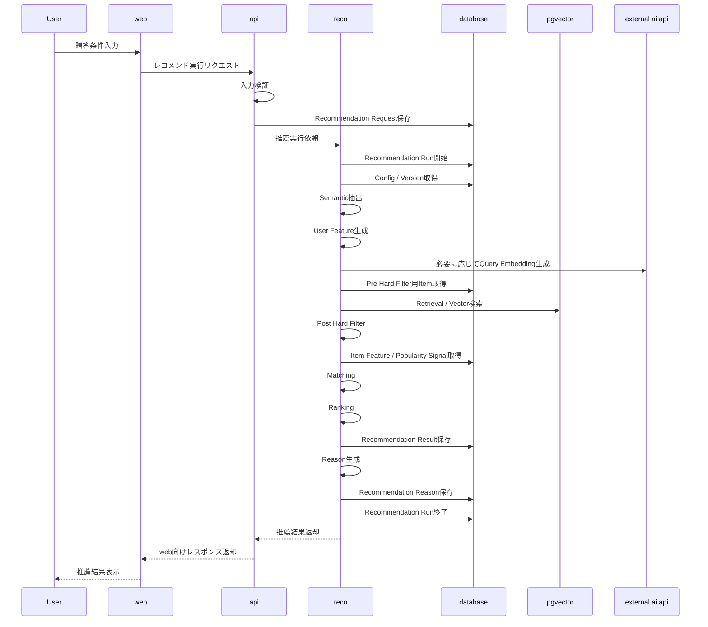
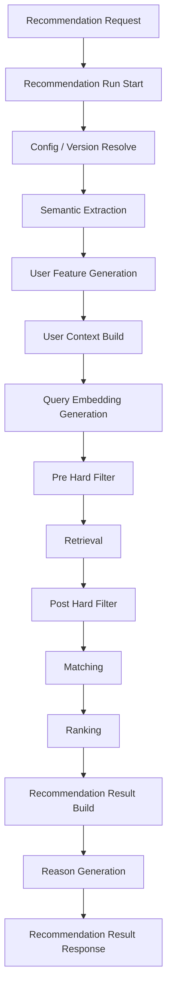
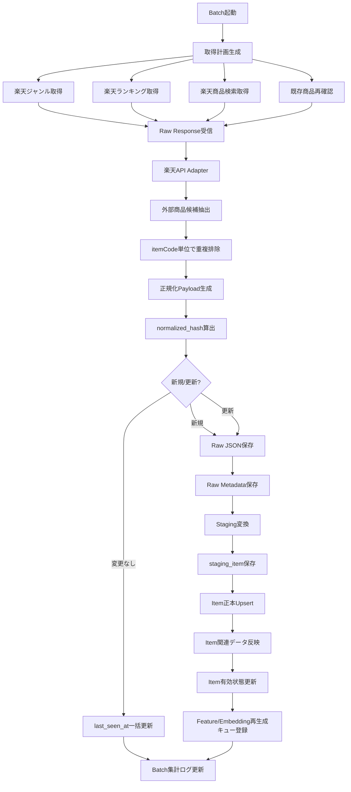
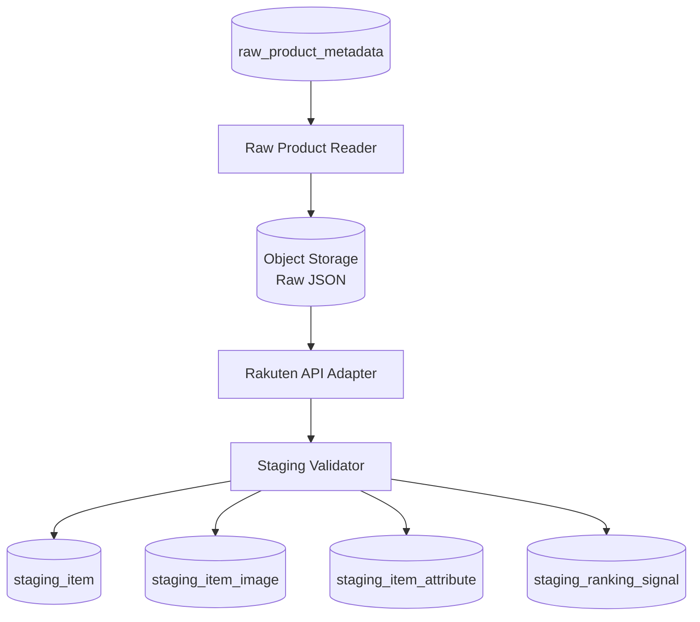
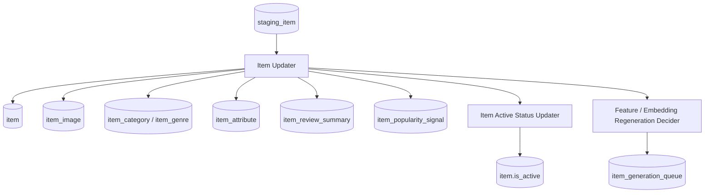
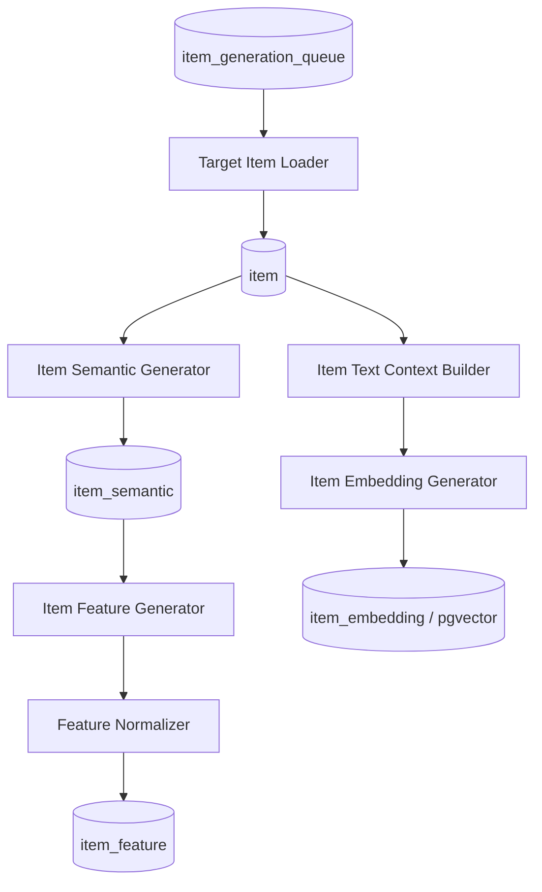
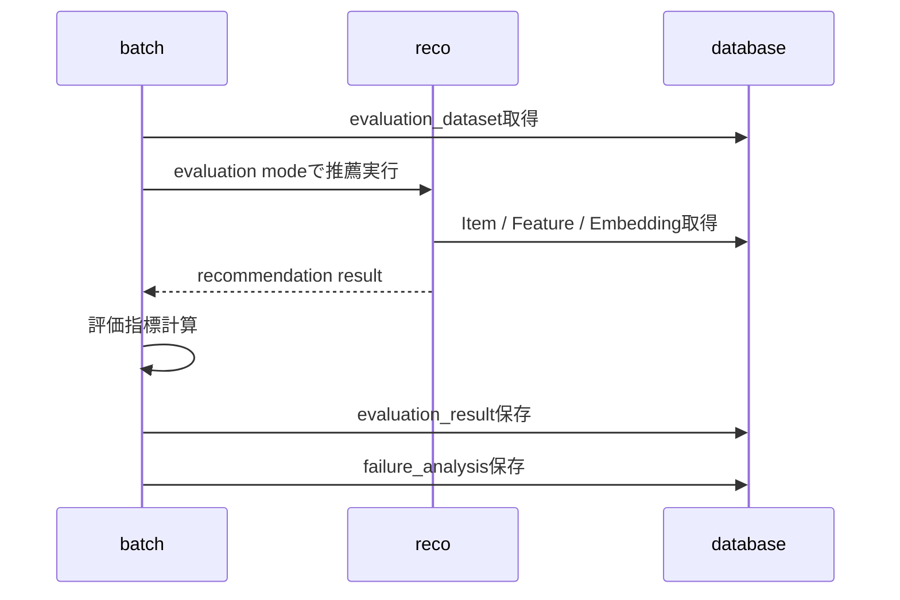
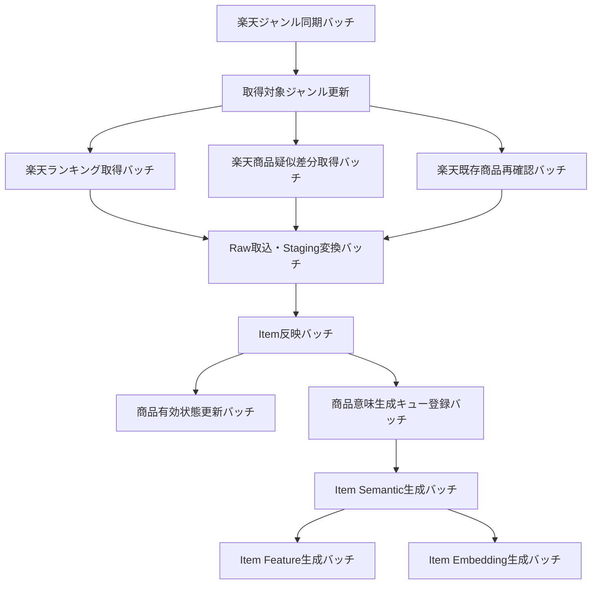

# 処理構成定義書

## 1. 概要

### 1.1 目的

本ドキュメントは、Gift Recommendation Service MVP におけるシステム処理構成を定義する。

`処理フロー概要図` では全体の処理の流れを整理し、`機能一覧` では必要な機能を一覧化し、`モジュール一覧` では実装責務単位へ分解した。

本ドキュメントでは、その中間に位置する成果物として、以下を整理する。

```text
- どの処理系統が存在するか
- どの順序で処理されるか
- どの処理が同期処理 / Batch処理 / 運用処理か
- どのタイミングでデータを保存するか
- どこで外部サービスと連携するか
- どこでログ・エラーを記録するか
- 商品データ取得・取込・意味生成をどのように分離するか
- 後続の機能一覧・モジュール一覧・API一覧・バッチ一覧へどう接続するか
```

---

### 1.2 本ドキュメントの位置づけ

| 成果物                   | 本ドキュメントとの関係                                          |
| ------------------------ | --------------------------------------------------------------- |
| 処理フロー概要図         | 全体処理の流れの前提                                            |
| システム論理構成図       | web / api / reco / batch / DB / Object Storage の責務境界の前提 |
| システム物理構成図       | 各処理の実行環境・通信経路の前提                                |
| 利用技術スタック整理表   | 各処理で利用する技術要素の前提                                  |
| リソース一覧             | 処理で扱う主要リソースの前提                                    |
| リソース責務定義表       | 各リソースの管理責務・参照責務の前提                            |
| 正本定義表               | 各データの正本・派生・スナップショットの前提                    |
| 外部商品データ連携設計書 | 商品データ取得・Raw保存・疑似差分取得・Item反映の詳細前提       |
| 状態遷移設計書           | Recommendation Run / 外部商品取込 / Item有効状態の状態管理前提  |
| 機能一覧                 | 本ドキュメントで定義した処理構成を機能単位へ展開する            |
| モジュール一覧           | 本ドキュメントで定義した処理構成を実装責務単位へ展開する        |
| Recoモジュール一覧       | 推薦パイプライン内部の詳細モジュールへ展開する                  |
| API一覧                  | Online処理・内部API処理をAPI単位へ展開する                      |
| バッチ一覧               | Batch処理をJob単位へ展開する                                    |
| インターフェース一覧     | 処理間・外部サービス間の接続を整理する                          |
| テーブル定義書           | 処理で保存・更新されるデータを物理テーブルへ展開する            |

---

## 2. 利用したインプット成果物

利用したインプット成果物は以下です。

- 処理構成定義書.md
- 外部商品データ連携設計書.md
- ドメインモデル.md
- RecommendationRequest定義書.md
- RecommendationResult定義書.md
- RecommendationFeedback定義書.md
- リソース一覧.md
- リソース責務定義表.md
- 正本定義表.md
- 状態遷移設計書.md

---

## 3. 基本方針

### 3.1 処理構成方針

| 方針                                               | 内容                                                                                                    |
| -------------------------------------------------- | ------------------------------------------------------------------------------------------------------- |
| Online処理とBatch処理を分離する                    | ユーザー操作に同期する処理と、事前準備・評価処理を分ける                                                |
| 推薦処理はrecoに集約する                           | Semantic / Feature / Retrieval / Matching / Ranking / Reason は reco で実行する                         |
| 商品データ取得はbatchに集約する                    | 外部商品API取得、Raw保存、Staging変換、Item反映は batch で実行する                                      |
| 外部商品APIはOnline処理中に呼ばない                | Online推薦は事前に整備された Item / Feature / Embedding を参照する                                      |
| 商品データ取得は全件取得しない                     | MVPでは楽天市場全体を毎回取得せず、疑似差分取得を行う                                                   |
| 疑似差分取得を採用する                             | 更新順、ランキング、ジャンル別、既存商品再確認、棚卸しを組み合わせる                                    |
| 商品正本はItemに集約する                           | 楽天API Raw JSONではなく、正規化済みの `item` / 関連テーブルをOnline推薦の参照元とする                  |
| Raw JSON本体はObject Storageに保存する             | DB容量を抑え、再処理可能性を確保する                                                                    |
| DBは構造化データの正本を保持する                   | Request / Result / Item / Feature / Embedding / Feedback / Log を管理する                               |
| 商品画像はURL参照として保持する                    | MVPでは画像バイナリを保存せず、`smallImageUrls` / `mediumImageUrls` を `item_image` に保持する          |
| ランキングはItem正本ではなく補助シグナルとして扱う | 楽天ランキングAPI由来の `rank` は `item_popularity_signal` として保持する                               |
| Retrieval前にPre Hard Filterを行う                 | 商品数が増えた場合の検索性能と候補品質を確保する                                                        |
| Retrieval後にPost Hard Filterを行う                | Semantic NG、重複、不整合などの最終確認を行う                                                           |
| Feedbackは即時反映しない                           | 初期MVPではFeedbackを蓄積し、Evaluation / 改善分析へ接続する                                            |
| 設定・Versionを処理開始時に解決する                | 推薦結果・評価結果・意味生成結果の再現性を確保する                                                      |
| 状態のDB保存は必要最小限にする                     | 商品単位の中間状態を逐次DB更新せず、Batch単位・API単位・Raw単位・チャンク単位・終端状態を中心に保存する |
| ログは監査・再実行・障害調査に必要な粒度で記録する | すべての中間状態を永続化せず、必要なログと集計を残す                                                    |

---

### 3.2 処理種別

| 処理種別 | 内容                                       | 代表例                                               |
| -------- | ------------------------------------------ | ---------------------------------------------------- |
| OL       | ユーザー操作に同期して実行されるOnline処理 | レコメンド実行、Feedback登録                         |
| BT       | 定期実行・手動実行されるBatch処理          | 商品データ取得、Item Feature生成、Offline Evaluation |
| 共通     | OL / BT双方から参照または利用される処理    | Config / Version解決、Repository、ログ記録           |
| 運用     | 開発・保守・改善のための処理               | CI、Batch実行、Issue化、改善Backlog化                |

---

### 3.3 処理責務の基本分担

| コンポーネント    | 主な処理責務                                                                          |
| ----------------- | ------------------------------------------------------------------------------------- |
| web               | 入力、表示、Feedback入力、API呼び出し                                                 |
| api               | HTTP受付、Validation、Request保存、reco呼び出し、レスポンス整形、Feedback保存         |
| reco              | 推薦パイプライン実行、Reason生成、Result生成                                          |
| batch             | 商品データ取得、Raw保存、Staging変換、Item反映、商品意味推定、Embedding生成、評価実行 |
| database          | 構造化データ、Feature、Embedding、Result、Feedback、Log、Item正本の保存               |
| object storage    | 外部商品APIレスポンスRaw JSON本体の保存                                               |
| external services | 楽天市場API、外部AI API                                                               |
| devops            | CI、Batch実行、GitHub運用、自動化                                                     |

---

## 4. 全体処理構成

### 4.1 システムアーキテクチャ図

本サービスは、`Online / Batch分離型の拡張レイヤードアーキテクチャ` として整理する。



---

### 4.2 処理系統一覧

| 処理系統ID | 処理系統                      | 処理種別 | 主担当                        | 概要                                                                 |
| ---------- | ----------------------------- | -------- | ----------------------------- | -------------------------------------------------------------------- |
| OL-01      | Online推薦処理                | OL       | web / api / reco              | ユーザー入力から推薦結果生成・表示まで                               |
| OL-02      | Feedback登録処理              | OL       | web / api                     | ユーザーFeedbackを保存する                                           |
| BT-01      | 外部商品取得計画生成処理      | BT       | batch                         | 取得対象API、ジャンル、ページ、優先度、再確認対象を決定する          |
| BT-02      | 楽天ジャンル同期処理          | BT       | batch                         | 楽天ジャンル階層・属性情報を取得し、外部ジャンル参照データを更新する |
| BT-03      | 楽天ランキング取得処理        | BT       | batch                         | ランキング商品候補と人気シグナルを取得する                           |
| BT-04      | 楽天商品疑似差分取得処理      | BT       | batch                         | 更新順・ジャンル別・キーワード等で新規/更新候補を取得する            |
| BT-05      | 既存商品再確認・棚卸し処理    | BT       | batch                         | 登録済みItemの価格、販売状態、画像URL、取得不可状態を確認する        |
| BT-06      | Raw保存・Raw Metadata記録処理 | BT       | batch                         | 必要なRaw JSONをObject Storageへ保存し、Raw MetadataをDBへ保存する   |
| BT-07      | Raw取込・Staging変換処理      | BT       | batch                         | Raw JSONを内部取込形式へ変換し、Stagingへ保存する                    |
| BT-08      | Item正本反映処理              | BT       | batch                         | StagingからItem、Item Image、Review、Ranking Signal等へ反映する      |
| BT-09      | 商品意味推定処理              | BT       | batch / reco                  | Item Semantic / Feature / Embeddingを生成する                        |
| BT-10      | Offline Evaluation処理        | BT       | batch / reco                  | 評価データセットに対して推薦処理を実行する                           |
| CM-01      | Config / Version解決処理      | 共通     | reco / batch / database       | 使用する設定・モデルバージョンを解決する                             |
| LOG-01     | ログ・監査処理                | 共通     | api / reco / batch / database | Phase Log / Error Log / Raw Metadata等を記録する                     |
| OPS-01     | CI / Batch運用処理            | 運用     | devops                        | GitHub ActionsでCI・Batch・自動化を実行する                          |

---

### 4.3 全体処理構成図



---

## 5. Online推薦処理構成

### 5.1 目的

Online推薦処理は、ユーザーが入力した贈答条件をもとに、推薦結果と推薦理由を生成し、画面表示できる形で返却する処理である。

Online推薦処理では外部商品APIを呼び出さない。

商品データは、Batch処理で事前に整備された `item`、`item_image`、`item_feature`、`item_embedding`、`item_popularity_signal` 等を参照する。

---

### 5.2 処理構成

```
レコメンド条件入力
↓
API受付
↓
入力検証
↓
Recommendation Request保存
↓
Recommendation Run開始
↓
Config / Version解決
↓
Semantic抽出
↓
外部条件特徴量推定
↓
内部条件特徴量推定
↓
User Feature生成
↓
User Meaning射影
↓
User Context生成
↓
Query Embedding生成
↓
Pre Hard Filter
↓
候補商品抽出 / Retrieval
↓
Post Hard Filter
↓
Feature一致度計算
↓
意味マッチ集約
↓
文脈スコア算出
↓
人気補正算出
↓
リスク補正算出
↓
最終スコア算出
↓
最終順位生成
↓
Recommendation Result生成
↓
Reason生成
↓
APIレスポンス返却
↓
レコメンド結果表示
```

---

### 5.3 Online推薦処理フロー



---

### 5.4 処理ステップ詳細

| 順序 | 処理                       | 主担当 | 入力                                                      | 出力                                    | 保存先                 |
| ---- | -------------------------- | ------ | --------------------------------------------------------- | --------------------------------------- | ---------------------- |
| 1    | レコメンド条件入力         | web    | ユーザー入力                                              | request payload                         | なし                   |
| 2    | API受付                    | api    | HTTP request                                              | application command                     | なし                   |
| 3    | 入力検証                   | api    | request body                                              | validated request                       | なし                   |
| 4    | Recommendation Request保存 | api    | validated request                                         | recommendation_request                  | database               |
| 5    | Recommendation Run開始     | reco   | recommendation_request_id                                 | recommendation_run                      | database               |
| 6    | Config / Version解決       | reco   | mode / current config                                     | semantic_config_version / model_version | run / resultに紐づけ   |
| 7    | Semantic抽出               | reco   | preferred / non_preferred / relationship / occasion       | semantic_extraction_result              | 必要に応じてDB         |
| 8    | User Feature生成           | reco   | semantic_extraction_result / relationship / occasion      | user_feature                            | 必要に応じてDB         |
| 9    | Query Embedding生成        | reco   | request text / semantic context                           | query_embedding                         | 必要に応じてDB         |
| 10   | Pre Hard Filter            | reco   | request / budget / ng / item metadata                     | pre_filtered_item_pool                  | なし                   |
| 11   | Retrieval                  | reco   | pre_filtered_item_pool / query_embedding / item_embedding | retrieval_candidate                     | 必要に応じてlog        |
| 12   | Post Hard Filter           | reco   | retrieval_candidate / semantic result / item_semantic     | validated_retrieval_candidate           | excluded_candidate_log |
| 13   | Matching                   | reco   | user_feature / item_feature                               | matching_result / context_score         | result関連             |
| 14   | Ranking                    | reco   | matching_result / popularity / risk / diversity           | ranking_result / final_score / rank     | result関連             |
| 15   | Recommendation Result生成  | reco   | ranking_result / item snapshot                            | recommendation_result / result_item     | database               |
| 16   | Reason生成                 | reco   | result_item / score_breakdown / context                   | recommendation_reason                   | database               |
| 17   | レスポンス返却             | api    | recommendation_result                                     | web response                            | なし                   |
| 18   | 結果表示                   | web    | API response                                              | UI表示                                  | なし                   |

---

### 5.5 Online推薦処理の重要方針

| 論点                  | 方針                                                                                       |
| --------------------- | ------------------------------------------------------------------------------------------ |
| Request保存タイミング | 入力検証後、reco呼び出し前に保存する                                                       |
| Run保存タイミング     | reco推薦処理開始時に保存する                                                               |
| Result保存タイミング  | Ranking後、Reason生成前後に保存する                                                        |
| 外部商品API依存       | Online処理中には楽天API等の外部商品APIを呼ばない                                           |
| 商品データ利用        | Batchで事前生成されたItem / Item Image / Feature / Embedding / Popularity Signalを利用する |
| 商品画像利用          | `item_image.is_primary=true` の画像URLをResult Snapshotへ反映する                          |
| Reason生成            | MVPではreco側で生成し、表示対象と内部管理対象を分ける                                      |
| 0件時                 | エラーではなく空結果として扱い、条件見直しを促す                                           |
| エラー時              | Error Logを記録し、webには統一エラーレスポンスを返す                                       |

---

## 6. 推薦パイプライン処理構成

### 6.1 推薦パイプライン全体



---

### 6.2 Pre Hard Filter

| 項目         | 内容                                                                                                          |
| ------------ | ------------------------------------------------------------------------------------------------------------- |
| 目的         | Retrieval対象の商品集合を事前に減らす                                                                         |
| 主担当       | reco                                                                                                          |
| 処理種別     | OL                                                                                                            |
| 主な入力     | Recommendation Request / budget条件 / ng条件 / item / item metadata                                           |
| 主な出力     | pre_filtered_item_pool                                                                                        |
| 主な除外条件 | 予算外、無効商品、販売停止、明確なNGカテゴリ、明確なNGキーワード、最低品質条件違反、画像なし商品、URLなし商品 |

Pre Hard Filterは、性能上重要な処理である。

商品数が増える前提では、全商品に対してEmbedding検索や類似度計算を行うのではなく、構造化条件で事前に検索対象を絞る。

---

### 6.3 Retrieval

| 項目     | 内容                                                                                              |
| -------- | ------------------------------------------------------------------------------------------------- |
| 目的     | Pre Hard Filter後の商品集合から、ユーザー意図に近い候補商品を抽出する                             |
| 主担当   | reco                                                                                              |
| 処理種別 | OL                                                                                                |
| 主な入力 | pre_filtered_item_pool / Recommendation Request / user_feature / query_embedding / item_embedding |
| 主な出力 | retrieval_candidate                                                                               |
| 主な方式 | Embedding検索、キーワード検索、Hybrid検索                                                         |

Retrievalは、全商品検索ではなく、Pre Hard Filter通過済みの商品集合に対して実行する。

---

### 6.4 Post Hard Filter

| 項目         | 内容                                                                                      |
| ------------ | ----------------------------------------------------------------------------------------- |
| 目的         | Retrieval後の候補商品に対して、最終除外条件・安全確認を行う                               |
| 主担当       | reco                                                                                      |
| 処理種別     | OL                                                                                        |
| 主な入力     | retrieval_candidate / Recommendation Request / semantic_extraction_result / item_semantic |
| 主な出力     | validated_retrieval_candidate / excluded_candidate_log                                    |
| 主な確認項目 | Semantic NG、avoid類似、重複、不整合、表示前Validation、商品有効状態                      |

Post Hard Filterは、Pre Hard Filterでは判定しきれない意味的な除外条件や、候補集合が確定した後に確認すべき重複・不整合を扱う。

---

### 6.5 Matching

| 項目     | 内容                                                            |
| -------- | --------------------------------------------------------------- |
| 目的     | User FeatureとItem Featureの一致度を計算する                    |
| 主担当   | reco                                                            |
| 処理種別 | OL                                                              |
| 主な入力 | user_feature / item_feature / validated_retrieval_candidate     |
| 主な出力 | matching_result / social_match / symbolic_match / context_score |

Matchingは、商品がユーザーの贈答意図にどの程度合っているかを計算する処理である。

---

### 6.6 Ranking

| 項目     | 内容                                                            |
| -------- | --------------------------------------------------------------- |
| 目的     | 最終表示順位を決定する                                          |
| 主担当   | reco                                                            |
| 処理種別 | OL                                                              |
| 主な入力 | context_score / popularity_score / risk_penalty / diversity情報 |
| 主な出力 | final_score / rank / ranking_result                             |

Rankingは、意味一致度だけでなく、人気・リスク・多様性を加味して、最終順位を決定する。

---

### 6.7 Reason生成

| 項目     | 内容                                                                |
| -------- | ------------------------------------------------------------------- |
| 目的     | 推薦結果に対して、ユーザーが理解できる理由を付与する                |
| 主担当   | reco                                                                |
| 処理種別 | OL                                                                  |
| 主な入力 | result_item / score_breakdown / relationship / occasion / item data |
| 主な出力 | recommendation_reason                                               |

Reasonのうち、通常UIに表示する対象は以下とする。

| 表示対象       | 内容                       |
| -------------- | -------------------------- |
| reason_badges  | 表示ラベル                 |
| reason_summary | 商品カード上の短い推薦理由 |
| reason_detail  | 詳細表示用の推薦理由       |
| reason_points  | 箇条書き理由               |
| caution_note   | 必要に応じた注意文         |

以下は内部管理・評価・デバッグ用であり、通常UIには表示しない。

| 内部項目          | 用途                                     |
| ----------------- | ---------------------------------------- |
| reason_basis      | 生成根拠                                 |
| generation_method | 生成方式管理                             |
| model_version_id  | バージョン管理                           |
| score_breakdown   | 評価・デバッグ                           |
| final_score       | 順位算出用。通常UIでは順位として表示する |

---

## 7. Feedback登録処理構成

### 7.1 目的

Feedback登録処理は、ユーザーが推薦結果や推薦理由に対して行った評価を保存し、後続の評価・改善処理へ接続する処理である。

---

### 7.2 処理構成

```
ユーザーがFeedback入力
↓
Feedback登録API受付
↓
Feedback入力検証
↓
Recommendation Result / Result Item存在確認
↓
Recommendation Feedback保存
↓
登録結果返却
↓
後続のFeedback分析 / Evaluationへ接続
```

---

### 7.3 処理ステップ詳細

| 順序 | 処理             | 主担当    | 入力                       | 出力                     | 保存先               |
| ---- | ---------------- | --------- | -------------------------- | ------------------------ | -------------------- |
| 1    | Feedback入力     | web       | user feedback              | feedback payload         | なし                 |
| 2    | Feedback API受付 | api       | HTTP request               | application command      | なし                 |
| 3    | Feedback検証     | api       | feedback payload           | validated feedback       | なし                 |
| 4    | 対象存在確認     | api       | result_id / result_item_id | target validation result | なし                 |
| 5    | Feedback保存     | api       | validated feedback         | recommendation_feedback  | database             |
| 6    | 登録結果返却     | api / web | saved feedback             | success response         | なし                 |
| 7    | Feedback分析     | batch     | recommendation_feedback    | feedback summary         | database / 改善Issue |

---

### 7.4 Feedback処理方針

| 論点                | 方針                                                      |
| ------------------- | --------------------------------------------------------- |
| Rankingへの即時反映 | MVPでは行わない                                           |
| Feedbackの用途      | Evaluation、失敗分析、改善Backlog化に利用する             |
| 保存粒度            | result単位、result_item単位、reason単位で扱えるようにする |
| 自由記述            | MVPでは任意。分析用に保持できるようにする                 |
| 不正値              | API側でValidationする                                     |

---

## 8. 外部商品データ取得処理構成

### 8.1 目的

外部商品データ取得処理は、楽天市場APIから商品候補、ランキング、ジャンル、属性、既存商品の再確認情報を取得し、本サービスで利用する商品正本・特徴量・検索インデックスの前段データを整備する処理である。

MVPでは、外部商品データソースは楽天市場商品データのみとする。

---

### 8.2 処理構成

```
Batch起動
↓
取得計画生成
↓
楽天ジャンル同期
↓
楽天ランキング取得
↓
楽天商品疑似差分取得
↓
既存商品再確認
↓
外部商品候補抽出
↓
itemCode単位で重複排除
↓
正規化Payload生成
↓
normalized_hash算出
↓
新規 / 更新 / 変更なし判定
↓
Raw JSON保存判断
↓
Raw JSON保存
↓
Raw Metadata保存
↓
後続のStaging変換へ接続
```

---

### 8.3 疑似差分取得方針

楽天APIから完全な差分データが取得できない前提で、以下を組み合わせて新規・更新候補を発見する。

| 取得ルート     | 目的                                 | 頻度 | 対象                       |
| -------------- | ------------------------------------ | ---- | -------------------------- |
| 更新日時順取得 | 直近更新商品の捕捉                   | 高   | 主要ジャンル               |
| ジャンル別取得 | 新規商品・通常商品候補の捕捉         | 中   | MVP対象ジャンル            |
| ランキング取得 | 人気商品・売れ筋商品の捕捉           | 高   | MVP対象ジャンル            |
| 既存商品再確認 | 価格・販売状態・画像URL等の更新確認  | 中   | 登録済みItem               |
| 棚卸し取得     | 取り漏れ・販売終了・非アクティブ確認 | 低   | 重要ジャンル・登録済みItem |

---

### 8.4 外部商品データ連携フロー



---

### 8.5 取得計画生成

取得計画生成では、バッチ実行ごとに、どのAPIをどの条件で呼び出すかを決定する。

| 入力             | 内容                                 |
| ---------------- | ------------------------------------ |
| 対象ジャンル一覧 | MVPで扱う楽天ジャンルID              |
| 前回取得カーソル | 前回取得したページ・日時・条件       |
| API利用上限      | 1回のバッチで呼び出せるAPI回数上限   |
| 取得優先度       | ランキング、更新順、主要ジャンルなど |
| 既存商品リスト   | 再確認対象の `itemCode`              |
| 失敗リトライ対象 | 前回失敗したAPIリクエスト            |

| 出力                | 内容                                                          |
| ------------------- | ------------------------------------------------------------- |
| API種別             | item_search / item_ranking / genre_search / attribute_search  |
| request params      | API呼び出し条件                                               |
| priority            | 実行優先度                                                    |
| max_pages           | 最大取得ページ数                                              |
| expected_purpose    | new_discovery / update_check / popularity_signal / genre_sync |
| request_params_hash | 同一リクエスト識別子                                          |

---

### 8.6 楽天API別の処理責務

| API                   | 主用途                                                               | 本サービスでの処理責務                                                     |
| --------------------- | -------------------------------------------------------------------- | -------------------------------------------------------------------------- |
| 楽天商品検索API       | 商品マスタ候補取得、商品詳細取得、更新日時順取得、ジャンル別商品取得 | Item正本・Item Image・Review・Genre等の主要取得元                          |
| 楽天商品ランキングAPI | 人気商品候補取得、人気補正シグナル取得、候補商品の拡張               | `itemCode` / `rank` / `lastBuildDate` を利用し、Item正本には直接反映しない |
| 楽天ジャンル検索API   | ジャンル階層取得、対象ジャンル管理、ジャンル名解決                   | external_genre、取得対象ジャンル管理に利用                                 |
| 楽天属性検索API       | ジャンルに紐づく属性情報取得                                         | MVPでは任意。後続の属性辞書・Feature推定補助に利用                         |

---

### 8.7 ランキングAPIの扱い

楽天ランキングAPIは、Item正本の取得元ではなく、人気・信頼性シグナルの取得元として扱う。

ランキングAPIから利用する主な項目は以下に限定する。

| 出力項目        | 内容               | 本サービスでの扱い                                          |
| --------------- | ------------------ | ----------------------------------------------------------- |
| `rank`          | ランキング順位     | popularity_score補助シグナルとして利用                      |
| `lastBuildDate` | ランキング更新日時 | ランキングデータ鮮度として利用                              |
| `itemCode`      | 商品コード         | Item紐づけ、および商品検索APIでの商品正本取得キーとして利用 |

ランキングAPIで返却される以下の項目は、Item正本には反映しない。

| 出力項目          | 方針                                                                   |
| ----------------- | ---------------------------------------------------------------------- |
| `itemName`        | Item正本には反映しない。商品検索API由来を正とする                      |
| `catchcopy`       | Item正本には反映しない。商品検索API由来を正とする                      |
| `itemCaption`     | Item正本には反映しない。商品検索API由来を正とする                      |
| `itemPrice`       | Item正本には反映しない。商品検索API由来を正とする                      |
| `itemUrl`         | Item正本には反映しない。商品検索API由来を正とする                      |
| `smallImageUrls`  | Item Image正本には反映しない。商品検索API由来を正とする                |
| `mediumImageUrls` | Item Image正本には反映しない。商品検索API由来を正とする                |
| `availability`    | Item有効状態には反映しない。商品検索API由来を正とする                  |
| `reviewAverage`   | Review/Popularity補助情報には直接反映しない。商品検索API由来を正とする |
| `reviewCount`     | Review/Popularity補助情報には直接反映しない。商品検索API由来を正とする |

ランキングAPIで未登録の `itemCode` を見つけた場合は、ランキングAPIのレスポンスだけでItemを作成しない。

以下の流れで、商品検索APIから商品正本を取得する。

```
楽天ランキングAPI
↓
itemCode を取得
↓
未登録itemCodeをFetch Candidate化
↓
楽天商品検索APIを itemCode 指定で呼び出す
↓
商品検索APIレスポンスをもとに Item / Item Image をUpsert
↓
ランキングAPIの rank は item_popularity_signal として保存
```

---

## 9. Raw保存・Raw Metadata記録処理構成

### 9.1 目的

Raw保存・Raw Metadata記録処理は、楽天APIから取得したレスポンス原本をObject Storageに保存し、再処理・監査・障害調査に必要な参照情報をDBへ保存する処理である。

---

### 9.2 処理構成

```
Raw Response受信
↓
新規 / 更新 / 変更なし判定
↓
Raw JSON保存要否判定
↓
Raw JSON本体をObject Storageへ保存
↓
Raw MetadataをDBへ保存
↓
Batch集計ログ更新
↓
後続のStaging変換へ接続
```

---

### 9.3 Raw JSON保存対象

コストと再処理性のバランスを取るため、Raw JSON保存は以下の方針とする。

| ケース                          | Raw JSON保存     | 理由                       |
| ------------------------------- | ---------------- | -------------------------- |
| 新規商品を含むレスポンス        | 保存する         | Item追加・再処理に必要     |
| 更新商品を含むレスポンス        | 保存する         | Item更新・再処理に必要     |
| 変更なし商品のみのレスポンス    | 原則保存しない   | コスト削減                 |
| エラーレスポンス                | 必要に応じて保存 | 障害調査用                 |
| Genre / Attribute定義レスポンス | 保存する         | 外部参照定義の再処理に必要 |
| Rankingレスポンス               | 保存する         | 人気シグナル再計算に必要   |
| 手動検証・監査モード            | 保存する         | 調査・検証用途             |

---

### 9.4 保存データ

| データ                | 保存先         | 内容                                                         |
| --------------------- | -------------- | ------------------------------------------------------------ |
| Raw JSON本体          | Object Storage | 外部商品APIレスポンス原本                                    |
| object key            | database       | Raw JSONの参照先                                             |
| response content hash | database       | レスポンス差分検知・重複排除                                 |
| request params hash   | database       | 取得条件識別                                                 |
| fetched_at            | database       | 取得日時                                                     |
| source_system         | database       | `rakuten`                                                    |
| source_api            | database       | item_search / item_ranking / genre_search / attribute_search |
| import_status         | database       | 取込状態                                                     |
| item_count            | database       | レスポンス内の商品数                                         |
| new_item_count        | database       | 新規商品数                                                   |
| changed_item_count    | database       | 更新商品数                                                   |
| unchanged_item_count  | database       | 変更なし商品数                                               |
| error_message         | database       | 失敗理由                                                     |

---

### 9.5 Object Storage Key設計

```
raw/rakuten/{api_name}/dt={yyyy-mm-dd}/batch_run_id={batch_run_id}/{request_hash}.json
```

例：

```
raw/rakuten/item_search/dt=2026-05-10/batch_run_id=br_20260510_001/9f2a3c.json
raw/rakuten/item_ranking/dt=2026-05-10/batch_run_id=br_20260510_001/7a1b8d.json
raw/rakuten/genre_search/dt=2026-05-10/batch_run_id=br_20260510_001/5c0e2a.json
```

---

### 9.6 処理方針

| 論点           | 方針                                                                |
| -------------- | ------------------------------------------------------------------- |
| Raw本体保存先  | DBではなくObject Storage                                            |
| DB保存対象     | Raw Metadataのみ                                                    |
| 再処理性       | Raw MetadataからObject StorageのRaw JSONを参照できるようにする      |
| 冪等性         | response content hash / request params hashを利用して重複取込を防ぐ |
| 変更なしデータ | 原則Raw本体を保存せず、last_seen_at等の更新に留める                 |
| 失敗時         | Error LogとRaw Metadataのimport_statusで管理する                    |

---

## 10. Raw取込・Staging変換処理構成

### 10.1 目的

Raw取込・Staging変換処理は、Object Storageに保存されたRaw JSONを内部取込形式へ変換し、Item正本へ反映する前段のStagingデータを作成する処理である。

外部APIのレスポンス構造をそのままItem正本に反映しない。

楽天APIのバージョン差異、レスポンス差異、画像URL配列、属性、ジャンル等のネスト構造は、Staging変換で吸収する。

---

### 10.2 処理構成

```
Raw Metadataから対象Rawを取得
↓
Object StorageからRaw JSON読取
↓
楽天API Adapterで内部形式へ変換
↓
Validation
↓
normalized_hash確認
↓
staging_item保存
↓
staging_item_image保存
↓
staging_item_attribute保存
↓
staging_ranking_signal保存
↓
後続のItem反映へ接続
```

---

### 10.3 処理フロー



---

### 10.4 処理ステップ詳細

| 順序 | 処理         | 主担当 | 入力                      | 出力                       | 保存先   |
| ---- | ------------ | ------ | ------------------------- | -------------------------- | -------- |
| 1    | 対象Raw取得  | batch  | raw_product_metadata      | target raw list            | なし     |
| 2    | Raw JSON読取 | batch  | object key                | raw JSON                   | なし     |
| 3    | Adapter変換  | batch  | raw JSON                  | internal staging payload   | なし     |
| 4    | Validation   | batch  | staging payload           | validation result          | log      |
| 5    | Staging保存  | batch  | validated staging payload | staging_item / 関連staging | database |
| 6    | 変換結果記録 | batch  | transform result          | batch log / error log      | database |

---

### 10.5 処理方針

| 論点         | 方針                                                                  |
| ------------ | --------------------------------------------------------------------- |
| 外部形式依存 | Staging変換で吸収する                                                 |
| API差異      | item_search / item_ranking / genre_search 等の差異をAdapterで吸収する |
| Item正本反映 | Stagingを経由し、直接RawからItem更新しない                            |
| Validation   | 必須項目不足、URL不足、画像不足等を検査する                           |
| エラー時     | 対象Raw単位または対象レコード単位で失敗状態を管理する                 |

---

## 11. Item正本反映処理構成

### 11.1 目的

Item正本反映処理は、Stagingデータをもとに、Online推薦で利用可能なItem正本および関連リソースへ反映する処理である。

本サービスにおけるOnline推薦の参照元は、楽天APIのRaw JSONではなく、DB上の `item` および関連テーブルである。

```
楽天API Raw JSON
↓
Staging
↓
Item正本
↓
Item Feature / Item Embedding
↓
Online Recommendation
```

---

### 11.2 処理構成

```
Stagingデータ取得
↓
itemCode単位で新規 / 更新 / 変更なし判定
↓
Item Upsert
↓
Item Image反映
↓
Item Category / Genre反映
↓
Item Attribute反映
↓
Item Review Summary反映
↓
Item Popularity Signal反映
↓
Item有効状態更新
↓
Feature / Embedding再生成対象判定
↓
再生成キュー登録
```

---

### 11.3 処理フロー



---

### 11.4 Item Upsert方針

| ケース                   | 処理                                       |
| ------------------------ | ------------------------------------------ |
| 新規商品                 | `item` を新規作成                          |
| 既存商品かつhash変更あり | `item` を更新                              |
| 既存商品かつhash変更なし | `item` は更新せず、`last_seen_at` のみ更新 |
| 販売不可                 | `is_active=false` 候補として更新           |
| 必須項目不足             | 取込失敗として記録                         |
| 画像なし                 | MVPでは原則推薦対象外または優先度低下      |
| URLなし                  | 外部EC遷移不可のため推薦対象外             |

---

### 11.5 Item関連データ反映

| 関連データ   | 反映先                                 | 内容                                  |
| ------------ | -------------------------------------- | ------------------------------------- |
| 商品価格     | `item.price` または `item_price`       | MVPでは現行価格を保持                 |
| 商品画像     | `item_image`                           | small / medium image URLを配列展開    |
| 商品ジャンル | `item_category` / `item_genre`         | 楽天ジャンルIDとの紐づけ              |
| 商品属性     | `item_attribute`                       | attributeIdsまたは属性情報            |
| レビュー     | `item_review_summary`                  | reviewAverage / reviewCount           |
| ランキング   | `item_popularity_signal`               | rank / genre / period / lastBuildDate |
| ショップ     | `item_shop_snapshot` または item内項目 | MVPでは内部分析用                     |

---

### 11.6 商品画像反映方針

商品画像は、楽天APIから取得できる画像URLを参照データとして保持する。

MVPでは画像ファイル本体は保存しない。

```
楽天商品検索API
↓
smallImageUrls / mediumImageUrls
↓
item_image
↓
推薦結果表示
↓
Recommendation Result Item Snapshot
```

| API項目           | 内容               | 用途                               |
| ----------------- | ------------------ | ---------------------------------- |
| `smallImageUrls`  | 64x64画像URL配列   | サムネイル候補                     |
| `mediumImageUrls` | 128x128画像URL配列 | 推薦結果一覧・商品詳細の主画像候補 |
| `imageFlag`       | 画像有無           | 画像表示可否判定                   |

推薦結果一覧画面では、原則として以下の優先順で画像を表示する。

```
1. mediumImageUrls[0]
2. smallImageUrls[0]
3. 画像なしプレースホルダー
```

---

### 11.7 Result Snapshotとの関係

Recommendation Result Itemでは、表示時点の商品情報をスナップショットとして保持する。

| Result Snapshot項目       | 元データ                               |
| ------------------------- | -------------------------------------- |
| `item_name_snapshot`      | `item.item_name`                       |
| `item_price_snapshot`     | `item.price`                           |
| `item_url_snapshot`       | `item.item_url`                        |
| `item_image_url_snapshot` | `item_image.is_primary=true` の画像URL |
| `review_average_snapshot` | `item_review_summary.review_average`   |
| `review_count_snapshot`   | `item_review_summary.review_count`     |
| `genre_name_snapshot`     | `item_category` / `external_genre`     |

これにより、後から推薦結果を確認した際に、当時どの商品情報・画像URLを表示したかを追跡できる。

---

## 12. 商品意味推定処理構成

### 12.1 目的

商品意味推定処理は、Item正本をもとに、推薦処理で利用するItem Semantic、Item Feature、Item Embeddingを生成する処理である。

---

### 12.2 処理構成

```
再生成対象Item取得
↓
Config / Version解決
↓
Item Semantic抽出
↓
Item Feature生成
↓
Feature正規化
↓
Item Feature保存
↓
Itemテキスト統合
↓
Item Embedding生成
↓
Item Embedding保存
↓
生成状態・ログ記録
```

---

### 12.3 処理フロー



---

### 12.4 処理ステップ詳細

| 順序 | 処理                 | 主担当       | 入力                                               | 出力                                    | 保存先              |
| ---- | -------------------- | ------------ | -------------------------------------------------- | --------------------------------------- | ------------------- |
| 1    | 対象Item取得         | batch        | item_generation_queue / item                       | target item list                        | なし                |
| 2    | Config / Version解決 | batch / reco | current config                                     | semantic_config_version / model_version | log / metadata      |
| 3    | Item Semantic抽出    | batch / reco | 商品名、キャッチコピー、説明、ジャンル、タグ、属性 | item_semantic                           | database            |
| 4    | Item Feature生成     | batch / reco | item_semantic / item metadata                      | item_feature_raw                        | database            |
| 5    | Feature正規化        | batch / reco | item_feature_raw / 統計量                          | item_feature_normalized                 | database            |
| 6    | Itemテキスト統合     | batch        | item data                                          | item_text_context                       | なし                |
| 7    | Item Embedding生成   | batch        | item_text_context                                  | item_embedding                          | database / pgvector |
| 8    | 処理ログ記録         | batch        | phase result                                       | phase_log / error_log                   | database            |

---

### 12.5 処理方針

| 論点           | 方針                                                                         |
| -------------- | ---------------------------------------------------------------------------- |
| 実行タイミング | Online推薦前にBatchで実行する                                                |
| 再生成対象     | 新規Item、更新Item、商品意味に影響する項目が変わったItem                     |
| Semantic抽出   | 商品名、キャッチコピー、商品説明、ジャンル、タグ、属性を利用する             |
| Feature        | 8次元Featureを生成する                                                       |
| 正規化         | 値を単純clipで潰さず、sigmoid系の正規化方針を採用する                        |
| Embedding      | Retrievalで利用できるようpgvectorへ保存する                                  |
| コスト制御     | 変更なしItemに対してFeature/Embeddingを毎回再生成しない                      |
| 再生成条件     | item更新、semantic_config_version変更、model_version変更時に再生成対象とする |

---

## 13. Offline Evaluation処理構成

### 13.1 目的

Offline Evaluation処理は、評価用データセットに対して推薦処理を実行し、推薦品質・失敗傾向・改善候補を確認する処理である。

---

### 13.2 処理構成

```
Evaluation Dataset取得
↓
Evaluation modeで推薦実行
↓
推薦結果取得
↓
評価指標計算
↓
Evaluation Result保存
↓
失敗分析
↓
改善Backlog化
```

---

### 13.3 処理フロー



---

### 13.4 評価対象

| 評価対象         | 内容                                       |
| ---------------- | ------------------------------------------ |
| Retrieval        | 候補抽出が妥当か                           |
| Pre Hard Filter  | 構造化条件で適切に候補を絞れているか       |
| Post Hard Filter | NG・不整合除外が適切か                     |
| Matching         | User FeatureとItem Featureの一致度が妥当か |
| Ranking          | final_score / rankが妥当か                 |
| Reason           | 推薦理由が納得感を持つか                   |
| Feedback         | ユーザー評価とスコアのズレがあるか         |

---

### 13.5 処理方針

| 論点     | 方針                                                           |
| -------- | -------------------------------------------------------------- |
| 実行環境 | GitHub Actions / batch                                         |
| 推薦実行 | recoをevaluation modeで呼び出す                                |
| 改善反映 | 自動反映せず、人間が確認して設計・ルール・パラメータへ反映する |
| 結果保存 | evaluation_resultとしてDBへ保存する                            |
| 失敗分析 | Retrieval / Matching / Ranking / Reasonなどの失敗分類を持つ    |

---

## 14. Config / Version解決処理構成

### 14.1 目的

Config / Version解決処理は、推薦処理・商品意味推定処理・評価処理で利用する設定やモデルバージョンを決定し、結果の再現性を確保する処理である。

---

### 14.2 解決対象

| 対象                          | 内容                                           |
| ----------------------------- | ---------------------------------------------- |
| semantic_config_version       | Semantic / Feature / Ruleの設定バージョン      |
| model_version                 | Embedding / LLM / Reason生成モデルのバージョン |
| ranking_config                | Ranking計算パラメータ                          |
| reason_template_version       | Reason生成テンプレート                         |
| feature_normalization_version | Feature正規化統計量・方式のバージョン          |

---

### 14.3 処理タイミング

| 処理               | 解決タイミング                    |
| ------------------ | --------------------------------- |
| Online推薦         | Recommendation Orchestrator開始時 |
| Item Semantic生成  | 商品意味推定Batch開始時           |
| Item Feature生成   | 商品意味推定Batch開始時           |
| Item Embedding生成 | Embedding生成Batch開始時          |
| Offline Evaluation | Evaluation Runner開始時           |

---

### 14.4 処理方針

| 論点         | 方針                                                           |
| ------------ | -------------------------------------------------------------- |
| 再現性       | Request / Run / Resultに利用Versionを紐づける                  |
| 変更管理     | Version変更時に旧結果との比較ができるようにする                |
| MVP          | 初期はcurrent versionを参照する方式でよい                      |
| Evaluation   | 評価結果に利用Versionを必ず残す                                |
| 商品意味生成 | 生成時点のConfig / VersionをItem Feature / Embeddingへ紐づける |

---

## 15. ログ・監査処理構成

### 15.1 目的

ログ・監査処理は、推薦実行、Batch実行、外部API連携、評価処理の状態を追跡できるようにする処理である。

ただし、処理性能を損なわないよう、商品単位で全中間状態を逐次DB更新する設計は採用しない。

---

### 15.2 ログ種別

| ログ種別             | 主担当             | 内容                                      |
| -------------------- | ------------------ | ----------------------------------------- |
| recommendation_run   | reco               | 推薦実行単位                              |
| phase_log            | api / reco / batch | 処理段階別の開始・終了・成功・失敗        |
| error_log            | api / reco / batch | エラー内容、原因、対象データ              |
| batch_run_log        | batch              | バッチ実行単位の開始・終了・件数・結果    |
| api_call_log         | batch              | 楽天API呼び出し条件・結果・HTTPステータス |
| raw_product_metadata | batch              | Raw保存・取込状態                         |
| item_import_summary  | batch              | 新規・更新・変更なし・失敗件数            |
| evaluation_result    | batch              | 評価結果                                  |
| failure_analysis     | batch              | 失敗分類・改善候補                        |
| GitHub Actions log   | devops             | CI / Batch実行ログ                        |
| hosting log          | web / api / reco   | Runtimeエラー・接続エラー                 |

---

### 15.3 状態管理の基本方針

外部商品データ連携における状態は、以下の2種類に分けて扱う。

| 区分     | 説明                                           | DB保存方針                   |
| -------- | ---------------------------------------------- | ---------------------------- |
| 論理状態 | バッチ処理内での処理段階を表す状態             | 原則としてDBに逐次保存しない |
| 永続状態 | 再実行・監査・障害調査・Online推薦に必要な状態 | DBに保存する                 |

MVPでは、商品単位で全状態遷移を逐次DB更新しない。

DB更新は、Batch単位、APIリクエスト単位、Rawレスポンス単位、商品チャンク単位、終端状態を中心に行う。

特に、`planned`、`requested`、`fetched`、`staged` は処理内の論理状態として扱い、商品単位で都度DB更新しない。

---

### 15.4 外部商品取込状態のDB保存方針

| 状態         | 内容                   | DB保存方針                                       |
| ------------ | ---------------------- | ------------------------------------------------ |
| `planned`    | 取得計画に登録済み     | Fetch Plan単位で管理。商品単位では原則保存しない |
| `requested`  | APIリクエスト実行済み  | API Call Logとしてリクエスト単位で保存           |
| `fetched`    | APIレスポンス取得済み  | Raw Metadataとしてレスポンス単位で保存           |
| `unchanged`  | 変更なし判定済み       | External Product Indexをbulk更新                 |
| `raw_saved`  | Raw JSON保存済み       | Raw Metadataに保存                               |
| `staged`     | Staging変換済み        | Stagingテーブルへのinsertで代替                  |
| `upserted`   | Item正本反映済み       | Item更新結果・Batch集計として保存                |
| `skipped`    | 取込不要としてスキップ | skip理由を必要に応じて集計・ログ保存             |
| `failed`     | 失敗                   | Error Logまたは対象単位の失敗情報として保存      |
| `retry_wait` | リトライ待ち           | リトライ対象のみ保存                             |

---

### 15.5 Phase Log記録ポイント

| 処理系統     | 記録ポイント                                                                                                                                      |
| ------------ | ------------------------------------------------------------------------------------------------------------------------------------------------- |
| Online推薦   | Request保存、Run開始、Semantic抽出、Feature生成、Pre Hard Filter、Retrieval、Post Hard Filter、Matching、Ranking、Result生成、Reason生成、Run終了 |
| Feedback登録 | API受付、Validation、Feedback保存                                                                                                                 |
| 外部商品取得 | 取得計画生成、API呼び出し、差分判定、Raw保存、Raw Metadata保存                                                                                    |
| Raw取込      | Raw読取、Staging変換、Validation、Staging保存                                                                                                     |
| Item反映     | Item Upsert、Item Image反映、Ranking Signal反映、有効状態更新、再生成キュー登録                                                                   |
| 商品意味推定 | Semantic抽出、Feature生成、Embedding生成                                                                                                          |
| Evaluation   | Dataset取得、推薦実行、評価指標計算、結果保存                                                                                                     |

---

### 15.6 エラー処理方針

| エラー種別             | 方針                                                          |
| ---------------------- | ------------------------------------------------------------- |
| Validationエラー       | APIでエラー応答し、DB保存しない                               |
| reco処理エラー         | recommendation_run / phase_log / error_logへ記録する          |
| Retrieval 0件          | エラーではなく空結果として扱う                                |
| 外部商品APIエラー      | Batch失敗または対象リクエスト失敗として記録し、後で再実行する |
| Object Storage保存失敗 | Raw取込を進めず、Batch失敗扱いにする                          |
| Staging変換エラー      | 対象Rawまたは対象レコードを失敗として記録する                 |
| Item反映エラー         | 対象チャンクまたは対象Itemを失敗として記録する                |
| AI APIエラー           | 対象処理を失敗またはFallback扱いにする                        |
| DBエラー               | 処理失敗として扱い、再実行対象にする                          |

---

## 16. 同期 / 非同期 / Batchの整理

### 16.1 同期処理

| 処理                       | 理由                                 |
| -------------------------- | ------------------------------------ |
| レコメンド条件入力         | ユーザー操作に同期                   |
| レコメンド実行API          | ユーザーが結果を待つ                 |
| Recommendation Request保存 | 推薦実行の起点として必要             |
| reco推薦実行               | MVPでは即時結果表示が必要            |
| Recommendation Result返却  | 画面表示に必要                       |
| Feedback登録               | ユーザー操作に同期して保存結果を返す |

---

### 16.2 Batch処理

| 処理                 | 理由                                                |
| -------------------- | --------------------------------------------------- |
| 外部商品取得計画生成 | 取得対象・優先度・API制限を管理するため             |
| 楽天ジャンル同期     | ジャンル階層は低頻度更新でよいため                  |
| 楽天ランキング取得   | 人気商品候補・人気シグナルを事前取得するため        |
| 楽天商品疑似差分取得 | 新規・更新候補をOnline外で取得するため              |
| 既存商品再確認       | 価格・販売状態・画像URL更新をOnline外で確認するため |
| Raw保存              | 大量データ処理のためBatchで実行                     |
| Staging変換          | Online推薦前の事前準備                              |
| Item反映             | 商品正本更新処理                                    |
| Item Semantic生成    | AI API利用・再生成が必要                            |
| Item Feature生成     | 推薦前の事前計算                                    |
| Item Embedding生成   | Retrieval用の事前計算                               |
| Offline Evaluation   | 開発・改善用の非同期処理                            |
| Feedback分析         | 即時反映せず、改善サイクルで利用                    |

---

### 16.3 共通処理

| 処理                   | 利用元                                 |
| ---------------------- | -------------------------------------- |
| Config / Version解決   | Online推薦 / 商品意味推定 / Evaluation |
| Repository             | api / reco / batch                     |
| Error Log記録          | api / reco / batch                     |
| Phase Log記録          | api / reco / batch                     |
| External AI API Client | reco / batch                           |
| Rakuten API Client     | batch                                  |
| DB Connection Manager  | api / reco / batch                     |
| Object Storage Client  | batch                                  |

---

## 17. データ保存タイミング

### 17.1 Online推薦

| データ                     | 保存タイミング                | 保存先         |
| -------------------------- | ----------------------------- | -------------- |
| recommendation_request     | API入力検証後、reco呼び出し前 | database       |
| recommendation_run         | reco推薦処理開始時            | database       |
| semantic_extraction_result | 必要に応じてSemantic抽出後    | database       |
| user_feature               | 必要に応じてFeature生成後     | database       |
| retrieval_candidate        | 必要に応じてRetrieval後       | log / debug用  |
| excluded_candidate_log     | Post Hard Filter後            | database / log |
| recommendation_result      | Ranking後                     | database       |
| recommendation_result_item | Ranking後                     | database       |
| recommendation_reason      | Reason生成後                  | database       |
| phase_log                  | 各処理段階の開始・終了時      | database       |
| error_log                  | 例外発生時                    | database       |

---

### 17.2 Feedback

| データ                  | 保存タイミング      | 保存先   |
| ----------------------- | ------------------- | -------- |
| recommendation_feedback | Feedback検証後      | database |
| feedback_summary        | Batch分析後         | database |
| failure_analysis        | Evaluation / 分析後 | database |

---

### 17.3 商品データ

| データ                 | 保存タイミング                                        | 保存先              |
| ---------------------- | ----------------------------------------------------- | ------------------- |
| raw_product_json       | 新規・更新・ランキング・ジャンル等のRaw保存対象判定後 | object storage      |
| raw_product_metadata   | Raw保存直後、またはRaw保存省略判定後                  | database            |
| api_call_log           | API呼び出し後                                         | database / log      |
| staging_item           | Raw変換後                                             | database            |
| staging_item_image     | Raw変換後                                             | database            |
| item                   | Staging反映時                                         | database            |
| item_image             | Item反映時                                            | database            |
| item_review_summary    | Item反映時                                            | database            |
| item_popularity_signal | Ranking取込時 / Item反映時                            | database            |
| external_genre         | ジャンル同期時                                        | database            |
| item_active_status     | 商品有効状態更新時                                    | database            |
| item_semantic          | Item Semantic抽出後                                   | database            |
| item_feature           | Item Feature生成後                                    | database            |
| item_embedding         | Embedding生成後                                       | database / pgvector |
| item_generation_queue  | 新規・更新Item判定後                                  | database            |

---

### 17.4 状態・ログ保存

| データ              | 保存タイミング                         | 保存先                        |
| ------------------- | -------------------------------------- | ----------------------------- |
| batch_run_log       | Batch開始・終了時                      | database / GitHub Actions log |
| phase_log           | 主要フェーズ開始・終了時               | database                      |
| error_log           | 例外・失敗発生時                       | database                      |
| item_import_summary | Item反映後                             | database                      |
| unchanged判定       | 変更なし判定後、チャンク単位でbulk更新 | database                      |
| failed対象          | 失敗判定後、対象単位で保存             | database                      |

---

## 18. バッチ処理構成

### 18.1 バッチ一覧

| バッチID   | バッチ名                     | 処理概要                                            | 実行頻度     |
| ---------- | ---------------------------- | --------------------------------------------------- | ------------ |
| BT-EXT-001 | 楽天ジャンル同期バッチ       | 楽天ジャンル構造を取得・更新する                    | 週次〜月次   |
| BT-EXT-002 | 楽天ランキング取得バッチ     | 対象ジャンルのランキング商品を取得する              | 日次         |
| BT-EXT-003 | 楽天商品疑似差分取得バッチ   | 更新順・ジャンル別に商品候補を取得する              | 日次〜週次   |
| BT-EXT-004 | 楽天既存商品再確認バッチ     | 登録済み商品の価格・販売状態・画像URL等を再確認する | 週次         |
| BT-EXT-005 | 楽天棚卸し取得バッチ         | 取り漏れ・販売終了・非アクティブ候補を確認する      | 月次         |
| BT-EXT-006 | Raw取込・Staging変換バッチ   | Raw JSONをStagingへ変換する                         | 商品取得後   |
| BT-EXT-007 | Item反映バッチ               | StagingからItem正本へUpsertする                     | Staging後    |
| BT-EXT-008 | 商品有効状態更新バッチ       | 販売不可・取得不可商品を非アクティブ化する          | 中頻度       |
| BT-EXT-009 | 商品意味生成キュー登録バッチ | 新規・更新ItemをFeature/Embedding生成対象に登録する | Item反映後   |
| BT-SEM-001 | Item Semantic生成バッチ      | Item Semanticを生成する                             | 新規・更新時 |
| BT-SEM-002 | Item Feature生成バッチ       | Item Featureを生成・正規化する                      | 新規・更新時 |
| BT-SEM-003 | Item Embedding生成バッチ     | Item Embeddingを生成する                            | 新規・更新時 |
| BT-EVL-001 | Offline Evaluationバッチ     | 評価データセットに対して推薦処理を実行する          | 任意 / 定期  |
| BT-FDB-001 | Feedback分析バッチ           | Feedbackを集計し、失敗分析・改善候補を整理する      | 任意 / 定期  |

---

### 18.2 推奨実行順序



---

### 18.3 実行頻度方針

| 処理                  | MVP目安      | 理由                                      |
| --------------------- | ------------ | ----------------------------------------- |
| ジャンル同期          | 週次〜月次   | ジャンル構造は高頻度に変わらない想定      |
| ランキング取得        | 日次         | 人気商品候補を鮮度高く保つため            |
| 更新順商品取得        | 日次         | 新規・更新候補を捕捉するため              |
| ジャンル別商品取得    | 週次         | 対象ジャンルの商品母集団を拡張するため    |
| 既存商品再確認        | 週次         | 価格・販売状態・画像URL更新を確認するため |
| 棚卸し取得            | 月次         | 取り漏れ・販売終了商品の検出              |
| Feature/Embedding生成 | 新規・更新時 | コスト削減のため変更商品に限定            |
| Offline Evaluation    | 任意 / 定期  | 推薦品質・改善観点を確認するため          |
| Feedback分析          | 任意 / 定期  | ユーザー評価を改善サイクルへ接続するため  |

---

## 19. 処理構成と後続成果物の対応

### 19.1 機能一覧への接続

| 処理系統                      | 対応する機能分類                          |
| ----------------------------- | ----------------------------------------- |
| Online推薦処理                | 画面機能 / API機能 / 推薦パイプライン機能 |
| Feedback登録処理              | 画面機能 / API機能 / 評価・改善機能       |
| 外部商品取得計画生成処理      | 商品データ連携機能 / Batch機能            |
| 楽天ジャンル同期処理          | 商品データ連携機能 / マスタ同期機能       |
| 楽天ランキング取得処理        | 商品データ連携機能 / 人気シグナル取得機能 |
| 楽天商品疑似差分取得処理      | 商品データ連携機能                        |
| Raw保存・Raw Metadata記録処理 | 商品データ連携機能 / ログ・監査機能       |
| Raw取込・Staging変換処理      | 商品データ連携機能                        |
| Item正本反映処理              | 商品データ管理機能                        |
| 商品意味推定処理              | 商品意味推定機能                          |
| Offline Evaluation処理        | 評価・改善機能                            |
| Config / Version解決処理      | マスタ・設定機能                          |
| ログ・監査処理                | ログ・運用機能                            |

---

### 19.2 モジュール一覧への接続

| 処理系統                      | 主なモジュール                                                                                                                                                                                         |
| ----------------------------- | ------------------------------------------------------------------------------------------------------------------------------------------------------------------------------------------------------ |
| Online推薦処理                | Recommendation Controller / Recommendation Orchestrator / User Semantic Extractor / User Feature Generator / Pre Hard Filter Executor / Candidate Retriever / Post Hard Filter Executor / Feature Matcher / Final Ranker / Reason Generator |
| Feedback登録処理              | Feedback Controller / Feedback Validator / Feedback Service / Feedback Repository                                                                                                                      |
| 外部商品取得計画生成処理      | Product Fetch Planner / Fetch Cursor Manager / Fetch Priority Resolver                                                                                                                                 |
| 楽天ジャンル同期処理          | Rakuten Genre API Client / External Genre Adapter / External Genre Repository                                                                                                                          |
| 楽天ランキング取得処理        | Rakuten Ranking API Client / Ranking Response Adapter / Popularity Signal Extractor                                                                                                                    |
| 楽天商品疑似差分取得処理      | Rakuten Item Search API Client / Product Candidate Extractor / Normalized Hash Calculator / Product Diff Detector                                                                                      |
| 既存商品再確認・棚卸し処理    | Existing Item Recheck Planner / ItemCode Fetcher / Inactive Candidate Detector                                                                                                                         |
| Raw保存・Raw Metadata記録処理 | Raw Product Object Writer / Raw Product Metadata Writer                                                                                                                                                |
| Raw取込・Staging変換処理      | Raw Product Reader / Rakuten API Adapter / Staging Transformer / Staging Validator                                                                                                                     |
| Item正本反映処理              | Item Updater / Item Image Updater / Item Review Summary Updater / Item Popularity Signal Updater / Item Active Status Updater                                                                          |
| 商品意味推定処理              | Item Semantic Generator / Item Feature Generator / Feature Normalizer / Item Embedding Generator                                                                                                       |
| Offline Evaluation処理        | Offline Evaluation Runner / Evaluation Result Writer / Failure Analyzer                                                                                                                                |
| Config / Version解決処理      | Config Version Resolver / Config Repository                                                                                                                                                            |
| ログ・監査処理                | Reco Log Writer / Batch Log Writer / Log Repository                                                                                                                                                    |

---

### 19.3 API一覧への接続

| 処理               | API化対象                                              |
| ------------------ | ------------------------------------------------------ |
| レコメンド実行     | `POST /api/v1/recommendations`                                |
| Feedback登録       | `POST /api/v1/recommendation-results/{resultId}/feedback`           |
| マスタ取得（Relationship） | `GET /api/v1/masters/relationships` |
| マスタ取得（Occasion）     | `GET /api/v1/masters/occasions` |
| マスタ取得（Semantic設定） | `GET /api/v1/masters/semantic-configs` |
| マスタ取得（Featureルール） | `GET /api/v1/masters/feature-rules` |
| reco推薦実行       | api → reco内部API                                      |
| Evaluation推薦実行 | batch → reco内部API                                    |

---

### 19.4 バッチ一覧への接続

| 処理                 | Batch化対象                           |
| -------------------- | ------------------------------------- |
| 楽天ジャンル同期     | 楽天ジャンル同期Batch                 |
| 楽天ランキング取得   | 楽天ランキング取得Batch               |
| 楽天商品疑似差分取得 | 楽天商品疑似差分取得Batch             |
| 既存商品再確認       | 楽天既存商品再確認Batch               |
| 棚卸し取得           | 楽天棚卸し取得Batch                   |
| Raw保存              | Raw保存Batchまたは商品取得Batch内処理 |
| Raw取込・Staging変換 | Raw取込・Staging変換Batch             |
| Item反映             | Item反映Batch                         |
| 商品有効状態更新     | 商品有効状態更新Batch                 |
| Item Semantic生成    | 商品Semantic生成Batch                 |
| Item Feature生成     | 商品Feature生成Batch                  |
| Item Embedding生成   | 商品Embedding生成Batch                |
| Offline Evaluation   | Offline Evaluation Batch              |
| Feedback分析         | Feedback分析Batch                     |

---

## 20. MVP対象外・後回しにする処理

MVPでは、以下の処理は対象外または最小限にする。

| 処理                              | 方針                                |
| --------------------------------- | ----------------------------------- |
| 決済処理                          | 対象外                              |
| 配送処理                          | 対象外                              |
| 会員管理・認証                    | MVP初期では対象外                   |
| レコメンド履歴管理                | 認証機能がないため初回MVPでは対象外 |
| リアルタイム商品在庫同期          | 対象外                              |
| Online処理中の外部商品API呼び出し | 対象外                              |
| Feedbackの即時学習反映            | 対象外                              |
| 高度な自動最適化                  | 対象外                              |
| リアルタイム分析基盤              | 対象外                              |
| 管理画面                          | 後続フェーズ                        |
| 商品画像バイナリ保存              | 後続フェーズ                        |
| 商品画像解析                      | MVPでは必須対象外                   |
| 複数EC対応                        | 後続フェーズ                        |
| 高度なAPM / 監視基盤              | MVPではHosting log + DB log中心     |

---

## 21. レビュー観点

| 観点                    | 確認内容                                                                                        |
| ----------------------- | ----------------------------------------------------------------------------------------------- |
| Online / Batch分離      | ユーザー同期処理と事前準備処理が分かれているか                                                  |
| Online外部依存          | Online処理中に楽天API等の外部商品APIを呼ばない構成になっているか                                |
| 推薦パイプライン順序    | Pre Hard Filter → Retrieval → Post Hard Filter → Matching → Rankingになっているか               |
| 性能観点                | Retrieval前に検索対象を絞る構成になっているか                                                   |
| 商品データ取得方針      | 全件取得前提ではなく、疑似差分取得前提になっているか                                            |
| 楽天ランキングAPIの扱い | ランキングAPI由来の商品情報をItem正本へ直接反映しない構成になっているか                         |
| 商品正本                | 商品名・価格・URL・画像等の正本取得元が楽天商品検索API由来のItem / Item Imageになっているか     |
| 商品画像                | `smallImageUrls` / `mediumImageUrls` を `item_image` に反映し、Result Snapshotへ接続できるか    |
| Raw保存                 | Raw JSON本体がObject Storage、Raw MetadataがDBになっているか                                    |
| Raw保存コスト           | 変更なし商品のRawを毎回保存しない方針になっているか                                             |
| 状態管理                | 商品単位で全中間状態を逐次DB更新しない方針になっているか                                        |
| 保存タイミング          | Request / Result / Reason / Feedback / Raw / Item / Feature / Embeddingの保存タイミングが明確か |
| 再現性                  | Config / Versionを処理開始時に解決し、結果へ紐づける方針か                                      |
| ログ                    | 各処理段階でPhase Log / Error Logを記録できるか                                                 |
| 後続接続                | 機能一覧、モジュール一覧、API一覧、バッチ一覧へ展開できるか                                     |
| MVP妥当性               | 過剰な同期化・過剰な自動化・過剰な運用基盤が混入していないか                                    |

---

## 22. まとめ

Gift Recommendation Service MVPの処理構成は、以下を基本とする。

```
Online推薦処理
= ユーザー入力
  → Request保存
  → Run開始
  → Semantic / Feature
  → Query Embedding
  → Pre Hard Filter
  → Retrieval
  → Post Hard Filter
  → Matching
  → Ranking
  → Result / Reason生成
  → 表示
```

```
商品データ準備処理
= 取得計画生成
  → 楽天ジャンル同期
  → 楽天ランキング取得
  → 楽天商品疑似差分取得
  → 既存商品再確認
  → itemCode + normalized_hash による新規 / 更新 / 変更なし判定
  → Raw JSONをObject Storage保存
  → Raw MetadataをDB保存
  → Staging変換
  → Item / Item Image / Review / Ranking Signal反映
  → Item Semantic / Feature / Embedding生成
  → Online推薦で利用
```

```
評価・改善処理
= Feedback蓄積
  → Offline Evaluation
  → 失敗分析
  → 改善Backlog化
```

本ドキュメントにより、`機能一覧`、`モジュール一覧`、`Recoモジュール一覧`、`API一覧`、`バッチ一覧` の前提となる処理順序・責務境界・保存タイミング・同期/非同期区分を明確化する。
