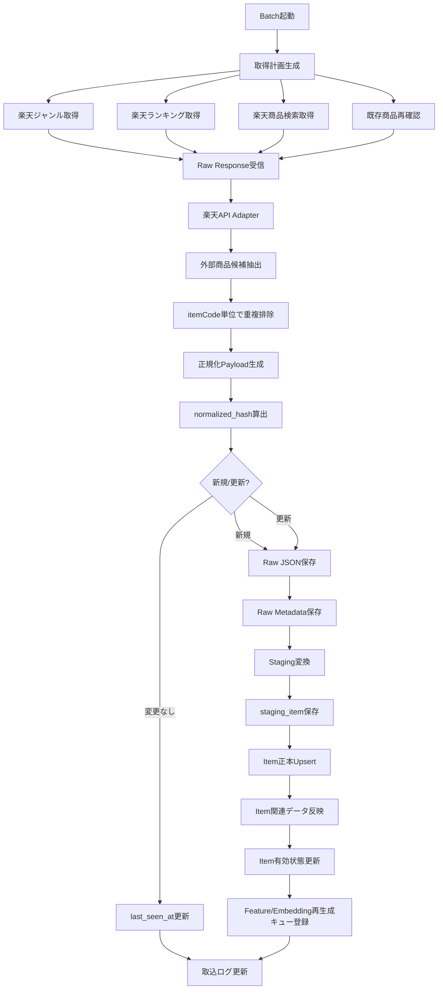
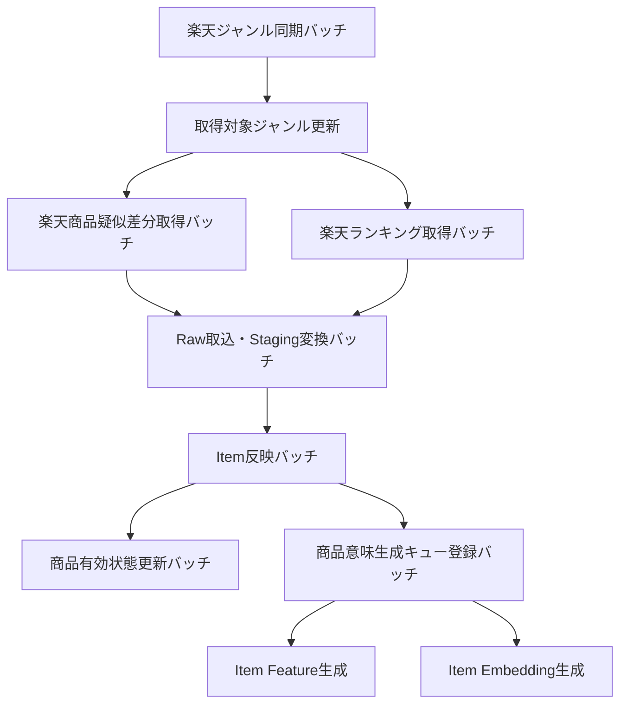

# 外部商品データ連携設計書

## 1. 概要

### 1.1 目的

本ドキュメントは、Gift Recommendation Service MVP における外部商品データ連携方式を定義する。

MVPでは、外部商品データソースとして **楽天市場商品データ** を利用する。
楽天市場の商品データは、楽天ウェブサービスが提供する楽天市場系APIを利用して取得する。

本設計書では、以下を定義する。

```text
- 利用する楽天市場API
- 外部商品データ取得方針
- 疑似差分取得方式
- Raw JSON保存方式
- Raw Metadata管理方式
- Staging変換方式
- Item正本への反映方式
- 商品画像参照データの扱い
- ジャンル・属性・ランキングデータの扱い
- エラー・リトライ・レート制御方針
- 後続成果物への反映観点
```

---

### 1.2 本ドキュメントの位置づけ

| 成果物                         | 本ドキュメントとの関係                                                  |
| ------------------------------ | ----------------------------------------------------------------------- |
| 処理構成定義書.md              | 商品データ取得・Raw保存・Raw取込・Item反映処理の前提                    |
| リソース一覧.md                | 外部商品、商品画像、ジャンル、ランキング等のリソース定義の前提          |
| リソース責務定義表.md          | 各リソースの管理責務・正本責務の前提                                    |
| 正本定義表.md                  | 外部商品データ、内部Item、Raw JSON、派生データの正本判定の前提          |
| 状態遷移設計書.md              | 外部商品取込状態・Item有効状態の状態管理の前提                          |
| Recommendation Result定義書.md | 推薦結果表示時の商品名・価格・商品画像URL等のスナップショット保持の前提 |
| ドメインモデル.md              | 商品意味、商品Feature、商品Embeddingの前処理領域の前提                  |
| バッチ一覧.md                  | 外部商品データ取得バッチ・取込バッチ定義の前提                          |
| テーブル定義書.md              | Raw Metadata、Staging、Item、Item Image等の物理設計の前提               |

---

## 2. 利用したインプット成果物

利用したインプット成果物は以下です。

- 処理構成定義書.md
- ドメインモデル.md
- RecommendationRequest定義書.md
- RecommendationResult定義書.md
- RecommendationFeedback定義書.md
- 楽天市場ジャンル検索APIレスポンスサンプル.txt
- 楽天商品検索API 公式ドキュメント
- 楽天商品ランキングAPI 公式ドキュメント
- 楽天ジャンル検索API 公式ドキュメント
- 楽天属性検索API 公式ドキュメント

---

## 3. 前提

### 3.1 MVP前提

| 項目                 | 前提                                                                  |
| -------------------- | --------------------------------------------------------------------- |
| 外部商品データソース | 楽天市場商品データのみ                                                |
| 商品購入             | MVP対象外                                                             |
| 決済・配送           | MVP対象外                                                             |
| 外部EC遷移           | 許容する                                                              |
| 商品画像             | 楽天市場APIから取得できる画像URLを参照データとして保持する            |
| 商品画像バイナリ保存 | MVPでは対象外                                                         |
| 商品画像解析         | MVPでは必須対象外                                                     |
| 認証・ユーザー別履歴 | MVPでは対象外                                                         |
| 商品データ更新方式   | 全件取得ではなく、疑似差分取得を基本とする                            |
| 既存実装             | 過去フィジビリティ検証で作成済みの楽天API連携バッチ処理をベースとする |

---

### 3.2 設計上の重要前提

| 区分     | 内容                                                                                                                        |
| -------- | --------------------------------------------------------------------------------------------------------------------------- |
| 事実     | 楽天商品検索APIでは、商品名、価格、商品URL、画像URL、販売可能フラグ、レビュー情報、ショップ情報、ジャンル情報等を取得できる |
| 事実     | 楽天商品検索APIでは `sort=-updateTimestamp` / `sort=+updateTimestamp` による商品更新日時順のソート指定が可能                |
| 事実     | 楽天商品検索APIの1回あたり取得件数は最大30件、取得ページは最大100ページ                                                     |
| 事実     | 楽天商品ランキングAPIでは、ランキング順位、商品コード、商品名、価格、画像URL、販売可能フラグ等を取得できる                  |
| 事実     | 楽天ジャンル検索APIでは、ジャンル階層、親子関係、同階層ジャンル、属性情報等を取得できる                                     |
| 推論     | 楽天側から「前回取得以降の更新商品一覧」を直接返す完全な差分APIは利用できない前提で設計する                                 |
| 推論     | `sort=-updateTimestamp` は更新商品候補の発見に使えるが、確定差分ではない                                                    |
| 設計方針 | 外部APIから取得した商品を `itemCode` 単位で同一商品とみなし、正規化済みデータのhash比較で新規・更新・変更なしを判定する     |
| 設計方針 | 毎回全商品を取得するのではなく、ランキング、対象ジャンル、更新日時順、既存商品再確認を組み合わせた疑似差分取得を行う        |
| 設計方針 | Raw JSON本体はObject Storageに保存し、DBにはRaw Metadataと構造化済みデータを保存する                                        |

---

## 4. 利用する楽天市場API

### 4.1 API一覧

| API                        | 用途                                                                 | MVP利用区分     |
| -------------------------- | -------------------------------------------------------------------- | --------------- |
| 楽天商品検索API            | 商品マスタ候補取得、商品詳細取得、更新日時順取得、ジャンル別商品取得 | 必須            |
| 楽天商品ランキングAPI      | 人気商品候補取得、人気補正シグナル取得、候補商品の拡張               | 必須            |
| 楽天ジャンル検索API        | ジャンル階層取得、対象ジャンル管理、ジャンル名解決                   | 必須            |
| 楽天属性検索API            | ジャンルに紐づく属性情報取得                                         | 任意 / 後続検討 |
| 楽天商品系APIの画像URL項目 | 商品画像参照データ取得                                               | 必須            |

---

### 4.2 楽天商品検索API

### 4.2.1 用途

楽天商品検索APIは、本サービスの商品データ取得の中心APIとする。

主な用途は以下。

```
- 対象ジャンルの商品候補取得
- 商品コード指定による商品詳細取得
- キーワード指定による商品候補取得
- 更新日時順ソートによる更新候補取得
- 商品名、キャッチコピー、説明文、価格、URL、画像URL、レビュー、ショップ、ジャンル情報の取得
```

### 4.2.2 主な入力パラメータ

| パラメータ      | 用途                | MVP方針                                                             |
| --------------- | ------------------- | ------------------------------------------------------------------- |
| `applicationId` | 楽天API利用アプリID | 必須                                                                |
| `accessKey`     | アクセスキー        | 必須                                                                |
| `format`        | レスポンス形式      | `json`                                                              |
| `formatVersion` | JSON構造            | `2`                                                                 |
| `elements`      | 取得項目制御        | 必要項目に絞る                                                      |
| `keyword`       | キーワード検索      | 任意                                                                |
| `genreId`       | ジャンル指定        | 主要取得条件                                                        |
| `itemCode`      | 商品コード指定      | 既存商品の再確認、詳細取得で利用                                    |
| `hits`          | 1ページ取得件数     | 最大30                                                              |
| `page`          | 取得ページ          | 1〜100                                                              |
| `sort`          | ソート条件          | `standard`, `-updateTimestamp`, `-reviewCount`, `-reviewAverage` 等 |
| `minPrice`      | 最小価格            | 必要に応じて利用                                                    |
| `maxPrice`      | 最大価格            | 必要に応じて利用                                                    |
| `availability`  | 販売可能条件        | 原則 `1`                                                            |
| `imageFlag`     | 画像有無            | 原則 `1`                                                            |
| `NGKeyword`     | 除外キーワード      | 必要に応じて利用                                                    |
| `attributeFlag` | 属性情報取得        | 必要に応じて利用                                                    |

### 4.2.3 主な出力項目

| 出力項目          | 内容               | 本サービスでの扱い                |
| ----------------- | ------------------ | --------------------------------- |
| `itemCode`        | 楽天商品コード     | 外部商品IDとして扱う              |
| `itemName`        | 商品名             | Item名、Embedding入力、表示用     |
| `catchcopy`       | キャッチコピー     | 表示用、Embedding入力             |
| `itemCaption`     | 商品説明文         | Semantic抽出、Embedding入力       |
| `itemPrice`       | 商品価格           | 予算Filter、表示用                |
| `itemUrl`         | 商品URL            | 外部EC遷移先                      |
| `affiliateUrl`    | アフィリエイトURL  | 将来利用。MVPでは任意             |
| `imageFlag`       | 商品画像有無       | 商品画像利用可否                  |
| `smallImageUrls`  | 64x64画像URL配列   | 商品画像参照データ                |
| `mediumImageUrls` | 128x128画像URL配列 | 推薦結果表示用の主画像候補        |
| `availability`    | 販売可能フラグ     | Item有効状態判定                  |
| `reviewAverage`   | レビュー平均       | 人気・信頼性シグナル              |
| `reviewCount`     | レビュー件数       | 人気・信頼性シグナル              |
| `shopName`        | ショップ名         | 内部分析用。MVP画面では原則非表示 |
| `shopCode`        | ショップコード     | 外部ショップ識別子                |
| `genreId`         | ジャンルID         | 商品カテゴリ管理                  |
| `attributeIds`    | 属性ID配列         | 商品属性シグナル                  |

---

### 4.3 楽天商品ランキングAPI

### 4.3.1 用途

楽天商品ランキングAPIは、以下の目的で利用する。

```
- 人気商品候補の取得
- 人気・信頼性シグナルの取得
- 初期MVPの商品母集団の補強
- ランキング順位を popularity_score の補助特徴として利用
```

本サービスでは、意味一致だけでなく、贈答リスクが高い文脈では「無難さ」「信頼性」「人気」を一定程度重視する。

そのため、ランキング情報は推薦品質を支える補助シグナルとして重要である。

### 4.3.2 主な入力パラメータ

| パラメータ      | 用途                 | MVP方針          |
| --------------- | -------------------- | ---------------- |
| `applicationId` | 楽天API利用アプリID  | 必須             |
| `accessKey`     | アクセスキー         | 必須             |
| `format`        | レスポンス形式       | `json`           |
| `formatVersion` | JSON構造             | `2`              |
| `elements`      | 取得項目制御         | 必要項目に絞る   |
| `genreId`       | ジャンル別ランキング | MVPで利用        |
| `age`           | 年齢層別ランキング   | 後続検討         |
| `sex`           | 性別ランキング       | 後続検討         |
| `carrier`       | PC / mobile          | 原則PC           |
| `page`          | ページ番号           | 取得上限内で制御 |
| `period`        | ランキング期間       | 必要に応じて利用 |

#### 4.3.3 本サービスで利用する主な出力項目

| 出力項目        | 内容               | 本サービスでの扱い                                          |
| --------------- | ------------------ | ----------------------------------------------------------- |
| `rank`          | ランキング順位     | popularity_score補助シグナルとして利用                      |
| `lastBuildDate` | ランキング更新日時 | ランキングデータ鮮度として利用                              |
| `itemCode`      | 商品コード         | Item紐づけ、および商品検索APIでの商品正本取得キーとして利用 |

#### 4.3.4 ランキングAPIでは正本反映しない項目

| 出力項目          | 方針                                                                   |
| ----------------- | ---------------------------------------------------------------------- |
| `itemName`        | Item正本には反映しない。商品検索API由来を正とする                      |
| `catchcopy`       | Item正本には反映しない。商品検索API由来を正とする                      |
| `itemCaption`     | Item正本には反映しない。商品検索API由来を正とする                      |
| `itemPrice`       | Item正本には反映しない。商品検索API由来を正とする                      |
| `itemUrl`         | Item正本には反映しない。商品検索API由来を正とする                      |
| `smallImageUrls`  | Item Image正本には反映しない。商品検索API由来を正とする                |
| `mediumImageUrls` | Item Image正本には反映しない。商品検索API由来を正とする                |
| `availability`    | Item有効状態には反映しない。商品検索API由来を正とする                  |
| `reviewAverage`   | Review/Popularity補助情報には直接反映しない。商品検索API由来を正とする |
| `reviewCount`     | Review/Popularity補助情報には直接反映しない。商品検索API由来を正とする |

### 4.3.5 注意点

ランキングAPIで未登録の itemCode を見つけた場合、ランキングAPIのレスポンスだけで Item を作るのではなく、次の流れとする。

```text
楽天ランキングAPI
↓
itemCode を取得
↓
未登録itemCodeをFetch Candidate化
↓
楽天商品検索APIを itemCode 指定で呼び出す
↓
商品検索APIレスポンスをもとに Item / Item Image をUpsert
↓
ランキングAPIの rank は item_popularity_signal として保存
```

---

### 4.4 楽天ジャンル検索API

### 4.4.1 用途

楽天ジャンル検索APIは、楽天市場のジャンル構造を取得し、本サービス内の商品カテゴリ管理に利用する。

主な用途は以下。

```
- 楽天ジャンルIDの名称解決
- 親ジャンル、子ジャンル、兄弟ジャンルの把握
- 取得対象ジャンルの管理
- 商品カテゴリとGift Meaning用カテゴリの対応付け
- ジャンル単位のバッチ取得計画作成
```

### 4.4.2 主な入力パラメータ

| パラメータ      | 用途                | MVP方針          |
| --------------- | ------------------- | ---------------- |
| `applicationId` | 楽天API利用アプリID | 必須             |
| `accessKey`     | アクセスキー        | 必須             |
| `genreId`       | 起点ジャンルID      | 必須。rootは `0` |
| `format`        | レスポンス形式      | `json`           |
| `formatVersion` | JSON構造            | `2`              |

### 4.4.3 主な出力項目

| 出力項目     | 内容             | 本サービスでの扱い         |
| ------------ | ---------------- | -------------------------- |
| `ancestors`  | 親ジャンル群     | ジャンル階層管理           |
| `genre`      | 現在ジャンル     | ジャンル正本参照           |
| `siblings`   | 兄弟ジャンル     | ジャンル探索補助           |
| `children`   | 子ジャンル群     | バッチ対象ジャンル展開     |
| `attributes` | 属性情報         | 商品属性管理、Semantic補助 |
| `genreId`    | ジャンルID       | 外部ジャンルID             |
| `jaName`     | 日本語ジャンル名 | 表示・管理用               |
| `level`      | ジャンル階層     | 階層管理                   |

---

### 4.5 楽天属性検索API

### 4.5.1 用途

楽天属性検索APIは、ジャンルに紐づく属性情報を取得するためのAPIである。

MVPでは必須とはしないが、商品意味推定の精度向上に有用なため、後続フェーズまたは余力があれば取り込む。

### 4.5.2 MVPでの扱い

| 観点     | 方針                                                                  |
| -------- | --------------------------------------------------------------------- |
| 必須性   | MVP必須ではない                                                       |
| 代替     | 楽天商品検索APIの `attributeFlag=1` で取得できる属性情報を優先利用    |
| 後続利用 | ジャンル別属性辞書、Feature推定補助、タグ・属性ベースの説明生成に利用 |
| 正本性   | 楽天属性検索API由来の外部属性情報は外部参照正本として扱う             |

---

## 5. 外部商品データ取得方針

### 5.1 基本方針

外部商品データ取得は、以下の方針で行う。

| 方針                                       | 内容                                                                  |
| ------------------------------------------ | --------------------------------------------------------------------- |
| 全件取得しない                             | 毎回、楽天市場上の全商品を取得する方式は採用しない                    |
| 疑似差分取得を行う                         | 更新候補、新規候補、人気候補を複数経路から収集する                    |
| hashで変更判定する                         | `itemCode` 単位で正規化後hashを比較し、新規・更新・変更なしを判定する |
| Raw JSONはObject Storageに保存する         | DB容量を抑えつつ、再処理可能性を確保する                              |
| DBには構造化データを保存する               | Item、Item Image、Item Category、Item Attribute等をDBに保持する       |
| APIレスポンス形状の差異はAdapterで吸収する | 楽天APIのバージョン差異・レスポンス差異を内部形式へ変換する           |
| 商品画像はURL参照として保持する            | MVPでは画像ファイル本体を保存しない                                   |
| 取得対象ジャンルを限定する                 | MVPのギフト推薦に必要なジャンルから段階的に拡張する                   |

---

### 5.2 全件取得を採用しない理由

| 理由                 | 内容                                                                              |
| -------------------- | --------------------------------------------------------------------------------- |
| 商品数が膨大         | 楽天市場の商品全体を対象にするとAPI呼び出し回数・処理時間・保存容量が膨大になる   |
| 更新頻度に偏りがある | 新規商品追加は多いが、既存商品の全項目が高頻度で更新されるわけではない            |
| API制限がある        | API呼び出し上限、ページング上限、短時間同一URLアクセス制限を考慮する必要がある    |
| コストが大きい       | Object Storage、DB、Embedding生成、Feature生成、バッチ実行時間が増大する          |
| MVP目的と合わない    | MVPでは「意味でギフトを選べるか」の価値検証が目的であり、網羅性より推薦体験が重要 |

---

## 6. 疑似差分取得方式

### 6.1 疑似差分取得の考え方

楽天APIから完全な差分データが取得できない前提で、以下を組み合わせて新規・更新候補を発見する。

```
1. 更新日時順の商品検索
2. 対象ジャンル別の商品検索
3. ランキング取得
4. 既存登録商品の再確認
5. 低頻度の棚卸し取得
```

ここで重要なのは、外部API取得時点では「差分確定」ではなく、あくまで「差分候補」である点。

差分確定は、取得後に以下で判定する。

```
external item identity = itemCode
normalized item payload = 表示・推薦に必要な主要項目へ正規化したJSON
normalized hash = normalized item payload のhash

前回hashなし      → 新規
前回hashと異なる  → 更新
前回hashと同じ    → 変更なし
```

---

### 6.2 疑似差分取得ルート

| 取得ルート     | 目的                                 | 頻度 | 対象                       |
| -------------- | ------------------------------------ | ---- | -------------------------- |
| 更新日時順取得 | 直近更新商品の捕捉                   | 高   | 主要ジャンル               |
| ジャンル別取得 | 新規商品・通常商品候補の捕捉         | 中   | MVP対象ジャンル            |
| ランキング取得 | 人気商品・売れ筋商品の捕捉           | 高   | MVP対象ジャンル            |
| 既存商品再確認 | 価格・販売状態・画像URL等の更新確認  | 中   | 登録済みItem               |
| 棚卸し取得     | 取り漏れ・販売終了・非アクティブ確認 | 低   | 重要ジャンル・登録済みItem |

---

### 6.3 新規・更新・変更なしの判定

| 判定               | 条件                                             | 後続処理                                                            |
| ------------------ | ------------------------------------------------ | ------------------------------------------------------------------- |
| 新規               | `itemCode` が未登録                              | Raw保存、Staging変換、Item追加、Feature/Embedding生成対象           |
| 更新               | `itemCode` は登録済みだが normalized hash が変化 | Raw保存、Staging変換、Item更新、必要に応じてFeature/Embedding再生成 |
| 変更なし           | `itemCode` 登録済み、normalized hash も同一      | Raw本体保存を省略可、Item反映なし、last_seen_atのみ更新             |
| 販売不可           | `availability=0` または商品取得不可              | Item有効状態更新対象                                                |
| 削除・取得不可疑い | 複数回の再確認で取得不可                         | `is_active=false` 候補                                              |

---

### 6.4 hash対象項目

`normalized_hash` の対象は、推薦・表示・検索に影響する項目に限定する。

| 項目              | hash対象 | 理由                            |
| ----------------- | -------- | ------------------------------- |
| `itemCode`        | ○        | 商品識別子                      |
| `itemName`        | ○        | 表示・Embeddingに影響           |
| `catchcopy`       | ○        | 表示・Embeddingに影響           |
| `itemCaption`     | ○        | Semantic抽出に影響              |
| `itemPrice`       | ○        | 予算Filter・表示に影響          |
| `itemUrl`         | ○        | 外部遷移に影響                  |
| `affiliateUrl`    | 任意     | MVPでは必須ではない             |
| `mediumImageUrls` | ○        | 推薦結果表示に影響              |
| `smallImageUrls`  | ○        | 画像参照に影響                  |
| `availability`    | ○        | 推薦可能状態に影響              |
| `reviewAverage`   | ○        | popularity_scoreに影響          |
| `reviewCount`     | ○        | popularity_scoreに影響          |
| `genreId`         | ○        | カテゴリ・検索対象に影響        |
| `attributeIds`    | ○        | 商品属性・Feature推定に影響     |
| `shopCode`        | ○        | ショップ識別に影響              |
| `shopName`        | 任意     | MVP画面非表示だが分析に利用可能 |

---

## 7. 外部商品データ連携フロー

### 7.1 全体フロー



---

### 7.2 取得計画生成

取得計画生成では、バッチ実行ごとに、どのAPIをどの条件で呼び出すかを決定する。

### 7.2.1 取得計画の入力

| 入力             | 内容                                 |
| ---------------- | ------------------------------------ |
| 対象ジャンル一覧 | MVPで扱う楽天ジャンルID              |
| 前回取得カーソル | 前回取得したページ・日時・条件       |
| API利用上限      | 1回のバッチで呼び出せるAPI回数上限   |
| 取得優先度       | ランキング、更新順、主要ジャンルなど |
| 既存商品リスト   | 再確認対象の `itemCode`              |
| 失敗リトライ対象 | 前回失敗したAPIリクエスト            |

### 7.2.2 取得計画の出力

| 出力                | 内容                                                          |
| ------------------- | ------------------------------------------------------------- |
| API種別             | item_search / item_ranking / genre_search / attribute_search  |
| request params      | API呼び出し条件                                               |
| priority            | 実行優先度                                                    |
| max_pages           | 最大取得ページ数                                              |
| expected_purpose    | new_discovery / update_check / popularity_signal / genre_sync |
| request_params_hash | 同一リクエスト識別子                                          |

---

## 8. Raw JSON保存方針

### 8.1 基本方針

Raw JSON本体は、DBではなくObject Storageへ保存する。

DBには以下のRaw Metadataを保存する。

```
- object key
- source system
- source api
- api version
- request params
- request params hash
- response content hash
- fetched_at
- import_status
- changed item count
- error message
```

---

### 8.2 Raw JSON保存対象

コストと再処理性のバランスを取るため、Raw JSON保存は以下の方針とする。

| ケース                          | Raw JSON保存     | 理由                       |
| ------------------------------- | ---------------- | -------------------------- |
| 新規商品を含むレスポンス        | 保存する         | Item追加・再処理に必要     |
| 更新商品を含むレスポンス        | 保存する         | Item更新・再処理に必要     |
| 変更なし商品のみのレスポンス    | 原則保存しない   | コスト削減                 |
| エラーレスポンス                | 必要に応じて保存 | 障害調査用                 |
| Genre / Attribute定義レスポンス | 保存する         | 外部参照定義の再処理に必要 |
| Rankingレスポンス               | 保存する         | 人気シグナル再計算に必要   |
| 手動検証・監査モード            | 保存する         | 調査・検証用途             |

---

### 8.3 Object Storage Key設計

```
raw/rakuten/{api_name}/dt={yyyy-mm-dd}/batch_run_id={batch_run_id}/{request_hash}.json
```

例：

```
raw/rakuten/item_search/dt=2026-05-10/batch_run_id=br_20260510_001/9f2a3c.json
raw/rakuten/item_ranking/dt=2026-05-10/batch_run_id=br_20260510_001/7a1b8d.json
raw/rakuten/genre_search/dt=2026-05-10/batch_run_id=br_20260510_001/5c0e2a.json
```

---

### 8.4 Raw Metadata項目

| 項目                      | 内容                                                                 |
| ------------------------- | -------------------------------------------------------------------- |
| `raw_product_metadata_id` | Raw Metadata ID                                                      |
| `batch_run_id`            | バッチ実行ID                                                         |
| `source_system`           | `rakuten`                                                            |
| `source_api`              | `item_search` / `item_ranking` / `genre_search` / `attribute_search` |
| `api_version`             | APIバージョン                                                        |
| `request_params`          | リクエスト条件JSON                                                   |
| `request_params_hash`     | リクエスト条件hash                                                   |
| `response_content_hash`   | レスポンス全体hash                                                   |
| `object_key`              | Object Storage上のRaw JSON参照先                                     |
| `raw_body_saved`          | Raw JSON本体を保存したか                                             |
| `fetched_at`              | 取得日時                                                             |
| `http_status`             | HTTPステータス                                                       |
| `item_count`              | レスポンス内商品数                                                   |
| `new_item_count`          | 新規商品数                                                           |
| `changed_item_count`      | 更新商品数                                                           |
| `unchanged_item_count`    | 変更なし商品数                                                       |
| `import_status`           | 取込状態                                                             |
| `error_code`              | エラーコード                                                         |
| `error_message`           | エラーメッセージ                                                     |

---

## 9. Staging変換方針

### 9.1 目的

Staging変換は、楽天API固有のレスポンス形式を、本サービスの内部取込形式へ変換する処理である。

外部APIのレスポンス構造をそのままItem正本に反映しない。

理由は以下。

```
- 楽天APIのバージョン差異を吸収するため
- 商品検索APIとランキングAPIのレスポンス差異を吸収するため
- formatVersion差異を吸収するため
- 画像URL配列、属性、ジャンルなどのネスト構造を正規化するため
- Item正本へのUpsert前にValidationするため
```

---

### 9.2 Staging変換対象

| 外部項目          | Staging項目               | 備考                         |
| ----------------- | ------------------------- | ---------------------------- |
| `itemCode`        | `external_item_code`      | 楽天商品コード               |
| `itemName`        | `item_name`               | 商品名                       |
| `catchcopy`       | `catchcopy`               | キャッチコピー               |
| `itemCaption`     | `item_caption`            | 商品説明                     |
| `itemPrice`       | `item_price`              | 価格                         |
| `itemUrl`         | `item_url`                | 商品URL                      |
| `affiliateUrl`    | `affiliate_url`           | 任意                         |
| `availability`    | `availability`            | 販売可能フラグ               |
| `imageFlag`       | `image_flag`              | 画像有無                     |
| `smallImageUrls`  | `small_image_urls`        | 配列                         |
| `mediumImageUrls` | `medium_image_urls`       | 配列                         |
| `reviewAverage`   | `review_average`          | レビュー平均                 |
| `reviewCount`     | `review_count`            | レビュー件数                 |
| `shopCode`        | `shop_code`               | ショップコード               |
| `shopName`        | `shop_name`               | ショップ名                   |
| `genreId`         | `rakuten_genre_id`        | 楽天ジャンルID               |
| `attributeIds`    | `attribute_ids`           | 属性ID配列                   |
| `rank`            | `ranking_rank`            | ランキングAPI由来の場合      |
| `lastBuildDate`   | `ranking_last_build_date` | ランキングAPI由来の場合      |
| `source_api`      | `source_api`              | item_search / item_ranking等 |
| `normalized_hash` | `normalized_hash`         | 差分判定用                   |

---

## 10. Item正本反映方針

### 10.1 Item正本の考え方

本サービスにおけるOnline推薦の参照元は、楽天APIのRaw JSONではなく、DB上の `item` および関連テーブルである。

```
楽天API Raw JSON
↓
Staging
↓
Item正本
↓
Item Feature / Item Embedding
↓
Online Recommendation
```

---

### 10.2 Item Upsert方針

| ケース                   | 処理                                       |
| ------------------------ | ------------------------------------------ |
| 新規商品                 | `item` を新規作成                          |
| 既存商品かつhash変更あり | `item` を更新                              |
| 既存商品かつhash変更なし | `item` は更新せず、`last_seen_at` のみ更新 |
| 販売不可                 | `is_active=false` 候補として更新           |
| 必須項目不足             | 取込失敗として記録                         |
| 画像なし                 | MVPでは原則推薦対象外または優先度低下      |
| URLなし                  | 外部EC遷移不可のため推薦対象外             |

---

### 10.3 Item関連データ反映

| 関連データ   | 反映先                                 | 内容                                  |
| ------------ | -------------------------------------- | ------------------------------------- |
| 商品価格     | `item.price` または `item_price`       | MVPでは現行価格を保持                 |
| 商品画像     | `item_image`                           | small / medium image URLを配列展開    |
| 商品ジャンル | `item_category` / `item_genre`         | 楽天ジャンルIDとの紐づけ              |
| 商品属性     | `external_attribute`                   | attributeIds または属性情報（MVP DDL 未作成・Human Review #575。旧称 `item_attribute`） |
| レビュー     | `item_review_summary`                  | reviewAverage / reviewCount           |
| ランキング   | `item_popularity_signal`               | rank / genre / period / lastBuildDate |
| ショップ     | `item_shop_snapshot` または item内項目 | MVPでは内部分析用                     |

---

## 11. 商品画像データ連携方針

### 11.1 基本方針

商品画像は、楽天APIから取得できる画像URLを参照データとして保持する。

MVPでは画像ファイル本体を保存しない。

```
楽天API
↓
smallImageUrls / mediumImageUrls
↓
item_image
↓
推薦結果表示
↓
Recommendation Result Item Snapshot
```

---

### 11.2 取得対象

| API項目           | 内容               | 用途                               |
| ----------------- | ------------------ | ---------------------------------- |
| `smallImageUrls`  | 64x64画像URL配列   | サムネイル候補                     |
| `mediumImageUrls` | 128x128画像URL配列 | 推薦結果一覧・商品詳細の主画像候補 |
| `imageFlag`       | 画像有無           | 画像表示可否判定                   |

---

### 11.3 item_image 管理方針

| 項目              | 内容               |
| ----------------- | ------------------ |
| `item_image_id`   | 商品画像ID         |
| `item_id`         | 内部Item ID        |
| `image_size_type` | `small` / `medium` |
| `image_url`       | 画像URL            |
| `display_order`   | 表示順             |
| `is_primary`      | 主画像か           |
| `fetched_at`      | 取得日時           |

> **論理ER / リソース一覧との整合（Issue #497）**: 旧版は `source_system` / `is_active` を列挙していたが、物理 DDL では **不採用** とする。`item_review_summary` / `item_popularity_signal` と同型で、Item 子テーブル行に `source` / `source_system` / `source_api` は持たない。マーケット識別は親 `item.source`、API トレースは `staging_item_image` → `raw_product_metadata.source_api`（`item_search`）で行う。履歴は持たず **最新のみ Upsert + item 単位同期置換**（消えた URL は DELETE）。

---

### 11.4 主画像選定方針

推薦結果一覧画面では、原則として以下の優先順で画像を表示する。

```
1. mediumImageUrls[0]
2. smallImageUrls[0]
3. 画像なしプレースホルダー
```

MVPでは画像URLの死活監視までは必須対象外とする。

ただし、画像取得失敗時に画面が崩れないよう、フロントエンド側でプレースホルダー表示を行う。

---

### 11.5 Recommendation Result Snapshotとの関係

Recommendation Result Itemでは、表示時点の商品画像URLをスナップショットとして保持する。

これにより、後から推薦結果を確認した際に、当時どの画像を表示したかを追跡できる。

| Result Snapshot項目       | 元データ                               |
| ------------------------- | -------------------------------------- |
| `item_image_url_snapshot` | `item_image.is_primary=true` の画像URL |
| `item_name_snapshot`      | `item.item_name`                       |
| `item_price_snapshot`     | `item.price`                           |
| `item_url_snapshot`       | `item.item_url`                        |

---

## 12. ジャンル・属性データ連携方針

### 12.1 ジャンルデータ

楽天ジャンル検索APIから取得したジャンル情報は、外部ジャンル参照データとして保持する。

| 項目                | 内容           |
| ------------------- | -------------- |
| `external_genre_id` | 楽天ジャンルID |
| `genre_name`        | ジャンル名     |
| `genre_level`       | 階層           |
| `parent_genre_id`   | 親ジャンルID   |
| `source_system`     | `rakuten`      |
| `is_leaf`           | 末端ジャンルか |
| `fetched_at`        | 取得日時       |
| `is_active`         | 利用中か       |

---

### 12.2 レスポンス構造差異への対応

楽天ジャンルAPIは、APIバージョンやサンプルによりレスポンス項目名が異なる可能性がある。

確認できている例は以下。

| 種別         | 旧形式・サンプル例 | 新形式例     | 内部正規化項目        |
| ------------ | ------------------ | ------------ | --------------------- |
| 親ジャンル   | `parents`          | `ancestors`  | `parent_genres`       |
| 現在ジャンル | `current`          | `genre`      | `current_genre`       |
| 兄弟ジャンル | `brothers`         | `siblings`   | `sibling_genres`      |
| 子ジャンル   | `children`         | `children`   | `child_genres`        |
| タグ・属性   | `tagGroups`        | `attributes` | `external_attributes` |

そのため、楽天ジャンルAPI Adapterでは、外部レスポンスを直接DBへ保存せず、内部正規化形式へ変換する。

---

### 12.3 属性データ

属性データは、商品意味推定の補助情報として利用する。

| 属性例           | Feature推定での利用例             |
| ---------------- | --------------------------------- |
| ブランド         | brand_appropriateness、safety     |
| オーガニック     | story_richness、symbolic_identity |
| セット本数       | formality、safety                 |
| 不使用添加物     | safety、emotion                   |
| 包装・ギフト対応 | formality、brand_appropriateness  |

MVPでは、属性データを必ずFeatureへ強く反映するのではなく、まずは商品シグナルとして保持する。

---

## 13. ランキングデータ連携方針

### 13.1 ランキングデータの位置づけ

ランキングデータは、Item正本そのものではなく、商品に紐づく人気・信頼性シグナルとして扱う。

```
楽天商品ランキングAPI
↓
ranking raw
↓
item_popularity_signal
↓
popularity_score
↓
Final Ranking
```

---

### 13.2 ranking signal項目

| 項目                 | 内容               |
| -------------------- | ------------------ |
| `item_id`            | 内部Item ID        |
| `external_item_code` | 楽天商品コード     |
| `source_system`      | `rakuten`          |
| `source_api`         | `item_ranking`     |
| `genre_id`           | 対象ジャンル       |
| `rank`               | ランキング順位     |
| `period`             | ランキング期間     |
| `last_build_date`    | ランキング更新日時 |
| `fetched_at`         | 取得日時           |

---

### 13.3 popularity_scoreへの利用方針

MVPでは、ランキング順位、レビュー平均、レビュー件数を popularity_score の主要補助シグナルとする。

```
popularity_score
= f(
    ranking_rank,
    review_average,
    review_count,
    data_freshness
  )
```

ただし、ランキング上位であることだけを理由に最終順位を上げすぎない。

本サービスの主価値は「意味でギフトを選べること」であるため、ランキングはあくまで補正要素とする。

---

## 14. バッチ処理設計

### 14.1 バッチ一覧

| バッチID   | バッチ名                     | 処理概要                                            | 実行頻度   |
| ---------- | ---------------------------- | --------------------------------------------------- | ---------- |
| BT-EXT-001 | 楽天ジャンル同期バッチ       | 楽天ジャンル構造を取得・更新する                    | 低頻度     |
| BT-EXT-002 | 楽天ランキング取得バッチ     | 対象ジャンルのランキング商品を取得する              | 高頻度     |
| BT-EXT-003 | 楽天商品疑似差分取得バッチ   | 更新順・ジャンル別に商品候補を取得する              | 高〜中頻度 |
| BT-EXT-004 | 楽天既存商品再確認バッチ     | 登録済み商品の価格・販売状態等を再確認する          | 中頻度     |
| BT-EXT-005 | Raw取込・Staging変換バッチ   | Raw JSONをStagingへ変換する                         | 商品取得後 |
| BT-EXT-006 | Item反映バッチ               | StagingからItem正本へUpsertする                     | Staging後  |
| BT-EXT-007 | 商品有効状態更新バッチ       | 販売不可・取得不可商品を非アクティブ化する          | 中頻度     |
| BT-EXT-008 | 商品意味生成キュー登録バッチ | 新規・更新ItemをFeature/Embedding生成対象に登録する | Item反映後 |

---

### 14.2 推奨実行順序



---

### 14.3 実行頻度方針

| 処理                  | MVP目安      | 理由                                      |
| --------------------- | ------------ | ----------------------------------------- |
| ジャンル同期          | 週次〜月次   | ジャンル構造は高頻度に変わらない想定      |
| ランキング取得        | 日次         | 人気商品候補を鮮度高く保つため            |
| 更新順商品取得        | 日次         | 新規・更新候補を捕捉するため              |
| ジャンル別商品取得    | 週次         | 対象ジャンルの商品母集団を拡張するため    |
| 既存商品再確認        | 週次         | 価格・販売状態・画像URL更新を確認するため |
| 棚卸し取得            | 月次         | 取り漏れ・販売終了商品の検出              |
| Feature/Embedding生成 | 新規・更新時 | コスト削減のため変更商品に限定            |

---

## 15. 状態管理

### 15.1 状態管理の基本方針

外部商品データ連携における状態は、以下の2種類に分けて扱う。

| 区分     | 説明                                           | DB保存方針                   |
| -------- | ---------------------------------------------- | ---------------------------- |
| 論理状態 | バッチ処理内での処理段階を表す状態             | 原則としてDBに逐次保存しない |
| 永続状態 | 再実行・監査・障害調査・Online推薦に必要な状態 | DBに保存する                 |

MVPでは、商品単位で全状態遷移を逐次DB更新しない。  
DB更新は、Batch単位、APIリクエスト単位、Rawレスポンス単位、商品チャンク単位、終端状態を中心に行う。

特に、`planned`、`requested`、`fetched`、`staged` は処理内の論理状態として扱い、商品単位で都度DB更新しない。

---

### 15.2 外部商品取込状態

| 状態         | 内容                   | DB保存方針                                       |
| ------------ | ---------------------- | ------------------------------------------------ |
| `planned`    | 取得計画に登録済み     | Fetch Plan単位で管理。商品単位では原則保存しない |
| `requested`  | APIリクエスト実行済み  | API Call Logとしてリクエスト単位で保存           |
| `fetched`    | APIレスポンス取得済み  | Raw Metadataとしてレスポンス単位で保存           |
| `unchanged`  | 変更なし判定済み       | External Product Indexをbulk更新                 |
| `raw_saved`  | Raw JSON保存済み       | Raw Metadataに保存                               |
| `staged`     | Staging変換済み        | Stagingテーブルへのinsertで代替                  |
| `upserted`   | Item正本反映済み       | Item更新結果・Batch集計として保存                |
| `skipped`    | 取込不要としてスキップ | skip理由を必要に応じて集計・ログ保存             |
| `failed`     | 失敗                   | Error Logまたは対象単位の失敗情報として保存      |
| `retry_wait` | リトライ待ち           | リトライ対象のみ保存                             |

---

### 15.3 推薦対象条件

ItemをOnline推薦対象にするには、最低限以下を満たすこと。

```
- item_id が存在する
- external_item_code が存在する
- item_name が存在する
- item_price が存在する
- item_url が存在する
- availability = 1
- is_active = true
- 商品画像URLが1件以上存在することを推奨
- Item Feature が生成済み
- Item Embedding が生成済み
```

---

## 16. エラー・リトライ方針

### 16.1 想定エラー

| HTTPステータス | 内容                 | 対応                                           |
| -------------- | -------------------- | ---------------------------------------------- |
| 400            | パラメータエラー     | リトライしない。設定・実装を修正               |
| 404            | データなし           | 対象なしとして処理。既存商品なら確認回数を記録 |
| 429            | リクエスト過多       | Backoff後リトライ                              |
| 500            | 楽天側内部エラー     | Backoff後リトライ                              |
| 503            | メンテナンス・過負荷 | Backoff後リトライ                              |

---

### 16.2 リトライ方針

| エラー  | リトライ   | 方針                             |
| ------- | ---------- | -------------------------------- |
| 400     | しない     | リクエスト条件不正のため         |
| 404     | 原則しない | 商品なし・条件該当なしとして扱う |
| 429     | する       | 一定時間待機後に再実行           |
| 500     | する       | 一時障害の可能性                 |
| 503     | する       | メンテナンス・過負荷の可能性     |
| Timeout | する       | ネットワーク一時障害の可能性     |

---

### 16.3 レート制御方針

```
- 同一URLへの短時間連続アクセスを避ける
- request_params_hash単位で実行間隔を制御する
- API種別ごとに最大リクエスト数を設定する
- 429発生時は指数バックオフする
- 503発生時は通常より長めに待機する
- GitHub Actions等のバッチ実行時間上限を考慮する
```

---

## 17. データ正本方針

### 17.1 正本整理

| データ                         | 正本                              | 理由                                               |
| ------------------------------ | --------------------------------- | -------------------------------------------------- |
| 楽天APIレスポンス原本          | Object Storage上のRaw JSON        | 外部レスポンス原本であり再処理可能性を担保するため |
| Raw Metadata                   | database                          | Raw JSONの参照・取込状態管理に必要                 |
| 外部商品ID                     | 楽天 `itemCode`                   | 楽天市場内の商品識別子                             |
| 内部Item                       | database `item`                   | Online推薦で参照する商品正本                       |
| 商品画像URL                    | database `item_image`             | UI表示・Result Snapshotに必要                      |
| ジャンル定義                   | database `external_genre`         | 外部ジャンル参照データとして管理                   |
| ランキング情報                 | database `item_popularity_signal` | 人気補正シグナルとして管理                         |
| Item Feature                   | database                          | 推薦計算用の派生正本                               |
| Item Embedding                 | pgvector / database               | Retrieval用の派生正本                              |
| Recommendation Result Snapshot | database                          | ユーザーに表示した結果の正本                       |

---

### 17.2 Raw JSONとItem正本の関係

```
Raw JSON
  = 外部APIレスポンス原本
  = 再処理・監査・障害調査のための正本

Item
  = 本サービスの推薦で使う商品正本
  = 外部データを本サービス用に正規化したもの
```

Raw JSONはそのままOnline推薦で参照しない。

Online推薦では、Item、Item Feature、Item Embeddingを参照する。

---

## 18. 後続成果物への反映事項

### 18.1 修正・確認が必要な成果物

| 成果物                         | 反映内容                                                                                                        |
| ------------------------------ | --------------------------------------------------------------------------------------------------------------- |
| 処理構成定義書.md              | 商品データ取得を全件取得前提ではなく、疑似差分取得前提へ修正                                                    |
| リソース一覧.md                | 商品画像、ランキングシグナル、外部ジャンル、外部属性、Raw Metadataを反映済みか確認                              |
| リソース責務定義表.md          | Raw JSON、Raw Metadata、Item、Item Image、Ranking Signalの責務を確認                                            |
| 正本定義表.md                  | Raw JSON、Item、Item Image、Ranking Signal、Item Featureの正本関係を確認                                        |
| 状態遷移設計書.md              | 外部商品取込状態、Item有効状態を追加                                                                            |
| バッチ一覧.md                  | 楽天ランキング取得バッチ、疑似差分取得バッチ、既存商品再確認バッチを追加                                        |
| テーブル定義書.md              | `raw_product_metadata`, `item_image`, `item_popularity_signal`, `external_genre`, `external_attribute` 等を反映 |
| API仕様書.md                   | Online推薦APIのレスポンスに商品画像URLが含まれることを確認                                                      |
| 画面仕様書.md                  | 推薦結果一覧・商品詳細で画像URLを表示することを確認                                                             |
| Recommendation Result定義書.md | `item_image_url_snapshot` の元データを `item_image` として明確化                                                |

---

## 19. MVPでの実装優先順位

### 19.1 Must

| 項目                        | 内容                                               |
| --------------------------- | -------------------------------------------------- |
| 楽天商品検索API連携         | 商品候補・商品詳細取得                             |
| 楽天ランキングAPI連携       | 人気商品候補・人気シグナル取得                     |
| 楽天ジャンル検索API連携     | 対象ジャンル管理                                   |
| Raw JSON Object Storage保存 | 新規・更新・ランキング・ジャンル定義レスポンス保存 |
| Raw Metadata保存            | object key / hash / 取得状態管理                   |
| 疑似差分判定                | itemCode + normalized_hash                         |
| Item Upsert                 | 内部Item正本反映                                   |
| 商品画像URL保存             | `smallImageUrls` / `mediumImageUrls`               |
| Item有効状態管理            | availability / is_active                           |
| Result Snapshot連携         | 表示時点の商品画像URL保持                          |

---

### 19.2 Should

| 項目                   | 内容                            |
| ---------------------- | ------------------------------- |
| 既存商品再確認バッチ   | 価格・販売状態・画像URL更新確認 |
| ランキングシグナル履歴 | popularity_score改善用          |
| ジャンル階層管理       | カテゴリ別取得計画作成          |
| エラーリトライ制御     | 429 / 500 / 503対応             |
| API request log        | 呼び出し条件・失敗分析          |

---

### 19.3 Later

| 項目                       | 内容                          |
| -------------------------- | ----------------------------- |
| 楽天属性検索API本格利用    | 属性辞書の拡張                |
| 商品画像バイナリ保存       | 画像URL切れ対策               |
| 商品画像解析               | 画像特徴量をFeature推定に利用 |
| ショップ品質評価           | ショップ単位の信頼性シグナル  |
| 複数EC対応                 | Amazon等の外部商品ソース追加  |
| 商品価格履歴               | 価格推移分析                  |
| 在庫・販売終了検知精度向上 | 非アクティブ判定の高度化      |

---

## 20. 未確認事項

| No  | 未確認事項                                               | 対応方針                                                                    |
| --- | -------------------------------------------------------- | --------------------------------------------------------------------------- |
| 1   | 過去フィジビリティ検証で作成済みのバッチソースコード本体 | ソースコード一式を確認でき次第、実装済みAPI・パラメータ・保存方式を反映する |
| 2   | MVP対象の楽天ジャンルID一覧                              | 画面・推薦対象カテゴリの設計と合わせて決定する                              |
| 3   | 1日あたりのAPI実行上限                                   | 楽天API利用条件・実運用制約を確認する                                       |
| 4   | Object Storageの具体サービス                             | **確定**（2026-07-25 Human）: 製品=**Supabase Storage** / 接続=**案 A（S3 互換 API + `OBJECT_STORAGE_*`）**。#1612 client 維持。Epic #1614 |
| 5   | 画像URLの有効期限・URL変化                               | MVPではURL参照とし、後続で死活監視を検討する                                |
| 6   | アフィリエイトURL利用有無                                | MVPでは任意。収益化フェーズで再検討する                                     |

---

## 21. 参考：公式仕様・添付資料

### 21.1 参照資料

- 処理構成定義書.md
- ドメインモデル.md
- RecommendationResult定義書.md
- RecommendationRequest定義書.md
- RecommendationFeedback定義書.md
- 楽天市場ジャンル検索APIレスポンスサンプル.txt
- 楽天商品検索API 公式ドキュメント
- 楽天商品ランキングAPI 公式ドキュメント
- 楽天ジャンル検索API 公式ドキュメント
- 楽天属性検索API 公式ドキュメント

---

### 21.2 設計上の参照ポイント

| 参照元                        | 参照ポイント                                                                                   |
| ----------------------------- | ---------------------------------------------------------------------------------------------- |
| 処理構成定義書.md             | 商品データ取得、Raw保存、Staging変換、Item反映をBatch処理として分離する                        |
| 処理構成定義書.md             | Raw JSON本体はObject Storage、Raw MetadataはDBに保存する                                       |
| RecommendationResult定義書.md | Result Itemに商品名、価格、商品URL、商品画像URLなどの表示時点スナップショットを保持する        |
| ドメインモデル.md             | 外部商品データから商品シグナルを抽出し、Item MeaningとしてFeature化・Embedding化する           |
| 楽天商品検索API               | 商品名、商品価格、商品URL、商品画像URL、販売可能フラグ、レビュー、ジャンル、属性等を取得できる |
| 楽天商品ランキングAPI         | ランキング順位、商品情報、商品画像URL、販売可能フラグ等を取得できる                            |
| 楽天ジャンル検索API           | ジャンル階層、親子関係、属性情報等を取得できる                                                 |

---

## 22. まとめ

MVPにおける外部商品データ連携方針は以下とする。

```
- 外部商品データは楽天市場商品データのみを対象とする
- 商品データ取得には楽天商品検索APIを利用する
- 人気商品・人気補正シグナル取得には楽天商品ランキングAPIを利用する
- ジャンル階層・対象ジャンル管理には楽天ジャンル検索APIを利用する
- 属性情報は楽天商品検索APIのattribute情報を優先し、楽天属性検索APIは任意または後続検討とする
- 毎回の全件取得は採用しない
- 楽天APIの真の更新差分取得には依存しない
- 本サービス側で疑似差分取得を行う
- 疑似差分取得は itemCode、normalized_hash、取得ルート、取得頻度、優先度を用いる
- Raw JSON本体はObject Storageに保存する
- DBにはRaw Metadataと正規化済みItem関連データを保存する
- 商品現在値はItemを正本とする
- 商品画像URL現在値はItem Imageを正本とする
- 楽天APIのmediumImageUrls / smallImageUrls をItem Imageへ反映する
- ランキング情報はItem正本ではなく、item_popularity_signalとして管理する
- 推薦結果表示時点の商品情報・商品画像URLはRecommendation Result Item Snapshotとして固定する
- Feature / Embeddingは商品意味に影響する項目が変わった場合のみ再生成する
```
