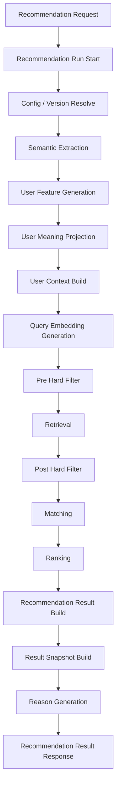
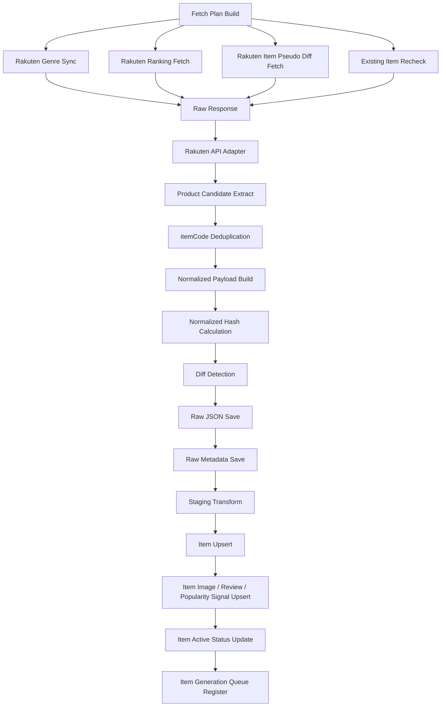
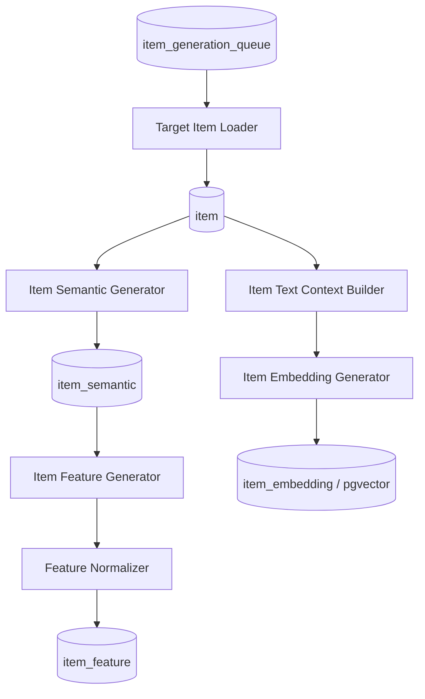

# 機能一覧

## 1. 概要

### 1.1 目的

本ドキュメントは、Gift Recommendation Service MVP におけるアプリケーション機能を一覧化する。

本サービスは、ユーザーが入力した贈答文脈・条件をもとに、商品データ、意味特徴量、検索・マッチング・ランキングロジックを用いて、贈答意図に合う商品を推薦するサービスである。

本ドキュメントでは、以下の観点で機能を整理する。

```text
- 画面機能
- API機能
- 推薦パイプライン機能
- 商品データ連携機能
- 商品意味推定機能
- 評価・改善機能
- マスタ・設定機能
- ログ・運用機能
```

---

### 1.2 本ドキュメントの位置づけ

| 成果物 | 本ドキュメントとの関係 |
| --- | --- |
| MVPスコープ定義書 | MVPで実装する機能範囲の前提 |
| 制約・対象外一覧 | 本機能一覧に含めない範囲の前提 |
| 処理フロー概要図 | 機能の処理順序の前提 |
| 処理構成定義書 | 本機能一覧の処理系統・保存タイミング・OL/BT区分の前提 |
| システム論理構成図 | 機能を担当する論理コンポーネントの前提 |
| システム物理構成図 | 各機能を実行する物理環境の前提 |
| 利用技術スタック整理表 | 各機能の実装技術の前提 |
| 画面一覧 | 画面機能の前提 |
| リソース一覧 | 機能が扱う主要リソースの前提 |
| リソース責務定義表 | 各リソースの管理責務・参照責務の前提 |
| 正本定義表 | 各機能が更新・参照する正本データの前提 |
| 外部商品データ連携設計書 | 商品データ取得・疑似差分取得・Raw保存・Item反映の詳細前提 |
| ドメインモデル | 機能が扱う主要ドメイン概念の前提 |
| モジュール一覧 | 本機能一覧を実装責務単位へ分解する後続成果物 |
| Recoモジュール一覧 | 推薦パイプライン機能をreco内部モジュールへ分解する後続成果物 |
| API一覧 | APIとして公開・呼び出しする機能を整理する後続成果物 |
| バッチ一覧 | Batchとして実行する機能を整理する後続成果物 |
| インターフェース一覧 | 機能間・外部サービス間の接続を整理する後続成果物 |

---

## 2. 利用したインプット成果物

利用したインプット成果物は以下です。

- 機能一覧.md
- 処理構成定義書.md
- 外部商品データ連携設計書.md
- ドメインモデル.md
- 画面一覧.md
- リソース一覧.md
- リソース責務定義表.md
- 正本定義表.md
- 状態遷移設計書.md
- RecommendationRequest定義書.md
- RecommendationResult定義書.md
- RecommendationFeedback定義書.md
- Reason生成定義書.md

---

## 3. 基本方針

### 3.1 機能分解方針

| 方針 | 内容 |
| --- | --- |
| ユーザー価値を起点にする | 「意味でギフトを選べる」体験に必要な機能を中心にする |
| Online / Batchを分離する | ユーザー操作に同期する機能と、事前準備・評価・商品取込機能を分ける |
| Online処理中に外部商品APIを呼ばない | レコメンド実行時は、事前整備済みのItem / Feature / Embedding / Popularity Signalを参照する |
| 推薦ロジックはrecoに集約する | Semantic / Feature / Retrieval / Matching / Ranking / Reasonをreco側に配置する |
| 商品データ取得はbatchに集約する | 楽天API取得、Raw保存、Staging変換、Item反映はbatch側に配置する |
| 商品データは全件取得前提にしない | 楽天市場全体を毎回取得せず、疑似差分取得を基本とする |
| 商品正本はItemに集約する | 楽天API Raw JSONではなく、正規化済みのItem関連データをOnline推薦の参照元とする |
| 商品画像はItem Imageとして扱う | 楽天商品検索API由来の `smallImageUrls` / `mediumImageUrls` を商品画像参照データとして保持する |
| ランキングは補助シグナルとして扱う | 楽天ランキングAPI由来の商品情報はItem正本に直接反映せず、rank等をPopularity Signalとして扱う |
| Rawデータ本体はObject Storageに保存する | DB容量節約と再処理性確保のため、外部APIレスポンス原本はObject Storageに保存する |
| DBは構造化データを保持する | Request / Result / Item / Feature / Embedding / Feedback / LogをDBで管理する |
| 状態更新は必要最小限にする | 商品単位の中間状態を逐次DB更新せず、Batch単位・API単位・Raw単位・チャンク単位・終端状態を中心に保存する |
| MVPでは過剰機能を避ける | 購入・決済・配送・認証・高度パーソナライズは初回MVPでは含めない |

---

### 3.2 処理種別

| 処理種別 | 内容 |
| --- | --- |
| OL | ユーザー操作に同期して実行されるOnline処理 |
| BT | 定期実行・手動実行されるBatch処理 |
| 共通 | OL / BTの双方から利用される処理 |
| 運用 | 開発・保守・評価・監視のための処理 |

---

### 3.3 コンポーネント分類

| コンポーネント | 役割 |
| --- | --- |
| web | ユーザー入力、結果表示、推薦理由表示、Feedback入力 |
| api | API受付、Validation、DB保存、reco呼び出し、レスポンス整形 |
| reco | 推薦パイプライン本体、Reason生成、評価モード推薦実行 |
| batch | 商品データ取得、Raw保存、Staging変換、Item反映、商品意味推定、Offline Evaluation |
| database | 構造化データ、Feature、Embedding、Result、Feedback、Log、Item正本の保存 |
| object storage | 外部商品APIレスポンスRaw JSON本体の保存 |
| external services | 楽天市場API、外部AI API |
| devops | GitHub / CI / Batch実行 / 運用自動化 |

---

## 4. 機能分類一覧

| 機能分類 | 内容 | 主担当 |
| --- | --- | --- |
| 画面機能 | ユーザーが操作する画面・UI機能 | web |
| API機能 | webから呼び出されるAPI機能 | api |
| 推薦パイプライン機能 | レコメンド結果を生成する中核機能 | reco |
| 商品データ連携機能 | 外部商品データを取得・保存・変換・Item反映する機能 | batch |
| 商品意味推定機能 | 商品のSemantic / Feature / Embeddingを生成する機能 | batch / reco |
| 評価・改善機能 | 推薦品質を評価し、改善材料を作る機能 | batch / reco |
| マスタ・設定機能 | Relationship / Occasion / Config / Versionを扱う機能 | api / reco / database |
| ログ・運用機能 | 実行状態、エラー、評価結果、Batch結果を記録・確認する機能 | api / reco / batch / database / devops |

---

## 5. 全体機能一覧

| 機能名 | 機能分類 | 主担当 | 処理種別 | MVP対象 | 概要 |
| --- | --- | --- | --- | --- | --- |
| トップ表示 | 画面機能 | web | OL | ○ | サービス入口として、レコメンド条件入力画面への導線を表示する |
| レコメンド条件入力 | 画面機能 | web | OL | ○ | 贈答相手、用途、予算、好み、避けたい条件、NG条件を入力する |
| マスタ選択肢表示 | 画面機能 | web | OL | ○ | Relationship / Occasion等の選択肢を画面に表示する |
| レコメンド実行中表示 | 画面機能 | web | OL | ○ | 推薦処理中のローディング状態を表示する |
| レコメンド結果表示 | 画面機能 | web | OL | ○ | 推薦商品、価格、商品画像、推薦理由を一覧表示する |
| 推薦理由詳細表示 | 画面機能 | web | OL | ○ | 商品ごとの推薦理由詳細をモーダルまたは部品として表示する |
| 商品詳細表示 | 画面機能 | web | OL | ○ | 商品詳細情報、商品画像、外部EC遷移導線を表示する |
| 外部EC遷移 | 画面機能 | web | OL | ○ | 楽天市場の商品ページへ遷移する |
| Feedback入力 | 画面機能 | web | OL | ○ | 商品・理由・結果への簡易Feedbackを入力する |
| エラー表示 | 画面機能 | web | OL | ○ | 入力エラー、推薦失敗、システムエラーを表示する |
| 0件結果表示 | 画面機能 | web | OL | ○ | 推薦候補が0件の場合に条件見直し導線を表示する |
| レコメンド履歴表示 | 画面機能 | web | OL | × | 認証機能が必要なため初回MVPでは対象外。後続でトップから遷移する |
| レコメンド実行API | API機能 | api | OL | ○ | webからの推薦リクエストを受け付ける |
| レコメンド入力検証 | API機能 | api | OL | ○ | 入力形式、必須項目、値域、矛盾を検証する |
| Recommendation Request保存 | API機能 | api | OL | ○ | ユーザー入力をRecommendation Requestとして保存する |
| reco推薦実行依頼 | API機能 | api | OL | ○ | apiからrecoへ推薦処理を依頼する |
| レコメンド結果返却 | API機能 | api | OL | ○ | recoの結果をweb向けレスポンスへ整形して返却する |
| Feedback登録API | API機能 | api | OL | ○ | ユーザーFeedbackを受け付けて保存する |
| マスタ取得API | API機能 | api | OL | ○ | Relationship / Occasion等の選択肢を返却する |
| APIエラーハンドリング | API機能 | api | OL | ○ | APIエラー形式を統一する |
| 推薦実行制御 | 推薦パイプライン機能 | reco | OL | ○ | 推薦パイプライン全体を制御する |
| Recommendation Run記録 | 推薦パイプライン機能 | reco / database | OL | ○ | 推薦実行単位を記録する |
| Config / Version解決 | 推薦パイプライン機能 | reco / database | 共通 | ○ | 使用する設定・モデルバージョンを決定する |
| Semantic抽出 | 推薦パイプライン機能 | reco | OL | ○ | ユーザー入力からSemantic Conceptを抽出する |
| User Feature生成 | 推薦パイプライン機能 | reco | OL | ○ | Relationship / Occasion / Semantic ConceptからUser Featureを生成する |
| User Meaning射影 | 推薦パイプライン機能 | reco | OL | ○ | User FeatureをGift Meaning Space上のSocial / Symbolicへ射影する |
| User Context生成 | 推薦パイプライン機能 | reco | OL | ○ | ユーザー文脈をRanking等で利用できる形に整理する |
| Query Embedding生成 | 推薦パイプライン機能 | reco | OL | ○ | Retrieval用の検索クエリEmbeddingを生成する |
| Pre Hard Filter | 推薦パイプライン機能 | reco | OL | ○ | 予算、商品有効状態、明確なNG条件等でRetrieval前に候補母集団を絞る |
| 候補商品抽出 / Retrieval | 推薦パイプライン機能 | reco | OL | ○ | Pre Hard Filter後の商品集合からEmbedding検索等で候補商品を抽出する |
| Post Hard Filter | 推薦パイプライン機能 | reco | OL | ○ | Retrieval後の候補に対してSemantic NG、重複、不整合を確認する |
| Matching | 推薦パイプライン機能 | reco | OL | ○ | User FeatureとItem Featureの意味一致度を計算する |
| Ranking | 推薦パイプライン機能 | reco | OL | ○ | context_score、popularity、risk、diversity等から最終順位を決定する |
| Recommendation Result生成 | 推薦パイプライン機能 | reco | OL | ○ | 推薦結果と推薦結果明細を生成・保存する |
| Result Snapshot生成 | 推薦パイプライン機能 | reco | OL | ○ | 表示時点の商品名、価格、URL、画像URL等を結果明細へ固定する |
| Reason生成 | 推薦パイプライン機能 | reco | OL | ○ | 推薦商品ごとの推薦理由を生成する |
| 外部商品取得計画生成 | 商品データ連携機能 | batch | BT | ○ | 対象API、ジャンル、ページ、優先度、再確認対象を決定する |
| 楽天ジャンル同期 | 商品データ連携機能 | batch | BT | ○ | 楽天ジャンル階層・属性情報を取得し、外部ジャンル参照データを更新する |
| 楽天ランキング取得 | 商品データ連携機能 | batch | BT | ○ | ランキング順位、itemCode、ランキング更新日時を取得する |
| 楽天商品疑似差分取得 | 商品データ連携機能 | batch | BT | ○ | 更新順・ジャンル別・キーワード等で新規/更新候補を取得する |
| 既存商品再確認 | 商品データ連携機能 | batch | BT | ○ | 登録済み商品の価格、販売状態、画像URL等を再確認する |
| 棚卸し取得 | 商品データ連携機能 | batch | BT | △ | 取り漏れ・販売終了・非アクティブ候補を低頻度で確認する |
| 商品差分判定 | 商品データ連携機能 | batch | BT | ○ | itemCode + normalized_hashで新規・更新・変更なしを判定する |
| Raw商品データ保存 | 商品データ連携機能 | batch / object storage | BT | ○ | 保存対象の外部APIレスポンスRaw JSONをObject Storageへ保存する |
| Rawメタデータ保存 | 商品データ連携機能 | batch / database | BT | ○ | object key、hash、取得日時、取込状態、件数をDBへ保存する |
| Rawデータ読取 | 商品データ連携機能 | batch / object storage | BT | ○ | Staging変換用にRaw JSONを読み取る |
| Staging変換 | 商品データ連携機能 | batch | BT | ○ | 楽天API固有形式を内部取込形式へ変換する |
| Item反映 | 商品データ連携機能 | batch / database | BT | ○ | StagingデータをItem正本へ反映する |
| Item Image反映 | 商品データ連携機能 | batch / database | BT | ○ | 楽天商品検索API由来の画像URLをItem Imageへ反映する |
| Item Review Summary反映 | 商品データ連携機能 | batch / database | BT | ○ | reviewAverage / reviewCountを商品レビュー要約として反映する |
| Item Popularity Signal反映 | 商品データ連携機能 | batch / database | BT | ○ | 楽天ランキングAPI由来のrank等を人気補助シグナルとして保存する |
| 商品有効状態更新 | 商品データ連携機能 | batch / database | BT | ○ | 販売不可、必須項目不足、取得不可商品を推薦対象外へ更新する |
| 商品意味生成キュー登録 | 商品データ連携機能 | batch / database | BT | ○ | 新規・更新ItemをSemantic / Feature / Embedding生成対象に登録する |
| Item Semantic抽出 | 商品意味推定機能 | batch / reco | BT | ○ | 商品情報からSemantic Conceptを抽出する |
| Item Feature生成 | 商品意味推定機能 | batch / reco | BT | ○ | 商品Semanticや商品情報からItem Featureを生成する |
| Feature正規化 | 商品意味推定機能 | batch / reco | BT | ○ | sigmoid系正規化によりFeature値を0.0〜1.0に整える |
| Item Embedding生成 | 商品意味推定機能 | batch | BT | ○ | 商品検索用Embeddingを生成する |
| Embedding保存 | 商品意味推定機能 | batch / database | BT | ○ | item_embeddingをpgvectorで検索可能な形で保存する |
| Offline Evaluation実行 | 評価・改善機能 | batch / reco | BT | ○ | 評価データセットに対して推薦処理を実行する |
| Evaluation Result保存 | 評価・改善機能 | batch / database | BT | ○ | 評価結果を保存する |
| Feedback分析 | 評価・改善機能 | batch / database | BT / 運用 | △ | Feedbackを集計し改善材料にする |
| 失敗分析 | 評価・改善機能 | batch / database | BT / 運用 | △ | Retrieval / Matching / Ranking / Reasonの失敗傾向を分析する |
| 改善Backlog化 | 評価・改善機能 | human / devops | 運用 | △ | 分析結果を改善Issueへ接続する |
| Relationship / Occasion管理 | マスタ・設定機能 | database / api | 共通 | ○ | 関係性・用途カテゴリを管理する |
| Semantic Config管理 | マスタ・設定機能 | database / reco | 共通 | ○ | Semantic / Feature / Ruleの利用バージョンを管理する |
| Model Version管理 | マスタ・設定機能 | database / reco | 共通 | ○ | AIモデル・Embeddingモデルのバージョンを管理する |
| Ranking Config管理 | マスタ・設定機能 | database / reco | 共通 | △ | Rankingパラメータのバージョンを管理する |
| Reason Template管理 | マスタ・設定機能 | database / reco | 共通 | △ | 推薦理由テンプレートのバージョンを管理する |
| Phase Log記録 | ログ・運用機能 | api / reco / batch | 共通 | ○ | 推薦処理・Batch処理の段階別ログを記録する |
| Error Log記録 | ログ・運用機能 | api / reco / batch | 共通 | ○ | エラー内容を記録する |
| Batch実行ログ記録 | ログ・運用機能 | batch / database | BT | ○ | Batch開始・終了・処理件数・失敗件数を記録する |
| API Call Log記録 | ログ・運用機能 | batch / database | BT | ○ | 楽天API呼び出し条件・結果・HTTPステータスを記録する |
| Raw取込状態管理 | ログ・運用機能 | batch / database | BT | ○ | Raw保存・Staging変換・Item反映の状態を追跡する |
| CI実行 | ログ・運用機能 | devops | 運用 | ○ | lint / test / buildを実行する |
| Batch手動・定期実行 | ログ・運用機能 | devops | 運用 | ○ | GitHub ActionsでBatchを手動・定期実行する |

---

## 6. 画面機能

### 6.1 画面機能一覧

| 機能名 | 主担当 | 処理種別 | MVP対象 | 概要 |
| --- | --- | --- | --- | --- |
| トップ表示 | web | OL | ○ | サービス説明とレコメンド開始導線を表示する |
| レコメンド条件入力 | web | OL | ○ | ユーザーが推薦条件を入力する |
| マスタ選択肢表示 | web | OL | ○ | Relationship / Occasion等を選択肢として表示する |
| レコメンド実行中表示 | web | OL | ○ | 推薦処理中の待機状態を表示する |
| レコメンド結果表示 | web | OL | ○ | 推薦結果を商品カード形式で表示する |
| 推薦理由詳細表示 | web | OL | ○ | 商品ごとの推薦理由詳細を表示する |
| 商品詳細表示 | web | OL | ○ | 商品の詳細情報と外部EC遷移導線を表示する |
| 外部EC遷移 | web | OL | ○ | 楽天市場商品ページへ遷移する |
| フィードバック入力 | web | OL | ○ | 商品・理由・結果に対するFeedbackを入力する |
| エラー表示 | web | OL | ○ | 入力エラー、推薦失敗、システムエラーを表示する |
| 0件結果表示 | web | OL | ○ | 推薦候補が0件の場合に条件見直し導線を表示する |
| レコメンド履歴表示 | web | OL | × | 後続フェーズで実装する。トップから履歴画面へ遷移し、履歴から結果一覧へ遷移する |

---

### 6.2 レコメンド条件入力

| 項目 | 内容 |
| --- | --- |
| 主担当 | web |
| 処理種別 | OL |
| MVP対象 | ○ |
| 主な入力 | relationship、occasion、budgetMin、budgetMax、preferred条件、non_preferred条件、ng条件 |
| 主な出力 | Recommendation APIへのリクエスト |
| 関連ドメイン | Recommendation Request |

#### 入力項目

| 入力項目 | 内容 |
| --- | --- |
| relationship | 贈る相手との関係性 |
| occasion | 贈る用途・シーン |
| budgetMin | 最低予算 |
| budgetMax | 最高予算 |
| preferred_text | 好み・重視したい条件 |
| non_preferred_text | 避けたい傾向 |
| ng_conditions | 必ず除外したい条件 |

---

### 6.3 レコメンド結果表示

| 項目 | 内容 |
| --- | --- |
| 主担当 | web |
| 処理種別 | OL |
| MVP対象 | ○ |
| 主な入力 | Recommendation Result API response |
| 主な出力 | 推薦商品一覧画面 |
| 関連ドメイン | Recommendation Result / Recommendation Result Item / Reason |

#### 表示項目

| 表示項目 | 内容 |
| --- | --- |
| 推薦順位 | final_scoreに基づく表示順位。数値スコアは通常UIには表示しない |
| 商品画像 | `item_image_url_snapshot` を表示する |
| 商品名 | `item_name_snapshot` を表示する |
| 商品キャッチコピー | 商品の魅力・特徴を短く表示する |
| 価格 | `item_price_snapshot` を表示する |
| reason_badges | 「上品」「実用的」「外しにくい」などの表示ラベル |
| reason_summary | 商品カード上に表示する短い推薦理由 |
| 推薦理由詳細表示ボタン | reason_detail / reason_points を表示する導線 |
| 商品詳細ボタン | 商品詳細表示への導線 |
| 外部EC遷移ボタン | 楽天市場商品ページへの導線 |
| Feedback入力導線 | 商品・理由・結果へのFeedback入力導線 |
| 再検索ボタン | 条件入力へ戻る導線 |
| 補足メッセージ | 条件不足、Fallback利用時、空結果時などの補足 |

#### 通常UIに表示しない項目

| 非表示項目 | 理由 |
| --- | --- |
| final_scoreの数値 | ユーザーには順位として表現するため |
| score_breakdown | 評価・デバッグ用のため |
| model_version_id | 内部管理用のため |
| reason_basis | 内部管理・評価用のため |
| ショップ名 | MVPの結果一覧では必須表示対象外のため |

#### 表示しない項目

| 項目              | 理由                                               |
| ----------------- | -------------------------------------------------- |
| ショップ名        | MVPの表示対象外                                    |
| final_scoreの数値 | ユーザー向けには数値ではなく推薦順位として表示する |
| score_breakdown   | デバッグ・評価用の内部項目                         |
| reason_basis      | Reason生成根拠の内部管理項目                       |
| model_version_id  | 内部管理・再現性確保用                             |

---

### 6.4 推薦理由詳細表示

| 項目 | 内容 |
| --- | --- |
| 主担当 | web |
| 処理種別 | OL |
| MVP対象 | ○ |
| 表示形式 | モーダルまたは詳細部品 |
| 主な入力 | reason_detail / reason_points / caution_note |
| 主な出力 | 推薦理由詳細表示 |

---

### 6.5 商品詳細表示

| 項目 | 内容 |
| --- | --- |
| 主担当 | web |
| 処理種別 | OL |
| MVP対象 | ○ |
| 主な入力 | result_item snapshot / item display fields |
| 主な出力 | 商品詳細表示 |
| 主な表示項目 | 商品画像、商品名、キャッチコピー、価格、推薦理由、外部EC遷移ボタン |

---

### 6.6 フィードバック入力

| 項目 | 内容 |
| --- | --- |
| 主担当 | web |
| 処理種別 | OL |
| MVP対象 | ○ |
| 主な入力 | item_good / item_bad / reason_good / reason_bad / comment等 |
| 主な出力 | Feedback登録APIへのリクエスト |
| 関連ドメイン | Recommendation Feedback |

---

## 7. API機能

### 7.1 API機能一覧

| 機能名 | 主担当 | 処理種別 | MVP対象 | 概要 |
| --- | --- | --- | --- | --- |
| レコメンド実行API | api | OL | ○ | 推薦リクエストを受け付ける |
| レコメンド入力検証 | api | OL | ○ | 入力値を検証する |
| Recommendation Request保存 | api | OL | ○ | 入力条件をDBへ保存する |
| reco推薦実行依頼 | api | OL | ○ | 推薦処理をrecoへ依頼する |
| レコメンド結果返却 | api | OL | ○ | web向けレスポンスを返却する |
| Feedback登録API | api | OL | ○ | Feedbackを受け付けて保存する |
| マスタ取得API | api | OL | ○ | Relationship / Occasion等を返却する |
| APIエラーハンドリング | api | OL | ○ | エラー形式を統一する |

---

### 7.2 レコメンド実行API

| 項目 | 内容 |
| --- | --- |
| 主担当 | api |
| 処理種別 | OL |
| MVP対象 | ○ |
| 想定IF | `POST /api/v1/recommendations` |
| 主な入力 | Recommendation Request |
| 主な出力 | Recommendation Result |
| 関連コンポーネント | web / api / reco / database |

#### 主な処理

```text
webからリクエスト受信
↓
入力検証
↓
Recommendation Request保存
↓
recoへ推薦実行依頼
↓
Recommendation Result受信
↓
web向けレスポンス返却
```

---

### 7.3 Feedback登録API

| 項目 | 内容 |
| --- | --- |
| 主担当 | api |
| 処理種別 | OL |
| MVP対象 | ○ |
| 想定IF | `POST /api/v1/recommendation-results/{resultId}/feedback` |
| 主な入力 | Recommendation Feedback |
| 主な出力 | Feedback登録結果 |
| 関連コンポーネント | web / api / database |

---

### 7.4 マスタ取得API

| 項目 | 内容 |
| --- | --- |
| 主担当 | api |
| 処理種別 | OL |
| MVP対象 | ○ |
| 想定IF | `GET /api/v1/masters/relationships` 等（`masters` 配下のGET群） |
| 主な入力 | マスタ種別 |
| 主な出力 | 選択肢一覧 |
| 関連コンポーネント | web / api / database |

---

## 8. 推薦パイプライン機能

### 8.1 推薦パイプライン機能一覧

| 機能名 | 主担当 | 処理種別 | MVP対象 | 概要 |
| --- | --- | --- | --- | --- |
| 推薦実行制御 | reco | OL | ○ | 推薦パイプライン全体を制御する |
| Recommendation Run記録 | reco / database | OL | ○ | 推薦実行単位を記録する |
| Config / Version解決 | reco / database | 共通 | ○ | 使用する設定・モデルバージョンを決定する |
| Semantic抽出 | reco | OL | ○ | ユーザー入力から意味概念を抽出する |
| 外部条件特徴量推定 | reco | OL | ○ | relationship / occasion等から特徴量を推定する |
| 内部条件特徴量推定 | reco | OL | ○ | preferred / non_preferred / ng条件等から特徴量を推定する |
| User Feature生成 | reco | OL | ○ | ユーザー意図をFeatureへ変換する |
| User Meaning射影 | reco | OL | ○ | User FeatureをSocial / Symbolicへ射影する |
| User Context生成 | reco | OL | ○ | 推薦実行用の文脈情報を生成する |
| Query Embedding生成 | reco | OL | ○ | Retrieval用のEmbeddingを生成する |
| Pre Hard Filter | reco | OL | ○ | 予算、商品有効状態、明確なNG条件等でRetrieval対象の商品集合を事前に絞り込む |
| 候補商品抽出 / Retrieval | reco | OL | ○ | Pre Hard Filter後の商品集合からEmbedding類似度等で候補商品を抽出する |
| Post Hard Filter | reco | OL | ○ | Retrieval後の候補に対してSemantic NG、データ不整合、最終除外条件を確認する |
| Matching | reco | OL | ○ | User FeatureとItem Featureの一致度を計算する |
| Ranking | reco | OL | ○ | 最終順位を決める |
| Recommendation Result生成 | reco | OL | ○ | 推薦結果を構造化して保存する |
| Result Snapshot生成 | reco | OL | ○ | 表示時点の商品名・価格・URL・画像URL等を固定する |
| Reason生成 | reco | OL | ○ | 商品ごとの推薦理由を生成する |

---

### 8.2 推薦パイプライン全体



---

### 8.3 Pre Hard Filter

| 項目 | 内容 |
| --- | --- |
| 主担当 | reco |
| 処理種別 | OL |
| MVP対象 | ○ |
| 主な入力 | Recommendation Request / budget条件 / ng条件 / item / item metadata |
| 主な出力 | pre_filtered_item_pool |
| 関連定義 | Recommendation Request定義書 / Retrieval定義書 |

#### 主な処理

```text
予算条件による絞り込み
商品有効状態による絞り込み
販売状態による絞り込み
明確なNGカテゴリの除外
明確なNGキーワードの除外
URLなし商品の除外
データ品質最低条件による除外
```

Pre Hard Filterは、Retrieval前に検索対象の商品集合を減らすための事前絞り込み処理である。  
全商品に対してEmbedding検索や類似度計算を行わないようにする。

---

### 8.4 Retrieval

| 項目 | 内容 |
| --- | --- |
| 主担当 | reco |
| 処理種別 | OL |
| MVP対象 | ○ |
| 主な入力 | pre_filtered_item_pool / Recommendation Request / user_feature / query_embedding / item_embedding |
| 主な出力 | retrieval_candidate |
| 関連定義 | Retrieval定義書 |

#### 主な処理

```text
Embedding検索
キーワード検索
Hybrid検索
candidate取得
```

Retrievalは、Pre Hard Filterを通過した商品集合に対して、ユーザー意図に近い候補商品を取得する処理である。  
全商品から取得するのではなく、条件を満たす商品集合の中から候補を抽出する。

---

### 8.5 Post Hard Filter

| 項目 | 内容 |
| --- | --- |
| 主担当 | reco |
| 処理種別 | OL |
| MVP対象 | ○ |
| 主な入力 | retrieval_candidate / Recommendation Request / semantic_extraction_result / item_semantic |
| 主な出力 | validated_retrieval_candidate / excluded_candidate_log |
| 関連定義 | Retrieval定義書 / Semanticルール定義書 / Recommendation Request定義書 |

#### 主な処理

```text
Semantic NG確認
avoid類似確認
重複・不整合確認
最終表示前Validation
```

---

### 8.6 Matching

| 項目 | 内容 |
| --- | --- |
| 主担当 | reco |
| 処理種別 | OL |
| MVP対象 | ○ |
| 主な入力 | user_feature / item_feature / validated_retrieval_candidate |
| 主な出力 | matching_result / social_match / symbolic_match / context_score |
| 関連定義 | Matching定義書 |

---

### 8.7 Ranking

| 項目 | 内容 |
| --- | --- |
| 主担当 | reco |
| 処理種別 | OL |
| MVP対象 | ○ |
| 主な入力 | matching_result / popularity_score / risk_penalty / diversity情報 |
| 主な出力 | ranking_result / final_score / rank |
| 関連定義 | Ranking定義書 |

---

### 8.8 Recommendation Result生成

| 項目 | 内容 |
| --- | --- |
| 主担当 | reco |
| 処理種別 | OL |
| MVP対象 | ○ |
| 主な入力 | ranking_result / item snapshot / score_breakdown |
| 主な出力 | recommendation_result / recommendation_result_item |
| 関連定義 | Recommendation Result定義書 |

---

### 8.9 Reason生成

| 項目 | 内容 |
| --- | --- |
| 主担当 | reco |
| 処理種別 | OL |
| MVP対象 | ○ |
| 主な入力 | result_item / score_breakdown / relationship / occasion |
| 主な出力 | recommendation_reason |
| 関連定義 | Reason生成定義書 |

#### UI表示対象

| 項目 | 用途 |
| --- | --- |
| reason_badges | 商品カード上の理由ラベル |
| reason_summary | 商品カード上の短い推薦理由 |
| reason_detail | 詳細表示用の推薦理由 |
| reason_points | 箇条書き理由 |
| caution_note | 必要に応じた注意文 |

---

## 9. 商品データ連携機能

### 9.1 商品データ連携機能一覧

| 機能名 | 主担当 | 処理種別 | MVP対象 | 概要 |
| --- | --- | --- | --- | --- |
| 外部商品取得計画生成 | batch | BT | ○ | 対象API、ジャンル、ページ、優先度、再確認対象を決定する |
| 楽天ジャンル同期 | batch | BT | ○ | 楽天ジャンル階層・属性情報を取得する |
| 楽天ランキング取得 | batch | BT | ○ | ランキング順位、itemCode、ランキング更新日時を取得する |
| 楽天商品疑似差分取得 | batch | BT | ○ | 更新順・ジャンル別・キーワード等で新規/更新候補を取得する |
| 既存商品再確認 | batch | BT | ○ | 登録済み商品の価格、販売状態、画像URL等を再確認する |
| 棚卸し取得 | batch | BT | △ | 取り漏れ・販売終了・非アクティブ候補を低頻度で確認する |
| 商品差分判定 | batch | BT | ○ | itemCode + normalized_hashで新規・更新・変更なしを判定する |
| Raw商品データ保存 | batch / object storage | BT | ○ | 保存対象のRaw JSONをObject Storageへ保存する |
| Rawメタデータ保存 | batch / database | BT | ○ | object key、hash、取得日時、取込状態、件数を保存する |
| Rawデータ読取 | batch / object storage | BT | ○ | Staging変換用にRaw JSONを読み取る |
| Staging変換 | batch | BT | ○ | 外部形式を内部形式へ変換する |
| Item反映 | batch / database | BT | ○ | 内部商品正本へ反映する |
| Item Image反映 | batch / database | BT | ○ | 商品画像URLをItem Imageへ反映する |
| Item Review Summary反映 | batch / database | BT | ○ | レビュー平均・件数を商品レビュー要約として反映する |
| Item Popularity Signal反映 | batch / database | BT | ○ | ランキング順位等を人気補助シグナルとして保存する |
| 商品有効状態更新 | batch / database | BT | ○ | 商品のactive状態を更新する |
| 商品意味生成キュー登録 | batch / database | BT | ○ | 新規・更新Itemを意味生成対象に登録する |

---

### 9.2 商品データ取得・保存フロー



---

### 9.3 楽天ランキング取得

| 項目 | 内容 |
| --- | --- |
| 主担当 | batch |
| 処理種別 | BT |
| MVP対象 | ○ |
| 主な入力 | 対象ジャンル、ランキング条件 |
| 主な出力 | itemCode / rank / lastBuildDate / request条件 |
| 保存先 | item_popularity_signal / raw_product_metadata |
| 目的 | 人気・信頼性シグナルを取得する |

#### 方針

楽天ランキングAPIは、Item正本の取得元ではなく、人気・ランキング補助シグナルの取得元として扱う。

ランキングAPIで返却される商品名、キャッチコピー、価格、画像URL等は、Item正本には直接反映しない。  
未登録の `itemCode` を発見した場合は、楽天商品検索APIを `itemCode` 指定で呼び出し、商品検索API由来のデータをItem正本へ反映する。

---

### 9.4 楽天商品疑似差分取得

| 項目 | 内容 |
| --- | --- |
| 主担当 | batch |
| 処理種別 | BT |
| MVP対象 | ○ |
| 主な入力 | 対象ジャンル、更新順条件、キーワード、取得ページ |
| 主な出力 | 外部商品候補 |
| 目的 | 新規・更新候補を効率的に取得する |

#### 取得ルート

| 取得ルート | 目的 |
| --- | --- |
| 更新日時順取得 | 直近更新商品の捕捉 |
| ジャンル別取得 | 新規商品・通常商品候補の捕捉 |
| ランキング取得 | 人気商品・売れ筋商品の捕捉 |
| 既存商品再確認 | 価格・販売状態・画像URL等の更新確認 |
| 棚卸し取得 | 取り漏れ・販売終了・非アクティブ確認 |

---

### 9.5 商品画像反映

| 項目 | 内容 |
| --- | --- |
| 主担当 | batch / database |
| 処理種別 | BT |
| MVP対象 | ○ |
| 主な入力 | 楽天商品検索API由来の `smallImageUrls` / `mediumImageUrls` |
| 主な出力 | item_image |
| 用途 | 推薦結果一覧・商品詳細画面での商品画像表示 |

#### 主画像選定

```text
1. mediumImageUrls[0]
2. smallImageUrls[0]
3. 画像なしプレースホルダー
```

MVPでは画像バイナリは保存しない。  
画像URL参照データのみをItem Imageとして保持する。

---

### 9.6 Raw商品データ保存

| 項目 | 内容 |
| --- | --- |
| 主担当 | batch / object storage |
| 処理種別 | BT |
| MVP対象 | ○ |
| 主な入力 | 外部商品APIレスポンスJSON |
| 主な出力 | Raw JSON object |
| 保存先 | S3 / S3互換Object Storage |

Raw JSON本体はDBへ保存せず、Object Storageへ保存する。  
DBにはRaw Metadataのみを保存する。

---

### 8.4 Rawメタデータ保存

| 項目     | 内容                                                         |
| -------- | ------------------------------------------------------------ |
| 主担当   | batch / database                                             |
| 処理種別 | BT                                                           |
| MVP対象  | ○                                                            |
| 主な入力 | object key / hash / fetched_at / source_api / request params |
| 主な出力 | raw_product_metadata                                         |
| 保存先   | database                                                     |

変更なし商品のみのレスポンスは、原則としてRaw本体保存を省略する。  
ただし、Ranking、Genre、Attribute、監査モード、障害調査に必要な場合は保存対象とする。

---

### 9.7 Rawメタデータ保存

| 項目 | 内容 |
| --- | --- |
| 主担当 | batch / database |
| 処理種別 | BT |
| MVP対象 | ○ |
| 主な入力 | object key / hash / fetched_at / source_api / import_status / 件数情報 |
| 主な出力 | raw_product_metadata |
| 保存先 | PostgreSQL |

---

### 9.8 Staging変換

| 項目 | 内容 |
| --- | --- |
| 主担当 | batch |
| 処理種別 | BT |
| MVP対象 | ○ |
| 主な入力 | Raw JSON / raw_product_metadata |
| 主な出力 | staging_item / staging_item_image / staging_ranking_signal |
| 目的 | 外部API依存のデータ形式を内部形式へ変換する |

---

### 9.9 Item反映

| 項目 | 内容 |
| --- | --- |
| 主担当 | batch / database |
| 処理種別 | BT |
| MVP対象 | ○ |
| 主な入力 | staging_item / staging_item_image / staging_ranking_signal |
| 主な出力 | item / item_image / item_review_summary / item_popularity_signal |
| 目的 | Online推薦で利用できる商品正本と関連データを作成する |

---

## 10. 商品意味推定機能

### 10.1 商品意味推定機能一覧

| 機能名 | 主担当 | 処理種別 | MVP対象 | 概要 |
| --- | --- | --- | --- | --- |
| Item Semantic抽出 | batch / reco | BT | ○ | 商品情報からSemantic Conceptを抽出する |
| Item Feature生成 | batch / reco | BT | ○ | 商品の意味特徴量を生成する |
| Feature正規化 | batch / reco | BT | ○ | sigmoid系正規化によりFeature値を0.0〜1.0へ整える |
| Item Embedding生成 | batch | BT | ○ | 商品検索用Embeddingを生成する |
| Embedding保存 | batch / database | BT | ○ | item_embeddingをpgvectorへ保存する |
| 正規化統計量管理 | batch / database | BT | △ | Feature正規化に使う統計量を管理する |

---

### 10.2 商品意味推定フロー



---

### 10.3 Item Semantic抽出

| 項目 | 内容 |
| --- | --- |
| 主担当 | batch / reco |
| 処理種別 | BT |
| MVP対象 | ○ |
| 主な入力 | 商品名、キャッチコピー、商品説明、ジャンル、タグ、属性 |
| 主な出力 | item_semantic |
| 関連定義 | Semantic Concept定義書 / Semanticルール定義書 |

---

### 10.4 Item Feature生成

| 項目 | 内容 |
| --- | --- |
| 主担当 | batch / reco |
| 処理種別 | BT |
| MVP対象 | ○ |
| 主な入力 | item_semantic / item metadata |
| 主な出力 | item_feature |
| 関連定義 | Feature定義書 / Featureルール定義書 |

---

### 10.5 Feature正規化

| 項目 | 内容 |
| --- | --- |
| 主担当 | batch / reco |
| 処理種別 | BT |
| MVP対象 | ○ |
| 主な入力 | item_feature_raw / normalization statistics |
| 主な出力 | item_feature_normalized |
| 方針 | 単純clipではなくsigmoid系正規化を採用する |

---

### 10.6 Item Embedding生成

| 項目 | 内容 |
| --- | --- |
| 主担当 | batch |
| 処理種別 | BT |
| MVP対象 | ○ |
| 主な入力 | 商品名、説明、ジャンル、属性、タグ等のテキスト |
| 主な出力 | item_embedding |
| 保存先 | PostgreSQL / pgvector |
| 用途 | Retrievalでの類似商品検索 |

---

## 11. 評価・改善機能

### 11.1 評価・改善機能一覧

| 機能名 | 主担当 | 処理種別 | MVP対象 | 概要 |
| --- | --- | --- | --- | --- |
| Offline Evaluation実行 | batch / reco | BT | ○ | 評価データセットに対して推薦処理を実行する |
| Evaluation Result保存 | batch / database | BT | ○ | 評価結果をDBへ保存する |
| Feedback分析 | batch / database | BT / 運用 | △ | ユーザーFeedbackを集計・分析する |
| 失敗分析 | batch / database | BT / 運用 | △ | 推薦失敗の原因を分類する |
| 改善Backlog化 | human / devops | 運用 | △ | 分析結果を改善Issueへ接続する |

---

### 11.2 Offline Evaluation実行

| 項目 | 内容 |
| --- | --- |
| 主担当 | batch / reco |
| 処理種別 | BT |
| MVP対象 | ○ |
| 主な入力 | evaluation_dataset |
| 主な出力 | evaluation_result |
| 関連定義 | Evaluation評価定義書 |

---

### 11.3 Feedback分析

| 項目 | 内容 |
| --- | --- |
| 主担当 | batch / database |
| 処理種別 | BT / 運用 |
| MVP対象 | △ |
| 主な入力 | recommendation_feedback / recommendation_result / score_breakdown |
| 主な出力 | 改善対象候補 |
| 目的 | Matching / Ranking / Reason / Filter改善につなげる |

---

### 11.4 失敗分析

| 失敗分類 | 主な対象 |
| --- | --- |
| retrieval_failure | 候補商品抽出 |
| matching_failure | 意味一致計算 |
| ranking_failure | 最終順位 |
| reason_failure | 推薦理由 |
| filter_failure | NG条件・Hard Filter |
| avoid_failure | 避けたい条件・risk_penalty |
| data_quality_failure | 商品データ品質 |
| image_quality_failure | 商品画像不足・画像参照不備 |

---

## 12. マスタ・設定機能

### 12.1 マスタ・設定機能一覧

| 機能名 | 主担当 | 処理種別 | MVP対象 | 概要 |
| --- | --- | --- | --- | --- |
| Relationship管理 | database / api | 共通 | ○ | 贈る相手との関係性カテゴリを管理する |
| Occasion管理 | database / api | 共通 | ○ | 贈答用途カテゴリを管理する |
| Semantic Config管理 | database / reco | 共通 | ○ | Semantic / Feature / Ruleの利用バージョンを管理する |
| Model Version管理 | database / reco | 共通 | ○ | AIモデル・Embeddingモデルのバージョンを管理する |
| Ranking Config管理 | database / reco | 共通 | △ | Rankingパラメータのバージョンを管理する |
| Reason Template管理 | database / reco | 共通 | △ | 推薦理由テンプレートのバージョンを管理する |
| Feature Normalization Version管理 | database / batch / reco | 共通 | △ | Feature正規化方式・統計量バージョンを管理する |

---

### 12.2 Config / Version解決

| 項目 | 内容 |
| --- | --- |
| 主担当 | reco / database |
| 処理種別 | 共通 |
| MVP対象 | ○ |
| 主な入力 | mode / current config指定 |
| 主な出力 | semantic_config_version_id / model_version_id等 |
| 目的 | 推薦結果・商品意味生成結果・評価結果の再現性を確保する |

---

## 13. ログ・運用機能

### 13.1 ログ・運用機能一覧

| 機能名 | 主担当 | 処理種別 | MVP対象 | 概要 |
| --- | --- | --- | --- | --- |
| Recommendation Run記録 | reco / database | OL | ○ | 推薦実行単位を記録する |
| Phase Log記録 | api / reco / batch | 共通 | ○ | 各処理段階の状態を記録する |
| Error Log記録 | api / reco / batch | 共通 | ○ | エラー内容を記録する |
| Batch実行ログ記録 | batch / database | BT | ○ | Batch開始・終了・件数・結果を記録する |
| API Call Log記録 | batch / database | BT | ○ | 楽天API呼び出し条件・結果を記録する |
| Raw取込状態管理 | batch / database | BT | ○ | Raw保存・取込状態を管理する |
| Item Import Summary記録 | batch / database | BT | ○ | 新規・更新・変更なし・失敗件数を記録する |
| CI実行 | devops | 運用 | ○ | lint / test / buildを実行する |
| Batch手動実行 | devops | 運用 | ○ | workflow_dispatchでBatchを実行する |
| Batch定期実行 | devops | 運用 | ○ | cronで商品データ更新等を実行する |
| Issue / Branch / PR運用 | devops | 運用 | ○ | GitHubベースで開発タスクを管理する |
| Secrets管理 | devops | 運用 | ○ | API Keyや接続情報をGitHub Secrets等で管理する |

---

### 13.2 状態・ログ保存方針

商品データ連携では、すべての中間状態を商品単位で逐次DB更新しない。

| 区分 | 方針 |
| --- | --- |
| Batch全体 | running / succeeded / failed等をBatch実行単位で保存する |
| APIリクエスト単位 | request params / status / count / errorをAPI Call Logとして保存する |
| Rawレスポンス単位 | object key / content hash / import statusをRaw Metadataとして保存する |
| 商品単位 | row-by-row更新ではなく、チャンク単位のbulk insert / bulk upsertを基本とする |
| 失敗対象 | 失敗・異常対象のみ詳細記録する |
| 中間状態 | planned / requested / fetched / staged等は原則として論理状態として扱う |

---

## 14. コンポーネント別機能一覧

### 14.1 web

| 機能名 | 処理種別 | MVP対象 |
| --- | --- | --- |
| トップ表示 | OL | ○ |
| レコメンド条件入力 | OL | ○ |
| マスタ選択肢表示 | OL | ○ |
| レコメンド実行中表示 | OL | ○ |
| レコメンド結果表示 | OL | ○ |
| 推薦理由詳細表示 | OL | ○ |
| 商品詳細表示 | OL | ○ |
| 外部EC遷移 | OL | ○ |
| フィードバック入力 | OL | ○ |
| エラー表示 | OL | ○ |
| 0件結果表示 | OL | ○ |
| レコメンド履歴表示 | OL | × |

---

### 14.2 api

| 機能名 | 処理種別 | MVP対象 |
| --- | --- | --- |
| レコメンド実行API | OL | ○ |
| レコメンド入力検証 | OL | ○ |
| Recommendation Request保存 | OL | ○ |
| reco推薦実行依頼 | OL | ○ |
| レコメンド結果返却 | OL | ○ |
| Feedback登録API | OL | ○ |
| マスタ取得API | OL | ○ |
| APIエラーハンドリング | OL | ○ |

---

### 14.3 reco

| 機能名 | 処理種別 | MVP対象 |
| --- | --- | --- |
| 推薦実行制御 | OL | ○ |
| Recommendation Run記録 | OL | ○ |
| Config / Version解決 | 共通 | ○ |
| Semantic抽出 | OL | ○ |
| 外部条件特徴量推定 | OL | ○ |
| 内部条件特徴量推定 | OL | ○ |
| User Feature生成 | OL | ○ |
| User Meaning射影 | OL | ○ |
| User Context生成 | OL | ○ |
| Query Embedding生成 | OL | ○ |
| Pre Hard Filter | OL | ○ |
| 候補商品抽出 / Retrieval | OL | ○ |
| Post Hard Filter | OL | ○ |
| Matching | OL | ○ |
| Ranking | OL | ○ |
| Recommendation Result生成 | OL | ○ |
| Reason生成 | OL | ○ |
| Item Semantic抽出支援 | BT | ○ |
| Item Feature生成支援 | BT | ○ |
| Offline Evaluation支援 | BT | ○ |
| Phase Log記録 | 共通 | ○ |

---

### 14.4 batch

| 機能名 | 処理種別 | MVP対象 |
| --- | --- | --- |
| 外部商品取得計画生成 | BT | ○ |
| 楽天ジャンル同期 | BT | ○ |
| 楽天ランキング取得 | BT | ○ |
| 楽天商品疑似差分取得 | BT | ○ |
| 既存商品再確認 | BT | ○ |
| 棚卸し取得 | BT | △ |
| 商品差分判定 | BT | ○ |
| Raw商品データ保存 | BT | ○ |
| Rawメタデータ保存 | BT | ○ |
| Rawデータ読取 | BT | ○ |
| Staging変換 | BT | ○ |
| Item反映 | BT | ○ |
| Item Image反映 | BT | ○ |
| Item Review Summary反映 | BT | ○ |
| Item Popularity Signal反映 | BT | ○ |
| 商品有効状態更新 | BT | ○ |
| 商品意味生成キュー登録 | BT | ○ |
| Item Semantic抽出 | BT | ○ |
| Item Feature生成 | BT | ○ |
| Feature正規化 | BT | ○ |
| Item Embedding生成 | BT | ○ |
| Embedding保存 | BT | ○ |
| Offline Evaluation実行 | BT | ○ |
| Evaluation Result保存 | BT | ○ |
| Feedback分析 | BT / 運用 | △ |
| 失敗分析 | BT / 運用 | △ |
| Batch実行ログ記録 | BT | ○ |
| API Call Log記録 | BT | ○ |

---

### 14.5 database / object storage

| 機能名 | 主担当 | 処理種別 | MVP対象 |
| --- | --- | --- | --- |
| Request / Result / Feedback保存 | database | 共通 | ○ |
| Item / Item Image保存 | database | BT | ○ |
| Item Feature / Embedding保存 | database | BT | ○ |
| Raw Metadata管理 | database | BT | ○ |
| Raw JSON本体保存 | object storage | BT | ○ |
| Ranking Signal保存 | database | BT | ○ |
| External Genre保存 | database | BT | ○ |
| Evaluation Dataset / Result保存 | database | BT | ○ |
| Log保存 | database | 共通 | ○ |

---

### 14.6 devops

| 機能名 | 処理種別 | MVP対象 |
| --- | --- | --- |
| CI実行 | 運用 | ○ |
| Batch手動実行 | 運用 | ○ |
| Batch定期実行 | 運用 | ○ |
| Issue / Branch / PR運用 | 運用 | ○ |
| GitHub Projects管理 | 運用 | ○ |
| Secrets管理 | 運用 | ○ |

---

## 15. 主要データとの対応

| 機能 | 主なデータ |
| --- | --- |
| レコメンド条件入力 | Recommendation Request |
| レコメンド実行API | Recommendation Request / Recommendation Run |
| Semantic抽出 | semantic_extraction_result |
| User Feature生成 | user_feature |
| Pre Hard Filter | item / item metadata / request conditions |
| 候補商品抽出 / Retrieval | retrieval_candidate / item_embedding |
| Post Hard Filter | validated_retrieval_candidate / excluded_candidate_log |
| Matching | matching_result / item_feature |
| Ranking | ranking_result / final_score / item_popularity_signal |
| Recommendation Result生成 | recommendation_result / recommendation_result_item |
| Result Snapshot生成 | item snapshot / item_image |
| Reason生成 | recommendation_reason |
| Feedback登録 | recommendation_feedback |
| 外部商品取得計画生成 | fetch_plan / fetch_cursor |
| 楽天ランキング取得 | item_popularity_signal / raw_product_metadata |
| 楽天商品疑似差分取得 | external_product_candidate |
| 商品差分判定 | external_item_code / normalized_hash |
| Raw商品データ保存 | raw_product_json |
| Rawメタデータ保存 | raw_product_metadata |
| Staging変換 | staging_item / staging_item_image / staging_ranking_signal |
| Item反映 | item |
| Item Image反映 | item_image |
| Item Review Summary反映 | item_review_summary |
| Item Popularity Signal反映 | item_popularity_signal |
| Item Feature生成 | item_feature |
| Item Embedding生成 | item_embedding |
| Offline Evaluation | evaluation_dataset / evaluation_result |
| Phase Log記録 | phase_log |
| Error Log記録 | error_log |
| Batch実行ログ記録 | batch_run_log |
| API Call Log記録 | api_call_log |

---

## 16. MVP対象範囲

### 16.1 MVPで必須の機能

| 分類 | 必須機能 |
| --- | --- |
| 画面 | トップ表示、レコメンド条件入力、実行中表示、結果表示、推薦理由詳細表示、商品詳細表示、外部EC遷移、Feedback入力、エラー表示、0件結果表示 |
| API | レコメンド実行API、Feedback登録API、マスタ取得API |
| 推薦 | Semantic抽出、User Feature生成、User Meaning射影、Query Embedding生成、Pre Hard Filter、Retrieval、Post Hard Filter、Matching、Ranking、Reason生成 |
| 商品データ連携 | 楽天ジャンル同期、楽天ランキング取得、楽天商品疑似差分取得、既存商品再確認、Raw保存、Staging変換、Item反映、Item Image反映、Popularity Signal反映 |
| 商品意味推定 | Item Semantic抽出、Item Feature生成、Feature正規化、Item Embedding生成 |
| 評価 | Offline Evaluation、Evaluation Result保存 |
| ログ | Run記録、Phase Log、Error Log、Batch実行ログ、Raw Metadata管理 |
| 運用 | CI、Batch実行、GitHub Projects管理 |

---

### 16.2 MVPでは最小限にする機能

| 機能 | 方針 |
| --- | --- |
| Feedback分析 | 初期は手動・簡易集計中心 |
| 失敗分析 | 初期はログ・評価結果から手動確認 |
| 棚卸し取得 | 月次等の低頻度で必要最小限 |
| Ranking Config管理 | 初期は固定設定でも可 |
| Reason Template管理 | 初期は少数テンプレートで可 |
| 正規化統計量管理 | Feature正規化に必要な範囲で実施 |
| Observability | 高度監視基盤ではなくDBログ中心 |
| 画像URL死活監視 | フロントエンドのプレースホルダー表示で最低限対応 |

---

### 16.3 MVP対象外の機能

| 機能 | 対象外理由 |
| --- | --- |
| 認証・会員登録 | 初回MVPでは価値検証を優先するため |
| ユーザー別履歴管理 | 認証機能が前提になるため |
| レコメンド履歴画面 | 認証機能が前提になるため |
| 購入・決済 | 外部EC遷移で代替するため |
| 配送管理 | 外部EC側の責務とするため |
| 商品在庫リアルタイム同期 | MVPではバッチ更新で十分とするため |
| Online中の外部商品API呼び出し | レスポンス性能と安定性を優先するため |
| 商品画像バイナリ保存 | MVPでは画像URL参照で十分とするため |
| 商品画像解析 | 後続の精度改善テーマとするため |
| 複数EC対応 | MVPでは楽天市場商品のみを対象とするため |
| 管理ダッシュボード | 後続フェーズで対応するため |

---

## 17. 後続成果物への引き継ぎ

### 17.1 モジュール一覧への引き継ぎ

モジュール一覧では、本機能一覧を以下の実装単位へ分解する。

| 機能分類 | モジュール化対象 |
| --- | --- |
| 画面機能 | page / component / form / modal / api client |
| API機能 | controller / validator / service / repository / reco client |
| 推薦機能 | orchestrator / extractor / generator / retriever / matcher / ranker / reason |
| 商品データ連携 | fetch planner / rakuten client / raw writer / metadata writer / transformer / updater |
| 商品意味推定 | semantic extractor / feature generator / normalizer / embedding generator |
| 評価機能 | eval runner / evaluator / analyzer |
| ログ機能 | logger / phase log writer / error handler / batch log writer |

---

### 17.2 Recoモジュール一覧への引き継ぎ

Recoモジュール一覧では、以下を詳細化する。

| Reco対象機能 | 詳細化対象 |
| --- | --- |
| 推薦実行制御 | Recommendation Orchestrator |
| Semantic抽出 | User Semantic Extractor |
| User Feature生成 | External Condition Feature Estimator / Internal Condition Feature Estimator |
| Query Embedding生成 | Query Embedding Generator |
| Pre Hard Filter | Pre Hard Filter Executor |
| Retrieval | Candidate Retriever |
| Post Hard Filter | Post Hard Filter Executor |
| Matching | Feature Matcher / Meaning Match Aggregator |
| Ranking | Context Scorer / Popularity Scorer / Risk Scorer / Final Ranker |
| Reason生成 | Reason Generator |

---

### 17.3 API一覧への引き継ぎ

API一覧では、主に以下の機能をAPI化対象として整理する。

| API対象機能 | 想定API |
| --- | --- |
| レコメンド実行 | `POST /api/v1/recommendations` |
| Feedback登録 | `POST /api/v1/recommendation-results/{resultId}/feedback` |
| マスタ取得 | `GET /api/v1/masters/relationships` 等（API一覧 API-PUB-005〜008） |
| reco推薦実行 | api → reco内部API |
| Evaluation実行 | batch → reco内部API |

---

### 17.4 バッチ一覧への引き継ぎ

バッチ一覧では、主に以下の機能をBatch単位へ整理する。

| Batch対象機能 | 内容 |
| --- | --- |
| 楽天ジャンル同期Batch | 楽天ジャンル構造を取得・更新する |
| 楽天ランキング取得Batch | 対象ジャンルのランキング商品を取得する |
| 楽天商品疑似差分取得Batch | 更新順・ジャンル別に商品候補を取得する |
| 楽天既存商品再確認Batch | 登録済み商品の価格・販売状態・画像URL等を再確認する |
| 楽天棚卸し取得Batch | 取り漏れ・販売終了・非アクティブ候補を確認する |
| Raw取込・Staging変換Batch | Raw JSONをStagingへ変換する |
| Item反映Batch | stagingからitem正本へ反映する |
| 商品有効状態更新Batch | 販売不可・取得不可商品を非アクティブ化する |
| Item Semantic生成Batch | 商品Semanticを抽出する |
| Item Feature生成Batch | item_featureを生成する |
| Item Embedding生成Batch | item_embeddingを生成する |
| Offline Evaluation Batch | 評価データセットで推薦品質を評価する |
| Feedback分析Batch | Feedbackを集計・分析する |

---

### 17.5 インターフェース一覧への引き継ぎ

インターフェース一覧では、以下の接続を整理する。

| 接続 | 関連機能 |
| --- | --- |
| web → api | レコメンド実行、Feedback登録、マスタ取得 |
| api → reco | 推薦実行依頼 |
| api / reco / batch → database | 各種DB保存・取得 |
| batch → 楽天市場API | ジャンル同期、ランキング取得、商品検索、既存商品再確認 |
| batch → object storage | Raw JSON保存・読取 |
| reco / batch → external ai api | Semantic / Embedding / Reason生成 |
| GitHub Actions → batch | Batch実行 |

---

## 18. レビュー観点

| 観点 | 確認内容 |
| --- | --- |
| 機能要件との整合 | 必要な要件が機能として表現されているか |
| MVP範囲との整合 | 初回MVPに必要な機能と後続機能が分離されているか |
| 対象外との整合 | 認証、購入、決済、配送、高度パーソナライズ等が混入していないか |
| 論理構成との整合 | web / api / reco / batch / database / object storageの責務に合っているか |
| OL/BT分離 | Online処理とBatch処理が混在していないか |
| Online外部依存 | Online推薦中に楽天API等の外部商品APIを呼ばない構成になっているか |
| 推薦パイプライン順序 | Pre Hard Filter → Retrieval → Post Hard Filter → Matching → Rankingになっているか |
| 商品データ連携 | 全件取得ではなく疑似差分取得前提になっているか |
| ランキングAPIの扱い | ランキングAPI由来の商品情報をItem正本へ直接反映しない構成になっているか |
| 商品画像 | 商品画像URLをItem Imageへ反映し、Result Snapshotへ接続できるか |
| Raw保存 | Raw JSON本体がObject Storage、Raw MetadataがDBになっているか |
| 状態管理 | 商品単位で全中間状態を逐次DB更新しない方針になっているか |
| 商品意味推定 | Item Semantic、Item Feature、Embedding生成が漏れていないか |
| 評価改善 | Feedback、Evaluation、失敗分析への接続があるか |
| 後続設計接続 | モジュール一覧、Recoモジュール一覧、API一覧、バッチ一覧へ展開できるか |

---

## 19. まとめ

本サービスのMVP機能は、以下のOnline推薦処理を成立させるために定義する。

```text
ユーザーが贈答条件を入力する
↓
入力条件をRecommendation Requestとして保存する
↓
Semantic / Featureへ変換する
↓
Pre Hard Filterで候補母集団を絞る
↓
Retrievalで候補商品を抽出する
↓
Post Hard Filterで最終除外条件を確認する
↓
Retrievalで候補商品を抽出する
↓
Post Hard Filterで最終除外・安全確認を行う
↓
Matchingで意味一致度を計算する
↓
Rankingで最終順位を決定する
↓
Recommendation Resultを生成する
↓
Result Snapshotを固定する
↓
Reasonを付与して表示する
↓
Feedbackを受け取る
↓
Evaluation / 改善へ接続する
```

また、商品データは以下のBatch処理で事前準備する。

```text
外部商品取得計画を作成する
↓
楽天ジャンル同期・楽天ランキング取得・楽天商品疑似差分取得・既存商品再確認を行う
↓
itemCode + normalized_hashで新規 / 更新 / 変更なしを判定する
↓
保存対象のRaw JSONをObject Storageへ保存する
↓
Raw MetadataをDBへ保存する
↓
Object StorageからRaw JSONを読み取る
↓
Stagingへ変換する
↓
Item / Item Image / Review Summary / Popularity Signalへ反映する
↓
Item Semantic / Feature / Embeddingを生成する
↓
Online推薦で利用する
```

この機能一覧をもとに、次工程では `モジュール一覧`、`Recoモジュール一覧`、`API一覧`、`バッチ一覧` を更新し、各機能を実装単位へ分解する。
