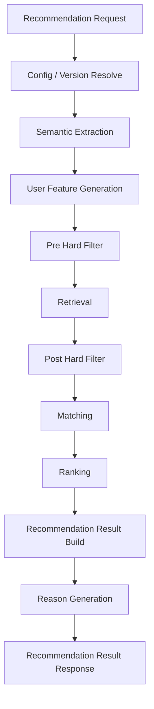
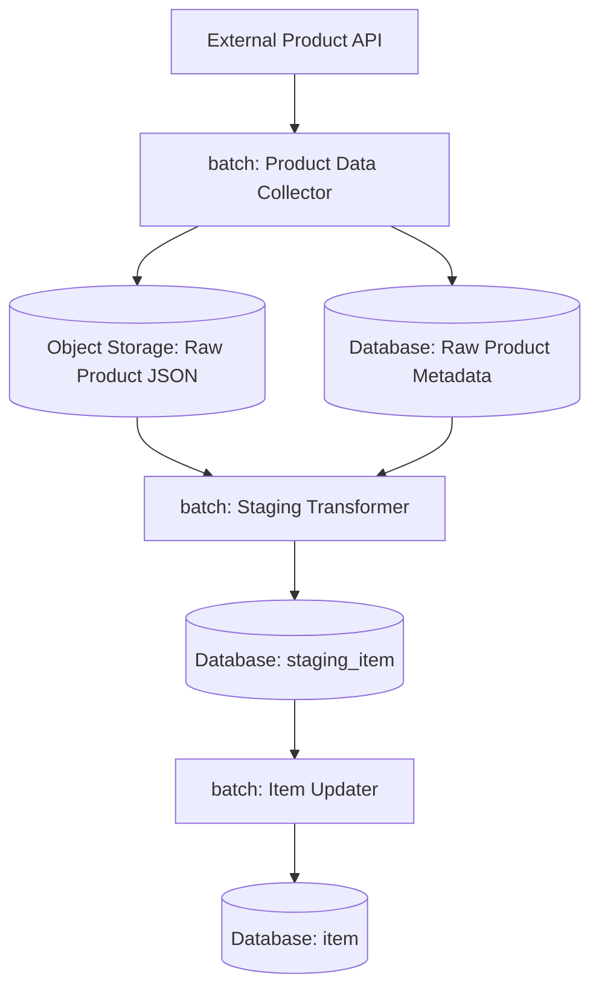
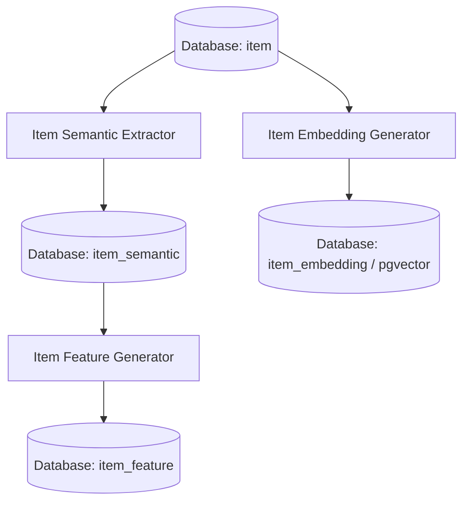

# 機能一覧

## 1. 概要

### 1.1 目的

本ドキュメントは、Gift Recommendation Service MVPにおけるアプリケーション機能を一覧化する。

本サービスは、ユーザーが入力した贈答文脈・条件をもとに、商品データ・意味特徴量・ランキングロジックを用いて、贈答意図に合う商品を推薦するサービスである。

本ドキュメントでは、以下の観点で機能を整理する。

```text
画面機能
API機能
推薦パイプライン機能
商品データ連携機能
商品意味推定機能
評価・改善機能
ログ・運用機能
```

---

### 1.2 本ドキュメントの位置づけ

| 成果物                 | 本ドキュメントとの関係                              |
| ---------------------- | --------------------------------------------------- |
| 機能要件定義書         | 本ドキュメントの上位要件                            |
| MVP対象機能一覧        | MVPで実装する機能範囲の前提                         |
| 制約・対象外一覧       | 本機能一覧に含めない範囲の前提                      |
| 処理フロー概要図       | 機能の処理順序の前提                                |
| システム論理構成図     | 機能を担当する論理コンポーネントの前提              |
| システム物理構成図     | 機能を実行する物理環境の前提                        |
| 利用技術スタック整理表 | 各機能の実装技術の前提                              |
| ドメインモデル         | 機能が扱う主要ドメイン概念の前提                    |
| モジュール一覧         | 本機能一覧を実装単位へ分解する後続成果物            |
| API一覧                | APIとして公開・呼び出しする機能を整理する後続成果物 |
| バッチ一覧             | Batchとして実行する機能を整理する後続成果物         |
| インターフェース一覧   | 機能間・外部サービス間の接続を整理する後続成果物    |

---

## 2. 基本方針

### 2.1 機能分解方針

| 方針                                    | 内容                                                                           |
| --------------------------------------- | ------------------------------------------------------------------------------ |
| ユーザー価値を起点にする                | 「意味でギフトを選べる」体験に必要な機能を中心にする                           |
| Online / Batchを分離する                | ユーザー操作に同期する機能と、事前準備・評価機能を分ける                       |
| 推薦ロジックはrecoに集約する            | Semantic / Feature / Retrieval / Matching / Ranking / Reasonをreco側に配置する |
| 商品データ取得はbatchに集約する         | 外部商品API取得、Raw保存、Staging変換、Item反映はbatch側に配置する             |
| Rawデータ本体はObject Storageに保存する | DB容量節約のため、外部APIレスポンス原本はS3/Object Storageに保存する           |
| DBは構造化データを保持する              | Request / Result / Item / Feature / Embedding / Feedback / LogをDBで管理する   |
| MVPでは過剰機能を避ける                 | 購入・決済・配送・高度パーソナライズは含めない                                 |

---

### 2.2 処理種別

| 処理種別 | 内容                                       |
| -------- | ------------------------------------------ |
| OL       | ユーザー操作に同期して実行されるOnline処理 |
| BT       | 定期実行・手動実行されるBatch処理          |
| 共通     | OL / BTの双方から利用される処理            |
| 運用     | 開発・保守・評価・監視のための処理         |

---

### 2.3 コンポーネント分類

| コンポーネント    | 役割                                                        |
| ----------------- | ----------------------------------------------------------- |
| web               | ユーザー入力・結果表示・Feedback入力                        |
| api               | API受付・Validation・DB保存・reco呼び出し                   |
| reco              | 推薦パイプライン本体                                        |
| batch             | 商品データ取得・前処理・評価実行                            |
| database          | 構造化データ・Feature・Embedding・Result・Feedback・Log保存 |
| object storage    | 外部商品APIレスポンスRawデータ保存                          |
| external services | 外部商品API・外部AI API                                     |
| devops            | GitHub / CI / Batch実行 / 自動化                            |

---

## 3. 機能分類一覧

| 機能分類             | 内容                                                 | 主担当                        |
| -------------------- | ---------------------------------------------------- | ----------------------------- |
| 画面機能             | ユーザーが操作する画面・UI機能                       | web                           |
| API機能              | webから呼び出されるAPI機能                           | api                           |
| 推薦パイプライン機能 | レコメンド結果を生成する中核機能                     | reco                          |
| 商品データ連携機能   | 外部商品データを取得・保存・変換する機能             | batch                         |
| 商品意味推定機能     | 商品のSemantic / Feature / Embeddingを生成する機能   | batch / reco                  |
| 評価・改善機能       | 推薦品質を評価し、改善材料を作る機能                 | batch / reco                  |
| マスタ・設定機能     | Relationship / Occasion / Config / Versionを扱う機能 | api / reco / database         |
| ログ・運用機能       | 実行状態、エラー、評価結果を記録・確認する機能       | api / reco / batch / database |

---

## 4. 全体機能一覧

| 機能名                      | 機能分類             | 主担当                 | 処理種別  | MVP対象 | 概要                                                                 |
| --------------------------- | -------------------- | ---------------------- | --------- | ------: | -------------------------------------------------------------------- |
| レコメンド条件入力          | 画面機能             | web                    | OL        |       ○ | ユーザーが贈答相手、用途、予算、好み、避けたい条件、NG条件を入力する |
| マスタ選択肢表示            | 画面機能             | web                    | OL        |       ○ | Relationship / Occasion等の選択肢を画面に表示する                    |
| レコメンド結果表示          | 画面機能             | web                    | OL        |       ○ | 推薦商品、価格、画像、推薦理由を表示する                             |
| フィードバック入力          | 画面機能             | web                    | OL        |       ○ | 商品・理由・結果への簡易Feedbackを入力する                           |
| レコメンド実行API           | API機能              | api                    | OL        |       ○ | webからの推薦リクエストを受け付ける                                  |
| レコメンド入力検証          | API機能              | api                    | OL        |       ○ | 入力形式、必須項目、値域、矛盾を検証する                             |
| Recommendation Request保存  | API機能              | api                    | OL        |       ○ | ユーザー入力をRecommendation Requestとして保存する                   |
| reco推薦実行依頼            | API機能              | api                    | OL        |       ○ | apiからrecoへ推薦処理を依頼する                                      |
| レコメンド結果返却          | API機能              | api                    | OL        |       ○ | recoの結果をweb向けレスポンスへ整形して返却する                      |
| Feedback登録API             | API機能              | api                    | OL        |       ○ | ユーザーFeedbackを受け付けて保存する                                 |
| マスタ取得API               | API機能              | api                    | OL        |       ○ | Relationship / Occasion等の選択肢を返却する                          |
| 推薦実行制御                | 推薦パイプライン機能 | reco                   | OL        |       ○ | 推薦パイプライン全体を制御する                                       |
| Semantic抽出                | 推薦パイプライン機能 | reco                   | OL        |       ○ | ユーザー入力からSemantic Conceptを抽出する                           |
| User Feature生成            | 推薦パイプライン機能 | reco                   | OL        |       ○ | Relationship / Occasion / Semantic ConceptからUser Featureを生成する |
| 候補商品抽出                | 推薦パイプライン機能 | reco                   | OL        |       ○ | 予算・NG条件・Embedding等を用いて候補商品を抽出する                  |
| Hard Filter                 | 推薦パイプライン機能 | reco                   | OL        |       ○ | 予算条件・NG条件に反する商品を除外する                               |
| Matching                    | 推薦パイプライン機能 | reco                   | OL        |       ○ | User FeatureとItem Featureの意味一致度を計算する                     |
| Ranking                     | 推薦パイプライン機能 | reco                   | OL        |       ○ | context_score、popularity、risk等から最終順位を決定する              |
| Recommendation Result生成   | 推薦パイプライン機能 | reco                   | OL        |       ○ | 推薦結果と推薦結果明細を生成・保存する                               |
| Reason生成                  | 推薦パイプライン機能 | reco                   | OL        |       ○ | 推薦商品ごとの推薦理由を生成する                                     |
| 商品データ取得              | 商品データ連携機能   | batch                  | BT        |       ○ | 外部商品APIから商品情報を取得する                                    |
| Raw商品データ保存           | 商品データ連携機能   | batch / object storage | BT        |       ○ | 外部APIレスポンスRaw JSONをObject Storageへ保存する                  |
| Rawメタデータ保存           | 商品データ連携機能   | batch / database       | BT        |       ○ | object key、hash、取得日時、取込状態をDBへ保存する                   |
| Staging変換                 | 商品データ連携機能   | batch                  | BT        |       ○ | Rawデータを内部取込形式へ変換する                                    |
| Item反映                    | 商品データ連携機能   | batch / database       | BT        |       ○ | stagingデータをitem正本へ反映する                                    |
| 商品有効状態更新            | 商品データ連携機能   | batch                  | BT        |       ○ | 取得状況に応じて商品を有効・無効化する                               |
| Item Semantic抽出           | 商品意味推定機能     | batch / reco           | BT        |       ○ | 商品情報からSemantic Conceptを抽出する                               |
| Item Feature生成            | 商品意味推定機能     | batch / reco           | BT        |       ○ | 商品Semanticや商品情報からItem Featureを生成する                     |
| Item Embedding生成          | 商品意味推定機能     | batch                  | BT        |       ○ | 商品検索用Embeddingを生成する                                        |
| Embedding保存               | 商品意味推定機能     | batch / database       | BT        |       ○ | item_embeddingをpgvectorで検索可能な形で保存する                     |
| Offline Evaluation実行      | 評価・改善機能       | batch / reco           | BT        |       ○ | 評価データセットに対して推薦処理を実行する                           |
| Evaluation Result保存       | 評価・改善機能       | batch / database       | BT        |       ○ | 評価結果を保存する                                                   |
| Feedback分析                | 評価・改善機能       | batch / database       | BT / 運用 |       △ | Feedbackを集計し改善材料にする                                       |
| 失敗分析                    | 評価・改善機能       | batch / database       | BT / 運用 |       △ | Retrieval / Matching / Ranking / Reasonの失敗傾向を分析する          |
| Config / Version解決        | マスタ・設定機能     | reco / database        | 共通      |       ○ | 推薦処理で使用する設定・モデルバージョンを解決する                   |
| Relationship / Occasion管理 | マスタ・設定機能     | database               | 共通      |       ○ | 関係性・用途カテゴリを管理する                                       |
| Phase Log記録               | ログ・運用機能       | api / reco / batch     | 共通      |       ○ | 推薦処理・Batch処理の段階別ログを記録する                            |
| Error Log記録               | ログ・運用機能       | api / reco / batch     | 共通      |       ○ | エラー内容を記録する                                                 |
| Raw取込状態管理             | ログ・運用機能       | batch / database       | BT        |       ○ | Rawデータの保存・取込状態を管理する                                  |
| CI実行                      | ログ・運用機能       | devops                 | 運用      |       ○ | lint / test / buildを実行する                                        |
| Batch手動・定期実行         | ログ・運用機能       | devops                 | 運用      |       ○ | GitHub ActionsでBatchを実行する                                      |

---

## 5. 画面機能

### 5.1 画面機能一覧

| 機能名             | 主担当 | 処理種別 | MVP対象 | 概要                                              |
| ------------------ | ------ | -------- | ------: | ------------------------------------------------- |
| レコメンド条件入力 | web    | OL       |       ○ | ユーザーが推薦条件を入力する                      |
| マスタ選択肢表示   | web    | OL       |       ○ | Relationship / Occasion等を選択肢として表示する   |
| レコメンド結果表示 | web    | OL       |       ○ | 推薦結果を商品カード形式で表示する                |
| 推薦理由表示       | web    | OL       |       ○ | 商品ごとの推薦理由を表示する                      |
| フィードバック入力 | web    | OL       |       ○ | 商品・理由・結果に対するFeedbackを入力する        |
| エラー表示         | web    | OL       |       ○ | 入力エラー、推薦失敗、0件時のメッセージを表示する |
| ローディング表示   | web    | OL       |       ○ | 推薦実行中の待機状態を表示する                    |

---

### 5.2 レコメンド条件入力

| 項目         | 内容                                                                                   |
| ------------ | -------------------------------------------------------------------------------------- |
| 主担当       | web                                                                                    |
| 処理種別     | OL                                                                                     |
| MVP対象      | ○                                                                                      |
| 主な入力     | relationship、occasion、budgetMin、budgetMax、preferred条件、non_preferred条件、ng条件 |
| 主な出力     | Recommendation APIへのリクエスト                                                       |
| 関連ドメイン | Recommendation Request                                                                 |

#### 入力項目

| 入力項目           | 内容                 |
| ------------------ | -------------------- |
| relationship       | 贈る相手との関係性   |
| occasion           | 贈る用途・シーン     |
| budgetMin          | 最低予算             |
| budgetMax          | 最高予算             |
| preferred_text     | 好み・重視したい条件 |
| non_preferred_text | 避けたい傾向         |
| ng_conditions      | 必ず除外したい条件   |

---

### 5.3 レコメンド結果表示

| 項目         | 内容                                                        |
| ------------ | ----------------------------------------------------------- |
| 主担当       | web                                                         |
| 処理種別     | OL                                                          |
| MVP対象      | ○                                                           |
| 主な入力     | Recommendation Result API response                          |
| 主な出力     | 推薦商品一覧画面                                            |
| 関連ドメイン | Recommendation Result / Recommendation Result Item / Reason |

#### 表示項目

| 表示項目           | 内容                                                    |
| ------------------ | ------------------------------------------------------- |
| 推薦順位           | final_scoreに基づく表示順位。例：おすすめ順1位、第1候補 |
| 商品名             | 推薦商品の名称                                          |
| 商品画像           | 商品画像URL                                             |
| 商品キャッチコピー | 商品の魅力・特徴を短く示すキャッチコピー                |
| 価格               | 表示時点の価格                                          |
| 商品URL            | 外部ECの商品ページ                                      |
| reason_badges      | 「上品」「実用的」「外しにくい」などの表示ラベル        |
| reason_summary     | 商品カード上に表示する短い推薦理由                      |
| reason_detail      | 詳細表示用の推薦理由                                    |
| reason_points      | 箇条書きの推薦理由                                      |
| caution_note       | 必要に応じた補足・注意文                                |
| 補足メッセージ     | 条件不足、Fallback利用時、空結果時などの補足            |

---

### 5.4 フィードバック入力

| 項目         | 内容                                                        |
| ------------ | ----------------------------------------------------------- |
| 主担当       | web                                                         |
| 処理種別     | OL                                                          |
| MVP対象      | ○                                                           |
| 主な入力     | item_good / item_bad / reason_good / reason_bad / comment等 |
| 主な出力     | Feedback登録APIへのリクエスト                               |
| 関連ドメイン | Recommendation Feedback                                     |

---

## 6. API機能

### 6.1 API機能一覧

| 機能名                     | 主担当 | 処理種別 | MVP対象 | 概要                                |
| -------------------------- | ------ | -------- | ------: | ----------------------------------- |
| レコメンド実行API          | api    | OL       |       ○ | 推薦リクエストを受け付ける          |
| レコメンド入力検証         | api    | OL       |       ○ | 入力値を検証する                    |
| Recommendation Request保存 | api    | OL       |       ○ | 入力条件をDBへ保存する              |
| reco推薦実行依頼           | api    | OL       |       ○ | 推薦処理をrecoへ依頼する            |
| レコメンド結果返却         | api    | OL       |       ○ | web向けレスポンスを返却する         |
| Feedback登録API            | api    | OL       |       ○ | Feedbackを受け付けて保存する        |
| マスタ取得API              | api    | OL       |       ○ | Relationship / Occasion等を返却する |
| APIエラーハンドリング      | api    | OL       |       ○ | エラー形式を統一する                |

---

### 6.2 レコメンド実行API

| 項目               | 内容                        |
| ------------------ | --------------------------- |
| 主担当             | api                         |
| 処理種別           | OL                          |
| MVP対象            | ○                           |
| 想定IF             | `POST /recommendations`     |
| 主な入力           | Recommendation Request      |
| 主な出力           | Recommendation Result       |
| 関連コンポーネント | web / api / reco / database |

#### 主な処理

```text
webからリクエスト受信
↓
入力検証
↓
Recommendation Request保存
↓
recoへ推薦実行依頼
↓
Recommendation Result受信
↓
web向けレスポンス返却
```

---

### 6.3 Feedback登録API

| 項目               | 内容                                         |
| ------------------ | -------------------------------------------- |
| 主担当             | api                                          |
| 処理種別           | OL                                           |
| MVP対象            | ○                                            |
| 想定IF             | `POST /recommendations/{result_id}/feedback` |
| 主な入力           | Recommendation Feedback                      |
| 主な出力           | Feedback登録結果                             |
| 関連コンポーネント | web / api / database                         |

---

### 6.4 マスタ取得API

| 項目               | 内容                                                      |
| ------------------ | --------------------------------------------------------- |
| 主担当             | api                                                       |
| 処理種別           | OL                                                        |
| MVP対象            | ○                                                         |
| 想定IF             | `GET /masters/relationships`, `GET /masters/occasions` 等 |
| 主な入力           | マスタ種別                                                |
| 主な出力           | 選択肢一覧                                                |
| 関連コンポーネント | web / api / database                                      |

---

## 7. 推薦パイプライン機能

### 7.1 推薦パイプライン機能一覧

| 機能名                    | 主担当 | 処理種別 | MVP対象 | 概要                                                                         |
| ------------------------- | ------ | -------- | ------: | ---------------------------------------------------------------------------- |
| 推薦実行制御              | reco   | OL       |       ○ | 推薦パイプライン全体を制御する                                               |
| Config / Version解決      | reco   | OL       |       ○ | 使用する設定・モデルバージョンを決定する                                     |
| Semantic抽出              | reco   | OL       |       ○ | ユーザー入力から意味概念を抽出する                                           |
| User Feature生成          | reco   | OL       |       ○ | ユーザー意図をFeatureへ変換する                                              |
| Pre Hard Filter           | reco   | OL       |       ○ | 予算、商品有効状態、明確なNG条件等でRetrieval対象の商品集合を事前に絞り込む  |
| 候補商品抽出              | reco   | OL       |       ○ | Pre Hard Filter後の商品集合からEmbedding類似度等で候補商品を抽出する         |
| Post Hard Filter          | reco   | OL       |       ○ | Retrieval後の候補に対して、Semantic NG、データ不整合、最終除外条件を確認する |
| Matching                  | reco   | OL       |       ○ | User FeatureとItem Featureの一致度を計算する                                 |
| Ranking                   | reco   | OL       |       ○ | 最終順位を決める                                                             |
| Recommendation Result生成 | reco   | OL       |       ○ | 推薦結果を構造化して保存する                                                 |
| Reason生成                | reco   | OL       |       ○ | 商品ごとの推薦理由を生成する                                                 |

---

### 7.2 推薦パイプライン全体



---

### 7.3 Semantic抽出

| 項目     | 内容                                                          |
| -------- | ------------------------------------------------------------- |
| 主担当   | reco                                                          |
| 処理種別 | OL                                                            |
| MVP対象  | ○                                                             |
| 主な入力 | preferred_text / non_preferred_text / relationship / occasion |
| 主な出力 | semantic_extraction_result                                    |
| 関連定義 | Semantic Concept定義書 / Semanticルール定義書                 |

---

### 7.4 User Feature生成

| 項目     | 内容                                                           |
| -------- | -------------------------------------------------------------- |
| 主担当   | reco                                                           |
| 処理種別 | OL                                                             |
| MVP対象  | ○                                                              |
| 主な入力 | relationship / occasion / semantic_extraction_result           |
| 主な出力 | user_feature                                                   |
| 関連定義 | Feature定義書 / Featureルール定義書 / Gift Meaning Space定義書 |

#### 対象Feature

| 軸       | Feature               |
| -------- | --------------------- |
| Social   | formality             |
| Social   | safety                |
| Social   | brand_appropriateness |
| Symbolic | emotion               |
| Symbolic | novelty               |
| Symbolic | intimacy              |
| Symbolic | symbolic_identity     |
| Symbolic | story_richness        |

---

### 7.5 Pre Hard Filter

| 項目     | 内容                                                                |
| -------- | ------------------------------------------------------------------- |
| 主担当   | reco                                                                |
| 処理種別 | OL                                                                  |
| MVP対象  | ○                                                                   |
| 主な入力 | Recommendation Request / budget条件 / ng条件 / item / item metadata |
| 主な出力 | pre_filtered_item_pool                                              |
| 関連定義 | Recommendation Request定義書 / Retrieval定義書                      |

#### 主な処理

```text
予算条件による絞り込み
商品有効状態による絞り込み
販売状態による絞り込み
明確なNGカテゴリの除外
明確なNGキーワードの除外
データ品質最低条件による除外
```

---

### 7.6 Retrieval

| 項目     | 内容                                                                            |
| -------- | ------------------------------------------------------------------------------- |
| 主担当   | reco                                                                            |
| 処理種別 | OL                                                                              |
| MVP対象  | ○                                                                               |
| 主な入力 | pre_filtered_item_pool / Recommendation Request / user_feature / item_embedding |
| 主な出力 | retrieval_candidate                                                             |
| 関連定義 | Retrieval定義書                                                                 |

#### 主な処理

```text
Embedding検索
キーワード検索
Hybrid検索
candidate取得
```

Retrievalは、Pre Hard Filterを通過した商品集合に対して、ユーザー意図に近い候補商品を取得する処理である。  
全商品から取得するのではなく、条件を満たす商品集合の中から候補を抽出する。

---

### 7.7 Post Hard Filter

| 項目     | 内容                                                                                      |
| -------- | ----------------------------------------------------------------------------------------- |
| 主担当   | reco                                                                                      |
| 処理種別 | OL                                                                                        |
| MVP対象  | ○                                                                                         |
| 主な入力 | retrieval_candidate / Recommendation Request / semantic_extraction_result / item_semantic |
| 主な出力 | validated_retrieval_candidate / excluded_candidate_log                                    |
| 関連定義 | Retrieval定義書 / Semanticルール定義書 / Recommendation Request定義書                     |

#### 主な処理

```text
Semantic NG確認
avoid類似確認
重複・不整合確認
最終表示前Validation
```

Post Hard Filterは、Retrieval後の候補商品に対して、最終的な除外条件・安全確認を行う処理である。  
Pre Hard Filterでは判定しきれないSemantic NG、avoid条件との近さ、データ不整合、重複候補などを確認する。

---

### 7.8 Matching

| 項目     | 内容                                                        |
| -------- | ----------------------------------------------------------- |
| 主担当   | reco                                                        |
| 処理種別 | OL                                                          |
| MVP対象  | ○                                                           |
| 主な入力 | user_feature / item_feature / validated_retrieval_candidate |
| 主な出力 | matching_result / context_score                             |
| 関連定義 | Matching定義書                                              |

---

### 7.9 Ranking

| 項目     | 内容                                                              |
| -------- | ----------------------------------------------------------------- |
| 主担当   | reco                                                              |
| 処理種別 | OL                                                                |
| MVP対象  | ○                                                                 |
| 主な入力 | matching_result / popularity_score / risk_penalty / diversity情報 |
| 主な出力 | ranking_result / final_score / rank                               |
| 関連定義 | Ranking定義書                                                     |

---

### 7.10 Recommendation Result生成

| 項目     | 内容                                               |
| -------- | -------------------------------------------------- |
| 主担当   | reco                                               |
| 処理種別 | OL                                                 |
| MVP対象  | ○                                                  |
| 主な入力 | ranking_result / item snapshot / score_breakdown   |
| 主な出力 | recommendation_result / recommendation_result_item |
| 関連定義 | Recommendation Result定義書                        |

---

### 7.11 Reason生成

| 項目     | 内容                                                    |
| -------- | ------------------------------------------------------- |
| 主担当   | reco                                                    |
| 処理種別 | OL                                                      |
| MVP対象  | ○                                                       |
| 主な入力 | result_item / score_breakdown / relationship / occasion |
| 主な出力 | recommendation_reason                                   |
| 関連定義 | Reason生成定義書                                        |

---

## 8. 商品データ連携機能

### 8.1 商品データ連携機能一覧

| 機能名            | 主担当                 | 処理種別 | MVP対象 | 概要                                           |
| ----------------- | ---------------------- | -------- | ------: | ---------------------------------------------- |
| 商品データ取得    | batch                  | BT       |       ○ | 外部商品APIから商品情報を取得する              |
| Raw商品データ保存 | batch / object storage | BT       |       ○ | 外部APIレスポンスRaw JSONを保存する            |
| Rawメタデータ保存 | batch / database       | BT       |       ○ | object key、hash、取得日時、取込状態を保存する |
| Rawデータ読取     | batch / object storage | BT       |       ○ | Staging変換用にRawデータを読み取る             |
| Staging変換       | batch                  | BT       |       ○ | 外部形式を内部形式へ変換する                   |
| Item反映          | batch / database       | BT       |       ○ | 内部商品正本へ反映する                         |
| 商品有効状態更新  | batch / database       | BT       |       ○ | 商品のactive状態を更新する                     |

---

### 8.2 商品データ取得・保存フロー



---

### 8.3 Raw商品データ保存

| 項目     | 内容                      |
| -------- | ------------------------- |
| 主担当   | batch / object storage    |
| 処理種別 | BT                        |
| MVP対象  | ○                         |
| 主な入力 | 外部商品APIレスポンスJSON |
| 主な出力 | Raw JSON object           |
| 保存先   | S3 / S3互換Object Storage |

#### 保存方針

```text
Raw JSON本体
= Object Storage

Raw Metadata
= Database
```

---

### 8.4 Rawメタデータ保存

| 項目     | 内容                                                        |
| -------- | ----------------------------------------------------------- |
| 主担当   | batch / database                                            |
| 処理種別 | BT                                                          |
| MVP対象  | ○                                                           |
| 主な入力 | object key / hash / fetched_at / source_api / import_status |
| 主な出力 | raw_product_metadata                                        |
| 保存先   | PostgreSQL                                                  |

---

### 8.5 Staging変換

| 項目     | 内容                                        |
| -------- | ------------------------------------------- |
| 主担当   | batch                                       |
| 処理種別 | BT                                          |
| MVP対象  | ○                                           |
| 主な入力 | Raw JSON / raw_product_metadata             |
| 主な出力 | staging_item                                |
| 目的     | 外部API依存のデータ形式を内部形式へ変換する |

---

### 8.6 Item反映

| 項目     | 内容                                           |
| -------- | ---------------------------------------------- |
| 主担当   | batch / database                               |
| 処理種別 | BT                                             |
| MVP対象  | ○                                              |
| 主な入力 | staging_item                                   |
| 主な出力 | item / item_price / item_category / item_tag等 |
| 目的     | Online推薦で利用できる商品正本を作成する       |

---

## 9. 商品意味推定機能

### 9.1 商品意味推定機能一覧

| 機能名             | 主担当           | 処理種別 | MVP対象 | 概要                                   |
| ------------------ | ---------------- | -------- | ------: | -------------------------------------- |
| Item Semantic抽出  | batch / reco     | BT       |       ○ | 商品情報からSemantic Conceptを抽出する |
| Item Feature生成   | batch / reco     | BT       |       ○ | 商品の意味特徴量を生成する             |
| Item Embedding生成 | batch            | BT       |       ○ | 商品検索用Embeddingを生成する          |
| Embedding保存      | batch / database | BT       |       ○ | item_embeddingをpgvectorへ保存する     |
| 正規化統計量管理   | batch / database | BT       |       △ | Feature正規化に使う統計量を管理する    |

---

### 9.2 商品意味推定フロー



---

### 9.3 Item Semantic抽出

| 項目     | 内容                                             |
| -------- | ------------------------------------------------ |
| 主担当   | batch / reco                                     |
| 処理種別 | BT                                               |
| MVP対象  | ○                                                |
| 主な入力 | 商品名、キャッチコピー、商品説明、ジャンル、タグ |
| 主な出力 | item_semantic                                    |
| 関連定義 | Semantic Concept定義書 / Semanticルール定義書    |

---

### 9.4 Item Feature生成

| 項目     | 内容                                |
| -------- | ----------------------------------- |
| 主担当   | batch / reco                        |
| 処理種別 | BT                                  |
| MVP対象  | ○                                   |
| 主な入力 | item_semantic / item metadata       |
| 主な出力 | item_feature                        |
| 関連定義 | Feature定義書 / Featureルール定義書 |

---

### 9.5 Item Embedding生成

| 項目     | 内容                                     |
| -------- | ---------------------------------------- |
| 主担当   | batch                                    |
| 処理種別 | BT                                       |
| MVP対象  | ○                                        |
| 主な入力 | 商品名、説明、ジャンル、タグ等のテキスト |
| 主な出力 | item_embedding                           |
| 保存先   | PostgreSQL / pgvector                    |
| 用途     | Retrievalでの類似商品検索                |

---

## 10. 評価・改善機能

### 10.1 評価・改善機能一覧

| 機能名                 | 主担当           | 処理種別  | MVP対象 | 概要                                       |
| ---------------------- | ---------------- | --------- | ------: | ------------------------------------------ |
| Offline Evaluation実行 | batch / reco     | BT        |       ○ | 評価データセットに対して推薦処理を実行する |
| Evaluation Result保存  | batch / database | BT        |       ○ | 評価結果をDBへ保存する                     |
| Feedback分析           | batch / database | BT / 運用 |       △ | ユーザーFeedbackを集計・分析する           |
| 失敗分析               | batch / database | BT / 運用 |       △ | 推薦失敗の原因を分類する                   |
| 改善Backlog化          | human / devops   | 運用      |       △ | 分析結果を改善Issueへ接続する              |

---

### 10.2 Offline Evaluation実行

| 項目     | 内容                 |
| -------- | -------------------- |
| 主担当   | batch / reco         |
| 処理種別 | BT                   |
| MVP対象  | ○                    |
| 主な入力 | evaluation_dataset   |
| 主な出力 | evaluation_result    |
| 関連定義 | Evaluation評価定義書 |

---

### 10.3 Feedback分析

| 項目     | 内容                                                              |
| -------- | ----------------------------------------------------------------- |
| 主担当   | batch / database                                                  |
| 処理種別 | BT / 運用                                                         |
| MVP対象  | △                                                                 |
| 主な入力 | recommendation_feedback / recommendation_result / score_breakdown |
| 主な出力 | 改善対象候補                                                      |
| 目的     | Matching / Ranking / Reason / Filter改善につなげる                |

---

### 10.4 失敗分析

| 失敗分類             | 主な対象                   |
| -------------------- | -------------------------- |
| retrieval_failure    | 候補商品抽出               |
| matching_failure     | 意味一致計算               |
| ranking_failure      | 最終順位                   |
| reason_failure       | 推薦理由                   |
| filter_failure       | NG条件・Hard Filter        |
| avoid_failure        | 避けたい条件・risk_penalty |
| data_quality_failure | 商品データ品質             |

---

## 11. マスタ・設定機能

### 11.1 マスタ・設定機能一覧

| 機能名              | 主担当          | 処理種別 | MVP対象 | 概要                                                |
| ------------------- | --------------- | -------- | ------: | --------------------------------------------------- |
| Relationship管理    | database / api  | 共通     |       ○ | 贈る相手との関係性カテゴリを管理する                |
| Occasion管理        | database / api  | 共通     |       ○ | 贈答用途カテゴリを管理する                          |
| Semantic Config管理 | database / reco | 共通     |       ○ | Semantic / Feature / Ruleの利用バージョンを管理する |
| Model Version管理   | database / reco | 共通     |       ○ | AIモデル・Embeddingモデルのバージョンを管理する     |
| Ranking Config管理  | database / reco | 共通     |       △ | Rankingパラメータのバージョンを管理する             |
| Reason Template管理 | database / reco | 共通     |       △ | 推薦理由テンプレートのバージョンを管理する          |

---

### 11.2 Config / Version解決

| 項目     | 内容                                            |
| -------- | ----------------------------------------------- |
| 主担当   | reco / database                                 |
| 処理種別 | 共通                                            |
| MVP対象  | ○                                               |
| 主な入力 | mode / current config指定                       |
| 主な出力 | semantic_config_version_id / model_version_id等 |
| 目的     | 推薦結果の再現性を確保する                      |

---

## 12. ログ・運用機能

### 12.1 ログ・運用機能一覧

| 機能名                 | 主担当             | 処理種別 | MVP対象 | 概要                               |
| ---------------------- | ------------------ | -------- | ------: | ---------------------------------- |
| Recommendation Run記録 | reco / database    | OL       |       ○ | 推薦実行単位を記録する             |
| Phase Log記録          | api / reco / batch | 共通     |       ○ | 各処理段階の状態を記録する         |
| Error Log記録          | api / reco / batch | 共通     |       ○ | エラー内容を記録する               |
| Raw取込状態管理        | batch / database   | BT       |       ○ | Raw保存・取込状態を管理する        |
| Batch実行ログ記録      | batch / devops     | BT       |       ○ | Batch開始・終了・失敗を記録する    |
| CI実行                 | devops             | 運用     |       ○ | lint / test / buildを実行する      |
| Batch手動実行          | devops             | 運用     |       ○ | workflow_dispatchでBatchを実行する |
| Batch定期実行          | devops             | 運用     |       ○ | cronで商品データ更新等を実行する   |

---

### 12.2 Recommendation Run記録

| 項目     | 内容                                           |
| -------- | ---------------------------------------------- |
| 主担当   | reco / database                                |
| 処理種別 | OL                                             |
| MVP対象  | ○                                              |
| 主な入力 | recommendation_request_id / mode / version情報 |
| 主な出力 | recommendation_run                             |
| 目的     | 推薦実行の再現・追跡を可能にする               |

---

### 12.3 Phase Log記録

| 項目     | 内容                                                |
| -------- | --------------------------------------------------- |
| 主担当   | api / reco / batch                                  |
| 処理種別 | 共通                                                |
| MVP対象  | ○                                                   |
| 主な入力 | phase_name / status / started_at / ended_at / error |
| 主な出力 | phase_log                                           |
| 目的     | 処理段階別の成功・失敗を追跡する                    |

---

### 12.4 Raw取込状態管理

| 項目     | 内容                                           |
| -------- | ---------------------------------------------- |
| 主担当   | batch / database                               |
| 処理種別 | BT                                             |
| MVP対象  | ○                                              |
| 主な入力 | object key / content hash / import status      |
| 主な出力 | raw_product_metadata                           |
| 目的     | Rawデータ保存・Staging変換・Item反映を追跡する |

---

## 13. コンポーネント別機能一覧

### 13.1 web

| 機能名             | 処理種別 | MVP対象 |
| ------------------ | -------- | ------: |
| レコメンド条件入力 | OL       |       ○ |
| マスタ選択肢表示   | OL       |       ○ |
| レコメンド結果表示 | OL       |       ○ |
| 推薦理由表示       | OL       |       ○ |
| フィードバック入力 | OL       |       ○ |
| エラー表示         | OL       |       ○ |
| ローディング表示   | OL       |       ○ |

---

### 13.2 api

| 機能名                     | 処理種別 | MVP対象 |
| -------------------------- | -------- | ------: |
| レコメンド実行API          | OL       |       ○ |
| レコメンド入力検証         | OL       |       ○ |
| Recommendation Request保存 | OL       |       ○ |
| reco推薦実行依頼           | OL       |       ○ |
| レコメンド結果返却         | OL       |       ○ |
| Feedback登録API            | OL       |       ○ |
| マスタ取得API              | OL       |       ○ |
| APIエラーハンドリング      | OL       |       ○ |

---

### 13.3 reco

| 機能名                    | 処理種別 | MVP対象 |
| ------------------------- | -------- | ------: |
| 推薦実行制御              | OL       |       ○ |
| Config / Version解決      | 共通     |       ○ |
| Semantic抽出              | OL       |       ○ |
| User Feature生成          | OL       |       ○ |
| Pre Hard Filter           | OL       |       ○ |
| 候補商品抽出              | OL       |       ○ |
| Post Hard Filter          | OL       |       ○ |
| Matching                  | OL       |       ○ |
| Ranking                   | OL       |       ○ |
| Recommendation Result生成 | OL       |       ○ |
| Reason生成                | OL       |       ○ |
| Item Semantic抽出支援     | BT       |       ○ |
| Item Feature生成支援      | BT       |       ○ |
| Offline Evaluation支援    | BT       |       ○ |
| Phase Log記録             | 共通     |       ○ |

---

### 13.4 batch

| 機能名                 | 処理種別 | MVP対象 |
| ---------------------- | -------- | ------: |
| 商品データ取得         | BT       |       ○ |
| Raw商品データ保存      | BT       |       ○ |
| Rawメタデータ保存      | BT       |       ○ |
| Rawデータ読取          | BT       |       ○ |
| Staging変換            | BT       |       ○ |
| Item反映               | BT       |       ○ |
| 商品有効状態更新       | BT       |       ○ |
| Item Semantic抽出      | BT       |       ○ |
| Item Feature生成       | BT       |       ○ |
| Item Embedding生成     | BT       |       ○ |
| Embedding保存          | BT       |       ○ |
| Offline Evaluation実行 | BT       |       ○ |
| Evaluation Result保存  | BT       |       ○ |
| Batch実行ログ記録      | BT       |       ○ |

---

### 13.5 database / object storage

| 機能名                          | 主担当         | 処理種別 | MVP対象 |
| ------------------------------- | -------------- | -------- | ------: |
| Request / Result / Feedback保存 | database       | 共通     |       ○ |
| Item / Feature / Embedding保存  | database       | 共通     |       ○ |
| Raw Metadata管理                | database       | BT       |       ○ |
| Raw JSON本体保存                | object storage | BT       |       ○ |
| Evaluation Dataset / Result保存 | database       | BT       |       ○ |
| Log保存                         | database       | 共通     |       ○ |

---

### 13.6 devops

| 機能名                  | 処理種別 | MVP対象 |
| ----------------------- | -------- | ------: |
| CI実行                  | 運用     |       ○ |
| Batch手動実行           | 運用     |       ○ |
| Batch定期実行           | 運用     |       ○ |
| Issue / Branch / PR運用 | 運用     |       ○ |
| GitHub Projects管理     | 運用     |       ○ |
| Secrets管理             | 運用     |       ○ |

---

## 14. 主要データとの対応

| 機能                      | 主なデータ                                         |
| ------------------------- | -------------------------------------------------- |
| レコメンド条件入力        | Recommendation Request                             |
| レコメンド実行API         | Recommendation Request / Recommendation Run        |
| Semantic抽出              | semantic_extraction_result                         |
| User Feature生成          | user_feature                                       |
| 候補商品抽出              | validated_retrieval_candidate / item_embedding     |
| Matching                  | matching_result / item_feature                     |
| Ranking                   | ranking_result / final_score                       |
| Recommendation Result生成 | recommendation_result / recommendation_result_item |
| Reason生成                | recommendation_reason                              |
| Feedback登録              | recommendation_feedback                            |
| 商品データ取得            | raw_product_data                                   |
| Rawメタデータ保存         | raw_product_metadata                               |
| Staging変換               | staging_item                                       |
| Item反映                  | item                                               |
| Item Feature生成          | item_feature                                       |
| Item Embedding生成        | item_embedding                                     |
| Offline Evaluation        | evaluation_dataset / evaluation_result             |
| Phase Log記録             | phase_log                                          |
| Error Log記録             | error_log                                          |

---

## 15. MVP対象範囲

### 15.1 MVPで必須の機能

| 分類         | 必須機能                                                                 |
| ------------ | ------------------------------------------------------------------------ |
| 画面         | レコメンド条件入力、結果表示、Feedback入力                               |
| API          | レコメンド実行API、Feedback登録API、マスタ取得API                        |
| 推薦         | Semantic抽出、User Feature生成、Retrieval、Matching、Ranking、Reason生成 |
| 商品         | 商品データ取得、Raw保存、Staging変換、Item反映                           |
| 商品意味推定 | Item Semantic抽出、Item Feature生成、Item Embedding生成                  |
| 評価         | Offline Evaluation、Evaluation Result保存                                |
| ログ         | Run記録、Phase Log、Error Log、Raw Metadata管理                          |
| 運用         | CI、Batch実行、GitHub Projects管理                                       |

---

### 15.2 MVPでは最小限にする機能

| 機能                | 方針                             |
| ------------------- | -------------------------------- |
| Feedback分析        | 初期は手動・簡易集計中心         |
| 失敗分析            | 初期はログ・評価結果から手動確認 |
| Ranking Config管理  | 初期は固定設定でも可             |
| Reason Template管理 | 初期は少数テンプレートで可       |
| 正規化統計量管理    | Feature正規化に必要な範囲で実施  |
| Observability       | 高度監視基盤ではなくDBログ中心   |

---

## 16. 後続成果物への引き継ぎ

### 16.1 モジュール一覧への引き継ぎ

モジュール一覧では、本機能一覧を以下の実装単位へ分解する。

| 機能分類       | モジュール化対象                                                             |
| -------------- | ---------------------------------------------------------------------------- |
| 画面機能       | page / component / form / api client                                         |
| API機能        | controller / validator / service / repository / client                       |
| 推薦機能       | orchestrator / extractor / generator / retriever / matcher / ranker / reason |
| 商品データ連携 | collector / raw writer / metadata writer / transformer / updater             |
| 商品意味推定   | semantic extractor / feature generator / embedding generator                 |
| 評価機能       | eval runner / evaluator / analyzer                                           |
| ログ機能       | logger / phase log writer / error handler                                    |

---

### 16.2 API一覧への引き継ぎ

API一覧では、以下の機能をAPIとして整理する。

| API対象機能    | 想定API                                                |
| -------------- | ------------------------------------------------------ |
| レコメンド実行 | `POST /recommendations`                                |
| Feedback登録   | `POST /recommendations/{result_id}/feedback`           |
| マスタ取得     | `GET /masters/relationships`, `GET /masters/occasions` |
| reco推薦実行   | api → reco内部API                                      |
| Evaluation実行 | batch → reco内部API                                    |

---

### 16.3 バッチ一覧への引き継ぎ

バッチ一覧では、以下の機能をBatchとして整理する。

| Batch対象機能            | 内容                             |
| ------------------------ | -------------------------------- |
| 商品データ取得Batch      | 外部商品APIから商品データを取得  |
| Raw保存Batch             | Raw JSONをObject Storageへ保存   |
| Staging変換Batch         | Rawからstagingへ変換             |
| Item反映Batch            | stagingからitem正本へ反映        |
| Item Semantic生成Batch   | 商品Semanticを抽出               |
| Item Feature生成Batch    | item_featureを生成               |
| Item Embedding生成Batch  | item_embeddingを生成             |
| Offline Evaluation Batch | 評価データセットで推薦品質を評価 |

---

### 16.4 インターフェース一覧への引き継ぎ

インターフェース一覧では、以下の接続を整理する。

| 接続                           | 関連機能                                 |
| ------------------------------ | ---------------------------------------- |
| web → api                      | レコメンド実行、Feedback登録、マスタ取得 |
| api → reco                     | 推薦実行依頼                             |
| api / reco / batch → database  | 各種DB保存・取得                         |
| batch → external product api   | 商品データ取得                           |
| batch → object storage         | Raw保存・読取                            |
| reco / batch → external ai api | Semantic / Embedding / Reason生成        |
| GitHub Actions → batch         | Batch実行                                |

---

## 17. レビュー観点

| 観点             | 確認内容                                                                 |
| ---------------- | ------------------------------------------------------------------------ |
| 機能要件との整合 | 機能要件定義書で定義した要件が機能として表現されているか                 |
| MVP範囲との整合  | MVP対象機能一覧と矛盾していないか                                        |
| 対象外との整合   | 決済・配送・高度パーソナライズ等が混入していないか                       |
| 論理構成との整合 | web / api / reco / batch / database / object storageの責務に合っているか |
| 物理構成との整合 | 各機能が実行環境に配置できるか                                           |
| OL/BT分離        | Online処理とBatch処理が混在していないか                                  |
| 商品データ連携   | 商品取得、Raw保存、Staging、Item反映が漏れていないか                     |
| 商品意味推定     | Item Semantic、Item Feature、Embedding生成が漏れていないか               |
| 評価改善         | Feedback、Evaluation、失敗分析への接続があるか                           |
| 後続設計接続     | モジュール一覧、API一覧、バッチ一覧へ展開できるか                        |

---

## 18. まとめ

本サービスのMVP機能は、以下の流れを成立させるために定義する。

```text
ユーザーが贈答条件を入力する
↓
入力条件をRecommendation Requestとして保存する
↓
Semantic / Featureへ変換する
↓
商品候補を抽出する
↓
意味一致度を計算する
↓
Rankingする
↓
Recommendation Resultを生成する
↓
Reasonを付与して表示する
↓
Feedbackを受け取る
↓
Evaluation / 改善へ接続する
```

また、商品データは以下の流れで事前準備する。

```text
外部商品APIから商品データを取得する
↓
Raw JSONをObject Storageへ保存する
↓
Raw MetadataをDBへ保存する
↓
Stagingへ変換する
↓
Item正本へ反映する
↓
Item Semantic / Feature / Embeddingを生成する
↓
Online推薦で利用する
```

この機能一覧をもとに、次工程では `モジュール一覧` を作成し、各機能を実装単位へ分解する。
