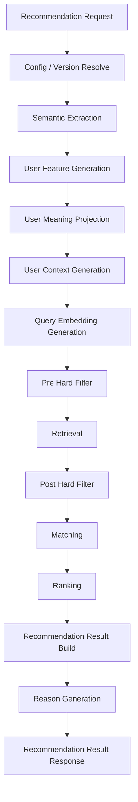
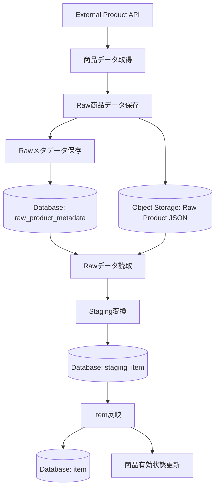
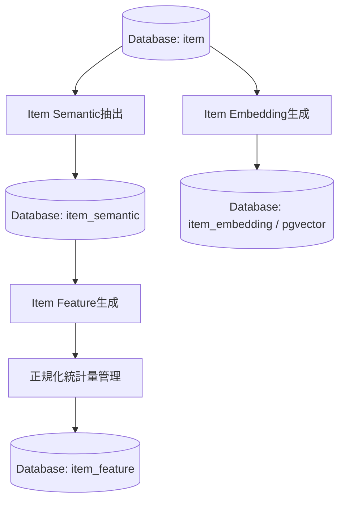

# 機能一覧

## 1. 概要

### 1.1 目的

本ドキュメントは、Gift Recommendation Service MVPにおけるアプリケーション機能を一覧化する。

本サービスは、ユーザーが入力した贈答文脈・条件をもとに、商品データ・意味特徴量・ランキングロジックを用いて、贈答意図に合う商品を推薦するサービスである。

本ドキュメントでは、以下の観点で機能を整理する。

```text
画面機能
API機能
推薦パイプライン機能
商品データ連携機能
商品意味推定機能
評価・改善機能
マスタ・設定機能
ログ・運用機能
```

---

### 1.2 本ドキュメントの位置づけ

| 成果物                 | 本ドキュメントとの関係                              |
| ---------------------- | --------------------------------------------------- |
| 機能要件定義書         | 本ドキュメントの上位要件                            |
| MVP対象機能一覧        | MVPで実装する機能範囲の前提                         |
| 制約・対象外一覧       | 本機能一覧に含めない範囲の前提                      |
| 処理フロー概要図       | 機能の処理順序の前提                                |
| 処理構成定義書         | Online / Batch分離、処理順序、保存タイミングの前提  |
| システム論理構成図     | 機能を担当する論理コンポーネントの前提              |
| システム物理構成図     | 機能を実行する物理環境の前提                        |
| 利用技術スタック整理表 | 各機能の実装技術の前提                              |
| ドメインモデル         | 機能が扱う主要ドメイン概念の前提                    |
| モジュール一覧         | 本機能一覧を実装単位へ分解する後続成果物            |
| 機能×モジュール対応表  | 機能と実装モジュールの対応関係を整理する後続成果物  |
| API一覧                | APIとして公開・呼び出しする機能を整理する後続成果物 |
| バッチ一覧             | Batchとして実行する機能を整理する後続成果物         |
| インターフェース一覧   | 機能間・外部サービス間の接続を整理する後続成果物    |

---

## 2. 基本方針

### 2.1 機能分解方針

| 方針                                    | 内容                                                                               |
| --------------------------------------- | ---------------------------------------------------------------------------------- |
| ユーザー価値を起点にする                | 「意味でギフトを選べる」体験に必要な機能を中心にする                               |
| Online / Batchを分離する                | ユーザー操作に同期する機能と、事前準備・評価機能を分ける                           |
| 推薦ロジックはrecoに集約する            | Semantic / Feature / Retrieval / Matching / Ranking / Reasonをreco側に配置する     |
| 商品データ取得はbatchに集約する         | 外部商品API取得、Raw保存、Staging変換、Item反映はbatch側に配置する                 |
| Rawデータ本体はObject Storageに保存する | DB容量節約のため、外部APIレスポンス原本はS3 / Object Storageに保存する             |
| DBは構造化データを保持する              | Request / Run / Result / Item / Feature / Embedding / Feedback / LogをDBで管理する |
| Hard Filterは2段階に分ける              | Retrieval前のPre Hard Filterと、Retrieval後のPost Hard Filterを分離する            |
| MVPでは過剰機能を避ける                 | 購入・決済・配送・高度パーソナライズは含めない                                     |
| 後続成果物と名称を揃える                | モジュール一覧・機能×モジュール対応表と機能名の粒度・名称を整合させる              |

---

### 2.2 処理種別

| 処理種別 | 内容                                       |
| -------- | ------------------------------------------ |
| OL       | ユーザー操作に同期して実行されるOnline処理 |
| BT       | 定期実行・手動実行されるBatch処理          |
| 共通     | OL / BTの双方から利用される処理            |
| 運用     | 開発・保守・評価・監視のための処理         |

---

### 2.3 MVP対象区分

| 区分 | 意味                                                    |
| ---- | ------------------------------------------------------- |
| ○    | MVPで実装対象とする                                     |
| △    | MVPでは簡易実装、任意実装、または後続フェーズ優先とする |
| ×    | MVP対象外とする                                         |

---

### 2.4 コンポーネント分類

| コンポーネント    | 役割                                                        |
| ----------------- | ----------------------------------------------------------- |
| web               | ユーザー入力・結果表示・Feedback入力                        |
| api               | API受付・Validation・DB保存・reco呼び出し                   |
| reco              | 推薦パイプライン本体                                        |
| batch             | 商品データ取得・前処理・商品意味推定・評価実行              |
| database          | 構造化データ・Feature・Embedding・Result・Feedback・Log保存 |
| object storage    | 外部商品APIレスポンスRaw JSON本体の保存                     |
| external services | 外部商品API・外部AI API                                     |
| devops            | GitHub / CI / Batch実行 / 自動化                            |

---

## 3. 機能分類一覧

| 機能分類             | 内容                                                 | 主担当                                 |
| -------------------- | ---------------------------------------------------- | -------------------------------------- |
| 画面機能             | ユーザーが操作する画面・UI機能                       | web                                    |
| API機能              | webから呼び出されるAPI機能                           | api                                    |
| 推薦パイプライン機能 | レコメンド結果を生成する中核機能                     | reco                                   |
| 商品データ連携機能   | 外部商品データを取得・保存・変換する機能             | batch                                  |
| 商品意味推定機能     | 商品のSemantic / Feature / Embeddingを生成する機能   | batch / reco                           |
| 評価・改善機能       | 推薦品質を評価し、改善材料を作る機能                 | batch / reco                           |
| マスタ・設定機能     | Relationship / Occasion / Config / Versionを扱う機能 | api / reco / database                  |
| ログ・運用機能       | 実行状態、エラー、評価結果を記録・確認する機能       | api / reco / batch / database / devops |

---

## 4. 全体機能一覧

| 機能名                     | 機能分類             | 主担当                        | 処理種別  | MVP対象 | 概要                                                                                    |
| -------------------------- | -------------------- | ----------------------------- | --------- | ------: | --------------------------------------------------------------------------------------- |
| トップ画面表示             | 画面機能             | web                           | OL        |       ○ | サービス入口、レコメンド条件入力への導線を表示する                                      |
| レコメンド条件入力         | 画面機能             | web                           | OL        |       ○ | ユーザーが贈答相手、用途、予算、好み、避けたい条件、NG条件を入力する                    |
| マスタ選択肢表示           | 画面機能             | web                           | OL        |       ○ | Relationship / Occasion等の選択肢を画面に表示する                                       |
| レコメンド結果表示         | 画面機能             | web                           | OL        |       ○ | 推薦順位、商品情報、価格、画像、商品キャッチコピー、推薦理由を表示する                  |
| 推薦理由表示               | 画面機能             | web                           | OL        |       ○ | reason_badges / reason_summary / reason_detail / reason_points / caution_noteを表示する |
| 商品詳細表示               | 画面機能             | web                           | OL        |       ○ | 推薦商品の詳細情報または外部EC遷移情報を表示する                                        |
| フィードバック入力         | 画面機能             | web                           | OL        |       ○ | 商品・理由・結果への簡易Feedbackを入力する                                              |
| エラー表示                 | 画面機能             | web                           | OL        |       ○ | 入力エラー、推薦失敗、0件時のメッセージを表示する                                       |
| ローディング表示           | 画面機能             | web                           | OL        |       ○ | 推薦実行中の待機状態を表示する                                                          |
| 履歴表示                   | 画面機能             | web                           | OL        |       △ | 過去の推薦結果を表示する                                                                |
| 人手評価画面               | 画面機能             | web                           | OL        |       △ | 評価用ユーザーが推薦結果を確認・評価する画面を表示する                                  |
| 管理画面                   | 画面機能             | web                           | OL        |       △ | 管理者向けに評価・ログ・改善状況を確認する                                              |
| レコメンド実行API          | API機能              | api                           | OL        |       ○ | webからの推薦リクエストを受け付ける                                                     |
| レコメンド入力検証         | API機能              | api                           | OL        |       ○ | 入力形式、必須項目、値域、矛盾を検証する                                                |
| Recommendation Request保存 | API機能              | api                           | OL        |       ○ | ユーザー入力をRecommendation Requestとして保存する                                      |
| reco推薦実行依頼           | API機能              | api                           | OL        |       ○ | apiからrecoへ推薦処理を依頼する                                                         |
| レコメンド結果返却         | API機能              | api                           | OL        |       ○ | recoの結果をweb向けレスポンスへ整形して返却する                                         |
| 商品詳細取得API            | API機能              | api                           | OL        |       ○ | 商品詳細表示に必要なitem情報を返却する                                                  |
| Feedback登録API            | API機能              | api                           | OL        |       ○ | ユーザーFeedbackを受け付けて保存する                                                    |
| マスタ取得API              | API機能              | api                           | OL        |       ○ | Relationship / Occasion等の選択肢を返却する                                             |
| APIエラーハンドリング      | API機能              | api                           | OL        |       ○ | APIエラー形式を統一して返却する                                                         |
| 履歴取得API                | API機能              | api                           | OL        |       △ | 過去のRecommendation Resultを取得する                                                   |
| 評価タスク取得API          | API機能              | api                           | OL        |       △ | 人手評価用の評価タスクを取得する                                                        |
| 人手評価受付API            | API機能              | api                           | OL        |       △ | 人手評価結果を受け付ける                                                                |
| 管理照会API                | API機能              | api                           | OL        |       △ | 管理画面向けにログ・評価・改善状況を取得する                                            |
| 推薦実行制御               | 推薦パイプライン機能 | reco                          | OL        |       ○ | 推薦パイプライン全体を制御する                                                          |
| Config / Version解決       | 推薦パイプライン機能 | reco                          | OL        |       ○ | 推薦処理で使用する設定・モデルバージョンを決定する                                      |
| Semantic抽出               | 推薦パイプライン機能 | reco                          | OL        |       ○ | ユーザー入力からSemantic Conceptを抽出する                                              |
| User Feature生成           | 推薦パイプライン機能 | reco                          | OL        |       ○ | Relationship / Occasion / Semantic ConceptからUser Featureを生成する                    |
| User Meaning射影           | 推薦パイプライン機能 | reco                          | OL        |       ○ | User FeatureからSocial / Symbolic / λ_ctxを算出する                                     |
| User Context生成           | 推薦パイプライン機能 | reco                          | OL        |       ○ | preferred / non_preferred条件から検索用コンテキストを生成する                           |
| Query Embedding生成        | 推薦パイプライン機能 | reco                          | OL        |       ○ | Retrieval用のユーザー検索ベクトルを生成する                                             |
| Pre Hard Filter            | 推薦パイプライン機能 | reco                          | OL        |       ○ | 予算、商品有効状態、明確なNG条件等でRetrieval対象の商品集合を事前に絞り込む             |
| 候補商品抽出               | 推薦パイプライン機能 | reco                          | OL        |       ○ | Pre Hard Filter後の商品集合からEmbedding類似度等で候補商品を抽出する                    |
| Post Hard Filter           | 推薦パイプライン機能 | reco                          | OL        |       ○ | Retrieval後の候補に対して、Semantic NG、avoid類似、重複、データ不整合を確認する         |
| Matching                   | 推薦パイプライン機能 | reco                          | OL        |       ○ | User FeatureとItem Featureの意味一致度を計算する                                        |
| Ranking                    | 推薦パイプライン機能 | reco                          | OL        |       ○ | context_score、popularity、risk、diversity等から最終順位を決定する                      |
| Recommendation Result生成  | 推薦パイプライン機能 | reco                          | OL        |       ○ | 推薦結果と推薦結果明細を生成・保存する                                                  |
| Reason生成                 | 推薦パイプライン機能 | reco                          | OL        |       ○ | 推薦商品ごとの推薦理由を生成する                                                        |
| 商品データ取得             | 商品データ連携機能   | batch                         | BT        |       ○ | 外部商品APIから商品情報を取得する                                                       |
| Raw商品データ保存          | 商品データ連携機能   | batch / object storage        | BT        |       ○ | 外部APIレスポンスRaw JSON本体をObject Storageへ保存する                                 |
| Rawメタデータ保存          | 商品データ連携機能   | batch / database              | BT        |       ○ | object key、hash、取得日時、取込状態をDBへ保存する                                      |
| Rawデータ読取              | 商品データ連携機能   | batch / object storage        | BT        |       ○ | Object StorageからRaw JSON本体を読み取る                                                |
| Staging変換                | 商品データ連携機能   | batch                         | BT        |       ○ | Rawデータを内部取込形式へ変換する                                                       |
| Item反映                   | 商品データ連携機能   | batch / database              | BT        |       ○ | stagingデータをitem正本へ反映する                                                       |
| 商品有効状態更新           | 商品データ連携機能   | batch / database              | BT        |       ○ | 取得状況・販売状態に応じて商品を有効・無効化する                                        |
| Item Semantic抽出          | 商品意味推定機能     | batch / reco                  | BT        |       ○ | 商品情報からSemantic Conceptを抽出する                                                  |
| Item Feature生成           | 商品意味推定機能     | batch / reco                  | BT        |       ○ | 商品Semanticや商品情報からItem Featureを生成する                                        |
| 正規化統計量管理           | 商品意味推定機能     | batch / database              | BT        |       △ | Feature正規化に利用する統計量・バージョンを管理する                                     |
| Item Embedding生成         | 商品意味推定機能     | batch                         | BT        |       ○ | 商品検索用Embeddingを生成する                                                           |
| Embedding保存              | 商品意味推定機能     | batch / database              | BT        |       ○ | item_embeddingをpgvectorで検索可能な形で保存する                                        |
| Offline Evaluation実行     | 評価・改善機能       | batch / reco                  | BT        |       △ | 評価データセットに対して推薦処理を実行する                                              |
| Evaluation Result保存      | 評価・改善機能       | batch / database              | BT        |       △ | 評価結果を保存する                                                                      |
| Feedback分析               | 評価・改善機能       | batch / database              | BT / 運用 |       △ | Feedbackを集計し改善材料にする                                                          |
| 失敗分析                   | 評価・改善機能       | batch / database              | BT / 運用 |       △ | Retrieval / Matching / Ranking / Reasonの失敗傾向を分析する                             |
| 改善Backlog化              | 評価・改善機能       | devops                        | 運用      |       △ | 分析結果をGitHub Issue等の改善タスクへ接続する                                          |
| Relationship管理           | マスタ・設定機能     | api / database                | 共通      |       ○ | 贈る相手との関係性カテゴリを管理する                                                    |
| Occasion管理               | マスタ・設定機能     | api / database                | 共通      |       ○ | 贈答用途・シーンカテゴリを管理する                                                      |
| Semantic Config管理        | マスタ・設定機能     | reco / database               | 共通      |       ○ | Semantic / Feature / Ruleの利用設定を管理する                                           |
| Model Version管理          | マスタ・設定機能     | reco / database               | 共通      |       ○ | LLM / Embedding / Reason生成モデルのバージョンを管理する                                |
| Ranking Config管理         | マスタ・設定機能     | reco / database               | 共通      |       △ | Ranking計算パラメータを管理する                                                         |
| Reason Template管理        | マスタ・設定機能     | reco / database               | 共通      |       △ | Reason生成テンプレートを管理する                                                        |
| Recommendation Run記録     | ログ・運用機能       | reco / database               | OL        |       ○ | 推薦実行単位を記録する                                                                  |
| Phase Log記録              | ログ・運用機能       | api / reco / batch            | 共通      |       ○ | 推薦処理・Batch処理の段階別ログを記録する                                               |
| Error Log記録              | ログ・運用機能       | api / reco / batch            | 共通      |       ○ | エラー内容を記録する                                                                    |
| User Interaction記録       | ログ・運用機能       | web / api / database          | OL        |       △ | view / click / feedback等のユーザー行動を記録する                                       |
| Metric記録                 | ログ・運用機能       | api / reco / batch / database | 共通      |       △ | 実行時間、件数、スコア分布等のメトリクスを記録する                                      |
| Raw取込状態管理            | ログ・運用機能       | batch / database              | BT        |       ○ | Rawデータの保存・取込状態を管理する                                                     |
| Batch実行ログ記録          | ログ・運用機能       | batch / database              | BT        |       ○ | Batch開始・終了・失敗を記録する                                                         |
| CI実行                     | ログ・運用機能       | devops                        | 運用      |       ○ | lint / test / buildを実行する                                                           |
| Batch手動実行              | ログ・運用機能       | devops                        | 運用      |       ○ | GitHub ActionsでBatchを手動実行する                                                     |
| Batch定期実行              | ログ・運用機能       | devops                        | 運用      |       ○ | GitHub ActionsのcronでBatchを定期実行する                                               |
| Issue / Branch / PR運用    | ログ・運用機能       | devops                        | 運用      |       ○ | GitHub Projects / Issue / Branch / PRを連携して運用する                                 |
| 監視 / 観測確認            | ログ・運用機能       | devops / database             | 運用      |       △ | DBログ・Hostingログ・メトリクスを確認する                                               |

---

## 5. 画面機能

### 5.1 画面機能一覧

| 機能名             | 主担当 | 処理種別 | MVP対象 | 概要                                              |
| ------------------ | ------ | -------- | ------: | ------------------------------------------------- |
| トップ画面表示     | web    | OL       |       ○ | サービス入口、入力画面への導線を表示する          |
| レコメンド条件入力 | web    | OL       |       ○ | ユーザーが推薦条件を入力する                      |
| マスタ選択肢表示   | web    | OL       |       ○ | Relationship / Occasion等を選択肢として表示する   |
| レコメンド結果表示 | web    | OL       |       ○ | 推薦結果を商品カード形式で表示する                |
| 推薦理由表示       | web    | OL       |       ○ | 商品ごとの推薦理由を表示する                      |
| 商品詳細表示       | web    | OL       |       ○ | 商品詳細情報または外部EC遷移情報を表示する        |
| フィードバック入力 | web    | OL       |       ○ | 商品・理由・結果に対するFeedbackを入力する        |
| エラー表示         | web    | OL       |       ○ | 入力エラー、推薦失敗、0件時のメッセージを表示する |
| ローディング表示   | web    | OL       |       ○ | 推薦実行中の待機状態を表示する                    |
| 履歴表示           | web    | OL       |       △ | 過去の推薦結果を表示する                          |
| 人手評価画面       | web    | OL       |       △ | 評価タスクを表示し、人手評価を入力する            |
| 管理画面           | web    | OL       |       △ | 管理者向けの確認画面を表示する                    |

---

### 5.2 レコメンド条件入力

| 項目         | 内容                                                                                   |
| ------------ | -------------------------------------------------------------------------------------- |
| 主担当       | web                                                                                    |
| 処理種別     | OL                                                                                     |
| MVP対象      | ○                                                                                      |
| 主な入力     | relationship、occasion、budgetMin、budgetMax、preferred条件、non_preferred条件、ng条件 |
| 主な出力     | Recommendation APIへのリクエスト                                                       |
| 関連ドメイン | Recommendation Request                                                                 |

#### 入力項目

| 入力項目           | 内容                 |
| ------------------ | -------------------- |
| relationship       | 贈る相手との関係性   |
| occasion           | 贈る用途・シーン     |
| budgetMin          | 最低予算             |
| budgetMax          | 最高予算             |
| preferred_text     | 好み・重視したい条件 |
| non_preferred_text | 避けたい傾向         |
| ng_conditions      | 必ず除外したい条件   |

---

### 5.3 レコメンド結果表示

| 項目         | 内容                                                        |
| ------------ | ----------------------------------------------------------- |
| 主担当       | web                                                         |
| 処理種別     | OL                                                          |
| MVP対象      | ○                                                           |
| 主な入力     | Recommendation Result API response                          |
| 主な出力     | 推薦商品一覧画面                                            |
| 関連ドメイン | Recommendation Result / Recommendation Result Item / Reason |

#### 表示項目

| 表示項目           | 内容                                                    |
| ------------------ | ------------------------------------------------------- |
| 推薦順位           | final_scoreに基づく表示順位。例：おすすめ順1位、第1候補 |
| 商品名             | 推薦商品の名称                                          |
| 商品画像           | 商品画像URL                                             |
| 商品キャッチコピー | 商品の魅力・特徴を短く示すキャッチコピー                |
| 価格               | 表示時点の価格                                          |
| 商品URL            | 外部ECの商品ページ                                      |
| reason_badges      | 「上品」「実用的」「外しにくい」などの表示ラベル        |
| reason_summary     | 商品カード上に表示する短い推薦理由                      |
| reason_detail      | 詳細表示用の推薦理由                                    |
| reason_points      | 箇条書きの推薦理由                                      |
| caution_note       | 必要に応じた補足・注意文                                |
| 補足メッセージ     | 条件不足、Fallback利用時、空結果時などの補足            |

#### 表示しない項目

| 項目              | 理由                                               |
| ----------------- | -------------------------------------------------- |
| ショップ名        | MVPの表示対象外                                    |
| final_scoreの数値 | ユーザー向けには数値ではなく推薦順位として表示する |
| score_breakdown   | デバッグ・評価用の内部項目                         |
| reason_basis      | Reason生成根拠の内部管理項目                       |
| model_version_id  | 内部管理・再現性確保用                             |

---

### 5.4 フィードバック入力

| 項目         | 内容                                                        |
| ------------ | ----------------------------------------------------------- |
| 主担当       | web                                                         |
| 処理種別     | OL                                                          |
| MVP対象      | ○                                                           |
| 主な入力     | item_good / item_bad / reason_good / reason_bad / comment等 |
| 主な出力     | Feedback登録APIへのリクエスト                               |
| 関連ドメイン | Recommendation Feedback                                     |

---

## 6. API機能

### 6.1 API機能一覧

| 機能名                     | 主担当 | 処理種別 | MVP対象 | 概要                                |
| -------------------------- | ------ | -------- | ------: | ----------------------------------- |
| レコメンド実行API          | api    | OL       |       ○ | 推薦リクエストを受け付ける          |
| レコメンド入力検証         | api    | OL       |       ○ | 入力値を検証する                    |
| Recommendation Request保存 | api    | OL       |       ○ | 入力条件をDBへ保存する              |
| reco推薦実行依頼           | api    | OL       |       ○ | 推薦処理をrecoへ依頼する            |
| レコメンド結果返却         | api    | OL       |       ○ | web向けレスポンスを返却する         |
| 商品詳細取得API            | api    | OL       |       ○ | 商品詳細情報を返却する              |
| Feedback登録API            | api    | OL       |       ○ | Feedbackを受け付けて保存する        |
| マスタ取得API              | api    | OL       |       ○ | Relationship / Occasion等を返却する |
| APIエラーハンドリング      | api    | OL       |       ○ | エラー形式を統一する                |
| 履歴取得API                | api    | OL       |       △ | 過去の推薦結果を取得する            |
| 評価タスク取得API          | api    | OL       |       △ | 人手評価用の評価タスクを取得する    |
| 人手評価受付API            | api    | OL       |       △ | 人手評価結果を受け付ける            |
| 管理照会API                | api    | OL       |       △ | 管理画面向けに情報を取得する        |

---

### 6.2 レコメンド実行API

| 項目               | 内容                        |
| ------------------ | --------------------------- |
| 主担当             | api                         |
| 処理種別           | OL                          |
| MVP対象            | ○                           |
| 想定IF             | `POST /recommendations`     |
| 主な入力           | Recommendation Request      |
| 主な出力           | Recommendation Result       |
| 関連コンポーネント | web / api / reco / database |

#### 主な処理

```text
webからリクエスト受信
↓
入力検証
↓
Recommendation Request保存
↓
recoへ推薦実行依頼
↓
Recommendation Result受信
↓
web向けレスポンス返却
```

---

### 6.3 Feedback登録API

| 項目               | 内容                                         |
| ------------------ | -------------------------------------------- |
| 主担当             | api                                          |
| 処理種別           | OL                                           |
| MVP対象            | ○                                            |
| 想定IF             | `POST /recommendations/{result_id}/feedback` |
| 主な入力           | Recommendation Feedback                      |
| 主な出力           | Feedback登録結果                             |
| 関連コンポーネント | web / api / database                         |

---

### 6.4 マスタ取得API

| 項目               | 内容                                                      |
| ------------------ | --------------------------------------------------------- |
| 主担当             | api                                                       |
| 処理種別           | OL                                                        |
| MVP対象            | ○                                                         |
| 想定IF             | `GET /masters/relationships`, `GET /masters/occasions` 等 |
| 主な入力           | マスタ種別                                                |
| 主な出力           | 選択肢一覧                                                |
| 関連コンポーネント | web / api / database                                      |

---

### 6.5 商品詳細取得API

| 項目               | 内容                   |
| ------------------ | ---------------------- |
| 主担当             | api                    |
| 処理種別           | OL                     |
| MVP対象            | ○                      |
| 想定IF             | `GET /items/{item_id}` |
| 主な入力           | item_id                |
| 主な出力           | 商品詳細情報           |
| 関連コンポーネント | web / api / database   |

---

## 7. 推薦パイプライン機能

### 7.1 推薦パイプライン機能一覧

| 機能名                    | 主担当 | 処理種別 | MVP対象 | 概要                                                                         |
| ------------------------- | ------ | -------- | ------: | ---------------------------------------------------------------------------- |
| 推薦実行制御              | reco   | OL       |       ○ | 推薦パイプライン全体を制御する                                               |
| Config / Version解決      | reco   | OL       |       ○ | 使用する設定・モデルバージョンを決定する                                     |
| Semantic抽出              | reco   | OL       |       ○ | ユーザー入力から意味概念を抽出する                                           |
| User Feature生成          | reco   | OL       |       ○ | ユーザー意図をFeatureへ変換する                                              |
| User Meaning射影          | reco   | OL       |       ○ | social / symbolic / λ_ctxを算出する                                          |
| User Context生成          | reco   | OL       |       ○ | preferred / non_preferred contextを生成する                                  |
| Query Embedding生成       | reco   | OL       |       ○ | Retrieval用の検索ベクトルを生成する                                          |
| Pre Hard Filter           | reco   | OL       |       ○ | 予算、商品有効状態、明確なNG条件等でRetrieval対象の商品集合を事前に絞り込む  |
| 候補商品抽出              | reco   | OL       |       ○ | Pre Hard Filter後の商品集合からEmbedding類似度等で候補商品を抽出する         |
| Post Hard Filter          | reco   | OL       |       ○ | Retrieval後の候補に対して、Semantic NG、データ不整合、最終除外条件を確認する |
| Matching                  | reco   | OL       |       ○ | User FeatureとItem Featureの一致度を計算する                                 |
| Ranking                   | reco   | OL       |       ○ | 最終順位を決める                                                             |
| Recommendation Result生成 | reco   | OL       |       ○ | 推薦結果を構造化して保存する                                                 |
| Reason生成                | reco   | OL       |       ○ | 商品ごとの推薦理由を生成する                                                 |

---

### 7.2 推薦パイプライン全体



---

### 7.3 Semantic抽出

| 項目     | 内容                                                          |
| -------- | ------------------------------------------------------------- |
| 主担当   | reco                                                          |
| 処理種別 | OL                                                            |
| MVP対象  | ○                                                             |
| 主な入力 | preferred_text / non_preferred_text / relationship / occasion |
| 主な出力 | semantic_extraction_result                                    |
| 関連定義 | Semantic Concept定義書 / Semanticルール定義書                 |

---

### 7.4 User Feature生成

| 項目     | 内容                                                           |
| -------- | -------------------------------------------------------------- |
| 主担当   | reco                                                           |
| 処理種別 | OL                                                             |
| MVP対象  | ○                                                              |
| 主な入力 | relationship / occasion / semantic_extraction_result           |
| 主な出力 | user_feature                                                   |
| 関連定義 | Feature定義書 / Featureルール定義書 / Gift Meaning Space定義書 |

#### 対象Feature

| 軸       | Feature               |
| -------- | --------------------- |
| Social   | formality             |
| Social   | safety                |
| Social   | brand_appropriateness |
| Symbolic | emotion               |
| Symbolic | novelty               |
| Symbolic | intimacy              |
| Symbolic | symbolic_identity     |
| Symbolic | story_richness        |

---

### 7.5 Pre Hard Filter

| 項目     | 内容                                                                |
| -------- | ------------------------------------------------------------------- |
| 主担当   | reco                                                                |
| 処理種別 | OL                                                                  |
| MVP対象  | ○                                                                   |
| 主な入力 | Recommendation Request / budget条件 / ng条件 / item / item metadata |
| 主な出力 | pre_filtered_item_pool                                              |
| 関連定義 | Recommendation Request定義書 / Retrieval定義書                      |

#### 主な処理

```text
予算条件による絞り込み
商品有効状態による絞り込み
販売状態による絞り込み
明確なNGカテゴリの除外
明確なNGキーワードの除外
データ品質最低条件による除外
```

Pre Hard Filterは、Retrieval前に検索対象の商品集合を減らすための事前絞り込み処理である。  
全商品に対してEmbedding検索や類似度計算を行わないようにする。

---

### 7.6 候補商品抽出 / Retrieval

| 項目     | 内容                                                                                              |
| -------- | ------------------------------------------------------------------------------------------------- |
| 主担当   | reco                                                                                              |
| 処理種別 | OL                                                                                                |
| MVP対象  | ○                                                                                                 |
| 主な入力 | pre_filtered_item_pool / Recommendation Request / user_feature / query_embedding / item_embedding |
| 主な出力 | retrieval_candidate                                                                               |
| 関連定義 | Retrieval定義書                                                                                   |

#### 主な処理

```text
Embedding検索
キーワード検索
Hybrid検索
candidate取得
```

Retrievalは、Pre Hard Filterを通過した商品集合に対して、ユーザー意図に近い候補商品を取得する処理である。  
全商品から取得するのではなく、条件を満たす商品集合の中から候補を抽出する。

---

### 7.7 Post Hard Filter

| 項目     | 内容                                                                                      |
| -------- | ----------------------------------------------------------------------------------------- |
| 主担当   | reco                                                                                      |
| 処理種別 | OL                                                                                        |
| MVP対象  | ○                                                                                         |
| 主な入力 | retrieval_candidate / Recommendation Request / semantic_extraction_result / item_semantic |
| 主な出力 | validated_retrieval_candidate / excluded_candidate_log                                    |
| 関連定義 | Retrieval定義書 / Semanticルール定義書 / Recommendation Request定義書                     |

#### 主な処理

```text
Semantic NG確認
avoid類似確認
重複・不整合確認
最終表示前Validation
```

Post Hard Filterは、Retrieval後の候補商品に対して、最終的な除外条件・安全確認を行う処理である。  
Pre Hard Filterでは判定しきれないSemantic NG、avoid条件との近さ、データ不整合、重複候補などを確認する。

---

### 7.8 Matching

| 項目     | 内容                                                          |
| -------- | ------------------------------------------------------------- |
| 主担当   | reco                                                          |
| 処理種別 | OL                                                            |
| MVP対象  | ○                                                             |
| 主な入力 | user_feature / item_feature / validated_retrieval_candidate   |
| 主な出力 | feature_match / social_match / symbolic_match / context_score |
| 関連定義 | Matching定義書                                                |

#### 主な処理

```text
Feature単位の距離計算
Social一致度の集約
Symbolic一致度の集約
context_score算出
```

---

### 7.9 Ranking

| 項目     | 内容                                                            |
| -------- | --------------------------------------------------------------- |
| 主担当   | reco                                                            |
| 処理種別 | OL                                                              |
| MVP対象  | ○                                                               |
| 主な入力 | context_score / popularity_score / risk_penalty / diversity情報 |
| 主な出力 | final_score / rank / ranking_result                             |
| 関連定義 | Ranking定義書                                                   |

#### 主な処理

```text
人気補正算出
リスク補正算出
最終スコア算出
多様性調整
最終順位生成
```

---

### 7.10 Recommendation Result生成

| 項目     | 内容                                               |
| -------- | -------------------------------------------------- |
| 主担当   | reco                                               |
| 処理種別 | OL                                                 |
| MVP対象  | ○                                                  |
| 主な入力 | ranking_result / item snapshot / score_breakdown   |
| 主な出力 | recommendation_result / recommendation_result_item |
| 関連定義 | Recommendation Result定義書                        |

---

### 7.11 Reason生成

| 項目     | 内容                                                                               |
| -------- | ---------------------------------------------------------------------------------- |
| 主担当   | reco                                                                               |
| 処理種別 | OL                                                                                 |
| MVP対象  | ○                                                                                  |
| 主な入力 | recommendation_result_item / score_breakdown / relationship / occasion / item data |
| 主な出力 | recommendation_reason                                                              |
| 関連定義 | Reason生成定義書                                                                   |

#### UI表示対象

| 出力項目       | 内容                               |
| -------------- | ---------------------------------- |
| reason_badges  | 推薦理由を短く表す表示ラベル       |
| reason_summary | 商品カード上に表示する短い推薦理由 |
| reason_detail  | 詳細表示用の推薦理由               |
| reason_points  | 箇条書きの推薦理由                 |
| caution_note   | 必要に応じた補足・注意文           |

---

## 8. 商品データ連携機能

### 8.1 商品データ連携機能一覧

| 機能名            | 主担当                 | 処理種別 | MVP対象 | 概要                                           |
| ----------------- | ---------------------- | -------- | ------: | ---------------------------------------------- |
| 商品データ取得    | batch                  | BT       |       ○ | 外部商品APIから商品データを取得する            |
| Raw商品データ保存 | batch / object storage | BT       |       ○ | Raw JSON本体をObject Storageへ保存する         |
| Rawメタデータ保存 | batch / database       | BT       |       ○ | object key / hash / fetched_at等をDBへ保存する |
| Rawデータ読取     | batch / object storage | BT       |       ○ | Object StorageからRaw JSONを読み取る           |
| Staging変換       | batch                  | BT       |       ○ | Raw JSONを内部取込形式へ変換する               |
| Item反映          | batch / database       | BT       |       ○ | stagingからitem正本へ反映する                  |
| 商品有効状態更新  | batch / database       | BT       |       ○ | 商品の有効・無効状態を更新する                 |
| Raw取込状態管理   | batch / database       | BT       |       ○ | Raw保存、Staging変換、Item反映の状態を管理する |

---

### 8.2 商品データ連携フロー



---

### 8.3 Raw商品データ保存

| 項目     | 内容                      |
| -------- | ------------------------- |
| 主担当   | batch / object storage    |
| 処理種別 | BT                        |
| MVP対象  | ○                         |
| 主な入力 | 外部商品APIレスポンスJSON |
| 主な出力 | object key                |
| 保存先   | Object Storage            |

Raw JSON本体はDBへ保存せず、Object Storageへ保存する。  
DBにはRaw Metadataのみを保存する。

---

### 8.4 Rawメタデータ保存

| 項目     | 内容                                                         |
| -------- | ------------------------------------------------------------ |
| 主担当   | batch / database                                             |
| 処理種別 | BT                                                           |
| MVP対象  | ○                                                            |
| 主な入力 | object key / hash / fetched_at / source_api / request params |
| 主な出力 | raw_product_metadata                                         |
| 保存先   | database                                                     |

---

### 8.5 Rawデータ読取

| 項目     | 内容                            |
| -------- | ------------------------------- |
| 主担当   | batch / object storage          |
| 処理種別 | BT                              |
| MVP対象  | ○                               |
| 主な入力 | raw_product_metadata.object_key |
| 主な出力 | raw product JSON                |
| 関連処理 | Staging変換                     |

Rawデータ読取は、Raw Metadataに記録されたobject keyをもとに、Object StorageからRaw JSON本体を取得する処理である。

---

### 8.6 Staging変換

| 項目     | 内容             |
| -------- | ---------------- |
| 主担当   | batch            |
| 処理種別 | BT               |
| MVP対象  | ○                |
| 主な入力 | raw product JSON |
| 主な出力 | staging_item     |
| 保存先   | database         |

---

### 8.7 Item反映

| 項目     | 内容                  |
| -------- | --------------------- |
| 主担当   | batch / database      |
| 処理種別 | BT                    |
| MVP対象  | ○                     |
| 主な入力 | staging_item          |
| 主な出力 | item / item関連データ |
| 保存先   | database              |

---

## 9. 商品意味推定機能

### 9.1 商品意味推定機能一覧

| 機能名               | 主担当           | 処理種別 | MVP対象 | 概要                                             |
| -------------------- | ---------------- | -------- | ------: | ------------------------------------------------ |
| Item Semantic抽出    | batch / reco     | BT       |       ○ | 商品情報からSemantic Conceptを抽出する           |
| Item Feature生成     | batch / reco     | BT       |       ○ | 商品Semanticや商品情報からItem Featureを生成する |
| 正規化統計量管理     | batch / database | BT       |       △ | Feature正規化に必要な統計量を管理する            |
| Item Embedding生成   | batch            | BT       |       ○ | 商品検索用Embeddingを生成する                    |
| Embedding保存        | batch / database | BT       |       ○ | item_embeddingをpgvectorへ保存する               |
| 商品レビュー情報利用 | batch            | BT       |       ○ | レビュー情報を商品意味推定のsignalとして利用する |
| 商品画像情報利用     | batch            | BT       |       △ | 画像情報を商品意味推定のsignalとして利用する     |

---

### 9.2 商品意味推定フロー



---

### 9.3 Item Semantic抽出

| 項目     | 内容                                                             |
| -------- | ---------------------------------------------------------------- |
| 主担当   | batch / reco                                                     |
| 処理種別 | BT                                                               |
| MVP対象  | ○                                                                |
| 主な入力 | 商品名、商品キャッチコピー、商品説明、ジャンル、タグ、レビュー等 |
| 主な出力 | item_semantic                                                    |
| 関連定義 | Semantic Concept定義書 / Semanticルール定義書                    |

---

### 9.4 Item Feature生成

| 項目     | 内容                                |
| -------- | ----------------------------------- |
| 主担当   | batch / reco                        |
| 処理種別 | BT                                  |
| MVP対象  | ○                                   |
| 主な入力 | item_semantic / item metadata       |
| 主な出力 | item_feature                        |
| 関連定義 | Feature定義書 / Featureルール定義書 |

---

### 9.5 正規化統計量管理

| 項目     | 内容                                                |
| -------- | --------------------------------------------------- |
| 主担当   | batch / database                                    |
| 処理種別 | BT                                                  |
| MVP対象  | △                                                   |
| 主な入力 | item_feature_raw / feature distribution             |
| 主な出力 | normalization_stats / feature_normalization_version |
| 関連定義 | Featureルール定義書                                 |

Feature値は0.0〜1.0の範囲で扱う。  
ただし、単純clipでは値が潰れるため、sigmoid系の正規化方針を採用する。

---

### 9.6 Item Embedding生成

| 項目     | 内容                |
| -------- | ------------------- |
| 主担当   | batch               |
| 処理種別 | BT                  |
| MVP対象  | ○                   |
| 主な入力 | item text context   |
| 主な出力 | item_embedding      |
| 保存先   | database / pgvector |

---

## 10. 評価・改善機能

### 10.1 評価・改善機能一覧

| 機能名                 | 主担当           | 処理種別  | MVP対象 | 概要                                       |
| ---------------------- | ---------------- | --------- | ------: | ------------------------------------------ |
| Offline Evaluation実行 | batch / reco     | BT        |       △ | 評価データセットに対して推薦処理を実行する |
| Evaluation Result保存  | batch / database | BT        |       △ | 評価結果を保存する                         |
| Feedback分析           | batch / database | BT / 運用 |       △ | Feedbackを集計し改善材料にする             |
| 失敗分析               | batch / database | BT / 運用 |       △ | 推薦失敗の原因を分類する                   |
| 改善Backlog化          | devops           | 運用      |       △ | 改善内容をGitHub Issue等へ接続する         |

---

### 10.2 Evaluation対象

| 評価対象         | 内容                                       |
| ---------------- | ------------------------------------------ |
| Retrieval        | 候補抽出が妥当か                           |
| Post Hard Filter | NG・不整合除外が適切か                     |
| Matching         | User FeatureとItem Featureの一致度が妥当か |
| Ranking          | final_score / rankが妥当か                 |
| Reason           | 推薦理由が納得感を持つか                   |
| Feedback         | ユーザー評価とスコアのズレがあるか         |

---

### 10.3 Feedback分析

| 項目     | 内容                                     |
| -------- | ---------------------------------------- |
| 主担当   | batch / database                         |
| 処理種別 | BT / 運用                                |
| MVP対象  | △                                        |
| 主な入力 | recommendation_feedback                  |
| 主な出力 | feedback_summary / improvement_candidate |

---

## 11. マスタ・設定機能

### 11.1 マスタ・設定機能一覧

| 機能名              | 主担当          | 処理種別 | MVP対象 | 概要                                                     |
| ------------------- | --------------- | -------- | ------: | -------------------------------------------------------- |
| Relationship管理    | api / database  | 共通     |       ○ | 関係性カテゴリを管理する                                 |
| Occasion管理        | api / database  | 共通     |       ○ | 贈答用途・シーンカテゴリを管理する                       |
| Semantic Config管理 | reco / database | 共通     |       ○ | Semantic / Feature / Rule設定を管理する                  |
| Model Version管理   | reco / database | 共通     |       ○ | LLM / Embedding / Reason生成モデルのバージョンを管理する |
| Ranking Config管理  | reco / database | 共通     |       △ | Rankingパラメータを管理する                              |
| Reason Template管理 | reco / database | 共通     |       △ | Reason生成テンプレートを管理する                         |

---

### 11.2 Relationship管理

| 項目     | 内容                        |
| -------- | --------------------------- |
| 主担当   | api / database              |
| 処理種別 | 共通                        |
| MVP対象  | ○                           |
| 主な入力 | relationship category       |
| 主な出力 | relationship options        |
| 利用箇所 | 入力画面 / User Feature生成 |

---

### 11.3 Occasion管理

| 項目     | 内容                        |
| -------- | --------------------------- |
| 主担当   | api / database              |
| 処理種別 | 共通                        |
| MVP対象  | ○                           |
| 主な入力 | occasion category           |
| 主な出力 | occasion options            |
| 利用箇所 | 入力画面 / User Feature生成 |

---

### 11.4 Semantic Config管理

| 項目     | 内容                                          |
| -------- | --------------------------------------------- |
| 主担当   | reco / database                               |
| 処理種別 | 共通                                          |
| MVP対象  | ○                                             |
| 主な入力 | semantic rule / feature rule / config version |
| 主な出力 | semantic_config_version                       |
| 利用箇所 | Semantic抽出 / Feature生成 / Item Feature生成 |

---

### 11.5 Model Version管理

| 項目     | 内容                                 |
| -------- | ------------------------------------ |
| 主担当   | reco / database                      |
| 処理種別 | 共通                                 |
| MVP対象  | ○                                    |
| 主な入力 | model metadata                       |
| 主な出力 | model_version                        |
| 利用箇所 | Embedding生成 / Reason生成 / LLM推定 |

---

## 12. ログ・運用機能

### 12.1 ログ・運用機能一覧

| 機能名                  | 主担当                        | 処理種別 | MVP対象 | 概要                                            |
| ----------------------- | ----------------------------- | -------- | ------: | ----------------------------------------------- |
| Recommendation Run記録  | reco / database               | OL       |       ○ | 推薦実行単位を記録する                          |
| Phase Log記録           | api / reco / batch            | 共通     |       ○ | 処理段階別の開始・終了・成功・失敗を記録する    |
| Error Log記録           | api / reco / batch            | 共通     |       ○ | エラー内容、発生箇所、対象データを記録する      |
| User Interaction記録    | web / api / database          | OL       |       △ | view / click / feedback等の行動を記録する       |
| Metric記録              | api / reco / batch / database | 共通     |       △ | 実行時間、件数、スコア、分布等を記録する        |
| Raw取込状態管理         | batch / database              | BT       |       ○ | Raw保存、Staging変換、Item反映状態を管理する    |
| Batch実行ログ記録       | batch / database              | BT       |       ○ | Batch開始・終了・失敗を記録する                 |
| CI実行                  | devops                        | 運用     |       ○ | lint / test / buildを実行する                   |
| Batch手動実行           | devops                        | 運用     |       ○ | GitHub ActionsでBatchを手動実行する             |
| Batch定期実行           | devops                        | 運用     |       ○ | GitHub ActionsのcronでBatchを定期実行する       |
| Issue / Branch / PR運用 | devops                        | 運用     |       ○ | GitHub Projects / Issue / Branch / PRを連携する |
| 監視 / 観測確認         | devops / database             | 運用     |       △ | DBログ・Hostingログ・メトリクスを確認する       |

---

### 12.2 Recommendation Run記録

| 項目     | 内容                                       |
| -------- | ------------------------------------------ |
| 主担当   | reco / database                            |
| 処理種別 | OL                                         |
| MVP対象  | ○                                          |
| 主な入力 | recommendation_request / execution context |
| 主な出力 | recommendation_run                         |
| 保存先   | database                                   |

Recommendation Run記録は、推薦実行単位を管理するための機能である。  
Request、Result、Phase Log、Error Logを紐づける基点となる。

---

### 12.3 Phase Log記録

| 項目     | 内容                                        |
| -------- | ------------------------------------------- |
| 主担当   | api / reco / batch                          |
| 処理種別 | 共通                                        |
| MVP対象  | ○                                           |
| 主な入力 | phase name / status / started_at / ended_at |
| 主な出力 | phase_log                                   |
| 保存先   | database                                    |

#### 記録対象

```text
Request保存
Semantic抽出
User Feature生成
Pre Hard Filter
Retrieval
Post Hard Filter
Matching
Ranking
Result生成
Reason生成
商品データ取得
Raw保存
Staging変換
Item反映
Item Semantic生成
Item Feature生成
Item Embedding生成
```

---

### 12.4 Error Log記録

| 項目     | 内容                                                 |
| -------- | ---------------------------------------------------- |
| 主担当   | api / reco / batch                                   |
| 処理種別 | 共通                                                 |
| MVP対象  | ○                                                    |
| 主な入力 | error type / error message / target id / stack trace |
| 主な出力 | error_log                                            |
| 保存先   | database                                             |

---

### 12.5 Batch実行ログ記録

| 項目     | 内容                                            |
| -------- | ----------------------------------------------- |
| 主担当   | batch / database                                |
| 処理種別 | BT                                              |
| MVP対象  | ○                                               |
| 主な入力 | batch job name / status / started_at / ended_at |
| 主な出力 | batch_execution_log                             |
| 保存先   | database                                        |

---

## 13. コンポーネント別機能整理

### 13.1 web

| 機能名             | 処理種別 | MVP対象 |
| ------------------ | -------- | ------: |
| トップ画面表示     | OL       |       ○ |
| レコメンド条件入力 | OL       |       ○ |
| マスタ選択肢表示   | OL       |       ○ |
| レコメンド結果表示 | OL       |       ○ |
| 推薦理由表示       | OL       |       ○ |
| 商品詳細表示       | OL       |       ○ |
| フィードバック入力 | OL       |       ○ |
| エラー表示         | OL       |       ○ |
| ローディング表示   | OL       |       ○ |
| 履歴表示           | OL       |       △ |
| 人手評価画面       | OL       |       △ |
| 管理画面           | OL       |       △ |

---

### 13.2 api

| 機能名                     | 処理種別 | MVP対象 |
| -------------------------- | -------- | ------: |
| レコメンド実行API          | OL       |       ○ |
| レコメンド入力検証         | OL       |       ○ |
| Recommendation Request保存 | OL       |       ○ |
| reco推薦実行依頼           | OL       |       ○ |
| レコメンド結果返却         | OL       |       ○ |
| 商品詳細取得API            | OL       |       ○ |
| Feedback登録API            | OL       |       ○ |
| マスタ取得API              | OL       |       ○ |
| APIエラーハンドリング      | OL       |       ○ |
| 履歴取得API                | OL       |       △ |
| 評価タスク取得API          | OL       |       △ |
| 人手評価受付API            | OL       |       △ |
| 管理照会API                | OL       |       △ |

---

### 13.3 reco

| 機能名                    | 処理種別 | MVP対象 |
| ------------------------- | -------- | ------: |
| 推薦実行制御              | OL       |       ○ |
| Config / Version解決      | OL       |       ○ |
| Semantic抽出              | OL       |       ○ |
| User Feature生成          | OL       |       ○ |
| User Meaning射影          | OL       |       ○ |
| User Context生成          | OL       |       ○ |
| Query Embedding生成       | OL       |       ○ |
| Pre Hard Filter           | OL       |       ○ |
| 候補商品抽出              | OL       |       ○ |
| Post Hard Filter          | OL       |       ○ |
| Matching                  | OL       |       ○ |
| Ranking                   | OL       |       ○ |
| Recommendation Result生成 | OL       |       ○ |
| Reason生成                | OL       |       ○ |
| Item Semantic抽出支援     | BT       |       ○ |
| Item Feature生成支援      | BT       |       ○ |
| Offline Evaluation支援    | BT       |       △ |
| Phase Log記録             | 共通     |       ○ |
| Error Log記録             | 共通     |       ○ |

---

### 13.4 batch

| 機能名                 | 処理種別  | MVP対象 |
| ---------------------- | --------- | ------: |
| 商品データ取得         | BT        |       ○ |
| Raw商品データ保存      | BT        |       ○ |
| Rawメタデータ保存      | BT        |       ○ |
| Rawデータ読取          | BT        |       ○ |
| Staging変換            | BT        |       ○ |
| Item反映               | BT        |       ○ |
| 商品有効状態更新       | BT        |       ○ |
| Item Semantic抽出      | BT        |       ○ |
| Item Feature生成       | BT        |       ○ |
| 正規化統計量管理       | BT        |       △ |
| Item Embedding生成     | BT        |       ○ |
| Embedding保存          | BT        |       ○ |
| Offline Evaluation実行 | BT        |       △ |
| Evaluation Result保存  | BT        |       △ |
| Feedback分析           | BT / 運用 |       △ |
| 失敗分析               | BT / 運用 |       △ |
| Batch実行ログ記録      | BT        |       ○ |

---

### 13.5 database / object storage

| 機能名                     | 処理種別 | MVP対象 | 保存対象                            |
| -------------------------- | -------- | ------: | ----------------------------------- |
| Recommendation Request保存 | OL       |       ○ | recommendation_request              |
| Recommendation Run記録     | OL       |       ○ | recommendation_run                  |
| Recommendation Result生成  | OL       |       ○ | recommendation_result / result_item |
| Reason生成                 | OL       |       ○ | recommendation_reason               |
| Feedback登録API            | OL       |       ○ | recommendation_feedback             |
| Raw商品データ保存          | BT       |       ○ | Raw Product JSON                    |
| Rawメタデータ保存          | BT       |       ○ | raw_product_metadata                |
| Staging変換                | BT       |       ○ | staging_item                        |
| Item反映                   | BT       |       ○ | item                                |
| Item Semantic抽出          | BT       |       ○ | item_semantic                       |
| Item Feature生成           | BT       |       ○ | item_feature                        |
| 正規化統計量管理           | BT       |       △ | normalization_stats                 |
| Embedding保存              | BT       |       ○ | item_embedding                      |
| Evaluation Result保存      | BT       |       △ | evaluation_result                   |
| Phase Log記録              | 共通     |       ○ | phase_log                           |
| Error Log記録              | 共通     |       ○ | error_log                           |
| Batch実行ログ記録          | BT       |       ○ | batch_execution_log                 |

---

### 13.6 devops

| 機能名                  | 処理種別 | MVP対象 |
| ----------------------- | -------- | ------: |
| CI実行                  | 運用     |       ○ |
| Batch手動実行           | 運用     |       ○ |
| Batch定期実行           | 運用     |       ○ |
| Issue / Branch / PR運用 | 運用     |       ○ |
| 改善Backlog化           | 運用     |       △ |
| 監視 / 観測確認         | 運用     |       △ |

---

## 14. Online / Batch整理

### 14.1 Online機能

| 分類 | 機能                                                                                                                                                                                                                                   |
| ---- | -------------------------------------------------------------------------------------------------------------------------------------------------------------------------------------------------------------------------------------- |
| 画面 | トップ画面表示、レコメンド条件入力、マスタ選択肢表示、レコメンド結果表示、推薦理由表示、商品詳細表示、フィードバック入力、エラー表示、ローディング表示                                                                                 |
| API  | レコメンド実行API、レコメンド入力検証、Recommendation Request保存、reco推薦実行依頼、レコメンド結果返却、商品詳細取得API、Feedback登録API、マスタ取得API、APIエラーハンドリング                                                        |
| 推薦 | 推薦実行制御、Config / Version解決、Semantic抽出、User Feature生成、User Meaning射影、User Context生成、Query Embedding生成、Pre Hard Filter、候補商品抽出、Post Hard Filter、Matching、Ranking、Recommendation Result生成、Reason生成 |
| ログ | Recommendation Run記録、Phase Log記録、Error Log記録                                                                                                                                                                                   |

---

### 14.2 Batch機能

| 分類           | 機能                                                                                                         |
| -------------- | ------------------------------------------------------------------------------------------------------------ |
| 商品データ連携 | 商品データ取得、Raw商品データ保存、Rawメタデータ保存、Rawデータ読取、Staging変換、Item反映、商品有効状態更新 |
| 商品意味推定   | Item Semantic抽出、Item Feature生成、正規化統計量管理、Item Embedding生成、Embedding保存                     |
| 評価・改善     | Offline Evaluation実行、Evaluation Result保存、Feedback分析、失敗分析                                        |
| ログ           | Raw取込状態管理、Batch実行ログ記録                                                                           |

---

### 14.3 運用機能

| 分類           | 機能                                   |
| -------------- | -------------------------------------- |
| CI / Batch運用 | CI実行、Batch手動実行、Batch定期実行   |
| GitHub運用     | Issue / Branch / PR運用、改善Backlog化 |
| 監視           | 監視 / 観測確認                        |

---

## 15. MVP対象機能整理

### 15.1 MVP必須機能

| 分類         | 機能                                                                                                                                                                                                                                   |
| ------------ | -------------------------------------------------------------------------------------------------------------------------------------------------------------------------------------------------------------------------------------- |
| 画面         | トップ画面表示、レコメンド条件入力、マスタ選択肢表示、レコメンド結果表示、推薦理由表示、商品詳細表示、フィードバック入力、エラー表示、ローディング表示                                                                                 |
| API          | レコメンド実行API、レコメンド入力検証、Recommendation Request保存、reco推薦実行依頼、レコメンド結果返却、商品詳細取得API、Feedback登録API、マスタ取得API、APIエラーハンドリング                                                        |
| 推薦         | 推薦実行制御、Config / Version解決、Semantic抽出、User Feature生成、User Meaning射影、User Context生成、Query Embedding生成、Pre Hard Filter、候補商品抽出、Post Hard Filter、Matching、Ranking、Recommendation Result生成、Reason生成 |
| 商品データ   | 商品データ取得、Raw商品データ保存、Rawメタデータ保存、Rawデータ読取、Staging変換、Item反映、商品有効状態更新                                                                                                                           |
| 商品意味推定 | Item Semantic抽出、Item Feature生成、Item Embedding生成、Embedding保存                                                                                                                                                                 |
| マスタ・設定 | Relationship管理、Occasion管理、Semantic Config管理、Model Version管理                                                                                                                                                                 |
| ログ・運用   | Recommendation Run記録、Phase Log記録、Error Log記録、Raw取込状態管理、Batch実行ログ記録、CI実行、Batch手動実行、Batch定期実行、Issue / Branch / PR運用                                                                                |

---

### 15.2 MVPでは簡易・後続扱いの機能

| 分類         | 機能                   | 方針                                              |
| ------------ | ---------------------- | ------------------------------------------------- |
| 画面         | 履歴表示               | 認証方針確定後に詳細化                            |
| 画面         | 人手評価画面           | 評価運用が必要になった段階で詳細化                |
| 画面         | 管理画面               | MVP初期はDB・ログ確認で代替                       |
| API          | 履歴取得API            | 履歴表示とあわせて後続検討                        |
| API          | 評価タスク取得API      | 人手評価運用とあわせて後続検討                    |
| API          | 人手評価受付API        | 人手評価運用とあわせて後続検討                    |
| API          | 管理照会API            | 管理画面とあわせて後続検討                        |
| 商品意味推定 | 正規化統計量管理       | 初期は簡易統計量・固定設定でも可                  |
| 商品意味推定 | 商品画像情報利用       | MVP初期は対象外寄り。商品テキスト・メタデータ優先 |
| 評価・改善   | Offline Evaluation実行 | MVP初期は簡易評価から開始                         |
| 評価・改善   | Evaluation Result保存  | Offline Evaluationの粒度に合わせる                |
| 評価・改善   | Feedback分析           | 初期は手動集計でも可                              |
| 評価・改善   | 失敗分析               | 初期はログ・Feedbackから手動分析でも可            |
| 評価・改善   | 改善Backlog化          | GitHub Issue運用へ接続する                        |
| マスタ・設定 | Ranking Config管理     | 初期は固定値または設定ファイルで可                |
| マスタ・設定 | Reason Template管理    | 初期はYAML / JSON等で管理してもよい               |
| ログ・運用   | User Interaction記録   | MVP初期はFeedback中心でも可                       |
| ログ・運用   | Metric記録             | MVP初期は必要最低限から開始                       |
| ログ・運用   | 監視 / 観測確認        | Hostingログ・DBログ中心で開始                     |

---

## 16. 対象外機能

以下は `制約・対象外一覧.md` に委譲し、本ドキュメントでは最低限の整理に留める。

| 分類   | 対象外機能                | 理由                            |
| ------ | ------------------------- | ------------------------------- |
| EC     | 商品購入機能              | MVPは推薦価値検証に集中するため |
| EC     | 決済処理                  | 購入・決済は対象外              |
| EC     | 配送管理                  | 外部ECへの遷移前提のため        |
| 会員   | 高度な会員管理            | MVP初期では必須ではない         |
| 通知   | メール / Push通知         | 推薦価値検証には必須ではない    |
| 分析   | 高度BI / リアルタイム分析 | MVP初期では過剰                 |
| 最適化 | 自動学習 / AutoML         | 初期は評価・手動改善中心        |

---

## 17. 後続成果物への引き継ぎ

### 17.1 モジュール一覧への引き継ぎ

本機能一覧をもとに、各機能は実装責務単位であるモジュールへ分解する。

特に以下の対応を明確にする。

| 機能              | モジュール展開方針                                                                     |
| ----------------- | -------------------------------------------------------------------------------------- |
| Pre Hard Filter   | `ハードフィルタ` モジュール内のPre処理として扱う                                       |
| Post Hard Filter  | `ハードフィルタ` モジュール内のPost処理として扱う                                      |
| 候補商品抽出      | `候補商品抽出` モジュールに対応させる                                                  |
| Raw商品データ保存 | `商品データ収集` モジュールに包含し、必要に応じてRaw Product Object Writerへ分割する   |
| Rawメタデータ保存 | `商品データ収集` モジュールに包含し、必要に応じてRaw Product Metadata Writerへ分割する |
| Rawデータ読取     | `商品データ収集` モジュールに包含し、必要に応じてRaw Product Readerへ分割する          |
| Staging変換       | `商品データ収集` モジュールに包含し、必要に応じてStaging Transformerへ分割する         |
| Item反映          | `商品データ収集` / `推薦可能商品管理` に対応させる                                     |
| 正規化統計量管理  | 必要に応じて専用モジュールへ分割する                                                   |

---

### 17.2 機能×モジュール対応表への引き継ぎ

`機能×モジュール対応表` では、以下のルールで対応付ける。

| 列             | 記載ルール                                                                   |
| -------------- | ---------------------------------------------------------------------------- |
| 機能名         | 本ドキュメントの機能名を記載する                                             |
| 主モジュール   | `モジュール一覧.md` に存在するモジュール名を記載する                         |
| 関連モジュール | `モジュール一覧.md` に存在する補助モジュール名を記載する                     |
| 追加候補       | まだモジュール一覧に存在しないものは、主モジュールに入れず追加候補として扱う |

---

### 17.3 API一覧への引き継ぎ

API一覧では、主に以下の機能をAPI化対象として整理する。

| API対象        | 関連機能                                                                                                    |
| -------------- | ----------------------------------------------------------------------------------------------------------- |
| レコメンド実行 | レコメンド実行API / レコメンド入力検証 / Recommendation Request保存 / reco推薦実行依頼 / レコメンド結果返却 |
| 商品詳細取得   | 商品詳細取得API                                                                                             |
| Feedback登録   | Feedback登録API                                                                                             |
| マスタ取得     | マスタ取得API / Relationship管理 / Occasion管理                                                             |
| 履歴取得       | 履歴取得API                                                                                                 |
| 評価系API      | 評価タスク取得API / 人手評価受付API                                                                         |
| 管理系API      | 管理照会API                                                                                                 |

---

### 17.4 バッチ一覧への引き継ぎ

バッチ一覧では、主に以下の機能をBatch単位へ整理する。

| Batch対象                | 関連機能                                               |
| ------------------------ | ------------------------------------------------------ |
| 商品データ取得Batch      | 商品データ取得 / Raw商品データ保存 / Rawメタデータ保存 |
| Raw取込Batch             | Rawデータ読取 / Staging変換                            |
| Item反映Batch            | Item反映 / 商品有効状態更新                            |
| Item Semantic生成Batch   | Item Semantic抽出                                      |
| Item Feature生成Batch    | Item Feature生成 / 正規化統計量管理                    |
| Item Embedding生成Batch  | Item Embedding生成 / Embedding保存                     |
| Offline Evaluation Batch | Offline Evaluation実行 / Evaluation Result保存         |
| Feedback分析Batch        | Feedback分析 / 失敗分析                                |

---

### 17.5 インターフェース一覧への引き継ぎ

インターフェース一覧では、以下の接続を整理する。

| 接続                           | 関連機能                                                                   |
| ------------------------------ | -------------------------------------------------------------------------- |
| web → api                      | レコメンド実行API / Feedback登録API / マスタ取得API / 商品詳細取得API      |
| api → reco                     | reco推薦実行依頼                                                           |
| reco → database                | Pre Hard Filter / Retrieval / Matching / Ranking / Result生成 / Reason生成 |
| batch → external product api   | 商品データ取得                                                             |
| batch → object storage         | Raw商品データ保存 / Rawデータ読取                                          |
| batch → database               | Rawメタデータ保存 / Staging変換 / Item反映 / Feature生成 / Embedding保存   |
| reco / batch → external ai api | Semantic抽出 / Reason生成 / Item Embedding生成                             |
| GitHub Actions → batch         | Batch手動実行 / Batch定期実行                                              |

---

## 18. レビュー観点

| 観点                   | 確認内容                                                                           |
| ---------------------- | ---------------------------------------------------------------------------------- |
| 機能網羅性             | MVPに必要な画面、API、推薦、商品データ、商品意味推定、評価、ログ機能が揃っているか |
| モジュール一覧との整合 | 機能名とモジュール名が混同されていないか                                           |
| 処理順序               | Pre Hard Filter → Retrieval → Post Hard Filter → Matching → Rankingになっているか  |
| OL / BT分離            | Online処理とBatch処理が混在していないか                                            |
| 商品データ連携         | 商品取得、Raw保存、Raw Metadata保存、Raw読取、Staging、Item反映が漏れていないか    |
| 商品意味推定           | Item Semantic、Item Feature、正規化統計量、Embedding生成が整理されているか         |
| 結果表示               | 推薦順位、商品キャッチコピー、Reason表示項目が反映されているか                     |
| 評価改善               | Feedback、Evaluation、失敗分析、改善Backlog化への接続があるか                      |
| ログ                   | Recommendation Run、Phase Log、Error Log、Batch実行ログが整理されているか          |
| 後続設計接続           | モジュール一覧、機能×モジュール対応表、API一覧、バッチ一覧へ展開できるか           |

---

## 19. まとめ

本サービスのMVP機能は、以下のOnline推薦処理を成立させるために定義する。

```text
ユーザーが贈答条件を入力する
↓
入力条件をRecommendation Requestとして保存する
↓
Semantic / Featureへ変換する
↓
Pre Hard Filterで対象商品集合を絞り込む
↓
Retrievalで候補商品を抽出する
↓
Post Hard Filterで最終除外・安全確認を行う
↓
Matchingで意味一致度を計算する
↓
Rankingで最終順位を決定する
↓
Recommendation Resultを生成する
↓
Reasonを付与して表示する
↓
Feedbackを受け取る
↓
Evaluation / 改善へ接続する
```

また、商品データは以下のBatch処理で事前準備する。

```text
外部商品APIから商品データを取得する
↓
Raw JSON本体をObject Storageへ保存する
↓
Raw MetadataをDBへ保存する
↓
Object StorageからRaw JSONを読み取る
↓
Stagingへ変換する
↓
Item正本へ反映する
↓
Item Semantic / Feature / Embeddingを生成する
↓
Online推薦で利用する
```

本機能一覧をもとに、次工程では `機能×モジュール対応表`、`API一覧`、`バッチ一覧`、`インターフェース一覧` を整合した形で作成する。
