# 状態遷移設計書

## 1. 概要

### 1.1 目的

本ドキュメントは、Gift Recommendation Service MVP における主要リソースの状態遷移を定義する。

対象は、Online推薦処理、外部商品データ連携Batch、商品データ管理、Feedback、評価処理、画面状態である。

本ドキュメントでは、以下を明確にする。

```
- 状態管理が必要なリソース
- 各リソースの状態一覧
- 状態遷移の発生契機
- 状態を更新する責務コンポーネント
- 状態更新粒度
- 異常時・再実行時の扱い
- Online / Batch の状態責務境界
```

---

## 2. 利用したインプット成果物

利用したインプット成果物は以下です。

- リソース一覧.md
- リソース責務定義表.md
- 正本定義表.md
- 論理ER図.md
- 機能一覧.md
- モジュール一覧.md
- 機能×モジュール対応表.md
- 処理構成定義書.md
- 外部商品データ連携設計書.md
- RecommendationRequest定義書.md
- RecommendationResult定義書.md
- RecommendationFeedback定義書.md
- Reason生成定義書.md
- Retrieval定義書.md
- Matching定義書.md
- Ranking定義書.md
- Evaluation評価定義書.md

---

## 3. 状態遷移設計の基本方針

### 3.1 状態管理方針

| 方針                                   | 内容                                                                               |
| -------------------------------------- | ---------------------------------------------------------------------------------- |
| 状態を持つ対象を限定する               | すべてのリソースに状態を持たせず、処理追跡・再実行・表示制御に必要なものに限定する |
| 商品単位の中間状態を細かくDB更新しない | DBアクセス増加を避けるため、商品単位の逐次状態更新は原則行わない                   |
| Batchは集約単位で状態管理する          | Batch実行単位、API呼び出し単位、Raw単位、chunk単位、終端状態を中心に管理する       |
| Online推薦はRun単位で状態管理する      | Recommendation Runを中心に、主要フェーズをPhase Logとして記録する                  |
| Resultは原則不変にする                 | 生成済みのRecommendation Result / Result Item / Reasonは後続更新で書き換えない     |
| Raw JSON本体は状態を持たない           | Raw JSON本体はObject Storage上の原本であり、状態はRaw Metadataで管理する           |
| Item更新はBatch責務に限定する          | Online推薦中にItem / Item Image / Item Feature / Item Embeddingを更新しない        |
| UI状態とDB状態を分離する               | Loading、Error、Modalなどの画面状態は原則DB永続化しない                            |

---

### 3.2 状態管理対象

| 分類          | 状態管理対象            | 状態管理の目的                               |
| ------------- | ----------------------- | -------------------------------------------- |
| Online推薦    | Recommendation Run      | 推薦実行の成功・失敗・進行状況を管理する     |
| Online推薦    | Recommendation Result   | 推薦結果の生成結果を管理する                 |
| 外部商品Batch | Batch Run               | Batch全体の実行状態を管理する                |
| 外部商品Batch | API Call                | 外部API呼び出し単位の成否を管理する          |
| 外部商品Batch | Raw Product Metadata    | Raw保存後のStaging・Import進行状態を管理する |
| 外部商品Batch | Fetch Cursor            | 疑似差分取得のカーソル状態を管理する         |
| 商品管理      | Item Active Status      | 推薦対象可否を管理する                       |
| 商品管理      | Item Generation Queue   | 商品意味生成・Embedding生成対象を管理する    |
| Feedback      | Recommendation Feedback | Feedback受付状態を管理する                   |
| Evaluation    | Evaluation Run / Result | 評価処理の実行状態を管理する                 |
| UI            | 画面状態                | Loading、Error、0件表示、Modal表示を管理する |

---

### 3.3 状態管理対象外

| 対象                                          | 状態管理しない理由                                             |
| --------------------------------------------- | -------------------------------------------------------------- |
| Raw Product JSON本体                          | Object Storage上の原本であり、状態はRaw Metadataで管理するため |
| 商品単位の全中間処理状態                      | DB更新回数が過剰になり、Batch性能に影響するため                |
| Feature Match Result                          | 推薦実行時の派生計算結果であり、状態管理対象ではないため       |
| Context Score / Popularity Score / Risk Score | スコア計算結果であり、状態遷移対象ではないため                 |
| Reason Badge / Reason Summary等               | Recommendation Reasonの構成要素であり、個別状態は不要なため    |
| Item Image個別URLの処理状態                   | Item Image反映はBatch / chunk単位で管理するため                |
| 画面Modalの開閉状態                           | webの一時状態でありDB永続化不要なため                          |

---

## 4. 状態一覧サマリ

| 状態管理対象             | 主な状態                                                                    | 更新主体 | 保存先      | 粒度                 |
| ------------------------ | --------------------------------------------------------------------------- | -------- | ----------- | -------------------- |
| Recommendation Run       | accepted / running / succeeded / failed / canceled                          | reco     | database    | 推薦実行単位         |
| Recommendation Run Phase | started / succeeded / failed / skipped                                      | reco     | database    | 主要フェーズ単位     |
| Recommendation Result    | generated / empty / failed                                                  | reco     | database    | 推薦結果単位         |
| Recommendation Feedback  | submitted / invalid / ignored                                               | api      | database    | Feedback単位         |
| Batch Run                | queued / running / succeeded / failed / partially_succeeded / canceled      | batch    | database    | Batch実行単位        |
| API Call                 | requested / succeeded / failed / rate_limited / skipped                     | batch    | database    | APIリクエスト単位    |
| Raw Product Metadata     | raw_saved / staged / imported / skipped / failed                            | batch    | database    | Rawレスポンス単位    |
| Fetch Cursor             | active / paused / exhausted / failed                                        | batch    | database    | 取得条件単位         |
| Product Diff Result      | new / updated / unchanged / unavailable                                     | batch    | 一時 / 集計 | 商品判定単位         |
| Item Active Status       | active / inactive / unavailable / excluded                                  | batch    | database    | 商品単位の終端状態   |
| Item Generation Queue    | queued / processing / succeeded / failed / skipped                          | batch    | database    | 商品意味生成対象単位 |
| Evaluation Run           | queued / running / succeeded / failed / canceled                            | batch    | database    | 評価実行単位         |
| UI State                 | idle / inputting / loading / showing_result / showing_empty / showing_error | web      | web state   | 画面単位             |

---

## 5. Online推薦状態遷移

## 5.1 Recommendation Run 状態遷移

### 5.1.1 状態一覧

| 状態      | 意味                                              | 終端状態 |
| --------- | ------------------------------------------------- | -------- |
| accepted  | apiが推薦依頼を受け付け、reco実行対象になった状態 | ×        |
| running   | recoが推薦処理を開始した状態                      | ×        |
| succeeded | 推薦処理が正常終了した状態                        | ○        |
| failed    | 推薦処理が異常終了した状態                        | ○        |
| canceled  | タイムアウトや明示的中断により処理を中止した状態  | ○        |

---

### 5.1.2 状態遷移図

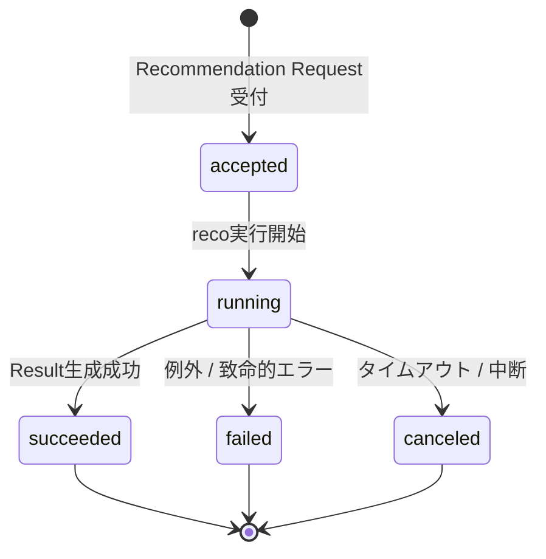

---

### 5.1.3 状態遷移表

| 現状態   | 次状態    | 契機                                                | 更新主体   | 備考                                    |
| -------- | --------- | --------------------------------------------------- | ---------- | --------------------------------------- |
| なし     | accepted  | apiがRecommendation Requestを保存し、recoへ実行依頼 | api / reco | 実装方式によりapi保存後にreco生成でも可 |
| accepted | running   | recoが推薦パイプラインを開始                        | reco       | started_atを設定                        |
| running  | succeeded | Result / Reason生成が完了                           | reco       | completed_atを設定                      |
| running  | failed    | 例外、必須データ不足、外部AI呼び出し失敗等          | reco       | error_summaryを設定                     |
| running  | canceled  | タイムアウト、手動中断                              | reco       | MVPでは任意                             |

---

### 5.1.4 Recommendation Run Phase

Recommendation Runの内部処理は、Run本体の状態を細かく更新しすぎず、Phase Logとして記録する。

### Phase一覧

| phase_name                 | 内容                          |
| -------------------------- | ----------------------------- |
| request_received           | 推薦依頼受付                  |
| config_resolved            | Config / Version解決          |
| semantic_extracted         | Semantic抽出                  |
| user_feature_generated     | User Feature生成              |
| user_meaning_projected     | User Meaning射影              |
| query_embedding_generated  | Query Embedding生成           |
| pre_hard_filter_completed  | Pre Hard Filter完了           |
| retrieval_completed        | 候補商品抽出完了              |
| post_hard_filter_completed | Post Hard Filter完了          |
| matching_completed         | Matching完了                  |
| ranking_completed          | Ranking完了                   |
| result_generated           | Recommendation Result生成完了 |
| reason_generated           | Reason生成完了                |
| response_built             | Response生成完了              |

### Phase状態

| 状態      | 意味               |
| --------- | ------------------ |
| started   | フェーズ開始       |
| succeeded | フェーズ正常終了   |
| failed    | フェーズ失敗       |
| skipped   | 条件により実行不要 |

---

### 5.1.5 Phase状態遷移図

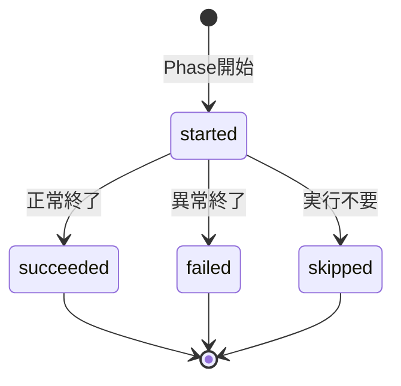

---

## 5.2 Recommendation Result 状態遷移

### 5.2.1 状態一覧

| 状態      | 意味                                                         | 終端状態 |
| --------- | ------------------------------------------------------------ | -------- |
| generated | 1件以上の推薦結果を生成できた状態                            | ○        |
| empty     | Hard Filter / Retrieval / Rankingの結果、推薦結果が0件の状態 | ○        |
| failed    | Result生成に失敗した状態                                     | ○        |

---

### 5.2.2 状態遷移図

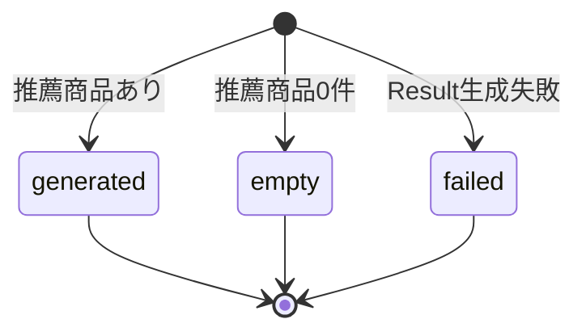

---

### 5.2.3 方針

Recommendation Resultは、生成後に原則更新しない。

```
Recommendation Result生成後
↓
Recommendation Result Item生成
↓
Recommendation Reason生成
↓
Result / Item / Reasonは原則不変
```

商品価格、商品名、商品画像URLが後続Batchで更新されても、既存のRecommendation Result Item Snapshotは更新しない。

---

## 5.3 Recommendation Feedback 状態遷移

### 5.3.1 状態一覧

| 状態      | 意味                                           | 終端状態 |
| --------- | ---------------------------------------------- | -------- |
| submitted | Feedbackが正常に保存された状態                 | ○        |
| invalid   | Validationエラーで保存されなかった状態         | ○        |
| ignored   | 重複送信や対象不整合により保存対象外とした状態 | ○        |

---

### 5.3.2 状態遷移図

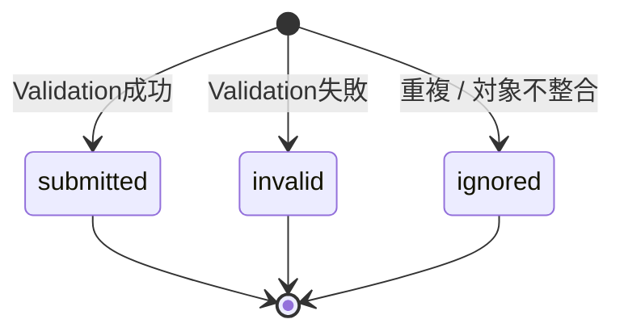

---

### 5.3.3 方針

Feedbackはユーザー入力事実として扱うため、保存済みFeedbackは原則更新しない。

分析結果はFeedback本体を更新せず、Feedback Analysis Resultとして別途生成する。

---

## 6. 外部商品データ連携Batch状態遷移

## 6.1 Batch Run 状態遷移

### 6.1.1 状態一覧

| 状態                | 意味                              | 終端状態 |
| ------------------- | --------------------------------- | -------- |
| queued              | Batch実行待ち                     | ×        |
| running             | Batch実行中                       | ×        |
| succeeded           | 全体が正常終了                    | ○        |
| partially_succeeded | 一部失敗したが、処理可能分は完了  | ○        |
| failed              | 致命的エラーによりBatch全体が失敗 | ○        |
| canceled            | 手動中断・タイムアウト            | ○        |

---

### 6.1.2 状態遷移図

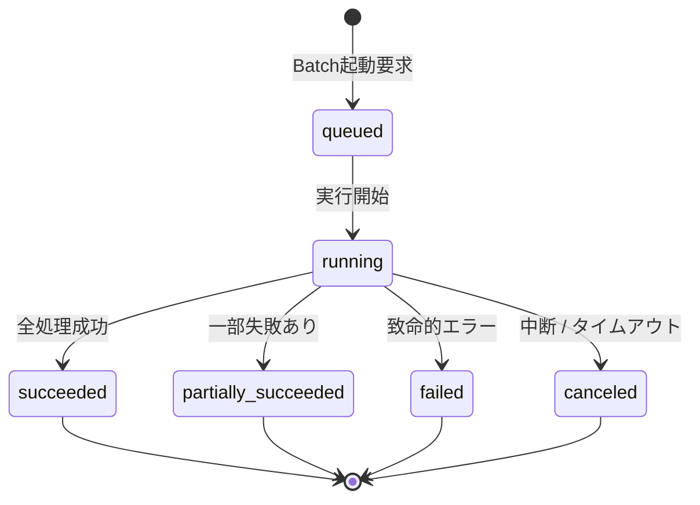

---

### 6.1.3 方針

Batch Runは、Batch実行単位で状態を管理する。

商品単位の細かい処理状態をすべてDB更新しない。

集計値として以下を保持する。

```
- fetched_count
- new_count
- updated_count
- unchanged_count
- skipped_count
- failed_count
```

---

## 6.2 API Call 状態遷移

### 6.2.1 対象API

MVPで利用する楽天APIは以下。

| API                   | 用途                                            |
| --------------------- | ----------------------------------------------- |
| 楽天商品検索API       | Item / Item Image / Item Review Summaryの取得元 |
| 楽天商品ランキングAPI | Item Popularity Signalの取得元                  |
| 楽天ジャンル検索API   | External Genreの取得元                          |

---

### 6.2.2 状態一覧

| 状態         | 意味                             | 終端状態 |
| ------------ | -------------------------------- | -------- |
| requested    | 外部APIリクエスト開始            | ×        |
| succeeded    | 外部APIレスポンス取得成功        | ○        |
| failed       | 外部API取得失敗                  | ○        |
| rate_limited | レート制限により取得失敗         | ○        |
| skipped      | 取得条件により呼び出しをスキップ | ○        |

---

### 6.2.3 状態遷移図

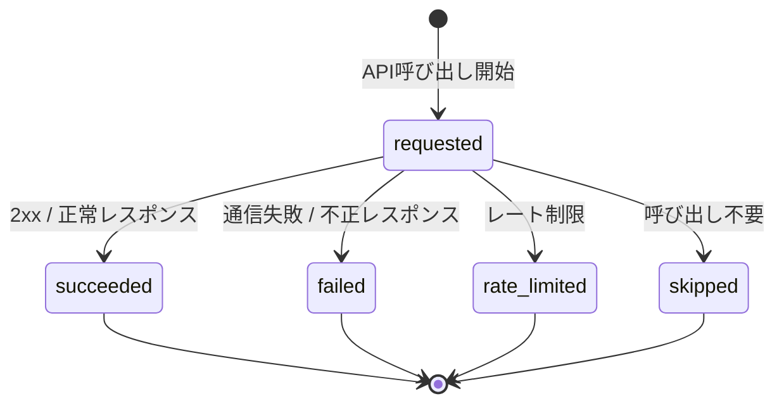

---

### 6.2.4 方針

API Call状態は、外部APIリクエスト単位で記録する。

商品1件ごとにはAPI Call状態を持たせない。

---

## 6.3 Raw Product Metadata 状態遷移

### 6.3.1 状態一覧

| 状態      | 意味                                        | 終端状態 |
| --------- | ------------------------------------------- | -------- |
| raw_saved | Raw JSON本体をObject Storageへ保存済み      | ×        |
| staged    | RawからStagingへの変換が完了                | ×        |
| imported  | Stagingから内部Item系リソースへの反映が完了 | ○        |
| skipped   | 差分なし・対象外などによりImport不要        | ○        |
| failed    | Raw保存後の処理で失敗                       | ○        |

---

### 6.3.2 状態遷移図

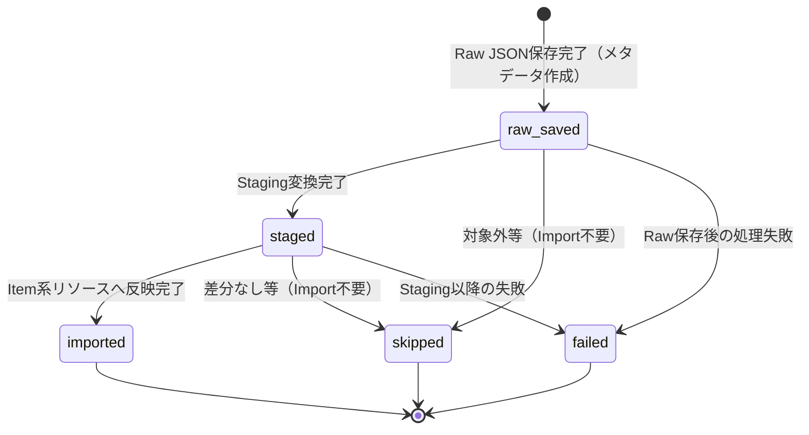

---

### 6.3.3 方針

Raw Product Metadataは、Rawレスポンス単位で状態管理する。

Raw JSON本体はObject Storage上の原本であり、状態は持たない。

状態はDB上のRaw Product Metadataで管理する。

```
Raw Product JSON
= Object Storage上の原本

Raw Product Metadata
= object_key / content_hash / import_status / fetched_at 等を管理
```

---

## 6.4 Fetch Cursor 状態遷移

### 6.4.1 状態一覧

| 状態      | 意味                         | 終端状態 |
| --------- | ---------------------------- | -------- |
| active    | 取得対象として有効           | ×        |
| paused    | 一時停止中                   | ×        |
| exhausted | 取得範囲を一通り走査済み     | ○        |
| failed    | カーソル更新や取得処理に失敗 | ○        |

---

### 6.4.2 状態遷移図

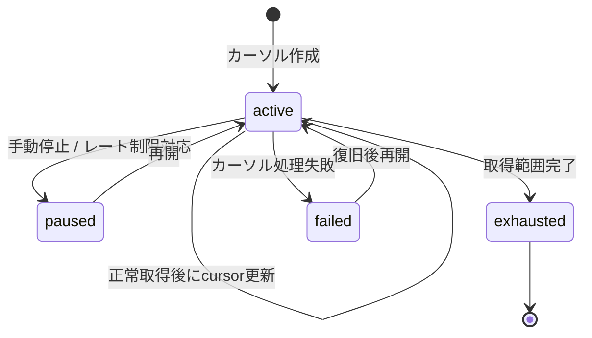

---

### 6.4.3 疑似差分取得での役割

楽天市場APIでは、本サービスが期待する完全な更新日時ベースの差分取得ができない前提である。

そのため、Fetch Cursorは疑似差分取得の走査条件を管理する。

```
Fetch Cursor
↓
楽天API取得
↓
External Product Candidate抽出
↓
Normalized Payload生成
↓
Normalized Hash算出
↓
既存Hash比較
↓
new / updated / unchanged 判定
```

---

## 6.5 Product Diff Result 状態

### 6.5.1 状態一覧

| 状態        | 意味                         | 後続処理                           |
| ----------- | ---------------------------- | ---------------------------------- |
| new         | 本サービスに未登録の新規商品 | Raw保存 / Staging / Item Insert    |
| updated     | 既存商品だが差分あり         | Raw保存 / Staging / Item Update    |
| unchanged   | 既存商品で差分なし           | 原則Item更新しない                 |
| unavailable | 取得不能・不正・対象外       | 必要に応じてItem Active Status更新 |

---

### 6.5.2 状態判定イメージ

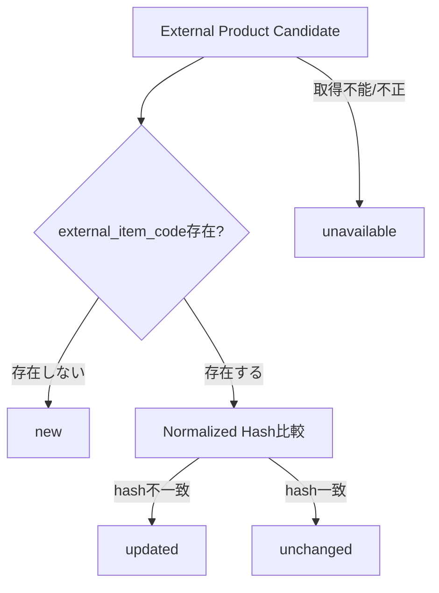

---

### 6.5.3 方針

Product Diff Resultは、Batch内の判定結果であり、商品単位で常に永続化する必須リソースではない。

永続化する場合も、詳細な状態更新ではなく、Batch / chunk単位の集計を基本とする。

---

## 7. 商品データ状態遷移

## 7.1 Item Active Status 状態遷移

### 7.1.1 状態一覧

| 状態        | 意味                                              | 推薦対象 |
| ----------- | ------------------------------------------------- | -------- |
| active      | 推薦対象として有効                                | ○        |
| inactive    | 明示的に推薦対象外                                | ×        |
| unavailable | 外部APIで取得不能、販売終了、リンク切れ等の可能性 | ×        |
| excluded    | NGカテゴリ、低品質、ポリシー等により除外          | ×        |

---

### 7.1.2 状態遷移図

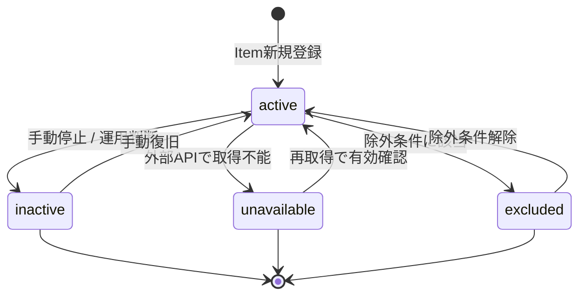

---

### 7.1.3 方針

Item Active Statusは、Online推薦のPre Hard Filterで利用する。

```
Pre Hard Filter
↓
is_active = true の商品のみ候補にする
```

Online推薦中にItem Active Statusを更新しない。

更新はBatchで行う。

---

## 7.2 Item Generation Queue 状態遷移

### 7.2.1 対象

Item Generation Queueは、商品意味生成・Feature生成・Embedding生成の対象商品を管理する。

対象となる処理は以下。

```
- Item Semantic生成
- Item Feature生成
- Item Meaning生成
- Item Embedding生成
```

---

### 7.2.2 状態一覧

| 状態       | 意味       | 終端状態 |
| ---------- | ---------- | -------- |
| queued     | 生成待ち   | ×        |
| processing | 生成処理中 | ×        |
| succeeded  | 生成成功   | ○        |
| failed     | 生成失敗   | ○        |
| skipped    | 生成不要   | ○        |

---

### 7.2.3 状態遷移図

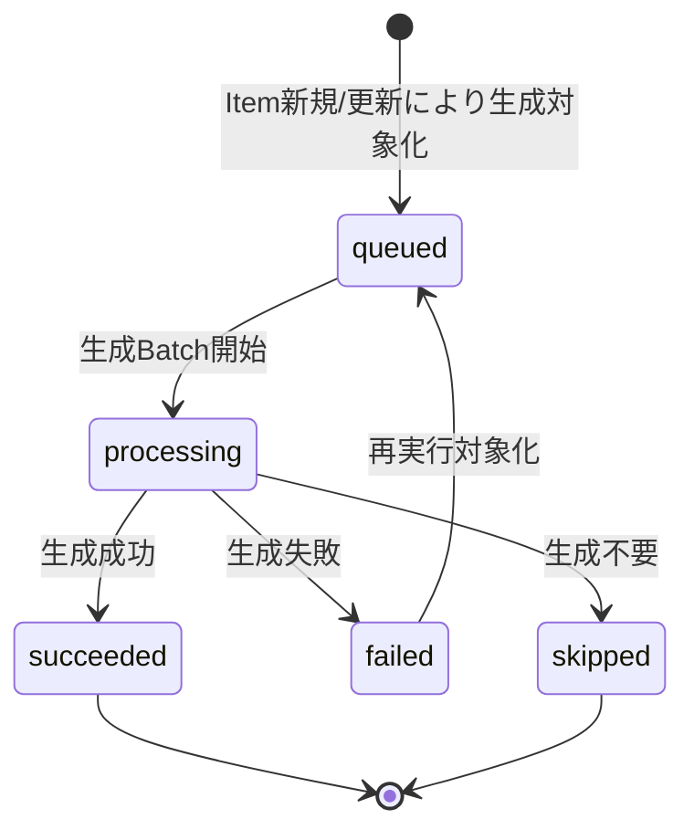

---

### 7.2.4 方針

Item Generation Queueは、商品単位の状態を持つが、これは中間状態の逐次更新ではなく、意味生成対象の作業キューとして扱う。

商品取得Batchの全工程で商品単位状態を持つのではなく、意味生成・Embedding生成の再実行制御に必要な範囲でのみ状態を持つ。

---

## 8. Evaluation状態遷移

## 8.1 Evaluation Run 状態遷移

### 8.1.1 状態一覧

| 状態      | 意味         | 終端状態 |
| --------- | ------------ | -------- |
| queued    | 評価実行待ち | ×        |
| running   | 評価実行中   | ×        |
| succeeded | 評価正常終了 | ○        |
| failed    | 評価失敗     | ○        |
| canceled  | 評価中断     | ○        |

---

### 8.1.2 状態遷移図

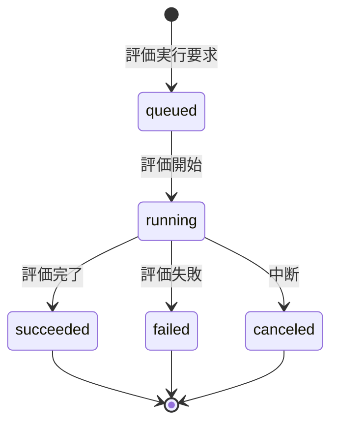

---

### 8.1.3 方針

Evaluation Result / Evaluation Metricは評価実行結果として追記中心に扱う。

同じEvaluation Datasetで再評価する場合も、既存結果を上書きせず、新しいEvaluation Resultを作成する。

---

## 9. 画面状態遷移

## 9.1 MVP主導線の画面状態

### 9.1.1 状態一覧

| UI状態                 | 意味                    |
| ---------------------- | ----------------------- |
| idle                   | 初期表示                |
| inputting              | ユーザーが条件入力中    |
| validating             | 入力検証中              |
| loading                | 推薦実行中              |
| showing_result         | 推薦結果表示中          |
| showing_empty          | 0件結果表示中           |
| showing_error          | エラー表示中            |
| showing_reason_detail  | 推薦理由詳細Modal表示中 |
| showing_product_detail | 商品詳細Modal表示中     |
| showing_feedback       | Feedback入力Modal表示中 |

---

### 9.1.2 画面状態遷移図

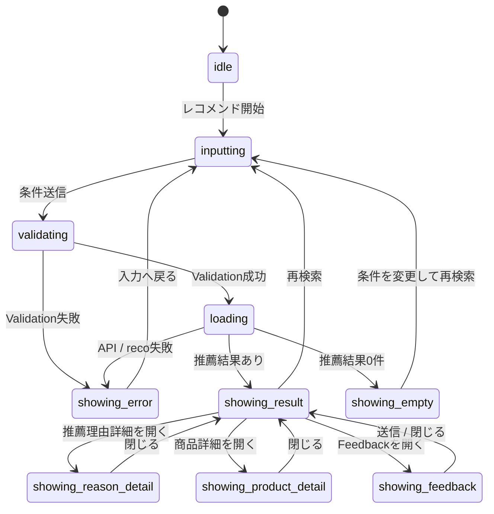

---

### 9.1.3 方針

UI状態はwebの一時状態として管理し、原則DB保存しない。

ただし、以下はDB保存対象である。

| UI操作       | DB保存対象                  |
| ------------ | --------------------------- |
| 推薦条件送信 | Recommendation Request      |
| 推薦実行     | Recommendation Run / Result |
| Feedback送信 | Recommendation Feedback     |

---

## 10. 状態更新粒度の設計

## 10.1 推奨する状態更新粒度

| 処理               | 状態更新粒度           | 理由                                   |
| ------------------ | ---------------------- | -------------------------------------- |
| Online推薦         | Recommendation Run単位 | ユーザーリクエスト単位で追跡するため   |
| Online推薦フェーズ | Phase単位              | 障害調査に必要な粒度を確保するため     |
| 外部商品API取得    | API Call単位           | 外部API失敗・レート制限を追跡するため  |
| Raw処理            | Raw Metadata単位       | Raw保存、Staging、Importを追跡するため |
| 商品取込           | Batch / chunk単位      | 商品単位の過剰DB更新を避けるため       |
| 商品有効状態       | Item単位の終端状態     | Online推薦のFilterに必要なため         |
| 商品意味生成       | Queue対象Item単位      | 再実行制御に必要なため                 |
| Evaluation         | Evaluation Run単位     | 評価結果の再現性を管理するため         |
| UI                 | web state単位          | DB永続化不要なため                     |

---

## 10.2 避けるべき状態更新

以下は原則避ける。

```
- 外部商品取得Batchで、商品1件ごとに processing / staged / imported を逐次DB更新する
- Item Image 1件ごとに細かい処理状態を持つ
- Feature計算の途中経過ごとにDB状態を更新する
- Score計算の途中経過ごとにDB状態を更新する
- UIのModal開閉をDBに保存する
```

理由は以下。

```
- DBアクセス回数が増える
- Batch処理性能が悪化する
- 状態数が増えすぎて運用が複雑になる
- 障害時の再実行設計が複雑になる
```

---

## 11. 異常系・再実行方針

## 11.1 Online推薦の異常系

| 異常               | 状態                                        | 対応                                                          |
| ------------------ | ------------------------------------------- | ------------------------------------------------------------- |
| 入力Validation失敗 | UI: showing_error                           | Recommendation Requestは保存しない、またはinvalidとして別管理 |
| Config解決失敗     | Run: failed                                 | Error Logに記録                                               |
| Retrieval 0件      | Result: empty                               | 0件結果として正常系扱い                                       |
| Matching対象0件    | Result: empty                               | 0件結果として正常系扱い                                       |
| Reason生成失敗（`021`/`022` 成功後） | Result: completed（Reason は fallback） | §17.2 汎用 Reason 注入。`reasonStatus: completed` / `isFallback: true`。Run は `completed` または一部 Item のみ fallback 時 `partial`（MOD-RECO-001 §10.3） |
| APIタイムアウト    | Run: failed / canceled                      | UIでエラー表示                                                |

---

## 11.2 Batchの異常系

| 異常              | 状態                           | 対応                                   |
| ----------------- | ------------------------------ | -------------------------------------- |
| 楽天API通信失敗   | API Call: failed               | Batchは継続可能ならpartially_succeeded |
| 楽天APIレート制限 | API Call: rate_limited         | Fetch Cursorをpausedにすることを検討   |
| Raw保存失敗       | Raw Metadata未作成またはfailed | Error Log記録                          |
| Staging変換失敗   | Raw Metadata: failed           | Rawから再処理可能                      |
| Item反映一部失敗  | Batch Run: partially_succeeded | Item Import Summaryに失敗件数          |
| 意味生成失敗      | Item Generation Queue: failed  | 再実行対象化                           |
| Embedding生成失敗 | Item Generation Queue: failed  | 再実行対象化                           |

---

## 11.3 再実行方針

| 対象                         | 再実行方針                                          |
| ---------------------------- | --------------------------------------------------- |
| Recommendation Run           | 同一Runを再開せず、新しいRunとして再実行する        |
| Recommendation Request       | 同一Requestを使った再実行は可                       |
| Recommendation Result        | 既存Resultは上書きせず、新しいResultを生成する      |
| Raw Product Metadata failed  | Raw Product JSONが存在すればStaging以降を再実行可能 |
| API Call failed              | 同条件で再取得可能                                  |
| Fetch Cursor failed          | 原因解消後にactiveへ戻して再開可能                  |
| Item Generation Queue failed | queuedへ戻して再実行可能                            |
| Evaluation failed            | 新しいEvaluation Runとして再実行する                |

---

## 12. 状態とログの関係

### 12.1 状態とログの使い分け

| 種別     | 用途                                 | 例                                       |
| -------- | ------------------------------------ | ---------------------------------------- |
| 状態     | 現在の処理状況・終端結果を表す       | run_status, import_status, cursor_status |
| ログ     | 処理履歴・監査・障害調査を表す       | phase_log, error_log, api_call_log       |
| 集計     | 大量処理の結果を要約する             | item_import_summary                      |
| Snapshot | 後続更新に影響されない結果を固定する | recommendation_result_item               |

---

### 12.2 ログ保存方針

| ログ                 | 保存粒度            | 方針                           |
| -------------------- | ------------------- | ------------------------------ |
| Phase Log            | 主要フェーズ単位    | Online / Batch共通で利用       |
| Error Log            | エラー単位          | 失敗時のみ詳細記録             |
| Batch Run Log        | Batch実行単位       | 実行開始・終了・全体ステータス |
| API Call Log         | 外部API呼び出し単位 | リクエスト条件、件数、成否     |
| Item Import Summary  | Batch / chunk単位   | 商品取込件数の集計             |
| Raw Product Metadata | Rawレスポンス単位   | Raw保存・Staging・Import状態   |

---

## 13. 状態遷移とERの対応

| 状態管理対象             | 想定エンティティ                         | 主な状態カラム            |
| ------------------------ | ---------------------------------------- | ------------------------- |
| Recommendation Run       | recommendation_run                       | run_status                |
| Recommendation Run Phase | `phase_log`（`owner_type = recommendation_run`） | phase_status |
| Recommendation Result    | recommendation_result                    | result_status             |
| Recommendation Feedback  | recommendation_feedback                  | feedback_status           |
| Batch Run                | batch_run_log                            | run_status                |
| API Call                 | api_call_log                             | call_status               |
| Raw Product Metadata     | raw_product_metadata                     | import_status             |
| Fetch Cursor             | fetch_cursor                             | cursor_status             |
| Item                     | item                                     | is_active / active_status |
| Item Generation Queue    | item_generation_queue                    | queue_status              |
| Evaluation Run           | evaluation_result または evaluation_run  | evaluation_status         |
| Error                    | error_log                                | error_code / occurred_at  |

> **補足**: 論理ER上の `recommendation_run_phase_log` は物理テーブル化しない。Run フェーズ履歴は `phase_log`（`owner_type = recommendation_run`）で管理する（テーブル一覧 §11 補足・`phase_log_テーブル定義書` §5.2）。

---

## 14. 後続成果物への引き継ぎ

### 14.1 テーブル設計への引き継ぎ

テーブル設計では、以下を反映する。

| 観点      | 内容                                                                       |
| --------- | -------------------------------------------------------------------------- |
| status列  | 状態管理対象にのみ定義する                                                 |
| status値  | 本ドキュメントの状態一覧をenum相当として扱う                               |
| timestamp | started_at / completed_at / failed_at / updated_at等を必要に応じて定義する |
| Error     | statusだけでなくError Logへ詳細を分離する                                  |
| 大量処理  | 商品単位の中間状態列を過剰に持たせない                                     |
| Snapshot  | Result Snapshotは後続更新で上書きしない                                    |
| 再実行    | 再実行時に既存正本・Snapshotを壊さない設計にする                           |

---

### 14.2 API設計への引き継ぎ

| API                                        | 状態観点                                             |
| ------------------------------------------ | ---------------------------------------------------- |
| POST /api/v1/recommendations                             | loading / succeeded / empty / failedをUIへ返せること |
| POST /api/v1/recommendation-results/{resultId}/feedback | submitted / invalid / ignoredを扱えること            |
| GET /api/v1/masters/relationships 等       | 状態管理対象外。is_activeで制御（各マスタ・設定リソース） |
| reco内部API                                | Recommendation Runの成功・失敗を返せること           |

---

### 14.3 バッチ一覧への引き継ぎ

| Batch                     | 状態管理対象                                                             |
| ------------------------- | ------------------------------------------------------------------------ |
| 楽天ジャンル同期Batch     | Batch Run / API Call / Raw Metadata                                      |
| 楽天ランキング取得Batch   | Batch Run / API Call / Raw Metadata / Item Import Summary                |
| 楽天商品疑似差分取得Batch | Batch Run / API Call / Fetch Cursor / Product Diff Result / Raw Metadata |
| Raw取込・Staging変換Batch | Raw Metadata / Staging Validation Error                                  |
| Item反映Batch             | Item Import Summary / Item Active Status                                 |
| 商品意味生成Batch         | Item Generation Queue                                                    |
| Offline Evaluation Batch  | Evaluation Run / Evaluation Result                                       |

---

## 15. レビュー観点

| 観点               | 確認内容                                                               |
| ------------------ | ---------------------------------------------------------------------- |
| 状態対象の妥当性   | 状態管理すべきリソースに過不足がないか                                 |
| 状態過多の防止     | 商品単位の中間状態を過剰にDB更新する設計になっていないか               |
| Online / Batch分離 | Online推薦中にBatch更新対象を更新していないか                          |
| Run状態            | Recommendation Runの状態で推薦実行を追跡できるか                       |
| Result状態         | 0件結果とエラーを区別できるか                                          |
| Raw状態            | Raw JSON本体ではなくRaw Metadataで状態管理できているか                 |
| 疑似差分取得       | Fetch Cursor / Product Diff Resultの状態が整理されているか             |
| Item状態           | active / inactive / unavailable / excludedで推薦対象可否を表現できるか |
| Queue状態          | Item Feature / Embedding生成の再実行制御ができるか                     |
| UI状態             | DB状態と画面状態が混同されていないか                                   |
| 再実行             | failed時に既存ResultやSnapshotを壊さず再実行できるか                   |
| ログ               | 状態だけでなくPhase Log / Error Logで調査可能か                        |
| 後続設計接続       | テーブル設計、API設計、バッチ設計へ展開できるか                        |

---

## 16. まとめ

本サービスの状態遷移は、以下の考え方で整理する。

```
Online推薦
= Recommendation Runを中心に状態管理し、詳細はPhase Logで追跡する

推薦結果
= generated / empty / failed を区別し、生成後は原則不変にする

Feedback
= submittedを正本として保存し、分析結果は派生として扱う

外部商品Batch
= Batch Run / API Call / Raw Metadata / Fetch Cursorを中心に状態管理する

疑似差分取得
= Product Diff Resultで new / updated / unchanged / unavailable を判定する

商品管理
= Item Active Statusで推薦対象可否を管理する

商品意味生成
= Item Generation QueueでFeature / Embedding生成の再実行制御を行う

UI
= webの一時状態として管理し、DB状態と混同しない
```

特に、以下の重要方針を維持する。

```
- Online推薦中に楽天APIを呼ばない
- Online推薦中にItem / Item Image / Item Feature / Item Embeddingを更新しない
- 商品単位の中間状態を逐次DB更新しない
- Raw JSON本体はObject Storageに保存し、状態はRaw Metadataで管理する
- 楽天ランキングAPIはPopularity Signal取得元であり、Item正本取得元ではない
- Recommendation Result Item Snapshotは後続の商品更新で上書きしない
- failedデータを直接上書き復旧するのではなく、再実行可能な単位を明確にする
```
