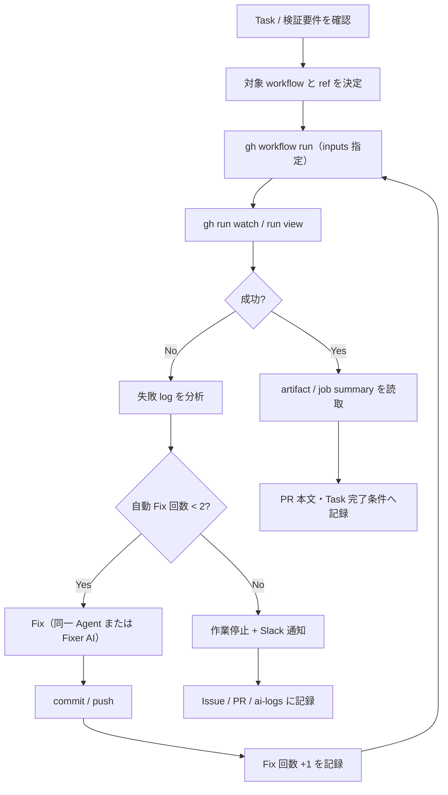

# Layer2 Agent dispatch手順書

## 1. 目的

本ドキュメントは、Gift Recommendation Service において **Layer2 GHA テスト workflow**（`workflow_dispatch`）を AI Agent が起動し、run 結果・artifact を読み取り、必要に応じて Fix ループへ進むための **共通手順正本** を定義する。

Epic C（`gha-test-environment`）Task C5 の成果物である。C3 / C4 で整備した `test-system.yml` / `test-reco-quality.yml` を中心に、将来追加する `tech-verify-*.yml` 等も同型手順で dispatch 可能とする。

---

## 2. 本ドキュメントの位置づけ

| 成果物 | 役割 |
| ------ | ---- |
| テスト環境設計書 | Layer1〜3 境界、Layer2 環境・workflow 一覧、Agent 運用対応表（§2.6） |
| CI・CD方針書 | PR CI（Layer1）と Layer2 workflow の分離方針 |
| テスト定義書 | テストレベル・Layer2 skip 条件・fixture 方針 |
| 本ドキュメント | **Agent 向け Layer2 dispatch / 結果読取 / Fix ループ手順** |
| Definition Run Harness ワークフロー仕様書 | `/review-pr` 等 Definition Run の外部トリガ（Layer2 テストとは別系統） |
| Commands設計書 §29 | Definition Run 通称・外部トリガ概要 |

### 2.1 Layer1 / Layer2 / Layer3 の境界

Layer1〜3 の定義・Epic C focus・全テストレベル Agent 運用対応表の正本は [テスト環境設計書.md](./テスト環境設計書.md) §2.1〜§2.6 とする。本節は dispatch 手順向けの要約である。

| 区分 | 実行経路 | 典型 workflow | Agent の用途 |
| ---- | -------- | ------------- | ------------ |
| Layer1 | PR CI（`ci.yml` 群） | `ci.yml`, `ci-web.yml` 等（Epic D） | Task PR の build / lint / unit |
| Layer2 | `workflow_dispatch` | `test-system.yml`, `test-reco-quality.yml` | システム / 品質テストの on-demand 実行 |
| Layer3 | cloud dev URL（defer） | — | Epic B defer。本手順の対象外 |

Layer2 workflow は **通常 PR CI に混在させない**（Epic C Epic Definition `agentic_process.constraints`、CI・CD方針書 §13.4）。

### 2.2 Definition Run Harness との違い

| 項目 | Layer2 テスト dispatch | Definition Run Harness |
| ---- | ---------------------- | ---------------------- |
| 目的 | テスト workflow 実行・品質確認 | `/start-epic`, `/review-pr` 等 Command 実行 |
| トリガ | `gh workflow run` → GHA job | Harness → Cursor Cloud Agent |
| 正本 | **本ドキュメント** | Definition Run Harness ワークフロー仕様書 |
| 結果 | test report / evaluation artifact | AI Review コメント、Issue / PR 更新 |

---

## 3. 前提条件

### 3.1 実行主体

| 主体 | 想定 |
| ---- | ---- |
| Worker AI | `/work-issue` 完了前の Layer2 検証 |
| Test AI | テスト Task の manual check |
| Human | レコメンド品質の人手評価（§9.7.3） |

### 3.2 必要な CLI / 認証

1. [GitHub CLI](https://cli.github.com/)（`gh`）が利用可能であること
2. リポジトリへの read 権限（workflow 一覧・run ログ・artifact ダウンロード）
3. workflow 起動には `actions: write` 相当の権限（bot または Human PAT）

**bot 利用時**（commit / push / workflow dispatch）:

```bash
node .github/scripts/gh-bot-auth.cjs verify
eval "$(node .github/scripts/gh-bot-auth.cjs print-setup)"
```

`GH_BOT_TOKEN` を `GH_TOKEN` に export した状態で `gh` を実行する。secret 実値を docs・ログ・PR に出力しない。

### 3.3 ref（Branch）の指定

Layer2 workflow は **検証対象 Branch の HEAD** を `--ref` に指定して dispatch する。

| 状況 | 推奨 `--ref` |
| ---- | ------------- |
| Task PR 検証 | Task Branch（例: `docs/task-681-agent-test-dispatch`） |
| Epic 統合確認 | 親 Epic Branch（例: `chore/epic-671-gha-test-environment`） |

未指定時は default branch が checkout 対象となり、意図しない ref で実行されるため **必ず明示**する。

---

## 4. Layer2 workflow 一覧

| workflow ファイル | workflow 名（`name:`） | Epic Task | テストレベル | 主な artifact |
| ------------------- | ----------------------- | --------- | ------------ | ------------- |
| `.github/workflows/test-system.yml` | `Test System (Layer2)` | C3 (#676) | システムテスト | `test-system-report` |
| `.github/workflows/test-reco-quality.yml` | `Test Reco Quality` | C4 (#677) | レコメンド品質評価 | `reco-quality-evaluation-<run_id>` |

将来追加予定（同手順で dispatch 可）:

| パターン | 用途 |
| -------- | ---- |
| `tech-verify-*.yml` | 技術検証（外部 API 等） |
| `perf-feasibility-*.yml` | 性能フィジビリティ |

---

## 5. 共通 dispatch フロー



Agent は以下を **1 サイクル** として繰り返す。ただし **§9 の自動 Fix 上限** を超えて Fix ループを継続してはならない。

1. **dispatch** — `gh workflow run`
2. **監視** — `gh run watch` または `gh run view`
3. **読取** — job summary / artifact / JSON report
4. **Fix** — 失敗時かつ上限内のみ、scope 内で修正 → commit → 再 dispatch
5. **記録** — PR 本文に run URL・入力・判定・Fix 回数を記載（実施済みテストの正本）

---

## 6. `test-system.yml`（Test System Layer2）

### 6.1 概要

GHA runner 上で ephemeral DB + Redis を起動し、fixture / DB 前提および（Phase4b 以降）API E2E を検証する。

正本: `.github/workflows/test-system.yml`、テスト定義書 §9.5.3。

### 6.2 入力パラメータ

| 入力 | 型 | 既定 | 説明 |
| ---- | -- | ---- | ---- |
| `skip_api_e2e` | boolean | `true` | API health / RecommendationRun E2E を skip |
| `api_base_url` | string | `""` | 空 = GHA localhost:3001（将来 cloud dev 用） |
| `reco_base_url` | string | `""` | 空 = GHA localhost:8000（将来 cloud dev 用） |

Phase4b 最小 API 整備前は `skip_api_e2e=true` を正とする。artifact の `phase4bPending: true` および skipped ケースを確認する。

### 6.3 dispatch 例

```bash
REPO="ryo-chan-k6/GiftRecommendAPP_MVP_CYCLE_3"
REF="chore/epic-671-gha-test-environment"

gh workflow run "Test System (Layer2)" \
  --repo "${REPO}" \
  --ref "${REF}" \
  -f skip_api_e2e=true
```

Phase4b 以降（API E2E 必須 pass）:

```bash
gh workflow run "Test System (Layer2)" \
  --repo "${REPO}" \
  --ref "${REF}" \
  -f skip_api_e2e=false
```

### 6.4 結果の読取

| 読取先 | 内容 |
| ------ | ---- |
| Job summary | ケース別 status、passed / failed / skipped 集計 |
| Artifact `test-system-report` | `system-test-report.json`, `system-test-report.md` |

```bash
RUN_ID="<workflow_run_id>"

gh run watch "${RUN_ID}" --repo "${REPO}" --exit-status
gh run view "${RUN_ID}" --repo "${REPO}"

mkdir -p /tmp/layer2-artifacts
gh run download "${RUN_ID}" --repo "${REPO}" \
  -n test-system-report \
  -D /tmp/layer2-artifacts
```

JSON report の主要フィールド:

| フィールド | 意味 |
| ---------- | ---- |
| `cases[].id` | ケース ID |
| `cases[].status` | `passed` / `failed` / `skipped` |
| `summary.passed` / `failed` / `skipped` | 集計 |
| `phase4bPending` | Phase4b 前の skip 許容フラグ |

---

## 7. `test-reco-quality.yml`（Test Reco Quality）

### 7.1 概要

固定評価ケース + 自動メトリクスを GHA artifact / job summary に出力する。

正本: `.github/workflows/test-reco-quality.yml`、テスト定義書 §9.7。

### 7.2 入力パラメータ

| 入力 | 型 | 既定 | 説明 |
| ---- | -- | ---- | ---- |
| `pipeline_mode` | choice | `skeleton` | `skeleton`（Phase4b 前） / `live` |
| `openai_mode` | choice | `mock` | `mock`（fixture 正） / `secrets`（GHA Secrets 注入） |

Layer2 既定は **mock**（テスト定義書 §8.1）。`openai_mode=secrets` は Human 判断後の限定利用とする。

### 7.3 dispatch 例

```bash
gh workflow run "Test Reco Quality" \
  --repo "${REPO}" \
  --ref "${REF}" \
  -f pipeline_mode=skeleton \
  -f openai_mode=mock
```

### 7.4 結果の読取

| 読取先 | 内容 |
| ------ | ---- |
| Job summary | `tests/recommendation-quality/output/summary.md` の内容 |
| Artifact | `reco-quality-evaluation-<run_id>` 配下の `report.json` 等 |

artifact 名に `run_id` が含まれるため、一覧から取得する:

```bash
gh run view "${RUN_ID}" --repo "${REPO}" --json artifacts -q '.artifacts[].name'

gh run download "${RUN_ID}" --repo "${REPO}" \
  -n "reco-quality-evaluation-${RUN_ID}" \
  -D /tmp/layer2-artifacts/reco-quality
```

**Human 人手評価**（テスト定義書 §9.7.3）は Agent 単独完了条件に含めない。artifact を Human に渡し、判定は Issue / PR コメントで記録する。

---

## 8. run 監視・トラブルシュート

### 8.1 基本コマンド

```bash
# 直近 run 一覧
gh run list --repo "${REPO}" --workflow test-system.yml --limit 5
gh run list --repo "${REPO}" --workflow test-reco-quality.yml --limit 5

# 詳細・ログ
gh run view "${RUN_ID}" --repo "${REPO}" --log-failed

# 同時実行制御（concurrency）で cancel された場合
gh run view "${RUN_ID}" --repo "${REPO}" --json conclusion,status
```

### 8.2 よくある失敗と対応

| 症状 | 想定原因 | Agent の対応 |
| ---- | -------- | ------------ |
| DB / migration 失敗 | seed / migration 不整合 | fixture・migration Task を確認。Fix は scope 内のみ |
| `openai_mode=secrets` で失敗 | `secrets.OPENAI_API_KEY` 未設定 | `mock` に戻すか Human に Secrets 設定を依頼 |
| API E2E 失敗（Phase4b 前） | `skip_api_e2e=false` で placeholder API | `skip_api_e2e=true` が正。artifact の skipped を確認 |
| artifact なし | job 途中失敗 | `--log-failed` で infra 系ログを確認 |
| concurrency cancel | 同一 ref で並列 dispatch | 先行 run 完了を待つか、意図的 cancel を確認 |

---

## 9. Fix ループ

Epic C `agent_test_operations.common_pattern` に従う。ただし **コスト・ログ肥大・トークン消費の無制御化を防ぐ**ため、自動 Fix には上限を設ける。

### 9.1 自動 Fix 上限（必須）

| 項目 | 規則 |
| ---- | ---- |
| 上限 | **初回 Fix から最大 2 回** まで自動 Fix を実行してよい |
| カウント対象 | Agent が失敗分析後に commit する Fix 試行（Fix #1, Fix #2） |
| カウント対象外 | 初回 dispatch、Human 指示による手動 Fix、上限到達後の Fix |
| 上限到達後 | **3 回目の Fix を自動実行しない**。作業停止し §9.4 の Slack 通知を行う |

**Fix 回数の数え方（例）:**

```text
dispatch #1 → 失敗（Fix 回数 0）
  → 自動 Fix #1 → commit → dispatch #2 → 失敗（Fix 回数 1）
  → 自動 Fix #2 → commit → dispatch #3 → 失敗（Fix 回数 2）
  → 自動 Fix 停止 → Slack 通知 → Human 判断待ち
```

Agent は Fix ループを **無限に繰り返してはならない**。同一セッション内で dispatch / log 読取 / Fix を漫然と続けない。

### 9.2 Fix 試行の記録

各 Fix 試行前後で、以下を **Issue コメントまたは PR 本文** に累積記録する（Slack だけを正本にしない）。

| 記録項目 | 内容 |
| -------- | ---- |
| Fix 回数 | `1 / 2` 形式 |
| 対象 workflow run | run URL、workflow 名、inputs |
| 失敗要約 | 失敗 job / ケース ID / 主要 log 抜粋（secret 除外） |
| Fix 内容 | 変更ファイル、変更概要、commit SHA |
| 再 dispatch 結果 | 成功 / 失敗 |

### 9.3 Fix 担当

| 段階 | 担当 | 記録先 |
| ---- | ---- | ------ |
| テストコード / fixture 修正 | Worker AI | Task Branch commit |
| レビュー指摘に基づく修正 | Fixer AI | 同一 Branch |
| 再 dispatch | Worker AI / Test AI | PR 本文「テスト・検証結果」 |
| 品質人手評価 | Human | Issue / PR コメント |

再 dispatch 前に **親 Epic Branch との merge 必要性** を確認する。Task Branch が古い場合は epic 最新化後に検証する（[worktree.mdc](../../../.cursor/rules/worktree.mdc)）。

### 9.4 上限到達時の停止・Slack 通知

2 回目の自動 Fix 後も Layer2 workflow が失敗する場合、Agent は **Fix ループを停止**し、[Slack通知運用設計書 §19](../../00_共通/AIエージェント運用/Slack通知運用設計書.md) に従って **作業停止・例外通知**（`error` / `incident_detected`）を送る。

**通知レベル:** `error`（作業停止）  
**通知種別:** `incident_detected`  
**生成主体:** Agent（必要に応じて `slack-notify-manual.yml` 経由）

Slack 本文には、最低限以下を含める。

| 項目 | 記載内容 |
| ---- | -------- |
| 発生事象 | 失敗した workflow 名、run URL、inputs、失敗 job / ケース、主要エラー要約 |
| Fix 対応内容 | Fix #1 / #2 それぞれの変更概要、commit SHA、再 dispatch 結果 |
| 残課題 | 未解決の失敗原因、未確認事項、scope 外に見える問題 |
| 推奨対応 | Human が次に取るべき action（例: 設計判断、別 Task 化、手動調査、inputs 変更） |

**通知テンプレート:** [incident-detected.md](../../../prompts/templates/slack/incident-detected.md) をベースとし、Layer2 Fix ループ上限到達時は `summary` に上記 4 項目を Markdown 見出しで構造化する。

**dispatch 例（bot 認証後）:**

```bash
gh workflow run "Slack manual notification" \
  --repo "${REPO}" \
  -f notification_type=incident_detected \
  -f level=error \
  -f title="Layer2 Fix ループ上限到達（自動 Fix 2 回後も失敗）" \
  -f summary="$(cat <<'EOF'
## 発生事象
- workflow: Test System (Layer2)
- run: <run_url>
- 失敗要約: ...

## Fix 対応内容
- Fix #1: <commit_sha> — ...
- Fix #2: <commit_sha> — ...

## 残課題
- ...

## 推奨対応
- ...
EOF
)" \
  -f issue_number=<Issue番号> \
  -f pr_number=<PR番号> \
  -f human_action="Layer2 失敗原因の Human 判断と、3 回目以降の Fix 方針の決定" \
  -f ai_log_path=ai-logs/incidents/<ファイル名>.md
```

**正本記録（Slack 通知と併せて必須）:**

| 正本 | 記録内容 |
| ---- | -------- |
| Issue / PR コメント | 発生事象、Fix #1/#2、残課題、推奨対応、run URL |
| `ai-logs/incidents/` | 上限到達 incident として同内容を保存（[AIログ運用ルール](../../00_共通/AIエージェント運用/AIログ運用ルール.md) §4） |
| PR 本文 | 「テスト・検証結果」に Fix 上限到達・未解決を明記 |

上限到達後、Agent は **Human 判断なしに 3 回目の Fix や追加 dispatch を自動実行してはならない**。

---

## 10. セキュリティ・禁止事項

| 禁止 | 理由 |
| ---- | ---- |
| secret 実値の docs / ログ / PR 記載 | security.mdc |
| `openai_mode=secrets` の無条件常用 | コスト・外部 API 依存 |
| cloud dev URL を正とした手順（Epic B defer） | out of scope |
| Layer2 workflow を PR CI に混在 | 実行時間・不安定化 |
| `.env` 実値の commit | security.mdc |

環境変数名（例: `OPENAI_API_KEY`, `DATABASE_URL`）の記載は可。値はダミーのみ。

---

## 11. Task Definition / Command との関係

| 利用場面 | 参照 |
| -------- | ---- |
| Layer2 テスト Task の `/work-issue` 完了前検証 | 本ドキュメント §5〜§9 |
| `/work-issue` 一般手順 | `.cursor/commands/work-issue.md` §Layer2 テスト dispatch |
| Definition Run（AI Review 等） | Commands設計書 §29、Definition Run Harness 仕様書 |

Task Definition の `test_policy.manual_checks` に「workflow_dispatch 実行と artifact 読取」がある場合、Agent は本手順に従い PR 本文へ run URL と判定を記録する。

---

## 12. 関連ドキュメント

| ドキュメント | パス |
| ------------ | ---- |
| テスト環境設計書 | `docs/05_アプリケーション設計/テスト/テスト環境設計書.md` |
| CI・CD方針書 | `docs/05_アプリケーション設計/共通/CI・CD方針書.md` |
| テスト定義書 | `docs/05_アプリケーション設計/テスト/テスト定義書.md` |
| Commands設計書 §29 | `docs/00_共通/AIエージェント運用/Commands設計書.md` |
| Epic C Epic Definition | `prompts/definitions/epics/gha-test-environment/epic.yaml` |
| Definition Run Harness 仕様書 | `docs/06_実装設計/github_actions/Definition Run Harnessワークフロー仕様書.md` |
| Slack通知運用設計書 | `docs/00_共通/AIエージェント運用/Slack通知運用設計書.md` |
| AIログ運用ルール | `docs/00_共通/AIエージェント運用/AIログ運用ルール.md` |
| incident 通知テンプレート | `prompts/templates/slack/incident-detected.md` |
| test-system workflow | `.github/workflows/test-system.yml` |
| test-reco-quality workflow | `.github/workflows/test-reco-quality.yml` |

---

## 13. 更新履歴

| 日付 | 内容 |
| ---- | ---- |
| 2026-06-21 | 初版（Epic C Task C5 / Issue #681） |
| 2026-06-21 | §9 Fix ループ上限（自動 Fix 最大 2 回）と Slack エスカレーションを追加 |
