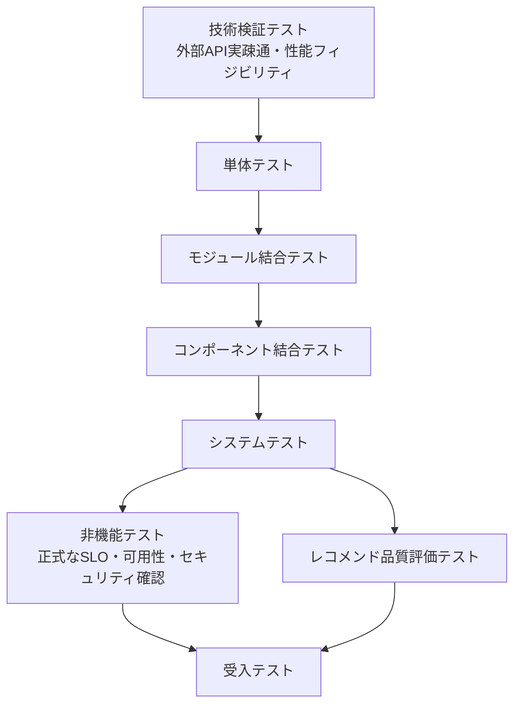

# テスト定義書

## 1. 概要

### 1.1 目的

本ドキュメントは、Gift Recommendation Service MVP におけるテストの定義を整理することを目的とする。

本ドキュメントでは、以下を定義する。

```text
- テストレベル
- テスト種別
- テスト対象コンポーネント
- テスト観点
- 技術検証テストの位置づけ
- 性能フィジビリティ検証の位置づけ
- shared_logic連携テストの位置づけ
- フェーズ別の確認対象
- テストデータ分類
- 自動化対象
- テストケース設計への引き継ぎ
- 後続成果物への引き継ぎ
```

なお、本ドキュメントでは、具体的なテストケース、実施日程、担当者、環境、スケジュールは定義しない。

それらは後続の以下成果物で管理する。

```
- 全体テスト計画書
- フェーズ別テスト計画書
- テスト計画/
- テストケース/
- テスト結果/
- レポート/
```

---

## 2. 本ドキュメントの位置づけ

| 成果物                 | 役割                                                                     |
| ---------------------- | ------------------------------------------------------------------------ |
| テスト方針書           | テスト全体の思想、重視する品質、対象範囲、優先度を定義する               |
| テスト定義書           | テストレベル、テスト種別、テスト観点、対象範囲を定義する                 |
| 全体テスト計画書       | 各テストフェーズの順序、環境、体制、開始条件、終了条件を定義する         |
| フェーズ別テスト計画書 | 各テストフェーズ固有の詳細な実施計画を定義する                           |
| テストケース           | 各フェーズごとの入力、前提データ、操作手順、期待結果、確認方法を定義する |
| テスト実施結果報告書   | テスト結果、不具合、残課題、品質判定を記録する                           |

---

## 3. テスト成果物構成

本プロジェクトでは、テスト成果物を以下の単位で管理する。

```
共通
  ├─ テスト方針書
  ├─ テスト定義書
  └─ 全体テスト計画書

技術検証テスト（docs/90_PoC/ 等）
  ├─ テスト計画/
  ├─ テストケース/
  │    ├─ 外部API実疎通テスト
  │    ├─ 外部APIレスポンス特性検証
  │    ├─ 性能フィジビリティ検証
  │    ├─ pgvector検索性能検証
  │    ├─ 外部AI API性能・制約検証
  │    └─ Batch処理時間検証
  ├─ テスト結果/
  └─ レポート/

単体テスト（docs/07_開発・単体テスト/）
  ├─ テスト計画/
  ├─ テストケース/
  │    ├─ api
  │    ├─ batch
  │    ├─ database
  │    ├─ reco
  │    ├─ shared
  │    └─ web
  ├─ テスト結果/
  └─ レポート/

モジュール結合テスト（docs/08_モジュール結合テスト/）
  ├─ テスト計画/
  ├─ テストケース/
  ├─ テスト結果/
  └─ レポート/

コンポーネント結合テスト（docs/09_コンポーネント結合テスト/）
  ├─ テスト計画/
  ├─ テストケース/
  ├─ テスト結果/
  └─ レポート/

システムテスト（docs/10_システムテスト/）
  ├─ テスト計画/
  ├─ テストケース/
  ├─ テスト結果/
  └─ レポート/

非機能テスト（docs/11_非機能テスト/）
  ├─ テスト計画/
  ├─ テストケース/
  ├─ テスト結果/
  └─ レポート/

レコメンド品質評価テスト（docs/12_レコメンド品質評価テスト/）
  ├─ テスト計画/
  ├─ テストケース/
  ├─ テスト結果/
  └─ レポート/

受入テスト（docs/13_受入テスト/）
  ├─ テスト計画/
  ├─ テストケース/
  ├─ テスト結果/
  └─ レポート/
```

---

## 4. テストレベル定義

### 4.1 テストレベル一覧

| テストレベル             | 目的                                                                                  | 主な確認対象                                                                                |
| ------------------------ | ------------------------------------------------------------------------------------- | ------------------------------------------------------------------------------------------- |
| 技術検証テスト           | 外部API・外部サービスの実疎通、実レスポンス特性、性能面の成立性、制約を早期に確認する | 楽天API、外部AI API、API Key、rate limit、schema、データ分布、pgvector、Reco処理、Batch処理 |
| 単体テスト               | 関数・クラス・Repository・小さな処理単位が単独で正しく動くことを確認する              | api / batch / database / reco / shared / web                                                |
| モジュール結合テスト     | 同一コンポーネント内の複数モジュールを結合し、入出力接続を確認する                    | reco内部、batch内部、api内部、shared内部                                                    |
| コンポーネント結合テスト | コンポーネント間・外部境界間の連携を確認する                                          | web→api、api→reco、reco→shared、batch→shared、batch→DB                                      |
| システムテスト           | MVPの主要業務シナリオがEnd-to-Endで成立することを確認する                             | レコメンド実行、商品詳細、Feedback、Batch取込〜Online参照                                   |
| 非機能テスト             | 本番相当構成で、性能、可用性、セキュリティ、運用性、観測性、UXを確認する              | API、Reco、Batch、DB、ログ、監視                                                            |
| レコメンド品質評価テスト | 推薦結果・理由文・Feature / Meaningが贈答文脈に対して妥当か確認する                   | Reco、Feature Engine、Ranking、Reason                                                       |
| 受入テスト               | MVPとしてユーザーに提供可能な状態かを最終確認する                                     | 主要ユースケース、UX、リリース判定                                                          |

---

### 4.2 テストレベルの関係



技術検証テストは、すべての単体テスト完了を待たず、開発初期または設計確定前に先行実施する。

---

## 5. テスト種別定義

| テスト種別               | 定義                                                                                                | 主な適用フェーズ    |
| ------------------------ | --------------------------------------------------------------------------------------------------- | ------------------- |
| 実API疎通テスト          | 実際の外部APIを呼び出し、認証・schema・レスポンス特性を確認する                                     | 技術検証            |
| 実レスポンス分析         | 外部APIの実データ分布、欠損、null、ページング、レート制限、エラー形式を確認する                     | 技術検証            |
| 性能フィジビリティ検証   | アーキテクチャ・処理方式として性能要件を満たせる見込みがあるか、初期段階で確認する                  | 技術検証            |
| pgvector検索性能検証     | item_embedding件数別の検索速度、index有無の差、類似検索の応答時間を確認する                         | 技術検証            |
| 外部AI API性能・制約検証 | Embedding API / LLM APIの応答時間、rate limit、失敗率、コスト感を確認する                           | 技術検証            |
| Batch処理時間検証        | 商品取得、Raw保存、Staging変換、Item反映、Feature / Embedding生成が実行枠内に収まる見込みを確認する | 技術検証            |
| 正常系テスト             | 想定どおりの入力・状態で正しく処理されることを確認する                                              | 全フェーズ          |
| 異常系テスト             | 入力不正、外部API失敗、DB失敗、timeoutなどで安全に失敗することを確認する                            | 単体〜システム      |
| 境界値テスト             | 予算、top_k、文字数、件数、Feature値などの境界条件を確認する                                        | 単体〜結合          |
| API契約テスト            | Request / Response / status code / error schemaが仕様どおりであることを確認する                     | コンポーネント結合  |
| DB整合性テスト           | 保存、参照、関連、Snapshot、Version、Hashの整合性を確認する                                         | 単体〜システム      |
| Batch冪等性テスト        | 同一条件の再実行で重複・不整合が発生しないことを確認する                                            | Batch単体〜システム |
| 再実行テスト             | 失敗後にBatch Run、Item、Queue、Raw単位で再実行可能か確認する                                       | Batch / 非機能      |
| 回帰テスト               | 変更後も既存機能が壊れていないことを確認する                                                        | CI / リリース前     |
| 性能テスト               | 本番相当構成で応答時間、処理時間、スループット、timeoutを確認する                                   | 非機能              |
| 負荷テスト               | MVP想定RPS、同時ユーザー数で主要処理が耐えられるか確認する                                          | 非機能              |
| 障害・復旧テスト         | 外部API障害、DB障害、Reco timeout時の挙動を確認する                                                 | 非機能              |
| セキュリティテスト       | 入力検証、secret保護、内部情報非露出、CORS等を確認する                                              | 非機能              |
| Observabilityテスト      | trace_id、phase_log、error_log、metricが追跡可能か確認する                                          | 全フェーズ          |
| レコメンド品質評価       | 推薦結果、理由文、Feature / Meaning分布の妥当性を確認する                                           | レコメンド品質評価  |
| UXテスト                 | 入力、結果理解、エラー表示、再試行導線の分かりやすさを確認する                                      | システム / 受入     |

---

## 6. テスト対象コンポーネント定義

| コンポーネント    | 定義                                                       | 主なテスト対象                                                          |
| ----------------- | ---------------------------------------------------------- | ----------------------------------------------------------------------- |
| web               | ユーザーが操作するフロントエンド                           | 入力画面、結果表示、商品詳細、Feedback、エラー表示                      |
| api               | Public APIを提供し、DB保存・Reco呼び出しを行うバックエンド | Validation、Request保存、Reco呼び出し、Response整形、Feedback保存       |
| reco              | 推薦パイプラインを実行する内部サービス                     | User Feature生成、Retrieval、Matching、Ranking、Reason生成              |
| batch             | 商品データ・Feature・Embeddingを事前生成するバッチ処理     | 楽天API取得、Raw保存、Staging変換、Item反映、Feature生成、Embedding生成 |
| shared_logic      | reco / batchから共通利用されるFeature・Meaning関連ロジック | Feature Engine、Feature正規化、Meaning射影、共通型                      |
| database          | PostgreSQL上の永続化領域                                   | テーブル、制約、Repository、Migration、Seed                             |
| pgvector          | Embedding保存・検索基盤                                    | item_embedding保存、類似検索、index                                     |
| object storage    | Raw JSON本体の保存先                                       | Raw保存、Raw読取、object_key管理                                        |
| external services | 楽天API、LLM API、Embedding API                            | 実疎通、mock、timeout、rate limit、schema揺れ                           |
| GitHub Actions    | Batch起動・スケジュール管理                                | workflow、needs、workflow_call、concurrency                             |
| Observability     | ログ・メトリクス・トレース                                 | phase_log、error_log、batch_run_log、api_call_log、metric               |

---

## 7. テスト観点体系

| 観点ID     | 観点カテゴリ          | 内容                                                                    |
| ---------- | --------------------- | ----------------------------------------------------------------------- |
| TV-POC     | 技術検証観点          | 実API疎通、認証、schema、レート制限、実データ特性、性能成立性を確認する |
| TV-FUNC    | 機能観点              | 機能要件どおりに処理されるか                                            |
| TV-IF      | インターフェース観点  | コンポーネント間の入出力契約が守られるか                                |
| TV-DB      | データ観点            | 正本、派生、Snapshot、Log、Metricが正しく保存されるか                   |
| TV-BATCH   | Batch観点             | 取得、変換、反映、生成、集計、再実行が正しく行われるか                  |
| TV-RECO    | Reco観点              | 推薦パイプラインが正しく動作するか                                      |
| TV-SHARED  | shared_logic観点      | reco / batch双方から共通ロジックを正しく利用できるか                    |
| TV-FEATURE | Feature / Meaning観点 | Feature生成、正規化、Meaning射影が妥当か                                |
| TV-QUALITY | レコメンド品質観点    | 推薦結果と理由文が贈答文脈に合っているか                                |
| TV-ERR     | エラー観点            | エラー分類、safe message、ログ記録が正しいか                            |
| TV-OBS     | Observability観点     | trace_id、log、metricで追跡可能か                                       |
| TV-PERF    | 性能観点              | SLO、timeout、処理時間、スループットを満たすか                          |
| TV-SEC     | セキュリティ観点      | 入力検証、secret保護、内部情報非露出ができているか                      |
| TV-UX      | UX観点                | ユーザーが迷わず利用できるか                                            |
| TV-OPS     | 運用観点              | workflow、再実行、障害調査、リリース後監視が可能か                      |

---

## 8. Mock / 実接続方針

| 対象           | 技術検証テスト        | 単体テスト     | モジュール結合テスト | コンポーネント結合テスト                  | システムテスト       | 非機能テスト           |
| -------------- | --------------------- | -------------- | -------------------- | ----------------------------------------- | -------------------- | ---------------------- |
| 楽天API        | 実API                 | Mock / Fixture | Mock / Fixture       | 原則Mock / Fixture、必要に応じて限定実API | 原則Fixture          | 原則Mock / Fixture     |
| LLM API        | 実API                 | Mock           | Mock / Fixture       | 原則Mock、一部実接続可                    | 原則Mock / Fixture   | 必要に応じて限定実接続 |
| Embedding API  | 実API                 | Mock           | Mock / Fixture       | 原則Mock、一部実接続可                    | 原則Mock / Fixture   | 必要に応じて限定実接続 |
| DB             | test DB / 実相当DB    | test DB        | test DB              | dev / staging DB                          | staging DB           | staging DB             |
| pgvector       | 実相当件数で検証      | test DB        | test DB              | dev / staging DB                          | staging DB           | staging DB             |
| Object Storage | test bucket           | Mock / local   | Mock / test bucket   | test bucket                               | test bucket          | test bucket            |
| GitHub Actions | workflow_dispatch確認 | 原則対象外     | 原則対象外           | workflow単位で確認                        | 本番相当workflow確認 | workflow運用確認       |

### 8.1 Layer2 GHA fixture / OpenAI 注入方針（Epic C）

Layer2（GHA ephemeral DB + `workflow_dispatch`）のシステム/品質テストでは、外部 API 不安定化を避けるため **fixture mock を正**とする。

| 対象 | Layer2 既定 | Secrets 注入（例外） |
| ---- | ----------- | -------------------- |
| 楽天 API | `tests/fixtures/external-api/rakuten/*.json` mock | MVP では原則不使用 |
| OpenAI Embedding | `tests/fixtures/external-api/openai/embedding-success.json` mock | 不使用 |
| OpenAI Chat（理由文） | `tests/fixtures/external-api/openai/chat-completion-reason-success.json` mock | Human 判断後、`workflow_dispatch` 時のみ `secrets.OPENAI_API_KEY` 可 |
| DB 前提データ | master seed（`ci-db.yml`）+ test seed（`scripts/db/seed-test-data.sh`） | 不使用 |

| 項目 | 方針 |
| ---- | ---- |
| fixture 正本 | `tests/fixtures/`（索引: `manifest.json`） |
| test seed 正本 | `supabase/seeds/test-data/`（`db reset` 非自動投入） |
| secret | **commit 禁止**。GHA Secrets / dispatch 入力のみ |
| C3/C4 参照 | checkout 後に上記パスをそのまま参照（相対パス固定） |

---

## 9. フェーズ別テスト定義

---

## 9.1 技術検証テスト定義

### 9.1.1 目的

技術検証テストは、正式な品質保証テストではなく、設計・方式選定上のリスクを早期に検出するために実施する。

特に以下は、後工程で発覚すると設計・実装・データ構造・運用方式の手戻りが大きいため、技術検証テストで先行確認する。

```
- 外部APIの実レスポンス特性
- 外部AI APIの応答時間・制約
- pgvector検索性能
- Recoパイプラインの処理時間
- Batch処理時間
- Feature / Embedding生成時間
```

### 9.1.2 対象

| 対象              | 主な確認内容                                                                     |
| ----------------- | -------------------------------------------------------------------------------- |
| 楽天商品検索API   | 実疎通、レスポンス項目、欠損、ページング、rate limit、エラー形式                 |
| 楽天ランキングAPI | ランキングレスポンス、rank、genreId、period、lastBuildDate、未登録itemCodeの扱い |
| 楽天ジャンルAPI   | ジャンル階層、取得単位、レスポンス安定性                                         |
| 楽天属性API       | MVP任意。取得可否、schema、Feature補助情報としての有用性                         |
| 外部AI API        | Embedding生成、LLM Semantic抽出、応答時間、rate limit、失敗時挙動                |
| pgvector          | 件数別検索速度、index有無、類似度検索の応答時間                                  |
| Recoパイプライン  | 入力解析、User Feature生成、Retrieval、Ranking、Reason生成の概算時間             |
| Batch             | 楽天API取得、Raw保存、Staging変換、Item反映、Feature / Embedding生成の処理時間   |
| DB                | 主要SELECT / INSERT / UPSERT / index効果                                         |

### 9.1.3 実API疎通・実レスポンス分析観点

| 観点             | 確認内容                                                    |
| ---------------- | ----------------------------------------------------------- |
| 認証             | API Key / tokenで正常に呼び出せるか                         |
| レスポンスschema | 設計上想定している項目が実際に返るか                        |
| null / 欠損      | 欠損、null、空文字、空配列がどの程度出るか                  |
| ページング       | page、件数上限、重複、並び順                                |
| レート制限       | 429、制限単位、リトライ可能性                               |
| timeout          | 応答遅延、タイムアウト傾向                                  |
| データ特性       | 価格、ランキング、レビュー、画像URL、ジャンルの実データ傾向 |
| エラー形式       | 4xx / 5xx / rate limit時のレスポンス形式                    |
| fixture化        | 後続のMock / Fixtureに使える代表レスポンスを保存できるか    |

### 9.1.4 性能フィジビリティ検証観点

| 項目                | 検証観点                                                          | 初期判断                       |
| ------------------- | ----------------------------------------------------------------- | ------------------------------ |
| Reco全体            | 主要処理が2秒台に収まる見込みがあるか                             | p95 2秒以内に向けた成立性      |
| User Feature生成    | Onlineで実行してもUXを阻害しないか                                | 数百ms以内を目標               |
| Candidate Retrieval | pgvector検索が候補件数増加に耐えられるか                          | 件数別に測定                   |
| Matching            | User Feature × Item Featureの距離計算が候補件数増加に耐えられるか | 候補数別に測定                 |
| Ranking / MMR       | 候補数増加時に処理時間が急増しないか                              | top_k / candidate数別に測定    |
| Item Feature生成    | Batchで現実的な時間内に完了できるか                               | 100件、1,000件、10,000件で測定 |
| Embedding生成       | 外部AI APIの応答時間・rate limit・コストが許容できるか            | 実APIで測定                    |
| Batch全体           | 深夜〜早朝枠で完了できる見込みがあるか                            | chunk / 並列化要否を判断       |
| DB検索              | item / item_feature / item_embedding / result保存が遅くないか     | index設計見直し要否を判断      |

### 9.1.5 成果物

| 成果物                   | 内容                                                   |
| ------------------------ | ------------------------------------------------------ |
| 実API疎通結果            | API単位の疎通結果、認証方式、失敗レスポンス            |
| 実レスポンス分析レポート | schema、欠損、null、ページング、rate limit、データ分布 |
| 性能フィジビリティ結果   | Reco、pgvector、Batch、外部AI API、DBの概算性能        |
| fixture候補              | 後続テストで利用する代表的なAPIレスポンス              |
| 設計反映メモ             | Batch仕様、IF仕様、DB設計、非機能要件への反映事項      |

---

## 9.2 単体テスト定義

### 9.2.1 目的

単体テストでは、各コンポーネント内の小さな処理単位が、外部依存を切り離した状態で正しく動作することを確認する。

単体テストでは外部API実通信は行わず、Mock / Fixtureを利用する。

### 9.2.2 対象

| 対象         | 主な確認内容                                           |
| ------------ | ------------------------------------------------------ |
| web          | UIコンポーネント、入力制御、表示条件、エラー表示       |
| api          | Validation、DTO変換、Service、Repository、Error変換    |
| reco         | Feature計算、距離計算、スコア計算、Ranking、Reason生成 |
| batch        | Raw変換、差分判定、hash算出、Queue登録、集計処理       |
| shared_logic | Feature Engine、正規化、Social / Symbolic射影、共通型  |
| database     | Migration、制約、Seed、Repository単位のSQL             |

### 9.2.3 shared_logic単体テスト

| 対象              | 検証内容                                                                           |
| ----------------- | ---------------------------------------------------------------------------------- |
| Feature Engine    | User / Item双方で同一ルールに基づきFeature値を生成できること                       |
| 正規化ロジック    | raw featureから正規化Feature値を生成できること                                     |
| Semantic Rule適用 | semantic conceptからfeature補正へ変換できること                                    |
| Meaning射影       | FeatureからSocial / Symbolicを算出できること                                       |
| Version参照       | semantic_config_version_id、feature_normalization_version_idを入力として扱えること |

---

## 9.3 モジュール結合テスト定義

### 9.3.1 目的

モジュール結合テストでは、同一コンポーネント内の複数モジュールを接続し、モジュール間の入出力が正しく連携することを確認する。

### 9.3.2 対象

| 対象領域             | 主な結合対象                                                         |
| -------------------- | -------------------------------------------------------------------- |
| api内部              | Controller → Validation → Service → Repository                       |
| reco内部             | Input Parse → User Feature → Retrieval → Matching → Ranking → Reason |
| batch内部            | Raw読取 → Staging変換 → 差分判定 → Item反映 → Queue登録              |
| shared内部           | Concept → Feature Delta → Feature統合 → 正規化 → Meaning射影         |
| reco × shared_logic  | Reco入力解析 → shared Feature Engine → User Feature → User Meaning   |
| batch × shared_logic | Itemデータ → shared Feature Engine → Item Feature → Item Meaning     |
| web内部              | 画面入力 → 状態管理 → API Client → 結果表示                          |

### 9.3.3 reco × shared_logic 結合観点

| 観点     | 内容                                                                              |
| -------- | --------------------------------------------------------------------------------- |
| 呼び出し | recoからshared Feature Engineを呼び出せること                                     |
| 入力     | User Semantic / relationship / occasion / pair / preferenceを入力として扱えること |
| 出力     | User Feature / User Meaningが生成されること                                       |
| version  | feature_normalization_versionを参照できること                                     |
| エラー   | shared_logicエラー時にreco側で適切にエラー変換されること                          |

### 9.3.4 batch × shared_logic 結合観点

| 観点       | 内容                                                               |
| ---------- | ------------------------------------------------------------------ |
| 呼び出し   | batchからshared Feature Engineを呼び出せること                     |
| 入力       | item_semantic / item metadata / feature ruleを入力として扱えること |
| 出力       | Item Feature / Item Meaningが生成されること                        |
| 再生成判定 | feature_input_hashにより再生成要否を判定できること                 |
| エラー     | 生成失敗時にitem_generation_queue / error_logへ記録できること      |

---

## 9.4 コンポーネント結合テスト定義

### 9.4.1 目的

コンポーネント結合テストでは、デプロイ単位またはシステム境界をまたぐ連携が正しく動作することを確認する。

### 9.4.2 対象IF

| IF分類           | 結合対象                          | 主な確認内容                                                      |
| ---------------- | --------------------------------- | ----------------------------------------------------------------- |
| Public API IF    | web → api                         | Request / Response、status code、Validation、画面反映             |
| Internal API IF  | api → reco                        | Reco推薦実行、trace_id伝播、timeout、エラー変換                   |
| External API IF  | batch / reco → external services  | 原則Mock / Fixture。必要に応じて技術検証結果を反映した実API再確認 |
| Storage IF       | batch → object storage            | Raw JSON保存、読取、object_key管理                                |
| DB IF            | api / reco / batch → database     | INSERT / SELECT / UPDATE、トランザクション、整合性                |
| Vector Store IF  | reco / batch → pgvector           | Embedding保存、検索、類似度取得                                   |
| Workflow IF      | GitHub Actions → batch            | workflow起動、依存関係、concurrency                               |
| 共通ロジックIF   | reco → shared_logic               | User Feature生成、Feature正規化、User Meaning射影                 |
| 共通ロジックIF   | batch → shared_logic              | Item Feature生成、Feature正規化、Item Meaning射影                 |
| Observability IF | api / reco / batch → log / metric | trace_id、phase_log、error_log、metric記録                        |

### 9.4.3 外部API IFの扱い

コンポーネント結合テストでは、原則として外部APIはMock / Fixtureを利用する。

ただし、技術検証テストで発見された以下の差分は、必ずMock / Fixtureへ反映する。

```
- 欠損項目
- null
- 空文字
- 空配列
- ページング上限
- rate limit応答
- timeout
- エラーレスポンス形式
- 想定外の価格・画像・レビュー・ジャンル値
```

必要に応じて、staging環境で限定的な実API再確認を行う。

---

## 9.5 システムテスト定義

### 9.5.1 目的

システムテストでは、MVPの主要業務シナリオがEnd-to-Endで成立することを確認する。

### 9.5.2 対象シナリオ

| シナリオ                      | 主な確認内容                                              |
| ----------------------------- | --------------------------------------------------------- |
| 初期表示導線                  | Relationship / Occasion等の入力マスタ取得                 |
| レコメンド実行導線            | 入力 → API → Reco → Result保存 → 画面表示                 |
| 商品詳細表示導線              | 結果商品選択 → 商品詳細取得 → 商品詳細表示                |
| Feedback送信導線              | 推薦結果明細 → Feedback送信 → DB保存                      |
| Batch商品取込導線             | 楽天API fixture → Raw保存 → Staging → Item反映            |
| Batch Feature生成導線         | Item更新 → Queue登録 → Semantic → Feature → Meaning       |
| Batch Embedding生成導線       | Item更新 → embedding_input_hash算出 → Embedding保存       |
| Batch生成データOnline参照導線 | Batch済みItem / Feature / EmbeddingをOnline推薦で参照     |
| 0件結果導線                   | 候補0件時に安全に空結果または条件変更案内を返す           |
| エラー導線                    | Reco timeout、DB失敗、外部API失敗時の安全な応答・ログ確認 |
| ログ追跡導線                  | trace_id / run_id / batch_run_idで処理を追跡できる        |

### 9.5.3 Layer2 `test-system.yml` の Phase4b skip 条件（Epic C C3）

Layer2 システムテスト workflow（`.github/workflows/test-system.yml`）は **GHA 内 ephemeral DB + Redis 完結**を正とする（cloud dev URL 入力は将来拡張）。

| 区分 | Phase4b 最小 API 整備前 | Phase4b 最小 API 整備後 |
| ---- | ------------------------- | ------------------------- |
| 必須 pass | fixture 索引、PostgreSQL 接続、test seed 行、Redis PING | 同上 |
| skip 可 | `GET /api/v1/health`、`GET /internal/reco/v1/health`、`POST /api/v1/recommendations` | skip なし（`skip_api_e2e=false` が既定） |
| workflow 入力 | `skip_api_e2e=true`（既定） | `skip_api_e2e=false` |
| 失敗扱い | infra / fixture 系のみ | API 導線含む全ケース |
| 成果物 | `tests/e2e/results/system-test-report.json`（artifact / job summary） | 同上 |

Phase4b 以前は `apps/api` / `apps/reco` の dev スクリプトが placeholder のため、API E2E を必須 pass 条件に含めない。Human / Agent は artifact の `phase4bPending: true` と skipped ケースを確認する。

### 9.5.4 Layer2 Agent dispatch 手順（Epic C C5）

Agent が `test-system.yml` を `workflow_dispatch` で起動し、run 結果 / artifact を読み取る手順の正本は [Layer2 Agent dispatch手順書.md](./Layer2%20Agent%20dispatch%E6%89%8B%E9%A0%86%E6%9B%B8.md) §6 とする。

---

## 9.6 非機能テスト定義

### 9.6.1 目的

非機能テストでは、技術検証テストで確認した成立性を前提に、本番相当構成で性能、可用性、スケーラビリティ、セキュリティ、運用性、観測性、UXの要件を満たすか確認する。

### 9.6.2 対象

| 非機能分類       | 主な確認内容                                              |
| ---------------- | --------------------------------------------------------- |
| 性能             | API応答時間、Reco内部処理時間、DB検索時間、Batch処理時間  |
| 負荷             | MVP想定RPS、同時ユーザー数での応答時間・エラー率          |
| 可用性           | timeout時の制御、リトライ、fallback、部分障害時の影響範囲 |
| スケーラビリティ | API / Recoの水平スケール前提、Batch chunk処理             |
| セキュリティ     | 入力検証、secret非出力、内部情報非露出、CORS              |
| 運用性           | workflow実行、再実行、ログ検索、障害調査                  |
| Observability    | trace_id、error_log、phase_log、metric、run単位追跡       |
| データ管理       | Snapshot、再現性、保持期間、重複防止                      |
| UX               | 応答速度、エラー表示、再試行導線、結果理解                |

### 9.6.3 性能フィジビリティ検証との違い

| 区分       | 技術検証テスト内の性能フィジビリティ検証                | 非機能テスト内の性能テスト               |
| ---------- | ------------------------------------------------------- | ---------------------------------------- |
| 実施時期   | 設計確定前〜開発初期                                    | システムテスト後                         |
| 目的       | 方式として成立するかを確認する                          | 本番相当構成でSLOを満たすか確認する      |
| 対象       | Reco、pgvector、Batch、外部AI API、DBの主要ボトルネック | API全体、Reco全体、DB、Batch、ログ、監視 |
| 判定       | 致命的な設計リスクがないこと                            | 定義済みSLOを満たすこと                  |
| 結果反映先 | アーキテクチャ、DB設計、Batch設計、Reco設計             | リリース可否、性能改善、運用設計         |

---

## 9.7 レコメンド品質評価テスト定義

### 9.7.1 目的

レコメンド品質評価テストでは、機能として正しく動作するだけでなく、推薦結果がギフト文脈に対して妥当であることを確認する。

### 9.7.2 評価対象

| 対象          | 確認内容                                                              |
| ------------- | --------------------------------------------------------------------- |
| User Feature  | ユーザー入力、relationship、occasion、pairがFeatureに反映されているか |
| Item Feature  | 商品情報から生成されたFeature値が直感と大きく乖離していないか         |
| Meaning Space | Social / Symbolicの位置づけが文脈に合っているか                       |
| Retrieval     | 候補商品が文脈・条件に対して大きく外れていないか                      |
| Matching      | User FeatureとItem Featureの一致度が妥当か                            |
| Ranking       | 上位商品が下位商品より贈答文脈に合っているか                          |
| MMR / 多様性  | 類似商品ばかりに偏っていないか                                        |
| Reason        | 推薦理由が商品・文脈・Featureと矛盾していないか                       |
| NG回避        | NG条件に該当する商品が混入していないか                                |
| 予算適合      | budget_min / budget_maxを満たしているか                               |
| 分布妥当性    | Feature / Social / Symbolic / score分布が極端に偏っていないか         |

### 9.7.3 評価方式

| 方式               | MVPでの扱い      |
| ------------------ | ---------------- |
| 固定評価ケース     | 必須             |
| 人手レビュー       | 必須             |
| 自動メトリクス     | 可能な範囲で実施 |
| Offline Evaluation | MVPでは簡易      |
| A/Bテスト          | 後続             |

### 9.7.4 Layer2 `test-reco-quality.yml` と Agent dispatch（Epic C C4 / C5）

Layer2 レコメンド品質評価 workflow（`.github/workflows/test-reco-quality.yml`）の dispatch・artifact 読取・Fix ループ手順の正本は [Layer2 Agent dispatch手順書.md](./Layer2%20Agent%20dispatch%E6%89%8B%E9%A0%86%E6%9B%B8.md) §7 とする。

| 区分 | Phase4b 前（既定） | Phase4b 以降 |
| ---- | ------------------ | ------------ |
| `pipeline_mode` | `skeleton` | `live`（実装整備後） |
| `openai_mode` | `mock`（§8.1 既定） | `mock` または Human 判断後 `secrets` |
| 成果物 | `tests/recommendation-quality/output/report.json` 等（artifact） | 同上 |
| Human 人手評価 | §9.7.3 に従い Agent 必須条件外 | 同上 |

---

## 9.8 受入テスト定義

### 9.8.1 目的

受入テストでは、MVPとしてユーザーに提供可能な状態であることを、業務・UX・品質の観点から最終確認する。

### 9.8.2 対象

| 対象           | 確認内容                                                 |
| -------------- | -------------------------------------------------------- |
| ユーザー入力   | relationship、occasion、budget、好み、NG条件を入力できる |
| レコメンド結果 | 推薦商品と理由が表示される                               |
| 商品詳細       | 商品情報と外部EC URLが確認できる                         |
| Feedback       | 推薦結果に対して評価を送信できる                         |
| エラー時UX     | 再試行・条件変更が分かる表示になっている                 |
| 推薦品質       | 明らかに不自然な推薦がない                               |
| 性能体感       | 利用者視点で応答速度が許容範囲である                     |
| 運用確認       | ログ・メトリクスで問題を追跡できる                       |

---

## 10. テスト対象別観点定義

### 10.1 web

| 観点        | 内容                                         |
| ----------- | -------------------------------------------- |
| 入力制御    | 必須項目、選択肢、自由入力、予算入力、NG条件 |
| API呼び出し | Public API呼び出し、loading、success、error  |
| 表示        | 商品名、価格、画像、理由文、外部EC URL       |
| Feedback    | result_id / result_item_id と紐づいた送信    |
| エラー表示  | 内部情報を出さず、安全なメッセージを表示     |
| UX          | 迷わずレコメンド実行まで進めること           |

---

### 10.2 api

| 観点         | 内容                                                  |
| ------------ | ----------------------------------------------------- |
| Validation   | 必須、型、enum、境界値、不正文字列                    |
| Request保存  | recommendation_requestへの保存                        |
| Pair解決     | relationship_id / occasion_id から pair_master を解決 |
| Reco連携     | api → reco のInternal API呼び出し                     |
| Response整形 | Public API向けに必要情報だけ返す                      |
| Feedback保存 | recommendation_feedbackへの保存                       |
| エラー変換   | 内部エラーをPublic API向けに変換                      |
| trace_id     | request単位でtrace_idを生成・伝播                     |

---

### 10.3 reco

| 観点                 | 内容                                                      |
| -------------------- | --------------------------------------------------------- |
| 入力解析             | ユーザー条件をReco内部入力へ変換                          |
| Config解決           | semantic_config_version / model_version / ranking_config  |
| User Semantic        | 入力からSemantic Conceptを抽出                            |
| User Feature         | relationship / occasion / pair / 自由入力からFeature生成  |
| shared_logic呼び出し | User Feature生成・正規化・Meaning射影でshared_logicを利用 |
| Retrieval            | item_embedding / item / hard filter による候補取得        |
| Matching             | User Feature × Item Feature の一致度計算                  |
| Ranking              | context / popularity / risk / MMRによる順位付け           |
| Reason               | 推薦理由生成                                              |
| Result保存           | recommendation_result / result_item / reason保存          |
| ログ                 | recommendation_run、phase_log、error_log                  |

---

### 10.4 batch

| 観点                 | 内容                                                      |
| -------------------- | --------------------------------------------------------- |
| 楽天API取得          | 商品、ランキング、ジャンル、属性                          |
| Raw保存              | Object Storage保存、raw_product_metadata保存              |
| Staging変換          | Raw JSONから内部形式への変換                              |
| 差分判定             | normalized_hash、new / updated / unchanged                |
| Ranking Snapshot     | ranking_snapshot単位の全件反映                            |
| Item反映             | item / item_image / item_review_summary等への反映         |
| Queue登録            | item_generation_queueへの登録                             |
| shared_logic呼び出し | Item Feature生成・正規化・Meaning射影でshared_logicを利用 |
| Feature生成          | feature_input_hash、item_feature、正規化                  |
| Embedding生成        | embedding_input_hash、item_embedding                      |
| 分布集計             | Feature / Meaning / Normalization metric                  |
| 冪等性               | 再実行時に重複・不整合がない                              |
| ログ                 | batch_run_log、api_call_log、phase_log、error_log         |

---

### 10.5 database

| 観点     | 内容                                                                  |
| -------- | --------------------------------------------------------------------- |
| 正本     | recommendation_request、item、feedback等                              |
| 派生     | user_feature、item_feature、item_embedding等                          |
| Snapshot | recommendation_result_item、ranking_snapshot                          |
| Log      | phase_log、error_log、batch_run_log、api_call_log                     |
| Metric   | feature_distribution_metric等                                         |
| Version  | semantic_config_version、model_version、feature_normalization_version |
| Hash     | normalized_hash、feature_input_hash、embedding_input_hash             |
| 整合性   | run_id、result_id、item_id、batch_run_id等の関連                      |

---

### 10.6 shared_logic

| 観点           | 内容                                                          |
| -------------- | ------------------------------------------------------------- |
| Feature定義    | 8軸Featureを共通で扱えること                                  |
| Feature統合    | 複数入力のFeature deltaを統合できること                       |
| 正規化         | 正規化ロジックが一貫していること                              |
| Meaning射影    | Social / Symbolicへ射影できること                             |
| 再現性         | 同一入力・同一versionで同等結果になること                     |
| OL / BT共通性  | User Feature / Item Featureで同じ中核ロジックを利用できること |
| 呼び出し元差分 | reco由来入力とbatch由来入力の差分を吸収できること             |

---

## 11. テストデータ定義

| データ種別              | 用途                                                              |
| ----------------------- | ----------------------------------------------------------------- |
| 実APIレスポンスサンプル | 技術検証で取得し、Mock / Fixture設計へ反映する                    |
| 性能検証用データ        | Reco、pgvector、Batch、DB性能の成立性確認に利用する               |
| API入力fixture          | Request Validation、Reco呼び出し、Feedback送信                    |
| マスタseed              | relationship、occasion、pair、feature_definition、semantic_config |
| 商品fixture             | item、item_image、genre、ranking、review summary                  |
| Feature fixture         | user_feature、item_feature、expected score                        |
| Embedding fixture       | item_embedding、query_embedding、類似検索結果                     |
| Raw JSON fixture        | 楽天APIレスポンスmock                                             |
| 異常系fixture           | 欠損、不正型、価格不正、販売停止、URL不正                         |
| 外部API mock            | 成功、0件、timeout、rate limit、schema変更                        |
| 評価ケース              | レコメンド品質評価用の固定入力・期待観点                          |

---

## 12. 自動化定義

| 区分       | 自動化方針                                                                                                         |
| ---------- | ------------------------------------------------------------------------------------------------------------------ |
| 自動       | lint、typecheck、unit test、API contract、Repository test                                                          |
| 半自動     | 技術検証スクリプト、性能フィジビリティ検証スクリプト、Batch dry-run、Reco pipeline fixture test、DB migration test |
| 手動       | UX確認、理由文評価、人手レコメンド品質評価、受入判断                                                               |
| CI対象外   | 原則として実API疎通テストはCI対象外。外部API依存でCIが不安定になるため                                             |
| 条件付きCI | 外部接続不要な性能劣化検知、固定fixtureベースのReco処理時間確認はCI候補                                            |
| 後続自動化 | Offline Evaluation、A/B評価、推薦品質メトリクス集計                                                                |

---

## 13. テストケース設計への引き継ぎ項目

テストケースでは、最低限以下の項目を管理する。

| 項目                | 内容                                                     |
| ------------------- | -------------------------------------------------------- |
| テストケースID      | フェーズごとに一意なID                                   |
| テストフェーズ      | 技術検証、単体、結合、システム、非機能、品質評価、受入   |
| 対象コンポーネント  | web / api / reco / batch / shared_logic / database等     |
| 対象機能・IF・Batch | 具体的な検証対象                                         |
| テスト観点ID        | TV-POC、TV-FUNC、TV-IF、TV-DB等                          |
| テスト種別          | 正常系、異常系、境界値、性能、品質評価等                 |
| 前提データ          | seed、fixture、mock、DB状態、実APIレスポンス             |
| 入力値              | API Request、画面入力、Batch起動条件、検証スクリプト引数 |
| 操作手順            | 実行手順                                                 |
| 期待結果            | 画面、API Response、DB、Log、Metric、性能測定値          |
| 確認方法            | 画面、SQL、ログ、自動テスト結果、測定結果                |
| 自動化可否          | 自動 / 半自動 / 手動                                     |
| 合否                | Pass / Fail / Blocked                                    |
| 不具合ID            | 関連Issue / Bug ID                                       |
| 設計反映要否        | 技術検証で設計変更が必要かどうか                         |

---

## 14. 後続成果物への引き継ぎ

| 後続成果物                     | 引き継ぎ内容                                                                                                 |
| ------------------------------ | ------------------------------------------------------------------------------------------------------------ |
| 全体テスト計画書               | 技術検証テストを独立フェーズとして追加し、単体・結合・システム・非機能・品質評価・受入との先行関係を定義する |
| 技術検証テスト計画書           | 楽天API / 外部AI APIの疎通対象、性能フィジビリティ対象、実施環境、API Key管理、実施タイミングを定義する      |
| 単体テスト計画書               | api / batch / database / reco / shared / webごとの単体テスト範囲を定義する                                   |
| モジュール結合テスト計画書     | reco内部、batch内部、api内部、shared内部、reco×shared、batch×sharedの結合範囲を定義する                      |
| コンポーネント結合テスト計画書 | IF分類に基づくコンポーネント間連携を定義する                                                                 |
| システムテスト計画書           | MVP主要導線をEnd-to-Endで定義する                                                                            |
| 非機能テスト計画書             | 性能、可用性、セキュリティ、運用性、観測性、UXの正式確認範囲を定義する                                       |
| レコメンド品質評価テスト計画書 | 固定評価ケース、人手評価、自動メトリクスの評価方法を定義する                                                 |
| 受入テスト計画書               | MVPリリース判断に必要な受入観点を定義する                                                                    |
| テストケース                   | 本定義書の観点ID・種別・対象範囲に基づき、具体ケースを作成する                                               |

---

## 15. 一言まとめ

```
本テスト定義書では、テスト体系を以下のように定義する。

1. 外部APIの不確実性は、Mockだけで後続フェーズまで持ち越さず、
   技術検証テストとして早期に実API疎通・実レスポンス分析を行う。

2. 性能リスクは、正式な非機能テストまで待たず、
   技術検証テスト内の性能フィジビリティ検証として早期に確認する。

3. 正式な性能・可用性・セキュリティ・運用性・観測性の合否判定は、
   システムテスト後の非機能テストで行う。

4. shared_logicはbatch専用ではなく、recoとbatchの双方から利用されるため、
   reco → shared_logic と batch → shared_logic の両経路を明示的にテスト対象とする。

5. テストケースは本定義書には含めず、
   各フェーズ別の `テストケース/`、`テスト結果/`、`レポート/` で管理する。
```
