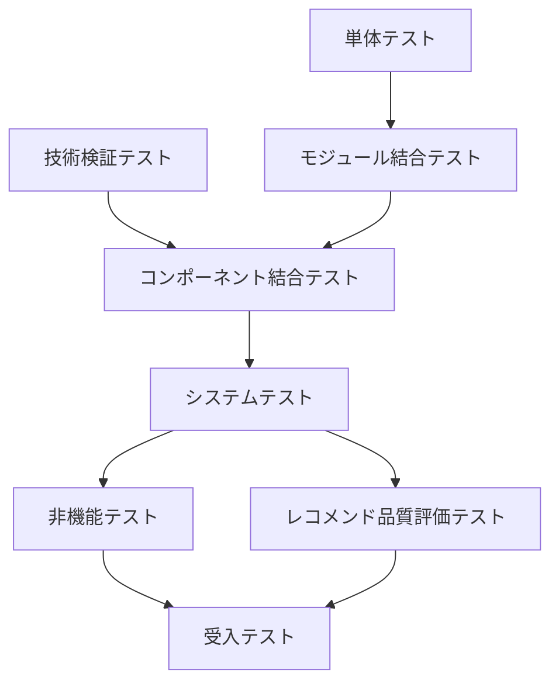

# テスト方針書

## 1. 概要

### 1.1 目的

本ドキュメントは、Gift Recommendation Service MVP におけるテスト全体の基本方針を定義する。

本サービスは、ユーザー入力に基づく意味推定、Feature生成、商品推薦、Batchによる商品データ事前生成、外部API連携、ログ・メトリクス収集を含む。そのため、通常のWebアプリケーションとしての動作確認だけでなく、以下を重点的に検証する。

```
- ユーザー入力が正しく推薦リクエストとして扱われること
- Online推薦処理が期待する順序で実行されること
- Batchで商品データ・Feature・Embeddingが正しく事前生成されること
- Online処理がBatch生成済みデータを正しく参照できること
- reco / batch の双方から shared_logic を正しく利用できること
- 楽天API / 外部AI API の実レスポンス特性を早期に把握できること
- Feature / Meaning / Ranking / Reasonの結果が破綻していないこと
- エラー時に安全に失敗し、原因追跡できるログが残ること
- MVPとして必要な性能・可用性・セキュリティ・UXを満たすこと
```

本サービスのインターフェースは、Public API、Internal API、External API、Storage、DB、Vector Store、Workflow、共通ロジック、Observabilityに分類される。また、Online推薦中に楽天API等の外部商品APIを呼び出さず、外部商品データ取得はbatchが担当する方針である。

---

## 2. テスト成果物の位置づけ

### 2.1 テスト成果物の管理単位

テスト成果物は、共通成果物とテストフェーズ別成果物に分けて管理する。

```
共通
  ├─ テスト方針書
  ├─ テスト定義書
  └─ 全体テスト計画書

技術検証テスト（docs/90_PoC/ 等）
  ├─ テスト計画/
  ├─ テストケース/
  │    ├─ 楽天API疎通
  │    ├─ 外部AI API疎通
  │    └─ 実レスポンス分析レポート
  ├─ テスト結果/
  └─ レポート/

単体テスト（docs/07_開発・単体テスト/）
  ├─ テスト計画/
  ├─ テストケース/
  │    ├─ api
  │    ├─ batch
  │    ├─ database
  │    ├─ reco
  │    ├─ shared
  │    └─ web
  ├─ テスト結果/
  └─ レポート/

モジュール結合テスト（docs/08_モジュール結合テスト/）
  ├─ テスト計画/
  ├─ テストケース/
  ├─ テスト結果/
  └─ レポート/

コンポーネント結合テスト（docs/09_コンポーネント結合テスト/）
  ├─ テスト計画/
  ├─ テストケース/
  ├─ テスト結果/
  └─ レポート/

システムテスト（docs/10_システムテスト/）
  ├─ テスト計画/
  ├─ テストケース/
  ├─ テスト結果/
  └─ レポート/

非機能テスト（docs/11_非機能テスト/）
  ├─ テスト計画/
  ├─ テストケース/
  ├─ テスト結果/
  └─ レポート/

レコメンド品質評価テスト（docs/12_レコメンド品質評価テスト/）
  ├─ テスト計画/
  ├─ テストケース/
  ├─ テスト結果/
  └─ レポート/

受入テスト（docs/13_受入テスト/）
  ├─ テスト計画/
  ├─ テストケース/
  ├─ テスト結果/
  └─ レポート/
```

### 2.2 成果物ごとの役割

| 成果物                 | 役割                                                                     |
| ---------------------- | ------------------------------------------------------------------------ |
| テスト方針書           | テスト全体の思想、重視する品質、対象範囲、優先度を定義する               |
| テスト定義書           | テストレベル、テスト種別、テスト観点、対象範囲を定義する                 |
| 全体テスト計画書       | 各テストフェーズの順序、環境、体制、開始条件、終了条件を定義する         |
| フェーズ別テスト計画書 | 各フェーズ固有の実施方針、対象、環境、完了条件を定義する                 |
| テストケース           | 各フェーズごとの入力、前提データ、操作手順、期待結果、確認方法を定義する |
| テスト実施結果報告書   | テスト結果、不具合、残課題、品質判定を記録する                           |

---

## 3. テスト基本方針

| 方針                                 | 内容                                                                                                             |
| ------------------------------------ | ---------------------------------------------------------------------------------------------------------------- |
| MVP中核導線を最優先する              | レコメンド実行、商品詳細表示、Feedback、商品データ取込、Item Feature生成、Item Embedding生成を優先する           |
| Online / Batchを分けて検証する       | 同期処理であるOnlineと、事前生成・定期実行であるBatchは失敗パターンが異なるため分離して検証する                  |
| 実API疎通を早期に検証する            | 楽天API / 外部AI APIはMockだけでは仕様・データ特性を把握できないため、独立した技術検証テストとして早期に確認する |
| Recoはモジュール段階で検証する       | 入力解析、User Feature生成、Retrieval、Matching、Ranking、Reason生成を段階的に検証する                           |
| shared_logicの共通利用を重点検証する | `reco → shared_logic` と `batch → shared_logic` の両方を検証対象とする                                           |
| 再現性を重視する                     | 同一入力、同一商品データ、同一versionでは、同等のFeature・Embedding・推薦結果が得られることを確認する            |
| 外部依存はMockと実疎通を使い分ける   | CIや単体テストではMockを使い、技術検証では実APIを使う                                                            |
| ログ・メトリクスも検証対象にする     | phase_log、error_log、batch_run_log、api_call_log、分布メトリクスが正しく残ることを確認する                      |
| 推薦品質評価を機能テストと分ける     | APIが仕様通り動くことと、推薦結果が妥当であることは別の評価軸として扱う                                          |

---

## 4. テストフェーズ方針

### 4.1 テストフェーズ一覧

| フェーズ                 | 目的                                                                | 主な対象                                                   |
| ------------------------ | ------------------------------------------------------------------- | ---------------------------------------------------------- |
| 技術検証テスト           | 外部API・外部サービスの実疎通、実レスポンス、制約を早期に確認する   | 楽天API、外部AI API、API Key、レスポンスschema、レート制限 |
| 単体テスト               | 関数・クラス・Repository単位の正しさを確認する                      | api / batch / database / reco / shared / web               |
| モジュール結合テスト     | 同一コンポーネント内のモジュール接続を確認する                      | reco内部、batch内部、api内部、shared_logic利用             |
| コンポーネント結合テスト | コンポーネント間・外部境界間の連携を確認する                        | web→api、api→reco、reco→shared、batch→shared、batch→DB     |
| システムテスト           | MVP主要導線をEnd-to-Endで確認する                                   | レコメンド実行、Feedback、Batch取込〜Online参照            |
| 非機能テスト             | 性能・可用性・セキュリティ・運用性・観測性を確認する                | API、Reco、Batch、DB、ログ、監視                           |
| レコメンド品質評価テスト | 推薦結果・理由文・Feature / Meaningが贈答文脈に対して妥当か確認する | Reco、Feature Engine、Ranking、Reason                      |
| 受入テスト               | MVPとしてユーザーに提供可能か最終確認する                           | 主要ユースケース、UX、リリース判定                         |

### 4.2 フェーズ間の基本順序



技術検証テストは、すべての単体テスト完了を待たず、開発初期に先行または並行して実施する。目的は、外部API仕様・実データ特性・レート制限・schema揺れを早期に把握し、後続のバッチ仕様、IF仕様、テストデータ設計の手戻りを減らすことである。

---

## 5. 技術検証テスト方針

### 5.1 位置づけ

技術検証テストは、通常の品質保証テストではなく、**外部依存リスクを早期に潰すための検証フェーズ**とする。

特に、楽天APIや外部AI APIは、Mockだけでは以下を完全には再現できない。

```
- null / 欠損 / 空文字 / 空配列
- 想定外の型・文字列・HTML混入
- 価格・ランキング・レビュー・ジャンルの実データ分布
- ページング上限、件数、重複、並び順
- rate limit、timeout、4xx / 5xxのレスポンス形式
- Embedding次元、LLM出力揺れ、応答遅延
```

### 5.2 実施対象

| 対象              | 検証内容                                                                        |
| ----------------- | ------------------------------------------------------------------------------- |
| 楽天商品検索API   | 認証、検索条件、レスポンスschema、価格、画像URL、レビュー、ジャンル、ページング |
| 楽天ランキングAPI | ranking取得、rank、ジャンル別ランキング、重複、snapshot化に必要な項目           |
| 楽天ジャンルAPI   | ジャンル階層、親子関係、更新頻度、欠損                                          |
| 楽天属性API       | MVP任意。取得可否、schema、Feature補助情報としての有用性                        |
| Embedding API     | 認証、入力長、ベクトル次元、timeout、rate limit、コスト感                       |
| LLM API           | Semantic抽出、Reason生成、出力揺れ、失敗応答、JSON安定性                        |

### 5.3 実施タイミング

| タイミング           | 方針                                                   |
| -------------------- | ------------------------------------------------------ |
| 開発初期             | 最小スクリプトで実API疎通を実施する                    |
| Batch仕様確定前      | 楽天APIレスポンス特性をバッチ仕様へ反映する            |
| コンポーネント結合前 | API key、timeout、rate limit、schema差分を把握しておく |
| CI                   | 原則実APIは叩かない。Mock / Fixtureを利用する          |
| Staging              | 必要に応じて限定的に実API疎通を再確認する              |

---

## 6. shared_logicテスト方針

### 6.1 基本方針

shared_logicは、Online側のUser Feature生成と、Batch側のItem Feature生成の両方から利用される。

したがって、以下の2経路を明示的に検証する。

| 呼び出し元 | 呼び出し先   | 主な用途                                                             |
| ---------- | ------------ | -------------------------------------------------------------------- |
| reco       | shared_logic | User Feature生成、Feature正規化、User Meaning射影                    |
| batch      | shared_logic | Item Semantic生成、Item Feature生成、Item Meaning射影、Feature正規化 |

### 6.2 検証方針

| 観点     | 方針                                                                                         |
| -------- | -------------------------------------------------------------------------------------------- |
| 共通性   | reco / batchで同一Feature定義、同一正規化ルール、同一Meaning射影を利用できること             |
| 再現性   | 同一入力・同一versionでは同等の結果になること                                                |
| 差異許容 | User入力とItemデータでは入力形式が異なるため、前処理差分と共通ロジック差分を分離して検証する |
| version  | semantic_config_version、feature_normalization_versionと紐づいた結果になること               |
| 境界値   | Feature値が定義範囲を逸脱しないこと                                                          |

テーブル一覧では、User FeatureはOnlineで生成し、Item FeatureはBatchで事前生成するが、同一Feature Engineの利用を前提とする方針が整理されている。

---

## 7. 非機能テスト方針

性能面では、レコメンドAPIのp95は2,000ms、最大5,000ms、行動記録APIのp95は200msがSLOとして定義されている。また、Reco内部では入力解析、Meaning推定、Retrieval、Ranking、レスポンス整形に処理時間を分解して設計する方針である。

| 分類          | 方針                                                                          |
| ------------- | ----------------------------------------------------------------------------- |
| 性能          | レコメンドAPI、Reco内部処理、DB検索、Batch処理時間を測定する                  |
| 可用性        | timeout、リトライ、fallback、部分障害時の安全な挙動を検証する                 |
| セキュリティ  | 入力検証、secret非出力、内部情報非露出、CORSを確認する                        |
| 運用性        | GitHub Actions、再実行、ログ検索、障害調査を確認する                          |
| Observability | trace_id、phase_log、error_log、batch_run_log、api_call_log、metricを確認する |
| UX            | 入力負荷、応答速度、エラー表示、再試行導線、理由文理解を確認する              |

---

## 8. テスト完了方針

### 8.1 MVPリリース前の必須完了条件

| 区分           | 完了条件                                                                                       |
| -------------- | ---------------------------------------------------------------------------------------------- |
| 技術検証       | 楽天API / 外部AI APIの実疎通、レスポンスschema、主要データ特性、rate limitの確認が完了している |
| web            | 入力、結果表示、商品詳細、Feedback、エラー表示が確認済み                                       |
| api            | MVP対象Public APIが正常系・異常系ともに確認済み                                                |
| reco           | 固定fixtureで主要推薦パイプラインが再現可能                                                    |
| shared         | reco / batchの双方からFeature Engineを正しく利用できる                                         |
| batch          | 商品取込、Item反映、Feature生成、Embedding生成が確認済み                                       |
| DB             | 主要テーブルへの保存・参照・関連づけが確認済み                                                 |
| log            | trace_id、phase_log、error_log、batch_run_logが確認済み                                        |
| 性能           | MVP想定条件で主要SLOを概ね満たす                                                               |
| レコメンド品質 | 固定評価ケースで重大な推薦破綻がない                                                           |
| 不具合         | Critical / High不具合が0件                                                                     |
