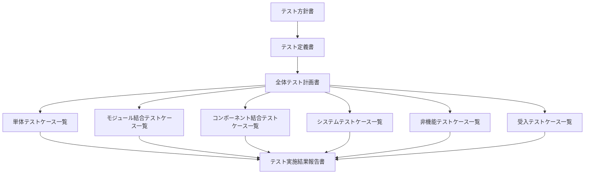
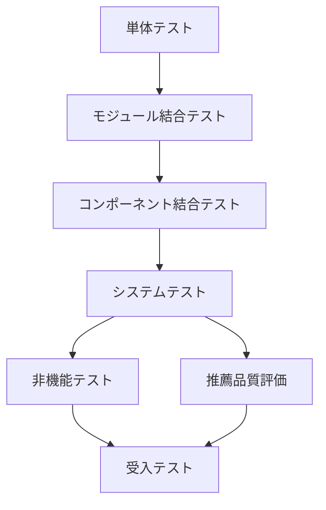

# テスト方針書

## 1. 概要

### 1.1 目的

本ドキュメントは、Gift Recommendation Service MVP におけるテスト全体の基本方針を定義する。

本サービスは、一般的なWebアプリケーションではなく、以下の性質を持つ。

- ユーザー入力に基づく意味推定を行う
- User Feature / Item Feature を用いて推薦する
- 商品データ・Feature・EmbeddingはBatchで事前生成する
- Online処理では、Batchで準備済みの推薦用データを参照して高速に推薦する
- 推薦結果、理由、Feedback、ログ、メトリクスを後続改善に利用する

したがって、本サービスのテストでは、単に「画面が動く」「APIが返る」だけでなく、以下を確認対象とする。

```
- ユーザー入力が正しく推薦リクエストとして扱われること
- Online推薦処理が期待する順序で実行されること
- Batchで商品データ・Feature・Embeddingが正しく事前生成されること
- Online処理がBatch生成済みデータを正しく参照できること
- Feature / Meaning / Ranking / Reasonの結果が破綻していないこと
- エラー時に安全に失敗し、原因追跡できるログが残ること
- MVPとして必要な性能・可用性・セキュリティ・UXを満たすこと
```

Online処理とBatch処理は設計上明確に分離されており、Onlineはレコメンド実行・Feedback登録・商品詳細取得、Batchは商品取得・Raw保存・Item反映・Feature生成・Embedding生成・分布集計を担う前提である。また、Online処理中に楽天APIへ商品情報を取りに行かない方針である。

---

## 2. 本ドキュメントの位置づけ

### 2.1 テスト系成果物の全体像

テスト系成果物は、以下の順序で作成・管理する。



---

### 2.2 成果物ごとの役割

| 成果物               | 役割                                                                                                 |
| -------------------- | ---------------------------------------------------------------------------------------------------- |
| テスト方針書         | テスト全体の思想、重視する品質、対象範囲、優先度、完了基準の大枠を定義する                           |
| テスト定義書         | テストレベル、テスト種別、テスト観点、対象機能・対象IF・対象Batchごとの確認方針を定義する            |
| 全体テスト計画書     | 各テストフェーズを、どの順序・環境・体制・期間・開始条件・終了条件で実施するかを計画する             |
| テストケース一覧     | 全体テスト計画書で定義された各テストフェーズごとに、具体的な入力、手順、期待結果、確認方法を定義する |
| テスト実施結果報告書 | テスト実施結果、不具合、残課題、品質評価、リリース可否をまとめる                                     |

---

## 3. テスト成果物の作成順序

### 3.1 正しい作成順序

本プロジェクトでは、以下の順序でテスト成果物を作成する。

| 順序 | 成果物               | 目的                                                 |
| ---- | -------------------- | ---------------------------------------------------- |
| 1    | テスト方針書         | 何を重視してテストするかを決める                     |
| 2    | テスト定義書         | どのテストフェーズ・種別・観点で検証するかを定義する |
| 3    | 全体テスト計画書     | 各テストフェーズをどう実施するかを計画する           |
| 4    | テストケース一覧     | 各テストフェーズごとの具体テストケースを作成する     |
| 5    | テスト実施結果報告書 | 実施結果と品質判断を記録する                         |

---

### 3.2 テスト成果物の管理単位

テスト成果物は、共通成果物とテストフェーズ別成果物に分けて管理する。

共通成果物では、テスト全体の方針・定義・計画を管理する。

各テストフェーズでは、フェーズ別のテスト計画書を作成し、その配下でテストケースおよびテスト実施結果を管理する。

```text
共通
  ├─ テスト方針書
  ├─ テスト定義書
  └─ 全体テスト計画書

単体テスト
  ├─ 単体テスト計画書
  └─ テストケース・テスト結果
      ├─ api
      ├─ batch
      ├─ database
      ├─ reco
      ├─ shared
      └─ web

モジュール結合テスト
  ├─ モジュール結合テスト計画書
  └─ テストケース・テスト結果

コンポーネント結合テスト
  ├─ コンポーネント結合テスト計画書
  └─ テストケース・テスト結果

システムテスト
  ├─ システムテスト計画書
  └─ テストケース・テスト結果

非機能テスト
  ├─ 非機能テスト計画書
  └─ テストケース・テスト結果

レコメンド品質評価テスト
  ├─ レコメンド品質評価テスト計画書
  └─ テストケース・テスト結果

受入テスト
  ├─ 受入テスト計画書
  └─ テストケース・テスト結果
```

---

## 4. テスト基本方針

| 方針                             | 内容                                                                                                        |
| -------------------------------- | ----------------------------------------------------------------------------------------------------------- |
| MVP中核導線を最優先する          | レコメンド実行、商品詳細表示、Feedback、商品データ取込、Item Feature生成、Item Embedding生成を優先する      |
| Online / Batchを分けて検証する   | 同期処理であるOnlineと、事前生成・定期実行であるBatchは失敗パターンが異なるため、テストフェーズでも分離する |
| Recoはモジュール段階で検証する   | 入力解析、User Feature生成、Candidate Retrieval、Matching、Ranking、Reason生成を段階的に検証する            |
| 共通Feature Engineを重視する     | User FeatureとItem Featureで同一思想のFeature推定ロジックを使うため、共通ロジックの検証を重視する           |
| 再現性を重視する                 | 同一入力、同一商品データ、同一versionでは、同等のFeature・Embedding・推薦結果が得られることを確認する       |
| 外部依存をモック化する           | 楽天API、LLM API、Embedding APIは、正常・0件・timeout・rate limit・schema揺れをモックで検証する             |
| ログ・メトリクスも検証対象にする | phase_log、error_log、batch_run_log、api_call_log、分布メトリクスが正しく残ることを確認する                 |
| 自動化可能なものはCI対象にする   | 単体テスト、型チェック、API契約テスト、Batch dry-run、主要RepositoryテストはCIで継続実行する                |
| 推薦品質評価を機能テストと分ける | APIが仕様通り動くことと、推薦結果が妥当であることは別の評価軸として扱う                                     |

---

## 5. テスト対象範囲

### 5.1 対象コンポーネント

| コンポーネント    | テスト対象                                                                        |
| ----------------- | --------------------------------------------------------------------------------- |
| web               | 入力画面、結果表示、商品詳細表示、Feedback送信、エラー表示                        |
| api               | Public API、Validation、Request保存、Reco呼び出し、Response整形、Feedback保存     |
| reco              | 推薦パイプライン、Feature推定、Retrieval、Matching、Ranking、Reason生成           |
| batch             | 楽天API取得、Raw保存、Staging変換、Item反映、Feature生成、Embedding生成、分布集計 |
| database          | Request、Run、Result、Item、Feature、Embedding、Feedback、Log、Metricの保存・参照 |
| object storage    | Raw JSON保存・読取、object_key管理                                                |
| pgvector          | Item Embedding保存・検索                                                          |
| external services | 楽天API、LLM API、Embedding APIの正常・異常レスポンス                             |
| GitHub Actions    | 日次・週次・手動Batch workflow、needs、workflow_call、concurrency                 |
| Observability     | trace_id、phase_log、error_log、batch_run_log、api_call_log、metric               |

インターフェース設計では、Public API、Internal API、External API、Storage、DB、Vector Store、Workflow、共通ロジック、ObservabilityがMVP対象IFとして整理されているため、テスト対象もこの分類に合わせる。

---

### 5.2 MVP対象外または後続扱い

| 対象               | 方針                                              |
| ------------------ | ------------------------------------------------- |
| 会員登録・ログイン | MVPでは認証なし前提のため、詳細な認証テストは後続 |
| 購入完了連携       | 外部ECへの遷移までを対象とし、購入完了取得は後続  |
| 管理画面           | Admin / Evaluation IFは後続扱い                   |
| 本格A/Bテスト      | MVPでは手動評価・固定評価ケース中心とする         |
| 大規模負荷試験     | MVP想定範囲内の簡易負荷・性能確認に留める         |

---

## 6. テストフェーズ方針

### 6.1 テストフェーズ一覧

| フェーズ                 | 目的                                            | 主な対象                              | 主な成果物                         |
| ------------------------ | ----------------------------------------------- | ------------------------------------- | ---------------------------------- |
| 単体テスト               | 関数・クラス・Repository単位の正しさを確認する  | api / reco / batch / shared logic     | 単体テストケース一覧               |
| モジュール結合テスト     | モジュール間の入出力接続を確認する              | Reco内部、Batch内部                   | モジュール結合テストケース一覧     |
| コンポーネント結合テスト | web / api / reco / batch / DB等の接続を確認する | Public API、Internal API、DB、Storage | コンポーネント結合テストケース一覧 |
| システムテスト           | MVP主要導線をEnd-to-Endで確認する               | レコメンド実行、Feedback、Batch取込   | システムテストケース一覧           |
| 非機能テスト             | 性能・可用性・セキュリティ・運用性を確認する    | API、Reco、Batch、DB、ログ            | 非機能テストケース一覧             |
| 推薦品質評価             | 推薦結果・理由文・Feature分布の妥当性を確認する | Reco、Feature、Ranking、Reason        | 推薦品質評価ケース一覧             |
| 受入テスト               | MVPとして利用可能かを確認する                   | ユーザー主要シナリオ                  | 受入テストケース一覧               |

---

### 6.2 フェーズ間の基本順序



---

## 7. テスト種別方針

| テスト種別          | 目的                                                      | 主な適用フェーズ             |
| ------------------- | --------------------------------------------------------- | ---------------------------- |
| 正常系テスト        | 想定入力で正しく動作することを確認する                    | 全フェーズ                   |
| 異常系テスト        | 入力不正、外部API失敗、DB失敗、timeout時の挙動を確認する  | 単体〜システム               |
| 境界値テスト        | budget、top_k、文字数、件数上限などの境界を確認する       | 単体〜API結合                |
| API契約テスト       | Request / Response / status code / error schemaを確認する | コンポーネント結合           |
| DB整合性テスト      | 保存・参照・関連・Snapshot・versionの整合性を確認する     | コンポーネント結合〜システム |
| Batch冪等性テスト   | 同一条件再実行時に重複・不整合が出ないことを確認する      | Batch結合〜システム          |
| 回帰テスト          | 既存機能が変更後も壊れていないことを確認する              | CI / リリース前              |
| 性能テスト          | レスポンス時間、timeout、スループットを確認する           | 非機能                       |
| 障害・復旧テスト    | 失敗時のログ、状態、再実行性を確認する                    | 非機能 / Batch               |
| セキュリティテスト  | 入力検証、secret保護、内部情報非露出を確認する            | 非機能                       |
| Observabilityテスト | trace_id、log、metricが追跡可能であることを確認する       | 全フェーズ                   |
| 推薦品質評価        | 意味的妥当性、理由文妥当性、分布異常を確認する            | 推薦品質評価                 |

---

## 8. コンポーネント別テスト方針

### 8.1 web

| 観点           | 方針                                                                            |
| -------------- | ------------------------------------------------------------------------------- |
| 入力           | relationship、occasion、budget、好み、避けたい条件、NG条件を入力できること      |
| マスタ取得     | Relationship / Occasion / Feature Rule等の入力マスタを取得できること            |
| レコメンド実行 | `/api/v1/recommendations` を呼び出し、loading / success / errorを制御できること |
| 結果表示       | 商品名、価格、画像、外部EC URL、推薦理由を表示できること                        |
| Feedback       | resultId / resultItemIdと紐づけてFeedback送信できること                         |
| エラー表示     | 内部エラー詳細を出さず、ユーザー向け安全メッセージを表示できること              |
| UX             | 入力負荷が高すぎず、MVPの主要導線が迷わず完了できること                         |

---

### 8.2 api

| 観点         | 方針                                                                         |
| ------------ | ---------------------------------------------------------------------------- |
| Validation   | 必須項目、型、enum、budget、top_k、NG条件を検証する                          |
| mode補完     | webからのPublic APIではmodeを受け取らず、api側で `ui` 相当として扱う         |
| Request保存  | `recommendation_request` に入力条件、budget_min / budget_max、modeを保存する |
| Pair解決     | relationship_id / occasion_idからpair_masterを解決できること                 |
| Reco呼び出し | api → recoのInternal API呼び出し時にtrace_idを伝播する                       |
| Response整形 | Public APIへ内部詳細を過剰に返却しない                                       |
| Feedback保存 | `recommendation_feedback` をresult / resultItemと紐づけて保存する            |
| エラー処理   | エラーコード、safe message、trace_idを返却・記録する                         |

---

### 8.3 reco

| 観点                 | 方針                                                                            |
| -------------------- | ------------------------------------------------------------------------------- |
| Recommendation Run   | run開始、成功、失敗、timeout時の状態・ログを確認する                            |
| Config / Version解決 | semantic_config_version、model_version、feature_normalization_versionを解決する |
| User Semantic生成    | ユーザー入力からSemantic Conceptを抽出する                                      |
| User Feature生成     | relationship、occasion、pair、自由入力、避けたい条件をFeatureへ反映する         |
| User Meaning射影     | User FeatureからSocial / Symbolicを算出する                                     |
| Retrieval            | Hard Filter後に候補商品を取得する                                               |
| Matching             | User FeatureとItem Featureの距離・一致度を算出する                              |
| Ranking              | context、popularity、risk、MMRを踏まえて順位付けする                            |
| Reason生成           | 推薦理由が商品・文脈・Featureと矛盾しないことを確認する                         |
| Result保存           | result、result_item、reasonを保存する                                           |
| Phase Log            | パイプライン主要フェーズがログに残ることを確認する                              |

---

### 8.4 batch

| 観点             | 方針                                                                                           |
| ---------------- | ---------------------------------------------------------------------------------------------- |
| 楽天API取得      | 商品、ランキング、ジャンル、必要に応じて属性を取得できること                                   |
| Raw保存          | Raw JSON本体をObject Storageへ保存し、DBにはmetadataを保存する                                 |
| Staging変換      | Raw JSONを内部取込形式へ変換できること                                                         |
| Item反映         | item、item_image、item_review_summary等へ反映できること                                        |
| Ranking Snapshot | ranking_snapshot単位でランキングを保存し、rank単位で冪等に反映できること                       |
| Feature生成      | 商品データ更新、semantic_config_version変更、normalization version変更を再生成条件にできること |
| Embedding生成    | 商品データ更新、embedding model version変更、embedding_input_hash変更を再生成条件にできること  |
| 分布集計         | Feature / Meaning / Normalization分布を記録できること                                          |
| 再実行           | 失敗Item、Raw、Batch Run単位で再実行できること                                                 |
| 終端状態更新     | 中間状態を過剰にDB更新せず、終端状態中心に管理できること                                       |

Batch workflowは、日次・週次・手動の親workflowを用意し、子workflowをworkflow_callで呼び出し、先行関係はjobs.needs、同時実行抑止はconcurrencyで制御する方針である。

---

### 8.5 database / storage / vector

| 観点         | 方針                                                                              |
| ------------ | --------------------------------------------------------------------------------- |
| 正本保存     | Request、Result、Item、Feedback等の内部正本が保存されること                       |
| Snapshot保存 | recommendation_result_item、ranking_snapshotが後続更新に影響されないこと          |
| 派生データ   | user_feature、item_feature、item_embeddingがversion・input_hashと紐づくこと       |
| Raw管理      | Raw JSON本体はStorage、metadataはDBで管理されること                               |
| Vector検索   | item_embeddingが保存され、query embeddingから検索できること                       |
| ログ保存     | phase_log、error_log、batch_run_log、api_call_logが検索可能な粒度で保存されること |
| 再現性       | 推薦結果再現に必要なrequest、run、version、snapshot、resultが保存されること       |

テーブル一覧では、Online推薦系、User意味推定系、Item系、外部商品データ連携系、Item派生データ系、Semantic / Feature定義系、Master / Config系、Evaluation系、Log / Observability系に分類されている。

---

## 9. 非機能テスト方針

### 9.1 性能テスト

| 対象                | 方針                                                                                  |
| ------------------- | ------------------------------------------------------------------------------------- |
| レコメンドAPI       | p95 2秒以内、最大5秒以内を目標に確認する                                              |
| 行動記録 / Feedback | p95 200ms以内を目標に確認する                                                         |
| Reco内部処理        | 入力解析、Meaning推定、Retrieval、Ranking、レスポンス整形の処理時間を分解して計測する |
| DB                  | item retrieval、embedding検索、result保存、log保存の性能を確認する                    |
| Batch               | 件数、外部API待ち、DB書込、Feature / Embedding生成時間を確認する                      |

性能要件では、レコメンドAPIはp50 800ms、p95 2,000ms、p99 4,000ms、最大5,000ms、行動記録APIはp95 200msが目標として定義されている。

---

### 9.2 障害・可用性テスト

| 対象                | 方針                                                    |
| ------------------- | ------------------------------------------------------- |
| Reco timeout        | apiが安全にエラー処理し、trace_id付きで記録すること     |
| DB一時障害          | リトライまたは安全な失敗処理を確認する                  |
| 楽天API失敗         | api_call_log、batch_run_log、error_logに記録されること  |
| LLM / Embedding失敗 | 対象itemまたはrun単位で失敗記録され、再実行できること   |
| 0件候補             | 仕様どおりに空結果またはfallbackを扱うこと              |
| Batch途中失敗       | 後続jobが不用意に実行されず、再実行単位が特定できること |

---

### 9.3 セキュリティテスト

| 対象                 | 方針                                                                          |
| -------------------- | ----------------------------------------------------------------------------- |
| 入力検証             | SQL Injection相当文字列、過大文字列、不正型、不正enumを検証する               |
| Secret保護           | API Key、DB接続文字列、Authorization Headerをログ出力しない                   |
| Public APIレスポンス | model_version_id、score_breakdown、reason_basis等の内部情報を不用意に返さない |
| CORS                 | 想定Originからの呼び出しのみ許可されること                                    |
| エラー情報           | stack traceや内部構造をユーザー向けレスポンスに出さない                       |

---

### 9.4 Observabilityテスト

| 対象          | 方針                                                                      |
| ------------- | ------------------------------------------------------------------------- |
| trace_id      | web → api → reco → DB、batch → 外部API → storage → DBを横断追跡できること |
| phase_log     | Reco / Batchの主要フェーズが記録されること                                |
| error_log     | error_code、component、target_id、trace_id、detailが記録されること        |
| batch_run_log | batch_name、run_status、開始・終了時刻、件数が記録されること              |
| api_call_log  | 外部API呼び出し結果、latency、status、エラーが記録されること              |
| metric        | latency、error_rate、throughput、Feature分布、Meaning分布が記録されること |

---

### 9.5 UXテスト

| 対象         | 方針                                           |
| ------------ | ---------------------------------------------- |
| 入力体験     | ユーザーが迷わず条件入力できること             |
| 結果理解     | なぜ推薦されたかを理由文で理解できること       |
| エラー時     | 再試行すべきか、条件を変えるべきかが分かること |
| 外部EC遷移   | 商品詳細から購入先へ自然に遷移できること       |
| モバイル表示 | MVP主要画面が最低限利用可能であること          |

---

## 10. 推薦品質評価方針

### 10.1 位置づけ

推薦品質評価は、通常の機能テストとは分けて管理する。

理由は、以下の2つは性質が異なるためである。

| 種別         | 確認すること                                               |
| ------------ | ---------------------------------------------------------- |
| 機能テスト   | API、DB、Batch、画面が仕様通り動作すること                 |
| 推薦品質評価 | 推薦結果が贈答文脈・意味・商品特性に照らして妥当であること |

---

### 10.2 評価観点

| 観点          | 確認内容                                                     |
| ------------- | ------------------------------------------------------------ |
| 文脈適合性    | relationship / occasion / pairに対して商品が不自然でないこと |
| 予算適合性    | budget_min / budget_maxを満たすこと                          |
| NG回避        | NG条件に該当する商品が出ないこと                             |
| Feature妥当性 | item_feature / user_featureの値が直感と大きくズレないこと    |
| Meaning妥当性 | Social / Symbolicの位置づけが文脈と矛盾しないこと            |
| Ranking妥当性 | 上位商品が下位商品より文脈に合っていること                   |
| Reason妥当性  | 理由文が商品・文脈・特徴量と矛盾しないこと                   |
| 多様性        | MMR等により同質商品ばかりにならないこと                      |
| 安全性        | 高リスク文脈で極端に攻めた商品が上位に出すぎないこと         |

---

### 10.3 評価方式

| 方式               | MVPでの扱い                                                               |
| ------------------ | ------------------------------------------------------------------------- |
| 固定評価ケース     | 必須。relationship / occasion / budget / NG条件を固定した評価ケースを作る |
| 人手評価           | 必須。推薦理由と上位商品をレビューする                                    |
| 自動メトリクス     | 可能な範囲で実施。0件率、NG混入率、予算違反率、分布異常を測る             |
| Offline Evaluation | MVPでは簡易。評価データセット整備後に拡張                                 |
| A/Bテスト          | 後続                                                                      |

---

## 11. テストデータ方針

| 分類              | 方針                                                                                 |
| ----------------- | ------------------------------------------------------------------------------------ |
| API入力データ     | 正常系、境界値、異常系、自由入力、NG条件を用意する                                   |
| マスタデータ      | relationship、occasion、pair、feature_definition、semantic_configを固定fixture化する |
| 商品データ        | 少量の固定item、画像、価格、ジャンル、ランキングを用意する                           |
| Featureデータ     | item_feature、user_featureの期待値比較用fixtureを用意する                            |
| Embeddingデータ   | 外部APIに依存しない固定ベクトルまたはmockを用意する                                  |
| 外部APIレスポンス | 楽天API成功、0件、timeout、rate limit、schema変更をmock化する                        |
| 評価データ        | 推薦品質評価用のevaluation_caseを用意する                                            |

---

## 12. 自動化方針

| 対象               | 方針                                                    |
| ------------------ | ------------------------------------------------------- |
| Lint / Format      | CIで必須実行                                            |
| Type Check         | TypeScript / PythonともにCI対象                         |
| Unit Test          | api / reco / batch / shared logicの主要ロジックをCI対象 |
| API Contract Test  | Public API / Internal APIのRequest / Responseを検証     |
| DB Migration Test  | DDL適用、seed投入、rollback可否を検証                   |
| Batch Dry-run      | 外部APIをmockし、Raw → Staging → Itemまでを検証         |
| Reco Pipeline Test | 固定fixtureで推薦パイプラインを検証                     |
| E2E Test           | stagingでMVP主要導線を検証                              |
| 推薦品質評価       | 初期は手動中心。後続で自動評価を拡張                    |

---

## 13. テスト完了方針

### 13.1 MVPリリース前の必須完了条件

| 区分     | 完了条件                                                 |
| -------- | -------------------------------------------------------- |
| web      | 入力、結果表示、商品詳細、Feedback、エラー表示が確認済み |
| api      | MVP対象Public APIが正常系・異常系ともに確認済み          |
| reco     | 固定fixtureで主要推薦パイプラインが再現可能              |
| batch    | 商品取込、Item反映、Feature生成、Embedding生成が確認済み |
| DB       | 主要テーブルへの保存・参照・関連づけが確認済み           |
| storage  | Raw JSON保存・読取・metadata連携が確認済み               |
| vector   | item_embedding保存・検索が確認済み                       |
| log      | trace_id、phase_log、error_log、batch_run_logが確認済み  |
| 性能     | MVP想定条件で主要SLOを概ね満たす                         |
| 障害     | timeout、外部API失敗、DB失敗時の安全な挙動が確認済み     |
| 推薦品質 | 固定評価ケースで重大な推薦破綻がない                     |
| 不具合   | Critical / High不具合が0件                               |

---

### 13.2 不具合重大度

| 重大度   | 定義                                                                  | リリース可否 |
| -------- | --------------------------------------------------------------------- | ------------ |
| Critical | レコメンド実行不可、DB破壊、主要Batch実行不可、重大なセキュリティ問題 | 不可         |
| High     | 推薦結果が大きく不正、Feature生成不正、主要ログ欠落、再実行不能       | 原則不可     |
| Medium   | 一部条件で表示不備、軽微なランキング不整合、運用回避可能なBatch失敗   | 判断         |
| Low      | 文言、軽微なUI、内部ログの軽微な不足                                  | 可           |

---

## 14. 後続成果物への引き継ぎ

### 14.1 テスト定義書で定義すること

| 項目             | 内容                                                                           |
| ---------------- | ------------------------------------------------------------------------------ |
| テストレベル定義 | 単体、モジュール結合、コンポーネント結合、システム、非機能、受入、推薦品質評価 |
| テスト種別定義   | 正常系、異常系、境界値、回帰、性能、障害、セキュリティ、Observability等        |
| テスト観点一覧   | 機能別、モジュール別、IF別、Batch別、DB別、非機能別の観点                      |
| 対象範囲         | MVP対象、後続対象、対象外                                                      |
| テストデータ方針 | fixture、mock、seed、評価データの考え方                                        |
| 品質評価観点     | 推薦妥当性、理由文妥当性、Feature分布妥当性                                    |

---

### 14.2 全体テスト計画書で定義すること

| 項目                 | 内容                                                                           |
| -------------------- | ------------------------------------------------------------------------------ |
| テストフェーズ       | 単体、モジュール結合、コンポーネント結合、システム、非機能、推薦品質評価、受入 |
| 実施順序             | 各フェーズの先行関係                                                           |
| 実施環境             | local、CI、dev、staging、production smoke                                      |
| 実施体制             | 作成者、実施者、レビュー者、承認者                                             |
| 開始条件             | 各フェーズを開始できる条件                                                     |
| 終了条件             | 各フェーズを完了できる条件                                                     |
| テストケース管理単位 | フェーズ別テストケース一覧の管理方法                                           |
| 不具合管理           | 起票、重大度、優先度、再テスト、クローズ条件                                   |
| リリース判定         | 品質ゲート、残不具合、リスク受容条件                                           |

---

### 14.3 テストケース一覧で定義すること

テストケース一覧は、全体テスト計画書で定義されたフェーズごとに作成する。

| 項目                           | 内容                                         |
| ------------------------------ | -------------------------------------------- |
| テストケースID                 | フェーズごとに一意なID                       |
| テストフェーズ                 | 単体、結合、システム、非機能、受入など       |
| 対象機能 / IF / Batch / Module | 検証対象                                     |
| テスト観点                     | テスト定義書上の観点                         |
| 前提データ                     | DB、fixture、mock、外部APIレスポンス         |
| 入力値                         | API Request、画面入力、Batch起動パラメータ   |
| 実行手順                       | 操作・実行手順                               |
| 期待結果                       | 画面、API Response、DB更新、ログ、メトリクス |
| 確認方法                       | 画面確認、SQL、ログ確認、自動テスト結果      |
| 自動化可否                     | 自動 / 手動 / 半自動                         |
| 合否                           | Pass / Fail                                  |
| 不具合ID                       | 関連するIssue / Bug ID                       |

---

## 15. 一言まとめ

```
本サービスのテストでは、
テスト方針書で「何を重視するか」を決め、
テスト定義書で「どの観点で確認するか」を定義し、
全体テスト計画書で「どのフェーズをどう実施するか」を計画し、
その配下でフェーズ別のテストケースを作成・管理する。

MVPでは特に、
レコメンド中核導線、Batch商品準備、Feature / Embedding生成、
推薦品質、Observability、再実行性を重点的に検証する。
```
