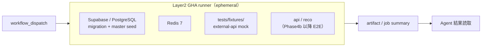

# テスト環境設計書

## 1. 目的

本ドキュメントは、Gift Recommendation Service MVP における **テスト実行環境**（Layer1 PR CI / Layer2 GHA ephemeral / Layer3 cloud dev）と **AI Agent によるテスト運用** の正本を定義する。

Epic C（`gha-test-environment`）Task C6 の成果物である。Layer2 GHA ephemeral 環境、Layer2 workflow 一覧、全テストレベルに対する Agent 運用対応（§2.6）を、テスト定義書 §4.1・CI・CD方針書・Epic C Epic Definition の `agent_test_operations` と整合させる。

本ドキュメントでは、具体的なテストケース、dispatch コマンド詳細、Fix ループ上限の手順は定義しない。dispatch 手順の正本は [Layer2 Agent dispatch手順書.md](./Layer2%20Agent%20dispatch%E6%89%8B%E9%A0%86%E6%9B%B8.md) とする。

---

## 2. 本ドキュメントの位置づけ

| 成果物 | 役割 |
| ------ | ---- |
| テスト方針書 | テスト全体の思想、重視する品質、対象範囲 |
| テスト定義書 | テストレベル（§4.1）、種別、観点、Layer2 fixture 方針 |
| 全体テスト計画書 | フェーズ順序、環境計画、開始 / 終了条件 |
| **本ドキュメント** | **テスト環境（Layer1〜3）・Layer2 workflow 一覧・Agent 運用対応表（§2.6）の正本** |
| Layer2 Agent dispatch手順書 | Agent 向け `workflow_dispatch` / artifact 読取 / Fix ループ手順 |
| CI・CD方針書 | PR CI 品質ゲート、workflow 分類、Layer2 と PR CI の分離方針 |

### 2.1 Layer1 / Layer2 / Layer3 の境界

| Layer | 実行経路 | 典型環境 | 典型 workflow | Agent の主用途 |
| ----- | -------- | -------- | ------------- | -------------- |
| Layer1 | PR CI（`push` / `pull_request`） | GHA runner（build / test のみ） | `ci.yml`, `ci-contract.yml`, `ci-web.yml` 等（Epic D） | Task PR の lint / build / unit / contract |
| Layer2 | `workflow_dispatch`（on-demand） | GHA runner 上 **ephemeral DB + Redis** | `ci-db.yml`, `test-system.yml`, `test-reco-quality.yml` | システム / 品質テストの dispatch・結果読取 |
| Layer3 | cloud dev URL 入力（defer） | hosted dev / staging URL | — | Epic B defer。本ドキュメントの対象外 |

Layer2 workflow は **通常 PR 品質ゲート（Layer1）に混在させない**（CI・CD方針書 §13.4、Epic C `agentic_process.constraints`）。

Definition Run Harness（`/review-pr` 等 Command 実行）は Layer2 テスト dispatch とは別系統である（[Layer2 Agent dispatch手順書.md](./Layer2%20Agent%20dispatch%E6%89%8B%E9%A0%86%E6%9B%B8.md) §2.2）。

### 2.2 Epic C focus（システム / 品質 Layer2）

Epic C（`gha-test-environment`）は **Layer2「基盤 + システム / 品質 workflow」** にフォーカスする。

| 区分 | Epic C 明示スコープ | Epic C 外（参照のみ） |
| ---- | ------------------- | --------------------- |
| テストレベル | **システムテスト**、**レコメンド品質評価テスト** | 単体〜コンポーネント結合（Layer1 / Phase4a/4b）、受入（Phase8） |
| 環境 | GHA ephemeral DB + Redis、`workflow_dispatch` | cloud dev 常時起動（Epic B defer）、staging 本番相当 |
| 成果物 | `ci-db.yml`、fixture / test seed、Layer2 workflow、Agent dispatch docs | app 別 PR CI（Epic D）、Phase8 受入 docs 詳細 |

C3 / C4 の pass 条件は Phase4b 最小 API 整備後に本格化する。それ以前は workflow 骨格 + skip / placeholder を許容する（Epic C `agent_test_operations.epic_c_focus`）。

### 2.3 Agent テスト運用の共通パターン

Epic C `agent_test_operations.common_pattern` に従う。

| 段階 | 内容 | 担当 Agent（例） |
| ---- | ---- | ---------------- |
| 作成 | テストコード・fixture・workflow を Task scope 内で作成 | Test AI / Worker AI |
| 実行 | Layer2 は `workflow_dispatch`。Layer1 は PR CI または Task PR 内 `pnpm test` / `pytest` | Worker AI / Test AI |
| 読取 | GHA run log / artifact / job summary を解釈 | Worker AI / Test AI |
| Fix | 失敗に応じて修正 → 再 dispatch（Layer2 は上限あり） | Fixer AI / 同一 Agent |
| 記録 | PR 本文・Task 完了条件・正本 docs | Worker AI |

Layer2 の Fix ループ上限・エスカレーションは [Layer2 Agent dispatch手順書.md](./Layer2%20Agent%20dispatch%E6%89%8B%E9%A0%86%E6%9B%B8.md) §9 を正とする。

### 2.4 Layer2 GHA ephemeral 環境（概要）

Layer2 テストは **GHA runner 上で Supabase（PostgreSQL）+ Redis を ephemeral 起動**し、job 終了とともに破棄する。cloud dev URL 常時起動は不要（2026-06-18 Human 判断）。



| 構成要素 | 正本 | 備考 |
| -------- | ---- | ---- |
| Ephemeral DB 起動 | `.github/workflows/ci-db.yml` | `supabase start` → migration → master seed |
| システムテスト | `.github/workflows/test-system.yml` | Redis service + DB 内蔵起動。既定 `skip_api_e2e=true` |
| 品質評価 | `.github/workflows/test-reco-quality.yml` | 固定評価ケース + 自動メトリクス artifact |
| fixture | `tests/fixtures/`（索引: `manifest.json`） | Layer2 既定は mock（テスト定義書 §8.1） |
| test seed | `supabase/seeds/test-data/` | `scripts/db/seed-test-data.sh` 経由 |

### 2.5 Layer2 workflow 一覧

| workflow ファイル | workflow 名 | Epic Task | テストレベル | 起動方式 | 主な artifact |
| ----------------- | ----------- | --------- | ------------ | -------- | ------------- |
| `.github/workflows/ci-db.yml` | `CI DB Ephemeral` | C1 | （基盤） | `workflow_dispatch` / `workflow_call` | `database_url` output |
| `.github/workflows/test-system.yml` | `Test System (Layer2)` | C3 | システムテスト | `workflow_dispatch` | `test-system-report` |
| `.github/workflows/test-reco-quality.yml` | `Test Reco Quality` | C4 | レコメンド品質評価テスト | `workflow_dispatch` | `reco-quality-evaluation-<run_id>` |

将来追加予定（Epic C と同型。dispatch 手順は Layer2 Agent dispatch手順書に準拠）:

| パターン | 用途 | テストレベル |
| -------- | ---- | ------------ |
| `tech-verify-*.yml` | 外部 API 等の技術検証 | 技術検証テスト |
| `perf-feasibility-*.yml` | 性能フィジビリティ | 非機能テスト（初期段階） |

Agent 向け dispatch 手順・inputs・artifact 読取の詳細は [Layer2 Agent dispatch手順書.md](./Layer2%20Agent%20dispatch%E6%89%8B%E9%A0%86%E6%9B%B8.md) §4〜§8 を正とする。

### 2.6 全テストレベル Agent 運用対応表

テストレベル名称は **テスト定義書 §4.1 テストレベル一覧** に準拠する。Epic C Epic Definition `agent_test_operations.level_map` と整合させる。

| テストレベル（§4.1） | Agent 利用 | Layer | 実行経路 | テスト環境 | Epic / Phase 関係 | 正本参照 |
| -------------------- | ---------- | ----- | -------- | ---------- | ----------------- | -------- |
| 技術検証テスト | 想定 | Layer2 | `tech-verify-*.yml`（`workflow_dispatch`） | GHA runner + 実 API / fixture | Epic C と同型。別 workflow として拡張可 | CI・CD方針書 §14（技術検証 workflow） |
| 単体テスト | 想定 | Layer1 | PR CI（Epic D）+ Task PR 内 `pnpm test` / `pytest` | local / GHA runner | Epic C 外（Phase4a/4b） | テスト定義書 §9.2 |
| モジュール結合テスト | 想定 | Layer1 | PR CI + `apps/*/tests/module/` | local / GHA runner | Epic C 外（Phase4a/4b） | テスト定義書 §9.3 |
| コンポーネント結合テスト | 想定 | Layer1 | mock / fixture + PR CI | local / GHA runner | Epic C 外（Phase4b） | テスト定義書 §9.4 |
| システムテスト | 想定 | Layer2 | `test-system.yml`（`workflow_dispatch`） | GHA ephemeral DB + Redis | **Epic C 明示スコープ**（C3） | 本ドキュメント §2.5、テスト定義書 §9.5 |
| 非機能テスト | 想定 | Layer2 + 将来 stg | `perf-feasibility-*.yml` + staging | GHA / staging | Epic C 後続 or 別 Epic | テスト定義書 §9.6 |
| レコメンド品質評価テスト | 想定（自動）+ Human（人手評価） | Layer2 | `test-reco-quality.yml`（`workflow_dispatch`） | GHA ephemeral + fixture mock | **Epic C 明示スコープ**（C4）。人手評価は Agent 単独完了不可 | 本ドキュメント §2.5、テスト定義書 §9.7 |
| 受入テスト | 想定（補助） | — | Human 主導 + Agent 結果整理 | staging / production smoke | Phase8（本 Task scope 外） | 全体テスト計画書 §7 |

> **整合ルール**: 本表を更新する場合は、テスト定義書 §4.1 のテストレベル名称を先に確認し、Epic Definition `agent_test_operations.level_map` との差分を PR 本文に記載する。

---

## 3. Layer2 環境構成詳細

### 3.1 Ephemeral DB（`ci-db.yml`）

| 項目 | 内容 |
| ---- | ---- |
| 目的 | GHA runner 上で migration + master seed 済み DB を provision |
| 起動 | `scripts/db/start-local.sh`（Supabase CLI pin 準拠） |
| 検証 | `scripts/db/verify-seed-setup.sh`, `scripts/db/check-cli-version.sh` |
| 利用 | `test-system.yml` 内で同一 runner 起動、または `workflow_call` で URL 受け渡し |
| PR CI 混在 | **禁止**（Layer1 `ci.yml` とは分離） |

### 3.2 システムテスト環境（`test-system.yml`）

| 項目 | 内容 |
| ---- | ---- |
| DB | job 内 ephemeral Supabase stack |
| Redis | GHA `services.redis`（`redis:7-alpine`） |
| 外部 API | fixture mock 既定（テスト定義書 §8.1） |
| Phase4b 前 | 既定 `skip_api_e2e=true`（API health / RecommendationRun E2E を skip） |
| cloud dev | `api_base_url` / `reco_base_url` 入力は将来拡張（Epic B defer 時は空 = localhost） |

正本: テスト定義書 §9.5.3、[Layer2 Agent dispatch手順書.md](./Layer2%20Agent%20dispatch%E6%89%8B%E9%A0%86%E6%9B%B8.md) §6。

### 3.3 レコメンド品質評価環境（`test-reco-quality.yml`）

| 項目 | 内容 |
| ---- | ---- |
| パイプライン | `pipeline_mode`: `skeleton`（Phase4b 前）/ `live` |
| OpenAI | `openai_mode`: `mock` 既定。`secrets` は Human 判断後の限定利用 |
| 出力 | 固定評価ケース結果 + 自動メトリクス → artifact / job summary |
| Human 評価 | テスト定義書 §9.7.3。Agent は artifact 出力まで。合否は Human |

正本: テスト定義書 §9.7、[Layer2 Agent dispatch手順書.md](./Layer2%20Agent%20dispatch%E6%89%8B%E9%A0%86%E6%9B%B8.md) §7。

### 3.4 fixture / seed 方針

テスト定義書 §8.1 を正とする。Layer2 では外部 API 不安定化を避けるため **fixture mock を正**とし、secret 実値の commit は禁止する。

---

## 4. Layer1 / Layer3 との関係

### 4.1 Layer1（PR CI）

| 項目 | 内容 |
| ---- | ---- |
| 環境 | GHA runner。永続 DB は原則不要（unit / contract 中心） |
| Epic | Epic D（app 別 PR CI）で拡張予定 |
| Agent | Task PR 作成後、PR CI 結果を読取。Layer2 dispatch とは別経路 |

### 4.2 Layer3（cloud dev — defer）

| 項目 | 内容 |
| ---- | ---- |
| 状態 | Epic B（`hosted-dev-environment`）**defer 確定**（2026-06-18） |
| 影響 | `test-system.yml` の URL 入力は将来拡張。現行 Layer2 は GHA 内完結を正 |
| Agent | cloud dev URL 依存手順は本 Task / Epic C scope 外 |

---

## 5. 関連正本

| ドキュメント | 参照箇所 |
| ------------ | -------- |
| テスト定義書 §4.1 | テストレベル名称（§2.6 の根拠） |
| テスト定義書 §8.1 | Layer2 fixture / OpenAI 注入 |
| テスト定義書 §9.5 / §9.7 | システム / 品質テスト定義 |
| CI・CD方針書 §13.4 | Layer2 workflow 分類 |
| Epic C Epic Definition | `prompts/definitions/epics/gha-test-environment/epic.yaml` — `agent_test_operations` |
| Layer2 Agent dispatch手順書 | dispatch / artifact / Fix ループ |
| ローカル開発手順書 | local 環境（Layer1 補助） |

---

## 6. 一言まとめ

```
1. Layer1 = PR CI、Layer2 = GHA ephemeral + workflow_dispatch、Layer3 = cloud dev（defer）。
2. Epic C は Layer2 基盤とシステム / 品質 workflow（C3/C4）にフォーカスする。
3. 全テストレベルの Agent 運用対応は §2.6 を正本とし、テスト定義書 §4.1 と矛盾させない。
4. Layer2 dispatch の操作手順は Layer2 Agent dispatch手順書が正本である。
```
