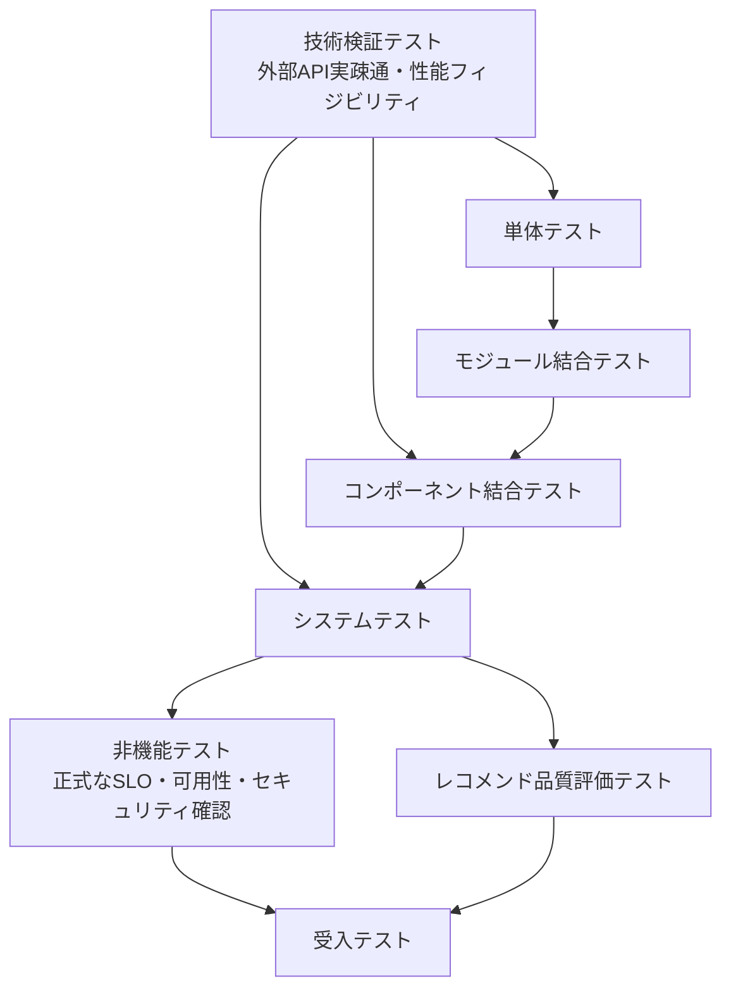

# 全体テスト計画書

## 1. 概要

### 1.1 目的

本ドキュメントは、Gift Recommendation Service MVP における全体テストの実施計画を定義する。

本サービスは、web / api / reco / batch / shared_logic / database / pgvector / object storage / external services / Observability を含む複数コンポーネントで構成される。

また、Online推薦処理とBatch事前生成処理が分離されており、以下の特性を持つ。

| 特性 | 内容 |
|---|---|
| Online処理 | ユーザー入力を受け取り、api / reco / DB / pgvector / shared_logic を利用して推薦結果を返却する |
| Batch処理 | 外部商品データを取得し、Raw保存、Staging変換、Item反映、Feature生成、Embedding生成を行う |
| 共通ロジック | User Feature生成とItem Feature生成で shared_logic を共通利用する |
| 外部依存 | 楽天API、外部AI API、DB、pgvector、Object Storage、GitHub Actionsに依存する |
| 品質特性 | 機能正確性だけでなく、性能、推薦品質、再現性、観測性、運用性が重要である |

そのため、本計画書では以下を定義する。

```text
- テストフェーズの全体構成
- テストフェーズ間の先行関係
- 各フェーズの目的・対象・実施タイミング
- 各フェーズの開始条件・終了条件
- テスト環境方針
- テストデータ方針
- 品質ゲート
- 不具合管理方針
- リリース判定方針
- 後続成果物への引き継ぎ
```

---

## 2. 本ドキュメントの位置づけ

| 成果物 | 役割 |
| --- | --- |
| テスト方針書 | テスト全体の思想、重視する品質、対象範囲、優先度を定義する |
| テスト定義書 | テストレベル、テスト種別、テスト観点、対象範囲を定義する |
| 全体テスト計画書 | 各テストフェーズの順序、環境、開始条件、終了条件、品質ゲートを定義する |
| フェーズ別テスト計画書 | 各テストフェーズ固有の詳細な実施計画を定義する |
| テストケース | 各フェーズごとの入力、前提データ、操作手順、期待結果、確認方法を定義する |
| テスト実施結果報告書 | テスト結果、不具合、残課題、品質判定を記録する |

本ドキュメントでは、具体的なテストケース明細は定義しない。

テストケースは、各テストフェーズ配下の「テストケース・テスト結果」ドキュメントで管理する。

---

## 3. テスト成果物構成

本プロジェクトでは、テスト成果物を以下の単位で管理する。

```
共通
  ├─ テスト方針書
  ├─ テスト定義書
  └─ 全体テスト計画書

技術検証テスト
  ├─ 技術検証テスト計画書
  └─ テストケース・テスト結果
      ├─ 外部API実疎通テスト
      ├─ 外部APIレスポンス特性検証
      ├─ 性能フィジビリティ検証
      ├─ pgvector検索性能検証
      ├─ 外部AI API性能・制約検証
      └─ Batch処理時間検証

単体テスト
  ├─ 単体テスト計画書
  └─ テストケース・テスト結果
      ├─ api
      ├─ batch
      ├─ database
      ├─ reco
      ├─ shared
      └─ web

モジュール結合テスト
  ├─ モジュール結合テスト計画書
  └─ テストケース・テスト結果

コンポーネント結合テスト
  ├─ コンポーネント結合テスト計画書
  └─ テストケース・テスト結果

システムテスト
  ├─ システムテスト計画書
  └─ テストケース・テスト結果

非機能テスト
  ├─ 非機能テスト計画書
  └─ テストケース・テスト結果

レコメンド品質評価テスト
  ├─ レコメンド品質評価テスト計画書
  └─ テストケース・テスト結果

受入テスト
  ├─ 受入テスト計画書
  └─ テストケース・テスト結果
```

---

## 4. 全体テスト戦略

### 4.1 基本戦略

本プロジェクトでは、以下の方針でテストを進める。

| 方針 | 内容 |
| --- | --- |
| 技術リスクを前倒しで検証する | 外部API、外部AI API、pgvector、性能面のリスクは、正式な結合テスト・非機能テストを待たず、技術検証テストで先行確認する |
| 機能品質は段階的に積み上げる | 単体 → モジュール結合 → コンポーネント結合 → システムテストの順に検証範囲を広げる |
| 性能は2段階で検証する | 初期は性能フィジビリティ、後半は本番相当構成で正式な性能テストを行う |
| shared_logicを重点確認する | recoとbatchの双方からshared_logicを呼び出すため、両経路を明示的に検証する |
| 外部APIはMockだけで完結させない | 単体・結合ではMock / Fixtureを利用しつつ、技術検証では実API疎通を行う |
| Batch生成データのOnline参照を確認する | Item Feature / Embedding等のBatch生成済みデータをOnline推薦で正しく参照できることを確認する |
| レコメンド品質を独立して評価する | APIが正常終了することと推薦結果が妥当であることは別の評価軸として扱う |
| Observabilityを品質ゲートに含める | trace_id、run_id、batch_run_id、error_codeで処理追跡できることを確認する |

---

### 4.2 性能検証の考え方

性能検証は、以下の2段階に分ける。

| 区分 | 実施タイミング | 目的 | 判定観点 |
| --- | --- | --- | --- |
| 性能フィジビリティ検証 | 技術検証テスト | アーキテクチャ・処理方式として成立するかを早期確認する | 致命的なボトルネックがないこと |
| 正式な性能テスト | 非機能テスト | 本番相当構成でSLO・処理時間・負荷耐性を確認する | 定義済みSLOを満たすこと |

性能フィジビリティ検証では、以下を重点的に確認する。

```
- Recoパイプラインの概算処理時間
- User Feature生成時間
- Candidate Retrieval / pgvector検索時間
- Matching / Ranking / MMR処理時間
- Item Feature生成時間
- Embedding生成時間
- Batch件数別処理時間
- 外部AI APIの応答時間・rate limit・失敗率
- DB検索 / INSERT / UPSERTの基本性能
```

正式な非機能テストでは、p50 / p95 / p99 / 最大応答時間、RPS、同時アクセス、エラー率、timeout、リトライ、フォールバック、ログ・メトリクス出力を確認する。

---

## 5. テストフェーズ全体構成

### 5.1 テストフェーズ一覧

| 順序 | テストフェーズ | 実施タイミング | 目的 | 主な対象 |
| --- | --- | --- | --- | --- |
| 1 | 技術検証テスト | 設計確定前〜開発初期 | 外部API・外部AI API・pgvector・性能面の成立性を早期確認する | 楽天API、外部AI API、pgvector、Reco、Batch、DB |
| 2 | 単体テスト | 実装中 | 関数・クラス・Repository・UI部品単位の正しさを確認する | web / api / reco / batch / shared / database |
| 3 | モジュール結合テスト | コンポーネント内の主要実装完了後 | 同一コンポーネント内のモジュール接続を確認する | api内部、reco内部、batch内部、shared内部、web内部 |
| 4 | コンポーネント結合テスト | コンポーネント間IF実装後 | コンポーネント間・外部境界間の連携を確認する | web→api、api→reco、reco→shared、batch→shared、batch→DB |
| 5 | システムテスト | 主要機能結合後 | MVP主要導線をEnd-to-Endで確認する | レコメンド実行、商品詳細、Feedback、Batch取込〜Online参照 |
| 6 | 非機能テスト | システムテスト後 | 本番相当構成で性能、可用性、セキュリティ、運用性、観測性を確認する | API、Reco、Batch、DB、ログ、監視 |
| 7 | レコメンド品質評価テスト | システムテスト後 | 推薦結果、理由文、Feature / Meaning / Rankingの妥当性を確認する | Reco、Feature Engine、Matching、Ranking、Reason |
| 8 | 受入テスト | リリース前 | MVPとして提供可能かを最終確認する | 主要ユースケース、UX、運用品質 |

---

### 5.2 フェーズ間の先行関係



### 5.3 先行関係の考え方

| 先行関係 | 理由 |
| --- | --- |
| 技術検証テスト → 単体テスト | 技術検証結果をfixture、mock、実装方針に反映するため |
| 技術検証テスト → コンポーネント結合テスト | 外部API実レスポンスや性能リスクを結合テスト設計に反映するため |
| 技術検証テスト → システムテスト | 実API特性・性能制約をE2Eシナリオやテストデータに反映するため |
| 単体テスト → モジュール結合テスト | モジュール単位の基礎品質を確認した上で接続確認するため |
| モジュール結合テスト → コンポーネント結合テスト | コンポーネント内部が概ね安定してから外部境界を確認するため |
| コンポーネント結合テスト → システムテスト | 主要IFが接続できている状態でE2Eを確認するため |
| システムテスト → 非機能テスト | システムとして組み上がった状態で正式な非機能要件を確認するため |
| システムテスト → レコメンド品質評価テスト | 推薦結果が出力できる状態で品質評価を行うため |
| 非機能テスト / 品質評価テスト → 受入テスト | リリース判断に必要な品質確認を完了してから受入するため |

---

## 6. テスト環境計画

### 6.1 環境一覧

| 環境 | 用途 | 主な実施フェーズ |
| --- | --- | --- |
| local | 開発者単位の実装確認、単体テスト、簡易モジュール結合 | 技術検証、単体、モジュール結合 |
| CI | lint、typecheck、unit test、API contract test、回帰テスト | 単体、回帰 |
| dev | コンポーネント間接続確認、DB接続確認、Batch dry-run | モジュール結合、コンポーネント結合 |
| staging | 本番相当構成でのE2E、非機能、品質評価、受入前確認 | システム、非機能、品質評価、受入 |
| production | リリース後のsmoke test、監視確認のみ | 本番確認 |

---

### 6.2 外部API利用方針

| 環境 | 外部API利用方針 |
| --- | --- |
| local | 原則Mock / Fixture。技術検証時のみ実API利用可 |
| CI | 実APIは原則利用しない。Mock / Fixtureのみ |
| dev | 限定的に実API疎通可。通常はMock / Fixture |
| staging | 必要に応じて限定的な実API再確認を行う |
| production | 通常運用のみ。テスト目的の外部API連打は行わない |

---

### 6.3 Mock / 実接続方針

| 対象 | 技術検証テスト | 単体テスト | モジュール結合テスト | コンポーネント結合テスト | システムテスト | 非機能テスト |
| --- | --- | --- | --- | --- | --- | --- |
| 楽天API | 実API | Mock / Fixture | Mock / Fixture | 原則Mock / Fixture、必要に応じて限定実API | 原則Fixture | 原則Mock / Fixture |
| LLM API | 実API | Mock | Mock / Fixture | 原則Mock、一部実接続可 | 原則Mock / Fixture | 必要に応じて限定実接続 |
| Embedding API | 実API | Mock | Mock / Fixture | 原則Mock、一部実接続可 | 原則Mock / Fixture | 必要に応じて限定実接続 |
| DB | test DB / 実相当DB | test DB | test DB | dev / staging DB | staging DB | staging DB |
| pgvector | 実相当件数で検証 | test DB | test DB | dev / staging DB | staging DB | staging DB |
| Object Storage | test bucket | Mock / local | Mock / test bucket | test bucket | test bucket | test bucket |
| GitHub Actions | workflow_dispatch確認 | 原則対象外 | 原則対象外 | workflow単位で確認 | 本番相当workflow確認 | workflow運用確認 |

---

## 7. フェーズ別計画

---

## 7.1 技術検証テスト計画

### 7.1.1 目的

技術検証テストでは、設計・方式選定上の前提が成立するかを早期に確認する。

特に以下のリスクは、後工程で発覚するとアーキテクチャ、DB設計、Batch設計、Reco設計、テストデータ設計に大きな手戻りが発生するため、初期段階で検証する。

```
- 外部APIの実レスポンスが設計前提と異なる
- 外部AI APIの応答時間・rate limit・コストが想定より重い
- pgvector検索が想定件数で遅い
- RecoパイプラインがSLOに収まらない
- Batch処理が深夜〜早朝枠に収まらない
- Feature / Embedding生成がOnline / Batch責務に合わない
```

### 7.1.2 対象

| 検証ID | 検証名 | 主な確認内容 | 判断結果の反映先 |
| --- | --- | --- | --- |
| TV-001 | 楽天商品検索API実疎通 | 項目、欠損、ページング、rate limit、エラー形式 | 外部商品データ連携、Batch仕様、テーブル設計 |
| TV-002 | 楽天ランキングAPI実疎通 | ranking_snapshot化に必要な項目、rank、genreId、period、重複 | Batch仕様、Ranking設計 |
| TV-003 | 楽天ジャンルAPI実疎通 | ジャンル階層取得、親子関係、更新差分 | Master設計、Batch仕様 |
| TV-004 | 楽天属性API実疎通 | 取得可否、schema、Feature補助情報としての有用性 | Feature設計、Batch仕様 |
| TV-005 | 外部AI API疎通 | Embedding / LLMの応答時間、rate limit、失敗形式 | Reco設計、Batch設計、Error設計 |
| TV-006 | pgvector検索性能 | 件数別検索時間、index効果、類似検索速度 | DB設計、Retrieval設計 |
| TV-007 | Reco性能フィジビリティ | 入力解析〜Rankingまでの概算時間 | Reco設計、非機能設計 |
| TV-008 | Batch性能フィジビリティ | 件数別処理時間、chunk / 並列化要否 | Batch設計、Workflow設計 |
| TV-009 | Feature生成性能 | User / Item Feature生成時間 | shared_logic設計、Online / Batch責務 |
| TV-010 | Embedding生成性能 | API応答時間、バッチ生成時間、コスト感 | Embedding設計、Batch設計 |

### 7.1.3 実施環境

| 項目 | 内容 |
| --- | --- |
| 実施環境 | local / dev |
| 実施方式 | Python検証スクリプト、curl、Postman、SQL測定等 |
| 外部API | 実APIを利用 |
| DB | test DB / 実相当件数を投入した検証DB |
| CI実行 | 原則対象外 |
| 成果物 | 実API疎通結果、実レスポンス分析レポート、性能フィジビリティ結果、fixture候補、設計反映メモ |

### 7.1.4 開始条件

| 条件 | 内容 |
| --- | --- |
| API Key準備 | 楽天API、外部AI APIの検証用認証情報が準備されている |
| 最小スクリプト準備 | 疎通確認・性能測定用の最小スクリプトが作成されている |
| 検証観点整理 | schema、欠損、ページング、rate limit、性能観点が整理されている |
| 仮データ準備 | pgvector、DB、Batch性能検証に必要な最小データが準備されている |

### 7.1.5 終了条件

| 条件 | 内容 |
| --- | --- |
| 実API疎通完了 | 主要APIの正常疎通が確認されている |
| 実レスポンス分析完了 | schema、null、欠損、ページング、エラー形式が確認されている |
| 性能成立性確認 | Reco、pgvector、Batch、外部AI API、DBに致命的な性能懸念がない |
| fixture候補作成 | 後続Mock / Fixtureに使う代表レスポンスが保存されている |
| 設計反映事項整理 | 後続のBatch仕様、IF仕様、DB設計、非機能設計へ反映すべき事項が整理されている |

---

## 7.2 単体テスト計画

### 7.2.1 目的

各コンポーネント内の小さな処理単位が、外部依存を切り離した状態で正しく動作することを確認する。

### 7.2.2 対象

| 対象 | 主な確認内容 |
| --- | --- |
| web | UIコンポーネント、入力制御、表示条件、エラー表示、API client |
| api | Validation、DTO変換、Usecase、Repository、Error変換 |
| reco | Feature計算、距離計算、スコア計算、Ranking、Reason生成 |
| batch | API client、Raw変換、差分判定、hash算出、Queue登録、集計処理 |
| shared_logic | Feature Engine、正規化、Social / Symbolic射影、共通型 |
| database | Migration、制約、Seed、Repository単位のSQL |

### 7.2.3 実施環境

| 項目 | 内容 |
| --- | --- |
| 実施環境 | local / CI |
| 外部API | Mock / Fixture |
| DB | local test DB / test DB |
| 自動化 | 原則CI対象 |

### 7.2.4 開始条件

| 条件 | 内容 |
| --- | --- |
| 実装単位完成 | 対象関数・クラス・Repositoryが実装されている |
| テストデータ準備 | 単体テスト用fixtureが準備されている |
| 実行コマンド整備 | testコマンドが用意されている |
| 技術検証結果反映 | 実APIレスポンス由来の主要fixtureが反映されている |

### 7.2.5 終了条件

| 条件 | 内容 |
| --- | --- |
| 主要ロジック合格 | MVP中核ロジックの単体テストが成功している |
| CI成功 | lint / typecheck / unit test が成功している |
| Critical / Highなし | 単体レベルでの重大不具合が残っていない |

---

## 7.3 モジュール結合テスト計画

### 7.3.1 目的

同一コンポーネント内の複数モジュールを接続し、モジュール間の入出力が正しく連携することを確認する。

### 7.3.2 対象

| 対象領域 | 主な結合対象 |
| --- | --- |
| api内部 | Controller → Validation → Usecase → Repository → Error Handler |
| reco内部 | Input Parse → User Feature → Retrieval → Matching → Ranking → Reason |
| batch内部 | Fetch Plan → API Client → Raw保存 → Staging → Diff → Item反映 → Feature生成 |
| shared内部 | Semantic変換 → Feature生成 → 正規化 → Meaning射影 |
| reco × shared_logic | Reco入力解析 → shared Feature Engine → User Feature → User Meaning |
| batch × shared_logic | Itemデータ → shared Feature Engine → Item Feature → Item Meaning |
| web内部 | 画面入力 → 状態管理 → API Client → 結果表示 |

### 7.3.3 実施環境

| 項目 | 内容 |
| --- | --- |
| 実施環境 | local / dev |
| 外部API | Mock / Fixture |
| DB | test DB |
| 自動化 | 主要パスはCI対象、複雑なBatch経路は半自動 |

### 7.3.4 開始条件

| 条件 | 内容 |
| --- | --- |
| 単体テスト概ね合格 | 対象モジュールの単体テストが概ね合格している |
| モジュール入出力定義 | 入力・出力・エラーの期待値が整理されている |
| fixture準備 | Reco / Batch / shared用のfixtureが準備されている |

### 7.3.5 終了条件

| 条件 | 内容 |
| --- | --- |
| 主要モジュール連携合格 | api / reco / batch / shared / webの主要連携が成功している |
| shared連携確認 | reco→shared_logic、batch→shared_logicの両経路が確認済み |
| エラー伝播確認 | モジュール失敗時のエラー伝播が確認済み |
| ログ出力確認 | 主要フェーズで必要なログが出力されている |

---

## 7.4 コンポーネント結合テスト計画

### 7.4.1 目的

デプロイ単位またはシステム境界をまたぐ連携が正しく動作することを確認する。

### 7.4.2 対象

| IF分類 | 結合対象 | 主な確認内容 |
| --- | --- | --- |
| Public API IF | web → api | Request / Response、status code、Validation、画面反映 |
| Internal API IF | api → reco | Reco推薦実行、trace_id伝播、timeout、エラー変換 |
| External API IF | batch / reco → external services | 技術検証結果を反映したMock / Fixture、および必要最小限の実API再確認 |
| Storage IF | batch → object storage | Raw JSON保存、読取、object_key管理 |
| DB IF | api / reco / batch → database | INSERT / SELECT / UPDATE、トランザクション、整合性 |
| Vector Store IF | reco / batch → pgvector | Embedding保存、検索、類似度取得 |
| Workflow IF | GitHub Actions → batch | workflow起動、依存関係、concurrency |
| 共通ロジックIF | reco → shared_logic | User Feature生成、Feature正規化、User Meaning射影 |
| 共通ロジックIF | batch → shared_logic | Item Feature生成、Feature正規化、Item Meaning射影 |
| Observability IF | api / reco / batch → log / metric | trace_id、phase_log、error_log、metric記録 |

### 7.4.3 実施環境

| 項目 | 内容 |
| --- | --- |
| 実施環境 | dev / staging |
| 外部API | 原則Mock / Fixture。必要最小限で実API再確認 |
| DB | dev DB / staging DB |
| 自動化 | API契約テスト、主要DB連携は自動化対象 |

### 7.4.4 開始条件

| 条件 | 内容 |
| --- | --- |
| モジュール結合完了 | 対象コンポーネント内の主要モジュール結合が完了している |
| 技術検証結果反映 | 実API疎通結果がfixture / mock / schemaへ反映されている |
| 環境接続準備 | web / api / reco / batch / DB / storage / pgvector が接続可能である |
| IF仕様確定 | Public API / Internal API / DB IF / Workflow IFの主要仕様が整理されている |

### 7.4.5 終了条件

| 条件 | 内容 |
| --- | --- |
| 主要IF合格 | MVP対象IFの正常系・主要異常系が確認済み |
| shared IF確認 | reco→shared_logic、batch→shared_logicの両方が確認済み |
| trace_id確認 | web / api / reco / batch / DBログで追跡可能 |
| 外部APIリスク低減 | 実レスポンス由来の主要リスクがテストデータへ反映済み |

---

## 7.5 システムテスト計画

### 7.5.1 目的

MVPの主要業務シナリオがEnd-to-Endで成立することを確認する。

### 7.5.2 対象シナリオ

| シナリオID | シナリオ | 主な確認内容 |
| --- | --- | --- |
| ST-001 | 初期表示導線 | Relationship / Occasion等の入力マスタ取得 |
| ST-002 | レコメンド実行導線 | 入力 → API → Reco → Result保存 → 画面表示 |
| ST-003 | 商品詳細表示導線 | 結果商品選択 → 商品詳細取得 → 商品詳細表示 |
| ST-004 | Feedback送信導線 | 推薦結果明細 → Feedback送信 → DB保存 |
| ST-005 | Batch商品取込導線 | 楽天API fixture → Raw保存 → Staging → Item反映 |
| ST-006 | Batch Feature生成導線 | Item更新 → Queue登録 → Semantic → Feature → Meaning |
| ST-007 | Batch Embedding生成導線 | Item更新 → embedding_input_hash算出 → Embedding保存 |
| ST-008 | Batch生成データOnline参照導線 | Batch済みItem / Feature / EmbeddingをOnline推薦で参照 |
| ST-009 | 0件結果導線 | 候補0件時に安全に空結果または条件変更案内を返す |
| ST-010 | エラー導線 | Reco timeout、DB失敗、外部API失敗時の安全な応答・ログ確認 |
| ST-011 | ログ追跡導線 | trace_id / run_id / batch_run_idで処理を追跡できる |

### 7.5.3 実施環境

| 項目 | 内容 |
| --- | --- |
| 実施環境 | staging |
| 外部API | 原則Fixture。必要に応じて限定的に実API確認 |
| DB | staging DB |
| 自動化 | 主要導線はE2E自動化候補 |

### 7.5.4 開始条件

| 条件 | 内容 |
| --- | --- |
| コンポーネント結合完了 | 主要IFが結合済みである |
| staging環境準備 | web / api / reco / DB / storage / pgvector が稼働している |
| seed投入済み | マスタ、商品、Feature、Embeddingのテストデータが投入済み |
| Batch前提データ準備 | Online推薦で参照するItem Feature / Embeddingが生成済みである |

### 7.5.5 終了条件

| 条件 | 内容 |
| --- | --- |
| MVP主要導線合格 | レコメンド実行、商品詳細、Feedbackが成功している |
| Batch→Online参照確認 | Batch生成済みデータをOnline推薦で参照できている |
| エラー導線確認 | 主要障害時に安全な応答とログ記録ができている |
| Critical / Highなし | リリース阻害不具合が残っていない |

---

## 7.6 非機能テスト計画

### 7.6.1 目的

性能、可用性、スケーラビリティ、セキュリティ、運用性、Observability、UXがMVP要件を満たすことを確認する。

非機能テストは、技術検証テストで確認した性能成立性を前提に、システムテスト後に本番相当構成で正式に実施する。

### 7.6.2 対象

| 非機能分類 | 主な確認内容 |
| --- | --- |
| 性能 | API応答時間、Reco内部処理時間、DB検索時間、Batch処理時間 |
| 負荷 | MVP想定RPS、同時ユーザー数での応答時間・エラー率 |
| 可用性 | timeout時の制御、リトライ、fallback、部分障害時の影響範囲 |
| スケーラビリティ | API / Recoの水平スケール前提、Batch chunk処理 |
| セキュリティ | 入力検証、secret非出力、内部情報非露出、CORS |
| 運用性 | workflow実行、再実行、ログ検索、障害調査 |
| Observability | trace_id、error_log、phase_log、metric、run単位追跡 |
| データ管理 | Snapshot、再現性、保持期間、重複防止 |
| UX | 応答速度、エラー表示、再試行導線、結果理解 |

### 7.6.3 技術検証内の性能フィジビリティとの違い

| 区分 | 技術検証テスト内の性能フィジビリティ検証 | 非機能テスト内の性能テスト |
| --- | --- | --- |
| 実施時期 | 設計確定前〜開発初期 | システムテスト後 |
| 目的 | 方式として成立するかを確認する | 本番相当構成でSLOを満たすか確認する |
| 対象 | Reco、pgvector、Batch、外部AI API、DBの主要ボトルネック | API全体、Reco全体、DB、Batch、ログ、監視 |
| 判定 | 致命的な設計リスクがないこと | 定義済みSLOを満たすこと |
| 結果反映先 | アーキテクチャ、DB設計、Batch設計、Reco設計 | リリース可否、性能改善、運用設計 |

### 7.6.4 実施環境

| 項目 | 内容 |
| --- | --- |
| 実施環境 | staging |
| 外部API | 原則Mock / Fixture |
| DB | staging DB |
| 計測対象 | latency、error_rate、throughput、reco_latency、DB latency、Batch duration |
| 自動化 | 性能測定・ログ確認の一部を自動化候補 |

### 7.6.5 開始条件

| 条件 | 内容 |
| --- | --- |
| システムテスト概ね合格 | 主要導線が安定して動作している |
| 計測準備 | latency、error_rate、throughput、ログ検索が可能 |
| テストデータ準備 | 負荷・障害・セキュリティ確認用データが準備済み |
| 性能フィジビリティ通過 | 技術検証で致命的な性能リスクがないことを確認済み |

### 7.6.6 終了条件

| 条件 | 内容 |
| --- | --- |
| 性能SLO達成 | レコメンドAPI等の主要SLOを概ね満たす |
| Secret非露出確認 | APIレスポンス・ログにsecretやstack traceが出ていない |
| 障害時追跡確認 | trace_id / run_id / batch_run_idで障害追跡できる |
| 運用可能性確認 | Batch再実行、ログ検索、障害調査が可能 |
| Critical / Highなし | 非機能観点のリリース阻害不具合が残っていない |

---

## 7.7 レコメンド品質評価テスト計画

### 7.7.1 目的

推薦結果・理由文・Feature / Meaning / Rankingが、贈答文脈に対して妥当であることを確認する。

### 7.7.2 対象

| 対象 | 確認内容 |
| --- | --- |
| User Feature | ユーザー入力、relationship、occasion、pairがFeatureに反映されているか |
| Item Feature | 商品情報から生成されたFeature値が直感と大きく乖離していないか |
| Meaning Space | Social / Symbolicの位置づけが文脈に合っているか |
| Retrieval | 候補商品が文脈・条件に対して大きく外れていないか |
| Matching | User FeatureとItem Featureの一致度が妥当か |
| Ranking | 上位商品が下位商品より贈答文脈に合っているか |
| MMR / 多様性 | 類似商品ばかりに偏っていないか |
| Reason | 推薦理由が商品・文脈・Featureと矛盾していないか |
| NG回避 | NG条件に該当する商品が混入していないか |
| 予算適合 | budget_min / budget_maxを満たしているか |
| 分布妥当性 | Feature / Social / Symbolic / score分布が極端に偏っていないか |

### 7.7.3 実施環境

| 項目 | 内容 |
| --- | --- |
| 実施環境 | staging / evaluation用環境 |
| データ | 固定評価ケース、商品fixture、Feature fixture |
| 実施方式 | 人手レビュー + 自動メトリクス |
| 自動化 | 初期は一部のみ。後続でOffline Evaluationへ拡張 |

### 7.7.4 開始条件

| 条件 | 内容 |
| --- | --- |
| システムテスト主要導線合格 | 推薦実行が安定して実行できる |
| 評価ケース準備 | relationship / occasion / pair / budget / NG条件を含む固定ケースがある |
| 評価観点合意 | 文脈適合性、理由文妥当性、NG回避等の評価観点が合意済み |

### 7.7.5 終了条件

| 条件 | 内容 |
| --- | --- |
| 重大破綻なし | 固定評価ケースで明らかに不自然な推薦がない |
| NG混入なし | NG条件に該当する商品が混入していない |
| 予算違反なし | 上位推薦に予算範囲外商品が含まれていない |
| 理由文妥当 | 理由文が商品・文脈・Featureと矛盾していない |
| 分布異常なし | Feature / score分布に明らかな異常がない |

---

## 7.8 受入テスト計画

### 7.8.1 目的

MVPとしてユーザーに提供可能な状態であることを最終確認する。

### 7.8.2 対象

| 対象 | 確認内容 |
| --- | --- |
| ユーザー入力 | relationship、occasion、budget、好み、NG条件を入力できる |
| レコメンド結果 | 推薦商品と理由が表示される |
| 商品詳細 | 商品情報と外部EC URLが確認できる |
| Feedback | 推薦結果に対して評価を送信できる |
| エラー時UX | 再試行・条件変更が分かる表示になっている |
| 推薦品質 | 明らかに不自然な推薦がない |
| 性能体感 | 利用者視点で応答速度が許容範囲である |
| 運用確認 | ログ・メトリクスで問題を追跡できる |

### 7.8.3 実施環境

| 項目 | 内容 |
| --- | --- |
| 実施環境 | staging |
| 実施方式 | 手動確認中心 |
| 実施者 | Product Owner / 開発者 / レビュー担当 |
| 成果物 | 受入テスト実施結果報告書、リリース判定メモ |

### 7.8.4 開始条件

| 条件 | 内容 |
| --- | --- |
| システムテスト完了 | MVP主要導線のテストが完了している |
| 非機能テスト完了 | 重大な性能・セキュリティ・運用問題がない |
| 品質評価完了 | レコメンド品質評価で重大な破綻がない |
| 残課題整理 | Medium / Low不具合と対応方針が整理されている |

### 7.8.5 終了条件

| 条件 | 内容 |
| --- | --- |
| 受入シナリオ合格 | 主要ユーザーシナリオが合格している |
| Critical / Highなし | リリース阻害不具合が残っていない |
| 残課題合意 | Medium / Low不具合の扱いが合意されている |
| リリース可否判断完了 | MVPリリース可否が判断されている |

---

## 8. テスト実施順序

### 8.1 基本順序

```
1. 技術検証テスト
2. 単体テスト
3. モジュール結合テスト
4. コンポーネント結合テスト
5. システムテスト
6. 非機能テスト
7. レコメンド品質評価テスト
8. 受入テスト
```

### 8.2 並行実施可能なもの

| テスト | 並行可否 | 補足 |
| --- | --- | --- |
| 技術検証テスト | 可 | 設計・実装初期に単体テストと並行実施可能 |
| 単体テスト | 可 | コンポーネントごとに並行実施可能 |
| モジュール結合テスト | 一部可 | api / reco / batch / shared単位で並行可能 |
| コンポーネント結合テスト | 一部可 | IFごとに段階実施可能 |
| 非機能テスト | 一部可 | 性能・セキュリティ・Observabilityは分担可能 |
| レコメンド品質評価 | 一部可 | 固定評価ケース作成はシステムテスト前から可能 |

---

## 9. テストデータ計画

| データ種別 | 用途 | 管理方針 |
| --- | --- | --- |
| 実APIレスポンスサンプル | 技術検証、fixture作成 | 実レスポンス分析レポートに保存 |
| 性能検証用データ | Reco、pgvector、Batch、DB性能の成立性確認 | 件数別に生成・保存 |
| API入力fixture | Request Validation、Reco呼び出し、Feedback送信 | repo内test fixturesで管理 |
| マスタseed | relationship、occasion、pair、feature_definition、semantic_config | seed SQL / seed scriptで管理 |
| 商品fixture | item、item_image、genre、ranking、review summary | JSON / SQLで管理 |
| Feature fixture | user_feature、item_feature、expected score | Reco / shared test用に管理 |
| Embedding fixture | item_embedding、query_embedding、類似検索結果 | 固定ベクトルで管理 |
| Raw JSON fixture | 楽天APIレスポンスmock | 技術検証結果をもとに作成 |
| 異常系fixture | 欠損、不正型、価格不正、販売停止、URL不正 | API / Batch異常系テストで利用 |
| 評価ケース | レコメンド品質評価 | evaluation_case相当として管理 |

---

## 10. テスト実施記録方針

| 記録対象 | 内容 |
| --- | --- |
| テストケースID | フェーズ別に一意なIDを付与 |
| 実施日 | テスト実施日 |
| 実施者 | テスト実施者 |
| 環境 | local / CI / dev / staging / production |
| 入力 | API Request、画面入力、Batch起動条件、検証スクリプト引数 |
| 期待結果 | 画面、API Response、DB、ログ、メトリクス、性能測定値 |
| 実際結果 | 実行結果 |
| 合否 | Pass / Fail / Blocked |
| 関連ログ | trace_id、run_id、batch_run_id、error_code |
| 不具合ID | 関連Issue |
| 設計反映要否 | 技術検証で設計変更が必要かどうか |

---

## 11. 不具合管理方針

### 11.1 不具合重大度

| 重大度 | 定義 | リリース可否 |
| --- | --- | --- |
| Critical | レコメンド実行不可、DB破壊、主要Batch実行不可、重大なセキュリティ問題 | 不可 |
| High | 推薦結果が大きく不正、Feature生成不正、主要ログ欠落、再実行不能、SLO大幅未達 | 原則不可 |
| Medium | 一部条件で表示不備、軽微なランキング不整合、運用回避可能なBatch失敗 | 判断 |
| Low | 文言、軽微なUI、内部ログの軽微な不足 | 可 |

### 11.2 不具合管理項目

| 項目 | 内容 |
| --- | --- |
| 不具合ID | GitHub Issue等で一意に管理 |
| 発見フェーズ | 技術検証、単体、結合、システム、非機能、品質評価、受入 |
| 対象コンポーネント | web / api / reco / batch / shared_logic / DB等 |
| 重大度 | Critical / High / Medium / Low |
| 優先度 | 対応順序 |
| 再現手順 | 入力、環境、操作手順 |
| 期待結果 | 本来期待される結果 |
| 実際結果 | 実際に発生した結果 |
| 関連ログ | trace_id、run_id、batch_run_id、error_code |
| 対応状況 | Open / In Progress / Fixed / Retest / Closed |

---

## 12. 品質ゲート

### 12.1 フェーズ別品質ゲート

| ゲート | フェーズ | 通過条件 | 未達時の対応 |
| --- | --- | --- | --- |
| G1 | 技術検証テスト | 外部API・外部AI API・pgvector・Reco性能・Batch性能に致命的な方式リスクがない | 設計・方式・アーキテクチャを見直す |
| G2 | 単体テスト | MVP対象の主要関数・Repository・Validation・Feature計算が単体で正常に動作する | 実装修正 |
| G3 | モジュール結合テスト | api / reco / batch / shared / web内部の主要連携が成功している | モジュール責務・I/F修正 |
| G4 | コンポーネント結合テスト | web→api、api→reco、reco→shared、batch→shared、batch→DB等の主要IFが成功している | I/F仕様・エラー設計修正 |
| G5 | システムテスト | MVP主要業務フローがE2Eで成立する | 業務フロー・実装修正 |
| G6 | 非機能テスト | 性能・可用性・セキュリティ・運用性・観測性が許容範囲 | アーキテクチャ・基盤・処理方式修正 |
| G7 | レコメンド品質評価テスト | 推薦結果・理由文・Feature / score分布が許容範囲 | Rule / Feature / Ranking調整 |
| G8 | 受入テスト | MVPリリース可能と判断されている | リリース延期またはスコープ調整 |

---

### 12.2 MVPリリース判定基準

| 区分 | 判定基準 |
| --- | --- |
| 機能 | MVP主要機能が正常に利用できる |
| データ | Request、Result、Item、Feature、Embedding、Feedbackが正しく保存・参照できる |
| Batch | 商品取込、Item反映、Feature生成、Embedding生成が実行できる |
| shared_logic | reco / batch双方から共通ロジックを利用できる |
| 性能 | 主要API・Reco処理・Batch処理がMVP許容範囲に収まる |
| セキュリティ | secret、stack trace、内部情報がPublic APIやログに露出しない |
| Observability | trace_id、run_id、batch_run_id、error_codeで原因追跡できる |
| 品質 | 固定評価ケースで重大な推薦破綻がない |
| 不具合 | Critical / High不具合が0件 |

---

## 13. リスクと対応方針

| リスク | 影響 | 対応方針 |
| --- | --- | --- |
| 楽天APIレスポンスが設計前提と異なる | Batch / Table / Staging設計変更 | 技術検証で実API確認し、fixture化する |
| 外部AI APIが遅い | Online性能劣化 | Online利用範囲縮小、Batch事前生成、cacheを検討する |
| pgvector検索が遅い | Reco性能劣化 | index、候補数制御、検索方式見直しを行う |
| Reco処理が2秒台に収まらない | UX悪化、timeout増加 | 事前計算、cache、並列化、Ranking簡略化を検討する |
| Batchが深夜枠に終わらない | データ鮮度低下 | chunk化、並列化、workflow分割を検討する |
| shared_logicの責務が曖昧になる | User Feature / Item Feature生成結果がズレる | shared単体、reco→shared、batch→sharedを重点確認する |
| Feature分布が偏る | 推薦品質低下 | Rule / 正規化統計量 / Feature定義を見直す |
| Mockと実APIの差分 | 後工程で仕様変更 | 実API疎通テストを独立フェーズ化し、結果をFixtureへ反映する |
| ログ不足 | 障害調査不能 | trace_id、phase_log、error_logを品質ゲート化する |
| 推薦品質の主観差 | 合否判断がぶれる | 固定評価ケースと評価観点を事前定義する |

---

## 14. 後続成果物への引き継ぎ

| 後続成果物 | 引き継ぎ内容 |
| --- | --- |
| 技術検証テスト計画書 | 外部APIごとの疎通観点、実レスポンス分析、性能フィジビリティ対象、検証スクリプト |
| 単体テスト計画書 | api / batch / database / reco / shared / webごとの単体テスト範囲 |
| モジュール結合テスト計画書 | api内部、reco内部、batch内部、shared内部、reco×shared、batch×sharedの結合範囲 |
| コンポーネント結合テスト計画書 | Public API、Internal API、External API、Storage、DB、Vector、Workflow、Observability IFの確認範囲 |
| システムテスト計画書 | MVP主要導線のE2E確認範囲 |
| 非機能テスト計画書 | 性能、可用性、セキュリティ、運用性、観測性、UXの正式確認範囲 |
| レコメンド品質評価テスト計画書 | 固定評価ケース、人手評価、自動メトリクス、評価観点 |
| 受入テスト計画書 | MVPリリース可否判断に必要な受入観点 |
| テストケース | 各フェーズごとの具体ケース、入力、期待結果、確認方法 |
| テスト実施結果報告書 | 各フェーズの実施結果、不具合、残課題、品質判定 |

---

## 15. 全体完了基準

全体テストは、以下を満たした時点で完了とする。

```
- 技術検証テストで致命的な方式リスクが解消されている
- 単体テスト、モジュール結合テスト、コンポーネント結合テストが完了している
- MVP主要シナリオのシステムテストが成功している
- 非機能テストでMVP許容範囲の性能・運用性・観測性・セキュリティを満たしている
- レコメンド品質評価で重大な品質問題がない
- 受入テストでMVPリリース可能と判断されている
- Critical / High不具合が0件である
- 残課題の対応方針が合意されている
```

---

## 16. 一言まとめ

```
本計画書では、テストを以下の流れで実施する。

まず、技術検証テストで外部API実レスポンスと性能フィジビリティを早期確認する。
次に、単体テスト・モジュール結合テスト・コンポーネント結合テストで実装品質とIF品質を積み上げる。
その後、システムテストでMVP主要導線を確認する。
最後に、非機能テストとレコメンド品質評価テストでリリース品質を確認し、受入テストでMVP提供可否を判断する。

特に本サービスでは、
外部API実レスポンス、
性能成立性、
shared_logicの共通利用、
Batch生成データのOnline参照、
Feature / Meaning / Ranking / Reasonの妥当性、
trace_idによる追跡性を重点確認対象とする。
```