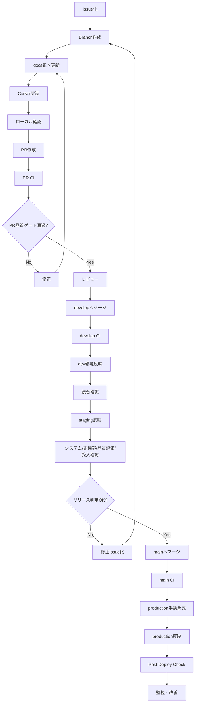
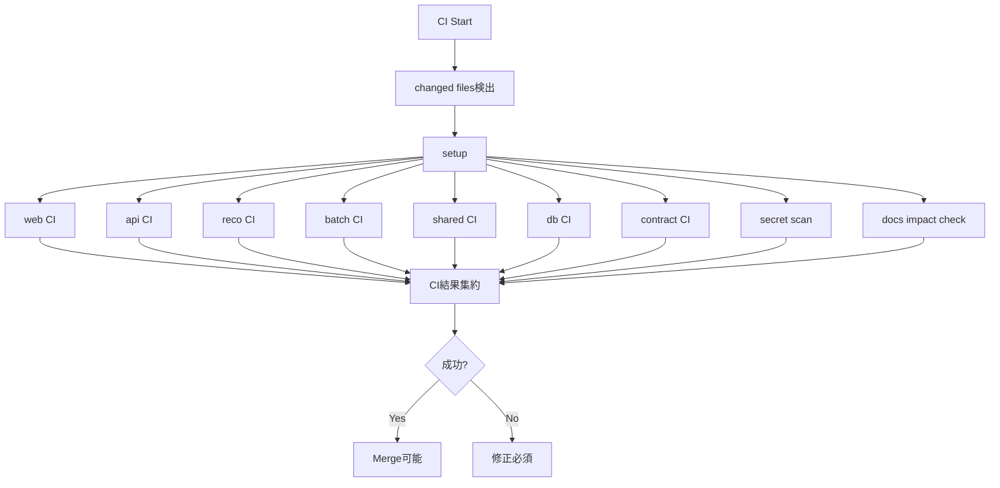
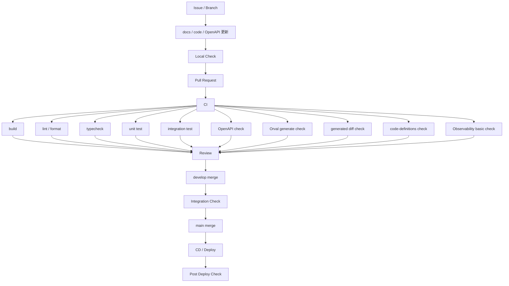
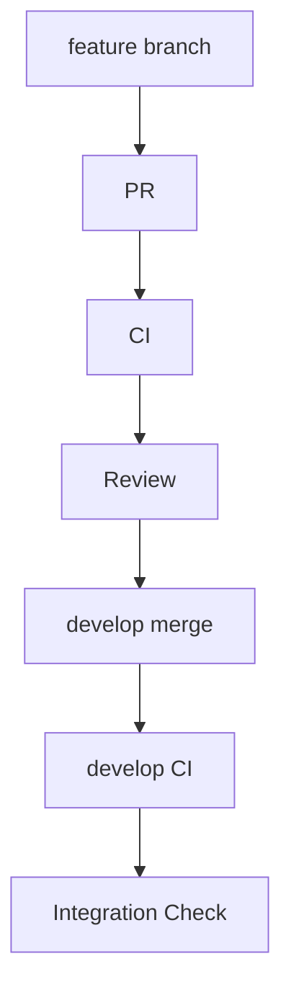
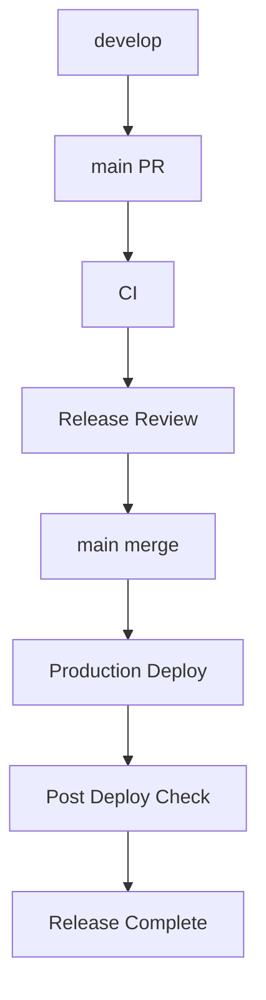

# CI・CD方針書

## 1. 目的

本方針書は、Gift Recommendation Service の開発・テスト・デプロイを自動化し、**品質と開発速度を両立するCI/CD方針**を定義する。

そのため、CI・CDでは以下を実現する。

```text
- 品質ゲートを自動化する
- リリースの安全性を担保する
- 手動作業を最小化する
- テスト方針・ブランチ戦略と整合させる
- docs正本と実装コードの整合性を維持する
- OpenAPIとOrval生成APIクライアントの整合性を維持する
- MVP開発に適した軽量CI/CDを構築する
```

---

## 2. 本ドキュメントの位置づけ

| 成果物                             | 役割                                                                                |
| ---------------------------------- | ----------------------------------------------------------------------------------- |
| DevOps方針書                       | 開発・設計・テスト・リリース・運用全体の上位方針を定義する                          |
| CI・CD方針書                       | GitHub Actionsを中心に、CI/CDのトリガー、ジョブ、品質ゲート、デプロイ方針を定義する |
| テスト方針書                       | テスト全体の思想、対象範囲、品質方針を定義する                                      |
| テスト定義書                       | テストレベル、テスト種別、テスト対象、観点を定義する                                |
| 全体テスト計画書                   | テストフェーズの順序、開始条件、終了条件、品質ゲートを定義する                      |
| バッチ実行スケジュール設計書       | 日次・週次・手動Batch workflowの実行順序とスケジュールを定義する                    |
| プロジェクトディレクトリ構成定義書 | repo内のコード、docs、tests、db、workflowの配置方針を定義する                       |

---

## 3. 前提

| 項目               | 内容                                                          |
| ------------------ | ------------------------------------------------------------- |
| Repository         | monorepo                                                      |
| CI/CD基盤          | GitHub Actions                                                |
| 開発体制           | 個人開発                                                      |
| 正本               | repo内docs                                                    |
| 副本               | Notion                                                        |
| 実装コンポーネント | web / api / reco / batch                                      |
| 共通ロジック       | packages/shared-logic                                         |
| DB                 | PostgreSQL / pgvector                                         |
| Batch実行          | GitHub Actions                                                |
| ブランチ           | main / develop / feature / fix / docs / test / chore / hotfix |
| 本番デプロイ       | MVPでは半自動                                                 |
| 技術検証           | 実API疎通・性能フィジビリティは通常CIとは分離                 |
| Observability      | MVPから品質ゲートに含める                                     |

---

## 4. CI/CD基本方針

| 方針                            | 内容                                                                |
| ------------------------------- | ------------------------------------------------------------------- |
| CIは品質ゲート                  | PR、develop、main反映時に品質を自動確認する                         |
| CDは安全な反映制御              | 自動反映だけでなく、環境別の承認・確認を含める                      |
| MVPは半自動CD                   | production反映は人間の承認を必須とする                              |
| monorepo前提で分割検証          | web / api / reco / batch / shared / dbごとに必要な検証を行う        |
| docs正本と連動                  | 仕様変更時はdocs差分をCI確認対象に含める                            |
| 外部API実疎通は通常CIに含めない | 外部API依存でCIが不安定になるため、技術検証workflowとして分離する   |
| 性能リスクは前倒し検証          | performance feasibilityは技術検証または手動workflowで早期確認する   |
| Observabilityを後付けにしない   | trace_id、run_id、batch_run_id、error_log、metricを確認対象に含める |
| Batch本番実行はpush起動しない   | schedule / workflow_dispatch / workflow_call を基本とする           |
| secretを安全に扱う              | GitHub Secrets / Environments を利用し、ログには出力しない          |

---

## 5. CI/CD全体像

### 5.1 開発〜本番反映フロー



| 項目                | 内容                          |
| ------------------- | ----------------------------- |
| 開発体制            | 個人開発                      |
| Repo                | monorepo                      |
| ブランチ戦略        | main / develop / feature      |
| 正本                | repo内 `docs/`                |
| API契約             | OpenAPI                       |
| APIクライアント生成 | Orval                         |
| コード定義          | `packages/code-definitions/`  |
| CI/CD               | GitHub Actions                |
| テスト方針          | 重点集中型                    |
| Observability       | MVPから重要                   |
| デプロイ            | Web / API / Reco / Batch 分離 |

---

## 6. 環境定義

| 環境       | 用途                                     | 反映契機                    | 承認             |
| ---------- | ---------------------------------------- | --------------------------- | ---------------- |
| local      | 開発、単体確認、技術検証の一部           | 開発者任意                  | 不要             |
| CI         | PR / merge時の自動品質ゲート             | GitHub Actions              | 不要             |
| dev        | develop統合後の開発統合確認              | develop merge後             | 原則不要         |
| staging    | システムテスト、非機能テスト、受入前確認 | 手動またはworkflow_dispatch | 必要に応じて承認 |
| production | 本番                                     | main反映後、手動承認        | 必須             |

---

## 7. ブランチ別CI/CD方針

| ブランチ   | CI                   | CD                 | 方針                       |
| ---------- | -------------------- | ------------------ | -------------------------- |
| feature/\* | 実行                 | なし               | PR品質ゲート用             |
| fix/\*     | 実行                 | なし               | 不具合修正の品質確認       |
| docs/\*    | docs check中心に実行 | なし               | docs正本更新確認           |
| test/\*    | テスト関連CIを実行   | なし               | テスト追加・修正確認       |
| chore/\*   | 変更内容に応じて実行 | なし               | CI、設定、依存関係変更確認 |
| develop    | 実行                 | dev反映            | 統合確認用                 |
| main       | 実行                 | production反映候補 | 本番反映対象               |
| hotfix/\*  | 最小必須CIを優先実行 | production反映候補 | 緊急修正用                 |

---

## 8. CIトリガー方針

| トリガー            | 対象                                          | 用途                                                |
| ------------------- | --------------------------------------------- | --------------------------------------------------- |
| pull_request        | feature / fix / docs / test / chore → develop | PR品質ゲート                                        |
| push                | develop                                       | develop統合後CI、dev反映                            |
| push                | main                                          | main CI、production反映候補作成                     |
| workflow_dispatch   | 任意                                          | 手動CI、技術検証、性能フィジビリティ、Batch手動実行 |
| schedule            | Batch親workflow                               | 日次・週次Batch実行                                 |
| workflow_call       | Batch子workflow                               | 親workflowから子workflowを呼び出す                  |
| repository_dispatch | 将来候補                                      | 外部イベント連携                                    |

---

## 9. CIジョブ構成

### 9.1 CI全体ジョブ



### 9.2 共通ジョブ

| ジョブ            | 内容                                       |
| ----------------- | ------------------------------------------ |
| changed-files     | 変更ファイルを検出し、必要なCIのみ実行する |
| setup-node        | Node.js / pnpmセットアップ                 |
| setup-python      | Python / uv または pip セットアップ        |
| cache             | pnpm / Python dependency cache             |
| secret-scan       | secret混入チェック                         |
| docs-impact-check | code変更に対するdocs更新有無の確認         |
| summary           | CI結果をPR上で確認できる形に集約           |

### 3.1 基本方針

| 方針                                    | 内容                                                            |
| --------------------------------------- | --------------------------------------------------------------- |
| CIは品質ゲートとする                    | build / lint / test / typecheck / contract check を自動実行する |
| CDは安全にリリースするための制御とする  | MVPでは完全自動デプロイではなく、半自動方式を基本とする         |
| 自動化は最小構成から始める              | 個人開発で維持できる範囲に絞る                                  |
| 手動判断を完全には排除しない            | 本番反映・リリース判断は人間が行う                              |
| docs正本との整合を重視する              | 設計変更がある場合はdocs更新を前提とする                        |
| API契約の整合を重視する                 | OpenAPIと生成APIクライアントの乖離をCIで検知する                |
| Observability成立をリリース条件に含める | 出した後に追跡できる状態をデプロイ条件とする                    |

| 項目     | 内容                                                       |
| -------- | ---------------------------------------------------------- |
| 対象     | apps/web                                                   |
| 実行契機 | web配下、shared-types、contracts、docsの関連変更           |
| 主な検証 | install、lint、typecheck、build、unit test、component test |
| 外部通信 | 原則Mock                                                   |
| 失敗時   | PRマージ不可                                               |

### 10.2 api CI

#### 事実

```text
- MVPではテストを完全網羅しない
- 個人開発である
- web / api / reco / batch が分離している
- API仕様とAPIクライアントを手動同期すると不整合が起きやすい
- レコメンド品質はObservabilityと評価データに依存する
```

#### 推論

```text
CI/CDは軽量でよいが、以下は必須とする。

- 壊れないこと
- API契約が破綻していないこと
- Orval生成物がOpenAPIと乖離していないこと
- 生成物を手動編集していないこと
- リリース後に観測できること
```

### 10.5 shared CI

## 4. パイプライン全体像



---

## 5. CI（継続的インテグレーション）

## 5.1 目的

CIの目的は以下である。

```text
- コード品質を担保する
- 不具合を早期検知する
- API契約の破壊を検知する
- Orval生成物とOpenAPIの乖離を検知する
- code-definitionsの構文不備を検知する
- PRのマージ可否判断を支援する
```

### 10.7 contract CI

## 5.2 実行タイミング

| タイミング        | 実行方針                   |
| ----------------- | -------------------------- |
| PR作成            | 実行                       |
| PR更新            | 実行                       |
| developマージ     | 実行                       |
| mainマージ        | 実行                       |
| workflow_dispatch | 必要に応じて手動実行       |
| schedule          | 定期バッチ・定期検証で利用 |

---

## 5.3 CI実行内容

### 5.3.1 build

| 対象            | 内容                                 |
| --------------- | ------------------------------------ |
| web             | Next.js build                        |
| api             | TypeScript build                     |
| reco            | Python import / package check        |
| batch           | Python import / package check        |
| shared packages | 共有パッケージのbuild / import check |

---

### 5.3.2 lint / format

| 対象       | 内容                                                   |
| ---------- | ------------------------------------------------------ |
| TypeScript | lint / format check                                    |
| Python     | lint / format check                                    |
| Markdown   | 必要に応じてlint                                       |
| YAML       | GitHub Actions / OpenAPI / code-definitions の構文確認 |

---

### 5.3.3 typecheck

| 対象             | 内容                             |
| ---------------- | -------------------------------- |
| web              | TypeScript typecheck             |
| api              | TypeScript typecheck             |
| generated client | Orval生成APIクライアントの型検証 |
| shared-types     | 共通型の型検証                   |

技術検証テストは、通常のPR CIには含めない。

### 5.3.4 Unitテスト

| 対象         | 内容                                             |
| ------------ | ------------------------------------------------ |
| web          | UI部品、入力補助ロジック                         |
| api          | validation、response変換、error handling         |
| reco         | score計算、Feature処理、Ranking処理              |
| batch        | 変換処理、差分判定、ジョブ単位処理               |
| shared-logic | Feature / Semantic / Embedding関連の共通ロジック |

```text
- 外部APIのrate limitに影響を受ける
- API Keyが必要になる
- 外部サービス障害によりCIが不安定になる
- 実行コストが発生する可能性がある
- 実レスポンスは検証タイミングによって変化する
```

### 5.3.5 Integrationテスト

| 対象                 | 内容                              |
| -------------------- | --------------------------------- |
| api-db               | APIからDBへの保存・参照           |
| api-reco             | APIからRecoへの呼び出し           |
| reco-shared          | Recoからshared-logicへの呼び出し  |
| batch-shared         | Batchからshared-logicへの呼び出し |
| batch-db             | BatchからDBへの反映               |
| batch-object-storage | Raw保存・取得の確認               |

### 12.2 性能フィジビリティ

### 5.3.6 OpenAPI検証

OpenAPI定義をCIで検証する。

| 対象                                                | 内容                          |
| --------------------------------------------------- | ----------------------------- |
| `packages/contracts/openapi/public-api.yaml`        | web → api のPublic API契約    |
| `packages/contracts/openapi/internal-reco-api.yaml` | api → reco のInternal API契約 |

確認観点は以下とする。

```text
- OpenAPI構文が正しいこと
- path / method / request / response の定義が壊れていないこと
- enum定義が不正でないこと
- error response schema が定義されていること
- Orval生成に必要な形式を満たしていること
```

```text
- api response latency
- reco pipeline duration
- pgvector search duration
- batch chunk processing duration
- item feature generation duration
- item embedding generation duration
```

### 5.3.7 Orval生成検証

OpenAPIからOrvalでAPIクライアントを生成できることをCIで確認する。

| 生成対象         | 生成元                                              | 生成先                                |
| ---------------- | --------------------------------------------------- | ------------------------------------- |
| web用API client  | `packages/contracts/openapi/public-api.yaml`        | `apps/web/src/generated/api/`         |
| api用reco client | `packages/contracts/openapi/internal-reco-api.yaml` | `apps/api/src/generated/reco-client/` |

MVPでは、まず `web → api` の生成検証を必須とする。  
`api → reco` は導入時点でCI必須対象に追加する。

---

### 5.3.8 generated差分確認

Orval生成物がOpenAPIと乖離していないことを確認する。

方針は以下とする。

```text
- CI上で Orval generate を実行する
- 実行後に差分が発生する場合、生成物の更新漏れとしてCIを失敗させる
- generated配下の手動編集を禁止する
```

確認対象は以下である。

```text
apps/web/src/generated/api/
apps/api/src/generated/reco-client/
```

docsはrepo内を正本とする。
そのため、仕様変更・IF変更・DB変更・Batch変更・テスト方針変更がある場合は、CIでdocs差分を確認対象に含める。

### 5.3.9 code-definitions検証

`packages/code-definitions/` 配下のコード定義をCIで検証する。

MVP初期では、まず構文チェックを対象とする。

| 対象        | 内容                             |
| ----------- | -------------------------------- |
| semantic    | Feature / Semantic関連コード定義 |
| application | mode / source type 等            |
| state       | status / phase 等                |
| batch       | batch job type 等                |
| error       | error_code 等                    |

確認観点は以下とする。

```text
- YAML / JSONの構文が正しいこと
- code値が重複していないこと
- 必須項目が欠落していないこと
- seed生成対象との関係に矛盾がないこと
```

高度な整合性チェックは、後続で段階的に追加する。

### 13.3 docs checkの扱い

### 5.3.10 基盤チェック

| 対象     | 内容                                 |
| -------- | ------------------------------------ |
| 環境変数 | 必要な環境変数名が定義されていること |
| DB       | migration / connection check         |
| API      | ヘルスチェックまたは最低限の疎通     |
| Reco     | ヘルスチェックまたは最低限の疎通     |
| Batch    | dry-run可能なジョブの起動確認        |

---

### 5.3.11 Observability基本チェック

ObservabilityはMVPでも重要なため、基本チェックをCIまたは統合確認に含める。

| 対象                  | 内容                               |
| --------------------- | ---------------------------------- |
| trace_id / request_id | API処理を追跡できること            |
| run_id                | recommendation_runを追跡できること |
| phase log             | 推薦処理フェーズを追跡できること   |
| error log             | エラーを追跡できること             |
| batch log             | バッチ実行結果を追跡できること     |
| metrics               | 最低限の処理結果を確認できること   |

### 14.2 CDで確認すること

## 5.4 CI成功条件

CI成功条件は以下とする。

```text
- buildが成功している
- lint / format checkが成功している
- typecheckが成功している
- Unitテストが成功している
- 必須Integrationテストが成功している
- OpenAPI検証が成功している
- Orval generateが成功している
- generated差分確認が成功している
- code-definitions構文チェックが成功している
- 基盤チェックが成功している
- 必須Observability基本チェックが成功している
```

### 14.3 リリースNG条件

## 6. CD（継続的デリバリー / デプロイ）

## 6.1 方針

| 方針                              | 内容                                           |
| --------------------------------- | ---------------------------------------------- |
| 完全自動デプロイはMVPでは行わない | 本番反映は明示的な判断を挟む                   |
| 半自動方式を採用する              | CI成功後、手動承認または手動実行でデプロイする |
| developで統合確認する             | main反映前に統合確認を行う                     |
| mainは安定状態を保つ              | mainは本番相当として扱う                       |
| リリース後確認を必須とする        | デプロイ後に疎通・ログ・メトリクスを確認する   |

---

## 15. CD方針

### 15.1 CD全体方針

MVPでは、productionへの完全自動デプロイは行わない。
以下の半自動CDを採用する。

```text
develop merge
  ↓
dev deploy
  ↓
統合確認
  ↓
staging deploy
  ↓
システムテスト / 非機能テスト / 品質評価 / 受入確認
  ↓
main merge
  ↓
production deploy approval
  ↓
production deploy
  ↓
post deploy check
```

| コンポーネント | デプロイ方針                               |
| -------------- | ------------------------------------------ |
| Web            | Vercel等へ半自動または自動デプロイ         |
| API            | Render等へ半自動デプロイ                   |
| Reco           | Fly.io等へ半自動デプロイ                   |
| Batch          | GitHub Actionsで手動またはスケジュール実行 |
| Database       | migrationを明示的に実行                    |
| Object Storage | 設定変更時のみ反映                         |

| 項目     | 内容                                |
| -------- | ----------------------------------- |
| 契機     | developへのmerge                    |
| 実行     | 自動または半自動                    |
| 目的     | 統合確認                            |
| 必須条件 | develop CI成功                      |
| 確認内容 | API疎通、DB接続、Reco疎通、基本ログ |

### 15.3 staging環境反映

| 項目     | 内容                                                         |
| -------- | ------------------------------------------------------------ |
| 契機     | workflow_dispatch または release candidate作成               |
| 実行     | 半自動                                                       |
| 目的     | リリース前確認                                               |
| 必須条件 | develop CI成功、dev確認完了                                  |
| 確認内容 | システムテスト、非機能テスト、レコメンド品質評価、受入前確認 |

MVPでは、環境数を増やしすぎない。  
ただし、本番反映前の統合確認が必要な場合は、develop相当環境を利用する。

---

| 項目     | 内容                                              |
| -------- | ------------------------------------------------- |
| 契機     | mainへのmerge後                                   |
| 実行     | 手動承認付き                                      |
| 目的     | 本番反映                                          |
| 必須条件 | main CI成功、staging確認完了、受入判断OK          |
| 確認内容 | health check、主要導線、Observability、error rate |

### develop反映フロー



---

### main反映フロー



---

## 6.5 デプロイ条件

本番デプロイ条件は以下とする。

```text
- CIが成功している
- 対象Issueの完了条件を満たしている
- docs更新が必要な場合、更新済みである
- OpenAPI変更時、Orval生成物が更新済みである
- generated配下を手動編集していない
- DB変更時、migration確認済みである
- code-definitions変更時、関連実装・seed・テストへの影響確認済みである
- 主要導線確認が完了している
- Observabilityが成立している
- rollbackまたは復旧方針が明確である
```

---

## 7. Observability連携

## 7.1 位置づけ

ObservabilityはCDの品質ゲートの一部とする。

単にデプロイできるだけではなく、デプロイ後に以下を確認できることを重視する。

```text
- どのリクエストが実行されたか
- どのrunが生成されたか
- どのphaseで失敗したか
- どのerror_codeが発生したか
- バッチがどこまで進んだか
- 推薦品質の評価に必要な情報が残っているか
```

| トリガー          | 用途                               |
| ----------------- | ---------------------------------- |
| schedule          | 日次・週次Batchの定期実行          |
| workflow_dispatch | 手動実行、再実行、技術検証         |
| workflow_call     | 親workflowから子workflowを呼び出す |
| pull_request      | Batchコードのテスト、dry-run       |
| push              | 原則、本番Batch実行には使わない    |

## 7.2 デプロイ後確認

必須確認項目は以下とする。

```text
- 主要APIが疎通する
- run_idを追跡できる
- APIログが出力される
- reco phase logが出力される
- batch logが出力される
- error logが出力される
- 必要なmetricsが取得できる
```

| 子workflow                         | 用途                                    |
| ---------------------------------- | --------------------------------------- |
| batch-rakuten-genre-sync.yml       | 楽天ジャンルマスタ同期                  |
| batch-rakuten-ranking-snapshot.yml | ランキングスナップショット取得          |
| batch-rakuten-item-import.yml      | 商品疑似差分取得〜Item反映              |
| batch-item-meaning-generation.yml  | Item Semantic / Feature / Embedding生成 |
| batch-distribution-metrics.yml     | 分布メトリクス集計                      |
| batch-offline-evaluation.yml       | Offline Evaluation                      |
| batch-retry-failed-items.yml       | 失敗Item再実行                          |

## 7.3 リリース不可条件

以下の場合はリリース不可、またはリリース完了扱いにしない。

```text
- run_idが欠落している
- error logが出力されない
- phase logが出力されない
- バッチ実行結果が追跡できない
- 主要APIが疎通しない
- OpenAPIと生成clientが乖離している
- generated配下が手動編集されている
```

Batch workflow間の依存関係は、親workflow内の `jobs.needs` または `workflow_call` により制御する。

## 8. ブランチ戦略との連携

## 8.1 feature / fix

| 項目 | 方針                                                                 |
| ---- | -------------------------------------------------------------------- |
| CI   | 実行                                                                 |
| CD   | 実行しない                                                           |
| 対象 | build / lint / test / typecheck / OpenAPI / Orval / code-definitions |
| 目的 | PR品質確認                                                           |

---

## 8.2 develop

| 項目 | 方針                           |
| ---- | ------------------------------ |
| CI   | 実行                           |
| CD   | 必要に応じて統合確認環境へ反映 |
| 対象 | 全体CI、統合確認               |
| 目的 | main反映前の統合確認           |

---

## 8.3 main

| 項目 | 方針                                 |
| ---- | ------------------------------------ |
| CI   | 実行                                 |
| CD   | 本番デプロイ対象                     |
| 対象 | 全体CI、本番デプロイ、デプロイ後確認 |
| 目的 | 安定状態の維持                       |

---

## 8.4 hotfix

| 項目   | 方針                         |
| ------ | ---------------------------- |
| branch | main起点                     |
| CI     | 最優先実行                   |
| CD     | 手動承認後に即デプロイ可能   |
| docs   | 必要最小限の修正を同時に行う |
| 目的   | 本番障害・緊急修正対応       |

### 18.2 CDで確認すること

## 9. docs正本との連携

## 9.1 方針

docsはrepo内を正本とする。

CI/CDでは、以下のような変更がある場合にdocs更新漏れを確認する。

```text
- API仕様変更
- DB構造変更
- バッチ仕様変更
- CI/CD workflow変更
- ディレクトリ構成変更
- code-definitions変更
- 運用ルール変更
```

### 18.3 破壊的変更方針

## 9.2 チェック例

| 変更内容             | 確認するdocs                                       |
| -------------------- | -------------------------------------------------- |
| API仕様変更          | API設計関連docs、OpenAPI                           |
| Orval生成設定変更    | CI・CD方針書、DevOps方針書、ディレクトリ構成定義書 |
| DB構造変更           | DB設計関連docs                                     |
| バッチ仕様変更       | バッチ設計関連docs                                 |
| code-definitions変更 | Feature / Semantic / 状態 / エラーコード関連docs   |
| workflow変更         | DevOps方針書、CI・CD方針書                         |

MVPでは、docs差分の完全自動判定は必須としない。  
まずはPRテンプレートで、参照・更新docsを明示する運用を基本とする。

---

## 10. OpenAPI / Orval連携

## 10.1 方針

OpenAPIとOrvalは、API契約とAPIクライアント実装の整合性を保つためにCIへ組み込む。

```text
OpenAPI更新
  ↓
Orval generate
  ↓
generated API client更新
  ↓
typecheck
  ↓
test
```

---

## 10.2 CI対象

| 対象                                  | CI内容                            |
| ------------------------------------- | --------------------------------- |
| `packages/contracts/openapi/`         | OpenAPI lint / schema validation  |
| `orval.config.ts`                     | Orval設定の妥当性確認             |
| `apps/web/src/generated/api/`         | 生成物差分確認、typecheck         |
| `apps/api/src/generated/reco-client/` | 導入後に生成物差分確認、typecheck |

### 19.2 禁止事項

## 10.3 運用ルール

```text
- OpenAPIを変更したらOrval生成を行う
- Orval生成物は手動編集しない
- 生成物の更新漏れはCIで検知する
- 生成clientを利用する実装のtypecheckをCIで通す
- 外部API clientには原則Orvalを適用しない
```

---

## 11. code-definitions連携

## 11.1 方針

`packages/code-definitions/` は、Feature、Semantic、status、phase、error_code等のコード定義を管理する領域である。

CIでは、MVP初期は構文・重複・必須項目のチェックを中心に行う。

### 22.1 CI失敗

## 11.2 CI対象

| 対象                                     | CI内容                                 |
| ---------------------------------------- | -------------------------------------- |
| `packages/code-definitions/semantic/`    | Feature / Semantic関連コードの構文確認 |
| `packages/code-definitions/application/` | mode等のアプリケーションコード確認     |
| `packages/code-definitions/state/`       | status / phase等の状態コード確認       |
| `packages/code-definitions/batch/`       | batch job type等の確認                 |
| `packages/code-definitions/error/`       | error_codeの確認                       |

```text
- production反映を停止
- deploy logを確認
- 影響範囲を確認
- 必要に応じてrollback
- Issue化
- 再発防止としてテストまたはCIを追加
```

## 11.3 将来拡張

将来的には、以下のチェックを追加する。

```text
- code-definitions と DB seed の整合性チェック
- code-definitions と shared_logic の整合性チェック
- error_code と API error response の整合性チェック
- status / phase と状態遷移設計の整合性チェック
```

### 22.4 Batch失敗

## 12. 自動化範囲

## 12.1 自動化する

| 項目                         | 内容                         |
| ---------------------------- | ---------------------------- |
| build                        | 必須                         |
| lint / format                | 必須                         |
| typecheck                    | 必須                         |
| Unitテスト                   | 必須                         |
| Integrationテスト            | 重点対象のみ必須             |
| OpenAPI検証                  | 必須                         |
| Orval生成検証                | 必須                         |
| generated差分確認            | 必須                         |
| code-definitions構文チェック | 必須                         |
| 一部Observability確認        | 必須                         |
| Batch定期実行                | GitHub Actionsで実行         |
| PR通知                       | GitHub Actions + Slackで実行 |
| Projects遅延通知             | GitHub Actions + Slackで実行 |

---

## 12.2 自動化しない

| 項目                       | 理由              |
| -------------------------- | ----------------- |
| UI見た目の最終確認         | 人間判断が必要    |
| レコメンド妥当性の最終判断 | 人間評価が必要    |
| 分布評価の解釈             | 人間判断が必要    |
| 本番リリース判断           | 影響判断が必要    |
| 大規模負荷試験             | MVP初期では対象外 |

---

## 13. GitHub Actions workflow方針

## 13.1 workflow配置

GitHub Actions workflowファイルは、`.github/workflows/` 直下に配置する。

サブディレクトリ配下のworkflowファイルはGitHub Actionsに認識されないため、分類はファイル名prefixで表現する。

```text
.github/workflows/
├─ ci-web.yml
├─ ci-api.yml
├─ ci-reco.yml
├─ ci-batch.yml
├─ ci-contracts.yml
├─ ci-code-definitions.yml
├─ cd-web.yml
├─ cd-api.yml
├─ cd-reco.yml
├─ batch-daily-parent.yml
├─ batch-weekly-parent.yml
├─ batch-manual-parent.yml
├─ notify-pr-created.yml
├─ notify-pr-updated.yml
└─ notify-projects-delay.yml
```

---

## 13.2 workflow分割方針

| 分類                     | 役割                   |
| ------------------------ | ---------------------- |
| `ci-*.yml`               | CI実行                 |
| `cd-*.yml`               | デプロイ実行           |
| `batch-*.yml`            | バッチ実行             |
| `notify-*.yml`           | Slack等の通知          |
| `pr-*.yml`               | PR自動作成・自動更新   |
| `tech-verify-*.yml`      | 技術検証               |
| `perf-feasibility-*.yml` | 性能フィジビリティ検証 |

### 23.3 Hotfix時のCI

## 13.3 親workflow / 子workflow方針

日次系、週次系、手動前提のバッチ処理は、親workflowで起動制御し、子workflowまたは再利用workflowで個別処理を実行する。

| 親workflow                | 用途                     |
| ------------------------- | ------------------------ |
| `batch-daily-parent.yml`  | 日次バッチの先行関係制御 |
| `batch-weekly-parent.yml` | 週次バッチの先行関係制御 |
| `batch-manual-parent.yml` | 手動実行バッチの起動制御 |

---

## 14. 失敗時の対応

## 14.1 CI失敗

| 失敗内容                 | 対応                                       |
| ------------------------ | ------------------------------------------ |
| build失敗                | 修正必須、マージ禁止                       |
| lint失敗                 | 修正必須、マージ禁止                       |
| typecheck失敗            | 修正必須、マージ禁止                       |
| test失敗                 | 修正必須、マージ禁止                       |
| OpenAPI検証失敗          | OpenAPI修正必須、マージ禁止                |
| Orval生成失敗            | OpenAPIまたはOrval設定修正必須、マージ禁止 |
| generated差分検出        | 生成物更新漏れとして修正必須、マージ禁止   |
| code-definitions検証失敗 | コード定義修正必須、マージ禁止             |

```text
.github/workflows/
├─ ci.yml
├─ ci-web.yml
├─ ci-api.yml
├─ ci-reco.yml
├─ ci-batch.yml
├─ ci-shared.yml
├─ ci-db.yml
├─ ci-contract.yml
├─ ci-docs.yml
└─ ci-security.yml
```

## 14.2 デプロイ失敗

| 失敗内容              | 対応                           |
| --------------------- | ------------------------------ |
| web deploy失敗        | ログ確認、修正、再実行         |
| api deploy失敗        | ログ確認、修正、再実行         |
| reco deploy失敗       | ログ確認、修正、再実行         |
| migration失敗         | ロールバックまたは復旧手順実施 |
| post deploy check失敗 | リリース完了扱いにしない       |

### 24.3 技術検証 workflow

```text
.github/workflows/
├─ tech-verify-rakuten-api.yml
├─ tech-verify-external-ai.yml
├─ tech-verify-pgvector.yml
├─ perf-feasibility-api.yml
├─ perf-feasibility-reco.yml
├─ perf-feasibility-batch.yml
└─ perf-feasibility-db.yml
```

## 14.3 Observability不備

| 不備          | 対応                     |
| ------------- | ------------------------ |
| run_id欠落    | リリース停止、修正       |
| phase log欠落 | リリース停止、修正       |
| error log欠落 | リリース停止、修正       |
| batch log欠落 | リリース停止、修正       |
| metrics欠落   | リリース完了扱いにしない |

---

## 15. 将来拡張

将来、必要に応じて以下を導入する。

```text
- 自動デプロイ
- ステージング環境
- E2E自動化
- OpenAPI breaking change検知
- code-definitions と seed の自動整合性チェック
- generated clientの利用箇所影響分析
- カナリアリリース
- Blue-Green Deployment
- 専用監視基盤
```

---

## 16. 結論

| 領域          | 拡張内容                                      |
| ------------- | --------------------------------------------- |
| CI高速化      | path filter、matrix最適化、cache強化          |
| CD高度化      | staging自動反映、本番承認フロー強化           |
| Release       | tag、release note、自動changelog              |
| Test          | E2E自動化、回帰テスト拡充、性能テスト定期実行 |
| Observability | dashboard、alert、SLO連携                     |
| Security      | SAST、dependency scan、container scan         |
| Docs          | docs-code整合チェック自動化                   |
| Batch         | retry policy高度化、失敗通知、再実行UI        |
| Deployment    | Blue-Green、Canary、feature flag              |

```text
軽量CI
  ×
半自動CD
  ×
OpenAPI契約検証
  ×
Orval生成検証
  ×
code-definitions検証
  ×
Observability確認
```

これにより、MVP開発において以下を実現する。

```text
- 壊さずに変更できる
- API契約とAPI clientの不整合を防げる
- 生成物の更新漏れを防げる
- コード定義の破綻を早期検知できる
- リリース後に追跡できる
```

---
