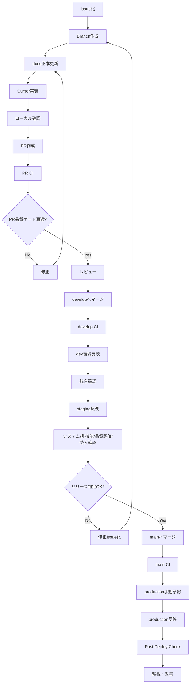
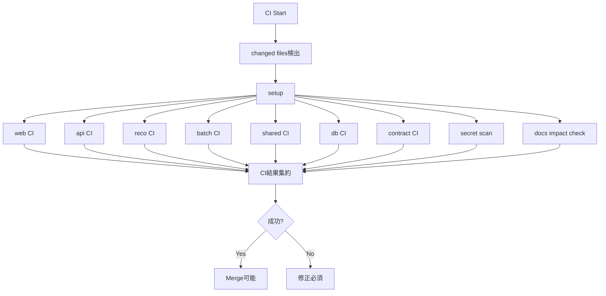

# CI・CD方針書

## 1. 目的

本方針書は、Gift Recommendation Service MVP における CI・CD 方針を定義する。

本プロジェクトでは、個人開発かつAIエージェント活用を前提に、開発速度を確保しながら品質を破綻させないことを重視する。

そのため、CI・CDでは以下を実現する。

```text
- PR時点での品質ゲートを自動化する
- develop / staging / production への反映条件を明確にする
- monorepo内の web / api / reco / batch / shared / db を適切に検証する
- docs正本とcodeの乖離を検知する
- Batch workflowの定期実行・手動実行・依存関係を制御する
- 本番反映前後にObservabilityが成立していることを確認する
- MVPでは完全自動本番デプロイではなく、半自動CDを基本とする
```

---

## 2. 本ドキュメントの位置づけ

| 成果物                             | 役割                                                                                |
| ---------------------------------- | ----------------------------------------------------------------------------------- |
| DevOps方針書                       | 開発・設計・テスト・リリース・運用全体の上位方針を定義する                          |
| CI・CD方針書                       | GitHub Actionsを中心に、CI/CDのトリガー、ジョブ、品質ゲート、デプロイ方針を定義する |
| テスト方針書                       | テスト全体の思想、対象範囲、品質方針を定義する                                      |
| テスト定義書                       | テストレベル、テスト種別、テスト対象、観点を定義する                                |
| 全体テスト計画書                   | テストフェーズの順序、開始条件、終了条件、品質ゲートを定義する                      |
| バッチ実行スケジュール設計書       | 日次・週次・手動Batch workflowの実行順序とスケジュールを定義する                    |
| プロジェクトディレクトリ構成定義書 | repo内のコード、docs、tests、db、workflowの配置方針を定義する                       |

---

## 3. 前提

| 項目               | 内容                                                          |
| ------------------ | ------------------------------------------------------------- |
| Repository         | monorepo                                                      |
| CI/CD基盤          | GitHub Actions                                                |
| 開発体制           | 個人開発                                                      |
| 正本               | repo内docs                                                    |
| 副本               | Notion                                                        |
| 実装コンポーネント | web / api / reco / batch                                      |
| 共通ロジック       | packages/shared-logic                                         |
| DB                 | PostgreSQL / pgvector                                         |
| Batch実行          | GitHub Actions                                                |
| ブランチ           | main / develop / feature / fix / docs / test / chore / hotfix |
| 本番デプロイ       | MVPでは半自動                                                 |
| 技術検証           | 実API疎通・性能フィジビリティは通常CIとは分離                 |
| Observability      | MVPから品質ゲートに含める                                     |

---

## 4. CI/CD基本方針

| 方針                            | 内容                                                                |
| ------------------------------- | ------------------------------------------------------------------- |
| CIは品質ゲート                  | PR、develop、main反映時に品質を自動確認する                         |
| CDは安全な反映制御              | 自動反映だけでなく、環境別の承認・確認を含める                      |
| MVPは半自動CD                   | production反映は人間の承認を必須とする                              |
| monorepo前提で分割検証          | web / api / reco / batch / shared / dbごとに必要な検証を行う        |
| docs正本と連動                  | 仕様変更時はdocs差分をCI確認対象に含める                            |
| 外部API実疎通は通常CIに含めない | 外部API依存でCIが不安定になるため、技術検証workflowとして分離する   |
| 性能リスクは前倒し検証          | performance feasibilityは技術検証または手動workflowで早期確認する   |
| Observabilityを後付けにしない   | trace_id、run_id、batch_run_id、error_log、metricを確認対象に含める |
| Batch本番実行はpush起動しない   | schedule / workflow_dispatch / workflow_call を基本とする           |
| secretを安全に扱う              | GitHub Secrets / Environments を利用し、ログには出力しない          |

---

## 5. CI/CD全体像

### 5.1 開発〜本番反映フロー



### 5.2 CI/CDの責務分離

```text
CI:
  - build
  - lint
  - format check
  - typecheck
  - unit test
  - contract test
  - integration test
  - migration check
  - secret scan
  - docs impact check
  - observability basic check

CD:
  - dev環境反映
  - staging環境反映
  - production反映
  - post deploy check
  - rollback / hotfix支援
  - batch workflow実行
```

---

## 6. 環境定義

| 環境       | 用途                                     | 反映契機                    | 承認             |
| ---------- | ---------------------------------------- | --------------------------- | ---------------- |
| local      | 開発、単体確認、技術検証の一部           | 開発者任意                  | 不要             |
| CI         | PR / merge時の自動品質ゲート             | GitHub Actions              | 不要             |
| dev        | develop統合後の開発統合確認              | develop merge後             | 原則不要         |
| staging    | システムテスト、非機能テスト、受入前確認 | 手動またはworkflow_dispatch | 必要に応じて承認 |
| production | 本番                                     | main反映後、手動承認        | 必須             |

---

## 7. ブランチ別CI/CD方針

| ブランチ   | CI                   | CD                 | 方針                       |
| ---------- | -------------------- | ------------------ | -------------------------- |
| feature/\* | 実行                 | なし               | PR品質ゲート用             |
| fix/\*     | 実行                 | なし               | 不具合修正の品質確認       |
| docs/\*    | docs check中心に実行 | なし               | docs正本更新確認           |
| test/\*    | テスト関連CIを実行   | なし               | テスト追加・修正確認       |
| chore/\*   | 変更内容に応じて実行 | なし               | CI、設定、依存関係変更確認 |
| develop    | 実行                 | dev反映            | 統合確認用                 |
| main       | 実行                 | production反映候補 | 本番反映対象               |
| hotfix/\*  | 最小必須CIを優先実行 | production反映候補 | 緊急修正用                 |

---

## 8. CIトリガー方針

| トリガー            | 対象                                          | 用途                                                |
| ------------------- | --------------------------------------------- | --------------------------------------------------- |
| pull_request        | feature / fix / docs / test / chore → develop | PR品質ゲート                                        |
| push                | develop                                       | develop統合後CI、dev反映                            |
| push                | main                                          | main CI、production反映候補作成                     |
| workflow_dispatch   | 任意                                          | 手動CI、技術検証、性能フィジビリティ、Batch手動実行 |
| schedule            | Batch親workflow                               | 日次・週次Batch実行                                 |
| workflow_call       | Batch子workflow                               | 親workflowから子workflowを呼び出す                  |
| repository_dispatch | 将来候補                                      | 外部イベント連携                                    |

---

## 9. CIジョブ構成

### 9.1 CI全体ジョブ



### 9.2 共通ジョブ

| ジョブ            | 内容                                       |
| ----------------- | ------------------------------------------ |
| changed-files     | 変更ファイルを検出し、必要なCIのみ実行する |
| setup-node        | Node.js / pnpmセットアップ                 |
| setup-python      | Python / uv または pip セットアップ        |
| cache             | pnpm / Python dependency cache             |
| secret-scan       | secret混入チェック                         |
| docs-impact-check | code変更に対するdocs更新有無の確認         |
| summary           | CI結果をPR上で確認できる形に集約           |

---

## 10. コンポーネント別CI方針

### 10.1 web CI

| 項目     | 内容                                                       |
| -------- | ---------------------------------------------------------- |
| 対象     | apps/web                                                   |
| 実行契機 | web配下、shared-types、contracts、docsの関連変更           |
| 主な検証 | install、lint、typecheck、build、unit test、component test |
| 外部通信 | 原則Mock                                                   |
| 失敗時   | PRマージ不可                                               |

### 10.2 api CI

| 項目     | 内容                                                                           |
| -------- | ------------------------------------------------------------------------------ |
| 対象     | apps/api                                                                       |
| 実行契機 | api配下、contracts、shared-types、db、docsの関連変更                           |
| 主な検証 | install、lint、typecheck、build、unit test、API contract test、repository test |
| 外部通信 | reco / DB / external services はMockまたはtest DB                              |
| 失敗時   | PRマージ不可                                                                   |

### 10.3 reco CI

| 項目     | 内容                                                               |
| -------- | ------------------------------------------------------------------ |
| 対象     | apps/reco                                                          |
| 実行契機 | reco配下、shared-logic、contracts、db、docsの関連変更              |
| 主な検証 | lint、typecheck相当、unit test、module test、pipeline fixture test |
| 外部通信 | Embedding / LLM APIはMock                                          |
| 失敗時   | PRマージ不可                                                       |

### 10.4 batch CI

| 項目     | 内容                                                                   |
| -------- | ---------------------------------------------------------------------- |
| 対象     | apps/batch                                                             |
| 実行契機 | batch配下、shared-logic、db、workflow、docsの関連変更                  |
| 主な検証 | lint、typecheck相当、unit test、module test、dry-run、idempotency test |
| 外部通信 | 楽天API / 外部AI APIはMock / Fixture                                   |
| 失敗時   | PRマージ不可                                                           |

### 10.5 shared CI

| 項目           | 内容                                                                            |
| -------------- | ------------------------------------------------------------------------------- |
| 対象           | packages/shared-logic                                                           |
| 実行契機       | shared-logic配下、Feature定義、Semantic定義、Featureルール変更                  |
| 主な検証       | unit test、feature generation test、normalization test、meaning projection test |
| 呼び出し元確認 | reco→shared、batch→sharedの結合確認を別ジョブで実施                             |
| 失敗時         | PRマージ不可                                                                    |

### 10.6 db CI

| 項目     | 内容                                                                       |
| -------- | -------------------------------------------------------------------------- |
| 対象     | db                                                                         |
| 実行契機 | migrations、seeds、ddl、table設計変更                                      |
| 主な検証 | migration apply、migration rollback可能性確認、seed投入、schema validation |
| DB       | CI用PostgreSQL                                                             |
| 失敗時   | PRマージ不可                                                               |

### 10.7 contract CI

| 項目     | 内容                                                          |
| -------- | ------------------------------------------------------------- |
| 対象     | packages/contracts                                            |
| 実行契機 | API一覧、インターフェース一覧、OpenAPI、schema変更            |
| 主な検証 | OpenAPI lint、schema validation、Request / Response互換性確認 |
| 対象IF   | Public API、Internal API、Error Response                      |
| 失敗時   | PRマージ不可                                                  |

---

## 11. テスト自動化方針

| テストレベル             | CI/CD上の扱い                    | 方針                                                         |
| ------------------------ | -------------------------------- | ------------------------------------------------------------ |
| 技術検証テスト           | 通常CI対象外 / workflow_dispatch | 実API疎通・実レスポンス分析は手動または専用workflowで実施    |
| 単体テスト               | CI必須                           | web / api / reco / batch / shared / database を対象          |
| モジュール結合テスト     | CI一部必須                       | reco内部、batch内部、api内部、shared内部をfixtureで確認      |
| コンポーネント結合テスト | develop / staging中心            | web→api、api→reco、reco→shared、batch→shared、batch→DBを確認 |
| システムテスト           | staging中心                      | MVP主要導線をE2Eで確認                                       |
| 非機能テスト             | staging / workflow_dispatch      | 性能、セキュリティ、Observabilityを確認                      |
| レコメンド品質評価テスト | 半自動 / 手動                    | 固定評価ケース、理由文、人手評価を含める                     |
| 受入テスト               | 手動中心                         | MVPリリース可否を判断する                                    |

---

## 12. 技術検証・性能フィジビリティのCI/CD上の扱い

### 12.1 技術検証テスト

技術検証テストは、通常のPR CIには含めない。

理由は以下である。

```text
- 外部APIのrate limitに影響を受ける
- API Keyが必要になる
- 外部サービス障害によりCIが不安定になる
- 実行コストが発生する可能性がある
- 実レスポンスは検証タイミングによって変化する
```

専用workflowとして、以下を用意する。

```text
tech-verify-rakuten-api.yml
tech-verify-external-ai.yml
tech-verify-pgvector.yml
```

### 12.2 性能フィジビリティ

性能フィジビリティは、後工程での手戻りを避けるため、開発初期から手動workflowで実行可能にする。

対象は以下とする。

```text
- api response latency
- reco pipeline duration
- pgvector search duration
- batch chunk processing duration
- item feature generation duration
- item embedding generation duration
```

専用workflowとして、以下を用意する。

```text
perf-feasibility-api.yml
perf-feasibility-reco.yml
perf-feasibility-batch.yml
perf-feasibility-db.yml
```

---

## 13. docs正本連携方針

### 13.1 基本方針

docsはrepo内を正本とする。
そのため、仕様変更・IF変更・DB変更・Batch変更・テスト方針変更がある場合は、CIでdocs差分を確認対象に含める。

### 13.2 docs impact check

| 変更対象              | 期待するdocs更新                                                                 |
| --------------------- | -------------------------------------------------------------------------------- |
| apps/web              | 画面一覧、画面遷移図、インターフェース一覧、テスト関連docs                       |
| apps/api              | API一覧、インターフェース一覧、エラーコード定義、テスト関連docs                  |
| apps/reco             | Recoモジュール一覧、機能×モジュール対応表、テスト関連docs                        |
| apps/batch            | バッチ設計方針書、バッチ処理一覧、バッチ依存関係図、バッチ実行スケジュール設計書 |
| packages/shared-logic | Feature定義書、Semantic定義書、Featureルール定義書、テスト関連docs               |
| db/migrations         | 論理ER、テーブル一覧、データ管理要件、テスト関連docs                             |
| packages/contracts    | API一覧、インターフェース一覧                                                    |
| .github/workflows     | CI・CD方針書、バッチ実行スケジュール設計書、DevOps方針書                         |
| tests                 | テスト定義書、全体テスト計画書、フェーズ別テスト計画書                           |

### 13.3 docs checkの扱い

MVP初期では、完全な自動整合チェックは行わない。
ただし、PRテンプレートと簡易CIで以下を確認する。

```text
- docs差分の有無
- PR本文の参照docs記載
- API変更時のcontracts更新有無
- DB変更時のmigration有無
- workflow変更時のCI・CD方針書更新有無
```

---

## 14. Observability連携方針

### 14.1 CIで確認すること

| 対象     | 確認内容                                         |
| -------- | ------------------------------------------------ |
| api      | trace_id生成、request_id生成、error response形式 |
| reco     | recommendation_run_id、phase_log、error_log出力  |
| batch    | batch_run_id、phase_log、error_log出力           |
| DB       | log / metric保存先のmigration確認                |
| contract | error_code、safe message、internal message分離   |
| test     | 異常系テストでログ・エラーが検証されているか     |

### 14.2 CDで確認すること

| タイミング       | 確認内容                                                          |
| ---------------- | ----------------------------------------------------------------- |
| dev反映後        | API疎通、ログ出力、trace_id確認                                   |
| staging反映後    | 主要導線、Reco run追跡、Batch run追跡、metric出力                 |
| production反映後 | health check、主要API、error rate、trace_id、run_id、batch_run_id |

### 14.3 リリースNG条件

以下に該当する場合、production反映を停止する。

```text
- trace_idが生成されない
- recommendation_run_idでReco処理を追跡できない
- batch_run_idでBatch処理を追跡できない
- error_logが記録されない
- 主要APIのエラー率が高い
- API / Reco / Batchの重大なlatency悪化がある
- secretまたは内部stack traceが外部応答・ログに露出している
```

---

## 15. CD方針

### 15.1 CD全体方針

MVPでは、productionへの完全自動デプロイは行わない。
以下の半自動CDを採用する。

```text
develop merge
  ↓
dev deploy
  ↓
統合確認
  ↓
staging deploy
  ↓
システムテスト / 非機能テスト / 品質評価 / 受入確認
  ↓
main merge
  ↓
production deploy approval
  ↓
production deploy
  ↓
post deploy check
```

### 15.2 dev環境反映

| 項目     | 内容                                |
| -------- | ----------------------------------- |
| 契機     | developへのmerge                    |
| 実行     | 自動または半自動                    |
| 目的     | 統合確認                            |
| 必須条件 | develop CI成功                      |
| 確認内容 | API疎通、DB接続、Reco疎通、基本ログ |

### 15.3 staging環境反映

| 項目     | 内容                                                         |
| -------- | ------------------------------------------------------------ |
| 契機     | workflow_dispatch または release candidate作成               |
| 実行     | 半自動                                                       |
| 目的     | リリース前確認                                               |
| 必須条件 | develop CI成功、dev確認完了                                  |
| 確認内容 | システムテスト、非機能テスト、レコメンド品質評価、受入前確認 |

### 15.4 production環境反映

| 項目     | 内容                                              |
| -------- | ------------------------------------------------- |
| 契機     | mainへのmerge後                                   |
| 実行     | 手動承認付き                                      |
| 目的     | 本番反映                                          |
| 必須条件 | main CI成功、staging確認完了、受入判断OK          |
| 確認内容 | health check、主要導線、Observability、error rate |

---

## 16. コンポーネント別CD方針

| コンポーネント | dev              | staging          | production       | 方針                                          |
| -------------- | ---------------- | ---------------- | ---------------- | --------------------------------------------- |
| web            | 自動または半自動 | 半自動           | 手動承認         | 画面導線・API接続を確認する                   |
| api            | 半自動           | 半自動           | 手動承認         | Public API、DB、Reco連携を確認する            |
| reco           | 半自動           | 半自動           | 手動承認         | Internal API、pipeline、Feature処理を確認する |
| batch          | schedule / 手動  | 手動             | schedule / 手動  | production Batchはpush起動しない              |
| db             | migration apply  | migration apply  | 手動承認         | 破壊的変更は原則避ける                        |
| shared         | 呼び出し元に同梱 | 呼び出し元に同梱 | 呼び出し元に同梱 | reco / batch双方の検証を必須とする            |

---

## 17. Batch workflow方針

### 17.1 基本方針

BatchはGitHub Actionsで実行する。
production相当のBatch実行は、pushでは起動しない。

| トリガー          | 用途                               |
| ----------------- | ---------------------------------- |
| schedule          | 日次・週次Batchの定期実行          |
| workflow_dispatch | 手動実行、再実行、技術検証         |
| workflow_call     | 親workflowから子workflowを呼び出す |
| pull_request      | Batchコードのテスト、dry-run       |
| push              | 原則、本番Batch実行には使わない    |

### 17.2 親workflow

| 親workflow              | 用途                                          |
| ----------------------- | --------------------------------------------- |
| batch-daily-parent.yml  | 日次系Batchを順序制御して実行する             |
| batch-weekly-parent.yml | 週次系Batchを順序制御して実行する             |
| batch-manual-parent.yml | 手動実行前提Batchを選択・順序制御して実行する |

### 17.3 子workflow

| 子workflow                         | 用途                                    |
| ---------------------------------- | --------------------------------------- |
| batch-rakuten-genre-sync.yml       | 楽天ジャンルマスタ同期                  |
| batch-rakuten-ranking-snapshot.yml | ランキングスナップショット取得          |
| batch-rakuten-item-import.yml      | 商品疑似差分取得〜Item反映              |
| batch-item-meaning-generation.yml  | Item Semantic / Feature / Embedding生成 |
| batch-distribution-metrics.yml     | 分布メトリクス集計                      |
| batch-offline-evaluation.yml       | Offline Evaluation                      |
| batch-retry-failed-items.yml       | 失敗Item再実行                          |

### 17.4 依存関係制御

Batch workflow間の依存関係は、親workflow内の `jobs.needs` または `workflow_call` により制御する。

```text
親workflow
  ├─ genre sync
  ├─ ranking snapshot
  ├─ item import
  ├─ item meaning generation
  ├─ distribution metrics
  └─ offline evaluation
```

### 17.5 concurrency方針

同一条件の多重実行を防ぐため、Batch単位または入力条件単位でconcurrency groupを設定する。

```yaml
concurrency:
  group: batch-rakuten-ranking-${{ inputs.genre_id }}-${{ inputs.period }}
  cancel-in-progress: false
```

`cancel-in-progress: false` を基本とし、途中実行中のBatchを不用意にキャンセルしない。

---

## 18. DB / Migration方針

### 18.1 CIで確認すること

```text
- migrationが適用できる
- seedが投入できる
- テーブル定義とRepositoryが整合している
- 必須indexが存在する
- pgvector拡張・indexが利用できる
- rollback不能な破壊的変更が明示されている
```

### 18.2 CDで確認すること

| 環境       | 確認内容                                          |
| ---------- | ------------------------------------------------- |
| dev        | migration apply、基本データ参照                   |
| staging    | 本番相当データ量でのmigration確認、主要クエリ確認 |
| production | 手動承認後にmigration適用、post migration check   |

### 18.3 破壊的変更方針

MVPでは、破壊的DB変更は原則避ける。

```text
- column dropは原則避ける
- table dropは原則避ける
- NOT NULL追加は既存データ影響を確認する
- 型変更は移行手順を明示する
- rollback不能な変更はPRで明示する
```

---

## 19. Secret / 権限管理方針

### 19.1 Secret管理

| 種別                  | 管理場所                             |
| --------------------- | ------------------------------------ |
| API Key               | GitHub Secrets / Environment Secrets |
| DB接続情報            | GitHub Secrets / Environment Secrets |
| Deploy Token          | GitHub Secrets / Environment Secrets |
| Supabase Service Role | GitHub Secrets / Environment Secrets |
| OpenAI API Key        | GitHub Secrets / Environment Secrets |
| Rakuten API Key       | GitHub Secrets / Environment Secrets |

### 19.2 禁止事項

```text
- secretをrepoにcommitしない
- secretをdocsに記載しない
- secretをPRコメントに貼らない
- secretをCIログに出力しない
- production secretをPR CIで使わない
```

### 19.3 GitHub Environment

| Environment | 用途                                 |
| ----------- | ------------------------------------ |
| dev         | develop反映用secret                  |
| staging     | staging確認用secret                  |
| production  | production反映用secret。手動承認必須 |

---

## 20. 品質ゲート定義

### 20.1 PR品質ゲート

| 条件                          | 必須               |
| ----------------------------- | ------------------ |
| build成功                     | 必須               |
| lint成功                      | 必須               |
| typecheck成功                 | 必須               |
| unit test成功                 | 必須               |
| contract test成功             | API / IF変更時必須 |
| migration check成功           | DB変更時必須       |
| docs impact check確認         | 仕様影響時必須     |
| secret scan成功               | 必須               |
| Observability basic check成功 | 対象変更時必須     |

### 20.2 develop品質ゲート

| 条件            | 必須           |
| --------------- | -------------- |
| PR CI成功       | 必須           |
| PRレビュー完了  | 必須           |
| develop CI成功  | 必須           |
| dev環境反映成功 | 原則必須       |
| 統合確認        | 主要変更時必須 |

### 20.3 staging品質ゲート

| 条件                             | 必須 |
| -------------------------------- | ---- |
| staging deploy成功               | 必須 |
| コンポーネント結合テスト合格     | 必須 |
| システムテスト合格               | 必須 |
| 非機能テスト重大問題なし         | 必須 |
| レコメンド品質評価で重大破綻なし | 必須 |
| Observability確認OK              | 必須 |
| Critical / High不具合0件         | 必須 |

### 20.4 production品質ゲート

| 条件                  | 必須 |
| --------------------- | ---- |
| main CI成功           | 必須 |
| staging確認完了       | 必須 |
| 受入判断OK            | 必須 |
| production手動承認    | 必須 |
| deploy成功            | 必須 |
| post deploy check成功 | 必須 |
| rollback方針確認済    | 必須 |

---

## 21. Post Deploy Check

production反映後、以下を確認する。

```text
- Web画面が表示できる
- Public API health checkが成功する
- Reco health checkが成功する
- DB接続が成功する
- 主要APIが正常応答する
- trace_idが生成される
- recommendation_run_idで処理を追跡できる
- error_logが記録される
- metricが出力される
- error rateが急増していない
- latencyが重大に悪化していない
```

---

## 22. 失敗時の対応方針

### 22.1 CI失敗

```text
- PRマージ禁止
- 失敗ジョブを確認
- 原因を修正
- 再実行
- 必要に応じてIssueに調査内容を追記
```

### 22.2 deploy失敗

```text
- production反映を停止
- deploy logを確認
- 影響範囲を確認
- 必要に応じてrollback
- Issue化
- 再発防止としてテストまたはCIを追加
```

### 22.3 Observability不備

```text
- release停止
- trace_id / run_id / metric / log出力の欠落箇所を特定
- 修正PRを作成
- 再度staging確認
```

### 22.4 Batch失敗

```text
- GitHub Actions log確認
- batch_run_id確認
- phase_log確認
- error_log確認
- 冪等性を確認したうえで再実行
- 必要に応じてretry workflowを実行
```

---

## 23. Rollback / Hotfix方針

### 23.1 Rollback方針

MVPでは、複雑なBlue-Green / Canaryは前提としない。
以下を基本とする。

```text
- 直前の安定版へ戻す
- DB migrationを伴う場合はrollback可能性を事前確認する
- rollback不能なDB変更は原則避ける
- rollback不能な場合はhotfixで復旧する
```

### 23.2 Hotfix方針

hotfixはmainから分岐し、最小修正でproduction復旧を優先する。

```text
main
  ↓
hotfix/*
  ↓
最小修正
  ↓
最小必須CI
  ↓
main merge
  ↓
production反映
  ↓
developへ反映
```

### 23.3 Hotfix時のCI

Hotfix時もCIを完全に省略しない。

| CI                | 方針               |
| ----------------- | ------------------ |
| build             | 必須               |
| lint              | 原則必須           |
| typecheck         | 必須               |
| 関連unit test     | 必須               |
| 関連contract test | 対象変更時必須     |
| full integration  | 緊急度に応じて判断 |
| post deploy check | 必須               |

---

## 24. GitHub Actions workflow構成

### 24.1 CI workflow

```text
.github/workflows/
├─ ci.yml
├─ ci-web.yml
├─ ci-api.yml
├─ ci-reco.yml
├─ ci-batch.yml
├─ ci-shared.yml
├─ ci-db.yml
├─ ci-contract.yml
├─ ci-docs.yml
└─ ci-security.yml
```

### 24.2 CD workflow

```text
.github/workflows/
├─ deploy-dev.yml
├─ deploy-staging.yml
├─ deploy-production.yml
└─ post-deploy-check.yml
```

### 24.3 技術検証 workflow

```text
.github/workflows/
├─ tech-verify-rakuten-api.yml
├─ tech-verify-external-ai.yml
├─ tech-verify-pgvector.yml
├─ perf-feasibility-api.yml
├─ perf-feasibility-reco.yml
├─ perf-feasibility-batch.yml
└─ perf-feasibility-db.yml
```

### 24.4 Batch workflow

```text
.github/workflows/
├─ batch-daily-parent.yml
├─ batch-weekly-parent.yml
├─ batch-manual-parent.yml
├─ batch-rakuten-genre-sync.yml
├─ batch-rakuten-ranking-snapshot.yml
├─ batch-rakuten-item-import.yml
├─ batch-item-meaning-generation.yml
├─ batch-distribution-metrics.yml
├─ batch-offline-evaluation.yml
└─ batch-retry-failed-items.yml
```

---

## 25. MVPでやること / やらないこと

### 25.1 MVPでやること

```text
- PR CI
- develop CI
- main CI
- build / lint / typecheck
- unit test
- 主要contract test
- 主要migration check
- secret scan
- docs impact checkの簡易導入
- dev deploy
- staging deploy
- production手動承認deploy
- post deploy check
- Batch親workflow / 子workflow
- 技術検証workflow
- 性能フィジビリティworkflow
- Observability basic check
```

### 25.2 MVPではやらないこと

```text
- production完全自動デプロイ
- Blue-Green Deployment
- Canary Release
- 大規模負荷試験の完全自動化
- 全E2Eの完全自動化
- docsとcodeの完全自動整合検証
- 複雑なrelease train運用
```

---

## 26. 将来拡張

| 領域          | 拡張内容                                      |
| ------------- | --------------------------------------------- |
| CI高速化      | path filter、matrix最適化、cache強化          |
| CD高度化      | staging自動反映、本番承認フロー強化           |
| Release       | tag、release note、自動changelog              |
| Test          | E2E自動化、回帰テスト拡充、性能テスト定期実行 |
| Observability | dashboard、alert、SLO連携                     |
| Security      | SAST、dependency scan、container scan         |
| Docs          | docs-code整合チェック自動化                   |
| Batch         | retry policy高度化、失敗通知、再実行UI        |
| Deployment    | Blue-Green、Canary、feature flag              |

---

## 27. まとめ

本プロジェクトのCI・CD方針は以下である。

```text
CIは、PR・develop・mainにおける品質ゲートとして機能させる。
CDは、dev / staging / production への安全な反映制御として機能させる。
MVPでは、完全自動本番デプロイではなく、人間の承認を含む半自動CDを採用する。
```

特に重要な判断は以下である。

```text
- monorepo前提で web / api / reco / batch / shared / db を分けて検証する
- 外部API実疎通は通常CIに含めず、技術検証workflowに分離する
- 性能フィジビリティは後工程に持ち越さず、手動workflowで前倒し確認する
- Batch本番実行はpush起動せず、schedule / workflow_dispatch / workflow_call を基本とする
- production反映は手動承認を必須とする
- Observability成立をリリース品質ゲートに含める
```
