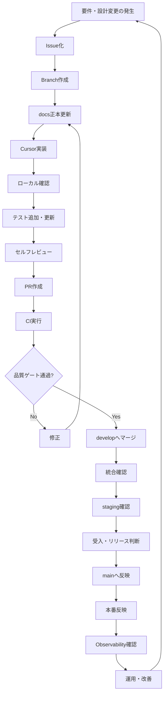
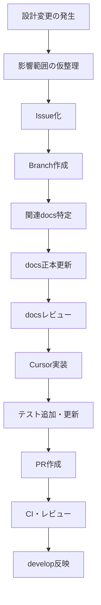
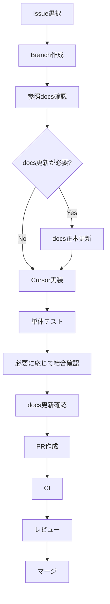
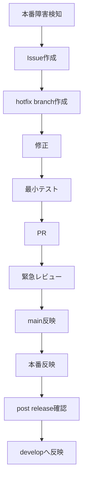
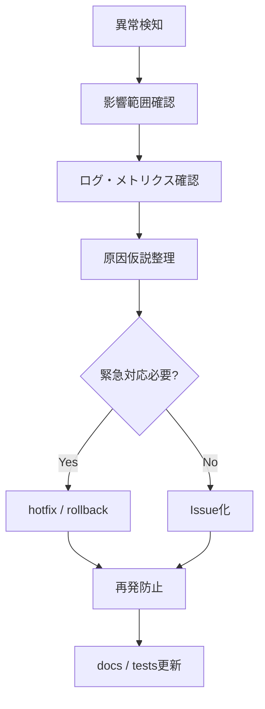

# DevOps方針書

## 1. 目的

本方針書は、Gift Recommendation Service MVP の設計・開発・テスト・リリース・運用を、個人開発かつAIエージェント活用前提で持続可能に進めるためのDevOps方針を定義する。

本プロジェクトでは、以下を重視する。

```text
- 個人開発でも破綻しない開発運用を構築する
- repo内docsを正本として、設計・実装・テストの整合性を維持する
- Cursor / ChatGPT 等のAIを活用しながら、人間が最終判断する
- CI/CD・テスト・Observabilityを品質ゲートとして組み込む
- MVP開発速度を確保しつつ、将来のチーム開発へ拡張可能な構造を維持する
```

---

## 2. 本ドキュメントの位置づけ

本方針書は、開発・運用プロセス全体の上位方針を定義する。

| 成果物                             | 役割                                                                                        |
| ---------------------------------- | ------------------------------------------------------------------------------------------- |
| DevOps方針書                       | 設計、開発、テスト、リリース、運用、AI活用、Issue / Branch / PR運用の上位方針を定義する     |
| CI・CD方針書                       | GitHub Actionsを中心に、CI/CDのトリガー、ジョブ構成、デプロイ制御、環境別反映方針を定義する |
| テスト方針書                       | テスト全体の思想、重視する品質、対象範囲、優先度を定義する                                  |
| テスト定義書                       | テストレベル、テスト種別、テスト観点、対象範囲を定義する                                    |
| 全体テスト計画書                   | 各テストフェーズの順序、開始条件、終了条件、品質ゲートを定義する                            |
| プロジェクトディレクトリ構成定義書 | repo内のコード、docs、tests、db、CI/CD資材の配置方針を定義する                              |

DevOps方針書では、CI/CDの詳細ジョブ定義までは扱わない。
CI/CDの詳細は、別紙「CI・CD方針書」で定義する。

---

## 3. 前提

| 項目               | 内容                                                                                           |
| ------------------ | ---------------------------------------------------------------------------------------------- |
| 開発体制           | 個人開発を基本とする                                                                           |
| 開発支援           | Cursorを主たる実装支援、ChatGPTを設計レビュー・整理支援として活用する                          |
| 最終判断           | 人間が行う                                                                                     |
| Repository         | monorepo構成                                                                                   |
| 正本               | repo内docs                                                                                     |
| 副本               | Notion                                                                                         |
| 実装コンポーネント | web / api / reco / batch                                                                       |
| 共通ロジック       | packages/shared-logic                                                                          |
| DB                 | PostgreSQL / pgvector を前提                                                                   |
| Batch実行          | GitHub Actions                                                                                 |
| CI/CD              | GitHub Actions中心                                                                             |
| ブランチ           | main / develop / feature / fix / hotfix                                                        |
| テスト体系         | 技術検証、単体、モジュール結合、コンポーネント結合、システム、非機能、レコメンド品質評価、受入 |
| Observability      | MVPから品質ゲートに含める                                                                      |

---

## 4. DevOps基本方針

| 方針                           | 内容                                                                             |
| ------------------------------ | -------------------------------------------------------------------------------- |
| docs正本主義                   | 設計・仕様・運用ルールはrepo内docsを正本とする                                   |
| 小さく変更する                 | 1 PR 1目的を基本とし、設計・実装・テストの変更範囲を明確にする                   |
| AIは作業者、人間は判断者       | Cursor / ChatGPTは作成・整理・レビュー補助に使うが、採否判断は人間が行う         |
| 設計とコードの乖離を許容しない | 仕様変更時はdocsとコードを同一PRまたは関連PRで更新する                           |
| テストを品質ゲートにする       | CI、単体テスト、結合テスト、システムテスト、非機能テストを段階的に通過条件とする |
| 技術リスクを前倒しで潰す       | 外部API、外部AI API、pgvector、性能面は技術検証テストで早期確認する              |
| Observabilityを後付けにしない  | trace_id、run_id、batch_run_id、error_code、metricを品質確認対象に含める         |
| リリースは半自動を基本とする   | MVPでは完全自動本番デプロイではなく、CI成功後に人間が承認する                    |
| 将来拡張可能にする             | 個人開発からチーム開発へ移行できるIssue / Branch / PR / docs構成を維持する       |

---

## 5. DevOps全体プロセス

### 5.1 全体像



### 5.2 基本サイクル

```text
Issue化
  ↓
Branch作成
  ↓
docs正本更新
  ↓
Cursor実装
  ↓
ローカル確認
  ↓
テスト追加・更新
  ↓
セルフレビュー
  ↓
PR作成
  ↓
CI実行
  ↓
レビュー
  ↓
develop統合
  ↓
staging確認
  ↓
main反映
  ↓
本番反映
  ↓
監視・改善
```

### 5.3 この順序を採用する理由

| 順序                             | 理由                                                       |
| -------------------------------- | ---------------------------------------------------------- |
| Issue化を先に行う                | 作業目的、背景、完了条件、影響範囲を先に明確化するため     |
| Branch作成をdocs更新前に行う     | docs変更もPR差分として管理し、変更履歴を追跡可能にするため |
| docs正本更新をCursor実装前に行う | Cursorが最新設計を参照して実装できる状態にするため         |
| Cursor実装をdocs更新後に行う     | 実装が設計に追従し、設計とコードの乖離を防ぐため           |

---

## 6. Repository運用方針

### 6.1 Monorepo方針

本プロジェクトは monorepo 構成とし、以下を同一repositoryで管理する。

```text
apps/      実行コンポーネント
packages/ 共有ロジック・契約・共通型
db/        DB migration / seed / DDL
docs/      設計成果物・テスト成果物
tests/     横断テスト・技術検証・E2E・非機能・品質評価
.github/   CI/CD・Batch workflow・Issue Template
.cursor/   AI開発支援ルール
```

### 6.2 repo内docs正本方針

| 項目           | 方針                                                     |
| -------------- | -------------------------------------------------------- |
| 正本           | repo内 `docs/`                                           |
| 副本           | Notion                                                   |
| 更新単位       | 設計変更・仕様変更・運用変更が発生した単位で更新する     |
| コードとの関係 | コード変更に仕様影響がある場合、docs更新を必須とする     |
| PRとの関係     | docs変更とコード変更は同一PR、または関連PRとして紐づける |
| レビュー観点   | docsとコードの整合、テストケースとの整合を確認する       |

### 6.3 Notionとの関係

Notionは、閲覧性・整理・タスク管理のための副本として扱う。

| 領域         | 正本                                 |
| ------------ | ------------------------------------ |
| 設計書本文   | repo内docs                           |
| 実装仕様     | repo内docs / code                    |
| テストケース | repo内docs または repo内管理ファイル |
| タスク管理   | GitHub Issues / Projects             |
| 閲覧・共有   | Notion                               |

Notionに転記した内容がrepo内docsと不整合になった場合は、repo内docsを正とする。

---

## 7. Issue運用方針

### 7.1 Issueの目的

Issueは、作業単位・変更理由・参照docs・完了条件を明確にするために利用する。

### 7.2 Issueで管理する対象

| 種別     | 管理対象                         |
| -------- | -------------------------------- |
| feature  | 新機能追加                       |
| fix      | 不具合修正                       |
| docs     | 設計書・運用書・テスト成果物更新 |
| refactor | 外部仕様を変えない内部改善       |
| chore    | 設定、CI、依存関係、開発環境整備 |
| test     | テスト追加・修正                 |
| hotfix   | 本番障害・緊急修正               |
| spike    | 技術検証・性能フィジビリティ検証 |

### 7.3 Issue必須項目

Issueには最低限以下を記載する。

| 項目       | 内容                                                  |
| ---------- | ----------------------------------------------------- |
| 背景       | なぜ対応するのか                                      |
| 対象範囲   | どの機能・モジュール・docs・テーブル・IFが対象か      |
| 参照docs   | 参照すべき設計書                                      |
| 完了条件   | 何ができれば完了か                                    |
| テスト観点 | どのテストで確認するか                                |
| 影響範囲   | web / api / reco / batch / shared / DB / docs / tests |
| 関連Issue  | 先行・後続・関連作業                                  |

### 7.4 Issueとdocsの紐づけ

設計・実装・テストに関わるIssueでは、関連するdocsを明示する。

```text
参照docs:
- docs/05_アプリケーション設計/インターフェース一覧.md
```

---

## 8. Branch運用方針

### 8.1 ブランチ構成

| ブランチ    | 役割                   |
| ----------- | ---------------------- |
| main        | 本番反映対象           |
| develop     | 統合確認対象           |
| feature/\*  | 機能追加               |
| fix/\*      | 不具合修正             |
| docs/\*     | ドキュメント更新       |
| refactor/\* | 内部改善               |
| chore/\*    | 設定・CI・開発環境整備 |
| test/\*     | テスト追加・修正       |
| hotfix/\*   | 緊急修正               |

### 8.2 ブランチ命名規則

```
<type>/<unit>-<issue番号>-<english-summary>
```

例:

```
feature/epic-101-recommendation-api
feature/task-111-api-design
test/task-112-api-test
docs/task-120-update-policy
```

### 8.3 ブランチ作成方針

| 方針           | 内容                                   |
| -------------- | -------------------------------------- |
| Issue起点      | 原則としてIssueからブランチを作成する  |
| 1ブランチ1目的 | 複数目的の変更を同一ブランチに混ぜない |
| develop起点    | 通常開発はdevelopから分岐する          |
| hotfix起点     | 緊急修正はmainから分岐する             |
| 作業完了後削除 | マージ後は作業ブランチを削除する       |

---

## 9. PR運用方針

### 9.1 PRの目的

PRは、変更内容・テスト結果・docs整合・リリース影響を確認するための品質ゲートである。

### 9.2 PR必須項目

| 項目         | 内容                                |
| ------------ | ----------------------------------- |
| 概要         | 何を変更したか                      |
| 背景         | なぜ変更したか                      |
| 対象Issue    | 対象Issueへのリンクまたは番号       |
| 変更範囲     | code / docs / tests / db / workflow |
| 参照docs     | 参照・更新した設計書                |
| テスト結果   | 実施したテスト                      |
| 影響範囲     | 影響するコンポーネント              |
| リスク       | 懸念点・未確認事項                  |
| レビュー観点 | レビューしてほしいポイント          |

### 9.3 PR品質ゲート

PRでは以下を確認する。

| 観点          | 確認内容                                                        |
| ------------- | --------------------------------------------------------------- |
| CI            | build / lint / typecheck / unit test が成功している             |
| docs          | 仕様変更に対してdocsが更新されている                            |
| テスト        | 変更に応じたテストが追加・更新されている                        |
| IF            | API / DB / Batch / shared_logic の契約が破壊されていない        |
| Observability | trace_id、run_id、error_log、metricが必要に応じて維持されている |
| Secret        | secretや個人情報が含まれていない                                |
| 影響範囲      | 変更範囲がIssue目的に収まっている                               |

---

## 10. AI活用方針

### 10.1 基本方針

AIは開発生産性を高めるために積極利用する。
ただし、AIは最終責任者ではなく、作業補助者・実装補助者・レビュー補助者として扱う。

| 役割         | ChatGPT | Cursor | 人間 |
| ------------ | ------: | -----: | ---: |
| 設計整理     |       ◎ |      ○ |    ◎ |
| 設計レビュー |       ◎ |      ○ |    ◎ |
| 実装         |       △ |      ◎ |    ◎ |
| テスト作成   |       ○ |      ◎ |    ◎ |
| リファクタ   |       ○ |      ◎ |    ◎ |
| 不具合調査   |       ○ |      ◎ |    ◎ |
| リリース判断 |       × |      × |    ◎ |
| 仕様判断     |       △ |      △ |    ◎ |

凡例:

```text
◎ 主担当
○ 補助
△ 限定的に利用
× 担当しない
```

### 10.2 Cursor活用方針

Cursorは、repo内docsとcodeを横断参照できる実装支援エージェントとして利用する。

| 用途         | 内容                                                         |
| ------------ | ------------------------------------------------------------ |
| 実装         | docsを参照してコードを作成する                               |
| テスト作成   | テスト方針・テスト定義・対象コードを参照してテストを作成する |
| リファクタ   | 既存仕様を維持しながら内部構造を改善する                     |
| docs整合確認 | 変更対象に関連するdocs差分を確認する                         |
| 影響範囲調査 | 変更対象がどのモジュール・IF・テーブルに影響するか調査する   |

### 10.3 ChatGPT活用方針

ChatGPTは、設計レビュー、方針整理、ドキュメント作成、考え方の比較検討に利用する。

| 用途                 | 内容                                   |
| -------------------- | -------------------------------------- |
| 設計レビュー         | 方針の妥当性、抜け漏れ、整合性確認     |
| ドキュメント作成     | 方針書、設計書、テスト計画書の作成支援 |
| 論点整理             | 代替案、リスク、判断軸の整理           |
| 教育・理解補助       | 技術概念・実装方針の説明               |
| Cursorプロンプト作成 | 実装指示・レビュー指示の作成支援       |

### 10.4 AI利用時の必須ルール

```text
- docs未参照で実装しない
- 参照docsをプロンプトまたはIssueに明記する
- AI生成結果をそのまま採用せず、人間が確認する
- 仕様判断をAIに丸投げしない
- Secret、API Key、個人情報をAIに入力しない
- 不明点がある場合は、暗黙補完ではなくIssueまたはdocsで明示する
- 仕様変更が発生した場合はdocs正本を更新する
```

---

## 11. 設計変更運用方針

### 11.1 設計変更の基本フロー



### 11.2 設計変更時の確認観点

| 観点              | 確認内容                                                    |
| ----------------- | ----------------------------------------------------------- |
| Issue             | 設計変更の背景、目的、完了条件がIssueに記載されているか     |
| Branch            | docs変更・実装変更が作業Branch上で管理されているか          |
| 機能影響          | 機能一覧、モジュール一覧、機能×モジュール対応表に影響するか |
| IF影響            | API一覧、インターフェース一覧に影響するか                   |
| DB影響            | 論理ER、テーブル一覧、migrationに影響するか                 |
| Batch影響         | バッチ処理一覧、依存関係、スケジュールに影響するか          |
| Test影響          | テスト方針、定義、計画、テストケースに影響するか            |
| Observability影響 | ログ、metric、trace_id、error_codeに影響するか              |
| CI/CD影響         | workflow、quality gate、deploy条件に影響するか              |

### 11.3 設計変更の完了条件

```text
- Issueに背景、目的、影響範囲、完了条件が記載されている
- 作業Branch上で関連docsが更新されている
- 更新docsに基づいて必要なコード修正が完了している
- 必要なテストが追加・更新されている
- PRでdocs差分とcode差分を確認できる
- CIが成功している
- PRレビューでdocs・code・testの整合性が確認されている
```

---

## 12. 実装変更運用方針

### 12.1 実装変更の基本フロー



### 12.2 実装時の必須確認

| 項目          | 内容                                                   |
| ------------- | ------------------------------------------------------ |
| Issue         | 実装目的、完了条件、影響範囲が明確か                   |
| Branch        | Issueに対応する作業Branchで変更しているか              |
| 参照docs      | 対象機能・IF・テーブル・テスト定義を確認したか         |
| docs更新      | 実装前に必要なdocs正本更新が完了しているか             |
| 変更範囲      | Issue目的に対して過剰な変更がないか                    |
| テスト        | 変更内容に応じた単体・結合テストがあるか               |
| エラー        | エラーコード、safe message、ログ出力が適切か           |
| Observability | trace_id、run_id、batch_run_idが維持されているか       |
| Secret        | secretがコード・ログ・docsに混入していないか           |
| 型・契約      | API schema、DB schema、shared typeが破壊されていないか |

---

## 13. テスト運用方針

### 13.1 テストフェーズ

本プロジェクトでは、以下のテストフェーズを前提とする。

| 順序 | テストフェーズ           | 目的                                                               |
| ---: | ------------------------ | ------------------------------------------------------------------ |
|    1 | 技術検証テスト           | 外部API、外部AI API、pgvector、性能成立性を早期確認する            |
|    2 | 単体テスト               | 関数・クラス・Repository・UI部品単位で確認する                     |
|    3 | モジュール結合テスト     | 同一コンポーネント内のモジュール接続を確認する                     |
|    4 | コンポーネント結合テスト | web / api / reco / batch / shared / DB等の接続を確認する           |
|    5 | システムテスト           | MVP主要導線をEnd-to-Endで確認する                                  |
|    6 | 非機能テスト             | 本番相当構成で性能、可用性、セキュリティ、運用性、観測性を確認する |
|    7 | レコメンド品質評価テスト | 推薦結果、理由文、Feature / Meaning / Rankingの妥当性を確認する    |
|    8 | 受入テスト               | MVPとして提供可能か最終確認する                                    |

### 13.2 テストのDevOps上の扱い

| テスト                   | DevOps上の扱い                        |
| ------------------------ | ------------------------------------- |
| 技術検証テスト           | 設計確定前・開発初期のリスク低減活動  |
| 単体テスト               | CIで自動実行する主力品質ゲート        |
| モジュール結合テスト     | コンポーネント単位の品質ゲート        |
| コンポーネント結合テスト | develop / staging反映前後の品質ゲート |
| システムテスト           | リリース候補確認の品質ゲート          |
| 非機能テスト             | 本番反映前の品質ゲート                |
| レコメンド品質評価テスト | 推薦品質のリリース判断材料            |
| 受入テスト               | MVPリリース可否の最終判断             |

### 13.3 技術検証の位置づけ

技術検証テストは、通常の品質保証テストではなく、設計・方式選定リスクを早期に潰すための活動である。

特に以下は、後工程で発覚すると手戻りが大きいため、前倒しで確認する。

```text
- 楽天APIの実レスポンス特性
- 外部AI APIの応答時間・rate limit・コスト
- pgvector検索性能
- Recoパイプライン処理時間
- Batch処理時間
- Feature / Embedding生成時間
```

### 13.4 テスト結果の管理

| 成果物                 | 管理場所                                        |
| ---------------------- | ----------------------------------------------- |
| テスト方針書           | docs/08_test/00_common/                         |
| テスト定義書           | docs/08_test/00_common/                         |
| 全体テスト計画書       | docs/08_test/00_common/                         |
| フェーズ別テスト計画書 | docs/08_test/各フェーズ/                        |
| テストケース           | docs/08_test/各フェーズ/test_cases_and_results/ |
| テストコード           | apps/\*/tests/ または tests/                    |
| fixture                | packages/test-fixtures/ または tests/fixtures/  |
| 技術検証スクリプト     | tests/tech-verification/                        |

---

## 14. 品質ゲート方針

### 14.1 品質ゲート一覧

| ゲート          | タイミング           | 通過条件                                                             |
| --------------- | -------------------- | -------------------------------------------------------------------- |
| G1 技術検証完了 | 設計確定前〜開発初期 | 外部API・外部AI API・pgvector・性能に致命的な方式リスクがない        |
| G2 PR作成前     | PR作成前             | ローカル確認、単体テスト、docs更新確認が完了している                 |
| G3 PR CI        | PR作成・更新時       | build、lint、typecheck、unit test、必要なcontract testが成功している |
| G4 develop統合  | developマージ前      | PRレビュー、CI成功、docs整合確認が完了している                       |
| G5 staging確認  | main反映前           | システムテスト、非機能確認、レコメンド品質確認が許容範囲             |
| G6 release判断  | main反映・本番反映前 | Critical / High不具合が0件で、受入確認が完了している                 |
| G7 post release | 本番反映後           | ログ、メトリクス、trace_id、主要導線の確認が完了している             |

### 14.2 PRレベル品質ゲート

PRでは最低限以下を満たす。

```text
- CIが成功している
- 変更対象に対応するテストがある
- 仕様変更がある場合はdocsが更新されている
- secretが含まれていない
- Public API / Internal API / DB schemaの破壊的変更が明示されている
- Observabilityに必要なID・ログ・metricが欠落していない
```

### 14.3 リリースレベル品質ゲート

リリース前には最低限以下を満たす。

```text
- MVP主要導線がシステムテストで合格している
- 非機能テストで重大な性能・セキュリティ・運用問題がない
- レコメンド品質評価で重大な破綻がない
- Critical / High不具合が0件である
- 残課題の扱いが明確である
- 本番反映手順・rollback方針が確認済みである
- Observabilityによりリリース後の状態を確認できる
```

---

## 15. CI/CD連携方針

### 15.1 DevOpsとCI/CDの責務分担

| 項目                    | DevOps方針書       | CI・CD方針書               |
| ----------------------- | ------------------ | -------------------------- |
| 開発プロセス            | 定義する           | 参照する                   |
| Issue / Branch / PR運用 | 定義する           | 参照する                   |
| 品質ゲート              | 上位方針を定義する | 自動実行内容に落とし込む   |
| CIジョブ詳細            | 方針のみ           | 詳細定義する               |
| CD環境・デプロイ        | 方針のみ           | 詳細定義する               |
| Batch workflow          | 方針のみ           | workflow構成を詳細定義する |
| rollback / hotfix       | 上位方針を定義する | 実行手順を詳細定義する     |

### 15.2 CIの位置づけ

CIは、PRおよびdevelop / main反映時の品質ゲートとして扱う。

CIでは主に以下を確認する。

```text
- build
- lint
- typecheck
- unit test
- contract test
- migration check
- docs差分チェック
- secret scan
- 最低限のObservability check
```

### 15.3 CDの位置づけ

MVPでは完全自動本番デプロイではなく、半自動CDを基本とする。

```text
CI成功
  ↓
staging反映
  ↓
手動確認
  ↓
main反映
  ↓
本番反映
  ↓
post release確認
```

### 15.4 Batch workflowの位置づけ

BatchはGitHub Actionsで実行する。

| 種別       | 方針                                                                                     |
| ---------- | ---------------------------------------------------------------------------------------- |
| 日次Batch  | 日次親workflowから子workflowを順序制御して実行する                                       |
| 週次Batch  | 週次親workflowから子workflowを順序制御して実行する                                       |
| 手動Batch  | workflow_dispatchで明示実行する                                                          |
| 子workflow | 商品取得、ランキング取得、ジャンル取得、Item反映、Feature生成、Embedding生成等を分離する |
| 依存制御   | jobs.needs または workflow_call により先行関係を制御する                                 |
| 失敗時     | batch_run_log、error_log、GitHub Actions logから調査する                                 |

---

## 16. リリース運用方針

### 16.1 リリース基本方針

| 方針             | 内容                                                 |
| ---------------- | ---------------------------------------------------- |
| 小さく出す       | 変更範囲を小さくし、リリースリスクを抑える           |
| 半自動で出す     | CI/CDで自動化しつつ、本番反映は人間が判断する        |
| 見える状態で出す | Observabilityが成立している状態でリリースする        |
| 戻せる状態で出す | rollbackまたはhotfixの方針を確認してから出す         |
| docsと一緒に出す | リリース内容に対応するdocsが更新されている状態で出す |

### 16.2 develop反映

developは統合確認対象ブランチとする。

| 項目     | 方針                               |
| -------- | ---------------------------------- |
| 反映条件 | PR CI成功、レビュー完了            |
| 用途     | 統合確認、staging反映候補          |
| NG条件   | CI失敗、docs未更新、Critical不具合 |

### 16.3 main反映

mainは本番反映対象ブランチとする。

| 項目     | 方針                                                      |
| -------- | --------------------------------------------------------- |
| 反映条件 | staging確認、受入判断、Critical / High不具合0件           |
| 用途     | production release candidate                              |
| NG条件   | 未解決の重大不具合、Observability不備、rollback方針未確認 |

### 16.4 rollback方針

MVPでは、複雑なBlue-Green / Canaryは前提とせず、以下を基本とする。

```text
- 直前の安定版へ戻す
- DB migrationを伴う場合はrollback可能性を事前確認する
- 破壊的DB変更は原則避ける
- rollback不能な変更は、事前にhotfix方針を用意する
```

---

## 17. Hotfix運用方針

### 17.1 Hotfix対象

以下はhotfix対象とする。

```text
- 本番でレコメンド実行不可
- Public APIが継続的に失敗
- DB保存不整合
- 主要Batchが継続的に失敗
- secret漏洩
- ユーザーに重大な誤表示
- 重大な推薦品質破綻
```

### 17.2 Hotfixフロー



### 17.3 Hotfix後の対応

Hotfix後は、必ずdevelopへ修正を反映する。
また、必要に応じて以下を更新する。

```text
- 障害対応記録
- テストケース
- エラーコード定義
- Observability設計
- CI/CD方針
- 運用手順
```

---

## 18. Observability運用方針

### 18.1 基本方針

Observabilityは、開発後に追加するものではなく、MVPから品質ゲートとして扱う。

| 対象           | 必須確認                                                     |
| -------------- | ------------------------------------------------------------ |
| Online処理     | trace_id、request_id、recommendation_run_idで追跡できる      |
| Reco処理       | recommendation_run_id、phase_log、error_logで追跡できる      |
| Batch処理      | batch_run_id、api_call_log、phase_log、error_logで追跡できる |
| 外部API        | 呼び出し条件、status、失敗理由、rate limitを確認できる       |
| 性能           | latency、duration、throughput、error_rateを確認できる        |
| レコメンド品質 | Feature分布、score分布、推薦結果傾向を確認できる             |

### 18.2 リリース前確認

リリース前に以下を確認する。

```text
- trace_idが生成・伝播される
- recommendation_run_idでReco処理を追跡できる
- batch_run_idでBatch処理を追跡できる
- error_codeがログに記録される
- API latencyを確認できる
- Batch durationを確認できる
- Feature / score分布の確認導線がある
- secretやstack traceがPublic APIやログに出ていない
```

### 18.3 リリース後確認

リリース後に以下を確認する。

```text
- 主要APIが正常応答している
- エラー率が急増していない
- レコメンド実行が成功している
- Batchが正常終了している
- ログ・メトリクスが出力されている
- 異常時にtrace_id / run_id / batch_run_idで追跡できる
```

---

## 19. 手動運用と自動化の切り分け

### 19.1 自動化する対象

| 対象                  | 方針                             |
| --------------------- | -------------------------------- |
| build                 | CIで自動化                       |
| lint / format         | CIで自動化                       |
| typecheck             | CIで自動化                       |
| unit test             | CIで自動化                       |
| contract test         | 主要APIはCI対象                  |
| migration check       | CIまたはstaging反映前に自動確認  |
| secret scan           | CI対象                           |
| Batch起動             | GitHub Actionsで自動・手動起動   |
| 一部Observability確認 | CIまたはpost deploy scriptで確認 |
| docs差分検知          | CIで段階的に導入                 |

### 19.2 手動判断を残す対象

| 対象               | 理由                                    |
| ------------------ | --------------------------------------- |
| 設計判断           | 仕様・業務・品質の判断が必要なため      |
| レコメンド品質評価 | 主観評価・文脈判断が必要なため          |
| UX確認             | 体感・導線確認が必要なため              |
| 本番反映承認       | MVPでは安全性を優先するため             |
| rollback判断       | 影響範囲とデータ状態の判断が必要なため  |
| 外部API実疎通      | API制限やコスト、安定性の問題があるため |

---

## 20. セキュリティ・Secret管理方針

### 20.1 基本方針

```text
- secretはrepoにコミットしない
- .env.exampleには環境変数名のみ記載する
- API Key、DB接続文字列、Service Role Keyはログに出力しない
- GitHub Actions secretsを利用する
- Public APIレスポンスに内部情報を出さない
- stack traceは本番レスポンスに出さない
```

### 20.2 管理対象

| 種別         | 例                                                         |
| ------------ | ---------------------------------------------------------- |
| API Key      | Rakuten API Key、OpenAI API Key                            |
| DB接続情報   | DATABASE_URL                                               |
| Supabase関連 | SUPABASE_URL、SUPABASE_ANON_KEY、SUPABASE_SERVICE_ROLE_KEY |
| Internal API | API → Reco 間の認証情報                                    |
| Deploy Token | Vercel、Render、Fly.io等のtoken                            |

### 20.3 禁止事項

```text
- secretをソースコードに直書きする
- secretをdocsに記載する
- secretをIssue / PRコメントに貼る
- secretをログ出力する
- 本番用secretをlocal検証に流用する
```

---

## 21. 運用・監視方針

### 21.1 運用対象

| 領域           | 監視・確認内容                          |
| -------------- | --------------------------------------- |
| Web            | 画面表示、主要導線、エラー表示          |
| API            | latency、status code、error_rate        |
| Reco           | run数、成功率、timeout、score分布       |
| Batch          | run結果、duration、失敗件数、再実行可否 |
| DB             | 接続、クエリ遅延、容量                  |
| pgvector       | 検索時間、候補件数                      |
| 外部API        | rate limit、失敗率、応答時間            |
| レコメンド品質 | Feature分布、score分布、Feedback傾向    |

### 21.2 障害対応の基本フロー



### 21.3 障害対応で確認するID

```text
- trace_id
- request_id
- recommendation_request_id
- recommendation_run_id
- recommendation_result_id
- batch_run_id
- api_call_log_id
- error_code
```

---

## 22. 不具合管理方針

### 22.1 重大度

| 重大度   | 定義                                                                  | リリース可否 |
| -------- | --------------------------------------------------------------------- | ------------ |
| Critical | レコメンド実行不可、DB破壊、主要Batch不可、重大なセキュリティ問題     | 不可         |
| High     | 推薦結果が大きく不正、主要ログ欠落、再実行不能、SLO大幅未達           | 原則不可     |
| Medium   | 一部条件での表示不備、軽微なランキング不整合、運用回避可能なBatch失敗 | 判断         |
| Low      | 文言、軽微なUI、内部ログの軽微な不足                                  | 可           |

### 22.2 不具合Issue項目

| 項目         | 内容                                                     |
| ------------ | -------------------------------------------------------- |
| 発生環境     | local / dev / staging / production                       |
| 発生フェーズ | 技術検証 / 単体 / 結合 / システム / 非機能 / 受入 / 本番 |
| 影響範囲     | web / api / reco / batch / shared / DB / workflow        |
| 再現手順     | 入力、操作、前提データ                                   |
| 期待結果     | 本来期待される結果                                       |
| 実際結果     | 発生した結果                                             |
| 関連ログ     | trace_id、run_id、batch_run_id、error_code               |
| 重大度       | Critical / High / Medium / Low                           |
| 対応方針     | 修正 / 回避 / 保留 / 仕様確認                            |

---

## 23. 環境運用方針

### 23.1 環境一覧

| 環境       | 用途                                     |
| ---------- | ---------------------------------------- |
| local      | 開発・単体テスト・簡易検証               |
| CI         | 自動品質ゲート                           |
| dev        | コンポーネント結合・開発統合確認         |
| staging    | システムテスト・非機能テスト・受入前確認 |
| production | 本番                                     |

### 23.2 環境別方針

| 環境       | 方針                                                |
| ---------- | --------------------------------------------------- |
| local      | 開発者が自由に検証可能。ただしsecret管理に注意する  |
| CI         | 外部API実通信は原則行わず、Mock / Fixtureを利用する |
| dev        | 結合確認用。必要に応じて限定的に外部API疎通する     |
| staging    | 本番相当のリリース前確認を行う                      |
| production | ユーザー提供環境。テスト目的の操作は最小限にする    |

---

## 24. MVPでやること / やらないこと

### 24.1 MVPでやること

```text
- repo内docs正本運用
- Issue / Branch / PR運用
- Cursorを主実装支援として活用
- ChatGPTによる設計レビュー・整理
- GitHub ActionsによるCI
- GitHub ActionsによるBatch実行
- staging確認
- 半自動CD
- 技術検証テスト
- 性能フィジビリティ検証
- 最低限のObservability確認
- レコメンド品質評価
```

### 24.2 MVPではやらないこと

```text
- 完全自動本番デプロイ
- Blue-Green Deployment
- Canary Release
- 大規模負荷試験
- 完全なE2E自動化
- 完全なdocs自動整合チェック
- 複雑なSRE体制
```

---

## 25. 将来拡張方針

MVP後、以下を段階的に導入する。

| 領域          | 拡張内容                                         |
| ------------- | ------------------------------------------------ |
| CI            | path filter、component別CI、docs整合チェック強化 |
| CD            | staging自動反映、本番承認フロー、rollback自動化  |
| Test          | E2E自動化、回帰テスト拡充、性能テスト自動化      |
| Observability | Dashboard、Alert、SLO管理                        |
| AI開発        | Cursor rules拡張、PR自動レビュー、docs検索連携   |
| 運用          | Incident管理、Runbook、運用手順書                |
| Team開発      | reviewerルール、CODEOWNERS、承認必須化           |
| Release       | release note自動生成、versioning、tag運用        |

---

## 26. 主要リスクと対応方針

| リスク                     | 影響                                  | 対応                                                |
| -------------------------- | ------------------------------------- | --------------------------------------------------- |
| AIがdocsを読まずに実装する | 設計とコードが乖離する                | Issue / PRで参照docsを必須化する                    |
| docs更新漏れ               | 後続実装・テストが不整合になる        | PRでdocs更新有無を確認する                          |
| 外部API仕様差分            | Batch / DB / IFの手戻り               | 技術検証テストで実API確認する                       |
| 性能問題の後工程発覚       | アーキテクチャ見直しが発生する        | 性能フィジビリティを前倒しで実施する                |
| shared_logicの責務崩れ     | reco / batchでFeature生成結果がズレる | shared単体、reco→shared、batch→sharedを重点確認する |
| Batch失敗時に追跡不能      | データ鮮度・品質が落ちる              | batch_run_id、phase_log、error_logを必須化する      |
| Observability不足          | 本番障害調査が困難                    | リリースゲートに含める                              |
| 個人開発で作業が属人化     | 継続困難になる                        | docs正本、Issue、PR、テストを残す                   |

---

## 27. 完了基準

DevOps運用が成立している状態を以下と定義する。

```text
- repo内docsが正本として管理されている
- IssueからBranch、PR、Mergeまでの流れが定着している
- 仕様変更時にdocsとcodeが追随している
- PR時にCIが品質ゲートとして機能している
- テスト方針に沿って必要なテストが実施されている
- stagingでリリース前確認ができる
- 本番反映前に人間が判断できる
- 本番反映後にtrace_id / run_id / batch_run_idで追跡できる
- Critical / High不具合を検知・管理できる
- AIを使っても設計・実装・テストの整合性が維持されている
```

---

## 28. まとめ

本プロジェクトのDevOps方針は、以下である。

```text
repo内docsを正本とし、
Issue / Branch / PR / CI / Test / Observability を品質ゲートとして接続し、
CursorとChatGPTを活用しながら、
人間が最終判断する開発運用を行う。
```

特に重要な判断は以下である。

```text
- AIに任せるのではなく、docsを読ませて制御する
- 速く作るが、docs・テスト・Observabilityを省略しない
- 性能・外部APIリスクは後工程に持ち越さず、技術検証で前倒し確認する
- MVPでは完全自動化より、軽量で安全な半自動運用を優先する
- 将来のチーム開発へ拡張できるよう、Issue / PR / docs正本運用を維持する
```
